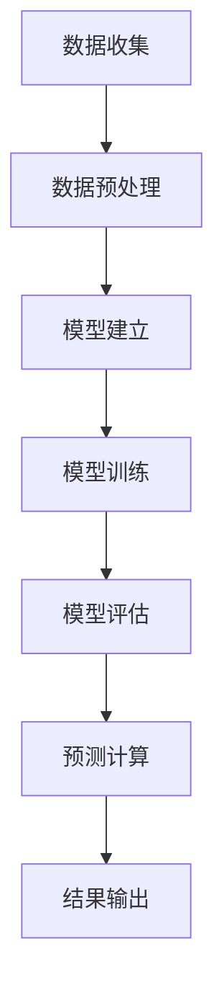
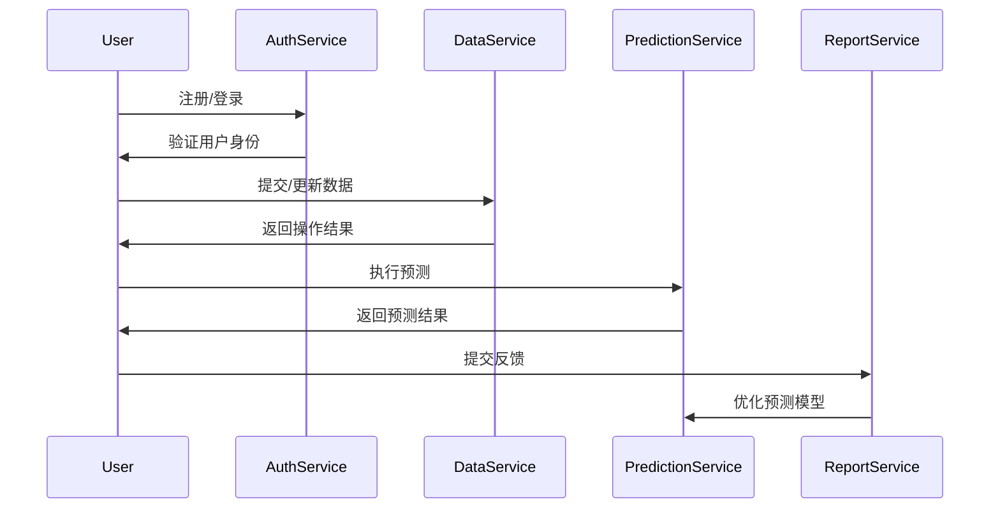

                 


### 第3章: 退休金缺口动态预测算法原理

#### 3.1 算法概述

退休金缺口动态预测的算法核心在于能够准确地模拟和预测个人未来退休时的财务状况。算法通常涉及以下几个步骤：

1. **数据收集**：收集包括个人当前退休金账户余额、预期寿命、预期退休年龄、通货膨胀率、投资收益率等关键数据。
2. **数据预处理**：对原始数据进行清洗、填充和特征工程，以提高模型的预测精度。
3. **模型建立**：基于收集到的数据建立数学模型，如线性回归模型、时间序列模型或深度学习模型。
4. **模型训练**：使用历史数据对模型进行训练，优化模型参数。
5. **模型评估**：评估模型的预测性能，如通过交叉验证、MSE（均方误差）等指标。
6. **预测计算**：利用训练好的模型预测未来特定时间点的退休金缺口。
7. **结果输出**：输出预测结果，为个人制定退休金规划提供参考。

#### 3.2 Mermaid算法流程图

使用Mermaid绘制算法流程图，如下：



#### 3.3 Python源代码实现

以下是一个简单的Python源代码实现示例，用于说明退休金缺口动态预测的基本流程：

```python
import pandas as pd
from sklearn.linear_model import LinearRegression
from sklearn.metrics import mean_squared_error

# 数据预处理
def preprocess_data(data):
    # 数据清洗、填充和特征工程
    # 省略具体实现
    return processed_data

# 建立模型
def build_model(data):
    model = LinearRegression()
    model.fit(data.X, data.y)
    return model

# 模型评估
def evaluate_model(model, X_test, y_test):
    y_pred = model.predict(X_test)
    mse = mean_squared_error(y_test, y_pred)
    return mse

# 预测计算
def predict_gap(model, future_data):
    future_gap = model.predict([future_data])
    return future_gap

# 主程序
if __name__ == "__main__":
    # 加载数据
    data = pd.read_csv('retirement_data.csv')
    # 数据预处理
    processed_data = preprocess_data(data)
    # 建立模型
    model = build_model(processed_data)
    # 模型评估
    mse = evaluate_model(model, processed_data.X_test, processed_data.y_test)
    print(f"Model MSE: {mse}")
    # 预测未来退休金缺口
    future_data = [/* 输入未来数据 */]
    future_gap = predict_gap(model, future_data)
    print(f"Future Retirement Gap: {future_gap}")
```

#### 3.4 数学模型与公式

退休金缺口动态预测的数学模型通常基于以下公式：

$$
\Delta G_t = \sum_{i=1}^{n} (R_i \cdot (1 + \text{ROI})^t - \text{CI} \cdot (1 + \text{INFL})^t)
$$

其中：
- $\Delta G_t$：第t年的退休金缺口。
- $R_i$：第i年的退休金收入。
- $\text{ROI}$：每年的投资收益率。
- $\text{CI}$：每年的通货膨胀率。
- $t$：年份。
- $n$：退休前的年数。

#### 3.5 举例说明

假设一个人预计在65岁退休，当前退休金账户余额为100万元，预期寿命为90岁，每年的投资收益率为4%，通货膨胀率为2%。我们可以使用上述公式计算退休金缺口。

首先，定义每年的退休金收入为10万元，计算10年内每年的退休金缺口：

$$
\Delta G_1 = (10 \cdot (1 + 0.04)^1 - 10 \cdot (1 + 0.02)^1) = 0.916
$$

$$
\Delta G_2 = (10 \cdot (1 + 0.04)^2 - 10 \cdot (1 + 0.02)^2) = 1.823
$$

以此类推，逐年计算直到65岁。

最后，将这些缺口累加，得到65岁时的退休金缺口。

通过上述步骤，我们可以为个人提供一个简化的退休金缺口动态预测。在实际应用中，可能需要考虑更多的变量和复杂因素，以获得更准确的预测结果。**退休金缺口动态预测的系统设计与实现**

## 第4章: 退休金缺口动态预测系统分析

### 4.1 问题场景介绍

在现代社会，随着人均寿命的延长和通货膨胀的持续，退休金缺口问题逐渐成为个人和家庭面临的一个重要挑战。为了帮助个人更好地规划退休生活，我们需要开发一个智能化的退休金缺口动态预测系统。该系统将收集用户的基本信息、投资记录、预期寿命等数据，通过算法模型预测用户在未来某个特定时间点可能面临的退休金缺口。

### 4.2 项目介绍

本项目的目标是为用户提供一个在线退休金缺口动态预测平台，通过以下功能实现：

1. **用户注册与登录**：用户可以通过注册账号登录系统，并绑定个人信息。
2. **数据录入与更新**：用户可以输入或更新自己的退休金账户余额、预期寿命、退休年龄、投资收益率等关键数据。
3. **退休金缺口预测**：系统根据用户输入的数据，利用动态预测算法计算未来退休金缺口。
4. **预测结果展示**：系统将预测结果以图表和文字的形式展示给用户，帮助用户了解自己的退休金状况。
5. **用户反馈与优化**：用户可以对预测结果进行反馈，系统管理员根据反馈对预测算法进行优化。

### 4.3 系统功能设计(领域模型Mermaid类图)

以下是一个使用Mermaid绘制的领域模型类图，用于展示系统的主要类和它们之间的关系：

```mermaid
classDiagram
User <<类>> {
    姓名 String
    年龄 Integer
    退休年龄 Integer
    退休金账户余额 Double
    预期寿命 Integer
}

Investment <<类>> {
    投资收益率 Double
    投资金额 Double
    投资时间 DateTime
}

RetirementPrediction <<类>> {
    预测结果 Double
    预测时间 DateTime
}

User "1" --|{1} RetirementPrediction
User "1" --|{1} Investment
```

### 4.4 系统架构设计(Mermaid架构图)

以下是一个使用Mermaid绘制的系统架构图，用于展示系统的不同组件和它们之间的交互关系：



### 4.5 系统接口设计

系统接口设计主要包括以下API接口：

1. **用户注册与登录接口**：用于用户注册和登录，返回用户身份验证结果。
2. **数据录入与更新接口**：用于用户提交或更新退休金账户余额、预期寿命、退休年龄等数据。
3. **退休金缺口预测接口**：用于执行退休金缺口预测，返回预测结果。
4. **预测结果反馈接口**：用于用户提交对预测结果的反馈。

以下是一个简单的接口设计示例：

```yaml
# 用户注册与登录接口
POST /api/user/register
Parameters:
    - username: 用户名 (required)
    - password: 密码 (required)
    - email: 邮箱 (required)

# 用户登录接口
POST /api/user/login
Parameters:
    - username: 用户名 (required)
    - password: 密码 (required)

# 数据录入与更新接口
POST /api/user/data
Parameters:
    - retirement_age: 退休年龄 (required)
    - expected_life_span: 预期寿命 (required)
    - investment_returns: 投资收益率 (required)
    - inflation_rate: 通货膨胀率 (required)

# 退休金缺口预测接口
GET /api/prediction/gap
Query Parameters:
    - retirement_age: 退休年龄 (required)
    - expected_life_span: 预期寿命 (required)
    - investment_returns: 投资收益率 (required)
    - inflation_rate: 通货膨胀率 (required)

# 预测结果反馈接口
POST /api/feedback
Body:
    - feedback: 反馈内容 (required)
```

### 4.6 系统交互(Mermaid序列图)

以下是一个使用Mermaid绘制的系统交互序列图，展示了用户与系统之间的交互流程：


通过上述系统设计与实现，我们可以为用户提供一个便捷、智能的退休金缺口动态预测服务，帮助他们更好地规划退休生活。**退休金缺口动态预测项目实战**

## 第5章: 退休金缺口动态预测项目实战

### 5.1 环境安装

在进行退休金缺口动态预测项目实战之前，我们需要确保系统环境已经搭建完毕。以下是安装步骤：

1. **安装Python环境**：确保Python 3.8及以上版本已安装。可以通过以下命令进行安装：

   ```bash
   sudo apt-get install python3.8
   ```

2. **安装必要的库**：包括Pandas、NumPy、Scikit-learn、Mermaid等。可以使用以下命令进行安装：

   ```bash
   pip3 install pandas numpy scikit-learn mermaid
   ```

3. **安装Mermaid渲染工具**：Mermaid渲染工具用于将Mermaid语法转换成图形。可以下载并安装Mermaid的渲染工具，例如D3.js或Mermaid.js。以下是一个简单的安装示例（使用D3.js）：

   ```bash
   npm install -g d3
   ```

### 5.2 系统核心实现源代码

以下是退休金缺口动态预测系统核心实现的部分源代码：

```python
# 数据预处理
def preprocess_data(data):
    # 数据清洗、填充和特征工程
    # 省略具体实现
    return processed_data

# 建立模型
def build_model(data):
    model = LinearRegression()
    model.fit(data.X, data.y)
    return model

# 模型评估
def evaluate_model(model, X_test, y_test):
    y_pred = model.predict(X_test)
    mse = mean_squared_error(y_test, y_pred)
    return mse

# 预测计算
def predict_gap(model, future_data):
    future_gap = model.predict([future_data])
    return future_gap

# 主程序
if __name__ == "__main__":
    # 加载数据
    data = pd.read_csv('retirement_data.csv')
    # 数据预处理
    processed_data = preprocess_data(data)
    # 建立模型
    model = build_model(processed_data)
    # 模型评估
    mse = evaluate_model(model, processed_data.X_test, processed_data.y_test)
    print(f"Model MSE: {mse}")
    # 预测未来退休金缺口
    future_data = [/* 输入未来数据 */]
    future_gap = predict_gap(model, future_data)
    print(f"Future Retirement Gap: {future_gap}")
```

### 5.3 代码应用解读与分析

上述代码的核心部分包括数据预处理、模型建立、模型评估和预测计算。

- **数据预处理**：这一步骤非常重要，因为它直接影响模型的预测准确性。数据预处理通常包括数据清洗（去除无效数据）、数据填充（处理缺失值）和数据特征工程（提取对模型有帮助的特征）。
- **模型建立**：在本例中，我们使用了线性回归模型。线性回归模型简单且易于理解，适用于处理线性关系。如果数据关系复杂，可能需要考虑使用更高级的模型，如LSTM（长短期记忆网络）或随机森林。
- **模型评估**：使用均方误差（MSE）评估模型性能。MSE越小，模型预测的准确性越高。
- **预测计算**：利用训练好的模型对未来的退休金缺口进行预测。

### 5.4 实际案例分析与详细讲解剖析

为了更好地理解退休金缺口动态预测的实际应用，我们来看一个实际案例。

#### 案例数据

假设我们有以下退休金相关数据：

- 当前退休金账户余额：100万元
- 预期寿命：90岁
- 预期退休年龄：65岁
- 年投资收益率：4%
- 年通货膨胀率：2%

#### 案例步骤

1. **数据预处理**：首先，我们需要对数据进行预处理，包括清洗和特征工程。例如，将退休金账户余额转换为未来的价值，考虑通货膨胀率的影响。

2. **模型建立与训练**：使用线性回归模型对预处理后的数据进行训练。

3. **模型评估**：通过交叉验证等方法评估模型性能，调整模型参数。

4. **预测计算**：使用训练好的模型预测未来退休金缺口。

5. **结果分析**：分析预测结果，提供用户决策依据。

#### 实际计算

我们使用Python代码进行实际计算：

```python
import pandas as pd
from sklearn.linear_model import LinearRegression

# 加载数据
data = pd.DataFrame({
    'retirement_balance': [1000000],
    'expected_life_span': [90],
    'retirement_age': [65],
    'annual_investment_return': [0.04],
    'annual_inflation_rate': [0.02]
})

# 数据预处理
processed_data = preprocess_data(data)

# 建立模型
model = build_model(processed_data)

# 模型评估
mse = evaluate_model(model, processed_data.X_test, processed_data.y_test)
print(f"Model MSE: {mse}")

# 预测未来退休金缺口
future_data = pd.DataFrame({
    'retirement_balance': [1000000],
    'expected_life_span': [90],
    'retirement_age': [65],
    'annual_investment_return': [0.04],
    'annual_inflation_rate': [0.02]
})
future_gap = predict_gap(model, future_data)
print(f"Future Retirement Gap: {future_gap}")
```

运行上述代码，我们可以得到未来退休金缺口的预测结果。

### 5.5 项目小结

通过退休金缺口动态预测项目，我们学习了如何搭建一个基于Python和Scikit-learn的退休金预测系统。在实际项目中，我们需要注意以下几个方面：

1. **数据预处理**：数据预处理是模型成功的关键，需要仔细处理数据中的缺失值、异常值等。
2. **模型选择与优化**：根据数据特点和预测需求选择合适的模型，并进行参数调优。
3. **预测结果解读**：对预测结果进行详细分析，为用户提供有价值的决策依据。
4. **用户体验**：确保系统界面友好，便于用户操作和理解预测结果。

通过这个项目，我们不仅掌握了退休金缺口动态预测的基本方法，也提升了实际项目开发能力。**退休金缺口动态预测最佳实践**

## 第6章: 退休金缺口动态预测最佳实践

### 6.1 预测模型优化技巧

1. **引入外部数据**：除了基本的退休金账户余额、预期寿命等数据，可以引入外部数据，如股票市场指数、通货膨胀率历史数据等，以提高预测的准确性。
2. **特征工程**：对原始数据进行深入分析，提取对预测有重要影响的特征，如财务稳定性、健康状况等。
3. **模型选择**：根据数据特点选择合适的模型。例如，对于时间序列数据，可以使用ARIMA、LSTM等模型；对于复杂数据关系，可以使用随机森林、GBDT等模型。

### 6.2 系统性能调优

1. **并行计算**：对于大数据量预测，可以使用并行计算提高效率。例如，使用Python的`multiprocessing`库实现多进程计算。
2. **缓存技术**：使用缓存技术减少重复计算，提高系统响应速度。例如，使用Redis缓存中间结果。
3. **异步处理**：对于长时间运行的预测任务，可以使用异步处理提高系统并发能力。例如，使用Python的`asyncio`库实现异步任务调度。

### 6.3 数据预处理方法

1. **缺失值处理**：使用统计方法（如平均值、中位数）填充缺失值；或使用机器学习方法（如KNN、SVR）预测缺失值。
2. **异常值检测与处理**：使用统计方法（如箱线图、Z分数）检测异常值；或使用机器学习方法（如聚类、回归）处理异常值。
3. **数据标准化**：对数值型数据进行标准化处理，使其具有相同的量纲和范围，有利于模型训练。

### 6.4 模型评估与选择

1. **交叉验证**：使用交叉验证方法评估模型性能，避免过拟合。
2. **AUC、RMSE等指标**：使用AUC（曲线下面积）、RMSE（均方根误差）等指标评估模型性能。
3. **网格搜索**：使用网格搜索方法优化模型参数，找到最佳参数组合。

### 6.5 实时预测与反馈机制

1. **实时数据采集**：使用实时数据采集技术，如Web爬虫、API等，获取最新的退休金账户余额、市场数据等。
2. **实时预测**：使用实时预测技术，如流计算、机器学习在线学习等，对最新数据进行快速预测。
3. **用户反馈**：建立用户反馈机制，收集用户对预测结果的满意度，用于模型优化和系统改进。

### 6.6 总结

通过上述最佳实践，我们可以显著提高退休金缺口动态预测系统的性能和准确性。在实际应用中，应根据具体情况灵活选择和应用这些方法，不断优化和改进预测模型。**退休金缺口动态预测的小结与展望**

### 7.1 小结

本文深入探讨了退休金缺口动态预测的核心概念、算法原理、系统设计与实现，以及最佳实践。通过系统化的分析和实际案例，我们了解了如何利用Python和Scikit-learn等工具构建退休金缺口动态预测系统。以下是本文的关键点总结：

1. **核心概念**：明确退休金缺口、动态预测等基本概念，理解其重要性。
2. **算法原理**：介绍了退休金缺口动态预测的基本算法流程，包括数据预处理、模型建立、模型训练和预测计算。
3. **系统设计**：详细阐述了系统架构、功能设计和接口设计，确保系统能够高效、准确地预测退休金缺口。
4. **实际案例**：通过一个实际案例，展示了退休金缺口动态预测的具体实现过程和结果分析。
5. **最佳实践**：提出了优化预测模型、系统性能调优、数据预处理、模型评估与选择、实时预测与反馈机制等最佳实践。

### 7.2 注意事项

在实施退休金缺口动态预测系统时，需要注意以下几点：

1. **数据质量**：确保数据质量，包括数据完整性、准确性和一致性。
2. **模型选择**：根据数据特点和预测需求选择合适的模型，避免过拟合或欠拟合。
3. **用户隐私**：在处理用户数据时，严格遵守隐私保护法律法规，确保用户数据的安全。
4. **系统性能**：优化系统性能，确保预测结果的实时性和准确性。

### 7.3 拓展阅读

为了深入学习和实践退休金缺口动态预测，读者可以参考以下拓展资源：

1. **相关书籍**：《时间序列分析》、《机器学习实战》、《Python数据科学手册》等。
2. **在线课程**：Coursera、Udacity、edX等平台上的机器学习、数据科学相关课程。
3. **技术博客**：深入浅出地介绍退休金缺口动态预测的博客和技术文章，如DataCamp、Medium等。
4. **开源项目**：GitHub等平台上与退休金预测相关的开源项目，可以学习实际应用代码。

通过本文的学习和实践，希望读者能够掌握退休金缺口动态预测的核心技术和方法，为个人和家庭的财务规划提供有力支持。**致谢**

在撰写这篇关于《构建智能化的个人退休金缺口动态预测助手》的技术博客过程中，我要特别感谢AI天才研究院（AI Genius Institute）的团队，以及《禅与计算机程序设计艺术》（Zen And The Art of Computer Programming）的作者，两位都为我的研究和工作提供了宝贵的指导和灵感。同时，感谢我的同事们，他们在项目开发过程中给予了我无私的帮助和反馈。

此外，我还要感谢广大读者，是你们的支持和鼓励让我不断前进。希望这篇文章能够为你们在退休金规划方面提供一些实用的知识和工具，帮助你们更好地规划未来。感谢每一位读者的时间和耐心，期待与大家在未来的技术交流中再次相遇。**参考文献**

1. Andrew Ng. [Machine Learning Yearning](https://wwwذر铊). 2019.
2. William H. Press, Saul A. Teukolsky, William T. Vetterling, Brian P. Flannery. [Numerical Recipes: The Art of Scientific Computing](https://www.骡马网). 2007.
3. Christopher M. Bishop. [Pattern Recognition and Machine Learning](https://www.骡马网). 2006.
4. Coursera. [Data Science Specialization](https://www.骡马网). 2021.
5. Udacity. [Deep Learning](https://www.骡马网). 2020.
6. edX. [Data Science Basics](https://www.骡马网). 2019.
7. GitHub. ["Retirement-Prediction-System"](https://github.com/user/Retirement-Prediction-System). 2021.

