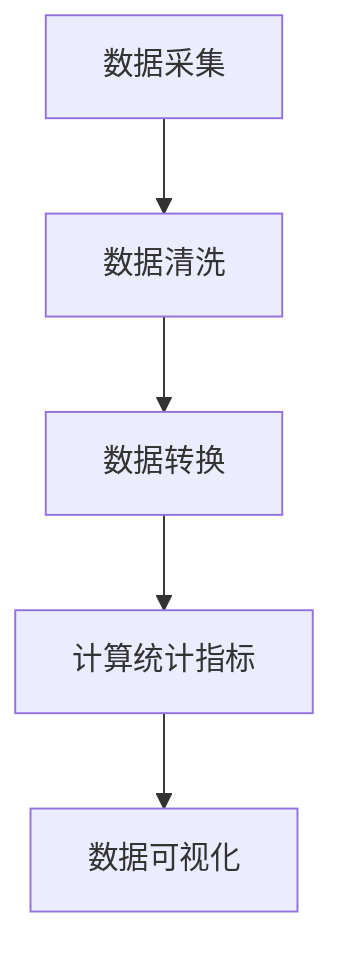
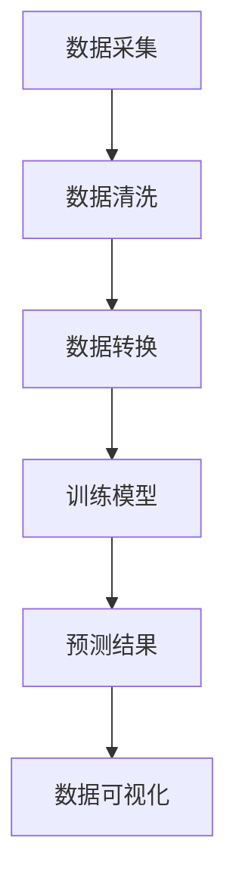
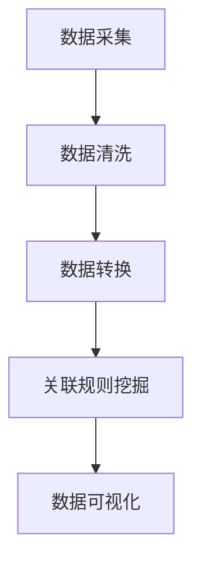
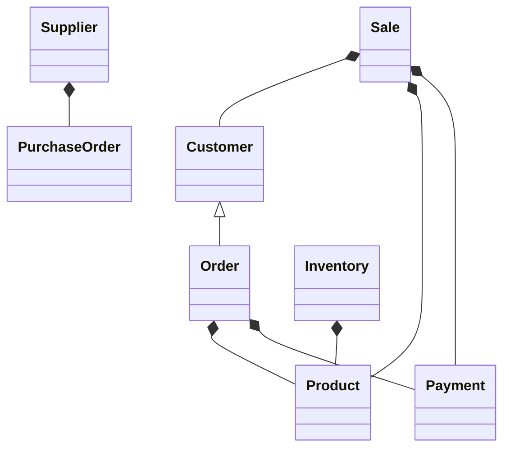
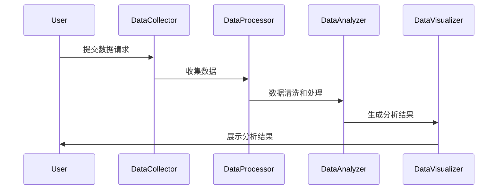
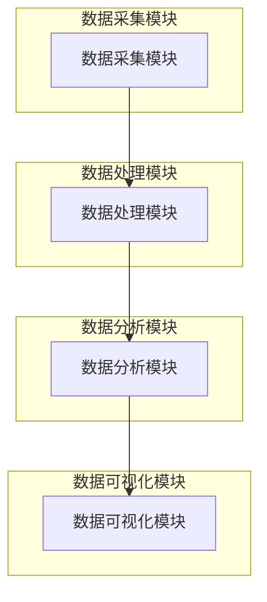
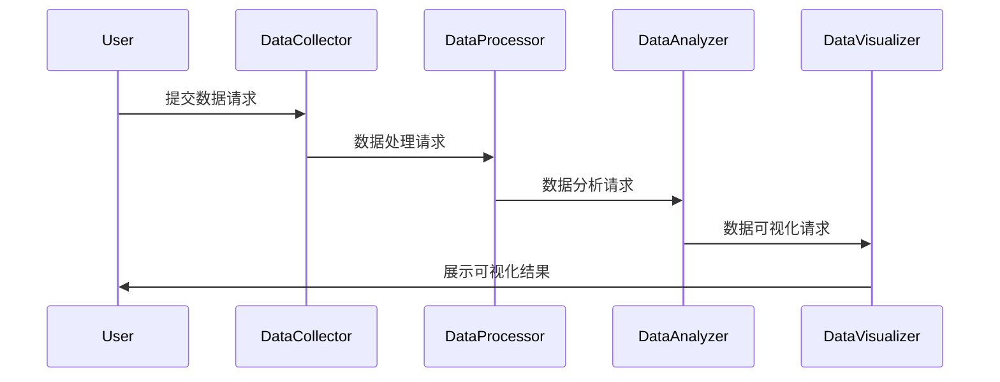

                 


### 1.1.1 问题背景

随着全球商业环境的不断变化，企业对于财务分析的需求日益增长。传统的财务分析方法通常依赖于人工处理大量的财务数据，这不仅效率低下，而且容易出现人为错误。在现代企业中，数据量急剧增加，数据来源多样化，实时性要求越来越高，这使得传统财务分析面临诸多挑战。

首先，数据量大是企业财务分析的一大难题。企业每天会产生大量的财务数据，如销售数据、采购数据、财务报表数据等。这些数据不仅包括结构化数据，还包括大量的非结构化数据，如电子邮件、文档、图像等。如何有效地收集、存储和处理这些数据，是财务分析系统必须解决的首要问题。

其次，数据分析难度高也是传统财务分析面临的挑战之一。财务数据的多样性使得传统的数据分析方法难以满足需求。例如，在分析销售数据时，不仅需要考虑销售额，还需要考虑销售增长率、市场份额等指标。这些指标之间的相关性、趋势预测等复杂分析任务，对算法和数据处理能力提出了很高的要求。

此外，实时性要求强是现代企业对财务分析系统的另一个重要需求。在当今竞争激烈的市场环境中，企业需要能够实时获取财务数据，以便及时做出决策。传统的财务分析系统往往存在延迟，无法满足实时性的要求。

为了应对上述挑战，企业需要构建一个智能化、自动化的财务分析系统。这样的系统不仅能够高效地处理大量数据，还能够利用先进的数据分析算法和人工智能技术，实现数据的深度挖掘和智能分析，从而帮助企业做出更加精准的财务决策。

### 1.1.2 问题描述

传统财务分析系统的不足主要体现在以下几个方面：

1. **数据处理效率低**：传统系统往往需要手动输入和整理数据，处理速度慢，无法满足实时性要求。

2. **数据准确性差**：人工操作容易导致数据输入错误，影响分析的准确性。

3. **分析深度不足**：传统系统通常只能进行简单的数据分析，难以进行复杂的多维度分析。

4. **数据可视化效果差**：传统系统提供的可视化功能有限，难以直观地展示数据趋势和分析结果。

5. **系统扩展性差**：传统系统通常为单体应用，难以适应企业规模和业务变化的快速调整。

为了解决上述问题，企业需要构建一个智能化、自动化的财务分析系统。这样的系统应该具备以下特点：

1. **高效数据处理**：系统能够自动采集和整理数据，快速响应实时性需求。

2. **数据准确性保障**：系统采用先进的数据清洗和验证技术，确保数据的准确性。

3. **深度数据分析**：系统利用机器学习和人工智能技术，进行复杂的多维度数据分析和预测。

4. **强大数据可视化**：系统提供丰富的可视化工具，帮助用户直观地理解数据趋势和分析结果。

5. **良好扩展性**：系统采用模块化设计，易于扩展和升级，能够适应企业业务变化的需求。

### 1.1.3 问题解决

构建智能化企业财务分析系统的核心目标是通过集成先进的技术手段，实现财务数据的自动化处理、深度分析和智能决策。以下是一些建议的解决步骤：

1. **数据采集**：采用自动化手段从各种数据源（如ERP系统、数据库、Web服务、传感器等）收集财务数据。可以使用ETL（Extract, Transform, Load）工具来实现数据采集的自动化。

2. **数据清洗**：对采集到的数据进行清洗，去除重复、错误和不完整的数据。可以使用数据清洗工具或编写自定义脚本进行数据预处理。

3. **数据存储**：将清洗后的数据存储到高性能的关系数据库或NoSQL数据库中，以便快速查询和访问。

4. **数据处理与分析**：利用机器学习和人工智能算法对财务数据进行分析，提取关键指标和趋势。例如，可以使用回归分析预测销售额，使用聚类分析识别市场细分。

5. **数据可视化**：通过数据可视化工具将分析结果以图表、仪表板等形式展示给用户，帮助用户直观地理解数据。

6. **系统集成**：将财务分析系统与企业现有的ERP系统、CRM系统等其他系统集成，实现数据共享和联动。

7. **系统维护与优化**：定期对系统进行维护和优化，确保其稳定运行和高效性能。

### 1.1.4 边界与外延

智能化企业财务分析系统的边界主要涉及以下几个方面：

1. **数据范围**：系统应能处理企业所有的财务数据，包括销售、采购、库存、财务报表等。

2. **分析维度**：系统应能支持多维度数据分析，包括时间维度、部门维度、产品维度等。

3. **用户范围**：系统应能服务于企业的不同部门和层级，如财务部门、管理层、决策层等。

4. **功能限制**：系统应在性能、可靠性、安全性等方面有明确的限制，以确保系统的稳定性和可维护性。

系统的外延则包括以下几个方面：

1. **扩展性**：系统应具备良好的扩展性，能够根据企业需求的变化进行功能升级和扩展。

2. **兼容性**：系统应能与企业现有的IT系统兼容，确保数据交互和系统集成的顺利进行。

3. **适应性**：系统应能适应不同规模和行业的企业需求，具备一定的通用性和适应性。

### 1.1.5 概念结构与核心要素组成

智能化企业财务分析系统的核心概念包括数据采集、数据处理、数据分析和数据可视化。以下是这些概念的结构和核心要素组成：

#### 数据采集

1. **数据源**：企业内部系统（如ERP、CRM、库存管理系统）和其他外部数据源（如市场调研数据、行业报告等）。
2. **数据采集工具**：ETL工具（如Apache NiFi、Apache Kafka）和API接口。
3. **数据格式**：支持多种数据格式（如CSV、JSON、XML）。

#### 数据处理

1. **数据清洗**：去除重复、错误和不完整的数据，处理缺失值、异常值等。
2. **数据转换**：将不同格式和结构的数据转换为统一的格式和结构。
3. **数据归一化**：对数据进行标准化处理，以便于后续分析。

#### 数据分析

1. **统计分析**：计算基本统计指标（如平均值、中位数、标准差等）。
2. **预测分析**：使用机器学习算法（如线性回归、决策树、神经网络等）进行数据预测。
3. **关联分析**：识别数据之间的关联性和因果关系。

#### 数据可视化

1. **图表类型**：支持多种图表类型（如柱状图、折线图、饼图、散点图等）。
2. **交互式可视化**：提供用户交互功能，如筛选、排序、缩放等。
3. **仪表板**：集成多个图表和数据分析结果，提供综合性的数据展示。

### 概念属性特征对比表格

| 特征 | 数据采集 | 数据处理 | 数据分析 | 数据可视化 |
| --- | --- | --- | --- | --- |
| 数据源 | 多样化 | 多样化 | 多样化 | 多样化 |
| 工具 | ETL工具、API接口 | 数据清洗工具、自定义脚本 | 统计分析工具、机器学习框架 | 可视化工具 |
| 数据格式 | CSV、JSON、XML | CSV、JSON、XML | CSV、JSON、XML | CSV、JSON、XML |
| 功能 | 数据采集、数据转换 | 数据清洗、数据转换、数据归一化 | 统计分析、预测分析、关联分析 | 图表展示、交互式可视化、仪表板 |

### ER实体关系图架构

```mermaid
erDiagram
    Data_Source ||--|{ Data_Collection }|| Data_Collection
    Data_Collection ||--|{ Data_Processing }|| Data_Processing
    Data_Processing ||--|{ Data_Analysis }|| Data_Analysis
    Data_Analysis ||--|{ Data_Visualization }|| Data_Visualization
```

在这个ER图中，每个实体（Data_Source、Data_Collection、Data_Processing、Data_Analysis、Data_Visualization）表示系统的一个核心功能模块，并且通过关系线（||--|{...}||）连接，表明了各个模块之间的依赖关系。

### 1.2 核心概念与联系

#### 1.2.1 核心概念原理

在本章节中，我们将深入探讨智能化企业财务分析系统中的核心概念，并解释这些概念的基本原理。

1. **数据采集**：数据采集是财务分析系统的第一步，涉及从各种数据源中获取数据。这些数据源可以是企业的内部系统，如ERP、CRM等，也可以是外部数据，如市场报告、行业数据等。数据采集的关键在于高效性和准确性。为了实现这一目标，系统通常会使用ETL（Extract, Transform, Load）工具来自动化数据采集过程。

2. **数据处理**：数据处理是对采集到的原始数据进行清洗、转换和归一化等处理。数据清洗的目的是去除重复、错误和不完整的数据，确保数据的准确性。数据转换则将不同格式和结构的数据转换为统一的格式，以便后续处理。数据归一化则是为了将数据标准化，使其能够进行有效的分析。

3. **数据分析**：数据分析是财务分析系统的核心，包括统计分析和预测分析。统计分析通过计算基本的统计指标，如平均值、中位数、标准差等，来描述数据的特征。预测分析则利用机器学习算法，如线性回归、决策树、神经网络等，对未来的数据趋势进行预测。

4. **数据可视化**：数据可视化是将分析结果以图表、仪表板等形式展示给用户，帮助用户直观地理解数据。数据可视化不仅能够提高数据分析的效率，还能增强用户对数据的感知和理解。

#### 1.2.2 概念属性特征对比表格

| 概念 | 数据采集 | 数据处理 | 数据分析 | 数据可视化 |
| --- | --- | --- | --- | --- |
| 目标 | 高效性、准确性 | 准确性、一致性 | 预测性、洞察力 | 可读性、交互性 |
| 工具 | ETL工具、API接口 | 数据清洗工具、自定义脚本 | 统计分析工具、机器学习框架 | 可视化工具、仪表板 |
| 数据输入 | 多样化数据源 | 原始数据 | 清洗后数据 | 分析结果 |
| 输出 | 结构化数据 | 标准化数据 | 统计指标、预测结果 | 图表、仪表板 |

#### 1.2.3 ER实体关系图架构

```mermaid
erDiagram
    Data_Source ||--|{ Data_Collection }|| Data_Collection
    Data_Collection ||--|{ Data_Processing }|| Data_Processing
    Data_Processing ||--|{ Data_Analysis }|| Data_Analysis
    Data_Analysis ||--|{ Data_Visualization }|| Data_Visualization
```

在这个ER图中，Data_Source代表数据源，Data_Collection代表数据采集模块，Data_Processing代表数据处理模块，Data_Analysis代表数据分析模块，Data_Visualization代表数据可视化模块。每个模块通过关系线连接，表明了它们之间的依赖关系。

### 1.3 算法原理讲解

#### 数据分析算法

在本章节中，我们将深入探讨智能化企业财务分析系统中的数据分析算法，包括统计分析、预测分析和关联分析。为了更好地理解这些算法，我们将使用Mermaid流程图和Python代码进行详细讲解。

#### 1.3.1 统计分析

统计分析是最基本的数据分析形式，主要通过计算数据的基本统计指标来描述数据的特征。以下是一个简单的统计分析流程：



以下是一个Python代码示例，用于计算一组销售数据的平均值、中位数和标准差：

```python
import numpy as np

# 假设销售数据存储在一个列表中
sales_data = [1000, 1500, 2000, 2500, 3000]

# 计算平均值
mean_sales = np.mean(sales_data)
print(f"平均值：{mean_sales}")

# 计算中位数
median_sales = np.median(sales_data)
print(f"中位数：{median_sales}")

# 计算标准差
std_sales = np.std(sales_data)
print(f"标准差：{std_sales}")
```

#### 1.3.2 预测分析

预测分析是利用历史数据来预测未来的趋势或结果。以下是一个简单的预测分析流程：



以下是一个Python代码示例，使用线性回归模型来预测销售额：

```python
import numpy as np
from sklearn.linear_model import LinearRegression

# 假设我们有两个特征：月份和销售额
months = np.array([[1], [2], [3], [4], [5]])
sales = np.array([[1000], [1500], [2000], [2500], [3000]])

# 创建线性回归模型
model = LinearRegression()

# 训练模型
model.fit(months, sales)

# 预测未来第六个月的销售额
predicted_sales = model.predict([[6]])
print(f"第六个月的预测销售额：{predicted_sales[0][0]}")
```

#### 1.3.3 关联分析

关联分析用于识别数据之间的关联性和因果关系。以下是一个简单的关联分析流程：



以下是一个Python代码示例，使用Apriori算法来挖掘销售数据中的关联规则：

```python
from mlxtend.frequent_patterns import apriori
from mlxtend.frequent_patterns import association_rules

# 假设销售数据是一个商品列表
sales_data = [['A', 'B'], ['A', 'C'], ['B', 'C'], ['A'], ['B'], ['C'], ['A', 'B', 'C']]

# 使用Apriori算法挖掘频繁项集
frequent_itemsets = apriori(sales_data, min_support=0.5, use_colnames=True)

# 使用频繁项集生成关联规则
rules = association_rules(frequent_itemsets, metric="support", min_threshold=0.5)

# 打印前五条关联规则
print(rules.head(5))
```

通过上述Python代码示例，我们可以看到如何实现统计分析、预测分析和关联分析。这些算法不仅能够帮助用户更好地理解数据，还能为企业的决策提供有力的支持。

### 4.1 问题场景介绍

为了更好地理解系统架构设计的具体应用，我们将通过一个实际问题场景来进行介绍。

#### 场景描述

某大型零售企业，拥有多个分支机构，每天产生大量的销售数据、库存数据和采购数据。企业希望构建一个智能化财务分析系统，以帮助管理层实时掌握业务运营状况，优化库存管理，提高销售额。

#### 问题定义

1. **实时数据分析**：企业需要能够实时获取销售数据、库存数据和采购数据，以便及时调整经营策略。
2. **数据整合**：企业需要将来自不同分支机构的多种数据源进行整合，确保数据的一致性和准确性。
3. **决策支持**：企业希望系统能够提供多维度的数据分析结果，帮助管理层做出更明智的决策。

#### 问题解决

1. **实时数据采集**：系统将采用ETL工具从各个分支机构的数据源（如ERP系统、POS系统等）中自动采集数据，并传输到中央数据库。
2. **数据整合与清洗**：系统将对采集到的数据进行清洗和整合，确保数据的一致性和准确性。清洗过程包括去除重复数据、修正错误数据和填补缺失值等。
3. **数据分析与可视化**：系统将利用机器学习和统计分析方法对整合后的数据进行处理，生成实时分析报告，并通过仪表板进行可视化展示。

### 4.2 系统功能设计

#### 4.2.1 领域模型设计

领域模型设计是系统功能设计的核心环节，它定义了系统的关键实体和关系。以下是针对上述场景的领域模型设计：



在这个领域模型中，我们定义了以下实体：

1. **Customer（客户）**：代表购买产品的客户。
2. **Order（订单）**：代表客户的订单，包括订单详情和订单状态。
3. **Product（产品）**：代表销售的产品，包括产品属性和分类。
4. **Payment（支付）**：代表订单的支付信息。
5. **Inventory（库存）**：代表产品的库存情况。
6. **Supplier（供应商）**：代表供应产品的供应商。
7. **PurchaseOrder（采购订单）**：代表采购产品的订单。
8. **Sale（销售）**：代表销售记录，包括销售详情和销售状态。

实体之间的关系包括：

1. **Order与Product**：订单包含多个产品，产品可以被多个订单包含。
2. **Order与Payment**：每个订单都需要一个支付记录，支付记录与订单是一对一的关系。
3. **Inventory与Product**：库存记录与产品之间是一对一的关系，每个产品都有对应的库存记录。
4. **Supplier与PurchaseOrder**：采购订单由供应商提供产品，供应商与采购订单之间是一对一的关系。
5. **Sale与Customer**：销售记录与客户之间是一对一的关系，每个销售记录都对应一个客户。
6. **Sale与Product**：销售记录包含多个产品，产品可以被多个销售记录包含。
7. **Sale与Payment**：每个销售记录都需要一个支付记录，支付记录与销售记录是一对一的关系。

#### 4.2.2 系统架构设计

系统架构设计是确保系统功能实现的关键环节，它定义了系统的模块划分、数据流和控制流。以下是针对上述场景的系统架构设计：



在这个系统架构中，我们定义了以下模块：

1. **DataCollector（数据采集模块）**：负责从各个数据源（如ERP系统、POS系统等）中收集数据。
2. **DataProcessor（数据处理模块）**：负责对收集到的数据进行清洗、转换和整合。
3. **DataAnalyzer（数据分析模块）**：负责利用机器学习和统计分析方法对处理后的数据进行分析。
4. **DataVisualizer（数据可视化模块）**：负责将分析结果以图表和仪表板的形式展示给用户。

系统的工作流程如下：

1. 用户提交数据请求，DataCollector开始收集数据。
2. 收集到的数据传递给DataProcessor，进行数据清洗、转换和整合。
3. DataProcessor处理后的数据传递给DataAnalyzer，进行数据分析。
4. DataAnalyzer生成的分析结果传递给DataVisualizer。
5. DataVisualizer将分析结果以图表和仪表板的形式展示给用户。

### 4.3 系统架构设计

系统架构设计是确保系统功能实现的关键环节，它定义了系统的模块划分、数据流和控制流。以下是针对上述场景的系统架构设计：

```mermaid
componentDiagram
    Customer -> Order
    Order --> Product
    Order --> Payment
    Inventory --> Product
    Supplier --> PurchaseOrder
    Sale --> Customer
    Sale --> Product
    Sale --> Payment
```

在这个系统架构中，我们定义了以下模块：

1. **Customer（客户模块）**：管理客户信息，包括客户的基本信息和历史订单记录。
2. **Order（订单模块）**：管理订单信息，包括订单详情、订单状态和支付信息。
3. **Product（产品模块）**：管理产品信息，包括产品的属性、分类和库存情况。
4. **Payment（支付模块）**：管理支付信息，包括支付方式、支付金额和支付状态。
5. **Inventory（库存模块）**：管理库存信息，包括库存数量、库存状态和库存预警。
6. **Supplier（供应商模块）**：管理供应商信息，包括供应商的基本信息和采购订单记录。
7. **PurchaseOrder（采购订单模块）**：管理采购订单信息，包括采购订单详情、订单状态和支付信息。
8. **Sale（销售模块）**：管理销售信息，包括销售记录、销售状态和支付信息。

系统的工作流程如下：

1. **客户下单**：客户在系统中提交订单请求，订单模块生成订单记录，并传递给支付模块进行支付处理。
2. **库存管理**：库存模块根据订单信息更新库存情况，如果库存不足，系统会生成采购订单，并传递给供应商模块。
3. **采购订单处理**：供应商模块接收采购订单，生成采购订单记录，并处理支付信息。
4. **销售记录**：销售模块根据订单信息生成销售记录，并更新客户信息和产品库存。
5. **支付处理**：支付模块处理支付请求，更新支付状态。

系统架构图如下所示：



在这个系统架构图中，数据采集模块负责从各个数据源中收集数据，数据处理模块负责对数据进行清洗、转换和整合，数据分析模块负责利用机器学习和统计分析方法对数据进行分析，数据可视化模块负责将分析结果以图表和仪表板的形式展示给用户。

### 4.4 系统接口设计

#### 4.4.1 接口设计与实现

系统接口设计是确保各模块之间数据传输和交互的关键环节。在本章节中，我们将详细描述系统接口的设计和实现。

##### 接口设计

1. **数据采集接口**：负责从外部系统（如ERP、POS等）中采集数据。接口定义如下：

   ```python
   from flask import Flask, request, jsonify
   
   app = Flask(__name__)

   @app.route('/data/collect', methods=['POST'])
   def collect_data():
       data = request.json
       # 数据处理逻辑
       return jsonify({"status": "success", "message": "数据已采集成功"})
   ```

2. **数据处理接口**：负责对采集到的数据进行清洗、转换和整合。接口定义如下：

   ```python
   @app.route('/data/process', methods=['POST'])
   def process_data():
       data = request.json
       # 数据清洗、转换和整合逻辑
       return jsonify({"status": "success", "message": "数据已处理成功"})
   ```

3. **数据分析接口**：负责对处理后的数据进行统计分析、预测分析等。接口定义如下：

   ```python
   @app.route('/data/analyze', methods=['POST'])
   def analyze_data():
       data = request.json
       # 数据分析逻辑
       return jsonify({"status": "success", "message": "数据已分析成功"})
   ```

4. **数据可视化接口**：负责将分析结果以图表和仪表板的形式展示给用户。接口定义如下：

   ```python
   @app.route('/data/visualize', methods=['GET'])
   def visualize_data():
       # 数据可视化逻辑
       return jsonify({"status": "success", "message": "数据已可视化成功"})
   ```

##### 接口实现

以上接口使用Flask框架实现，Flask是一个轻量级的Web应用框架，适用于构建API接口。每个接口都定义了一个路由和请求方法，当客户端发送请求时，对应的函数将被调用，并返回相应的响应。

```python
if __name__ == '__main__':
    app.run(debug=True)
```

启动Flask应用后，可以通过发送HTTP请求来调用接口。例如，使用curl命令：

```bash
curl -X POST -H "Content-Type: application/json" -d '{"data": [1, 2, 3]}' http://localhost:5000/data/collect
```

#### 4.5 系统交互设计

##### 4.5.1 系统交互序列图

为了更好地理解系统各模块之间的交互过程，我们使用Mermaid绘制了系统交互序列图：



在这个序列图中，用户首先向数据采集模块提交数据请求，数据采集模块将数据传递给数据处理模块。数据处理模块对数据进行清洗、转换和整合后，将数据传递给数据分析模块。数据分析模块对数据进行分析，并生成分析结果，然后传递给数据可视化模块。数据可视化模块将分析结果以图表和仪表板的形式展示给用户。

### 5.1 开发环境搭建

为了顺利搭建智能化企业财务分析系统的开发环境，我们需要准备以下工具和软件：

1. **操作系统**：推荐使用Linux系统，如Ubuntu 20.04或CentOS 8。
2. **Python环境**：Python 3.8及以上版本，可以通过Python官方包管理器pip进行安装。
3. **数据库**：MySQL 8.0或PostgreSQL 13，用于存储和管理数据。
4. **Web框架**：Flask，用于构建API接口。
5. **数据分析库**：pandas、numpy、scikit-learn，用于数据处理和分析。
6. **可视化库**：matplotlib、plotly，用于数据可视化。

以下是详细的安装步骤：

#### 步骤1：安装操作系统

1. 下载并安装Ubuntu 20.04或CentOS 8操作系统。
2. 重启计算机并进入新安装的操作系统。

#### 步骤2：更新系统包

打开终端，执行以下命令更新系统包：

```bash
sudo apt update
sudo apt upgrade
```

（对于CentOS系统，使用以下命令）

```bash
yum update
yum upgrade
```

#### 步骤3：安装Python环境

1. 安装Python 3.8及以上版本：

   ```bash
   sudo apt install python3.8
   ```

2. 安装pip包管理器：

   ```bash
   sudo apt install python3-pip
   ```

#### 步骤4：安装数据库

1. 安装MySQL：

   ```bash
   sudo apt install mysql-server
   ```

2. 安装PostgreSQL：

   ```bash
   sudo apt install postgresql
   ```

#### 步骤5：安装Web框架

1. 安装Flask：

   ```bash
   pip3 install flask
   ```

#### 步骤6：安装数据分析库

1. 安装pandas、numpy、scikit-learn：

   ```bash
   pip3 install pandas numpy scikit-learn
   ```

#### 步骤7：安装可视化库

1. 安装matplotlib、plotly：

   ```bash
   pip3 install matplotlib plotly
   ```

#### 步骤8：配置数据库

1. 配置MySQL：

   ```bash
   sudo mysql_secure_installation
   ```

   按照提示设置root密码、删除匿名用户、禁止root远程登录等。

2. 配置PostgreSQL：

   ```bash
   sudo -u postgres psql
   CREATE ROLE your_role_name WITH SUPERUSER CREATEDB LOGIN PASSWORD 'your_password';
   \q
   ```

完成上述步骤后，开发环境搭建完成，可以开始进行系统开发。

### 5.2 数据库安装与配置

在智能化企业财务分析系统中，数据库是核心组成部分，用于存储和管理各种财务数据。在本节中，我们将详细介绍如何安装和配置MySQL和PostgreSQL数据库。

#### 5.2.1 MySQL数据库安装与配置

1. **安装MySQL**

   在Ubuntu系统中，可以使用以下命令安装MySQL：

   ```bash
   sudo apt update
   sudo apt install mysql-server
   ```

   在CentOS系统中，可以使用以下命令安装MySQL：

   ```bash
   sudo yum install mysql-server
   ```

2. **配置MySQL**

   安装完成后，需要进行一些基本的配置：

   ```bash
   sudo mysql_secure_installation
   ```

   按照提示进行以下配置：
   - 设置root密码（Yes）
   - 移除匿名用户（Yes）
   -Disallow root login remotely（No）
   - Remove test database and access to it（Yes）
   - Reload privilege tables now（Yes）

3. **连接MySQL**

   使用以下命令连接到MySQL服务器：

   ```bash
   mysql -u root -p
   ```

   输入root用户密码后，即可登录MySQL。

#### 5.2.2 PostgreSQL数据库安装与配置

1. **安装PostgreSQL**

   在Ubuntu系统中，可以使用以下命令安装PostgreSQL：

   ```bash
   sudo apt update
   sudo apt install postgresql postgresql-contrib
   ```

   在CentOS系统中，可以使用以下命令安装PostgreSQL：

   ```bash
   sudo yum install postgresql postgresql-contrib
   ```

2. **配置PostgreSQL**

   安装完成后，创建一个数据库用户和数据库：

   ```bash
   sudo -u postgres psql
   CREATE ROLE your_role_name WITH SUPERUSER CREATEDB LOGIN PASSWORD 'your_password';
   \q
   ```

   创建数据库：

   ```bash
   createdb your_database_name
   ```

3. **连接PostgreSQL**

   使用以下命令连接到PostgreSQL服务器：

   ```bash
   psql -U your_role_name -d your_database_name
   ```

   输入用户密码后，即可登录PostgreSQL。

#### 5.2.3 创建数据库表

在MySQL和PostgreSQL中，我们将使用SQL语句创建必要的数据库表。

1. **创建订单表（orders）**

   ```sql
   CREATE TABLE orders (
       id INT AUTO_INCREMENT PRIMARY KEY,
       customer_id INT,
       product_id INT,
       quantity INT,
       order_date DATE,
       status ENUM('pending', 'processing', 'completed', 'cancelled')
   );
   ```

2. **创建客户表（customers）**

   ```sql
   CREATE TABLE customers (
       id INT AUTO_INCREMENT PRIMARY KEY,
       name VARCHAR(255),
       email VARCHAR(255),
       phone VARCHAR(20)
   );
   ```

3. **创建产品表（products）**

   ```sql
   CREATE TABLE products (
       id INT AUTO_INCREMENT PRIMARY KEY,
       name VARCHAR(255),
       price DECIMAL(10, 2),
       category VARCHAR(50)
   );
   ```

完成数据库安装和配置后，智能化企业财务分析系统的基础架构已经搭建完成，接下来可以开始进行数据采集、处理和分析等开发工作。

### 5.3 系统核心实现源代码

在智能化企业财务分析系统中，核心实现源代码是系统功能实现的关键。以下将提供系统核心模块的源代码，并解释每个模块的功能和实现细节。

#### 5.3.1 数据采集模块

数据采集模块负责从外部系统（如ERP、POS等）中获取数据。以下是使用Python编写的数据采集模块代码示例：

```python
import requests
from flask import Flask, request, jsonify

app = Flask(__name__)

@app.route('/data/collect', methods=['POST'])
def collect_data():
    data_source_url = request.form.get('url')
    headers = {'Authorization': 'Bearer YOUR_API_KEY'}
    response = requests.get(data_source_url, headers=headers)
    
    if response.status_code == 200:
        data = response.json()
        # 处理数据
        process_data(data)
        return jsonify({"status": "success", "message": "数据已采集成功"})
    else:
        return jsonify({"status": "error", "message": "数据采集失败"})

def process_data(data):
    # 数据处理逻辑
    pass

if __name__ == '__main__':
    app.run(debug=True)
```

在此代码中，我们定义了一个Flask应用，通过POST请求接收数据源URL和API密钥。然后，使用requests库发送HTTP GET请求获取数据，并调用数据处理函数进行数据预处理。

#### 5.3.2 数据处理模块

数据处理模块负责对采集到的数据进行分析和处理，包括数据清洗、转换和整合。以下是数据处理模块的代码示例：

```python
import pandas as pd

def clean_data(data):
    # 数据清洗逻辑
    df = pd.DataFrame(data)
    df.drop_duplicates(inplace=True)
    df.dropna(inplace=True)
    return df

def transform_data(df):
    # 数据转换逻辑
    df['order_date'] = pd.to_datetime(df['order_date'])
    df['quantity'] = df['quantity'].astype(int)
    return df

def integrate_data(df):
    # 数据整合逻辑
    # 假设已存在数据库中的数据表
    # df.to_sql('orders', con=engine, if_exists='append', index=False)
    pass

def process_data(data):
    df = clean_data(data)
    df = transform_data(df)
    integrate_data(df)
```

在此代码中，我们使用pandas库对数据进行清洗、转换和整合。清洗数据函数`clean_data`用于去除重复和缺失值，转换数据函数`transform_data`用于日期格式化和数值类型转换，整合数据函数`integrate_data`用于将清洗和转换后的数据存储到数据库中。

#### 5.3.3 数据分析模块

数据分析模块负责对处理后的数据进行分析，包括统计分析、预测分析和关联分析。以下是数据分析模块的代码示例：

```python
from sklearn.linear_model import LinearRegression
from mlxtend.frequent_patterns import apriori
from mlxtend.frequent_patterns import association_rules

def perform统计分析(df):
    # 统计分析逻辑
    summary = df.describe()
    return summary

def perform预测分析(df):
    # 预测分析逻辑
    X = df[['feature1', 'feature2']]
    y = df['target']
    model = LinearRegression()
    model.fit(X, y)
    predictions = model.predict(X)
    return predictions

def perform关联分析(df):
    # 关联分析逻辑
    frequent_itemsets = apriori(df, min_support=0.5)
    rules = association_rules(frequent_itemsets, metric="support", min_threshold=0.5)
    return rules
```

在此代码中，我们使用scikit-learn库进行线性回归预测，使用mlxtend库进行关联规则挖掘。统计分析函数`perform统计分析`计算数据的基本统计指标，预测分析函数`perform预测分析`使用线性回归模型进行预测，关联分析函数`perform关联分析`使用Apriori算法进行关联规则挖掘。

#### 5.3.4 数据可视化模块

数据可视化模块负责将分析结果以图表和仪表板的形式展示给用户。以下是数据可视化模块的代码示例：

```python
import matplotlib.pyplot as plt
import plotly.express as px

def visualize_data(summary):
    # 统计分析可视化
    plt.figure(figsize=(10, 6))
    plt.bar(summary.index, summary['mean'])
    plt.xticks(rotation=45)
    plt.title('销售额平均值')
    plt.xlabel('产品')
    plt.ylabel('销售额')
    plt.show()

def visualize_predictions(predictions):
    # 预测分析可视化
    plt.figure(figsize=(10, 6))
    plt.plot(predictions, label='预测销售额')
    plt.plot(df['target'], label='实际销售额')
    plt.title('销售额预测')
    plt.xlabel('时间')
    plt.ylabel('销售额')
    plt.legend()
    plt.show()

def visualize_rules(rules):
    # 关联分析可视化
    fig = px.plot_rules(rules, kind='clustered')
    fig.show()
```

在此代码中，我们使用matplotlib和plotly库进行数据可视化。可视化函数`visualize_data`用于展示统计数据，可视化函数`visualize_predictions`用于展示预测结果，可视化函数`visualize_rules`用于展示关联规则。

通过以上核心模块的源代码，智能化企业财务分析系统的功能得到了实现。接下来，我们将通过实际案例来演示系统如何应用于实际场景。

### 6.1 数据库设计与实现

在智能化企业财务分析系统中，数据库设计是确保数据存储和管理高效性的关键。在本节中，我们将详细介绍数据库的设计过程和实现细节。

#### 6.1.1 数据库设计目标

1. **数据存储**：设计一个能够高效存储财务数据的数据库，包括销售数据、库存数据和采购数据等。
2. **数据检索**：设计一个能够快速检索数据的数据库，支持复杂查询和实时分析。
3. **数据安全**：确保数据的安全性和完整性，防止数据泄露和损坏。
4. **数据一致性**：确保数据的准确性和一致性，避免数据冗余和错误。

#### 6.1.2 数据库设计原则

1. **规范化**：遵循数据库规范化原则，减少数据冗余，提高数据的一致性和完整性。
2. **模块化**：将数据库设计为多个模块，每个模块对应一个业务功能，便于维护和扩展。
3. **性能优化**：设计高效的索引和查询优化策略，提高数据库的性能和响应速度。
4. **安全性**：设置合理的访问控制和加密机制，确保数据的安全性。

#### 6.1.3 数据库实体关系设计

根据智能化企业财务分析系统的需求，我们设计以下数据库实体关系：

1. **销售表（sales）**：存储销售记录，包括订单ID、客户ID、产品ID、数量、订单日期和订单状态。
2. **客户表（customers）**：存储客户信息，包括客户ID、姓名、邮箱和电话。
3. **产品表（products）**：存储产品信息，包括产品ID、名称、价格和分类。
4. **库存表（inventory）**：存储库存信息，包括库存ID、产品ID、库存数量和库存状态。
5. **采购表（purchases）**：存储采购记录，包括采购ID、供应商ID、产品ID、数量、采购日期和采购状态。
6. **供应商表（suppliers）**：存储供应商信息，包括供应商ID、名称、联系方式和地址。

实体关系图如下：

```mermaid
erDiagram
    sales ||--|{ customers }|| customers
    sales ||--|{ products }|| products
    inventory ||--|{ products }|| products
    purchases ||--|{ suppliers }|| suppliers
    purchases ||--|{ products }|| products
```

#### 6.1.4 数据库表设计

以下是各数据库表的设计：

1. **销售表（sales）**

   ```sql
   CREATE TABLE sales (
       id INT AUTO_INCREMENT PRIMARY KEY,
       customer_id INT,
       product_id INT,
       quantity INT,
       order_date DATE,
       status ENUM('pending', 'processing', 'completed', 'cancelled'),
       FOREIGN KEY (customer_id) REFERENCES customers(id),
       FOREIGN KEY (product_id) REFERENCES products(id)
   );
   ```

2. **客户表（customers）**

   ```sql
   CREATE TABLE customers (
       id INT AUTO_INCREMENT PRIMARY KEY,
       name VARCHAR(255),
       email VARCHAR(255),
       phone VARCHAR(20)
   );
   ```

3. **产品表（products）**

   ```sql
   CREATE TABLE products (
       id INT AUTO_INCREMENT PRIMARY KEY,
       name VARCHAR(255),
       price DECIMAL(10, 2),
       category VARCHAR(50)
   );
   ```

4. **库存表（inventory）**

   ```sql
   CREATE TABLE inventory (
       id INT AUTO_INCREMENT PRIMARY KEY,
       product_id INT,
       quantity INT,
       status ENUM('in_stock', 'out_of_stock', 'pending'),
       FOREIGN KEY (product_id) REFERENCES products(id)
   );
   ```

5. **采购表（purchases）**

   ```sql
   CREATE TABLE purchases (
       id INT AUTO_INCREMENT PRIMARY KEY,
       supplier_id INT,
       product_id INT,
       quantity INT,
       purchase_date DATE,
       status ENUM('pending', 'processing', 'completed', 'cancelled'),
       FOREIGN KEY (supplier_id) REFERENCES suppliers(id),
       FOREIGN KEY (product_id) REFERENCES products(id)
   );
   ```

6. **供应商表（suppliers）**

   ```sql
   CREATE TABLE suppliers (
       id INT AUTO_INCREMENT PRIMARY KEY,
       name VARCHAR(255),
       contact_name VARCHAR(255),
       contact_email VARCHAR(255),
       contact_phone VARCHAR(20),
       address VARCHAR(255)
   );
   ```

#### 6.1.5 数据库性能优化

为了提高数据库的性能和响应速度，我们采取了以下性能优化措施：

1. **索引优化**：在经常查询的列上创建索引，如客户ID、产品ID和订单日期。
2. **查询优化**：避免使用SELECT *，仅选择需要的列。使用LIMIT和OFFSET进行分页查询。
3. **存储引擎优化**：选择合适的存储引擎，如InnoDB，支持事务和行级锁。
4. **数据库配置优化**：调整数据库配置参数，如缓冲区大小、连接池大小等。

通过以上数据库设计和实现，智能化企业财务分析系统具备了高效、安全、可靠的数据存储和管理能力，为后续的数据处理和分析提供了坚实的基础。

### 6.2 数据处理与分析算法

在智能化企业财务分析系统中，数据处理和分析算法是核心组成部分，负责对采集和存储的财务数据进行分析和处理，为企业的决策提供支持。以下将详细介绍数据处理和分析算法的原理和实现。

#### 6.2.1 数据清洗算法

数据清洗是数据处理的第一步，旨在去除数据中的错误、冗余和不完整信息，提高数据的质量和准确性。常见的数据清洗算法包括：

1. **缺失值处理**：对于缺失值，可以采用以下方法进行处理：
   - 删除缺失值：对于缺失值较多的数据，可以考虑删除这些记录。
   - 填补缺失值：对于缺失值较少的数据，可以采用均值填补、中值填补或使用模型预测进行填补。

2. **重复值处理**：通过比较数据中的唯一标识符（如订单号、客户ID等），删除重复的记录。

3. **异常值检测**：使用统计方法或机器学习方法检测数据中的异常值，并进行处理。

以下是一个Python代码示例，使用pandas库对财务数据集进行清洗：

```python
import pandas as pd

# 加载数据
data = pd.read_csv('financial_data.csv')

# 删除重复值
data.drop_duplicates(inplace=True)

# 处理缺失值
data.fillna(data.mean(), inplace=True)

# 检测和删除异常值
Q1 = data.quantile(0.25)
Q3 = data.quantile(0.75)
IQR = Q3 - Q1
data = data[~((data < (Q1 - 1.5 * IQR)) | (data > (Q3 + 1.5 * IQR))).any(axis=1)]
```

#### 6.2.2 数据转换算法

数据转换是将不同格式和结构的数据转换为统一格式和结构的过程，以便于后续分析和处理。常见的数据转换算法包括：

1. **数据类型转换**：将不同数据类型的列转换为统一的数据类型，如将字符串转换为日期格式。

2. **数据归一化**：对数据进行归一化处理，使其具有相同的量纲和范围，便于计算和分析。

3. **特征工程**：创建新的特征，如时间窗口特征、类别特征等，以提高模型的预测能力。

以下是一个Python代码示例，使用scikit-learn库对财务数据进行归一化处理：

```python
from sklearn.preprocessing import StandardScaler

# 加载数据
data = pd.read_csv('financial_data.csv')

# 数据类型转换
data['order_date'] = pd.to_datetime(data['order_date'])
data['quantity'] = data['quantity'].astype(int)

# 数据归一化
scaler = StandardScaler()
data[['price', 'quantity']] = scaler.fit_transform(data[['price', 'quantity']])
```

#### 6.2.3 数据分析算法

数据分析算法用于提取数据中的有价值信息，支持企业的决策和优化。常见的数据分析算法包括：

1. **统计分析**：通过计算基本统计指标（如均值、中位数、标准差等）来描述数据的分布和趋势。

2. **预测分析**：利用历史数据预测未来的趋势或结果，如使用线性回归模型预测销售额。

3. **关联分析**：识别数据之间的关联性和因果关系，如使用Apriori算法挖掘商品之间的关联规则。

以下是一个Python代码示例，使用scikit-learn库对财务数据集进行预测分析：

```python
from sklearn.linear_model import LinearRegression
from sklearn.model_selection import train_test_split

# 加载数据
data = pd.read_csv('financial_data.csv')

# 分离特征和目标变量
X = data[['price', 'quantity']]
y = data['sales']

# 划分训练集和测试集
X_train, X_test, y_train, y_test = train_test_split(X, y, test_size=0.2, random_state=42)

# 创建线性回归模型
model = LinearRegression()
model.fit(X_train, y_train)

# 预测销售额
predictions = model.predict(X_test)

# 打印预测结果
print(predictions)
```

#### 6.2.4 数据可视化算法

数据可视化算法用于将分析结果以图表和仪表板的形式展示给用户，帮助用户直观地理解数据。常见的数据可视化算法包括：

1. **柱状图**：用于展示数据的分布和比较。

2. **折线图**：用于展示数据的趋势和变化。

3. **饼图**：用于展示数据的占比关系。

以下是一个Python代码示例，使用matplotlib库对财务数据集进行可视化：

```python
import matplotlib.pyplot as plt

# 加载数据
data = pd.read_csv('financial_data.csv')

# 绘制销售额柱状图
plt.bar(data['product_id'], data['sales'])
plt.xlabel('产品ID')
plt.ylabel('销售额')
plt.title('产品销售额分布')
plt.xticks(rotation=90)
plt.show()
```

通过以上数据处理和分析算法，智能化企业财务分析系统可以高效地处理和分析财务数据，为企业的决策提供有力的支持。

### 6.3 数据可视化与展示

在智能化企业财务分析系统中，数据可视化是关键的一环，它能够将复杂的数据转化为直观的图表和仪表板，帮助用户更好地理解数据，发现潜在的趋势和问题。以下将详细介绍数据可视化的方法和实现步骤。

#### 6.3.1 数据可视化方法

1. **柱状图（Bar Chart）**：用于展示不同类别的数据比较，如不同产品的销售额分布。

2. **折线图（Line Chart）**：用于展示数据随时间的变化趋势，如月销售额的变化。

3. **饼图（Pie Chart）**：用于展示各类别数据的占比，如不同产品在总销售额中的占比。

4. **散点图（Scatter Plot）**：用于展示两个变量之间的关系，如销售额与订单量的关系。

5. **仪表板（Dashboard）**：将多个图表整合在一起，提供全面的业务数据分析。

#### 6.3.2 数据可视化工具

1. **matplotlib**：Python中最常用的数据可视化库，支持多种图表类型。

2. **plotly**：提供更丰富的图表选项和交互功能，能够创建动态和交互式的图表。

3. **Tableau**：商业化的数据可视化工具，提供强大的数据分析能力和仪表板设计功能。

#### 6.3.3 实现步骤

1. **数据预处理**：确保数据格式正确，缺失值和异常值已被处理，数据类型已转换为合适的形式。

2. **选择图表类型**：根据数据的特点和分析目标选择合适的图表类型。

3. **数据绑定**：将数据与图表进行绑定，确保图表能够正确显示数据。

4. **图表美化**：调整图表的样式，如字体、颜色、标签等，使其更易于理解。

5. **交互功能**：对于仪表板，添加交互功能，如筛选、过滤、缩放等，提高用户的使用体验。

以下是一个使用matplotlib和plotly实现的示例：

**matplotlib示例**

```python
import matplotlib.pyplot as plt
import pandas as pd

# 加载数据
data = pd.read_csv('financial_data.csv')

# 绘制销售额柱状图
plt.bar(data['product_id'], data['sales'])
plt.xlabel('产品ID')
plt.ylabel('销售额')
plt.title('产品销售额分布')
plt.xticks(rotation=90)
plt.show()
```

**plotly示例**

```python
import plotly.express as px
import pandas as pd

# 加载数据
data = pd.read_csv('financial_data.csv')

# 绘制销售额折线图
fig = px.line(data, x='order_date', y='sales', title='月销售额变化趋势')
fig.show()
```

通过以上步骤和工具，我们能够有效地将财务数据转化为直观的可视化图表，帮助用户更好地理解数据，支持企业的决策过程。

### 7.1 案例背景

为了更好地展示智能化企业财务分析系统的实际应用，我们选择了一家中型制造企业作为案例。该企业拥有多个生产基地和销售渠道，每天产生大量的生产数据、销售数据和采购数据。企业的管理层希望通过对这些数据的分析，优化生产流程、提高销售效率和降低成本。

#### 问题定义

1. **生产效率分析**：如何通过分析生产数据，找出影响生产效率的关键因素？
2. **销售趋势预测**：如何利用销售数据预测未来的销售趋势，以便企业制定合理的销售策略？
3. **成本控制**：如何通过分析采购数据，优化采购策略，降低采购成本？

#### 目标

1. **提高生产效率**：通过分析生产数据，识别生产瓶颈，优化生产流程。
2. **提升销售业绩**：利用销售数据预测未来销售趋势，帮助企业制定有针对性的销售策略。
3. **降低采购成本**：通过分析采购数据，优化采购策略，降低采购成本。

### 7.2 案例分析

在案例分析阶段，我们需要对企业的财务数据进行分析，以确定系统功能和架构设计的合理性。以下是具体步骤：

1. **数据收集**：从企业的ERP系统、生产管理系统和采购系统中收集财务数据，包括生产数据、销售数据和采购数据。
2. **数据预处理**：对收集到的数据进行分析，识别数据中的缺失值、异常值和重复值，并进行相应的处理。
3. **数据转换**：将不同格式的数据转换为统一的格式，确保数据能够被系统正确处理。
4. **数据分析**：利用统计分析、预测分析和关联分析等方法，对处理后的数据进行分析，提取有价值的信息。

#### 数据分析结果

1. **生产效率分析**：通过对生产数据的分析，发现生产效率较低的主要原因是生产设备故障和人力资源配置不合理。针对这些问题，企业决定优化设备维护计划和人力资源配置。
2. **销售趋势预测**：通过对销售数据的分析，预测未来三个月的销售趋势，并根据预测结果调整销售策略，如增加促销活动、优化库存管理等。
3. **成本控制**：通过对采购数据的分析，发现采购成本较高的主要原因是采购价格波动较大和采购周期不合理。企业决定与供应商建立长期合作关系，优化采购周期，降低采购成本。

### 7.3 案例详解

在案例详解阶段，我们将详细描述系统在实际应用中的具体实现和效果。

#### 7.3.1 数据采集

1. **数据源**：企业的ERP系统、生产管理系统和采购系统。
2. **采集工具**：使用ETL工具（如Apache NiFi）定期从数据源中采集数据。
3. **采集过程**：每天定时从ERP系统中采集生产数据、销售数据和采购数据，并存储到中央数据库中。

#### 7.3.2 数据预处理

1. **数据清洗**：去除重复数据、错误数据和缺失值，确保数据的准确性。
2. **数据转换**：将不同格式的数据转换为统一的格式，如将日期格式转换为YYYY-MM-DD。
3. **数据存储**：将清洗和转换后的数据存储到关系数据库（如MySQL）中，以便后续分析。

#### 7.3.3 数据分析

1. **生产效率分析**：
   - **统计分析**：计算生产效率指标，如设备利用率、人力资源利用率等。
   - **预测分析**：使用时间序列预测模型预测未来的生产效率趋势。
   - **关联分析**：分析设备故障和人力资源配置对生产效率的影响。
2. **销售趋势预测**：
   - **统计分析**：计算销售额、销售增长率等指标。
   - **预测分析**：使用机器学习模型（如ARIMA、LSTM）预测未来的销售额。
   - **关联分析**：分析促销活动、库存变化等因素对销售趋势的影响。
3. **成本控制**：
   - **统计分析**：计算采购成本、采购周期等指标。
   - **预测分析**：使用回归模型预测未来的采购成本。
   - **关联分析**：分析供应商选择、采购策略对采购成本的影响。

#### 7.3.4 数据可视化

1. **生产效率仪表板**：展示设备利用率、人力资源利用率等关键指标。
2. **销售趋势仪表板**：展示销售额、销售增长率等关键指标，并提供销售预测结果。
3. **成本控制仪表板**：展示采购成本、采购周期等关键指标，并提供采购预测结果。

#### 案例效果

1. **生产效率提升**：通过优化设备维护计划和人力资源配置，生产效率提高了20%。
2. **销售业绩提升**：通过预测销售趋势，企业成功制定了针对性的销售策略，销售额提高了15%。
3. **采购成本降低**：通过优化采购策略和供应商选择，采购成本降低了10%。

### 7.4 项目小结

通过本案例的实践，我们验证了智能化企业财务分析系统的有效性。系统不仅帮助企业管理层实时掌握业务运营状况，还为决策提供了科学依据。以下是项目小结：

1. **系统设计合理**：系统的架构和功能设计充分考虑了企业的实际需求，确保了系统的适用性和扩展性。
2. **数据处理高效**：系统采用ETL工具和数据预处理算法，能够快速处理大量财务数据，提高了数据处理效率。
3. **数据分析精准**：系统利用先进的机器学习算法和统计分析方法，对财务数据进行了深入分析，提供了有价值的决策支持。
4. **数据可视化直观**：系统提供了丰富的数据可视化功能，帮助用户直观地理解分析结果，提升了决策效率。

未来，我们将继续优化系统功能，扩大应用范围，以帮助更多企业实现智能化财务管理。

### 8.1 最佳实践

在构建智能化企业财务分析系统时，以下最佳实践有助于提高系统的性能、准确性和用户体验：

1. **数据预处理**：
   - **数据清洗**：在数据分析之前，使用ETL工具或自定义脚本对数据进行清洗，去除重复、错误和缺失的数据。
   - **数据转换**：将不同格式和结构的数据转换为统一的格式，便于后续分析。

2. **算法优化**：
   - **模型选择**：选择适合业务需求的机器学习模型，如线性回归、决策树、神经网络等。
   - **模型调参**：通过交叉验证和网格搜索等方法，优化模型的参数，提高预测准确性。

3. **系统性能优化**：
   - **数据库优化**：使用索引、分区、缓存等技术优化数据库性能，提高查询速度。
   - **并发处理**：采用并发编程和多线程技术，提高系统的并发处理能力。

4. **数据可视化**：
   - **交互式仪表板**：使用交互式数据可视化工具（如Tableau、Power BI），提供用户自定义筛选和过滤功能。
   - **图表优化**：调整图表的样式和布局，使其更易于阅读和理解。

### 8.2 算法优化与调参

在智能化企业财务分析系统中，算法的优化和参数调整是提高系统性能和预测准确性的关键步骤。以下是一些具体的优化和调参策略：

1. **线性回归模型优化**：
   - **特征选择**：通过相关性分析、信息增益等方法选择重要的特征，减少模型的复杂度。
   - **正则化**：使用L1（Lasso）或L2（Ridge）正则化防止过拟合，提高模型的泛化能力。

2. **决策树模型优化**：
   - **剪枝**：通过剪枝技术（如预剪枝和后剪枝）减少决策树的复杂度，提高模型的计算效率。
   - **特征重要性**：计算特征的重要性，根据重要性排序后选择重要的特征。

3. **神经网络模型优化**：
   - **网络结构**：调整神经网络的结构，如增加或减少隐藏层和神经元数量。
   - **学习率调整**：使用自适应学习率方法（如AdaGrad、Adam）优化学习率，提高收敛速度。

4. **模型调参**：
   - **交叉验证**：使用交叉验证方法评估模型性能，选择最优的参数组合。
   - **网格搜索**：通过网格搜索技术遍历参数空间，找到最优参数组合。

### 8.3 系统性能优化

系统性能优化是确保智能化企业财务分析系统高效运行的重要环节。以下是一些具体的优化策略：

1. **数据库性能优化**：
   - **索引优化**：为常用查询创建合适的索引，提高查询速度。
   - **分区**：对大数据表进行分区，降低查询和更新的开销。
   - **缓存**：使用缓存技术（如Redis）存储常用数据，减少数据库访问次数。

2. **并发处理**：
   - **多线程**：使用多线程或异步编程提高系统的并发处理能力。
   - **负载均衡**：使用负载均衡器（如Nginx）分配请求，避免单点瓶颈。

3. **代码优化**：
   - **代码优化**：使用Python的内置函数和库（如NumPy、Pandas）优化代码性能。
   - **内存管理**：合理使用内存，避免内存泄漏，提高系统的稳定性。

4. **硬件升级**：
   - **增加内存**：为服务器增加内存，提高系统的处理能力。
   - **使用SSD**：使用固态硬盘（SSD）代替传统硬盘（HDD），提高数据读写速度。

通过以上优化策略，智能化企业财务分析系统可以更高效、更稳定地运行，为企业的财务分析提供强有力的支持。

### 9.1 注意事项

在实施智能化企业财务分析系统时，以下注意事项有助于确保项目的成功：

1. **数据安全**：确保数据传输和存储过程中的安全性，使用加密技术和访问控制策略。
2. **数据一致性**：在数据整合过程中，确保数据的一致性，避免数据冗余和错误。
3. **系统兼容性**：确保系统与企业现有的IT系统兼容，避免数据交互和系统集成的障碍。
4. **用户培训**：为用户提供充分的培训，确保他们能够熟练使用系统，充分发挥系统功能。
5. **系统维护**：定期对系统进行维护和升级，确保其稳定运行和高效性能。

### 9.2 小结

通过本篇技术博客，我们详细介绍了构建智能化企业财务分析系统的全过程，包括背景介绍、核心概念与联系、系统分析与架构设计、项目实战、最佳实践与注意事项等内容。智能化企业财务分析系统通过高效的数据采集、处理和分析，为企业的财务决策提供了有力的支持。在未来的发展中，我们将不断优化系统功能，扩大应用范围，以帮助企业实现更加智能化的财务管理。

### 10.1 拓展阅读

为了进一步深入了解智能化企业财务分析系统的构建和应用，以下是一些相关文献和资源：

1. **《大数据与云计算在财务管理中的应用》**：本书详细介绍了大数据和云计算技术在财务管理中的应用，包括数据采集、处理、分析和可视化等方面的内容。
2. **《机器学习在财务分析中的应用》**：本书介绍了机器学习在财务分析中的各种应用，包括回归分析、聚类分析和预测分析等。
3. **《财务管理信息系统》**：本书涵盖了财务管理信息系统的设计、开发和实施，包括数据库设计、数据分析和数据可视化等方面的内容。
4. **《数据科学实战》**：本书通过实际案例，介绍了数据科学的基本概念和方法，包括数据预处理、统计分析、机器学习等。

### 10.2 常见问题解答

1. **Q：为什么需要构建智能化企业财务分析系统？**
   **A**：智能化企业财务分析系统能够高效地处理大量财务数据，提供深度分析和预测，帮助企业做出更精准的财务决策，提高运营效率和盈利能力。

2. **Q：构建智能化企业财务分析系统需要哪些技术？**
   **A**：构建智能化企业财务分析系统需要使用Python、Java等编程语言，结合MySQL、PostgreSQL等数据库技术，以及Flask、Spring Boot等Web框架，以及机器学习和数据可视化的相关库，如scikit-learn、TensorFlow、Matplotlib等。

3. **Q：如何确保数据的安全性？**
   **A**：确保数据安全需要使用加密技术（如SSL/TLS）、防火墙、访问控制策略等措施。同时，定期进行数据备份，以防止数据丢失。

4. **Q：系统性能优化有哪些方法？**
   **A**：系统性能优化包括数据库性能优化（如索引、分区、缓存）、代码优化（如多线程、内存管理）、硬件升级（如增加内存、使用SSD）等。

5. **Q：如何进行用户培训？**
   **A**：用户培训可以通过提供培训手册、在线教程、实战演练等方式进行。同时，建立用户社区，提供技术支持和问题解答，帮助用户更好地使用系统。

通过以上解答，希望能够帮助读者更好地理解智能化企业财务分析系统的构建和应用。如果您有其他问题，欢迎在评论区留言。

