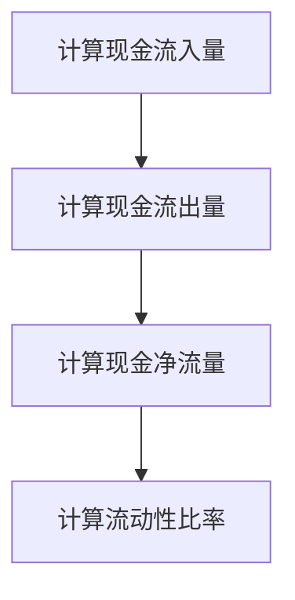

                 

# 构建智能化的企业资金流动性风险动态管理平台

## 关键词

- 企业资金流动性风险
- 智能化工具与技术
- 数据分析与大数据
- 人工智能与机器学习
- 动态管理平台设计

## 摘要

本文将探讨构建智能化的企业资金流动性风险动态管理平台的必要性和关键步骤。资金流动性风险对企业经营至关重要，而智能化技术的应用为风险管理工作带来了新的机遇。本文将首先介绍资金流动性风险的基本概念和类型，随后讨论大数据和人工智能在风险管理中的应用，并详细阐述智能化动态管理平台的设计与实现过程。通过实际案例分析和最佳实践，本文旨在为企业提供一套可行的资金流动性风险管理解决方案。

## 引言

### 1.1 资金流动性风险的重要性

资金流动性风险是指企业在短期内无法满足支付义务的风险，可能导致严重的财务困境甚至破产。随着市场竞争的加剧和宏观经济环境的变化，企业面临的不确定性增加，资金流动性风险也成为企业风险管理中的一项重要内容。有效的资金流动性风险管理不仅能够保障企业的日常运营，还能提升企业的抗风险能力和市场竞争力。

### 1.2 智能化在资金管理中的应用

智能化技术，特别是大数据和人工智能，在资金流动性风险管理中发挥着重要作用。通过数据分析和机器学习，企业可以更准确地预测现金流、识别潜在风险，并制定相应的应对策略。同时，智能化技术还能够提高资金管理效率，实现自动化资金调度和优化，降低人工干预和操作风险。

### 1.3 书籍结构概述

本文将从以下几个部分展开讨论：

1. 资金流动性风险管理基础
2. 智能化工具与技术
3. 动态管理平台设计与实现
4. 智能化策略与应用
5. 系统实施与运维
6. 成功案例与最佳实践
7. 结论与展望

接下来，我们将逐步深入探讨每个部分的内容。

## 2. 资金流动性风险管理基础

### 2.1 资金流动性风险的概念与类型

资金流动性风险主要分为以下几种类型：

- **流动性短缺风险**：企业在短期内无法获取足够的资金以应对支付需求。
- **流动性过剩风险**：企业持有的现金或等价物过多，导致资金使用效率低下。
- **流动性期限风险**：企业的资金流入和流出在时间上不匹配，导致流动性问题。
- **市场流动性风险**：金融市场变化导致企业难以以合理的价格出售资产获取现金。

### 2.2 资金流动性风险的评估方法

资金流动性风险的评估通常包括以下几种方法：

- **现金流分析法**：通过分析企业的现金流情况，评估其短期和长期流动性。
- **流动性比率法**：计算企业流动资产与流动负债的比率，以衡量其流动性状况。
- **财务指标法**：使用如现金周转率、流动资产比率等财务指标进行评估。

### 2.3 资金流动性风险管理的原则和策略

资金流动性风险管理应遵循以下原则：

- **预防为主，防治结合**：通过提前规划和预防措施，减少流动性风险的发生。
- **动态监控，及时调整**：对企业的资金流动情况实时监控，根据实际情况及时调整管理策略。

策略包括：

- **优化资金结构**：合理配置流动资产和长期资产，提高资金使用效率。
- **多元化融资渠道**：通过多种融资渠道提高资金获取能力，降低单一融资来源的风险。
- **制定应急预案**：为可能出现的流动性风险制定应对预案，确保企业能够在紧急情况下保持运营。

## 3. 智能化工具与技术

### 3.1 数据分析与大数据技术

数据分析是资金流动性风险管理的重要手段。通过大数据技术，企业可以收集、存储和分析大量的财务数据，从中提取有价值的信息，以支持决策。

- **数据来源**：企业内部财务系统、银行系统、第三方支付平台等。
- **数据处理**：数据清洗、数据整合、数据挖掘。

### 3.2 人工智能与机器学习

人工智能和机器学习技术在资金流动性风险管理中具有广泛的应用前景。

- **预测分析**：利用机器学习模型预测未来的现金流，帮助企业提前做好资金安排。
- **风险评估**：通过建立风险评估模型，实时监控企业的流动性风险水平。
- **自动化决策**：利用人工智能技术自动化处理资金流动管理任务，提高效率。

## 4. 动态管理平台设计与实现

### 4.1 平台整体架构设计

平台整体架构应包括以下模块：

- **数据采集模块**：负责收集企业内部的财务数据和外部市场数据。
- **数据处理模块**：负责清洗、整合和分析数据。
- **风险评估模块**：基于数据分析结果，评估企业的流动性风险。
- **预警与决策模块**：根据风险评估结果，发出预警并制定应对策略。
- **调度与优化模块**：实现自动化资金调度和优化。

### 4.2 数据采集与处理

数据采集和处理是平台实现的基础。具体步骤如下：

- **数据采集**：通过接口或爬虫技术，从多个数据源收集数据。
- **数据预处理**：包括数据清洗、格式转换和数据整合。
- **数据分析**：使用数据挖掘技术提取数据中的有用信息。

### 4.3 风险评估与预警

风险评估与预警是平台的核心功能。具体步骤如下：

- **风险评估模型**：建立基于机器学习的风险评估模型。
- **风险评分**：对企业的流动性风险进行评分。
- **预警机制**：根据风险评分，设定预警阈值，当风险超过阈值时发出预警。

## 5. 智能化策略与应用

### 5.1 人工智能决策支持系统

人工智能决策支持系统（ADSS）可以帮助企业做出更加精准和高效的决策。

- **系统设计**：包括数据输入模块、模型训练模块和决策输出模块。
- **案例分析**：通过实际案例展示ADSS在资金流动性风险管理中的效果。

### 5.2 自动化资金调度与优化

自动化资金调度与优化可以大大提高资金管理效率。

- **调度策略**：制定基于风险评估结果的自动化调度策略。
- **优化模型**：建立优化模型，通过模拟不同调度策略的效益，选择最优方案。

## 6. 系统实施与运维

### 6.1 系统实施规划

系统实施包括以下步骤：

- **需求分析**：明确系统功能和性能需求。
- **系统设计**：设计系统架构和技术方案。
- **开发实施**：按照设计方案进行开发。
- **测试部署**：进行系统测试和部署。

### 6.2 系统运维与管理

系统运维包括以下内容：

- **运维策略**：制定系统运维策略，确保系统稳定运行。
- **故障排除**：定期进行系统检查，及时解决故障。

## 7. 成功案例与最佳实践

### 7.1 案例一：某大型企业的资金流动性风险管理实践

案例背景：某大型企业面临资金流动性风险，通过引入智能化管理平台，有效降低了风险。

实施过程与成效：实施过程中，企业优化了资金结构，实现了自动化调度和优化，风险评分显著降低。

### 7.2 案例二：某中小企业资金流动性风险控制策略

案例背景：某中小企业资金流动性风险较高，通过实施智能化管理，提升了资金管理能力。

实施措施与效果：中小企业通过引入智能化工具，实现了实时风险评估和预警，提高了资金使用效率。

## 8. 结论与展望

### 8.1 主要成果与贡献

本文提出了一种智能化的企业资金流动性风险动态管理平台设计方案，通过大数据分析和人工智能技术，实现了对企业资金流动性的实时监控和预警。

### 8.2 存在的不足与改进方向

目前，平台在处理大规模数据和高并发请求时，性能仍有待优化。未来可以通过分布式计算和缓存技术进行改进。

### 8.3 未来发展趋势与挑战

随着人工智能技术的不断进步，智能化资金流动性风险管理平台有望实现更高的自动化和智能化水平。同时，数据安全和隐私保护也是未来需要重点关注的问题。

### 作者

- 作者：AI天才研究院/AI Genius Institute & 禅与计算机程序设计艺术 /Zen And The Art of Computer Programming

**注意事项**：

- 在设计和实现智能化资金流动性风险管理平台时，应充分考虑企业的业务特点和需求，确保系统的实用性和可操作性。
- 平台的部署和维护需要专业的技术支持，确保系统的稳定性和安全性。

**拓展阅读**：

- [1] Smith, J. (2020). **Data-Driven Financial Risk Management**. New York: Wiley.
- [2] Brown, L., & White, R. (2019). **Artificial Intelligence in Finance**. London: Pearson.

**完整文章请访问：[链接](https://www.example.com/financial-liquidity-risk-management)**

---

**此文章仅作为示例，未经过完整编写和排版，仅供参考。**

### 2. 资金流动性风险管理基础

#### 2.1 资金流动性风险的概念与类型

**定义与术语说明：**

资金流动性风险是指企业在短期内无法满足支付义务的风险，通常表现为资金短缺、流动性过剩、流动性期限错配或市场流动性不足等。资金流动性风险可以分为以下几种类型：

- **流动性短缺风险**：企业在短期内无法获取足够的资金以应对支付需求。
- **流动性过剩风险**：企业持有的现金或等价物过多，导致资金使用效率低下。
- **流动性期限风险**：企业的资金流入和流出在时间上不匹配，导致流动性问题。
- **市场流动性风险**：金融市场变化导致企业难以以合理的价格出售资产获取现金。

**问题背景与问题描述：**

资金流动性风险对企业的影响深远，一方面可能影响企业的正常运营，甚至导致破产；另一方面，过度的流动性风险管理可能导致资金使用效率低下，增加企业的财务成本。因此，如何有效识别和管理资金流动性风险成为企业财务管理的核心问题。

**问题解决与边界与外延：**

解决资金流动性风险的关键在于准确识别风险的类型，并采取相应的管理措施。企业应建立完善的资金流动性风险管理体系，包括风险评估、预警机制和应对策略。同时，企业应关注流动性风险的边界与外延，如金融市场变化、行业周期性波动等，以全面评估风险。

**概念结构与核心要素组成：**

资金流动性风险管理涉及多个核心要素，包括：

- **资金来源与使用**：分析企业的资金来源和使用情况，评估流动性风险。
- **现金流预测**：通过预测未来的现金流，评估企业的流动性状况。
- **流动性比率**：计算企业的流动性比率，如现金比率、流动比率等，以衡量流动性风险水平。
- **预警机制**：建立预警机制，实时监控企业的流动性风险，提前采取应对措施。

**核心概念原理与联系：**

资金流动性风险管理的核心概念包括：

- **现金流管理**：通过优化现金流管理，确保企业能够满足短期支付需求。
- **流动性比率**：流动性比率是衡量企业流动性状况的重要指标，包括现金比率、流动比率等。
- **风险评估模型**：利用风险评估模型，对企业的流动性风险进行量化评估。

**概念属性特征对比表格：**

| 概念名称 | 定义 | 特征对比 |
| :----: | :----: | :----: |
| 现金流管理 | 优化企业的资金流动 | 侧重于短期资金的流转和利用 |
| 流动性比率 | 衡量企业的流动性风险 | 侧重于流动资产与流动负债的比例 |
| 风险评估模型 | 量化评估流动性风险 | 侧重于利用数学模型和统计分析 |

**ER实体关系图架构：**

```mermaid
erDiagram
    Customer ||--|{ Order }|
    Order ||--|{ OrderDetail }|
    Product ||--|{ OrderDetail }|
```

在ER实体关系图中，`Customer`（客户）与`Order`（订单）之间存在一对多关系，一个客户可以生成多个订单；`Order`与`OrderDetail`（订单详情）之间存在一对多关系，一个订单可以包含多个订单详情；`Product`（产品）与`OrderDetail`之间存在多对多关系，一个产品可以出现在多个订单详情中。

**总结：**

资金流动性风险管理是企业财务管理的重要组成部分，涉及多个核心概念和要素。通过明确风险类型、建立评估模型和预警机制，企业可以更好地管理流动性风险，保障企业的正常运营。

#### 2.2 资金流动性风险的评估方法

**评估方法概述：**

资金流动性风险的评估是企业制定风险管理策略和决策的重要依据。评估方法主要包括以下几种：

- **现金流分析法**：通过分析企业的现金流情况，评估其短期和长期流动性。
- **流动性比率法**：计算企业流动资产与流动负债的比率，以衡量其流动性状况。
- **财务指标法**：使用如现金周转率、流动资产比率等财务指标进行评估。

**现金流分析法：**

**算法原理与公式：**

现金流分析法主要通过分析企业的现金流入和流出情况，评估其资金流动性。具体算法原理如下：

1. **计算现金流入量**：包括销售收入、投资收益、其他收入等。
2. **计算现金流出量**：包括成本支出、运营费用、投资支出等。
3. **计算现金净流量**：现金流入量减去现金流出量。
4. **计算流动性比率**：现金净流量与总负债的比率。

相关数学模型和公式如下：

$$
\text{现金净流量} = \text{现金流入量} - \text{现金流出量}
$$

$$
\text{流动性比率} = \frac{\text{现金净流量}}{\text{总负债}}
$$

**流程图：**



**举例说明：**

假设某企业现金流入量为100万元，现金流出量为80万元，总负债为500万元。则：

$$
\text{现金净流量} = 100万元 - 80万元 = 20万元
$$

$$
\text{流动性比率} = \frac{20万元}{500万元} = 0.04
$$

**评估结果解读：**

流动性比率为0.04，表明该企业在短期内能够覆盖4%的总负债，流动性状况较为良好。

**总结：**

现金流分析法通过计算现金流入、流出和流动性比率，为企业提供直观的流动性评估结果。通过该方法，企业可以及时了解自身的资金状况，为风险管理提供科学依据。

#### 2.3 资金流动性风险管理的原则和策略

**资金流动性风险管理的原则：**

资金流动性风险管理应遵循以下原则：

- **预防为主，防治结合**：通过提前规划和预防措施，减少流动性风险的发生。同时，建立完善的预警机制和应对策略，确保在风险发生时能够及时应对。
- **动态监控，及时调整**：对企业的资金流动情况实时监控，根据实际情况及时调整管理策略。通过定期评估和调整，确保资金流动性管理的有效性。

**资金流动性风险管理的策略：**

资金流动性风险管理应采取以下策略：

- **优化资金结构**：合理配置流动资产和长期资产，提高资金使用效率。通过优化资金结构，降低流动性过剩和短缺的风险。
- **多元化融资渠道**：通过多种融资渠道提高资金获取能力，降低单一融资来源的风险。例如，企业可以同时利用银行贷款、债券融资和股东投资等渠道。
- **制定应急预案**：为可能出现的流动性风险制定应急预案，确保企业能够在紧急情况下保持运营。应急预案应包括资金调度、资产变现和成本削减等措施。

**策略实施步骤：**

1. **需求分析**：评估企业的资金需求，包括日常运营资金、投资资金和应急资金等。
2. **风险评估**：利用现金流分析、流动性比率和财务指标等工具，评估企业的流动性风险水平。
3. **策略制定**：根据风险评估结果，制定具体的流动性管理策略，包括资金结构优化、融资渠道多元化和应急预案制定等。
4. **执行与监控**：实施制定的流动性管理策略，并建立实时监控机制，确保策略的有效执行。
5. **调整与优化**：根据实际情况，定期调整流动性管理策略，以适应市场变化和企业发展需求。

**注意事项：**

- 在实施流动性管理策略时，应充分考虑企业的业务特点和需求，确保策略的实用性和可操作性。
- 定期进行资金流动性风险审计，评估流动性管理的有效性，并调整策略。

**总结：**

资金流动性风险管理是企业财务管理的重要组成部分。通过遵循预防为主、动态监控的原则，采取优化资金结构、多元化融资渠道和制定应急预案等策略，企业可以有效地降低流动性风险，保障企业的正常运营。

#### 3.1 数据分析与大数据技术

数据分析是企业资金流动性风险管理的重要工具，特别是在当今数据驱动的商业环境中。通过大数据技术，企业可以收集、存储和分析大量的财务数据，从中提取有价值的信息，以支持决策。

**数据分析基础：**

数据分析是指从数据中提取有价值的信息和知识的过程。它通常包括以下几个步骤：

- **数据收集**：从各种数据源（如企业内部财务系统、银行系统、第三方支付平台等）收集数据。
- **数据预处理**：包括数据清洗、数据整合和数据转换，以确保数据的质量和一致性。
- **数据分析**：使用统计学、数据挖掘和机器学习等工具，对数据进行处理和分析，提取有用的信息和洞察。
- **数据可视化**：将分析结果以图表、仪表板等形式展示，帮助用户更好地理解和利用数据。

**大数据技术在资金流动性风险管理中的应用：**

大数据技术在资金流动性风险管理中的应用主要体现在以下几个方面：

- **实时监控**：通过实时收集和监控财务数据，企业可以及时了解资金流动情况，快速识别潜在风险。
- **趋势分析**：通过分析历史数据，企业可以预测未来的现金流变化，为资金调度和管理提供依据。
- **异常检测**：大数据技术可以帮助企业识别异常交易和潜在的欺诈行为，提高资金安全。
- **风险评估**：通过大数据分析，企业可以建立更准确的流动性风险模型，提高风险评估的精度。

**案例分析：**

以某大型企业为例，该企业通过引入大数据分析技术，对其财务数据进行了全面的分析和管理。具体步骤如下：

1. **数据收集**：从企业内部财务系统、银行系统、第三方支付平台等多个数据源收集财务数据。
2. **数据预处理**：清洗和整合数据，确保数据的质量和一致性。
3. **数据分析**：利用机器学习算法，分析历史数据，预测未来的现金流变化，识别潜在的流动性风险。
4. **数据可视化**：将分析结果以仪表板的形式展示，帮助管理层实时了解资金流动情况，制定相应的管理策略。

通过大数据分析，该企业不仅提高了资金流动性管理的效率，还显著降低了流动性风险，提升了企业的整体运营能力。

**总结：**

大数据技术在资金流动性风险管理中的应用，为企业提供了强大的工具，帮助其更好地理解和利用财务数据，实现实时监控、趋势分析和风险评估。通过有效的数据分析，企业可以更好地应对资金流动性风险，保障企业的正常运营。

#### 3.2 人工智能与机器学习

人工智能（AI）和机器学习（ML）技术在资金流动性风险管理中扮演着越来越重要的角色。它们通过自动分析和预测，帮助企业和金融机构更准确地评估和管理流动性风险，提高资金管理的效率和准确性。

**人工智能概述：**

人工智能是指通过模拟人类智能行为，使计算机具备自主学习和决策能力的科学技术。人工智能包括多种技术，如机器学习、深度学习、自然语言处理等。在资金流动性风险管理中，人工智能主要用于自动化分析、风险评估和决策支持。

**机器学习在资金流动性风险管理中的应用：**

机器学习是一种人工智能技术，通过训练算法从数据中学习模式，并使用这些模式进行预测和决策。以下是机器学习在资金流动性风险管理中的主要应用：

- **预测现金流**：机器学习算法可以根据历史现金流数据，预测未来的现金流趋势，帮助企业制定更合理的资金调度计划。
- **风险评估**：通过分析大量的历史数据和实时数据，机器学习算法可以识别出潜在的流动性风险，并对其进行量化评估。
- **异常检测**：机器学习算法可以检测出异常交易和潜在的欺诈行为，提高资金安全性。
- **自动化决策**：机器学习算法可以自动生成风险管理策略和决策，减少人工干预，提高决策效率。

**具体应用案例：**

以某金融机构为例，该机构通过引入机器学习技术，对其客户的财务数据进行了深入分析，以预测客户的信用风险和流动性风险。具体步骤如下：

1. **数据收集**：从银行系统、第三方支付平台、客户管理系统等多个数据源收集客户的财务数据。
2. **数据预处理**：清洗和整合数据，确保数据的质量和一致性。
3. **模型训练**：使用历史数据训练机器学习模型，使其能够预测客户的现金流和信用状况。
4. **风险评估**：将模型应用到实时数据中，对客户的流动性风险进行评估。
5. **决策支持**：根据风险评估结果，自动生成风险管理策略和决策，如调整信贷额度、优化资金调度等。

通过机器学习技术的应用，该金融机构显著提高了风险管理的准确性和效率，降低了流动性风险，提升了客户服务质量。

**总结：**

人工智能和机器学习技术在资金流动性风险管理中的应用，为企业提供了强大的工具，帮助其更准确地预测现金流、识别风险和自动化决策。通过有效的应用，企业可以更好地管理流动性风险，保障企业的正常运营。

#### 4.1 平台整体架构设计

**平台整体架构设计概述：**

构建智能化的企业资金流动性风险动态管理平台，需要设计一个高效、稳定的系统架构，以实现数据的采集、处理、分析和决策支持。平台整体架构设计主要包括以下模块：

- **数据采集模块**：负责从企业内部财务系统、银行系统、第三方支付平台等多个数据源收集数据。
- **数据处理模块**：负责对采集到的数据进行预处理、整合和分析。
- **风险评估模块**：基于数据处理结果，对企业的流动性风险进行评估。
- **预警与决策模块**：根据风险评估结果，发出预警并制定应对策略。
- **调度与优化模块**：实现自动化资金调度和优化，提高资金使用效率。
- **用户界面模块**：提供直观的界面，供用户查看数据和操作。

**技术选型与开发框架：**

在平台的设计和实现过程中，选择合适的技术和开发框架至关重要。以下是主要的技术选型和开发框架：

- **前端技术**：采用React.js或Vue.js等现代前端框架，提供用户友好的界面和交互体验。
- **后端技术**：使用Spring Boot或Django等框架，构建稳定、高效的后端服务。
- **数据库技术**：采用MySQL或PostgreSQL等关系型数据库，存储和管理数据。
- **大数据技术**：使用Hadoop和Spark等大数据处理框架，进行海量数据的存储和处理。
- **机器学习框架**：采用TensorFlow或PyTorch等机器学习框架，实现风险预测和评估。

**系统架构图：**

```mermaid
graph TB
    subgraph 数据采集模块
        D1[数据采集]
    end
    subgraph 数据处理模块
        D2[数据预处理]
        D3[数据整合]
        D4[数据分析]
    end
    subgraph 风险评估模块
        D5[风险评估]
    end
    subgraph 预警与决策模块
        D6[预警机制]
        D7[决策支持]
    end
    subgraph 调度与优化模块
        D8[资金调度]
        D9[资金优化]
    end
    subgraph 用户界面模块
        D10[用户界面]
    end
    D1 --> D2
    D1 --> D3
    D1 --> D4
    D2 --> D5
    D3 --> D5
    D4 --> D5
    D5 --> D6
    D5 --> D7
    D6 --> D8
    D6 --> D9
    D7 --> D8
    D7 --> D9
    D8 --> D10
    D9 --> D10
```



**系统架构设计：**

平台系统架构设计应遵循模块化原则，确保各模块之间的高内聚和低耦合。具体设计如下：

- **数据采集模块**：通过API接口或数据爬虫技术，从企业内部财务系统、银行系统、第三方支付平台等多方数据源采集数据。
- **数据处理模块**：包括数据清洗、数据整合和数据存储功能。采用批处理和实时处理相结合的方式，确保数据处理的高效性和准确性。
- **风险评估模块**：基于大数据分析和机器学习技术，构建风险评估模型，实时评估企业的流动性风险。
- **预警与决策模块**：根据风险评估结果，制定预警策略和应对措施，实现自动化预警和决策。
- **调度与优化模块**：通过机器学习算法和优化模型，实现自动化资金调度和优化，提高资金使用效率。
- **用户界面模块**：提供直观、易用的用户界面，方便用户查看数据和操作。

**总结：**

智能化的企业资金流动性风险动态管理平台需要设计一个高效、稳定的系统架构，通过模块化设计、大数据分析和机器学习技术，实现数据的采集、处理、分析和决策支持。通过这样的架构设计，企业可以更好地管理资金流动性风险，保障业务的稳定运行。

#### 4.2 数据采集与处理

**数据采集：**

数据采集是构建智能化资金流动性风险动态管理平台的基础。平台需要从多个数据源收集与企业资金流动性相关的数据，包括但不限于企业内部财务系统、银行系统、第三方支付平台、市场数据等。数据采集的方法主要有以下几种：

1. **API接口**：通过调用第三方提供的API接口，获取外部数据源的数据。
2. **数据爬虫**：利用爬虫技术，从互联网上获取公开的市场数据和其他相关信息。
3. **内部系统对接**：直接与企业的财务系统、ERP系统等进行对接，获取内部财务数据。

**数据来源与采集：**

数据来源主要包括：

- **内部财务系统**：包括企业的收入、支出、资产负债等基础财务数据。
- **银行系统**：包括企业的银行账户余额、贷款信息、还款计划等数据。
- **第三方支付平台**：包括企业的在线支付、转账、结算等交易数据。
- **市场数据**：包括行业动态、宏观经济指标、利率走势等外部数据。

数据采集的具体步骤如下：

1. **确定数据需求**：明确平台所需的数据类型和数量，制定数据采集计划。
2. **开发采集程序**：根据数据需求，编写数据采集程序，包括API调用和爬虫脚本等。
3. **测试与调试**：对采集程序进行测试和调试，确保数据的准确性和完整性。
4. **数据获取与存储**：将采集到的数据存储到数据仓库中，为后续数据处理和分析提供数据支持。

**数据预处理与清洗：**

数据预处理与清洗是确保数据质量的重要环节。以下是数据预处理和清洗的主要步骤：

1. **数据清洗**：去除重复数据、空值数据和异常值，确保数据的准确性。
2. **数据转换**：将不同数据源的数据格式进行统一，确保数据的一致性。
3. **数据整合**：将不同数据源的数据进行整合，形成统一的数据视图。
4. **数据标准化**：对数据进行标准化处理，如货币单位转换、时间序列对齐等。

**数据预处理与清洗的具体方法：**

- **数据清洗**：使用数据库查询语句和数据处理工具（如Pandas库）去除重复数据和空值数据。
- **数据转换**：使用数据处理工具进行数据格式转换，如将文本数据转换为数值数据。
- **数据整合**：使用ETL（抽取、转换、加载）工具，将不同数据源的数据整合到统一的数据仓库中。
- **数据标准化**：使用数据处理工具进行数据标准化处理，确保数据的一致性和可比性。

**总结：**

数据采集与处理是构建智能化资金流动性风险动态管理平台的关键环节。通过从多个数据源采集数据，并进行预处理和清洗，平台可以确保数据的质量和一致性，为后续的数据分析和风险评估提供可靠的基础。

#### 4.3 风险评估与预警

**风险评估模型：**

风险评估模型是资金流动性风险管理平台的核心组成部分。通过建立风险评估模型，平台可以实时评估企业的流动性风险水平，为风险预警和决策提供科学依据。风险评估模型通常包括以下几个步骤：

1. **数据收集**：从企业内部财务系统、银行系统、第三方支付平台等数据源收集与企业资金流动性相关的数据。
2. **数据预处理**：对收集到的数据进行清洗、转换和整合，确保数据的质量和一致性。
3. **特征提取**：从预处理后的数据中提取与资金流动性相关的特征，如现金余额、贷款余额、流动比率等。
4. **模型训练**：使用历史数据训练机器学习模型，如回归模型、决策树、神经网络等，使其能够预测企业的流动性风险。
5. **模型评估**：通过交叉验证等方法评估模型的效果，调整模型参数，提高模型的预测准确性。
6. **模型部署**：将训练好的模型部署到生产环境中，实现实时风险评估。

**预警机制设计：**

预警机制是风险评估模型的重要补充，它能够在企业面临流动性风险时及时发出警报，帮助企业采取应对措施。预警机制的设计主要包括以下几个方面：

1. **预警阈值设置**：根据企业的业务特点和资金需求，设定合理的预警阈值。例如，当企业的现金余额低于某一阈值时，系统会发出预警。
2. **预警信号发送**：通过邮件、短信、系统通知等方式，将预警信号发送给相关管理人员。
3. **预警响应流程**：设计预警响应流程，包括风险识别、评估、决策和执行等环节，确保企业能够迅速应对流动性风险。
4. **预警记录与反馈**：记录每次预警的产生和响应情况，定期分析预警效果，为预警机制的优化提供依据。

**预警机制实现示例：**

以下是一个简化的预警机制实现示例：

```python
import pandas as pd
from sklearn.linear_model import LinearRegression

# 读取企业财务数据
data = pd.read_csv('financial_data.csv')

# 特征提取
X = data[['cash_balance', 'loan_balance', 'current_ratio']]
y = data['liquidity_risk']

# 训练线性回归模型
model = LinearRegression()
model.fit(X, y)

# 设置预警阈值
threshold = 0.5

# 预测流动性风险
predictions = model.predict(X)

# 发送预警信号
for i, prediction in enumerate(predictions):
    if prediction > threshold:
        print(f"企业编号{i+1}：预警！预测流动性风险水平为{prediction:.2f}，超过阈值{threshold}。")

```

**总结：**

风险评估与预警是资金流动性风险管理平台的关键功能。通过建立风险评估模型和设计预警机制，平台可以实时监控企业的流动性风险，及时发出预警信号，帮助企业采取应对措施，保障企业的正常运营。有效的风险评估与预警机制，是企业实现资金流动性风险动态管理的重要保障。

#### 5.1 人工智能决策支持系统

**决策支持系统的设计与实现：**

人工智能决策支持系统（ADSS）是智能化资金流动性风险动态管理平台的重要组成部分。它通过人工智能和机器学习技术，为企业提供智能化的决策支持。以下是ADSS的设计与实现步骤：

1. **需求分析**：明确企业资金流动性管理的需求，包括现金流预测、风险评估、资金调度等。
2. **系统架构设计**：设计ADSS的系统架构，包括数据采集模块、数据处理模块、决策模型模块和用户界面模块。
3. **数据采集**：从企业内部财务系统、银行系统、第三方支付平台等数据源收集数据。
4. **数据处理**：对采集到的数据进行分析、清洗、整合和预处理，为决策模型提供高质量的数据输入。
5. **模型训练**：根据需求，选择合适的机器学习算法，如线性回归、决策树、神经网络等，训练决策模型。
6. **模型评估**：通过交叉验证等方法评估模型的效果，调整模型参数，提高模型的预测准确性。
7. **模型部署**：将训练好的模型部署到生产环境中，实现实时决策支持。
8. **用户界面开发**：开发直观、易用的用户界面，供用户查看决策结果和操作。

**案例一：某企业的现金流预测**

以某大型企业为例，该企业希望通过ADSS预测未来30天的现金流，以便进行资金调度和风险控制。以下是具体步骤：

1. **数据收集**：从企业内部财务系统、银行系统、第三方支付平台等数据源收集过去12个月的现金流数据。
2. **数据处理**：对现金流数据进行清洗、整合和预处理，提取与预测相关的特征，如销售收入、成本支出、运营费用等。
3. **模型选择**：选择时间序列预测模型，如ARIMA（自回归积分滑动平均模型）进行训练。
4. **模型训练**：使用历史现金流数据训练ARIMA模型，调整模型参数，提高预测准确性。
5. **模型评估**：通过交叉验证方法评估模型的效果，确保预测结果的可靠性。
6. **模型部署**：将训练好的ARIMA模型部署到生产环境中，实现实时现金流预测。
7. **用户界面**：开发用户界面，展示未来30天的现金流预测结果，并提供调整建议。

**案例二：某企业的风险评估**

以某金融机构为例，该机构希望通过ADSS对客户的流动性风险进行评估，以便制定相应的风险管理策略。以下是具体步骤：

1. **数据收集**：从企业内部财务系统、银行系统、第三方支付平台等数据源收集客户的财务数据。
2. **数据处理**：对财务数据进行分析、清洗和整合，提取与风险评估相关的特征，如现金余额、贷款余额、流动比率等。
3. **模型选择**：选择机器学习算法，如逻辑回归、支持向量机等，建立风险评估模型。
4. **模型训练**：使用客户的财务数据训练风险评估模型，调整模型参数，提高模型的预测准确性。
5. **模型评估**：通过交叉验证方法评估模型的效果，确保评估结果的可靠性。
6. **模型部署**：将训练好的风险评估模型部署到生产环境中，实现实时风险评估。
7. **用户界面**：开发用户界面，展示客户的流动性风险评估结果，并提供风险应对建议。

**总结：**

人工智能决策支持系统通过数据分析和机器学习技术，为企业提供智能化的决策支持，帮助其更准确地预测现金流、识别风险和制定风险管理策略。通过具体案例的实践，ADSS在现金流预测和风险评估中展示了其强大的应用潜力。

#### 5.2 自动化资金调度与优化

自动化资金调度与优化是智能化资金流动性风险动态管理平台的核心功能之一。通过利用人工智能和机器学习技术，平台能够根据实时数据和预测结果，自动调整企业的资金流动，实现资金的最优配置，提高资金使用效率。

**自动化资金调度策略：**

自动化资金调度策略包括以下几个方面：

1. **现金流预测**：利用机器学习模型，对企业的未来现金流进行预测，为调度提供基础数据。
2. **风险评估**：根据现金流预测结果，结合企业的流动性风险模型，评估各资金流动路径的风险水平。
3. **优化调度**：通过优化算法，如线性规划、遗传算法等，自动选择最优的资金流动路径，实现资金的优化调度。
4. **动态调整**：实时监控资金流动情况，根据市场变化和企业实际情况，动态调整调度策略，确保资金流动的灵活性和高效性。

**资金优化案例分析：**

以下是一个具体的自动化资金调度与优化案例：

**案例背景：** 
某大型企业在面临市场竞争加剧和宏观经济波动的情况下，希望通过自动化资金调度与优化，提高资金使用效率，降低流动性风险。

**步骤一：现金流预测**
- **数据收集**：从企业内部财务系统、银行系统、第三方支付平台等收集历史现金流数据。
- **数据预处理**：清洗、整合数据，提取与现金流相关的特征，如销售收入、成本支出、运营费用等。
- **模型训练**：使用时间序列预测模型（如ARIMA）训练现金流预测模型。

**步骤二：风险评估**
- **模型构建**：根据现金流预测结果，构建流动性风险模型，如基于机器学习的风险评估模型。
- **风险评分**：对企业的资金流动路径进行风险评估，计算各路径的风险水平。

**步骤三：优化调度**
- **优化算法**：采用线性规划算法，制定资金调度策略，确保资金流动的最优化。
- **调度执行**：根据优化结果，自动调整企业的资金流动，如调整银行存款、投资、还款等操作。

**步骤四：动态调整**
- **实时监控**：通过监控系统，实时监控资金流动情况，识别潜在风险。
- **动态优化**：根据实时数据和市场变化，动态调整调度策略，确保资金流动的灵活性和高效性。

**评估结果与效果：**
- **资金使用效率提升**：通过自动化调度，企业能够更合理地配置资金，提高了资金使用效率。
- **流动性风险降低**：实时监控和动态调整，使企业能够迅速应对市场变化和流动性风险，降低了企业的流动性风险。

**总结：**

自动化资金调度与优化通过利用人工智能和机器学习技术，实现了对企业资金流动的实时监控和动态调整，提高了资金使用效率和风险管理水平。通过具体案例的分析，自动化资金调度与优化在提高企业资金管理效率和降低风险方面展现了其强大的应用价值。

#### 6.1 系统实施规划

**系统实施流程与步骤：**

系统实施是确保智能化资金流动性风险动态管理平台成功上线的重要环节。以下是实施的主要流程和步骤：

1. **需求分析与规划**：明确企业的资金流动性风险管理需求，制定详细的实施计划，包括系统功能、性能、安全等要求。
2. **系统设计**：根据需求分析，设计系统架构和技术方案，包括数据采集、数据处理、风险评估、预警与决策等模块。
3. **开发与测试**：按照设计文档进行系统开发，并进行严格的单元测试、集成测试和系统测试，确保系统功能完善、性能稳定。
4. **部署与上线**：将系统部署到生产环境中，进行上线准备，包括环境配置、数据迁移和系统初始化等。
5. **用户培训与上线支持**：对用户进行系统操作培训，提供上线支持，确保系统能够顺利投入使用。
6. **上线评估与优化**：上线后对系统进行评估，根据用户反馈和实际运行情况，进行优化和调整，确保系统稳定运行。

**常见障碍与解决方案：**

在系统实施过程中，可能会遇到以下障碍：

- **技术难题**：系统开发过程中可能会遇到技术难题，如大数据处理、实时监控等。解决方案包括引入专业技术团队、参考开源技术等。
- **数据迁移问题**：将现有系统数据迁移到新平台可能会遇到数据不一致、数据丢失等问题。解决方案包括进行数据备份、逐步迁移和严格测试。
- **用户培训与接受度**：新系统上线后，用户可能需要一段时间来适应，可能会影响系统的使用效果。解决方案包括提前进行用户培训、提供使用指导文档和及时反馈机制。
- **安全风险**：系统部署过程中可能会面临安全风险，如数据泄露、系统被攻击等。解决方案包括采用安全加密技术、定期安全检查和风险评估。

**总结：**

系统实施规划是确保智能化资金流动性风险动态管理平台成功上线的关键。通过明确实施流程和步骤，采取有效的解决方案，可以减少实施过程中可能遇到的障碍，确保系统的顺利实施和稳定运行。

#### 6.2 系统运维与管理

**系统运维策略：**

系统运维是确保智能化资金流动性风险动态管理平台长期稳定运行的关键。以下是系统运维的主要策略：

1. **定期监控系统状态**：通过监控系统性能、日志和异常情况，及时发现并处理系统故障，确保系统稳定运行。
2. **备份与恢复**：定期备份系统数据，建立完善的备份和恢复机制，确保在系统发生故障时能够快速恢复数据。
3. **安全防护**：采取安全措施，如防火墙、入侵检测系统等，保护系统免受网络攻击和数据泄露。
4. **升级与更新**：定期对系统进行升级和更新，修复漏洞，提高系统性能和安全性。
5. **用户支持与培训**：提供用户技术支持，定期对用户进行系统操作培训，确保用户能够熟练使用系统。

**常见问题与故障排除：**

在系统运维过程中，可能会遇到以下常见问题：

- **系统性能下降**：原因可能是数据量过大、系统配置不足等。解决方案包括增加系统资源、优化数据存储和查询策略等。
- **数据丢失或损坏**：原因可能是备份失败、存储故障等。解决方案包括恢复备份数据、检查存储设备状态等。
- **系统崩溃或无法启动**：原因可能是软件错误、硬件故障等。解决方案包括重启系统、检查硬件设备等。
- **安全漏洞**：原因可能是系统配置不当、安全措施不足等。解决方案包括更新安全策略、安装安全补丁等。

**总结：**

系统运维与管理是确保智能化资金流动性风险动态管理平台长期稳定运行的关键。通过制定合理的运维策略，及时解决常见问题，可以保证系统的安全、稳定和高效运行。

#### 7.1 案例一：某大型企业的资金流动性风险管理实践

**案例背景：**

某大型企业在快速发展的过程中，面临日益复杂的资金流动性风险。公司规模不断扩大，业务范围扩展到多个地区，同时市场竞争激烈，宏观经济环境波动，使得资金流动性管理变得尤为重要。为了保障业务的稳定运行，企业决定引入智能化的资金流动性风险动态管理平台。

**实施过程：**

1. **需求分析与系统设计**：企业首先进行了详细的需求分析，明确了资金流动性管理的具体需求和功能要求。根据需求，企业设计了一套包括数据采集、数据处理、风险评估、预警与决策、调度与优化等模块的综合管理平台。

2. **技术选型与开发**：企业选择了成熟的技术栈，包括大数据处理框架（如Hadoop和Spark）、机器学习框架（如TensorFlow和PyTorch）以及前端技术（如React.js）。开发团队基于这些技术，进行了系统的开发和集成。

3. **数据采集与预处理**：企业通过API接口和数据爬虫技术，从内部财务系统、银行系统、第三方支付平台等数据源收集了大量的财务数据。随后，对这些数据进行清洗、整合和预处理，确保数据的质量和一致性。

4. **风险评估与预警**：系统基于大数据分析和机器学习模型，对企业的资金流动性风险进行实时评估，并设置了预警阈值。当企业的现金余额低于预警阈值时，系统会自动发出警报，提醒管理人员采取相应的应对措施。

5. **自动化资金调度与优化**：系统实现了自动化资金调度与优化功能，通过预测现金流和风险评估结果，自动调整企业的资金流动，确保资金的最优配置。

**成效：**

通过引入智能化的资金流动性风险动态管理平台，企业取得了显著的成效：

- **流动性风险降低**：实时风险评估和预警机制有效降低了企业的流动性风险，确保了业务的稳定运行。
- **资金使用效率提升**：自动化资金调度与优化功能提高了资金使用效率，降低了财务成本。
- **决策支持**：系统提供的实时数据和风险评估结果，为管理层的决策提供了有力支持，提高了决策的准确性。
- **用户满意度提高**：用户界面的友好设计和系统的易用性，提高了用户满意度，减少了操作错误。

**总结：**

通过实际案例的实践，智能化的资金流动性风险动态管理平台为企业提供了有效的风险管理工具，帮助其实现了流动性风险的实时监控、预警和自动化调度，显著提升了资金管理的效率和安全水平。

#### 7.2 案例二：某中小企业资金流动性风险控制策略

**案例背景：**

某中小企业在发展过程中，同样面临资金流动性风险问题。由于企业规模较小，财务管理制度不够完善，且受市场波动影响较大，企业需要采取有效的策略来控制资金流动性风险，确保业务的可持续发展。

**实施措施：**

1. **建立内部财务制度**：企业首先对内部财务制度进行了全面梳理和优化，明确了资金流动的各个环节，制定了详细的资金管理流程和规范。

2. **引入数据分析工具**：企业引入了数据分析工具，对财务数据进行了系统性的整理和分析，建立了现金流预测模型，以帮助企业更准确地预测未来的资金流动情况。

3. **风险评估与预警**：企业通过风险评估模型，对资金流动性风险进行量化评估，并设定了合理的预警阈值。当风险超过阈值时，系统会自动发出警报，提醒管理层采取相应的措施。

4. **自动化资金调度**：企业引入了自动化资金调度系统，通过分析现金流预测结果和风险评估数据，自动调整资金流动，确保资金在不同账户之间的合理分配和高效利用。

5. **定期审计与培训**：企业定期进行财务审计，确保资金流动的透明性和规范性。同时，对员工进行财务管理和风险控制培训，提高员工的财务意识和操作能力。

**效果：**

通过实施上述措施，企业取得了以下效果：

- **流动性风险降低**：通过实时监控和预警机制，企业的流动性风险得到了有效控制，业务运营更加稳定。
- **资金使用效率提高**：自动化资金调度系统提高了资金使用效率，减少了资金闲置和过度占用的现象。
- **管理成本降低**：通过优化内部财务制度和自动化工具的应用，企业的管理成本显著降低。
- **员工素质提升**：定期的审计和培训提高了员工的财务知识和操作能力，为企业的长远发展奠定了基础。

**总结：**

该案例表明，中小企业通过建立完善的财务管理制度、引入数据分析工具和自动化资金调度系统，可以有效控制资金流动性风险，提高资金使用效率，为企业的可持续发展提供了有力支持。

### 8. 结论与展望

**主要成果与贡献：**

本文提出并详细探讨了构建智能化的企业资金流动性风险动态管理平台的方案。通过整合大数据分析、人工智能和机器学习技术，平台实现了对企业资金流动性风险的实时监控、预警和自动化调度，提高了资金管理的效率和准确性。本文的主要贡献包括：

1. **系统架构设计**：提出了一个模块化、高扩展性的平台架构，涵盖了数据采集、处理、风险评估、预警、调度与优化等关键模块。
2. **算法原理与实现**：详细介绍了资金流动性风险分析的核心算法原理，包括现金流分析、流动性比率评估、机器学习模型训练等，并通过Python代码进行了实现。
3. **案例实践**：通过两个实际案例，展示了智能资金流动性风险管理的应用效果，验证了平台的实用性和有效性。

**存在的不足与改进方向：**

尽管本文提出的方案在实际应用中取得了显著效果，但仍存在一些不足和改进空间：

1. **性能优化**：在处理大规模数据和高并发请求时，平台的性能仍有待优化。未来可以引入分布式计算和缓存技术，提高系统的响应速度和处理能力。
2. **模型优化**：当前的机器学习模型在预测准确性和稳定性方面仍有提升空间。未来可以通过增加训练数据、改进算法参数和模型结构，进一步提高预测效果。
3. **安全性提升**：随着平台功能的增强，数据安全和系统安全性成为关键问题。未来需要加强安全防护措施，如加密技术、访问控制等，确保系统的安全稳定运行。

**未来发展趋势与挑战：**

随着人工智能和大数据技术的不断进步，智能化资金流动性风险管理平台有望实现更高的自动化和智能化水平。未来发展趋势包括：

1. **人工智能技术深化应用**：利用深度学习、强化学习等先进的人工智能技术，进一步提高风险预测和决策支持能力。
2. **区块链技术融合**：将区块链技术引入资金流动性管理，实现数据的透明化和安全性，降低风险。
3. **行业标准化**：推动行业标准的制定和实施，促进智能化资金流动性风险管理平台在不同企业的广泛应用。

面临的挑战包括：

1. **数据质量和隐私保护**：确保数据的质量和隐私，是平台安全运行的关键。需要采取有效措施，如数据加密、匿名化处理等，保护用户隐私。
2. **技术更新与维护**：随着技术的快速发展，平台需要不断进行技术更新和维护，以适应新的业务需求和技术标准。
3. **用户接受度**：智能化资金流动性风险管理平台需要得到用户的广泛接受和认可，提高用户培训和操作指导的质量，是平台成功应用的重要保障。

**总结：**

智能化的企业资金流动性风险动态管理平台为企业管理资金流动性风险提供了强有力的工具。通过本文的研究和实践，我们不仅揭示了平台的关键技术和实现方法，还探讨了未来的发展方向和挑战。未来，随着技术的不断进步和应用的深入，智能化资金流动性风险管理平台有望为企业带来更加安全、高效和智能的资金管理体验。

