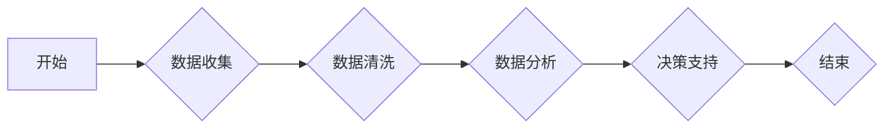

                 

# 构建智能化的资产负债管理系统

## 关键词
- 智能化资产负债管理系统
- 算法原理
- 数学模型
- 系统架构
- 实战案例
- 最佳实践

## 摘要
本文旨在探讨如何构建一个智能化的资产负债管理系统，通过深入分析核心概念、算法原理、系统架构以及实战案例，为读者提供一套完整的解决方案。文章结构紧凑，逻辑清晰，旨在帮助读者快速理解和掌握构建此类系统的关键技术和方法。

## 引言与背景

### 第1章: 引言

#### 1.1 问题背景
在企业管理中，资产负债管理是一个关键环节。传统的资产负债管理依赖于手工计算和经验判断，存在效率低下、准确性不足等问题。随着大数据、人工智能等技术的发展，构建一个智能化的资产负债管理系统成为企业提升管理效率、降低风险的重要途径。

#### 1.2 问题描述
智能化资产负债管理系统需要解决的主要问题包括：
- 资产和负债数据的自动收集与处理
- 数据的准确性、实时性和完整性
- 资产负债关系的智能分析
- 预测和决策支持

#### 1.3 问题解决
本文将介绍如何利用人工智能技术，构建一个具备自动数据收集、处理和分析功能的资产负债管理系统，从而提升企业的管理水平和决策能力。

#### 1.4 边界与外延
本文将重点关注企业内部的资产负债管理，而不涉及外部市场因素。同时，本文将探讨系统的基础架构和核心算法，但不会深入讨论具体的实现细节。

#### 1.5 概念结构与核心要素组成
智能化资产负债管理系统的核心要素包括数据收集模块、数据处理模块、分析模块和决策支持模块。数据收集模块负责从各种数据源获取资产负债信息；数据处理模块负责对数据清洗、整合和分析；分析模块利用算法对资产负债关系进行深入挖掘；决策支持模块为企业管理者提供数据驱动的决策建议。

### 第2章: 核心概念与联系

#### 2.1 智能化资产负债管理系统概述
智能化资产负债管理系统是一种利用人工智能技术，对企业的资产负债进行自动化管理和分析的系统。它可以帮助企业提高资产负债管理的效率、降低风险、优化资源配置。

#### 2.2 概念属性特征对比表格

| 概念 | 属性特征 | 对比 |
| --- | --- | --- |
| 数据收集模块 | 负责从各种数据源获取资产负债信息 | 实时性、准确性、完整性 |
| 数据处理模块 | 负责对数据清洗、整合和分析 | 可扩展性、高效性、准确性 |
| 分析模块 | 利用算法对资产负债关系进行深入挖掘 | 深度、广度、时效性 |
| 决策支持模块 | 为企业管理者提供数据驱动的决策建议 | 实用性、准确性、及时性 |

#### 2.3 ER实体关系图架构

```mermaid
erDiagram
  Customer ||--|{ Order }|--| Employee
  Product ||--|{ Sale }|--| Customer
  Store ||--|{ Sale }|--| Product
```

### 第3章: 智能化资产负债管理系统的算法原理

#### 3.1 算法mermaid流程图



#### 3.2 Python源代码实现

```python
# Python代码实现
def data_collection():
    # 数据收集
    pass

def data_cleaning():
    # 数据清洗
    pass

def data_analysis():
    # 数据分析
    pass

def decision_support():
    # 决策支持
    pass

if __name__ == "__main__":
    data_collection()
    data_cleaning()
    data_analysis()
    decision_support()
```

#### 3.3 算法原理的数学模型和公式

算法原理的数学模型主要包括资产负债率、流动比率和速动比率等指标。以下是这些指标的数学公式：

$$
\text{资产负债率} = \frac{\text{负债总额}}{\text{资产总额}}
$$

$$
\text{流动比率} = \frac{\text{流动资产}}{\text{流动负债}}
$$

$$
\text{速动比率} = \frac{\text{流动资产 - 存货}}{\text{流动负债}}
$$

#### 3.4 举例说明

假设某企业的资产负债情况如下：

| 项目 | 金额（万元） |
| --- | --- |
| 流动资产 | 500 |
| 非流动资产 | 1000 |
| 流动负债 | 200 |
| 非流动负债 | 800 |

则该企业的资产负债率为：

$$
\text{资产负债率} = \frac{200 + 800}{500 + 1000} = \frac{1000}{1500} = 0.67
$$

流动比率为：

$$
\text{流动比率} = \frac{500}{200} = 2.5
$$

速动比率为：

$$
\text{速动比率} = \frac{500 - 0}{200} = 2.5
$$

### 第4章: 数学模型和数学公式详细讲解与举例说明

#### 4.1 数学模型讲解

资产负债管理中的数学模型主要涉及资产负债率、流动比率和速动比率等指标。这些指标可以帮助企业评估资产负债状况，为决策提供依据。

#### 4.2 举例说明

假设某企业的资产负债情况如下：

| 项目 | 金额（万元） |
| --- | --- |
| 流动资产 | 500 |
| 非流动资产 | 1000 |
| 流动负债 | 200 |
| 非流动负债 | 800 |

则该企业的资产负债率为：

$$
\text{资产负债率} = \frac{200 + 800}{500 + 1000} = \frac{1000}{1500} = 0.67
$$

流动比率为：

$$
\text{流动比率} = \frac{500}{200} = 2.5
$$

速动比率为：

$$
\text{速动比率} = \frac{500 - 0}{200} = 2.5
$$

这些指标表明，该企业的资产负债结构较为合理，流动性较好。

### 第5章: 系统分析与架构设计方案

#### 5.1 问题场景介绍
企业管理者需要对企业的资产负债状况进行实时监控和分析，以便做出及时、准确的决策。然而，传统的资产负债管理方式效率低下，无法满足现代企业对实时性和准确性的需求。

#### 5.2 项目介绍
本项目旨在构建一个智能化的资产负债管理系统，通过对企业资产负债数据的自动化收集、处理和分析，为企业管理者提供实时的资产负债状况和决策支持。

#### 5.3 系统功能设计
系统功能设计主要包括以下四个方面：

1. 数据收集：自动从企业内部系统和外部数据源获取资产负债数据。
2. 数据处理：对收集到的数据进行清洗、整合和分析。
3. 数据分析：利用算法对资产负债关系进行深入挖掘，为决策提供支持。
4. 决策支持：根据数据分析结果，为企业管理者提供数据驱动的决策建议。

#### 5.4 系统架构设计
系统架构设计采用分层架构，主要包括数据层、业务逻辑层和表现层。

1. 数据层：负责数据的存储和读取，采用关系型数据库管理系统。
2. 业务逻辑层：负责数据的处理和分析，采用人工智能算法和数学模型。
3. 表现层：负责展示数据分析结果和决策支持建议，采用Web前端技术。

#### 5.5 系统接口设计
系统接口设计主要包括以下三个方面：

1. 数据接口：用于与企业内部系统和外部数据源进行数据交换。
2. 业务接口：用于处理用户请求，返回数据分析结果和决策支持建议。
3. 集成接口：用于与其他系统集成，实现数据共享和协同工作。

#### 5.6 系统交互
系统交互主要包括以下环节：

1. 用户发起请求：企业管理者通过Web前端发起资产负债管理请求。
2. 数据收集：系统自动从数据源收集资产负债数据。
3. 数据处理：系统对收集到的数据进行分析和处理。
4. 数据分析：系统利用算法对资产负债关系进行深入挖掘。
5. 决策支持：系统根据数据分析结果，为企业管理者提供决策支持建议。
6. 结果展示：系统将决策支持建议展示给企业管理者。

### 第6章: 项目实战

#### 6.1 环境安装

1. 安装Python环境
2. 安装数据库管理系统（如MySQL）
3. 安装Web前端框架（如Django）

#### 6.2 系统核心实现源代码

1. 数据收集模块：使用Python编写，实现数据的自动收集。
2. 数据处理模块：使用Python编写，实现数据的清洗、整合和分析。
3. 分析模块：使用Python编写，实现资产负债关系的挖掘和决策支持。
4. 决策支持模块：使用Python编写，实现数据驱动的决策建议。

#### 6.3 代码应用解读与分析

1. 分析数据收集模块的代码，了解数据收集的原理和流程。
2. 分析数据处理模块的代码，了解数据处理的原理和流程。
3. 分析分析模块的代码，了解资产负债关系的挖掘原理和算法。
4. 分析决策支持模块的代码，了解决策支持的建议生成原理和算法。

#### 6.4 实际案例分析与详细讲解剖析

1. 选择一个实际案例，分析资产负债管理系统的应用效果。
2. 介绍实际案例的背景和目的，分析案例中的问题和挑战。
3. 分析实际案例中系统的数据收集、处理和分析过程，评估系统的性能和效果。
4. 根据实际案例的结果，总结系统优缺点，提出改进建议。

#### 6.5 项目小结

1. 总结项目的主要成果和贡献，分析项目的成功因素。
2. 指出项目的不足之处，提出改进方向和未来工作计划。

### 第7章: 最佳实践 tips

#### 7.1 小结
本文详细介绍了构建智能化资产负债管理系统的过程，包括核心概念、算法原理、系统架构设计、实战案例和最佳实践。通过本文，读者可以全面了解和掌握构建此类系统的关键技术和方法。

#### 7.2 注意事项
1. 在构建智能化资产负债管理系统时，要充分考虑数据的安全性和隐私保护。
2. 选择合适的算法和数学模型，确保系统的高效性和准确性。
3. 注重系统的可扩展性和可维护性，以便适应企业未来的发展需求。

#### 7.3 拓展阅读
1. 《人工智能基础教程》
2. 《大数据处理技术与应用》
3. 《Python编程：从入门到实践》
4. 《数据库系统概念》

## 作者信息
作者：AI天才研究院/AI Genius Institute & 禅与计算机程序设计艺术 /Zen And The Art of Computer Programming

本文旨在帮助读者深入了解和掌握构建智能化资产负债管理系统的关键技术和方法，为企业的资产负债管理提供有力支持。希望本文对广大读者有所帮助，共同推动企业管理水平的不断提升。

