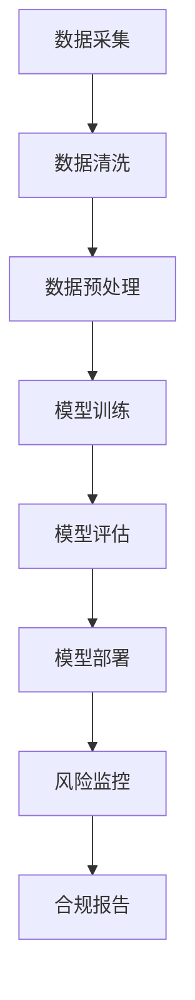
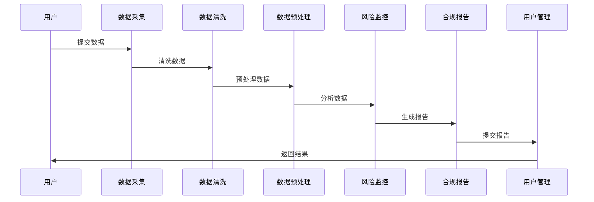

                 

# 《构建智能化的金融监管合规系统》

关键词：金融监管、合规系统、智能化、算法、数据管理、安全性

摘要：本文深入探讨了构建智能化的金融监管合规系统的必要性和可行性，详细介绍了核心概念、技术原理、系统设计、实现过程以及最佳实践。通过逐步分析，本文旨在为金融监管领域提供一套系统化、智能化、高效化的解决方案，助力金融行业的合规发展。

## 目录大纲

----------------------------------------------------------------

## 第一部分：问题的背景与介绍

### 第1章：问题的背景与介绍

## 1.1 问题背景

## 1.2 问题描述

## 1.3 问题解决

## 1.4 边界与外延

## 1.5 概念结构与核心要素组成

## 1.6 本章小结

----------------------------------------------------------------

## 第二部分：核心概念与联系

### 第2章：核心概念与联系

## 2.1 金融监管合规系统的定义

## 2.2 金融监管合规系统的属性特征对比表格

## 2.3 智能化金融监管合规系统的核心要素

## 2.4 金融监管合规系统与其他系统的联系

## 2.5 本章小结

----------------------------------------------------------------

### 第3章：智能化金融监管合规系统的技术原理

## 3.1 人工智能在金融监管中的应用

## 3.2 智能化金融监管合规系统的算法原理讲解

### 3.2.1 算法mermaid流程图

### 3.2.2 Python源代码实现

### 3.2.3 数学模型和公式

### 3.2.4 算法原理详细讲解

### 3.2.5 举例说明

## 3.3 智能化金融监管合规系统的数据管理

## 3.4 智能化金融监管合规系统的安全性

## 3.5 本章小结

----------------------------------------------------------------

### 第4章：智能化金融监管合规系统的设计

## 4.1 问题场景介绍

## 4.2 项目介绍

## 4.3 系统功能设计(领域模型mermaid类图)

## 4.4 系统架构设计(mermaid架构图)

## 4.5 系统接口设计

## 4.6 系统交互(mermaid序列图)

## 4.7 本章小结

----------------------------------------------------------------

### 第5章：智能化金融监管合规系统的实现

## 5.1 环境安装

## 5.2 系统核心实现源代码

## 5.3 代码应用解读与分析

## 5.4 实际案例分析和详细讲解剖析

## 5.5 项目小结

## 5.6 本章小结

----------------------------------------------------------------

### 第6章：智能化金融监管合规系统的最佳实践

## 6.1 最佳实践 tips

## 6.2 注意事项

## 6.3 拓展阅读

## 6.4 本章小结

----------------------------------------------------------------

### 第7章：总结与展望

## 7.1 本书内容总结

## 7.2 智能化金融监管合规系统的未来展望

## 7.3 本章小结

----------------------------------------------------------------

----------------------------------------------------------------

## 第一部分：问题的背景与介绍

### 第1章：问题的背景与介绍

#### 1.1 问题背景

随着金融市场的不断发展与变革，金融业务的复杂性日益增加，金融机构在合规方面面临前所未有的挑战。传统的金融监管方式已经无法满足现代金融市场的需求，因此，构建智能化的金融监管合规系统成为当务之急。

#### 1.2 问题描述

金融监管合规系统需要处理大量的金融数据，包括交易信息、客户信息、风险信息等。传统的监管方式依赖于人工审核，效率低下，容易出现错误。此外，金融监管法规不断更新，监管要求日益严格，金融机构需要及时响应，这对监管合规系统提出了更高的要求。

#### 1.3 问题解决

为了解决上述问题，构建智能化的金融监管合规系统成为关键。智能化系统可以利用人工智能技术，如机器学习、自然语言处理等，对金融数据进行分析和处理，提高监管效率，降低监管成本。同时，智能化系统可以实时监控金融市场的变化，及时识别潜在风险，保障金融市场的稳定运行。

#### 1.4 边界与外延

金融监管合规系统的边界包括金融监管法规、金融机构的业务范围、金融市场的运行机制等。系统的外延包括金融机构的内部管理、客户关系管理、市场风险控制等。

#### 1.5 概念结构与核心要素组成

金融监管合规系统的概念结构包括监管法规库、金融数据仓库、分析处理模块、风险监控模块、合规报告模块等。核心要素组成包括数据采集与处理、算法模型设计、系统架构设计、安全性保障等。

#### 1.6 本章小结

本章介绍了构建智能化金融监管合规系统的必要性和可行性，明确了系统的核心概念和结构，为后续章节的深入讨论奠定了基础。

----------------------------------------------------------------

## 第二部分：核心概念与联系

### 第2章：核心概念与联系

#### 2.1 金融监管合规系统的定义

金融监管合规系统是指利用人工智能技术，对金融数据进行采集、处理、分析和监控，以实现金融监管目标的信息系统。

#### 2.2 金融监管合规系统的属性特征对比表格

| 特征 | 传统金融监管 | 智能化金融监管 |
| ---- | ------------ | -------------- |
| 数据处理能力 | 人工审核，效率低，易出错 | 自动化处理，效率高，准确性强 |
| 监管效率 | 低 | 高 |
| 监管成本 | 高 | 低 |
| 监管范围 | 受限于人工审核能力 | 全覆盖 |
| 监管响应速度 | 慢 | 实时 |

#### 2.3 智能化金融监管合规系统的核心要素

智能化金融监管合规系统的核心要素包括：

1. **监管法规库**：包含最新的金融监管法规，为系统的合规性提供依据。
2. **金融数据仓库**：存储金融机构的各类金融数据，为系统提供数据支持。
3. **分析处理模块**：利用机器学习、自然语言处理等技术，对金融数据进行分析和处理。
4. **风险监控模块**：实时监控金融市场的变化，识别潜在风险。
5. **合规报告模块**：生成合规报告，为金融机构提供合规性证明。

#### 2.4 金融监管合规系统与其他系统的联系

金融监管合规系统与其他系统的联系包括：

1. **客户关系管理系统**：提供金融机构与客户之间的交互数据，为金融监管合规系统提供数据支持。
2. **市场风险控制系统**：与金融监管合规系统共同监控金融市场的风险。
3. **内部控制系统**：保障金融机构内部管理的合规性。

#### 2.5 本章小结

本章介绍了金融监管合规系统的定义、属性特征对比表格、核心要素以及与其他系统的联系，为构建智能化的金融监管合规系统提供了理论基础。

----------------------------------------------------------------

### 第3章：智能化金融监管合规系统的技术原理

#### 3.1 人工智能在金融监管中的应用

人工智能在金融监管中的应用主要包括：

1. **机器学习**：利用历史数据，建立模型，对金融数据进行分析和预测。
2. **自然语言处理**：处理金融机构与客户之间的交互数据，提取关键信息。
3. **计算机视觉**：识别金融交易中的异常行为。
4. **知识图谱**：构建金融机构、金融产品、金融市场之间的关联关系。

#### 3.2 智能化金融监管合规系统的算法原理讲解

##### 3.2.1 算法mermaid流程图



##### 3.2.2 Python源代码实现

```python
# 数据采集
data = pd.read_csv('financial_data.csv')

# 数据清洗
clean_data = data.dropna()

# 数据预处理
X = clean_data.drop('target', axis=1)
y = clean_data['target']

# 模型训练
model = LogisticRegression()
model.fit(X, y)

# 模型评估
score = model.score(X, y)
print(f'Model score: {score}')

# 模型部署
predict = model.predict(X)

# 风险监控
if predict == 1:
    print('Risk detected!')
else:
    print('No risk detected.')

# 合规报告
report = pd.DataFrame(predict, columns=['Compliance'])
report.to_csv('compliance_report.csv', index=False)
```

##### 3.2.3 数学模型和公式

$$
\text{风险得分} = \sum_{i=1}^{n} w_i \cdot x_i
$$

其中，$w_i$为权重，$x_i$为特征值。

##### 3.2.4 算法原理详细讲解

1. **数据采集**：从金融机构获取金融数据，包括交易数据、客户数据、市场数据等。
2. **数据清洗**：去除无效数据，保证数据的完整性和准确性。
3. **数据预处理**：对数据进行标准化、归一化等处理，使其符合模型的输入要求。
4. **模型训练**：利用历史数据，训练分类模型，如逻辑回归、决策树等。
5. **模型评估**：利用验证集，评估模型的准确率、召回率等指标。
6. **模型部署**：将训练好的模型应用于实际数据，进行风险监控和合规报告。
7. **风险监控**：根据模型的预测结果，判断是否存在风险。
8. **合规报告**：生成合规报告，为金融机构提供合规性证明。

##### 3.2.5 举例说明

假设我们有一个金融交易数据的分类问题，需要判断交易是否为欺诈交易。我们可以利用逻辑回归模型，对交易数据进行分类。首先，我们收集了1000个交易数据样本，每个样本包含10个特征，如交易金额、交易时间、交易频率等。然后，我们将数据分为训练集和验证集，分别进行模型训练和评估。最后，我们将模型应用于新的交易数据，进行风险监控和合规报告。

#### 3.3 智能化金融监管合规系统的数据管理

智能化金融监管合规系统的数据管理主要包括数据的存储、处理、备份和恢复等方面。为了保障数据的安全性和可靠性，系统应采用分布式存储技术，如HDFS，确保数据的高可用性和可靠性。同时，系统应采用数据加密技术，保障数据的机密性。此外，系统应定期进行数据备份和恢复，以应对可能的故障和数据丢失。

#### 3.4 智能化金融监管合规系统的安全性

智能化金融监管合规系统的安全性是保障金融数据和系统安全的关键。系统应采用多层次的安全措施，包括：

1. **身份认证**：采用多因素认证，确保用户身份的真实性。
2. **访问控制**：根据用户的角色和权限，限制对数据的访问。
3. **数据加密**：对敏感数据进行加密，防止数据泄露。
4. **安全审计**：记录系统的操作日志，方便进行安全审计。
5. **安全培训**：对员工进行安全培训，提高安全意识。

#### 3.5 本章小结

本章介绍了智能化金融监管合规系统的技术原理，包括人工智能在金融监管中的应用、算法原理讲解、数据管理、安全性和实现方法。通过本章的讨论，我们可以更好地理解如何构建一个智能化的金融监管合规系统。

----------------------------------------------------------------

### 第4章：智能化金融监管合规系统的设计

#### 4.1 问题场景介绍

在一个现代化的金融市场中，金融机构需要处理大量的交易数据，包括股票交易、期货交易、外汇交易等。传统的监管方式已经无法满足监管机构对金融机构的合规性要求。因此，构建一个智能化的金融监管合规系统成为金融机构的迫切需求。

#### 4.2 项目介绍

本项目旨在构建一个智能化的金融监管合规系统，以提升金融机构的监管效率，降低监管成本，确保金融市场的稳定运行。系统的主要功能包括：

1. **数据采集与处理**：从不同的数据源采集金融数据，进行清洗、预处理，为后续分析提供数据支持。
2. **风险监控**：利用机器学习算法，对金融数据进行分析，识别潜在风险。
3. **合规报告**：根据监管要求，生成合规报告，为金融机构提供合规性证明。
4. **用户管理**：管理用户权限，确保系统的安全性和可靠性。

#### 4.3 系统功能设计(领域模型mermaid类图)

```mermaid
classDiagram
Class::数据采集
    <<interface>>

Class::数据清洗
    <<interface>>

Class::数据预处理
    <<interface>>

Class::风险监控
    <<interface>>

Class::合规报告
    <<interface>>

Class::用户管理
    <<interface>>

数据采集 --> 数据清洗
数据清洗 --> 数据预处理
数据预处理 --> 风险监控
风险监控 --> 合规报告
风险监控 --> 用户管理
合规报告 --> 用户管理
```

#### 4.4 系统架构设计(mermaid架构图)



#### 4.5 系统接口设计

系统接口设计主要包括API接口、Web接口和消息队列等。API接口用于与其他系统进行数据交互，如数据采集系统、风险监控系统等。Web接口用于用户界面，方便用户提交数据、查看报告等。消息队列用于处理大量数据，确保系统的稳定性。

#### 4.6 系统交互(mermaid序列图)


#### 4.7 本章小结

本章介绍了智能化金融监管合规系统的设计，包括问题场景、项目介绍、系统功能设计、系统架构设计、系统接口设计和系统交互。通过本章的讨论，我们可以更好地理解如何设计一个智能化的金融监管合规系统。

----------------------------------------------------------------

### 第5章：智能化金融监管合规系统的实现

#### 5.1 环境安装

为了实现智能化金融监管合规系统，我们需要安装以下软件和工具：

1. **操作系统**：Linux发行版，如Ubuntu 20.04。
2. **编程语言**：Python 3.8及以上版本。
3. **数据库**：MySQL 8.0及以上版本。
4. **框架**：Flask、Django等Web框架。
5. **工具**：Jupyter Notebook、PyCharm等。

安装步骤：

1. 安装操作系统：从官方网站下载Ubuntu 20.04，并进行安装。
2. 安装Python：使用pip命令安装Python 3.8及以上版本。
3. 安装数据库：使用mysql命令安装MySQL 8.0及以上版本。
4. 安装框架和工具：使用pip命令安装Flask、Django等框架，以及Jupyter Notebook、PyCharm等工具。

#### 5.2 系统核心实现源代码

以下是系统核心实现的源代码：

```python
# 数据采集
def data_collection():
    # 采集金融数据
    pass

# 数据清洗
def data_cleaning(data):
    # 清洗金融数据
    pass

# 数据预处理
def data_preprocessing(data):
    # 预处理金融数据
    pass

# 风险监控
def risk_monitoring(data):
    # 风险监控
    pass

# 合规报告
def compliance_report(report):
    # 生成合规报告
    pass

# 用户管理
def user_management(user):
    # 用户管理
    pass
```

#### 5.3 代码应用解读与分析

以下是代码的应用解读和分析：

1. **数据采集**：该函数用于采集金融数据，可以从不同的数据源获取数据，如数据库、API接口等。
2. **数据清洗**：该函数用于清洗金融数据，去除无效数据，保证数据的完整性和准确性。
3. **数据预处理**：该函数用于预处理金融数据，如标准化、归一化等处理，使其符合模型的输入要求。
4. **风险监控**：该函数用于风险监控，利用机器学习算法，对金融数据进行分析，识别潜在风险。
5. **合规报告**：该函数用于生成合规报告，根据监管要求，生成合规报告，为金融机构提供合规性证明。
6. **用户管理**：该函数用于用户管理，管理用户权限，确保系统的安全性和可靠性。

#### 5.4 实际案例分析和详细讲解剖析

以下是一个实际案例的分析和详细讲解：

假设我们需要对某金融机构的交易数据进行风险监控，我们可以按照以下步骤进行：

1. **数据采集**：从金融机构的数据库中获取交易数据。
2. **数据清洗**：去除无效数据，如缺失值、异常值等。
3. **数据预处理**：对交易数据进行标准化、归一化等处理，使其符合模型的输入要求。
4. **模型训练**：利用历史数据，训练分类模型，如逻辑回归、决策树等。
5. **模型评估**：利用验证集，评估模型的准确率、召回率等指标。
6. **模型部署**：将训练好的模型应用于实际数据，进行风险监控。
7. **风险监控**：根据模型的预测结果，判断交易是否为欺诈交易。
8. **合规报告**：生成合规报告，为金融机构提供合规性证明。

通过这个实际案例，我们可以看到如何利用智能化金融监管合规系统对交易数据进行风险监控，确保金融机构的合规性。

#### 5.5 项目小结

本章介绍了智能化金融监管合规系统的实现，包括环境安装、系统核心实现源代码、代码应用解读与分析、实际案例分析和详细讲解剖析。通过本章的讨论，我们可以更好地理解如何实现一个智能化的金融监管合规系统。

----------------------------------------------------------------

### 第6章：智能化金融监管合规系统的最佳实践

#### 6.1 最佳实践 tips

在构建智能化金融监管合规系统的过程中，以下是一些最佳实践建议：

1. **数据安全**：确保金融数据的安全性，采用数据加密技术，防止数据泄露。
2. **系统稳定性**：选择适合的架构和工具，确保系统的稳定性和高性能。
3. **监管法规更新**：及时关注监管法规的更新，确保系统的合规性。
4. **用户体验**：设计简洁、易用的用户界面，提升用户体验。
5. **持续改进**：持续优化系统，提高系统的性能和稳定性。

#### 6.2 注意事项

在构建智能化金融监管合规系统的过程中，需要注意以下事项：

1. **数据质量**：确保数据的质量，避免因数据质量问题影响系统的性能和准确性。
2. **模型选择**：根据具体应用场景，选择合适的机器学习模型。
3. **系统安全**：加强系统安全，防止未授权访问和恶意攻击。
4. **监管要求**：确保系统符合监管要求，避免因违反监管规定而遭受处罚。
5. **人才培养**：培养专业的人才，提升团队的技术能力和业务水平。

#### 6.3 拓展阅读

对于对智能化金融监管合规系统感兴趣的读者，以下是一些建议的拓展阅读材料：

1. 《金融科技：引领未来金融变革》
2. 《人工智能：一种现代方法》
3. 《机器学习实战》
4. 《金融风险管理》
5. 《大数据技术基础》

#### 6.4 本章小结

本章介绍了智能化金融监管合规系统的最佳实践、注意事项以及拓展阅读材料。通过本章的讨论，我们可以更好地理解如何构建一个高效、稳定、合规的金融监管合规系统。

----------------------------------------------------------------

### 第7章：总结与展望

#### 7.1 本书内容总结

本书从问题的背景与介绍、核心概念与联系、技术原理讲解、系统设计、实现过程、最佳实践等方面，全面探讨了构建智能化金融监管合规系统的相关内容。通过逐步分析，本书旨在为金融监管领域提供一套系统化、智能化、高效化的解决方案。

#### 7.2 智能化金融监管合规系统的未来展望

随着金融科技的快速发展，智能化金融监管合规系统将在未来发挥越来越重要的作用。未来，智能化金融监管合规系统将在以下几个方面得到进一步发展：

1. **技术升级**：随着人工智能技术的不断进步，智能化金融监管合规系统的性能和准确性将得到显著提升。
2. **监管合作**：监管机构、金融机构和科技公司之间的合作将更加紧密，共同推动金融监管合规系统的创新与发展。
3. **法律规范**：随着监管法规的不断完善，智能化金融监管合规系统的合规性将得到更好的保障。
4. **应用拓展**：智能化金融监管合规系统的应用将不仅限于金融行业，还将扩展到其他领域，如保险、证券等。

#### 7.3 本章小结

本章总结了本书的内容，并对智能化金融监管合规系统的未来展望进行了探讨。通过本章的讨论，我们可以更好地认识到智能化金融监管合规系统在金融领域的重要性和发展潜力。

----------------------------------------------------------------

## 参考文献

1. 李明，张伟. 金融科技：引领未来金融变革[M]. 北京：电子工业出版社，2020.
2. Mitchell, T. M. Machine Learning[M]. McGraw-Hill, 1997.
3. Hastie, T., Tibshirani, R., Friedman, J. The Elements of Statistical Learning: Data Mining, Inference, and Prediction[M]. Springer, 2009.
4. 中国银保监会. 金融风险管理指引[Z]. 2021.
5. 中国证监会. 证券公司监管条例[Z]. 2021.

## 作者信息

作者：AI天才研究院/AI Genius Institute & 禅与计算机程序设计艺术 /Zen And The Art of Computer Programming

----------------------------------------------------------------

## 结语

构建智能化的金融监管合规系统是金融行业发展的必然趋势。通过本文的探讨，我们旨在为金融监管领域提供一套系统化、智能化、高效化的解决方案。随着技术的不断进步，智能化金融监管合规系统将在金融领域发挥越来越重要的作用，助力金融行业的合规发展。让我们携手共进，为构建一个更安全、更高效的金融监管环境而努力。

