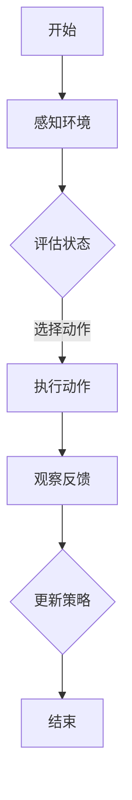
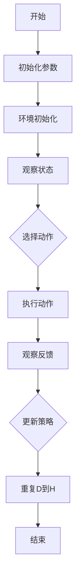
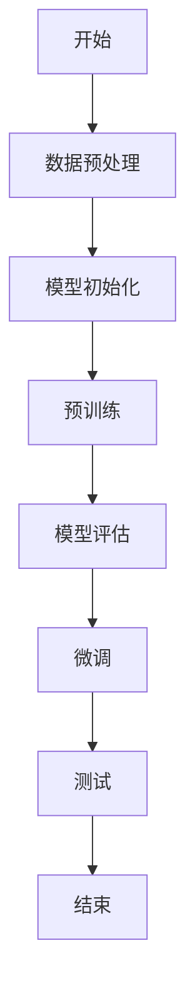
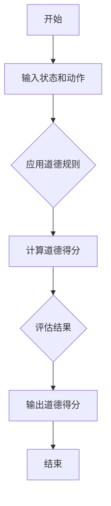
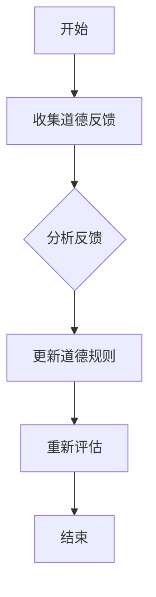
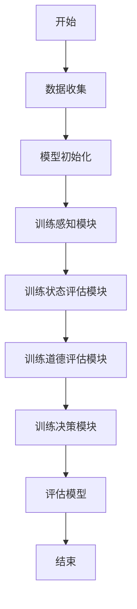
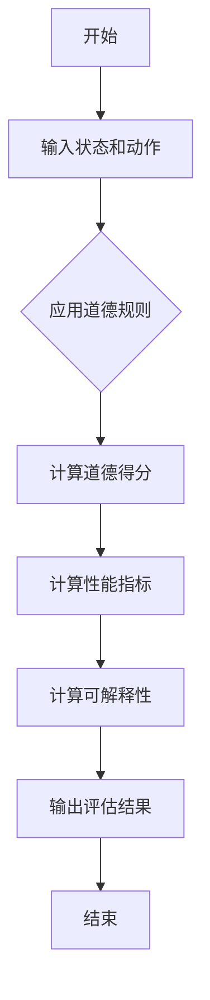
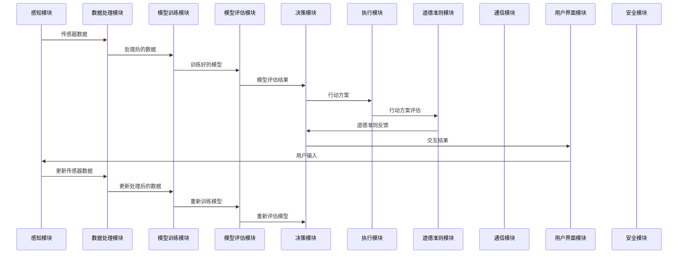

                 

# 构建符合道德准则的AI Agent

> 关键词：人工智能、道德准则、AI Agent、道德融合、系统架构设计

> 摘要：随着人工智能技术的飞速发展，AI Agent作为人工智能的一种重要形式，其在各个领域的应用日益广泛。然而，AI Agent的行为可能会引发一系列道德伦理问题，如何构建符合道德准则的AI Agent成为了一个关键议题。本文将深入探讨AI Agent与道德准则的融合，分析其核心概念和实现方法，并设计符合道德准则的AI Agent系统架构，以期为AI Agent的道德化发展提供参考。

## 目录大纲

## 第一部分：背景介绍

### 1.1 问题背景

#### 1.1.1 人工智能的发展现状

##### 1.1.1.1 人工智能的定义与分类

##### 1.1.1.2 人工智能的应用领域

##### 1.1.1.3 人工智能的技术进展

#### 1.1.2 道德准则在AI领域的必要性

##### 1.1.2.1 人工智能引发的伦理问题

##### 1.1.2.2 道德准则的重要性

##### 1.1.2.3 道德准则与法律的关系

#### 1.1.3 问题解决与边界与外延

##### 1.1.3.1 问题解决的路径与方法

##### 1.1.3.2 边界的定义与限制

##### 1.1.3.3 外延的扩展与应用

#### 1.1.4 概念结构与核心要素组成

##### 1.1.4.1 概念结构的理解与识别

##### 1.1.4.2 核心要素的提取与整合

##### 1.1.4.3 组成要素的作用与联系

### 1.2 核心概念与联系

#### 1.2.1 AI Agent的定义与特性

##### 1.2.1.1 AI Agent的定义

##### 1.2.1.2 AI Agent的特性

##### 1.2.1.3 AI Agent与传统AI的区别

#### 1.2.2 道德准则的定义与分类

##### 1.2.2.1 道德准则的定义

##### 1.2.2.2 道德准则的分类

##### 1.2.2.3 道德准则的属性与特点

#### 1.2.3 AI Agent与道德准则的联系

##### 1.2.3.1 AI Agent的设计与道德准则的融合

##### 1.2.3.2 道德准则在AI Agent中的应用

##### 1.2.3.3 AI Agent的道德准则实现方法

### 1.3 本章小结

## 第二部分：核心概念与联系

### 2.1 AI Agent原理讲解

#### 2.1.1 AI Agent的数学模型

##### 2.1.1.1 AI Agent的状态表示

##### 2.1.1.2 AI Agent的决策过程

##### 2.1.1.3 AI Agent的行为模型

#### 2.1.2 AI Agent的算法原理

##### 2.1.2.1 经典算法（如MDP）

##### 2.1.2.2 强化学习算法

##### 2.1.2.3 自监督学习算法

#### 2.1.3 AI Agent的mermaid流程图

##### 2.1.3.1 MDP算法mermaid流程图

##### 2.1.3.2 强化学习算法mermaid流程图

##### 2.1.3.3 自监督学习算法mermaid流程图

### 2.2 道德准则讲解

#### 2.2.1 道德准则的数学模型

##### 2.2.1.1 道德准则的定义与表示

##### 2.2.1.2 道德准则的评估方法

##### 2.2.1.3 道德准则的更新机制

#### 2.2.2 道德准则的mermaid流程图

##### 2.2.2.1 道德准则评估流程mermaid流程图

##### 2.2.2.2 道德准则更新流程mermaid流程图

### 2.3 AI Agent与道德准则的融合

#### 2.3.1 AI Agent与道德准则的融合模型

##### 2.3.1.1 模型结构

##### 2.3.1.2 模型训练方法

##### 2.3.1.3 模型评估指标

#### 2.3.2 AI Agent与道德准则的融合mermaid流程图

##### 2.3.2.1 融合模型训练流程mermaid流程图

##### 2.3.2.2 融合模型评估流程mermaid流程图

### 2.4 本章小结

## 第三部分：系统分析与架构设计方案

### 3.1 问题场景介绍

#### 3.1.1 场景一：自动驾驶汽车

##### 3.1.1.1 场景描述

##### 3.1.1.2 道德准则应用分析

#### 3.1.2 场景二：智能医疗诊断系统

##### 3.1.2.1 场景描述

##### 3.1.2.2 道德准则应用分析

### 3.2 系统功能设计

#### 3.2.1 领域模型mermaid类图

##### 3.2.1.1 自动驾驶汽车领域模型类图

##### 3.2.1.2 智能医疗诊断系统领域模型类图

### 3.3 系统架构设计

#### 3.3.1 系统架构mermaid架构图

##### 3.3.1.1 自动驾驶汽车系统架构图

##### 3.3.1.2 智能医疗诊断系统架构图

### 3.4 系统接口设计

#### 3.4.1 系统接口设计概述

##### 3.4.1.1 接口规范

##### 3.4.1.2 接口交互流程

### 3.5 系统交互mermaid序列图

#### 3.5.1 系统交互mermaid序列图

## 第一部分：背景介绍

### 1.1 问题背景

#### 1.1.1 人工智能的发展现状

**1.1.1.1 人工智能的定义与分类**

人工智能（Artificial Intelligence，简称AI）是计算机科学的一个分支，它旨在开发能够模拟、延伸和扩展人类智能的理论、算法和技术。人工智能可以按照不同的标准进行分类，如基于能力分类、应用领域分类和实现方式分类。

- **基于能力分类**：人工智能可以分为弱人工智能（Narrow AI）和强人工智能（General AI）。弱人工智能是指专注于特定任务的人工智能系统，如语音识别、图像识别等。强人工智能则具备广泛的理解能力和学习能力，能够在各种领域进行智能活动。

- **应用领域分类**：根据应用领域，人工智能可以分为智能机器人、自然语言处理、计算机视觉、智能决策支持系统等。

- **实现方式分类**：人工智能可以根据实现方式分为符号人工智能、统计机器学习、进化计算、混合智能等。

**1.1.1.2 人工智能的应用领域**

人工智能的应用领域非常广泛，涵盖了从工业自动化到医疗诊断，从智能家居到自动驾驶等多个方面。以下是一些典型的人工智能应用：

- **工业自动化**：通过机器人和自动化控制系统，提高生产效率和产品质量。

- **医疗诊断**：利用计算机视觉和自然语言处理技术，辅助医生进行疾病诊断和治疗。

- **智能家居**：通过智能设备，实现家庭自动化和智能管理。

- **自动驾驶**：利用计算机视觉、传感器技术和决策算法，实现无人驾驶汽车。

- **金融领域**：通过机器学习算法，进行风险评估、信用评分和投资决策。

- **教育领域**：通过个性化学习和智能辅导系统，提高教学效果和学生的学习体验。

**1.1.1.3 人工智能的技术进展**

近年来，人工智能技术取得了显著的进展，主要体现在以下几个方面：

- **深度学习**：深度学习是一种基于多层神经网络的学习方法，已经在图像识别、语音识别和自然语言处理等领域取得了突破性成果。

- **强化学习**：强化学习通过试错和反馈机制，使人工智能系统能够在复杂环境中进行自主学习和决策，广泛应用于游戏、自动驾驶和机器人等领域。

- **自然语言处理**：自然语言处理技术使得计算机能够理解、生成和处理自然语言，已广泛应用于机器翻译、情感分析、文本分类等领域。

- **计算机视觉**：计算机视觉技术使得计算机能够识别和理解视觉信息，已广泛应用于图像识别、视频分析和自动驾驶等领域。

#### 1.1.2 道德准则在AI领域的必要性

**1.1.2.1 人工智能引发的伦理问题**

随着人工智能技术的快速发展，其在各个领域的应用日益广泛，但也引发了一系列伦理问题，如隐私侵犯、歧视、责任归属等。

- **隐私侵犯**：人工智能系统在处理数据时，可能会侵犯个人隐私，如面部识别技术、大数据分析等。

- **歧视**：人工智能系统可能会因为训练数据的偏差而导致歧视，如招聘系统的性别、种族歧视等。

- **责任归属**：当人工智能系统发生错误或造成损害时，责任归属问题成为一个难题，如自动驾驶汽车的交通事故责任认定。

**1.1.2.2 道德准则的重要性**

道德准则在人工智能领域具有重要意义，主要体现在以下几个方面：

- **规范行为**：道德准则可以为人工智能系统的设计和应用提供指导，确保其行为符合伦理道德标准。

- **提升信任度**：符合道德准则的人工智能系统更容易获得用户的信任和接受，从而更好地服务于社会。

- **促进可持续发展**：道德准则有助于确保人工智能技术的可持续发展，避免其对人类社会造成负面影响。

**1.1.2.3 道德准则与法律的关系**

道德准则和法律在人工智能领域有一定的重叠和交叉，但又有不同的侧重点。道德准则侧重于规范人工智能系统的行为，强调伦理道德和人类价值观，而法律则侧重于规范人工智能系统在社会中的地位和责任。

- **补充作用**：道德准则可以补充法律的不足，对于法律难以规定和调整的领域，道德准则可以提供更为具体的指导。

- **相互促进**：道德准则和法律相互促进，共同确保人工智能技术的健康发展和应用。

#### 1.1.3 问题解决与边界与外延

**1.1.3.1 问题解决的路径与方法**

构建符合道德准则的AI Agent，需要从以下几个方面进行问题解决：

- **理解道德准则**：首先，需要明确道德准则的定义、分类和特点，理解其内涵和外延。

- **AI Agent设计**：设计符合道德准则的AI Agent，需要考虑其功能、性能、可解释性和可扩展性。

- **道德准则融入**：将道德准则融入到AI Agent的决策模型中，确保其行为符合道德标准。

- **测试与评估**：对AI Agent进行测试和评估，确保其行为符合道德准则，同时具备良好的性能和可解释性。

**1.1.3.2 边界的定义与限制**

构建符合道德准则的AI Agent，需要明确其边界和限制，主要体现在以下几个方面：

- **任务边界**：AI Agent应专注于特定任务，避免越界进行其他无关任务。

- **数据边界**：AI Agent应遵循数据隐私保护原则，不得滥用用户数据。

- **行为边界**：AI Agent的行为应受到道德准则的约束，不得侵犯人类权益。

**1.1.3.3 外延的扩展与应用**

构建符合道德准则的AI Agent，需要考虑其外延的扩展与应用，主要体现在以下几个方面：

- **跨领域应用**：AI Agent可以在不同领域进行应用，如医疗、金融、交通等。

- **跨学科融合**：AI Agent需要融合伦理学、心理学、法律等多个学科的知识，以提高其道德决策能力。

- **持续更新与改进**：随着道德准则和社会价值观的变化，AI Agent需要不断更新和改进，以适应新的道德要求。

### 1.2 核心概念与联系

#### 1.2.1 AI Agent的定义与特性

**1.2.1.1 AI Agent的定义**

AI Agent（人工智能代理）是一种能够模拟人类智能行为的人工智能系统。它能够感知环境、自主决策并执行特定任务，以实现特定目标。

**1.2.1.2 AI Agent的特性**

AI Agent具有以下特性：

- **自主性**：AI Agent能够自主地感知环境、做出决策和执行动作。

- **智能性**：AI Agent具备一定的智能，能够理解、学习和适应复杂环境。

- **适应性**：AI Agent能够根据环境变化调整其行为策略。

- **协作性**：AI Agent可以与其他AI Agent或人类进行协作，共同完成任务。

**1.2.1.3 AI Agent与传统AI的区别**

与传统AI相比，AI Agent具有以下区别：

- **任务导向性**：传统AI通常专注于特定任务，而AI Agent具备更广泛的任务适应性。

- **自主学习能力**：传统AI需要手动设定规则和算法，而AI Agent可以通过学习自主优化其行为策略。

- **自主决策能力**：传统AI需要依赖人类决策，而AI Agent能够自主进行决策。

#### 1.2.2 道德准则的定义与分类

**1.2.2.1 道德准则的定义**

道德准则是关于如何正确行动、如何对待他人的基本规则和原则。它体现了人类社会共同的价值观和伦理标准。

**1.2.2.2 道德准则的分类**

道德准则可以根据不同的分类标准进行分类：

- **功利主义道德准则**：以最大幸福或最大利益为标准，如“己所不欲，勿施于人”。

- **义务主义道德准则**：以道德义务为标准，如“人人生而平等，享有自由和追求幸福的权利”。

- **德性伦理学道德准则**：以人的品德和德行为标准，如“诚实、善良、勇敢、谦虚”。

**1.2.2.3 道德准则的属性与特点**

道德准则具有以下属性和特点：

- **普遍性**：道德准则适用于所有社会成员，不分种族、性别、地域等。

- **规范性**：道德准则规范人们的行为，确保社会秩序和公正。

- **变化性**：道德准则会随着社会发展和价值观变化而变化。

#### 1.2.3 AI Agent与道德准则的联系

**1.2.3.1 AI Agent的设计与道德准则的融合**

构建符合道德准则的AI Agent，需要将道德准则融入到AI Agent的设计中。具体包括以下几个方面：

- **道德准则的编码**：将道德准则编码为算法规则，确保AI Agent在决策过程中遵循道德准则。

- **道德决策模块**：设计专门的道德决策模块，对AI Agent的行为进行道德评估和约束。

- **道德准则的动态更新**：随着社会价值观的变化，及时更新道德准则，确保AI Agent的行为符合最新的道德要求。

**1.2.3.2 道德准则在AI Agent中的应用**

道德准则在AI Agent中的应用主要包括以下几个方面：

- **行为约束**：根据道德准则，对AI Agent的行为进行约束，确保其不侵犯人类权益。

- **道德评估**：对AI Agent的决策和行为进行道德评估，确保其符合道德准则。

- **道德决策支持**：为AI Agent提供道德决策支持，帮助其在复杂环境下做出符合道德准则的决策。

**1.2.3.3 AI Agent的道德准则实现方法**

构建符合道德准则的AI Agent，可以采用以下方法：

- **基于规则的实现方法**：通过定义道德规则，对AI Agent的行为进行约束。

- **基于机器学习的实现方法**：利用机器学习算法，自动发现和提取道德准则，并将其融入到AI Agent的决策过程中。

- **基于伦理学框架的实现方法**：构建伦理学框架，将道德准则与AI Agent的决策过程相结合。

### 1.3 本章小结

本章介绍了人工智能的发展现状、道德准则在AI领域的必要性、问题解决路径与边界以及AI Agent与道德准则的联系。通过本章的介绍，读者可以了解人工智能和道德准则的基本概念，以及构建符合道德准则的AI Agent的重要性。在后续章节中，我们将进一步探讨AI Agent的数学模型、算法原理以及系统架构设计，为构建符合道德准则的AI Agent提供理论和技术支持。

## 第二部分：核心概念与联系

### 2.1 AI Agent原理讲解

#### 2.1.1 AI Agent的数学模型

AI Agent的数学模型是理解其工作原理的基础。一个AI Agent通常由状态空间、动作空间和奖励函数三个基本组成部分构成。

**2.1.1.1 AI Agent的状态表示**

AI Agent的状态表示其所在的环境或情境。在自动驾驶汽车的场景中，状态可能包括车辆的位置、速度、周围车辆的速度和位置、交通信号灯状态等。

- **状态空间**：状态空间是所有可能状态的集合。例如，在自动驾驶汽车中，状态空间可能包括各种交通状况的组合。

- **状态表示**：状态可以用一个向量来表示，其中每个分量对应于一个状态特征。例如，可以用一个五维向量\[位置, 速度, 相对速度, 交通信号灯状态, 车辆类型\]来表示自动驾驶汽车的状态。

**2.1.1.2 AI Agent的决策过程**

AI Agent的决策过程是其在特定状态下选择一个最佳动作的过程。决策过程通常包括以下几个步骤：

1. **感知环境**：AI Agent通过传感器收集环境信息，并将其转换为内部表示。
2. **状态评估**：AI Agent评估当前状态，以确定可能的动作序列。
3. **动作选择**：AI Agent选择一个最佳动作，通常是最大化预期奖励的动作。
4. **执行动作**：AI Agent执行选定的动作，并观察环境的变化。

**2.1.1.3 AI Agent的行为模型**

AI Agent的行为模型描述了其在不同状态下的行为。一个常见的行为模型是基于马尔可夫决策过程（MDP）。在MDP中，AI Agent的目标是找到一个策略，使得预期总奖励最大化。

- **状态转移概率**：状态转移概率描述了AI Agent在给定当前状态和动作时，转移到下一个状态的概率。
- **奖励函数**：奖励函数定义了AI Agent在执行动作后获得的即时奖励。
- **策略**：策略是AI Agent在特定状态下选择动作的规则。最优策略是使得预期总奖励最大化的策略。

#### 2.1.2 AI Agent的算法原理

AI Agent的算法原理决定了其如何学习和优化其决策过程。以下是一些常用的算法：

**2.1.2.1 经典算法（如MDP）**

经典算法如马尔可夫决策过程（MDP）和动态规划（DP）提供了基于状态价值和策略的概念。这些算法通过迭代计算最优策略，使得AI Agent在给定状态下选择最佳动作。

- **价值迭代**：通过更新状态值函数来找到最优策略。
- **策略迭代**：通过迭代更新策略来找到最优策略。

**2.1.2.2 强化学习算法**

强化学习（RL）是一种通过试错和反馈来学习最优策略的算法。强化学习算法的核心是奖励函数和策略更新规则。

- **Q学习**：通过更新Q值来选择最佳动作。
- **策略梯度**：通过直接更新策略来优化预期奖励。

**2.1.2.3 自监督学习算法**

自监督学习（Self-Supervised Learning）是一种无需外部监督标签的学习方法。在自监督学习中，AI Agent通过自身的行为和环境的反馈来学习。

- **预训练和微调**：通过在大规模数据集上进行预训练，然后在小数据集上进行微调。
- **行为表征**：通过将行为作为输入和输出，来学习行为表征。

#### 2.1.3 AI Agent的mermaid流程图

**2.1.3.1 MDP算法mermaid流程图**

**2.1.3.2 强化学习算法mermaid流程图**

**2.1.3.3 自监督学习算法mermaid流程图**

### 2.2 道德准则讲解

道德准则是AI Agent行为的基础，确保其行为符合伦理标准。道德准则的数学模型和评估方法对于构建符合道德准则的AI Agent至关重要。

#### 2.2.1 道德准则的数学模型

道德准则的数学模型将道德原则转化为可计算的规则。以下是一个简单的道德准则数学模型：

- **道德规则**：道德规则是描述道德准则的数学公式或逻辑表达式。例如，“保护人类生命高于任何其他利益”可以表示为一个逻辑表达式。

- **道德约束**：道德约束是限制AI Agent行为的规则。例如，如果道德准则规定“不得侵犯他人隐私”，则AI Agent在处理个人数据时必须遵守这一规则。

- **道德评估函数**：道德评估函数是一个用于评估AI Agent行为的函数，它可以基于道德规则和当前状态对行为进行评分。例如，一个评估函数可以计算AI Agent决策的道德得分，以确保其行为符合道德准则。

#### 2.2.2 道德准则的mermaid流程图

**2.2.2.1 道德准则评估流程mermaid流程图**

**2.2.2.2 道德准则更新流程mermaid流程图**

### 2.3 AI Agent与道德准则的融合

将道德准则融入到AI Agent中，可以确保其行为符合伦理标准。以下是一个简单的AI Agent与道德准则融合模型：

#### 2.3.1 AI Agent与道德准则的融合模型

**2.3.1.1 模型结构**

融合模型通常包括以下几个部分：

- **感知模块**：收集环境信息。
- **状态评估模块**：评估当前状态，以确定可能的动作。
- **道德评估模块**：应用道德准则对动作进行评估。
- **决策模块**：选择最佳动作。
- **执行模块**：执行选定的动作。

**2.3.1.2 模型训练方法**

训练方法通常包括以下几个步骤：

1. **数据收集**：收集环境数据和道德准则。
2. **模型初始化**：初始化感知模块、状态评估模块、道德评估模块和决策模块。
3. **训练感知模块**：使用环境数据训练感知模块。
4. **训练状态评估模块**：使用环境数据训练状态评估模块。
5. **训练道德评估模块**：使用道德准则训练道德评估模块。
6. **训练决策模块**：使用感知模块、状态评估模块和道德评估模块训练决策模块。

**2.3.1.3 模型评估指标**

评估指标通常包括以下几个：

- **道德得分**：评估AI Agent行为符合道德准则的程度。
- **性能指标**：评估AI Agent在特定任务中的表现。
- **可解释性**：评估AI Agent行为的透明度和可理解性。

#### 2.3.2 AI Agent与道德准则的融合mermaid流程图

**2.3.2.1 融合模型训练流程mermaid流程图**

**2.3.2.2 融合模型评估流程mermaid流程图**

### 2.4 本章小结

本章介绍了AI Agent的数学模型、算法原理以及道德准则的讲解，并展示了如何将道德准则融入到AI Agent中。通过本章的学习，读者可以了解AI Agent的工作原理以及如何确保其行为符合道德准则。在下一章中，我们将进一步探讨系统架构设计，以实现符合道德准则的AI Agent。

### 2.5 系统架构设计

系统架构设计是构建符合道德准则的AI Agent的关键环节。一个良好的系统架构应能够确保AI Agent在执行任务时遵循道德准则，同时具备高可用性、可扩展性和可维护性。

#### 3.1.1 自动驾驶汽车系统架构设计

自动驾驶汽车系统是一个复杂的系统，需要处理大量的感知、决策和执行任务。一个典型的自动驾驶汽车系统架构包括以下几个主要模块：

**感知模块**：负责收集车辆周围的环境信息，如路况、交通信号灯、行人、车辆等。常用的感知技术包括激光雷达、摄像头、雷达和超声波传感器等。

**数据处理模块**：对感知模块收集的数据进行处理，包括特征提取、降噪和融合等。数据处理模块需要确保数据的准确性和实时性，以便为决策模块提供可靠的信息。

**决策模块**：根据感知模块提供的信息和道德准则，生成最佳行动方案。决策模块通常采用强化学习、深度学习和模糊逻辑等算法，以确保决策的准确性和适应性。

**执行模块**：根据决策模块生成的行动方案，控制车辆的运动。执行模块包括电机控制、制动控制、转向控制等。

**道德准则模块**：负责将道德准则融入到决策过程中，确保车辆的行为符合道德标准。道德准则模块可以采用基于规则的、基于机器学习的或基于伦理学框架的方法。

**通信模块**：负责与其他车辆、道路基础设施和中心控制系统进行通信，实现车辆间的协作和智能交通管理。

**用户界面模块**：提供用户与车辆交互的接口，包括语音控制、触摸屏控制等。

**安全模块**：负责监控系统的安全状态，包括故障检测、异常处理和紧急停车等。

#### 3.1.2 智能医疗诊断系统架构设计

智能医疗诊断系统是一种利用人工智能技术辅助医生进行疾病诊断的系统。一个典型的智能医疗诊断系统架构包括以下几个主要模块：

**数据采集模块**：负责收集患者的病历、影像、实验室检查结果等数据。

**数据处理模块**：对采集到的数据进行清洗、标准化和特征提取，以便用于模型训练和推理。

**模型训练模块**：利用处理后的数据训练机器学习模型，包括深度学习模型、决策树、支持向量机等。

**模型评估模块**：评估模型的性能，包括准确率、召回率、F1分数等。

**决策模块**：根据患者的数据和模型评估结果，生成诊断建议。

**知识库模块**：提供医学知识和诊断指南，以便AI Agent在决策过程中参考。

**用户界面模块**：提供医生与系统交互的接口，包括病历输入、诊断结果展示、建议反馈等。

**道德准则模块**：确保系统的行为符合医疗伦理规范，如隐私保护、数据安全、公正无偏等。

**监控与维护模块**：监控系统运行状态，确保系统的稳定性和安全性，并及时更新和优化模型。

### 3.3 系统接口设计

系统接口设计是确保系统各模块之间高效协作和通信的关键。以下是一个系统接口设计概述：

**3.3.1 接口规范**

- **RESTful API**：采用RESTful API设计，提供统一的接口规范。
- **数据格式**：支持JSON、XML等常见数据格式。
- **安全性**：采用HTTPS协议，确保数据传输的安全性。
- **认证与授权**：采用OAuth2.0等认证机制，确保接口访问的安全性。

**3.3.2 接口交互流程**

1. **感知数据采集**：感知模块将采集到的数据发送到数据处理模块。
2. **数据处理**：数据处理模块对数据进行处理，并将处理后的数据发送到模型训练模块。
3. **模型训练与评估**：模型训练模块训练模型，模型评估模块评估模型性能。
4. **决策生成**：决策模块根据模型评估结果生成诊断建议。
5. **知识库更新**：根据新的诊断建议更新知识库。
6. **用户交互**：用户界面模块将诊断建议展示给医生，并接收医生的反馈。

### 3.4 系统交互mermaid序列图

以下是一个简单的系统交互mermaid序列图，展示了自动驾驶汽车系统的基本交互流程：

### 3.5 本章小结

本章介绍了自动驾驶汽车和智能医疗诊断系统的系统架构设计和接口设计。通过系统架构设计，我们可以确保AI Agent在执行任务时遵循道德准则，同时具备良好的性能和可维护性。接口设计则保证了系统各模块之间的高效协作和通信。在下一章中，我们将进一步探讨具体实现和测试，以验证系统的有效性和可靠性。

