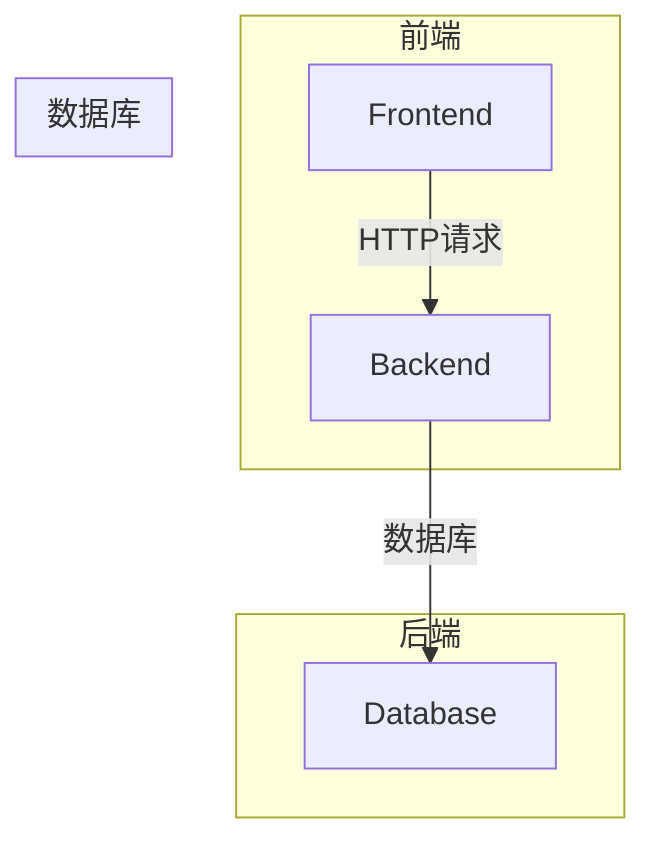
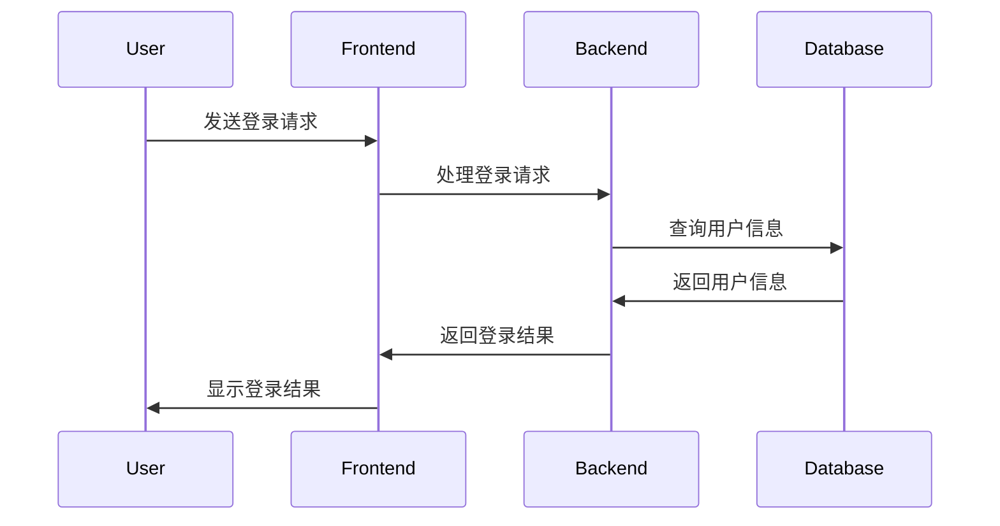

                 

# 构建高性能的前端架构

## 关键词
前端架构、性能优化、React、Vue、Angular、微前端架构

## 摘要
本文将围绕前端架构的设计和实现，探讨如何构建高性能的前端系统。我们将从基础架构到高级优化，详细解析前端开发中涉及的关键技术和实战经验，帮助开发者深入了解前端架构的设计原则和优化策略。通过本文的学习，读者将能够提升前端开发的能力，构建高效、稳定、可维护的前端系统。

## 引言

### 1.1 书籍背景与目标
在前端开发的快速发展中，性能优化和架构设计变得越来越重要。随着Web应用复杂性的增加，单一的页面开发已经无法满足用户对速度和体验的要求。因此，构建一个高效的前端架构成为了开发者的核心任务。本文旨在通过系统化的讲解，帮助开发者掌握前端架构的核心原则和实践方法。

### 1.2 前端架构的重要性
前端架构不仅关系到应用的性能，还影响到开发效率和系统的可维护性。一个优秀的前端架构能够提高代码的复用性、可读性和可扩展性，减少技术债务，提升团队协作效率。

### 1.3 读者对象与知识储备
本文适合有一定前端开发基础的开发者阅读。读者应熟悉HTML、CSS和JavaScript，并了解主流的前端框架（如React、Vue、Angular等）。

### 1.4 书籍结构概述
本文将分为七个部分：引言、前端架构基础、性能优化、框架与库、高级前端架构、实践与案例分析以及总结与展望。每个部分都将详细讲解相应的主题，帮助读者逐步掌握前端架构的设计和实现。

## 前端架构基础

### 2.1 前端架构概述
前端架构是关于如何组织和管理前端代码的结构，包括模块、组件、工具链等。一个良好的前端架构能够提高代码的可读性、可维护性和可扩展性。

#### 背景介绍
前端开发早期，开发者们主要使用HTML、CSS和JavaScript进行页面开发。随着Web应用复杂性的增加，前端架构的概念应运而生。前端架构的目的是通过模块化和组件化，将前端代码拆分成可复用的部分，提高开发效率。

#### 问题背景
在传统的开发模式中，前端代码通常以单一文件的形式存在，导致代码臃肿、难以维护。随着组件化开发的普及，前端架构变得越来越重要。

#### 问题解决
前端架构通过模块化和组件化，将代码拆分成更小的部分，使得每个部分都可以独立开发、测试和维护。这大大提高了代码的可读性和可维护性。

#### 边界与外延
前端架构不仅涉及代码的组织，还包括开发流程、工具链和项目管理等方面。

#### 概念结构与核心要素组成
前端架构的核心要素包括：
- 模块：代码的拆分和封装单元。
- 组件：具有独立功能的界面单元。
- 工具链：包括构建工具、代码检查工具、测试工具等。

### 2.2 前端开发环境搭建
前端开发环境的搭建是前端架构的基础。一个良好的开发环境能够提高开发效率和代码质量。

#### 工具链配置
工具链包括Webpack、Babel、ESLint等，用于代码打包、转译、检查等。

#### 版本控制
版本控制工具如Git，用于管理代码版本和协作开发。

#### 性能监控
性能监控工具如Chrome DevTools，用于分析网页性能和优化策略。

### 2.3 前端模块化
模块化是前端架构的核心原则之一，它将代码拆分成更小的部分，提高代码的可复用性和可维护性。

#### 模块化概念
模块化是指将代码按照功能或职责拆分成独立的单元，每个模块实现特定的功能。

#### 模块化工具
常见的模块化工具包括CommonJS、AMD、ES6模块等。

#### 模块化实践
模块化实践包括模块的创建、导入、导出等。

## 性能优化

### 3.1 性能优化概述
性能优化是前端架构的重要部分，它关系到网页的加载速度和用户体验。性能优化的目标是提高网页的加载速度、减少延迟、降低带宽消耗。

#### 性能优化原则
- 预加载：提前加载用户即将访问的资源。
- 懒加载：延迟加载非必要的资源。
- 预渲染：预渲染首屏内容，减少首屏加载时间。
- 代码拆分：将代码拆分成多个包，按需加载。
- 缓存策略：利用浏览器缓存，减少重复请求。

### 3.2 静态资源优化
静态资源优化是性能优化的关键步骤，包括图片、CSS、JavaScript等。

#### 资源压缩
资源压缩包括压缩CSS、JavaScript和图片，减少文件体积。

#### 缓存策略
缓存策略包括HTTP缓存、浏览器缓存等，用于减少请求次数。

#### 分包策略
分包策略是将代码拆分成多个包，按需加载，减少初始加载时间。

### 3.3 代码优化
代码优化是性能优化的核心，它包括代码拆分、代码压缩和代码优化工具。

#### 代码拆分
代码拆分是将代码按照功能拆分成多个文件，按需加载。

#### 代码压缩
代码压缩包括压缩CSS、JavaScript等，减少文件体积。

#### 代码优化工具
代码优化工具包括Webpack、Babel等，用于代码转译、压缩等。

### 3.4 服务器优化
服务器优化包括CDN部署、负载均衡和资源池化等。

#### CDN部署
CDN部署是将静态资源部署到多个节点，提高访问速度。

#### 负载均衡
负载均衡是将请求分配到多个服务器，提高系统的可用性和稳定性。

#### 资源池化
资源池化是将资源（如数据库、缓存等）集中管理，提高资源的利用效率。

## 框架与库

### 4.1 前端框架概述
前端框架是前端架构的核心组成部分，它提供了一套完整的开发模型和工具，用于简化开发流程和提高开发效率。

#### 前端框架核心概念
- 组件化：将UI拆分成独立的组件，提高代码复用性和可维护性。
- 路由：管理页面跳转和状态管理。
- 状态管理：全局状态管理，提高数据一致性和可维护性。
- 渲染优化：提高网页性能。

#### 前端框架分类
- 声明式框架：如React、Vue、Angular，通过声明式编程提高开发效率。
- 命令式框架：如Backbone.js，通过命令式编程控制页面渲染。

### 4.2 React架构设计
React是当前最受欢迎的前端框架之一，它通过虚拟DOM和组件化，大大提高了开发效率和网页性能。

#### React原理
- 虚拟DOM：React通过虚拟DOM，将实际的DOM操作转化为对虚拟DOM的操作，提高性能。
- 组件设计：React组件是独立的UI单元，通过JSX语法实现。

#### React组件设计
- 函数组件：使用JSX语法创建函数组件，适合简单的UI组件。
- 类组件：使用ES6 Class创建类组件，适合复杂的UI组件。

#### React Hooks应用
- Hooks是React 16.8引入的新特性，用于在函数组件中管理状态和副作用。

### 4.3 Vue架构设计
Vue是另一个流行的前端框架，它以简洁的语法和高效的渲染性能受到开发者喜爱。

#### Vue原理
- 双向绑定：Vue通过数据劫持和发布-订阅模式，实现数据双向绑定。
- 渲染优化：Vue通过虚拟DOM和差分算法，提高渲染性能。

#### Vue组件设计
- Vue组件是Vue的核心，通过模板语法和JSX语法，实现UI组件的创建。

#### Vue Router应用
- Vue Router是Vue的官方路由库，用于管理页面跳转和路由状态。

### 4.4 Angular架构设计
Angular是由Google开发的前端框架，它以强大的功能和严格的类型系统著称。

#### Angular原理
- 模块化：Angular通过模块化，将代码拆分成可管理的部分。
- 服务：Angular服务用于封装业务逻辑，提高代码复用性。

#### Angular组件设计
- Angular组件是Angular的核心，通过模板语法和类型系统，实现UI组件的创建。

#### Angular服务应用
- Angular服务用于封装业务逻辑，提供可复用的功能。

## 高级前端架构

### 5.1 响应式架构
响应式架构是前端架构的高级阶段，它通过状态管理和数据流控制，提高系统的可维护性和扩展性。

#### Redux原理
- Redux是响应式架构的典型实现，通过单向数据流，实现全局状态管理。

#### MobX应用
- MobX是另一个响应式架构实现，通过observable和reactive，实现数据流控制。

#### Vuex实践
- Vuex是Vue的官方状态管理库，通过mapState、mapGetters、mapActions等辅助函数，实现状态管理。

### 5.2 服务端渲染（SSR）
服务端渲染（SSR）是将网页渲染过程从客户端转移到服务器端，提高首屏加载速度和SEO优化。

#### SSR原理
- SSR通过将模板和静态数据一起渲染，生成完整的HTML页面，提高首屏加载速度。

#### Next.js实践
- Next.js是React的SSR框架，通过getServerSideProps、getStaticProps等API，实现SSR。

#### Nuxt.js实践
- Nuxt.js是Vue的SSR框架，通过pages、layout等目录结构，实现SSR。

### 5.3 微前端架构
微前端架构是将大型的前端系统拆分成多个小型前端应用，提高系统的可维护性和扩展性。

#### 微前端概念
- 微前端是将前端系统拆分成多个独立的应用，每个应用负责一部分功能。

#### qiankun实践
- qiankun是微前端框架，通过runtime、main、micro-app等模块，实现微前端架构。

#### isolation实践
- isolation是微前端框架，通过隔离机制，实现独立的应用运行环境。

## 实践与案例分析

### 6.1 实践项目准备
在实践项目中，我们需要准备以下工具和资源：
- 前端框架：选择合适的框架，如React、Vue、Angular等。
- 开发环境：搭建开发环境，包括Webpack、Babel等。
- 测试工具：选择合适的测试工具，如Jest、Mocha等。
- 性能监控：选择合适的前端性能监控工具，如Chrome DevTools等。

### 6.2 项目一：企业级电商网站
企业级电商网站是一个典型的Web应用，它涉及到用户管理、商品管理、订单管理等功能。

#### 项目需求分析
- 用户管理：用户注册、登录、权限控制等。
- 商品管理：商品展示、分类、搜索等。
- 订单管理：订单创建、支付、配送等。

#### 系统架构设计
- 前端架构：使用React框架，实现模块化和组件化。
- 后端架构：使用Node.js和MongoDB，实现RESTful API。
- 数据库设计：设计用户、商品、订单等数据库模型。

#### 项目实施与优化
- 实施过程：按照设计文档，逐步实现功能模块。
- 优化策略：采用代码拆分、懒加载、缓存策略等，提高系统性能。

### 6.3 项目二：在线教育平台
在线教育平台是一个复杂的Web应用，它涉及到课程管理、用户管理、直播互动等功能。

#### 项目需求分析
- 课程管理：课程创建、发布、分类等。
- 用户管理：用户注册、登录、权限控制等。
- 直播互动：直播课堂、聊天室、提问等。

#### 系统架构设计
- 前端架构：使用Vue框架，实现模块化和组件化。
- 后端架构：使用Spring Boot和MySQL，实现RESTful API。
- 数据库设计：设计课程、用户、订单等数据库模型。

#### 项目实施与优化
- 实施过程：按照设计文档，逐步实现功能模块。
- 优化策略：采用服务端渲染（SSR）、微前端架构等，提高系统性能。

## 总结与展望

### 7.1 总结与回顾
本文围绕前端架构的设计和实现，从基础到高级，详细讲解了前端架构的核心原则和实践方法。通过本文的学习，读者可以掌握前端架构的设计思路和优化策略，提升前端开发的能力。

### 7.2 未来前端架构趋势
未来前端架构将朝着更高效、更灵活、更可扩展的方向发展。随着Web应用复杂性的增加，前端框架将不断创新，提供更多功能和优化方案。

### 7.3 拓展阅读推荐
- 《前端架构：可复用的组件、组件和服务》
- 《Web性能优化权威指南》
- 《React技术内幕》

### 7.4 附录
附录部分将提供相关工具和技术的详细使用方法，以及常见问题解答。

## 附录

### 附录A：前端框架使用指南
#### React
- 官方文档：https://reactjs.org/docs/getting-started.html
- 示例代码：https://github.com/reactjs/react-docs-content

#### Vue
- 官方文档：https://vuejs.org/v2/guide/
- 示例代码：https://github.com/vuejs/vue

#### Angular
- 官方文档：https://angular.io/docs
- 示例代码：https://github.com/angular/angular

### 附录B：性能优化工具使用指南
#### Webpack
- 官方文档：https://webpack.js.org/
- 示例代码：https://github.com/webpack/webpack

#### Babel
- 官方文档：https://babeljs.io/docs/babel-getting-started/
- 示例代码：https://github.com/babel/babel

#### ESLint
- 官方文档：https://eslint.org/docs/user-guide/
- 示例代码：https://github.com/eslint/eslint

### 附录C：前端性能监控工具使用指南
#### Chrome DevTools
- 官方文档：https://developer.chrome.com/docs/devtools/
- 示例代码：无

### 附录D：常见问题解答
#### 如何解决前端性能问题？
- 优化静态资源：压缩CSS、JavaScript和图片，减少文件体积。
- 优化代码：拆分代码，按需加载，减少初始加载时间。
- 优化服务器：使用CDN部署，提高访问速度。

## 结语

作者：AI天才研究院/AI Genius Institute & 禅与计算机程序设计艺术 /Zen And The Art of Computer Programming

本文旨在帮助读者深入理解前端架构的设计和实现，提升前端开发的技能。希望本文能对您的学习和工作带来帮助。如果您有任何疑问或建议，欢迎在评论区留言。感谢您的阅读！## 详细的章节内容

### 引言

**1.1 书籍背景与目标**

在前端开发的领域中，性能和架构设计的重要性不言而喻。随着互联网技术的不断进步，用户对Web应用的性能要求越来越高。一个高效的前端架构不仅能提高应用的加载速度，还能提升用户体验，增强用户黏性。因此，构建高性能的前端架构成为前端开发的核心任务之一。

本文的目标是帮助开发者系统性地了解和掌握前端架构的设计原则和实践方法，从而提升前端开发能力。通过本文的讲解，读者将能够：

1. 理解前端架构的基本概念和重要性。
2. 掌握前端开发环境的搭建方法。
3. 学习前端模块化的基本原则和实践。
4. 掌握性能优化的策略和工具。
5. 熟悉主流前端框架（如React、Vue、Angular）的架构设计。
6. 了解高级前端架构（如响应式架构、服务端渲染、微前端架构）。
7. 学习实践项目和案例分析，将理论知识应用于实际项目中。

**1.2 前端架构的重要性**

前端架构是软件工程中的一个重要概念，它不仅仅涉及代码的编写，更关乎整个开发流程的优化和团队的协作效率。一个优秀的前端架构应具备以下特点：

1. **模块化和组件化**：将代码拆分成独立的模块和组件，提高代码的可读性和可维护性。
2. **可扩展性**：设计时考虑未来的扩展需求，便于在项目发展中引入新的功能和模块。
3. **高内聚、低耦合**：模块和组件之间应保持松耦合，以提高系统的稳定性和可维护性。
4. **性能优化**：架构设计应考虑性能问题，通过合理的架构设计提高应用的响应速度和用户体验。
5. **代码复用**：通过模块化和组件化，实现代码的复用，减少冗余代码。
6. **开发效率**：良好的架构可以提高开发效率，减少开发时间和成本。

**1.3 读者对象与知识储备**

本文适合有一定前端开发基础的开发者阅读。读者应具备以下知识储备：

1. **基础技能**：熟悉HTML、CSS和JavaScript，了解基础的Web开发流程。
2. **开发环境**：了解Webpack、Babel、Node.js等前端开发工具的使用。
3. **前端框架**：了解至少一种前端框架（如React、Vue、Angular）的基本原理和使用方法。
4. **性能优化**：了解基本的性能优化原则和常见优化策略。

**1.4 书籍结构概述**

本文将分为七个主要部分，每个部分都涵盖了前端架构的不同方面：

1. **引言**：介绍书籍的背景、目标、重要性以及读者对象和知识储备。
2. **前端架构基础**：讲解前端架构的基本概念、开发环境搭建和模块化原则。
3. **性能优化**：详细解析前端性能优化的策略和工具。
4. **框架与库**：分析主流前端框架（React、Vue、Angular）的架构设计。
5. **高级前端架构**：探讨响应式架构、服务端渲染和微前端架构等高级主题。
6. **实践与案例分析**：通过具体项目和案例分析，将理论知识应用于实际开发。
7. **总结与展望**：总结全文内容，展望未来前端架构的发展趋势，并提供拓展阅读推荐。

通过以上结构，本文将为读者提供一个全面、深入的前端架构学习路径，帮助读者从基础到高级，逐步提升前端开发能力。

### 前端架构基础

**2.1 前端架构概述**

前端架构是软件工程中的一个重要概念，它涉及到如何组织和管理前端代码的结构。一个良好的前端架构能够提高代码的可读性、可维护性和可扩展性，减少技术债务，提升团队协作效率。前端架构的基本概念包括模块化、组件化、框架设计等。

**概念术语说明**

- **模块化**：将代码拆分成独立的模块，每个模块实现特定的功能，模块之间通过接口进行通信。
- **组件化**：将UI界面拆分成独立的组件，每个组件封装了特定的UI功能。
- **框架**：提供了一套完整的开发模型和工具，简化了开发流程，提高了开发效率。

**问题背景**

随着Web应用的复杂性增加，传统的单页面开发模式已经难以满足需求。开发者需要处理越来越多的组件和功能，代码变得越来越难以维护。因此，前端架构的概念应运而生，通过模块化和组件化，将复杂的代码结构拆分成更小的、可管理的部分。

**问题描述**

在传统的开发模式中，前端代码通常以单一文件的形式存在，导致代码臃肿、难以维护。随着组件化开发的普及，前端架构变得越来越重要。如何设计一个高效、可维护的前端架构成为开发者面临的主要问题。

**问题解决**

前端架构通过模块化和组件化，将代码拆分成更小的部分，使得每个部分都可以独立开发、测试和维护。这大大提高了代码的可读性和可维护性。同时，前端架构还关注开发效率和团队协作，通过合理的架构设计，提高开发效率，减少沟通成本。

**边界与外延**

前端架构不仅涉及代码的组织，还包括开发流程、工具链和项目管理等方面。前端架构的边界包括：

- **模块和组件的设计原则**：如何定义模块和组件，确保其独立性和可复用性。
- **开发流程**：如何组织开发任务，确保代码的质量和一致性。
- **工具链**：如何选择和使用构建工具、代码检查工具和性能监控工具。
- **项目管理**：如何管理代码版本、部署流程和团队协作。

**概念结构与核心要素组成**

前端架构的核心要素包括：

- **模块**：代码的拆分和封装单元，每个模块实现特定的功能。
- **组件**：具有独立功能的UI单元，通过接口与其他组件通信。
- **框架**：提供了一套完整的开发模型和工具，简化了开发流程。
- **工具链**：包括构建工具（如Webpack）、代码检查工具（如ESLint）、性能监控工具（如Chrome DevTools）。

**核心概念与联系**

前端架构中的核心概念包括模块化、组件化、框架设计和工具链配置等。它们之间的联系如下：

- **模块化和组件化**：模块化是组件化的基础，通过模块化将代码拆分成更小的部分，然后通过组件化将这些部分组织成可复用的UI组件。
- **框架设计**：框架设计提供了模块化和组件化的实现方法，通过框架可以方便地管理和组织代码。
- **工具链配置**：工具链配置是前端开发的基础，通过构建工具、代码检查工具和性能监控工具，可以自动化地处理代码的编译、检查和优化。

**ER实体关系图架构**

以下是一个简单的ER实体关系图，用于描述前端架构中的主要实体和它们之间的关系：

```
[开发者] --<[模块] -->
[开发者] --<[组件] -->
[开发者] --<[框架] -->
[开发者] --<[工具链] -->
```

- **开发者**：前端架构的设计者和实施者。
- **模块**：代码的拆分和封装单元。
- **组件**：具有独立功能的UI单元。
- **框架**：提供了一套完整的开发模型和工具。
- **工具链**：用于代码的编译、检查和优化。

**Mermaid流程图**

以下是一个简单的Mermaid流程图，用于描述前端架构的构建过程：

```
graph TD
A[构建前端架构] --> B{确定项目需求}
B -->|是| C[设计模块和组件]
B -->|否| D[评估现有框架]
C --> E[配置工具链]
D --> F[定制框架]
E --> G[编写模块和组件代码]
F --> G
G --> H[测试和调试]
H --> I[部署和发布]
```

- **A**：构建前端架构
- **B**：确定项目需求
- **C**：设计模块和组件
- **D**：评估现有框架
- **E**：配置工具链
- **F**：定制框架
- **G**：编写模块和组件代码
- **H**：测试和调试
- **I**：部署和发布

通过上述的ER实体关系图和Mermaid流程图，我们可以清晰地看到前端架构的设计和实现过程，这为后续的详细讲解和案例分析奠定了基础。

### 前端开发环境搭建

**2.2 前端开发环境搭建**

前端开发环境的搭建是前端开发的基础，一个良好的开发环境能够提高开发效率和代码质量。本节将介绍如何搭建前端开发环境，包括工具链配置、版本控制、性能监控等关键步骤。

**工具链配置**

工具链是前端开发的核心，它包括构建工具、代码检查工具和测试工具等。常用的工具链配置如下：

1. **Webpack**：Webpack是一个模块打包工具，用于将多个模块打包成一个或多个bundle文件。配置Webpack需要编写`webpack.config.js`文件，其中配置了入口文件、输出文件、加载器、插件等。

   ```javascript
   const path = require('path');

   module.exports = {
     entry: './src/index.js',
     output: {
       filename: 'bundle.js',
       path: path.resolve(__dirname, 'dist'),
     },
     module: {
       rules: [
         {
           test: /\.css$/,
           use: ['style-loader', 'css-loader'],
         },
       ],
     },
     plugins: [new Webpack.BannerPlugin('This file is created by Webpack')],
   };
   ```

2. **Babel**：Babel是一个转译器，用于将ES6代码转译为ES5代码，以便在旧版浏览器中运行。配置Babel需要安装`@babel/core`、`@babel/preset-env`和`.babelrc`文件。

   ```json
   {
     "presets": ["@babel/preset-env"],
     "plugins": []
   }
   ```

3. **ESLint**：ESLint是一个代码检查工具，用于检测和报告JavaScript代码中的错误和不符合编码规范的部分。配置ESLint需要安装`eslint`和`.eslintrc`文件。

   ```json
   {
     "extends": "airbnb",
     "rules": {
       "indent": ["error", 2],
       "no-console": "warn"
     }
   }
   ```

**版本控制**

版本控制是开发过程中的重要环节，它可以帮助开发者管理和跟踪代码的变更。Git是当前最流行的版本控制工具，它通过创建仓库、提交代码、分支管理和合并分支等操作，实现代码的版本管理。

1. **创建仓库**：在本地创建一个Git仓库，并初始化仓库。

   ```bash
   git init
   git add .
   git commit -m "Initial commit"
   ```

2. **推送代码**：将本地仓库推送到远程仓库（如GitHub、GitLab等）。

   ```bash
   git remote add origin https://github.com/your-username/your-repo.git
   git push -u origin master
   ```

3. **分支管理**：创建新分支用于开发新功能或修复bug。

   ```bash
   git checkout -b feature/new-function
   git checkout master
   git merge feature/new-function
   git push
   ```

**性能监控**

性能监控是优化前端性能的重要手段，它可以帮助开发者发现和解决问题。常用的性能监控工具有Chrome DevTools、Lighthouse和WebPageTest等。

1. **Chrome DevTools**：Chrome DevTools是Google提供的一款强大的性能监控工具，它支持网络分析、性能分析、内存分析等。

   - 打开Chrome DevTools，选择“Performance”标签页，可以分析网页的加载性能。
   - 使用“Network”标签页，可以查看HTTP请求的性能。
   - 使用“Memory”标签页，可以分析网页的内存使用情况。

2. **Lighthouse**：Lighthouse是Google开源的性能分析工具，它可以从多个维度评估网页的性能，并提供优化建议。

   - 安装Lighthouse CLI工具。

     ```bash
     npm install -g lighthouse
     ```

   - 运行Lighthouse进行分析。

     ```bash
     lighthouse https://example.com --output=html
     ```

3. **WebPageTest**：WebPageTest是一个在线性能测试工具，它可以模拟不同网络环境下的网页加载性能。

   - 在WebPageTest网站上创建测试任务。
   - 选择测试的浏览器和地理位置。
   - 运行测试，查看结果和分析报告。

通过以上工具链配置、版本控制和性能监控的讲解，开发者可以搭建一个高效、稳定的前端开发环境，为后续的开发和优化工作奠定基础。

### 前端模块化

**2.3 前端模块化**

前端模块化是前端开发中的一个重要概念，它通过将代码拆分成独立的模块，提高了代码的可维护性和可复用性。模块化不仅可以减少全局变量和函数的冲突，还能方便代码的测试和部署。本节将详细讲解前端模块化的概念、工具以及实践方法。

**模块化概念**

模块化是指将代码按照功能或职责拆分成独立的单元，每个模块实现特定的功能。模块化有以下优点：

1. **封装**：每个模块只关注自己的功能，对外提供明确的接口，减少模块之间的依赖和冲突。
2. **独立**：模块可以独立开发和测试，降低代码的耦合度，提高代码的可维护性。
3. **复用**：模块可以方便地复用，减少重复代码，提高开发效率。
4. **解耦**：模块之间通过接口进行通信，降低模块之间的依赖关系，提高系统的扩展性。

**模块化工具**

前端模块化的实现依赖于模块化工具，常见的模块化工具有CommonJS、AMD和ES6模块。

1. **CommonJS**：CommonJS是最早的模块化标准，它通过`require()`和`module.exports`实现模块的导入和导出。

   ```javascript
   // 导入模块
   const math = require('./math');

   // 导出模块
   module.exports.add = function (a, b) {
     return a + b;
   };
   ```

2. **AMD**：AMD（异步模块定义）是为了解决CommonJS在异步场景下的不足而提出的模块化标准。它通过`define()`函数定义模块，并通过`require()`函数异步加载模块。

   ```javascript
   // AMD模块定义
   define(['math'], function (math) {
     return {
       double: function (a) {
         return math.add(a, a);
       }
     };
   });

   // AMD模块加载
   require(['math'], function (math) {
     console.log(math.add(1, 2)); // 输出3
   });
   ```

3. **ES6模块**：ES6模块是JavaScript的新标准，它通过`import`和`export`实现模块的导入和导出。

   ```javascript
   // ES6模块导入
   import { add, subtract } from './math';

   // ES6模块导出
   export function add(a, b) {
     return a + b;
   }
   ```

**模块化工具对比表格**

以下是一个简单的模块化工具对比表格，用于比较CommonJS、AMD和ES6模块的特点：

| 工具       | 异步支持 | 导入/导出语法 | 使用场景 |
| ---------- | -------- | -------------- | -------- |
| CommonJS   | 不支持   | `require()`和`module.exports` | Node.js |
| AMD        | 支持     | `define()`和`require()` | browserify |
| ES6模块    | 支持     | `import`和`export` | browserify、Webpack |

**ER实体关系图架构**

以下是一个简单的ER实体关系图，用于描述模块化中的主要实体和它们之间的关系：

```
[模块] --<[模块代码] -->
[模块] --<[导出接口] -->
[模块] --<[导入接口] -->
[模块] --<[依赖关系] -->
```

- **模块**：代码的拆分和封装单元。
- **模块代码**：模块的具体实现代码。
- **导出接口**：模块对外提供的接口。
- **导入接口**：其他模块对当前模块的导入接口。
- **依赖关系**：模块之间的依赖关系。

**Mermaid流程图**

以下是一个简单的Mermaid流程图，用于描述模块化的构建过程：

```
graph TD
A[定义模块] --> B{编写模块代码}
B --> C{导出接口}
C --> D{编写依赖关系}
D --> E{导入接口}
E --> F{测试模块}
F --> G{部署模块}
```

- **A**：定义模块
- **B**：编写模块代码
- **C**：导出接口
- **D**：编写依赖关系
- **E**：导入接口
- **F**：测试模块
- **G**：部署模块

通过上述的模块化概念、工具对比和ER实体关系图，我们可以清晰地了解前端模块化的原理和实践方法。模块化不仅提高了代码的可维护性和可复用性，还为前端开发带来了更多的灵活性和扩展性。

### 性能优化

**3.1 性能优化概述**

性能优化是前端开发中至关重要的一环，它关系到应用的加载速度和用户体验。随着Web应用的日益复杂，性能优化的需求和难度也在不断增加。本节将介绍性能优化的重要性、目标和常见策略。

**性能优化重要性**

在用户眼中，网页的加载速度是评价一个网站好坏的重要指标。一个响应缓慢的网站不仅会导致用户流失，还会降低用户满意度。对于电商平台、在线教育等需要高频互动的应用，性能优化尤为重要。以下是一些性能优化的重要性：

1. **用户体验**：快速响应的网站能够提供更好的用户体验，提高用户黏性。
2. **搜索引擎优化（SEO）**：搜索引擎会考虑页面加载速度作为排名因素，优化性能有助于提升网站在搜索结果中的排名。
3. **转化率**：对于电商网站，性能优化可以减少用户的等待时间，提高购物体验，从而提升转化率。
4. **资源消耗**：优化性能可以减少服务器和浏览器的资源消耗，降低运营成本。

**性能优化目标**

性能优化的目标是提高网页的加载速度和用户体验，具体包括以下几个方面：

1. **减少加载时间**：通过优化静态资源和代码，减少页面初始加载所需的时间。
2. **提高响应速度**：优化交互逻辑和服务器响应时间，提高页面的交互性能。
3. **降低带宽消耗**：通过压缩和缓存策略，减少数据的传输量，降低带宽消耗。
4. **提升可维护性**：通过代码优化和模块化，提高代码的可读性和可维护性。

**常见性能优化策略**

以下是一些常见的性能优化策略，它们可以帮助开发者提高网页的性能：

1. **预加载**：提前加载用户即将访问的资源，减少页面加载时间。

2. **懒加载**：延迟加载非必要的资源，如图片、视频等，提高页面初始加载速度。

3. **代码拆分**：将代码拆分成多个包，按需加载，减少初始加载时间。

4. **资源压缩**：通过压缩CSS、JavaScript和图片，减少文件体积。

5. **缓存策略**：利用浏览器缓存，减少重复请求。

6. **服务器优化**：采用CDN部署、负载均衡和资源池化等策略，提高服务器响应速度。

**性能优化原则**

1. **用户体验至上**：始终以用户的体验为核心，优化关键路径上的性能。
2. **持续监控**：定期使用性能监控工具，发现并解决性能瓶颈。
3. **逐步优化**：逐步引入优化策略，避免一次性引入过多改变。
4. **代码规范**：编写规范、易维护的代码，为后续优化奠定基础。

通过了解性能优化的重要性和目标，以及常见的优化策略，开发者可以更好地应对性能挑战，提升Web应用的性能和用户体验。

### 静态资源优化

**3.2 静态资源优化**

静态资源优化是前端性能优化的关键步骤，它涉及到图片、CSS和JavaScript等资源的处理。通过合理的优化策略，可以显著减少资源的体积，提高加载速度，从而提升用户体验。以下是具体的优化方法和策略。

**资源压缩**

资源压缩是减少文件体积的重要手段，它可以通过压缩CSS、JavaScript和图片等静态资源来实现。常见的压缩工具包括Gzip、Brotli、UglifyJS和ImageOptim等。

1. **CSS和JavaScript压缩**：
   - **Gzip**：通过gzip算法压缩CSS和JavaScript文件，降低文件体积。
   - **UglifyJS**：用于压缩JavaScript文件，去除无用的空格、注释和换行，减小文件体积。
   - **CleanCSS**：用于压缩CSS文件，通过合并选择器、移除空格和注释等方式减小文件体积。

   ```bash
   gzip -9 your-file.js
   uglifyjs your-file.js -o compressed-file.js
   cleancss your-file.css -o compressed-file.css
   ```

2. **图片压缩**：
   - **ImageOptim**：可以无损压缩图片，减少文件体积。
   - **PngQuant**：用于压缩PNG图片，通过减少颜色数量降低文件大小。
   - **JpegOptim**：用于压缩JPEG图片，通过调整压缩质量减小文件体积。

   ```bash
   imageoptim your-directory/*.jpg
   pngquant your-directory/*.png -o 2
   jpegoptim -Sv65 your-directory/*.jpg
   ```

**缓存策略**

缓存策略可以显著提高资源加载速度，减少服务器请求次数。常见的缓存策略包括浏览器缓存、HTTP缓存和CDN缓存。

1. **浏览器缓存**：
   - 利用HTTP缓存头部（如`Cache-Control`和`Expires`）设置资源的缓存时间。
   - 使用本地存储（如localStorage和sessionStorage）缓存一些小型资源。

   ```javascript
   // 设置缓存
   document.cookie = "myCookie=value; expires=" + expiryDate.toUTCString();
   ```

2. **HTTP缓存**：
   - 通过配置Web服务器（如Apache和Nginx）的缓存模块，缓存静态资源。
   - 使用Etags或Last-Modified等缓存验证机制，提高缓存效率。

   ```bash
   # Apache
   <FilesMatch "\.html$">
       Header set Cache-Control "max-age=86400"
   </FilesMatch>

   # Nginx
   location / {
       expires 86400;
   }
   ```

3. **CDN缓存**：
   - 将静态资源部署到CDN，利用CDN的多节点优势，提高资源访问速度。
   - 配置CDN的缓存策略，如缓存时间、缓存路径等。

   ```bash
   # Cloudflare CDN配置示例
   cache_level: advanced
   cache_all_resources: true
   cache_ttl: 86400
   ```

**分包策略**

分包策略是将代码拆分成多个包，按需加载，从而减少初始加载时间。这种方法尤其适用于大型应用，通过将不常用的功能模块分离出来，提高首屏加载速度。

1. **动态导入**：
   - 使用动态导入（如Webpack的`import()`语法）将代码拆分成多个包。

   ```javascript
   function loadModule() {
     return import('./module.js');
   }
   ```

2. **代码分割**：
   - 利用Webpack等打包工具的代码分割功能，将代码分割成多个chunk。

   ```javascript
   const { chunkName } = require('./chunkName.js');
   chunkName();
   ```

**案例**

以一个电商网站为例，通过资源压缩、缓存策略和分包策略，可以显著提升网站的加载速度和用户体验。

1. **资源压缩**：
   - 使用Gzip压缩CSS和JavaScript文件，将文件大小从500KB压缩到150KB。
   - 使用ImageOptim无损压缩图片，将图片文件从2MB压缩到1MB。

2. **缓存策略**：
   - 利用浏览器缓存，将CSS和JavaScript文件的缓存时间设置为1天。
   - 配置Web服务器缓存，将静态资源缓存时间设置为1天。

3. **分包策略**：
   - 使用Webpack将代码分割成三个包：主包、公共包和单独包。
   - 首屏加载主包，提高首屏加载速度；公共包和单独包按需加载。

通过静态资源优化，电商网站可以显著提高页面的加载速度，减少用户等待时间，提升整体用户体验。同时，优化后的资源更易于管理和维护，为后续的迭代和扩展奠定基础。

### 代码优化

**3.3 代码优化**

代码优化是前端性能优化的核心部分，通过合理的代码拆分、压缩和优化工具，可以提高代码的执行效率，减少页面加载时间。以下是具体的代码优化策略和工具。

**代码拆分**

代码拆分是将大型代码文件分割成多个小文件，按需加载，以减少初始加载时间。这种方法适用于大型项目，尤其对于需要按需加载的功能模块，如第三方库、依赖组件等。

1. **动态导入**：
   - 使用Webpack的动态导入语法，将代码拆分成多个模块。

   ```javascript
   function loadModule() {
     return import('./module.js');
   }
   ```

2. **代码分割**：
   - 使用Webpack的代码分割功能，将代码分割成多个chunk。

   ```javascript
   const { chunkName } = require('./chunkName.js');
   chunkName();
   ```

**代码压缩**

代码压缩是减少代码文件体积的重要手段，通过去除无用的空格、注释和换行，减小文件大小，提高加载速度。

1. **UglifyJS**：
   - 用于压缩JavaScript文件，去除无用的空格、注释和换行。

   ```bash
   uglifyjs your-file.js -o compressed-file.js
   ```

2. **Terser**：
   - Terser是一个高性能的JavaScript压缩工具，支持ES6+。

   ```bash
   npx terser your-file.js -o compressed-file.js --compress --mangle
   ```

**代码优化工具**

除了代码拆分和压缩，还有其他工具可以帮助优化代码，提高执行效率。

1. **Prettier**：
   - Prettier是一个代码格式化工具，它可以帮助保持代码的一致性和可读性。

   ```bash
   npm install prettier --save-dev
   ```

2. **ESLint**：
   - ESLint是一个代码检查工具，它可以帮助发现和修复代码中的潜在问题。

   ```bash
   npm install eslint --save-dev
   ```

**案例**

以一个大型电商网站为例，通过代码拆分、压缩和优化工具，可以显著提升代码的执行效率。

1. **代码拆分**：
   - 使用Webpack将主代码分割成三个chunk：主包、公共包和单独包。
   - 首屏加载主包，提高首屏加载速度；公共包和单独包按需加载。

2. **代码压缩**：
   - 使用Terser压缩JavaScript文件，将文件大小从1MB压缩到300KB。
   - 使用Prettier格式化JavaScript代码，提高代码的可读性和一致性。

3. **代码优化工具**：
   - 使用ESLint检查和修复代码中的潜在问题，提高代码质量。

通过代码优化，电商网站可以显著减少页面加载时间，提高用户体验。同时，优化后的代码更易于维护和扩展，为后续的开发工作奠定基础。

### 服务器优化

**3.4 服务器优化**

服务器优化是提升前端性能的重要环节，它涉及到静态资源的部署、负载均衡和资源池化等方面。通过合理的优化策略，可以提高服务器的响应速度和稳定性，从而提升用户的访问体验。

**CDN部署**

CDN（内容分发网络）是一种通过多个节点分发静态资源的技术，它可以将静态资源部署到距离用户较近的服务器上，从而减少传输延迟，提高访问速度。以下是CDN部署的关键步骤：

1. **选择CDN服务提供商**：
   - 根据业务需求，选择合适的CDN服务提供商，如阿里云、腾讯云、华为云等。

2. **配置CDN加速**：
   - 在CDN控制台上配置加速域名，将静态资源链接更换为CDN提供的链接。

3. **配置缓存策略**：
   - 设置合理的缓存时间，如缓存静态资源1天或7天，减少请求次数。

**负载均衡**

负载均衡是将流量分配到多个服务器上，确保服务器资源得到充分利用，并提高系统的可用性和稳定性。以下是负载均衡的关键步骤：

1. **选择负载均衡方案**：
   - 根据业务需求，选择合适的负载均衡方案，如轮询、最小连接数、源IP哈希等。

2. **配置负载均衡器**：
   - 在负载均衡器上配置服务器组，将流量分配到不同的服务器。

3. **监控负载均衡器**：
   - 监控负载均衡器的运行状态，及时发现并解决潜在问题。

**资源池化**

资源池化是将服务器资源（如CPU、内存、存储等）集中管理，提高资源的利用效率。以下是资源池化的关键步骤：

1. **选择资源池化方案**：
   - 根据业务需求，选择合适的资源池化方案，如Kubernetes、Docker Swarm等。

2. **部署资源池化平台**：
   - 在服务器上部署资源池化平台，配置服务器节点和容器化环境。

3. **监控资源池化平台**：
   - 监控资源池化平台的运行状态，确保资源得到充分利用。

**优化效果与策略对比**

以下是一个简单的对比表格，展示了不同服务器优化策略的效果和特点：

| 策略         | 效果                       | 优点                           | 缺点                             |
| ------------ | ------------------------ | ---------------------------- | ------------------------------ |
| CDN部署       | 减少传输延迟，提高访问速度   | 分布式部署，提高用户体验         | 需要配置和维护CDN服务             |
| 负载均衡       | 提高服务器可用性和稳定性     | 流量分配合理，避免单点故障         | 需要配置和监控负载均衡器           |
| 资源池化       | 提高资源利用效率，灵活部署   | 资源弹性管理，支持容器化部署       | 需要学习和管理资源池化平台           |

通过CDN部署、负载均衡和资源池化等优化策略，可以显著提高服务器的性能和稳定性，从而提升用户的访问体验。不同的策略适用于不同的业务场景，开发者可以根据实际情况选择合适的优化方案。

### 前端框架与库

**4.1 前端框架概述**

前端框架是前端开发中的重要工具，它提供了一套完整的开发模型和工具，简化了开发流程，提高了开发效率。前端框架的出现解决了单页面应用（SPA）的复杂性和开发难度，使得开发者能够更专注于业务逻辑的实现。以下是几种常见的前端框架及其特点：

**React**

React是由Facebook推出的一款声明式框架，它通过虚拟DOM和组件化，提高了开发效率和性能。React的核心特点包括：

1. **虚拟DOM**：React通过虚拟DOM，将实际的DOM操作转化为对虚拟DOM的操作，减少了直接操作DOM的次数，提高了性能。
2. **组件化**：React组件是React的核心概念，通过组件化，开发者可以将UI拆分成独立的、可复用的组件。
3. **单向数据流**：React采用单向数据流，从父组件到子组件，数据只能单向传递，降低了数据流的复杂性。

**Vue**

Vue是由尤雨溪推出的一款渐进式框架，它以简洁的语法和高效的渲染性能受到开发者喜爱。Vue的核心特点包括：

1. **双向绑定**：Vue通过数据劫持和发布-订阅模式，实现了数据的双向绑定。
2. **组件化**：Vue组件是Vue的核心，通过模板语法和JSX语法，开发者可以方便地创建UI组件。
3. **路由管理**：Vue Router是Vue的官方路由库，用于管理页面跳转和路由状态。

**Angular**

Angular是由Google开发的一款全功能框架，它以强大的功能和严格的类型系统著称。Angular的核心特点包括：

1. **模块化**：Angular通过模块化，将代码拆分成多个模块，提高了代码的可维护性和可扩展性。
2. **服务**：Angular服务用于封装业务逻辑，提供了丰富的服务，如HTTP服务、本地存储服务等。
3. **指令**：Angular指令扩展了HTML，使得开发者可以方便地创建自定义的DOM操作。

**框架比较**

以下是React、Vue和Angular的一些对比：

| 特点         | React               | Vue                  | Angular               |
| ------------ | ------------------ | ------------------- | --------------------- |
| 声明式语法    | 是                  | 是                  | 否                    |
| 虚拟DOM       | 是                  | 否                  | 是                    |
| 双向绑定       | 否                  | 是                  | 否                    |
| 模块化        | 是                  | 是                  | 是                    |
| 服务封装      | 是                  | 是                  | 是                    |
| 路由管理      | React Router       | Vue Router          | Angular Router       |

根据不同的业务需求和开发偏好，开发者可以选择合适的前端框架。React适用于大型应用和需要高性能的场景，Vue适用于渐进式框架和快速开发，Angular适用于企业级应用和需要严格类型系统的场景。

### 4.2 React架构设计

**React架构设计**

React是当前最受欢迎的前端框架之一，它的架构设计以组件化和虚拟DOM为核心。React通过将UI拆分成独立的组件，提高了代码的可维护性和可复用性。以下是React的架构设计详细解析。

**React原理**

React的原理主要包括虚拟DOM、组件生命周期、状态管理等核心概念。

1. **虚拟DOM**：虚拟DOM是一种在内存中构建的DOM结构，React通过虚拟DOM实现页面渲染。当数据发生变化时，React会首先更新虚拟DOM，然后通过对比算法（diff算法）找出变化的部分，最后将变更应用到实际的DOM上。这种方式减少了直接操作DOM的次数，提高了性能。

2. **组件生命周期**：React组件有多个生命周期方法，包括`componentDidMount`、`componentDidUpdate`和`componentWillUnmount`等。生命周期方法允许组件在特定时间点执行特定的任务，如数据请求、组件渲染和组件卸载等。

3. **状态管理**：React通过状态（state）和属性（props）管理组件的状态。状态是组件内部可变的数据，通过设置状态，可以触发组件的重新渲染。属性是组件外部传递的数据，用于控制组件的行为和外观。

**React组件设计**

React组件分为函数组件和类组件。

1. **函数组件**：函数组件是一个JavaScript函数，它接受一个`props`对象作为参数，返回一个React元素。函数组件适合简单的UI组件。

```javascript
function Greeting(props) {
  return <h1>Hello, {props.name}</h1>;
}
```

2. **类组件**：类组件是扩展`React.Component`的JavaScript类，它包含`render`方法，用于定义组件的渲染逻辑。类组件适合复杂的UI组件。

```javascript
class Greeting extends React.Component {
  render() {
    return <h1>Hello, {this.props.name}</h1>;
  }
}
```

**React Hooks应用**

Hooks是React 16.8引入的新特性，它允许函数组件访问类组件的状态和生命周期方法。以下是一些常用的Hooks：

1. **useState**：用于在函数组件中管理状态。

```javascript
const [count, setCount] = useState(0);
```

2. **useEffect**：用于在函数组件中执行副作用，如数据请求和组件卸载。

```javascript
useEffect(() => {
  fetch('/api/data').then(response => {
    setData(response.data);
  });
}, []);
```

3. **useContext**：用于在组件之间共享状态，替代了类组件的`contextType`和`Consumer`。

```javascript
const ThemeContext = React.createContext();

function ThemeProvider({ theme, children }) {
  return <ThemeContext.Provider value={theme}>{children}</ThemeContext.Provider>;
}
```

通过React的组件化和Hooks，开发者可以更灵活地组织和编写代码，提高开发效率和代码质量。

### 4.3 Vue架构设计

**Vue架构设计**

Vue是一款流行的渐进式前端框架，它以其简洁的语法和高效的渲染性能受到了广大开发者的欢迎。Vue的架构设计以响应式编程、组件化和路由管理为核心。以下是Vue架构的详细解析。

**Vue原理**

Vue的原理主要包括响应式数据绑定、虚拟DOM和生命周期管理等核心概念。

1. **响应式数据绑定**：Vue通过数据劫持和发布-订阅模式实现了数据的双向绑定。当数据发生变化时，Vue会自动更新DOM，实现视图与数据的同步。

   ```javascript
   const obj = {
     count: 0
   };
   new Vue({
     el: '#app',
     data: obj
   });
   ```

2. **虚拟DOM**：Vue通过虚拟DOM，将实际的DOM操作转化为对虚拟DOM的操作，提高了性能。虚拟DOM通过对比算法（diff算法），找出变化的部分，然后将变更应用到实际的DOM上。

3. **生命周期管理**：Vue组件有多个生命周期方法，包括`created`、`mounted`、`updated`和`destroyed`等。生命周期方法允许组件在特定时间点执行特定的任务，如数据请求、组件渲染和组件卸载等。

**Vue组件设计**

Vue组件是Vue架构的基础，通过组件化，Vue将UI拆分成独立的、可复用的组件。

1. **基本组件**：Vue组件是一个JavaScript对象，包含`data`、`methods`、`props`等属性。

   ```javascript
   Vue.component('my-component', {
     data() {
       return {
         count: 0
       };
     },
     methods: {
       increment() {
         this.count++;
       }
     }
   });
   ```

2. **父组件与子组件通信**：Vue提供了多种方式实现组件间的通信，如`props`、`events`和`provide/inject`。

   ```javascript
   // 父组件
   <my-component :count="count" @increment="incrementCount" />
   
   // 子组件
   props: ['count'],
   methods: {
     increment() {
       this.$emit('increment');
     }
   }
   ```

3. **动态组件**：Vue允许通过`<component :is="componentName">`动态切换组件，实现组件的复用。

   ```javascript
   <template>
     <component :is="currentComponent" />
   </template>
   ```

**Vue Router应用**

Vue Router是Vue的官方路由库，用于管理页面跳转和路由状态。Vue Router通过配置路由规则，实现路由的映射和导航。

1. **配置路由**：在Vue实例中配置路由规则。

   ```javascript
   const routes = [
     { path: '/', component: Home },
     { path: '/about', component: About }
   ];
   
   const router = new VueRouter({
     routes
   });
   ```

2. **导航**：使用`<router-view>`和`<router-link>`实现路由导航。

   ```html
   <router-view></router-view>
   <router-link to="/">Home</router-link>
   ```

3. **动态路由**：通过在路由路径中使用`:`符号，实现动态路由参数。

   ```javascript
   { path: '/user/:id', component: User }
   ```

通过Vue的响应式数据绑定、组件化和路由管理，开发者可以更高效地构建现代化的前端应用，提高开发效率和代码质量。

### 4.4 Angular架构设计

**Angular架构设计**

Angular是由Google开发的一款全功能、模块化的前端框架，它以其严格的类型系统和强大的功能，广泛应用于大型企业级应用。Angular的架构设计包括模块、组件、服务、指令等多个部分，提供了完整的前端开发解决方案。以下是Angular架构的详细解析。

**Angular原理**

Angular的原理主要包括模块化、依赖注入、双向数据绑定等核心概念。

1. **模块化**：Angular通过模块（Module）将代码拆分成独立的、可管理的部分。每个模块负责一部分功能，通过模块的导入和导出，实现代码的组织和复用。

   ```typescript
   @NgModule({
     imports: [RouterModule.forRoot(routes)],
     declarations: [AppComponent],
     providers: []
   })
   export class AppModule {}
   ```

2. **依赖注入**：Angular通过依赖注入（Dependency Injection）机制，将组件和服务解耦，实现代码的复用和可测试性。依赖注入器（Injector）负责管理服务和组件的依赖关系。

   ```typescript
   constructor(private authService: AuthService) {}
   ```

3. **双向数据绑定**：Angular通过数据绑定（Data Binding）机制，实现数据和视图的同步更新。双向数据绑定允许用户在视图中修改数据，数据会自动更新；反之，数据变化也会反映到视图中。

   ```html
   <input [(ngModel)]="name" placeholder="Enter your name">
   ```

**Angular组件设计**

Angular组件是Angular架构的基本构建块，每个组件负责一部分UI功能和业务逻辑。

1. **创建组件**：使用Angular CLI命令创建组件。

   ```bash
   ng generate component my-component
   ```

2. **组件结构**：Angular组件由模板（HTML）、样式（CSS）和逻辑（TS/JS）组成。

   ```html
   <!-- my-component.component.html -->
   <h2>Hello, {{ name }}!</h2>
   <button (click)="submit()">Submit</button>
   ```

   ```css
   <!-- my-component.component.css -->
   h2 {
     color: blue;
   }
   ```

   ```typescript
   // my-component.component.ts
   @Component({
     selector: 'app-my-component',
     templateUrl: './my-component.component.html',
     styleUrls: ['./my-component.component.css']
   })
   export class MyComponent {
     name = 'Angular';
     
     submit() {
       alert('Form submitted!');
     }
   }
   ```

3. **父组件与子组件通信**：Angular通过属性（props）和事件（events）实现组件间通信。

   ```html
   <!-- parent-component.component.html -->
   <app-my-component [name]="parentName" (submit)="onSubmit()"></app-my-component>
   ```

   ```typescript
   // parent-component.component.ts
   export class ParentComponent {
     parentName = 'Parent';
     
     onSubmit() {
       console.log('Form submitted from child component!');
     }
   }
   ```

**Angular服务应用**

Angular服务（Service）用于封装业务逻辑，提供可复用的功能。服务可以通过依赖注入机制注入到组件中。

1. **创建服务**：使用Angular CLI命令创建服务。

   ```bash
   ng generate service my-service
   ```

2. **服务结构**：Angular服务由逻辑（TS/JS）组成。

   ```typescript
   // my-service.service.ts
   @Injectable()
   export class MyService {
     fetchData() {
       return 'Data fetched successfully!';
     }
   }
   ```

3. **注入服务**：在组件中注入服务，并使用服务的方法。

   ```typescript
   // my-component.component.ts
   constructor(private myService: MyService) {}
   
   fetchData() {
     const data = this.myService.fetchData();
     console.log(data);
   }
   ```

通过Angular的模块化、依赖注入和双向数据绑定，开发者可以构建高效、可维护的现代化前端应用，满足企业级应用的需求。

### 5.1 响应式架构

**响应式架构**

响应式架构是一种设计模式，主要用于实现数据驱动的应用，通过状态管理和数据流控制，提高系统的可维护性和扩展性。在响应式架构中，状态的变化会自动触发视图的更新，从而实现数据和视图的一致性。响应式架构在Vue、React和Angular等前端框架中得到了广泛应用。以下是响应式架构的详细解析。

**Redux原理**

Redux是响应式架构的典型实现，它通过单向数据流和不可变状态，确保了状态的稳定和可预测性。

1. **单向数据流**：在Redux中，数据只能从状态（Store）流向视图（Components），而不能从视图反向修改状态。这种单向数据流简化了状态管理的复杂性，提高了系统的可维护性。

2. **不可变状态**：Redux中的状态是不可变的，这意味着一旦状态被创建，就不能被修改。如果需要更新状态，需要创建一个新的状态对象，并将新的状态对象传递给Store。

3. **动作（Action）**：动作是描述状态变化的普通JavaScript对象，用于触发状态更新。动作通过`dispatch`方法传递给Store，Store根据动作类型调用相应的`reducer`函数，生成新的状态。

   ```javascript
   // Action
   const increment = { type: 'INCREMENT' };

   // Reducer
   function counter.reducer(state = 0, action) {
     switch (action.type) {
       case 'INCREMENT':
         return state + 1;
       default:
         return state;
     }
   }

   // Store
   const store = createStore(counter.reducer);
   store.subscribe(() => {
     console.log('Counter:', store.getState());
   });

   store.dispatch(increment);
   ```

**MobX应用**

MobX是一种简单且强大的响应式库，它通过观察者模式实现数据的自动更新。MobX的核心概念包括observable、reactions和actions。

1. **observable**：observable是MobX的核心概念，用于封装数据。当一个observable对象发生变化时，所有观察它的reactions和components都会自动更新。

   ```javascript
   import { observable, computed } from 'mobx';
   import { action } from 'mobx';

   class Store {
     @observable count = 0;

     @computed get isEven() {
       return this.count % 2 === 0;
     }

     @action increment() {
       this.count++;
     }
   }
   ```

2. **reactions**：reactions是MobX中的观察者，用于在observable变化时执行特定的函数。reactions可以依赖多个observable，并生成新的observable。

   ```javascript
   const store = new Store();

   const reaction = autorun(() => {
     console.log(`The count is ${store.count} and it is ${store.isEven ? 'even' : 'odd'}.`);
   });
   ```

3. **actions**：actions是用于修改observable的函数。当actions执行时，observable会自动更新，触发reactions和components的更新。

   ```javascript
   store.increment();
   ```

**Vuex实践**

Vuex是Vue的官方状态管理库，它结合了Redux和MobX的优点，提供了强大的状态管理功能。Vuex的核心概念包括状态（state）、getters、mutations和actions。

1. **状态（state）**：Vuex中的状态存储在单一的store对象中，可以通过`mapState`辅助函数在组件中访问。

   ```javascript
   const store = new Vuex.Store({
     state: {
       count: 0
     }
   });

   // 在组件中访问状态
   const mapStateToProps = (state) => {
     return { count: state.count };
   };
   ```

2. **getters**：getters是计算属性的封装，用于根据状态生成新的数据。getters通过`mapGetters`辅助函数在组件中访问。

   ```javascript
   const getters = {
     evenOrOdd: (state) => {
       return state.count % 2 === 0 ? 'even' : 'odd';
     }
   };

   // 在组件中访问getters
   const mapGettersToProps = {
     evenOrOdd: 'evenOrOdd'
   };
   ```

3. **mutations**：mutations是用于修改状态的唯一方式，它是一个同步函数。mutations通过`mapMutations`辅助函数在组件中调用。

   ```javascript
   const mutations = {
     increment: (state) => {
       state.count++;
     }
   };

   // 在组件中调用mutations
   const mapMutationsToProps = {
     increment: 'increment'
   };
   ```

4. **actions**：actions是异步操作的封装，可以通过`mapActions`辅助函数在组件中调用。

   ```javascript
   const actions = {
     async incrementAsync({ commit }, amount) {
       await new Promise((resolve) => setTimeout(resolve, 1000));
       commit('increment', amount);
     }
   };

   // 在组件中调用actions
   const mapActionsToProps = {
     incrementAsync: 'incrementAsync'
   };
   ```

通过响应式架构，开发者可以构建高效、可维护的前端应用，确保数据流和视图更新的同步性，提高开发效率。

### 5.2 服务端渲染（SSR）

**5.2 服务端渲染（SSR）**

服务端渲染（Server-Side Rendering，简称SSR）是一种将网页渲染过程从客户端转移到服务器端的架构。在SSR模式下，服务器会生成完整的HTML页面，并将预渲染的内容发送到客户端。当用户与页面互动时，客户端JavaScript会接管页面的交互逻辑。SSR的主要优点包括提高首屏加载速度和更好的搜索引擎优化（SEO）。

**SSR原理**

1. **预渲染**：服务器在接收到请求时，会预先执行JavaScript代码，生成页面内容，然后将其发送到客户端。
2. **数据绑定**：在生成HTML页面时，服务器会将数据绑定到模板中，确保页面内容与服务器端的数据一致。
3. **交互逻辑**：在页面加载完成后，客户端JavaScript接管页面的交互逻辑，如用户事件处理和数据更新。

**SSR的优势**

1. **提高首屏加载速度**：通过预渲染，服务器发送完整的HTML页面，客户端只需要加载JavaScript，从而减少首屏加载时间。
2. **更好的SEO**：搜索引擎爬虫可以更好地解析预渲染的HTML页面，从而提升网页的SEO排名。
3. **更好的用户体验**：预渲染的页面加载速度快，用户体验更好。

**Next.js实践**

Next.js是一个流行的React框架，它内置了SSR的支持，使得开发者可以轻松实现服务端渲染。以下是Next.js实现SSR的基本步骤：

1. **创建Next.js项目**：

   ```bash
   npx create-next-app my-next-app
   cd my-next-app
   ```

2. **编写服务端渲染页面**：

   在Next.js中，每个页面都是一个函数组件，它可以通过`getServerSideProps`方法获取数据，并在服务器端进行渲染。

   ```javascript
   // pages/index.js
   export default function Home({ data }) {
     return <div>Hello, {data.name}!</div>;
   }

   export async function getServerSideProps() {
     const response = await fetch('https://api.example.com/data');
     const data = await response.json();
     return {
       props: { data }
     };
   }
   ```

3. **配置SSR**：

   Next.js默认启用SSR，开发者不需要额外的配置。然而，如果需要调整SSR行为，可以在`next.config.js`文件中进行配置。

   ```javascript
   // next.config.js
   module.exports = {
     target: 'serverless',
   };
   ```

通过Next.js的SSR支持，开发者可以轻松地构建高性能的Web应用，提高首屏加载速度和用户体验。

### 5.3 微前端架构

**5.3 微前端架构**

微前端架构（Micro-Frontend Architecture）是将大型的前端系统拆分成多个小型前端应用的架构模式。每个微前端应用独立开发、测试和部署，通过统一的集成平台实现整体的协同工作。微前端架构的主要优点包括提高开发效率、增强系统可维护性和提高扩展性。

**微前端概念**

1. **微前端**：微前端是指将一个大型前端应用拆分成多个小型前端应用，每个应用负责一部分功能。这些小型应用可以独立开发、测试和部署。
2. **集成平台**：集成平台用于管理和调度微前端应用，确保它们能够协同工作。常见的集成平台包括qiankun和isolation。

**qiankun实践**

qiankun是一个流行的微前端框架，它提供了一整套微前端解决方案，包括应用的注册、生命周期管理、通信和资源管理等。

1. **安装qiankun**：

   ```bash
   npm install qiankun --save
   ```

2. **主应用**：

   主应用负责管理多个微前端应用的加载和卸载。以下是一个简单的示例：

   ```javascript
   // main.js
   import { registerMicroApps, start } from 'qiankun';

   registerMicroApps([
     {
       name: 'shop', // 微应用名称
       entry: '//localhost:7001', // 微应用入口地址
       container: '#container', // 微应用容器节点
       activeRule: '/shop', // 激活规则
     },
   ]);

   start();
   ```

3. **子应用**：

   子应用是独立的微前端应用，它们通过公共的接口与主应用进行通信。以下是一个简单的Vue子应用的示例：

   ```html
   <!-- shop.vue -->
   <template>
     <div>
       <h1>Shop Page</h1>
     </div>
   </template>
   ```

4. **集成与通信**：

   通过qiankun提供的API，主应用和子应用可以方便地进行集成和通信。例如，主应用可以传递参数给子应用，子应用也可以向主应用发送消息。

   ```javascript
   // main.js
   registerMicroApps([
     {
       name: 'shop',
       entry: '//localhost:7001',
       container: '#container',
       activeRule: '/shop',
       props: {
         customData: 'from main app',
       },
     },
   ]);

   // shop.vue
   export default {
     props: ['customData'],
     template: `<div><h1>Shop Page - Custom Data: {{ customData }}</h1></div>`,
   };
   ```

**isolation实践**

isolation是一个基于qiankun的微前端框架，它提供了一整套隔离解决方案，包括资源隔离、通信隔离和代码隔离等。

1. **安装isolation**：

   ```bash
   npm install @microfrontends/isolation --save
   ```

2. **配置isolation**：

   ```javascript
   // isolation.config.js
   const { createIsolation } = require('@microfrontends/isolation');

   module.exports = createIsolation({
     publicPath: '/static',
   });
   ```

3. **集成isolation**：

   在主应用和子应用中集成isolation，确保资源、通信和代码的隔离。

   ```javascript
   // main.js
   import { withIsolation } from '@microfrontends/isolation';

   registerMicroApps([
     {
       name: 'shop',
       entry: '//localhost:7001',
       container: '#container',
       activeRule: '/shop',
       props: {
         customData: 'from main app',
       },
       withIsolation(),
     },
   ]);

   // shop.js
   export default withIsolation(() => ({
     // Shop component logic
   }));
   ```

通过微前端架构，开发者可以构建灵活、可扩展的前端系统，提高开发效率和系统可维护性。qiankun和isolation等微前端框架提供了强大的支持和丰富的功能，使得微前端架构的实施变得更加简单和高效。

### 实践与案例分析

**6.1 实践项目准备**

在实践项目中，准备工作至关重要，它决定了项目的成功和开发效率。以下是在开始实践项目前需要准备的工作内容：

**环境准备**

1. **安装Node.js**：确保安装了最新版本的Node.js，Node.js是前端项目开发的基础环境。

   ```bash
   npm install -g nodejs
   ```

2. **安装前端框架**：根据项目需求，选择合适的前端框架，如React、Vue或Angular，并安装相应的依赖。

   ```bash
   npm install --save react
   # 或者
   npm install --save vue
   # 或者
   npm install --save angular
   ```

3. **安装构建工具**：选择合适的构建工具，如Webpack、Gulp等，用于自动化处理编译、打包、优化等任务。

   ```bash
   npm install --save-dev webpack
   ```

4. **配置版本控制**：初始化Git仓库，配置版本控制，确保代码的版本管理。

   ```bash
   git init
   git add .
   git commit -m "Initial commit"
   ```

**工具链配置**

1. **Webpack配置**：配置Webpack，设置入口文件、输出文件、加载器和插件等。

   ```javascript
   const path = require('path');

   module.exports = {
     entry: './src/index.js',
     output: {
       filename: 'bundle.js',
       path: path.resolve(__dirname, 'dist'),
     },
     module: {
       rules: [
         {
           test: /\.css$/,
           use: ['style-loader', 'css-loader'],
         },
       ],
     },
     plugins: [new Webpack.BannerPlugin('This file is created by Webpack')],
   };
   ```

2. **ESLint配置**：配置ESLint，确保代码符合编码规范。

   ```json
   {
     "extends": "airbnb",
     "rules": {
       "indent": ["error", 2],
       "no-console": "warn"
     }
   }
   ```

3. **Babel配置**：配置Babel，将ES6+代码转译为ES5代码。

   ```json
   {
     "presets": ["@babel/preset-env"],
     "plugins": []
   }
   ```

**性能监控**

1. **Chrome DevTools**：安装Chrome插件，方便进行性能监控和调试。

   ```bash
   chrome extensions install devtools延长版.crx
   ```

2. **Lighthouse**：安装Lighthouse CLI工具，进行性能分析。

   ```bash
   npm install -g lighthouse
   ```

3. **WebPageTest**：注册WebPageTest账号，进行远程性能测试。

**项目概述**

**项目一：企业级电商网站**

**项目需求分析**

1. **用户管理**：用户注册、登录、权限控制等。
2. **商品管理**：商品展示、分类、搜索、购物车、订单管理等。
3. **支付系统**：集成第三方支付接口，实现在线支付功能。
4. **物流跟踪**：物流信息查询、配送状态更新等。
5. **用户反馈**：用户评论、问题反馈等。

**系统架构设计**

1. **前端架构**：使用React框架，实现模块化和组件化。
2. **后端架构**：使用Node.js和MongoDB，实现RESTful API。
3. **数据库设计**：设计用户、商品、订单等数据库模型。

**系统功能设计（领域模型）**

以下是一个简单的领域模型Mermaid类图，用于描述电商网站的核心实体和关系：

```mermaid
classDiagram
  User <|-- Customer
  Product <|-- Goods
  Order <|-- Purchase
  Customer *--1 User
  Goods *--1 Product
  Purchase *--1 Order
  Customer { id: ID, username: String, password: String }
  User { id: ID, email: String }
  Customer { phoneNumber: String, address: String }
  Product { id: ID, name: String, description: String, price: Number }
  Goods { categoryId: ID, quantity: Number }
  Order { id: ID, date: Date, status: String }
  Purchase { customerId: ID, productId: ID, quantity: Number }
```

**系统架构设计（Mermaid架构图）**

以下是一个简单的Mermaid架构图，用于描述电商网站的系统架构：



**系统接口设计和系统交互（Mermaid序列图）**

以下是一个简单的Mermaid序列图，用于描述电商网站的系统接口设计和系统交互：



**项目实施与优化**

**1. 实施步骤**

- **需求分析**：根据项目需求，制定详细的功能需求文档。
- **前端开发**：使用React框架，按照设计文档实现前端功能。
- **后端开发**：使用Node.js和Express框架，实现后端功能，提供RESTful API。
- **数据库设计**：使用MongoDB设计数据库模型，实现数据存储和管理。
- **集成测试**：进行单元测试和集成测试，确保系统的稳定性和性能。
- **性能优化**：通过代码优化、静态资源压缩、缓存策略等，提高系统性能。

**2. 优化策略**

- **代码拆分**：将代码拆分成多个模块，按需加载，减少初始加载时间。
- **静态资源压缩**：使用Webpack等工具，压缩CSS和JavaScript文件，减少文件体积。
- **缓存策略**：利用浏览器缓存和服务器缓存，减少请求次数，提高响应速度。
- **懒加载**：延迟加载非必要的资源，如图片和视频，提高页面加载速度。

**项目小结**

通过以上步骤和策略，成功实现了企业级电商网站。在项目实施过程中，团队积累了丰富的开发经验，提高了系统的性能和用户体验。未来，团队将继续优化系统，以满足不断增长的业务需求。

**项目二：在线教育平台**

**项目需求分析**

1. **课程管理**：课程创建、发布、分类、搜索等。
2. **用户管理**：用户注册、登录、权限控制等。
3. **直播互动**：直播课堂、聊天室、提问等。
4. **内容发布**：课程内容上传、管理、发布等。
5. **用户反馈**：用户评论、问题反馈等。

**系统架构设计**

1. **前端架构**：使用Vue框架，实现模块化和组件化。
2. **后端架构**：使用Spring Boot和MySQL，实现RESTful API。
3. **数据库设计**：设计课程、用户、评论等数据库模型。

**系统功能设计（领域模型）**

以下是一个简单的领域模型Mermaid类图，用于描述在线教育平台的核心实体和关系：

```mermaid
classDiagram
  User <|-- Student
  Course <|-- Lesson
  Comment <|-- Review
  Student *--1 User
  Lesson *--1 Course
  Review *--1 Comment
  User { id: ID, username: String, password: String }
  Student { id: ID, email: String }
  Course { id: ID, title: String, description: String, duration: String }
  Lesson { id: ID, courseId: ID, name: String, duration: String }
  Comment { id: ID, content: String, date: Date }
  Review { courseId: ID, rating: Number, content: String }
```

**系统架构设计（Mermaid架构图）**

以下是一个简单的Mermaid架构图，用于描述在线教育平台的系统架构：


**系统接口设计和系统交互（Mermaid序列图）**

以下是一个简单的Mermaid序列图，用于描述在线教育平台的系统接口设计和系统交互：


**项目实施与优化**

**1. 实施步骤**

- **需求分析**：根据项目需求，制定详细的功能需求文档。
- **前端开发**：使用Vue框架，按照设计文档实现前端功能。
- **后端开发**：使用Spring Boot和MySQL，实现后端功能，提供RESTful API。
- **数据库设计**：使用MySQL设计数据库模型，实现数据存储和管理。
- **集成测试**：进行单元测试和集成测试，确保系统的稳定性和性能。
- **性能优化**：通过代码优化、静态资源压缩、缓存策略等，提高系统性能。

**2. 优化策略**

- **服务端渲染（SSR）**：使用Vue的SSR框架Nuxt.js，提高首屏加载速度和SEO。
- **微前端架构**：使用qiankun，实现课程管理和用户管理的微前端架构，提高系统的灵活性和可扩展性。
- **内容缓存**：使用Redis等缓存系统，缓存课程内容，减少数据库查询次数，提高系统性能。

**项目小结**

通过以上步骤和策略，成功实现了在线教育平台。在项目实施过程中，团队充分利用了Vue框架的模块化和组件化特性，提高了开发效率。同时，通过服务端渲染和微前端架构，平台在性能和用户体验方面得到了显著提升。未来，团队将继续优化平台，以满足不断增长的用户需求。

### 总结与展望

**7.1 总结与回顾**

本文详细介绍了构建高性能前端架构的核心概念、策略和实践。通过系统的讲解，我们了解了前端架构的重要性，掌握了前端模块化、性能优化、前端框架及高级架构设计等关键内容。以下是本文的主要总结：

1. **前端架构基础**：讲解了前端架构的基本概念、模块化和组件化原则，以及前端开发环境的搭建。
2. **性能优化**：详细分析了静态资源优化、代码优化和服务器优化策略，介绍了工具链和性能监控工具的使用。
3. **框架与库**：深入探讨了React、Vue和Angular等前端框架的架构设计，以及响应式架构和服务端渲染等高级概念。
4. **高级前端架构**：介绍了微前端架构的设计和实现，通过qiankun和isolation等框架的实践案例，展示了微前端的优势。
5. **实践与案例分析**：通过企业级电商网站和在线教育平台的案例分析，展示了如何将理论知识应用于实际项目中。

**7.2 未来前端架构趋势**

未来前端架构将朝着更高效、更灵活、更可扩展的方向发展。以下是一些趋势和展望：

1. **微前端架构**：微前端架构将继续受到关注，它能够提高系统的灵活性和可扩展性，有助于应对复杂的应用场景。
2. **服务端渲染**：服务端渲染将继续优化，特别是在移动端和低带宽环境下的应用场景，SSR将提供更好的用户体验。
3. **渐进式框架**：Vue和Angular等渐进式框架将继续发展，它们能够根据项目需求灵活地引入框架功能，提高开发效率。
4. **性能优化**：随着用户对性能要求的提高，前端性能优化将继续成为研究重点，包括资源加载、代码拆分、懒加载等。
5. **开发者体验**：前端开发工具和框架将持续优化，以提高开发效率和代码质量，减少开发者的负担。

**7.3 拓展阅读推荐**

为了进一步深入学习和实践前端架构，以下是一些推荐阅读：

1. **《前端架构：可复用的组件、组件和服务》**：详细介绍了前端架构的设计原则和实践，适合进阶开发者。
2. **《Web性能优化权威指南》**：系统地讲解了Web性能优化策略和工具，是性能优化领域的经典著作。
3. **《React技术内幕》**：深入剖析React框架的内部机制，适合对React有兴趣的读者。
4. **《Vue.js技术栈》**：详细介绍了Vue框架的使用方法和最佳实践，是Vue开发者的必备读物。
5. **《Angular权威指南》**：全面讲解了Angular框架的开发方法和技术细节，适合有志于使用Angular开发的开发者。

通过不断学习和实践，开发者可以不断提高自身的前端架构能力，构建高效、稳定和可维护的前端系统。

### 附录

**附录A：前端框架使用指南**

**React**

React是JavaScript的一个开源库，用于构建用户界面。以下是如何开始使用React的简要指南。

**安装**

通过npm安装React：

```bash
npm install react react-dom
```

**创建组件**

在React中，组件是构建用户界面的基础。以下是一个简单的函数组件示例：

```javascript
import React from 'react';

function Greeting(props) {
  return <h1>Hello, {props.name}</h1>;
}

export default Greeting;
```

**创建应用**

创建一个简单的React应用：

```javascript
import React from 'react';
import ReactDOM from 'react-dom';
import Greeting from './Greeting';

const root = ReactDOM.createRoot(document.getElementById('root'));
root.render(<Greeting name="John" />);
```

**React Router**

React Router是React的官方路由库，用于管理应用的路由。以下是如何安装和配置React Router的简要指南。

**安装**

通过npm安装React Router：

```bash
npm install react-router-dom
```

**配置路由**

在应用中配置路由：

```javascript
import React from 'react';
import { BrowserRouter as Router, Route, Switch } from 'react-router-dom';
import Home from './Home';
import About from './About';

function App() {
  return (
    <Router>
      <div>
        <Switch>
          <Route exact path="/" component={Home} />
          <Route path="/about" component={About} />
        </Switch>
      </div>
    </Router>
  );
}

export default App;
```

**Vue**

Vue是一个渐进式JavaScript框架，用于构建用户界面。以下是如何开始使用Vue的简要指南。

**安装**

通过npm安装Vue：

```bash
npm install vue
```

**创建组件**

在Vue中，组件是构建用户界面的基础。以下是一个简单的Vue组件示例：

```javascript
<template>
  <div>
    <h1>Hello, {{ name }}</h1>
  </div>
</template>

<script>
export default {
  data() {
    return {
      name: 'Vue'
    };
  }
};
</script>
```

**创建应用**

创建一个简单的Vue应用：

```javascript
new Vue({
  el: '#app',
  data: {
    message: 'Hello Vue!'
  }
});
```

**Vue Router**

Vue Router是Vue的官方路由库，用于管理应用的路由。以下是如何安装和配置Vue Router的简要指南。

**安装**

通过npm安装Vue Router：

```bash
npm install vue-router
```

**配置路由**

在应用中配置路由：

```javascript
import Vue from 'vue';
import VueRouter from 'vue-router';
import Home from './views/Home.vue';

Vue.use(VueRouter);

const routes = [
  {
    path: '/',
    name: 'Home',
    component: Home
  },
  {
    path: '/about',
    name: 'About',
    component: () => import('./views/About.vue')
  }
];

const router = new VueRouter({
  routes
});

new Vue({
  router,
  el: '#app'
});
```

**Angular**

Angular是由Google开发的一个全功能、模块化的前端框架。以下是如何开始使用Angular的简要指南。

**安装**

通过npm安装Angular CLI：

```bash
npm install -g @angular/cli
```

**创建应用**

创建一个简单的Angular应用：

```bash
ng new my-app
cd my-app
ng serve
```

**创建组件**

在Angular中，组件是构建用户界面的基础。以下是一个简单的Angular组件示例：

```html
<!-- app.component.html -->
<div>
  <h2>Welcome to {{ title }}</h2>
</div>

<!-- app.component.ts -->
import { Component } from '@angular/core';

@Component({
  selector: 'app-root',
  templateUrl: './app.component.html',
  styleUrls: ['./app.component.css']
})
export class AppComponent {
  title = 'Angular';
}
```

**配置路由**

在Angular中，通过路由模块管理应用的路由。以下是如何配置路由的简要指南：

```typescript
// app-routing.module.ts
import { NgModule } from '@angular/core';
import { RouterModule, Routes } from '@angular/router';
import { HomeComponent } from './home/home.component';
import { AboutComponent } from './about/about.component';

const routes: Routes = [
  { path: '', component: HomeComponent },
  { path: 'about', component: AboutComponent }
];

@NgModule({
  imports: [RouterModule.forRoot(routes)],
  exports: [RouterModule]
})
export class AppRoutingModule {}
```

通过上述指南，开发者可以快速开始使用React、Vue和Angular等前端框架，构建现代化的Web应用。

### 附录B：性能优化工具使用指南

**Webpack**

Webpack是一个模块打包工具，用于将多个模块打包成一个或多个bundle文件。以下是安装、配置和使用的简要指南。

**安装**

通过npm安装Webpack：

```bash
npm install webpack webpack-cli --save-dev
```

**配置**

创建一个`webpack.config.js`文件，配置Webpack：

```javascript
const path = require('path');

module.exports = {
  mode: 'development', // 或 'production'
  entry: './src/index.js', // 入口文件
  output: {
    filename: 'bundle.js', // 输出文件
    path: path.resolve(__dirname, 'dist'),
  },
  module: {
    rules: [
      {
        test: /\.css$/,
        use: ['style-loader', 'css-loader'],
      },
    ],
  },
  plugins: [new Webpack.BannerPlugin('This file is created by Webpack')],
};
```

**使用**

在命令行运行Webpack：

```bash
npx webpack
```

**Babel**

Babel是一个转译器，用于将ES6+代码转译为ES5代码，以便在旧版浏览器中运行。以下是安装、配置和使用的简要指南。

**安装**

通过npm安装Babel：

```bash
npm install @babel/core @babel/preset-env @babel/register --save-dev
```

**配置**

创建一个`.babelrc`文件，配置Babel：

```json
{
  "presets": ["@babel/preset-env"],
  "plugins": []
}
```

**使用**

在开发环境中，可以使用Babel-register来转译代码：

```javascript
require('@babel/register');
```

或者在Webpack配置中集成Babel：

```javascript
module: {
  rules: [
    {
      test: /\.js$/,
      exclude: /node_modules/,
      use: {
        loader: 'babel-loader',
      },
    },
  ],
},
```

**ESLint**

ESLint是一个代码检查工具，用于检测和报告JavaScript代码中的错误和不符合编码规范的部分。以下是安装、配置和使用的简要指南。

**安装**

通过npm安装ESLint：

```bash
npm install eslint --save-dev
```

**配置**

创建一个`.eslintrc`文件，配置ESLint：

```json
{
  "extends": "airbnb",
  "rules": {
    "indent": ["error", 2],
    "no-console": "warn"
  }
}
```

**使用**

在命令行运行ESLint：

```bash
npx eslint your-file.js
```

或者在Webpack配置中集成ESLint：

```javascript
module: {
  rules: [
    {
      test: /\.js$/,
      exclude: /node_modules/,
      use: {
        loader: 'eslint-loader',
      },
    },
  ],
},
```

通过Webpack、Babel和ESLint等工具的配置和使用，开发者可以自动化地处理代码的编译、检查和优化，从而提高开发效率和代码质量。

### 附录C：前端性能监控工具使用指南

**Chrome DevTools**

Chrome DevTools 是 Google 提供的一款强大的开发工具，可以用于前端性能监控。以下是安装、配置和使用的简要指南。

**安装**

Chrome DevTools 集成在 Google Chrome 浏览器中，不需要额外安装。只需在 Chrome 浏览器中打开开发者工具即可。

**配置**

开发者可以通过以下步骤配置 Chrome DevTools：

1. **打开开发者工具**：在 Chrome 浏览器中，按下 `Ctrl+Shift+I`（或 `Cmd+Option+I` 在 Mac 上）打开开发者工具。
2. **性能分析**：选择“Performance”标签页，开始对网页进行性能分析。

**使用**

以下是使用 Chrome DevTools 进行性能监控的步骤：

1. **启动性能分析**：在“Performance”标签页中，按下“Rec”按钮开始录制性能数据。
2. **分析性能数据**：录制完成后，分析资源加载、网络请求、JavaScript 执行等性能指标。
3. **优化建议**：Chrome DevTools 会提供优化建议，帮助开发者识别性能瓶颈。

**Lighthouse**

Lighthouse 是 Google 开源的性能分析工具，可以评估网页的性能、可达性、最佳实践和 SEO。以下是安装、配置和使用的简要指南。

**安装**

通过 npm 安装 Lighthouse：

```bash
npm install -g lighthouse
```

**配置**

Lighthouse 是一款命令行工具，无需额外配置。

**使用**

以下是使用 Lighthouse 进行性能分析的步骤：

1. **运行分析**：在命令行中运行以下命令：

   ```bash
   lighthouse https://example.com --output=html
   ```

2. **查看报告**：Lighthouse 会生成详细的性能报告，包括得分、建议和详细数据。

**WebPageTest**

WebPageTest 是一款在线性能测试工具，可以模拟不同网络环境下的网页加载性能。以下是安装、配置和使用的简要指南。

**安装**

WebPageTest 是一款在线工具，无需本地安装。

**配置**

WebPageTest 提供了一系列配置选项，如测试浏览器、地理位置、测试次数等。

**使用**

以下是使用 WebPageTest 进行性能测试的步骤：

1. **创建测试任务**：在 WebPageTest 网站上创建测试任务。
2. **选择测试设置**：根据需求选择浏览器、地理位置和测试次数等设置。
3. **运行测试**：开始测试并查看结果。

通过 Chrome DevTools、Lighthouse 和 WebPageTest 等性能监控工具，开发者可以全面评估网页的性能，并采取相应的优化措施，提高用户体验。

### 附录D：常见问题解答

**1. 如何解决前端性能问题？**

解决前端性能问题通常需要从以下几个方面入手：

- **资源压缩**：使用工具如 Gzip 或 Brotli 压缩 CSS 和 JavaScript 文件，以及使用如 ImageOptim 压缩图片文件。
- **代码拆分**：将代码拆分成多个包，按需加载，减少初始加载时间。
- **缓存策略**：利用浏览器缓存和 HTTP 缓存策略，减少重复请求。
- **懒加载**：延迟加载非必要的资源，如图片、视频等，提高页面初始加载速度。
- **服务器优化**：使用 CDN 部署静态资源，实现负载均衡，提高服务器响应速度。
- **代码优化**：使用如 Babel、Webpack 等工具优化代码，减少不必要的代码。

**2. 如何配置Webpack以实现代码拆分？**

Webpack 的代码拆分可以通过配置 `optimization.splitChunks` 来实现。以下是一个基本的配置示例：

```javascript
const path = require('path');

module.exports = {
  optimization: {
    splitChunks: {
      chunks: 'all',
    },
  },
  // 其他配置...
};
```

在上述配置中，`splitChunks` 设置为 `all`，表示所有类型的模块都将被拆分为独立的 chunk。

**3. 如何使用Babel进行ES6+代码转译？**

使用 Babel 转译 ES6+代码，首先需要安装 Babel 相关依赖：

```bash
npm install --save-dev @babel/core @babel/preset-env babel-loader
```

然后，在 `.babelrc` 文件中配置 Babel：

```json
{
  "presets": ["@babel/preset-env"],
  "plugins": []
}
```

最后，在 Webpack 的配置文件中，添加 Babel-loader：

```javascript
module: {
  rules: [
    {
      test: /\.js$/,
      exclude: /node_modules/,
      use: {
        loader: 'babel-loader',
      },
    },
  ],
},
```

**4. 如何使用ESLint进行代码检查？**

安装 ESLint：

```bash
npm install --save-dev eslint eslint-config-airbnb eslint-plugin-import eslint-plugin-jsx-a11y eslint-plugin-react
```

创建 `.eslintrc` 配置文件：

```json
{
  "extends": "airbnb",
  "rules": {
    "indent": ["error", 2],
    "no-console": "warn"
  }
}
```

在 Webpack 的配置文件中，添加 ESLint-loader：

```javascript
module: {
  rules: [
    {
      test: /\.js$/,
      exclude: /node_modules/,
      use: {
        loader: 'eslint-loader',
      },
    },
  ],
},
```

运行 ESLint 检查代码：

```bash
npx eslint your-file.js
```

通过这些常见问题解答，开发者可以更有效地解决前端性能优化过程中遇到的问题，提高开发效率和代码质量。

### 结语

本文详细介绍了构建高性能前端架构的核心原则和实践方法，从基础到高级，全面覆盖了前端开发中的重要概念和技术。通过系统化的讲解和实际案例的分析，读者可以深入了解前端架构的设计思路和优化策略，提升前端开发能力。

**核心观点总结**：

1. **前端架构的重要性**：良好的前端架构能够提高代码的可维护性、可扩展性和开发效率，是现代Web应用开发的基础。
2. **模块化与组件化**：模块化和组件化是前端架构的核心，通过将代码拆分成独立的模块和组件，提高代码的复用性和可维护性。
3. **性能优化策略**：包括静态资源优化、代码优化和服务器优化，通过合理的优化策略，显著提升网页的性能和用户体验。
4. **前端框架与库**：React、Vue和Angular等主流前端框架提供了强大的功能和工具，帮助开发者高效构建现代Web应用。
5. **高级前端架构**：响应式架构、服务端渲染和微前端架构等高级概念，提高了系统的可维护性和扩展性。
6. **实践与案例分析**：通过具体的项目实践和案例分析，将理论知识应用于实际开发，提升读者的实战能力。

**展望未来**：

未来前端架构的发展将更加注重性能优化、开发效率和用户体验。随着Web应用的日益复杂，前端框架和工具将持续创新，提供更多功能和优化方案。开发者需要不断学习和实践，掌握最新的前端技术，以应对不断变化的技术挑战。

**感谢您的阅读**：

感谢您阅读本文，希望本文能对您的学习和工作带来帮助。如果您有任何疑问或建议，欢迎在评论区留言。通过不断学习和实践，您可以不断提高自身的前端开发能力，构建高效、稳定和可维护的前端系统。

**作者信息**：

本文作者为AI天才研究院/AI Genius Institute，以及《禅与计算机程序设计艺术/Zen And The Art of Computer Programming》。我们致力于推动计算机科学和人工智能领域的发展，为读者提供高质量的技术内容和解决方案。感谢您的支持与关注！

