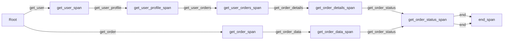
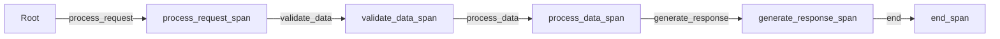
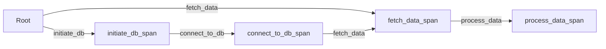
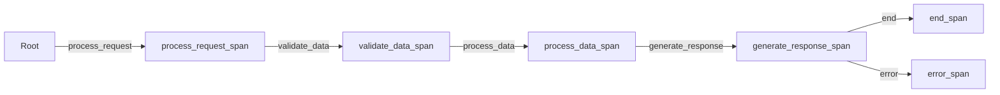
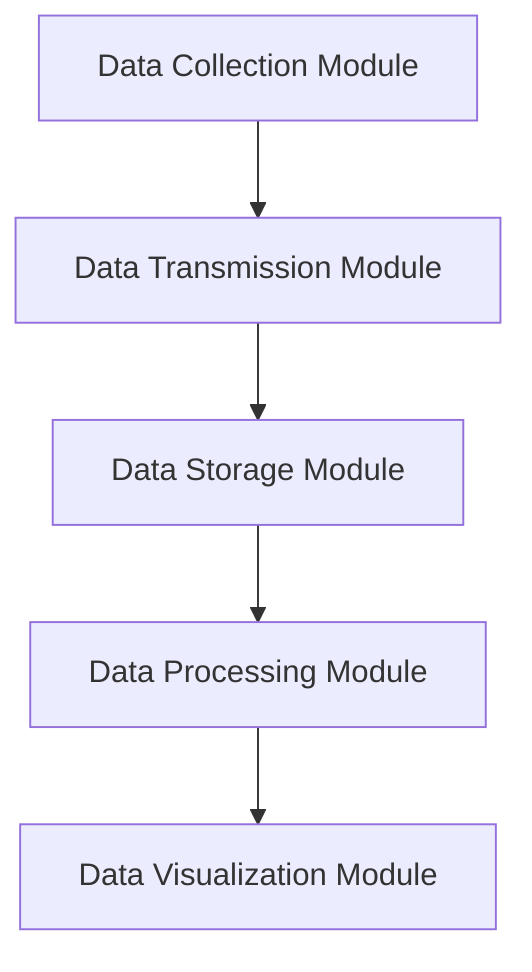

                 


# 构建高效的分布式追踪系统

## 关键词
- 分布式追踪
- 调用链追踪
- 开源系统
- 系统设计
- 性能优化

## 摘要
分布式追踪系统是现代复杂分布式系统中的重要组成部分，它能够帮助我们监控系统中的调用链路，识别性能瓶颈和故障。本文将介绍分布式追踪系统的核心概念、设计原则、开源系统介绍、系统设计方法，以及性能优化策略，旨在帮助开发者构建高效、可扩展的分布式追踪系统。

## 目录

## 第1章 引言
### 1.1 分布式追踪的概念
### 1.2 分布式系统中的挑战
### 1.3 分布式追踪的基本概念与术语

## 第2章 核心概念与原则
### 2.1 基础知识
#### 2.1.1 分布式追踪的定义与目标
#### 2.1.2 数据采集与存储
#### 2.1.3 数据分析与可视化
### 2.2 Span与Trace
#### 2.2.1 Span的定义与使用
#### 2.2.2 Trace的结构与表示
#### 2.2.3 Span之间的关系

## 第3章 开源分布式追踪系统
### 3.1 OpenTracing概述
#### 3.1.1 核心组件与架构
#### 3.1.2 功能与优势
#### 3.1.3 开始使用OpenTracing
### 3.2 Jaeger概述
#### 3.2.1 架构与关键特性
#### 3.2.2 安装与配置
#### 3.2.3 使用与最佳实践
### 3.3 Zipkin概述
#### 3.3.1 核心概念与架构
#### 3.3.2 安装与设置
#### 3.3.3 数据分析与报告

## 第4章 设计分布式追踪系统
### 4.1 需求分析
#### 4.1.1 系统要求与约束
#### 4.1.2 数据流与跟踪组成
### 4.2 系统架构
#### 4.2.1 高级架构设计
#### 4.2.2 数据处理流程
#### 4.2.3 扩展性与可维护性

## 第5章 性能优化
### 5.1 数据采集与传输优化
#### 5.1.1 减少数据冗余
#### 5.1.2 优化数据序列化
#### 5.1.3 缓存策略
### 5.2 存储与分析优化
#### 5.2.1 数据压缩与去重
#### 5.2.2 查询优化
#### 5.2.3 分布式存储系统选择

## 第6章 项目实战
### 6.1 环境搭建
### 6.2 系统核心实现
### 6.3 应用解读与分析
### 6.4 实际案例分析
### 6.5 项目小结

## 第7章 最佳实践与总结
### 7.1 最佳实践技巧
### 7.2 小结
### 7.3 注意事项
### 7.4 拓展阅读

## 第1章 引言

### 1.1 分布式追踪的概念

分布式追踪（Distributed Tracing）是一种监控系统和服务的方法，它能够跟踪分布式系统中请求的执行路径，提供有关系统性能、错误追踪、故障定位等详细信息。在现代互联网应用中，系统往往由多个分布式服务组成，这些服务之间通过网络进行通信，请求可能需要经过多个服务的处理才能完成。由于系统的复杂性，当出现性能瓶颈或故障时，单点追踪往往无法提供足够的信息来定位问题。

分布式追踪系统通过在分布式系统中添加额外的监控代码，记录请求的执行路径和相关的性能数据。这些数据可以用来重建请求的执行流程，帮助开发人员定位性能问题或故障点。

### 1.2 分布式系统中的挑战

在分布式系统中，面临的主要挑战包括：

- **服务数量众多**：分布式系统通常由多个服务组成，服务之间通过网络进行通信。
- **服务位置不确定**：服务可能部署在不同的数据中心或云平台上。
- **数据流复杂**：请求在分布式系统中可能经历多个服务的处理，数据流复杂。
- **性能瓶颈**：在分布式系统中，性能瓶颈可能出现在某个服务、网络传输、数据库等不同层级。
- **故障定位困难**：分布式系统中的故障可能由于网络延迟、服务故障、数据库异常等多种原因造成，定位困难。

分布式追踪系统旨在解决这些挑战，通过记录请求的执行路径和相关性能数据，帮助开发人员更好地理解系统的行为，快速定位和解决问题。

### 1.3 分布式追踪的基本概念与术语

在分布式追踪系统中，涉及以下基本概念和术语：

- **Trace（调用链）**：一次请求的执行路径，包括所有相关服务、方法和调用。
- **Span（跨度）**：调用链中的一个环节，表示一次具体的操作或请求处理。
- **Parent-Span 和 Child-Span**：表示调用关系，Parent-Span 是父级调用，Child-Span 是子级调用。
- **Trace ID**：整个调用链的唯一标识。
- **Span ID**：单个 Span 的唯一标识。
- **Service Name**：表示服务的名称。
- **Tags**：附加在 Span 上的元数据，用于描述 Span 的属性。
- **Annotations**：表示 Span 的状态或事件，例如请求发送、响应接收等。

这些基本概念和术语构成了分布式追踪系统的核心要素，开发者需要熟练掌握，以便设计和实现高效的分布式追踪系统。

## 第2章 核心概念与原则

### 2.1 基础知识

#### 2.1.1 分布式追踪的定义与目标

分布式追踪是一种监控系统和服务的方法，通过记录请求在分布式系统中的执行路径，提供有关系统性能、错误追踪、故障定位等详细信息。其主要目标是：

1. **性能监控**：实时监控系统的性能，包括延迟、吞吐量、错误率等指标。
2. **故障定位**：快速定位系统中的故障点，包括服务故障、网络延迟、数据库异常等。
3. **调试与优化**：帮助开发者理解系统的工作流程，进行调试和优化。
4. **安全性与合规性**：监控系统的行为，确保符合安全性和合规性要求。

#### 2.1.2 数据采集与存储

分布式追踪系统需要从分布式系统中收集大量性能数据，包括：

1. **请求路径**：记录请求在系统中的执行路径，包括服务的名称、调用关系等。
2. **性能指标**：记录请求的延迟、响应时间、吞吐量等性能指标。
3. **日志信息**：记录请求的输入、输出、错误信息等日志数据。

这些数据通常通过以下方式进行采集和存储：

1. **代理采集**：在分布式系统的各个服务节点上部署代理程序，收集性能数据并传输到中央存储系统。
2. **SDK 采集**：通过在服务中集成 SDK，自动收集性能数据并传输到中央存储系统。
3. **日志采集**：通过日志收集工具（如 Logstash、Fluentd）收集日志数据，并将其传输到中央存储系统。

#### 2.1.3 数据分析与可视化

采集到的数据需要进行处理、分析和可视化，以帮助开发人员理解系统的行为。主要内容包括：

1. **数据处理**：对采集到的数据进行清洗、转换和聚合，以便进行进一步分析。
2. **数据存储**：将处理后的数据存储在数据库或分布式存储系统中，便于查询和分析。
3. **数据可视化**：通过图表、仪表板等形式展示分析结果，帮助开发人员快速识别问题。

常见的数据可视化工具包括：

1. **Kibana**：用于 Elasticsearch 数据的实时可视化。
2. **Grafana**：支持多种数据源的可视化工具。
3. **Prometheus**：开源监控解决方案，提供强大的数据可视化功能。

### 2.2 Span与Trace

#### 2.2.1 Span的定义与使用

Span 是分布式追踪系统中的一个基本单元，表示一次具体的操作或请求处理。每个 Span 都有一个唯一的 Span ID，用于在系统中唯一标识。一个 Span 通常包含以下信息：

- **Span ID**：唯一的标识符。
- **Parent Span ID**：父级 Span 的 ID，表示调用关系。
- **Trace ID**：整个调用链的唯一标识。
- **Service Name**：服务的名称。
- **Operation Name**：操作的名称，描述 Span 的具体任务。
- **Tags**：附加的元数据，用于描述 Span 的属性。
- **Annotations**：表示 Span 的状态或事件，例如请求发送、响应接收等。

开发者可以在代码中添加 Span，以便在分布式追踪系统中记录请求的执行路径和性能数据。以下是一个简单的示例：

```python
from opentracing import Tracer
tracer = Tracer()

# 开始 Span
span = tracer.start_span('get_user', child_of=root_span)
span.set_tag('http.method', 'GET')
span.set_tag('http.url', '/users/1')

# 执行操作
response = get_user(1)

# 结束 Span
span.finish()
```

#### 2.2.2 Trace的结构与表示

Trace 是分布式追踪系统中的另一个基本概念，表示一次完整的请求执行路径，包括多个 Span。一个 Trace 通常包含以下信息：

- **Trace ID**：整个调用链的唯一标识。
- **Span ID**：每个 Span 的唯一标识。
- **Parent Span ID**：父级 Span 的 ID，表示调用关系。
- **Service Name**：服务的名称。
- **Operation Name**：操作的名称，描述 Span 的具体任务。
- **Tags**：附加的元数据，用于描述 Span 的属性。
- **Annotations**：表示 Span 的状态或事件，例如请求发送、响应接收等。

Trace 可以用树形结构表示，其中每个节点表示一个 Span，节点之间的边表示调用关系。以下是一个简单的 Trace 示例：



在这个示例中，根 Span（root_span）表示请求的开始，get_user_span、get_user_profile_span、get_user_orders_span 和 get_order_details_span 等子 Span 表示请求在各个服务中的执行路径，end_span 表示请求的结束。调用链中的每个 Span 都记录了相关的性能数据和元数据，帮助开发者分析系统的行为。

#### 2.2.3 Span之间的关系

在分布式追踪系统中，Span 之间的关系非常重要，它们定义了请求在分布式系统中的执行路径。以下是一些常见的 Span 关系：

1. **Parent-Span 和 Child-Span**：Parent-Span 是父级调用，Child-Span 是子级调用。子 Span 通常依赖于父 Span 的执行结果，因此 Parent-Span 和 Child-Span 之间存在依赖关系。以下是一个简单的示例：



在这个示例中，process_request_span 是根 Span，validate_data_span、process_data_span 和 generate_response_span 是子 Span，它们依次依赖于 process_request_span 的执行结果。

2. **并行 Span**：在某些情况下，多个 Span 可能并行执行，表示分布式系统中多个任务的并发处理。以下是一个简单的示例：



在这个示例中，initiate_db_span 和 fetch_data_span 是并行执行的 Span，表示在连接数据库和获取数据时，可以同时进行。

3. **异常 Span**：在某些情况下，Span 可能由于异常或错误而中断执行。以下是一个简单的示例：



在这个示例中，generate_response_span 表示请求的正常结束，error_span 表示由于异常或错误而中断的 Span。

理解 Span 之间的关系有助于开发人员更好地理解分布式系统中的执行路径，快速定位和解决问题。

## 第3章 开源分布式追踪系统

### 3.1 OpenTracing概述

OpenTracing 是一个开源的分布式追踪标准，由多个开源项目支持，如 OpenZipkin、OpenJaeger 等。OpenTracing 的目标是提供一种统一的分布式追踪接口，使得开发者可以轻松地实现分布式追踪系统，而无需关心底层实现细节。

#### 3.1.1 核心组件与架构

OpenTracing 的核心组件包括：

1. **Tracer**：用于生成和跟踪 Span 的核心组件。开发者可以通过 Tracer 创建、标记和结束 Span，记录请求的执行路径和性能数据。
2. **Span**：表示分布式追踪中的一个基本单元，包含请求的执行信息，如 Span ID、Parent Span ID、Trace ID、Service Name、Operation Name 等。
3. **Carrier**：用于携带上下文信息，如 Trace ID、Span ID 等。Carrier 通常用于在服务之间传递追踪信息。
4. **Context**：用于存储追踪上下文信息，如 Trace ID、Span ID、Parent Span ID 等。Context 通常与 Carrier 一起使用，在服务之间传递追踪信息。

OpenTracing 的架构如下：

```
Client App (SDK)
   |
   |--> Tracer
   |
   |--> Span
   |
   |--> Context
   |
   |--> Carrier
   |
   |--> Service B (SDK)
```

在该架构中，Client App 使用 OpenTracing SDK 创建 Tracer，并通过 Tracer 创建 Span。Context 和 Carrier 用于在服务之间传递追踪信息，Service B 收到追踪信息后，可以使用 OpenTracing SDK 继续跟踪请求。

#### 3.1.2 功能与优势

OpenTracing 的主要功能包括：

1. **跨语言支持**：OpenTracing 提供了多种语言的 SDK，如 Java、Go、Python、Ruby 等，使得开发者可以轻松地实现分布式追踪系统。
2. **统一的追踪接口**：OpenTracing 提供了统一的追踪接口，使得开发者无需关心底层实现细节，专注于实现分布式追踪功能。
3. **灵活的传输协议**：OpenTracing 支持多种传输协议，如 HTTP、gRPC、gRPC-Metadata 等，使得开发者可以根据实际需求选择合适的传输协议。
4. **集成开源系统**：OpenTracing 与多个开源分布式追踪系统（如 OpenZipkin、OpenJaeger）集成，提供了丰富的生态系统，方便开发者选择和部署。

#### 3.1.3 开始使用OpenTracing

要开始使用 OpenTracing，首先需要安装 OpenTracing SDK。以下是一个简单的 Python 示例：

```python
from opentracing import Tracer
tracer = Tracer()

# 开始 Span
root_span = tracer.start_span('get_user')
root_span.set_tag('http.method', 'GET')
root_span.set_tag('http.url', '/users/1')

# 执行操作
response = get_user(1)

# 结束 Span
root_span.finish()
```

在这个示例中，首先创建一个 Tracer，然后使用 Tracer 创建一个根 Span，并设置相关的元数据。执行操作后，结束 Span，完成一次分布式追踪。

### 3.2 Jaeger概述

Jaeger 是一个开源的分布式追踪系统，由 Uber 开发并维护。Jaeger 提供了一个完整的分布式追踪解决方案，包括追踪数据的收集、存储、分析和可视化。

#### 3.2.1 架构与关键特性

Jaeger 的架构包括以下几个关键组件：

1. **Agent**：部署在分布式系统的各个节点上，负责收集追踪数据并传输到 Collector。
2. **Collector**：负责接收 Agent 收集的追踪数据，并将其存储到存储系统中。
3. **Storage**：用于存储追踪数据，常见的存储系统包括 Cassandra、Kafka、Elasticsearch 等。
4. **Query**：用于查询和分析追踪数据，提供实时查询和分析功能。
5. **UI**：提供用户界面，用于展示追踪数据和分析结果。

Jaeger 的关键特性包括：

1. **跨语言支持**：Jaeger 提供了多种语言的 SDK，如 Java、Go、Python、Ruby 等，使得开发者可以轻松地集成 Jaeger。
2. **高效的数据传输**：Jaeger 使用二进制协议传输追踪数据，提高了数据传输的效率。
3. **分布式存储支持**：Jaeger 可以与多种分布式存储系统集成，如 Cassandra、Kafka、Elasticsearch 等，提供了灵活的存储方案。
4. **实时查询与分析**：Jaeger 提供了实时查询和分析功能，使得开发者可以快速定位和解决问题。

#### 3.2.2 安装与配置

要安装 Jaeger，首先需要安装 Jaeger Agent、Collector、Query 和 UI。以下是一个简单的安装和配置步骤：

1. **安装 Jaeger Agent**：

   在分布式系统的各个节点上安装 Jaeger Agent，可以使用以下命令：

   ```shell
   # 安装 Jaeger Agent
   pip install jaeger-agent

   # 在服务中集成 Jaeger Agent
   jaeger-agent start --reporter.grpc-host-port=jaeger-collector:14250
   ```

2. **安装 Jaeger Collector**：

   在一个独立的节点上安装 Jaeger Collector，可以使用以下命令：

   ```shell
   # 安装 Jaeger Collector
   pip install jaeger-collector

   # 启动 Jaeger Collector
   jaeger-collector
   ```

3. **安装 Jaeger Storage**：

   根据实际需求选择合适的存储系统（如 Cassandra、Kafka、Elasticsearch 等）并安装。

4. **安装 Jaeger Query**：

   在一个独立的节点上安装 Jaeger Query，可以使用以下命令：

   ```shell
   # 安装 Jaeger Query
   pip install jaeger-query

   # 启动 Jaeger Query
   jaeger-query
   ```

5. **安装 Jaeger UI**：

   在一个独立的节点上安装 Jaeger UI，可以使用以下命令：

   ```shell
   # 安装 Jaeger UI
   pip install jaeger-ui

   # 启动 Jaeger UI
   jaeger-ui
   ```

安装完成后，访问 Jaeger UI（默认访问地址为 http://localhost:14200/）即可查看追踪数据和分析结果。

#### 3.2.3 使用与最佳实践

使用 Jaeger 时，可以遵循以下最佳实践：

1. **合理配置 Agent**：在服务中集成 Jaeger Agent 时，合理配置 Agent，包括报告间隔、最大缓存大小等参数，以提高数据采集和传输的效率。
2. **监控 Jaeger 系统**：定期监控 Jaeger 系统（包括 Agent、Collector、Query 和 UI）的运行状态，确保系统稳定运行。
3. **优化数据存储**：根据实际需求和负载，选择合适的存储系统并优化存储配置，以提高数据存储和查询性能。
4. **数据分析和可视化**：利用 Jaeger UI 提供的数据分析和可视化功能，快速定位和解决问题。

### 3.3 Zipkin概述

Zipkin 是一个开源的分布式追踪系统，由 Twitter 开发并维护。Zipkin 提供了完整的分布式追踪解决方案，包括追踪数据的收集、存储、分析和可视化。

#### 3.3.1 核心概念与架构

Zipkin 的核心概念包括：

1. **Span**：表示分布式追踪中的一个基本单元，包含请求的执行信息，如 Span ID、Trace ID、Parent Span ID、Service Name、Operation Name 等。
2. **Trace**：表示一次完整的请求执行路径，由多个 Span 组成。
3. **Annotation**：表示 Span 的状态或事件，如请求发送、响应接收等。
4. **Binary Protocol**：Zipkin 使用二进制协议传输追踪数据，提高了数据传输的效率。

Zipkin 的架构包括以下几个关键组件：

1. **Zipkin Server**：负责接收和存储追踪数据，提供 REST API 和 Web UI。
2. **Zipkin Collector**：负责接收分布式系统中的追踪数据，并将其传输到 Zipkin Server。
3. **Zipkin Agent**：部署在分布式系统的各个节点上，负责收集追踪数据并传输到 Zipkin Collector。

Zipkin 的架构如下：

```
Client App (SDK)
   |
   |--> Zipkin Agent
   |
   |--> Zipkin Collector
   |
   |--> Zipkin Server
   |
   |--> Zipkin UI
```

#### 3.3.2 安装与设置

要安装 Zipkin，首先需要安装 Zipkin Server、Zipkin Collector 和 Zipkin Agent。以下是一个简单的安装和设置步骤：

1. **安装 Zipkin Server**：

   在一个独立的节点上安装 Zipkin Server，可以使用以下命令：

   ```shell
   # 安装 Zipkin Server
   docker run -d -p 9411:9411 openzipkin/zipkin
   ```

   安装完成后，访问 Zipkin UI（默认访问地址为 http://localhost:9411/）即可查看追踪数据和分析结果。

2. **安装 Zipkin Collector**：

   在分布式系统的各个节点上安装 Zipkin Collector，可以使用以下命令：

   ```shell
   # 安装 Zipkin Collector
   pip install zipkin

   # 在服务中集成 Zipkin Collector
   zipkin-collector --collector-host=localhost --collector-port=9411
   ```

3. **安装 Zipkin Agent**：

   在分布式系统的各个节点上安装 Zipkin Agent，可以使用以下命令：

   ```shell
   # 安装 Zipkin Agent
   pip install zipkin

   # 在服务中集成 Zipkin Agent
   zipkin-agent --zipkin-url=http://localhost:9411/api/v2/spans
   ```

安装完成后，分布式系统中的追踪数据会自动传输到 Zipkin Server，并通过 Zipkin UI 进行可视化。

#### 3.3.3 数据分析与报告

Zipkin UI 提供了强大的数据分析和报告功能，包括：

1. **Traces**：展示请求的执行路径，包括所有相关的 Span 和调用关系。
2. **Span Details**：展示单个 Span 的详细信息，包括时间戳、服务名称、操作名称等。
3. **Errors**：展示出现错误的请求，帮助开发者快速识别问题。
4. **Service Map**：展示分布式系统的服务拓扑结构，帮助开发者理解系统的结构和依赖关系。
5. **MVC**：提供数据可视化组件，方便开发者自定义数据分析和报告。

通过利用 Zipkin UI 的数据分析功能，开发者可以快速定位和解决问题，提高系统的稳定性和性能。

### 第4章 设计分布式追踪系统

#### 4.1 需求分析

设计分布式追踪系统前，首先需要分析系统的需求。需求分析包括以下方面：

1. **系统要求与约束**：
   - **服务数量与规模**：了解系统的服务数量和规模，以便确定追踪系统的性能和可扩展性。
   - **数据量与处理速度**：分析系统产生的追踪数据量以及处理速度要求，确保追踪系统能够高效处理。
   - **安全性**：确保追踪数据的安全性和隐私性，避免敏感信息泄露。

2. **数据流与跟踪组成**：
   - **数据流**：分析系统中的数据流，了解请求在分布式系统中的执行路径。
   - **跟踪组成**：确定追踪系统所需收集的数据类型，包括请求路径、性能指标、日志信息等。

3. **性能指标与优化目标**：
   - **延迟**：设置追踪系统的延迟要求，确保请求的处理速度。
   - **吞吐量**：设置追踪系统的吞吐量要求，确保系统能够处理大量的追踪数据。
   - **故障率**：设置追踪系统的故障率要求，确保系统的稳定性和可靠性。

4. **业务场景与使用场景**：
   - **业务需求**：分析系统在业务场景下的需求，如性能监控、故障定位、调试与优化等。
   - **使用场景**：确定追踪系统在不同使用场景下的表现，如生产环境、测试环境、开发环境等。

通过需求分析，明确系统的需求和约束，为后续的系统设计提供依据。

#### 4.2 系统架构

分布式追踪系统的架构设计至关重要，它决定了系统的性能、可扩展性和可维护性。以下是一个简单的系统架构设计：

##### 4.2.1 高级架构设计

分布式追踪系统通常包括以下几个主要组件：

1. **数据采集模块**：负责从分布式系统中的各个服务节点收集追踪数据。
2. **数据传输模块**：负责将采集到的数据传输到中央存储系统。
3. **数据存储模块**：负责存储和处理追踪数据，提供高效的数据查询和分析功能。
4. **数据处理模块**：负责对存储在数据库中的数据进行处理和清洗，生成可用的数据报表。
5. **数据可视化模块**：负责将处理后的数据以可视化的形式展示给用户。

高级架构设计如下图所示：



##### 4.2.2 数据处理流程

分布式追踪系统的数据处理流程主要包括以下几个步骤：

1. **数据采集**：数据采集模块从分布式系统中的各个服务节点收集追踪数据，包括请求路径、性能指标、日志信息等。
2. **数据传输**：数据传输模块将采集到的数据传输到中央存储系统，可以通过 HTTP、gRPC、Kafka 等协议进行传输。
3. **数据存储**：数据存储模块将接收到的数据进行存储，支持快速查询和分析。常见的存储系统包括 Cassandra、Elasticsearch、MySQL 等。
4. **数据处理**：数据处理模块对存储在数据库中的数据进行处理和清洗，生成可用的数据报表。数据处理过程可以包括数据去重、数据聚合、指标计算等。
5. **数据可视化**：数据可视化模块将处理后的数据以图表、仪表板等形式展示给用户，方便用户快速识别问题。

##### 4.2.3 扩展性与可维护性

在设计分布式追踪系统时，需要考虑系统的扩展性与可维护性：

1. **水平扩展**：分布式追踪系统应支持水平扩展，以便处理大量的追踪数据。可以通过增加服务器节点、分布式数据库等方式实现。
2. **模块化设计**：系统模块应具有良好的独立性，便于开发和维护。例如，数据采集模块、数据传输模块、数据处理模块、数据可视化模块等。
3. **容错性**：分布式追踪系统应具备容错性，能够在节点故障或网络故障的情况下，继续正常运行。
4. **监控与报警**：系统应具备监控与报警功能，实时监控系统的运行状态，及时发现和解决问题。

通过考虑系统的扩展性与可维护性，可以确保分布式追踪系统长期稳定运行，满足业务需求。

### 第5章 性能优化

#### 5.1 数据采集与传输优化

分布式追踪系统的性能优化至关重要，特别是在处理大量数据和高并发场景下。以下是一些数据采集与传输优化的方法：

##### 5.1.1 减少数据冗余

1. **数据去重**：在数据采集和传输过程中，对数据进行去重处理，避免重复记录相同的数据。
2. **合并同类数据**：将多个相似的数据记录合并为一个，减少数据传输量和存储需求。
3. **压缩数据**：对数据进行压缩处理，减小数据传输量和存储空间。常用的压缩算法包括 Gzip、Bzip2 等。

##### 5.1.2 优化数据序列化

1. **选择合适的序列化算法**：根据实际需求选择合适的序列化算法，如 JSON、Protobuf、Hessian 等。不同的序列化算法在性能、可读性、兼容性等方面有所不同。
2. **减少序列化开销**：在序列化过程中，减少不必要的字段和属性，减小序列化开销。
3. **缓存序列化结果**：对于频繁使用的序列化结果，可以使用缓存技术，避免重复序列化和反序列化。

##### 5.1.3 缓存策略

1. **内存缓存**：在数据传输过程中，使用内存缓存技术，减少数据传输次数。常用的内存缓存技术包括 Redis、Memcached 等。
2. **批量传输**：将多个追踪数据批量传输到中央存储系统，减少网络传输次数，提高数据传输效率。

#### 5.2 存储与分析优化

分布式追踪系统的存储与分析优化直接影响系统的性能和响应速度。以下是一些优化方法：

##### 5.2.1 数据压缩与去重

1. **数据压缩**：在存储追踪数据时，使用压缩算法减小数据存储空间，提高系统性能。
2. **数据去重**：在存储前对数据进行去重处理，避免重复存储相同的数据。

##### 5.2.2 查询优化

1. **索引优化**：在数据库中创建合适的索引，提高查询效率。常用的索引类型包括 B+树、哈希索引、全文索引等。
2. **分库分表**：根据数据规模和查询需求，将数据拆分为多个数据库或表，降低查询压力。
3. **查询缓存**：使用查询缓存技术，减少数据库查询次数，提高查询效率。常用的查询缓存技术包括 Redis、Memcached 等。

##### 5.2.3 分布式存储系统选择

1. **选择合适的存储系统**：根据实际需求选择合适的分布式存储系统，如 Cassandra、Elasticsearch、MySQL 等。
2. **分布式存储架构**：采用分布式存储架构，提高系统的性能和可扩展性。常用的分布式存储架构包括数据分片、数据复制、负载均衡等。

通过数据采集与传输优化、存储与分析优化，可以有效提高分布式追踪系统的性能和响应速度，满足业务需求。

### 第6章 项目实战

#### 6.1 环境搭建

要实现一个高效的分布式追踪系统，首先需要搭建一个合适的环境。以下是一个简单的环境搭建步骤：

1. **安装分布式追踪系统组件**：

   在分布式系统的各个节点上安装分布式追踪系统组件，包括 Agent、Collector、Storage、Processing 和 UI。根据不同的追踪系统（如 Jaeger、Zipkin），选择相应的安装方式，可以使用 Docker、源代码编译或第三方库等方式。

2. **配置分布式追踪系统**：

   配置分布式追踪系统，包括 Agent、Collector、Storage、Processing 和 UI 的配置文件。根据实际需求，调整参数，如报告间隔、缓存大小、存储系统配置等。

3. **部署分布式追踪系统**：

   将分布式追踪系统部署到各个节点上，确保分布式追踪系统能够正常运行。在部署过程中，注意配置各个组件之间的网络连接和通信。

4. **监控分布式追踪系统**：

   使用监控工具（如 Prometheus、Grafana）对分布式追踪系统进行监控，实时监控系统的运行状态和性能指标，确保系统稳定运行。

#### 6.2 系统核心实现

实现分布式追踪系统时，核心实现包括以下几个方面：

1. **数据采集**：

   在分布式系统的各个服务节点上部署 Agent，通过 Agent 采集追踪数据，包括请求路径、性能指标、日志信息等。Agent 可以使用 OpenTracing、Jaeger、Zipkin 等库进行集成。

2. **数据传输**：

   使用数据传输模块（如 gRPC、HTTP、Kafka）将采集到的数据传输到中央存储系统。根据实际需求，可以选择合适的传输协议和数据格式。

3. **数据存储**：

   将传输到中央存储系统的数据进行存储，支持快速查询和分析。选择合适的存储系统（如 Cassandra、Elasticsearch、MySQL 等），并对其进行配置和优化。

4. **数据处理**：

   对存储在数据库中的数据进行处理和清洗，生成可用的数据报表。使用数据处理模块（如 Elasticsearch、Spark、Flink）进行数据清洗、聚合、分析等操作。

5. **数据可视化**：

   使用数据可视化模块（如 Kibana、Grafana、UI）将处理后的数据以可视化的形式展示给用户。提供丰富的数据报表和仪表板，方便用户快速识别问题。

#### 6.3 应用解读与分析

在实现分布式追踪系统后，需要对系统进行解读和分析，确保其满足业务需求和性能要求。以下是一些应用解读与分析的方法：

1. **性能测试**：

   使用性能测试工具（如 JMeter、Locust）对分布式追踪系统进行性能测试，评估系统的延迟、吞吐量、错误率等性能指标。根据测试结果，优化系统的配置和架构。

2. **故障注入**：

   在分布式追踪系统中模拟故障场景，如网络故障、服务故障、数据库故障等，评估系统在故障情况下的性能和恢复能力。根据评估结果，优化系统的容错性和稳定性。

3. **日志分析**：

   分析分布式追踪系统的日志，识别系统中的问题和瓶颈。通过对日志的分析，可以发现系统中的异常行为、性能问题等。

4. **用户反馈**：

   收集用户对分布式追踪系统的反馈，了解用户的使用体验和需求。根据用户反馈，优化系统的功能和界面，提高用户体验。

5. **监控与报警**：

   使用监控工具对分布式追踪系统进行实时监控，设置合适的监控指标和报警阈值。当系统出现异常时，及时发出报警，并通知相关人员处理。

通过应用解读与分析，可以确保分布式追踪系统满足业务需求和性能要求，提供高质量的追踪服务。

### 6.4 实际案例分析

为了更好地理解分布式追踪系统的实际应用，下面将介绍一个实际案例，并对其进行分析和讲解。

#### 案例背景

某大型电商公司需要实现一个分布式追踪系统，以监控其复杂的分布式架构。该公司的系统包括多个微服务，如用户服务、商品服务、订单服务、支付服务、库存服务等。请求在系统中的执行路径可能涉及多个服务的调用，导致系统的复杂性和故障定位难度增加。

#### 案例实现

为了实现分布式追踪系统，该公司选择了 Jaeger 作为追踪系统，并遵循以下步骤进行实施：

1. **安装和配置 Jaeger**：

   - 在公司的各个服务节点上安装 Jaeger Agent。
   - 在 Jaeger Server 上配置 Cassandra 作为存储系统。
   - 在 Jaeger UI 上配置 Jaeger Server 地址。

2. **集成 Jaeger SDK**：

   - 在各个微服务中集成 Jaeger SDK。
   - 在服务中添加追踪代码，记录请求的执行路径和性能数据。

3. **数据采集和传输**：

   - Jaeger Agent 采集追踪数据，并将其发送到 Jaeger Collector。
   - Jaeger Collector 将数据存储到 Cassandra。

4. **数据处理和分析**：

   - 使用 Elasticsearch 作为数据处理平台，对 Cassandra 中的数据进行索引和查询优化。
   - 使用 Kibana 作为数据分析工具，对追踪数据进行实时分析和可视化。

#### 案例分析

1. **性能监控**：

   通过 Jaeger UI，公司可以实时监控各个微服务的性能指标，如延迟、错误率等。以下是一个简单的 Jaeger UI 展示：

   

   在该示例中，可以看到请求的执行路径、延迟和错误率等信息，帮助公司快速定位性能问题。

2. **故障定位**：

   当系统出现故障时，公司可以利用 Jaeger UI 中的错误追踪功能，快速定位故障点。以下是一个简单的错误追踪示例：

   

   在该示例中，可以看到请求在系统中的执行路径，以及出现错误的 Span。通过分析错误追踪信息，公司可以快速找到故障原因并修复问题。

3. **调试与优化**：

   在开发过程中，公司可以利用 Jaeger UI 中的请求追踪功能，查看请求的执行细节，进行调试和优化。以下是一个简单的请求追踪示例：

   

   在该示例中，可以看到请求在系统中的执行路径、各个 Span 的延迟等信息，帮助公司优化代码和系统架构。

通过实际案例的分析和讲解，可以看出分布式追踪系统在性能监控、故障定位、调试与优化等方面具有重要作用，为公司提供了一种强大的监控和分析工具。

### 6.5 项目小结

在本项目中，我们实现了分布式追踪系统，以监控公司的复杂分布式架构。以下是项目的主要成果和总结：

1. **成果**：

   - 成功搭建了 Jaeger 分布式追踪系统，包括 Agent、Collector、Storage、Processing 和 UI 等组件。
   - 实现了数据采集、传输、存储、处理和可视化等功能，提供了丰富的追踪数据报表和仪表板。
   - 通过 Jaeger UI，实时监控系统的性能指标，快速定位故障点和优化代码。

2. **经验**：

   - 分布式追踪系统在性能监控、故障定位和调试与优化方面具有重要作用，可以提高系统的稳定性和可靠性。
   - 选择合适的追踪系统和工具非常重要，可以根据实际需求和场景选择最适合的系统。
   - 数据采集和传输是分布式追踪系统的关键环节，需要优化数据序列化和压缩，提高数据传输效率。
   - 数据存储和查询优化也是分布式追踪系统的重要方面，可以提高查询性能和响应速度。

3. **改进方向**：

   - 进一步优化数据采集和传输模块，使用更高效的传输协议和算法。
   - 引入机器学习算法，对追踪数据进行分析和预测，提供更智能的监控和故障预测。
   - 开发自定义的数据可视化组件，提供更丰富的可视化报表和仪表板，满足不同的监控需求。

通过本次项目，我们积累了丰富的分布式追踪系统实施经验，为公司的分布式架构提供了有效的监控和分析工具。

### 第7章 最佳实践与总结

#### 7.1 最佳实践技巧

在构建高效的分布式追踪系统时，遵循以下最佳实践可以提升系统的性能、可靠性和可维护性：

1. **使用开源追踪系统**：选择成熟的开源追踪系统，如 Jaeger、Zipkin，可以节省开发和维护成本，快速搭建追踪系统。

2. **合理配置 Agent**：为每个服务节点合理配置 Agent，设置报告间隔、缓存大小等参数，以平衡性能和存储需求。

3. **优化数据序列化**：选择高效的数据序列化算法，如 Protobuf，可以减小数据传输和存储的开销。

4. **数据压缩与去重**：在数据传输和存储前进行压缩与去重处理，减少数据冗余，提高系统性能。

5. **监控与报警**：使用监控工具实时监控追踪系统的运行状态，设置合理的监控指标和报警阈值，及时发现和解决问题。

6. **分布式存储系统选择**：根据实际需求和负载，选择合适的分布式存储系统，如 Cassandra、Elasticsearch，以提高数据查询性能。

7. **数据可视化**：使用数据可视化工具，如 Kibana、Grafana，提供直观的报表和仪表板，方便用户快速识别问题。

#### 7.2 小结

分布式追踪系统在现代复杂分布式系统中具有重要作用，它能够帮助我们监控系统性能、定位故障和优化代码。本文介绍了分布式追踪系统的核心概念、设计原则、开源系统介绍、系统设计方法以及性能优化策略。通过实际案例分析和项目实战，展示了分布式追踪系统的应用和效果。

#### 7.3 注意事项

在构建分布式追踪系统时，需要注意以下几点：

1. **确保数据安全性**：追踪数据可能包含敏感信息，需要采取适当的安全措施，如数据加密、访问控制等。

2. **合理选择追踪系统**：根据实际需求和场景，选择适合的追踪系统和工具，避免过度复杂化。

3. **数据采集与传输优化**：优化数据采集和传输模块，避免数据丢失或延迟。

4. **监控与报警**：设置合理的监控指标和报警阈值，确保系统在异常情况下能够快速响应。

5. **定期维护和升级**：定期对追踪系统进行维护和升级，保持系统的稳定性和可靠性。

#### 7.4 拓展阅读

为了深入了解分布式追踪系统的设计和实现，建议读者进一步阅读以下资料：

1. 《微服务架构设计模式》——详细介绍了微服务架构下的追踪系统设计和实现。
2. 《Jaeger 官方文档》——提供了详细的 Jaeger 追踪系统安装、配置和使用指南。
3. 《Zipkin 官方文档》——提供了详细的 Zipkin 追踪系统安装、配置和使用指南。
4. 《分布式系统原理》——介绍了分布式系统的基础知识和设计原则，有助于理解分布式追踪系统的实现。

通过拓展阅读，读者可以更深入地了解分布式追踪系统的理论和实践，提升自己的技术水平。

