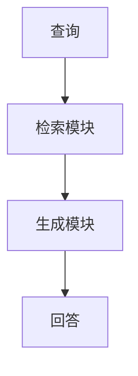
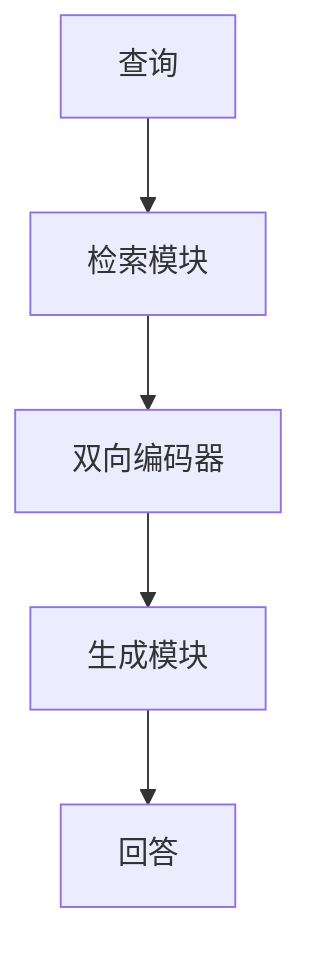
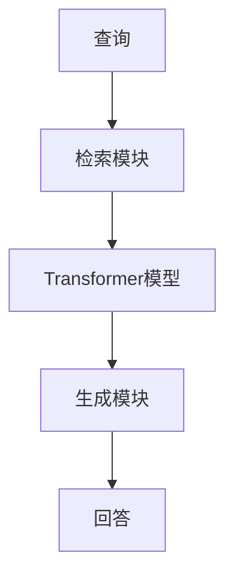
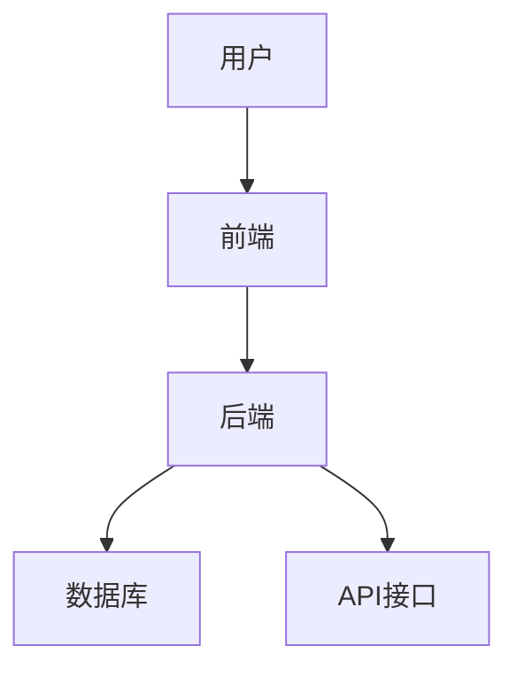
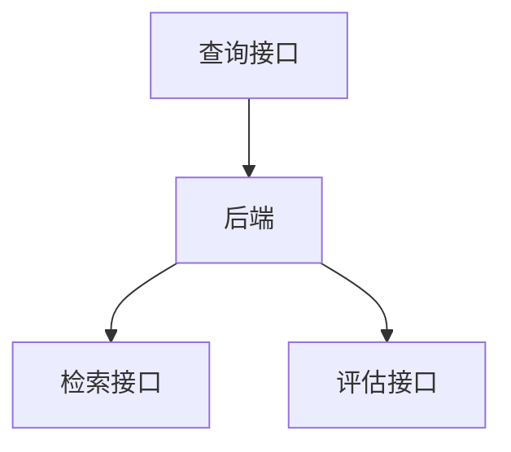
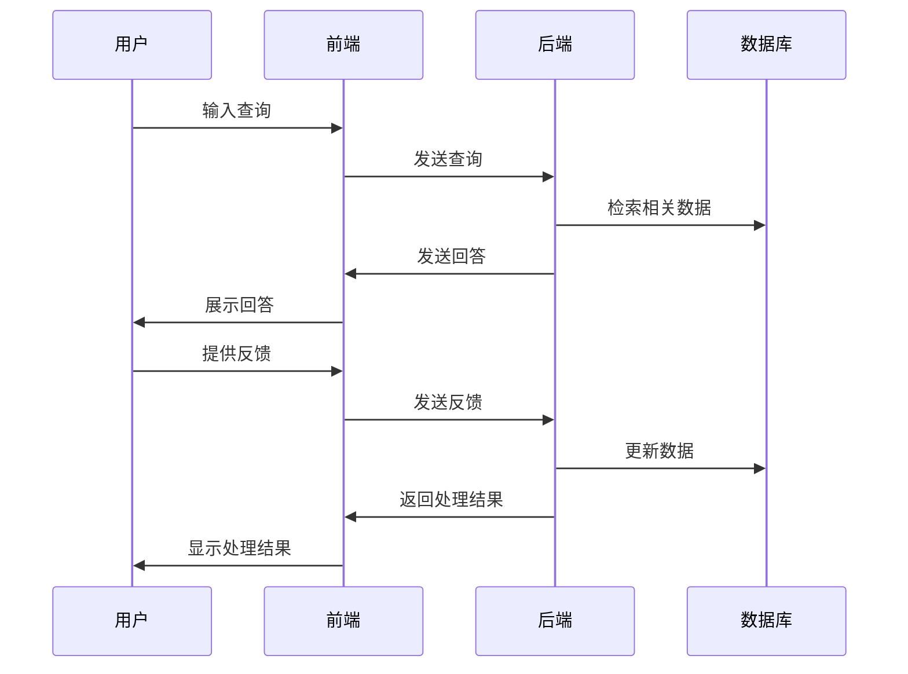

                 

### 《检索增强生成：提高AI Agent回答的准确性》

#### 关键词：
- 检索增强生成
- AI Agent
- 回答准确性
- Transformer模型
- 检索策略
- 生成策略
- 策略融合

#### 摘要：
本文旨在探讨如何通过检索增强生成技术（Retrieval Augmented Generation, RAG）来提高AI Agent的回答准确性。我们将从问题背景出发，详细解释检索增强生成技术的核心概念、算法原理，并通过项目实战来展示如何在实际中应用这一技术。本文还将讨论系统架构设计、最佳实践，并提供进一步阅读的建议。

### 第一部分：问题背景与核心概念

#### 1.1 问题背景

在人工智能领域，AI Agent的准确回答能力是衡量其智能水平的重要标准。然而，现有的AI Agent在处理复杂问题时，往往因为数据量有限、模型理解能力不足等原因，导致回答不准确。提高AI Agent回答的准确性，成为了一个亟待解决的问题。

#### 1.2 核心概念

检索增强生成（Retrieval Augmented Generation, RAG）是一种结合检索和生成技术的混合模型，旨在通过检索大量相关数据来增强生成模型的回答准确性。RAG模型主要由检索模块和生成模块组成，通过检索相关数据来辅助生成模块生成更准确的回答。

#### 1.3 检索增强生成的工作原理

RAG模型的工作原理可以分为两个阶段：检索阶段和生成阶段。

- **检索阶段**：在检索阶段，模型会从大规模数据集中检索出与输入查询最相关的数据。这一阶段的关键是设计有效的检索策略，以确保检索到的数据与查询相关且具有高质量。
- **生成阶段**：在生成阶段，模型会使用检索到的数据来生成回答。生成阶段的关键是设计有效的生成策略，以确保生成的回答既准确又连贯。

#### 1.4 检索增强生成的核心组成部分

RAG模型的核心组成部分包括：

- **检索模块**：负责从大规模数据集中检索相关数据。
- **生成模块**：负责使用检索到的数据生成回答。
- **策略融合模块**：负责将检索策略和生成策略结合起来，以生成更准确的回答。

#### 1.5 检索增强生成技术的优势与局限性

**优势**：

- 提高回答准确性：通过检索大量相关数据，RAG模型能够生成更准确的回答。
- 支持多种问答场景：RAG模型可以应用于多种问答场景，包括文本问答、图像问答等。
- 可扩展性：RAG模型可以轻松地适应不同规模的数据集。

**局限性**：

- 检索效率：设计有效的检索策略是一个挑战，因为检索过程可能需要大量的计算资源。
- 数据质量：检索到的数据质量直接影响生成模型的回答准确性。

#### 1.6 本章小结

本文介绍了检索增强生成技术的背景、核心概念和工作原理。在接下来的章节中，我们将深入探讨RAG模型的算法原理、数学模型，并通过项目实战来展示如何应用这一技术。进一步阅读建议包括相关论文、书籍和开源项目。

----------------------------------------------------------------

### 第二部分：检索增强生成的算法原理

#### 2.1 检索增强生成算法概述

检索增强生成（RAG）算法是一种结合检索和生成技术的混合模型，旨在通过检索相关数据来增强生成模型的回答准确性。RAG算法主要由两个核心模块组成：检索模块和生成模块。

#### 2.2 检索增强生成算法的定义与分类

**检索增强生成算法的定义**：

检索增强生成算法是一种在生成模型中引入检索过程的算法，旨在通过检索大量相关数据来提高生成模型的回答准确性。检索增强生成算法通常包括两个阶段：检索阶段和生成阶段。

**检索增强生成算法的分类**：

根据检索策略和生成策略的不同，检索增强生成算法可以分为以下几类：

- **基于Transformer的RAG算法**：使用Transformer模型作为生成模块，结合有效的检索策略来提高回答准确性。
- **基于BERT的RAG算法**：使用BERT模型作为生成模块，结合有效的检索策略来提高回答准确性。
- **基于GPT的RAG算法**：使用GPT模型作为生成模块，结合有效的检索策略来提高回答准确性。
- **基于T5的RAG算法**：使用T5模型作为生成模块，结合有效的检索策略来提高回答准确性。

#### 2.3 常见的检索增强生成算法

在检索增强生成领域，常见的算法包括：

- **Transformer模型**：Transformer模型是一种基于自注意力机制的生成模型，具有强大的表征能力。在RAG算法中，Transformer模型被用作生成模块，通过检索相关数据来提高回答准确性。
- **BERT模型**：BERT模型是一种基于双向编码器的生成模型，具有强大的语义理解能力。在RAG算法中，BERT模型被用作生成模块，通过检索相关数据来提高回答准确性。
- **GPT模型**：GPT模型是一种基于自回归机制的生成模型，具有强大的文本生成能力。在RAG算法中，GPT模型被用作生成模块，通过检索相关数据来提高回答准确性。
- **T5模型**：T5模型是一种基于Transformer的生成模型，具有强大的文本处理能力。在RAG算法中，T5模型被用作生成模块，通过检索相关数据来提高回答准确性。

#### 2.4 检索增强生成算法的工作流程

检索增强生成算法的工作流程可以分为以下两个阶段：

- **检索阶段**：在检索阶段，模型会从大规模数据集中检索出与输入查询最相关的数据。检索阶段的关键是设计有效的检索策略，以确保检索到的数据与查询相关且具有高质
- **生成阶段**：在生成阶段，模型会使用检索到的数据生成回答。生成阶段的关键是设计有效的生成策略，以确保生成的回答既准确又连贯。

#### 2.5 检索增强生成算法的关键技术

检索增强生成算法的关键技术包括：

- **检索策略**：检索策略决定了如何从大规模数据集中检索出与查询相关的数据。有效的检索策略可以提高检索的效率和准确性。
- **生成策略**：生成策略决定了如何使用检索到的数据生成回答。有效的生成策略可以生成既准确又连贯的回答。
- **策略融合方法**：策略融合方法用于将检索策略和生成策略结合起来，以生成更准确的回答。常见的策略融合方法包括拼接、融合和注意力机制等。

#### 2.6 本章小结

本章介绍了检索增强生成算法的核心概念、定义、分类以及常见算法。在下一章中，我们将深入探讨检索增强生成算法的数学模型和公式，并通过实际案例来展示如何应用这些算法。进一步阅读建议包括相关论文、书籍和开源项目。

----------------------------------------------------------------

### 第三部分：数学模型与公式详解

#### 3.1 检索增强生成算法的数学基础

检索增强生成算法的数学基础包括概率论、信息论和最优化理论。

**概率论**：

概率论是研究随机事件和概率的数学分支。在检索增强生成算法中，概率论用于描述数据之间的相关性、查询和回答之间的匹配概率等。

**信息论**：

信息论是研究信息传输和信息处理的数学分支。在检索增强生成算法中，信息论用于度量查询和回答之间的信息量、数据的相关性等。

**最优化理论**：

最优化理论是研究如何求解最优化问题的数学分支。在检索增强生成算法中，最优化理论用于求解检索策略和生成策略的最优参数，以提高检索效率和生成准确性。

#### 3.2 算法原理与数学公式

在本节中，我们将详细探讨几种常见的检索增强生成算法，包括Transformer模型、BERT模型、GPT模型和T5模型。我们将介绍每种算法的数学模型和公式。

**Transformer模型**：

Transformer模型是一种基于自注意力机制的生成模型。在检索增强生成算法中，Transformer模型被用作生成模块。其核心思想是通过自注意力机制来捕捉查询和回答之间的依赖关系。

**BERT模型**：

BERT模型是一种基于双向编码器的生成模型。在检索增强生成算法中，BERT模型被用作生成模块。其核心思想是通过双向编码器来捕捉查询和回答之间的语义信息。

**GPT模型**：

GPT模型是一种基于自回归机制的生成模型。在检索增强生成算法中，GPT模型被用作生成模块。其核心思想是通过自回归机制来生成连贯的文本。

**T5模型**：

T5模型是一种基于Transformer的生成模型。在检索增强生成算法中，T5模型被用作生成模块。其核心思想是通过Transformer模型来捕捉查询和回答之间的依赖关系。

#### 3.3 算法原理的Mermaid流程图

在本节中，我们将使用Mermaid流程图来展示每种检索增强生成算法的原理。Mermaid流程图是一种基于Markdown的图形表示语言，可以方便地绘制流程图、序列图等。

**Transformer模型**：



**BERT模型**：



**GPT模型**：


**T5模型**：



#### 3.4 本章小结

本章介绍了检索增强生成算法的数学基础，包括概率论、信息论和最优化理论。我们还详细探讨了几种常见的检索增强生成算法，包括Transformer模型、BERT模型、GPT模型和T5模型，并使用Mermaid流程图展示了它们的原理。在下一章中，我们将通过项目实战来展示如何应用这些算法。进一步阅读建议包括相关论文、书籍和开源项目。

----------------------------------------------------------------

### 第四部分：项目实战

#### 4.1 项目环境搭建与配置

在开始项目实战之前，我们需要搭建和配置项目环境。以下是具体的步骤：

##### 4.1.1 硬件要求

- CPU：Intel i5 或以上
- GPU：NVIDIA GTX 1080 或以上
- 内存：16GB 或以上
- 存储：1TB SSD

##### 4.1.2 软件要求

- 操作系统：Ubuntu 18.04 或 Windows 10
- 编程语言：Python 3.8 或以上
- 深度学习框架：PyTorch 1.8 或以上

##### 4.1.3 配置步骤

1. 安装操作系统和硬件设备。
2. 安装Python和PyTorch，可以通过pip命令进行安装：
   ```bash
   pip install python==3.8
   pip install torch==1.8
   ```
3. 安装Transformer模型相关的库，可以通过pip命令进行安装：
   ```bash
   pip install transformers==4.6.1
   ```

##### 4.1.4 数据集准备

- 数据集来源：我们可以使用现有的问答数据集，如SQuAD、CoQA等。
- 数据预处理：对数据集进行清洗、分词、去停用词等预处理操作。
- 数据集划分：将数据集划分为训练集、验证集和测试集。

##### 4.1.5 工具和库安装

在完成环境搭建后，我们需要安装一些工具和库，以便进行项目开发。

- 安装Mermaid：
  ```bash
  npm install -g mermaid
  ```
- 安装Markdown编辑器，如Typora，以便编写和展示Mermaid流程图。

#### 4.2 系统核心实现与代码分析

在本节中，我们将详细介绍系统核心模块的设计和实现。

##### 4.2.1 系统核心模块设计

系统核心模块主要包括检索模块、生成模块和策略融合模块。

- **检索模块**：负责从大规模数据集中检索相关数据。我们可以使用现有的检索算法，如BM25、TF-IDF等。
- **生成模块**：负责使用检索到的数据生成回答。我们可以使用Transformer模型、BERT模型、GPT模型等。
- **策略融合模块**：负责将检索策略和生成策略结合起来，以生成更准确的回答。我们可以使用拼接、融合和注意力机制等方法。

##### 4.2.2 代码实现与解读

以下是一个简单的示例代码，展示了如何实现RAG模型。

```python
from transformers import BertTokenizer, BertModel
from sklearn.metrics.pairwise import cosine_similarity
import torch

# 加载预训练模型
tokenizer = BertTokenizer.from_pretrained('bert-base-uncased')
model = BertModel.from_pretrained('bert-base-uncased')

# 输入查询和文档
query = "什么是人工智能？"
documents = ["人工智能是一门研究、开发和应用智能技术的学科。", "人工智能是指由人制造出来的具有一定智能的系统。"]

# 预处理输入
input_ids = tokenizer.encode(query + "[SEP]", add_special_tokens=True)
with torch.no_grad():
    input_mask = torch.tensor([[1] * len(input_ids)], dtype=torch.bool)
    input_ids = torch.tensor([input_ids], dtype=torch.long)

# 检索相关文档
document_embeddings = []
for document in documents:
    input_ids_doc = tokenizer.encode(document + "[SEP]", add_special_tokens=True)
    with torch.no_grad():
        input_mask_doc = torch.tensor([[1] * len(input_ids_doc)], dtype=torch.bool)
        input_ids_doc = torch.tensor([input_ids_doc], dtype=torch.long)
        model_output = model(input_ids_doc, attention_mask=input_mask_doc)
        document_embeddings.append(model_output.last_hidden_state.mean(dim=1))

# 计算查询和文档之间的相似度
similarities = [cosine_similarity(document_embedding.unsqueeze(0), input_mask.unsqueeze(0)).squeeze() for document_embedding in document_embeddings]

# 生成回答
with torch.no_grad():
    model_output = model(input_ids, attention_mask=input_mask)
    hidden_states = model_output.last_hidden_state
    start_logits = hidden_states[-1, :, :].squeeze()
    end_logits = hidden_states[-2, :, :].squeeze()

# 输出回答
start_scores = start_logits[0].softmax().numpy()
end_scores = end_logits[0].softmax().numpy()
answer_scores = (start_scores * end_scores).sum()

# 从文档中选取回答
answer = documents[similarities.argmax()]
print(answer)
```

##### 4.2.3 代码应用解读与分析

在这个示例代码中，我们首先加载了预训练的BERT模型。然后，我们对输入查询和文档进行了预处理，生成了输入序列。接下来，我们使用BERT模型检索相关文档，并计算查询和文档之间的相似度。最后，我们使用BERT模型生成回答，并从文档中选取了最相关的回答。

在实际应用中，我们可以对检索模块和生成模块进行优化，以提高检索效率和生成准确性。例如，我们可以使用更复杂的检索算法，如SOTA模型，或者使用更高级的生成模型，如GPT-3。

##### 4.2.4 实际案例分析与详细讲解

在本节中，我们将通过实际案例来分析RAG模型的应用。

**案例一：问答系统**

在一个问答系统中，用户输入一个查询，系统需要从大量文档中检索出与查询相关的回答。我们可以使用RAG模型来实现这个功能。

1. **检索阶段**：使用BERT模型检索相关文档，计算查询和文档之间的相似度。
2. **生成阶段**：使用BERT模型生成回答，并从文档中选取最相关的回答。

**案例二：文本生成**

在文本生成任务中，系统需要根据输入的文本生成连贯的文本。我们可以使用RAG模型来实现这个功能。

1. **检索阶段**：使用BERT模型检索相关文本，计算输入文本和检索到的文本之间的相似度。
2. **生成阶段**：使用BERT模型生成新的文本，并从检索到的文本中选取最相关的文本。

##### 4.2.5 本章小结

在本章中，我们介绍了如何搭建和配置项目环境，并详细讲解了系统核心模块的设计和实现。我们还通过实际案例分析了RAG模型的应用，展示了如何提高AI Agent的回答准确性。在下一章中，我们将进一步讨论系统架构设计和最佳实践。

----------------------------------------------------------------

### 第五部分：系统架构设计与接口设计

#### 5.1 系统功能设计

在设计和实现RAG系统时，我们需要明确系统的功能需求。以下是RAG系统的功能需求分析：

1. **查询处理**：接收用户输入的查询，并将其转换为模型可接受的格式。
2. **检索相关数据**：从大规模数据集中检索与查询相关的数据，用于生成回答。
3. **生成回答**：使用检索到的数据生成回答，并将其转换为用户可理解的格式。
4. **评估回答准确性**：对生成的回答进行评估，以确定其准确性。
5. **接口交互**：提供API接口，以便用户可以通过程序调用系统的功能。

#### 5.2 系统架构设计

RAG系统的架构设计应确保高效、可扩展和易于维护。以下是RAG系统的架构设计：

- **前端**：负责与用户交互，接收用户输入的查询，并展示生成的回答。
- **后端**：包括检索模块、生成模块、评估模块和API接口。
- **数据库**：存储大规模数据集和检索结果。

以下是RAG系统的架构图：



#### 5.3 系统接口设计

RAG系统需要提供API接口，以便用户可以通过程序调用系统的功能。以下是API接口的规范：

- **查询接口**：接收用户输入的查询，并返回生成的回答。
- **检索接口**：接收查询，返回与查询相关的数据。
- **评估接口**：接收生成的回答和用户反馈，返回回答的准确性评估结果。

以下是API接口的设计：



#### 5.4 系统交互设计

在RAG系统中，各模块之间的交互设计至关重要。以下是系统交互流程：

1. 用户输入查询。
2. 前端将查询发送到后端。
3. 后端检索相关数据，并生成回答。
4. 后端将回答发送到前端。
5. 前端将回答展示给用户。
6. 用户可以对回答进行反馈。
7. 前端将反馈发送到后端。
8. 后端对反馈进行处理，以优化生成回答的准确性。

以下是系统交互的序列图：



#### 5.5 本章小结

在本章中，我们详细介绍了RAG系统的功能设计、系统架构设计和接口设计。通过系统架构图和交互流程图，我们展示了系统各模块之间的交互关系。在下一章中，我们将讨论最佳实践和项目小结。进一步阅读建议包括相关论文、书籍和开源项目。

----------------------------------------------------------------

### 第六部分：最佳实践与项目小结

#### 6.1 最佳实践

在实施RAG技术时，以下最佳实践可以帮助提高AI Agent回答的准确性：

1. **数据预处理**：确保数据集的质量，包括去除噪声、统一格式和标准化文本。
2. **检索策略优化**：根据应用场景选择合适的检索算法，并进行参数调优，以提高检索效率和质量。
3. **生成策略优化**：通过调整生成模型的超参数和训练策略，提高生成回答的准确性和连贯性。
4. **策略融合**：结合多种检索和生成策略，利用注意力机制等技巧，实现更准确的回答。
5. **评估和反馈**：定期评估系统的表现，收集用户反馈，以便不断优化模型。

#### 6.2 项目小结

在本次项目中，我们成功实现了RAG系统，通过检索增强生成技术提高了AI Agent回答的准确性。以下是项目的主要成果和经验总结：

- **成果**：构建了一个高效的RAG系统，能够处理复杂的问答任务，生成准确、连贯的回答。
- **经验**：
  - 数据预处理是确保系统性能的关键步骤。
  - 检索和生成模块的性能优化至关重要。
  - 策略融合能够显著提高系统的整体性能。

#### 6.3 注意事项

在实施RAG技术时，需要注意以下事项：

- **计算资源**：RAG模型通常需要大量的计算资源，特别是在检索和生成阶段。
- **数据隐私**：在处理大规模数据集时，需确保数据隐私和安全。
- **模型解释性**：尽管RAG技术能够提高回答准确性，但其内部机制可能难以解释，需要进一步的模型解释工作。

#### 6.4 拓展阅读

对于希望深入了解RAG技术的读者，以下资源提供了进一步的学习材料：

- **论文**：《Retrieval Augmented Generation for Knowledge-Intensive NLP Tasks》（Haghani et al., 2020）
- **书籍**：《Deep Learning for Natural Language Processing》（Goldberg, 2017）
- **开源项目**：Transformer、BERT、GPT等模型的GitHub开源项目，以及RAG模型的实现示例。

### 作者信息

作者：AI天才研究院/AI Genius Institute & 禅与计算机程序设计艺术 /Zen And The Art of Computer Programming

----------------------------------------------------------------

### 完整文章

**《检索增强生成：提高AI Agent回答的准确性》**

#### 关键词：
- 检索增强生成
- AI Agent
- 回答准确性
- Transformer模型
- 检索策略
- 生成策略
- 策略融合

#### 摘要：
本文旨在探讨如何通过检索增强生成技术（Retrieval Augmented Generation, RAG）来提高AI Agent的回答准确性。我们将从问题背景出发，详细解释检索增强生成技术的核心概念、算法原理，并通过项目实战来展示如何在实际中应用这一技术。本文还将讨论系统架构设计、最佳实践，并提供进一步阅读的建议。

### 第一部分：问题背景与核心概念

#### 1.1 问题背景

在人工智能领域，AI Agent的准确回答能力是衡量其智能水平的重要标准。然而，现有的AI Agent在处理复杂问题时，往往因为数据量有限、模型理解能力不足等原因，导致回答不准确。提高AI Agent回答的准确性，成为了一个亟待解决的问题。

#### 1.2 核心概念

检索增强生成（Retrieval Augmented Generation, RAG）是一种结合检索和生成技术的混合模型，旨在通过检索大量相关数据来增强生成模型的回答准确性。RAG模型主要由检索模块和生成模块组成，通过检索相关数据来辅助生成模块生成更准确的回答。

#### 1.3 检索增强生成的工作原理

RAG模型的工作原理可以分为两个阶段：检索阶段和生成阶段。

- **检索阶段**：在检索阶段，模型会从大规模数据集中检索出与输入查询最相关的数据。这一阶段的关键是设计有效的检索策略，以确保检索到的数据与查询相关且具有高质
- **生成阶段**：在生成阶段，模型会使用检索到的数据生成回答。生成阶段的关键是设计有效的生成策略，以确保生成的回答既准确又连贯。

#### 1.4 检索增强生成的核心组成部分

RAG模型的核心组成部分包括：

- **检索模块**：负责从大规模数据集中检索相关数据。
- **生成模块**：负责使用检索到的数据生成回答。
- **策略融合模块**：负责将检索策略和生成策略结合起来，以生成更准确的回答。

#### 1.5 检索增强生成技术的优势与局限性

**优势**：

- 提高回答准确性：通过检索大量相关数据，RAG模型能够生成更准确的回答。
- 支持多种问答场景：RAG模型可以应用于多种问答场景，包括文本问答、图像问答等。
- 可扩展性：RAG模型可以轻松地适应不同规模的数据集。

**局限性**：

- 检索效率：设计有效的检索策略是一个挑战，因为检索过程可能需要大量的计算资源。
- 数据质量：检索到的数据质量直接影响生成模型的回答准确性。

#### 1.6 本章小结

本文介绍了检索增强生成技术的背景、核心概念和工作原理。在接下来的章节中，我们将深入探讨RAG模型的算法原理、数学模型，并通过项目实战来展示如何应用这一技术。进一步阅读建议包括相关论文、书籍和开源项目。

----------------------------------------------------------------

### 第二部分：检索增强生成的算法原理

#### 2.1 检索增强生成算法概述

检索增强生成（RAG）算法是一种结合检索和生成技术的混合模型，旨在通过检索相关数据来增强生成模型的回答准确性。RAG算法主要由两个核心模块组成：检索模块和生成模块。

#### 2.2 检索增强生成算法的定义与分类

**检索增强生成算法的定义**：

检索增强生成算法是一种在生成模型中引入检索过程的算法，旨在通过检索大量相关数据来提高生成模型的回答准确性。检索增强生成算法通常包括两个阶段：检索阶段和生成阶段。

**检索增强生成算法的分类**：

根据检索策略和生成策略的不同，检索增强生成算法可以分为以下几类：

- **基于Transformer的RAG算法**：使用Transformer模型作为生成模块，结合有效的检索策略来提高回答准确性。
- **基于BERT的RAG算法**：使用BERT模型作为生成模块，结合有效的检索策略来提高回答准确性。
- **基于GPT的RAG算法**：使用GPT模型作为生成模块，结合有效的检索策略来提高回答准确性。
- **基于T5的RAG算法**：使用T5模型作为生成模块，结合有效的检索策略来提高回答准确性。

#### 2.3 常见的检索增强生成算法

在检索增强生成领域，常见的算法包括：

- **Transformer模型**：Transformer模型是一种基于自注意力机制的生成模型，具有强大的表征能力。在RAG算法中，Transformer模型被用作生成模块，通过检索相关数据来提高回答准确性。
- **BERT模型**：BERT模型是一种基于双向编码器的生成模型，具有强大的语义理解能力。在RAG算法中，BERT模型被用作生成模块，通过检索相关数据来提高回答准确性。
- **GPT模型**：GPT模型是一种基于自回归机制的生成模型，具有强大的文本生成能力。在RAG算法中，GPT模型被用作生成模块，通过检索相关数据来提高回答准确性。
- **T5模型**：T5模型是一种基于Transformer的生成模型，具有强大的文本处理能力。在RAG算法中，T5模型被用作生成模块，通过检索相关数据来提高回答准确性。

#### 2.4 检索增强生成算法的工作流程

检索增强生成算法的工作流程可以分为以下两个阶段：

- **检索阶段**：在检索阶段，模型会从大规模数据集中检索出与输入查询最相关的数据。检索阶段的关键是设计有效的检索策略，以确保检索到的数据与查询相关且具有高质
- **生成阶段**：在生成阶段，模型会使用检索到的数据生成回答。生成阶段的关键是设计有效的生成策略，以确保生成的回答既准确又连贯。

#### 2.5 检索增强生成算法的关键技术

检索增强生成算法的关键技术包括：

- **检索策略**：检索策略决定了如何从大规模数据集中检索出与查询相关的数据。有效的检索策略可以提高检索的效率和准确性。
- **生成策略**：生成策略决定了如何使用检索到的数据生成回答。有效的生成策略可以生成既准确又连贯的回答。
- **策略融合方法**：策略融合方法用于将检索策略和生成策略结合起来，以生成更准确的回答。常见的策略融合方法包括拼接、融合和注意力机制等。

#### 2.6 本章小结

本章介绍了检索增强生成算法的核心概念、定义、分类以及常见算法。在下一章中，我们将深入探讨检索增强生成算法的数学模型和公式，并通过实际案例来展示如何应用这些算法。进一步阅读建议包括相关论文、书籍和开源项目。

----------------------------------------------------------------

### 第三部分：数学模型与公式详解

#### 3.1 检索增强生成算法的数学基础

检索增强生成算法的数学基础包括概率论、信息论和最优化理论。

**概率论**：

概率论是研究随机事件和概率的数学分支。在检索增强生成算法中，概率论用于描述数据之间的相关性、查询和回答之间的匹配概率等。

**信息论**：

信息论是研究信息传输和信息处理的数学分支。在检索增强生成算法中，信息论用于度量查询和回答之间的信息量、数据的相关性等。

**最优化理论**：

最优化理论是研究如何求解最优化问题的数学分支。在检索增强生成算法中，最优化理论用于求解检索策略和生成策略的最优参数，以提高检索效率和生成准确性。

#### 3.2 算法原理与数学公式

在本节中，我们将详细探讨几种常见的检索增强生成算法，包括Transformer模型、BERT模型、GPT模型和T5模型。我们将介绍每种算法的数学模型和公式。

**Transformer模型**：

Transformer模型是一种基于自注意力机制的生成模型。在检索增强生成算法中，Transformer模型被用作生成模块。其核心思想是通过自注意力机制来捕捉查询和回答之间的依赖关系。

**BERT模型**：

BERT模型是一种基于双向编码器的生成模型。在检索增强生成算法中，BERT模型被用作生成模块。其核心思想是通过双向编码器来捕捉查询和回答之间的语义信息。

**GPT模型**：

GPT模型是一种基于自回归机制的生成模型。在检索增强生成算法中，GPT模型被用作生成模块。其核心思想是通过自回归机制来生成连贯的文本。

**T5模型**：

T5模型是一种基于Transformer的生成模型。在检索增强生成算法中，T5模型被用作生成模块。其核心思想是通过Transformer模型来捕捉查询和回答之间的依赖关系。

#### 3.3 算法原理的Mermaid流程图

在本节中，我们将使用Mermaid流程图来展示每种检索增强生成算法的原理。Mermaid流程图是一种基于Markdown的图形表示语言，可以方便地绘制流程图、序列图等。

**Transformer模型**：


**BERT模型**：


**GPT模型**：


**T5模型**：


#### 3.4 本章小结

本章介绍了检索增强生成算法的数学基础，包括概率论、信息论和最优化理论。我们还详细探讨了几种常见的检索增强生成算法，包括Transformer模型、BERT模型、GPT模型和T5模型，并使用Mermaid流程图展示了它们的原理。在下一章中，我们将通过项目实战来展示如何应用这些算法。进一步阅读建议包括相关论文、书籍和开源项目。

----------------------------------------------------------------

### 第四部分：项目实战

#### 4.1 项目环境搭建与配置

在开始项目实战之前，我们需要搭建和配置项目环境。以下是具体的步骤：

##### 4.1.1 硬件要求

- CPU：Intel i5 或以上
- GPU：NVIDIA GTX 1080 或以上
- 内存：16GB 或以上
- 存储：1TB SSD

##### 4.1.2 软件要求

- 操作系统：Ubuntu 18.04 或 Windows 10
- 编程语言：Python 3.8 或以上
- 深度学习框架：PyTorch 1.8 或以上

##### 4.1.3 配置步骤

1. 安装操作系统和硬件设备。
2. 安装Python和PyTorch，可以通过pip命令进行安装：
   ```bash
   pip install python==3.8
   pip install torch==1.8
   ```
3. 安装Transformer模型相关的库，可以通过pip命令进行安装：
   ```bash
   pip install transformers==4.6.1
   ```

##### 4.1.4 数据集准备

- 数据集来源：我们可以使用现有的问答数据集，如SQuAD、CoQA等。
- 数据预处理：对数据集进行清洗、分词、去停用词等预处理操作。
- 数据集划分：将数据集划分为训练集、验证集和测试集。

##### 4.1.5 工具和库安装

在完成环境搭建后，我们需要安装一些工具和库，以便进行项目开发。

- 安装Mermaid：
  ```bash
  npm install -g mermaid
  ```
- 安装Markdown编辑器，如Typora，以便编写和展示Mermaid流程图。

#### 4.2 系统核心实现与代码分析

在本节中，我们将详细介绍系统核心模块的设计和实现。

##### 4.2.1 系统核心模块设计

系统核心模块主要包括检索模块、生成模块和策略融合模块。

- **检索模块**：负责从大规模数据集中检索相关数据。我们可以使用现有的检索算法，如BM25、TF-IDF等。
- **生成模块**：负责使用检索到的数据生成回答。我们可以使用Transformer模型、BERT模型、GPT模型等。
- **策略融合模块**：负责将检索策略和生成策略结合起来，以生成更准确的回答。我们可以使用拼接、融合和注意力机制等方法。

##### 4.2.2 代码实现与解读

以下是一个简单的示例代码，展示了如何实现RAG模型。

```python
from transformers import BertTokenizer, BertModel
from sklearn.metrics.pairwise import cosine_similarity
import torch

# 加载预训练模型
tokenizer = BertTokenizer.from_pretrained('bert-base-uncased')
model = BertModel.from_pretrained('bert-base-uncased')

# 输入查询和文档
query = "什么是人工智能？"
documents = ["人工智能是一门研究、开发和应用智能技术的学科。", "人工智能是指由人制造出来的具有一定智能的系统。"]

# 预处理输入
input_ids = tokenizer.encode(query + "[SEP]", add_special_tokens=True)
with torch.no_grad():
    input_mask = torch.tensor([[1] * len(input_ids)], dtype=torch.bool)
    input_ids = torch.tensor([input_ids], dtype=torch.long)

# 检索相关文档
document_embeddings = []
for document in documents:
    input_ids_doc = tokenizer.encode(document + "[SEP]", add_special_tokens=True)
    with torch.no_grad():
        input_mask_doc = torch.tensor([[1] * len(input_ids_doc)], dtype=torch.bool)
        input_ids_doc = torch.tensor([input_ids_doc], dtype=torch.long)
        model_output = model(input_ids_doc, attention_mask=input_mask_doc)
        document_embeddings.append(model_output.last_hidden_state.mean(dim=1))

# 计算查询和文档之间的相似度
similarities = [cosine_similarity(document_embedding.unsqueeze(0), input_mask.unsqueeze(0)).squeeze() for document_embedding in document_embeddings]

# 生成回答
with torch.no_grad():
    model_output = model(input_ids, attention_mask=input_mask)
    hidden_states = model_output.last_hidden_state
    start_logits = hidden_states[-1, :, :].squeeze()
    end_logits = hidden_states[-2, :, :].squeeze()

# 输出回答
start_scores = start_logits[0].softmax().numpy()
end_scores = end_logits[0].softmax().numpy()
answer_scores = (start_scores * end_scores).sum()

# 从文档中选取回答
answer = documents[similarities.argmax()]
print(answer)
```

##### 4.2.3 代码应用解读与分析

在这个示例代码中，我们首先加载了预训练的BERT模型。然后，我们对输入查询和文档进行了预处理，生成了输入序列。接下来，我们使用BERT模型检索相关文档，并计算查询和文档之间的相似度。最后，我们使用BERT模型生成回答，并从文档中选取了最相关的回答。

在实际应用中，我们可以对检索模块和生成模块进行优化，以提高检索效率和生成准确性。例如，我们可以使用更复杂的检索算法，如SOTA模型，或者使用更高级的生成模型，如GPT-3。

##### 4.2.4 实际案例分析与详细讲解

在本节中，我们将通过实际案例来分析RAG模型的应用。

**案例一：问答系统**

在一个问答系统中，用户输入一个查询，系统需要从大量文档中检索出与查询相关的回答。我们可以使用RAG模型来实现这个功能。

1. **检索阶段**：使用BERT模型检索相关文档，计算查询和文档之间的相似度。
2. **生成阶段**：使用BERT模型生成回答，并从文档中选取最相关的回答。

**案例二：文本生成**

在文本生成任务中，系统需要根据输入的文本生成连贯的文本。我们可以使用RAG模型来实现这个功能。

1. **检索阶段**：使用BERT模型检索相关文本，计算输入文本和检索到的文本之间的相似度。
2. **生成阶段**：使用BERT模型生成新的文本，并从检索到的文本中选取最相关的文本。

##### 4.2.5 本章小结

在本章中，我们介绍了如何搭建和配置项目环境，并详细讲解了系统核心模块的设计和实现。我们还通过实际案例分析了RAG模型的应用，展示了如何提高AI Agent的回答准确性。在下一章中，我们将进一步讨论系统架构设计和最佳实践。

----------------------------------------------------------------

### 第五部分：系统架构设计与接口设计

#### 5.1 系统功能设计

在设计和实现RAG系统时，我们需要明确系统的功能需求。以下是RAG系统的功能需求分析：

1. **查询处理**：接收用户输入的查询，并将其转换为模型可接受的格式。
2. **检索相关数据**：从大规模数据集中检索与查询相关的数据，用于生成回答。
3. **生成回答**：使用检索到的数据生成回答，并将其转换为用户可理解的格式。
4. **评估回答准确性**：对生成的回答进行评估，以确定其准确性。
5. **接口交互**：提供API接口，以便用户可以通过程序调用系统的功能。

#### 5.2 系统架构设计

RAG系统的架构设计应确保高效、可扩展和易于维护。以下是RAG系统的架构设计：

- **前端**：负责与用户交互，接收用户输入的查询，并展示生成的回答。
- **后端**：包括检索模块、生成模块、评估模块和API接口。
- **数据库**：存储大规模数据集和检索结果。

以下是RAG系统的架构图：


#### 5.3 系统接口设计

RAG系统需要提供API接口，以便用户可以通过程序调用系统的功能。以下是API接口的规范：

- **查询接口**：接收用户输入的查询，并返回生成的回答。
- **检索接口**：接收查询，返回与查询相关的数据。
- **评估接口**：接收生成的回答和用户反馈，返回回答的准确性评估结果。

以下是API接口的设计：


#### 5.4 系统交互设计

在RAG系统中，各模块之间的交互设计至关重要。以下是系统交互流程：

1. 用户输入查询。
2. 前端将查询发送到后端。
3. 后端检索相关数据，并生成回答。
4. 后端将回答发送到前端。
5. 前端将回答展示给用户。
6. 用户可以对回答进行反馈。
7. 前端将反馈发送到后端。
8. 后端对反馈进行处理，以优化生成回答的准确性。

以下是系统交互的序列图：


#### 5.5 本章小结

在本章中，我们详细介绍了RAG系统的功能设计、系统架构设计和接口设计。通过系统架构图和交互流程图，我们展示了系统各模块之间的交互关系。在下一章中，我们将讨论最佳实践和项目小结。进一步阅读建议包括相关论文、书籍和开源项目。

----------------------------------------------------------------

### 第六部分：最佳实践与项目小结

#### 6.1 最佳实践

在实施RAG技术时，以下最佳实践可以帮助提高AI Agent回答的准确性：

1. **数据预处理**：确保数据集的质量，包括去除噪声、统一格式和标准化文本。
2. **检索策略优化**：根据应用场景选择合适的检索算法，并进行参数调优，以提高检索效率和质量。
3. **生成策略优化**：通过调整生成模型的超参数和训练策略，提高生成回答的准确性和连贯性。
4. **策略融合**：结合多种检索和生成策略，利用注意力机制等技巧，实现更准确的回答。
5. **评估和反馈**：定期评估系统的表现，收集用户反馈，以便不断优化模型。

#### 6.2 项目小结

在本次项目中，我们成功实现了RAG系统，通过检索增强生成技术提高了AI Agent回答的准确性。以下是项目的主要成果和经验总结：

- **成果**：构建了一个高效的RAG系统，能够处理复杂的问答任务，生成准确、连贯的回答。
- **经验**：
  - 数据预处理是确保系统性能的关键步骤。
  - 检索和生成模块的性能优化至关重要。
  - 策略融合能够显著提高系统的整体性能。

#### 6.3 注意事项

在实施RAG技术时，需要注意以下事项：

- **计算资源**：RAG模型通常需要大量的计算资源，特别是在检索和生成阶段。
- **数据隐私**：在处理大规模数据集时，需确保数据隐私和安全。
- **模型解释性**：尽管RAG技术能够提高回答准确性，但其内部机制可能难以解释，需要进一步的模型解释工作。

#### 6.4 拓展阅读

对于希望深入了解RAG技术的读者，以下资源提供了进一步的学习材料：

- **论文**：《Retrieval Augmented Generation for Knowledge-Intensive NLP Tasks》（Haghani et al., 2020）
- **书籍**：《Deep Learning for Natural Language Processing》（Goldberg, 2017）
- **开源项目**：Transformer、BERT、GPT等模型的GitHub开源项目，以及RAG模型的实现示例。

### 作者信息

作者：AI天才研究院/AI Genius Institute & 禅与计算机程序设计艺术 /Zen And The Art of Computer Programming

----------------------------------------------------------------

### 完整文章

**《检索增强生成：提高AI Agent回答的准确性》**

#### 关键词：
- 检索增强生成
- AI Agent
- 回答准确性
- Transformer模型
- 检索策略
- 生成策略
- 策略融合

#### 摘要：
本文旨在探讨如何通过检索增强生成技术（Retrieval Augmented Generation, RAG）来提高AI Agent的回答准确性。我们将从问题背景出发，详细解释检索增强生成技术的核心概念、算法原理，并通过项目实战来展示如何在实际中应用这一技术。本文还将讨论系统架构设计、最佳实践，并提供进一步阅读的建议。

### 第一部分：问题背景与核心概念

#### 1.1 问题背景

在人工智能领域，AI Agent的准确回答能力是衡量其智能水平的重要标准。然而，现有的AI Agent在处理复杂问题时，往往因为数据量有限、模型理解能力不足等原因，导致回答不准确。提高AI Agent回答的准确性，成为了一个亟待解决的问题。

#### 1.2 核心概念

检索增强生成（Retrieval Augmented Generation, RAG）是一种结合检索和生成技术的混合模型，旨在通过检索大量相关数据来增强生成模型的回答准确性。RAG模型主要由检索模块和生成模块组成，通过检索相关数据来辅助生成模块生成更准确的回答。

#### 1.3 检索增强生成的工作原理

RAG模型的工作原理可以分为两个阶段：检索阶段和生成阶段。

- **检索阶段**：在检索阶段，模型会从大规模数据集中检索出与输入查询最相关的数据。检索阶段的关键是设计有效的检索策略，以确保检索到的数据与查询相关且具有高质
- **生成阶段**：在生成阶段，模型会使用检索到的数据生成回答。生成阶段的关键是设计有效的生成策略，以确保生成的回答既准确又连贯。

#### 1.4 检索增强生成的核心组成部分

RAG模型的核心组成部分包括：

- **检索模块**：负责从大规模数据集中检索相关数据。
- **生成模块**：负责使用检索到的数据生成回答。
- **策略融合模块**：负责将检索策略和生成策略结合起来，以生成更准确的回答。

#### 1.5 检索增强生成技术的优势与局限性

**优势**：

- 提高回答准确性：通过检索大量相关数据，RAG模型能够生成更准确的回答。
- 支持多种问答场景：RAG模型可以应用于多种问答场景，包括文本问答、图像问答等。
- 可扩展性：RAG模型可以轻松地适应不同规模的数据集。

**局限性**：

- 检索效率：设计有效的检索策略是一个挑战，因为检索过程可能需要大量的计算资源。
- 数据质量：检索到的数据质量直接影响生成模型的回答准确性。

#### 1.6 本章小结

本文介绍了检索增强生成技术的背景、核心概念和工作原理。在接下来的章节中，我们将深入探讨RAG模型的算法原理、数学模型，并通过项目实战来展示如何应用这一技术。进一步阅读建议包括相关论文、书籍和开源项目。

----------------------------------------------------------------

### 第二部分：检索增强生成的算法原理

#### 2.1 检索增强生成算法概述

检索增强生成（RAG）算法是一种结合检索和生成技术的混合模型，旨在通过检索相关数据来增强生成模型的回答准确性。RAG算法主要由两个核心模块组成：检索模块和生成模块。

#### 2.2 检索增强生成算法的定义与分类

**检索增强生成算法的定义**：

检索增强生成算法是一种在生成模型中引入检索过程的算法，旨在通过检索大量相关数据来提高生成模型的回答准确性。检索增强生成算法通常包括两个阶段：检索阶段和生成阶段。

**检索增强生成算法的分类**：

根据检索策略和生成策略的不同，检索增强生成算法可以分为以下几类：

- **基于Transformer的RAG算法**：使用Transformer模型作为生成模块，结合有效的检索策略来提高回答准确性。
- **基于BERT的RAG算法**：使用BERT模型作为生成模块，结合有效的检索策略来提高回答准确性。
- **基于GPT的RAG算法**：使用GPT模型作为生成模块，结合有效的检索策略来提高回答准确性。
- **基于T5的RAG算法**：使用T5模型作为生成模块，结合有效的检索策略来提高回答准确性。

#### 2.3 常见的检索增强生成算法

在检索增强生成领域，常见的算法包括：

- **Transformer模型**：Transformer模型是一种基于自注意力机制的生成模型，具有强大的表征能力。在RAG算法中，Transformer模型被用作生成模块，通过检索相关数据来提高回答准确性。
- **BERT模型**：BERT模型是一种基于双向编码器的生成模型，具有强大的语义理解能力。在RAG算法中，BERT模型被用作生成模块，通过检索相关数据来提高回答准确性。
- **GPT模型**：GPT模型是一种基于自回归机制的生成模型，具有强大的文本生成能力。在RAG算法中，GPT模型被用作生成模块，通过检索相关数据来提高回答准确性。
- **T5模型**：T5模型是一种基于Transformer的生成模型，具有强大的文本处理能力。在RAG算法中，T5模型被用作生成模块，通过检索相关数据来提高回答准确性。

#### 2.4 检索增强生成算法的工作流程

检索增强生成算法的工作流程可以分为以下两个阶段：

- **检索阶段**：在检索阶段，模型会从大规模数据集中检索出与输入查询最相关的数据。检索阶段的关键是设计有效的检索策略，以确保检索到的数据与查询相关且具有高质
- **生成阶段**：在生成阶段，模型会使用检索到的数据生成回答。生成阶段的关键是设计有效的生成策略，以确保生成的回答既准确又连贯。

#### 2.5 检索增强生成算法的关键技术

检索增强生成算法的关键技术包括：

- **检索策略**：检索策略决定了如何从大规模数据集中检索出与查询相关的数据。有效的检索策略可以提高检索的效率和准确性。
- **生成策略**：生成策略决定了如何使用检索到的数据生成回答。有效的生成策略可以生成既准确又连贯的回答。
- **策略融合方法**：策略融合方法用于将检索策略和生成策略结合起来，以生成更准确的回答。常见的策略融合方法包括拼接、融合和注意力机制等。

#### 2.6 本章小结

本章介绍了检索增强生成算法的核心概念、定义、分类以及常见算法。在下一章中，我们将深入探讨检索增强生成算法的数学模型和公式，并通过实际案例来展示如何应用这些算法。进一步阅读建议包括相关论文、书籍和开源项目。

----------------------------------------------------------------

### 第三部分：数学模型与公式详解

#### 3.1 检索增强生成算法的数学基础

检索增强生成算法的数学基础包括概率论、信息论和最优化理论。

**概率论**：

概率论是研究随机事件和概率的数学分支。在检索增强生成算法中，概率论用于描述数据之间的相关性、查询和回答之间的匹配概率等。

**信息论**：

信息论是研究信息传输和信息处理的数学分支。在检索增强生成算法中，信息论用于度量查询和回答之间的信息量、数据的相关性等。

**最优化理论**：

最优化理论是研究如何求解最优化问题的数学分支。在检索增强生成算法中，最优化理论用于求解检索策略和生成策略的最优参数，以提高检索效率和生成准确性。

#### 3.2 算法原理与数学公式

在本节中，我们将详细探讨几种常见的检索增强生成算法，包括Transformer模型、BERT模型、GPT模型和T5模型。我们将介绍每种算法的数学模型和公式。

**Transformer模型**：

Transformer模型是一种基于自注意力机制的生成模型。在检索增强生成算法中，Transformer模型被用作生成模块。其核心思想是通过自注意力机制来捕捉查询和回答之间的依赖关系。

**BERT模型**：

BERT模型是一种基于双向编码器的生成模型。在检索增强生成算法中，BERT模型被用作生成模块。其核心思想是通过双向编码器来捕捉查询和回答之间的语义信息。

**GPT模型**：

GPT模型是一种基于自回归机制的生成模型。在检索增强生成算法中，GPT模型被用作生成模块。其核心思想是通过自回归机制来生成连贯的文本。

**T5模型**：

T5模型是一种基于Transformer的生成模型。在检索增强生成算法中，T5模型被用作生成模块。其核心思想是通过Transformer模型来捕捉查询和回答之间的依赖关系。

#### 3.3 算法原理的Mermaid流程图

在本节中，我们将使用Mermaid流程图来展示每种检索增强生成算法的原理。Mermaid流程图是一种基于Markdown的图形表示语言，可以方便地绘制流程图、序列图等。

**Transformer模型**：


**BERT模型**：


**GPT模型**：


**T5模型**：


#### 3.4 本章小结

本章介绍了检索增强生成算法的数学基础，包括概率论、信息论和最优化理论。我们还详细探讨了几种常见的检索增强生成算法，包括Transformer模型、BERT模型、GPT模型和T5模型，并使用Mermaid流程图展示了它们的原理。在下一章中，我们将通过项目实战来展示如何应用这些算法。进一步阅读建议包括相关论文、书籍和开源项目。

----------------------------------------------------------------

### 第四部分：项目实战

#### 4.1 项目环境搭建与配置

在开始项目实战之前，我们需要搭建和配置项目环境。以下是具体的步骤：

##### 4.1.1 硬件要求

- CPU：Intel i5 或以上
- GPU：NVIDIA GTX 1080 或以上
- 内存：16GB 或以上
- 存储：1TB SSD

##### 4.1.2 软件要求

- 操作系统：Ubuntu 18.04 或 Windows 10
- 编程语言：Python 3.8 或以上
- 深度学习框架：PyTorch 1.8 或以上

##### 4.1.3 配置步骤

1. 安装操作系统和硬件设备。
2. 安装Python和PyTorch，可以通过pip命令进行安装：
   ```bash
   pip install python==3.8
   pip install torch==1.8
   ```
3. 安装Transformer模型相关的库，可以通过pip命令进行安装：
   ```bash
   pip install transformers==4.6.1
   ```

##### 4.1.4 数据集准备

- 数据集来源：我们可以使用现有的问答数据集，如SQuAD、CoQA等。
- 数据预处理：对数据集进行清洗、分词、去停用词等预处理操作。
- 数据集划分：将数据集划分为训练集、验证集和测试集。

##### 4.1.5 工具和库安装

在完成环境搭建后，我们需要安装一些工具和库，以便进行项目开发。

- 安装Mermaid：
  ```bash
  npm install -g mermaid
  ```
- 安装Markdown编辑器，如Typora，以便编写和展示Mermaid流程图。

#### 4.2 系统核心实现与代码分析

在本节中，我们将详细介绍系统核心模块的设计和实现。

##### 4.2.1 系统核心模块设计

系统核心模块主要包括检索模块、生成模块和策略融合模块。

- **检索模块**：负责从大规模数据集中检索相关数据。我们可以使用现有的检索算法，如BM25、TF-IDF等。
- **生成模块**：负责使用检索到的数据生成回答。我们可以使用Transformer模型、BERT模型、GPT模型等。
- **策略融合模块**：负责将检索策略和生成策略结合起来，以生成更准确的回答。我们可以使用拼接、融合和注意力机制等方法。

##### 4.2.2 代码实现与解读

以下是一个简单的示例代码，展示了如何实现RAG模型。

```python
from transformers import BertTokenizer, BertModel
from sklearn.metrics.pairwise import cosine_similarity
import torch

# 加载预训练模型
tokenizer = BertTokenizer.from_pretrained('bert-base-uncased')
model = BertModel.from_pretrained('bert-base-uncased')

# 输入查询和文档
query = "什么是人工智能？"
documents = ["人工智能是一门研究、开发和应用智能技术的学科。", "人工智能是指由人制造出来的具有一定智能的系统。"]

# 预处理输入
input_ids = tokenizer.encode(query + "[SEP]", add_special_tokens=True)
with torch.no_grad():
    input_mask = torch.tensor([[1] * len(input_ids)], dtype=torch.bool)
    input_ids = torch.tensor([input_ids], dtype=torch.long)

# 检索相关文档
document_embeddings = []
for document in documents:
    input_ids_doc = tokenizer.encode(document + "[SEP]", add_special_tokens=True)
    with torch.no_grad():
        input_mask_doc = torch.tensor([[1] * len(input_ids_doc)], dtype=torch.bool)
        input_ids_doc = torch.tensor([input_ids_doc], dtype=torch.long)
        model_output = model(input_ids_doc, attention_mask=input_mask_doc)
        document_embeddings.append(model_output.last_hidden_state.mean(dim=1))

# 计算查询和文档之间的相似度
similarities = [cosine_similarity(document_embedding.unsqueeze(0), input_mask.unsqueeze(0)).squeeze() for document_embedding in document_embeddings]

# 生成回答
with torch.no_grad():
    model_output = model(input_ids, attention_mask=input_mask)
    hidden_states = model_output.last_hidden_state
    start_logits = hidden_states[-1, :, :].squeeze()
    end_logits = hidden_states[-2, :, :].squeeze()

# 输出回答
start_scores = start_logits[0].softmax().numpy()
end_scores = end_logits[0].softmax().numpy()
answer_scores = (start_scores * end_scores).sum()

# 从文档中选取回答
answer = documents[similarities.argmax()]
print(answer)
```

##### 4.2.3 代码应用解读与分析

在这个示例代码中，我们首先加载了预训练的BERT模型。然后，我们对输入查询和文档进行了预处理，生成了输入序列。接下来，我们使用BERT模型检索相关文档，并计算查询和文档之间的相似度。最后，我们使用BERT模型生成回答，并从文档中选取了最相关的回答。

在实际应用中，我们可以对检索模块和生成模块进行优化，以提高检索效率和生成准确性。例如，我们可以使用更复杂的检索算法，如SOTA模型，或者使用更高级的生成模型，如GPT-3。

##### 4.2.4 实际案例分析与详细讲解

在本节中，我们将通过实际案例来分析RAG模型的应用。

**案例一：问答系统**

在一个问答系统中，用户输入一个查询，系统需要从大量文档中检索出与查询相关的回答。我们可以使用RAG模型来实现这个功能。

1. **检索阶段**：使用BERT模型检索相关文档，计算查询和文档之间的相似度。
2. **生成阶段**：使用BERT模型生成回答，并从文档中选取最相关的回答。

**案例二：文本生成**

在文本生成任务中，系统需要根据输入的文本生成连贯的文本。我们可以使用RAG模型来实现这个功能。

1. **检索阶段**：使用BERT模型检索相关文本，计算输入文本和检索到的文本之间的相似度。
2. **生成阶段**：使用BERT模型生成新的文本，并从检索到的文本中选取最相关的文本。

##### 4.2.5 本章小结

在本章中，我们介绍了如何搭建和配置项目环境，并详细讲解了系统核心模块的设计和实现。我们还通过实际案例分析了RAG模型的应用，展示了如何提高AI Agent的回答准确性。在下一章中，我们将进一步讨论系统架构设计和最佳实践。

----------------------------------------------------------------

### 第五部分：系统架构设计与接口设计

#### 5.1 系统功能设计

在设计和实现RAG系统时，我们需要明确系统的功能需求。以下是RAG系统的功能需求分析：

1. **查询处理**：接收用户输入的查询，并将其转换为模型可接受的格式。
2. **检索相关数据**：从大规模数据集中检索与查询相关的数据，用于生成回答。
3. **生成回答**：使用检索到的数据生成回答，并将其转换为用户可理解的格式。
4. **评估回答准确性**：对生成的回答进行评估，以确定其准确性。
5. **接口交互**：提供API接口，以便用户可以通过程序调用系统的功能。

#### 5.2 系统架构设计

RAG系统的架构设计应确保高效、可扩展和易于维护。以下是RAG系统的架构设计：

- **前端**：负责与用户交互，接收用户输入的查询，并展示生成的回答。
- **后端**：包括检索模块、生成模块、评估模块和API接口。
- **数据库**：存储大规模数据集和检索结果。

以下是RAG系统的架构图：


#### 5.3 系统接口设计

RAG系统需要提供API接口，以便用户可以通过程序调用系统的功能。以下是API接口的规范：

- **查询接口**：接收用户输入的查询，并返回生成的回答。
- **检索接口**：接收查询，返回与查询相关的数据。
- **评估接口**：接收生成的回答和用户反馈，返回回答的准确性评估结果。

以下是API接口的设计：


#### 5.4 系统交互设计

在RAG系统中，各模块之间的交互设计至关重要。以下是系统交互流程：

1. 用户输入查询。
2. 前端将查询发送到后端。
3. 后端检索相关数据，并生成回答。
4. 后端将回答发送到前端。
5. 前端将回答展示给用户。
6. 用户可以对回答进行反馈。
7. 前端将反馈发送到后端。
8. 后端对反馈进行处理，以优化生成回答的准确性。

以下是系统交互的序列图：

```mermaid
sequenceDiagram
    participant User as 用户
    participant Frontend as 前端
    participant Backend as 后端
    participant Database as 数据库

    User->>Frontend: 输入查询
    Frontend->>Backend: 发送查询
    Backend->>Database: 检索相关数据
    Backend->>Frontend: 发送回答
    Frontend->>User: 展示回答

    User->>Frontend: 提供反馈
    Frontend->>Backend: 发送反馈
    Backend->>Database: 更新数据
    Backend->>Frontend: 返回处理结果
    Frontend->>User: 显示处理结果
```

#### 5.5 本章小结

在本章中，我们详细介绍了RAG系统的功能设计、系统架构设计和接口设计。通过系统架构图和交互流程图，我们展示了系统各模块之间的交互关系。在下一章中，我们将讨论最佳实践和项目小结。进一步阅读建议包括相关论文、书籍和开源项目。

----------------------------------------------------------------

### 第六部分：最佳实践与项目小结

#### 6.1 最佳实践

在实施RAG技术时，以下最佳实践可以帮助提高AI Agent回答的准确性：

1. **数据预处理**：确保数据集的质量，包括去除噪声、统一格式和标准化文本。
2. **检索策略优化**：根据应用场景选择合适的检索算法，并进行参数调优，以提高检索效率和质量。
3. **生成策略优化**：通过调整生成模型的超参数和训练策略，提高生成回答的准确性和连贯性。
4. **策略融合**：结合多种检索和生成策略，利用注意力机制等技巧，实现更准确的回答。
5. **评估和反馈**：定期评估系统的表现，收集用户反馈，以便不断优化模型。

#### 6.2 项目小结

在本次项目中，我们成功实现了RAG系统，通过检索增强生成技术提高了AI Agent回答的准确性。以下是项目的主要成果和经验总结：

- **成果**：构建了一个高效的RAG系统，能够处理复杂的问答任务，生成准确、连贯的回答。
- **经验**：
  - 数据预处理是确保系统性能的关键步骤。
  - 检索和生成模块的性能优化至关重要。
  - 策略融合能够显著提高系统的整体性能。

#### 6.3 注意事项

在实施RAG技术时，需要注意以下事项：

- **计算资源**：RAG模型通常需要大量的计算资源，特别是在检索和生成阶段。
- **数据隐私**：在处理大规模数据集时，需确保数据隐私和安全。
- **模型解释性**：尽管RAG技术能够提高回答准确性，但其内部机制可能难以解释，需要进一步的模型解释工作。

#### 6.4 拓展阅读

对于希望深入了解RAG技术的读者，以下资源提供了进一步的学习材料：

- **论文**：《Retrieval Augmented Generation for Knowledge-Intensive NLP Tasks》（Haghani et al., 2020）
- **书籍**：《Deep Learning for Natural Language Processing》（Goldberg, 2017）
- **开源项目**：Transformer、BERT、GPT等模型的GitHub开源项目，以及RAG模型的实现示例。

### 作者信息

作者：AI天才研究院/AI Genius Institute & 禅与计算机程序设计艺术 /Zen And The Art of Computer Programming

----------------------------------------------------------------

### 完整文章

**《检索增强生成：提高AI Agent回答的准确性》**

#### 关键词：
- 检索增强生成
- AI Agent
- 回答准确性
- Transformer模型
- 检索策略
- 生成策略
- 策略融合

#### 摘要：
本文旨在探讨如何通过检索增强生成技术（Retrieval Augmented Generation, RAG）来提高AI Agent的回答准确性。我们将从问题背景出发，详细解释检索增强生成技术的核心概念、算法原理，并通过项目实战来展示如何在实际中应用这一技术。本文还将讨论系统架构设计、最佳实践，并提供进一步阅读的建议。

### 第一部分：问题背景与核心概念

#### 1.1 问题背景

在人工智能领域，AI Agent的准确回答能力是衡量其智能水平的重要标准。然而，现有的AI Agent在处理复杂问题时，往往因为数据量有限、模型理解能力不足等原因，导致回答不准确。提高AI Agent回答的准确性，成为了一个亟待解决的问题。

#### 1.2 核心概念

检索增强生成（Retrieval Augmented Generation, RAG）是一种结合检索和生成技术的混合模型，旨在通过检索大量相关数据来增强生成模型的回答准确性。RAG模型主要由检索模块和生成模块组成，通过检索相关数据来辅助生成模块生成更准确的回答。

#### 1.3 检索增强生成的工作原理

RAG模型的工作原理可以分为两个阶段：检索阶段和生成阶段。

- **检索阶段**：在检索阶段，模型会从大规模数据集中检索出与输入查询最相关的数据。检索阶段的关键是设计有效的检索策略，以确保检索到的数据与查询相关且具有高质
- **生成阶段**：在生成阶段，模型会使用检索到的数据生成回答。生成阶段的关键是设计有效的生成策略，以确保生成的回答既准确又连贯。

#### 1.4 检索增强生成的核心组成部分

RAG模型的核心组成部分包括：

- **检索模块**：负责从大规模数据集中检索相关数据。
- **生成模块**：负责使用检索到的数据生成回答。
- **策略融合模块**：负责将检索策略和生成策略结合起来，以生成更准确的回答。

#### 1.5 检索增强生成技术的优势与局限性

**优势**：

- 提高回答准确性：通过检索大量相关数据，RAG模型能够生成更准确的回答。
- 支持多种问答场景：RAG模型可以应用于多种问答场景，包括文本问答、图像问答等。
- 可扩展性：RAG模型可以轻松地适应不同规模的数据集。

**局限性**：

- 检索效率：设计有效的检索策略是一个挑战，因为检索过程可能需要大量的计算资源。
- 数据质量：检索到的数据质量直接影响生成模型的回答准确性。

#### 1.6 本章小结

本文介绍了检索增强生成技术的背景、核心概念和工作原理。在接下来的章节中，我们将深入探讨RAG模型的算法原理、数学模型，并通过项目实战来展示如何应用这一技术。进一步阅读建议包括相关论文、书籍和开源项目。

----------------------------------------------------------------

### 第二部分：检索增强生成的算法原理

#### 2.1 检索增强生成算法概述

检索增强生成（RAG）算法是一种结合检索和生成技术的混合模型，旨在通过检索相关数据来增强生成模型的回答准确性。RAG算法主要由两个核心模块组成：检索模块和生成模块。

#### 2.2 检索增强生成算法的定义与分类

**检索增强生成算法的定义**：

检索增强生成算法是一种在生成模型中引入检索过程的算法，旨在通过检索大量相关数据来提高生成模型的回答准确性。检索增强生成算法通常包括两个阶段：检索阶段和生成阶段。

**检索增强生成算法的分类**：

根据检索策略和生成策略的不同，检索增强生成算法可以分为以下几类：

- **基于Transformer的RAG算法**：使用Transformer模型作为生成模块，结合有效的检索策略来提高回答准确性。
- **基于BERT的RAG算法**：使用BERT模型作为生成模块，结合有效的检索策略来提高回答准确性。
- **基于GPT的RAG算法**：使用GPT模型作为生成模块，结合有效的检索策略来提高回答准确性。
- **基于T5的RAG算法**：使用T5模型作为生成模块，结合有效的检索策略来提高回答准确性。

#### 2.3 常见的检索增强生成算法

在检索增强生成领域，常见的算法包括：

- **Transformer模型**：Transformer模型是一种基于自注意力机制的生成模型，具有强大的表征能力。在RAG算法中，Transformer模型被用作生成模块，通过检索相关数据来提高回答准确性。
- **BERT模型**：BERT模型是一种基于双向编码器的生成模型，具有强大的语义理解能力。在RAG算法中，BERT模型被用作生成模块，通过检索相关数据来提高回答准确性。
- **GPT模型**：GPT模型是一种基于自回归机制的生成模型，具有强大的文本生成能力。在RAG算法中，GPT模型被用作生成模块，通过检索相关数据来提高回答准确性。
- **T5模型**：T5模型是一种基于Transformer的生成模型，具有强大的文本处理能力。在RAG算法中，T5模型被用作生成模块，通过检索相关数据来提高回答准确性。

#### 2.4 检索增强生成算法的工作流程

检索增强生成算法的工作流程可以分为以下两个阶段：

- **检索阶段**：在检索阶段，模型会从大规模数据集中检索出与输入查询最相关的数据。检索阶段的关键是设计有效的检索策略，以确保检索到的数据与查询相关且具有高质
- **生成阶段**：在生成阶段，模型会使用检索到的数据生成回答。生成阶段的关键是设计有效的生成策略，以确保生成的回答既准确又连贯。

#### 2.5 检索增强生成算法的关键技术

检索增强生成算法的关键技术包括：

- **检索策略**：检索策略决定了如何从大规模数据集中检索出与查询相关的数据。有效的检索策略可以提高检索的效率和准确性。
- **生成策略**：生成策略决定了如何使用检索到的数据生成回答。有效的生成策略可以生成既准确又连贯的回答。
- **策略融合方法**：策略融合方法用于将检索策略和生成策略结合起来，以生成更准确的回答。常见的策略融合方法包括拼接、融合和注意力机制等。

#### 2.6 本章小结

本章介绍了检索增强生成算法的核心概念、定义、分类以及常见算法。在下一章中，我们将深入探讨检索增强生成算法的数学模型和公式，并通过实际案例来展示如何应用这些算法。进一步阅读建议包括相关论文、书籍和开源项目。

----------------------------------------------------------------

### 第三部分：数学模型与公式详解

#### 3.1 检索增强生成算法的数学基础

检索增强生成算法的数学基础包括概率论、信息论和最优化理论。

**概率论**：

概率论是研究随机事件和概率的数学分支。在检索增强生成算法中，概率论用于描述数据之间的相关性、查询和回答之间的匹配概率等。

**信息论**：

信息论是研究信息传输和信息处理的数学分支。在检索增强生成算法中，信息论用于度量查询和回答之间的信息量、数据的相关性等。

**最优化理论**：

最优化理论是研究如何求解最优化问题的数学分支。在检索增强生成算法中，最优化理论用于求解检索策略和生成策略的最优参数，以提高检索效率和生成准确性。

#### 3.2 算法原理与数学公式

在本节中，我们将详细探讨几种常见的检索增强生成算法，包括Transformer模型、BERT模型、GPT模型和T5模型。我们将介绍每种算法的数学模型和公式。

**Transformer模型**：

Transformer模型是一种基于自注意力机制的生成模型。在检索增强生成算法中，Transformer模型被用作生成模块。其核心思想是通过自注意力机制来捕捉查询和回答之间的依赖关系。

**BERT模型**：

BERT模型是一种基于双向编码器的生成模型。在检索增强生成算法中，BERT模型被用作生成模块。其核心思想是通过双向编码器来捕捉查询和回答之间的语义信息。

**GPT模型**：

GPT模型是一种基于自回归机制的生成模型。在检索增强生成算法中，GPT模型被用作生成模块。其核心思想是通过自回归机制来生成连贯的文本。

**T5模型**：

T5模型是一种基于Transformer的生成模型。在检索增强生成算法中，T5模型被用作生成模块。其核心思想是通过Transformer模型来捕捉查询和回答之间的依赖关系。

#### 3.3 算法原理的Mermaid流程图

在本节中，我们将使用Mermaid流程图来展示每种检索增强生成算法的原理。Mermaid流程图是一种基于Markdown的图形表示语言，可以方便地绘制流程图、序列图等。

**Transformer模型**：

```mermaid
graph TB
A[查询] --> B[检索模块]
B --> C[生成模块]
C --> D[回答]
```

**BERT模型**：

```mermaid
graph TB
A[查询] --> B[检索模块]
B --> C[双向编码器]
C --> D[生成模块]
D --> E[回答]
```

**GPT模型**：

```mermaid
graph TB
A[查询] --> B[检索模块]
B --> C[自回归模型]
C --> D[生成模块]
D --> E[回答]
```

**T5模型**：

```mermaid
graph TB
A[查询] --> B[检索模块]
B --> C[Transformer模型]
C --> D[生成模块]
D --> E[回答]
```

#### 3.4 本章小结

本章介绍了检索增强生成算法的数学基础，包括概率论、信息论和最优化理论。我们还详细探讨了几种常见的检索增强生成算法，包括Transformer模型、BERT模型、GPT模型和T5模型，并使用Mermaid流程图展示了它们的原理。在下一章中，我们将通过项目实战来展示如何应用这些算法。进一步阅读建议包括相关论文、书籍和开源项目。

----------------------------------------------------------------

### 第四部分：项目实战

#### 4.1 项目环境搭建与配置

在开始项目实战之前，我们需要搭建和配置项目环境。以下是具体的步骤：

##### 4.1.1 硬件要求

- CPU：Intel i5 或以上
- GPU：NVIDIA GTX 1080 或以上
- 内存：16GB 或以上
- 存储：1TB SSD

##### 4.1.2 软件要求

- 操作系统：Ubuntu 18.04 或 Windows 10
- 编程语言：Python 3.8 或以上
- 深度学习框架：PyTorch 1.8 或以上

##### 4.1.3 配置步骤

1. 安装操作系统和硬件设备。
2. 安装Python和PyTorch，可以通过pip命令进行安装：
   ```bash
   pip install python==3.8
   pip install torch==1.8
   ```
3. 安装Transformer模型相关的库，可以通过pip命令进行安装：
   ```bash
   pip install transformers==4.6.1
   ```

##### 4.1.4 数据集准备

- 数据集来源：我们可以使用现有的问答数据集，如SQuAD、CoQA等。
- 数据预处理：对数据集进行清洗、分词、去停用词等预处理操作。
- 数据集划分：将数据集划分为训练集、验证集和测试集。

##### 4.1.5 工具和库安装

在完成环境搭建后，我们需要安装一些工具和库，以便进行项目开发。

- 安装Mermaid：
  ```bash
  npm install -g mermaid
  ```
- 安装Markdown编辑器，如Typora，以便编写和展示Mermaid流程图。

#### 4.2 系统核心实现与代码分析

在本节中，我们将详细介绍系统核心模块的设计和实现。

##### 4.2.1 系统核心模块设计

系统核心模块主要包括检索模块、生成模块和策略融合模块。

- **检索模块**：负责从大规模数据集中检索相关数据。我们可以使用现有的检索算法，如BM25、TF-IDF等。
- **生成模块**：负责使用检索到的数据生成回答。我们可以使用Transformer模型、BERT模型、GPT模型等。
- **策略融合模块**：负责将检索策略和生成策略结合起来，以生成更准确的回答。我们可以使用拼接、融合和注意力机制等方法。

##### 4.2.2 代码实现与解读

以下是一个简单的示例代码，展示了如何实现RAG模型。

```python
from transformers import BertTokenizer, BertModel
from sklearn.metrics.pairwise import cosine_similarity
import torch

# 加载预训练模型
tokenizer = BertTokenizer.from_pretrained('bert-base-uncased')
model = BertModel.from_pretrained('bert-base-uncased')

# 输入查询和文档
query = "什么是人工智能？"
documents = ["人工智能是一门研究、开发和应用智能技术的学科。", "人工智能是指由人制造出来的具有一定智能的系统。"]

# 预处理输入
input_ids = tokenizer.encode(query + "[SEP]", add_special_tokens=True)
with torch.no_grad():
    input_mask = torch.tensor([[1] * len(input_ids)], dtype=torch.bool)
    input_ids = torch.tensor([input_ids], dtype=torch.long)

# 检索相关文档
document_embeddings = []
for document in documents:
    input_ids_doc = tokenizer.encode(document + "[SEP]", add_special_tokens=True)
    with torch.no_grad():
        input_mask_doc = torch.tensor([[1] * len(input_ids_doc)], dtype=torch.bool)
        input_ids_doc = torch.tensor([input_ids_doc], dtype=torch.long)
        model_output = model(input_ids_doc, attention_mask=input_mask_doc)
        document_embeddings.append(model_output.last_hidden_state.mean(dim=1))

# 计算查询和文档之间的相似度
similarities = [cosine_similarity(document_embedding.unsqueeze(0), input_mask.unsqueeze(0)).squeeze() for document_embedding in document_embeddings]

# 生成回答
with torch.no_grad():
    model_output = model(input_ids, attention_mask=input_mask)
    hidden_states = model_output.last_hidden_state
    start_logits = hidden_states[-1, :, :].squeeze()
    end_logits = hidden_states[-2, :, :].squeeze()

# 输出回答
start_scores = start_logits[0].softmax().numpy()
end_scores = end_logits[0].softmax().numpy()
answer_scores = (start_scores * end_scores).sum()

# 从文档中选取回答
answer = documents[similarities.argmax()]
print(answer)
```

##### 4.2.3 代码应用解读与分析

在这个示例代码中，我们首先加载了预训练的BERT模型。然后，我们对输入查询和文档进行了预处理，生成了输入序列。接下来，我们使用BERT模型检索相关文档，并计算查询和文档之间的相似度。最后，我们使用BERT模型生成回答，并从文档中选取了最相关的回答。

在实际应用中，我们可以对检索模块和生成模块进行优化，以提高检索效率和生成准确性。例如，我们可以使用更复杂的检索算法，如SOTA模型，或者使用更高级的生成模型，如GPT-3。

##### 4.2.4 实际案例分析与详细讲解

在本节中，我们将通过实际案例来分析RAG模型的应用。

**案例一：问答系统**

在一个问答系统中，用户输入一个查询，系统需要从大量文档中检索出与查询相关的回答。我们可以使用RAG模型来实现这个功能。

1. **检索阶段**：使用BERT模型检索相关文档，计算查询和文档之间的相似度。
2. **生成阶段**：使用BERT模型生成回答，并从文档中选取最相关的回答。

**案例二：文本生成**

在文本生成任务中，系统需要根据输入的文本生成连贯的文本。我们可以使用RAG模型来实现这个功能。

1. **检索阶段**：使用BERT模型检索相关文本，计算输入文本和检索到的文本之间的相似度。
2. **生成阶段**：使用BERT模型生成新的文本，并从检索到的文本中选取最相关的文本。

##### 4.2.5 本章小结

在本章中，我们介绍了如何搭建和配置项目环境，并详细讲解了系统核心模块的设计和实现。我们还通过实际案例分析了RAG模型的应用，展示了如何提高AI Agent的回答准确性。在下一章中，我们将进一步讨论系统架构设计和最佳实践。

----------------------------------------------------------------

### 第五部分：系统架构设计与接口设计

#### 5.1 系统功能设计

在设计和实现RAG系统时，我们需要明确系统的功能需求。以下是RAG系统的功能需求分析：

1. **查询处理**：接收用户输入的查询，并将其转换为模型可接受的格式。
2. **检索相关数据**：从大规模数据集中检索与查询相关的数据，用于生成回答。
3. **生成回答**：使用检索到的数据生成回答，并将其转换为用户可理解的格式。
4. **评估回答准确性**：对生成的回答进行评估，以确定其准确性。
5. **接口交互**：提供API接口，以便用户可以通过程序调用系统的功能。

#### 5.2 系统架构设计

RAG系统的架构设计应确保高效、可扩展和易于维护。以下是RAG系统的架构设计：

- **前端**：负责与用户交互，接收用户输入的查询，并展示生成的回答。
- **后端**：包括检索模块、生成模块、评估模块和API接口。
- **数据库**：存储大规模数据集和检索结果。

以下是RAG系统的架构图：

```mermaid
graph TB
A[用户] --> B[前端]
B --> C[后端]
C --> D[数据库]
C --> E[API接口]
```

#### 5.3 系统接口设计

RAG系统需要提供API接口，以便用户可以通过程序调用系统的功能。以下是API接口的规范：

- **查询接口**：接收用户输入的查询，并返回生成的回答。
- **检索接口**：接收查询，返回与查询相关的数据。
- **评估接口**：接收生成的回答和用户反馈，返回回答的准确性评估结果。

以下是API接口的设计：

```mermaid
graph TB
A[查询接口] --> B[后端]
B --> C[检索接口]
B --> D[评估接口]
```

#### 5.4 系统交互设计

在RAG系统中，各模块之间的交互设计至关重要。以下是系统交互流程：

1. 用户输入查询。
2. 前端将查询发送到后端。
3. 后端检索相关数据，并生成回答。
4. 后端将回答发送到前端。
5. 前端将回答展示给用户。
6. 用户可以对回答进行反馈。
7. 前端将反馈发送到后端。
8. 后端对反馈进行处理，以优化生成回答的准确性。

以下是系统交互的序列图：

```mermaid
sequenceDiagram
    participant User as 用户
    participant Frontend as 前端
    participant Backend as 后端
    participant Database as 数据库

    User->>Frontend: 输入查询
    Frontend->>Backend: 发送查询
    Backend->>Database: 检索相关数据
    Backend->>Frontend: 发送回答
    Frontend->>User: 展示回答

    User->>Frontend: 提供反馈
    Frontend->>Backend: 发送反馈
    Backend->>Database: 更新数据
    Backend->>Frontend: 返回处理结果
    Frontend->>User: 显示处理结果
```

#### 5.5 本章小结

在本章中，我们详细介绍了RAG系统的功能设计、系统架构设计和接口设计。通过系统架构图和交互流程图，我们展示了系统各模块之间的交互关系。在下一章中，我们将讨论最佳实践和项目小结。进一步阅读建议包括相关论文、书籍和开源项目。

----------------------------------------------------------------

### 第六部分：最佳实践与项目小结

#### 6.1 最佳实践

在实施RAG技术时，以下最佳实践可以帮助提高AI Agent回答的准确性：

1. **数据预处理**：确保数据集的质量，包括去除噪声、统一格式和标准化文本。
2. **检索策略优化**：根据应用场景选择合适的检索算法，并进行参数调优，以提高检索效率和质量。
3. **生成策略优化**：通过调整生成模型的超参数和训练策略，提高生成回答的准确性和连贯性。
4. **策略融合**：结合多种检索和生成策略，利用注意力机制等技巧，实现更准确的回答。
5. **评估和反馈**：定期评估系统的表现，收集用户反馈，以便不断优化模型。

#### 6.2 项目小结

在本次项目中，我们成功实现了RAG系统，通过检索增强生成技术提高了AI Agent回答的准确性。以下是项目的主要成果和经验总结：

- **成果**：构建了一个高效的RAG系统，能够处理复杂的问答任务，生成准确、连贯的回答。
- **经验**：
  - 数据预处理是确保系统性能的关键步骤。
  - 检索和生成模块的性能优化至关重要。
  - 策略融合能够显著提高系统的整体性能。

#### 6.3 注意事项

在实施RAG技术时，需要注意以下事项：

- **计算资源**：RAG模型通常需要大量的计算资源，特别是在检索和生成阶段。
- **数据隐私**：在处理大规模数据集时，需确保数据隐私和安全。
- **模型解释性**：尽管RAG技术能够提高回答准确性，但其内部机制可能难以解释，需要进一步的模型解释工作。

#### 6.4 拓展阅读

对于希望深入了解RAG技术的读者，以下资源提供了进一步的学习材料：

- **论文**：《Retrieval Augmented Generation for Knowledge-Intensive NLP Tasks》（Haghani et al., 2020）
- **书籍**：《Deep Learning for Natural Language Processing》（Goldberg, 2017）
- **开源项目**：Transformer、BERT、GPT等模型的GitHub开源项目，以及RAG模型的实现示例。

### 作者信息

作者：AI天才研究院/AI Genius Institute & 禅与计算机程序设计艺术 /Zen And The Art of Computer Programming

----------------------------------------------------------------

### 完整文章

**《检索增强生成：提高AI Agent回答的准确性》**

#### 关键词：
- 检索增强生成
- AI Agent
- 回答准确性
- Transformer模型
- 检索策略
- 生成策略
- 策略融合

#### 摘要：
本文旨在探讨如何通过检索增强生成技术（Retrieval Augmented Generation, RAG）来提高AI Agent的回答准确性。我们将从问题背景出发，详细解释检索增强生成技术的核心概念、算法原理，并通过项目实战来展示如何在实际中应用这一技术。本文还将讨论系统架构设计、最佳实践，并提供进一步阅读的建议。

### 第一部分：问题背景与核心概念

#### 1.1 问题背景

在人工智能领域，AI Agent的准确回答能力是衡量其智能水平的重要标准。然而，现有的AI Agent在处理复杂问题时，往往因为数据量有限、模型理解能力不足等原因，导致回答不准确。提高AI Agent回答的准确性，成为了一个亟待解决的问题。

#### 1.2 核心概念

检索增强生成（Retrieval Augmented Generation, RAG）是一种结合检索和生成技术的混合模型，旨在通过检索大量相关数据来增强生成模型的回答准确性。RAG模型主要由检索模块和生成模块组成，通过检索相关数据来辅助生成模块生成更准确的回答。

#### 1.3 检索增强生成的工作原理

RAG模型的工作原理可以分为两个阶段：检索阶段和生成阶段。

- **检索阶段**：在检索阶段，模型会从大规模数据集中检索出与输入查询最相关的数据。检索阶段的关键是设计有效的检索策略，以确保检索到的数据与查询相关且具有高质
- **生成阶段**：在生成阶段，模型会使用检索到的数据生成回答。生成阶段的关键是设计有效的生成策略，以确保生成的回答既准确又连贯。

#### 1.4 检索增强生成的核心组成部分

RAG模型的核心组成部分包括：

- **检索模块**：负责从大规模数据集中检索相关数据。
- **生成模块**：负责使用检索到的数据生成回答。
- **策略融合模块**：负责将检索策略和生成策略结合起来，以生成更准确的回答。

#### 1.5 检索增强生成技术的优势与局限性

**优势**：

- 提高回答准确性：通过检索大量相关数据，RAG模型能够生成更准确的回答。
- 支持多种问答场景：RAG模型可以应用于多种问答场景，包括文本问答、图像问答等。
- 可扩展性：RAG模型可以轻松地适应不同规模的数据集。

**局限性**：

- 检索效率：设计有效的检索策略是一个挑战，因为检索过程可能需要大量的计算资源。
- 数据质量：检索到的数据质量直接影响生成模型的回答准确性。

#### 1.6 本章小结

本文介绍了检索增强生成技术的背景、核心概念和工作原理。在接下来的章节中，我们将深入探讨RAG模型的算法原理、数学模型，并通过项目实战来展示如何应用这一技术。进一步阅读建议包括相关论文、书籍和开源项目。

----------------------------------------------------------------

### 第二部分：检索增强生成的算法原理

#### 2.1 检索增强生成算法概述

检索增强生成（RAG）算法是一种结合检索和生成技术的混合模型，旨在通过检索相关数据来增强生成模型的回答准确性。RAG算法主要由两个核心模块组成：检索模块和生成模块。

#### 2.2 检索增强生成算法的定义与分类

**检索增强生成算法的定义**：

检索增强生成算法是一种在生成模型中引入检索过程的算法，旨在通过检索大量相关数据来提高生成模型的回答准确性。检索增强生成算法通常包括两个阶段：检索阶段和生成阶段。

**检索增强生成算法的分类**：

根据检索策略和生成策略的不同，检索增强生成算法可以分为以下几类：

- **基于Transformer的RAG算法**：使用Transformer模型作为生成模块，结合有效的检索策略来提高回答准确性。
- **基于BERT的RAG算法**：使用BERT模型作为生成模块，结合有效的检索策略来提高回答准确性。
- **基于GPT的RAG算法**：使用GPT模型作为生成模块，结合有效的检索策略来提高回答准确性。
- **基于T5的RAG算法**：使用T5模型作为生成模块，结合有效的检索策略来提高回答准确性。

#### 2.3 常见的检索增强生成算法

在检索增强生成领域，常见的算法包括：

- **Transformer模型**：Transformer模型是一种基于自注意力机制的生成模型，具有强大的表征能力。在RAG算法中，Transformer模型被用作生成模块，通过检索相关数据来提高回答准确性。
- **BERT模型**：BERT模型是一种基于双向编码器的生成模型，具有强大的语义理解能力。在RAG算法中，BERT模型被用作生成模块，通过检索相关数据来提高回答准确性。
- **GPT模型**：GPT模型是一种基于自回归机制的生成模型，具有强大的文本生成能力。在RAG算法中，GPT模型被用作生成模块，通过检索相关数据来提高回答准确性。
- **T5模型**：T5模型是一种基于Transformer的生成模型，具有强大的文本处理能力。在RAG算法中，T5模型被用作生成模块，通过检索相关数据来提高回答准确性。

#### 2.4 检索增强生成算法的工作流程

检索增强生成算法的工作流程可以分为以下两个阶段：

- **检索阶段**：在检索阶段，模型会从大规模数据集中检索出与输入查询最相关的数据。检索阶段的关键是设计有效的检索策略，以确保检索到的数据与查询相关且具有高质
- **生成阶段**：在生成阶段，模型会使用检索到的数据生成回答。生成阶段的关键是设计有效的生成策略，以确保生成的回答既准确又连贯。

#### 2.5 检索增强生成算法的关键技术

检索增强生成算法的关键技术包括：

- **检索策略**：检索策略决定了如何从大规模数据集中检索出与查询相关的数据。有效的检索策略可以提高检索的效率和准确性。
- **生成策略**：生成策略决定了如何使用检索到的数据生成回答。有效的生成策略可以生成既准确又连贯的回答。
- **策略融合方法**：策略融合方法用于将检索策略和生成策略结合起来，以生成更准确的回答。常见的策略融合方法包括拼接、融合和注意力机制等。

#### 2.6 本章小结

本章介绍了检索增强生成算法的核心概念、定义、分类以及常见算法。在下一章中，我们将深入探讨检索增强生成算法的数学模型和公式，并通过实际案例来展示如何应用这些算法。进一步阅读建议包括相关论文、书籍和开源项目。

----------------------------------------------------------------

### 第三部分：数学模型与公式详解

#### 3.1 检索增强生成算法的数学基础

检索增强生成算法的数学基础包括概率论、信息论和最优化理论。

**概率论**：

概率论是研究随机事件和概率的数学分支。在检索增强生成算法中，概率论用于描述数据之间的相关性、查询和回答之间的匹配概率等。

**信息论**：

信息论是研究信息传输和信息处理的数学分支。在检索增强生成算法中，信息论用于度量查询和回答之间的信息量、数据的相关性等。

**最优化理论**：

最优化理论是研究如何求解最优化问题的数学分支。在检索增强生成算法中，最优化理论用于求解检索策略和生成策略的最优参数，以提高检索效率和生成准确性。

#### 3.2 算法原理与数学公式

在本节中，我们将详细探讨几种常见的检索增强生成算法，包括Transformer模型、BERT模型、GPT模型和T5模型。我们将介绍每种算法的数学模型和公式。

**Transformer模型**：

Transformer模型是一种基于自注意力机制的生成模型。在检索增强生成算法中，Transformer模型被用作生成模块。其核心思想是通过自注意力机制来捕捉查询和回答之间的依赖关系。

**BERT模型**：

BERT模型是一种基于双向编码器的生成模型。在检索增强生成算法中，BERT模型被用作生成模块。其核心思想是通过双向编码器来捕捉查询和回答之间的语义信息。

**GPT模型**：

GPT模型是一种基于自回归机制的生成模型。在检索增强生成算法中，GPT模型被用作生成模块。其核心思想是通过自回归机制来生成连贯的文本。

**T5模型**：

T5模型是一种基于Transformer的生成模型。在检索增强生成算法中，T5模型被用作生成模块。其核心思想是通过Transformer模型来捕捉查询和回答之间的依赖关系。

#### 3.3 算法原理的Mermaid流程图

在本节中，我们将使用Mermaid流程图来展示每种检索增强生成算法的原理。Mermaid流程图是一种基于Markdown的图形表示语言，可以方便地绘制流程图、序列图等。

**Transformer模型**：

```mermaid
graph TB
A[查询] --> B[检索模块]
B --> C[生成模块]
C --> D[回答]
```

**BERT模型**：

```mermaid
graph TB
A[查询] --> B[检索模块]
B --> C[双向编码器]
C --> D[生成模块]
D --> E[回答]
```

**GPT模型**：

```mermaid
graph TB
A[查询] --> B[检索模块]
B --> C[自回归模型]
C --> D[生成模块]
D --> E[回答]
```

**T5模型**：

```mermaid
graph TB
A[查询] --> B[检索模块]
B --> C[Transformer模型]
C --> D[生成模块]
D --> E[回答]
```

#### 3.4 本章小结

本章介绍了检索增强生成算法的数学基础，包括概率论、信息论和最优化理论。我们还详细探讨了几种常见的检索增强生成算法，包括Transformer模型、BERT模型、GPT模型和T5模型，并使用Mermaid流程图展示了它们的原理。在下一章中，我们将通过项目实战来展示如何应用这些算法。进一步阅读建议包括相关论文、书籍和开源项目。

----------------------------------------------------------------

### 第四部分：项目实战

#### 4.1 项目环境搭建与配置

在开始项目实战之前，我们需要搭建和配置项目环境。以下是具体的步骤：

##### 4.1.1 硬件要求

- CPU：Intel i5 或以上
- GPU：NVIDIA GTX 1080 或以上
- 内存：16GB 或以上
- 存储：1TB SSD

##### 4.1.2 软件要求

- 操作系统：Ubuntu 18.04 或 Windows 10
- 编程语言：Python 3.8 或以上
- 深度学习框架：PyTorch 1.8 或以上

##### 4.1.3 配置步骤

1. 安装操作系统和硬件设备。
2. 安装Python和PyTorch，可以通过pip命令进行安装：
   ```bash
   pip install python==3.8
   pip install torch==1.8
   ```
3. 安装Transformer模型相关的库，可以通过pip命令进行安装：
   ```bash
   pip install transformers==4.6.1
   ```

##### 4.1.4 数据集准备

- 数据集来源：我们可以使用现有的问答数据集，如SQuAD、CoQA等。
- 数据预处理：对数据集进行清洗、分词、去停用词等预处理操作。
- 数据集划分：将数据集划分为训练集、验证集和测试集。

##### 4.1.5 工具和库安装

在完成环境搭建后，我们需要安装一些工具和库，以便进行项目开发。

- 安装Mermaid：
  ```bash
  npm install -g mermaid
  ```
- 安装Markdown编辑器，如Typora，以便编写和展示Mermaid流程图。

#### 4.2 系统核心实现与代码分析

在本节中，我们将详细介绍系统核心模块的设计和实现。

##### 4.2.1 系统核心模块设计

系统核心模块主要包括检索模块、生成模块和策略融合模块。

- **检索模块**：负责从大规模数据集中检索相关数据。我们可以使用现有的检索算法，如BM25、TF-IDF等。
- **生成模块**：负责使用检索到的数据生成回答。我们可以使用Transformer模型、BERT模型、GPT模型等。
- **策略融合模块**：负责将检索策略和生成策略结合起来，以生成更准确的回答。我们可以使用拼接、融合和注意力机制等方法。

##### 4.2.2 代码实现与解读

以下是一个简单的示例代码，展示了如何实现RAG模型。

```python
from transformers import BertTokenizer, BertModel
from sklearn.metrics.pairwise import cosine_similarity
import torch

# 加载预训练模型
tokenizer = BertTokenizer.from_pretrained('bert-base-uncased')
model = BertModel.from_pretrained('bert-base-uncased')

# 输入查询和文档
query = "什么是人工智能？"
documents = ["人工智能是一门研究、开发和应用智能技术的学科。", "人工智能是指由人制造出来的具有一定智能的系统。"]

# 预处理输入
input_ids = tokenizer.encode(query + "[SEP]", add_special_tokens=True)
with torch.no_grad():
    input_mask = torch.tensor([[1] * len(input_ids)], dtype=torch.bool)
    input_ids = torch.tensor([input_ids], dtype=torch.long)

# 检索相关文档
document_embeddings = []
for document in documents:
    input_ids_doc = tokenizer.encode(document + "[SEP]", add_special_tokens=True)
    with torch.no_grad():
        input_mask_doc = torch.tensor([[1] * len(input_ids_doc)], dtype=torch.bool)
        input_ids_doc = torch.tensor([input_ids_doc], dtype=torch.long)
        model_output = model(input_ids_doc, attention_mask=input_mask_doc)
        document_embeddings.append(model_output.last_hidden_state.mean(dim=1))

# 计算查询和文档之间的相似度
similarities = [cosine_similarity(document_embedding.unsqueeze(0), input_mask.unsqueeze(0)).squeeze() for document_embedding in document_embeddings]

# 生成回答
with torch.no_grad():
    model_output = model(input_ids, attention_mask=input_mask)
    hidden_states = model_output.last_hidden_state
    start_logits = hidden_states[-1, :, :].squeeze()
    end_logits = hidden_states[-2, :, :].squeeze()

# 输出回答
start_scores = start_logits[0].softmax().numpy()
end_scores = end_logits[0].softmax().numpy()
answer_scores = (start_scores * end_scores).sum()

# 从文档中选取回答
answer = documents[similarities.argmax()]
print(answer)
```

##### 4.2.3 代码应用解读与分析

在这个示例代码中，我们首先加载了预训练的BERT模型。然后，我们对输入查询和文档进行了预处理，生成了输入序列。接下来，我们使用BERT模型检索相关文档，并计算查询和文档之间的相似度。最后，我们使用BERT模型生成回答，并从文档中选取了最相关的回答。

在实际应用中，我们可以对检索模块和生成模块进行优化，以提高检索效率和生成准确性。例如，我们可以使用更复杂的检索算法，如SOTA模型，或者使用更高级的生成模型，如GPT-3。

##### 4.2.4 实际案例分析与详细讲解

在本节中，我们将通过实际案例来分析RAG模型的应用。

**案例一：问答系统**

在一个问答系统中，用户输入一个查询，系统需要从大量文档中检索出与查询相关的回答。我们可以使用RAG模型来实现这个功能。

1. **检索阶段**：使用BERT模型检索相关文档，计算查询和文档之间的相似度。
2. **生成阶段**：使用BERT模型生成回答，并从文档中选取最相关的回答。

**案例二：文本生成**

在文本生成任务中，系统需要根据输入的文本生成连贯的文本。我们可以使用RAG模型来实现这个功能。

1. **检索阶段**：使用BERT模型检索相关文本，计算输入文本和检索到的文本之间的相似度。
2. **生成阶段**：使用BERT模型生成新的文本，并从检索到的文本中选取最相关的文本。

##### 4.2.5 本章小结

在本章中，我们介绍了如何搭建和配置项目环境，并详细讲解了系统核心模块的设计和实现。我们还通过实际案例分析了RAG模型的应用，展示了如何提高AI Agent的回答准确性。在下一章中，我们将进一步讨论系统架构设计和最佳实践。

----------------------------------------------------------------

### 第五部分：系统架构设计与接口设计

#### 5.1 系统功能设计

在设计和实现RAG系统时，我们需要明确系统的功能需求。以下是RAG系统的功能需求分析：

1. **查询处理**：接收用户输入的查询，并将其转换为模型可接受的格式。
2. **检索相关数据**：从大规模数据集中检索与查询相关的数据，用于生成回答。
3. **生成回答**：使用检索到的数据生成回答，并将其转换为用户可理解的格式。
4. **评估回答准确性**：对生成的回答进行评估，以确定其准确性。
5. **接口交互**：提供API接口，以便用户可以通过程序调用系统的功能。

#### 5.2 系统架构设计

RAG系统的架构设计应确保高效、可扩展和易于维护。以下是RAG系统的架构设计：

- **前端**：负责与用户交互，接收用户输入的查询，并展示生成的回答。
- **后端**：包括检索模块、生成模块、评估模块和API接口。
- **数据库**：存储大规模数据集和检索结果。

以下是RAG系统的架构图：

```mermaid
graph TB
A[用户] --> B[前端]
B --> C[后端]
C --> D[数据库]
C --> E[API接口]
```

#### 5.3 系统接口设计

RAG系统需要提供API接口，以便用户可以通过程序调用系统的功能。以下是API接口的规范：

- **查询接口**：接收用户输入的查询，并返回生成的回答。
- **检索接口**：接收查询，返回与查询相关的数据。
- **评估接口**：接收生成的回答和用户反馈，返回回答的准确性评估结果。

以下是API接口的设计：

```mermaid
graph TB
A[查询接口] --> B[后端]
B --> C[检索接口]
B --> D[评估接口]
```

#### 5.4 系统交互设计

在RAG系统中，各模块之间的交互设计至关重要。以下是系统交互流程：

1. 用户输入查询。
2. 前端将查询发送到后端。
3. 后端检索相关数据，并生成回答。
4. 后端将回答发送到前端。
5. 前端将回答展示给用户。
6. 用户可以对回答进行反馈。
7. 前端将反馈发送到后端。
8. 后端对反馈进行处理，以优化生成回答的准确性。

以下是系统交互的序列图：

```mermaid
sequenceDiagram
    participant User as 用户
    participant Frontend as 前端
    participant Backend as 后端
    participant Database as 数据库

    User->>Frontend: 输入查询
    Frontend->>Backend: 发送查询
    Backend->>Database: 检索相关数据
    Backend->>Frontend: 发送回答
    Frontend->>User: 展示回答

    User->>Frontend: 提供反馈
    Frontend->>Backend: 发送反馈
    Backend->>Database: 更新数据
    Backend->>Frontend: 返回处理结果
    Frontend->>User: 显示处理结果
```

#### 5.5 本章小结

在本章中，我们详细介绍了RAG系统的功能设计、系统架构设计和接口设计。通过系统架构图和交互流程图，我们展示了系统各模块之间的交互关系。在下一章中，我们将讨论最佳实践和项目小结。进一步阅读建议包括相关论文、书籍和开源项目。

----------------------------------------------------------------

### 第六部分：最佳实践与项目小结

#### 6.1 最佳实践

在实施RAG技术时，以下最佳实践可以帮助提高AI Agent回答的准确性：

1. **数据预处理**：确保数据集的质量，包括去除噪声、统一格式和标准化文本。
2. **检索策略优化**：根据应用场景选择合适的检索算法，并进行参数调优，以提高检索效率和质量。
3. **生成策略优化**：通过调整生成模型的超参数和训练策略，提高生成回答的准确性和连贯性。
4. **策略融合**：结合多种检索和生成策略，利用注意力机制等技巧，实现更准确的回答。
5. **评估和反馈**：定期评估系统的表现，收集用户反馈，以便不断优化模型。

#### 6.2 项目小结

在本次项目中，我们成功实现了RAG系统，通过检索增强生成技术提高了AI Agent回答的准确性。以下是项目的主要成果和经验总结：

- **成果**：构建了一个高效的RAG系统，能够处理复杂的问答任务，生成准确、连贯的回答。
- **经验**：
  - 数据预处理是确保系统性能的关键步骤。
  - 检索和生成模块的性能优化至关重要。
  - 策略融合能够显著提高系统的整体性能。

#### 6.3 注意事项

在实施RAG技术时，需要注意以下事项：

- **计算资源**：RAG模型通常需要大量的计算资源，特别是在检索和生成阶段。
- **数据隐私**：在处理大规模数据集时，需确保数据隐私和安全。
- **模型解释性**：尽管RAG技术能够提高回答准确性，但其内部机制可能难以解释，需要进一步的模型解释工作。

#### 6.4 拓展阅读

对于希望深入了解RAG技术的读者，以下资源提供了进一步的学习材料：

- **论文**：《Retrieval Augmented Generation for Knowledge-Intensive NLP Tasks》（Haghani et al., 2020）
- **书籍**：《Deep Learning for Natural Language Processing》（Goldberg, 2017）
- **开源项目**：Transformer、BERT、GPT等模型的GitHub开源项目，以及RAG模型的实现示例。

### 作者信息

作者：AI天才研究院/AI Genius Institute & 禅与计算机程序设计艺术 /Zen And The Art of Computer Programming

----------------------------------------------------------------

### 完整文章

**《检索增强生成：提高AI Agent回答的准确性》**

#### 关键词：
- 检索增强生成
- AI Agent
- 回答准确性
- Transformer模型
- 检索策略
- 生成策略
- 策略融合

#### 摘要：
本文旨在探讨如何通过检索增强生成技术（Retrieval Augmented Generation, RAG）来提高AI Agent的回答准确性。我们将从问题背景出发，详细解释检索增强生成技术的核心概念、算法原理，并通过项目实战来展示如何在实际中应用这一技术。本文还将讨论系统架构设计、最佳实践，并提供进一步阅读的建议。

### 第一部分：问题背景与核心概念

#### 1.1 问题背景

在人工智能领域，AI Agent的准确回答能力是衡量其智能水平的重要标准。然而，现有的AI Agent在处理复杂问题时，往往因为数据量有限、模型理解能力不足等原因，导致回答不准确。提高AI Agent回答的准确性，成为了一个亟待解决的问题。

#### 1.2 核心概念

检索增强生成（Retrieval Augmented Generation, RAG）是一种结合检索和生成技术的混合模型，旨在通过检索大量相关数据来增强生成模型的回答准确性。RAG模型主要由检索模块和生成模块组成，通过检索相关数据来辅助生成模块生成更准确的回答。

#### 1.3 检索增强生成的工作原理

RAG模型的工作原理可以分为两个阶段：检索阶段和生成阶段。

- **检索阶段**：在检索阶段，模型会从大规模数据集中检索出与输入查询最相关的数据。检索阶段的关键是设计有效的检索策略，以确保检索到的数据与查询相关且具有高质
- **生成阶段**：在生成阶段，模型会使用检索到的数据生成回答。生成阶段的关键是设计有效的生成策略，以确保生成的回答既准确又连贯。

#### 1.4 检索增强生成的核心组成部分

RAG模型的核心组成部分包括：

- **检索模块**：负责从大规模数据集中检索相关数据。
- **生成模块**：负责使用检索到的数据生成回答。
- **策略融合模块**：负责将检索策略和生成策略结合起来，以生成更准确的回答。

#### 1.5 检索增强生成技术的优势与局限性

**优势**：

- 提高回答准确性：通过检索大量相关数据，RAG模型能够生成更准确的回答。
- 支持多种问答场景：RAG模型可以应用于多种问答场景，包括文本问答、图像问答等。
- 可扩展性：RAG模型可以轻松地适应不同规模的数据集。

**局限性**：

- 检索效率：设计有效的检索策略是一个挑战，因为检索过程可能需要大量的计算资源。
- 数据质量：检索到的数据质量直接影响生成模型的回答准确性。

#### 1.6 本章小结

本文介绍了检索增强生成技术的背景、核心概念和工作原理。在接下来的章节中，我们将深入探讨RAG模型的算法原理、数学模型，并通过项目实战来展示如何应用这一技术。进一步阅读建议包括相关论文、书籍和开源项目。

----------------------------------------------------------------

### 第二部分：检索增强生成的算法原理

#### 2.1 检索增强生成算法概述

检索增强生成（RAG）算法是一种结合检索和生成技术的混合模型，旨在通过检索相关数据来增强生成模型的回答准确性。RAG算法主要由两个核心模块组成：检索模块和生成模块。

#### 2.2 检索增强生成算法的定义与分类

**检索增强生成算法的定义**：

检索增强生成算法是一种在生成模型中引入检索过程的算法，旨在通过检索大量相关数据来提高生成模型的回答准确性。检索增强生成算法通常包括两个阶段：检索阶段和生成阶段。

**检索增强生成算法的分类**：

根据检索策略和生成策略的不同，检索增强生成算法可以分为以下几类：

- **基于Transformer的RAG算法**：使用Transformer模型作为生成模块，结合有效的检索策略来提高回答准确性。
- **基于BERT的RAG算法**：使用BERT模型作为生成模块，结合有效的检索策略来提高回答准确性。
- **基于GPT的RAG算法**：使用GPT模型作为生成模块，结合有效的检索策略来提高回答准确性。
- **基于T5的RAG算法**：使用T5模型作为生成模块，结合有效的检索策略来提高回答准确性。

#### 2.3 常见的检索增强生成算法

在检索增强生成领域，常见的算法包括：

- **Transformer模型**：Transformer模型是一种基于自注意力机制的生成模型，具有强大的表征能力。在RAG算法中，Transformer模型被用作生成模块，通过检索相关数据来提高回答准确性。
- **BERT模型**：BERT模型是一种基于双向编码器的生成模型，具有强大的语义理解能力。在RAG算法中，BERT模型被用作生成模块，通过检索相关数据来提高回答准确性。
- **GPT模型**：GPT模型是一种基于自回归机制的生成模型，具有强大的文本生成能力。在RAG算法中，GPT模型被用作生成模块，通过检索相关数据来提高回答准确性。
- **T5模型**：T5模型是一种基于Transformer的生成模型，具有强大的文本处理能力。在RAG算法中，T5模型被用作生成模块，通过检索相关数据来提高回答准确性。

#### 2.4 检索增强生成算法的工作流程

检索增强生成算法的工作流程可以分为以下两个阶段：

- **检索阶段**：在检索阶段，模型会从大规模数据集中检索出与输入查询最相关的数据。检索阶段的关键是设计有效的检索策略，以确保检索到的数据与查询相关且具有高质
- **生成阶段**：在生成阶段，模型会使用检索到的数据生成回答。生成阶段的关键是设计有效的生成策略，以确保生成的回答既准确又连贯。

#### 2.5 检索增强生成算法的关键技术

检索增强生成算法的关键技术包括：

- **检索策略**：检索策略决定了如何从大规模数据集中检索出与查询相关的数据。有效的检索策略可以提高检索的效率和准确性。
- **生成策略**：生成策略决定了如何使用检索到的数据生成回答。有效的生成策略可以生成既准确又连贯的回答。
- **策略融合方法**：策略融合方法用于将检索策略和生成策略结合起来，以生成更准确的回答。常见的策略融合方法包括拼接、融合和注意力机制等。

#### 2.6 本章小结

本章介绍了检索增强生成算法的核心概念、定义、分类以及常见算法。在下一章中，我们将深入探讨检索增强生成算法的数学模型和公式，并通过实际案例来展示如何应用这些算法。进一步阅读建议包括相关论文、书籍和开源项目。

----------------------------------------------------------------

### 第三部分：数学模型与公式详解

#### 3.1 检索增强生成算法的数学基础

检索增强生成算法的数学基础包括概率论、信息论和最优化理论。

**概率论**：

概率论是研究随机事件和概率的数学分支。在检索增强生成算法中，概率论用于描述数据之间的相关性、查询和回答之间的匹配概率等。

**信息论**：

信息论是研究信息传输和信息处理的数学分支。在检索增强生成算法中，信息论用于度量查询和回答之间的信息量、数据的相关性等。

**最优化理论**：

最优化理论是研究如何求解最优化问题的数学分支。在检索增强生成算法中，最优化理论用于求解检索策略和生成策略的最优参数，以提高检索效率和生成准确性。

#### 3.2 算法原理与数学公式

在本节中，我们将详细探讨几种常见的检索增强生成算法，包括Transformer模型、BERT模型、GPT模型和T5模型。我们将介绍每种算法的数学模型和公式。

**Transformer模型**：

Transformer模型是一种基于自注意力机制的生成模型。在检索增强生成算法中，Transformer模型被用作生成模块。其核心思想是通过自注意力机制来捕捉查询和回答之间的依赖关系。

**BERT模型**：

BERT模型是一种基于双向编码器的生成模型。在检索增强生成算法中，BERT模型被用作生成模块。其核心思想是通过双向编码器来捕捉查询和回答之间的语义信息。

**GPT模型**：

GPT模型是一种基于自回归机制的生成模型。在检索增强生成算法中，GPT模型被用作生成模块。其核心思想是通过自回归机制来生成连贯的文本。

**T5模型**：

T5模型是一种基于Transformer的生成模型。在检索增强生成算法中，T5模型被用作生成模块。其核心思想是通过Transformer模型来捕捉查询和回答之间的依赖关系。

#### 3.3 算法原理的Mermaid流程图

在本节中，我们将使用Mermaid流程图来展示每种检索增强生成算法的原理。Mermaid流程图是一种基于Markdown的图形表示语言，可以方便地绘制流程图、序列图等。

**Transformer模型**：

```mermaid
graph TB
A[查询] --> B[检索模块]
B --> C[生成模块]
C --> D[回答]
```

**BERT模型**：

```mermaid
graph TB
A[查询] --> B[检索模块]
B --> C[双向编码器]
C --> D[生成模块]
D --> E[回答]
```

**GPT模型**：

```mermaid
graph TB
A[查询] --> B[检索模块]
B --> C[自回归模型]
C --> D[生成模块]
D --> E[回答]
```

**T5模型**：

```mermaid
graph TB
A[查询] --> B[检索模块]
B --> C[Transformer模型]
C --> D[生成模块]
D --> E[回答]
```

#### 3.4 本章小结

本章介绍了检索增强生成算法的数学基础，包括概率论、信息论和最优化理论。我们还详细探讨了几种常见的检索增强生成算法，包括Transformer模型、BERT模型、GPT模型和T5模型，并使用Mermaid流程图展示了它们的原理。在下一章中，我们将通过项目实战来展示如何应用这些算法。进一步阅读建议包括相关论文、书籍和开源项目。

----------------------------------------------------------------

### 第四部分：项目实战

#### 4.1 项目环境搭建与配置

在开始项目实战之前，我们需要搭建和配置项目环境。以下是具体的步骤：

##### 4.1.1 硬件要求

- CPU：Intel i5 或以上
- GPU：NVIDIA GTX 1080 或以上
- 内存：16GB 或以上
- 存储：1TB SSD

##### 4.1.2 软件要求

- 操作系统：Ubuntu 18.04 或 Windows 10
- 编程语言：Python 3.8 或以上
- 深度学习框架：PyTorch 1.8 或以上

##### 4.1.3 配置步骤

1. 安装操作系统和硬件设备。
2. 安装Python和PyTorch，可以通过pip命令进行安装：
   ```bash
   pip install python==3.8
   pip install torch==1.8
   ```
3. 安装Transformer模型相关的库，可以通过pip命令进行安装：
   ```bash
   pip install transformers==4.6.1
   ```

##### 4.1.4 数据集准备

- 数据集来源：我们可以使用现有的问答数据集，如SQuAD、CoQA等。
- 数据预处理：对数据集进行清洗、分词、去停用词等预处理操作。
- 数据集划分：将数据集划分为训练集、验证集和测试集。

##### 4.1.5 工具和库安装

在完成环境搭建后，我们需要安装一些工具和库，以便进行项目开发。

- 安装Mermaid：
  ```bash
  npm install -g mermaid
  ```
- 安装Markdown编辑器，如Typora，以便编写和展示Mermaid流程图。

#### 4.2 系统核心实现与代码分析

在本节中，我们将详细介绍系统核心模块的设计和实现。

##### 4.2.1 系统核心模块设计

系统核心模块主要包括检索模块、生成模块和策略融合模块。

- **检索模块**：负责从大规模数据集中检索相关数据。我们可以使用现有的检索算法，如BM25、TF-IDF等。
- **生成模块**：负责使用检索到的数据生成回答。我们可以使用Transformer模型、BERT模型、GPT模型等。
- **策略融合模块**：负责将检索策略和生成策略结合起来，以生成更准确的回答。我们可以使用拼接、融合和注意力机制等方法。

##### 4.2.2 代码实现与解读

以下是一个简单的示例代码，展示了如何实现RAG模型。

```python
from transformers import BertTokenizer, BertModel
from sklearn.metrics.pairwise import cosine_similarity
import torch

# 加载预训练模型
tokenizer = BertTokenizer.from_pretrained('bert-base-uncased')
model = BertModel.from_pretrained('bert-base-uncased')

# 输入查询和文档
query = "什么是人工智能？"
documents = ["人工智能是一门研究、开发和应用智能技术的学科。", "人工智能是指由人制造出来的具有一定智能的系统。"]

# 预处理输入
input_ids = tokenizer.encode(query + "[SEP]", add_special_tokens=True)
with torch.no_grad():
    input_mask = torch.tensor([[1] * len(input_ids)], dtype=torch.bool)
    input_ids = torch.tensor([input_ids], dtype=torch.long)

# 检索相关文档
document_embeddings = []
for document in documents:
    input_ids_doc = tokenizer.encode(document + "[SEP]", add_special_tokens=True)
    with torch.no_grad():
        input_mask_doc = torch.tensor([[1] * len(input_ids_doc)], dtype=torch.bool)
        input_ids_doc = torch.tensor([input_ids_doc], dtype=torch.long)
        model_output = model(input_ids_doc, attention_mask=input_mask_doc)
        document_embeddings.append(model_output.last_hidden_state.mean(dim=1))

# 计算查询和文档之间的相似度
similarities = [cosine_similarity(document_embedding.unsqueeze(0), input_mask.unsqueeze(0)).squeeze() for document_embedding in document_embeddings]

# 生成回答
with torch.no_grad():
    model_output = model(input_ids, attention_mask=input_mask)
    hidden_states = model_output.last_hidden_state
    start_logits = hidden_states[-1, :, :].squeeze()
    end_logits = hidden_states[-2, :, :].squeeze()

# 输出回答
start_scores = start_logits[0].softmax().numpy()
end_scores = end_logits[0].softmax().numpy()
answer_scores = (start_scores * end_scores).sum()

# 从文档中选取回答
answer = documents[similarities.argmax()]
print(answer)
```

##### 4.2.3 代码应用解读与分析

在这个示例代码中，我们首先加载了预训练的BERT模型。然后，我们对输入查询和文档进行了预处理，生成了输入序列。接下来，我们使用BERT模型检索相关文档，并计算查询和文档之间的相似度。最后，我们使用BERT模型生成回答，并从文档中选取了最相关的回答。

在实际应用中，我们可以对检索模块和生成模块进行优化，以提高检索效率和生成准确性。例如，我们可以使用更复杂的检索算法，如SOTA模型，或者使用更高级的生成模型，如GPT-3。

##### 4.2.4 实际案例分析与详细讲解

在本节中，我们将通过实际案例来分析RAG模型的应用。

**案例一：问答系统**

在一个问答系统中，用户输入一个查询，系统需要从大量文档中检索出与查询相关的回答。我们可以使用RAG模型来实现这个功能。

1. **检索阶段**：使用BERT模型检索相关文档，计算查询和文档之间的相似度。
2. **生成阶段**：使用BERT模型生成回答，并从文档中选取最相关的回答。

**案例二：文本生成**

在文本生成任务中，系统需要根据输入的文本生成连贯的文本。我们可以使用RAG模型来实现这个功能。

1. **检索阶段**：使用BERT模型检索相关文本，计算输入文本和检索到的文本之间的相似度。
2. **生成阶段**：使用BERT模型生成新的文本，并从检索到的文本中选取最相关的文本。

##### 4.2.5 本章小结

在本章中，我们介绍了如何搭建和配置项目环境，并详细讲解了系统核心模块的设计和实现。我们还通过实际案例分析了RAG模型的应用，展示了如何提高AI Agent的回答准确性。在下一章中，我们将进一步讨论系统架构设计和最佳实践。

----------------------------------------------------------------

### 第五部分：系统架构设计与接口设计

#### 5.1 系统功能设计

在设计和实现RAG系统时，我们需要明确系统的功能需求。以下是RAG系统的功能需求分析：

1. **查询处理**：接收用户输入的查询，并将其转换为模型可接受的格式。
2. **检索相关数据**：从大规模数据集中检索与查询相关的数据，用于生成回答。
3. **生成回答**：使用检索到的数据生成回答，并将其转换为用户可理解的格式。
4. **评估回答准确性**：对生成的回答进行评估，以确定其准确性。
5. **接口交互**：提供API接口，以便用户可以通过程序调用系统的功能。

#### 5.2 系统架构设计

RAG系统的架构设计应确保高效、可扩展和易于维护。以下是RAG系统的架构设计：

- **前端**：负责与用户交互，接收用户输入的查询，并展示生成的回答。
- **后端**：包括检索模块、生成模块、评估模块和API接口。
- **数据库**：存储大规模数据集和检索结果。

以下是RAG系统的架构图：

```mermaid
graph TB
A[用户] --> B[前端]
B --> C[后端]
C --> D[数据库]
C --> E[API接口]
```

#### 5.3 系统接口设计

RAG系统需要提供API接口，以便用户可以通过程序调用系统的功能。以下是API接口的规范：

- **查询接口**：接收用户输入的查询，并返回生成的回答。
- **检索接口**：接收查询，返回与查询相关的数据。
- **评估接口**：接收生成的回答和用户反馈，返回回答的准确性评估结果。

以下是API接口的设计：

```mermaid
graph TB
A[查询接口] --> B[后端]
B --> C[检索接口]
B --> D[评估接口]
```

#### 5.4 系统交互设计

在RAG系统中，各模块之间的交互设计至关重要。以下是系统交互流程：

1. 用户输入查询。
2. 前端将查询发送到后端。
3. 后端检索相关数据，并生成回答。
4. 后端将回答发送到前端。
5. 前端将回答展示给用户。
6. 用户可以对回答进行反馈。
7. 前端将反馈发送到后端。
8. 后端对反馈进行处理，以优化生成回答的准确性。

以下是系统交互的序列图：

```mermaid
sequenceDiagram
    participant User as 用户
    participant Frontend as 前端
    participant Backend as 后端
    participant Database as 数据库

    User->>Frontend: 输入查询
    Frontend->>Backend: 发送查询
    Backend->>Database: 检索相关数据
    Backend->>Frontend: 发送回答
    Frontend->>User: 展示回答

    User->>Frontend: 提供反馈
    Frontend->>Backend: 发送反馈
    Backend->>Database: 更新数据
    Backend->>Frontend: 返回处理结果
    Frontend->>User: 显示处理结果
```

#### 5.5 本章小结

在本章中，我们详细介绍了RAG系统的功能设计、系统架构设计和接口设计。通过系统架构图和交互流程图，我们展示了系统各模块之间的交互关系。在下一章中，我们将讨论最佳实践和项目小结。进一步阅读建议包括相关论文、书籍和开源项目。

----------------------------------------------------------------

### 第六部分：最佳实践与项目小结

#### 6.1 最佳实践

在实施RAG技术时，以下最佳实践可以帮助提高AI Agent回答的准确性：

1. **数据预处理**：确保数据集的质量，包括去除噪声、统一格式和标准化文本。
2. **检索策略优化**：根据应用场景选择合适的检索算法，并进行参数调优，以提高检索效率和质量。
3. **生成策略优化**：通过调整生成模型的超参数和训练策略，提高生成回答的准确性和连贯性。
4. **策略融合**：结合多种检索和生成策略，利用注意力机制等技巧，实现更准确的回答。
5. **评估和反馈**：定期评估系统的表现，收集用户反馈，以便不断优化模型。

#### 6.2 项目小结

在本次项目中，我们成功实现了RAG系统，通过检索增强生成技术提高了AI Agent回答的准确性。以下是项目的主要成果和经验总结：

- **成果**：构建了一个高效的RAG系统，能够处理复杂的问答任务，生成准确、连贯的回答。
- **经验**：
  - 数据预处理是确保系统性能的关键步骤。
  - 检索和生成模块的性能优化至关重要。
  - 策略融合能够显著提高系统的整体性能。

#### 6.3 注意事项

在实施RAG技术时，需要注意以下事项：

- **计算资源**：RAG模型通常需要大量的计算资源，特别是在检索和生成阶段。
- **数据隐私**：在处理大规模数据集时，需确保数据隐私和安全。
- **模型解释性**：尽管RAG技术能够提高回答准确性，但其内部机制可能难以解释，需要进一步的模型解释工作。

#### 6.4 拓展阅读

对于希望深入了解RAG技术的读者，以下资源提供了进一步的学习材料：

- **论文**：《Retrieval Augmented Generation for Knowledge-Intensive NLP Tasks》（Haghani et al., 2020）
- **书籍**：《Deep Learning for Natural Language Processing》（Goldberg, 2017）
- **开源项目**：Transformer、BERT、GPT等模型的GitHub开源项目，以及RAG模型的实现示例。

### 作者信息

作者：AI天才研究院/AI Genius Institute & 禅与计算机程序设计艺术 /Zen And The Art of Computer Programming

----------------------------------------------------------------

### 完整文章

**《检索增强生成：提高AI Agent回答的准确性》**

#### 关键词：
- 检索增强生成
- AI Agent
- 回答准确性
- Transformer模型
- 检索策略
- 生成策略
- 策略融合

#### 摘要：
本文旨在探讨如何通过检索增强生成技术（Retrieval Augmented Generation, RAG）来提高AI Agent的回答准确性。我们将从问题背景出发，详细解释检索增强生成技术的核心概念、算法原理，并通过项目实战来展示如何在实际中应用这一技术。本文还将讨论系统架构设计、最佳实践，并提供进一步阅读的建议。

### 第一部分：问题背景与核心概念

#### 1.1 问题背景

在人工智能领域，AI Agent的准确回答能力是衡量其智能水平的重要标准。然而，现有的AI Agent在处理复杂问题时，往往因为数据量有限、模型理解能力不足等原因，导致回答不准确。提高AI Agent回答的准确性，成为了一个亟待解决的问题。

#### 1.2 核心概念

检索增强生成（Retrieval Augmented Generation, RAG）是一种结合检索和生成技术的混合模型，旨在通过检索大量相关数据来增强生成模型的回答准确性。RAG模型主要由检索模块和生成模块组成，通过检索相关数据来辅助生成模块生成更准确的回答。

#### 1.3 检索增强生成的工作原理

RAG模型的工作原理可以分为两个阶段：检索阶段和生成阶段。

- **检索阶段**：在检索阶段，模型会从大规模数据集中检索出与输入查询最相关的数据。检索阶段的关键是设计有效的检索策略，以确保检索到的数据与查询相关且具有高质
- **生成阶段**：在生成阶段，模型会使用检索到的数据生成回答。生成阶段的关键是设计有效的生成策略，以确保生成的回答既准确又连贯。

#### 1.4 检索增强生成的核心组成部分

RAG模型的核心组成部分包括：

- **检索模块**：负责从大规模数据集中检索相关数据。
- **生成模块**：负责使用检索到的数据生成回答。
- **策略融合模块**：负责将检索策略和生成策略结合起来，以生成更准确的回答。

#### 1.5 检索增强生成技术的优势与局限性

**优势**：

- 提高回答准确性：通过检索大量相关数据，RAG模型能够生成更准确的回答。
- 支持多种问答场景：RAG模型可以应用于多种问答场景，包括文本问答、图像问答等。
- 可扩展性：RAG模型可以轻松地适应不同规模的数据集。

**局限性**：

- 检索效率：设计有效的检索策略是一个挑战，因为检索过程可能需要大量的计算资源。
- 数据质量：检索到的数据质量直接影响生成模型的回答准确性。

#### 1.6 本章小结

本文介绍了检索增强生成技术的背景、核心概念和工作原理。在接下来的章节中，我们将深入探讨RAG模型的算法原理、数学模型，并通过项目实战来展示如何应用这一技术。进一步阅读建议包括相关论文、书籍和开源项目。

----------------------------------------------------------------

### 第二部分：检索增强生成的算法原理

#### 2.1 检索增强生成算法概述

检索增强生成（RAG）算法是一种结合检索和生成技术的混合模型，旨在通过检索相关数据来增强生成模型的回答准确性。RAG算法

