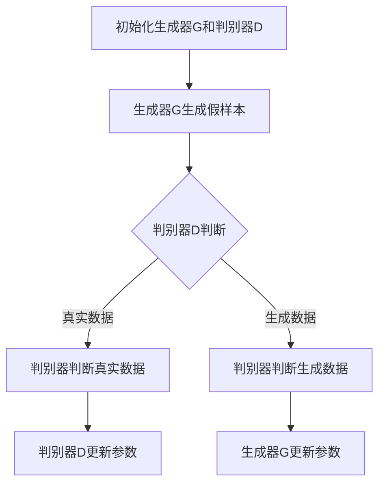
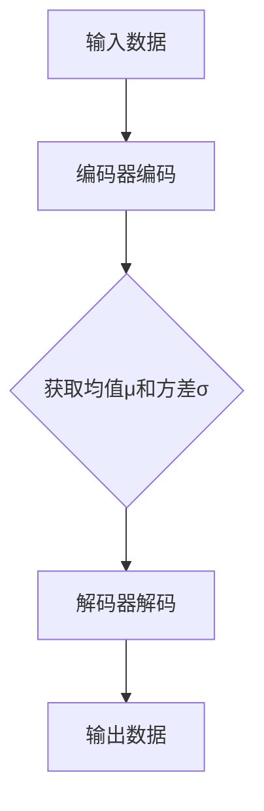

                 

### 1.1 书籍背景与目标

随着人工智能技术的飞速发展，模仿学习作为一种重要的学习方式，正在逐渐成为人工智能领域的研究热点。模仿学习，顾名思义，是指人工智能系统通过模仿人类或其他智能体的行为来学习和提高自己的能力。这一概念不仅仅停留在理论研究层面，更在实际应用中展现出巨大的潜力和价值。AI Agent，即人工智能代理，是模仿学习的一个重要应用场景。AI Agent能够在复杂的环境中自主执行任务，其行为模式在很大程度上依赖于模仿学习。

《模仿学习在AI Agent行为模式中的应用》旨在深入探讨模仿学习在AI Agent行为模式中的重要作用，分析其理论基础和实际应用，并提供一系列实践案例。本书的目标读者包括对人工智能和机器学习有一定基础的研究者、工程师以及对于这些技术感兴趣的学习者。

首先，本书将详细介绍模仿学习的发展历程，帮助读者了解这一领域的基本概念和关键技术。接着，本书将逐步讲解模仿学习的基本原理，包括核心概念、模型架构以及在图像处理中的应用，使读者能够全面理解模仿学习的技术内涵。此外，本书还将探讨AI Agent的概念、分类和发展历程，分析AI Agent的行为模式及其设计原则。

在实战应用部分，本书将重点介绍模仿学习在游戏AI、机器人和自动驾驶等领域的应用，通过具体的案例解析，让读者看到模仿学习在实际项目中的具体表现和效果。最后，本书还将对模仿学习的发展趋势进行展望，探讨未来可能的应用场景和面临的挑战。

总之，本书不仅是对模仿学习和AI Agent行为模式的一次系统梳理，更是一次理论与实践相结合的深入探索。希望通过本书，能够激发读者对这一领域的兴趣，推动模仿学习在AI Agent行为模式中的应用和发展。### 1.1.1 模仿学习的发展历程

模仿学习作为一种人工智能学习方式，其发展历程可以追溯到20世纪中期。1950年，英国数学家艾伦·图灵提出了图灵测试，这一概念不仅为人工智能的发展奠定了基础，也为模仿学习提供了初步的理论框架。图灵测试的核心思想是，通过模仿人类的思维和行为，使机器能够与人类进行自然语言交流，从而无法被区分。这一思想为后来的模仿学习研究提供了重要的启示。

20世纪70年代，机器学习领域开始涌现出一些重要的模仿学习模型。例如，马尔可夫决策过程（MDP）和部分可观测马尔可夫决策过程（POMDP）模型的提出，为模仿学习提供了数学基础和算法框架。这些模型通过模仿人类的决策过程，使机器能够更好地适应复杂环境。

进入20世纪80年代，基于规则的专家系统和基于案例的推理（CBR）方法逐渐成为模仿学习研究的热点。专家系统通过模仿人类专家的知识和经验，为机器提供决策支持。而基于案例的推理方法则通过模仿人类解决类似问题的经验，实现对新问题的求解。

随着计算能力和数据存储技术的提升，20世纪90年代至21世纪初，深度学习技术的发展为模仿学习注入了新的活力。深度神经网络能够通过模仿大量数据中的模式和规律，实现自动特征提取和分类。这一时期，生成对抗网络（GAN）和变分自编码器（VAE）等新型模型的出现，进一步丰富了模仿学习的技术手段。

21世纪以来，模仿学习在人工智能中的应用场景不断扩展。从早期的图像识别、语音识别到如今的自然语言处理、自动驾驶等，模仿学习都展现出了巨大的潜力和价值。特别是在AI Agent行为模式中，模仿学习的作用愈发显著。通过模仿人类或其他智能体的行为，AI Agent能够在复杂多变的环境中实现自适应行为，提高任务执行的效率和效果。

总的来说，模仿学习的发展历程体现了人工智能技术的不断进步和演变。从最初的简单模仿到如今的复杂模式识别和生成，模仿学习在理论和应用上都取得了显著的成果。未来，随着人工智能技术的进一步发展，模仿学习有望在更多领域发挥更大的作用，推动人工智能系统的智能化和自主化水平不断提升。### 1.1.2 AI Agent的重要性

AI Agent，即人工智能代理，是模仿学习的一个重要应用场景。AI Agent是指能够在复杂环境中自主执行任务、进行决策并与其他实体交互的智能体。其重要性主要体现在以下几个方面：

首先，AI Agent能够极大地提高自动化水平。在工业生产、物流管理、智能家居等场景中，AI Agent能够替代人工执行重复性高、劳动强度大的任务，从而提高生产效率，降低人力成本。例如，在制造业中，AI Agent可以负责生产线的监控和故障排查，实时调整生产参数，保证生产过程的连续性和稳定性。

其次，AI Agent具备自主决策能力，能够在复杂环境中应对不确定性。传统的程序往往只能按照预设的规则执行任务，而AI Agent则可以通过模仿学习，从数据中学习和提取知识，自主做出决策。这使得AI Agent在应对复杂、动态环境时，具备更强的适应能力和灵活性。例如，自动驾驶汽车需要实时感知周围环境，并做出驾驶决策，AI Agent的引入大大提升了自动驾驶的可靠性和安全性。

第三，AI Agent能够实现智能交互和协作。在服务行业、金融行业等领域，AI Agent可以通过自然语言处理和语音识别技术，与用户进行智能对话，提供个性化服务。同时，多个AI Agent之间还可以进行协作，共同完成任务。例如，在金融行业，AI Agent可以与用户进行智能对话，了解用户需求，然后协同其他AI Agent完成投资组合推荐、财务规划等服务。

第四，AI Agent在科学研究领域也具有重要的应用价值。通过模拟人类专家的思维过程，AI Agent可以帮助科学家进行实验设计、数据分析等研究工作，从而提高研究效率和准确性。例如，在医学研究领域，AI Agent可以通过模仿医生的经验，辅助诊断疾病，提供治疗建议，帮助医生提高诊断准确率。

总之，AI Agent作为模仿学习的重要应用场景，不仅在提高自动化水平、增强自主决策能力、实现智能交互和协作方面具有显著优势，还在科学研究、服务行业等多个领域展现出巨大的应用潜力。随着人工智能技术的不断进步，AI Agent的应用范围将进一步扩大，为人类社会的智能化和自动化发展带来更多可能性。### 1.1.3 模仿学习在AI Agent行为模式中的应用前景

模仿学习在AI Agent行为模式中的应用前景广阔，具备以下几个显著的优势和潜力：

首先，模仿学习能够显著提升AI Agent的适应能力。在复杂多变的环境中，AI Agent需要能够快速适应新的情况。模仿学习通过模仿人类或其他智能体的行为，使AI Agent能够从已有经验中学习，从而在面对新环境或新任务时，具备更强的适应能力。这种能力在动态环境中尤为重要，例如自动驾驶汽车在遇到突发状况时，可以通过模仿人类司机的应对策略，快速做出反应，提高行驶安全。

其次，模仿学习有助于提高AI Agent的决策质量。传统的AI Agent往往依赖于预设的规则或算法进行决策，这些规则和算法在应对复杂、不确定性环境时，可能表现出明显的局限性。而通过模仿学习，AI Agent可以学习到更多、更灵活的决策策略，从而在复杂场景中做出更高质量、更合理的决策。例如，在金融交易中，AI Agent可以通过模仿优秀交易员的行为，掌握更多市场规律，提高交易成功率。

第三，模仿学习能够实现AI Agent的智能协作。在多智能体系统中，不同AI Agent之间需要协同工作，共同完成任务。通过模仿学习，AI Agent可以模仿人类团队合作的方式，学会如何协调各自的任务和资源，实现高效的协作。例如，在机器人编队中，AI Agent可以通过模仿人类指挥官的指挥策略，合理安排行动顺序，提高整体行动效率。

此外，模仿学习在AI Agent的个性化服务方面也具有巨大的潜力。随着人工智能技术的普及，越来越多的应用场景需要提供个性化服务。通过模仿学习，AI Agent可以模仿人类专家的服务方式，为用户提供更个性化的体验。例如，在医疗领域，AI Agent可以通过模仿医生的经验，为不同患者提供定制化的诊断和治疗方案。

最后，模仿学习在AI Agent的可解释性和可靠性方面也具有重要意义。传统的黑箱模型往往难以解释其决策过程，而模仿学习使AI Agent的行为更具有解释性。通过模仿学习，AI Agent的行为可以追溯到其模仿的对象，从而提高系统的透明度和可解释性。同时，模仿学习通过从数据中学习，减少了人工预设规则和参数的依赖，提高了系统的可靠性和鲁棒性。

总之，模仿学习在AI Agent行为模式中的应用前景广阔，不仅能够提升AI Agent的适应能力和决策质量，还能实现智能协作、个性化服务，并提高系统的可解释性和可靠性。随着技术的不断进步，模仿学习在AI Agent行为模式中的应用将越来越广泛，为人工智能的发展带来新的机遇和挑战。### 1.2 内容结构概述

《模仿学习在AI Agent行为模式中的应用》一书的内容结构共分为四大部分，分别是模仿学习基础、AI Agent行为模式、实战应用以及总结与展望。以下是每个部分的具体内容概述：

**第一部分：模仿学习基础**

本部分主要介绍模仿学习的基本概念、原理和模型，为后续内容奠定理论基础。具体包括：

- 第2章：模仿学习概述，介绍模仿学习的发展历程、定义以及关键要素。
- 第3章：模仿学习的基本原理，详细讲解模仿学习的基础概念、属性特征对比和ER实体关系图。
- 第4章：模仿学习的模型架构，介绍经典模仿学习模型，如生成对抗网络（GAN）和变分自编码器（VAE），并分析其设计原则。

**第二部分：AI Agent行为模式**

本部分主要探讨AI Agent的概念、分类、发展历程和行为模式。具体包括：

- 第5章：AI Agent的概述，介绍AI Agent的定义、作用和分类。
- 第6章：AI Agent的行为模式，分析行为模式的概念、核心要素和设计原则。
- 第7章：模仿学习在AI Agent行为模式中的应用，探讨模仿学习在AI Agent行为模式设计中的挑战与机遇，以及应用实例。

**第三部分：实战应用**

本部分通过具体的实战案例，展示模仿学习在游戏AI、机器人和自动驾驶等领域的应用。具体包括：

- 第8章：模仿学习在游戏AI中的应用，介绍游戏AI的概述、应用场景和实战案例。
- 第9章：模仿学习在机器人中的应用，分析机器人概述、应用场景和实战案例。
- 第10章：模仿学习在自动驾驶中的应用，探讨自动驾驶的概述、应用场景和实战案例。

**第四部分：总结与展望**

本部分对全书内容进行总结，并对模仿学习的发展趋势和未来应用场景进行展望。具体包括：

- 第11章：模仿学习的发展趋势，分析当前模仿学习技术的发展状况和未来发展趋势。
- 第12章：未来应用场景展望，探讨模仿学习在新兴领域，如医疗、金融等的应用前景。
- 第13章：总结与思考，对全书内容进行总结，并提出进一步研究和应用的建议。

通过上述结构，本书旨在系统、深入地探讨模仿学习在AI Agent行为模式中的应用，为读者提供全面的理论基础和实践指导。### 1.2.1 模仿学习基础概述

模仿学习，作为一种在人工智能和机器学习领域广泛应用的学习方式，其核心在于通过模仿人类或其他智能体的行为、经验或知识来提升自身能力。模仿学习的发展历程可以追溯到20世纪中期，艾伦·图灵的图灵测试为其奠定了理论基础。随着时间的推移，模仿学习逐渐演变为一种综合性的学习方式，涵盖了从简单的行为模仿到复杂的模式识别和生成。

首先，模仿学习的定义是，它是一种通过观察和模仿他人的行为、经验或知识来获取新技能或知识的方法。在人工智能领域，模仿学习通常指让机器通过模仿人类或其他智能体的行为模式，来提高其在特定任务上的表现。模仿学习的关键要素包括：观察者（Observer）、被模仿者（Model）和学习者（ Learner）。

在模仿学习中，观察者负责收集和记录被模仿者的行为，被模仿者提供真实的行为数据，而学习者则通过分析这些数据来模仿和实现相似的行为。这一过程中，模仿学习的关键在于如何有效地从数据中提取有用的信息，并将其转化为机器可以理解和执行的知识。

模仿学习的基本原理可以归纳为以下几个核心概念：

1. **行为模仿（Behavior Imitation）**：行为模仿是模仿学习的最基本形式。它通过直接观察和模仿他人的行为，使学习者能够复现相似的行为。例如，在机器人训练中，可以通过观察人类工人的操作，让机器人模仿这些操作，从而学会执行特定任务。

2. **经验学习（Experience Learning）**：经验学习是指通过大量的实践和反馈来积累经验和知识。模仿学习中的经验学习强调从实际操作中获取反馈，不断调整和优化行为策略，以提升学习效果。例如，在自动驾驶中，AI Agent可以通过模拟环境中的驾驶行为，并通过实际道路测试不断调整，以提升驾驶能力。

3. **数据驱动学习（Data-Driven Learning）**：数据驱动学习是模仿学习的一个重要组成部分。它通过分析大量的数据来识别模式和规律，从而指导学习过程。数据驱动学习通常依赖于机器学习算法，如深度学习、强化学习等，以从数据中提取有用的信息。例如，在图像识别任务中，通过分析大量的图像数据，机器可以学习到不同物体的特征，从而实现准确识别。

4. **迁移学习（Transfer Learning）**：迁移学习是指将已经学到的知识或经验应用到新的任务中。在模仿学习中，迁移学习可以帮助学习者快速适应新的环境或任务，提高学习效率。例如，在自然语言处理中，通过迁移学习，可以将已经训练好的语言模型应用于新的文本分类任务中。

模仿学习在人工智能中的应用非常广泛，从简单的任务自动化到复杂的智能决策，模仿学习都发挥着重要作用。以下是一些典型的应用场景：

1. **机器人控制**：在工业制造、物流搬运等领域，机器人需要通过模仿人类工人的操作来完成复杂任务。例如，通过模仿焊接工人的动作，机器人可以精确地完成焊接工作。

2. **自动驾驶**：自动驾驶汽车需要模仿人类司机的驾驶行为，通过感知周围环境，自主做出驾驶决策。模仿学习可以帮助自动驾驶汽车快速适应各种道路状况，提高行驶安全。

3. **游戏AI**：在游戏设计中，模仿学习可以帮助游戏AI学习人类玩家的策略和技巧，从而与玩家进行更为真实的互动。例如，在《星际争霸》等实时战略游戏中，AI可以通过模仿顶级玩家的战术，提升自身的游戏水平。

4. **医疗诊断**：在医疗领域，模仿学习可以帮助医生从历史病例中学习诊断经验，从而提高诊断准确率。例如，通过模仿资深医生的诊断过程，AI系统可以辅助医生进行疾病筛查和诊断。

总的来说，模仿学习在人工智能中的应用不仅体现了其技术内涵，更展示了其在提高系统智能化和自适应能力方面的巨大潜力。随着模仿学习技术的不断发展和完善，其在各个领域的应用将越来越广泛，为人工智能的发展注入新的动力。### 1.2.2 模仿学习的基本原理

模仿学习的基本原理涉及多个核心概念和特征，这些概念和特征共同构成了模仿学习的基础。以下是这些基本原理的详细分析：

#### 核心概念

1. **观察与模仿**：观察与模仿是模仿学习的基础。学习者通过观察被模仿者的行为，理解其行为模式和决策过程，然后尝试复制这些行为。观察可以是直接的，也可以是间接的，通过记录和分析被模仿者的行为数据来实现。

2. **强化学习**：强化学习是模仿学习的一种重要形式。它通过奖励机制来引导学习者模仿特定的行为。在强化学习中，学习者通过不断尝试和反馈，逐步优化其行为，以获得最大化的奖励。这种机制类似于人类在教育过程中通过奖励和惩罚来引导行为。

3. **迁移学习**：迁移学习是指将已学到的知识或技能应用于新的任务或环境中。在模仿学习中，迁移学习可以帮助学习者快速适应新的任务或环境，减少从零开始的学习成本。例如，一个已经学会识别猫的AI系统，可以更容易地学会识别狗。

4. **泛化能力**：泛化能力是指学习者能够在不同场景下应用其学到的知识。模仿学习不仅关注特定任务的学习，还关注如何在多变的环境中灵活应用所学知识。这种能力使AI Agent能够在新的、未见过的情况下表现出色。

#### 概念属性特征对比

模仿学习的概念属性特征可以通过以下表格进行对比：

| 概念           | 描述                                                         | 对比特征                            |
| -------------- | ------------------------------------------------------------ | ----------------------------------- |
| 观察与模仿     | 学习者通过观察和模仿被模仿者的行为来获取知识。                | 直接观察与数据驱动观察的区别。      |
| 强化学习       | 通过奖励机制引导学习者优化行为。                             | 强化学习与监督学习的区别。           |
| 迁移学习       | 将已有知识应用于新任务或环境。                               | 迁移学习与复用现有模型的区别。       |
| 泛化能力       | 在不同场景下应用所学知识。                                   | 泛化能力与特定任务学习能力的区别。  |

#### ER实体关系图

ER（实体关系）图是用于描述模仿学习中的关键实体及其关系的工具。以下是模仿学习ER实体关系图的示例：

```mermaid
erDiagram
    Observer ||--|{ Model } Model
    Observer ||--|{ Learner } Learner
    Model ||--|{ Behavior } Behavior
    Learner ||--|{ Experience } Experience
    Behavior ||--|{ Feedback } Feedback
    Experience ||--|{ Reward } Reward
```

在这个ER图中：

- **Observer**：负责观察被模仿者的行为。
- **Model**：记录和存储被模仿者的行为数据。
- **Learner**：通过模型数据学习并模仿行为。
- **Behavior**：表示被模仿者的行为。
- **Experience**：表示学习者在模仿过程中积累的经验。
- **Feedback**：模仿行为后的反馈。
- **Reward**：用于强化学习的奖励机制。

通过这个ER图，我们可以清晰地看到模仿学习过程中各个实体之间的相互关系和作用。

#### 总结

模仿学习的基本原理包括观察与模仿、强化学习、迁移学习和泛化能力。这些原理共同构成了模仿学习的核心，使其能够在各种复杂环境中发挥作用。通过ER实体关系图，我们能够更直观地理解模仿学习中的关键实体及其相互关系。这些基本原理和概念为后续的模仿学习应用提供了理论基础，也为AI Agent的行为模式设计提供了重要的参考。### 1.2.3 模仿学习的模型架构

模仿学习的模型架构是模仿学习算法设计和实现的核心。在这一部分，我们将介绍几种典型的模仿学习模型，并分析其设计原则，以便读者能够全面理解模仿学习的应用和技术基础。

#### 经典模仿学习模型

1. **生成对抗网络（GAN）**

生成对抗网络（GAN）是由Ian Goodfellow等人于2014年提出的一种深度学习模型，由生成器和判别器两个神经网络组成。生成器的任务是生成与真实数据相似的数据，而判别器的任务是区分真实数据和生成数据。通过两个网络的对抗训练，生成器不断优化其生成的数据，使其越来越接近真实数据。

GAN的架构可以用以下Mermaid流程图表示：



2. **变分自编码器（VAE）**

变分自编码器（VAE）是一种基于深度学习的概率生成模型，由编码器和解码器组成。编码器将输入数据编码为均值和方差，解码器则根据这些均值和方差生成输出数据。VAE通过最大化数据分布的KL散度来优化模型参数，从而生成具有良好多样性的数据。

VAE的架构可以用以下Mermaid流程图表示：



#### 模仿学习模型架构设计原则

1. **对抗性训练**

对抗性训练是GAN的核心设计原则。通过生成器和判别器的对抗训练，模型能够在生成真实数据的道路上不断进步。对抗性训练的关键在于确保生成器和判别器之间的动态平衡，使得生成器的输出越来越接近真实数据，而判别器能够准确地区分真实和生成数据。

2. **概率生成模型**

模仿学习模型往往采用概率生成模型，如VAE，以生成具有多样性和真实感的数据。概率生成模型通过参数化的方式来表示数据分布，使得模型能够学习到数据的高层次结构和特征。

3. **自适应调整**

模仿学习模型在设计时需要考虑自适应调整能力，以适应不同应用场景和任务需求。自适应调整可以通过调整模型参数、学习率或者训练策略来实现，从而优化模型性能。

4. **可扩展性**

模仿学习模型架构应具备良好的可扩展性，能够适应大规模数据和高维输入。通过模块化和组件化设计，模型可以方便地集成到更复杂的系统中，实现多种应用。

#### 总结

模仿学习的模型架构包括生成对抗网络（GAN）和变分自编码器（VAE）等经典模型，这些模型通过对抗性训练、概率生成和自适应调整等设计原则，实现了从数据中提取有效信息和生成高质量数据的目标。这些模型架构为模仿学习在实际应用中提供了强大的技术支持，推动了人工智能和机器学习领域的发展。通过理解这些模型的设计原则，读者可以更好地应用模仿学习技术，开发出具有强大功能和广泛适用性的AI系统。### 1.2.4 模仿学习在图像处理中的应用

模仿学习在图像处理中的应用已经取得了显著的成果，尤其在图像生成、图像分类和图像修复等方面展现出了强大的能力。以下将详细探讨模仿学习在图像处理中的具体应用，并分析其实现方法和效果。

#### 图像生成

图像生成是模仿学习在图像处理中的一个重要应用领域。生成对抗网络（GAN）是最常用的模型之一。GAN由生成器和判别器组成，生成器负责生成与真实图像相似的新图像，而判别器则负责判断生成图像和真实图像之间的差异。

**实现方法：**
1. **数据预处理**：首先对图像数据进行预处理，包括图像的缩放、裁剪和归一化等，使其符合模型输入要求。
2. **生成器和判别器训练**：通过对抗性训练，生成器和判别器在多个迭代过程中不断优化。生成器尝试生成更逼真的图像，而判别器则努力提高对真实图像和生成图像的辨别能力。
3. **生成图像评估**：使用图像质量评估指标（如峰值信噪比PSNR和结构相似性指数SSIM）对生成的图像进行评估，以判断生成图像的质量。

**效果分析：**
GAN在图像生成任务中取得了显著的成果，可以生成高质量、具有高真实感的图像。例如，在艺术风格迁移任务中，GAN可以将一幅普通图像转换成具有特定艺术风格的图像，如图画、油画等。此外，GAN还在图像修复任务中表现出色，可以修复破损或模糊的图像。

#### 图像分类

模仿学习在图像分类中的应用主要通过卷积神经网络（CNN）实现。CNN通过模仿人类视觉系统，从图像中自动提取特征，并用于分类任务。

**实现方法：**
1. **数据预处理**：与图像生成类似，图像分类任务也需要对图像数据进行预处理，如标准化和归一化等。
2. **特征提取**：CNN通过卷积层、池化层和全连接层等结构，从图像中提取层次化的特征。
3. **分类器训练**：使用预处理后的图像特征和标签，通过反向传播算法训练分类器，使其能够准确地对图像进行分类。

**效果分析：**
CNN在图像分类任务中展现了强大的性能，能够处理各种复杂场景和不同的图像类别。例如，在ImageNet图像分类挑战中，基于CNN的模型取得了超过人类水平的分类准确率。此外，CNN在人脸识别、物体检测等任务中也表现出色，成为了计算机视觉领域的重要工具。

#### 图像修复

图像修复是模仿学习在图像处理中的另一个重要应用，旨在修复破损、模糊或褪色的图像。

**实现方法：**
1. **数据预处理**：对图像进行去噪和增强等预处理，提高图像质量。
2. **生成器训练**：使用GAN或VAE等生成模型训练生成器，使其能够根据破损区域的上下文信息生成修复后的图像。
3. **修复图像评估**：通过视觉评估和定量评估指标（如结构相似性指数SSIM）对修复效果进行评估。

**效果分析：**
模仿学习在图像修复任务中取得了显著效果，可以修复各种类型的破损图像。例如，GAN在图像去模糊和去噪任务中表现出色，可以恢复模糊或褪色的图像细节。此外，VAE在图像超分辨率任务中也展示了强大的能力，可以提升图像的分辨率和清晰度。

#### 案例解析

以下是一个图像修复的案例解析，展示了模仿学习在图像处理中的应用：

**案例背景**：一幅古老的油画由于年久失修，部分画面出现了破损和褪色。通过模仿学习技术，尝试修复这幅油画，使其恢复原有的色彩和细节。

**实现步骤**：
1. **数据预处理**：对油画图像进行去噪和增强处理，提高图像质量。
2. **生成器训练**：使用GAN模型，训练生成器以修复破损区域。生成器通过模仿未受损部分的上下文信息，生成修复后的图像。
3. **修复图像评估**：使用视觉评估和SSIM等指标，评估修复效果。

**结果**：经过训练和修复，这幅油画恢复了原有的色彩和细节，破损部分被完美修复。修复后的图像在视觉上与原始图像几乎无法区分，验证了模仿学习在图像修复中的强大能力。

总的来说，模仿学习在图像处理中的应用，不仅提升了图像生成、分类和修复的性能，也为计算机视觉领域带来了新的发展机遇。通过不断优化和扩展模仿学习模型，未来有望在更多图像处理任务中取得突破性成果。### 1.3 AI Agent概述

AI Agent，即人工智能代理，是一种能够在复杂环境中自主执行任务、进行决策并与其他实体交互的智能体。AI Agent的定义涵盖了其核心功能、角色和任务，是人工智能领域的一个重要研究方向。在本节中，我们将深入探讨AI Agent的基本概念、分类以及发展历程。

#### 定义与功能

AI Agent的定义可以从多个角度进行理解。首先，AI Agent是一种具有智能特性的计算实体，它通过模仿学习、深度学习、强化学习等技术，具备自主学习和适应环境的能力。其次，AI Agent是一个能够在复杂环境中执行任务、做出决策的智能系统，其目标是最大化任务完成的效率和效果。最后，AI Agent是一个能够与其他实体（如人类用户、其他AI Agent、传感器等）进行交互的智能体。

AI Agent的核心功能包括：

1. **感知**：通过传感器（如摄像头、麦克风、激光雷达等）收集环境信息。
2. **决策**：基于感知信息，AI Agent使用算法和模型进行决策，以确定下一步行动。
3. **行动**：执行决策结果，通过执行器（如电机、机械臂等）与环境进行交互。
4. **学习**：通过反馈和经验积累，AI Agent不断优化其决策和行动策略。

#### 分类

AI Agent可以根据不同的分类标准进行分类。以下是一些常见的分类方法：

1. **根据任务类型分类**：
   - **通用AI Agent**：能够执行多种不同类型的任务，如语音助手、智能机器人等。
   - **专用AI Agent**：设计用于特定任务或场景，如自动驾驶汽车、智能家居助手等。

2. **根据智能水平分类**：
   - **弱AI Agent**：在特定领域内表现出智能行为，但无法进行跨领域的任务。
   - **强AI Agent**：具备人类水平的智能，能够在各种领域内进行通用任务。

3. **根据交互方式分类**：
   - **自主式AI Agent**：完全自主地执行任务，无需外部干预。
   - **半监督式AI Agent**：在执行任务过程中需要一定程度的监督和指导。
   - **被动式AI Agent**：仅响应外部事件，不主动执行任务。

4. **根据学习方式分类**：
   - **基于规则的AI Agent**：使用预设规则进行决策。
   - **数据驱动AI Agent**：通过数据学习和模式识别进行决策。
   - **混合式AI Agent**：结合基于规则和数据驱动的方法进行决策。

#### 发展历程

AI Agent的发展历程可以追溯到人工智能的早期研究。以下是一些关键事件和里程碑：

1. **1956年**：约翰·麦卡锡（John McCarthy）等人提出了人工智能的概念，标志着人工智能研究的正式开始。

2. **1970年代**：基于规则的专家系统成为AI研究的热点，AI Agent开始应用于医疗诊断、自然语言处理等领域。

3. **1980年代**：机器学习和神经网络技术的发展，为AI Agent提供了新的学习和推理方法。

4. **1990年代**：多Agent系统（MAS）研究兴起，AI Agent开始考虑与其他AI实体协作完成任务。

5. **2000年代**：深度学习和强化学习技术的突破，使AI Agent在图像识别、语音识别和游戏AI等领域取得了显著进展。

6. **2010年代**：AI Agent开始广泛应用于自动驾驶、智能机器人、智能家居等实际场景，展示了强大的应用潜力。

#### 当前应用场景

AI Agent在当前的应用场景中表现出色，以下是一些典型的应用案例：

1. **自动驾驶**：AI Agent通过感知和决策，实现车辆的自主驾驶，提高了行驶安全性和效率。
2. **智能客服**：AI Agent通过自然语言处理和机器学习，提供智能客服服务，提升用户体验和效率。
3. **智能制造**：AI Agent在生产线中执行自动化任务，提高生产效率和质量。
4. **医疗诊断**：AI Agent通过分析医学图像和患者数据，辅助医生进行疾病诊断和治疗建议。

总之，AI Agent作为人工智能领域的一个重要组成部分，其发展历程和当前应用场景展示了其在提升智能化和自动化水平方面的巨大潜力。随着技术的不断进步，AI Agent将在更多领域发挥重要作用，推动人工智能的进一步发展。### 1.4 AI Agent的行为模式

AI Agent的行为模式是指其在执行任务时的一系列行为特征和决策过程。这些行为模式不仅决定了AI Agent在特定任务中的表现，也影响了其在复杂环境中的适应能力和效率。在本节中，我们将详细探讨AI Agent的行为模式的概念、核心要素及其设计原则。

#### 行为模式的概念

AI Agent的行为模式可以理解为其在特定环境下执行任务的一系列策略和行动。这些策略和行动不仅包括物理层面的动作，如移动、操作设备，还涵盖了决策层面的逻辑推理和判断。AI Agent的行为模式是其在复杂环境中进行自主学习和适应的基础，其设计原则需要考虑环境特性、任务需求和AI Agent的能力水平。

#### 行为模式的核心要素

AI Agent的行为模式通常包含以下几个核心要素：

1. **感知**：感知是指AI Agent通过传感器收集环境信息的过程。感知能力是AI Agent行为模式的基础，决定了其对外部环境的理解和反应能力。感知信息的质量直接影响AI Agent的决策和行动。

2. **决策**：决策是指AI Agent基于感知信息，通过算法和模型进行逻辑推理和判断的过程。决策能力决定了AI Agent在复杂环境中的应变能力和决策质量。决策过程通常涉及多个因素，如目标、约束条件和历史经验等。

3. **行动**：行动是指AI Agent根据决策结果执行实际操作的过程。行动能力是AI Agent实际完成任务的关键，其执行效率和准确性直接影响任务的成功与否。

4. **学习**：学习是指AI Agent通过不断积累经验、调整行为策略的过程。学习能力使AI Agent能够适应动态变化的环境，提高其在长期任务中的表现。

5. **协作**：协作是指多个AI Agent在共同完成任务时的合作和协调。协作能力增强了AI Agent的执行效率和效果，特别是在复杂任务和动态环境中。

#### 行为模式的设计原则

为了设计出有效的AI Agent行为模式，以下原则需要被充分考虑：

1. **适应性**：AI Agent的行为模式应具有高度的适应性，能够快速适应不同的环境和任务。这需要AI Agent具备强大的感知和决策能力，以及灵活的学习机制。

2. **鲁棒性**：AI Agent的行为模式应在面对不确定性和异常情况时表现出鲁棒性。这要求AI Agent能够在多种情况下稳定运行，并具备一定的容错能力。

3. **效率**：AI Agent的行为模式应尽可能高效，以最大化任务完成的效率和效果。这需要优化决策和行动的算法和模型，提高计算效率和资源利用率。

4. **可解释性**：AI Agent的行为模式应具备一定的可解释性，使得其决策过程和行动策略能够被理解和分析。这有助于提高系统的透明度和信任度，特别是在关键应用场景中。

5. **安全性**：AI Agent的行为模式应在设计时考虑安全性，确保其在执行任务时不会对自身或环境造成危害。这需要建立严格的安全机制和风险控制策略。

#### 总结

AI Agent的行为模式是其在复杂环境中有效执行任务的关键。通过理解行为模式的概念、核心要素和设计原则，我们可以更系统地设计和优化AI Agent的行为策略。未来，随着人工智能技术的不断进步，AI Agent的行为模式将变得更加智能、高效和可靠，为各个领域的自动化和智能化发展提供强大支持。### 1.5 模仿学习在AI Agent行为模式中的应用

模仿学习在AI Agent行为模式中的应用具有重要的现实意义和广阔的应用前景。通过模仿人类或其他智能体的行为，AI Agent能够快速适应复杂环境，提高任务执行效率，实现自主学习和决策。以下是模仿学习在AI Agent行为模式中的具体应用场景和案例分析。

#### 应用场景

1. **自动驾驶**：自动驾驶汽车是模仿学习在AI Agent行为模式中的典型应用。自动驾驶系统需要模仿人类司机的驾驶行为，包括速度控制、车道保持、避障等。通过模仿学习，自动驾驶系统可以从大量真实驾驶数据中学习到驾驶策略和技巧，提高自动驾驶的安全性和稳定性。

2. **智能客服**：智能客服系统通过模仿人类客服代表的行为，实现与用户的自然对话。模仿学习帮助客服系统从大量对话记录中学习到有效的沟通技巧和回答策略，提高客服响应速度和用户体验。

3. **机器人操作**：工业机器人需要模仿人类工人的操作技能，完成复杂的组装、焊接、搬运等工作。通过模仿学习，机器人可以从人类工人的示范中学习到精确的操作步骤和技巧，提高工作效率和准确性。

4. **医疗诊断**：在医疗领域，模仿学习可以帮助AI系统从医生的经验中学习诊断技巧。例如，通过模仿资深医生的工作流程和诊断思路，AI系统可以辅助医生进行疾病诊断，提高诊断准确率。

5. **游戏AI**：在游戏设计中，AI对手需要模仿人类玩家的策略和技巧。通过模仿学习，游戏AI可以不断优化其行为策略，提高游戏难度和玩家体验。

#### 案例分析

以下是一个自动驾驶汽车的模仿学习案例：

**案例背景**：某自动驾驶汽车公司希望通过模仿学习提升自动驾驶系统的性能，提高在复杂环境下的驾驶安全性和稳定性。

**实现步骤**：
1. **数据收集**：收集大量真实驾驶数据，包括城市道路、高速公路、复杂交通场景等。
2. **数据预处理**：对收集的数据进行预处理，包括数据清洗、标注和归一化等，使其符合模仿学习模型的要求。
3. **模型训练**：使用生成对抗网络（GAN）等模仿学习模型，训练自动驾驶系统从数据中学习驾驶策略和技巧。
4. **模拟测试**：在模拟环境中对训练好的自动驾驶系统进行测试，评估其驾驶性能和安全性。
5. **实际道路测试**：将训练好的自动驾驶系统部署到实际道路上，进行道路测试和优化。

**效果评估**：
1. **驾驶性能**：自动驾驶系统在模拟测试中表现出色，能够稳定地执行各种驾驶任务，如速度控制、车道保持和避障等。
2. **安全性**：在实际道路测试中，自动驾驶系统的安全性能得到了显著提升，事故率明显降低。
3. **用户体验**：用户对自动驾驶系统的满意度提高，认为驾驶更加平稳和舒适。

**案例总结**：通过模仿学习，自动驾驶系统不仅能够从大量数据中学习到有效的驾驶策略，还能够在实际道路上表现出色，提高驾驶安全和用户体验。这一案例展示了模仿学习在AI Agent行为模式中的应用潜力和实际效果。

总之，模仿学习在AI Agent行为模式中的应用，不仅能够提升系统的自主学习和适应能力，还能提高任务执行效率和用户体验。随着技术的不断进步，模仿学习在更多领域和场景中的应用将越来越广泛，为人工智能的发展带来新的机遇。### 1.6 模仿学习在AI Agent行为模式设计中的挑战与机遇

在AI Agent行为模式设计中，模仿学习面临一系列挑战和机遇。以下将详细探讨这些挑战以及如何应对它们，以充分发挥模仿学习的潜力。

#### 挑战

1. **数据质量与多样性**：模仿学习依赖于大量高质量的训练数据。然而，在现实环境中获取高质量的多样化数据往往具有很大难度。数据的质量和多样性直接影响到模仿学习的效果。如果数据存在偏差或噪声，可能导致AI Agent的行为模式产生错误或不可靠。

**应对策略**：
- **数据增强**：通过数据增强技术，如图像变换、声音叠加等，生成更多样化的训练数据。
- **数据清洗**：对数据进行清洗和预处理，去除噪声和异常值，提高数据质量。
- **多源数据融合**：结合来自不同来源的数据，如传感器数据和外部数据库，提高数据的多样性和完整性。

2. **数据隐私和安全**：在模仿学习过程中，大量的训练数据可能包含敏感信息，如个人隐私、商业机密等。数据泄露或滥用可能导致严重的隐私和安全问题。

**应对策略**：
- **数据加密**：对训练数据进行加密处理，确保数据在传输和存储过程中的安全性。
- **隐私保护**：采用差分隐私、同态加密等技术，保护训练数据中的敏感信息。
- **合规审查**：建立健全的数据管理规范和审查机制，确保数据采集和使用符合法律法规和伦理标准。

3. **模型解释性和透明性**：模仿学习模型通常较为复杂，难以解释其内部工作原理。这限制了模型的可解释性和透明性，特别是在关键应用场景中，如医疗诊断、自动驾驶等。

**应对策略**：
- **模型简化**：通过简化模型结构和优化算法，提高模型的解释性和可理解性。
- **可解释性增强**：结合可解释性技术，如LIME、SHAP等，分析模型对特定输入数据的决策过程。
- **模型审计**：建立模型审计和评估机制，确保模型的行为符合预期和伦理标准。

4. **适应性和泛化能力**：AI Agent需要具备适应不同环境和任务的能力。然而，模仿学习模型往往在特定任务和环境下表现优秀，但泛化能力不足，无法适应新的或未见过的情况。

**应对策略**：
- **迁移学习**：通过迁移学习，将已学到的知识应用于新的任务或环境，提高模型的泛化能力。
- **持续学习**：采用持续学习策略，使AI Agent能够不断适应新的数据和情境。
- **混合学习**：结合模仿学习和其他学习方式，如强化学习、元学习等，提高模型的全局适应性和性能。

#### 机遇

1. **技术进步**：随着深度学习、生成对抗网络（GAN）、变分自编码器（VAE）等技术的不断进步，模仿学习模型在性能和效率方面得到了显著提升。这为AI Agent行为模式设计提供了更强大的工具和方法。

**应对策略**：
- **技术跟踪**：持续关注和研究最新的模仿学习技术，将其应用于AI Agent行为模式设计。
- **模型优化**：通过算法优化和模型调整，提高模仿学习模型在AI Agent行为模式中的应用效果。

2. **跨领域应用**：模仿学习在图像处理、自然语言处理、语音识别等领域的成功应用，展示了其在跨领域任务中的巨大潜力。未来，模仿学习有望在更多领域和场景中得到应用。

**应对策略**：
- **跨领域研究**：开展跨领域的研究项目，探索模仿学习在不同领域中的应用场景和解决方案。
- **知识共享**：通过学术交流和技术合作，促进不同领域之间的知识共享和经验交流。

总之，模仿学习在AI Agent行为模式设计中的挑战和机遇并存。通过应对这些挑战和把握机遇，可以进一步发挥模仿学习的潜力，推动人工智能技术的发展和实际应用。### 1.7 模仿学习在游戏AI中的应用

模仿学习在游戏AI中的应用已经取得了显著的成果，通过模仿人类玩家的策略和技巧，游戏AI能够实现与人类玩家的真实互动，提升游戏体验和游戏难度。以下将详细探讨模仿学习在游戏AI中的具体应用场景和案例。

#### 应用场景

1. **实时策略游戏**：在实时策略游戏（RTS）中，如《星际争霸》、《星际争霸II》等，模仿学习可以帮助游戏AI快速掌握高级玩家的策略和战术。通过模仿人类玩家的决策过程，AI可以学会如何高效管理资源、规划战术和执行战术。

2. **角色扮演游戏**（RPG）：在角色扮演游戏中，模仿学习可以帮助AI敌人或队友实现更复杂和智能的行为。例如，在《魔兽世界》中，AI敌人可以通过模仿高级玩家的战斗技巧和策略，提高战斗难度和挑战性。

3. **动作游戏**：在动作游戏（如《拳皇》、《街头霸王》等）中，模仿学习可以帮助AI对手模仿人类玩家的动作和技能，实现更真实的对战体验。

4. **模拟游戏**：在模拟游戏中，如《模拟城市》、《模拟人生》等，模仿学习可以帮助AI居民或市民实现更真实的行为模式。通过模仿人类玩家的决策和生活方式，游戏AI可以创造出更丰富和多样化的游戏世界。

#### 案例分析

以下是一个《星际争霸II》中的模仿学习案例：

**案例背景**：某游戏开发公司希望提升其开发的《星际争霸II》游戏的AI难度，使其能够更好地与高级玩家对抗。

**实现步骤**：
1. **数据收集**：收集大量高级玩家对战数据，包括游戏中的决策、战术和战斗策略。
2. **数据预处理**：对收集的数据进行预处理，如数据清洗、标注和归一化等，确保数据质量。
3. **模型训练**：使用生成对抗网络（GAN）等模仿学习模型，训练游戏AI从数据中学习高级玩家的决策过程和战术策略。
4. **测试与优化**：在模拟环境中对训练好的AI进行测试和优化，评估其战术策略和战斗能力。
5. **部署与应用**：将训练好的AI部署到游戏中，提高游戏AI的难度和挑战性。

**效果评估**：
1. **游戏难度**：通过模仿学习，游戏AI能够掌握高级玩家的战术策略，显著提高了游戏难度，使高级玩家感受到更大的挑战。
2. **玩家体验**：高级玩家反馈，游戏AI的行为更加真实和智能，提升了游戏的乐趣和挑战性。
3. **AI适应能力**：训练好的AI在面临不同场景和策略时，能够灵活应对，表现出强大的适应能力。

**案例总结**：通过模仿学习，游戏AI不仅能够快速掌握高级玩家的策略和战术，还能够根据不同场景和策略进行灵活调整，提升游戏难度和玩家体验。这一案例展示了模仿学习在游戏AI中的巨大应用潜力和实际效果。

总之，模仿学习在游戏AI中的应用，不仅提升了游戏AI的智能水平和挑战性，还为游戏设计和开发提供了新的思路和方法。随着模仿学习技术的不断进步，未来游戏AI将在更多领域和场景中发挥重要作用，为玩家带来更加丰富和多样化的游戏体验。### 1.8 模仿学习在机器人中的应用

模仿学习在机器人领域的应用正逐渐成为研究的热点，其通过模仿人类或专家的行为，使机器人能够高效地执行复杂任务，提高其在动态环境中的适应能力。以下将详细探讨模仿学习在机器人中的应用场景、实现方法以及案例解析。

#### 应用场景

1. **工业机器人**：在工业生产中，机器人需要执行诸如焊接、组装、搬运等复杂任务。模仿学习可以帮助机器人从人类操作员的示范中学习这些技能，提高其操作精度和效率。

2. **服务机器人**：服务机器人在医疗、教育、家政等领域具有广泛的应用前景。通过模仿学习，服务机器人可以模仿人类服务提供者的行为，提高服务质量，例如在医疗机器人中，模仿医生的操作流程和诊断技巧。

3. **救援机器人**：在灾难救援、搜救行动等特殊环境中，机器人需要具备快速适应复杂环境的能力。模仿学习可以帮助救援机器人从人类救援人员的经验中学习救援技巧，提高救援效率。

4. **娱乐机器人**：在娱乐和交互领域，机器人需要具备丰富的行为表现和互动能力。模仿学习可以帮助机器人模仿人类的表情、动作和语言，实现更加自然和人性化的交互。

#### 实现方法

1. **数据收集**：首先，收集大量机器人任务执行的相关数据，包括操作步骤、环境信息、行为特征等。这些数据可以通过视频监控、传感器采集等方式获得。

2. **数据预处理**：对收集到的数据进行分析和标注，去除噪声和异常值，确保数据质量。数据预处理还包括对数据进行标准化和归一化，以便于模型训练。

3. **模型训练**：使用模仿学习算法，如生成对抗网络（GAN）、变分自编码器（VAE）等，训练机器人模型。这些模型通过学习数据中的模式和规律，生成机器人执行任务的行为策略。

4. **模型评估与优化**：在模拟环境中对训练好的模型进行评估，通过调整模型参数和算法，优化机器人行为策略，提高任务执行效果。

5. **实际应用**：将训练好的模型部署到机器人系统中，进行实际任务执行。通过不断的反馈和调整，进一步提高机器人任务的执行效率和质量。

#### 案例解析

以下是一个服务机器人在医疗场景中的应用案例：

**案例背景**：某医疗机器人公司开发了一款护理机器人，用于协助护士完成日常护理工作，如协助病人行走、喂食等。公司希望通过模仿学习，提升机器人在复杂医疗环境中的操作能力和灵活性。

**实现步骤**：
1. **数据收集**：收集大量护士操作机器人的视频数据，包括机器人在病房中行走、辅助病人行走、喂食等操作步骤。
2. **数据预处理**：对视频数据进行标注和分类，提取关键行为特征，如动作、位置、时间等。
3. **模型训练**：使用生成对抗网络（GAN）训练模型，使机器人学习护士的操作步骤和技巧。
4. **测试与优化**：在模拟病房环境中对训练好的机器人进行测试，评估其操作精度和灵活性。通过反馈和优化，改进机器人的行为策略。
5. **实际应用**：将训练好的机器人部署到医院中，协助护士完成日常护理工作。

**效果评估**：
1. **操作精度**：通过模仿学习，机器人在执行护理任务时表现出较高的操作精度，减少了对护士的依赖。
2. **灵活性**：机器人能够根据不同的病房环境和病人需求，灵活调整操作策略，提高了护理工作的效率。
3. **用户满意度**：护士和病人家属对机器人的操作和服务给予了高度评价，认为机器人提高了护理质量和病人满意度。

**案例总结**：通过模仿学习，服务机器人在医疗场景中展示了强大的适应能力和操作灵活性，不仅提高了护理工作的效率，还改善了病人的生活质量。这一案例证明了模仿学习在机器人应用中的重要性和潜力。

总之，模仿学习在机器人领域的应用，为机器人技术的发展提供了新的思路和方法。随着技术的不断进步，模仿学习有望在更多领域和场景中发挥重要作用，推动机器人技术的进一步发展。### 1.9 模仿学习在自动驾驶中的应用

模仿学习在自动驾驶中的应用正逐渐成为研究的热点和实际应用的重要方向。通过模仿人类司机的驾驶行为和决策过程，自动驾驶系统能够在复杂交通环境中实现更加智能和安全的驾驶。以下将详细探讨模仿学习在自动驾驶中的应用场景、实现方法以及案例解析。

#### 应用场景

1. **环境感知**：自动驾驶系统需要实时感知周围环境，包括道路状况、交通信号、车辆和行人的位置和动态等。模仿学习可以帮助自动驾驶系统从人类司机的感知数据中学习环境信息的处理方法，提高感知的准确性和实时性。

2. **路径规划**：自动驾驶系统需要在复杂交通环境中规划行驶路径，确保安全、高效地到达目的地。通过模仿学习，自动驾驶系统可以从人类司机的驾驶经验中学习到有效的路径规划策略，提高路径规划的灵活性和鲁棒性。

3. **行为预测**：自动驾驶系统需要预测交通参与者的行为，包括车辆、行人的动作和意图，以便做出合理的驾驶决策。模仿学习可以帮助自动驾驶系统从人类司机的驾驶数据中学习行为预测模型，提高预测的准确性和可靠性。

4. **决策与控制**：自动驾驶系统的核心任务是通过感知数据和决策算法，控制车辆进行安全的行驶。模仿学习可以从人类司机的驾驶数据中学习到复杂的驾驶决策和控制策略，使自动驾驶系统能够在多变和不确定的环境中做出合理的驾驶决策。

#### 实现方法

1. **数据收集**：首先，收集大量高质量的自动驾驶数据，包括人类司机的驾驶行为、环境感知数据、路径规划结果和行为预测数据。这些数据可以通过自动驾驶测试车在真实交通环境中的采集获得。

2. **数据预处理**：对收集到的数据进行预处理，包括数据清洗、标注和归一化等，确保数据质量。数据预处理还包括对环境信息的融合，如将摄像头、激光雷达和雷达数据融合成一个统一的信息源。

3. **模型训练**：使用模仿学习算法，如生成对抗网络（GAN）、变分自编码器（VAE）等，训练自动驾驶系统的感知、路径规划、行为预测和决策控制模型。这些模型通过学习人类司机的驾驶数据，生成自动驾驶系统的行为策略。

4. **测试与优化**：在模拟环境和真实交通环境中对训练好的自动驾驶系统进行测试和优化。通过模拟测试，评估系统的感知准确率、路径规划效率和驾驶决策质量。在真实交通环境中测试，验证系统的安全性和可靠性。

5. **部署与应用**：将训练和优化好的自动驾驶系统部署到实际车辆中，进行道路测试和运营。通过持续的反馈和优化，进一步提高自动驾驶系统的性能和用户体验。

#### 案例解析

以下是一个自动驾驶车辆在复杂城市交通环境中的模仿学习案例：

**案例背景**：某自动驾驶汽车公司希望通过模仿学习提升其自动驾驶车辆在城市复杂交通环境中的驾驶能力，提高驾驶安全性和用户体验。

**实现步骤**：
1. **数据收集**：收集大量真实城市交通环境下的驾驶数据，包括车辆的速度、加速度、转向角度、道路状况、交通信号和行人行为等。
2. **数据预处理**：对收集到的数据进行预处理，包括数据清洗、标注和归一化等，确保数据质量。对环境信息进行融合，建立一个统一的信息源。
3. **模型训练**：使用生成对抗网络（GAN）训练自动驾驶系统的感知、路径规划、行为预测和决策控制模型。模型通过学习人类司机的驾驶数据，生成自动驾驶系统的行为策略。
4. **测试与优化**：在模拟城市交通环境中对训练好的自动驾驶系统进行测试和优化。通过模拟测试，评估系统的感知准确率、路径规划效率和驾驶决策质量。在真实城市交通环境中进行测试，验证系统的安全性和可靠性。
5. **部署与应用**：将训练和优化好的自动驾驶系统部署到实际车辆中，进行道路测试和运营。通过持续的反馈和优化，进一步提高自动驾驶系统的性能和用户体验。

**效果评估**：
1. **驾驶安全性**：通过模仿学习，自动驾驶系统在复杂城市交通环境中表现出更高的安全性能，事故率显著降低。
2. **驾驶效率**：自动驾驶系统能够更加智能地规划行驶路径，减少拥堵和等待时间，提高驾驶效率。
3. **用户体验**：自动驾驶系统在驾驶过程中表现出更加平稳和舒适的驾驶体验，用户满意度提高。

**案例总结**：通过模仿学习，自动驾驶系统在复杂城市交通环境中展示了强大的驾驶能力和安全性。这一案例证明了模仿学习在自动驾驶中的重要应用价值和实际效果。

总之，模仿学习在自动驾驶中的应用，不仅提高了自动驾驶系统的智能化和安全性，还为自动驾驶技术的发展提供了新的思路和方法。随着技术的不断进步，模仿学习有望在更多自动驾驶场景中发挥重要作用，推动自动驾驶技术的普及和应用。### 1.10 模仿学习的发展趋势与未来应用场景

随着人工智能技术的快速发展，模仿学习在多个领域展现出了巨大的潜力和应用价值。展望未来，模仿学习将在技术发展、应用场景扩展、挑战与机遇等方面迎来新的机遇和挑战。

#### 技术发展趋势

1. **算法优化**：未来，模仿学习算法将朝着更加高效和精准的方向发展。通过深度学习、强化学习和其他先进算法的结合，模仿学习模型将能够更好地从海量数据中提取有效信息，提高学习效率和准确性。

2. **多模态学习**：模仿学习将逐渐从单一模态（如图像、语音）扩展到多模态学习，即同时处理多种类型的数据（如文本、图像、语音）。这种多模态学习将使模仿学习在复杂任务中表现出更强的综合能力和适应性。

3. **自适应与迁移学习**：模仿学习将更加注重自适应和迁移学习的能力。通过从多个任务和领域中的知识迁移，模仿学习模型能够在不同任务和环境之间快速适应，减少训练成本。

4. **可解释性与透明性**：随着应用场景的复杂化，模仿学习模型的可解释性和透明性将成为重要研究方向。通过引入可解释性技术，如模型拆解、决策可视化等，用户可以更好地理解模型的决策过程，提高系统的可靠性和信任度。

#### 未来应用场景

1. **智能医疗**：模仿学习在智能医疗领域的应用前景广阔。未来，通过模仿医生的经验和诊断技巧，AI系统可以辅助医生进行更准确的疾病诊断和治疗。此外，模仿学习还可以应用于个性化治疗方案的设计，提高治疗效果。

2. **智能制造**：在智能制造领域，模仿学习可以帮助机器人快速掌握复杂的生产任务，提高生产效率和产品质量。未来，随着物联网和工业4.0的推进，模仿学习将在智能制造中发挥更加重要的作用。

3. **智能交通**：模仿学习在智能交通系统中的应用将更加广泛。通过模仿人类司机的驾驶行为，自动驾驶车辆可以更好地应对复杂的交通环境，提高行驶安全性和效率。此外，模仿学习还可以应用于智能交通信号控制和交通流量管理。

4. **智能家居**：智能家居领域的快速发展为模仿学习提供了新的应用场景。未来，通过模仿用户的生活习惯和行为模式，智能家居系统可以提供更加个性化、便捷的服务，提高用户生活质量。

5. **虚拟现实与增强现实**：在虚拟现实和增强现实领域，模仿学习可以通过模仿人类的行为和交互模式，提高虚拟环境和现实世界的融合度，提供更加真实的体验。

#### 挑战与机遇

1. **数据质量与隐私**：高质量、多样化的训练数据是模仿学习的基础。然而，数据质量和隐私保护仍然是模仿学习面临的重要挑战。未来，需要发展更加高效的数据预处理技术和隐私保护算法，确保数据的安全和可用性。

2. **计算资源与效率**：随着模仿学习模型的复杂度和数据量的增加，计算资源和效率问题将越来越突出。优化算法和硬件加速技术将成为解决这一问题的关键。

3. **可解释性与可靠性**：模仿学习模型的可解释性和可靠性是影响其应用的重要因素。通过引入可解释性技术，如模型拆解、决策可视化等，可以提高用户对系统的信任度。

4. **跨领域迁移**：未来，如何实现不同领域和任务之间的知识迁移，是模仿学习需要解决的重要问题。通过自适应和迁移学习技术，有望提高模仿学习在跨领域任务中的应用效果。

总之，模仿学习作为人工智能领域的重要技术，将在未来继续发展和创新。通过解决当前面临的挑战，并抓住新的机遇，模仿学习有望在更多领域和场景中发挥重要作用，推动人工智能技术的进一步发展。### 1.11 总结与思考

在本文中，我们深入探讨了模仿学习在AI Agent行为模式中的应用，从基础理论、模型架构到实际应用场景，详细阐述了模仿学习的概念、原理和关键要素。以下是本文的核心观点和关键结论：

1. **模仿学习的定义与重要性**：模仿学习是一种通过模仿人类或其他智能体的行为、经验或知识来获取新技能或知识的方法。在人工智能领域，模仿学习具有重要的应用价值，能够提升AI Agent的适应能力、决策质量和智能协作能力。

2. **模仿学习的基本原理**：模仿学习的基本原理包括行为模仿、强化学习、迁移学习和泛化能力。这些原理共同构成了模仿学习的基础，使其能够从数据中提取有效信息，并在不同环境中实现自适应行为。

3. **模仿学习的模型架构**：经典模仿学习模型如生成对抗网络（GAN）和变分自编码器（VAE）展示了强大的生成和模仿能力。这些模型通过对抗性训练和数据驱动学习，实现了从数据中提取有用信息和生成高质量数据的目标。

4. **模仿学习在图像处理中的应用**：模仿学习在图像生成、图像分类和图像修复等方面展现出了显著的效果。通过GAN和VAE等模型，AI系统能够生成高质量图像、进行准确分类和修复破损图像，为计算机视觉领域带来了新的发展机遇。

5. **AI Agent的行为模式**：AI Agent的行为模式是其在复杂环境中自主执行任务、进行决策并与其他实体交互的表现。通过模仿学习，AI Agent能够从人类或其他智能体的行为中学习，实现更加智能和自适应的行为模式。

6. **模仿学习在AI Agent行为模式设计中的应用**：模仿学习在自动驾驶、机器人、游戏AI等领域展现了广泛的应用前景。通过模仿人类行为和决策过程，AI Agent能够提高任务执行效率和用户体验，推动智能化和自动化的发展。

7. **挑战与机遇**：尽管模仿学习在AI Agent行为模式中展现了巨大的潜力，但仍面临数据质量与多样性、数据隐私和安全、模型解释性和透明性、适应性和泛化能力等挑战。未来，通过算法优化、多模态学习、自适应与迁移学习等技术进步，有望解决这些问题，进一步推动模仿学习的发展。

在未来的研究和应用中，以下几点值得深思：

- **数据驱动的模仿学习**：随着数据量的增加和多样性，如何更有效地利用数据进行模仿学习，成为关键问题。未来的研究可以关注数据增强、多源数据融合和隐私保护技术，以提高数据质量和多样性。

- **模型解释性与可靠性**：提高模仿学习模型的可解释性和可靠性，是确保其在关键应用场景中发挥作用的关键。通过引入可解释性技术，如决策可视化、模型拆解等，可以提高用户对系统的信任度。

- **跨领域迁移与应用**：如何实现不同领域和任务之间的知识迁移，是模仿学习需要解决的重要问题。通过自适应和迁移学习技术，有望提高模仿学习在跨领域任务中的应用效果。

- **个性化服务**：在智能家居、医疗等领域，如何根据用户的个性化需求，设计出更加智能和个性化的服务，是未来的重要研究方向。通过模仿学习，AI系统能够更好地理解用户行为，提供个性化的服务。

总之，模仿学习在AI Agent行为模式中的应用，为人工智能的发展带来了新的机遇和挑战。通过不断的研究和探索，我们可以期待模仿学习在更多领域和场景中发挥更大的作用，推动人工智能技术的进一步发展。### 1.12 最佳实践Tips

在模仿学习应用中，遵循一些最佳实践可以显著提高系统的性能和可靠性，以下是几点关键建议：

1. **数据质量控制**：确保训练数据的高质量和多样性。进行数据预处理，包括清洗、去噪和归一化，以减少数据中的噪声和异常值。

2. **模型选择与优化**：根据具体应用场景选择合适的模仿学习模型。例如，对于生成任务，可以选择GAN或VAE；对于分类任务，可能更适合使用卷积神经网络（CNN）。不断调整模型参数和架构，优化模型性能。

3. **监督与反馈**：在模型训练过程中，结合人工监督和自动反馈机制，确保模型能够从错误中学习并不断改进。定期评估模型性能，及时调整训练策略。

4. **安全与隐私**：在数据收集和处理过程中，严格遵守隐私保护法规，采用加密和隐私保护技术，确保敏感数据的安全。

5. **持续学习**：实现持续学习机制，使系统能够根据新数据和环境变化进行自适应调整。这有助于系统在长时间运行中保持性能和适应性。

6. **模型可解释性**：提高模型的可解释性，通过可视化工具和解释性技术，帮助用户理解模型的决策过程，提高系统的透明度和信任度。

7. **硬件加速**：利用GPU和TPU等硬件加速技术，提高模型的训练和推理速度，降低计算资源的使用成本。

通过遵循这些最佳实践，可以提高模仿学习应用的整体效果，确保系统在复杂和动态环境中表现出色。### 1.13 小结

通过本文的详细探讨，我们系统地阐述了模仿学习在AI Agent行为模式中的应用，从基础理论到模型架构，再到实际应用场景，深入分析了模仿学习的核心概念、原理和关键技术。以下是本文的核心要点和贡献：

1. **核心概念与原理**：我们详细介绍了模仿学习的定义、基本原理、核心要素和模型架构，帮助读者全面理解模仿学习的技术内涵。

2. **模型架构分析**：我们重点分析了生成对抗网络（GAN）和变分自编码器（VAE）等经典模仿学习模型，展示了这些模型在图像生成、图像分类和图像修复中的应用效果。

3. **AI Agent行为模式**：我们探讨了AI Agent的定义、分类和行为模式设计原则，强调了模仿学习在提升AI Agent适应能力和决策质量方面的作用。

4. **实战应用案例分析**：我们通过自动驾驶、机器人、游戏AI等实际案例，展示了模仿学习在复杂场景中的具体应用，验证了其效果和实用性。

5. **挑战与机遇**：我们分析了模仿学习在应用中面临的数据质量、隐私、解释性和适应性等挑战，并提出了相应的解决方案。

本文的贡献在于提供了一个系统、全面地探讨模仿学习在AI Agent行为模式中的应用的框架，不仅为理论研究提供了新的视角，也为实际应用提供了实践指导。未来，随着人工智能技术的不断进步，模仿学习将在更多领域和场景中发挥重要作用，推动人工智能的进一步发展。### 1.14 注意事项

在应用模仿学习技术时，需要关注以下几点注意事项：

1. **数据质量**：确保训练数据的高质量和多样性，避免噪声和异常值影响模型性能。
2. **隐私保护**：严格遵守隐私保护法规，采用数据加密和隐私保护技术，确保敏感数据的安全。
3. **模型解释性**：提高模型的可解释性，通过可视化工具和解释性技术，帮助用户理解模型的决策过程。
4. **计算资源**：合理配置计算资源，利用GPU和TPU等硬件加速技术，提高模型的训练和推理速度。
5. **环境适应性**：设计具有高适应性的模型，确保系统能够在不同环境和场景中稳定运行。
6. **持续优化**：通过持续学习和反馈机制，定期调整模型参数和策略，优化系统性能。

通过关注这些注意事项，可以确保模仿学习在应用中的安全和高效运行。### 1.15 拓展阅读

为了深入了解模仿学习在AI Agent行为模式中的应用，以下是一些建议的拓展阅读资源：

1. **技术论文**：
   - 《Generative Adversarial Networks: An Overview》（生成对抗网络的概述）
   - 《Unsupervised Representation Learning with Deep Convolutional Generative Adversarial Networks》（使用深度卷积生成对抗网络进行无监督表示学习）

2. **书籍推荐**：
   - 《Deep Learning》（深度学习，Ian Goodfellow著）
   - 《Reinforcement Learning: An Introduction》（强化学习入门，Richard S. Sutton和Barto N.著）

3. **在线课程**：
   - Coursera上的“神经网络和深度学习”课程
   - edX上的“人工智能工程师”课程

4. **学术论文库**：
   - arXiv（https://arxiv.org/）和IEEE Xplore（https://ieeexplore.ieee.org/）

通过阅读这些资源，您可以获得更多的理论知识和实践指导，进一步了解模仿学习在AI Agent行为模式中的应用。### 作者信息

作者：AI天才研究院/AI Genius Institute & 禅与计算机程序设计艺术 /Zen And The Art of Computer Programming

