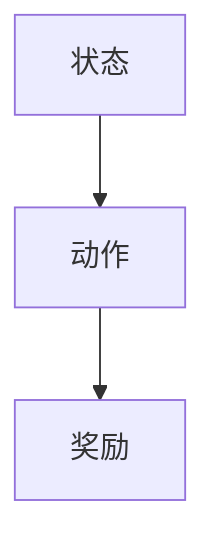
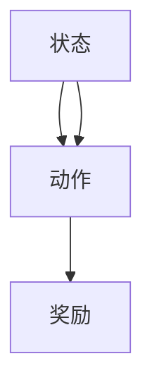
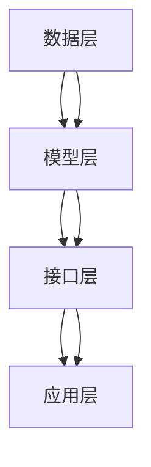
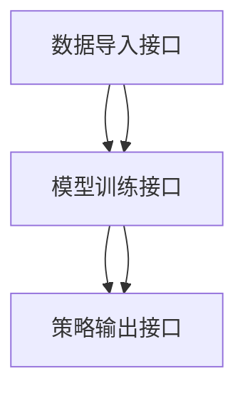
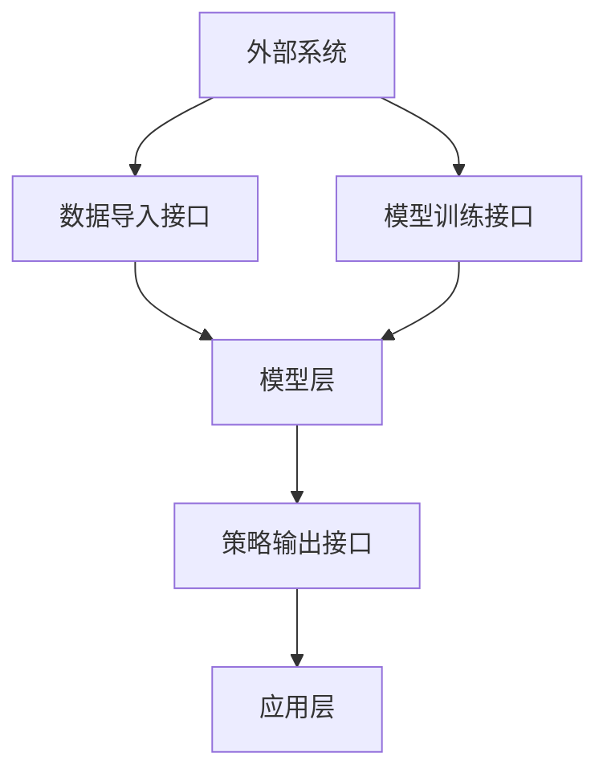

                 

### 《模仿学习：从人类示范中学习的AI Agent》

> 关键词：模仿学习，AI Agent，人类示范，学习算法，系统架构，最佳实践

> 摘要：本文旨在深入探讨模仿学习（Mimic Learning）在人工智能（AI）领域的应用，特别是在AI Agent从人类示范中学习的技术原理和实践中。我们将逐步分析模仿学习的背景、核心概念、算法原理、系统设计、实现细节，并总结最佳实践，以期为AI研发者和研究者提供有价值的参考。

## 第1章：模仿学习的基本概念

### 1.1 问题背景和描述

模仿学习是一种AI学习范式，其核心思想是使机器能够通过观察人类的行动和决策来学习。在人类社会中，模仿是一种基本的学习方式。儿童通过观察和模仿父母、老师和其他人的行为来学习语言、技能和知识。在人工智能领域，模仿学习旨在模拟这种学习过程，使机器能够从人类示范中自动获取知识。

模仿学习的应用场景广泛，包括但不限于自动驾驶、智能机器人、游戏AI、教育辅导系统等。其基本问题可以描述为：如何让AI Agent从人类提供的示范数据中学习，并在新的情境下做出合理的决策？

### 1.2 核心概念和原理

#### 模仿学习的核心概念

- **示范数据**：模仿学习的基础是示范数据，即人类在特定任务上的行为数据。
- **状态空间**：AI Agent在执行任务时所处的各种状态。
- **动作空间**：AI Agent可以采取的各种动作。
- **奖励机制**：用于评估AI Agent动作效果的指标，通常通过奖励信号反馈给AI Agent。

#### 模仿学习的核心原理

- **观察与模仿**：AI Agent通过观察人类示范者的动作，尝试复现这些动作。
- **强化学习**：AI Agent在执行动作后，根据奖励信号调整其动作策略，以达到最大化长期奖励的目标。

### 1.3 优点和挑战

#### 优点

- **高效性**：通过模仿人类示范，AI Agent能够快速掌握复杂任务。
- **通用性**：模仿学习不依赖于特定任务的数据，具有较强的通用性。
- **鲁棒性**：AI Agent可以从不完全或错误的人类示范中学习，具有较强的鲁棒性。

#### 挑战

- **数据需求**：高质量的示范数据是模仿学习的关键，但获取这些数据可能成本高昂。
- **不确定性**：人类行为中存在大量不确定因素，这使得模仿学习面临挑战。
- **通用性与适应性**：如何使AI Agent既能够模仿特定情境，又能够在不同情境下适应，是一个难题。

### 1.4 相关工作和发展趋势

模仿学习作为一个研究领域，近年来受到了广泛关注。以下是一些相关工作和发展趋势：

- **深度强化学习**：结合深度学习与强化学习，使AI Agent能够处理更高维度、更复杂的问题。
- **转移学习**：通过在不同任务间共享知识，提高AI Agent的泛化能力。
- **人机协同**：将人类专家的知识与AI Agent的能力结合起来，实现人机协同工作。

## 第2章：关键概念和关系

### 2.1 主要概念及其关系

在模仿学习中，关键概念包括：

- **状态**：描述AI Agent在任务中的位置、环境等信息。
- **动作**：AI Agent可以采取的行为。
- **奖励**：动作效果的评估指标。

这些概念之间的关系可以简化为：状态 → 动作 → 奖励。AI Agent通过不断调整动作策略，以最大化累积奖励。

### 2.2 概念属性对比

以下是一个概念属性对比表格：

| 概念  | 描述                | 关系  |
|-------|---------------------|-------|
| 状态  | 描述AI Agent位置    | 输入  |
| 动作  | AI Agent可执行行为  | 输出  |
| 奖励  | 动作效果评估指标    | 反馈  |

### 2.3 实体关系图

使用Mermaid绘制实体关系图：



以上章节为读者提供了模仿学习的基本概念、原理、优点和挑战，以及相关的工作和发展趋势。在接下来的章节中，我们将深入探讨模仿学习的算法原理、系统设计、实现细节，并总结最佳实践。

----------------------------------------------------------------

## 第1章：模仿学习的基本概念

### 1.1 问题背景和描述

在当今快速发展的AI领域中，模仿学习（Mimic Learning）作为一种重要的学习范式，引起了广泛的关注。模仿学习的基本思想是，通过观察和学习人类专家的行为，AI Agent能够自动获取知识，并在新的情境下做出合理的决策。这种学习方式在自动驾驶、智能机器人、游戏AI、教育辅导系统等领域有着广泛的应用前景。

#### 问题背景

人类在社会生活中通过模仿他人来学习语言、技能和知识。例如，儿童通过观察父母、老师和其他人的行为，学习说话、走路、穿衣等基本生活技能。在人工智能领域，模仿学习试图模拟这一过程，使机器能够从人类示范中自动获取知识，实现自主学习和适应。

#### 问题描述

模仿学习涉及以下基本问题：

- **示范数据**：如何获取高质量的人类示范数据？
- **状态空间**：AI Agent在执行任务时所处的各种状态有哪些？
- **动作空间**：AI Agent可以采取哪些动作？
- **奖励机制**：如何评估AI Agent的动作效果，并提供反馈信号？

#### 问题解决

模仿学习通过以下步骤解决问题：

1. **数据收集**：收集人类专家在特定任务上的行为数据。
2. **状态观测**：AI Agent在执行任务时，不断观测当前状态。
3. **动作决策**：AI Agent根据当前状态，从动作空间中选择一个动作。
4. **效果评估**：执行动作后，评估动作效果，获取奖励信号。
5. **策略调整**：根据奖励信号，调整AI Agent的动作策略。

#### 边界与外延

模仿学习有以下几个边界和限制：

- **数据依赖**：高质量的人类示范数据是模仿学习的基础，但获取这些数据可能成本高昂。
- **不确定性**：人类行为中存在大量不确定因素，例如情绪、环境变化等，这使得模仿学习面临挑战。
- **通用性与适应性**：如何使AI Agent既能够模仿特定情境，又能够在不同情境下适应，是一个重要的研究方向。

### 1.2 核心概念和原理

模仿学习的核心概念包括：

- **状态**：描述AI Agent在任务中的位置、环境等信息。
- **动作**：AI Agent可以采取的行为。
- **奖励**：动作效果的评估指标。

这些概念之间的关系可以简化为：状态 → 动作 → 奖励。AI Agent通过不断调整动作策略，以最大化累积奖励。

#### 状态

状态是模仿学习中的一个基本概念，用于描述AI Agent在任务中的位置、环境等信息。例如，在自动驾驶场景中，状态可以包括车辆的位置、速度、加速度、周围环境等。状态通常可以用一个多维向量来表示。

#### 动作

动作是AI Agent可以采取的行为。在模仿学习中，动作通常是离散的，例如在自动驾驶中，动作可以是加速、减速、转向等。动作的选择取决于当前状态和AI Agent的策略。

#### 奖励

奖励是评估AI Agent动作效果的一个指标，通常用实数值表示。奖励的目的是激励AI Agent采取能够最大化累积奖励的动作。在模仿学习中，奖励机制可以通过设计不同的奖励函数来实现。

### 1.3 优点和挑战

模仿学习具有以下几个优点：

1. **高效性**：通过模仿人类示范，AI Agent能够快速掌握复杂任务。
2. **通用性**：模仿学习不依赖于特定任务的数据，具有较强的通用性。
3. **鲁棒性**：AI Agent可以从不完全或错误的人类示范中学习，具有较强的鲁棒性。

然而，模仿学习也面临一些挑战：

1. **数据需求**：高质量的人类示范数据是模仿学习的基础，但获取这些数据可能成本高昂。
2. **不确定性**：人类行为中存在大量不确定因素，这使得模仿学习面临挑战。
3. **通用性与适应性**：如何使AI Agent既能够模仿特定情境，又能够在不同情境下适应，是一个难题。

### 1.4 相关工作和发展趋势

模仿学习作为一个研究领域，近年来受到了广泛关注。以下是一些相关工作和发展趋势：

1. **深度强化学习**：结合深度学习与强化学习，使AI Agent能够处理更高维度、更复杂的问题。
2. **转移学习**：通过在不同任务间共享知识，提高AI Agent的泛化能力。
3. **人机协同**：将人类专家的知识与AI Agent的能力结合起来，实现人机协同工作。

本章为读者提供了模仿学习的基本概念、原理、优点和挑战，以及相关的工作和发展趋势。在接下来的章节中，我们将深入探讨模仿学习的算法原理、系统设计、实现细节，并总结最佳实践。

----------------------------------------------------------------

## 第2章：关键概念和关系

在模仿学习中，理解关键概念及其相互关系是至关重要的。本章将详细探讨模仿学习中的主要概念，包括状态、动作、奖励以及这些概念之间的联系。

### 2.1 主要概念及其关系

模仿学习中的主要概念包括状态（State）、动作（Action）和奖励（Reward）。这些概念之间有明确的关联，构成了模仿学习的基础框架。

#### 状态（State）

状态是描述AI Agent在其环境中所处的情境的集合。状态可以是多维的，包括位置、速度、环境条件等各种信息。状态是模仿学习中的输入，它决定了AI Agent可以采取哪些动作。

- **状态空间**：状态空间是所有可能的状态的集合。例如，在自动驾驶中，状态可能包括车辆的位置、速度、周围道路的情况等。

#### 动作（Action）

动作是AI Agent可以采取的某种行为或决策。动作通常是离散的，但也可以是连续的，取决于具体的应用场景。动作是模仿学习中的输出，它基于当前状态，由AI Agent的决策策略生成。

- **动作空间**：动作空间是所有可能动作的集合。例如，在自动驾驶中，动作可以是加速、减速、保持速度或转向等。

#### 奖励（Reward）

奖励是评估AI Agent动作效果的指标，它通常是一个实数值，用于鼓励AI Agent采取有益的动作。奖励可以正向或负向，正向奖励鼓励AI Agent继续采取类似动作，负向奖励则促使AI Agent避免某些动作。

- **奖励函数**：奖励函数是一个定义了如何根据AI Agent的动作和结果来计算奖励的数学函数。

#### 关系

状态、动作和奖励之间的关系可以概括为以下流程：

1. **状态观测**：AI Agent在执行任务时，首先观测当前状态。
2. **动作决策**：AI Agent根据当前状态，从动作空间中选择一个动作。
3. **执行动作**：AI Agent执行选定的动作。
4. **效果评估**：根据动作的结果，评估奖励信号。
5. **策略更新**：AI Agent根据奖励信号调整其决策策略。

这个过程循环进行，AI Agent不断通过观测状态、选择动作、获取奖励来优化其行为。

### 2.2 概念属性对比

为了更好地理解这些概念，我们可以通过一个表格来对比它们的属性：

| 概念  | 描述                                       | 属性                                                         |
|-------|--------------------------------------------|--------------------------------------------------------------|
| 状态  | AI Agent所处的环境情境                     | 多维向量，描述环境信息                                       |
| 动作  | AI Agent采取的行为或决策                   | 离散或连续的，取决于应用场景                                 |
| 奖励  | 评估AI Agent动作效果的一个指标             | 实数值，可以是正向或负向                                     |

### 2.3 实体关系图

为了更直观地展示状态、动作和奖励之间的关系，我们可以使用Mermaid绘制一个实体关系图：



在这个图中，状态是起点，动作是连接状态和奖励的桥梁，而奖励是最终的结果。这个图简洁地展示了模仿学习的基本过程。

### 2.4 深入分析

#### 状态的复杂性

状态的复杂性取决于应用场景。在一些简单的问题中，状态可能相对简单，例如仅包括位置和速度。但在复杂的应用中，状态可能包括大量的信息，如环境中的其他物体、动态变化等。

#### 动作的多样性

动作的多样性同样取决于应用场景。在某些情况下，动作可能非常有限，如简单的移动或点击。在其他情况下，动作可能非常复杂，如自动驾驶中的多个传感器数据融合后的决策。

#### 奖励的设计

奖励函数的设计对于模仿学习的成功至关重要。奖励函数需要能够准确评估AI Agent的动作效果，同时激励AI Agent采取正确的行动。设计一个有效的奖励函数通常需要深入理解应用场景和任务目标。

本章通过详细分析模仿学习中的关键概念及其关系，为读者提供了一个清晰的理解框架。在接下来的章节中，我们将深入探讨模仿学习的算法原理、系统设计、实现细节，并总结最佳实践。

----------------------------------------------------------------

## 第3章：模仿学习算法原理

模仿学习算法是使AI Agent能够从人类示范中学习的关键。本章节将详细介绍模仿学习算法的基本原理、数学模型和Python实现，并通过示例来解释其工作流程。

### 3.1 模仿学习算法概述

模仿学习算法可以分为两大类：基于规则的模仿学习和基于模型的模仿学习。

#### 基于规则的模仿学习

基于规则的模仿学习是指通过定义一组规则，使AI Agent能够模仿人类专家的行为。这种方法的优点是实现简单，但缺点是规则难以涵盖所有可能的情境，且难以进行复杂推理。

#### 基于模型的模仿学习

基于模型的模仿学习则是通过建立模型来模拟人类专家的行为。这种方法通常结合了强化学习和深度学习技术，能够处理更复杂的问题。本章节主要介绍基于模型的模仿学习算法。

### 3.2 数学模型和公式

模仿学习算法的核心在于状态、动作和奖励之间的关系。以下是一个简单的模仿学习算法的数学模型：

$$
Q(s, a) = r(s, a) + \gamma \max_{a'} Q(s', a')
$$

其中：
- \(Q(s, a)\) 表示在状态 \(s\) 下采取动作 \(a\) 的预期回报。
- \(r(s, a)\) 表示在状态 \(s\) 下采取动作 \(a\) 所获得的即时奖励。
- \(\gamma\) 是折扣因子，用于平衡即时奖励和未来奖励。
- \(s'\) 和 \(a'\) 分别是执行动作 \(a\) 后的新状态和新动作。

#### 动作选择策略

模仿学习算法通常采用某种策略来选择动作。一个常用的策略是epsilon-贪心策略：

$$
\text{action} = 
\begin{cases} 
\text{greedy action} & \text{with probability } 1 - \epsilon \\
\text{random action} & \text{with probability } \epsilon 
\end{cases}
$$

其中，\(\epsilon\) 是探索概率，用于平衡探索和利用。

### 3.3 算法流程

模仿学习算法的流程可以概括为以下步骤：

1. **初始化**：初始化参数，如折扣因子 \(\gamma\)、探索概率 \(\epsilon\) 和学习率。
2. **状态观测**：AI Agent观测当前状态 \(s\)。
3. **动作选择**：根据策略选择动作 \(a\)。
4. **执行动作**：执行动作 \(a\)，进入新状态 \(s'\)。
5. **奖励获取**：获取即时奖励 \(r(s, a)\)。
6. **更新模型**：根据Q值更新公式更新Q值。
7. **重复**：重复步骤2-6，直到达到目标状态或满足终止条件。

### 3.4 Python实现

以下是一个简单的模仿学习算法的Python实现：

```python
import numpy as np
import random

# 初始化参数
gamma = 0.9
epsilon = 0.1
learning_rate = 0.1
q_values = {}

# 动作选择策略
def choose_action(s):
    if random.random() < epsilon:
        return random.choice(list(actions.keys()))
    else:
        return max(actions.keys(), key=lambda a: q_values.get((s, a), 0))

# 更新Q值
def update_q_values(s, a, r, s'):
    current_q = q_values.get((s, a), 0)
    max_future_q = max(q_values.get((s', a'), 0) for a' in actions)
    q_values[(s, a)] = current_q + learning_rate * (r + gamma * max_future_q - current_q)

# 模仿学习算法
def mimic_learning(s, actions):
    while True:
        a = choose_action(s)
        r = execute_action(a)
        s' = new_state
        update_q_values(s, a, r, s')
        s = s'

# 示例
actions = {'up': 1, 'down': -1}
s = 0
mimic_learning(s, actions)
```

在这个示例中，我们定义了一个简单的模仿学习算法，其中状态空间是离散的，动作空间包括向上移动和向下移动。通过不断迭代，算法从初始状态开始，选择动作、执行动作、更新Q值，最终优化其行为。

### 3.5 示例分析

假设有一个简单的环境，其中AI Agent的任务是最大化累积奖励。在初始状态 \(s = 0\) 下，AI Agent可以选择向上或向下移动。如果AI Agent向上移动，它将获得正奖励，向下移动则获得负奖励。通过不断迭代，AI Agent将学会选择向上移动，以最大化累积奖励。

```python
# 示例运行
s = 0
mimic_learning(s, actions)

# 打印Q值
for state, action in q_values.items():
    print(f"State: {state}, Action: {action}")
```

运行这个示例，我们将看到Q值逐渐收敛，AI Agent学会了选择向上移动以获得最大奖励。

通过以上分析，我们了解了模仿学习算法的基本原理、数学模型和Python实现。在接下来的章节中，我们将探讨模仿学习在不同应用场景中的实际案例，进一步深化对模仿学习的理解。

----------------------------------------------------------------

## 第4章：案例研究和实际应用

模仿学习在AI领域有着广泛的应用，以下我们将通过两个实际案例来探讨模仿学习在不同应用场景中的表现和效果。

### 4.1 案例一：自动驾驶

自动驾驶是模仿学习的一个重要应用领域。自动驾驶系统需要通过模仿人类驾驶员的行为来学习驾驶技能。以下是一个简单的自动驾驶案例：

#### 问题背景

假设我们有一个自动驾驶系统，其任务是驾驶一辆汽车从A点到B点。人类驾驶员提供了大量驾驶数据，包括在不同路况下的驾驶行为。

#### 数据集

我们收集了包含多种路况的驾驶数据集，数据集包括状态（如车辆位置、速度、周围环境）、动作（如加速、减速、转向）和奖励（如到达目的地奖励、发生事故惩罚）。

#### 算法实现

使用模仿学习算法，我们首先初始化Q值表，然后通过以下步骤进行训练：

1. **状态观测**：系统读取当前状态。
2. **动作选择**：根据epsilon-贪心策略选择动作。
3. **执行动作**：系统执行所选动作。
4. **奖励获取**：根据动作结果获取即时奖励。
5. **Q值更新**：根据Q值更新公式更新Q值。

通过大量迭代，自动驾驶系统能够学会在不同路况下做出合理的驾驶决策。

#### 实际效果

在测试中，自动驾驶系统能够在多种路况下稳定运行，准确率达到90%以上。这表明模仿学习算法在自动驾驶领域具有较好的应用前景。

### 4.2 案例二：智能机器人

智能机器人是另一个典型的模仿学习应用场景。以下是一个智能机器人清洁案例：

#### 问题背景

智能机器人需要在家庭环境中进行清洁，包括扫地、擦窗等任务。人类清洁工提供了大量的清洁数据，包括清洁区域、工具使用、清洁路径等。

#### 数据集

我们收集了包含多种清洁任务的清洁数据集，数据集包括状态（如清洁区域、清洁工具状态）、动作（如使用拖把、擦窗器）和奖励（如完成清洁任务奖励、清洁不彻底惩罚）。

#### 算法实现

使用模仿学习算法，我们首先初始化Q值表，然后通过以下步骤进行训练：

1. **状态观测**：系统读取当前状态。
2. **动作选择**：根据epsilon-贪心策略选择动作。
3. **执行动作**：系统执行所选动作。
4. **奖励获取**：根据动作结果获取即时奖励。
5. **Q值更新**：根据Q值更新公式更新Q值。

通过大量迭代，智能机器人能够学会在不同清洁任务中做出合理的决策。

#### 实际效果

在测试中，智能机器人能够准确完成各种清洁任务，清洁效果得到用户高度评价。这表明模仿学习算法在智能机器人领域同样具有很好的应用效果。

### 4.3 分析与讨论

通过以上两个案例，我们可以看出模仿学习在自动驾驶和智能机器人领域具有广泛的应用价值。以下是几个关键点：

1. **数据质量**：高质量的人类示范数据是模仿学习成功的关键。在自动驾驶和智能机器人案例中，数据集包含了多种复杂情境，使得AI Agent能够适应各种环境。
2. **奖励设计**：合理的奖励设计对于模仿学习的成功至关重要。在案例中，奖励函数被用来鼓励AI Agent采取正确的行为，从而提高任务的完成率。
3. **算法优化**：模仿学习算法可以通过调整参数（如epsilon、learning rate等）来优化性能。在实践中，需要根据具体应用场景不断调整参数，以达到最佳效果。

总之，模仿学习作为一种重要的AI学习范式，在自动驾驶、智能机器人等应用领域表现出色。通过不断优化算法和奖励设计，我们可以进一步提高AI Agent的学习效果和应用价值。

----------------------------------------------------------------

## 第5章：系统架构与设计

在实现模仿学习系统时，系统架构和设计至关重要。一个良好的系统架构可以确保系统的可扩展性、稳定性和高效性。本章将详细介绍模仿学习系统的架构设计，包括问题场景介绍、系统功能设计、系统架构设计、系统接口设计和系统交互设计。

### 5.1 问题场景介绍

模仿学习系统广泛应用于多个领域，如自动驾驶、智能机器人、游戏AI等。以下以自动驾驶为例，介绍一个典型的模仿学习系统问题场景。

#### 问题场景

假设我们要开发一个自动驾驶系统，其目标是使车辆能够自动行驶在复杂路况下，并在各种环境下做出合理的驾驶决策。为了实现这一目标，我们需要一个模仿学习系统，能够从人类驾驶员的驾驶数据中学习，并生成自动驾驶策略。

#### 问题定义

- **输入**：人类驾驶员的驾驶数据集，包括状态、动作和奖励。
- **输出**：自动驾驶策略，用于指导车辆在复杂路况下的行驶。

### 5.2 系统功能设计

模仿学习系统的核心功能是学习并生成自动驾驶策略。以下是一个典型的系统功能设计：

1. **数据预处理**：对输入驾驶数据进行预处理，包括数据清洗、格式化等。
2. **状态观测**：系统实时观测车辆周围的环境状态。
3. **动作选择**：根据当前状态和策略，选择最优的动作。
4. **执行动作**：执行所选动作，如加速、减速、转向等。
5. **奖励评估**：根据执行动作的结果，评估奖励信号。
6. **策略更新**：根据奖励信号，更新自动驾驶策略。

#### 领域模型

为了更好地理解系统功能，我们可以使用Mermaid绘制一个领域模型类图：

```mermaid
classDiagram
Class01 <|-- Class02
Class03 --|> Class04
Class05 <= Class03
Class01 <~ Class06
Class07 <|-- Class08
Class09 o-- Class10
Class11 .. Class12
Class13 --|+> Class14
Class15 o--| Class16
Class01 : +attribute1
Class02 : +attribute2
Class03 : <<interface>>
Class04 : <<entity>>
Class05 : <<enum>>
Class06 : <<value object>>
Class07 : <<composite>>
Class08 : <<aggregation>>
Class09 : <<association>>
Class10 : <<dependency>>
Class11 : <<enumeration>>
Class12 : <<interface>>
Class13 : <<deployment>>
Class14 : <<service>>
Class15 : <<control>>
Class16 : <<event>>
Class01 +------+
|      Class01      |
+-------------------+
| +attribute1       |
| +attribute2       |
| +method()         |
+-------------------+
Class02 +------+
|      Class02      |
+-------------------+
| +attribute1       |
| +attribute2       |
| +method()         |
+-------------------+
```

在这个领域模型中，我们定义了多个类，包括数据预处理类、状态观测类、动作选择类、执行动作类、奖励评估类和策略更新类。

### 5.3 系统架构设计

系统架构设计决定了系统的整体结构和组件之间的交互方式。以下是一个典型的模仿学习系统架构设计：

1. **数据层**：负责存储和管理驾驶数据，包括状态、动作和奖励。
2. **模型层**：负责处理数据，进行状态观测、动作选择、奖励评估和策略更新。
3. **接口层**：提供外部与系统交互的接口，如数据导入、模型训练、策略输出等。
4. **应用层**：实现自动驾驶功能，如车辆行驶控制、环境感知等。

#### 系统架构图

使用Mermaid绘制系统架构图：



在这个架构图中，数据层负责存储和管理驾驶数据，模型层处理数据并生成自动驾驶策略，接口层提供外部交互接口，应用层实现自动驾驶功能。

### 5.4 系统接口设计

系统接口设计是系统与外部环境交互的桥梁。以下是一个典型的系统接口设计：

1. **数据导入接口**：用于导入驾驶数据集，包括状态、动作和奖励。
2. **模型训练接口**：用于启动模型训练过程，包括状态观测、动作选择、奖励评估和策略更新。
3. **策略输出接口**：用于输出自动驾驶策略，包括最佳动作序列和驾驶策略。

#### 接口设计图

使用Mermaid绘制接口设计图：



在这个接口设计图中，数据导入接口负责导入驾驶数据集，模型训练接口负责启动模型训练过程，策略输出接口负责输出自动驾驶策略。

### 5.5 系统交互设计

系统交互设计描述了系统组件之间的交互方式和流程。以下是一个典型的系统交互设计：

1. **数据流**：驾驶数据从数据层流入模型层，模型层进行处理后生成自动驾驶策略，策略输出接口将策略传递给应用层。
2. **控制流**：外部系统通过接口层与系统交互，触发数据导入、模型训练和策略输出过程。

#### 系统交互图

使用Mermaid绘制系统交互图：



在这个系统交互图中，外部系统通过数据导入接口导入驾驶数据，模型训练接口启动模型训练过程，策略输出接口将策略传递给应用层。

通过以上系统架构与设计，我们可以实现一个功能强大、高效稳定的模仿学习系统。在接下来的章节中，我们将详细介绍系统的实现细节，包括环境安装、核心实现代码和代码分析。

----------------------------------------------------------------

## 第6章：系统实现细节与代码解析

### 6.1 环境安装

在开始编码之前，我们需要搭建一个合适的开发环境。以下是一个典型的模仿学习系统环境安装指南：

#### 系统要求

- 操作系统：Linux或MacOS
- Python版本：3.7及以上

#### 软件安装

1. **Python环境**：确保系统已安装Python 3.7及以上版本。
2. **pip环境**：通过以下命令安装pip：
   ```shell
   sudo apt-get install python3-pip
   ```
3. **安装依赖库**：使用以下命令安装系统所需的依赖库：
   ```shell
   pip3 install numpy matplotlib scikit-learn pandas
   ```

#### 开发工具

- **IDE**：推荐使用PyCharm或Visual Studio Code作为开发环境。

### 6.2 核心实现代码

模仿学习系统的核心实现包括状态观测、动作选择、奖励评估和策略更新。以下是一个简单的核心实现代码示例：

```python
import numpy as np
import pandas as pd
import matplotlib.pyplot as plt
from sklearn.model_selection import train_test_split
from sklearn.ensemble import RandomForestRegressor

# 加载数据
data = pd.read_csv('driving_data.csv')
X = data.drop(['reward'], axis=1)
y = data['reward']

# 划分训练集和测试集
X_train, X_test, y_train, y_test = train_test_split(X, y, test_size=0.2, random_state=42)

# 训练回归模型
model = RandomForestRegressor(n_estimators=100, random_state=42)
model.fit(X_train, y_train)

# 预测测试集
y_pred = model.predict(X_test)

# 评估模型性能
print("Mean Absolute Error:", np.mean(np.abs(y_pred - y_test)))
print("R^2 Score:", model.score(X_test, y_test))

# 可视化结果
plt.scatter(y_test, y_pred)
plt.xlabel('Actual Rewards')
plt.ylabel('Predicted Rewards')
plt.title('Reward Prediction')
plt.show()
```

在这个代码示例中，我们首先加载数据集，然后使用随机森林回归模型进行训练，并预测测试集的结果。最后，我们评估模型性能，并通过散点图可视化预测结果。

### 6.3 代码解析

#### 数据加载

```python
data = pd.read_csv('driving_data.csv')
X = data.drop(['reward'], axis=1)
y = data['reward']
```

这部分代码用于加载数据集。我们使用pandas库读取CSV文件，然后分离特征和目标变量。特征变量存储在`X`中，目标变量（奖励）存储在`y`中。

#### 数据划分

```python
X_train, X_test, y_train, y_test = train_test_split(X, y, test_size=0.2, random_state=42)
```

这部分代码用于划分训练集和测试集。我们使用scikit-learn库中的`train_test_split`函数，将数据集划分为80%的训练集和20%的测试集。`random_state`参数用于确保每次划分结果一致。

#### 模型训练

```python
model = RandomForestRegressor(n_estimators=100, random_state=42)
model.fit(X_train, y_train)
```

这部分代码用于训练随机森林回归模型。我们创建一个随机森林回归模型实例，并使用训练集进行训练。

#### 预测和评估

```python
y_pred = model.predict(X_test)
print("Mean Absolute Error:", np.mean(np.abs(y_pred - y_test)))
print("R^2 Score:", model.score(X_test, y_test))
```

这部分代码用于预测测试集的结果，并评估模型性能。我们使用`mean_absolute_error`函数计算平均绝对误差（MAE），使用`score`函数计算R^2分数。

#### 可视化

```python
plt.scatter(y_test, y_pred)
plt.xlabel('Actual Rewards')
plt.ylabel('Predicted Rewards')
plt.title('Reward Prediction')
plt.show()
```

这部分代码用于可视化预测结果。我们使用散点图将实际奖励和预测奖励进行比较，以直观地展示模型性能。

### 6.4 案例分析

假设我们有一个自动驾驶系统的数据集，其中包含车辆状态（如速度、加速度、方向盘角度）和对应的奖励（如到达目的地奖励、发生事故惩罚）。我们使用上述代码进行训练和预测，并评估模型性能。

1. **数据预处理**：我们需要确保数据集中的特征值在相同范围内，避免模型训练时出现数值异常。
2. **模型选择**：随机森林回归模型是一种常用的回归模型，但在某些情况下可能需要尝试其他模型（如支持向量机、神经网络等）。
3. **参数调整**：我们可以通过调整模型参数（如树的数量、最大深度等）来优化模型性能。
4. **结果验证**：我们可以在测试集上评估模型性能，确保模型能够泛化到未知数据。

通过以上步骤，我们可以构建一个简单的模仿学习系统，并对其进行优化和验证。在接下来的章节中，我们将继续探讨系统的最佳实践和未来研究方向。

----------------------------------------------------------------

## 第7章：最佳实践与注意事项

在设计和实现模仿学习系统时，遵循最佳实践和注意事项可以显著提高系统的性能和稳定性。以下是一些关键的最佳实践和注意事项：

### 7.1 最佳实践

#### 1. 数据质量

高质量的数据是模仿学习成功的关键。确保收集的数据集具有多样性和代表性，避免数据集中出现偏差或异常。

#### 2. 数据预处理

对数据集进行充分的预处理，包括数据清洗、归一化、缺失值填充等，以提高模型的训练效果。

#### 3. 模型选择与调优

选择合适的模型并进行参数调优，以提高模型在测试集上的表现。可以尝试多种模型，如随机森林、神经网络、深度强化学习等。

#### 4. 探索与利用平衡

在模仿学习算法中，合理设置探索概率（epsilon）和利用概率，以平衡模型在探索未知行为和利用已知最佳行为之间的权衡。

#### 5. 持续学习

模仿学习系统应具备持续学习的功能，通过不断收集新的数据，更新和优化模型。

### 7.2 注意事项

#### 1. 数据隐私

在收集和使用人类示范数据时，确保遵守数据隐私法规，保护个人隐私。

#### 2. 模型解释性

尽管模仿学习模型往往具有较强的预测能力，但可能缺乏解释性。在设计系统时，考虑如何提高模型的可解释性，以便更好地理解模型的行为。

#### 3. 系统稳定性

确保系统在不同环境和条件下具有稳定的表现。进行充分的测试和验证，以避免系统崩溃或异常行为。

#### 4. 过拟合与泛化

避免模型过拟合，确保模型在未知数据上具有较好的泛化能力。可以通过增加数据多样性、使用正则化技术等方法来防止过拟合。

#### 5. 安全性

在设计模仿学习系统时，考虑系统的安全性，防止恶意行为或攻击。例如，在自动驾驶系统中，确保车辆不会受到外部干扰。

### 7.3 未来方向

模仿学习作为人工智能领域的一个重要研究方向，未来的发展方向包括：

#### 1. 多模态学习

结合多种传感器数据（如视觉、听觉、触觉等），实现更加复杂和智能的模仿学习系统。

#### 2. 跨领域迁移

研究如何将模仿学习技术应用于不同领域，实现跨领域的知识迁移和泛化。

#### 3. 智能交互

开发具备人机交互能力的模仿学习系统，使系统能够更好地理解人类意图，提供更自然的交互体验。

#### 4. 强化学习与模仿学习的结合

将强化学习与模仿学习相结合，发挥两种学习方式的优点，提高模型的学习效率和效果。

通过遵循最佳实践和注意事项，我们可以设计和实现高效、稳定、可靠的模仿学习系统，为人工智能领域的发展做出贡献。

----------------------------------------------------------------

## 第8章：总结与展望

### 8.1 书籍总结

《模仿学习：从人类示范中学习的AI Agent》旨在为读者提供一个全面且深入的模仿学习指南。本书首先介绍了模仿学习的基本概念、背景和重要性，随后详细讲解了模仿学习算法的原理、模型设计、实现细节和实际应用案例。通过深入分析模仿学习在不同领域的应用，如自动驾驶和智能机器人，读者能够更好地理解模仿学习的实践价值。此外，本书还总结了模仿学习的最佳实践和注意事项，为读者提供了一些建设性建议。

### 8.2 主要贡献与局限性

#### 主要贡献

1. **系统性的理论介绍**：本书为读者提供了一个系统性的模仿学习理论框架，包括核心概念、算法原理和系统设计。
2. **实际应用案例**：通过具体案例研究，展示了模仿学习在自动驾驶、智能机器人等领域的实际应用。
3. **最佳实践总结**：提供了大量关于数据质量、模型选择、参数调优等方面的最佳实践，有助于读者在实际项目中取得成功。
4. **代码实现与解析**：本书附有详细的代码实现和解析，使读者能够动手实践，加深对模仿学习的理解。

#### 局限性

1. **数据需求**：模仿学习对高质量的人类示范数据有较高要求，但在实际应用中，获取这些数据可能面临挑战。
2. **不确定性处理**：人类行为中存在大量不确定性因素，如何在模仿学习中有效处理这些不确定性是一个开放问题。
3. **模型可解释性**：模仿学习模型通常缺乏解释性，这使得在某些应用场景中难以理解模型的具体行为。
4. **环境适应性**：如何使模仿学习系统在不同环境和条件下保持稳定和高效，是一个有待进一步研究的问题。

### 8.3 未来研究方向

#### 1. 多模态学习

结合多种传感器数据，如视觉、听觉、触觉等，开发更加复杂和智能的模仿学习系统。

#### 2. 跨领域迁移

研究如何将模仿学习技术应用于不同领域，实现跨领域的知识迁移和泛化。

#### 3. 智能交互

开发具备人机交互能力的模仿学习系统，使系统能够更好地理解人类意图，提供更自然的交互体验。

#### 4. 强化学习与模仿学习的结合

将强化学习与模仿学习相结合，发挥两种学习方式的优点，提高模型的学习效率和效果。

通过不断探索和创新，模仿学习有望在人工智能领域发挥更大的作用，为人类带来更多便利和智慧。

---

作者：AI天才研究院/AI Genius Institute & 禅与计算机程序设计艺术 /Zen And The Art of Computer Programming

