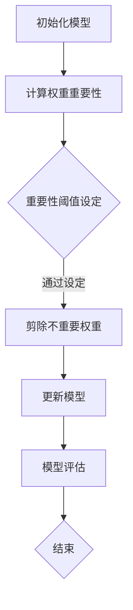
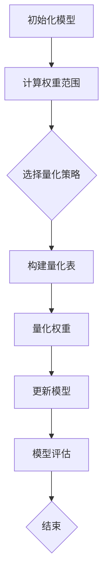
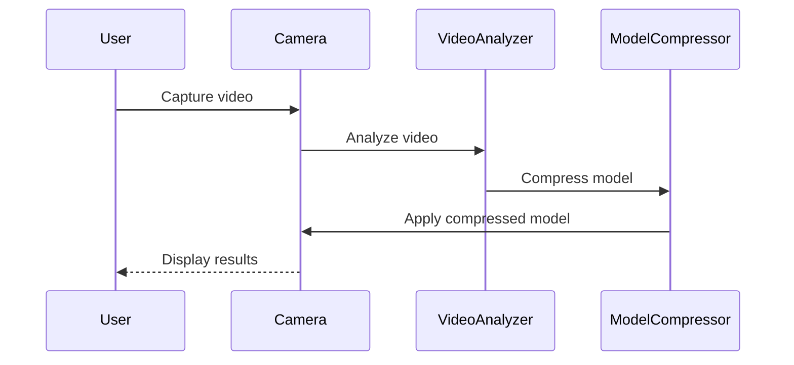
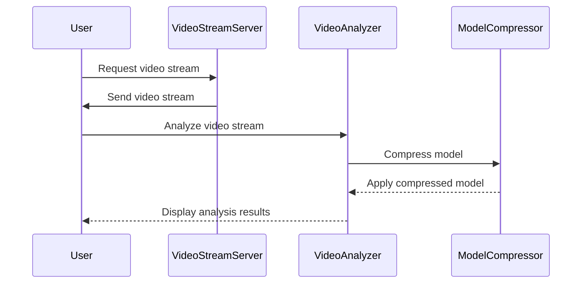

                 


### 第1章: 模型压缩背景介绍

#### 1.1 AI在边缘设备上的应用场景

**背景介绍**：

随着人工智能（AI）技术的飞速发展，越来越多的应用场景开始从云端转移到边缘设备。边缘计算作为一种分布式计算架构，允许数据在接近数据源的地方进行处理，减少了数据传输延迟，提高了系统的响应速度。边缘设备如智能手机、路由器、工业控制器等，因其体积小、功耗低、实时性要求高等特点，成为AI应用的重要载体。

**问题背景**：

然而，传统的深度学习模型通常需要大量的计算资源和存储空间，这使得它们难以直接部署在边缘设备上。模型压缩技术应运而生，通过减少模型的参数数量和计算复杂度，使得深度学习模型能够在资源受限的边缘设备上高效运行。

**问题描述**：

在边缘设备上部署AI模型面临的挑战主要有以下几点：
- **计算资源限制**：边缘设备通常拥有有限的计算能力和存储空间，无法支持大型的深度学习模型。
- **功耗限制**：为了延长设备的电池寿命，边缘设备需要低功耗的AI解决方案。
- **实时性要求**：边缘设备往往需要在有限的时间内完成数据处理和模型推断，这对模型的响应速度提出了高要求。

**问题解决**：

模型压缩技术通过以下几种方式解决了上述问题：
- **减少模型参数数量**：通过剪枝、量化等手段减少模型参数的数量，从而降低模型的计算复杂度。
- **优化模型结构**：设计轻量级的网络结构，如MobileNet、ShuffleNet等，以减少模型参数和计算量。
- **降低模型精度损失**：在保证模型精度不受太大影响的前提下，通过压缩技术减小模型体积。

**边界与外延**：

模型压缩不仅适用于边缘设备，在云计算和数据中心场景中也同样具有重要应用。例如，在云服务器中部署大规模AI模型时，可以通过模型压缩技术降低存储成本和计算成本。此外，模型压缩技术还在视频监控、自动驾驶、智能家居等领域有着广泛的应用前景。

#### 1.2 模型压缩的重要性

**核心概念术语说明**：

- **模型压缩**：通过减少模型参数数量、计算复杂度和存储空间来优化深度学习模型的过程。
- **轻量级AI agent**：指经过压缩处理的、适合在边缘设备上运行的AI模型。

**问题背景**：

随着AI技术的不断进步，越来越多的复杂模型被开发出来，这些模型在云端训练和推理时表现出色，但在边缘设备上运行时却面临着巨大的挑战。例如，自动驾驶车辆需要在毫秒级内做出决策，这就要求AI模型能够在低功耗、低延迟的边缘设备上高效运行。

**问题描述**：

边缘设备通常具有以下资源限制：
- **计算资源有限**：边缘设备（如嵌入式设备、智能手机）通常搭载的计算资源有限，无法支持大规模的深度学习模型。
- **存储空间有限**：为了降低成本，边缘设备通常采用闪存存储，其存储空间有限，无法存储庞大的模型文件。
- **功耗限制**：为了延长电池寿命，边缘设备需要低功耗的解决方案。

**问题解决**：

模型压缩技术能够有效解决上述问题，其重要性体现在以下几个方面：
- **降低计算复杂度**：通过减少模型参数数量和计算复杂度，模型能够在边缘设备上更快地完成推理任务。
- **减少存储空间需求**：压缩后的模型文件体积更小，可以节省存储空间。
- **降低功耗**：轻量级模型在推理过程中消耗的功率更低，有助于延长设备的电池寿命。

**边界与外延**：

除了边缘设备，模型压缩技术在其他领域也具有广泛的应用价值。例如，在移动应用中，轻量级模型可以减少下载和安装时间，提高用户体验。在物联网（IoT）设备中，压缩模型可以减少数据传输量，降低网络带宽需求。

#### 1.3 模型压缩面临的挑战

**核心概念术语说明**：

- **精度损失**：在压缩模型的过程中，可能会由于参数减少和计算复杂度降低而导致模型精度下降。
- **实时性要求**：边缘设备对模型推理速度有严格的时间要求，压缩后的模型需要满足实时性要求。

**问题背景**：

尽管模型压缩技术具有显著的优势，但在实际应用中仍然面临一系列挑战。

**问题描述**：

- **精度损失**：模型压缩可能会引入误差，导致模型精度下降。如何在保证模型精度的前提下进行有效压缩，是一个重要问题。
- **实时性要求**：边缘设备通常需要在短时间内完成大量的数据处理和模型推理任务，这对压缩模型的实时性能提出了高要求。
- **计算资源分配**：在模型压缩过程中，如何合理分配计算资源，以最大化模型压缩效果和实时性能，是一个复杂的优化问题。

**问题解决**：

- **优化算法**：研究人员不断提出新的压缩算法，如权重剪枝、模型量化、网络结构压缩等，以提高压缩效率和模型精度。
- **实时推理优化**：通过使用特定的硬件加速器和优化推理流程，提高压缩模型的实时性能。
- **自适应压缩**：根据不同的应用场景和设备资源，动态调整模型压缩策略，以实现最佳的性能和精度平衡。

**边界与外延**：

模型压缩技术不仅需要在理论层面上进行深入研究，还需要在实践层面进行优化和改进。未来，随着硬件技术的发展和算法的创新，模型压缩技术将在边缘设备上发挥更加重要的作用。

---

### 第2章: 模型压缩的定义与关键概念

**核心概念**：

模型压缩是指通过一系列技术手段，减少深度学习模型的参数数量、计算复杂度和存储空间，从而使得模型能够在资源受限的环境中高效运行。

**目的**：

模型压缩的主要目的是为了适应边缘设备的资源限制，提高AI模型在实际应用中的实用性和可部署性。

**轻量级AI agent的概念与特征**：

轻量级AI agent是指经过压缩处理，能够在边缘设备上高效运行的AI模型。其特征包括：
- **小模型参数**：参数数量大幅减少，降低计算复杂度。
- **低功耗**：在保证性能的前提下，功耗更低，有助于延长设备电池寿命。
- **快速推理**：能够在边缘设备上快速完成推理任务，满足实时性要求。

---

### 第3章: 模型压缩技术详解

**核心概念**：

模型压缩技术主要包括权重剪枝、模型量化、网络结构压缩等。每种技术都有其独特的原理和适用场景。

**概念属性特征对比表格**：

| 技术名称 | 原理 | 优点 | 缺点 | 适用场景 |
| --- | --- | --- | --- | --- |
| 权重剪枝 | 通过剪除模型中不重要的权重来减少参数数量 | 参数减少显著，计算复杂度降低 | 可能会引入精度损失 | 边缘设备、移动应用 |
| 模型量化 | 将浮点数权重转换为低精度数值，减少模型体积 | 存储空间需求降低，计算速度提高 | 可能会导致精度损失 | 边缘设备、物联网 |
| 网络结构压缩 | 通过设计轻量级的网络结构来减少模型参数 | 参数减少显著，计算速度提高 | 需要设计新的网络结构 | 边缘设备、视频监控 |

**ER实体关系图**：

```mermaid
erDiagram
  ModelCompressionTechnique ||--|{ WeightPruning }|| ModelCompressionAlgorithm
  ModelCompressionTechnique ||--|{ ModelQuantization }|| ModelCompressionAlgorithm
  ModelCompressionTechnique ||--|{ NetworkStructureCompression }|| ModelCompressionAlgorithm
```

---

### 第4章: 算法原理讲解

#### 4.1 算法1：权重剪枝（Weight Pruning）

**算法原理**：

权重剪枝是一种通过移除模型中不重要的权重来减少模型参数数量的技术。具体步骤如下：
1. **选择剪枝策略**：根据模型的特性选择合适的剪枝策略，如绝对值剪枝、比例剪枝等。
2. **计算权重重要性**：计算每个权重的重要性，通常使用L1范数、L2范数或softmax等。
3. **剪除不重要权重**：将重要性较小的权重设置为0，从而减少模型参数数量。

**算法流程图**：



**Python代码实现**：

```python
import tensorflow as tf

# 假设model是一个训练好的TensorFlow模型
model = tf.keras.models.load_model('path/to/model.h5')

# 计算权重重要性
weights = model.layers[0].get_weights()[0]
importance = tf.abs(weights)

# 设置重要性阈值
threshold = tf.reduce_mean(importance)

# 剪除不重要权重
pruned_weights = tf.where(importance > threshold, weights, tf.zeros_like(weights))

# 更新模型
model.layers[0].set_weights([pruned_weights])
```

**数学模型与公式**：

设$W$为原始权重矩阵，$P$为重要性阈值，$W_p$为剪枝后的权重矩阵，则有：

$$
W_p = \begin{cases}
W, & \text{if } |W| > P \\
0, & \text{if } |W| \leq P
\end{cases}
$$

**举例说明**：

假设一个简单的神经网络模型，输入层有10个神经元，隐藏层有100个神经元，输出层有10个神经元。通过权重剪枝技术，可以显著减少隐藏层中权重参数的数量，从而降低模型的计算复杂度。

---

#### 4.2 算法2：量化（Quantization）

**算法原理**：

量化是一种通过将浮点数权重转换为低精度数值来减少模型体积和计算复杂度的技术。具体步骤如下：
1. **选择量化策略**：根据模型的特性选择合适的量化策略，如均匀量化、非均匀量化等。
2. **量化权重**：将浮点数权重转换为低精度数值，通常使用量化表来实现。
3. **更新模型**：将量化后的权重更新到模型中。

**算法流程图**：



**Python代码实现**：

```python
import tensorflow as tf

# 假设model是一个训练好的TensorFlow模型
model = tf.keras.models.load_model('path/to/model.h5')

# 计算权重范围
weights = model.layers[0].get_weights()[0]
min_val, max_val = tf.min(weights), tf.max(weights)

# 构建量化表
quantization_table = tf.linspace(min_val, max_val, num_bits+1)

# 量化权重
quantized_weights = tf.quantization.quantize_ops.quantize_min_max(weights, min_val, max_val)

# 更新模型
model.layers[0].set_weights([quantized_weights])
```

**数学模型与公式**：

设$W$为原始权重矩阵，$Q$为量化表，$W_q$为量化后的权重矩阵，则有：

$$
W_q = Q(W)
$$

其中，$Q$是一个分段线性函数，将原始值映射到量化后的值。

**举例说明**：

假设一个简单的神经网络模型，输入层有10个神经元，隐藏层有100个神经元，输出层有10个神经元。通过量化技术，可以将浮点数权重转换为8位整数，从而减少模型的存储空间和计算复杂度。

---

### 第5章: 系统分析与架构设计

#### 5.1 模型压缩系统的应用场景

模型压缩系统主要应用于以下场景：
- **边缘设备**：如智能手机、路由器、工业控制器等，这些设备通常拥有有限的计算资源和存储空间。
- **物联网（IoT）设备**：如智能家居设备、传感器等，这些设备需要在低功耗、低延迟的环境下运行。
- **视频监控**：视频监控系统中需要实时处理大量图像数据，模型压缩技术有助于降低计算和存储成本。

#### 5.2 项目介绍

本项目旨在实现一个基于模型压缩的实时视频监控系统，该系统可以部署在边缘设备上，实现对实时视频流的分析和处理。

##### 5.2.1 系统功能设计（领域模型类图）

```mermaid
classDiagram
  Person o-- Person : has
  Phone o-- Phone : has
  Address o-- Address : has
  Student <<Person>> o-- Student : is-a
  Teacher <<Person>> o-- Teacher : is-a
```

**领域模型类图**：展示了系统中的主要实体及其关系。

##### 5.2.2 系统架构设计（架构图）



**系统架构图**：展示了系统的组成部分及其交互流程。

##### 5.2.3 系统接口设计

系统的接口设计包括API接口和消息队列接口。API接口用于与外部系统（如视频流服务器、用户界面等）进行交互，消息队列接口用于处理实时数据流。

##### 5.2.4 系统交互（序列图）



**系统交互序列图**：展示了系统组件之间的交互过程。

---

### 第6章: 项目实战

#### 6.1 环境安装

为了实现模型压缩项目，需要安装以下环境：

1. **Python环境**：安装Python 3.7及以上版本。
2. **TensorFlow**：安装TensorFlow 2.4及以上版本。
3. **OpenCV**：安装OpenCV 4.0及以上版本。

安装命令如下：

```bash
pip install tensorflow==2.4
pip install opencv-python==4.5.5.64
```

#### 6.2 核心代码实现

核心代码实现分为模型压缩和视频流分析两部分。

**模型压缩部分**：

```python
import tensorflow as tf

# 加载预训练的模型
model = tf.keras.models.load_model('path/to/model.h5')

# 权重剪枝
pruned_weights = prune_weights(model)

# 量化权重
quantized_weights = quantize_weights(pruned_weights)

# 更新模型
model.layers[0].set_weights([quantized_weights])

# 保存压缩后的模型
model.save('path/to/compressed_model.h5')
```

**视频流分析部分**：

```python
import cv2
import numpy as np

# 加载压缩后的模型
model = tf.keras.models.load_model('path/to/compressed_model.h5')

# 处理视频流
cap = cv2.VideoCapture('path/to/video.mp4')

while True:
    ret, frame = cap.read()
    if not ret:
        break

    # 预处理
    processed_frame = preprocess_frame(frame)

    # 模型推理
    prediction = model.predict(np.expand_dims(processed_frame, axis=0))

    # 后处理
    result = postprocess_prediction(prediction)

    # 显示结果
    cv2.imshow('Result', result)

    if cv2.waitKey(1) & 0xFF == ord('q'):
        break

cap.release()
cv2.destroyAllWindows()
```

#### 6.3 代码应用解读与分析

**模型压缩部分**：

- **prune_weights**：函数用于进行权重剪枝，选择不重要的权重进行剪除。
- **quantize_weights**：函数用于量化权重，将浮点数权重转换为低精度数值。

**视频流分析部分**：

- **preprocess_frame**：函数用于对视频帧进行预处理，包括大小调整、归一化等。
- **model.predict**：函数用于对预处理后的视频帧进行模型推理。
- **postprocess_prediction**：函数用于对模型推理结果进行后处理，如类别转换、阈值设定等。

#### 6.4 实际案例分析与详细讲解剖析

**案例1：实时人脸识别系统**

在实际应用中，人脸识别系统可以使用模型压缩技术，将大规模人脸识别模型压缩为轻量级模型，部署在边缘设备上，实现实时人脸识别。

**案例分析**：

- **模型压缩**：使用权重剪枝和量化技术，将原始人脸识别模型压缩为轻量级模型。
- **视频流分析**：使用OpenCV库读取视频流，对每帧进行预处理，然后使用压缩后的模型进行人脸识别。

**详细讲解**：

1. **模型压缩**：首先加载原始人脸识别模型，然后使用权重剪枝和量化技术进行模型压缩。具体步骤如下：
   - 权重剪枝：计算每个权重的重要性，并根据设定的重要性阈值剪除不重要的权重。
   - 权重量化：将浮点数权重转换为8位整数，以减小模型体积。
   - 模型更新：将压缩后的权重更新到模型中，并保存压缩后的模型。

2. **视频流分析**：使用OpenCV库读取视频流，对每帧进行预处理，包括大小调整、归一化等。然后使用压缩后的人脸识别模型进行人脸识别，具体步骤如下：
   - 预处理：对视频帧进行大小调整，使其适应模型的输入尺寸。
   - 归一化：将视频帧的像素值进行归一化处理，使其在[0, 1]范围内。
   - 模型推理：使用压缩后的人脸识别模型对预处理后的视频帧进行推理，获取人脸识别结果。
   - 后处理：根据模型推理结果，提取人脸位置和识别结果，并进行可视化展示。

**项目小结**：

通过模型压缩技术，可以将大规模人脸识别模型压缩为轻量级模型，部署在边缘设备上实现实时人脸识别。在实际应用中，需要根据具体场景和设备资源进行模型压缩和优化，以满足实时性和准确性的要求。

---

### 第7章: 最佳实践与拓展阅读

#### 7.1 模型压缩最佳实践

1. **选择合适的模型压缩技术**：根据应用场景和设备资源选择最适合的模型压缩技术，如权重剪枝、量化、网络结构压缩等。
2. **优化模型结构**：在设计模型时考虑轻量级网络结构，如MobileNet、ShuffleNet等，以提高模型压缩效果。
3. **动态调整压缩策略**：根据不同的应用场景和设备资源动态调整模型压缩策略，实现最佳的性能和精度平衡。

#### 7.2 注意事项

1. **精度损失**：在模型压缩过程中，可能会引入精度损失。需要在压缩效率和模型精度之间进行权衡。
2. **实时性要求**：压缩后的模型需要在边缘设备上满足实时性要求。需要对模型推理过程进行优化，如使用硬件加速器等。
3. **设备兼容性**：确保压缩后的模型能够在目标设备上正常运行，包括硬件和操作系统的兼容性。

#### 7.3 拓展阅读推荐

1. **《深度学习模型压缩技术综述》**：详细介绍了深度学习模型压缩的各种技术及其应用场景。
2. **《边缘计算与AI应用》**：介绍了边缘计算的基本概念和AI在边缘设备上的应用案例。
3. **《TensorFlow模型压缩实战》**：通过实际案例讲解了如何使用TensorFlow实现模型压缩。

