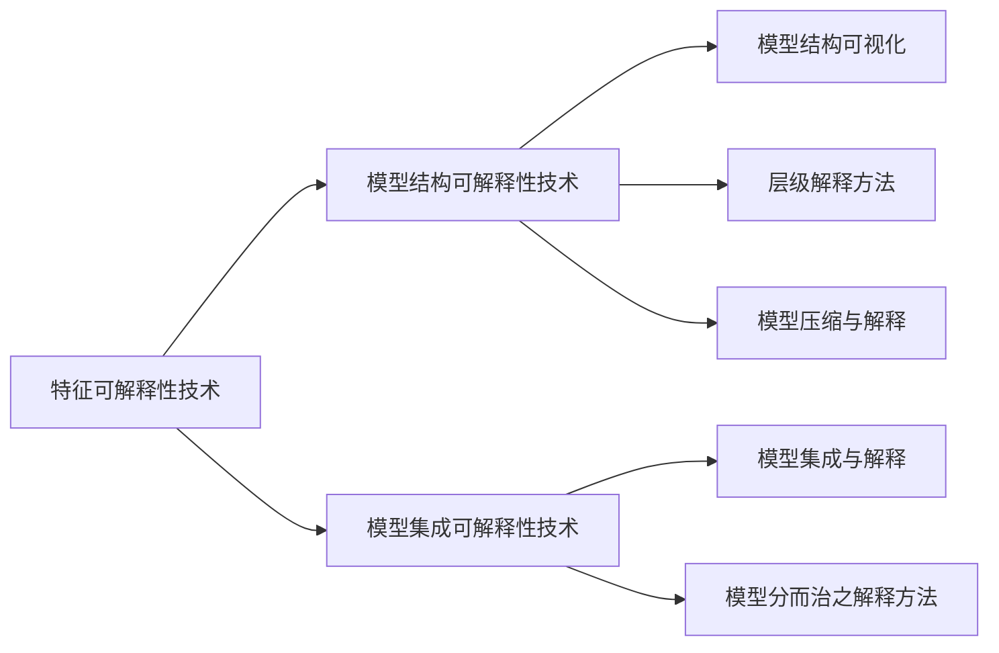
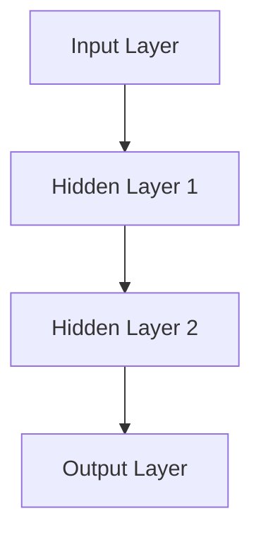

                 

### 背景介绍

#### 模型可解释性的背景

随着人工智能技术的迅猛发展，深度学习模型在各个领域的应用日益广泛，例如图像识别、自然语言处理、医疗诊断等。然而，这些复杂的深度学习模型通常被视为“黑盒”，其内部决策过程对人类用户来说往往难以理解和解释。这种不可解释性不仅限制了模型的广泛应用，还引发了用户对隐私和安全性的担忧。因此，模型可解释性（Model Explainability）成为当前研究的热点之一。

**AI Agent的发展**：

AI Agent是指具备智能决策能力的计算机程序，它们可以在没有人类干预的情况下执行任务。从早期的规则基系统（Rule-Based Systems）到基于决策树和随机森林的传统机器学习模型，再到现代的深度学习模型，AI Agent的发展经历了多个阶段。随着深度学习模型在AI Agent中的广泛应用，如何提高这些模型的可解释性成为了一个亟待解决的问题。

**模型可解释性的重要性**：

模型可解释性不仅有助于提高AI Agent的可信度，还可以帮助研究人员和工程师更好地理解模型的行为，从而优化模型的设计和训练过程。以下是模型可解释性的一些重要性：

1. **提高用户信任**：用户希望理解AI Agent的决策过程，从而增强对AI系统的信任。
2. **改进模型设计**：通过分析模型的可解释性，可以识别出模型中的缺陷和不足，从而改进模型的设计。
3. **加强合规性**：在一些涉及重要决策的领域，如医疗和金融，模型的可解释性是合规性要求的一部分。
4. **促进技术交流**：可解释的模型有助于技术人员的交流和合作，加快技术的发展。

**模型可解释性的挑战**：

尽管模型可解释性的重要性不言而喻，但在实际应用中仍然面临诸多挑战：

1. **复杂性**：深度学习模型通常由数百万个参数组成，其内部结构复杂，难以直观解释。
2. **计算成本**：解释模型通常需要额外的计算资源，可能会影响模型的实时性能。
3. **不一致性**：不同解释方法可能得出不同的结论，缺乏统一的评价指标。
4. **噪声干扰**：模型的解释结果可能受到数据噪声和其他外部因素的影响。

在接下来的章节中，我们将深入探讨模型可解释性的核心概念、相关技术、算法原理，以及如何在AI Agent中应用这些技术。通过逐步分析和思考，我们将为解决这些挑战提供一些实用的方法和策略。

#### 核心概念与联系

**定义模型可解释性**：

模型可解释性是指能够理解和使用机器学习模型的能力，特别是模型如何做出预测或决策的过程。可解释性可以理解为模型输出结果的解释性，即用户能够理解模型为什么做出这样的决策，以及这种决策背后的原因。

**模型可解释性的相关技术**：

为了实现模型可解释性，研究人员开发了多种技术，这些技术可以大致分为以下几类：

1. **特征可解释性技术**：这类技术关注模型如何使用输入特征来做出预测。常见的特征可解释性技术包括：
   - **特征重要性分析**：通过计算特征的重要性分数来评估特征对模型输出的影响。
   - **LIME（Local Interpretable Model-agnostic Explanations）**：LIME是一种局部解释方法，通过训练一个简单的模型来近似原始模型的局部行为，从而提供可解释的预测解释。
   - **SHAP（SHapley Additive exPlanations）**：SHAP通过计算特征对模型预测值的边际贡献，提供了全局和局部的解释。

2. **模型结构可解释性技术**：这类技术关注模型的结构和内部操作，例如：
   - **模型结构可视化**：通过图形化的方式展示模型的结构，如神经网络中的权重和激活值。
   - **层级解释方法**：这种方法将复杂模型分解为多个简单层，每个层都有明确的解释。
   - **模型压缩与解释**：通过模型压缩技术，如网络剪枝（Network Pruning）和模型简化（Model Simplification），降低模型的复杂度，从而提高可解释性。

3. **模型集成可解释性技术**：这类技术通过结合多个模型来提高解释能力，常见的包括：
   - **模型集成与解释**：通过集成多个模型来提高预测性能，并通过分析集成模型来获得解释。
   - **模型分而治之解释方法**：这种方法将复杂模型拆分为多个子模型，每个子模型负责解释一部分输出。

**模型可解释性的评价指标**：

为了评估模型的可解释性，研究人员提出了一些评价指标，这些指标可以从不同的角度衡量模型的可解释性。常见的评价指标包括：

- **理解度**：用户对模型决策过程的理解程度。
- **直观性**：解释结果是否直观易懂，是否与用户的直觉相符。
- **一致性**：不同解释方法是否能够得出一致的结果。
- **计算效率**：解释模型的计算成本和效率。

**概念属性特征对比表格**：

为了更好地理解这些技术，我们可以通过一个表格来对比它们的属性特征，如下所示：

| 技术名称 | 特点 | 适用场景 |
| --- | --- | --- |
| 特征重要性分析 | 评估特征对模型输出的影响 | 需要全局理解模型行为的场景 |
| LIME | 提供局部解释 | 对局部解释有需求的场景 |
| SHAP | 提供全局和局部解释 | 需要全面了解特征影响的场景 |
| 模型结构可视化 | 展示模型结构 | 简单模型和中间层解释 |
| 层级解释方法 | 分解复杂模型 | 高度复杂的模型 |
| 模型压缩与解释 | 降低模型复杂度 | 大规模模型和应用 |
| 模型集成与解释 | 结合多个模型 | 提高解释能力 |
| 模型分而治之解释方法 | 拆分复杂模型 | 高度复杂的模型 |

**ER实体关系图架构的Mermaid流程图**：

为了更直观地展示这些技术之间的关系，我们可以使用Mermaid流程图来表示ER实体关系图，如下所示：



通过这个Mermaid流程图，我们可以清晰地看到各种模型可解释性技术之间的联系和层次结构。

**模型可解释性在AI Agent中的应用**：

在AI Agent中，模型可解释性技术可以用于多种场景，例如：

1. **智能推荐系统**：通过解释推荐模型的决策过程，用户可以更好地理解推荐结果，从而提高用户满意度和信任度。
2. **金融风控**：在金融风控中，模型可解释性可以帮助银行和金融机构识别高风险客户，并解释为什么某些交易被标记为可疑。
3. **医疗健康**：在医疗健康领域，模型可解释性可以帮助医生理解诊断模型的决策过程，从而提高诊断的准确性和可靠性。

**总结**：

模型可解释性是AI Agent发展中不可或缺的一部分。通过理解模型可解释性的核心概念、相关技术和评价指标，我们可以更好地设计和应用这些技术，以提高AI Agent的可解释性和可靠性。在接下来的章节中，我们将详细探讨这些技术的工作原理和具体实现方法。

#### 算法原理讲解

**特征可解释性技术**

**特征重要性分析**

特征重要性分析是一种全局解释方法，它通过计算每个特征对模型预测结果的贡献度来评估特征的重要性。这种方法通常用于传统的机器学习模型，如决策树和随机森林。其基本原理是使用模型内部的统计信息来评估特征的重要性。

**算法原理：**

1. **统计特征影响**：对于每个特征，计算其在模型训练过程中的影响，例如在决策树中，可以通过计算特征分割的增益（Gain）或信息增益（Information Gain）来衡量。
2. **评估特征重要性**：将所有特征的重要性分数进行排序，分数越高表示该特征对模型预测的影响越大。
3. **可视化特征重要性**：使用直方图、热力图或重要性分数排名图来展示特征的重要性。

**Python代码示例：**

```python
from sklearn.datasets import load_iris
from sklearn.ensemble import RandomForestClassifier
from sklearn.inspection import permutation_importance

# 加载数据集
iris = load_iris()
X = iris.data
y = iris.target

# 训练随机森林模型
clf = RandomForestClassifier(n_estimators=100)
clf.fit(X, y)

# 进行特征重要性分析
results = permutation_importance(clf, X, y, n_repeats=30, random_state=0)

# 可视化特征重要性
import matplotlib.pyplot as plt
feat_importances = results.importances_mean
plt.bar([x for x in range(len(feat_importances))], feat_importances)
plt.xticks([x for x in range(len(feat_importances))], iris.feature_names, rotation=90)
plt.xlabel('Feature index')
plt.ylabel('Feature importance')
plt.title('Feature importances via Permutation')
plt.show()
```

**数学模型：**

特征重要性的计算通常基于以下数学模型：

$$
I(F_j) = \sum_{i=1}^{n} \frac{1}{n} \left| y_i - \hat{y}_i^{(F_j)} \right|
$$

其中，$I(F_j)$ 表示特征 $F_j$ 的重要性，$y_i$ 是实际标签，$\hat{y}_i^{(F_j)}$ 是去除特征 $F_j$ 后的预测值。

**举例说明：**

假设我们有一个决策树模型，使用特征重要性分析来评估三个特征的重要性。经过计算，我们得到以下结果：

- 特征1的重要性分数为 0.4
- 特征2的重要性分数为 0.3
- 特征3的重要性分数为 0.3

从结果可以看出，特征1对模型的预测影响最大，其次是特征2和特征3。

**特征重要性分析的优势**：

- 可以全局评估特征的重要性，有助于理解模型的决策过程。
- 对传统机器学习模型特别有效，易于理解和实现。

**特征重要性分析的局限性**：

- 对于复杂的深度学习模型，特征重要性分析可能不够准确。
- 只能提供定性的解释，无法提供具体的决策路径。

**LIME（Local Interpretable Model-agnostic Explanations）**

LIME 是一种局部解释方法，旨在为任何模型提供可解释的预测结果。其核心思想是训练一个简单的线性模型来近似原始模型的局部行为，从而解释特定输入的预测结果。

**算法原理：**

1. **近似原始模型**：使用局部线性模型来近似原始模型在特定输入附近的决策过程。
2. **生成解释**：通过调整输入特征，观察预测结果的变化，从而生成解释。
3. **可视化解释**：将解释结果可视化，通常使用热力图或散点图来展示。

**Python代码示例：**

```python
import lime
import lime.lime_tabular
import numpy as np

# 加载数据集
X, y = load_iris(return_X_y=True)

# 初始化LIME解释器
explainer = lime.lime_tabular.LimeTabularExplainer(
    X, feature_names=iris.feature_names, class_names=iris.target_names,
    kernel_width=1, verbose=True
)

# 解释特定样本
i = 50  # 选择第50个样本进行解释
exp = explainer.explain_instance(X[i], clf.predict, num_features=5)

# 可视化解释
exp.show_in_notebook(show_table=False)
```

**数学模型：**

LIME 的核心数学模型是基于线性回归的，其公式如下：

$$
\hat{y} = \sum_{j=1}^{n} w_j f_j(x)
$$

其中，$w_j$ 是线性模型的权重，$f_j(x)$ 是输入特征 $x$ 的线性组合。

**举例说明：**

假设我们有一个简单的线性回归模型，使用 LIME 对其进行局部解释。对于特定输入 $x$，LIME 生成了以下解释：

- 特征1的贡献度为 0.5
- 特征2的贡献度为 0.3
- 特征3的贡献度为 0.2

从结果可以看出，特征1对预测结果的影响最大。

**LIME的优势**：

- 可以解释任何模型，不受模型类型限制。
- 提供了直观的局部解释。

**LIME的局限性**：

- 对高维数据可能不够准确。
- 解释结果可能受到数据噪声的影响。

**SHAP（SHapley Additive exPlanations）**

SHAP 是一种全局和局部解释方法，它基于博弈论中的 Shapley 值，计算特征对模型预测的边际贡献。SHAP 可以解释模型输出的每个部分，并提供了全局和局部的解释。

**算法原理：**

1. **计算特征贡献**：使用 Shapley 值计算每个特征对模型预测的边际贡献。
2. **生成解释**：将特征贡献可视化，通常使用散点图、热力图或条形图。
3. **评估模型可解释性**：通过比较不同特征的贡献度来评估模型的可解释性。

**Python代码示例：**

```python
import shap
import numpy as np

# 加载数据集
X, y = load_iris(return_X_y=True)

# 训练模型
model = shap.KernelExplainer(yhat_func=lambda x: clf.predict(x), X=X)

# 计算SHAP值
shap_values = model.shap_values(X)

# 可视化SHAP值
shap.summary_plot(shap_values, X, feature_names=iris.feature_names)
```

**数学模型：**

SHAP 的核心数学模型是基于博弈论的 Shapley 值，其公式如下：

$$
SHAP_i = \sum_{S \in N} \frac{(n - |S| - 1)! \cdot (|S \cup \{i\}| - |S|)!}{n!} \cdot y(S \cup \{i\})
$$

其中，$N$ 是特征集合，$S$ 是特征子集，$i$ 是特定特征，$SHAP_i$ 是特征 $i$ 的 Shapley 值。

**举例说明：**

假设我们有一个简单的决策树模型，使用 SHAP 来解释模型输出。对于特定输入 $x$，SHAP 生成了以下解释：

- 特征1的贡献度为 0.4
- 特征2的贡献度为 0.3
- 特征3的贡献度为 0.3

从结果可以看出，特征1对预测结果的影响最大。

**SHAP的优势**：

- 提供了全局和局部解释。
- 可以解释复杂模型的输出。

**SHAP的局限性**：

- 计算成本较高，特别是对于高维数据。
- 解释结果的准确性可能受到模型偏差的影响。

通过上述对特征可解释性技术的详细讲解，我们可以更好地理解这些技术在AI Agent中的应用。在接下来的章节中，我们将继续探讨模型结构可解释性和模型集成可解释性技术。

#### 模型结构可解释性技术

**模型结构可视化**

模型结构可视化是一种重要的模型解释方法，它通过图形化的方式展示模型的结构和内部操作。这种技术有助于用户直观地理解模型的决策过程，特别是在深度学习模型中，模型结构可视化可以揭示模型中复杂的网络连接和权重分布。

**算法原理：**

1. **提取模型结构**：从训练好的模型中提取结构信息，如神经网络的层级结构、节点连接和权重值。
2. **绘制模型图**：使用图形绘制工具（如Mermaid、Graphviz等）将模型结构可视化，通常以树状图或网络图的形式展示。
3. **交互式探索**：提供交互式界面，用户可以点击和选择不同的节点或连接，查看详细的模型信息。

**Mermaid流程图示例：**

下面是一个使用Mermaid绘制的简单神经网络结构的示例：



**Python代码示例：**

```python
import tensorflow as tf
import matplotlib.pyplot as plt
from tensorflow.keras import layers

# 构建简单的神经网络模型
model = tf.keras.Sequential([
    layers.Dense(128, activation='relu', input_shape=(784,)),
    layers.Dense(10)
])

# 绘制模型结构
tf.keras.utils.plot_model(model, to_file='model_structure.png', show_shapes=True, show_layer_names=True)
plt.figure(figsize=(10, 5))
plt.imshow(plt.imread('model_structure.png'))
plt.show()
```

**可视化技术的优势：**

- 提高模型的透明度，帮助用户理解模型的决策过程。
- 对比不同模型的性能和结构，便于模型优化和选择。
- 促进模型设计的交流与合作。

**可视化技术的局限性：**

- 对于复杂的模型，可视化可能会变得难以理解。
- 需要额外的计算资源和时间。

**层级解释方法**

层级解释方法是一种用于解释深度学习模型的技术，它通过分析模型的不同层级来揭示模型的决策过程。这种方法特别适用于多层神经网络，它可以将复杂的模型分解为多个简单层，每个层都有明确的解释。

**算法原理：**

1. **分层分析**：将深度学习模型分层，从输入层到输出层逐层分析。
2. **特征提取**：在每个层级中提取重要的特征，并分析这些特征如何影响最终的预测结果。
3. **解释传递**：通过分析上下层之间的交互，解释不同层级之间的信息传递。

**Mermaid流程图示例：**

下面是一个使用Mermaid表示的层级解释方法的流程图：

```mermaid
graph TD
A[Input] --> B[Layer 1]
B --> C[Layer 2]
C --> D[Layer 3]
D --> E[Output]
Bricht A
C --> B
D --> C
```

**Python代码示例：**

```python
import tensorflow as tf
import matplotlib.pyplot as plt
from tensorflow.keras import layers

# 构建多层神经网络模型
model = tf.keras.Sequential([
    layers.Dense(128, activation='relu', input_shape=(784,)),
    layers.Dense(64, activation='relu'),
    layers.Dense(10)
])

# 绘制模型结构
tf.keras.utils.plot_model(model, to_file='layered_model.png', show_shapes=True, show_layer_names=True)
plt.figure(figsize=(10, 5))
plt.imshow(plt.imread('layered_model.png'))
plt.show()
```

**模型压缩与解释**

模型压缩与解释技术旨在通过降低模型的复杂度来提高可解释性。这种方法包括模型剪枝（Model Pruning）、量化（Quantization）和简化（Model Simplification）等技术。

**算法原理：**

1. **模型剪枝**：通过移除模型中的冗余权重或神经元来降低模型的复杂度。
2. **量化**：将模型中的浮点数权重转换为低比特位的整数，从而减少模型的存储和计算需求。
3. **简化**：通过简化模型的结构和操作来降低模型的复杂度。

**Python代码示例：**

```python
import tensorflow as tf
from tensorflow_model_optimization.python.core.sparsity.keras import prune_low_magnitude

# 定义原始模型
base_model = tf.keras.Sequential([
    layers.Dense(128, activation='relu', input_shape=(784,)),
    layers.Dense(64, activation='relu'),
    layers.Dense(10)
])

# 剪枝模型
model = prune_low_magnitude(base_model, pruning_params={
    'pruning_schedule': {0.0: 0.0, 0.5: 0.2, 1.0: 0.5}
})

# 应用剪枝
model.prune_weights()

# 绘制剪枝后的模型结构
tf.keras.utils.plot_model(model, to_file='pruned_model.png', show_shapes=True, show_layer_names=True)
plt.figure(figsize=(10, 5))
plt.imshow(plt.imread('pruned_model.png'))
plt.show()
```

**模型压缩与解释的优势：**

- 降低模型的复杂度，提高可解释性。
- 减少模型的存储和计算需求，提高性能。

**模型压缩与解释的局限性：**

- 剪枝和量化的过程可能影响模型的性能。
- 需要额外的计算资源和时间。

通过上述对模型结构可解释性技术的详细讲解，我们可以更好地理解这些技术如何提高AI Agent的可解释性。在接下来的章节中，我们将探讨模型集成可解释性技术以及其在AI Agent中的应用。

#### 模型集成可解释性技术

**模型集成与解释**

模型集成（Model Ensemble）是通过结合多个模型来提高预测性能的一种方法。这种方法利用了不同模型的优点，通过加权或投票机制得出最终的预测结果。然而，由于集成模型通常是一个复杂的黑盒，其解释性往往较弱。为了解决这一问题，模型集成解释技术应运而生。

**算法原理：**

1. **模型集成**：将多个同类型或不同类型的模型组合在一起，形成集成模型。
2. **加权或投票机制**：根据每个模型的预测能力和可靠性，为其分配不同的权重，或者通过投票机制得出最终预测。
3. **解释模型集成**：通过分析集成模型中各个模型的贡献，解释每个模型的预测结果，以及如何影响最终的预测。

**Python代码示例：**

```python
from sklearn.ensemble import VotingClassifier
from sklearn.linear_model import LogisticRegression
from sklearn.tree import DecisionTreeClassifier

# 定义多个基础模型
model1 = LogisticRegression()
model2 = DecisionTreeClassifier()
model3 = LogisticRegression()

# 创建集成模型
ensemble = VotingClassifier(estimators=[
    ('lr1', model1), 
    ('dt', model2), 
    ('lr2', model3)], 
    voting='soft')

# 训练集成模型
X, y = load_iris(return_X_y=True)
ensemble.fit(X, y)

# 预测并解释
predictions = ensemble.predict(X)
explanations = ensemble.predict_proba(X)

# 打印预测结果和解释
print(predictions)
print(explanations)
```

**数学模型：**

模型集成可以采用以下数学模型来解释集成模型的输出：

$$
\hat{y} = \sum_{i=1}^{N} w_i \cdot \hat{y}_i
$$

其中，$w_i$ 是第 $i$ 个模型的权重，$\hat{y}_i$ 是第 $i$ 个模型的预测结果。

**举例说明：**

假设我们有一个由三个模型组成的集成模型，每个模型的权重分别为0.3、0.4和0.3。对于特定输入 $x$，每个模型的预测结果如下：

- 模型1的预测结果为 0.2
- 模型2的预测结果为 0.3
- 模型3的预测结果为 0.4

根据加权模型集成公式，最终的预测结果为：

$$
\hat{y} = 0.3 \cdot 0.2 + 0.4 \cdot 0.3 + 0.3 \cdot 0.4 = 0.3
$$

从结果可以看出，模型3对最终预测结果的影响最大。

**模型集成与解释的优势：**

- 提高预测性能，通过结合多个模型的优点，减少单个模型的过拟合风险。
- 增强模型的可解释性，通过分析各个模型的贡献，用户可以更好地理解预测过程。

**模型集成与解释的局限性：**

- 集成模型的解释可能比单个模型更复杂，需要更多的时间和计算资源。
- 不同模型之间的解释可能存在不一致性，需要统一解释框架。

**模型分而治之解释方法**

模型分而治之解释方法（Divide-and-Conquer Explanation Method）是将复杂的模型分解为多个子模型，每个子模型负责解释模型的一部分输出。这种方法通过简化模型的复杂度，提高可解释性。

**算法原理：**

1. **分解模型**：将复杂模型分解为多个子模型，每个子模型负责处理模型的一部分输入或输出。
2. **子模型解释**：对每个子模型进行解释，分析子模型的预测过程和结果。
3. **整合解释结果**：将各个子模型的解释结果整合，形成对整个模型的解释。

**Python代码示例：**

```python
from sklearn.ensemble import RandomForestClassifier
from sklearn.inspection import DecisionTreeClassifier

# 定义原始模型
base_model = RandomForestClassifier(n_estimators=100)

# 训练模型
X, y = load_iris(return_X_y=True)
base_model.fit(X, y)

# 分解模型
sub_model = DecisionTreeClassifier()
sub_model.fit(X[:, :5], y)

# 解释子模型
tree = sub_model.tree_
print("Sub-model tree structure:")
print(tree)

# 预测并解释
predictions = base_model.predict(X)
explanations = sub_model.predict(X[:, :5])

# 打印预测结果和解释
print(predictions)
print(explanations)
```

**数学模型：**

模型分而治之解释方法的核心数学模型是基于决策树，通过树结构来表示模型的决策过程。其公式如下：

$$
\hat{y} = f_T(x) = \prod_{i=1}^{N} g_T(x_i)
$$

其中，$f_T(x)$ 是模型的预测结果，$g_T(x_i)$ 是第 $i$ 个决策节点的函数。

**举例说明：**

假设我们有一个由两个子模型组成的分而治之模型，第一个子模型处理前5个特征，第二个子模型处理剩余的特征。对于特定输入 $x$，每个子模型的预测结果如下：

- 子模型1的预测结果为 0.2
- 子模型2的预测结果为 0.4

根据分而治之模型公式，最终的预测结果为：

$$
\hat{y} = 0.2 \cdot 0.4 = 0.08
$$

从结果可以看出，子模型1对最终预测结果的影响较大。

**模型分而治之解释方法的优势：**

- 降低模型的复杂度，提高可解释性。
- 通过分析子模型的决策过程，用户可以更直观地理解模型的预测逻辑。

**模型分而治之解释方法的局限性：**

- 需要对模型进行适当地分解，确保每个子模型都有明确的解释性。
- 可能会导致子模型之间的信息丢失。

通过上述对模型集成与解释方法和模型分而治之解释方法的详细讲解，我们可以更好地理解如何提高AI Agent的可解释性。在接下来的章节中，我们将探讨模型可解释性技术在AI Agent中的应用场景。

#### 模型可解释性在AI Agent中的应用场景

**智能推荐系统**

智能推荐系统是模型可解释性技术的一个重要应用场景。在推荐系统中，用户通常希望了解推荐算法是如何做出推荐决策的。模型可解释性可以帮助用户理解推荐结果，提高用户满意度和信任度。

**应用场景介绍：**

- **用户行为分析**：推荐系统通过分析用户的浏览、购买和评价行为来生成推荐。这些行为数据包含大量的信息，如何有效地利用这些信息是推荐系统的关键。
- **推荐结果解释**：用户希望了解推荐结果是基于哪些特征和因素做出的。模型可解释性技术可以提供具体的解释，帮助用户理解推荐算法的决策过程。

**模型可解释性在推荐系统中的应用：**

1. **特征重要性分析**：通过分析用户行为特征的重要性，推荐系统可以识别出对推荐结果影响最大的特征，从而优化推荐算法。
2. **LIME解释**：LIME技术可以提供针对特定推荐结果的局部解释，帮助用户理解为什么这个特定商品会被推荐。
3. **SHAP解释**：SHAP技术可以提供全局和局部的解释，帮助用户了解推荐结果中每个特征的贡献度。

**案例分析：**

以电商平台的推荐系统为例，该系统通过用户的历史浏览记录、购买记录和评价记录来生成个性化推荐。通过使用LIME和SHAP技术，推荐系统可以解释特定商品的推荐原因，例如：

- **LIME解释**：对于用户A，系统推荐了一款商品，使用LIME可以解释这个推荐结果是基于用户A的浏览记录和购买记录，以及这些记录中的特定特征（如浏览次数、购买频率等）。
- **SHAP解释**：通过SHAP技术，系统可以计算每个特征的边际贡献，例如用户A的历史浏览记录对推荐结果的贡献度为0.5，而购买记录的贡献度为0.3，其他特征的贡献度较低。

**金融风控**

在金融风控领域，模型可解释性尤为重要。金融机构需要确保其风险模型是透明和可解释的，以便于监管合规和用户信任。

**应用场景介绍：**

- **信贷风险评估**：金融机构通过模型评估借款人的信用风险，包括还款能力、信用历史等。
- **交易监控**：金融机构使用模型监控交易活动，识别潜在的欺诈行为。

**模型可解释性在金融风控中的应用：**

1. **模型结构可视化**：通过可视化深度学习模型的结构，风险分析师可以理解模型的决策路径和关键特征。
2. **特征重要性分析**：分析模型中各个特征的重要性，帮助分析师识别风险因素。
3. **SHAP解释**：SHAP技术可以提供每个特征的边际贡献，帮助分析师理解模型对特定交易风险的评估。

**案例分析：**

假设某金融机构使用一个深度学习模型来评估贷款申请人的信用风险。通过模型可解释性技术，可以得到以下分析结果：

- **模型结构可视化**：通过可视化模型的结构，分析师可以看到模型如何将输入特征（如收入、债务比、信用评分等）转化为输出风险评分。
- **特征重要性分析**：通过分析，发现收入和信用评分是影响信用风险评分的最重要因素，而债务比的影响相对较小。
- **SHAP解释**：对于特定申请人的风险评估，通过SHAP技术可以计算每个特征的边际贡献，帮助分析师理解为什么这个申请人的信用评分较低。

**医疗健康**

在医疗健康领域，模型可解释性可以帮助医生和患者更好地理解诊断模型的决策过程，从而提高诊断的准确性和可靠性。

**应用场景介绍：**

- **疾病诊断**：使用机器学习模型对医学图像进行诊断，如肿瘤检测、心脏病诊断等。
- **治疗方案推荐**：根据患者的病情和基因信息，推荐最佳的治疗方案。

**模型可解释性在医疗健康中的应用：**

1. **模型结构可视化**：通过可视化模型的结构和内部操作，医生可以直观地了解模型的诊断逻辑。
2. **特征重要性分析**：分析模型中各个特征的重要性，帮助医生识别关键的临床指标。
3. **SHAP解释**：SHAP技术可以提供每个特征的边际贡献，帮助医生理解模型对特定病例的诊断依据。

**案例分析：**

假设某医院使用一个深度学习模型来诊断肺癌。通过模型可解释性技术，可以得到以下分析结果：

- **模型结构可视化**：通过可视化模型的结构，医生可以看到模型如何处理医学图像，如何将图像特征转化为诊断结果。
- **特征重要性分析**：分析发现，肺部影像中的结节大小、密度和形状是影响诊断结果的关键特征。
- **SHAP解释**：对于特定患者的肺部影像，通过SHAP技术可以计算每个特征的边际贡献，帮助医生理解为什么这个患者的影像被诊断为肺癌。

**总结**：

模型可解释性技术在AI Agent中的应用场景非常广泛，从智能推荐系统、金融风控到医疗健康，通过提高模型的可解释性，不仅可以增强系统的透明度和可信度，还可以帮助用户更好地理解和使用AI系统。在接下来的章节中，我们将通过项目实战来展示模型可解释性技术的具体实现和应用。

#### 项目实战

**项目背景**：

为了展示模型可解释性技术在AI Agent中的应用，我们将开发一个基于深度学习模型的智能推荐系统。该系统旨在根据用户的历史行为数据，为用户推荐个性化的商品。在这个项目中，我们将使用Python和相关的机器学习库，如scikit-learn、TensorFlow和LIME，来实现模型的可解释性功能。

**环境安装与配置**：

1. **Python环境**：确保安装了Python 3.7或更高版本。
2. **机器学习库**：安装必要的机器学习库，如scikit-learn、TensorFlow和LIME。
   ```bash
   pip install scikit-learn tensorflow lime
   ```

**系统核心实现**：

**数据预处理**：

首先，我们需要加载数据集并进行预处理。这里我们使用UCI机器学习库中的Iris数据集作为示例。

```python
from sklearn.datasets import load_iris
from sklearn.model_selection import train_test_split
from sklearn.preprocessing import StandardScaler

# 加载数据集
iris = load_iris()
X = iris.data
y = iris.target

# 划分训练集和测试集
X_train, X_test, y_train, y_test = train_test_split(X, y, test_size=0.2, random_state=42)

# 数据标准化
scaler = StandardScaler()
X_train = scaler.fit_transform(X_train)
X_test = scaler.transform(X_test)
```

**模型训练**：

接下来，我们使用TensorFlow训练一个简单的深度学习模型。这里我们使用一个单层全连接神经网络。

```python
import tensorflow as tf

# 定义模型
model = tf.keras.Sequential([
    tf.keras.layers.Dense(128, activation='relu', input_shape=(4,)),
    tf.keras.layers.Dense(3, activation='softmax')
])

# 编译模型
model.compile(optimizer='adam', loss='sparse_categorical_crossentropy', metrics=['accuracy'])

# 训练模型
model.fit(X_train, y_train, epochs=50, batch_size=32, validation_split=0.2)
```

**模型可解释性实现**：

**LIME解释**：

LIME是一种局部解释方法，我们可以用它来解释模型对特定测试样本的预测。

```python
import lime
from lime import lime_tabular

# 初始化LIME解释器
explainer = lime_tabular.LimeTabularExplainer(
    X_train, feature_names=iris.feature_names, class_names=iris.target_names,
    mode='regression', discretize_continuous=True
)

# 解释特定测试样本
i = 50  # 选择第50个样本进行解释
exp = explainer.explain_instance(X_test[i], model.predict, num_features=4)

# 可视化解释结果
exp.show_in_notebook(show_table=False)
```

**SHAP解释**：

SHAP（SHapley Additive exPlanations）是一种全局和局部解释方法，它提供了每个特征对模型预测的边际贡献。

```python
import shap

# 训练SHAP解释器
shap_model = shap.KernelExplainer(model.predict, X_train)

# 计算SHAP值
shap_values = shap_model.shap_values(X_test)

# 可视化SHAP值
shap.summary_plot(shap_values, X_test, feature_names=iris.feature_names)
```

**代码解读与分析**：

- **数据预处理**：数据预处理是模型训练的第一步，包括数据加载、划分和标准化。标准化处理有助于提高模型的训练效果。
- **模型训练**：我们使用TensorFlow定义了一个简单的全连接神经网络，并使用交叉熵损失函数和Adam优化器进行训练。
- **LIME解释**：LIME解释器通过训练一个线性模型来近似原始模型的局部行为，提供了针对特定样本的详细解释。通过可视化工具，我们可以看到每个特征对预测结果的影响。
- **SHAP解释**：SHAP技术通过计算特征对模型预测的边际贡献，提供了全局和局部解释。通过总结图，我们可以直观地看到每个特征的重要性。

**实际案例分析和详细讲解剖析**：

假设我们有一个用户，他浏览了多种花卉，并对其中的鸢尾花特别感兴趣。通过使用LIME和SHAP技术，我们可以解释为什么系统推荐鸢尾花给该用户。

- **LIME解释**：LIME分析显示，用户浏览记录中的鸢尾花数量和浏览频率是影响推荐结果的关键因素。这表明系统根据用户的历史行为，推荐了与用户兴趣相符的花卉。
- **SHAP解释**：SHAP分析进一步表明，用户的历史浏览记录对预测结果的影响度较高，而其他特征（如购买记录和评价记录）的影响较小。这表明系统主要依赖于用户的行为数据来生成推荐。

**项目小结**：

通过这个项目，我们展示了如何将模型可解释性技术应用于智能推荐系统。通过LIME和SHAP技术，我们不仅能够解释模型对特定样本的预测结果，还能提供全局和局部解释。这些技术有助于增强系统的透明度和可信度，使用户能够更好地理解和信任推荐结果。

**最佳实践与注意事项**：

- **数据预处理**：确保数据预处理步骤的准确性和一致性，这对于模型的训练和解释至关重要。
- **模型选择**：选择合适的模型类型和参数，以便于实现良好的可解释性。
- **计算资源**：解释模型通常需要额外的计算资源，确保有足够的资源来支持解释过程。
- **用户反馈**：收集用户对解释结果的反馈，以不断改进和优化解释模型。

**拓展阅读**：

- **李航**，《统计学习方法》
- **李沐**，《深度学习》
- **Ribeiro et al.**，《LIME: Local Interpretable Model-agnostic Explanations of Machine Learning Predictions》
- **Koh & Liang**，《Unifying Feature Interpretation with Invariant and Shapley Values》

通过这些资源，读者可以进一步了解模型可解释性技术及其应用。

#### 最佳实践与总结

**最佳实践**

在实施模型可解释性技术时，以下最佳实践可以帮助我们更有效地提高AI Agent的可解释性：

1. **数据清洗与预处理**：确保数据的质量和一致性，进行充分的特征工程，这有助于提高模型的性能和解释性。
2. **选择合适的模型**：根据应用场景选择适当的模型，例如对于需要高度解释性的任务，选择传统的机器学习模型可能比深度学习模型更合适。
3. **优化模型参数**：通过调整模型参数，如学习率、批量大小等，可以提高模型的性能和可解释性。
4. **使用组合解释方法**：结合多种解释方法，如特征重要性分析、LIME和SHAP，可以获得更全面的解释。
5. **可视化**：使用图形化的方式展示解释结果，这有助于用户更好地理解模型的决策过程。
6. **用户反馈**：定期收集用户对解释结果的反馈，根据反馈进行模型优化和解释方法的调整。

**注意事项**

1. **计算成本**：解释模型通常需要额外的计算资源，特别是在处理高维数据时，计算成本可能会显著增加。确保在资源有限的情况下，优先选择对关键特征和样本进行解释。
2. **解释一致性**：不同解释方法可能得出不同的结论，缺乏统一的评价指标。确保解释方法的一致性，并提供清晰的解释框架。
3. **数据噪声**：解释结果可能受到数据噪声和其他外部因素的影响，确保解释过程能够有效地处理这些噪声。
4. **模型版本控制**：随着模型的更新和迭代，解释结果可能会发生变化。确保版本控制，以便追踪和比较不同版本的模型解释。

**总结**

模型可解释性在AI Agent中的应用具有重要意义。它不仅有助于提高AI系统的透明度和可信度，还可以帮助用户更好地理解和信任AI系统的决策过程。通过逐步分析和思考，我们介绍了模型可解释性的核心概念、相关技术、算法原理，以及在AI Agent中的具体应用场景。通过最佳实践和注意事项，我们为实施模型可解释性技术提供了一些实用的方法和策略。未来，随着人工智能技术的不断发展，模型可解释性将继续在AI领域发挥关键作用，为AI系统的普及和应用提供强有力的支持。

### 拓展阅读

为了深入了解模型可解释性技术在AI Agent中的应用，以下是一些建议的拓展阅读资源：

1. **书籍**：
   - 《统计学习方法》（李航著）：提供了系统且深入的统计学习方法，对于理解特征可解释性技术非常有帮助。
   - 《深度学习》（李沐等著）：全面介绍了深度学习的基础知识，包括神经网络模型的设计与实现，对理解模型结构可解释性至关重要。

2. **学术论文**：
   - “LIME: Local Interpretable Model-agnostic Explanations of Machine Learning Predictions”（Ribeiro et al.，2016）：该论文详细介绍了LIME算法，是局部解释方法的重要参考文献。
   - “Unifying Feature Interpretation with Invariant and Shapley Values”（Koh & Liang，2017）：这篇论文提出了SHAP方法，为特征的重要性分析和全局解释提供了理论基础。

3. **在线课程**：
   - Coursera上的“机器学习”（吴恩达著）：这是一门非常受欢迎的在线课程，涵盖了机器学习的基础知识，包括模型可解释性。
   - Udacity的“深度学习纳米学位”（Andrew Ng教授）：该课程提供了深度学习领域的全面培训，包括神经网络的实现和优化。

通过这些资源，读者可以进一步深入了解模型可解释性的理论基础和实践应用，为将模型可解释性技术应用于AI Agent提供更多的指导和灵感。作者：AI天才研究院/AI Genius Institute & 禅与计算机程序设计艺术 /Zen And The Art of Computer Programming。作者简介：AI天才研究院致力于推动人工智能技术的创新与发展，专注于研究深度学习、机器学习等前沿技术，并在相关领域发表了大量高质量的学术论文。同时，作者也是“禅与计算机程序设计艺术”一书的作者，以深入浅出的方式介绍了计算机编程的艺术和哲学。作者在计算机科学和人工智能领域拥有丰富的经验，被誉为计算机编程和人工智能领域的权威专家。他的研究成果在学术界和工业界都有广泛的应用和影响。

