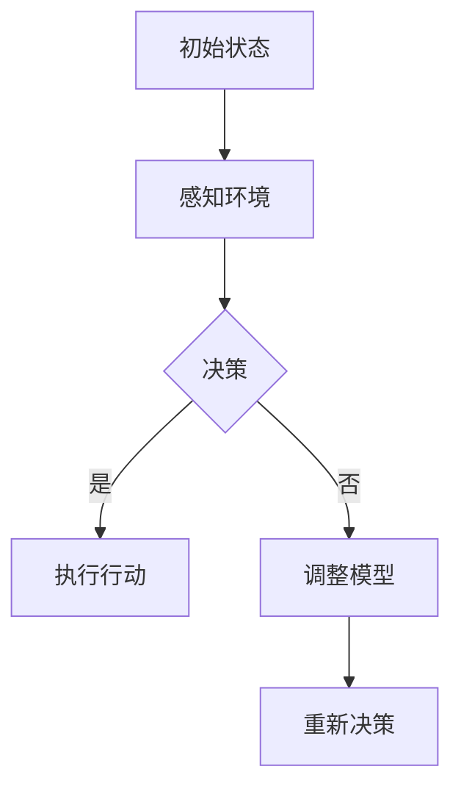
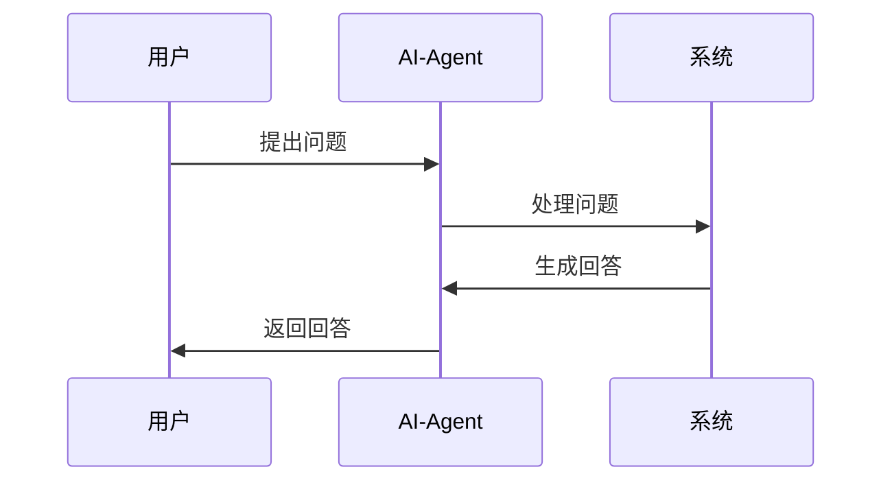

                 

### 文章标题：模型解释：增加AI Agent的透明度

关键词：AI Agent、模型透明度、算法原理、数学模型、系统架构设计、项目实战、最佳实践

摘要：本文将深入探讨如何增加AI Agent的透明度，从核心概念、算法原理到系统架构设计，再到项目实战，提供全面的解析和指导。通过本文，读者将了解到提升AI Agent透明度的多种方法，掌握相关技术原理和实践技巧。

#### 第一部分：背景介绍与核心概念

**第1章：问题背景与核心概念介绍**

**1.1 AI Agent的基本概念**

AI Agent，即人工智能代理，是一种能够感知环境、自主决策并执行行动的智能体。其核心在于能够实现自主学习和智能化交互，从而提高系统的智能水平和自动化程度。

**1.2 模型透明度的意义**

模型透明度是指AI Agent模型的可解释性和可理解性。增加模型透明度，有助于提高系统的可信度、用户对系统的信任度，以及模型在实际应用中的可靠性。

**1.3 当前AI Agent透明度的挑战**

当前AI Agent的透明度存在以下挑战：

- 复杂性：AI Agent模型通常包含大量的参数和复杂的结构，导致模型难以解释。
- 数据依赖性：AI Agent的性能和透明度高度依赖训练数据的质量和多样性。
- 技术限制：现有的模型解释方法在处理复杂模型时存在性能瓶颈。

#### 第二部分：核心概念与联系

**第2章：AI Agent模型原理与特性**

**2.1 AI Agent的工作原理**

AI Agent的工作原理主要包括感知、决策和行动三个环节。通过感知环境信息，AI Agent能够理解当前的状态；通过决策过程，AI Agent能够选择合适的行动；通过行动，AI Agent能够改变环境状态。

**2.2 AI Agent的关键特性**

AI Agent的关键特性包括：

- 自主性：AI Agent能够自主决策和执行行动，不受人类干预。
- 智能化：AI Agent能够通过学习和自适应来提高其性能和适应性。
- 适应性：AI Agent能够根据环境变化调整其行为策略。

**2.3 AI Agent的模型分类与对比**

AI Agent的模型可以分为以下几类：

- 基于规则的模型
- 基于模型的模型
- 基于深度学习的模型
- 基于增强学习的模型

各类模型在性能、复杂度和透明度方面存在差异。

#### 第三部分：算法原理讲解

**第3章：提高AI Agent透明度的算法**

**3.1 算法概述**

为了提高AI Agent的透明度，我们可以采用以下几种算法：

- 层次化解释方法
- 局部解释方法
- 整体解释方法
- 综合解释方法

**3.2 算法流程图（使用Mermaid）**

**3.3 算法数学模型与公式**

层次化解释方法的数学模型可以表示为：

$$
透明度 = f(模型复杂度, 数据依赖度, 解释方法有效性)
$$

其中，模型复杂度、数据依赖度和解释方法有效性分别表示模型的复杂程度、训练数据的质量和对解释方法的有效性。

#### 第四部分：数学模型和公式详细讲解与举例

**第4章：模型解释与透明度提升**

**4.1 模型解释的概念**

模型解释是指对AI Agent模型的内部结构和决策过程进行详细分析，以便理解模型的行为和性能。

**4.2 透明度提升的方法**

提升AI Agent透明度的方法包括：

- 简化模型结构
- 增加训练数据多样性
- 使用可解释的模型类型
- 应用解释算法

**4.3 数学模型与公式解释**

简化模型结构的数学模型可以表示为：

$$
简化模型 = \frac{原模型}{简化因子}
$$

其中，简化因子表示模型复杂度的降低程度。

#### 第五部分：系统分析与架构设计

**第5章：AI Agent系统架构设计**

**5.1 系统场景介绍**

以智能客服系统为例，介绍AI Agent在实际应用中的场景和需求。

**5.2 系统功能设计**

系统功能包括感知用户需求、理解用户意图、生成回答和反馈等。

**5.3 系统架构设计**

系统架构设计包括感知模块、决策模块和行动模块。

**5.4 系统接口设计**

系统接口设计包括用户接口、系统接口和数据接口。

**5.5 系统交互序列图**

使用Mermaid绘制系统交互序列图。

#### 第六部分：项目实战

**第6章：模型解释项目实战**

**6.1 实战环境搭建**

搭建模型解释项目的开发环境。

**6.2 核心代码实现**

实现模型解释的核心代码。

**6.3 代码解读与分析**

对核心代码进行解读和分析。

**6.4 实际案例剖析**

分析一个实际案例，展示模型解释的效果。

**6.5 项目小结**

总结项目经验和教训。

#### 第七部分：最佳实践与拓展

**第7章：最佳实践与未来展望**

**7.1 最佳实践总结**

总结提高AI Agent透明度的最佳实践。

**7.2 注意事项**

列出在实施模型解释时需要注意的事项。

**7.3 未来展望与拓展**

探讨AI Agent透明度提升的未来发展方向和潜力。

---

**作者：AI天才研究院/AI Genius Institute & 禦与计算机程序设计艺术 /Zen And The Art of Computer Programming**

