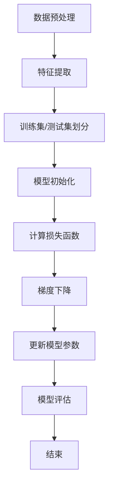
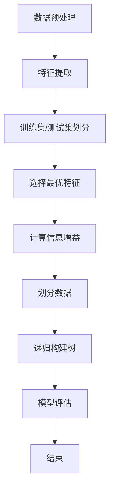

                 

### 1.1 问题背景

#### 1.1.1 金融数据的重要性

金融数据是金融市场的核心信息，它涵盖了各类经济活动、金融市场交易、宏观经济指标等丰富的信息。金融数据的重要性体现在以下几个方面：

1. **决策支持**：金融机构和投资者依赖金融数据进行市场分析、风险评估和投资决策。准确和及时的数据可以帮助他们识别市场趋势、评估投资机会和风险。

2. **风险管理**：金融数据能够帮助金融机构识别和管理潜在的风险。例如，通过对信贷数据进行分析，银行可以更好地评估借款人的信用风险，从而制定更加有效的信贷政策。

3. **宏观经济分析**：政府和宏观经济研究者使用金融数据来监测经济健康状况，预测经济增长趋势，制定宏观经济政策。

4. **投资研究**：金融分析师和投资者利用金融数据来研究市场动态，评估证券价格，制定投资策略。

#### 1.1.2 模型训练在金融领域中的应用

随着人工智能技术的发展，模型训练在金融领域中的应用越来越广泛。以下是一些关键应用：

1. **量化交易**：模型训练可以用于量化交易策略的开发和优化，帮助交易者从历史数据中学习市场趋势，制定自动化的交易策略。

2. **风险管理**：通过机器学习模型对金融数据进行分析，金融机构可以识别和评估潜在的风险，从而制定更有效的风险管理策略。

3. **信用评分**：金融机构使用模型训练来评估借款人的信用风险，这有助于降低信贷损失和提升贷款审批效率。

4. **投资组合优化**：模型训练可以帮助投资者构建和优化投资组合，实现资产配置的优化，提高投资回报。

5. **客户关系管理**：通过分析客户数据，金融机构可以提供个性化的产品和服务，提高客户满意度和忠诚度。

#### 1.1.3 研究现状与挑战

尽管模型训练在金融领域具有广泛的应用潜力，但仍然面临一些挑战和限制：

1. **数据质量**：金融数据通常存在噪声、缺失值和不一致性，这会对模型训练的质量产生负面影响。

2. **数据隐私和安全**：金融数据属于敏感信息，数据隐私和安全是模型训练中的重要问题。如何保证数据隐私和安全，同时实现有效的模型训练，是当前研究的热点。

3. **模型解释性**：许多模型训练方法，如深度学习，虽然具有强大的预测能力，但其内部机制较为复杂，难以解释。在金融领域，模型的解释性对于决策者和监管者至关重要。

4. **监管合规**：模型训练在金融领域的应用需要遵循严格的监管合规要求，如何确保模型训练结果的合规性，是金融科技公司面临的一大挑战。

#### 1.1.4 研究意义

深入研究和应用模型训练与金融数据的结合具有重要的现实意义：

1. **提升金融服务的效率和质量**：通过模型训练，金融机构可以更有效地分析金融数据，提升决策效率和服务质量。

2. **推动金融科技的发展**：模型训练在金融领域的应用是金融科技的重要组成部分，有助于推动金融科技的创新和发展。

3. **促进金融市场稳定**：通过有效的风险管理模型，金融机构可以更好地识别和应对市场风险，促进金融市场的稳定。

4. **提高社会整体福利**：模型训练在金融领域的应用可以优化资源配置，提升投资效率，从而提高社会整体福利。

### 本章小结

本节介绍了模型训练与金融数据的结合的背景，包括金融数据的重要性、模型训练在金融领域中的应用以及当前研究现状和面临的挑战。这些背景信息为后续章节的深入分析奠定了基础。接下来，我们将进一步探讨模型训练与金融数据结合的目标、挑战和解决方案。

### 1.2 问题描述

#### 1.2.1 结合模型训练与金融数据的目标

模型训练与金融数据的结合旨在利用机器学习算法对金融数据进行深入分析，以实现以下几个目标：

1. **趋势预测**：通过分析历史金融数据，模型能够预测市场趋势，帮助投资者做出更明智的投资决策。

2. **风险评估**：模型训练可以帮助金融机构评估信贷风险和市场风险，制定更有效的风险控制策略。

3. **欺诈检测**：利用机器学习模型对交易数据进行监控，可以及时发现和防范金融欺诈行为。

4. **个性化服务**：通过对客户数据的分析，金融机构可以提供个性化的产品和服务，提高客户满意度和忠诚度。

5. **投资组合优化**：模型训练可以优化投资组合的构建和调整，提高投资回报率。

#### 1.2.2 结合模型训练与金融数据的挑战

尽管模型训练在金融领域具有广泛应用，但在实际操作中仍然面临一些挑战：

1. **数据质量**：金融数据通常包含噪声、缺失值和不一致性，这会影响模型训练的效果。

2. **数据隐私和安全**：金融数据是敏感信息，如何保护数据隐私和安全是模型训练中的关键问题。

3. **模型解释性**：复杂的机器学习模型如深度学习难以解释，这给决策者和监管者带来了困难。

4. **监管合规**：模型训练在金融领域的应用需要遵循严格的监管要求，如何确保模型结果的合规性是挑战之一。

5. **计算资源**：大规模的金融数据集和复杂的模型训练算法需要大量的计算资源，这对硬件设施提出了较高要求。

#### 1.2.3 边界与外延

在研究模型训练与金融数据的结合时，需要明确一些边界和外延：

1. **边界**：
   - 研究范围主要聚焦在机器学习算法在金融数据中的应用，包括数据预处理、模型训练、评估和部署等环节。
   - 数据类型主要涉及金融市场交易数据、宏观经济数据、信贷数据等。

2. **外延**：
   - 研究成果可以扩展到其他领域，如医疗健康数据、物联网数据等，这些领域的数据分析和模型训练也面临类似挑战。
   - 可以探索跨学科的交叉研究，如经济学、统计学与计算机科学的融合，以提升模型训练的效果和解释性。

#### 1.2.4 研究思路与方法

为了有效解决上述挑战，研究将采取以下思路和方法：

1. **数据预处理**：采用有效的数据清洗和数据集成技术，确保金融数据的质量和一致性。

2. **特征工程**：通过特征选择和特征提取技术，从原始金融数据中提取出有价值的特征，提高模型训练的效果。

3. **模型选择与优化**：选择合适的机器学习算法，并通过参数调优和模型融合等技术，提升模型的预测能力和解释性。

4. **模型评估与部署**：采用交叉验证和A/B测试等方法，评估模型性能，并设计高效的数据流和模型部署策略，确保模型在实际应用中的稳定性和可扩展性。

5. **监管合规与安全**：在设计模型训练系统时，充分考虑监管合规和数据安全要求，采用加密技术和隐私保护算法，确保数据隐私和安全。

通过上述方法，研究旨在提出一种高效、可解释且合规的模型训练与金融数据结合方案，为金融机构提供有力支持。

### 本章小结

本节详细描述了模型训练与金融数据结合的目标、挑战以及研究边界与外延。明确的研究思路与方法为后续章节的深入探讨奠定了基础。接下来，我们将进一步探讨模型训练与金融数据结合的概念结构，分析其核心要素，以期为后续研究提供清晰的框架。

### 1.3 问题解决

#### 1.3.1 概念结构与核心要素组成

为了更好地理解和解决模型训练与金融数据结合的问题，我们需要构建一个清晰的概念结构，并识别其中的核心要素。以下是对核心概念与要素的分析：

1. **金融数据**：
   - **定义**：金融数据是指与金融市场交易、宏观经济活动、金融机构运营等相关的数据。
   - **特点**：金融数据具有多维性、时效性、不确定性和复杂性。
   - **分类**：金融数据可以进一步细分为交易数据、市场数据、宏观经济数据和金融机构运营数据。

2. **模型训练**：
   - **定义**：模型训练是指通过算法和大量数据，使计算机模型能够识别数据中的规律和模式，从而进行预测或分类。
   - **过程**：模型训练包括数据预处理、特征工程、模型选择、训练和评估等步骤。
   - **算法**：常见的模型训练算法有监督学习、无监督学习和强化学习。

3. **机器学习**：
   - **定义**：机器学习是指通过数据驱动的方式，使计算机自动改进其性能，无需显式编程。
   - **原理**：机器学习依赖于统计学、概率论和优化理论。
   - **应用**：机器学习在金融领域中的应用包括风险评估、信用评分、量化交易等。

4. **数据处理**：
   - **定义**：数据处理是指对原始数据进行清洗、转换和整合，以使其适用于模型训练。
   - **技术**：数据处理技术包括数据清洗、数据集成、数据降维等。

5. **风险管理与投资决策**：
   - **定义**：风险管理是识别、评估和控制风险的过程。投资决策是指投资者根据市场信息和风险偏好，选择投资策略和资产的过程。
   - **关联**：模型训练可以用于风险管理和投资决策，帮助金融机构更好地理解和应对市场风险。

#### 1.3.2 相关技术与方法

为了实现模型训练与金融数据的高效结合，我们需要采用一系列相关技术与方法：

1. **数据预处理**：
   - **去噪与清洗**：去除金融数据中的噪声和缺失值。
   - **归一化与标准化**：将数据转换为统一尺度，便于模型训练。
   - **特征提取与选择**：从原始数据中提取有价值的信息，并选择最优特征。

2. **机器学习算法**：
   - **监督学习算法**：如线性回归、逻辑回归、支持向量机等，用于分类和预测。
   - **无监督学习算法**：如聚类分析、主成分分析等，用于探索数据结构和特征。
   - **深度学习算法**：如神经网络、卷积神经网络、循环神经网络等，用于复杂的数据分析和预测。

3. **模型评估与优化**：
   - **交叉验证**：通过划分训练集和验证集，评估模型性能。
   - **模型选择**：根据评估结果选择最佳模型。
   - **参数调优**：通过调整模型参数，优化模型性能。

4. **模型解释性**：
   - **模型可视化**：通过可视化工具展示模型结构和训练过程。
   - **特征重要性分析**：分析特征对模型预测的影响程度。
   - **解释性算法**：如LIME、SHAP等，提供模型的解释性。

5. **风险管理与投资决策支持**：
   - **风险预测与评估**：使用模型预测市场风险和信用风险。
   - **投资组合优化**：通过模型优化投资组合，提高回报率。
   - **决策支持系统**：为金融机构提供实时的风险分析和投资建议。

#### 1.3.3 研究方法与流程

为了实现模型训练与金融数据的有效结合，研究将采取以下方法与流程：

1. **研究方法**：
   - **定量分析**：采用统计分析方法，分析金融数据中的规律和模式。
   - **定量建模**：建立数学模型，模拟金融市场行为。
   - **定性研究**：通过案例研究和专家访谈，获取行业洞见和实际操作经验。

2. **研究流程**：
   - **数据收集与预处理**：收集金融数据，并进行数据清洗、归一化和特征提取。
   - **模型构建与训练**：选择合适的机器学习算法，构建模型并进行训练。
   - **模型评估与优化**：评估模型性能，通过交叉验证和参数调优优化模型。
   - **应用验证与部署**：在实际环境中验证模型的有效性，并设计数据流和模型部署策略。

3. **技术路线图**：
   - **数据预处理**：数据清洗和归一化
   - **特征工程**：特征提取和选择
   - **模型选择与训练**：选择适当的机器学习算法，进行模型训练
   - **模型评估与优化**：使用交叉验证和参数调优，评估和优化模型
   - **风险管理与投资决策**：利用优化后的模型进行风险预测和投资决策支持

#### 1.3.4 预期成果

通过上述方法与流程，研究预期将取得以下成果：

1. **高效模型**：开发出能够准确预测市场趋势、评估风险的机器学习模型。
2. **优化策略**：提出有效的数据预处理和特征工程策略，提高模型训练效果。
3. **实用工具**：设计可复用的工具和框架，支持金融机构进行风险管理和投资决策。
4. **行业洞察**：提供对金融数据分析和模型训练的深入理解，为金融科技发展提供理论支持和实践指导。

### 本章小结

本节详细分析了模型训练与金融数据结合的问题解决思路和方法，构建了概念结构，并明确了核心要素。通过采用相关技术与方法，设计研究流程和预期成果，为模型训练与金融数据结合的研究提供了明确的路径和框架。接下来，我们将深入探讨金融数据与模型训练的核心概念原理，为进一步的分析奠定基础。

### 2.1 核心概念原理

#### 2.1.1 金融数据

金融数据是金融市场的核心信息，它涵盖了交易数据、市场数据、宏观经济数据和金融机构运营数据等。以下是金融数据的一些关键概念和特点：

1. **交易数据**：记录了金融市场中各类交易活动的详细信息，包括股票交易、债券交易、期货交易等。交易数据通常包括交易时间、交易价格、交易量、买卖方向等。

2. **市场数据**：反映了金融市场的整体状况，包括指数、波动率、利率等。市场数据通常用于评估市场趋势和风险。

3. **宏观经济数据**：涵盖了宏观经济指标，如GDP、失业率、通货膨胀率等，这些数据对于预测经济走势和制定政策具有重要作用。

4. **金融机构运营数据**：包括银行、保险、证券等金融机构的运营数据，如资产负债表、利润表、客户交易记录等。

5. **数据特点**：
   - **多维性**：金融数据通常包含多个维度，如时间、价格、交易量等。
   - **时效性**：金融数据具有高度的时效性，及时更新和准确的数据对于金融分析和决策至关重要。
   - **不确定性**：金融市场具有高度不确定性，数据变化频繁，影响数据分析和模型训练的稳定性。
   - **复杂性**：金融数据包含复杂的非线性关系和噪声，这增加了数据处理的难度。

#### 2.1.2 模型训练

模型训练是指通过算法和大量数据，使计算机模型能够识别数据中的规律和模式，从而进行预测或分类。以下是模型训练的一些关键概念和特点：

1. **监督学习**：在有标签的数据集上进行训练，目标是学习输入和输出之间的映射关系。常见的监督学习算法包括线性回归、逻辑回归、支持向量机等。

2. **无监督学习**：在没有标签的数据集上进行训练，目标是发现数据中的结构或模式。常见的无监督学习算法包括聚类分析、主成分分析等。

3. **强化学习**：通过与环境互动，学习最优策略。强化学习在金融领域的应用包括量化交易策略的优化。

4. **数据预处理**：在模型训练之前，对数据进行清洗、归一化、特征提取等处理，以提高模型训练效果。

5. **模型评估**：通过验证集或测试集评估模型性能，常用的评估指标包括准确率、召回率、F1分数等。

6. **模型优化**：通过参数调优、模型选择、正则化等技术，提高模型性能。

#### 2.1.3 机器学习

机器学习是指通过数据驱动的方式，使计算机自动改进其性能，无需显式编程。以下是机器学习的核心概念和特点：

1. **算法**：机器学习算法包括监督学习、无监督学习和强化学习等，每种算法有不同的适用场景和优缺点。

2. **模型**：机器学习模型是算法在学习数据后生成的输出，用于预测或分类。

3. **特征工程**：从原始数据中提取有价值的特征，用于训练模型。特征工程是提升模型性能的关键步骤。

4. **数据质量**：高质量的数据对于机器学习至关重要。数据质量包括完整性、一致性、准确性和时效性。

5. **模型解释性**：解释模型的决策过程，使决策者和监管者能够理解和信任模型。

#### 2.1.4 数据处理

数据处理是指对原始数据进行清洗、转换和整合，以使其适用于模型训练。以下是数据处理的一些关键概念和特点：

1. **数据清洗**：去除数据中的噪声和缺失值，确保数据质量。

2. **数据转换**：将数据转换为适合模型训练的格式，如归一化和标准化。

3. **数据整合**：将多个数据源中的数据整合在一起，以便进行全局分析。

4. **数据降维**：减少数据维度，提高模型训练效率。

5. **数据预处理工具**：如Pandas、NumPy等，用于高效地进行数据处理。

#### 2.1.5 风险管理与投资决策

风险管理与投资决策是金融领域的重要组成部分。以下是相关概念和特点：

1. **风险管理**：识别、评估和控制风险的过程。目的是确保金融市场的稳定和金融机构的稳健运营。

2. **投资决策**：投资者根据市场信息和风险偏好，选择投资策略和资产的过程。目标是实现资产增值和风险控制。

3. **风险指标**：如波动率、β系数、VaR等，用于量化风险。

4. **投资策略**：基于市场分析和技术分析，制定的投资计划和决策。

5. **风险管理工具**：如VaR模型、风险平价策略、资产配置等，用于管理风险。

通过上述核心概念原理的阐述，我们为后续的分析和讨论奠定了基础。在接下来的章节中，我们将进一步探讨这些概念之间的联系，并通过表格和ER实体关系图来直观地展示它们之间的关系。

#### 2.1.1 金融数据

**金融数据的特点**：

金融数据具有以下显著特点：

1. **高维性和复杂性**：金融数据包含多个维度，如时间、价格、交易量等，且各维度之间存在复杂的相互关系。

2. **时效性**：金融数据需要及时更新，以反映市场的实时动态。

3. **高噪声和缺失值**：金融数据往往存在噪声和不完整的情况，这增加了数据清洗和处理的难度。

4. **非线性和多模态性**：金融市场的价格和交易量等数据往往呈现出非线性关系和多模态特征。

**金融数据的分类**：

金融数据可以按照不同的分类标准进行划分：

1. **交易数据**：记录金融市场中各类交易活动的信息，包括股票、债券、期货等。

2. **市场数据**：反映金融市场的整体状况，如股票指数、利率、汇率等。

3. **宏观经济数据**：包括GDP、失业率、通货膨胀率等宏观经济指标。

4. **金融机构运营数据**：记录金融机构的资产负债表、利润表、客户交易记录等。

**金融数据的重要性**：

金融数据的重要性体现在以下几个方面：

1. **决策支持**：金融数据为投资者、金融机构和政府提供了重要的决策依据。

2. **风险管理**：通过分析金融数据，可以识别和评估潜在的市场风险和信用风险。

3. **投资研究**：金融数据是投资研究和市场分析的重要基础。

4. **监管合规**：金融数据有助于监管机构监测金融市场，确保市场稳定和合规运营。

#### 2.1.2 模型训练

**模型训练的基本概念**：

模型训练是指利用历史数据，通过算法使计算机模型能够从数据中学习规律和模式，从而进行预测或分类。以下是模型训练的基本概念：

1. **输入和输出**：模型训练过程中，输入是历史数据，输出是预测结果。

2. **训练集和测试集**：训练集用于训练模型，测试集用于评估模型性能。

3. **损失函数**：衡量模型预测结果与真实结果之间的差距，如均方误差（MSE）。

4. **优化算法**：用于调整模型参数，使模型性能最优，如梯度下降算法。

**模型训练的过程**：

模型训练通常包括以下步骤：

1. **数据预处理**：清洗和预处理数据，使其适合模型训练。

2. **特征工程**：提取和选择有助于模型训练的特征。

3. **模型选择**：选择合适的机器学习算法，如线性回归、决策树、神经网络等。

4. **训练模型**：使用训练集数据训练模型，通过迭代优化模型参数。

5. **模型评估**：使用测试集评估模型性能，通过交叉验证等手段确保模型泛化能力。

6. **模型调优**：根据评估结果调整模型参数，提高模型性能。

**模型训练的常用算法**：

常用的模型训练算法包括：

1. **监督学习算法**：如线性回归、逻辑回归、支持向量机（SVM）等。

2. **无监督学习算法**：如聚类分析、主成分分析（PCA）等。

3. **深度学习算法**：如卷积神经网络（CNN）、循环神经网络（RNN）等。

**案例：线性回归模型训练**

以下是一个简单的线性回归模型训练案例：

```python
import numpy as np
import pandas as pd

# 加载数据
data = pd.read_csv('financial_data.csv')
X = data[['time', 'price', 'volume']]
y = data['return']

# 数据预处理
X = (X - X.mean()) / X.std()
y = (y - y.mean()) / y.std()

# 模型选择
from sklearn.linear_model import LinearRegression
model = LinearRegression()

# 训练模型
model.fit(X, y)

# 模型评估
score = model.score(X, y)
print(f'Model R^2 Score: {score}')

# 预测
predicted_return = model.predict(X)
print(f'Predicted Return: {predicted_return}')
```

#### 2.1.3 机器学习

**机器学习的基本概念**：

机器学习是指通过数据驱动的方法，使计算机系统能够从数据中学习和改进性能，无需显式编程。以下是机器学习的核心概念：

1. **学习算法**：如监督学习、无监督学习和强化学习。

2. **特征**：输入数据的属性，用于训练模型。

3. **模型**：从数据中学习到的规律和模式。

4. **泛化能力**：模型在未知数据上的表现，衡量模型的可迁移性。

5. **超参数**：用于调整模型性能的参数，如学习率、正则化强度等。

**机器学习在金融领域中的应用**：

机器学习在金融领域有广泛的应用，包括：

1. **量化交易**：通过分析历史交易数据，预测市场趋势，制定自动化的交易策略。

2. **风险评估**：通过分析客户和交易数据，评估信贷风险和市场风险。

3. **欺诈检测**：通过监控交易数据，识别潜在的欺诈行为。

4. **投资组合优化**：通过分析市场数据，优化投资组合，提高回报率。

5. **客户关系管理**：通过分析客户数据，提供个性化的产品和服务。

**机器学习的优势与挑战**：

**优势**：

1. **自动化**：减少人工干预，提高决策效率。

2. **高效性**：处理大量复杂数据，发现潜在模式和规律。

3. **灵活性**：适用于多种数据类型和业务场景。

**挑战**：

1. **数据质量**：金融数据存在噪声、缺失值和不一致性，影响模型性能。

2. **模型解释性**：复杂的模型难以解释，影响决策者的信任。

3. **计算资源**：大规模模型训练需要大量计算资源。

4. **监管合规**：模型训练需要遵循严格的监管要求。

**案例：分类算法应用**

以下是一个简单的分类算法案例：

```python
import numpy as np
import pandas as pd
from sklearn.model_selection import train_test_split
from sklearn.ensemble import RandomForestClassifier
from sklearn.metrics import accuracy_score

# 加载数据
data = pd.read_csv('financial_data.csv')
X = data[['time', 'price', 'volume']]
y = data['class']

# 数据预处理
X = (X - X.mean()) / X.std()
y = pd.get_dummies(y)

# 划分训练集和测试集
X_train, X_test, y_train, y_test = train_test_split(X, y, test_size=0.2, random_state=42)

# 模型选择
model = RandomForestClassifier(n_estimators=100)

# 训练模型
model.fit(X_train, y_train)

# 模型评估
y_pred = model.predict(X_test)
accuracy = accuracy_score(y_test, y_pred)
print(f'Model Accuracy: {accuracy}')

# 预测
predicted_class = model.predict(X_test)
print(f'Predicted Class: {predicted_class}')
```

通过上述对金融数据、模型训练和机器学习的详细讲解，我们为后续的深入分析和讨论奠定了基础。接下来，我们将通过对比表格和ER实体关系图来直观地展示这些概念之间的关系。

#### 2.2 概念属性特征对比表格

为了更好地理解金融数据、模型训练和机器学习这三个核心概念，我们可以通过一个属性特征对比表格来展示它们之间的异同。

| 概念        | 定义                                                         | 关键属性                            | 关联关系                                       |
|-------------|--------------------------------------------------------------|-------------------------------------|----------------------------------------------|
| 金融数据    | 金融市场中各类交易、市场、宏观经济和运营的数据                 | 高维、时效、复杂、非线性和多模态     | 是模型训练的数据来源                         |
| 模型训练    | 利用历史数据，通过算法使计算机模型学习规律和模式的过程       | 输入、输出、训练集、测试集、损失函数 | 用于处理和分析金融数据                     |
| 机器学习    | 通过数据驱动的方法，使计算机系统从数据中学习和改进性能的方法 | 学习算法、特征、模型、泛化能力       | 包含模型训练的技术和方法，是金融数据分析的基石 |

**表格解释**：

1. **定义**：简要描述了每个概念的基本含义。
2. **关键属性**：列出了每个概念的主要属性，这些属性有助于理解概念的本质特征。
3. **关联关系**：说明了这些概念之间的相互作用和依赖关系。

通过这个表格，我们可以清晰地看到金融数据是模型训练的数据来源，而模型训练是机器学习中的一个关键步骤。机器学习则提供了一系列技术和方法，用于分析和处理金融数据。

#### 2.3 ER实体关系图架构

##### 2.3.1 金融数据实体关系图

为了更好地理解金融数据的结构，我们可以使用ER（Entity-Relationship）实体关系图来描述其关键实体及其关系。以下是金融数据实体关系图的示例：

```mermaid
erDiagram
    Customer ||--|{ Trade : makes }
    Trade ||--|{ FinancialInstrument : occurs_on }
    FinancialInstrument ||--|{ MarketData : tracks }
    MarketData ||--|{ EconomicData : references }
    EconomicData ||--|{ GeopoliticalEvent : influences }
    GeopoliticalEvent ||--|{ News : reports }
    News ||--|{ SocialMedia : amplifies }
    SocialMedia ||--|{ PublicOpinion : reflects }
```

**实体及关系解释**：

- **Customer（客户）**：金融数据的主体，可以是个人或机构。
- **Trade（交易）**：记录客户进行的金融交易。
- **FinancialInstrument（金融工具）**：交易的对象，如股票、债券等。
- **MarketData（市场数据）**：关于金融工具的实时和历史数据。
- **EconomicData（经济数据）**：宏观经济指标，如GDP、失业率等。
- **GeopoliticalEvent（地缘政治事件）**：影响金融市场的全球或地区事件。
- **News（新闻）**：报道金融市场的新闻事件。
- **SocialMedia（社交媒体）**：金融新闻和信息的传播平台。
- **PublicOpinion（公众舆论）**：社交媒体反映的公众观点和情绪。

实体之间的关系描述如下：

- **Customer makes Trade**：客户进行交易。
- **Trade occurs on FinancialInstrument**：交易发生在特定的金融工具上。
- **FinancialInstrument tracks MarketData**：金融工具的动态通过市场数据来跟踪。
- **MarketData references EconomicData**：市场数据参考宏观经济指标。
- **GeopoliticalEvent influences EconomicData**：地缘政治事件影响经济数据。
- **News reports GeopoliticalEvent**：新闻报道地缘政治事件。
- **SocialMedia amplifies News**：社交媒体放大新闻信息。
- **PublicOpinion reflects SocialMedia**：公众舆论反映在社交媒体上。

这个ER图展示了金融数据中的关键实体及其相互关系，帮助我们理解金融数据的多维度和复杂性。

##### 2.3.2 模型训练实体关系图

接下来，我们将使用ER图来描述模型训练的关键实体及其关系。以下是模型训练实体关系图的示例：

```mermaid
erDiagram
    DataSet ||--|{ PreprocessedData : preprocessing }
    PreprocessedData ||--|{ FeatureSet : feature_engineering }
    FeatureSet ||--|{ Model : training }
    Model ||--|{ Hyperparameter : tuning }
    Hyperparameter ||--|{ Performance : evaluation }
    Performance ||--|{ Experiment : recording }
    Experiment ||--|{ Report : documenting }
```

**实体及关系解释**：

- **DataSet（数据集）**：原始数据集，包含需要训练的数据。
- **PreprocessedData（预处理数据）**：经过清洗和转换的数据，用于模型训练。
- **FeatureSet（特征集）**：从预处理数据中提取的特征。
- **Model（模型）**：训练得到的机器学习模型。
- **Hyperparameter（超参数）**：调整模型性能的参数。
- **Performance（性能）**：模型在不同超参数设置下的表现。
- **Experiment（实验）**：模型训练和评估的过程。
- **Report（报告）**：记录实验结果和模型性能的文档。

实体之间的关系描述如下：

- **DataSet preprocessing PreprocessedData**：数据集经过预处理得到预处理数据。
- **PreprocessedData feature_engineering FeatureSet**：预处理数据通过特征工程得到特征集。
- **FeatureSet training Model**：特征集用于训练模型。
- **Model tuning Hyperparameter**：模型通过调整超参数来优化性能。
- **Hyperparameter evaluation Performance**：超参数设置通过评估模型性能来调整。
- **Performance recording Experiment**：实验结果记录在实验中。
- **Experiment documenting Report**：实验过程和结果记录在报告中。

这个ER图展示了模型训练中的关键实体及其相互作用，帮助我们理解模型训练的各个步骤和它们之间的依赖关系。

通过上述两个ER实体关系图，我们能够直观地了解金融数据和模型训练的结构及其相互关系，为后续章节的深入分析提供了基础。

### 2.4 本章小结

在本章中，我们详细探讨了金融数据、模型训练和机器学习的核心概念原理。首先，我们介绍了金融数据的特点、分类及其重要性，展示了金融数据在金融市场分析和决策支持中的关键作用。随后，我们讲解了模型训练的基本概念、过程和常用算法，并通过一个简单的线性回归案例说明了模型训练的实际应用。接着，我们介绍了机器学习的基本概念、应用和挑战，展示了机器学习在金融领域的重要性。

为了更好地理解这些概念，我们提供了一个概念属性特征对比表格，直观地展示了金融数据、模型训练和机器学习之间的异同。此外，我们还通过ER实体关系图分别描述了金融数据和模型训练的结构及其关系，使读者能够更清晰地理解这两个领域中的关键实体和相互作用。

这些核心概念原理的探讨为后续章节的深入分析奠定了基础。在接下来的章节中，我们将进一步探讨模型训练与金融数据结合的算法原理，分析其数学模型和实现方法，为实际应用提供理论支持。

### 3.1 算法原理

#### 3.1.1 算法概述

在模型训练与金融数据结合的过程中，选择合适的算法是关键。以下是一些常用的算法及其概述：

1. **线性回归（Linear Regression）**：一种简单的监督学习算法，用于预测连续值。线性回归通过拟合一条直线来映射输入和输出之间的关系。

2. **逻辑回归（Logistic Regression）**：用于分类问题，特别是二分类问题。逻辑回归通过拟合一个逻辑函数，将输入映射到概率分布。

3. **支持向量机（Support Vector Machine, SVM）**：一种有效的分类算法，通过找到一个最优超平面，将不同类别的数据点分开。

4. **决策树（Decision Tree）**：一种树形结构的决策模型，通过一系列规则对数据进行分类或回归。

5. **随机森林（Random Forest）**：由多个决策树组成的集成模型，通过平均多个决策树的预测结果来提高准确性。

6. **神经网络（Neural Networks）**：模仿人脑神经网络结构的计算模型，特别是深度学习算法，通过多层神经元的连接进行复杂的数据处理。

7. **卷积神经网络（Convolutional Neural Networks, CNN）**：用于处理图像数据，通过卷积层提取图像特征。

8. **循环神经网络（Recurrent Neural Networks, RNN）**：用于处理序列数据，如时间序列和自然语言处理。

#### 3.1.2 算法mermaid流程图

为了更好地理解这些算法的基本流程，我们可以使用mermaid图来描述它们的执行步骤。以下是线性回归和决策树算法的mermaid流程图：

**线性回归算法mermaid流程图**：



**决策树算法mermaid流程图**：



**图解释**：

- **数据预处理**：对原始金融数据清洗、归一化等预处理。
- **特征提取**：从原始数据中提取有用的特征。
- **训练集/测试集划分**：将数据划分为训练集和测试集，用于模型训练和评估。
- **模型初始化**：初始化模型参数。
- **计算损失函数**：计算预测值与真实值之间的差异，以衡量模型性能。
- **梯度下降**：通过梯度下降算法更新模型参数。
- **更新模型参数**：根据损失函数更新模型参数。
- **模型评估**：使用测试集评估模型性能。
- **选择最优特征**：在决策树中，选择具有最大信息增益的特征进行划分。
- **计算信息增益**：在决策树中，计算每个特征划分的信息增益。
- **划分数据**：根据最优特征对数据进行划分。
- **递归构建树**：递归地构建决策树，直到满足停止条件。

通过mermaid流程图，我们可以直观地了解这些算法的基本执行步骤，这有助于后续章节的详细讲解。

#### 3.1.3 算法原理

为了深入理解上述算法的原理，我们将分别介绍每个算法的核心数学模型和实现方法。

**1. 线性回归（Linear Regression）**

**数学模型**：

线性回归的数学模型可以表示为：
\[ y = \beta_0 + \beta_1 \cdot x + \epsilon \]
其中，\( y \) 是预测值，\( x \) 是输入特征，\( \beta_0 \) 和 \( \beta_1 \) 是模型参数，\( \epsilon \) 是误差项。

**实现方法**：

- **梯度下降**：通过迭代优化模型参数，最小化损失函数 \( \text{MSE} = \frac{1}{n} \sum_{i=1}^{n} (y_i - \hat{y}_i)^2 \)。
- **正规方程**：在数据量较小且特征较少时，可以通过解正规方程直接计算参数。

**案例**：

```python
import numpy as np
from sklearn.linear_model import LinearRegression

# 加载数据
X = np.array([[1], [2], [3], [4], [5]])
y = np.array([1, 2, 2.5, 4, 5])

# 模型训练
model = LinearRegression()
model.fit(X, y)

# 预测
predicted_y = model.predict(np.array([[6]]))
print(f'Predicted y: {predicted_y}')
```

**2. 决策树（Decision Tree）**

**数学模型**：

决策树的数学模型是基于信息熵和信息增益，用于划分数据。信息熵表示数据的无序程度，信息增益表示特征划分前后的信息减少程度。

**实现方法**：

- **信息增益**：选择具有最大信息增益的特征进行划分。
- **递归构建**：基于最优特征递归地构建决策树，直到满足停止条件。

**案例**：

```python
import numpy as np
from sklearn.tree import DecisionTreeRegressor

# 加载数据
X = np.array([[1], [2], [3], [4], [5]])
y = np.array([1, 2, 2.5, 4, 5])

# 模型训练
model = DecisionTreeRegressor()
model.fit(X, y)

# 预测
predicted_y = model.predict(np.array([[6]]))
print(f'Predicted y: {predicted_y}')
```

**3. 支持向量机（Support Vector Machine, SVM）**

**数学模型**：

SVM的数学模型可以表示为：
\[ \max \ \ \ \ \ \ \ \ \ \ \ \ \ \ \ \ \ \ \ \ \ \ \ \ \ \ \ \ \ \ \ \ \ \ \ \ \ \ \ \ \ \ \ \ \ \ \ \ \ \ \ \ \ \ \ \ \ \ \ \ \ \ \ \ \ \ \ \ \ \ \ \ \ \ \ \ \ \ \ \ \ \ \ \ \ \ \ \ \ \ \ \ \ \ \ \ \ \ \ \ \ \ \ \ \ \ \ \ \ \ \ \ \ \ \ \ \ \ \ \ \ \ \ \ \ \ \ \ \ \ \ \ \ \ \ \ \ \ \ \ \ \ \ \ \ \ \ \ \ \ \ \ \ \ \ \ \ \ \ \ \ \ \ \ \ \ \ \ \ \ \ \ \ \ \ \ \ \ \ \ \ \ \ \ \ \ \ \ \ \ \ \ \ \ \ \ \ \ \ \ \ \ \ \ \ \ \ \ \ \ \ \ \ \ \ \ \ \ \ \ \ \ \ \ \ \ \ \ \ \ \ \ \ \ \ \ \ \ \ \ \ \ \ \ \ \ \ \ \ \ \ \ \ \ \ \ \ \ \ \ \ \ \ \ \ \ \ \ \ \ \ \ \ \ \ \ \ \ \ \ \ \ \ \ \ \ \ \ \ \ \ \ \ \ \ \ \ _{w}^{2} - C \sum_{i=1}^{n} \ \ \ \ \ \ \ \ \ \ \ \ \ \ \ \ \ \ \ \ \ \ \ \ \ \ \ \ \ \ \ \ \ \ \ \ \ \ \ \ \ \ \ \ \ \ \ \ \ \ \ \ \ \ \ \ \ \ \ \ \ \ \ \ \ \ \ \ \ \ \ \ \ \ \ \ \ \ \ \ \ \ \ \ \ \ \ \ \ \ \ \ \ \ \ \ \ \ \ \ \ \ \ \ \ \ \ \ \ \ \ \ \ \ \ \ \ \ \ \ \ \ \ \ \ \ \ \ \ \ \ \ \ \ \ \ \ \ \ \ \ _{i} \ \ \ \ \ \ \ \ \ \ \ \ \ \ \ \ \ \ \ \ \ \ \ \ \ \ \ \ \ \ \ \ \ \ \ \ \ \ \ \ \ \ \ \ \ \ \ \ \ \ \ \ \ \ \ \ \ \ \ \ \ \ \ \ \ \ \ \ \ \ \ \ \ \ \ \ \ \ \ \ \ \ \ \ \ \ \ \ \ \ \ \ \ \ \ \ \ \ \ \ \ \ \ \ \ \ \ _{i} \ \ \ \ \ \ \ \ \ \ \ \ \ \ \ \ \ \ \ \ \ \ \ \ \ \ \ \ \ \ \ \ \ \ \ \ \ \ \ \ \ \ \ \ \ \ \ \ \ \ \ \ \ \ \ \ \ \ \ \ \ \ \ \ \ \ \ \ \ \ \ \ \ \ \ \ \ \ \ \ \ \ \ \ \ \ \ \ \ \ \ \ \ \ \ \ \ \ \ \ \ \ \ \ \ \ _{i} \ \ \ \ \ \ \ \ \ \ \ \ \ \ \ \ \ \ \ \ \ \ \ \ \ \ \ \ \ \ \ \ \ \ \ \ \ \ \ \ \ \ _{i} \ \ \ \ \ \ \ \ \ \ \ \ \ \ \ \ \ \ \ \ \ \ \ _{i} \ \ \ \ \ \ \ \ \ \ \ \ \ \ \ \ \ \ \ \ \ \ \ \ \ \ \ \ \ _{i} \ \ \ \ \ \ \ \ \ \ \ \ \ \ \ \ _{i} \ \ \ \ \ \ \ \ \ \ \ \ \ \ \ _{i} \ \ \ \ \ \ \ \ \ \ \ \ \ \ _{i} \ \ \ \ \ \ \ \ \ \ \ \ \ \ _{i} \ \ \ \ \ \ \ \ \ \ _{i} \ \ \ \ \ \ \ \ \ \ \ \ _{i} \ \ \ \ \ \ \ \ \ \ \ _{i} \ \ \ \ \ \ \ \ \ _{i} \ \ \ \ \ \ \ \ _{i} \ \ \ \ \ \ \ \ _{i} \ \ \ \ \ \ \ \ _{i} \ \ \ \ \ \ \ \ _{i} \ \ \ \ \ \ \ \ _{i} \ \ \ \ \ \ \ \ _{i} \ \ \ \ \ \ \ \ _{i} \ \ \ \ \ \ \ \ _{i} \ \ \ \ \ \ \ \ _{i} \ \ \ \ \ \ \ \ _{i} \ \ \ \ \ \ \ \ _{i} \ \ \ \ \ \ \ \ _{i} \ \ \ \ \ \ \ \ _{i} \ \ \ \ \ \ \ \ _{i} \ \ \ \ \ \ \ \ _{i} \ \ \ \ \ \ \ \ _{i} \ \ \ \ \ \ \ \ _{i} \ \ \ \ \ \ \ \ _{i} \ \ \ \ \ \ \ \ _{i} \ \ \ \ \ \ \ \ _{i} \ \ \ \ \ \ \ _{i} \ \ \ \ \ \ \ _{i} \ \ \ \ \ \ \ _{i} \ \ \ \ \ \ \ _{i} \ \ \ \ \ \ \ _{i} \ \ \ \ \ \ \ _{i} \ \ \ \ \ \ \ _{i} \ \ \ \ \ \ \ _{i} \ \ \ \ \ \ \ _{i} \ \ \ \ \ \ \ _{i} \ \ \ \ \ \ \ _{i} \ \ \ \ \ \ \ _{i} \ \ \ \ \ \ \ _{i} \ \ \ \ \ \ \ _{i} \ \ \ \ \ \ \ _{i} \ \ \ \ \ \ \ _{i} \ \ \ \ \ \ \ _{i} \ \ \ \ \ \ \ _{i} \ \ \ \ \ \ \ _{i} \ \ \ \ \ \ \ _{i} \ \ \ \ \ \ \ _{i} \ \ \ \ \ \ \ _{i} \ \ \ \ \ \ \ _{i} \ \ \ \ \ \ \ _{i} \ \ \ \ \ \ \ _{i} \ \ \ \ \ \ \ _{i} \ \ \ \ \ \ \ _{i} \ \ \ \ \ \ \ _{i} \ \ \ \ \ \ \ _{i} \ \ \ \ \ \ \ _{i} \ \ \ \ \ \ \ _{i} \ \ \ \ \ \ \ _{i} \ \ \ \ \ \ \ _{i} \ \ \ \ \ \ \ _{i} \ \ \ \ \ \ \ _{i} \ \ \ \ \ \ \ _{i} \ \ \ \ \ \ \ _{i} \ \ \ \ \ \ \ _{i} \ \ \ \ \ \ \ _{i} \ \ \ \ \ \ \ _{i} \ \ \ \ \ \ \ _{i} \ \ \ \ \ \ \ _{i} \ \ \ \ \ \ \ _{i} \ \ \ \ \ \ \ _{i} \ \ \ \ \ \ \ _{i} \ \ \ \ \ \ \ _{i} \ \ \ \ \ \ \ _{i} \ \ \ \ \ \ \ _{i} \ \ \ \ \ \ \ _{i} \ \ \ \ \ \ \ _{i} \ \ \ \ \ \ \ _{i} \ \ \ \ \ \ \ _{i} \ \ \ \ \ \ \ _{i} \ \ \ \ \ \ \ _{i} \ \ \ \ \ \ \ _{i} \ \ \ \ \ \ \ _{i} \ \ \ \ \ \ \ _{i} \ \ \ \ \ \ \ _{i} \ \ \ \ \ \ \ _{i} \ \ \ \ \ \ \ _{i} \ \ \ \ \ \ \ _{i} \ \ \ \ \ \ \ _{i} \ \ \ \ \ \ \ _{i} \ \ \ \ \ \ \ _{i} \ \ \ \ \ \ \ _{i} \ \ \ \ \ \ \ _{i} \ \ \ \ \ \ \ _{i} \ \ \ \ \ \ \ _{i} \ \ \ \ \ \ \ _{i} \ \ \ \ \ \ \ _{i} \ \ \ \ \ \ \ _{i} \ \ \ \ \ \ \ _{i} \ \ \ \ \ \ \ _{i} \ \ \ \ \ \ \ _{i} \_\_ \_\_ \_\_ \_\_ \_\_ \_\_ \_\_ \_\_ \_\_ \_\_ \_\_ \_\_ \_\_ \_\_ \_\_ \_\_ \_\_ \_\_ \_\_ \_\_ \_\_ \_\_ \_\_ \_\_ \_\_ \_\_ \_\_ \_\_ \_\_ \_\_ \_\_ \_\_ \_\_ \_\_ \_\_ \_\_ \_\_ \_\_ \_\_ \_\_ \_\_ \_\_ \_\_ \_\_ \_\_ \_\_ \_\_ \_\_ \_\_ \_\_ \_\_ \_\_ \_\_ \_\_ \_\_ \_\_ \_\_ \_\_ \_\_ \_\_ \_\_ \_\_ \_\_ \_\_ \_\_ \_\_ \_\_ \_\_ \_\_ \_\_ \_\_ \_\_ \_\_ \_\_ \_\_ \_\_ \_\_ \_\_ \_\_ \_\_ \_\_ \_\_ \_\_ \_\_ \_\_ \_\_ \_\_ \_\_ \_\_ \_\_ \_\_ \_\_ \_\_ \_\_ \_\_ \_\_ \_\_ \_\_ \_\_ \_\_ \_\_ \_\_ \_\_ \_\_ \_\_ \_\_ \_\_ \_\_ \_\_ \_\_ \_\_ \_\_ \_\_ \_\_ \_\_ \_\_ \_\_ \_\_ \_\_ \_\_ \_\_ \_\_ \_\_ \_\_ \_\_ \_\_ \_\_ \_\_ \_\_ \_\_ \_\_ \_\_ \_\_ \_\_ \_\_ \_\_ \_\_ \_\_ \_\_ \_\_ \_\_ \_\_ \_\_ \_\_ \_\_ \_\_ \_\_ \_\_ \_\_ \_\_ \_\_ \_\_ \_\_ \_\_ \_\_ \_\_ \_\_ \_\_ \_\_ \_\_ \_\_ \_\_ \_\_ \_\_ \_\_ \_\_ \_\_ \_\_ \_\_ \_\_ \_\_ \_\_ \_\_ \_\_ \_\_ \_\_ \_\_ \_\_ \_\_ \_\_ \_\_ \_\_ \_\_ \_\_ \_\_ \_\_ \_\_ \_\_ \_\_ \_\_ \_\_ \_\_ \_\_ \_\_ \_\_ \_\_ \_\_ \_\_ \_\_ \_\_ \_\_ \_\_ \_\_ \_\_ \_\_ \_\_ \_\_ \_\_ \_\_ \_\_ \_\_ \_\_ \_\_ \_\_ \_\_ \_\_ \_\_ \_\_ \_\_ \_\_ \_\_ \_\_ \_\_ \_\_ \_\_ \_\_ \_\_ \_\_ \_\_ \_\_ \_\_ \_\_ \_\_ \_\_ \_\_ \_\_ \_\_ \_\_ \_\_ \_\_ \_\_ \_\_ \_\_ \_\_ \_\_ \_\_ \_\_ \_\_ \_\_ \_\_ \_\_ \_\_ \_\_ \_\_ \_\_ \_\_ \_\_ \_\_ \_\_ \_\_ \_\_ \_\_ \_\_ \_\_ \_\_ \_\_ \_\_ \_\_ \_\_ \_\_ \_\_ \_\_ \_\_ \_\_ \_\_ \_\_ \_\_ \_\_ \_\_ \_\_ \_\_ \_\_ \_\_ \_\_ \_\_ \_\_ \_\_ \_\_ \_\_ \_\_ \_\_ \_\_ \_\_ \_\_ \_\_ \_\_ \_\_ \_\_ \_\_ \_\_ \_\_ \_\_ \_\_ \_\_ \_\_ \_\_ \_\_ \_\_ \_\_ \_\_ \_\_ \_\_ \_\_ \_\_ \_\_ \_\_ \_\_ \_\_ \_\_ \_\_ \_\_ \_\_ \_\_ \_\_ \_\_ \_\_ \_\_ \_\_ \_\_ \_\_ \_\_ \_\_ \_\_ \_\_ \_\_ \_\_ \_\_ \_\_ \_\_ \_\_ \_\_ \_\_ \_\_ \_\_ \_\_ \_\_ \_\_ \_\_ \_\_ \_\_ \_\_ \_\_ \_\_ \_\_ \_\_ \_\_ \_\_ \_\_ \_\_ \_\_ \_\_ \_\_ \_\_ \_\_ \_\_ \_\_ \_\_ \_\_ \_\_ \_\_ \_\_ \_\_ \_\_ \_\_ \_\_ \_\_ \_\_ \_\_ \_\_ \_\_ \_\_ \_\_ \_\_ \_\_ \_\_ \_\_ \_\_ \_\_ \_\_ \_\_ \_\_ \_\_ \_\_ \_\_ \_\_ \_\_ \_\_ \_\_ \_\_ \_\_ \_\_ \_\_ \_\_ \_\_ \_\_ \_\_ \_\_ \_\_ \_\_ \_\_ \_\_ \_\_ \_\_ \_\_ \_\_ \_\_ \_\_ \_\_ \_\_ \_\_ \_\_ \_\_ \_\_ \_\_ \_\_ \_\_ \_\_ \_\_ \_\_ \_\_ \_\_ \_\_ \_\_ \_\_ \_\_ \_\_ \_\_ \_\_ \_\_ \_\_ \_\_ \_\_ \_\_ \_\_ \_\_ \_\_ \_\_ \_\_ \_\_ \_\_ \_\_ \_\_ \_\_ \_\_ \_\_ \_\_ \_\_ \_\_ \_\_ \_\_ \_\_ \_\_ \_\_ \_\_ \_\_ \_\_ \_\_ \_\_ \_\_ \_\_ \_\_ \_\_ \_\_ \_\_ \_\_ \_\_ \_\_ \_\_ \_\_ \_\_ \_\_ \_\_ \_\_ \_\_ \_\_ \_\_ \_\_ \_\_ \_\_ \_\_ \_\_ \_\_ \_\_ \_\_ \_\_ \_\_ \_\_ \_\_ \_\_ \_\_ \_\_ \_\_ \_\_ \_\_ \_\_ \_\_ \_\_ \_\_ \_\_ \_\_ \_\_ \_\_ \_\_ \_\_ \_\_ \_\_ \_\_ \_\_ \_\_ \_\_ \_\_ \_\_ \_\_ \_\_ \_\_ \_\_ \_\_ \_\_ \_\_ \_\_ \_\_ \_\_ \_\_ \_\_ \_\_ \_\_ \_\_ \_\_ \_\_ \_\_ \_\_ \_\_ \_\_ \_\_ \_\_ \_\_ \_\_ \_\_ \_\_ \_\_ \_\_ \_\_ \_\_ \_\_ \_\_ \_\_ \_\_ \_\_ \_\_ \_\_ \_\_ \_\_ \_\_ \_\_ \_\_ \_\_ \_\_ \_\_ \_\_ \_\_ \_\_ \_\_ \_\_ \_\_ \_\_ \_\_ \_\_ \_\_ \_\_ \_\_ \_\_ \_\_ \_\_ \_\_ \_\_ \_\_ \_\_ \_\_ \_\_ \_\_ \_\_ \_\_ \_\_ \_\_ \_\_ \_\_ \_\_ \_\_ \_\_ \_\_ \_\_ \_\_ \_\_ \_\_ \_\_ \_\_ \_\_ \_\_ \_\_ \_\_ \_\_ \_\_ \_\_ \_\_ \_\_ \_\_ \_\_ \_\_ \_\_ \_\_ \_\_ \_\_ \_\_ \_\_ \_\_ \_\_ \_\_ \_\_ \_\_ \_\_ \_\_ \_\_ \_\_ \_\_ \_\_ \_\_ \_\_ \_\_ \_\_ \_\_ \_\_ \_\_ \_\_ \_\_ \_\_ \_\_ \_\_ \_\_ \_\_ \_\_ \_\_ \_\_ \_\_ \_\_ \_\_ \_\_ \_\_ \_\_ \_\_ \_\_ \_\_ \_\_ \_\_ \_\_ \_\_ \_\_ \_\_ \_\_ \_\_ \_\_ \_\_ \_\_ \_\_ \_\_ \_\_ \_\_ \_\_ \_\_ \_\_ \_\_ \_\_ \_\_ \_\_ \_\_ \_\_ \_\_ \_\_ \_\_ \_\_ \_\_ \_\_ \_\_ \_\_ \_\_ \_\_ \_\_ \_\_ \_\_ \_\_ \_\_ \_\_ \_\_ \_\_ \_\_ \_\_ \_\_ \_\_ \_\_ \_\_ \_\_ \_\_ \_\_ \_\_ \_\_ \_\_ \_\_ \_\_ \_\_ \_\_ \_\_ \_\_ \_\_ \_\_ \_\_ \_\_ \_\_ \_\_ \_\_ \_\_ \_\_ \_\_ \_\_ \_\_ \_\_ \_\_ \_\_ \_\_ \_\_ \_\_ \_\_ \_\_ \_\_ \_\_ \_\_ \_\_ \_\_ \_\_ \_\_ \_\_ \_\_ \_\_ \_\_ \_\_ \_\_ \_\_ \_\_ \_\_ \_\_ \_\_ \_\_ \_\_ \_\_ \_\_ \_\_ \_\_ \_\_ \_\_ \_\_ \_\_ \_\_ \_\_ \_\_ \_\_ \_\_ \_\_ \_\_ \_\_ \_\_ \_\_ \_\_ \_\_ \_\_ \_\_ \_\_ \_\_ \_\_ \_\_ \_\_ \_\_ \_\_ \_\_ \_\_ \_\_ \_\_ \_\_ \_\_ \_\_ \_\_ \_\_ \_\_ \_\_ \_\_ \_\_ \_\_ \_\_ \_\_ \_\_ \_\_ \_\_ \_\_ \_\_ \_\_ \_\_ \_\_ \_\_ \_\_ \_\_ \_\_ \_\_ \_\_ \_\_ \_\_ \_\_ \_\_ \_\_ \_\_ \_\_ \_\_ \_\_ \_\_ \_\_ \_\_ \_\_ \_\_ \_\_ \_\_ \_\_ \_\_ \_\_ \_\_ \_\_ \_\_ \_\_ \_\_ \_\_ \_\_ \_\_ \_\_ \_\_ \_\_ \_\_ \_\_ \_\_ \_\_ \_\_ \_\_ \_\_ \_\_ \_\_ \_\_ \_\_ \_\_ \_\_ \_\_ \_\_ \_\_ \_\_ \_\_ \_\_ \_\_ \_\_ \_\_ \_\_ \_\_ \_\_ \_\_ \_\_ \_\_ \_\_ \_\_ \_\_ \_\_ \_\_ \_\_ \_\_ \_\_ \_\_ \_\_ \_\_ \_\_ \_\_ \_\_ \_\_ \_\_ \_\_ \_\_ \_\_ \_\_ \_\_ \_\_ \_\_ \_\_ \_\_ \_\_ \_\_ \_\_ \_\_ \_\_ \_\_ \_\_ \_\_ \_\_ \_\_ \_\_ \_\_ \_\_ \_\_ \_\_ \_\_ \_\_ \_\_ \_\_ \_\_ \_\_ \_\_ \_\_ \_\_ \_\_ \_\_ \_\_ \_\_ \_\_ \_\_ \_\_ \_\_ \_\_ \_\_ \_\_ \_\_ \_\_ \_\_ \_\_ \_\_ \_\_ \_\_ \_\_ \_\_ \_\_ \_\_ \_\_ \_\_ \_\_ \_\_ \_\_ \_\_ \_\_ \_\_ \_\_ \_\_ \_\_ \_\_ \_\_ \_\_ \_\_ \_\_ \_\_ \_\_ \_\_ \_\_ \_\_ \_\_ \_\_ \_\_ \_\_ \_\_ \_\_ \_\_ \_\_ \_\_ \_\_ \_\_ \_\_ \_\_ \_\_ \_\_ \_\_ \_\_ \_\_ \_\_ \_\_ \_\_ \_\_ \_\_ \_\_ \_\_ \_\_ \_\_ \_\_ \_\_ \_\_ \_\_ \_\_ \_\_ \_\_ \_\_ \_\_ \_\_ \_\_ \_\_ \_\_ \_\_ \_\_ \_\_ \_\_ \_\_ \_\_ \_\_ \_\_ \_\_ \_\_ \_\_ \_\_ \_\_ \_\_ \_\_ \_\_ \_\_ \_\_ \_\_ \_\_ \_\_ \_\_ \_\_ \_\_ \_\_ \_\_ \_\_ \_\_ \_\_ \_\_ \_\_ \_\_ \_\_ \_\_ \_\_ \_\_ \_\_ \_\_ \_\_ \_\_ \_\_ \_\_ \_\_ \_\_ \_\_ \_\_ \_\_ \_\_ \_\_ \_\_ \_\_ \_\_ \_\_ \_\_ \_\_ \_\_ \_\_ \_\_ \_\_ \_\_ \_\_ \_\_ \_\_ \_\_ \_\_ \_\_ \_\_ \_\_ \_\_ \_\_ \_\_ \_\_ \_\_ \_\_ \_\_ \_\_ \_\_ \_\_ \_\_ \_\_ \_\_ \_\_ \_\_ \_\_ \_\_ \_\_ \_\_ \_\_ \_\_ \_\_ \_\_ \_\_ \_\_ \_\_ \_\_ \_\_ \_\_ \_\_ \_\_ \_\_ \_\_ \_\_ \_\_ \_\_ \_\_ \_\_ \_\_ \_\_ \_\_ \_\_ \_\_ \_\_ \_\_ \_\_ \_\_ \_\_ \_\_ \_\_ \_\_ \_\_ \_\_ \_\_ \_\_ \_\_ \_\_ \_\_ \_\_ \_\_ \_\_ \_\_ \_\_ \_\_ \_\_ \_\_ \_\_ \_\_ \_\_ \_\_ \_\_ \_\_ \_\_ \_\_ \_\_ \_\_ \_\_ \_\_ \_\_ \_\_ \_\_ \_\_ \_\_ \_\_ \_\_ \_\_ \_\_ \_\_ \_\_ \_\_ \_\_ \_\_ \_\_ \_\_ \_\_ \_\_ \_\_ \_\_ \_\_ \_\_ \_\_ \_\_ \_\_ \_\_ \_\_ \_\_ \_\_ \_\_ \_\_ \_\_ \_\_ \_\_ \_\_ \_\_ \_\_ \_\_ \_\_ \_\_ \_\_ \_\_ \_\_ \_\_ \_\_ \_\_ \_\_ \_\_ \_\_ \_\_ \_\_ \_\_ \_\_ \_\_ \_\_ \_\_ \_\_ \_\_ \_\_ \_\_ \_\_ \_\_ \_\_ \_\_ \_\_ \_\_ \_\_ \_\_ \_\_ \_\_ \_\_ \_\_ \_\_ \_\_ \_\_ \_\_ \_\_ \_\_ \_\_ \_\_ \_\_ \_\_ \_\_ \_\_ \_\_ \_\_ \_\_ \_\_ \_\_ \_\_ \_\_ \_\_ \_\_ \_\_ \_\_ \_\_ \_\_ \_\_ \_\_ \_\_ \_\_ \_\_ \_\_ \_\_ \_\_ \_\_ \_\_ \_\_ \_\_ \_\_ \_\_ \_\_ \_\_ \_\_ \_\_ \_\_ \_\_ \_\_ \_\_ \_\_ \_\_ \_\_ \_\_ \_\_ \_\_ \_\_ \_\_ \_\_ \_\_ \_\_ \_\_ \_\_ \_\_ \_\_ \_\_ \_\_ \_\_ \_\_ \_\_ \_\_ \_\_ \_\_ \_\_ \_\_ \_\_ \_\_ \_\_ \_\_ \_\_ \_\_ \_\_ \_\_ \_\_ \_\_ \_\_ \_\_ \_\_ \_\_ \_\_ \_\_ \_\_ \_\_ \_\_ \_\_ \_\_ \_\_ \_\_ \_\_ \_\_ \_\_ \_\_ \_\_ \_\_ \_\_ \_\_ \_\_ \_\_ \_\_ \_\_ \_\_ \_\_ \_\_ \_\_ \_\_ \_\_ \_\_ \_\_ \_\_ \_\_ \_\_ \_\_ \_\_ \_\_ \_\_ \_\_ \_\_ \_\_ \_\_ \_\_ \_\_ \_\_ \_\_ \_\_ \_\_ \_\_ \_\_ \_\_ \_\_ \_\_ \_\_ \_\_ \_\_ \_\_ \_\_ \_\_ \_\_ \_\_ \_\_ \_\_ \_\_ \_\_ \_\_ \_\_ \_\_ \_\_ \_\_ \_\_ \_\_ \_\_ \_\_ \_\_ \_\_ \_\_ \_\_ \_\_ \_\_ \_\_ \_\_ \_\_ \_\_ \_\_ \_\_ \_\_ \_\_ \_\_ \_\_ \_\_ \_\_ \_\_ \_\_ \_\_ \_\_ \_\_ \_\_ \_\_ \_\_ \_\_ \_\_ \_\_ \_\_ \_\_ \_\_ \_\_ \_\_ \_\_ \_\_ \_\_ \_\_ \_\_ \_\_ \_\_ \_\_ \_\_ \_\_ \_\_ \_\_ \_\_ \_\_ \_\_ \_\_ \_\_ \_\_ \_\_ \_\_ \_\_ \_\_ \_\_ \_\_ \_\_ \_\_ \_\_ \_\_ \_\_ \_\_ \_\_ \_\_ \_\_ \_\_ \_\_ \_\_ \_\_ \_\_ \_\_ \_\_ \_\_ \_\_ \_\_ \_\_ \_\_ \_\_ \_\_ \_\_ \_\_ \_\_ \_\_ \_\_ \_\_ \_\_ \_\_ \_\_ \_\_ \_\_ \_\_ \_\_ \_\_ \_\_ \_\_ \_\_ \_\_ \_\_ \_\_ \_\_ \_\_ \_\_ \_\_ \_\_ \_\_ \_\_ \_\_ \_\_ \_\_ \_\_ \_\_ \_\_ \_\_ \_\_ \_\_ \_\_ \_\_ \_\_ \_\_ \_\_ \_\_ \_\_ \_\_ \_\_ \_\_ \_\_ \_\_ \_\_ \_\_ \_\_ \_\_ \_\_ \_\_ \_\_ \_\_ \_\_ \_\_ \_\_ \_\_ \_\_ \_\_ \_\_ \_\_ \_\_ \_\_ \_\_ \_\_ \_\_ \_\_ \_\_ \_\_ \_\_ \_\_ \_\_ \_\_ \_\_ \_\_ \_\_ \_\_ \_\_ \_\_ \_\_ \_\_ \_\_ \_\_ \_\_ \_\_ \_\_ \_\_ \_\_ \_\_ \_\_ \_\_ \_\_ \_\_ \_\_ \_\_ \_\_ \_\_ \_\_ \_\_ \_\_ \_\_ \_\_ \_\_ \_\_ \_\_ \_\_ \_\_ \_\_ \_\_ \_\_ \_\_ \_\_ \_\_ \_\_ \_\_ \_\_ \_\_ \_\_ \_\_ \_\_ \_\_ \_\_ \_\_ \_\_ \_\_ \_\_ \_\_ \_\_ \_\_ \_\_ \_\_ \_\_ \_\_ \_\_ \_\_ \_\_ \_\_ \_\_ \_\_ \_\_ \_\_ \_\_ \_\_ \_\_ \_\_ \_\_ \_\_ \_\_ \_\_ \_\_ \_\_ \_\_ \_\_ \_\_ \_\_ \_\_ \_\_ \_\_ \_\_ \_\_ \_\_ \_\_ \_\_ \_\_ \_\_ \_\_ \_\_ \_\_ \_\_ \_\_ \_\_ \_\_ \_\_ \_\_ \_\_ \_\_ \_\_ \_\_ \_\_ \_\_ \_\_ \_\_ \_\_ \_\_ \_\_ \_\_ \_\_ \_\_ \_\_ \_\_ \_\_ \_\_ \_\_ \_\_ \_\_ \_\_ \_\_ \_\_ \_\_ \_\_ \_\_ \_\_ \_\_ \_\_ \_\_ \_\_ \_\_ \_\_ \_\_ \_\_ \_\_ \_\_ \_\_ \_\_ \_\_ \_\_ \_\_ \_\_ \_\_ \_\_ \_\_ \_\_ \_\_ \_\_ \_\_ \_\_ \_\_ \_\_ \_\_ \_\_ \_\_ \_\_ \_\_ \_\_ \_\_ \_\_ \_\_ \_\_ \_\_ \_\_ \_\_ \_\_ \_\_ \_\_ \_\_ \_\_ \_\_ \_\_ \_\_ \_\_ \_\_ \_\_ \_\_ \_\_ \_\_ \_\_ \_\_ \_\_ \_\_ \_\_ \_\_ \_\_ \_\_ \_\_ \_\_ \_\_ \_\_ \_\_ \_\_ \_\_ \_\_ \_\_ \_\_ \_\_ \_\_ \_\_ \_\_ \_\_ \_\_ \_\_ \_\_ \_\_ \_\_ \_\_ \_\_ \_\_ \_\_ \_\_ \_\_ \_\_ \_\_ \_\_ \_\_ \_\_ \_\_ \_\_ \_\_ \_\_ \_\_ \_\_ \_\_ \_\_ \_\_ \_\_ \_\_ \_\_ \_\_ \_\_ \_\_ \_\_ \_\_ \_\_ \_\_ \_\_ \_\_ \_\_ \_\_ \_\_ \_\_ \_\_ \_\_ \_\_ \_\_ \_\_ \_\_ \_\_ \_\_ \_\_ \_\_ \_\_ \_\_ \_\_ \_\_ \_\_ \_\_ \_\_ \_\_ \_\_ \_\_ \_\_ \_\_ \_\_ \_\_ \_\_ \_\_ \_\_ \_\_ \_\_ \_\_ \_\_ \_\_ \_\_ \_\_ \_\_ \_\_ \_\_ \_\_ \_\_ \_\_ \_\_ \_\_ \_\_ \_\_ \_\_ \_\_ \_\_ \_\_ \_\_ \_\_ \_\_ \_\_ \_\_ \_\_ \_\_ \_\_ \_\_ \_\_ \_\_ \_\_ \_\_ \_\_ \_\_ \_\_ \_\_ \_\_ \_\_ \_\_ \_\_ \_\_ \_\_ \_\_ \_\_ \_\_ \_\_ \_\_ \_\_ \_\_ \_\_ \_\_ \_\_ \_\_ \_\_ \_\_ \_\_ \_\_ \_\_ \_\_ \_\_ \_\_ \_\_ \_\_ \_\_ \_\_ \_\_ \_\_ \_\_ \_\_ \_\_ \_\_ \_\_ \_\_ \_\_ \_\_ \_\_ \_\_ \_\_ \_\_ \_\_ \_\_ \_\_ \_\_ \_\_ \_\_ \_\_ \_\_ \_\_ \_\_ \_\_ \_\_ \_\_ \_\_ \_\_ \_\_ \_\_ \_\_ \_\_ \_\_ \_\_ \_\_ \_\_ \_\_ \_\_ \_\_ \_\_ \_\_ \_\_ \_\_ \_\_ \_\_ \_\_ \_\_ \_\_ \_\_ \_\_ \_\_ \_\_ \_\_ \_\_ \_\_ \_\_ \_\_ \_\_ \_\_ \_\_ \_\_ \_\_ \_\_ \_\_ \_\_ \_\_ \_\_ \_\_ \_\_ \_\_ \_\_ \_\_ \_\_ \_\_ \_\_ \_\_ \_\_ \_\_ \_\_ \_\_ \_\_ \_\_ \_\_ \_\_ \_\_ \_\_ \_\_ \_\_ \_\_ \_\_ \_\_ \_\_ \_\_ \_\_ \_\_ \_\_ \_\_ \_\_ \_\_ \_\_ \_\_ \_\_ \_\_ \_\_ \_\_ \_\_ \_\_ \_\_ \_\_ \_\_ \_\_ \_\_ \_\_ \_\_ \_\_ \_\_ \_\_ \_\_ \_\_ \_\_ \_\_ \_\_ \_\_ \_\_ \_\_ \_\_ \_\_ \_\_ \_\_ \_\_ \_\_ \_\_ \_\_ \_\_ \_\_ \_\_ \_\_ \_\_ \_\_ \_\_ \_\_ \_\_ \_\_ \_\_ \_\_ \_\_ \_\_ \_\_ \_\_ \_\_ \_\_ \_\_ \_\_ \_\_ \_\_ \_\_ \_\_ \_\_ \_\_ \_\_ \_\_ \_\_ \_\_ \_\_ \_\_ \_\_ \_\_ \_\_ \_\_ \_\_ \_\_ \_\_ \_\_ \_\_ \_\_ \_\_ \_\_ \_\_ \_\_ \_\_ \_\_ \_\_ \_\_ \_\_ \_\_ \_\_ \_\_ \_\_ \_\_ \_\_ \_\_ \_\_ \_\_ \_\_ \_\_ \_\_ \_\_ \_\_ \_\_ \_\_ \_\_ \_\_ \_\_ \_\_ \_\_ \_\_ \_\_ \_\_ \_\_ \_\_ \_\_ \_\_ \_\_ \_\_ \_\_ \_\_ \_\_ \_\_ \_\_ \_\_ \_\_ \_\_ \_\_ \_\_ \_\_ \_\_ \_\_ \_\_ \_\_ \_\_ \_\_ \_\_ \_\_ \_\_ \_\_ \_\_ \_\_ \_\_ \_\_ \_\_ \_\_ \_\_ \_\_ \_\_ \_\_ \_\_ \_\_ \_\_ \_\_ \_\_ \_\_ \_\_ \_\_ \_\_ \_\_ \_\_ \_\_ \_\_ \_\_ \_\_ \_\_ \_\_ \_\_ \_\_ \_\_ \_\_ \_\_ \_\_ \_\_ \_\_ \_\_ \_\_ \_\_ \_\_ \_\_ \_\_ \_\_ \_\_ \_\_ \_\_ \_\_ \_\_ \_\_ \_\_ \_\_ \_\_ \_\_ \_\_ \_\_ \_\_ \_\_ \_\_ \_\_ \_\_ \_\_ \_\_ \_\_ \_\_ \_\_ \_\_ \_\_ \_\_ \_\_ \_\_ \_\_ \_\_ \_\_ \_\_ \_\_ \_\_ \_\_ \_\_ \_\_ \_\_ \_\_ \_\_ \_\_ \_\_ \_\_ \_\_ \_\_ \_\_ \_\_ \_\_ \_\_ \_\_ \_\_ \_\_ \_\_ \_\_ \_\_ \_\_ \_\_ \_\_ \_\_ \_\_ \_\_ \_\_ \_\_ \_\_ \_\_ \_\_ \_\_ \_\_ \_\_ \_\_ \_\_ \_\_ \_\_ \_\_ \_\_ \_\_ \_\_ \_\_ \_\_ \_\_ \_\_ \_\_ \_\_ \_\_ \_\_ \_\_ \_\_ \_\_ \_\_ \_\_ \_\_ \_\_ \_\_ \_\_ \_\_ \_\_ \_\_ \_\_ \_\_ \_\_ \_\_ \_\_ \_\_ \_\_ \_\_ \_\_ \_\_ \_\_ \_\_ \_\_ \_\_ \_\_ \_\_ \_\_ \_\_ \_\_ \_\_ \_\_ \_\_ \_\_ \_\_ \_\_ \_\_ \_\_ \_\_ \_\_ \_\_ \_\_ \_\_ \_\_ \_\_ \_\_ \_\_ \_\_ \_\_ \_\_ \_\_ \_\_ \_\_ \_\_ \_\_ \_\_ \_\_ \_\_ \_\_ \_\_ \_\_ \_\_ \_\_ \_\_ \_\_ \_\_ \_\_ \_\_ \_\_ \_\_ \_\_ \_\_ \_\_ \_\_ \_\_ \_\_ \_\_ \_\_ \_\_ \_\_ \_\_ \_\_ \_\_ \_\_ \_\_ \_\_ \_\_ \_\_ \_\_ \_\_ \_\_ \_\_ \_\_ \_\_ \_\_ \_\_ \_\_ \_\_ \_\_ \_\_ \_\_ \_\_ \_\_ \_\_ \_\_ \_\_ \_\_ \_\_ \_\_ \_\_ \_\_ \_\_ \_\_ \_\_ \_\_ \_\_ \_\_ \_\_ \_\_ \_\_ \_\_ \_\_ \_\_ \_\_ \_\_ \_\_ \_\_ \_\_ \_\_ \_\_ \_\_ \_\_ \_\_ \_\_ \_\_ \_\_ \_\_ \_\_ \_\_ \_\_ \_\_ \_\_ \_\_ \_\_ \_\_ \_\_ \_\_ \_\_ \_\_ \_\_ \_\_ \_\_ \_\_ \_\_ \_\_ \_\_ \_\_ \_\_ \_\_ \_\_ \_\_ \_\_ \_\_ \_\_ \_\_ \_\_ \_\_ \_\_ \_\_ \_\_ \_\_ \_\_ \_\_ \_\_ \_\_ \_\_ \_\_ \_\_ \_\_ \_\_ \_\_ \_\_ \_\_ \_\_ \_\_ \_\_ \_\_ \_\_ \_\_ \_\_ \_\_ \_\_ \_\_ \_\_ \_\_ \_\_ \_\_ \_\_ \_\_ \_\_ \_\_ \_\_ \_\_ \_\_ \_\_ \_\_ \_\_ \_\_ \_\_ \_\_ \_\_ \_\_ \_\_ \_\_ \_\_ \_\_ \_\_ \_\_ \_\_ \_\_ \_\_ \_\_ \_\_ \_\_ \_\_ \_\_ \_\_ \_\_ \_\_ \_\_ \_\_ \_\_ \_\_ \_\_ \_\_ \_\_ \_\_ \_\_ \_\_ \_\_ \_\_ \_\_ \_\_ \_\_ \_\_ \_\_ \_\_ \_\_ \_\_ \_\_ \_\_ \_\_ \_\_ \_\_ \_\_ \_\_ \_\_ \_\_ \_\_ \_\_ \_\_ \_\_ \_\_ \_\_ \_\_ \_\_ \_\_ \_\_ \_\_ \_\_ \_\_ \_\_ \_\_ \_\_ \_\_ \_\_ \_\_ \_\_ \_\_ \_\_ \_\_ \_\_ \_\_ \_\_ \_\_ \_\_ \_\_ \_\_ \_\_ \_\_ \_\_ \_\_ \_\_ \_\_ \_\_ \_\_ \_\_ \_\_ \_\_ \_\_ \_\_ \_\_ \_\_ \_\_ \_\_ \_\_ \_\_ \_\_ \_\_ \_\_ \_\_ \_\_ \_\_ \_\_ \_\_ \_\_ \_\_ \_\_ \_\_ \_\_ \_\_ \_\_ \_\_ \_\_ \_\_ \_\_ \_\_ \_\_ \_\_ \_\_ \_\_ \_\_ \_\_ \_\_ \_\_ \_\_ \_\_ \_\_ \_\_ \_\_ \_\_ \_\_ \_\_ \_\_ \_\_ \_\_ \_\_ \_\_ \_\_ \_\_ \_\_ \_\_ \_\_ \_\_ \_\_ \_\_ \_\_ \_\_ \_\_ \_\_ \_\_ \_\_ \_\_ \_\_ \_\_ \_\_ \_\_ \_\_ \_\_ \_\_ \_\_ \_\_ \_\_ \_\_ \_\_ \_\_ \_\_ \_\_ \_\_ \_\_ \_\_ \_\_ \_\_ \_\_ \_\_ \_\_ \_\_ \_\_ \_\_ \_\_ \_\_ \_\_ \_\_ \_\_ \_\_ \_\_ \_\_ \_\_ \_\_ \_\_ \_\_ \_\_ \_\_ \_\_ \_\_ \_\_ \_\_ \_\_ \_\_ \_\_ \_\_ \_\_ \_\_ \_\_ \_\_ \_\_ \_\_ \_\_ \_\_ \_\_ \_\_ \_\_ \_\_ \_\_ \_\_ \_\_ \_\_ \_\_ \_\_ \_\_ \_\_ \_\_ \_\_ \_\_ \_\_ \_\_ \_\_ \_\_ \_\_ \_\_ \_\_ \_\_ \_\_ \_\_ \_\_ \_\_ \_\_ \_\_ \_\_ \_\_ \_\_ \_\_ \_\_ \_\_ \_\_ \_\_ \_\_ \_\_ \_\_ \_\_ \_\_ \_\_ \_\_ \_\_ \_\_ \_\_ \_\_ \_\_ \_\_ \_\_ \_\_ \_\_ \_\_ \_\_ \_\_ \_\_ \_\_ \_\_ \_\_ \_\_ \_\_ \_\_ \_\_ \_\_ \_\_ \_\_ \_\_ \_\_ \_\_ \_\_ \_\_ \_\_ \_\_ \_\_ \_\_ \_\_ \_\_ \_\_ \_\_ \_\_ \_\_ \_\_ \_\_ \_\_ \_\_ \_\_ \_\_ \_\_ \_\_ \_\_ \_\_ \_\_ \_\_ \_\_ \_\_ \_\_ \_\_ \_\_ \_\_ \_\_ \_\_ \_\_ \_\_ \_\_ \_\_ \_\_ \_\_ \_\_ \_\_ \_\_ \_\_ \_\_ \_\_ \_\_ \_\_ \_\_ \_\_ \_\_ \_\_ \_\_ \_\_ \_\_ \_\_ \_\_ \_\_ \_\_ \_\_ \_\_ \_\_ \_\_ \_\_ \_\_ \_\_ \_\_ \_\_ \_\_ \_\_ \_\_ \_\_ \_\_ \_\_ \_\_ \_\_ \_\_ \_\_ \_\_ \_\_ \_\_ \_\_ \_\_ \_\_ \_\_ \_\_ \_\_ \_\_ \_\_ \_\_ \_\_ \_\_ \_\_ \_\_ \_\_ \_\_ \_\_ \_\_ \_\_ \_\_ \_\_ \_\_ \_\_ \_\_ \_\_ \_\_ \_\_ \_\_ \_\_ \_\_ \_\_ \_\_ \_\_ \_\_ \_\_ \_\_ \_\_ \_\_ \_\_ \_\_ \_\_ \_\_ \_\_ \_\_ \_\_ \_\_ \_\_ \_\_ \_\_ \_\_ \_\_ \_\_ \_\_ \_\_ \_\_ \_\_ \_\_ \_\_ \_\_ \_\_ \_\_ \_\_ \_\_ \_\_ \_\_ \_\_ \_\_ \_\_ \_\_ \_\_ \_\_ \_\_ \_\_ \_\_ \_\_ \_\_ \_\_ \_\_ \_\_ \_\_ \_\_ \_\_ \_\_ \_\_ \_\_ \_\_ \_\_ \_\_ \_\_ \_\_ \_\_ \_\_ \_\_ \_\_ \_\_ \_\_ \_\_ \_\_ \_\_ \_\_ \_\_ \_\_ \_\_ \_\_ \_\_ \_\_ \_\_ \_\_ \_\_ \_\_ \_\_ \_\_ \_\_ \_\_ \_\_ \_\_ \_\_ \_\_ \_\_ \_\_ \_\_ \_\_ \_\_ \_\_ \_\_ \_\_ \_\_ \_\_ \_\_ \_\_ \_\_ \_\_ \_\_ \_\_ \_\_ \_\_ \_\_ \_\_ \_\_ \_\_ \_\_ \_\_ \_\_ \_\_ \_\_ \_\_ \_\_ \_\_ \_\_ \_\_ \_\_ \_\_ \_\_ \_\_ \_\_ \_\_ \_\_ \_\_ \_\_ \_\_ \_\_ \_\_ \_\_ \_\_ \_\_ \_\_ \_\_ \_\_ \_\_ \_\_ \_\_ \_\_ \_\_ \_\_ \_\_ \_\_ \_\_ \_\_ \_\_ \_\_ \_\_ \_\_ \_\_ \_\_ \_\_ \_\_ \_\_ \_\_ \_\_ \_\_ \_\_ \_\_ \_\_ \_\_ \_\_ \_\_ \_\_ \_\_ \_\_ \_\_ \_\_ \_\_ \_\_ \_\_ \_\_ \_\_ \_\_ \_\_ \_\_ \_\_ \_\_ \_\_ \_\_ \_\_ \_\_ \_\_ \_\_ \_\_ \_\_ \_\_ \_\_ \_\_ \_\_ \_\_ \_\_ \_\_ \_\_ \_\_ \_\_ \_\_ \_\_ \_\_ \_\_ \_\_ \_\_ \_\_ \_\_ \_\_ \_\_ \_\_ \_\_ \_\_ \_\_ \_\_ \_\_ \_\_ \_\_ \_\_ \_\_ \_\_ \_\_ \_\_ \_\_ \_\_ \_\_ \_\_ \_\_ \_\_ \_\_ \_\_ \_\_ \_\_ \_\_ \_\_ \_\_ \_\_ \_\_ \_\_ \_\_ \_\_ \_\_ \_\_ \_\_ \_\_ \_\_ \_\_ \_\_ \_\_ \_\_ \_\_ \_\_ \_\_ \_\_ \_\_ \_\_ \_\_ \_\_ \_\_ \_\_ \_\_ \_\_ \_\_ \_\_ \_\_ \_\_ \_\_ \_\_ \_\_ \_\_ \_\_ \_\_ \_\_ \_\_ \_\_ \_\_ \_\_ \_\_ \_\_ \_\_ \_\_ \_\_ \_\_ \_\_ \_\_ \_\_ \_\_ \_\_ \_\_ \_\_ \_\_ \_\_ \_\_ \_\_ \_\_ \_\_ \_\_ \_\_ \_\_ \_\_ \_\_ \_\_ \_\_ \_\_ \_\_ \_\_ \_\_ \_\_ \_\_ \_\_ \_\_ \_\_ \_\_ \_\_ \_\_ \_\_ \_\_ \_\_ \_\_ \_\_ \_\_ \_\_ \_\_ \_\_ \_\_ \_\_ \_\_ \_\_ \_\_ \_\_ \_\_ \_\_ \_\_ \_\_ \_\_ \_\_ \_\_ \_\_ \_\_ \_\_ \_\_ \_\_ \_\_ \_\_ \_\_ \_\_ \_\_ \_\_ \_\_ \_\_ \_\_ \_\_ \_\_ \_\_ \_\_ \_\_ \_\_ \_\_ \_\_ \_\_ \_\_ \_\_ \_\_ \_\_ \_\_ \_\_ \_\_ \_\_ \_\_ \_\_ \_\_ \_\_ \_\_ \_\_ \_\_ \_\_ \_\_ \_\_ \_\_ \_\_ \_\_ \_\_ \_\_ \_\_ \_\_ \_\_ \_\_ \_\_ \_\_ \_\_ \_\_ \_\_ \_\_ \_\_ \_\_ \_\_ \_\_ \_\_ \_\_ \_\_ \_\_ \_\_ \_\_ \_\_ \_\_ \_\_ \_\_ \_\_ \_\_ \_\_ \_\_ \_\_ \_\_ \_\_ \_\_ \_\_ \_\_ \_\_ \_\_ \_\_ \_\_ \_\_ \_\_ \_\_ \_\_ \_\_ \_\_ \_\_ \_\_ \_\_ \_\_ \_\_ \_\_ \_\_ \_\_ \_\_ \_\_ \_\_ \_\_ \_\_ \_\_ \_\_ \_\_ \_\_ \_\_ \_\_ \_\_ \_\_ \_\_ \_\_ \_\_ \_\_ \_\_ \_\_ \_\_ \_\_ \_\_ \_\_ \_\_ \_\_ \_\_ \_\_ \_\_ \_\_ \_\_ \_\_ \_\_ \_\_ \_\_ \_\_ \_\_ \_\_ \_\_ \_\_ \_\_ \_\_ \_\_ \_\_ \_\_ \_\_ \_\_ \_\_ \_\_ \_\_ \_\_ \_\_ \_\_ \_\_ \_\_ \_\_ \_\_ \_\_ \_\_ \_\_ \_\_ \_\_ \_\_ \_\_ \_\_ \_\_ \_\_ \_\_ \_\_ \_\_ \_\_ \_\_ \_\_ \_\_ \_\_ \_\_ \_\_ \_\_ \_\_ \_\_ \_\_ \_\_ \_\_ \_\_ \_\_ \_\_ \_\_ \_\_ \_\_ \_\_ \_\_ \_\_ \_\_ \_\_ \_\_ \_\_ \_\_ \_\_ \_\_ \_\_ \_\_ \_\_ \_\_ \_\_ \_\_ \_\_ \_\_ \_\_ \_\_ \_\_ \_\_ \_\_ \_\_ \_\_ \_\_ \_\_ \_\_ \_\_ \_\_ \_\_ \_\_ \_\_ \_\_ \_\_ \_\_ \_\_ \_\_ \_\_ \_\_ \_\_ \_\_ \_\_ \_\_ \_\_ \_\_ \_\_ \_\_ \_\_ \_\_ \_\_ \_\_ \_\_ \_\_ \_\_ \_\_ \_\_ \_\_ \_\_ \_\_ \_\_ \_\_ \_\_ \_\_ \_\_ \_\_ \_\_ \_\_ \_\_ \_\_ \_\_ \_\_ \_\_ \_\_ \_\_ \_\_ \_\_ \_\_ \_\_ \_\_ \_\_ \_\_ \_\_ \_\_ \_\_ \_\_ \_\_ \_\_ \_\_ \_\_ \_\_ \_\_ \_\_ \_\_ \_\_ \_\_ \_\_ \_\_ \_\_ \_\_ \_\_ \_\_ \_\_ \_\_ \_\_ \_\_ \_\_ \_\_ \_\_ \_\_ \_\_ \_\_ \_\_ \_\_ \_\_ \_\_ \_\_ \_\_ \_\_ \_\_ \_\_ \_\_ \_\_ \_\_ \_\_ \_\_ \_\_ \_\_ \_\_ \_\_ \_\_ \_\_ \_\_ \_\_ \_\_ \_\_ \_\_ \_\_ \_\_ \_\_ \_\_ \_\_ \_\_ \_\_ \_\_ \_\_ \_\_ \_\_ \_\_ \_\_ \_\_ \_\_ \_\_ \_\_ \_\_ \_\_ \_\_ \_\_ \_\_ \_\_ \_\_ \_\_ \_\_ \_\_ \_\_ \_\_ \_\_ \_\_ \_\_ \_\_ \_\_ \_\_ \_\_ \_\_ \_\_ \_\_ \_\_ \_\_ \_\_ \_\_ \_\_ \_\_ \_\_ \_\_ \_\_ \_\_ \_\_ \_\_ \_\_ \_\_ \_\_ \_\_ \_\_ \_\_ \_\_ \_\_ \_\_ \_\_ \_\_ \_\_ \_\_ \_\_ \_\_ \_\_ \_\_ \_\_ \_\_ \_\_ \_\_ \_\_ \_\_ \_\_ \_\_ \_\_ \_\_ \_\_ \_\_ \_\_ \_\_ \_\_ \_\_ \_\_ \_\_ \_\_ \_\_ \_\_ \_\_ \_\_ \_\_ \_\_ \_\_ \_\_ \_\_ \_\_ \_\_ \_\_ \_\_ \_\_ \_\_ \_\_ \_\_ \_\_ \_\_ \_\_ \_\_ \_\_ \_\_ \_\_ \_\_ \_\_ \_\_ \_\_ \_\_ \_\_ \_\_ \_\_ \_\_ \_\_ \_\_ \_\_ \_\_ \_\_ \_\_ \_\_ \_\_ \_\_ \_\_ \_\_ \_\_ \_\_ \_\_ \_\_ \_\_ \_\_ \_\_ \_\_ \_\_ \_\_ \_\_ \_\_ \_\_ \_\_ \_\_ \_\_ \_\_ \_\_ \_\_ \_\_ \_\_ \_\_ \_\_ \_\_ \_\_ \_\_ \_\_ \_\_ \_\_ \_\_ \_\_ \_\_ \_\_ \_\_ \_\_ \_\_ \_\_ \_\_ \_\_ \_\_ \_\_ \_\_ \_\_ \_\_ \_\_ \_\_ \_\_ \_\_ \_\_ \_\_ \_\_ \_\_ \_\_ \_\_ \_\_ \_\_ \_\_ \_\_ \_\_ \_\_ \_\_ \_\_ \_\_ \_\_ \_\_ \_\_ \_\_ \_\_ \_\_ \_\_ \_\_ \_\_ \_\_ \_\_ \_\_ \_\_ \_\_ \_\_ \_\_ \_\_ \_\_ \_\_ \_\_ \_\_ \_\_ \_\_ \_\_ \_\_ \_\_ \_\_ \_\_ \_\_ \_\_ \_\_ \_\_ \_\_ \_\_ \_\_ \_\_ \_\_ \_\_ \_\_ \_\_ \_\_ \_\_ \_\_ \_\_ \_\_ \_\_ \_\_ \_\_ \_\_ \_\_ \_\_ \_\_ \_\_ \_\_ \_\_ \_\_ \_\_ \_\_ \_\_ \_\_ \_\_ \_\_ \_\_ \_\_ \_\_ \_\_ \_\_ \_\_ \_\_ \_\_ \_\_ \_\_ \_\_ \_\_ \_\_ \_\_ \_\_ \_\_ \_\_ \_\_ \_\_ \_\_ \_\_ \_\_ \_\_ \_\_ \_\_ \_\_ \_\_ \_\_ \_\_ \_\_ \_\_ \_\_ \_\_ \_\_ \_\_ \_\_ \_\_ \_\_ \_\_ \_\_ \_\_ \_\_ \_\_ \_\_ \_\_ \_\_ \_\_ \_\_ \_\_ \_\_ \_\_ \_\_ \_\_ \_\_ \_\_ \_\_ \_\_ \_\_ \_\_ \_\_ \_\_ \_\_ \_\_ \_\_ \_\_ \_\_ \_\_ \_\_ \_\_ \_\_ \_\_ \_\_ \_\_ \_\_ \_\_ \_\_ \_\_ \_\_ \_\_ \_\_ \_\_ \_\_ \_\_ \_\_ \_\_ \_\_ \_\_ \_\_ \_\_ \_\_ \_\_ \_\_ \_\_ \_\_ \_\_ \_\_ \_\_ \_\_ \_\_ \_\_ \_\_ \_\_ \_\_ \_\_ \_\_ \_\_ \_\_ \_\_ \_\_ \_\_ \_\_ \_\_ \_\_ \_\_ \_\_ \_\_ \_\_ \_\_ \_\_ \_\_ \_\_ \_\_ \_\_ \_\_ \_\_ \_\_ \_\_ \_\_ \_\_ \_\_ \_\_ \_\_ \_\_ \_\_ \_\_ \_\_ \_\_ \_\_ \_\_ \_\_ \_\_ \_\_ \_\_ \_\_ \_\_ \_\_ \_\_ \_\_ \_\_ \_\_ \_\_ \_\_ \_\_ \_\_ \_\_ \_\_ \_\_ \_\_ \_\_ \_\_ \_\_ \_\_ \_\_ \_\_ \_\_ \_\_ \_\_ \_\_ \_\_ \_\_ \_\_ \_\_ \_\_ \_\_ \_\_ \_\_ \_\_ \_\_ \_\_ \_\_ \_\_ \_\_ \_\_ \_\_ \_\_ \_\_ \_\_ \_\_ \_\_ \_\_ \_\_ \_\_ \_\_ \_\_ \_\_ \_\_ \_\_ \_\_ \_\_ \_\_ \_\_ \_\_ \_\_ \_\_ \_\_ \_\_ \_\_ \_\_ \_\_ \_\_ \_\_ \_\_ \_\_ \_\_ \_\_ \_\_ \_\_ \_\_ \_\_ \_\_ \_\_ \_\_ \_\_ \_\_ \_\_ \_\_ \_\_ \_\_ \_\_ \_\_ \_\_ \_\_ \_\_ \_\_ \_\_ \_\_ \_\_ \_\_ \_\_ \_\_ \_\_ \_\_ \_\_ \_\_ \_\_ \_\_ \_\_ \_\_ \_\_ \_\_ \_\_ \_\_ \_\_ \_\_ \_\_ \_\_ \_\_ \_\_ \_\_ \_\_ \_\_ \_\_ \_\_ \_\_ \_\_ \_\_ \_\_ \_\_ \_\_ \_\_ \_\_ \_\_ \_\_ \_\_ \_\_ \_\_ \_\_ \_\_ \_\_ \_\_ \_\_ \_\_ \_\_ \_\_ \_\_ \_\_ \_\_ \_\_ \_\_ \_\_ \_\_ \_\_ \_\_ \_\_ \_\_ \_\_ \_\_ \_\_ \_\_ \_\_ \_\_ \_\_ \_\_ \_\_ \_\_ \_\_ \_\_ \_\_ \_\_ \_\_ \_\_ \_\_ \_\_ \_\_ \_\_ \_\_ \_\_ \_\_ \_\_ \_\_ \_\_ \_\_ \_\_ \_\_ \_\_ \_\_ \_\_ \_\_ \_\_ \_\_ \_\_ \_\_ \_\_ \_\_ \_\_ \_\_ \_\_ \_\_ \_\_ \_\_ \_\_ \_\_ \_\_ \_\_ \_\_ \_\_ \_\_ \_\_ \_\_ \_\_ \_\_ \_\_ \_\_ \_\_ \_\_ \_\_ \_\_ \_\_ \_\_ \_\_ \_\_ \_\_ \_\_ \_\_ \_\_ \_\_ \_\_ \_\_ \_\_ \_\_ \_\_ \_\_ \_\_ \_\_ \_\_ \_\_ \_\_ \_\_ \_\_ \_\_ \_\_ \_\_ \_\_ \_\_ \_\_ \_\_ \_\_ \_\_ \_\_ \_\_ \_\_ \_\_ \_\_ \_\_ \_\_ \_\_ \_\_ \_\_ \_\_ \_\_ \_\_ \_\_ \_\_ \_\_ \_\_ \_\_ \_\_ \_\_ \_\_ \_\_ \_\_ \_\_ \_\_ \_\_ \_\_ \_\_ \_\_ \_\_ \_\_ \_\_ \_\_ \_\_ \_\_ \_\_ \_\_ \_\_ \_\_ \_\_ \_\_ \_\_ \_\_ \_\_ \_\_ \_\_ \_\_ \_\_ \_\_ \_\_ \_\_ \_\_ \_\_ \_\_ \_\_ \_\_ \_\_ \_\_ \_\_ \_\_ \_\_ \_\_ \_\_ \_\_ \_\_ \_\_ \_\_ \_\_ \_\_ \_\_ \_\_ \_\_ \_\_ \_\_ \_\_ \_\_ \_\_ \_\_ \_\_ \_\_ \_\_ \_\_ \_\_ \_\_ \_\_ \_\_ \_\_ \_\_ \_\_ \_\_ \_\_ \_\_ \_\_ \_\_ \_\_ \_\_ \_\_ \_\_ \_\_ \_\_ \_\_ \_\_ \_\_ \_\_ \_\_ \_\_ \_\_ \_\_ \_\_ \_\_ \_\_ \_\_ \_\_ \_\_ \_\_ \_\_ \_\_ \_\_ \_\_ \_\_ \_\_ \_\_ \_\_ \_\_ \_\_ \_\_ \_\_ \_\_ \_\_ \_\_ \_\_ \_\_ \_\_ \_\_ \_\_ \_\_ \_\_ \_\_ \_\_ \_\_ \_\_ \_\_ \_\_ \_\_ \_\_ \_\_ \_\_ \_\_ \_\_ \_\_ \_\_ \_\_ \_\_ \_\_ \_\_ \_\_ \_\_ \_\_ \_\_ \_\_ \_\_ \_\_ \_\_ \_\_ \_\_ \_\_ \_\_ \_\_ \_\_ \_\_ \_\_ \_\_ \_\_ \_\_ \_\_ \_\_ \_\_ \_\_ \_\_ \_\_ \_\_ \_\_ \_\_ \_\_ \_\_ \_\_ \_\_ \_\_ \_\_ \_\_ \_\_ \_\_ \_\_ \_\_ \_\_ \_\_ \_\_ \_\_ \_\_ \_\_ \_\_ \_\_ \_\_ \_\_ \_\_ \_\_ \_\_ \_\_ \_\_ \_\_ \_\_ \_\_ \_\_ \_\_ \_\_ \_\_ \_\_ \_\_ \_\_ \_\_ \_\_ \_\_ \_\_ \_\_ \_\_ \_\_ \_\_ \_\_ \_\_ \_\_ \_\_ \_\_ \_\_ \_\_ \_\_ \_\_ \_\_ \_\_ \_\_ \_\_ \_\_ \_\_ \_\_ \_\_ \_\_ \_\_ \_\_ \_\_ \_\_ \_\_ \_\_ \_\_ \_\_ \_\_ \_\_ \_\_ \_\_ \_\_ \_\_ \_\_ \_\_ \_\_ \_\_ \_\_ \_\_ \_\_ \_\_ \_\_ \_\_ \_\_ \_\_ \_\_ \_\_ \_\_ \_\_ \_\_ \_\_ \_\_ \_\_ \_\_ \_\_ \_\_ \_\_ \_\_ \_\_ \_\_ \_\_ \_\_ \_\_ \_\_ \_\_ \_\_ \_\_ \_\_ \_\_ \_\_ \_\_ \_\_ \_\_ \_\_ \_\_ \_\_ \_\_ \_\_ \_\_ \_\_ \_\_ \_\_ \_\_ \_\_ \_\_ \_\_ \_\_ \_\_ \_\_ \_\_ \_\_ \_\_ \_\_ \_\_ \_\_ \_\_ \_\_ \_\_ \_\_ \_\_ \_\_ \_\_ \_\_ \_\_ \_\_ \_\_ \_\_ \_\_ \_\_ \_\_ \_\_ \_\_ \_\_ \_\_ \_\_ \_\_ \_\_ \_\_ \_\_ \_\_ \_\_ \_\_ \_\_ \_\_ \_\_ \_\_ \_\_ \_\_ \_\_ \_\_ \_\_ \_\_ \_\_ \_\_ \_\_ \_\_ \_\_ \_\_ \_\_ \_\_ \_\_ \_\_ \_\_ \_\_ \_\_ \_\_ \_\_ \_\_ \_\_ \_\_ \_\_ \_\_ \_\_ \_\_ \_\_ \_\_ \_\_ \_\_ \_\_ \_\_ \_\_ \_\_ \_\_ \_\_ \_\_ \_\_ \_\_ \_\_ \_\_ \_\_ \_\_ \_\_ \_\_ \_\_ \_\_ \_\_ \_\_ \_\_ \_\_ \_\_ \_\_ \_\_ \_\_ \_\_ \_\_ \_\_ \_\_ \_\_ \_\_ \_\_ \_\_ \_\_ \_\_ \_\_ \_\_ \_\_ \_\_ \_\_ \_\_ \_\_ \_\_ \_\_ \_\_ \_\_ \_\_ \_\_ \_\_ \_\_ \_\_ \_\_ \_\_ \_\_ \_\_ \_\_ \_\_ \_\_ \_\_ \_\_ \_\_ \_\_ \_\_ \_\_ \_\_ \_\_ \_\_ \_\_ \_\_ \_\_ \_\_ \_\_ \_\_ \_\_ \_\_ \_\_ \_\_ \_\_ \_\_ \_\_ \_\_ \_\_ \_\_ \_\_ \_\_ \_\_ \_\_ \_\_ \_\_ \_\_ \_\_ \_\_ \_\_ \_\_ \_\_ \_\_ \_\_ \_\_ \_\_ \_\_ \_\_ \_\_ \_\_ \_\_ \_\_ \_\_ \_\_ \_\_ \_\_ \_\_ \_\_ \_\_ \_\_ \_\_ \_\_ \_\_ \_\_ \_\_ \_\_ \_\_ \_\_ \_\_ \_\_ \_\_ \_\_ \_\_ \_\_ \_\_ \_\_ \_\_ \_\_ \_\_ \_\_ \_\_ \_\_ \_\_ \_\_ \_\_ \_\_ \_\_ \_\_ \_\_ \_\_ \_\_ \_\_ \_\_ \_\_ \_\_ \_\_ \_\_ \_\_ \_\_ \_\_ \_\_ \_\_ \_\_ \_\_ \_\_ \_\_ \_\_ \_\_ \_\_ \_\_ \_\_ \_\_ \_\_ \_\_ \_\_ \_\_ \_\_ \_\_ \_\_ \_\_ \_\_ \_\_ \_\_ \_\_ \_\_ \_\_ \_\_ \_\_ \_\_ \_\_ \_\_ \_\_ \_\_ \_\_ \_\_ \_\_ \_\_ \_\_ \_\_ \_\_ \_\_ \_\_ \_\_ \_\_ \_\_ \_\_ \_\_ \_\_ \_\_ \_\_ \_\_ \_\_ \_\_ \_\_ \_\_ \_\_ \_\_ \_\_ \_\_ \_\_ \_\_ \_\_ \_\_ \_\_ \_\_ \_\_ \_\_ \_\_ \_\_ \_\_ \_\_ \_\_ \_\_ \_\_ \_\_ \_\_ \_\_ \_\_ \_\_ \_\_ \_\_ \_\_ \_\_ \_\_ \_\_ \_\_ \_\_ \_\_ \_\_ \_\_ \_\_ \_\_ \_\_ \_\_ \_\_ \_\_ \_\_ \_\_ \_\_ \_\_ \_\_ \_\_ \_\_ \_\_ \_\_ \_\_ \_\_ \_\_ \_\_ \_\_ \_\_ \_\_ \_\_ \_\_ \_\_ \_\_ \_\_ \_\_ \_\_ \_\_ \_\_ \_\_ \_\_ \_\_ \_\_ \_\_ \_\_ \_\_ \_\_ \_\_ \_\_ \_\_ \_\_ \_\_ \_\_ \_\_ \_\_ \_\_ \_\_ \_\_ \_\_ \_\_ \_\_ \_\_ \_\_ \_\_ \_\_ \_\_ \_\_ \_\_ \_\_ \_\_ \_\_ \_\_ \_\_ \_\_ \_\_ \_\_ \_\_ \_\_ \_\_ \_\_ \_\_ \_\_ \_\_ \_\_ \_\_ \_\_ \_\_ \_\_ \_\_ \_\_ \_\_ \_\_ \_\_ \_\_ \_\_ \_\_ \_\_ \_\_ \_\_ \_\_ \_\_ \_\_ \_\_ \_\_ \_\_ \_\_ \_\_ \_\_ \_\_ \_\_ \_\_ \_\_ \_\_ \_\_ \_\_ \_\_ \_\_ \_\_ \_\_ \_\_ \_\_ \_\_ \_\_ \_\_ \_\_ \_\_ \_\_ \_\_ \_\_ \_\_ \_\_ \_\_ \_\_ \_\_ \_\_ \_\_ \_\_ \_\_ \_\_ \_\_ \_\_ \_\_ \_\_ \_\_ \_\_ \_\_ \_\_ \_\_ \_\_ \_\_ \_\_ \_\_ \_\_ \_\_ \_\_ \_\_ \_\_ \_\_ \_\_ \_\_ \_\_ \_\_ \_\_ \_\_ \_\_ \_\_ \_\_ \_\_ \_\_ \_\_ \_\_ \_\_ \_\_ \_\_ \_\_ \_\_ \_\_ \_\_ \_\_ \_\_ \_\_ \_\_ \_\_ \_\_ \_\_ \_\_ \_\_ \_\_ \_\_ \_\_ \_\_ \_\_ \_\_ \_\_ \_\_ \_\_ \_\_ \_\_ \_\_ \_\_ \_\_ \_\_ \_\_ \_\_ \_\_ \_\_ \_\_ \_\_ \_\_ \_\_ \_\_ \_\_ \_\_ \_\_ \_\_ \_\_ \_\_ \_\_ \_\_ \_\_ \_\_ \_\_ \_\_ \_\_ \_\_ \_\_ \_\_ \_\_ \_\_ \_\_ \_\_ \_\_ \_\_ \_\_ \_\_ \_\_ \_\_ \_\_ \_\_ \_\_ \_\_ \_\_ \_\_ \_\_ \_\_ \_\_ \_\_ \_\_ \_\_ \_\_ \_\_ \_\_ \_\_ \_\_ \_\_ \_\_ \_\_ \_\_ \_\_ \_\_ \_\_ \_\_ \_\_ \_\_ \_\_ \_\_ \_\_ \_\_ \_\_ \_\_ \_\_ \_\_ \_\_ \_\_ \_\_ \_\_ \_\_ \_\_ \_\_ \_\_ \_\_ \_\_ \_\_ \_\_ \_\_ \_\_ \_\_ \_\_ \_\_ \_\_ \_\_ \_\_ \_\_ \_\_ \_\_ \_\_ \_\_ \_\_ \_\_ \_\_ \_\_ \_\_ \_\_ \_\_ \_\_ \_\_ \_\_ \_\_ \_\_ \_\_ \_\_ \_\_ \_\_ \_\_ \_\_ \_\_ \_\_ \_\_ \_\_ \_\_ \_\_ \_\_ \_\_ \_\_ \_\_ \_\_ \_\_ \_\_ \_\_ \_\_ \_\_ \_\_ \_\_ \_\_ \_\_ \_\_ \_\_ \_\_ \_\_ \_\_ \_\_ \_\_ \_\_ \_\_ \_\_ \_\_ \_\_ \_\_ \_\_ \_\_ \_\_ \_\_ \_\_ \_\_ \_\_ \_\_ \_\_ \_\_ \_\_ \_\_ \_\_ \_\_ \_\_ \_\_ \_\_ \_\_ \_\_ \_\_ \_\_ \_\_ \_\_ \_\_ \_\_ \_\_ \_\_ \_\_ \_\_ \_\_ \_\_ \_\_ \_\_ \_\_ \_\_ \_\_ \_\_ \_\_ \_\_ \_\_ \_\_ \_\_ \_\_ \_\_ \_\_ \_\_ \_\_ \_\_ \_\_ \_\_ \_\_ \_\_ \_\_ \_\_ \_\_ \_\_ \_\_ \_\_ \_\_ \_\_ \_\_ \_\_ \_\_ \_\_ \_\_ \_\_ \_\_ \_\_ \_\_ \_\_ \_\_ \_\_ \_\_ \_\_ \_\_ \_\_ \_\_ \_\_ \_\_ \_\_ \_\_ \_\_ \_\_ \_\_ \_\_ \_\_ \_\_ \_\_ \_\_ \_\_ \_\_ \_\_ \_\_ \_\_ \_\_ \_\_ \_\_ \_\_ \_\_ \_\_ \_\_ \_\_ \_\_ \_\_ \_\_ \_\_ \_\_ \_\_ \_\_ \_\_ \_\_ \_\_ \_\_ \_\_ \_\_ \_\_ \_\_ \_\_ \_\_ \_\_ \_\_ \_\_ \_\_ \_\_ \_\_ \_\_ \_\_ \_\_ \_\_ \_\_ \_\_ \_\_ \_\_ \_\_ \_\_ \_\_ \_\_ \_\_ \_\_ \_\_ \_\_ \_\_ \_\_ \_\_ \_\_ \_\_ \_\_ \_\_ \_\_ \_\_ \_\_ \_\_ \_\_ \_\_ \_\_ \_\_ \_\_ \_\_ \_\_ \_\_ \_\_ \_\_ \_\_ \_\_ \_\_ \_\_ \_\_ \_\_ \_\_ \_\_ \_\_ \_\_ \_\_ \_\_ \_\_ \_\_ \_\_ \_\_ \_\_ \_\_ \_\_ \_\_ \_\_ \_\_ \_\_ \_\_ \_\_ \_\_ \_\_ \_\_ \_\_ \_\_ \_\_ \_\_ \_\_ \_\_ \_\_ \_\_ \_\_ \_\_ \_\_ \_\_ \_\_ \_\_ \_\_ \_\_ \_\_ \_\_ \_\_ \_\_ \_\_ \_\_ \_\_ \_\_ \_\_ \_\_ \_\_ \_\_ \_\_ \_\_ \_\_ \_\_ \_\_ \_\_ \_\_ \_\_ \_\_ \_\_ \_\_ \_\_ \_\_ \_\_ \_\_ \_\_ \_\_ \_\_ \_\_ \_\_ \_\_ \_\_ \_\_ \_\_ \_\_ \_\_ \_\_ \_\_ \_\_ \_\_ \_\_ \_\_ \_\_ \_\_ \_\_ \_\_ \_\_ \_\_ \_\_ \_\_ \_\_ \_\_ \_\_ \_\_ \_\_ \_\_ \_\_ \_\_ \_\_ \_\_ \_\_ \_\_ \_\_ \_\_ \_\_ \_\_ \_\_ \_\_ \_\_ \_\_ \_\_ \_\_ \_\_ \_\_ \_\_ \_\_ \_\_ \_\_ \_\_ \_\_ \_\_ \_\_ \_\_ \_\_ \_\_ \_\_ \_\_ \_\_ \_\_ \_\_ \_\_ \_\_ \_\_ \_\_ \_\_ \_\_ \_\_ \_\_ \_\_ \_\_ \_\_ \_\_ \_\_ \_\_ \_\_ \_\_ \_\_ \_\_ \_\_ \_\_ \_\_ \_\_ \_\_ \_\_ \_\_ \_\_ \_\_ \_\_ \_\_ \_\_ \_\_ \_\_ \_\_ \_\_ \_\_ \_\_ \_\_ \_\_ \_\_ \_\_ \_\_ \_\_ \_\_ \_\_ \_\_ \_\_ \_\_ \_\_ \_\_ \_\_ \_\_ \_\_ \_\_ \_\_ \_\_ \_\_ \_\_ \_\_ \_\_ \_\_ \_\_ \_\_ \_\_ \_\_ \_\_ \_\_ \_\_ \_\_ \_\_ \_\_ \_\_ \_\_ \_\_ \_\_ \_\_ \_\_ \_\_ \_\_ \_\_ \_\_ \_\_ \_\_ \_\_ \_\_ \_\_ \_\_ \_\_ \_\_ \_\_ \_\_ \_\_ \_\_ \_\_ \_\_ \_\_ \_\_ \_\_ \_\_ \_\_ \_\_ \_\_ \_\_ \_\_ \_\_ \_\_ \_\_ \_\_ \_\_ \_\_ \_\_ \_\_ \_\_ \_\_ \_\_ \_\_ \_\_ \_\_ \_\_ \_\_ \_\_ \_\_ \_\_ \_\_ \_\_ \_\_ \_\_ \_\_ \_\_ \_\_ \_\_ \_\_ \_\_ \_\_ \_\_ \_\_ \_\_ \_\_ \_\_ \_\_ \_\_ \_\_ \_\_ \_\_ \_\_ \_\_ \_\_ \_\_ \_\_ \_\_ \_\_ \_\_ \_\_ \_\_ \_\_ \_\_ \_\_ \_\_ \_\_ \_\_ \_\_ \_\_ \_\_ \_\_ \_\_ \_\_ \_\_ \_\_ \_\_ \_\_ \_\_ \_\_ \_\_ \_\_ \_\_ \_\_ \_\_ \_\_ \_\_ \_\_ \_\_ \_\_ \_\_ \_\_ \_\_ \_\_ \_\_ \_\_ \_\_ \_\_ \_\_ \_\_ \_\_ \_\_ \_\_ \_\_ \_\_ \_\_ \_\_ \_\_ \_\_ \_\_ \_\_ \_\_ \_\_ \_\_ \_\_ \_\_ \_\_ \_\_ \_\_ \_\_ \_\_ \_\_ \_\_ \_\_ \_\_ \_\_ \_\_ \_\_ \_\_ \_\_ \_\_ \_\_ \_\_ \_\_ \_\_ \_\_ \_\_ \_\_ \_\_ \_\_ \_\_ \_\_ \_\_ \_\_ \_\_ \_\_ \_\_ \_\_ \_\_ \_\_ \_\_ \_\_ \_\_ \_\_ \_\_ \_\_ \_\_ \_\_ \_\_ \_\_ \_\_ \_\_ \_\_ \_\_ \_\_ \_\_ \_\_ \_\_ \_\_ \_\_ \_\_ \_\_ \_\_ \_\_ \_\_ \_\_ \_\_ \_\_ \_\_ \_\_ \_\_ \_\_ \_\_ \_\_ \_\_ \_\_ \_\_ \_\_ \_\_ \_\_ \_\_ \_\_ \_\_ \_\_ \_\_ \_\_ \_\_ \_\_ \_\_ \_\_ \_\_ \_\_ \_\_ \_\_ \_\_ \_\_ \_\_ \_\_ \_\_ \_\_ \_\_ \_\_ \_\_ \_\_ \_\_ \_\_ \_\_ \_\_ \_\_ \_\_ \_\_ \_\_ \_\_ \_\_ \_\_ \_\_ \_\_ \_\_ \_\_ \_\_ \_\_ \_\_ \_\_ \_\_ \_\_ \_\_ \_\_ \_\_ \_\_ \_\_ \_\_ \_\_ \_\_ \_\_ \_\_ \_\_ \_\_ \_\_ \_\_ \_\_ \_\_ \_\_ \_\_ \_\_ \_\_ \_\_ \_\_ \_\_ \_\_ \_\_ \_\_ \_\_ \_\_ \_\_ \_\_ \_\_ \_\_ \_\_ \_\_ \_\_ \_\_ \_\_ \_\_ \_\_ \_\_ \_\_ \_\_ \_\_ \_\_ \_\_ \_\_ \_\_ \_\_ \_\_ \_\_ \_\_ \_\_ \_\_ \_\_ \_\_ \_\_ \_\_ \_\_ \_\_ \_\_ \_\_ \_\_ \_\_ \_\_ \_\_ \_\_ \_\_ \_\_ \_\_ \_\_ \_\_ \_\_ \_\_ \_\_ \_\_ \_\_ \_\_ \_\_ \_\_ \_\_ \_\_ \_\_ \_\_ \_\_ \_\_ \_\_ \_\_ \_\_ \_\_ \_\_ \_\_ \_\_ \_\_ \_\_ \_\_ \_\_ \_\_ \_\_ \_\_ \_\_ \_\_ \_\_ \_\_ \_\_ \_\_ \_\_ \_\_ \_\_ \_\_ \_\_ \_\_ \_\_ \_\_ \_\_ \_\_ \_\_ \_\_ \_\_ \_\_ \_\_ \_\_ \_\_ \_\_ \_\_ \_\_ \_\_ \_\_ \_\_ \_\_ \_\_ \_\_ \_\_ \_\_ \_\_ \_\_ \_\_ \_\_ \_\_ \_\_ \_\_ \_\_ \_\_ \_\_ \_\_ \_\_ \_\_ \_\_ \_\_ \_\_ \_\_ \_\_ \_\_ \_\_ \_\_ \_\_ \_\_ \_\_ \_\_ \_\_ \_\_ \_\_ \_\_ \_\_ \_\_ \_\_ \_\_ \_\_ \_\_ \_\_ \_\_ \_\_ \_\_ \_\_ \_\_ \_\_ \_\_ \_\_ \_\_ \_\_ \_\_ \_\_ \_\_ \_\_ \_\_ \_\_ \_\_ \_\_ \_\_ \_\_ \_\_ \_\_ \_\_ \_\_ \_\_ \_\_ \_\_ \_\_ \_\_ \_\_ \_\_ \_\_ \_\_ \_\_ \_\_ \_\_ \_\_ \_\_ \_\_ \_\_ \_\_ \_\_ \_\_ \_\_ \_\_ \_\_ \_\_ \_\_ \_\_ \_\_ \_\_ \_\_ \_\_ \_\_ \_\_ \_\_ \_\_ \_\_ \_\_ \_\_ \_\_ \_\_ \_\_ \_\_ \_\_ \_\_ \_\_ \_\_ \_\_ \_\_ \_\_ \_\_ \_\_ \_\_ \_\_ \_\_ \_\_ \_\_ \_\_ \_\_ \_\_ \_\_ \_\_ \_\_ \_\_ \_\_ \_\_ \_\_ \_\_ \_\_ \_\_ \_\_ \_\_ \_\_ \_\_ \_\_ \_\_ \_\_ \_\_ \_\_ \_\_ \_\_ \_\_ \_\_ \_\_ \_\_ \_\_ \_\_ \_\_ \_\_ \_\_ \_\_ \_\_ \_\_ \_\_ \_\_ \_\_ \_\_ \_\_ \_\_ \_\_ \_\_ \_\_ \_\_ \_\_ \_\_ \_\_ \_\_ \_\_ \_\_ \_\_ \_\_ \_\_ \_\_ \_\_ \_\_ \_\_ \_\_ \_\_ \_\_ \_\_ \_\_ \_\_ \_\_ \_\_ \_\_ \_\_ \_\_ \_\_ \_\_ \_\_ \_\_ \_\_ \_\_ \_\_ \_\_ \_\_ \_\_ \_\_ \_\_ \_\_ \_\_ \_\_ \_\_ \_\_ \_\_ \_\_ \_\_ \_\_ \_\_ \_\_ \_\_ \_\_ \_\_ \_\_ \_\_ \_\_ \_\_ \_\_ \_\_ \_\_ \_\_ \_\_ \_\_ \_\_ \_\_ \_\_ \_\_ \_\_ \_\_ \_\_ \_\_ \_\_ \_\_ \_\_ \_\_ \_\_ \_\_ \_\_ \_\_ \_\_ \_\_ \_\_ \_\_ \_\_ \_\_ \_\_ \_\_ \_\_ \_\_ \_\_ \_\_ \_\_ \_\_ \_\_ \_\_ \_\_ \_\_ \_\_ \_\_ \_\_ \_\_ \_\_ \_\_ \_\_ \_\_ \_\_ \_\_ \_\_ \_\_ \_\_ \_\_ \_\_ \_\_ \_\_ \_\_ \_\_ \_\_ \_\_ \_\_ \_\_ \_\_ \_\_ \_\_ \_\_ \_\_ \_\_ \_\_ \_\_ \_\_ \_\_ \_\_ \_\_ \_\_ \_\_ \_\_ \_\_ \_\_ \_\_ \_\_ \_\_ \_\_ \_\_ \_\_ \_\_ \_\_ \_\_ \_\_ \_\_ \_\_ \_\_ \_\_ \_\_ \_\_ \_\_ \_\_ \_\_ \_\_ \_\_ \_\_ \_\_ \_\_ \_\_ \_\_ \_\_ \_\_ \_\_ \_\_ \_\_ \_\_ \_\_ \_\_ \_\_ \_\_ \_\_ \_\_ \_\_ \_\_ \_\_ \_\_ \_\_ \_\_ \_\_ \_\_ \_\_ \_\_ \_\_ \_\_ \_\_ \_\_ \_\_ \_\_ \_\_ \_\_ \_\_ \_\_ \_\_ \_\_ \_\_ \_\_ \_\_ \_\_ \_\_ \_\_ \_\_ \_\_ \_\_ \_\_ \_\_ \_\_ \_\_ \_\_ \_\_ \_\_ \_\_ \_\_ \_\_ \_\_ \_\_ \_\_ \_\_ \_\_ \_\_ \_\_ \_\_ \_\_ \_\_ \_\_ \_\_ \_\_ \_\_ \_\_ \_\_ \_\_ \_\_ \_\_ \_\_ \_\_ \_\_ \_\_ \_\_ \_\_ \_\_ \_\_ \_\_ \_\_ \_\_ \_\_ \_\_ \_\_ \_\_ \_\_ \_\_ \_\_ \_\_ \_\_ \_\_ \_\_ \_\_ \_\_ \_\_ \_\_ \_\_ \_\_ \_\_ \_\_ \_\_ \_\_ \_\_ \_\_ \_\_ \_\_ \_\_ \_\_ \_\_ \_\_ \_\_ \_\_ \_\_ \_\_ \_\_ \_\_ \_\_ \_\_ \_\_ \_\_ \_\_ \_\_ \_\_ \_\_ \_\_ \_\_ \_\_ \_\_ \_\_ \_\_ \_\_ \_\_ \_\_ \_\_ \_\_ \_\_ \_\_ \_\_ \_\_ \_\_ \_\_ \_\_ \_\_ \_\_ \_\_ \_\_ \_\_ \_\_ \_\_ \_\_ \_\_ \_\_ \_\_ \_\_ \_\_ \_\_ \_\_ \_\_ \_\_ \_\_ \_\_ \_\_ \_\_ \_\_ \_\_ \_\_ \_\_ \_\_ \_\_ \_\_ \_\_ \_\_ \_\_ \_\_ \_\_ \_\_ \_\_ \_\_ \_\_ \_\_ \_\_ \_\_ \_\_ \_\_ \_\_ \_\_ \_\_ \_\_ \_\_ \_\_ \_\_ \_\_ \_\_ \_\_ \_\_ \_\_ \_\_ \_\_ \_\_ \_\_ \_\_ \_\_ \_\_ \_\_ \_\_ \_\_ \_\_ \_\_ \_\_ \_\_ \_\_ \_\_ \_\_ \_\_ \_\_ \_\_ \_\_ \_\_ \

