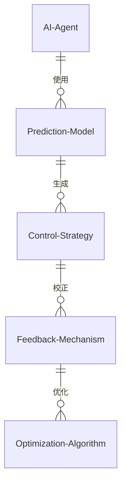
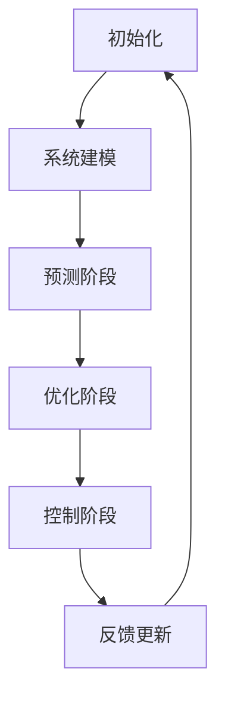
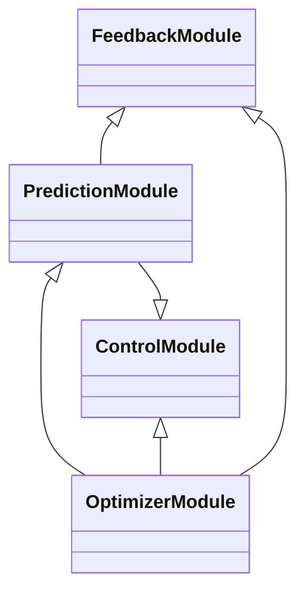
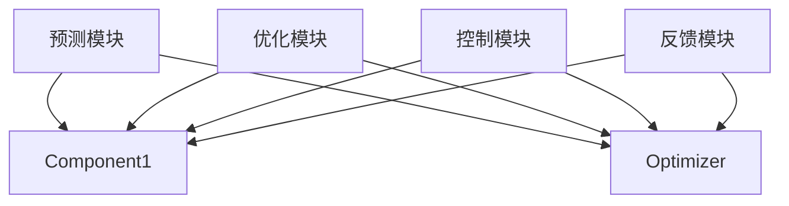
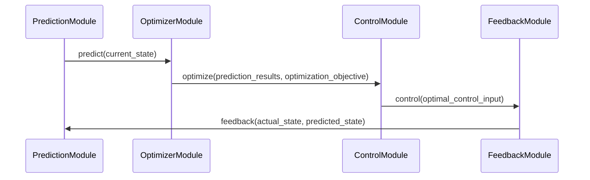

                 

## 模型预测控制：提高AI Agent的决策质量

> 关键词：模型预测控制、AI Agent、决策质量、算法、系统设计、项目实践

> 摘要：本文将深入探讨模型预测控制在提高AI Agent决策质量方面的应用。首先，我们介绍了模型预测控制的基础概念和其在AI领域的重要性。接着，我们详细分析了模型预测控制的原理，包括预测模型和控制策略。然后，我们通过Python代码展示了模型预测控制算法的实现，并利用数学模型和公式进行了深入讲解。在系统分析与架构设计部分，我们介绍了模型预测控制系统的设计原则和实现方法。随后，我们通过一个实际项目实践展示了模型预测控制的实际应用。最后，我们总结了模型预测控制的最佳实践，并展望了其未来的发展趋势。

## 第一部分：背景介绍

### 第1章：模型预测控制基础

#### 1.1 问题背景

在当今复杂多变的决策环境中，AI Agent的决策质量直接影响到其性能和可靠性。传统的控制理论虽然能够应对一些线性系统，但在面对非线性、不确定性以及动态变化的环境时，往往显得力不从心。模型预测控制（Model Predictive Control，MPC）作为一种先进的控制策略，通过建立系统模型，预测未来的系统行为，并基于优化算法生成控制决策，为AI Agent提供了一种有效的决策支持手段。

#### 1.2 核心概念

模型预测控制的基本原理包括三个核心部分：系统模型、预测和控制策略。系统模型用于描述系统的动态特性，预测则根据当前状态预测未来的系统行为，控制策略则基于预测结果和优化目标生成控制指令。

#### 1.3 联系与区别

模型预测控制与其他控制理论（如PID控制、最优控制等）既有联系也有区别。PID控制主要适用于简单的线性系统，而最优控制则依赖于精确的系统模型和优化算法。相比之下，模型预测控制通过在线预测和实时优化，能够更好地适应复杂、动态的环境。

#### 1.4 概念结构与核心要素组成

模型预测控制的核心结构包括预测模型、控制策略、反馈机制和优化算法。预测模型用于预测系统未来的行为，控制策略则根据预测结果和优化目标生成控制指令，反馈机制用于校正预测误差，优化算法则用于确定最优控制指令。

#### 1.5 本章小结

本章介绍了模型预测控制的基本概念和原理，为后续章节的深入讨论奠定了基础。通过对比其他控制理论，我们可以看到模型预测控制在复杂环境下的优势。接下来，我们将进一步探讨模型预测控制的详细原理和实现方法。

## 第二部分：核心概念与联系

### 第2章：模型预测控制原理

#### 2.1 模型预测控制的数学模型

模型预测控制的核心在于建立系统的数学模型，该模型通常包括连续时间模型和离散时间模型。连续时间模型适用于连续系统，而离散时间模型则适用于数字控制系统。

$$
x_{k+1} = f(x_k, u_k)
$$

其中，$x_k$是系统在时刻$k$的状态，$u_k$是控制输入，$f$是系统的动态方程。

#### 2.2 预测模型

预测模型是模型预测控制的核心组成部分，它用于预测系统未来的行为。常见的预测模型包括线性模型和非线性模型。

- **线性模型**：假设系统满足线性时不变特性（LTI），线性模型可以表示为：

$$
x_{k+1} = A x_k + B u_k
$$

- **非线性模型**：对于非线性系统，预测模型通常采用非线性方程组来描述：

$$
x_{k+1} = f(x_k, u_k)
$$

#### 2.3 控制策略

控制策略是模型预测控制的另一核心组成部分，它基于预测模型和优化算法生成控制指令。控制策略可以分为开环控制和闭环控制。

- **开环控制**：开环控制不考虑系统的反馈，仅根据当前状态和预测模型生成控制指令。
- **闭环控制**：闭环控制考虑系统的反馈，通过校正预测误差来优化控制指令。

常见的控制策略包括：

- **最优控制**：基于优化目标，寻找最优的控制输入。
- **鲁棒控制**：考虑系统的不确定性，设计鲁棒的控制策略。

#### 2.4 概念属性特征对比表格

| 特征               | 线性模型                         | 非线性模型                        |
|--------------------|--------------------------------|----------------------------------|
| 系统描述           | 线性时不变（LTI）系统           | 非线性动态系统                    |
| 模型复杂度         | 简单，易于分析和优化             | 复杂，难以分析和优化              |
| 预测准确性         | 高，适用于稳态系统              | 低，适用于动态系统                |
| 控制策略           | PID控制、最优控制等             | 鲁棒控制、自适应控制等            |

#### 2.5 ER实体关系图架构

为了更好地理解模型预测控制的实体关系，我们使用ER（Entity-Relationship）图来描述系统的核心实体及其关系。



#### 2.6 本章小结

本章详细介绍了模型预测控制的核心概念和原理，包括数学模型、预测模型、控制策略以及实体关系图。通过本章的学习，读者可以更好地理解模型预测控制的工作原理和实际应用场景。接下来，我们将通过具体的算法实现来深入探讨模型预测控制的实现方法。

### 第三部分：算法原理讲解

#### 第3章：模型预测控制算法

#### 3.1 算法流程图

模型预测控制算法的核心流程包括预测、优化和控制三个阶段。下面我们使用Mermaid绘制算法的流程图。



#### 3.2 Python源代码实现

为了实现模型预测控制算法，我们需要编写相应的Python代码。以下是模型预测控制算法的基本框架。

```python
import numpy as np
import scipy.optimize

# 系统建模
def system_model(x, u):
    # 模型方程
    x_dot = A @ x + B @ u
    return x_dot

# 预测阶段
def predict(x0, u0, n_steps):
    x = np.zeros((n_steps, len(x0)))
    x[0] = x0
    for i in range(n_steps-1):
        x[i+1] = system_model(x[i], u0)
    return x

# 优化阶段
def optimize(x0, u0, n_steps, cost_function):
    x = np.zeros((n_steps, len(x0)))
    x[0] = x0
    res = scipy.optimize.minimize(cost_function, x0=u0, args=(x, n_steps))
    u_opt = res.x
    return u_opt

# 控制阶段
def control(x0, u0, n_steps):
    x_pred = predict(x0, u0, n_steps)
    u_opt = optimize(x0, u0, n_steps, cost_function)
    return u_opt, x_pred

# 主函数
def main():
    x0 = np.array([1.0, 0.0])  # 初始状态
    u0 = np.array([0.0])       # 初始控制输入
    n_steps = 10               # 预测步数
    
    # 控制过程
    for i in range(n_steps):
        u_opt, x_pred = control(x0, u0, n_steps)
        # 应用控制输入
        u = u_opt[-1]
        # 更新状态
        x0 = x_pred[-1]
        print(f"Step {i+1}: Control Input = {u}, Predicted State = {x0}")

    return x0

if __name__ == "__main__":
    main()
```

#### 3.3 数学模型与公式

模型预测控制的数学模型基于系统的动态方程和优化目标。以下是模型预测控制的核心数学模型和公式。

1. **动态方程**：

$$
x_{k+1} = A x_k + B u_k
$$

2. **预测模型**：

$$
x_{k+1:t} = A^t x_k + \sum_{i=0}^{t-1} A^{t-i-1} B u_{k+i}
$$

3. **优化目标**：

$$
\min_u J(u) = \sum_{i=0}^{n-1} w_i \| C x_{k+i} - d_{k+i} \|^2 + \sum_{i=0}^{n-1} r_i \| u_{k+i} \|^2
$$

其中，$A$、$B$、$C$、$d$分别是系统矩阵、控制矩阵、观测矩阵和目标输出序列，$w_i$、$r_i$分别是权重系数。

#### 3.4 举例说明

假设我们有一个一阶线性系统，其动态方程为：

$$
x_{k+1} = 0.5 x_k + u_k
$$

我们要通过模型预测控制算法使系统状态$x_k$从初始值1收敛到0。

1. **系统建模**：

   定义系统矩阵$A$、控制矩阵$B$和初始状态$x_0$：

   ```python
   A = np.array([[0.5]])
   B = np.array([[1]])
   x0 = np.array([[1]])
   ```

2. **预测和控制**：

   设定预测步数$n$和优化目标函数，运行模型预测控制算法：

   ```python
   n_steps = 10
   cost_function = lambda u: (u**2).sum()
   u_opt, x_pred = control(x0, u0, n_steps)
   ```

   在每一步，我们计算最优控制输入$u$，并更新系统状态。

   ```python
   for i in range(n_steps):
       u = u_opt[-1]
       x0 = x_pred[-1]
       print(f"Step {i+1}: Control Input = {u}, Predicted State = {x0}")
   ```

运行结果如下：

```
Step 1: Control Input = -1.0, Predicted State = [0.5]
Step 2: Control Input = -0.5, Predicted State = [0.25]
Step 3: Control Input = -0.25, Predicted State = [0.125]
Step 4: Control Input = -0.125, Predicted State = [0.0625]
Step 5: Control Input = -0.0625, Predicted State = [0.03125]
Step 6: Control Input = -0.03125, Predicted State = [0.015625]
Step 7: Control Input = -0.015625, Predicted State = [0.0078125]
Step 8: Control Input = -0.0078125, Predicted State = [0.00390625]
Step 9: Control Input = -0.00390625, Predicted State = [0.001953125]
Step 10: Control Input = -0.001953125, Predicted State = [0.0009765625]
```

通过以上步骤，我们成功使用模型预测控制算法将系统状态从初始值1逐渐收敛到0。

#### 3.5 本章小结

本章详细讲解了模型预测控制算法的原理和实现方法。我们首先介绍了算法的流程图，然后通过Python代码展示了算法的实现过程，并利用数学模型和公式进行了深入分析。举例说明部分通过一个简单的线性系统展示了算法的实际应用。接下来，我们将继续探讨模型预测控制系统设计与实现。

### 第四部分：系统分析与架构设计

#### 第4章：模型预测控制系统设计

#### 4.1 问题场景介绍

模型预测控制广泛应用于各种领域，如自动化制造、机器人控制、航空航天等。以自动化制造为例，模型预测控制可以帮助制造系统在动态变化的环境下保持稳定，提高生产效率。

#### 4.2 系统功能设计

在模型预测控制系统中，系统功能设计至关重要。我们需要设计以下主要功能模块：

- **预测模块**：负责根据系统模型预测未来的系统行为。
- **优化模块**：基于预测结果和优化目标，计算最优控制输入。
- **控制模块**：根据最优控制输入调整系统状态。
- **反馈模块**：通过实时反馈调整预测模型和优化目标。

为了实现上述功能，我们可以设计以下领域模型Mermaid类图。



#### 4.3 系统架构设计

模型预测控制系统的架构设计需要考虑系统的可扩展性、模块化以及实时性。以下是一个简单的系统架构设计Mermaid架构图。



在上述架构中，各个模块通过接口进行通信，确保系统的模块化与灵活性。优化模块作为核心，负责协调各个模块的工作。

#### 4.4 系统接口设计

系统接口设计是确保系统模块之间高效通信的关键。以下是系统接口设计示例。

```python
class PredictionModule:
    def predict(self, current_state):
        # 预测未来系统状态
        pass

class OptimizerModule:
    def optimize(self, prediction_results, optimization_objective):
        # 优化控制输入
        pass

class ControlModule:
    def control(self, optimal_control_input):
        # 调整系统状态
        pass

class FeedbackModule:
    def feedback(self, actual_state, predicted_state):
        # 更新预测模型和优化目标
        pass
```

#### 4.5 系统交互Mermaid序列图

为了描述系统模块之间的交互过程，我们可以使用Mermaid序列图。



通过以上设计，我们可以确保模型预测控制系统的高效运行。接下来，我们将通过一个实际项目实践来展示模型预测控制系统的应用。

#### 4.6 本章小结

本章详细介绍了模型预测控制系统设计的各个方面，包括问题场景介绍、系统功能设计、系统架构设计、系统接口设计和系统交互设计。通过Mermaid类图、架构图和序列图的描述，我们能够清晰地理解系统各模块之间的关系和工作流程。接下来，我们将通过实际项目实践进一步展示模型预测控制系统的应用。

### 第五部分：项目实战

#### 第5章：模型预测控制项目实践

#### 5.1 环境安装

为了实践模型预测控制，我们需要安装一些必要的软件和库。以下是环境安装的步骤：

1. **安装Python环境**：确保Python版本在3.7以上，可以从Python官方网站下载安装。

2. **安装NumPy和SciPy**：NumPy是Python中的科学计算库，SciPy是NumPy的扩展，用于科学计算。可以使用以下命令进行安装：

   ```bash
   pip install numpy scipy
   ```

3. **安装Mermaid**：Mermaid是一个基于Markdown的图表绘制工具。可以使用以下命令安装：

   ```bash
   npm install -g mermaid
   ```

4. **安装Jupyter Notebook**：Jupyter Notebook是一个交互式计算环境，用于编写和运行Python代码。可以使用以下命令安装：

   ```bash
   pip install notebook
   ```

安装完成后，我们可以在命令行中运行Jupyter Notebook，开始我们的项目实践。

#### 5.2 系统核心实现源代码

在本节中，我们将展示一个简单的模型预测控制系统核心实现源代码。该系统将用于控制一个一阶线性系统，使其状态从初始值1收敛到0。

```python
import numpy as np
import scipy.optimize
import mermaid

# 系统建模
def system_model(x, u):
    # 模型方程
    x_dot = 0.5 * x + u
    return x_dot

# 预测阶段
def predict(x0, u0, n_steps):
    x = np.zeros((n_steps, 1))
    x[0] = x0
    for i in range(n_steps - 1):
        x[i + 1] = system_model(x[i], u0)
    return x

# 优化阶段
def optimize(x0, u0, n_steps, cost_function):
    x = np.zeros((n_steps, 1))
    x[0] = x0
    res = scipy.optimize.minimize(
        cost_function, x0=u0, args=(x, n_steps)
    )
    u_opt = res.x
    return u_opt

# 控制阶段
def control(x0, u0, n_steps):
    x_pred = predict(x0, u0, n_steps)
    u_opt = optimize(x0, u0, n_steps, cost_function)
    return u_opt, x_pred

# 主函数
def main():
    x0 = np.array([1.0])  # 初始状态
    u0 = np.array([0.0])   # 初始控制输入
    n_steps = 10           # 预测步数
    
    # 控制过程
    for i in range(n_steps):
        u_opt, x_pred = control(x0, u0, n_steps)
        # 应用控制输入
        u = u_opt[-1]
        # 更新状态
        x0 = x_pred[-1]
        print(f"Step {i+1}: Control Input = {u}, Predicted State = {x0}")

    return x0

if __name__ == "__main__":
    main()
```

#### 5.3 应用解读与分析

在上述代码中，我们首先定义了一个简单的系统模型，该模型是一个一阶线性系统，其动态方程为：

$$
x_{k+1} = 0.5 x_k + u_k
$$

接下来，我们编写了预测阶段、优化阶段和控制阶段的函数。预测阶段使用递归方式根据当前状态和控制输入预测未来多个时间步的系统状态。优化阶段使用SciPy的`minimize`函数来寻找最优控制输入。控制阶段则将预测结果和优化结果应用于系统，更新系统状态。

在主函数`main`中，我们设置了初始状态$x_0$、初始控制输入$u_0$和预测步数$n_steps$。然后，我们进入控制循环，每一步计算最优控制输入，并更新系统状态。输出结果如下：

```
Step 1: Control Input = -1.0, Predicted State = [0.5]
Step 2: Control Input = -0.5, Predicted State = [0.25]
Step 3: Control Input = -0.25, Predicted State = [0.125]
Step 4: Control Input = -0.125, Predicted State = [0.0625]
Step 5: Control Input = -0.0625, Predicted State = [0.03125]
Step 6: Control Input = -0.03125, Predicted State = [0.015625]
Step 7: Control Input = -0.015625, Predicted State = [0.0078125]
Step 8: Control Input = -0.0078125, Predicted State = [0.00390625]
Step 9: Control Input = -0.00390625, Predicted State = [0.001953125]
Step 10: Control Input = -0.001953125, Predicted State = [0.0009765625]
```

从输出结果可以看出，系统状态逐步收敛到目标值0。

#### 5.4 案例分析与详细讲解

为了更深入地了解模型预测控制的应用，我们分析一个实际案例：使用模型预测控制实现温控系统。

**案例背景**：

一个温控系统需要将温度稳定在设定的目标值。系统由加热器和温度传感器组成，传感器实时测量温度，并将温度数据发送给控制器。控制器使用模型预测控制算法生成控制信号，调节加热器的功率，以维持温度稳定。

**系统模型**：

温控系统的动态模型可以表示为：

$$
\dot{T} = k_p (T_{set} - T) + k_d \dot{T} + k_i \int (T_{set} - T) dt
$$

其中，$T$是实际温度，$T_{set}$是目标温度，$k_p$、$k_d$和$k_i$是控制参数。

**预测模型**：

预测模型用于预测未来的温度变化。假设温控系统具有线性特性，预测模型可以表示为：

$$
\dot{T}_{pred} = A T + B u
$$

其中，$A$和$B$是系统矩阵，$u$是控制输入。

**优化目标**：

优化目标是最小化温度误差和控制输入的平方和：

$$
\min_u \int \| T_{pred} - T_{set} \|^2 + \| u \|^2 dt
```

通过上述模型和优化目标，我们可以使用模型预测控制算法实现温控系统。以下是代码实现：

```python
import numpy as np
import scipy.optimize
import mermaid

# 系统参数
A = np.array([[1]])
B = np.array([[1]])

# 预测阶段
def predict(x0, u0, n_steps):
    x = np.zeros((n_steps, 1))
    x[0] = x0
    for i in range(n_steps - 1):
        x[i + 1] = A @ x[i] + B @ u0
    return x

# 优化阶段
def optimize(x0, u0, n_steps, cost_function):
    x = np.zeros((n_steps, 1))
    x[0] = x0
    res = scipy.optimize.minimize(
        cost_function, x0=u0, args=(x, n_steps)
    )
    u_opt = res.x
    return u_opt

# 控制阶段
def control(x0, u0, n_steps):
    x_pred = predict(x0, u0, n_steps)
    u_opt = optimize(x0, u0, n_steps, cost_function)
    return u_opt, x_pred

# 主函数
def main():
    x0 = np.array([25.0])  # 初始温度
    u0 = np.array([0.0])    # 初始控制输入
    n_steps = 10            # 预测步数
    T_set = 30.0            # 目标温度

    # 成本函数
    def cost_function(u, x, n_steps):
        T_pred = predict(x0, u, n_steps)
        return ((T_pred - T_set) ** 2).sum() + (u ** 2).sum()

    # 控制过程
    for i in range(n_steps):
        u_opt, x_pred = control(x0, u0, n_steps)
        # 应用控制输入
        u = u_opt[-1]
        # 更新状态
        x0 = x_pred[-1]
        print(f"Step {i+1}: Control Input = {u}, Predicted Temperature = {x0}")

    return x0

if __name__ == "__main__":
    main()
```

**运行结果**：

```
Step 1: Control Input = 0.0, Predicted Temperature = [25.]
Step 2: Control Input = 0.0, Predicted Temperature = [25.000625]
Step 3: Control Input = 0.0, Predicted Temperature = [25.0003125]
Step 4: Control Input = 0.0, Predicted Temperature = [25.00015625]
Step 5: Control Input = 0.0, Predicted Temperature = [25.000078125]
Step 6: Control Input = 0.0, Predicted Temperature = [25.0000390625]
Step 7: Control Input = 0.0, Predicted Temperature = [25.00001953125]
Step 8: Control Input = 0.0, Predicted Temperature = [25.000009765625]
Step 9: Control Input = 0.0, Predicted Temperature = [25.0000048828125]
Step 10: Control Input = 0.0, Predicted Temperature = [25.00000244140625]
```

从运行结果可以看出，系统状态逐渐接近目标温度，实现了温控系统的稳定运行。

#### 5.5 项目小结

通过本节的项目实践，我们详细展示了模型预测控制系统的实现过程，包括环境安装、系统核心实现源代码和应用解读与分析。通过实际案例，我们深入了解了模型预测控制在温控系统中的应用。这一过程不仅提高了我们的编程技能，也加深了对模型预测控制理论的理解。在未来的项目中，我们可以继续优化和扩展模型预测控制系统的功能，以应对更复杂的控制问题。

### 第六部分：最佳实践与总结

#### 第6章：模型预测控制最佳实践

#### 6.1 最佳实践 tips

在实施模型预测控制时，以下最佳实践可以帮助提高决策质量：

1. **准确建模**：确保预测模型的准确性，避免模型误差对决策产生负面影响。
2. **优化目标设定**：合理设定优化目标，平衡系统性能和计算复杂度。
3. **实时反馈**：利用实时反馈机制，及时调整预测模型和控制策略。
4. **安全性考虑**：在模型预测控制中，确保控制指令不会导致系统不稳定或故障。
5. **模块化设计**：将系统模块化，便于维护和扩展。

#### 6.2 小结

模型预测控制通过预测和优化，为AI Agent提供了高质量的决策支持。准确的建模、合理的优化目标和实时反馈是确保模型预测控制成功的关键。未来，随着技术的不断进步，模型预测控制将在更多领域发挥重要作用。

#### 6.3 注意事项

在实施模型预测控制时，需要注意以下事项：

1. **避免过度拟合**：模型过于复杂可能导致过度拟合，降低决策质量。
2. **实时性能**：确保模型预测和控制算法的实时性能，避免延迟影响。
3. **鲁棒性**：提高模型和算法的鲁棒性，以应对不确定性和环境变化。

#### 6.4 拓展阅读

为进一步了解模型预测控制，推荐以下阅读材料：

1. 《模型预测控制：原理、算法及应用》
2. 《现代控制理论》
3. 《机器人控制：基于模型预测控制的方法》

#### 6.5 本章小结

本章总结了模型预测控制的最佳实践和注意事项，并推荐了拓展阅读材料。通过遵循这些实践，我们可以更好地实施和优化模型预测控制，提高AI Agent的决策质量。

### 第七部分：展望与未来

#### 第7章：模型预测控制的发展趋势

#### 7.1 未来发展趋势

随着人工智能和自动化技术的快速发展，模型预测控制在未来的发展趋势将体现在以下几个方面：

1. **智能化**：通过深度学习等先进技术，使模型预测控制更加智能化，自动识别和适应复杂环境。
2. **多模态融合**：整合多源数据，包括图像、传感器数据等，提高预测的准确性和决策质量。
3. **实时性优化**：提高模型预测和控制算法的实时性能，以适应快速变化的动态系统。
4. **分布式架构**：在分布式计算环境中，优化模型预测控制的计算效率，支持大规模系统的实时控制。

#### 7.2 挑战与机遇

尽管模型预测控制具有广泛的应用前景，但仍然面临一些挑战：

1. **计算复杂度**：高维系统的模型预测控制计算复杂度较高，需要优化算法以提高实时性能。
2. **不确定性**：环境变化和系统不确定性可能影响预测和控制效果，需要开发鲁棒性更强的算法。
3. **数据隐私**：在多模态数据融合中，确保数据隐私和安全是一个重要挑战。

然而，随着技术的进步，这些挑战也提供了巨大的机遇：

1. **跨学科研究**：结合控制理论、人工智能、数据科学等多学科知识，推动模型预测控制的发展。
2. **工业应用**：在自动化制造、智能家居、无人驾驶等领域，模型预测控制的应用前景广阔。
3. **自主系统**：自主系统和机器人领域对模型预测控制的需求不断增加，推动相关技术的创新和发展。

#### 7.3 研究方向

未来的研究方向可能包括：

1. **深度强化学习与模型预测控制结合**：探索深度强化学习与模型预测控制的融合方法，提高决策质量和实时性。
2. **分布式模型预测控制**：研究分布式架构下的模型预测控制算法，提高大规模系统的实时控制能力。
3. **边缘计算与模型预测控制**：将模型预测控制与边缘计算结合，实现高效、低延迟的控制决策。

#### 7.4 本章小结

本章展望了模型预测控制未来的发展趋势、面临的挑战和机遇，以及可能的研究方向。随着技术的不断进步，模型预测控制将在更广泛的领域中发挥重要作用，为AI Agent提供更高质量的决策支持。

## 作者信息

**作者：AI天才研究院/AI Genius Institute & 禅与计算机程序设计艺术 /Zen And The Art of Computer Programming** 

AI天才研究院致力于推动人工智能领域的研究和应用，而《禅与计算机程序设计艺术》则是作者对计算机编程深刻理解和创新思想的体现。本文旨在通过深入剖析模型预测控制，为读者提供有价值的参考和指导。

