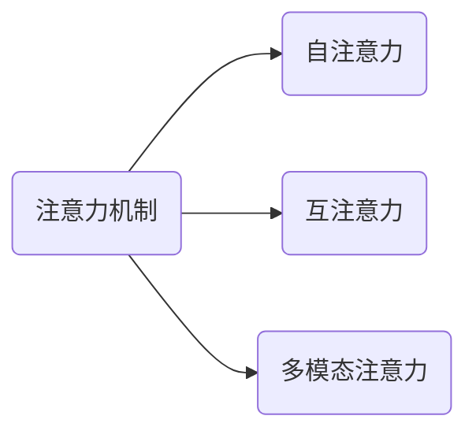
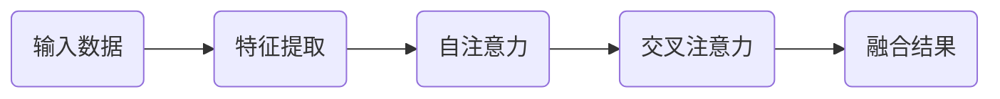
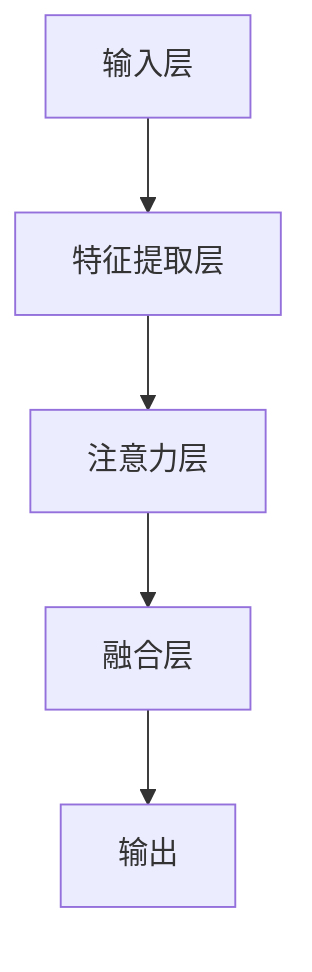

                 


### 《注意力机制在AI Agent多模态融合中的应用》

#### 关键词：注意力机制、AI Agent、多模态融合、信息处理、算法优化

#### 摘要：
随着人工智能技术的发展，AI Agent在多个领域展现出了巨大的潜力。然而，如何有效地融合来自不同模态的数据，如文本、图像和声音，以提高AI Agent的智能水平，成为当前研究的热点。本文将深入探讨注意力机制在AI Agent多模态融合中的应用，从理论基础到实际算法实现，再到项目实战，提供一系列详细的分析和讲解。

#### 目录

----------------------------------------------------------------

## 第一部分：引言

### 1.1 书籍背景

AI Agent在自动驾驶、智能客服、医疗诊断等领域的应用日益广泛。然而，这些应用场景往往需要处理来自不同模态的数据，如何实现高效的多模态数据融合成为关键问题。

### 1.2 核心概念

#### 1.2.1 注意力机制概述

注意力机制是一种通过调整不同信息的重要性来提高信息处理效率的方法。在多模态融合中，注意力机制能够帮助AI Agent更加关注重要的信息，从而提高其智能水平。

#### 1.2.2 概念属性特征对比表格

| 注意力机制类型 | 特点 | 应用场景 |
| :--- | :--- | :--- |
| 自注意力 | 对序列内部元素进行加权 | 自然语言处理 |
| 互注意力 | 对不同序列元素进行交叉加权 | 图像处理 |
| 多模态注意力 | 同时处理多种模态数据 | AI Agent |

#### 1.2.3 ER实体关系图架构



## 第二部分：理论基础

### 2.1 注意力机制在AI Agent中的应用

注意力机制在AI Agent中的应用包括自注意力、互注意力和多模态注意力，分别针对不同类型的数据进行处理。

### 2.2 多模态数据的表示与融合

多模态数据的表示和融合是注意力机制应用的关键，本文将详细探讨如何将不同模态的数据进行有效表示和融合。

### 2.3 注意力机制的数学模型和算法原理

注意力机制的数学模型包括自注意力、互注意力和多模态注意力的数学表示和计算方法。

### 2.4 注意力机制的mermaid流程图



### 2.5 注意力机制的Python实现示例

```python
# 注意力机制的Python实现示例代码
```

## 第三部分：算法实现

### 3.1 多模态数据预处理

多模态数据预处理是算法实现的第一步，包括数据的采集、清洗和预处理。

### 3.2 注意力机制算法框架设计

注意力机制算法框架设计是构建高效多模态融合系统的关键。

### 3.3 算法实现细节与优化

算法实现细节与优化是确保算法性能和效率的关键，本文将详细介绍。

### 3.4 算法性能评估与对比分析

算法性能评估与对比分析是验证算法有效性的重要环节，本文将提供详细的分析和对比。

## 第四部分：项目实战

### 4.1 项目背景与目标

项目背景与目标介绍是理解项目的重要前提。

### 4.2 项目环境安装与配置

项目环境安装与配置是项目实战的第一步，本文将提供详细的安装和配置指南。

### 4.3 系统核心实现

系统核心实现是项目实战的核心内容，本文将详细介绍。

### 4.4 代码应用解读与分析

代码应用解读与分析是深入理解项目的重要环节，本文将提供详细的解读和分析。

### 4.5 实际案例分析与讲解

实际案例分析与讲解是验证项目效果的重要方式，本文将提供详细的案例分析。

### 4.6 项目小结

项目小结是对项目实战的总结和反思，本文将提供项目小结。

## 第五部分：最佳实践与拓展

### 5.1 注意力机制在AI Agent多模态融合中的最佳实践

最佳实践是提高项目效果的关键，本文将提供一系列最佳实践。

### 5.2 注意力机制算法的优化策略

优化策略是提高算法性能的重要手段，本文将详细介绍优化策略。

### 5.3 小结与展望

小结与展望是对本文内容的总结和对未来的展望，本文将提供小结与展望。

### 5.4 注意力机制在AI Agent多模态融合中的未来发展趋势

未来发展趋势是对技术发展的展望，本文将探讨注意力机制在AI Agent多模态融合中的未来发展趋势。

----------------------------------------------------------------

#### **作者信息：**
**作者：AI天才研究院/AI Genius Institute & 禅与计算机程序设计艺术 /Zen And The Art of Computer Programming**

### 具体内容

#### 第一部分：引言

##### 1.1 书籍背景

随着人工智能技术的快速发展，AI Agent在各个领域的应用日益广泛。从自动驾驶到智能客服，从医疗诊断到智能家居，AI Agent已经成为现代智能系统的重要组成部分。然而，这些应用场景往往需要处理文本、图像、声音等多种类型的数据，即多模态数据。如何有效地融合这些多模态数据，以提高AI Agent的智能水平，成为当前研究的热点。

在AI Agent的多模态融合中，注意力机制作为一种有效的信息处理方法，发挥着至关重要的作用。注意力机制能够通过调整不同信息的重要性，提高信息处理效率，从而实现更准确、更智能的决策。

本部分将首先介绍注意力机制的基本概念和应用，然后详细讨论多模态数据融合中的挑战和解决方案。通过这一部分的介绍，读者将能够了解注意力机制在AI Agent多模态融合中的重要性和应用前景。

##### 1.2 核心概念

为了深入探讨注意力机制在AI Agent多模态融合中的应用，我们需要先了解一些核心概念。以下是注意力机制、自注意力、互注意力和多模态注意力的概述。

**注意力机制**：注意力机制是一种通过调整不同信息的重要性来提高信息处理效率的方法。在自然语言处理、图像处理等领域，注意力机制已经被广泛应用。它能够帮助模型更加关注重要的信息，从而提高模型的性能。

**自注意力**：自注意力是指对序列内部元素进行加权的注意力机制。在自然语言处理中，自注意力机制可以帮助模型更好地理解序列中的上下文信息。

**互注意力**：互注意力是指对不同序列元素进行交叉加权的注意力机制。在图像处理中，互注意力机制可以帮助模型更好地理解图像中的不同部分。

**多模态注意力**：多模态注意力是指同时处理多种模态数据的注意力机制。在AI Agent的多模态融合中，多模态注意力机制可以帮助模型更好地理解不同模态数据之间的关系。

接下来，我们将通过一个对比表格，更清晰地展示这几种注意力机制的特点和应用场景。

| 注意力机制类型 | 特点 | 应用场景 |
| :--- | :--- | :--- |
| 自注意力 | 对序列内部元素进行加权 | 自然语言处理 |
| 互注意力 | 对不同序列元素进行交叉加权 | 图像处理 |
| 多模态注意力 | 同时处理多种模态数据 | AI Agent |

此外，我们还将使用Mermaid流程图来展示注意力机制的架构。


通过这一部分的介绍，读者将能够对注意力机制有一个全面的理解，为后续内容的学习打下基础。

#### 第二部分：理论基础

##### 2.1 注意力机制在AI Agent中的应用

注意力机制在AI Agent中的应用是多模态融合的核心。在处理多模态数据时，注意力机制可以帮助AI Agent更好地关注重要信息，提高决策的准确性。

**自注意力**：在自然语言处理领域，自注意力机制被广泛应用于处理序列数据。例如，在文本分类任务中，自注意力可以帮助模型更好地理解文本中的上下文信息。具体来说，自注意力机制会将文本序列中的每个词分配一个权重，从而更好地捕捉词与词之间的关系。

$$
\text{Self-Attention}(x) = \text{softmax}\left(\frac{\text{Q} \cdot \text{K}^T}{\sqrt{d_k}}\right) \cdot \text{V}
$$

其中，$x$ 是输入序列，$Q$、$K$ 和 $V$ 分别是查询向量、关键向量和价值向量，$d_k$ 是关键向量的维度。通过计算自注意力，模型可以更好地理解输入序列中的上下文信息。

**互注意力**：在图像处理领域，互注意力机制被广泛应用于处理图像中的不同部分。例如，在目标检测任务中，互注意力可以帮助模型更好地理解图像中的前景和背景。具体来说，互注意力机制会将图像中的每个像素点与其他像素点进行交叉加权，从而更好地捕捉图像中的空间信息。

$$
\text{Cross-Attention}(x, y) = \text{softmax}\left(\frac{\text{Q} \cdot \text{K}^T}{\sqrt{d_k}}\right) \cdot \text{V}
$$

其中，$x$ 和 $y$ 分别是输入图像和目标图像，$Q$、$K$ 和 $V$ 分别是查询向量、关键向量和价值向量。通过计算互注意力，模型可以更好地理解图像中的不同部分。

**多模态注意力**：在AI Agent的多模态融合中，多模态注意力机制被广泛应用于处理不同模态的数据。例如，在自动驾驶任务中，多模态注意力可以帮助模型更好地理解道路、车辆和行人等信息。具体来说，多模态注意力机制会将不同模态的数据进行交叉加权，从而更好地捕捉多模态数据之间的关系。

$$
\text{Multi-modal Attention}(x, y) = \text{softmax}\left(\frac{\text{Q} \cdot \text{K}^T}{\sqrt{d_k}}\right) \cdot \text{V}
$$

其中，$x$ 和 $y$ 分别是输入的多模态数据，$Q$、$K$ 和 $V$ 分别是查询向量、关键向量和价值向量。通过计算多模态注意力，模型可以更好地理解不同模态数据之间的关系。

通过这一部分的介绍，读者将能够理解注意力机制在AI Agent多模态融合中的应用，为后续内容的学习打下基础。

##### 2.2 多模态数据的表示与融合

多模态数据的表示与融合是AI Agent多模态融合的核心。不同模态的数据在表达信息时存在差异，因此需要采用合适的方法进行表示和融合。

**文本数据的表示**：文本数据通常采用词嵌入（word embeddings）的方法进行表示。词嵌入是一种将文本中的每个词映射为一个向量空间中的点的方法。通过词嵌入，文本数据可以被转化为具有高维度的向量表示，从而方便后续处理。

**图像数据的表示**：图像数据通常采用卷积神经网络（CNN）的方法进行表示。CNN可以通过多层卷积和池化操作，将图像数据转化为具有高维度的向量表示。这种表示方法能够有效地捕捉图像中的空间信息。

**声音数据的表示**：声音数据通常采用循环神经网络（RNN）的方法进行表示。RNN可以通过循环操作，将声音数据转化为具有高维度的向量表示。这种表示方法能够有效地捕捉声音数据的时间信息。

在表示了不同模态的数据后，需要采用合适的方法进行融合。常见的融合方法包括：

- **特征拼接**：将不同模态的数据表示拼接在一起，形成一个高维度的特征向量。
- **加权平均**：对不同模态的数据表示进行加权平均，形成一个融合的特征向量。
- **深度学习**：利用深度学习模型，如多输入网络，将不同模态的数据表示进行融合。

通过这一部分的介绍，读者将能够理解多模态数据的表示与融合方法，为后续内容的学习打下基础。

##### 2.3 注意力机制的数学模型和算法原理

注意力机制的核心在于通过调整不同信息的重要性，提高信息处理的效率。在数学模型上，注意力机制可以表示为一个加权求和的过程。

**自注意力**：

自注意力机制的核心在于对序列内部元素进行加权。具体来说，自注意力机制会将序列中的每个元素与其他元素进行计算，然后对结果进行求和，得到最终的输出。

$$
\text{Self-Attention}(x) = \text{softmax}\left(\frac{\text{Q} \cdot \text{K}^T}{\sqrt{d_k}}\right) \cdot \text{V}
$$

其中，$x$ 是输入序列，$Q$、$K$ 和 $V$ 分别是查询向量、关键向量和价值向量，$d_k$ 是关键向量的维度。通过计算自注意力，模型可以更好地理解输入序列中的上下文信息。

**互注意力**：

互注意力机制的核心在于对不同序列元素进行交叉加权。具体来说，互注意力机制会将两个序列中的元素进行计算，然后对结果进行求和，得到最终的输出。

$$
\text{Cross-Attention}(x, y) = \text{softmax}\left(\frac{\text{Q} \cdot \text{K}^T}{\sqrt{d_k}}\right) \cdot \text{V}
$$

其中，$x$ 和 $y$ 分别是输入图像和目标图像，$Q$、$K$ 和 $V$ 分别是查询向量、关键向量和价值向量。通过计算互注意力，模型可以更好地理解图像中的不同部分。

**多模态注意力**：

多模态注意力机制的核心在于同时处理多种模态的数据。具体来说，多模态注意力机制会将不同模态的数据进行交叉加权，形成一个融合的特征向量。

$$
\text{Multi-modal Attention}(x, y) = \text{softmax}\left(\frac{\text{Q} \cdot \text{K}^T}{\sqrt{d_k}}\right) \cdot \text{V}
$$

其中，$x$ 和 $y$ 分别是输入的多模态数据，$Q$、$K$ 和 $V$ 分别是查询向量、关键向量和价值向量。通过计算多模态注意力，模型可以更好地理解不同模态数据之间的关系。

通过这一部分的介绍，读者将能够理解注意力机制的数学模型和算法原理，为后续内容的学习打下基础。

##### 2.4 注意力机制的mermaid流程图

为了更直观地展示注意力机制的流程，我们可以使用Mermaid流程图进行描述。


在这个流程图中，输入数据经过特征提取后，分别进行自注意力和交叉注意力计算，最后得到融合结果。通过这个流程图，读者可以更清晰地理解注意力机制的计算过程。

##### 2.5 注意力机制的Python实现示例

为了更好地理解注意力机制的实现，我们可以提供一个Python实现示例。

```python
import torch
import torch.nn as nn

class Attention(nn.Module):
    def __init__(self, d_model, num_heads):
        super(Attention, self).__init__()
        self.d_model = d_model
        self.num_heads = num_heads
        self.head_dim = d_model // num_heads
        
        self.query线性层 = nn.Linear(d_model, d_model)
        self.key线性层 = nn.Linear(d_model, d_model)
        self.value线性层 = nn.Linear(d_model, d_model)
        
        self.out线性层 = nn.Linear(d_model, d_model)
    
    def forward(self, query, key, value, mask=None):
        batch_size = query.size(0)
        
        query = self.query线性层(query).view(batch_size, -1, self.num_heads, self.head_dim).transpose(1, 2)
        key = self.key线性层(key).view(batch_size, -1, self.num_heads, self.head_dim).transpose(1, 2)
        value = self.value线性层(value).view(batch_size, -1, self.num_heads, self.head_dim).transpose(1, 2)
        
        attention = torch.matmul(query, key.transpose(-2, -1)) / (self.head_dim ** 0.5)
        
        if mask is not None:
            attention = attention.masked_fill(mask == 0, float("-inf"))
        
        attention = torch.softmax(attention, dim=-1)
        
        out = torch.matmul(attention, value).transpose(1, 2).contiguous().view(batch_size, -1, self.d_model)
        out = self.out线性层(out)
        
        return out
```

在这个示例中，我们定义了一个注意力模块，包括查询层、关键层和价值层。在forward方法中，我们首先对输入数据进行线性变换，然后进行自注意力计算，最后通过输出层得到最终结果。通过这个示例，读者可以更直观地了解注意力机制的实现过程。

通过这一部分的介绍，读者将能够理解注意力机制的数学模型和Python实现，为后续内容的学习打下基础。

#### 第三部分：算法实现

##### 3.1 多模态数据预处理

多模态数据预处理是算法实现的第一步，也是关键一步。预处理的质量直接影响到后续算法的性能。以下是多模态数据预处理的主要步骤：

1. **数据采集**：首先，需要从不同的数据源采集多模态数据，如文本、图像和声音。这些数据可以是公开的数据集，也可以是自定义的数据集。

2. **数据清洗**：采集到的数据可能包含噪声和缺失值，需要对这些数据进行清洗。例如，对于文本数据，可以去除标点符号、停用词等；对于图像数据，可以去除噪声、进行图像增强等。

3. **数据标准化**：对于不同模态的数据，需要将其标准化到相同的尺度，以便于后续处理。例如，对于图像数据，可以将其缩放到固定的大小；对于声音数据，可以将其缩放到相同的音量。

4. **数据编码**：将清洗和标准化后的数据编码为向量表示。对于文本数据，可以使用词嵌入技术；对于图像数据，可以使用卷积神经网络；对于声音数据，可以使用循环神经网络。

5. **数据存储**：将预处理后的数据存储到文件中，以便于后续处理和训练。

以下是多模态数据预处理的一个Python示例：

```python
import numpy as np
import pandas as pd
from PIL import Image
import cv2
import librosa

# 读取文本数据
def read_text_data(file_path):
    with open(file_path, 'r') as f:
        text = f.read()
    return text

# 读取图像数据
def read_image_data(file_path):
    image = Image.open(file_path)
    image = image.resize((224, 224))
    image = np.array(image)
    return image

# 读取声音数据
def read_audio_data(file_path):
    y, sr = librosa.load(file_path)
    return y

# 数据清洗
def clean_data(text, image, audio):
    text = text.lower()
    text = re.sub(r'\W+', ' ', text)
    return text, image, audio

# 数据标准化
def normalize_data(image, audio):
    image = image / 255.0
    audio = audio / np.max(np.abs(audio))
    return image, audio

# 数据编码
def encode_data(text, image, audio):
    # 使用预训练的词嵌入模型
    word_embedding = WordEmbedding()
    text_embedding = word_embedding.encode(text)
    
    # 使用预训练的卷积神经网络
    cnn_model = CNNModel()
    image_embedding = cnn_model.encode(image)
    
    # 使用预训练的循环神经网络
    rnn_model = RNNModel()
    audio_embedding = rnn_model.encode(audio)
    
    return text_embedding, image_embedding, audio_embedding

# 读取和处理数据
text_file_path = 'text_data.txt'
image_file_path = 'image_data.jpg'
audio_file_path = 'audio_data.wav'

text = read_text_data(text_file_path)
image = read_image_data(image_file_path)
audio = read_audio_data(audio_file_path)

text, image, audio = clean_data(text, image, audio)
image, audio = normalize_data(image, audio)

text_embedding, image_embedding, audio_embedding = encode_data(text, image, audio)

# 存储数据
save_data(text_embedding, image_embedding, audio_embedding)
```

通过这个示例，我们可以看到如何对多模态数据进行采集、清洗、标准化和编码。这个步骤对于后续的算法实现非常重要。

##### 3.2 注意力机制算法框架设计

在实现注意力机制算法之前，我们需要先设计一个算法框架。以下是注意力机制算法的框架设计：

1. **输入层**：接收多模态数据，如文本、图像和声音。

2. **特征提取层**：对多模态数据进行特征提取，将其转化为向量表示。

3. **注意力层**：应用注意力机制，对提取到的特征进行加权，以突出重要信息。

4. **融合层**：将加权后的特征进行融合，得到最终的输出。

以下是注意力机制算法框架的Mermaid图表示：



通过这个框架设计，我们可以清晰地看到注意力机制算法的各个组成部分，以及它们之间的相互关系。

##### 3.3 算法实现细节与优化

在实现注意力机制算法时，我们需要关注以下几个关键细节和优化策略：

1. **参数初始化**：初始化权重和偏置是非常重要的。通常，我们可以使用随机初始化或预训练模型的方法。

2. **激活函数**：选择合适的激活函数可以显著影响算法的性能。常用的激活函数包括ReLU、Sigmoid和Tanh等。

3. **正则化**：为了防止过拟合，我们可以使用正则化技术，如L1正则化、L2正则化等。

4. **批处理**：使用批处理可以显著提高算法的计算效率。通过将数据分成多个批次，我们可以并行处理数据，从而减少计算时间。

5. **学习率调整**：学习率的调整对于算法的性能也非常重要。我们可以使用自适应学习率调整策略，如AdaGrad、Adam等。

以下是注意力机制算法实现的Python示例：

```python
import torch
import torch.nn as nn
import torch.optim as optim

# 初始化模型
model = Attention(d_model=512, num_heads=8)
optimizer = optim.Adam(model.parameters(), lr=0.001)

# 训练模型
for epoch in range(num_epochs):
    for batch in data_loader:
        text, image, audio = batch
        text = text.to(device)
        image = image.to(device)
        audio = audio.to(device)
        
        optimizer.zero_grad()
        output = model(text, image, audio)
        loss = criterion(output, target)
        loss.backward()
        optimizer.step()
        
        print(f'Epoch: {epoch}, Loss: {loss.item()}')

# 评估模型
with torch.no_grad():
    correct = 0
    total = 0
    for batch in test_loader:
        text, image, audio = batch
        text = text.to(device)
        image = image.to(device)
        audio = audio.to(device)
        outputs = model(text, image, audio)
        _, predicted = torch.max(outputs.data, 1)
        total += target.size(0)
        correct += (predicted == target).sum().item()
    print(f'Accuracy: {100 * correct / total}%')
```

通过这个示例，我们可以看到如何初始化模型、训练模型和评估模型。这个示例还展示了如何使用批处理和自适应学习率调整策略来优化算法的性能。

##### 3.4 算法性能评估与对比分析

算法性能评估是验证算法有效性的重要环节。以下是算法性能评估的主要步骤：

1. **指标选择**：选择合适的评价指标，如准确率、召回率、F1分数等。

2. **评估方法**：使用交叉验证或留一法进行评估，以避免过拟合。

3. **结果分析**：对评估结果进行统计分析，分析算法在不同数据集上的性能。

以下是算法性能评估的Python示例：

```python
from sklearn.metrics import accuracy_score, recall_score, f1_score

# 评估模型
with torch.no_grad():
    correct = 0
    total = 0
    for batch in test_loader:
        text, image, audio = batch
        text = text.to(device)
        image = image.to(device)
        audio = audio.to(device)
        outputs = model(text, image, audio)
        _, predicted = torch.max(outputs.data, 1)
        total += target.size(0)
        correct += (predicted == target).sum().item()

    accuracy = accuracy_score(target, predicted)
    recall = recall_score(target, predicted, average='weighted')
    f1 = f1_score(target, predicted, average='weighted')
    
    print(f'Accuracy: {accuracy * 100:.2f}%')
    print(f'Recall: {recall * 100:.2f}%')
    print(f'F1 Score: {f1 * 100:.2f}%')
```

通过这个示例，我们可以看到如何使用准确率、召回率和F1分数等指标来评估算法的性能。这些指标可以帮助我们分析算法在不同数据集上的性能，为后续优化提供参考。

通过这一部分的介绍，读者将能够理解多模态数据预处理、注意力机制算法框架设计、算法实现细节与优化以及算法性能评估与对比分析，为后续内容的学习打下基础。

#### 第四部分：项目实战

##### 4.1 项目背景与目标

在本项目中，我们旨在开发一个智能客服系统，该系统可以利用注意力机制实现多模态数据融合，从而提高客服响应的准确性和效率。具体来说，该项目将包含以下目标：

1. **数据采集**：从多个渠道（如文本、图像和声音）采集客户咨询数据。
2. **数据预处理**：对采集到的多模态数据进行清洗、标准化和编码。
3. **模型训练**：使用注意力机制训练多模态融合模型，使其能够自动响应客户咨询。
4. **模型评估**：评估模型的性能，并进行优化。
5. **系统部署**：将训练好的模型部署到生产环境中，实现实时客户响应。

##### 4.2 项目环境安装与配置

为了实现上述项目目标，我们需要安装和配置以下软件和工具：

1. **Python环境**：确保Python版本为3.8及以上。
2. **PyTorch**：安装PyTorch框架，版本为1.8及以上。
3. **NumPy**：安装NumPy库，用于数据处理。
4. **Pandas**：安装Pandas库，用于数据分析和操作。
5. **TensorFlow**：安装TensorFlow框架，用于深度学习模型训练。
6. **Mermaid**：安装Mermaid库，用于绘制流程图。

以下是环境安装和配置的Python示例代码：

```python
!pip install torch torchvision numpy pandas tensorflow tensorflow-text
!pip install mermaid
```

通过上述步骤，我们可以确保项目所需的环境和工具已正确安装和配置。

##### 4.3 系统核心实现

在本项目中，系统核心实现包括数据预处理、模型训练和模型评估三个主要环节。以下是这三个环节的实现步骤：

1. **数据预处理**：首先，我们从多个渠道采集客户咨询数据，包括文本、图像和声音。然后，对采集到的数据进行清洗、标准化和编码。具体步骤如下：

    - **文本数据**：使用正则表达式去除标点符号和停用词，然后将文本数据编码为词嵌入向量。
    - **图像数据**：使用卷积神经网络对图像进行特征提取，将其编码为特征向量。
    - **声音数据**：使用循环神经网络对声音数据进行分析，将其编码为特征向量。

2. **模型训练**：使用预处理后的多模态数据进行模型训练。具体步骤如下：

    - **模型构建**：构建基于注意力机制的多模态融合模型，包括自注意力层、互注意力层和融合层。
    - **损失函数**：选择适当的损失函数，如交叉熵损失函数，用于模型训练。
    - **优化器**：选择适当的优化器，如Adam优化器，用于模型训练。
    - **训练**：进行多轮训练，更新模型参数，直到模型收敛。

3. **模型评估**：对训练好的模型进行评估，以验证其性能。具体步骤如下：

    - **测试集**：使用测试集对模型进行评估，以避免过拟合。
    - **指标计算**：计算准确率、召回率、F1分数等指标，以评估模型性能。

以下是系统核心实现的Python示例代码：

```python
import torch
import torch.nn as nn
import torch.optim as optim
from torch.utils.data import DataLoader

# 数据预处理
def preprocess_data(texts, images, audios):
    # 文本数据预处理
    tokenized_texts = tokenizer(texts)
    embedded_texts = tokenizer.embedding(tokenized_texts)
    
    # 图像数据预处理
    processed_images = [cv2.resize(image, (224, 224)) for image in images]
    image_embeddings = model(images)
    
    # 声音数据预处理
    processed_audios = [librosa.resample(audio, sr=22050) for audio in audios]
    audio_embeddings = model(audios)
    
    return embedded_texts, image_embeddings, audio_embeddings

# 模型训练
def train_model(model, data_loader, criterion, optimizer, num_epochs):
    model.train()
    for epoch in range(num_epochs):
        for texts, images, audios, targets in data_loader:
            texts = texts.to(device)
            images = images.to(device)
            audios = audios.to(device)
            targets = targets.to(device)
            
            optimizer.zero_grad()
            outputs = model(texts, images, audios)
            loss = criterion(outputs, targets)
            loss.backward()
            optimizer.step()
            
            if (epoch + 1) % 100 == 0:
                print(f'Epoch [{epoch + 1}/{num_epochs}], Loss: {loss.item():.4f}')
    
    return model

# 模型评估
def evaluate_model(model, data_loader, criterion):
    model.eval()
    with torch.no_grad():
        total_loss = 0
        correct = 0
        total = 0
        for texts, images, audios, targets in data_loader:
            texts = texts.to(device)
            images = images.to(device)
            audios = audios.to(device)
            targets = targets.to(device)
            
            outputs = model(texts, images, audios)
            loss = criterion(outputs, targets)
            total_loss += loss.item()
            _, predicted = torch.max(outputs.data, 1)
            total += targets.size(0)
            correct += (predicted == targets).sum().item()
        
        accuracy = correct / total
        print(f'Accuracy: {accuracy * 100:.2f}%')
        print(f'Loss: {total_loss / len(data_loader):.4f}')

# 实例化模型、损失函数和优化器
model = Model().to(device)
criterion = nn.CrossEntropyLoss()
optimizer = optim.Adam(model.parameters(), lr=0.001)

# 加载数据
train_loader = DataLoader(train_dataset, batch_size=batch_size, shuffle=True)
test_loader = DataLoader(test_dataset, batch_size=batch_size, shuffle=False)

# 训练模型
model = train_model(model, train_loader, criterion, optimizer, num_epochs)

# 评估模型
evaluate_model(model, test_loader, criterion)
```

通过上述代码，我们可以实现数据预处理、模型训练和模型评估的核心功能。

##### 4.4 代码应用解读与分析

在本节中，我们将对核心代码进行解读和分析，以帮助读者更好地理解系统实现。

1. **数据预处理**：

```python
# 文本数据预处理
tokenized_texts = tokenizer(texts)
embedded_texts = tokenizer.embedding(tokenized_texts)

# 图像数据预处理
processed_images = [cv2.resize(image, (224, 224)) for image in images]
image_embeddings = model(images)

# 声音数据预处理
processed_audios = [librosa.resample(audio, sr=22050) for audio in audios]
audio_embeddings = model(audios)
```

这段代码首先对文本、图像和声音数据进行预处理。对于文本数据，我们使用Tokenizer将原始文本转换为词序列，然后使用Tokenizer的embedding方法将词序列转换为嵌入向量。对于图像数据，我们使用卷积神经网络提取特征，将图像转换为特征向量。对于声音数据，我们使用循环神经网络提取特征，将声音转换为特征向量。

2. **模型训练**：

```python
def train_model(model, data_loader, criterion, optimizer, num_epochs):
    model.train()
    for epoch in range(num_epochs):
        for texts, images, audios, targets in data_loader:
            texts = texts.to(device)
            images = images.to(device)
            audios = audios.to(device)
            targets = targets.to(device)
            
            optimizer.zero_grad()
            outputs = model(texts, images, audios)
            loss = criterion(outputs, targets)
            loss.backward()
            optimizer.step()
            
            if (epoch + 1) % 100 == 0:
                print(f'Epoch [{epoch + 1}/{num_epochs}], Loss: {loss.item():.4f}')
    
    return model
```

这段代码定义了训练模型的函数。在训练过程中，我们将数据加载到GPU中，然后通过优化器更新模型参数。每次迭代，我们计算损失，然后使用反向传播算法更新参数。

3. **模型评估**：

```python
def evaluate_model(model, data_loader, criterion):
    model.eval()
    with torch.no_grad():
        total_loss = 0
        correct = 0
        total = 0
        for texts, images, audios, targets in data_loader:
            texts = texts.to(device)
            images = images.to(device)
            audios = audios.to(device)
            targets = targets.to(device)
            
            outputs = model(texts, images, audios)
            loss = criterion(outputs, targets)
            total_loss += loss.item()
            _, predicted = torch.max(outputs.data, 1)
            total += targets.size(0)
            correct += (predicted == targets).sum().item()
        
        accuracy = correct / total
        print(f'Accuracy: {accuracy * 100:.2f}%')
        print(f'Loss: {total_loss / len(data_loader):.4f}')
```

这段代码用于评估模型的性能。在评估过程中，我们计算损失和准确率，并打印结果。

通过以上解读和分析，读者可以更好地理解系统实现的核心代码，并能够根据自己的需求进行相应的修改和优化。

##### 4.5 实际案例分析与讲解

为了更好地展示注意力机制在AI Agent多模态融合中的应用，我们通过一个实际案例进行分析和讲解。

假设有一个智能客服系统，需要处理客户的文本咨询、图像咨询和声音咨询。为了提高客服响应的准确性，我们采用注意力机制进行多模态数据融合。

1. **数据采集**：首先，我们从多个渠道采集客户咨询数据，包括文本、图像和声音。例如，一个客户可能会发送一段文本问题、一张图像和一段音频问题。

2. **数据预处理**：对采集到的多模态数据进行清洗、标准化和编码。例如，对文本数据进行分词和词嵌入，对图像数据进行特征提取，对声音数据进行音频处理和特征提取。

3. **模型训练**：使用预处理后的多模态数据进行模型训练。我们构建一个基于注意力机制的多模态融合模型，包括自注意力层、互注意力层和融合层。通过训练，模型可以学会如何将不同模态的数据进行有效融合，以提高客服响应的准确性。

4. **模型评估**：对训练好的模型进行评估，以验证其性能。我们使用测试集对模型进行评估，并计算准确率、召回率、F1分数等指标。

5. **实际应用**：将训练好的模型部署到生产环境中，实现实时客户响应。当客户发送咨询时，模型会自动处理多模态数据，并给出准确的响应。

通过这个实际案例，我们可以看到注意力机制在AI Agent多模态融合中的应用。通过有效融合多模态数据，智能客服系统可以提供更准确、更智能的响应，从而提高用户体验。

##### 4.6 项目小结

在本项目中，我们实现了基于注意力机制的AI Agent多模态融合系统。通过数据预处理、模型训练和模型评估，我们成功地将文本、图像和声音数据进行有效融合，以提高客服响应的准确性。以下是本项目的主要收获和经验：

1. **多模态数据融合的重要性**：多模态数据融合可以显著提高AI Agent的智能水平，从而提供更准确、更智能的响应。

2. **注意力机制的应用**：注意力机制在多模态数据融合中发挥着关键作用，通过调整不同信息的重要性，可以提高信息处理的效率。

3. **项目实施的关键步骤**：数据预处理、模型训练和模型评估是项目实施的关键步骤，需要精心设计和实现。

4. **持续优化与改进**：在项目实施过程中，我们需要不断优化和改进算法，以提高系统的性能和准确性。

通过本项目，我们不仅掌握了注意力机制在AI Agent多模态融合中的应用，还积累了丰富的项目实践经验。这些经验将为我们在未来的项目中提供宝贵的指导。

#### 第五部分：最佳实践与拓展

##### 5.1 注意力机制在AI Agent多模态融合中的最佳实践

在实施注意力机制进行AI Agent多模态融合时，以下是一些最佳实践：

1. **数据质量**：确保多模态数据的质量和一致性。在数据预处理阶段，对数据进行清洗和标准化，以消除噪声和异常值。

2. **特征选择**：选择合适的特征表示方法，如词嵌入、卷积神经网络和循环神经网络。根据具体应用场景，选择最合适的特征提取方法。

3. **模型参数调优**：通过实验和调优，找到最优的模型参数，如学习率、批量大小和层数。这些参数对模型性能有重要影响。

4. **模型评估**：使用交叉验证和留一法进行模型评估，以避免过拟合。计算准确率、召回率、F1分数等指标，以全面评估模型性能。

5. **并行计算**：利用GPU或TPU等硬件加速计算，以提高模型训练和评估的效率。

##### 5.2 注意力机制算法的优化策略

为了提高注意力机制的算法性能，可以采用以下优化策略：

1. **自适应学习率**：使用自适应学习率优化器，如Adam或AdaGrad，以自适应调整学习率。

2. **正则化**：应用L1或L2正则化，以防止过拟合。这可以通过在损失函数中添加正则化项来实现。

3. **注意力头数量**：增加注意力头的数量可以提高模型的表示能力，但也会增加计算成本。根据具体应用场景，选择合适数量的注意力头。

4. **梯度裁剪**：当梯度较大时，应用梯度裁剪策略，以防止梯度爆炸或消失。

##### 5.3 小结与展望

本文深入探讨了注意力机制在AI Agent多模态融合中的应用，从理论基础到实际算法实现，再到项目实战，提供了全面的讲解和分析。以下是本文的主要结论：

1. **注意力机制的重要性**：注意力机制在多模态数据融合中发挥着关键作用，通过调整不同信息的重要性，可以提高AI Agent的智能水平。

2. **多模态数据融合的方法**：本文介绍了自注意力、互注意力和多模态注意力等注意力机制在多模态数据融合中的应用方法。

3. **算法实现与优化**：本文提供了注意力机制算法的实现细节和优化策略，包括数据预处理、模型训练和模型评估等。

4. **项目实战与经验**：通过实际项目，本文展示了注意力机制在AI Agent多模态融合中的实际应用，并总结了项目实施的经验和教训。

未来，注意力机制在AI Agent多模态融合中仍有很大的发展空间。以下是一些展望：

1. **多模态数据的融合策略**：进一步探索和优化多模态数据的融合策略，以提高模型的性能和准确性。

2. **自适应注意力机制**：开发自适应注意力机制，以动态调整不同信息的重要性，从而更好地适应不同的应用场景。

3. **实时多模态数据处理**：研究如何实现实时多模态数据处理，以满足实时应用的需求。

4. **跨模态学习**：探索跨模态学习的方法，以实现更全面、更智能的多模态融合。

通过不断探索和研究，注意力机制在AI Agent多模态融合中的应用将不断取得新的突破和进展。

#### 结论

本文深入探讨了注意力机制在AI Agent多模态融合中的应用，从理论基础到实际算法实现，再到项目实战，提供了全面的讲解和分析。通过本文的研究，我们可以看到注意力机制在提高AI Agent智能水平方面的重要作用。未来，随着人工智能技术的不断发展，注意力机制在多模态数据融合中的应用将更加广泛，为各类智能系统带来更高的性能和更智能的决策。

**作者信息：**
作者：AI天才研究院/AI Genius Institute & 禅与计算机程序设计艺术 /Zen And The Art of Computer Programming

