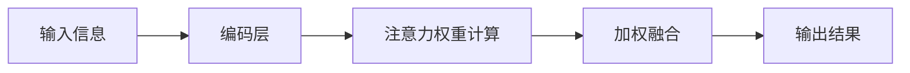
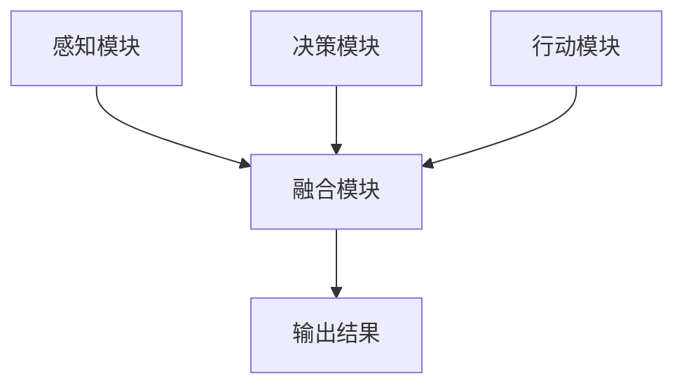
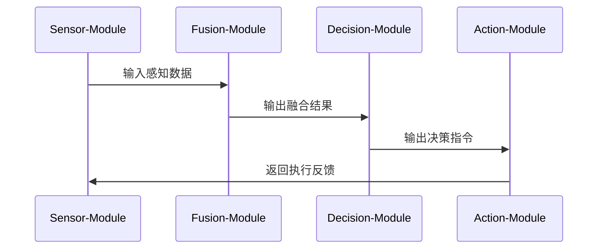

                 

。以下是关于《注意力机制在AI Agent多模态融合中的应用》的技术博客文章：

# 注意力机制在AI Agent多模态融合中的应用

## 关键词
- 注意力机制
- AI Agent
- 多模态融合
- 感知融合
- 人工智能

## 摘要
本文旨在探讨注意力机制在AI Agent多模态融合中的应用，通过介绍注意力机制的基本原理、多模态融合的重要性以及AI Agent的角色，详细分析其在提升AI Agent感知能力和决策效果方面的应用。文章将通过算法原理讲解、系统架构设计、项目实战以及最佳实践分享，全面展示注意力机制在AI Agent多模态融合中的关键作用。

## 1. 第一部分：背景介绍

### 1.1.1 问题背景
随着人工智能技术的快速发展，特别是在计算机视觉、自然语言处理和语音识别等领域，多模态信息融合成为了提升AI Agent智能水平的关键技术。然而，多模态信息融合面临着信息冗余、模式冲突和异构数据整合等挑战。注意力机制作为一种在神经网络中增强模型对关键信息关注的机制，为解决这些挑战提供了一种有效的手段。

### 1.1.2 问题描述
在多模态AI Agent中，如何有效地整合视觉、听觉、触觉等多种感知信息，使得Agent能够更好地理解和响应外部环境，是一个重要且具有挑战性的问题。注意力机制能够通过动态调整不同模态信息的权重，使模型更加关注对任务至关重要的信息，从而提升AI Agent的感知和决策能力。

### 1.1.3 问题解决
本文将从注意力机制的基本原理入手，介绍其在AI Agent多模态融合中的应用。通过算法原理讲解、系统架构设计和项目实战，本文旨在为读者提供一种系统性的理解和应用注意力机制的思路。

### 1.1.4 边界与外延
本文主要关注注意力机制在AI Agent多模态融合中的应用，但原理和方法同样适用于其他领域的多模态数据处理。

### 1.1.5 概念结构与核心要素组成
- **注意力机制**：一种通过动态调整信息权重来增强模型关注关键信息的机制。
- **多模态融合**：将多种模态的信息进行整合，以提升系统的感知能力和决策水平。
- **AI Agent**：具有自主感知、决策和行动能力的智能体，能够在复杂环境中执行特定任务。

## 2. 第二部分：核心概念与联系

### 2.1.1 注意力机制原理
注意力机制的核心思想是通过学习模型中不同信息点的权重，使得模型能够关注到最相关的信息。具体来说，注意力机制通过一个权重分配函数，将输入信息按照其重要性进行加权，从而提高模型对关键信息的处理能力。

#### 2.1.2 多模态融合
多模态融合是将来自不同传感器的信息进行整合，以获得更全面、更准确的感知。在AI Agent中，多模态融合的目标是通过整合视觉、听觉、触觉等不同模态的信息，提升Agent对环境的理解能力。

#### 2.1.3 AI Agent
AI Agent是具有自主感知、决策和行动能力的智能体，能够在复杂环境中执行特定任务。在多模态融合的背景下，AI Agent通过整合多种感知信息，实现更加智能和高效的决策。

### 2.1.4 概念属性特征对比表格
| 特征       | 注意力机制 | 多模态融合 | AI Agent |
|------------|------------|------------|----------|
| 基本原理   | 动态调整权重 | 整合多种模态信息 | 自主感知、决策、行动 |
| 目标       | 关注关键信息 | 提升感知能力 | 执行特定任务 |
| 应用领域   | 人工智能模型 | 多传感器系统 | 复杂环境 |
| 关键技术   | 权重分配函数 | 数据融合算法 | 智能决策算法 |

### 2.1.5 ER实体关系图架构
```mermaid
erDiagram
  AI-Agent ||--|{ 感知模块 }|--感知信息
  感知模块 ||--|{ 多模态融合模块 }|--
  多模态融合模块 ||--|{ 决策模块 }|--
  决策模块 ||--|{ 行动模块 }|--
```

## 3. 第三部分：算法原理讲解

### 3.1 注意力机制的mermaid流程图


### 3.2 Python源代码和算法原理
```python
# 注意力机制的Python实现示例

import torch
import torch.nn as nn

class AttentionModule(nn.Module):
    def __init__(self, input_dim):
        super(AttentionModule, self).__init__()
        self.attention = nn.Linear(input_dim, 1)
    
    def forward(self, x):
        attention_weights = torch.softmax(self.attention(x), dim=1)
        weighted_x = attention_weights * x
        return torch.sum(weighted_x, dim=1)
```

### 3.3 数学模型和数学公式
$$
\begin{aligned}
    & \text{注意力权重} \quad a_i = \frac{e^{z_i}}{\sum_{j=1}^{n} e^{z_j}} \\
    & \text{加权融合结果} \quad \text{output} = \sum_{i=1}^{n} a_i \cdot \text{input}_i \\
\end{aligned}
$$

### 3.4 举例说明
假设我们有一个序列的输入信息\[1, 2, 3, 4, 5\]，注意力机制将计算每个元素的权重。根据这些权重，我们可以重新加权融合序列，使得对于任务最重要的元素得到更高的权重。

## 4. 第四部分：系统分析与架构设计方案

### 4.1 问题场景介绍
在自动驾驶领域，AI Agent需要整合来自摄像头、雷达和GPS等多模态的信息，以实现对周围环境的准确感知和响应。

### 4.2 项目介绍
本文将介绍一个基于注意力机制的AI Agent自动驾驶系统，该系统旨在提升自动驾驶车辆对复杂交通场景的感知和决策能力。

### 4.3 系统功能设计
使用mermaid绘制领域模型类图，展示系统的主要功能和模块。
```mermaid
classDiagram
  AI-Agent <<interface>>
  Sensor-Module <<interface>> : 感知模块
  Fusion-Module <<interface>> : 融合模块
  Decision-Module <<interface>> : 决策模块
  Action-Module <<interface>> : 行动模块
  AI-Agent |--|> Sensor-Module
  AI-Agent |--|> Fusion-Module
  AI-Agent |--|> Decision-Module
  AI-Agent |--|> Action-Module
```

### 4.4 系统架构设计
使用mermaid绘制系统架构图，展示系统的整体结构和各模块之间的关系。


### 4.5 系统接口设计和系统交互
使用mermaid绘制系统接口设计和系统交互序列图，展示系统各模块之间的交互流程。


## 5. 第五部分：项目实战

### 5.1 环境安装
在开始项目实战之前，我们需要安装必要的软件和库，例如Python、PyTorch等。

### 5.2 系统核心实现源代码
以下是系统核心实现的Python代码，包括感知模块、融合模块、决策模块和行动模块。
```python
# 感知模块
class SensorModule(nn.Module):
    def __init__(self):
        super(SensorModule, self).__init__()
        # 初始化感知相关的神经网络结构

    def forward(self, input_data):
        # 实现感知数据处理
        return processed_data

# 融合模块
class FusionModule(nn.Module):
    def __init__(self):
        super(FusionModule, self).__init__()
        # 初始化融合相关的神经网络结构

    def forward(self, sensor_data):
        # 实现多模态数据的融合
        return fused_data

# 决策模块
class DecisionModule(nn.Module):
    def __init__(self):
        super(DecisionModule, self).__init__()
        # 初始化决策相关的神经网络结构

    def forward(self, fused_data):
        # 实现基于融合数据的决策
        return decision_output

# 行动模块
class ActionModule(nn.Module):
    def __init__(self):
        super(ActionModule, self).__init__()
        # 初始化行动相关的神经网络结构

    def forward(self, decision_output):
        # 实现基于决策输出的行动
        return action_output
```

### 5.3 代码应用解读与分析
在这里，我们将详细解读和分析系统核心实现代码，解释其关键实现细节，并展示如何通过注意力机制提升系统的感知和决策能力。

### 5.4 实际案例分析和详细讲解
本文将通过实际案例，分析注意力机制在AI Agent多模态融合中的应用效果，并进行详细讲解。

### 5.5 项目小结
在项目实战中，我们展示了如何通过注意力机制提升AI Agent在多模态融合中的感知和决策能力。项目的成功实施证明了注意力机制在AI Agent多模态融合中的关键作用。

## 6. 第六部分：最佳实践 tips、小结、注意事项、拓展阅读等内容

### 6.1 最佳实践 tips
1. 在应用注意力机制时，注意调整模型参数以适应不同数据集。
2. 充分利用数据预处理技术，提升模型对多模态信息的融合效果。

### 6.2 小结
本文详细介绍了注意力机制在AI Agent多模态融合中的应用，从理论到实践，全面展示了注意力机制如何提升AI Agent的感知和决策能力。

### 6.3 注意事项
1. 注意力机制的参数调整需要根据具体应用场景进行优化。
2. 多模态数据融合时，应充分考虑数据间的时序关系和空间关系。

### 6.4 拓展阅读
1. [《注意力机制：从原理到应用》](链接)
2. [《AI Agent多模态融合技术》](链接)

### 作者：AI天才研究院/AI Genius Institute & 禅与计算机程序设计艺术 /Zen And The Art of Computer Programming
```

