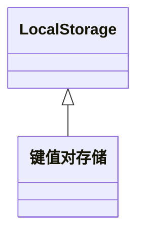
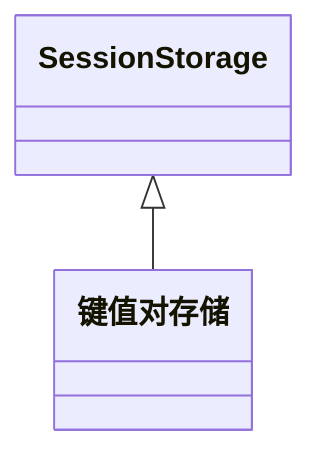
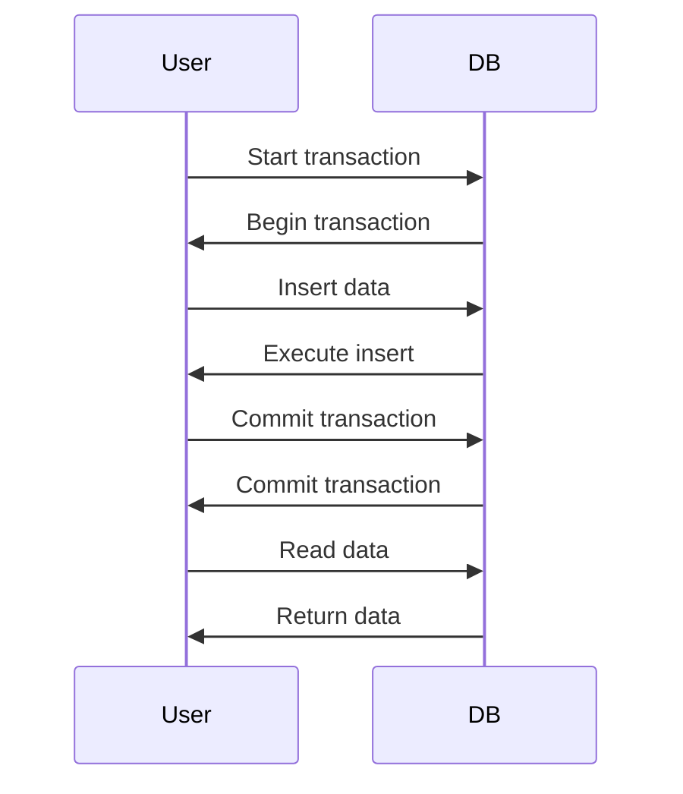
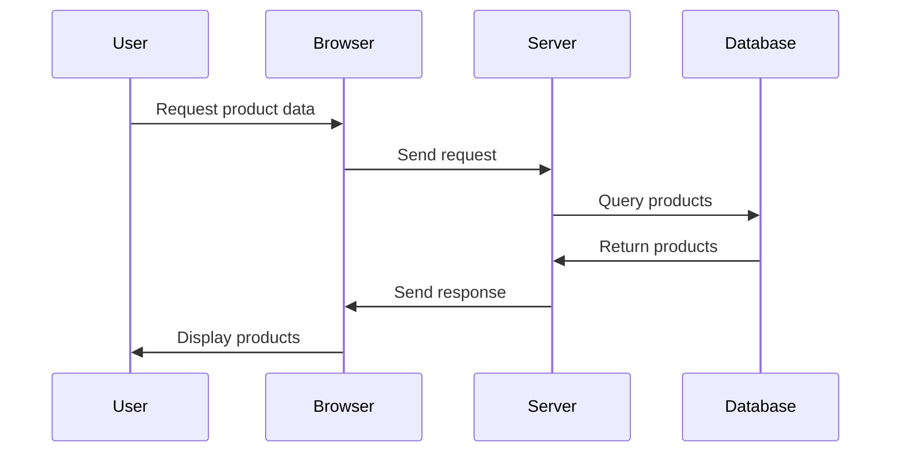
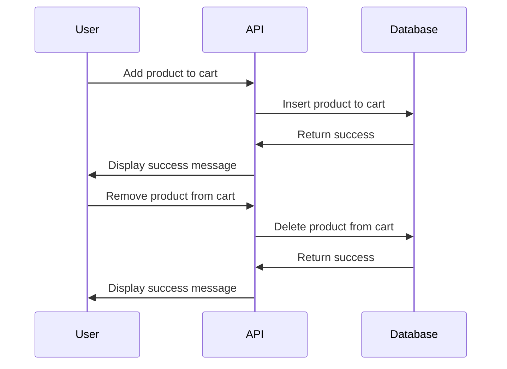

                 

### 文章标题：浏览器存储：LocalStorage、SessionStorage与IndexedDB

> 关键词：浏览器存储、LocalStorage、SessionStorage、IndexedDB、Web开发

> 摘要：本文将深入探讨浏览器存储的三种主要方式：LocalStorage、SessionStorage与IndexedDB。我们将从基础概念入手，详细分析它们的工作原理、优缺点以及适用场景，并结合实际项目，给出最佳实践和注意事项。通过本文的阅读，您将全面了解浏览器存储的机制，掌握在实际开发中如何选择和优化使用这些存储方式。

---

### 背景介绍

在现代Web开发中，浏览器存储扮演着至关重要的角色。它不仅关系到用户数据的保存和访问，还影响到应用的性能和用户体验。目前，浏览器存储主要有以下三种方式：LocalStorage、SessionStorage和IndexedDB。

**LocalStorage** 是一种持久化的存储方式，数据在会话结束后依然保留。它非常适合用于存储用户偏好设置、配置信息等长期数据。

**SessionStorage** 则是会话级别的存储，数据仅存在于当前会话中，会话结束后自动销毁。它适用于存储临时的用户信息，例如购物车的数据。

**IndexedDB** 是一种NoSQL数据库，它提供了结构化数据的存储和检索功能。与LocalStorage和SessionStorage相比，IndexedDB具有更高的存储容量和更复杂的数据操作能力，适用于需要处理大量数据的场景。

下面，我们将深入探讨这三种存储方式的核心概念、工作原理和它们之间的关系。

---

### 核心概念与联系

**LocalStorage** 和 **SessionStorage** 的核心概念相对简单，都是基于键值对的数据存储方式。它们的主要区别在于数据的持久性和作用域。

**LocalStorage**：数据在会话结束后依然保留，适用于长期存储。


**SessionStorage**：数据仅存在于当前会话中，会话结束后自动销毁，适用于临时存储。


**IndexedDB** 则是一种更为复杂的存储方式，它基于NoSQL数据库的原理，提供了丰富的数据操作功能。IndexedDB的主要特点包括：

- **对象存储**：支持存储复杂的对象结构。
- **事务管理**：提供事务机制，确保数据的一致性。
- **索引**：支持通过索引快速查询数据。

以下是IndexedDB的核心概念和ER实体关系图：
```mermaid
erDiagram
IDBObjectStore --|> IDBIndex
IDBObjectStore ||--|{ IDBIndex } IDBIndex
IDBObjectStore ||--|{ IDBKeyRange } IDBKeyRange
```

**关系**：LocalStorage和SessionStorage更适合存储简单的小规模数据，而IndexedDB则适用于存储复杂的大规模数据。在实际开发中，我们通常根据应用的需求来选择合适的存储方式。

---

### 算法原理讲解

**IndexedDB** 的操作原理相对复杂，涉及到数据库的创建、事务管理、索引和键值对存储等。

#### 数据库操作原理

IndexedDB的核心操作是创建数据库和对象存储。以下是创建数据库和对象存储的Python源代码示例：

```python
import sqlite3

# 创建数据库连接
conn = sqlite3.connect('example.db')

# 创建数据库表
conn.execute('''CREATE TABLE IF NOT EXISTS users (id INTEGER PRIMARY KEY, name TEXT)''')

# 创建对象存储
conn.execute('''CREATE TABLE IF NOT EXISTS profiles (id INTEGER PRIMARY KEY, user_id INTEGER, data TEXT)''')

# 提交事务
conn.commit()
```

#### 事务管理

事务管理是确保数据一致性的关键。IndexedDB提供了事务机制，支持读事务和写事务。以下是事务管理的Python源代码示例：

```python
# 开始写事务
conn.execute('BEGIN TRANSACTION')

# 执行写操作
conn.execute('''INSERT INTO users (id, name) VALUES (1, 'Alice')''')
conn.execute('''INSERT INTO profiles (id, user_id, data) VALUES (1, 1, 'Profile data for Alice')''')

# 提交事务
conn.execute('COMMIT')
```

#### 索引与键值对存储

IndexedDB支持通过索引快速查询数据。索引是基于键值对创建的，可以用于优化查询性能。以下是创建索引和查询数据的Python源代码示例：

```python
# 创建索引
conn.execute('''CREATE INDEX IF NOT EXISTS profiles_user_id ON profiles (user_id)''')

# 查询数据
cursor = conn.execute('SELECT * FROM profiles WHERE user_id = 1')
for row in cursor:
    print(row)
```

#### 数据库事务的ACID特性

ACID（原子性、一致性、隔离性、持久性）是事务管理的重要特性。以下是事务的ACID特性在IndexedDB中的实现：

- **原子性**：事务中的所有操作要么全部执行，要么全部不执行。
- **一致性**：事务执行前后，数据库状态保持一致。
- **隔离性**：多个事务同时执行时，互不干扰。
- **持久性**：一旦事务提交，数据将永久保存。



---

### 系统分析与架构设计方案

**IndexedDB** 在Web应用中的架构设计需要考虑多个方面，包括数据模型、系统架构、接口设计和系统交互。

#### 问题场景介绍

假设我们开发的是一个在线购物平台，用户可以在购物车中添加、删除商品，并保存购物车状态。为了保证用户体验，我们需要一个高性能、可靠的存储方案来处理这些数据。

#### 项目介绍

在这个项目中，我们使用IndexedDB来存储用户购物车的数据。IndexedDB的强大之处在于它能够处理大量的数据，并保证数据的一致性和安全性。

#### 系统功能设计

系统功能设计包括用户购物车的增删改查操作，以下是领域模型类图：

```mermaid
classDiagram
ClassDiagram
User <<-- Shopping Cart
User : id, name
Shopping Cart : id, items

class Product {
  +id: Integer
  +name: String
  +price: Float
}

class ShoppingCart {
  +id: Integer
  +items: List<Product>
  +addItem(product: Product): void
  +removeItem(productId: Integer): void
}
```

#### 系统架构设计

系统架构设计包括数据库、前端和应用服务器。以下是系统架构图：



#### 系统接口设计和系统交互

系统接口设计包括API接口和数据库接口。以下是API接口和数据库接口的序列图：



---

### 项目实战

在本节中，我们将通过一个实际项目，展示如何使用IndexedDB存储用户购物车的数据。我们将详细讲解环境安装、系统核心实现源代码，以及代码应用解读与分析。

#### 环境安装

首先，我们需要安装Node.js和IndexedDB环境。以下是安装步骤：

1. 安装Node.js：从官网下载并安装Node.js。
2. 安装IndexedDB库：在终端中运行以下命令：
```bash
npm install --save idb
```

#### 系统核心实现源代码

以下是系统核心实现源代码：

```javascript
const IDB = require('idb');

// 创建数据库连接
const db = new IDB('shopping-cart-db', 1, {
  upgrade(db) {
    db.createObjectStore('products', { keyPath: 'id' });
  },
});

// 添加商品
async function addProduct(product) {
  await db.put('products', product);
}

// 删除商品
async function removeProduct(productId) {
  await db.delete('products', productId);
}

// 获取所有商品
async function getAllProducts() {
  return db.getAll('products');
}

// API接口实现
const express = require('express');
const app = express();

app.use(express.json());

app.post('/api/products', async (req, res) => {
  try {
    const product = req.body;
    await addProduct(product);
    res.status(200).send({ message: 'Product added successfully' });
  } catch (error) {
    res.status(500).send({ message: 'Error adding product' });
  }
});

app.delete('/api/products/:productId', async (req, res) => {
  try {
    const productId = req.params.productId;
    await removeProduct(productId);
    res.status(200).send({ message: 'Product removed successfully' });
  } catch (error) {
    res.status(500).send({ message: 'Error removing product' });
  }
});

app.get('/api/products', async (req, res) => {
  try {
    const products = await getAllProducts();
    res.status(200).send(products);
  } catch (error) {
    res.status(500).send({ message: 'Error fetching products' });
  }
});

app.listen(3000, () => {
  console.log('Server is running on port 3000');
});
```

#### 代码应用解读与分析

1. **数据库连接**：我们使用`idb`库来创建数据库连接。在`upgrade`事件中，我们创建了一个名为`products`的对象存储。
2. **API接口**：我们使用Express框架创建了一个简单的API接口。`/api/products`用于添加、删除和获取商品数据。
3. **事务管理**：在添加和删除商品时，我们使用`db.put`和`db.delete`方法，这些方法会自动处理事务。
4. **性能优化**：为了提高性能，我们可以使用索引来优化查询。例如，我们可以为`productId`创建一个索引，以便快速查询商品。

#### 实际案例分析和详细讲解剖析

假设有一个用户想要将一款名为“iPhone 13”的商品添加到购物车。以下是详细的流程：

1. **用户请求**：用户向服务器发送添加商品请求，请求体包含商品信息。
2. **服务器响应**：服务器接收到请求后，将商品信息解析为JavaScript对象，并调用`addProduct`方法。
3. **数据库操作**：`addProduct`方法将商品信息添加到`products`对象存储中。
4. **事务提交**：数据库自动处理事务，确保数据的一致性。
5. **响应结果**：服务器向用户发送成功消息。

通过这个案例，我们可以看到IndexedDB如何用于实际项目中的数据存储和操作。IndexedDB的强大之处在于它能够处理复杂的对象存储，并保证数据的一致性和安全性。

#### 项目小结

在本项目中，我们使用了IndexedDB来存储用户购物车的数据。通过实际案例，我们展示了如何添加、删除和查询商品数据。IndexedDB的优点在于它能够处理大量的数据，并保证数据的一致性和安全性。然而，IndexedDB的学习曲线相对较高，需要开发者具备一定的数据库知识。

---

### 最佳实践与注意事项

在实际开发中，正确使用浏览器存储可以提高应用的性能和用户体验。以下是一些最佳实践和注意事项：

1. **合理选择存储方式**：根据数据的大小和持久性要求，选择合适的存储方式。例如，对于小规模数据，可以使用LocalStorage或SessionStorage；对于复杂的大规模数据，应优先考虑使用IndexedDB。
2. **优化性能**：使用索引来优化查询性能，减少数据的读写操作。对于频繁读取的数据，可以考虑使用缓存技术。
3. **安全性**：在处理敏感数据时，应使用HTTPS协议传输数据，并加密存储敏感信息。
4. **边界与外延**：了解每种存储方式的限制，避免超过存储容量或时间限制导致的数据丢失。
5. **容错处理**：对存储操作进行容错处理，确保数据的一致性和可靠性。

### 小结

本文深入探讨了浏览器存储的三种主要方式：LocalStorage、SessionStorage和IndexedDB。我们分析了它们的核心概念、工作原理、优缺点以及适用场景。通过实际项目案例，我们展示了如何在实际应用中使用IndexedDB存储和操作数据。正确选择和优化使用这些存储方式，可以显著提高Web应用的性能和用户体验。

### 拓展阅读

- [MDN IndexedDB 文档](https://developer.mozilla.org/en-US/docs/Web/API/IndexedDB_API)
- [W3C IndexedDB 规范](https://www.w3.org/TR/IndexedDB/)
- [Express 官方文档](https://expressjs.com/)
- [IDB JavaScript 库](https://github.com/j跨步/IDB)

---

**作者：AI天才研究院/AI Genius Institute & 禅与计算机程序设计艺术 /Zen And The Art of Computer Programming**

