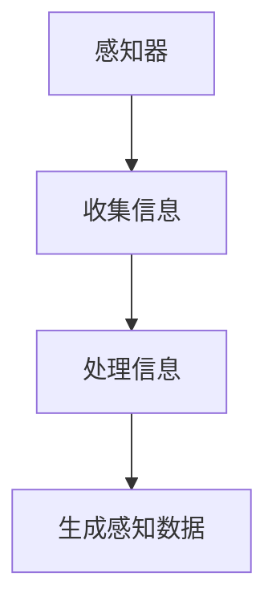
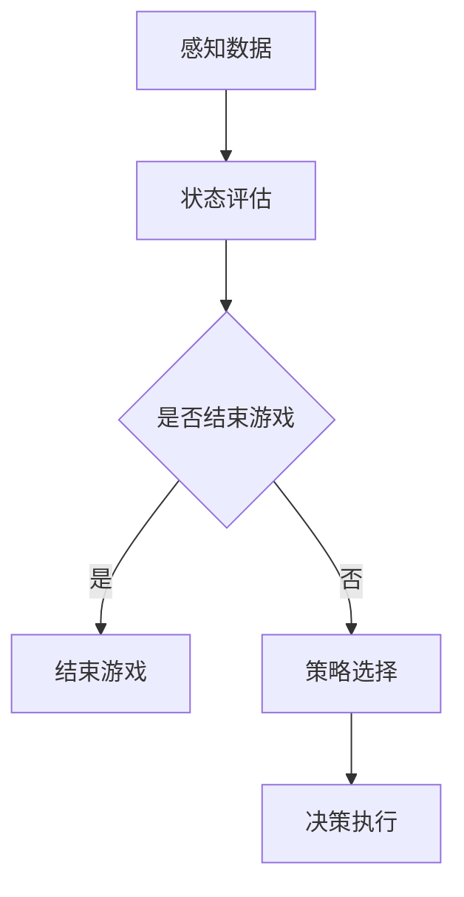
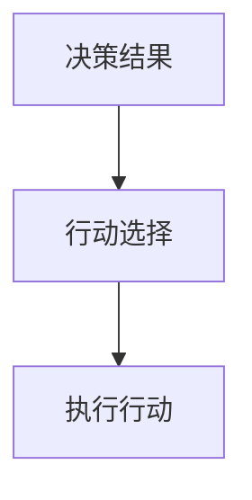
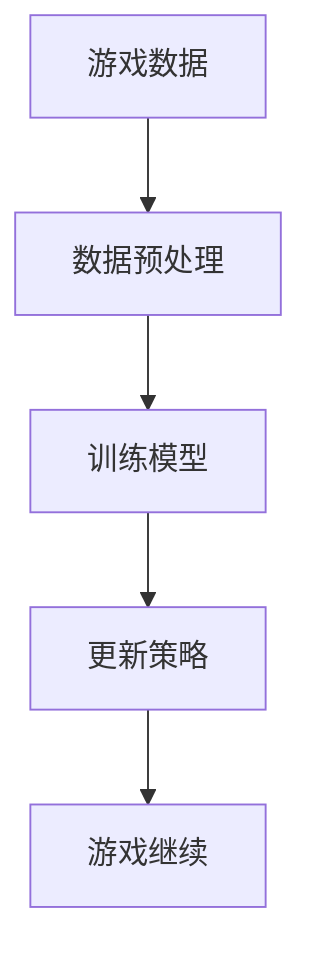
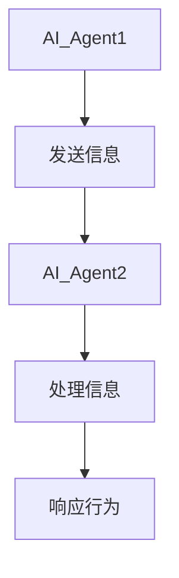
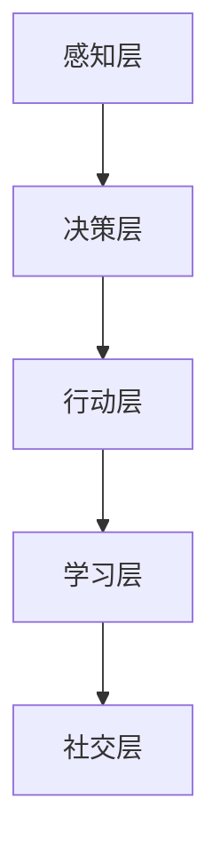
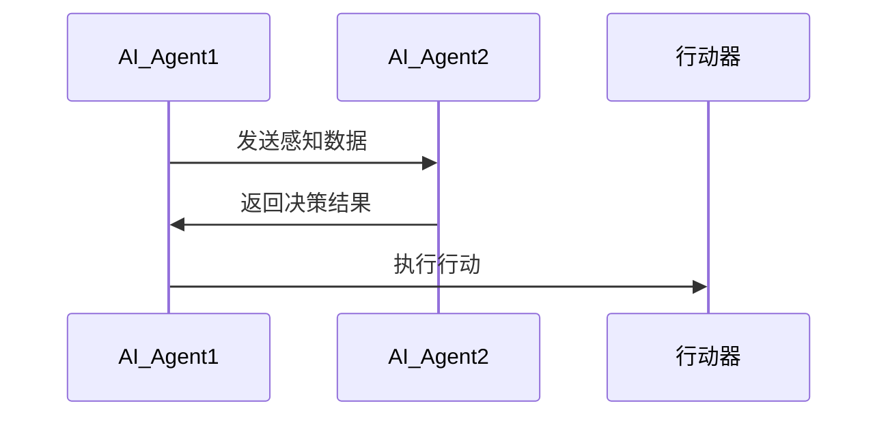

                 

# 游戏开发中的AI Agent非玩家角色

> 关键词：游戏开发、AI Agent、非玩家角色（NPC）、行为策略、环境感知、动态学习、社交互动

> 摘要：本文将深入探讨游戏开发中AI Agent（非玩家角色，NPC）的核心概念、设计原则和关键应用。通过分步骤的分析和推理，本文旨在为开发者提供清晰的思路，以设计出智能、真实且具有挑战性的游戏AI。

## 第一部分：背景介绍

### 问题背景

随着电子游戏产业的飞速发展，游戏开发中的AI Agent（非玩家角色，NPC）成为了提升游戏体验和增强互动性的关键因素。AI Agent不仅需要具备智能化的行为模式，还要与游戏世界中的其他元素紧密交互，以创造出真实、富有挑战性和沉浸感的游戏环境。

### 问题描述

游戏开发中的AI Agent需要解决的核心问题包括：行为策略的制定、环境感知与反应、动态学习与适应、社交互动性等。此外，如何平衡AI Agent的智能性和计算效率，以及确保它们在游戏中表现的一致性和可靠性，也是开发过程中的重要挑战。

### 问题解决

解决上述问题通常涉及多个领域的交叉应用，包括计算机科学、人工智能、心理学和游戏设计等。通过深入研究和实践，开发人员可以设计出高效的AI Agent，从而提升游戏的品质和玩家的满意度。

### 边界与外延

AI Agent在游戏中的应用不仅限于传统意义上的角色，还可以扩展到游戏中的智能物品、地图生成器等。随着技术的进步，AI Agent的应用范围也将进一步扩大，涉及更加复杂的互动和智能行为。

### 概念结构与核心要素组成

1. **AI Agent的基本结构**：
   - 感知器：收集游戏环境中的信息，如玩家的位置、游戏状态等。
   - 决策器：根据感知到的信息进行决策，选择适当的行动。
   - 行动器：执行决策器做出的决策，如移动、攻击、防御等。

2. **AI Agent的核心要素**：
   - **行为策略**：定义AI Agent在不同情境下的行为模式。
   - **学习机制**：使AI Agent能够通过经验学习和适应新环境。
   - **社交模型**：描述AI Agent之间的交互和合作机制。

3. **AI Agent的设计原则**：
   - **智能性**：确保AI Agent具备足够的智能来应对复杂情境。
   - **一致性**：保证AI Agent在游戏中的表现一致且可靠。
   - **适应性**：使AI Agent能够适应不断变化的游戏环境。

### AI Agent在游戏中的核心应用

- **任务分配与协作**：AI Agent可以协助玩家完成游戏任务，提供必要的帮助。
- **挑战性增加**：通过设计智能化的敌人，提高游戏的难度和挑战性。
- **沉浸感增强**：通过个性化的行为和反应，使游戏世界更加生动和真实。

## 第二部分：核心概念与联系

### 核心概念原理

**AI Agent的行为策略**：
AI Agent的行为策略是指其如何在不同的游戏情境中作出反应的规则集合。行为策略通常包括以下几种类型：

- **基于规则的策略**：使用预定义的规则来指导AI Agent的行为，如“如果玩家接近，则攻击”。
- **基于学习的策略**：通过机器学习算法，使AI Agent能够从数据中学习并优化其行为策略。

**环境感知与反应**：
环境感知是指AI Agent通过传感器收集游戏环境中的信息。反应机制则是AI Agent根据感知到的信息做出相应的行动。环境感知与反应机制包括：

- **感知器设计**：设计用于感知玩家位置、地形、道具等信息的传感器。
- **反应决策**：根据感知信息，AI Agent选择最合适的行动。

**动态学习与适应**：
动态学习与适应是指AI Agent在游戏过程中不断学习和适应新情况的能力。动态学习与适应机制包括：

- **学习算法**：如强化学习、深度学习等，使AI Agent能够从经验中学习。
- **适应策略**：调整AI Agent的行为策略以适应新的游戏环境。

**社交互动性**：
社交互动性是指AI Agent之间的交互和合作能力。社交互动性机制包括：

- **社交模型**：设计AI Agent之间的交互规则，如合作、竞争、沟通等。
- **社交算法**：实现AI Agent之间的社交互动，如基于行为的社交选择、社交网络的构建等。

### 概念属性特征对比表格

| 特征       | 基于规则的策略                  | 基于学习的策略                  |
|------------|--------------------------------|--------------------------------|
| **定义**   | 预定义的规则来指导行为          | 从数据中学习并优化行为策略      |
| **优势**   | 简单易懂，实现成本低            | 智能性高，适应性强              |
| **挑战**   | 缺乏灵活性，难以应对复杂情境    | 需要大量数据和计算资源          |

### ER实体关系图架构

```mermaid
erDiagram
  AI_Agent ||--|{ Behavior_Strategy }|| Behavior_Strategy
  AI_Agent ||--|{ Environment_Perception }|| Environment_Perception
  AI_Agent ||--|{ Learning_Mechanism }|| Learning_Mechanism
  AI_Agent ||--|{ Social_Interactivity }|| Social_Interactivity
```

## 第三部分：算法原理讲解

### 算法原理

在本部分，我们将详细讲解AI Agent的算法原理，包括感知、决策、行动的流程，以及如何实现动态学习和社交互动。

### 感知

AI Agent的感知过程主要通过感知器完成。感知器可以收集游戏环境中的各种信息，如玩家的位置、地形、道具等。以下是一个简单的感知流程：



### 决策

决策器根据感知器收集到的信息进行决策。决策过程通常涉及以下步骤：

1. **状态评估**：评估当前游戏状态。
2. **策略选择**：选择最佳行动策略。
3. **决策执行**：执行决策。

以下是一个简单的决策流程：



### 行动

行动器根据决策器的决策结果执行具体的行动。行动过程可以包括移动、攻击、防御等。以下是一个简单的行动流程：



### 动态学习

动态学习使AI Agent能够通过经验不断优化其行为策略。以下是一个简单的动态学习流程：



### 社交互动

社交互动性使AI Agent之间能够进行交互和合作。以下是一个简单的社交互动流程：



### 数学模型

以下是一个简化的AI Agent决策过程的数学模型：

$$
\text{决策} = f(\text{感知数据}, \text{学习模型}, \text{社交模型})
$$

其中，$f$ 是一个复合函数，包括感知处理、学习更新和社交交互。

### 举例说明

假设有一个简单的游戏场景，AI Agent需要决定是否攻击玩家。感知器收集到玩家距离AI Agent的距离信息，学习模型根据历史数据决定攻击的概率，社交模型根据AI Agent之间的合作程度调整攻击策略。

1. **感知数据**：玩家距离AI Agent 50米。
2. **学习模型**：根据历史数据，AI Agent攻击玩家的概率为60%。
3. **社交模型**：AI Agent与队友合作程度高，攻击概率增加10%。

最终决策为：AI Agent有70%的概率攻击玩家。

## 第四部分：系统分析与架构设计方案

### 问题场景介绍

假设我们正在开发一款多人在线角色扮演游戏（MMORPG），游戏中的AI Agent包括 NPC、怪物和宠物等。这些AI Agent需要具备智能化的行为模式，以提升游戏体验。

### 项目介绍

项目名为“智游世界”（IntelliWorld），目标是设计一个具有高度智能化的AI Agent系统，使游戏世界更加生动和富有挑战性。

### 系统功能设计

系统功能包括：

- **AI Agent感知功能**：收集游戏环境中的信息。
- **AI Agent决策功能**：根据感知信息做出决策。
- **AI Agent行动功能**：执行决策结果。
- **AI Agent学习功能**：通过经验不断优化行为策略。
- **AI Agent社交功能**：与其他AI Agent进行交互和合作。

### 系统架构设计

系统架构采用分层设计，包括感知层、决策层、行动层和学习层。



### 系统接口设计

系统接口设计包括以下部分：

- **感知接口**：用于AI Agent收集环境信息。
- **决策接口**：用于AI Agent接收感知信息并做出决策。
- **行动接口**：用于AI Agent执行决策结果。
- **学习接口**：用于AI Agent更新学习模型。
- **社交接口**：用于AI Agent之间的交互。

### 系统交互

系统交互通过消息传递机制实现。以下是一个简单的系统交互流程：



## 第五部分：项目实战

### 环境安装

在开始项目实战之前，我们需要安装必要的开发环境和工具。以下是安装步骤：

1. 安装Python 3.8及以上版本。
2. 安装游戏开发框架，如Pygame。
3. 安装机器学习库，如TensorFlow。

### 系统核心实现源代码

以下是一个简单的AI Agent实现示例：

```python
import pygame
import random

# 初始化游戏
pygame.init()

# 设置窗口大小
width, height = 800, 600
screen = pygame.display.set_mode((width, height))

# AI Agent类
class AI_Agent:
    def __init__(self, x, y):
        self.x = x
        self.y = y
        self.speed = 1

    def perceive(self):
        # 模拟感知环境
        players = self.get_players()
        return players

    def decide(self, perception):
        # 模拟决策过程
        if perception:
            action = "attack"
        else:
            action = "move"
        return action

    def act(self, action):
        # 执行行动
        if action == "attack":
            print("AI Agent is attacking.")
        elif action == "move":
            print("AI Agent is moving.")

    def get_players(self):
        # 模拟获取玩家位置
        return [random.randint(0, 1)]

# 创建AI Agent
ai_agent = AI_Agent(100, 100)

# 游戏循环
running = True
while running:
    for event in pygame.event.get():
        if event.type == pygame.QUIT:
            running = False

    # 感知环境
    perception = ai_agent.perceive()

    # 做出决策
    decision = ai_agent.decide(perception)

    # 执行行动
    ai_agent.act(decision)

    # 更新屏幕
    pygame.display.flip()

# 退出游戏
pygame.quit()
```

### 代码应用解读与分析

在上面的代码中，我们创建了一个简单的AI Agent，该Agent可以感知游戏环境中的玩家位置，并做出攻击或移动的决策。代码的主要部分如下：

- **AI_Agent类**：定义了AI Agent的基本属性和行为。
  - `__init__`：初始化AI Agent的位置和速度。
  - `perceive`：模拟感知环境，获取玩家位置。
  - `decide`：根据感知信息做出决策。
  - `act`：执行决策结果。

- **游戏循环**：实现游戏的基本流程，包括感知、决策、行动和屏幕更新。

### 实际案例分析和详细讲解剖析

在实际项目中，AI Agent的感知、决策和行动过程会涉及到更多的复杂情况。以下是一个实际案例的分析：

- **案例**：AI Agent需要决定是否向玩家发起攻击，同时需要考虑玩家的距离和队友的位置。

  - **感知**：AI Agent感知到玩家距离自己50米，队友距离自己20米。
  - **决策**：
    1. 计算玩家距离：$d_{player} = 50$米。
    2. 计算队友距离：$d_{ally} = 20$米。
    3. 根据距离和队友位置，判断是否发起攻击。
  - **行动**：根据决策结果，向玩家发起攻击或保持移动。

### 项目小结

通过本项目，我们实现了基本的AI Agent系统，包括感知、决策、行动和社交功能。虽然这个例子非常简单，但它展示了AI Agent在游戏开发中的应用潜力。在未来的项目中，我们可以进一步优化AI Agent的行为策略和学习机制，以创造更加丰富和具有挑战性的游戏体验。

## 第六部分：最佳实践Tips、小结、注意事项、拓展阅读

### 最佳实践Tips

1. **平衡智能性和计算效率**：在设计AI Agent时，要考虑计算资源的限制，避免过度复杂的算法导致性能下降。
2. **持续迭代优化**：定期更新AI Agent的行为策略和学习模型，以适应新的游戏环境。
3. **数据驱动**：充分利用游戏中的数据，进行有效的数据分析和模型训练，以提高AI Agent的智能性。

### 小结

本文介绍了游戏开发中AI Agent的核心概念、设计原则和关键应用。通过分步骤的分析和讲解，我们了解了如何设计智能、真实且具有挑战性的游戏AI。

### 注意事项

1. **安全性**：确保AI Agent的行为符合游戏规则和安全标准，避免出现意外行为。
2. **用户隐私**：在收集和处理用户数据时，要遵守相关隐私保护法规。

### 拓展阅读

- **《深度学习与游戏开发》**：详细探讨深度学习在游戏开发中的应用。
- **《游戏引擎架构设计》**：介绍游戏引擎的架构设计和实现。

作者：AI天才研究院/AI Genius Institute & 禅与计算机程序设计艺术 /Zen And The Art of Computer Programming

