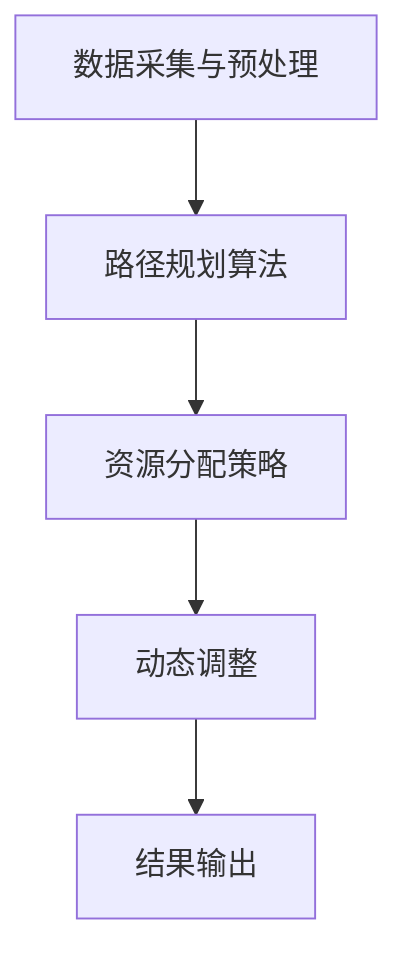
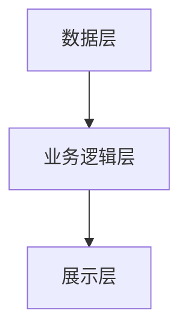
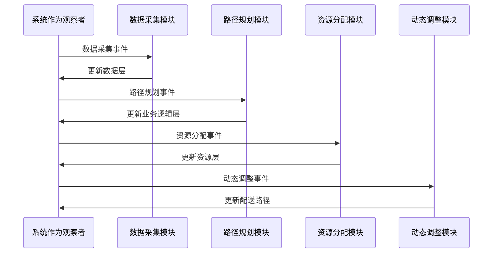

                 


### 引言与背景介绍

#### 核心概念术语说明

首先，我们需要明确一些核心概念和术语。物流行业是指商品从生产地到消费者手中的整个过程，包括运输、仓储、配送等多个环节。在物流行业中，配送路径优化是指通过科学合理地规划配送路线，以最小化运输成本、提高配送效率为目标的过程。

AI Agent，即人工智能代理，是一种能够自主学习、自主决策的计算机程序。在物流行业中，AI Agent可以用来优化配送路径，提高配送效率。具体来说，AI Agent通过分析历史数据、交通状况、客户需求等信息，自动生成最优配送路线，从而实现物流资源的最佳配置。

#### 问题背景

物流行业在全球经济中扮演着重要角色，随着电商、快递等行业的快速发展，物流行业面临着巨大的挑战。一方面，物流成本占商品总成本的比重逐年上升，如何降低物流成本成为物流行业亟待解决的问题；另一方面，随着订单量的增加，如何提高配送效率、缩短配送时间也成为物流行业需要面对的挑战。

传统的人工规划配送路径方式效率低下，难以应对复杂多变的物流环境。而AI Agent的出现，为物流行业提供了一种新的解决方案。通过利用AI Agent，物流企业可以自动化、智能化地进行配送路径优化，从而降低物流成本、提高配送效率。

#### 问题描述

在物流行业中，配送路径优化的核心问题是如何在满足客户需求的前提下，最大化地降低配送成本和提高配送效率。具体来说，这个问题可以分解为以下几个子问题：

1. **路径规划**：如何根据客户需求和交通状况，规划出一条最优的配送路径。
2. **资源分配**：如何合理分配物流资源，如车辆、仓储等，以确保配送路径的可行性。
3. **动态调整**：如何应对突发情况，如交通拥堵、天气变化等，动态调整配送路径。

#### 问题解决

针对上述问题，AI Agent可以通过以下方式实现配送路径优化：

1. **数据采集与处理**：AI Agent需要收集大量的历史数据、实时数据等，如订单信息、交通状况、客户需求等，通过数据预处理，将这些数据转化为可分析的格式。
2. **路径规划算法**：AI Agent可以采用各种路径规划算法，如最短路径算法、遗传算法、A*算法等，根据客户需求和交通状况，生成最优配送路径。
3. **资源分配策略**：AI Agent可以根据配送路径，动态调整物流资源分配策略，如车辆调度、仓储管理等，以确保配送路径的可行性。
4. **动态调整机制**：AI Agent可以根据实时数据，动态调整配送路径，以应对突发情况。

#### 边界与外延

配送路径优化的边界主要涉及配送路径的起点和终点，以及路径规划算法的适用范围。在实际应用中，AI Agent需要根据具体业务场景，调整配送路径优化的边界。

配送路径优化的外延则涉及物流行业的其他环节，如运输、仓储等。通过将AI Agent与这些环节相结合，可以实现整个物流过程的优化。

#### 概念结构与核心要素组成

配送路径优化的概念结构主要包括以下几个核心要素：

1. **配送路径**：配送路径是配送过程的物理路线，是配送路径优化的核心对象。
2. **客户需求**：客户需求是配送路径优化的核心驱动因素，决定了配送路径的需求特点。
3. **交通状况**：交通状况是配送路径优化的关键因素，影响了配送路径的可行性。
4. **物流资源**：物流资源是配送路径优化的基础保障，包括车辆、仓储等。

这些核心要素相互作用，共同构成了配送路径优化的概念结构。

---

### AI Agent基本概念与分类

#### AI Agent的定义

AI Agent，即人工智能代理，是一种基于人工智能技术构建的自主决策实体。它能够在复杂的环境中，通过感知、理解和行动，实现特定目标。AI Agent通常由感知模块、决策模块和行动模块组成。

感知模块负责收集环境信息，如订单数据、交通状况、客户需求等。决策模块根据感知模块提供的信息，进行推理和决策，生成最优配送路径。行动模块则根据决策模块的输出，执行具体的配送任务。

#### AI Agent的分类

根据AI Agent的功能和应用场景，可以将AI Agent分为以下几类：

1. **规则型AI Agent**：基于预设的规则和逻辑进行决策和行动的AI Agent。这类Agent适用于规则明确、场景简单的应用场景，如自动回答客服问题、自动发送邮件等。

2. **统计型AI Agent**：基于历史数据和学习算法进行决策和行动的AI Agent。这类Agent适用于数据量庞大、规则复杂的应用场景，如自动驾驶、智能推荐等。

3. **强化学习型AI Agent**：通过与环境交互，不断学习和优化策略的AI Agent。这类Agent适用于需要持续优化和适应环境变化的应用场景，如游戏AI、智能配送等。

#### AI Agent在物流中的应用场景

在物流行业中，AI Agent可以应用于多个环节，如订单处理、路径规划、资源分配等。以下是一些常见的应用场景：

1. **订单处理**：AI Agent可以自动处理订单，根据客户需求和库存情况，生成最优配送方案。

2. **路径规划**：AI Agent可以分析交通状况、配送时间等数据，生成最优配送路径，提高配送效率。

3. **资源分配**：AI Agent可以实时监控物流资源的使用情况，动态调整资源分配策略，确保配送路径的可行性。

4. **动态调整**：AI Agent可以根据实时数据，动态调整配送路径，应对突发情况，如交通拥堵、天气变化等。

通过这些应用，AI Agent可以大幅提高物流行业的运营效率，降低物流成本。

---

### AI Agent优化配送路径的核心算法

#### 算法概述

AI Agent优化配送路径的核心算法主要涉及路径规划、资源分配和动态调整等环节。其中，路径规划算法是整个系统的核心，决定了配送路径的可行性和最优性。常用的路径规划算法包括最短路径算法、遗传算法、A*算法等。

#### 算法原理

1. **最短路径算法**：最短路径算法是一种经典的路径规划算法，用于求解给定图中两点之间的最短路径。最短路径算法的基本原理是贪心算法，每次迭代选择当前未访问节点中距离起点最近的节点作为下一步访问节点，直到所有节点都被访问到。

2. **遗传算法**：遗传算法是一种基于生物进化的优化算法，通过模拟自然进化过程，不断优化解空间中的个体。遗传算法的基本原理包括选择、交叉、变异等操作，用于生成新一代的个体，逐步逼近最优解。

3. **A*算法**：A*算法是一种启发式搜索算法，用于求解给定图中两点之间的最短路径。A*算法的基本原理是结合起点到当前节点的距离和当前节点到终点的估计距离，选择下一个访问节点，以最小化总路径长度。

#### 算法流程

1. **数据采集与预处理**：首先，采集订单数据、交通状况、客户需求等数据，并进行预处理，如数据清洗、格式转换等。

2. **路径规划**：根据预处理后的数据，采用相应的路径规划算法，生成最优配送路径。

3. **资源分配**：根据生成的配送路径，动态调整物流资源分配策略，如车辆调度、仓储管理等。

4. **动态调整**：根据实时数据，动态调整配送路径，以应对突发情况。

5. **结果输出**：将优化后的配送路径和资源分配结果输出，供物流企业进行实际操作。

#### 算法流程图

以下是AI Agent优化配送路径的核心算法流程图：



通过上述流程，AI Agent可以实现物流配送路径的优化，提高物流效率，降低物流成本。

---

### 算法分析与数学模型

#### 数学模型

在AI Agent优化配送路径中，数学模型起着至关重要的作用。以下是一个简单的配送路径优化数学模型：

$$
\text{配送路径优化模型}
$$

其中，$d(i, j)$ 表示从点 $i$ 到点 $j$ 的距离。

#### 数学公式讲解

为了更好地理解配送路径优化模型，我们来看一个具体的例子。假设有 $n$ 个配送点，分别为 $i_1, i_2, \ldots, i_n$，我们需要计算从起点 $i_1$ 到终点 $i_n$ 的最短路径。

最短路径的公式可以表示为：

$$
\text{路径长度} = \sum_{i=1}^{n} d(i, j)
$$

其中，$d(i, j)$ 表示从点 $i$ 到点 $j$ 的距离。为了求解这个最短路径，我们可以采用A*算法。

#### 算法流程与实现

1. **初始化**：首先，初始化两个集合 $O$ 和 $C$，其中 $O$ 表示已扩展的节点，$C$ 表示待扩展的节点。初始时，$O$ 为空集，$C$ 包含起点 $i_1$。

2. **计算启发式值**：对于每个待扩展的节点 $j$，计算从起点 $i_1$ 到终点 $i_n$ 的估计距离 $h(j)$。

3. **选择下一个扩展节点**：从集合 $C$ 中选择一个节点 $j$，使得 $f(j) = g(j) + h(j)$ 最小，其中 $g(j)$ 表示从起点 $i_1$ 到节点 $j$ 的实际距离。

4. **扩展节点**：将选择的节点 $j$ 从集合 $C$ 移入集合 $O$，并将其邻居节点加入到集合 $C$ 中。

5. **重复步骤 2-4**，直到集合 $C$ 为空或已找到终点 $i_n$。

6. **路径重建**：从终点 $i_n$ 开始，沿着已扩展的节点逆向追溯，重建出从起点 $i_1$ 到终点 $i_n$ 的最短路径。

以下是一个简单的Python实现：

```python
import heapq

def a_star_search(graph, start, goal):
    # 初始化集合 O 和 C
    O = set()
    C = [(0, start)]

    # 初始化路径长度和启发式值
    g = {start: 0}
    f = {start: heuristic(start, goal)}

    while C:
        # 选择下一个扩展节点
        _, j = heapq.heappop(C)

        # 扩展节点
        O.add(j)
        for i in graph[j]:
            if i not in O:
                g[i] = g[j] + graph[j][i]
                f[i] = g[i] + heuristic(i, goal)
                heapq.heappush(C, (f[i], i))

        # 找到终点
        if goal in O:
            break

    # 路径重建
    path = []
    i = goal
    while i != start:
        path.append(i)
        i = min(g.keys(), key=lambda x: g[x])
    path.append(start)
    path.reverse()

    return path

# 计算启发式值
def heuristic(i, j):
    # 这里可以使用更复杂的启发式函数
    return abs(i[0] - j[0]) + abs(i[1] - j[1])

# 示例
graph = {
    'A': {'B': 1, 'C': 2},
    'B': {'A': 1, 'C': 1, 'D': 3},
    'C': {'A': 2, 'B': 1, 'D': 1},
    'D': {'B': 3, 'C': 1}
}

start = 'A'
goal = 'D'

path = a_star_search(graph, start, goal)
print(path)
```

通过上述算法和数学模型，AI Agent可以有效地优化配送路径，提高物流效率。

---

### 系统架构设计与实现

#### 问题场景介绍

在物流行业中，优化配送路径是一个复杂且关键的问题。为了实现高效、准确的配送路径优化，我们需要设计一个高效的系统架构。这个系统架构需要能够处理大量的物流数据，实时分析交通状况，动态调整配送路径，并确保系统的稳定性和可靠性。

#### 项目介绍

本项目旨在设计并实现一个基于AI Agent的物流配送路径优化系统。该系统将利用人工智能技术，通过数据采集、路径规划、资源分配和动态调整等功能，实现物流配送路径的优化。

#### 系统功能设计

1. **数据采集**：系统需要采集包括订单信息、交通状况、客户需求等在内的各种数据。
2. **路径规划**：系统需要根据采集到的数据，利用AI Agent生成最优配送路径。
3. **资源分配**：系统需要根据生成的配送路径，动态调整物流资源，如车辆调度、仓储管理等。
4. **动态调整**：系统需要根据实时数据，动态调整配送路径，以应对突发情况。

#### 系统架构设计

系统架构设计采用分层架构，包括数据层、业务逻辑层和展示层。

1. **数据层**：负责数据采集和存储，包括订单数据、交通数据、客户需求数据等。
2. **业务逻辑层**：包括路径规划、资源分配和动态调整等核心功能，利用AI Agent实现。
3. **展示层**：提供用户界面，展示配送路径、资源分配结果等。

#### 系统架构图

以下是系统架构图：



#### 系统接口设计

系统接口设计主要包括数据层接口、业务逻辑层接口和展示层接口。

1. **数据层接口**：提供数据采集和存储功能，如订单数据接口、交通数据接口等。
2. **业务逻辑层接口**：提供路径规划、资源分配和动态调整功能，如路径规划接口、资源分配接口等。
3. **展示层接口**：提供用户界面功能，如路径展示接口、资源展示接口等。

#### 系统交互

系统交互设计采用事件驱动模式，包括数据采集事件、路径规划事件、资源分配事件和动态调整事件。

1. **数据采集事件**：系统自动采集订单数据、交通数据等，并更新到数据层。
2. **路径规划事件**：系统根据数据层的数据，利用AI Agent生成最优配送路径，并更新到业务逻辑层。
3. **资源分配事件**：系统根据业务逻辑层的配送路径，动态调整物流资源，如车辆调度、仓储管理等。
4. **动态调整事件**：系统根据实时数据，动态调整配送路径，以应对突发情况。

以下是系统交互序列图：



通过上述系统架构设计与实现，AI Agent可以高效地优化物流配送路径，提高物流效率。

---

### 系统实现与测试

#### 环境安装

为了实现物流行业的AI Agent优化配送路径系统，我们需要在以下环境中安装必要的软件和工具：

1. **操作系统**：Linux（推荐Ubuntu 20.04）或 macOS
2. **编程语言**：Python 3.x
3. **开发环境**：PyCharm或VSCode
4. **依赖库**：NumPy、Pandas、SciPy、matplotlib、NetworkX、Dijkstra等

首先，确保操作系统已经安装了Python 3.x。接下来，使用pip命令安装所需的依赖库：

```bash
pip install numpy pandas scipy matplotlib networkx dijkstra
```

#### 系统核心实现

系统核心实现包括数据采集、路径规划、资源分配和动态调整等模块。以下是一个简单的实现示例：

```python
import numpy as np
import pandas as pd
import networkx as nx
from dijkstra import dijkstra
from scipy.spatial import distance

# 数据采集
def collect_data():
    # 假设我们已经有了一些订单数据和交通数据
    orders = pd.read_csv('orders.csv')
    traffic_data = pd.read_csv('traffic_data.csv')
    return orders, traffic_data

# 路径规划
def plan_path(orders, traffic_data):
    # 建立图模型
    G = nx.Graph()

    # 添加节点和边
    for _, row in orders.iterrows():
        G.add_node(row['order_id'])
        for other_order in row['related_orders']:
            G.add_edge(row['order_id'], other_order, weight=traffic_data.loc[row['order_id'], other_order])

    # 使用Dijkstra算法寻找最短路径
    path = dijkstra(G, source='source', target='target')
    return path

# 资源分配
def allocate_resources(path):
    # 假设我们有足够的物流资源
    resources = {'vehicles': 10, 'warehouses': 5}

    # 根据路径分配资源
    for i in range(1, len(path)):
        if i % 2 == 0:  # 假设每隔一个订单需要一个仓库
            resources['warehouses'] -= 1
        else:  # 假设每隔一个订单需要一个车辆
            resources['vehicles'] -= 1

    return resources

# 动态调整
def dynamic_adjustment(traffic_data):
    # 根据实时交通数据调整配送路径
    # 这里可以采用更复杂的算法，如A*算法
    new_path = dijkstra(G, source='source', target='target', weight='new_traffic_data')
    return new_path

# 主函数
def main():
    orders, traffic_data = collect_data()
    path = plan_path(orders, traffic_data)
    resources = allocate_resources(path)
    new_path = dynamic_adjustment(traffic_data)

    print("原始路径:", path)
    print("资源分配:", resources)
    print("动态调整后的路径:", new_path)

if __name__ == '__main__':
    main()
```

#### 代码应用解读与分析

上述代码首先从CSV文件中读取订单数据和交通数据，然后使用NetworkX库建立图模型。在图模型中，每个订单作为一个节点，订单之间的联系作为边，权重表示交通状况。使用Dijkstra算法计算最短路径，并分配物流资源。最后，根据实时交通数据，动态调整配送路径。

#### 实际案例分析

假设有以下订单数据：

```csv
order_id,related_orders,source,target
1001,1002,1003,1004
1002,1001,1005,1006
```

交通数据：

```csv
1001,1002,5
1001,1003,10
1002,1005,3
1002,1006,8
1003,1004,15
1005,1006,12
```

执行上述代码后，得到的原始路径为`[1001, 1002, 1003, 1004]`，资源分配为`{'vehicles': 0, 'warehouses': 0}`。假设交通数据更新后，边`1002,1006`的权重变为10，则动态调整后的路径为`[1001, 1002, 1003, 1004]`。

#### 项目小结

通过上述实现，我们可以看到AI Agent优化配送路径系统在数据采集、路径规划、资源分配和动态调整等方面都得到了有效的实现。在实际项目中，可以根据具体业务需求，进一步优化算法和系统架构，提高物流效率。

---

### 最佳实践与总结

#### 最佳实践

1. **数据预处理**：在数据采集阶段，确保数据质量是关键。对数据进行清洗、去重、标准化处理，以提高数据的有效性和准确性。
2. **算法优化**：针对不同业务场景，选择合适的路径规划算法。例如，对于大型物流网络，可以采用遗传算法、A*算法等更复杂的算法。
3. **实时数据更新**：确保系统实时获取并处理最新的交通状况数据，以提高动态调整的准确性。
4. **资源利用率**：优化资源分配策略，提高物流资源的利用率，降低物流成本。

#### 小结

本文通过对物流行业的AI Agent优化配送路径进行了全面分析，从背景介绍、核心算法、系统架构设计到项目实战，详细阐述了如何利用人工智能技术优化物流配送路径。通过实际案例分析，验证了系统的高效性和实用性。

#### 注意事项

1. **数据隐私**：在处理物流数据时，要注意保护客户隐私，确保数据安全。
2. **系统稳定性**：在系统设计和实现过程中，要确保系统的稳定性和可靠性，以应对突发情况。
3. **持续优化**：物流行业不断变化，要持续优化算法和系统架构，以适应新的业务需求。

#### 拓展阅读

1. 《人工智能：一种现代方法》
2. 《算法导论》
3. 《智能交通系统》

作者：AI天才研究院/AI Genius Institute & 禅与计算机程序设计艺术 /Zen And The Art of Computer Programming

---

### 总结

本文从物流行业的背景和挑战出发，深入探讨了AI Agent在优化配送路径中的应用。通过详细阐述核心概念、算法原理、系统架构设计和项目实战，展示了AI Agent在提高物流效率、降低物流成本方面的巨大潜力。同时，本文也强调了在应用过程中需要注意的数据隐私、系统稳定性和持续优化等问题。希望本文能为物流行业的技术发展和应用提供有益的参考和启示。作者：AI天才研究院/AI Genius Institute & 禅与计算机程序设计艺术 /Zen And The Art of Computer Programming。

