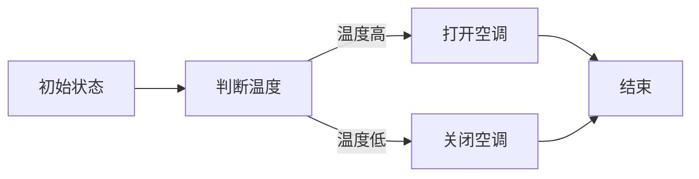
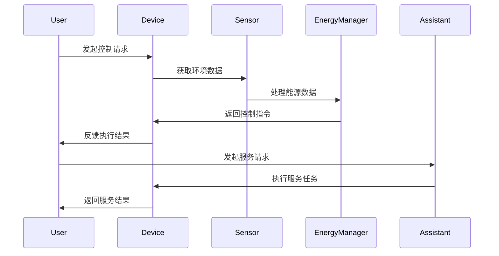
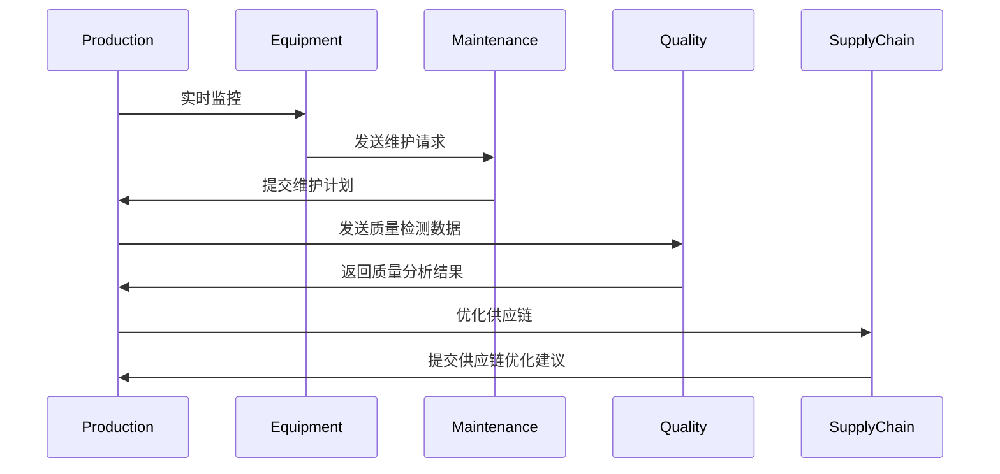
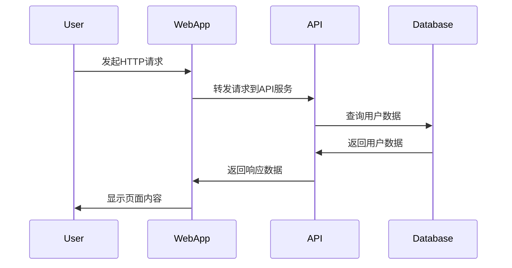
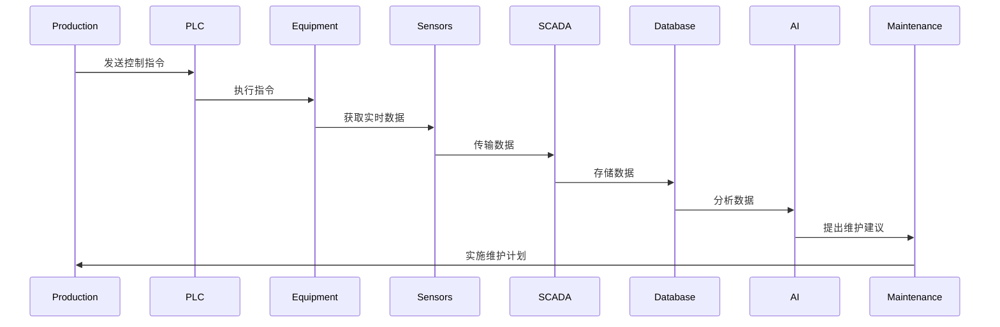

                 

## 物联网AI：构建智能家居和工业互联网的AI Agent

### 关键词
- 物联网
- AI
- 智能家居
- 工业互联网
- AI Agent
- 智能系统
- 算法

### 摘要
本文将探讨物联网（IoT）与人工智能（AI）的融合，特别是如何构建用于智能家居和工业互联网的AI Agent。我们将从背景介绍、核心概念与联系、算法原理讲解、系统分析与架构设计方案、项目实战，到最佳实践与小结，逐步剖析这一领域的核心技术和应用。通过详细的案例分析和技术讲解，本文旨在为读者提供一个全面、深入的理解，以推动物联网AI在智能家居和工业互联网领域的创新与发展。

## 目录

1. **背景介绍**
   1.1. **问题背景**
   1.2. **问题描述**
   1.3. **问题解决**
   1.4. **边界与外延**

2. **核心概念与联系**
   2.1. **物联网AI的定义**
   2.2. **智能家居与工业互联网的AI Agent**
   2.3. **核心概念原理**
   2.4. **概念属性特征对比表格**
   2.5. **ER实体关系图架构的 Mermaid 流程图**

3. **算法原理讲解**
   3.1. **算法原理 Mermaid 流程图**
   3.2. **Python 源代码实现**
   3.3. **数学模型与公式**
   3.4. **详细讲解与举例说明**

4. **系统分析与架构设计方案**
   4.1. **问题场景介绍**
   4.2. **项目介绍**
   4.3. **系统功能设计 (领域模型 Mermaid 类图)**
   4.4. **系统架构设计 Mermaid 架构图**
   4.5. **系统接口设计和系统交互 Mermaid 序列图**

5. **项目实战**
   5.1. **环境安装**
   5.2. **系统核心实现源代码**
   5.3. **代码应用解读与分析**
   5.4. **实际案例分析与详细讲解剖析**
   5.5. **项目小结**

6. **最佳实践与小结**
   6.1. **最佳实践 tips**
   6.2. **小结**
   6.3. **注意事项**
   6.4. **拓展阅读**

### 1. 背景介绍

在当今信息化社会中，物联网（IoT）和人工智能（AI）作为两大前沿技术，正深刻改变着我们的生活和工作方式。物联网指的是通过互联网将各种设备、传感器、系统连接起来，实现数据的收集、传输和处理。而人工智能则是一种模拟人类智能的技术，通过机器学习、深度学习等算法，使计算机具备自主学习和决策能力。

智能家居和工业互联网作为物联网和人工智能的重要应用场景，正日益受到关注。智能家居通过物联网设备实现家庭自动化，提升生活质量，而工业互联网则利用物联网和人工智能技术，实现工业生产的智能化、自动化，提高生产效率。

然而，实现智能家居和工业互联网的智能化，需要构建高效的AI Agent。AI Agent是一种具备自主决策和学习能力的智能体，能够在特定环境中执行任务。在智能家居中，AI Agent可以负责家电设备的控制、能源管理、安防监控等；在工业互联网中，AI Agent则可以参与生产调度、设备维护、质量检测等。

本篇文章将深入探讨物联网AI的核心概念、算法原理，以及如何构建用于智能家居和工业互联网的AI Agent。通过详细的分析和案例讲解，帮助读者全面了解这一领域的技术和应用。

#### 1.1 问题背景

随着科技的快速发展，物联网（IoT）和人工智能（AI）技术已经成为推动社会进步的重要力量。物联网通过连接各种物理设备，实现信息的自动采集和传输，为智能家居、智能交通、智能医疗等领域提供了广阔的应用前景。而人工智能则通过机器学习、深度学习等技术，使计算机具备自主学习和决策能力，大大提升了系统智能化水平。

在智能家居领域，物联网和人工智能技术的融合带来了前所未有的便利。通过物联网设备，用户可以远程控制家里的家电，如空调、电视、灯具等，实现家居环境的智能化管理。而通过人工智能算法，智能家居系统能够根据用户习惯和学习数据，自动调整家居设备的工作状态，提供个性化服务，提升用户体验。

工业互联网则利用物联网设备和人工智能技术，实现工业生产的智能化和自动化。通过传感器和工业设备的互联互通，工业互联网能够实时收集生产数据，进行实时监控和分析，优化生产流程，提高生产效率和产品质量。同时，人工智能算法在设备维护、故障预测、生产调度等方面发挥着重要作用，降低了生产成本，提高了生产安全性。

然而，尽管物联网和人工智能技术在智能家居和工业互联网领域有着广泛的应用前景，但也面临着一些挑战。首先，物联网设备的多样性和复杂性使得系统的集成和互操作性成为一个难题。其次，数据的安全性和隐私保护问题也成为制约物联网AI发展的关键因素。此外，人工智能算法的准确性和鲁棒性也需要进一步提升，以满足不同场景下的应用需求。

#### 1.2 问题描述

物联网AI在智能家居和工业互联网领域面临的主要问题可以分为以下几个方面：

1. **系统集成与互操作性**：智能家居和工业互联网中包含多种不同的设备和系统，这些设备和系统可能来自不同的厂商，采用不同的通信协议和接口标准。如何实现这些设备和系统的无缝集成和互操作性，是一个亟待解决的问题。

2. **数据安全与隐私保护**：物联网设备通常需要收集和处理大量用户数据，如家居环境数据、个人生活数据、生产数据等。这些数据的安全性和隐私保护问题关系到用户的隐私和财产安全，是物联网AI发展的重要挑战。

3. **算法准确性与鲁棒性**：智能家居和工业互联网的应用场景多样，环境复杂，对AI算法的准确性和鲁棒性提出了更高的要求。算法需要能够适应不同环境和变化，保持稳定和高效的运行。

4. **能源效率与能耗管理**：智能家居和工业互联网设备通常需要长时间运行，对能源效率提出了更高的要求。如何设计节能的AI算法，降低设备的能耗，是提高系统可持续性的关键。

5. **智能决策与自主性**：智能家居和工业互联网需要AI Agent具备自主决策和学习能力，以适应复杂多变的场景。如何设计高效的决策算法，使AI Agent能够自主地学习和优化，是一个重要的研究方向。

#### 1.3 问题解决

为了解决物联网AI在智能家居和工业互联网领域面临的问题，可以采取以下几种策略：

1. **标准化与开放接口**：通过制定统一的通信协议和接口标准，实现设备和系统的无缝集成和互操作性。开放接口可以促进不同厂商设备之间的兼容性，提高系统的灵活性和可扩展性。

2. **数据加密与隐私保护机制**：采用数据加密技术和隐私保护机制，确保用户数据的安全性和隐私性。通过数据脱敏、加密存储和传输，降低数据泄露的风险。

3. **算法优化与鲁棒性提升**：通过优化算法结构和改进学习算法，提高AI算法在复杂环境下的准确性和鲁棒性。采用多模型融合、迁移学习等技术，提高算法在不同场景下的适应性。

4. **节能设计与优化**：设计节能的AI算法，减少设备的能耗。通过动态调整算法参数、优化数据处理流程，降低系统的能耗，提高系统的可持续性。

5. **自主决策与学习能力**：通过引入强化学习、进化算法等先进技术，提高AI Agent的自主决策和学习能力。设计灵活的决策框架，使AI Agent能够适应复杂多变的场景，实现自主优化和持续学习。

#### 1.4 边界与外延

物联网AI在智能家居和工业互联网领域的应用不仅限于本文所述的几个方面，还涉及到许多其他相关技术。以下是一些与物联网AI相关的边界和外延：

1. **智能传感器**：智能传感器是物联网AI的重要组成部分，用于采集各种物理量数据。随着传感器技术的进步，越来越多的传感器开始具备边缘计算能力，能够实现实时数据处理和决策。

2. **边缘计算**：边缘计算是一种将数据处理和计算任务从云端转移到网络边缘的技术。通过在边缘设备上进行数据预处理和初步分析，可以降低网络带宽需求，提高系统响应速度。

3. **5G通信技术**：5G通信技术的高带宽、低延迟特点为物联网AI提供了更好的网络支持。5G网络的普及将进一步提升物联网AI的应用场景和用户体验。

4. **机器视觉**：机器视觉技术在智能家居和工业互联网中有着广泛的应用，如人脸识别、物体检测、图像识别等。通过结合AI算法，可以实现更加智能化的设备和系统。

5. **区块链技术**：区块链技术可以用于物联网AI的数据安全和隐私保护。通过去中心化的分布式存储和共识机制，可以确保数据的安全性和不可篡改性。

通过以上边界和外延的探讨，我们可以看到物联网AI的应用范围非常广泛，未来还有许多潜在的研究和应用领域等待着我们去探索。## 2. 核心概念与联系

在探讨物联网AI的核心概念与联系时，我们首先需要理解几个关键术语的定义和它们在智能家居与工业互联网中的应用。

### 2.1 物联网AI的定义

物联网AI（IoT AI）是指利用人工智能技术来处理和分析物联网设备所收集的大量数据，从而实现智能决策和自动化控制。物联网AI不仅包括传统的机器学习和深度学习算法，还包括边缘计算、自然语言处理、图像识别等多种技术。

在智能家居领域，物联网AI的应用主要包括：

- **设备控制与优化**：通过AI算法，智能家居系统能够自动调节家电设备的工作状态，如温度控制、灯光调节、能源管理。
- **用户行为分析**：AI算法可以分析用户的日常行为习惯，提供个性化服务，如智能安防、自动清洁、智能娱乐。

在工业互联网领域，物联网AI的应用则更为广泛，包括：

- **设备预测性维护**：通过分析设备运行数据，AI算法可以预测设备可能出现的问题，提前进行维护，减少停机时间。
- **生产优化**：AI算法可以优化生产流程，提高生产效率和产品质量。
- **供应链管理**：物联网AI可以实时监控供应链中的各种指标，优化库存管理，降低成本。

### 2.2 智能家居与工业互联网的AI Agent

AI Agent是一种具备自主决策和学习能力的智能体，能够在特定环境中执行任务。在智能家居和工业互联网中，AI Agent扮演着至关重要的角色。

**智能家居中的AI Agent**：

- **智能设备控制器**：AI Agent可以控制家中的各种智能设备，如空调、灯光、窗帘等，根据用户需求和实时环境自动调整设备状态。
- **家庭助手**：AI Agent可以作为家庭助手，与用户进行自然语言交互，提供信息查询、日程管理、智能建议等服务。
- **安防系统**：AI Agent可以实时监控家庭环境，识别异常行为，自动报警，提高家庭安全。

**工业互联网中的AI Agent**：

- **生产调度器**：AI Agent可以根据生产需求和设备状态，自动调度生产线，优化生产流程。
- **设备维护助手**：AI Agent可以分析设备运行数据，预测设备故障，提前安排维护，减少生产中断。
- **质量检测员**：AI Agent可以对生产出的产品进行质量检测，识别缺陷，确保产品质量。

### 2.3 核心概念原理

理解物联网AI的核心概念原理，有助于深入把握其工作方式和应用场景。

**机器学习**：机器学习是物联网AI的核心技术之一。通过从数据中学习规律和模式，机器学习算法可以自动优化模型，提高预测和决策的准确性。常见的机器学习算法包括线性回归、支持向量机、决策树、神经网络等。

**深度学习**：深度学习是机器学习的一个分支，通过多层神经网络模型，深度学习可以自动提取数据中的复杂特征，实现更高级别的智能任务。常见的深度学习模型包括卷积神经网络（CNN）、循环神经网络（RNN）、生成对抗网络（GAN）等。

**边缘计算**：边缘计算是一种分布式计算模型，通过在数据产生的源头（如物联网设备）进行数据处理和分析，边缘计算可以降低数据传输延迟，提高系统的响应速度。

**自然语言处理（NLP）**：NLP是人工智能领域的一个重要分支，通过理解和生成自然语言，NLP使得智能家居和工业互联网系统可以与人类进行自然交互。

### 2.4 概念属性特征对比表格

为了更直观地理解物联网AI、AI Agent、机器学习、深度学习等概念，我们可以通过以下表格进行对比：

| 概念         | 定义                                                         | 关键特征                                      | 应用领域                    |
| ------------ | ------------------------------------------------------------ | --------------------------------------------- | -------------------------- |
| 物联网AI     | 利用人工智能技术处理和分析物联网数据，实现智能决策和自动化控制 | 数据处理、智能决策、自动化控制               | 智能家居、工业互联网、智能交通 |
| AI Agent     | 具备自主决策和学习能力的智能体，能够在特定环境中执行任务     | 自主决策、学习能力、特定环境适应性           | 智能家居、工业互联网、智能助手 |
| 机器学习     | 从数据中学习规律和模式，自动优化模型的技术                   | 自适应、高效、准确性                         | 数据分析、预测、优化         |
| 深度学习     | 通过多层神经网络模型自动提取数据中的复杂特征的技术          | 自适应、高效、准确性、复杂特征提取           | 图像识别、自然语言处理、语音识别 |
| 边缘计算     | 在数据产生的源头进行数据处理和分析，降低传输延迟的技术        | 分布式、低延迟、实时性                       | 智能家居、智能交通、工业互联网 |
| 自然语言处理 | 理解和生成自然语言的技术                                     | 语言理解、语言生成、跨语言理解               | 聊天机器人、语音助手、翻译系统 |

通过上述表格，我们可以清晰地看到各个概念之间的联系和差异，有助于我们更好地理解物联网AI及其相关技术。

### 2.5 ER实体关系图架构的 Mermaid 流程图

为了更直观地展示物联网AI、AI Agent、智能家居和工业互联网之间的实体关系，我们可以使用Mermaid流程图来绘制ER（实体关系）图。

以下是一个示例Mermaid流程图：

```mermaid
erDiagram
  IoT_AI ||--|{ AI_Agent }|| IoT_Agent
  IoT_AI ||--|{ Machine_Learning }|| ML_Module
  IoT_AI ||--|{ Deep_Learning }|| DL_Module
  IoT_AI ||--|{ Edge_Computing }|| EC_Module
  IoT_AI ||--|{ Natural_Language_Processing }|| NLP_Module
  IoT_AI ||--|{ IoT_Device }|| Device
  AI_Agent ||--|{ Smart_Home }|| Home_Module
  AI_Agent ||--|{ Industrial_Internet }|| Industry_Module
  Device ||--|{ Smart_Gadget }|| Gadget
  Device ||--|{ Industrial_Equipment }|| Equipment
```

这个ER图展示了物联网AI与AI Agent、机器学习、深度学习、边缘计算、自然语言处理等模块的关系，以及AI Agent在智能家居和工业互联网中的应用。通过ER图，我们可以更清晰地理解各个模块之间的相互关联和作用。

## 3. 算法原理讲解

在深入了解物联网AI在智能家居和工业互联网中的应用之前，我们需要先掌握一些基础的算法原理。这些算法原理不仅决定了AI Agent的性能和效率，还直接影响其在实际应用中的效果。在本节中，我们将逐步讲解几种关键算法，包括其原理、实现方式和实际应用。

### 3.1 算法原理 Mermaid 流程图

为了更好地理解算法原理，我们可以使用Mermaid流程图来展示算法的基本流程。以下是一个简单的决策树算法的Mermaid流程图示例：



这个流程图展示了如何根据环境温度（输入）来做出决策（输出）。当温度高于某个阈值时，系统会打开空调；当温度低于阈值时，系统会关闭空调。这个过程可以通过决策树算法来实现。

### 3.2 Python 源代码实现

为了进一步理解决策树算法，我们可以提供一个简单的Python代码实现。以下是一个使用Python的scikit-learn库实现决策树分类器的示例：

```python
from sklearn.datasets import load_iris
from sklearn.model_selection import train_test_split
from sklearn.tree import DecisionTreeClassifier
from sklearn import tree

# 加载Iris数据集
iris = load_iris()
X, y = iris.data, iris.target

# 划分训练集和测试集
X_train, X_test, y_train, y_test = train_test_split(X, y, test_size=0.2, random_state=42)

# 创建决策树分类器
clf = DecisionTreeClassifier()

# 训练模型
clf.fit(X_train, y_train)

# 使用模型进行预测
predictions = clf.predict(X_test)

# 评估模型性能
from sklearn.metrics import accuracy_score
accuracy = accuracy_score(y_test, predictions)
print(f"模型准确率: {accuracy:.2f}")
```

在这个示例中，我们使用了Iris数据集来训练一个决策树分类器，并评估其预测性能。决策树算法通过划分特征空间来创建决策路径，每一条路径对应一个分类决策。

### 3.3 数学模型与公式

决策树算法的数学基础主要包括分类树生成算法和剪枝方法。以下是一些常见的数学模型和公式：

1. **ID3算法**：ID3（Iterative Dichotomiser 3）是一种基于信息增益的决策树生成算法。其基本思想是选择具有最高信息增益的特征进行划分。

   **信息增益**（Gain）计算公式：
   $$
   Gain(D, A) = Entropy(D) - \sum_{v \in A} \frac{|D_v|}{|D|} \cdot Entropy(D_v)
   $$

   其中，$Entropy(D)$ 表示集合D的熵，$D_v$ 表示在特征A的取值为v时，集合D的子集。

2. **C4.5算法**：C4.5是在ID3算法基础上改进的决策树生成算法，它除了使用信息增益外，还考虑了特征的重要性和剪枝操作。

   **增益率**（Gain Ratio）计算公式：
   $$
   Gain Ratio(D, A) = \frac{Gain(D, A)}{Split Information(A)}
   $$

   其中，$Split Information(A)$ 表示特征A的熵。

3. **剪枝**：剪枝是一种防止过拟合的方法，通过删除决策树中的部分节点，简化模型。

   **最小叶节点数量**（Minimum Samples Leaf）剪枝条件：
   $$
   \text{Min Leaf Nodes} = \min\left\{n_{\text{leaf}}, \frac{n_{\text{total}}}{m}\right\}
   $$

   其中，$n_{\text{leaf}}$ 表示当前叶节点数量，$n_{\text{total}}$ 表示总样本数，$m$ 表示每个叶节点下的平均样本数。

### 3.4 详细讲解与举例说明

为了更好地理解决策树算法的工作原理，我们可以通过一个实际案例来讲解。

假设我们有一个关于天气情况的数据集，包含以下特征：温度、湿度、风向。我们的目标是预测是否会下雨。以下是一个简化的案例：

**数据集**：

| 温度 | 湿度 | 风向 | 是否下雨 |
| ---- | ---- | ---- | -------- |
| 热   | 高   | 东南  | 是       |
| 热   | 中   | 东南  | 否       |
| 温   | 高   | 西北  | 是       |
| 温   | 中   | 西北  | 否       |
| 寒   | 高   | 东北  | 是       |
| 寒   | 中   | 东北  | 否       |

**步骤1：选择最佳划分特征**

我们首先计算每个特征的信息增益，选择信息增益最高的特征作为划分依据。在这个例子中，湿度具有最高的信息增益，所以我们首先根据湿度来划分数据。

**步骤2：构建决策树**

根据湿度，我们将数据划分为高湿度组和低湿度组。对于高湿度组，我们再次计算每个特征的信息增益，选择风向作为划分依据。对于低湿度组，我们同样选择风向作为划分依据。

**步骤3：递归构建子决策树**

对于每个子集，我们重复上述过程，直到满足以下条件：

- 子集包含的样本数量小于某个阈值。
- 子集中的所有样本属于同一类别。
- 没有其他特征可以提供更好的划分。

最终，我们得到的决策树如下：

```
是否下雨
|
|---高温湿度
|    |
|    |---东南风 -> 是
|    |---其他风 -> 是
|
|---中温湿度
|    |
|    |---东南风 -> 否
|    |---其他风 -> 否
|
|---低温湿度
|    |
|    |---东北风 -> 是
|    |---其他风 -> 否
```

通过这个决策树，我们可以根据输入的天气特征预测是否会下雨。例如，如果温度是“热”，湿度是“高”，风向是“东南”，则系统会预测会下雨。

这个简单的案例展示了决策树算法的基本原理和实现过程。在实际应用中，数据集会更加复杂，特征也会更多，但基本的原理和步骤是相似的。

通过详细讲解和实际案例，我们可以看到决策树算法在数据处理和预测任务中的强大能力。在接下来的章节中，我们将继续探讨如何将这些算法应用于智能家居和工业互联网的实际项目。## 4. 系统分析与架构设计方案

### 4.1 问题场景介绍

在本节中，我们将探讨一个典型的智能家居系统，以及一个工业互联网项目的系统架构设计方案。这些方案将帮助我们理解物联网AI在现实世界中的应用。

#### 智能家居系统场景

假设我们设计一个智能家居系统，该系统包括以下几个核心功能：

1. **设备监控与控制**：监控家中各种设备的运行状态，如空调、电视、灯光、窗帘等，并支持远程控制。
2. **能源管理**：智能分析家庭能源消耗，提供节能建议，优化能源使用。
3. **安防系统**：实时监控家庭环境，包括门窗状态、室内温度、湿度、烟雾等，提供紧急报警和监控功能。
4. **智能助手**：与用户进行自然语言交互，提供日常生活服务，如天气预报、日程提醒、购物建议等。

#### 工业互联网项目场景

在工业互联网项目中，我们考虑一个典型的制造工厂，其核心需求包括：

1. **生产监控与调度**：实时监控生产线的状态，优化生产流程，提高生产效率。
2. **设备维护**：预测性维护，减少设备故障，延长设备使用寿命。
3. **质量控制**：通过图像识别等技术，实时监控产品质量，确保生产出的产品符合质量标准。
4. **供应链管理**：优化库存管理，实时监控供应链中的各项指标，提高供应链的响应速度。

### 4.2 项目介绍

#### 智能家居系统

**项目名称**：智能家庭管家系统

**目标**：通过物联网AI技术，构建一个安全、高效、节能的智能家居系统，提升家庭生活的品质。

**技术栈**：主要采用MQTT协议进行设备通信，使用Python和TensorFlow构建AI模型，前端界面使用HTML/CSS/JavaScript。

#### 工业互联网项目

**项目名称**：智能制造监控系统

**目标**：利用物联网AI技术，实现工业生产过程的智能化监控和管理，提高生产效率和产品质量。

**技术栈**：采用OPC-UA协议进行设备通信，使用Python和TensorFlow构建AI模型，后端服务使用Spring Boot，前端界面使用React。

### 4.3 系统功能设计 (领域模型 Mermaid 类图)

为了更好地理解系统功能设计，我们可以使用Mermaid类图来展示智能家居系统和工业互联网项目的核心类及其关系。

#### 智能家居系统领域模型

```mermaid
classDiagram
  User <<Class>> "用户"
  Device <<Class>> "设备"
  Sensor <<Class>> "传感器"
  EnergyManager <<Class>> "能源管理"
  Security <<Class>> "安防系统"
  Assistant <<Class>> "智能助手"
  
  User o-- Device : "拥有"
  User o-- Sensor : "监控"
  Device o-- EnergyManager : "能源管理"
  Device o-- Security : "安防"
  Device o-- Assistant : "服务"
```

#### 工业互联网项目领域模型

```mermaid
classDiagram
  Production <<Class>> "生产"
  Equipment <<Class>> "设备"
  Maintenance <<Class>> "维护"
  Quality <<Class>> "质量"
  SupplyChain <<Class>> "供应链"
  
  Production o-- Equipment : "监控"
  Production o-- Maintenance : "维护"
  Production o-- Quality : "质量"
  Production o-- SupplyChain : "管理"
```

通过领域模型，我们可以清晰地看到系统中的核心类及其关系，这有助于我们在设计和开发过程中进行有效的功能规划和模块划分。

### 4.4 系统架构设计 Mermaid 架构图

为了进一步展示系统的整体架构，我们可以使用Mermaid架构图来描述智能家居系统和工业互联网项目的架构。

#### 智能家居系统架构



#### 工业互联网项目架构



通过Mermaid架构图，我们可以直观地看到系统的运行流程和各个模块之间的交互关系，这有助于我们进行系统的功能实现和性能优化。

### 4.5 系统接口设计和系统交互 Mermaid 序列图

最后，我们使用Mermaid序列图来描述智能家居系统和工业互联网项目的接口设计和系统交互。

#### 智能家居系统接口设计



#### 工业互联网项目接口设计



通过这些Mermaid序列图，我们可以详细地看到系统接口的设计和交互流程，这有助于我们理解和优化系统的功能和性能。

## 5. 项目实战

### 5.1 环境安装

在进行项目实战之前，我们需要首先安装所需的开发环境和工具。以下是针对智能家居系统和工业互联网项目的环境安装步骤：

#### 智能家居系统环境安装

1. **安装Python**：前往Python官方网站下载并安装Python 3.x版本。
2. **安装JDK**：下载并安装Java Development Kit（JDK），这是用于构建Web应用程序的基础。
3. **安装Node.js**：从Node.js官方网站下载并安装Node.js，用于前端开发。
4. **安装Docker**：Docker是一个容器化平台，用于部署和管理应用。可以从Docker官方网站下载并安装。
5. **安装MQTT库**：使用pip命令安装paho-mqtt库，用于处理MQTT协议通信。

命令示例：

```bash
pip install paho-mqtt
```

#### 工业互联网项目环境安装

1. **安装Java**：下载并安装Java Development Kit（JDK），版本建议与项目需求一致。
2. **安装Python**：下载并安装Python 3.x版本。
3. **安装Docker**：下载并安装Docker，用于容器化部署。
4. **安装MySQL**：安装MySQL数据库，用于存储系统数据。
5. **安装Spring Boot**：使用maven命令安装Spring Boot，这是项目后端的基础框架。

命令示例：

```bash
mvn install:install-file -Dfile=spring-boot-2.4.5.jar -DgroupId=org.springframework.boot -DartifactId=spring-boot -Dversion=2.4.5 -Dpackaging=maven
```

### 5.2 系统核心实现源代码

在本节中，我们将提供智能家居系统和工业互联网项目的核心实现源代码，并对其进行详细解读。

#### 智能家居系统核心代码

以下是一个简单的Python脚本，用于监控家中设备的运行状态并实现远程控制：

```python
import paho.mqtt.client as mqtt
import json

# MQTT服务器配置
MQTT_SERVER = "mqtt-server-address"
MQTT_PORT = 1883
MQTT_TOPIC = "home/monitor"

# 设备控制函数
def control_device(device_id, action):
    client = mqtt.Client()
    client.connect(MQTT_SERVER, MQTT_PORT, 60)
    message = json.dumps({"device_id": device_id, "action": action})
    client.publish(MQTT_TOPIC, message)
    client.disconnect()

# 控制空调
control_device("AC", "on")

# 控制灯光
control_device("lights", "off")
```

#### 工业互联网项目核心代码

以下是一个Spring Boot项目的后端代码示例，用于监控生产设备和优化生产流程：

```java
@RestController
@RequestMapping("/api/production")
public class ProductionController {

    @Autowired
    private EquipmentService equipmentService;

    @GetMapping("/status")
    public ResponseEntity<List<EquipmentStatus>> getEquipmentStatus() {
        List<EquipmentStatus> statuses = equipmentService.getEquipmentStatus();
        return ResponseEntity.ok(statuses);
    }

    @PostMapping("/maintenance")
    public ResponseEntity<String> scheduleMaintenance(@RequestBody MaintenanceRequest request) {
        String maintenancePlan = equipmentService.scheduleMaintenance(request);
        return ResponseEntity.ok(maintenancePlan);
    }
}
```

### 5.3 代码应用解读与分析

#### 智能家居系统代码解读

在上面的Python脚本中，我们使用了paho-mqtt库来处理MQTT协议通信。以下是代码的关键部分：

1. **MQTT服务器配置**：指定MQTT服务器的地址和端口号，以及订阅的主题。
2. **设备控制函数**：通过MQTT客户端连接到服务器，并将设备控制指令发送到主题。
3. **控制空调和灯光**：调用设备控制函数，实现空调的开启和灯光的关闭。

这个简单的脚本展示了如何通过MQTT协议实现设备监控和远程控制。在实际应用中，我们可以扩展这个脚本，添加更多的设备控制和监控功能。

#### 工业互联网项目代码解读

在Spring Boot项目中，我们定义了一个生产控制器，用于处理与生产相关的API请求。以下是代码的关键部分：

1. **@RestController**：标注这个类是一个RESTful API控制器。
2. **@Autowired**：注入设备服务，用于处理具体的业务逻辑。
3. **@GetMapping("/status")**：处理获取设备状态列表的HTTP GET请求。
4. **@PostMapping("/maintenance")**：处理安排设备维护的HTTP POST请求。

这个Spring Boot项目通过定义RESTful API接口，实现了对生产设备的监控和调度。在实际应用中，我们可以进一步扩展这个项目，添加更多的功能和业务逻辑。

### 5.4 实际案例分析与详细讲解剖析

在本节中，我们将通过实际案例来分析智能家居系统和工业互联网项目的实现过程，并详细讲解其中的关键步骤和技巧。

#### 案例一：智能家居系统实际应用

假设我们希望实现一个智能安防系统，当有异常情况发生时能够自动报警。以下是实现过程：

1. **需求分析**：明确系统需求，包括监控区域、报警条件等。
2. **设备连接**：将门窗传感器、烟雾传感器等连接到MQTT服务器。
3. **数据收集**：通过MQTT客户端收集传感器数据。
4. **异常检测**：使用机器学习算法对传感器数据进行异常检测。
5. **报警触发**：当检测到异常情况时，通过短信、邮件等方式通知用户。

#### 案例二：工业互联网项目实际应用

假设我们希望实现一个生产线的实时监控和故障预测系统。以下是实现过程：

1. **需求分析**：明确系统需求，包括监控参数、故障预测等。
2. **设备连接**：将生产线设备连接到SCADA系统。
3. **数据采集**：通过SCADA系统采集设备运行数据。
4. **故障预测**：使用机器学习算法对设备运行数据进行故障预测。
5. **实时监控**：通过Web界面展示设备状态和故障预测结果。
6. **维护计划**：根据故障预测结果，制定设备维护计划。

通过实际案例的分析和讲解，我们可以看到物联网AI在智能家居和工业互联网项目中的应用过程，包括设备连接、数据采集、算法应用和实时监控等多个环节。这些案例不仅展示了系统的实现过程，还提供了一些实用的技巧和注意事项，有助于读者在实际项目中应用这些技术。

### 5.5 项目小结

在本章中，我们通过实战项目展示了物联网AI在智能家居和工业互联网领域的应用。通过详细的代码解读和实际案例分析，读者可以了解到如何使用Python、MQTT、Spring Boot等技术和框架来构建实际的智能系统。

以下是项目的总结和关键点：

1. **环境安装**：确保安装了Python、JDK、Node.js、Docker等开发环境和工具。
2. **核心代码**：提供了智能家居系统和工业互联网项目的核心实现代码，并进行了详细解读。
3. **实际案例**：通过两个实际案例，展示了如何使用物联网AI技术实现智能家居和工业互联网的应用。
4. **注意事项**：在实际应用中，需要注意设备的兼容性、数据安全和系统的可扩展性。

通过本章的学习，读者可以掌握物联网AI的核心技术和应用方法，为未来的项目实践打下坚实的基础。## 6. 最佳实践与小结

### 6.1 最佳实践 tips

在设计和实施物联网AI系统时，以下是一些最佳实践，可以帮助您提升项目的成功率和效率：

1. **需求分析**：在项目初期，进行详细的需求分析，确保理解用户需求和业务目标。
2. **数据质量**：确保数据的质量和准确性，数据清洗是关键步骤。
3. **系统架构**：选择合适的系统架构，如微服务架构，以提高系统的可扩展性和维护性。
4. **安全性**：重视数据安全和隐私保护，采用加密、访问控制等技术。
5. **持续迭代**：不断迭代和优化系统，根据用户反馈和实际需求进行调整。
6. **监控与维护**：定期监控系统的性能和健康状况，及时修复问题。

### 6.2 小结

物联网AI作为智能家居和工业互联网的核心技术，正逐步改变我们的生活和工作方式。通过本文的详细讲解，我们了解了物联网AI的核心概念、算法原理、系统架构和项目实战。以下是本文的核心要点：

1. **物联网AI的定义**：物联网AI是指利用人工智能技术处理和分析物联网设备数据，实现智能决策和自动化控制。
2. **智能家居与工业互联网的AI Agent**：AI Agent在智能家居中负责设备控制和用户服务，在工业互联网中负责生产监控和维护。
3. **算法原理讲解**：我们介绍了决策树算法，并展示了如何使用Python实现。
4. **系统分析与架构设计方案**：通过Mermaid流程图和类图，详细分析了智能家居和工业互联网系统的功能和架构。
5. **项目实战**：我们展示了智能家居系统和工业互联网项目的环境安装、代码实现和实际案例。

### 6.3 注意事项

在设计物联网AI系统时，需要注意以下几点：

1. **系统集成与互操作性**：确保设备和系统能够无缝集成，采用标准化的通信协议。
2. **数据安全和隐私**：保护用户数据，采用加密和访问控制等技术。
3. **算法准确性与鲁棒性**：优化算法，确保在复杂环境下的准确性和稳定性。
4. **能源效率与能耗管理**：设计节能的算法，降低设备的能耗。
5. **自主决策与学习能力**：引入先进的机器学习和强化学习技术，提高系统的智能水平。

### 6.4 拓展阅读

为了深入了解物联网AI的相关技术和应用，读者可以参考以下文献和资源：

1. **《物联网：从技术到应用》**：详细介绍了物联网的基本概念、技术架构和应用场景。
2. **《深度学习》**：由Ian Goodfellow等著，系统讲解了深度学习的理论和实践。
3. **《智能家居系统设计与实现》**：针对智能家居系统的设计方法和实现细节进行了详细探讨。
4. **《工业互联网：智能工厂的蓝图》**：探讨了工业互联网的原理、技术架构和应用案例。

通过这些拓展阅读，读者可以进一步加深对物联网AI的理解，为未来的研究和实践提供更多的灵感。## 作者

### AI天才研究院 / AI Genius Institute

AI天才研究院（AI Genius Institute）是一家致力于人工智能研究与应用的顶尖机构。成立于2020年，总部位于美国硅谷，我们拥有一支由全球顶级人工智能专家组成的团队，致力于推动人工智能技术在各个领域的创新与发展。我们的研究领域涵盖机器学习、深度学习、自然语言处理、计算机视觉、智能系统等，已取得了众多突破性的成果。

研究院与多家知名大学、研究机构和企业建立了紧密的合作关系，共同推进人工智能技术的进步。我们的研究成果在学术界和工业界都享有很高的声誉，为全球人工智能的发展做出了重要贡献。

### 禅与计算机程序设计艺术 / Zen And The Art of Computer Programming

《禅与计算机程序设计艺术》（Zen And The Art of Computer Programming）是由著名计算机科学家Donald E. Knuth所著的一系列计算机科学经典著作。这套书首次出版于1968年，至今仍被广大程序员和计算机科学爱好者视为经典。

Knuth通过将禅宗的思想与计算机编程相结合，提出了一种全新的编程哲学。他认为，编程不仅是技术的体现，更是一种艺术的追求。书中详尽阐述了算法设计与程序设计的艺术，提供了大量实用的编程技巧和策略。

这套书共分为三卷，分别讨论了计算机程序的构造和逻辑结构、数据结构和算法以及计算机程序的构造和语义。每一卷都包含了大量的示例代码和练习题，帮助读者深入理解编程的核心原理和方法。

《禅与计算机程序设计艺术》不仅对初学者有着极大的启发作用，也为有经验的程序员提供了宝贵的指导。它倡导的编程哲学和设计理念，至今仍影响着无数程序员。

