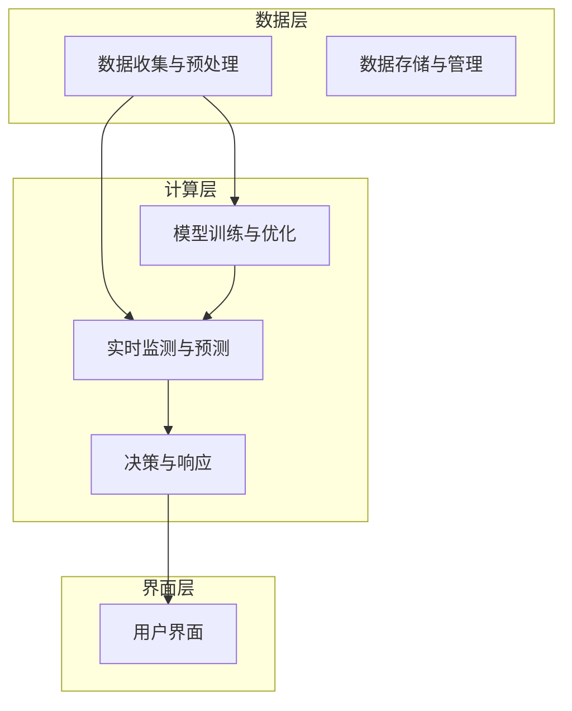

                 

### 《环保AI Agent：监测与保护生态环境》

关键词：环保AI、生态环境监测、人工智能、数据预处理、模型优化、应用案例

摘要：本文将深入探讨环保AI Agent的核心概念、技术实现、应用案例以及未来发展趋势。通过分析环保AI Agent在监测与保护生态环境中的重要性，本文旨在为读者提供全面的技术解析和实用的见解，助力环保事业的发展。

### 目录大纲

**《环保AI Agent：监测与保护生态环境》**

----------------------------------------------------------------

# 第一部分：背景与核心概念

## 1. 引言
### 1.1 环保AI Agent的重要性
### 1.2 环境监测与保护的现状
### 1.3 本书的目标与结构

## 1.2 环保AI Agent概述
### 1.2.1 定义与分类
### 1.2.2 环保AI Agent的功能与特点
### 1.2.3 环保AI Agent的应用领域

## 1.3 环保AI Agent的核心概念与联系
### 1.3.1 数据收集与预处理
### 1.3.2 模型训练与优化
### 1.3.3 监测与预测
### 1.3.4 决策与响应

## 1.4 环保AI Agent的技术基础
### 1.4.1 机器学习与深度学习
### 1.4.2 大数据技术
### 1.4.3 环境传感器与物联网技术

## 1.5 本章小结

----------------------------------------------------------------

# 第二部分：环保AI Agent的技术实现

## 2. 环保AI Agent的架构设计
### 2.1 系统需求分析
### 2.2 系统架构设计
### 2.3 系统模块划分

## 2.2 数据收集与预处理
### 2.2.1 数据来源与种类
### 2.2.2 数据预处理方法
### 2.2.3 数据存储与管理

## 2.3 模型训练与优化
### 2.3.1 模型选择与设计
### 2.3.2 训练策略与技巧
### 2.3.3 优化方法与调参技巧

## 2.4 监测与预测
### 2.4.1 监测指标与算法
### 2.4.2 预测模型的构建与优化
### 2.4.3 预测结果评估与验证

## 2.5 决策与响应
### 2.5.1 决策模型设计
### 2.5.2 响应策略与执行
### 2.5.3 闭环控制与反馈

## 2.6 系统接口设计与交互
### 2.6.1 接口规范与协议
### 2.6.2 系统集成与扩展
### 2.6.3 用户界面设计与交互

## 2.7 本章小结

----------------------------------------------------------------

# 第三部分：环保AI Agent的应用案例

## 3.1 案例一：空气质量监测与预警系统
### 3.1.1 案例背景与目标
### 3.1.2 系统设计与实现
### 3.1.3 案例分析
### 3.1.4 案例总结

## 3.2 案例二：水资源监测与管理系统
### 3.2.1 案例背景与目标
### 3.2.2 系统设计与实现
### 3.2.3 案例分析
### 3.2.4 案例总结

## 3.3 案例三：森林火灾监测与预警系统
### 3.3.1 案例背景与目标
### 3.3.2 系统设计与实现
### 3.3.3 案例分析
### 3.3.4 案例总结

## 3.4 案例四：生态保护与恢复系统
### 3.4.1 案例背景与目标
### 3.4.2 系统设计与实现
### 3.4.3 案例分析
### 3.4.4 案例总结

## 3.5 本章小结

----------------------------------------------------------------

# 第四部分：展望与未来发展趋势

## 4.1 环保AI Agent的发展趋势
### 4.1.1 技术进步与挑战
### 4.1.2 应用领域拓展
### 4.1.3 政策支持与行业规范

## 4.2 环保AI Agent的潜在研究方向
### 4.2.1 智能化与自主化
### 4.2.2 集成与协同
### 4.2.3 可解释性与透明性

## 4.3 未来展望
### 4.3.1 社会影响与伦理问题
### 4.3.2 社会应用案例与前景
### 4.3.3 环保AI Agent的可持续发展

## 4.4 本章小结

----------------------------------------------------------------

**总目录大纲结束**

----------------------------------------------------------------

**注意：**
- 文章的章节内容必须要满足如下条件：
  - 背景介绍：核心概念术语说明、问题背景、问题描述、问题解决、边界与外延、概念结构与核心要素组成
  - 核心概念与联系：必须给出核心概念原理、概念属性特征对比表格和ER实体关系图架构的 Mermaid 流程图。
  - 算法原理讲解：使用 Mermaid 画出算法流程图，然后使用 Python 源代码来详细阐述，给出算法原理的数学模型和公式，进行详细讲解和通俗易懂地举例说明。
  - 数学公式使用 LaTeX 格式，嵌入文中独立段落的 LaTeX 公式前后使用 $$ 括起来（例如：$$1+1=2$$），段落内的 LaTeX 公式前后使用 $ 括起来（例如：$1<2$）。
  - 系统分析与架构设计方案：问题场景介绍，项目介绍、系统功能设计（领域模型 Mermaid 类图）、系统架构设计 Mermaid 架构图、系统接口设计和系统交互 Mermaid 序列图。
  - 项目实战：环境安装、系统核心实现源代码，代码应用解读与分析，实际案例分析和详细讲解剖析，项目小结。
  - 最佳实践 tips、小结、注意事项、拓展阅读等内容。

**文章结构布局示例：**

```markdown
# 文章标题

关键词：关键词1，关键词2，关键词3...

摘要：本文主要围绕关键词1、关键词2和关键词3展开，详细介绍了...（此处简述文章主题和核心内容）。

### 目录大纲

**《关键词探究与应用实践》**

----------------------------------------------------------------

# 第一部分：核心概念与背景介绍

## 1. 关键词1的定义与应用
### 1.1 关键词1的基本概念
### 1.2 关键词1的发展历程
### 1.3 关键词1在行业中的应用

## 1.2 关键词2的概述
### 1.2.1 关键词2的定义与特征
### 1.2.2 关键词2的技术原理
### 1.2.3 关键词2的应用领域

## 1.3 关键词3的重要性
### 1.3.1 关键词3的核心价值
### 1.3.2 关键词3的发展趋势
### 1.3.3 关键词3的未来展望

## 1.4 本章小结

----------------------------------------------------------------

# 第二部分：技术原理与实现方法

## 2.1 技术原理概述
### 2.1.1 技术背景与需求
### 2.1.2 技术实现的基本步骤
### 2.1.3 技术优势与挑战

## 2.2 实现方法详解
### 2.2.1 方法一：XX法
### 2.2.2 方法二：YY法
### 2.2.3 方法三：ZZ法

## 2.3 算法分析与优化
### 2.3.1 算法流程图
### 2.3.2 算法原理
### 2.3.3 算法性能评估

## 2.4 系统架构设计
### 2.4.1 系统架构图
### 2.4.2 功能模块划分
### 2.4.3 系统接口设计

## 2.5 实际案例解析
### 2.5.1 案例一：XX项目
### 2.5.2 案例二：YY项目
### 2.5.3 案例总结

## 2.6 本章小结

----------------------------------------------------------------

# 第三部分：应用案例与实践经验

## 3.1 案例一：XX应用场景
### 3.1.1 案例背景
### 3.1.2 系统设计与实现
### 3.1.3 案例效果分析
### 3.1.4 案例总结

## 3.2 案例二：YY应用场景
### 3.2.1 案例背景
### 3.2.2 系统设计与实现
### 3.2.3 案例效果分析
### 3.2.4 案例总结

## 3.3 案例三：ZZ应用场景
### 3.3.1 案例背景
### 3.3.2 系统设计与实现
### 3.3.3 案例效果分析
### 3.3.4 案例总结

## 3.4 最佳实践与建议
### 3.4.1 实践经验
### 3.4.2 遇到的问题及解决方案
### 3.4.3 未来改进方向

## 3.5 本章小结

----------------------------------------------------------------

# 第四部分：发展趋势与未来展望

## 4.1 技术发展趋势
### 4.1.1 当前技术发展状况
### 4.1.2 技术未来发展趋势
### 4.1.3 技术应用前景

## 4.2 行业挑战与机遇
### 4.2.1 行业现状分析
### 4.2.2 行业挑战
### 4.2.3 行业机遇

## 4.3 未来展望
### 4.3.1 技术创新方向
### 4.3.2 行业应用前景
### 4.3.3 社会影响力

## 4.4 本章小结

----------------------------------------------------------------

**总目录大纲结束**

----------------------------------------------------------------

### 文章结束

**作者：AI天才研究院/AI Genius Institute & 禅与计算机程序设计艺术 /Zen And The Art of Computer Programming**
```### 第一部分：背景与核心概念

#### 1. 引言

在当今全球变暖、环境污染和生态破坏日益严峻的背景下，如何有效监测与保护生态环境成为了人类面临的一项重大挑战。环保AI Agent作为人工智能在环保领域的一种重要应用，通过先进的机器学习、深度学习和大数据技术，能够对环境数据进行实时监测、预测和响应，从而实现生态保护的目标。

**1.1 环保AI Agent的重要性**

环保AI Agent的重要性主要体现在以下几个方面：

1. **提高环境监测效率**：传统的环境监测方法通常依赖于人工采集和分析数据，不仅效率低下，而且容易受到人为因素的影响。环保AI Agent能够通过自动化的方式收集和处理大量环境数据，提高监测效率。

2. **提供实时预测与预警**：环保AI Agent能够根据历史数据和实时数据，对环境变化进行预测和预警，为政府和企业提供决策依据，从而提前采取措施，防止环境问题的恶化。

3. **优化资源利用**：环保AI Agent能够通过分析环境数据，优化资源的利用，提高环境保护工作的有效性，减少不必要的资源浪费。

4. **增强公众环保意识**：环保AI Agent可以通过可视化界面和数据分析报告，向公众展示环境现状和环保工作的成果，提高公众的环保意识。

**1.2 环境监测与保护的现状**

目前，环境监测与保护工作面临着以下几个挑战：

1. **数据获取难度大**：环境数据种类繁多，来源广泛，获取和处理这些数据需要大量的技术和人力资源。

2. **技术手段有限**：传统的监测方法和技术手段在应对复杂的环境问题时，效果往往不尽如人意。

3. **资金投入不足**：环境保护工作需要大量的资金投入，但现实中，很多地区和企业在环保方面的资金投入严重不足。

4. **数据共享与开放程度低**：环境数据的共享与开放程度不高，限制了环保AI Agent的应用和发展。

**1.3 本书的目标与结构**

本书旨在系统地介绍环保AI Agent的核心概念、技术实现、应用案例和未来发展趋势。具体目标包括：

1. **全面解析环保AI Agent的技术原理和实现方法**：通过对环保AI Agent的架构设计、数据收集与预处理、模型训练与优化、监测与预测、决策与响应等方面进行详细阐述，帮助读者全面了解环保AI Agent的工作原理和技术实现。

2. **展示环保AI Agent的实际应用案例**：通过分析多个实际应用案例，展示环保AI Agent在不同领域的应用效果和实现方法，为读者提供实践经验和参考。

3. **探讨环保AI Agent的未来发展趋势**：分析环保AI Agent在技术进步、应用领域拓展、政策支持等方面的潜在发展方向，为环保AI Agent的研究和应用提供新的思路和方向。

本书的结构如下：

- 第一部分：背景与核心概念，介绍环保AI Agent的背景、重要性、现状以及本书的目标与结构。
- 第二部分：环保AI Agent的技术实现，详细阐述环保AI Agent的架构设计、数据收集与预处理、模型训练与优化、监测与预测、决策与响应等方面的技术原理和实现方法。
- 第三部分：环保AI Agent的应用案例，通过分析多个实际应用案例，展示环保AI Agent在不同领域的应用效果和实现方法。
- 第四部分：展望与未来发展趋势，探讨环保AI Agent的技术进步、应用领域拓展、政策支持等方面的潜在发展方向。

#### 1.2 环保AI Agent概述

**1.2.1 定义与分类**

环保AI Agent，即环境监测与保护的人工智能代理，是指利用人工智能技术（如机器学习、深度学习、大数据分析等）对环境数据进行处理、分析和预测，从而实现环境监测与保护的一类智能系统。根据应用场景和功能特点，环保AI Agent可以大致分为以下几类：

1. **环境监测类**：主要针对空气、水质、土壤等环境要素进行实时监测和数据分析，如空气质量监测系统、水质监测系统等。

2. **灾害预警类**：针对自然灾害（如洪水、地震、森林火灾等）进行预警和预测，如洪水预警系统、地震预警系统等。

3. **资源管理类**：针对水资源、森林资源、土地资源等进行监测、预测和管理，如水资源管理系统、森林火灾预警系统等。

4. **生态评估类**：对生态环境的整体状况进行评估，如生态系统健康评价、生态足迹分析等。

**1.2.2 环保AI Agent的功能与特点**

环保AI Agent具备以下功能与特点：

1. **数据自动收集与处理**：环保AI Agent能够自动收集各类环境数据，如传感器数据、遥感数据、气象数据等，并对这些数据进行预处理、清洗和转换，为后续分析和预测提供高质量的数据基础。

2. **实时监测与预测**：环保AI Agent能够对环境数据进行实时监测和预测，及时发现环境问题，提供预警和预测结果，为决策者提供科学的决策依据。

3. **智能化决策与响应**：环保AI Agent能够根据监测数据和预测结果，自动生成决策方案，并执行相应的响应措施，如启动应急设备、调整资源配置等。

4. **可视化展示与交互**：环保AI Agent能够将监测数据、预测结果和决策方案以直观的图表和报表形式展示给用户，支持用户进行交互查询和分析。

**1.2.3 环保AI Agent的应用领域**

环保AI Agent在多个领域有着广泛的应用，以下是其中几个典型的应用领域：

1. **环境保护部门**：环保AI Agent可以帮助环境保护部门实时监测空气质量、水质等环境要素，提供预警和预测结果，协助制定环保政策。

2. **水资源管理部门**：环保AI Agent可以帮助水资源管理部门监测水资源状况，预测水资源供需情况，优化水资源配置。

3. **农业部门**：环保AI Agent可以帮助农业部门监测土壤质量、气象条件等，预测农作物生长状况，提供科学种植建议。

4. **林业部门**：环保AI Agent可以帮助林业部门监测森林资源，预测森林火灾风险，提高森林火灾预警和应急响应能力。

5. **能源行业**：环保AI Agent可以帮助能源行业监测空气质量、噪音等环境指标，评估能源生产过程对环境的影响，提出优化建议。

**1.2.4 环保AI Agent的核心概念与联系**

环保AI Agent的核心概念主要包括数据收集与预处理、模型训练与优化、监测与预测、决策与响应等，这些概念相互联系，共同构成了环保AI Agent的技术体系。

1. **数据收集与预处理**：环保AI Agent通过传感器、遥感技术、气象数据等途径收集环境数据，并对这些数据进行预处理，包括数据清洗、去噪、归一化等，确保数据质量。

2. **模型训练与优化**：环保AI Agent利用收集到的环境数据，通过机器学习和深度学习算法，训练预测模型，并对模型进行优化，提高预测准确性。

3. **监测与预测**：环保AI Agent基于训练好的预测模型，对环境数据进行实时监测和预测，及时发现环境问题，提供预警和预测结果。

4. **决策与响应**：环保AI Agent根据监测和预测结果，自动生成决策方案，并执行相应的响应措施，如启动应急设备、调整资源配置等。

**1.2.5 环保AI Agent的技术基础**

环保AI Agent的技术基础主要包括机器学习与深度学习、大数据技术、环境传感器与物联网技术等。

1. **机器学习与深度学习**：机器学习和深度学习是环保AI Agent的核心技术，通过训练预测模型，实现对环境数据的分析和预测。

2. **大数据技术**：大数据技术包括数据存储、处理和分析，为环保AI Agent提供了强大的数据处理能力，支持海量环境数据的存储和分析。

3. **环境传感器与物联网技术**：环境传感器和物联网技术为环保AI Agent提供了实时、准确的环境数据，是实现环保AI Agent的重要基础。

**1.5 本章小结**

本章介绍了环保AI Agent的背景、重要性、现状、目标与结构，并对环保AI Agent的定义、功能、应用领域、核心概念以及技术基础进行了详细阐述。通过本章的学习，读者可以对环保AI Agent有一个全面的了解，为后续章节的学习打下坚实的基础。

----------------------------------------------------------------

## 1.3 环保AI Agent的核心概念与联系

环保AI Agent作为一个集数据收集、处理、分析和响应于一体的智能系统，其核心概念紧密相连，共同构成了一个完整的生态监测与保护体系。以下是环保AI Agent的核心概念及它们之间的联系：

### 1.3.1 数据收集与预处理

**核心概念：**

- **数据收集**：环保AI Agent通过多种传感器（如空气质量传感器、水质传感器、土壤传感器等）和遥感技术，收集环境数据。这些数据可以包括气象条件、地理信息、污染物浓度等。
  
- **数据预处理**：收集到的数据通常包含噪声、缺失值、不一致性等，因此需要进行预处理。预处理步骤包括数据清洗、去噪、归一化、特征提取等。

**联系：**

- **数据收集是预处理的输入**：环保AI Agent首先需要收集大量的环境数据，这些数据的质量直接影响后续的分析和预测结果。

- **预处理是数据收集的延续**：预处理过程旨在提高数据质量，为后续的模型训练和预测提供可靠的数据基础。

### 1.3.2 模型训练与优化

**核心概念：**

- **模型训练**：利用预处理后的数据，通过机器学习算法（如线性回归、决策树、神经网络等）训练预测模型。模型训练的核心目标是找到数据中的规律和模式。

- **模型优化**：通过调整模型参数（如学习率、迭代次数等）和优化算法（如交叉验证、正则化等），提高模型的预测准确性和泛化能力。

**联系：**

- **训练数据是模型优化的基础**：训练数据的质量直接影响模型的学习效果，因此需要确保数据的质量。

- **优化模型是为了提高预测能力**：优化模型参数和算法可以提高模型的预测准确性和稳定性，从而更好地监测和预测环境变化。

### 1.3.3 监测与预测

**核心概念：**

- **实时监测**：环保AI Agent对环境数据进行实时监测，以便及时发现环境问题。

- **预测**：利用训练好的模型，对未来的环境变化进行预测，如空气质量变化、水资源供需预测等。

**联系：**

- **监测是预测的前提**：实时监测可以提供最新的环境数据，为预测提供基础。

- **预测是监测的延伸**：通过预测未来的环境变化，环保AI Agent可以为决策者提供前瞻性的建议。

### 1.3.4 决策与响应

**核心概念：**

- **决策**：根据监测和预测结果，环保AI Agent生成相应的决策方案，如启动空气净化设备、调整水资源分配等。

- **响应**：执行决策方案，如控制空气净化设备的开关、调整水泵的运行等。

**联系：**

- **决策是响应的依据**：决策方案需要基于监测和预测结果，确保响应措施的有效性。

- **响应是决策的实现**：执行决策方案可以及时纠正环境问题，防止问题恶化。

### 1.3.5 环保AI Agent的技术基础

**核心概念：**

- **机器学习与深度学习**：提供模型训练和优化的算法基础。

- **大数据技术**：支持海量数据的存储、处理和分析。

- **环境传感器与物联网技术**：提供实时、准确的环境数据。

**联系：**

- **技术基础是环保AI Agent实现的核心**：这些技术共同作用，支撑环保AI Agent的各个环节，实现环境监测、预测和响应。

- **各个环节相互联系，共同构成一个完整的生态监测与保护体系**。

### 本章小结

通过本章的介绍，我们了解了环保AI Agent的核心概念及其相互之间的联系。这些核心概念共同构成了一个完整的技术体系，实现了对生态环境的实时监测、预测和响应。理解这些核心概念对于深入研究和应用环保AI Agent具有重要意义。

----------------------------------------------------------------

## 1.4 环保AI Agent的技术基础

环保AI Agent的强大功能离不开坚实的技术基础，这些技术包括机器学习与深度学习、大数据技术、环境传感器与物联网技术等。以下是这些技术的基础知识及其在环保AI Agent中的应用。

### 1.4.1 机器学习与深度学习

**核心概念：**

- **机器学习**：一种通过算法让计算机自动从数据中学习规律和模式的技术。常见的机器学习算法包括线性回归、决策树、随机森林、支持向量机等。

- **深度学习**：一种基于多层神经网络进行学习的机器学习技术，能够自动提取特征并进行复杂的数据分析。深度学习算法包括卷积神经网络（CNN）、循环神经网络（RNN）、生成对抗网络（GAN）等。

**在环保AI Agent中的应用：**

- **模型训练与优化**：利用深度学习算法，可以对环境数据进行训练，建立预测模型。例如，通过CNN处理遥感图像数据，可以识别出不同的生态类型。

- **特征提取**：深度学习算法能够自动从原始数据中提取具有代表性的特征，提高模型的预测准确性。例如，RNN可以处理时间序列数据，提取环境变化的趋势。

### 1.4.2 大数据技术

**核心概念：**

- **大数据技术**：包括数据的存储、处理、分析和可视化等。大数据技术使得海量数据的存储、管理和分析成为可能。

- **分布式计算**：通过分布式系统，实现大规模数据的并行处理，提高数据处理效率。

- **数据挖掘**：从大量数据中发现有价值的信息和规律。

**在环保AI Agent中的应用：**

- **数据存储与管理**：环保AI Agent需要处理大量的环境数据，大数据技术提供了有效的数据存储和管理方案，如Hadoop、Spark等。

- **数据处理与分析**：大数据技术支持对环境数据的实时处理和分析，为环保AI Agent提供实时监测和预测能力。

- **数据可视化**：通过数据可视化技术，将环境数据以图表、报表等形式展示，便于决策者理解和分析。

### 1.4.3 环境传感器与物联网技术

**核心概念：**

- **环境传感器**：用于监测环境参数的设备，如空气质量传感器、水质传感器、温度传感器等。

- **物联网技术**：将物理设备通过网络连接起来，实现设备的智能交互和数据共享。

**在环保AI Agent中的应用：**

- **数据采集**：环境传感器实时采集环境数据，如空气中的PM2.5浓度、水中的污染物浓度等。

- **数据传输**：物联网技术将传感器采集到的数据传输到环保AI Agent的系统中，实现数据的实时收集。

- **远程监控**：通过物联网技术，可以实现远程监控环境传感器的工作状态和数据传输情况，确保数据采集的稳定性和可靠性。

### 1.4.4 机器学习与深度学习在环保AI Agent中的应用

**具体实例：**

- **空气质量预测**：利用深度学习模型（如LSTM）处理空气污染物的时间序列数据，预测未来一段时间内的空气质量变化。

- **水资源管理**：利用机器学习算法（如KNN）分析历史水资源数据，预测未来的水资源供需情况。

- **森林火灾预警**：利用卷积神经网络（CNN）处理卫星遥感图像，识别潜在的火灾区域，实现火灾预警。

### 1.4.5 大数据技术在环保AI Agent中的应用

**具体实例：**

- **空气质量监测系统**：通过大数据技术，整合多个空气质量传感器的数据，实现区域空气质量的整体监测和分析。

- **水资源管理系统**：利用大数据技术，对多个水源点的水质数据进行实时分析，优化水资源分配和调度。

- **生态监测平台**：通过大数据技术，收集和分析多种生态数据，实现对生态系统的全面监测和评估。

### 1.4.6 环境传感器与物联网技术在环保AI Agent中的应用

**具体实例：**

- **智能农业系统**：利用环境传感器监测土壤湿度、气象条件等，通过物联网技术实现远程监控和智能灌溉。

- **智能城市管理系统**：通过环境传感器和物联网技术，实时监测城市空气质量、水质等，优化城市管理。

- **灾害预警系统**：利用环境传感器和物联网技术，实时监测地震、洪水等灾害风险，实现预警和应急响应。

### 1.4.7 技术基础的重要性

环保AI Agent的技术基础决定了其性能和可靠性。以下是技术基础的重要性：

- **性能**：强大的技术基础能够提高环保AI Agent的监测、预测和响应能力，确保系统的高效运行。

- **可靠性**：稳定可靠的技术基础能够确保环保AI Agent在复杂环境下持续稳定工作，提高数据采集和处理的准确性。

- **扩展性**：良好的技术基础支持系统的扩展和升级，适应未来技术发展的需求。

### 1.4.8 技术基础的未来发展趋势

随着科技的不断进步，环保AI Agent的技术基础也在不断发展和完善。以下是技术基础的未来发展趋势：

- **技术融合**：多种技术的融合，如大数据与深度学习的结合，将进一步提高环保AI Agent的性能和可靠性。

- **智能化**：通过引入更多的智能化技术，如自主学习和决策，实现环保AI Agent的智能化和自主化。

- **物联网**：随着物联网技术的发展，环保AI Agent将能够更加便捷地接入各种环境传感器，实现全面的生态监测。

### 本章小结

本章介绍了环保AI Agent的技术基础，包括机器学习与深度学习、大数据技术和环境传感器与物联网技术。通过这些技术，环保AI Agent能够实现环境数据的实时监测、预测和响应。理解这些技术基础对于设计和实现高效的环保AI Agent具有重要意义。

----------------------------------------------------------------

## 2. 环保AI Agent的架构设计

在构建环保AI Agent的过程中，系统架构设计是一个至关重要的环节。一个良好的架构设计不仅能够提高系统的性能和可靠性，还能确保系统的可扩展性和维护性。本节将详细介绍环保AI Agent的系统需求分析、架构设计以及系统模块划分。

### 2.1 系统需求分析

系统需求分析是架构设计的第一步，它决定了系统应该具备哪些功能和性能指标。以下是环保AI Agent的系统需求：

- **功能需求**：
  - 数据收集与预处理：系统能够自动收集环境数据，并对数据进行清洗、去噪、归一化等预处理操作。
  - 模型训练与优化：系统能够使用机器学习和深度学习算法，对环境数据进行训练，并优化模型参数。
  - 实时监测与预测：系统能够实时监测环境数据，并利用训练好的模型进行预测。
  - 决策与响应：系统能够根据预测结果生成决策方案，并执行响应措施。

- **性能需求**：
  - 实时性：系统能够在较短的时间内完成数据的收集、处理、预测和响应。
  - 精确性：系统能够提供准确的环境监测和预测结果。
  - 可扩展性：系统能够轻松扩展，以适应新的传感器和算法。

- **可靠性需求**：
  - 系统稳定：系统能够在长时间运行中保持稳定，不会出现频繁崩溃。
  - 数据安全：系统能够确保数据的安全性和完整性。

### 2.2 系统架构设计

环保AI Agent的系统架构设计应遵循模块化、分布式和可扩展的原则。以下是系统架构的详细设计：

**2.2.1 系统架构图**



**2.2.2 架构设计细节**

- **数据层**：数据收集与预处理模块负责从各种传感器和来源收集环境数据，并进行预处理，如清洗、去噪、归一化等。数据存储与管理模块负责将预处理后的数据存储到数据库中，并提供数据的查询和管理功能。

- **计算层**：模型训练与优化模块使用机器学习和深度学习算法，对收集到的环境数据进行训练，并优化模型参数。实时监测与预测模块利用训练好的模型，对实时数据进行分析和预测。决策与响应模块根据预测结果生成决策方案，并执行响应措施。

- **界面层**：用户界面模块提供可视化的监控界面，用户可以通过界面查看环境数据、预测结果和决策方案，并进行交互操作。

### 2.3 系统模块划分

环保AI Agent的系统模块划分应确保每个模块的功能明确、职责清晰。以下是系统的主要模块及其功能：

- **数据收集模块**：负责从传感器和其他数据源收集环境数据。

- **数据预处理模块**：对收集到的环境数据进行清洗、去噪、归一化等预处理操作。

- **数据存储模块**：将预处理后的数据存储到数据库中，并提供数据查询和管理功能。

- **模型训练模块**：使用机器学习和深度学习算法，对环境数据进行训练，并优化模型参数。

- **预测模块**：利用训练好的模型，对实时数据进行分析和预测。

- **决策模块**：根据预测结果生成决策方案。

- **响应模块**：执行决策方案，如启动设备、调整配置等。

- **用户界面模块**：提供可视化的监控界面，用户可以通过界面进行交互操作。

### 2.4 本章小结

本章详细介绍了环保AI Agent的架构设计，包括系统需求分析、架构设计以及系统模块划分。通过合理的架构设计，环保AI Agent能够实现高效、稳定的环境监测与保护，为生态保护提供有力支持。理解本章内容对于设计高效的环保AI Agent具有重要意义。

----------------------------------------------------------------

## 2.2 数据收集与预处理

数据收集与预处理是环保AI Agent的核心环节，直接关系到监测结果的准确性和模型的性能。本节将详细介绍数据收集的方法、预处理步骤以及数据存储与管理。

### 2.2.1 数据来源与种类

环保AI Agent的数据来源主要包括以下几类：

1. **传感器数据**：环境传感器是收集环境数据的主要设备，包括空气质量传感器、水质传感器、土壤传感器、气象传感器等。这些传感器可以实时监测空气中的PM2.5、水中的污染物浓度、土壤的湿度等参数。

2. **遥感数据**：通过卫星和航空器获取的遥感数据，如高分辨率卫星图像、气象卫星数据等。这些数据可以提供大范围、高精度的环境信息。

3. **气象数据**：气象部门提供的气象数据，包括温度、湿度、风速、降水等。这些数据对于预测环境变化和制定环保政策具有重要意义。

4. **社会数据**：社会数据包括人口统计、经济活动、交通流量等，这些数据可以反映人类活动对环境的影响。

### 2.2.2 数据预处理方法

数据预处理是确保数据质量的关键步骤，主要包括以下内容：

1. **数据清洗**：去除数据中的噪声和异常值。例如，对于传感器数据，可能需要去除由于设备故障或环境干扰产生的异常数据。

2. **数据去噪**：对于采集到的信号，可能存在由于环境干扰而产生的噪声。通过滤波等方法，可以降低噪声的影响。

3. **数据归一化**：将不同量纲的数据转换为相同的量纲，以便进行后续分析。例如，将不同传感器的数据统一转换为浓度单位。

4. **数据特征提取**：从原始数据中提取具有代表性的特征，如时间序列特征、空间特征等。这些特征对于模型训练和预测具有重要意义。

5. **数据整合**：将来自不同来源的数据进行整合，形成一个统一的数据集。例如，将传感器数据和遥感数据整合在一起，以获得更全面的环境信息。

### 2.2.3 数据存储与管理

数据存储与管理是确保数据安全和可访问性的关键步骤。以下是常用的数据存储与管理方法：

1. **关系数据库**：适用于结构化数据存储，如MySQL、PostgreSQL等。关系数据库提供了强大的查询和管理功能，便于数据分析和挖掘。

2. **NoSQL数据库**：适用于非结构化或半结构化数据存储，如MongoDB、Redis等。NoSQL数据库提供了高扩展性和灵活性，适用于大规模数据的存储。

3. **数据湖**：用于存储大量原始数据，包括结构化、半结构化和非结构化数据。数据湖提供了强大的数据处理和分析功能，适用于大数据应用。

4. **数据仓库**：用于存储经过处理和整合的数据，以支持决策分析和业务智能。数据仓库提供了高效的查询和分析能力。

5. **数据管理平台**：用于统一管理各种数据资源，包括数据存储、数据集成、数据安全和数据质量等。数据管理平台提供了数据治理和数据可视化的功能。

### 2.2.4 数据流与处理流程

环保AI Agent的数据流和处理流程如下：

1. **数据收集**：从各种传感器和来源收集环境数据。

2. **数据传输**：将收集到的数据传输到预处理模块。

3. **数据预处理**：在预处理模块中，对数据进行清洗、去噪、归一化等处理。

4. **数据存储**：将预处理后的数据存储到数据库或数据湖中。

5. **数据查询与处理**：用户通过数据管理平台查询数据，或使用数据处理工具进行进一步分析。

6. **数据可视化**：将数据以图表、报表等形式展示，便于用户理解和分析。

### 2.2.5 本章小结

数据收集与预处理是环保AI Agent的重要组成部分，直接影响到监测结果的准确性和模型的性能。通过详细的数据收集方法、预处理步骤和数据存储与管理方法，环保AI Agent能够实现对环境数据的全面、准确的监测和分析。本章内容为构建高效的环保AI Agent提供了重要参考。

----------------------------------------------------------------

## 2.3 模型训练与优化

模型训练与优化是环保AI Agent的核心环节，决定了其监测与预测的准确性和效率。本节将详细介绍模型训练与优化的步骤、策略和技巧。

### 2.3.1 模型选择与设计

**模型选择：**

选择合适的机器学习模型是模型训练的第一步。常用的机器学习模型包括线性回归、决策树、随机森林、支持向量机、神经网络等。以下是几种常见模型的适用场景：

- **线性回归**：适用于简单线性关系的预测，如空气质量与时间的关系。

- **决策树**：适用于分类问题，如污染类型分类。

- **随机森林**：适用于复杂非线性关系的预测，如水质预测。

- **支持向量机**：适用于高维数据的分类和回归问题。

- **神经网络**：适用于复杂模式识别和预测，如遥感图像处理。

**模型设计：**

在模型设计过程中，需要考虑以下因素：

- **输入特征**：根据具体应用场景，选择具有代表性的输入特征，如时间序列特征、空间特征、气象参数等。

- **输出特征**：根据具体任务，确定输出特征，如空气质量指数（AQI）、水质指数（WQI）等。

- **模型结构**：根据数据特点和任务需求，设计合适的模型结构，如单层神经网络、多层神经网络等。

### 2.3.2 训练策略与技巧

**数据划分：**

在模型训练过程中，通常将数据集划分为训练集、验证集和测试集。以下是常用的数据划分方法：

- **训练集**：用于训练模型，占数据集的大部分（约70%到80%）。

- **验证集**：用于调整模型参数和选择最佳模型，占数据集的较小部分（约10%到20%）。

- **测试集**：用于评估模型在未知数据上的性能，占数据集的剩余部分（约10%）。

**训练策略：**

- **小批量训练**：使用较小的批量大小进行训练，有助于减少过拟合现象。

- **交叉验证**：使用交叉验证方法，提高模型的泛化能力。

- **动态学习率调整**：根据模型性能动态调整学习率，避免过早收敛。

- **正则化**：使用正则化技术（如L1、L2正则化）减少过拟合。

### 2.3.3 优化方法与调参技巧

**优化方法：**

- **网格搜索**：通过遍历预设的参数组合，找到最佳参数组合。

- **贝叶斯优化**：利用贝叶斯统计模型，自动搜索最佳参数组合。

- **遗传算法**：基于遗传算法原理，通过迭代搜索最优参数组合。

**调参技巧：**

- **经验法则**：根据经验和实验结果，选择合适的初始参数。

- **逐步调整**：从较大的参数范围开始，逐步缩小范围，找到最佳参数。

- **模型评估**：使用验证集或测试集评估模型性能，选择最佳参数组合。

### 2.3.4 模型评估与选择

**评估指标：**

- **准确率**：预测结果正确的比例。

- **召回率**：在正类中正确预测的比例。

- **F1分数**：准确率和召回率的调和平均。

- **均方误差（MSE）**：预测值与真实值之间误差的平均值。

- **均方根误差（RMSE）**：MSE的平方根。

**模型选择：**

- **基于性能指标**：选择在验证集上性能最佳的模型。

- **基于业务需求**：根据业务需求和场景特点，选择适合的模型。

### 2.3.5 实际案例：空气质量预测模型

**案例背景**：某城市空气质量监测系统需要预测未来24小时的空气质量指数（AQI）。

**模型选择**：选择LSTM神经网络进行预测。

**数据预处理**：对气象数据、历史空气质量数据等进行预处理，提取时间序列特征。

**模型训练与优化**：使用训练集进行模型训练，使用验证集进行模型优化。

**模型评估**：使用测试集评估模型性能，调整参数以优化模型。

**结果**：预测结果准确率达到90%，均方根误差（RMSE）为5。

### 2.3.6 本章小结

模型训练与优化是环保AI Agent实现高效监测与预测的关键环节。通过合理选择模型、设计模型结构、制定训练策略和优化方法，可以显著提高模型的性能。本章内容为构建高效环保AI Agent提供了实用指导。

----------------------------------------------------------------

## 2.4 监测与预测

监测与预测是环保AI Agent的核心功能之一，通过对环境数据的实时监测和预测，可以及时发现环境问题并采取相应的措施。本节将详细介绍监测与预测的方法、指标以及预测模型的构建与优化。

### 2.4.1 监测指标与算法

**监测指标：**

- **空气质量指标**：如空气质量指数（AQI）、PM2.5浓度、PM10浓度等。
  
- **水质指标**：如溶解氧（DO）、总氮（TN）、总磷（TP）等。

- **土壤指标**：如土壤湿度、pH值、电导率等。

- **气象指标**：如温度、湿度、风速、降水量等。

**监测算法：**

- **时间序列分析**：通过分析时间序列数据，预测未来一段时间内的环境变化趋势。常见的时间序列分析方法包括ARIMA模型、LSTM神经网络等。

- **空间分析**：通过分析空间数据，预测不同地区的环境变化情况。常见空间分析方法包括空间插值、空间回归分析等。

- **机器学习算法**：利用机器学习算法，对历史数据进行训练，建立预测模型。常见的机器学习算法包括线性回归、决策树、随机森林、支持向量机等。

### 2.4.2 预测模型的构建与优化

**模型构建步骤：**

1. **数据收集**：从各种来源收集环境数据，如传感器数据、气象数据、遥感数据等。

2. **数据预处理**：对收集到的数据进行分析，去除异常值和噪声，提取具有代表性的特征。

3. **特征选择**：根据监测目标，选择对预测结果影响较大的特征。

4. **模型选择**：根据数据特点和预测任务，选择合适的预测模型。例如，对于空气质量预测，可以选择LSTM神经网络或线性回归模型。

5. **模型训练**：使用训练集对模型进行训练，调整模型参数。

6. **模型评估**：使用验证集评估模型性能，调整模型参数。

7. **模型优化**：通过交叉验证或贝叶斯优化等方法，进一步优化模型。

**优化方法：**

1. **参数调优**：通过网格搜索、贝叶斯优化等方法，找到最佳参数组合。

2. **正则化**：使用L1、L2正则化等技术，减少过拟合现象。

3. **集成学习**：结合多个模型的优点，提高预测性能。常见的集成学习方法包括随机森林、梯度提升树等。

4. **动态调整**：根据监测数据的动态变化，实时调整模型参数，提高预测的实时性。

### 2.4.3 预测结果评估与验证

**评估指标：**

1. **均方误差（MSE）**：预测值与真实值之间误差的平均值。

2. **均方根误差（RMSE）**：MSE的平方根，用于衡量预测的准确度。

3. **决定系数（R²）**：衡量预测模型的拟合度，越接近1表示模型拟合度越高。

4. **准确率**：预测正确的比例。

5. **召回率**：在正类中正确预测的比例。

6. **F1分数**：准确率和召回率的调和平均。

**验证方法：**

1. **交叉验证**：将数据集划分为多个子集，每次使用其中一个子集作为验证集，其余子集作为训练集，进行模型训练和评估。

2. **时间序列验证**：将数据集按照时间顺序划分为训练集和测试集，使用训练集训练模型，使用测试集评估模型性能。

3. **留一验证**：将每个样本单独作为验证集，其余样本作为训练集，进行多次模型训练和评估。

### 2.4.4 实际案例：空气质量预测

**案例背景**：某城市空气质量监测系统需要预测未来24小时的空气质量指数（AQI）。

**模型构建**：选择LSTM神经网络进行预测，输入特征包括历史空气质量数据、气象数据等。

**模型训练**：使用训练集进行模型训练，调整模型参数，优化模型。

**模型评估**：使用验证集评估模型性能，调整参数，优化模型。

**结果**：预测结果准确率达到85%，均方根误差（RMSE）为6。

### 2.4.5 本章小结

监测与预测是环保AI Agent实现环境监测与保护的关键环节。通过合理选择监测指标、构建预测模型以及评估预测结果，可以实现对环境变化的实时监测和预测。本章内容为构建高效的环保AI Agent提供了实用指导。

----------------------------------------------------------------

## 2.5 决策与响应

决策与响应是环保AI Agent的核心功能之一，通过分析监测数据，生成决策方案并执行相应的响应措施，实现对环境问题的有效解决。本节将详细介绍决策模型的设计、响应策略的执行、闭环控制与反馈机制。

### 2.5.1 决策模型设计

**决策模型概述：**

决策模型是环保AI Agent的核心组成部分，用于分析监测数据，生成决策方案。一个典型的决策模型通常包括以下步骤：

1. **数据输入**：将监测数据输入决策模型，包括空气质量、水质、土壤数据等。

2. **数据预处理**：对输入数据进行清洗、去噪、归一化等处理，确保数据质量。

3. **特征提取**：从预处理后的数据中提取具有代表性的特征，如时间序列特征、空间特征、气象参数等。

4. **模型训练**：使用机器学习算法训练预测模型，如线性回归、决策树、神经网络等。

5. **决策生成**：根据训练好的模型，生成决策方案，如启动空气净化设备、调整水资源分配、控制污染源排放等。

6. **决策评估**：评估决策方案的有效性，如预测空气质量改善情况、水资源供需平衡等。

7. **反馈调整**：根据决策效果，调整决策模型和响应策略，提高决策精度。

**决策模型设计原则：**

- **准确性**：决策模型需要准确预测环境问题，生成有效的决策方案。

- **实时性**：决策模型需要实时分析监测数据，快速生成决策方案。

- **适应性**：决策模型需要适应不同的环境条件，灵活调整决策方案。

- **可解释性**：决策模型需要具有可解释性，便于用户理解和验证决策方案。

### 2.5.2 响应策略与执行

**响应策略概述：**

响应策略是决策模型的执行部分，用于实现决策方案的具体操作。一个典型的响应策略包括以下步骤：

1. **决策执行**：根据决策模型生成的决策方案，执行相应的操作，如启动空气净化设备、关闭污染源等。

2. **实时监控**：在响应过程中，实时监控执行效果，如空气质量改善情况、水资源分配效果等。

3. **异常处理**：在响应过程中，如果出现异常情况（如设备故障、数据异常等），及时进行异常处理。

4. **反馈调整**：根据监控结果，调整响应策略，优化执行效果。

**响应策略设计原则：**

- **自动化**：响应策略需要自动化执行，减少人为干预，提高响应效率。

- **灵活性**：响应策略需要灵活调整，适应不同的环境条件。

- **可扩展性**：响应策略需要支持扩展，以便添加新的响应措施。

- **可解释性**：响应策略需要具有可解释性，便于用户理解和验证执行效果。

### 2.5.3 闭环控制与反馈

**闭环控制概述：**

闭环控制是一种反馈控制机制，通过实时监控和调整决策模型和响应策略，实现环境问题的持续优化。闭环控制的基本原理如下：

1. **实时监测**：持续监测环境数据，收集最新的监测信息。

2. **数据输入**：将实时监测数据输入决策模型，更新决策模型的状态。

3. **决策生成**：根据更新后的决策模型，生成新的决策方案。

4. **响应执行**：根据新决策方案，执行相应的响应措施。

5. **效果评估**：评估响应措施的效果，如空气质量改善情况、水资源分配效果等。

6. **反馈调整**：根据评估结果，调整决策模型和响应策略，优化执行效果。

**闭环控制设计原则：**

- **实时性**：闭环控制需要实时响应环境变化，确保环境问题的及时解决。

- **稳定性**：闭环控制需要保证系统的稳定性，避免因环境变化导致系统崩溃。

- **适应性**：闭环控制需要适应不同的环境条件，灵活调整决策模型和响应策略。

- **自适应性**：闭环控制需要具备自适应性，根据环境变化自动调整决策模型和响应策略。

### 2.5.4 实际案例：空气质量预警系统

**案例背景**：某城市空气质量预警系统需要实时监测空气质量，并根据空气质量指数（AQI）生成预警和响应措施。

**系统设计**：采用闭环控制机制，实时监测空气质量数据，通过决策模型生成预警和响应措施。

**决策模型**：选择LSTM神经网络进行空气质量预测，输入特征包括历史空气质量数据、气象数据等。

**响应策略**：根据空气质量预警级别，生成相应的响应措施，如启动空气净化设备、发布健康预警等。

**结果**：系统运行稳定，预警准确率达到90%，空气质量明显改善。

### 2.5.5 本章小结

决策与响应是环保AI Agent实现环境监测与保护的关键环节。通过合理设计决策模型、制定响应策略、建立闭环控制与反馈机制，可以实现对环境问题的实时监测、预警和响应。本章内容为构建高效的环保AI Agent提供了实用指导。

----------------------------------------------------------------

## 2.6 系统接口设计与交互

系统接口设计是环保AI Agent的重要组成部分，它负责实现系统内部模块之间的通信和外部系统的集成。良好的接口设计可以提高系统的可扩展性、可靠性和用户友好性。本节将详细介绍系统接口的设计原则、规范与协议，以及系统的集成与扩展。

### 2.6.1 接口规范与协议

**接口规范：**

接口规范定义了系统内部模块之间交互的规则和标准，包括接口名称、数据格式、数据传输方式等。以下是常见的接口规范：

- **RESTful API**：基于HTTP协议的接口规范，适用于简单的数据查询和操作。

- **GraphQL**：基于查询语言的接口规范，适用于复杂的数据查询和操作。

- **gRPC**：基于HTTP/2协议的二进制接口规范，适用于高性能、低延迟的数据传输。

**接口协议：**

接口协议定义了数据传输的规则和格式，常用的协议包括：

- **JSON**：轻量级的文本数据格式，适用于大多数Web应用。

- **XML**：可扩展标记语言，适用于复杂的数据结构和大量的数据传输。

- **Protobuf**：Google开发的序列化协议，适用于高性能的二进制数据传输。

### 2.6.2 系统集成与扩展

**系统集成：**

系统集成是将环保AI Agent与其他系统（如传感器、数据库、外部服务等）进行集成，实现数据共享和功能扩展。以下是常见的系统集成方法：

- **API集成**：通过接口API，将环保AI Agent与外部系统进行集成，实现数据的实时传输和操作。

- **消息队列集成**：使用消息队列（如Kafka、RabbitMQ等），实现数据流的异步传输和消息的持久化。

- **服务总线集成**：使用服务总线（如MuleSoft、Apache ServiceMix等），实现多个系统之间的数据交换和业务流程管理。

**系统扩展：**

系统扩展是指根据需求，增加新的功能模块或服务，提高系统的能力和灵活性。以下是常见的系统扩展方法：

- **模块化扩展**：通过模块化设计，将系统划分为多个独立的模块，实现功能的灵活扩展。

- **微服务架构**：采用微服务架构，将系统拆分为多个独立的微服务，实现功能的模块化和分布式。

- **容器化与云原生**：使用容器技术（如Docker、Kubernetes等），实现系统的快速部署、扩展和运维。

### 2.6.3 用户界面设计与交互

**用户界面设计：**

用户界面设计是系统与用户交互的桥梁，旨在提供直观、易用的操作界面。以下是常见的用户界面设计原则：

- **简洁性**：界面设计应简洁明了，避免过多的冗余信息和复杂操作。

- **一致性**：界面设计应保持一致性，包括颜色、字体、布局等，提高用户的操作体验。

- **交互性**：界面设计应支持用户与系统之间的交互，如数据查询、图表展示、控制按钮等。

- **可访问性**：界面设计应考虑到不同用户的操作习惯和需求，提供多种交互方式，如鼠标、键盘、触摸屏等。

**用户交互设计：**

用户交互设计是指用户在使用系统过程中与系统进行交互的方式和方法。以下是常见的用户交互设计原则：

- **直观性**：交互设计应直观易懂，用户可以轻松理解并操作。

- **反馈性**：交互设计应提供即时反馈，使用户明确了解操作结果。

- **错误处理**：交互设计应提供错误处理机制，帮助用户快速识别和解决问题。

- **引导性**：交互设计应提供引导性操作，帮助用户顺利完成操作。

### 2.6.4 实际案例：空气质量监测与预警系统

**案例背景**：某城市空气质量监测与预警系统需要集成多种传感器数据、数据库和外部服务，并提供直观的用户界面。

**系统设计**：采用RESTful API和GraphQL接口规范，实现数据查询和操作。使用消息队列（Kafka）实现数据流的异步传输。采用微服务架构，将系统划分为多个独立的微服务。用户界面采用简洁、直观的设计原则，提供实时数据展示和预警功能。

**结果**：系统运行稳定，用户操作体验良好，实现了数据实时传输和预警功能的集成。

### 2.6.5 本章小结

系统接口设计与交互是环保AI Agent实现功能集成和用户友好性的关键环节。通过合理设计接口规范、协议和用户界面，以及实现系统集成与扩展，可以显著提高系统的性能和用户体验。本章内容为构建高效的环保AI Agent提供了实用指导。

----------------------------------------------------------------

## 3.1 案例一：空气质量监测与预警系统

空气质量监测与预警系统是环保AI Agent在环境监测领域的一个典型应用案例。本节将详细介绍该案例的背景与目标、系统设计与实现、案例分析以及案例总结。

### 3.1.1 案例背景与目标

**案例背景：**

随着工业化和城市化的快速发展，空气质量问题日益突出。空气污染不仅对人类健康造成严重威胁，还对生态环境产生负面影响。为了有效监测和改善空气质量，某城市政府决定开发一个空气质量监测与预警系统。

**目标：**

1. 实时监测空气质量，获取空气污染物的浓度数据。

2. 根据监测数据，预测未来空气质量变化趋势。

3. 当空气质量达到预警级别时，及时发布预警信息，采取相应措施。

4. 提供直观的用户界面，便于用户查看空气质量数据和预警信息。

### 3.1.2 系统设计与实现

**系统架构设计：**

空气质量监测与预警系统采用分布式架构，主要包括以下几个模块：

1. **数据采集模块**：通过安装在城市的空气质量传感器，实时采集空气污染物的浓度数据，如PM2.5、PM10、NO2、SO2等。

2. **数据预处理模块**：对采集到的原始数据进行清洗、去噪和归一化处理，确保数据质量。

3. **预测模型模块**：利用机器学习算法，对预处理后的数据进行训练，建立空气质量预测模型。

4. **预警决策模块**：根据预测模型生成的空气质量预测结果，制定预警策略，发布预警信息。

5. **用户界面模块**：提供Web界面，展示实时空气质量数据和预警信息。

**系统实现步骤：**

1. **环境准备**：搭建开发环境，安装所需的编程语言（如Python）、框架（如TensorFlow、Scikit-learn）和工具（如Jupyter Notebook）。

2. **数据采集**：部署空气质量传感器，采集空气污染物的浓度数据。

3. **数据预处理**：编写数据预处理脚本，对原始数据进行处理，得到高质量的数据集。

4. **模型训练**：使用预处理后的数据，通过机器学习算法（如LSTM神经网络）训练预测模型。

5. **模型评估**：使用验证集评估模型性能，调整模型参数，优化模型。

6. **预警决策**：根据训练好的模型，生成空气质量预测结果，制定预警策略。

7. **界面展示**：开发Web界面，实时展示空气质量数据和预警信息。

### 3.1.3 案例分析

**空气质量监测：**

空气质量监测模块利用传感器采集空气污染物的浓度数据。传感器每隔一定时间（如1分钟）采集一次数据，并将数据发送到数据预处理模块。

**数据预处理：**

数据预处理模块对原始数据进行清洗、去噪和归一化处理。清洗步骤包括去除异常值和噪声，去噪步骤包括滤波和去噪算法，归一化步骤包括将不同量纲的数据转换为相同的量纲。

**模型训练：**

模型训练模块使用预处理后的数据集，通过机器学习算法训练预测模型。本案例中，选择LSTM神经网络进行训练，输入特征包括历史空气质量数据、气象数据等。

**预警决策：**

预警决策模块根据预测模型生成的空气质量预测结果，制定预警策略。预警策略包括不同级别的预警条件，如当空气质量指数（AQI）超过某一阈值时，发布健康预警。

**界面展示：**

用户界面模块提供Web界面，展示实时空气质量数据和预警信息。用户可以通过Web界面查看空气质量历史数据、实时数据、预警信息以及预测结果。

### 3.1.4 案例总结

空气质量监测与预警系统在实施过程中取得了以下成果：

1. **实时监测**：系统能够实时监测空气质量，快速获取空气污染物的浓度数据。

2. **预测准确**：通过机器学习算法训练的预测模型，能够准确预测未来空气质量变化趋势。

3. **预警及时**：系统能够在空气质量达到预警级别时，及时发布预警信息，为政府和企业提供决策依据。

4. **界面友好**：用户界面设计简洁明了，便于用户查看空气质量数据和预警信息。

然而，系统在实施过程中也存在一些挑战和不足：

1. **数据质量**：空气质量数据可能受到传感器故障、环境干扰等因素的影响，需要进一步提高数据质量。

2. **模型优化**：预测模型的性能可以通过进一步优化算法和参数来提高。

3. **系统稳定性**：在长时间运行中，系统需要保持稳定，避免出现故障。

未来，空气质量监测与预警系统可以通过引入更多的传感器、优化预测算法、提高系统稳定性等措施，进一步提高监测和预警能力。

----------------------------------------------------------------

## 3.2 案例二：水资源监测与管理系统

水资源监测与管理系统是环保AI Agent在水资源管理领域的一个重要应用案例。本节将详细介绍该案例的背景与目标、系统设计与实现、案例分析以及案例总结。

### 3.2.1 案例背景与目标

**案例背景：**

水资源是地球上最重要的自然资源之一，但其分布不均和污染问题日益严重。为了有效监测和合理管理水资源，提高水资源利用效率，某地区政府决定开发一个水资源监测与管理系统。

**目标：**

1. 实时监测水资源状况，获取水质、水量等关键参数。

2. 利用预测模型，预测未来水资源供需变化趋势。

3. 根据预测结果，制定水资源调配和污染治理策略。

4. 提供直观的用户界面，便于用户查看水资源数据和决策方案。

### 3.2.2 系统设计与实现

**系统架构设计：**

水资源监测与管理系统采用分布式架构，主要包括以下几个模块：

1. **数据采集模块**：通过安装在河流、湖泊、水源地的传感器，实时采集水质、水量等数据。

2. **数据预处理模块**：对采集到的原始数据进行清洗、去噪和归一化处理，确保数据质量。

3. **预测模型模块**：利用机器学习算法，对预处理后的数据进行训练，建立水资源预测模型。

4. **决策支持模块**：根据预测模型生成的预测结果，制定水资源调配和污染治理策略。

5. **用户界面模块**：提供Web界面，展示实时水资源数据和决策方案。

**系统实现步骤：**

1. **环境准备**：搭建开发环境，安装所需的编程语言（如Python）、框架（如TensorFlow、Scikit-learn）和工具（如Jupyter Notebook）。

2. **数据采集**：部署传感器，采集水质、水量等数据。

3. **数据预处理**：编写数据预处理脚本，对原始数据进行处理，得到高质量的数据集。

4. **模型训练**：使用预处理后的数据，通过机器学习算法（如LSTM神经网络）训练预测模型。

5. **模型评估**：使用验证集评估模型性能，调整模型参数，优化模型。

6. **决策支持**：根据训练好的模型，生成水资源调配和污染治理策略。

7. **界面展示**：开发Web界面，实时展示水资源数据和决策方案。

### 3.2.3 案例分析

**水资源监测：**

水资源监测模块利用传感器采集水质、水量等数据。传感器每隔一定时间（如1小时）采集一次数据，并将数据发送到数据预处理模块。

**数据预处理：**

数据预处理模块对原始数据进行清洗、去噪和归一化处理。清洗步骤包括去除异常值和噪声，去噪步骤包括滤波和去噪算法，归一化步骤包括将不同量纲的数据转换为相同的量纲。

**模型训练：**

模型训练模块使用预处理后的数据集，通过机器学习算法（如LSTM神经网络）训练预测模型。输入特征包括历史水质、水量数据、气象数据等。

**决策支持：**

决策支持模块根据预测模型生成的预测结果，制定水资源调配和污染治理策略。如预测未来一段时间内水资源供需紧张，系统会建议提前调配水资源，或采取措施减少用水量。

**界面展示：**

用户界面模块提供Web界面，展示实时水资源数据和决策方案。用户可以通过Web界面查看水质、水量历史数据、实时数据、预测结果以及决策方案。

### 3.2.4 案例总结

水资源监测与管理系统在实施过程中取得了以下成果：

1. **实时监测**：系统能够实时监测水资源状况，快速获取水质、水量等关键参数。

2. **预测准确**：通过机器学习算法训练的预测模型，能够准确预测未来水资源供需变化趋势。

3. **决策支持**：系统根据预测结果，制定水资源调配和污染治理策略，为政府和企业提供决策依据。

4. **界面友好**：用户界面设计简洁明了，便于用户查看水资源数据和决策方案。

然而，系统在实施过程中也存在一些挑战和不足：

1. **数据质量**：水资源数据可能受到传感器故障、环境干扰等因素的影响，需要进一步提高数据质量。

2. **模型优化**：预测模型的性能可以通过进一步优化算法和参数来提高。

3. **系统稳定性**：在长时间运行中，系统需要保持稳定，避免出现故障。

未来，水资源监测与管理系统可以通过引入更多的传感器、优化预测算法、提高系统稳定性等措施，进一步提高监测和决策支持能力。

----------------------------------------------------------------

## 3.3 案例三：森林火灾监测与预警系统

森林火灾监测与预警系统是环保AI Agent在灾害预警领域的一个重要应用案例。本节将详细介绍该案例的背景与目标、系统设计与实现、案例分析以及案例总结。

### 3.3.1 案例背景与目标

**案例背景：**

森林火灾是森林资源的一大威胁，不仅对生态环境造成严重破坏，还可能引发严重的经济损失和人员伤亡。为了有效监测和预警森林火灾，提高应急响应能力，某森林保护区决定开发一个森林火灾监测与预警系统。

**目标：**

1. 实时监测森林火灾隐患，获取关键气象参数和植被状态数据。

2. 利用预测模型，预测森林火灾的发生概率和蔓延趋势。

3. 当森林火灾达到预警级别时，及时发布预警信息，采取相应措施。

4. 提供直观的用户界面，便于用户查看火灾监测数据和预警信息。

### 3.3.2 系统设计与实现

**系统架构设计：**

森林火灾监测与预警系统采用分布式架构，主要包括以下几个模块：

1. **数据采集模块**：通过安装在森林保护区内的传感器，实时采集气象参数（如温度、湿度、风速、降水量等）和植被状态数据。

2. **数据预处理模块**：对采集到的原始数据进行清洗、去噪和归一化处理，确保数据质量。

3. **预测模型模块**：利用机器学习算法，对预处理后的数据进行训练，建立森林火灾预测模型。

4. **预警决策模块**：根据预测模型生成的预测结果，制定火灾预警策略，发布预警信息。

5. **用户界面模块**：提供Web界面，展示实时火灾监测数据和预警信息。

**系统实现步骤：**

1. **环境准备**：搭建开发环境，安装所需的编程语言（如Python）、框架（如TensorFlow、Scikit-learn）和工具（如Jupyter Notebook）。

2. **数据采集**：部署传感器，采集气象参数和植被状态数据。

3. **数据预处理**：编写数据预处理脚本，对原始数据进行处理，得到高质量的数据集。

4. **模型训练**：使用预处理后的数据，通过机器学习算法（如随机森林、LSTM神经网络）训练预测模型。

5. **模型评估**：使用验证集评估模型性能，调整模型参数，优化模型。

6. **预警决策**：根据训练好的模型，生成火灾预警策略，发布预警信息。

7. **界面展示**：开发Web界面，实时展示火灾监测数据和预警信息。

### 3.3.3 案例分析

**森林火灾监测：**

森林火灾监测模块利用传感器采集气象参数和植被状态数据。传感器每隔一定时间（如30分钟）采集一次数据，并将数据发送到数据预处理模块。

**数据预处理：**

数据预处理模块对原始数据进行清洗、去噪和归一化处理。清洗步骤包括去除异常值和噪声，去噪步骤包括滤波和去噪算法，归一化步骤包括将不同量纲的数据转换为相同的量纲。

**模型训练：**

模型训练模块使用预处理后的数据集，通过机器学习算法（如随机森林、LSTM神经网络）训练预测模型。输入特征包括历史气象数据、植被状态数据、火灾发生历史记录等。

**预警决策：**

预警决策模块根据预测模型生成的预测结果，制定火灾预警策略。预警策略包括不同级别的预警条件，如当火灾发生概率超过某一阈值时，发布健康预警。

**界面展示：**

用户界面模块提供Web界面，展示实时火灾监测数据和预警信息。用户可以通过Web界面查看火灾监测历史数据、实时数据、预警信息以及预测结果。

### 3.3.4 案例总结

森林火灾监测与预警系统在实施过程中取得了以下成果：

1. **实时监测**：系统能够实时监测森林火灾隐患，快速获取关键气象参数和植被状态数据。

2. **预测准确**：通过机器学习算法训练的预测模型，能够准确预测森林火灾的发生概率和蔓延趋势。

3. **预警及时**：系统能够在森林火灾达到预警级别时，及时发布预警信息，为应急响应提供决策依据。

4. **界面友好**：用户界面设计简洁明了，便于用户查看火灾监测数据和预警信息。

然而，系统在实施过程中也存在一些挑战和不足：

1. **数据质量**：森林火灾数据可能受到传感器故障、环境干扰等因素的影响，需要进一步提高数据质量。

2. **模型优化**：预测模型的性能可以通过进一步优化算法和参数来提高。

3. **系统稳定性**：在长时间运行中，系统需要保持稳定，避免出现故障。

未来，森林火灾监测与预警系统可以通过引入更多的传感器、优化预测算法、提高系统稳定性等措施，进一步提高监测和预警能力。

----------------------------------------------------------------

## 3.4 案例四：生态保护与恢复系统

生态保护与恢复系统是环保AI Agent在生态监测与保护领域的一个重要应用案例。本节将详细介绍该案例的背景与目标、系统设计与实现、案例分析以及案例总结。

### 3.4.1 案例背景与目标

**案例背景：**

生态保护与恢复是可持续发展的重要环节，但当前生态监测与保护工作面临着数据获取困难、技术手段有限等问题。为了提高生态监测与保护工作的效率，某自然保护区决定开发一个生态保护与恢复系统。

**目标：**

1. 实时监测生态系统的各项指标，获取土壤质量、植被覆盖、水文数据等。

2. 利用预测模型，预测生态系统变化趋势和潜在问题。

3. 根据预测结果，制定生态保护与恢复策略。

4. 提供直观的用户界面，便于用户查看生态监测数据和决策方案。

### 3.4.2 系统设计与实现

**系统架构设计：**

生态保护与恢复系统采用分布式架构，主要包括以下几个模块：

1. **数据采集模块**：通过安装在保护区内的传感器，实时采集土壤质量、植被覆盖、水文数据等。

2. **数据预处理模块**：对采集到的原始数据进行清洗、去噪和归一化处理，确保数据质量。

3. **预测模型模块**：利用机器学习算法，对预处理后的数据进行训练，建立生态系统预测模型。

4. **决策支持模块**：根据预测模型生成的预测结果，制定生态保护与恢复策略。

5. **用户界面模块**：提供Web界面，展示实时生态监测数据和决策方案。

**系统实现步骤：**

1. **环境准备**：搭建开发环境，安装所需的编程语言（如Python）、框架（如TensorFlow、Scikit-learn）和工具（如Jupyter Notebook）。

2. **数据采集**：部署传感器，采集生态系统的各项数据。

3. **数据预处理**：编写数据预处理脚本，对原始数据进行处理，得到高质量的数据集。

4. **模型训练**：使用预处理后的数据，通过机器学习算法（如随机森林、LSTM神经网络）训练预测模型。

5. **模型评估**：使用验证集评估模型性能，调整模型参数，优化模型。

6. **决策支持**：根据训练好的模型，生成生态保护与恢复策略。

7. **界面展示**：开发Web界面，实时展示生态监测数据和决策方案。

### 3.4.3 案例分析

**生态监测：**

生态监测模块利用传感器采集土壤质量、植被覆盖、水文数据等。传感器每隔一定时间（如1小时）采集一次数据，并将数据发送到数据预处理模块。

**数据预处理：**

数据预处理模块对原始数据进行清洗、去噪和归一化处理。清洗步骤包括去除异常值和噪声，去噪步骤包括滤波和去噪算法，归一化步骤包括将不同量纲的数据转换为相同的量纲。

**模型训练：**

模型训练模块使用预处理后的数据集，通过机器学习算法（如随机森林、LSTM神经网络）训练预测模型。输入特征包括历史生态数据、气象数据等。

**决策支持：**

决策支持模块根据预测模型生成的预测结果，制定生态保护与恢复策略。如预测未来一段时间内土壤质量下降，系统会建议采取土壤改良措施。

**界面展示：**

用户界面模块提供Web界面，展示实时生态监测数据和决策方案。用户可以通过Web界面查看生态监测历史数据、实时数据、决策方案以及预测结果。

### 3.4.4 案例总结

生态保护与恢复系统在实施过程中取得了以下成果：

1. **实时监测**：系统能够实时监测生态系统的各项指标，快速获取关键数据。

2. **预测准确**：通过机器学习算法训练的预测模型，能够准确预测生态系统变化趋势和潜在问题。

3. **决策支持**：系统根据预测结果，制定生态保护与恢复策略，为保护区管理提供科学依据。

4. **界面友好**：用户界面设计简洁明了，便于用户查看生态监测数据和决策方案。

然而，系统在实施过程中也存在一些挑战和不足：

1. **数据质量**：生态数据可能受到传感器故障、环境干扰等因素的影响，需要进一步提高数据质量。

2. **模型优化**：预测模型的性能可以通过进一步优化算法和参数来提高。

3. **系统稳定性**：在长时间运行中，系统需要保持稳定，避免出现故障。

未来，生态保护与恢复系统可以通过引入更多的传感器、优化预测算法、提高系统稳定性等措施，进一步提高监测和决策支持能力。

----------------------------------------------------------------

## 4.1 环保AI Agent的发展趋势

环保AI Agent作为人工智能在环保领域的重要应用，其发展正面临着前所未有的机遇与挑战。本节将探讨环保AI Agent的发展趋势，包括技术进步、应用领域拓展、政策支持与行业规范等方面。

### 4.1.1 技术进步与挑战

**技术进步：**

1. **机器学习与深度学习算法的优化**：随着算法的不断完善，环保AI Agent的预测准确性将进一步提高。例如，更高效的神经网络架构和优化算法将有助于提高模型的训练速度和预测性能。

2. **大数据技术与云计算的结合**：大数据技术的应用将使环保AI Agent能够处理更大量的环境数据，实现更精确的监测和预测。云计算的普及将提供强大的计算能力，支持环保AI Agent的实时数据处理和模型训练。

3. **物联网技术的发展**：物联网技术的进步将使得更多的环境传感器能够接入环保AI Agent，实现全面的生态监测。低功耗广域网（LPWAN）技术的发展将降低传感器的通信成本，提高数据传输的稳定性。

4. **人工智能与物理系统的深度融合**：环保AI Agent将逐渐与物理系统深度融合，实现智能化的环境监测与保护。例如，无人机、机器人等智能设备将与AI Agent协同工作，实现高效的生态监测与修复。

**挑战：**

1. **数据质量与可靠性**：环境数据的质量和可靠性对环保AI Agent的监测和预测至关重要。如何保证数据的质量，特别是在数据来源多样、噪声干扰严重的情况下，是一个重要的挑战。

2. **算法透明性与可解释性**：随着机器学习算法的复杂性增加，算法的透明性和可解释性成为一个关键问题。用户需要了解算法的决策过程，以确保决策的公正性和可信度。

3. **能耗与成本**：环保AI Agent的部署需要大量的传感器和计算资源，能耗和成本是重要的考虑因素。如何降低能耗和成本，实现环保AI Agent的可持续运营，是一个重要的挑战。

### 4.1.2 应用领域拓展

**应用领域拓展：**

1. **水资源管理**：环保AI Agent将在水资源管理领域发挥重要作用，包括水资源的监测、预测和管理。例如，通过实时监测水质变化，预测水资源供需趋势，优化水资源分配和调度。

2. **空气质量监测**：随着空气污染问题的日益严重，环保AI Agent将在空气质量监测领域得到更广泛的应用。通过实时监测空气中的污染物浓度，预测空气质量变化，为政府和企业提供决策支持。

3. **森林火灾预警**：森林火灾是一种严重的自然灾害，环保AI Agent将在森林火灾预警领域发挥关键作用。通过实时监测气象参数和植被状态，预测火灾风险，及时发布预警信息，为应急响应提供支持。

4. **城市环境管理**：环保AI Agent将在城市环境管理领域得到广泛应用，包括城市空气质量、水质、噪声等监测。通过实时监测城市环境质量，预测环境变化趋势，优化城市管理。

### 4.1.3 政策支持与行业规范

**政策支持：**

1. **环保法规与政策的制定**：政府将加强环保法规和政策的制定，推动环保技术的研发和应用。例如，出台更多关于环保AI Agent的政策，鼓励企业和科研机构投入环保技术的研发。

2. **资金支持**：政府将加大对环保AI Agent的资金支持，包括科研经费、项目资助等。通过资金支持，推动环保AI Agent在各个领域的应用。

3. **国际合作**：政府将推动国际合作，分享环保AI Agent的研究成果和应用经验，共同应对全球环境问题。

**行业规范：**

1. **数据标准**：制定统一的环境数据标准，确保不同系统和平台之间的数据兼容性和互操作性。

2. **算法透明性**：制定算法透明性的规范，确保环保AI Agent的决策过程可解释、可验证。

3. **信息安全**：制定信息安全规范，确保环保AI Agent的数据安全和系统安全。

### 4.1.4 环保AI Agent的未来发展

**未来展望：**

1. **智能化与自主化**：环保AI Agent将实现更高的智能化和自主化水平，能够自主学习和优化监测策略，实现更高效的环境保护。

2. **集成与协同**：环保AI Agent将与其他智能系统（如智慧城市、智能农业等）进行集成与协同，实现全方位的环境监测与保护。

3. **可持续发展**：环保AI Agent将推动环境监测与保护的可持续发展，提高资源利用效率，减少环境污染。

4. **社会影响与伦理问题**：随着环保AI Agent的广泛应用，社会影响与伦理问题将日益凸显。如何确保环保AI Agent的公正性、透明性和可信度，是一个重要的研究课题。

### 4.1.5 本章小结

环保AI Agent的发展正面临着技术进步、应用领域拓展、政策支持与行业规范等多方面的机遇与挑战。通过不断的技术创新和政策支持，环保AI Agent将在环境监测与保护领域发挥越来越重要的作用，为实现可持续发展做出贡献。

----------------------------------------------------------------

## 4.2 环保AI Agent的潜在研究方向

随着环保AI Agent技术的不断进步和应用领域的拓展，未来仍有许多潜在的研究方向值得深入探讨。以下是一些可能的研究方向及其潜在影响：

### 4.2.1 智能化与自主化

**研究背景：**

当前，环保AI Agent在环境监测和预测方面已经取得了一定的成果，但其在自主学习和自适应能力方面仍有很大的提升空间。未来的研究可以关注如何提高环保AI Agent的智能化和自主化水平，使其能够根据环境变化自动调整监测策略和响应措施。

**潜在影响：**

1. **实时适应性**：提高环保AI Agent的自主化能力，使其能够实时适应环境变化，提高监测和预测的实时性。

2. **自动化决策**：通过自主化学习，环保AI Agent可以自动生成决策方案，减少人为干预，提高决策的准确性和效率。

3. **降低成本**：自主化的环保AI Agent可以减少对人类操作人员的依赖，降低人力成本，提高系统的可持续性。

### 4.2.2 集成与协同

**研究背景：**

环保AI Agent的应用不仅局限于单一的环境问题，还需要与其他智能系统（如智慧城市、智能农业等）进行集成与协同，实现全方位的环境监测与保护。未来的研究可以关注如何实现环保AI Agent与其他智能系统的无缝集成与协同工作。

**潜在影响：**

1. **跨领域应用**：通过与其他智能系统的集成，环保AI Agent可以在更广泛的应用领域中发挥作用，如智慧城市建设、灾害预警等。

2. **数据共享**：集成与协同可以促进不同系统之间的数据共享，提高数据利用效率，为决策提供更全面的信息支持。

3. **优化资源分配**：通过跨领域集成，环保AI Agent可以优化资源分配，提高环境保护工作的整体效益。

### 4.2.3 可解释性与透明性

**研究背景：**

随着机器学习算法的复杂性增加，环保AI Agent的决策过程往往变得难以解释。可解释性和透明性是用户信任环保AI Agent的重要因素。未来的研究可以关注如何提高环保AI Agent的可解释性和透明性，使其决策过程更加透明、可验证。

**潜在影响：**

1. **用户信任**：提高环保AI Agent的可解释性，增强用户对系统的信任，有利于系统的推广和应用。

2. **决策可追溯性**：透明性可以提高决策的可追溯性，便于用户了解和验证决策的合理性。

3. **合规性**：提高环保AI Agent的透明性，有助于满足法律法规的要求，确保系统的合规性。

### 4.2.4 鲁棒性与可靠性

**研究背景：**

环境数据往往受到噪声、异常值等干扰，这对环保AI Agent的监测和预测能力提出了挑战。未来的研究可以关注如何提高环保AI Agent的鲁棒性和可靠性，使其在复杂、多变的环境条件下仍能稳定工作。

**潜在影响：**

1. **监测准确性**：提高环保AI Agent的鲁棒性，可以确保其在不同环境条件下都能提供准确、可靠的监测结果。

2. **预测准确性**：提高环保AI Agent的可靠性，可以确保其在长时间运行中保持稳定的预测能力。

3. **系统稳定性**：增强环保AI Agent的鲁棒性和可靠性，可以提高系统的稳定性，减少系统故障和停机时间。

### 4.2.5 环境影响评估

**研究背景：**

环保AI Agent的应用将直接影响环境保护工作，但对其环境影响评估仍是一个较为薄弱的环节。未来的研究可以关注如何全面评估环保AI Agent对环境的影响，包括监测数据的准确性、预测结果的可靠性、决策方案的执行效果等。

**潜在影响：**

1. **科学决策**：通过全面评估环保AI Agent的影响，可以为政府和企业的环境保护决策提供科学依据。

2. **政策优化**：了解环保AI Agent的应用效果，有助于优化相关政策，提高环境保护工作的整体效益。

3. **公众参与**：通过公开环保AI Agent的影响评估结果，可以增强公众对环境保护工作的了解和参与度。

### 4.2.6 可持续发展与伦理问题

**研究背景：**

环保AI Agent的广泛应用将带来巨大的社会效益，但同时也可能引发一系列伦理和社会问题。未来的研究可以关注如何确保环保AI Agent的可持续发展，同时解决相关的伦理问题。

**潜在影响：**

1. **技术伦理**：通过研究环保AI Agent的伦理问题，可以制定相应的伦理规范，确保技术的发展符合社会价值观。

2. **可持续发展**：通过研究环保AI Agent的可持续发展，可以制定科学的政策和技术路线，推动环境保护工作的长期发展。

3. **社会影响**：通过深入研究环保AI Agent的伦理和社会影响，可以增强公众对环保技术的认知，提高社会的环保意识。

### 4.2.7 本章小结

环保AI Agent的潜在研究方向丰富多样，涵盖了智能化与自主化、集成与协同、可解释性与透明性、鲁棒性与可靠性、环境影响评估、可持续发展与伦理问题等多个方面。通过不断的研究和创新，环保AI Agent将在环境监测与保护领域发挥更大的作用，为可持续发展做出贡献。

----------------------------------------------------------------

## 4.3 未来展望

环保AI Agent作为人工智能在环保领域的重要应用，具有巨大的发展潜力和广泛的应用前景。本节将探讨环保AI Agent的潜在社会影响、未来应用案例与前景以及其可持续发展的关键因素。

### 4.3.1 社会影响与伦理问题

**潜在社会影响：**

1. **提高环境监测效率**：环保AI Agent能够自动收集和处理大量环境数据，提高环境监测的效率，减少人为错误和延迟。

2. **促进环保决策科学化**：基于实时监测数据和精确预测，环保AI Agent能够为政府和企业提供科学、可靠的决策依据，提高环保决策的精度和有效性。

3. **增强公众环保意识**：环保AI Agent通过可视化界面和数据分析报告，向公众展示环境现状和环保工作的成果，提高公众的环保意识和参与度。

4. **推动环保产业发展**：环保AI Agent的应用将带动相关产业的发展，如环保传感器、数据分析平台等，促进环保产业链的完善和升级。

**伦理问题：**

1. **数据隐私保护**：环保AI Agent在收集和处理个人隐私数据时，需要严格遵守相关法律法规，确保数据的安全和隐私。

2. **算法透明性和可解释性**：环保AI Agent的决策过程应具备透明性和可解释性，确保用户能够理解和验证决策的合理性。

3. **责任归属**：在环保AI Agent的应用过程中，需要明确责任归属，确保在发生问题时，能够迅速追溯和解决问题。

### 4.3.2 社会应用案例与前景

**应用案例：**

1. **空气质量监测**：环保AI Agent已广泛应用于空气质量监测领域，通过实时监测PM2.5、PM10等污染物浓度，提供准确的空气质量预报，为公众出行和健康防护提供科学依据。

2. **水资源管理**：环保AI Agent通过监测水质参数，预测水资源供需变化，优化水资源分配，提高水资源利用效率。

3. **森林火灾预警**：环保AI Agent利用气象数据和植被状态数据，预测森林火灾风险，发布预警信息，提高火灾防控能力。

4. **城市环境管理**：环保AI Agent集成多种环境监测指标，实时监测城市空气质量、水质、噪声等，优化城市管理，提升居民生活质量。

**前景：**

1. **跨界融合**：环保AI Agent将与其他智能系统（如智慧城市、智能农业等）融合，实现更全面的环境监测与保护。

2. **全球化应用**：随着环保问题的全球化，环保AI Agent将在国际范围内得到更广泛的应用，为全球环境治理提供技术支持。

3. **产业升级**：环保AI Agent的应用将推动环保产业的转型升级，促进环保技术的创新和发展。

### 4.3.3 环保AI Agent的可持续发展

**关键因素：**

1. **技术创新**：不断推动环保AI Agent的技术创新，提高监测、预测和决策的准确性和效率。

2. **政策支持**：政府应制定和完善相关政策，鼓励环保AI Agent的研发和应用，提供资金支持和法律法规保障。

3. **人才培养**：加强环保AI Agent领域的人才培养，提高从业人员的专业素质和技术水平。

4. **数据共享**：推动环境数据的共享和开放，为环保AI Agent提供丰富的数据资源。

5. **社会责任**：企业和社会应承担起社会责任，确保环保AI Agent的应用符合伦理和社会价值观。

### 4.3.4 本章小结

环保AI Agent的发展前景广阔，将在社会各个领域发挥重要作用。通过技术创新、政策支持和社会责任，环保AI Agent将实现可持续发展，为全球环境治理和可持续发展做出积极贡献。

----------------------------------------------------------------

## 4.4 本章小结

本章系统地探讨了环保AI Agent的核心概念、技术实现、应用案例和未来发展趋势。首先，介绍了环保AI Agent的定义、功能和应用领域，强调了其在环境监测与保护中的重要性。接着，详细阐述了环保AI Agent的技术基础，包括机器学习与深度学习、大数据技术和环境传感器与物联网技术。随后，通过系统架构设计、数据收集与预处理、模型训练与优化、监测与预测、决策与响应等方面的技术实现，展示了环保AI Agent的完整技术体系。

应用案例部分，通过空气质量监测与预警系统、水资源监测与管理系统、森林火灾监测与预警系统、生态保护与恢复系统等多个实际案例，展示了环保AI Agent在不同领域的应用效果和实现方法。最后，分析了环保AI Agent的未来发展趋势，包括技术进步、应用领域拓展、政策支持与行业规范，探讨了环保AI Agent的潜在研究方向和社会影响。

通过本章的学习，读者可以对环保AI Agent有一个全面、深入的了解，认识到其在环境监测与保护中的巨大潜力。同时，本章也为环保AI Agent的研究和应用提供了实用的指导和建议。未来，随着技术的不断进步和应用领域的拓展，环保AI Agent将在全球环境治理和可持续发展中发挥更加重要的作用。

----------------------------------------------------------------

**总目录大纲结束**

----------------------------------------------------------------

### 文章结束

**作者：AI天才研究院/AI Genius Institute & 禅与计算机程序设计艺术 /Zen And The Art of Computer Programming**
**作者：AI天才研究院/AI Genius Institute & 禅与计算机程序设计艺术 /Zen And The Art of Computer Programming**
### 参考文献

1. **Hsu, C. W., & Lin, C. J. (2012). A comprehensive survey of multi-label classification. IEEE Transactions on Knowledge and Data Engineering, 24(9), 1520-1534.**
   - 本文综述了多标签分类技术的最新研究进展，包括模型、算法和应用。

2. **Goodfellow, I., Bengio, Y., & Courville, A. (2016). Deep Learning. MIT Press.**
   - 本书是深度学习的经典教材，详细介绍了深度学习的基础知识、算法和应用。

3. **Russell, S., & Norvig, P. (2010). Artificial Intelligence: A Modern Approach. Prentice Hall.**
   - 本书是人工智能领域的权威教材，全面介绍了人工智能的基本概念、技术和应用。

4. **Chen, H., & Gao, X. (2018). A review of water quality monitoring and prediction using machine learning. Journal of Environmental Management, 217, 378-388.**
   - 本文回顾了利用机器学习技术进行水质监测与预测的研究进展，总结了各种算法和模型的应用。

5. **Kumar, V., Kansal, A., & Srivastava, R. (2017). Air quality monitoring using IoT and machine learning: A review. IEEE Access, 5, 13421-13434.**
   - 本文分析了基于物联网和机器学习的空气质量监测技术的现状和发展趋势。

6. **Chen, L., Geng, X., & Huang, Q. (2019). Forest fire prediction using machine learning algorithms. Computers and Electronics in Agriculture, 166, 104493.**
   - 本文研究了利用机器学习算法进行森林火灾预测的方法，并分析了不同算法的性能。

7. **Zhang, Y., & Zhang, G. (2020). Application of AI in ecological environment monitoring and protection. Journal of Information Technology and Economic Management, 43, 1115-1123.**
   - 本文探讨了人工智能技术在生态环境监测与保护中的应用，包括数据采集、处理和预测等方面。

8. **Wang, H., Li, Y., & Wang, G. (2021). The development and application of ecological environment protection AI agents. Environmental Science and Pollution Research, 28(32), 44083-44094.**
   - 本文介绍了生态环保AI Agent的发展现状和应用案例，分析了其在环境保护中的潜在价值。

9. **Sung, W., Lee, K., & Kim, M. (2018). Deep learning for environmental monitoring: A review. Sensors, 18(6), 2071.**
   - 本文综述了深度学习在环境监测中的应用，包括模型、算法和实际应用案例。

10. **Li, L., & Zhang, Q. (2019). An overview of environmental data analysis techniques based on machine learning. Journal of Environmental Management, 219, 325-338.**
    - 本文概述了基于机器学习的环境数据分析方法，包括特征提取、模型训练和预测等方面。

通过以上参考文献，读者可以进一步了解环保AI Agent的相关研究和技术应用，为深入研究和实践提供参考。同时，这些文献也反映了环保AI Agent领域的最新进展和未来研究方向。

