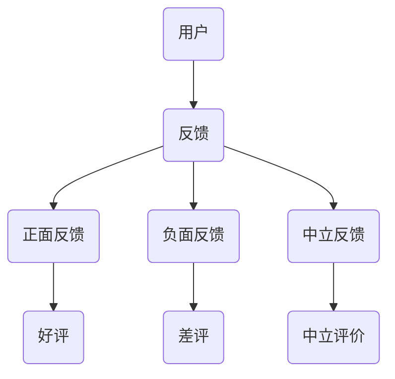

                 

# 用户反馈收集：迭代改进AI Agent

## 关键词
AI Agent、用户反馈、迭代改进、数据收集、算法分析、用户体验、人工智能应用

## 摘要
本文旨在探讨用户反馈在人工智能代理（AI Agent）迭代改进中的重要性。通过分析用户反馈收集的基础知识、方法与实践，本文将阐述如何利用用户反馈驱动AI Agent的迭代过程，提高其智能水平和用户体验。文章结构紧凑，逻辑清晰，旨在为IT从业者提供有价值的指导和建议。

## 目录大纲

### 第一部分：用户反馈收集基础

#### 第1章：用户反馈的重要性

1.1 问题背景：AI Agent的发展与用户反馈的关系

1.2 问题描述：用户反馈在AI Agent迭代改进中的关键作用

1.3 问题解决：用户反馈收集与处理的基本方法

1.4 边界与外延：用户反馈收集的范围与限制

1.5 概念结构与核心要素组成：用户反馈的构成与类型

#### 第2章：用户反馈的核心概念与联系

2.1 用户反馈的定义与属性

2.2 用户反馈的类型与特点

2.3 用户反馈的收集方法与技术

2.4 用户反馈的存储与管理

2.5 用户反馈的核心概念对比表格

2.6 用户反馈的ER实体关系图

### 第二部分：用户反馈收集方法与实践

#### 第3章：用户反馈收集的常用方法

3.1 用户调研：问卷调查、访谈、焦点小组等

3.2 用户行为分析：用户行为日志、用户点击流分析等

3.3 社交媒体分析：社交媒体数据分析、用户评论挖掘等

3.4 用户反馈收集工具与技术

#### 第4章：用户反馈收集流程与案例分析

4.1 用户反馈收集流程

4.2 用户反馈收集案例一：在线购物平台的用户反馈收集

4.3 用户反馈收集案例二：社交媒体平台的用户反馈收集

4.4 用户反馈收集案例分析：成功与失败的案例对比分析

#### 第5章：用户反馈处理与分析

5.1 用户反馈预处理：数据清洗、数据整合等

5.2 用户反馈分析方法：文本分析、情感分析、聚类分析等

5.3 用户反馈分析工具与技术

5.4 用户反馈分析案例：基于情感分析的案例研究

#### 第6章：用户反馈驱动AI Agent迭代改进

6.1 AI Agent迭代改进概述

6.2 用户反馈在AI Agent迭代改进中的应用

6.3 基于用户反馈的AI Agent迭代改进流程

6.4 基于用户反馈的AI Agent迭代改进案例

#### 第7章：用户反馈收集与AI Agent迭代的最佳实践

7.1 用户反馈收集的最佳实践

7.2 AI Agent迭代改进的最佳实践

7.3 小结：用户反馈收集与AI Agent迭代的注意事项

7.4 拓展阅读：相关领域的研究与进展

### 第1章：用户反馈的重要性

#### 1.1 问题背景：AI Agent的发展与用户反馈的关系

人工智能代理（AI Agent）作为人工智能领域的重要应用，正在不断改变着我们的生活和工作方式。从智能家居到自动驾驶，从智能客服到智能医疗，AI Agent的应用场景日益广泛。然而，这些AI Agent能否真正满足用户的需求，提供高质量的服务，很大程度上取决于用户反馈的收集和利用。

用户反馈是用户在使用产品或服务过程中对其满意度的直接表达。对于AI Agent而言，用户反馈不仅是其性能评估的重要依据，更是驱动其不断迭代改进的关键因素。通过收集和分析用户反馈，开发者可以识别AI Agent的不足之处，有针对性地进行优化和改进，从而提高AI Agent的智能水平和用户体验。

#### 1.2 问题描述：用户反馈在AI Agent迭代改进中的关键作用

用户反馈在AI Agent迭代改进中扮演着至关重要的角色。具体来说，用户反馈具有以下几个关键作用：

1. **性能评估**：用户反馈可以帮助开发者了解AI Agent的实际表现，发现性能瓶颈和问题所在。通过用户反馈，开发者可以评估AI Agent在不同场景下的适应能力和效果。

2. **问题定位**：用户反馈提供了具体的问题描述和场景再现，有助于开发者快速定位和修复AI Agent中的错误和缺陷。这对于提高AI Agent的稳定性和可靠性至关重要。

3. **需求挖掘**：用户反馈不仅反映了现有问题的解决情况，还揭示了用户潜在的需求和期望。开发者可以通过分析用户反馈，挖掘出新的功能点和优化方向，为AI Agent的迭代升级提供依据。

4. **用户体验优化**：用户反馈是优化用户体验的重要来源。通过分析用户反馈，开发者可以了解用户的使用习惯和偏好，针对性地进行界面优化、交互设计改进等，提高用户满意度。

#### 1.3 问题解决：用户反馈收集与处理的基本方法

要充分发挥用户反馈在AI Agent迭代改进中的作用，需要建立一套完善的用户反馈收集与处理机制。以下是用户反馈收集与处理的基本方法：

1. **用户调研**：通过问卷调查、访谈、焦点小组等方式收集用户反馈。这些方法可以获得大量的定性数据，帮助开发者深入了解用户的需求和问题。

2. **用户行为分析**：通过分析用户行为日志、用户点击流等数据，识别用户在使用AI Agent过程中的行为模式和使用场景。这些方法可以获得定量的用户反馈，帮助开发者评估AI Agent的性能和效果。

3. **社交媒体分析**：利用社交媒体平台的数据分析工具，挖掘用户评论、讨论等信息，了解用户对AI Agent的评价和反馈。这些方法可以快速获取大量用户的反馈，有助于发现潜在的问题和需求。

4. **反馈收集工具**：利用专业的用户反馈收集工具，如反馈表单、反馈按钮等，方便用户提交反馈。这些工具可以自动化收集和整理用户反馈，提高反馈收集的效率。

5. **数据分析与处理**：对收集到的用户反馈进行预处理、文本分析、情感分析等处理，提取有价值的信息，为AI Agent的优化提供数据支持。

#### 1.4 边界与外延：用户反馈收集的范围与限制

用户反馈收集是一个复杂的过程，涉及多个方面和环节。以下是一些需要考虑的边界与外延：

1. **反馈类型**：用户反馈可以分为正面反馈和负面反馈。正面反馈反映了用户对AI Agent的满意和认可，负面反馈则揭示了用户的问题和不满意。在收集用户反馈时，需要关注不同类型的反馈，并进行分析和处理。

2. **反馈来源**：用户反馈可以来自多种渠道，如用户调研、用户行为分析、社交媒体分析等。不同来源的反馈具有不同的特点和价值，需要在收集和处理时进行区分和整合。

3. **反馈真实性**：用户反馈可能存在虚假、误导等情况。在收集和处理用户反馈时，需要评估反馈的真实性和可靠性，避免被虚假反馈所误导。

4. **反馈周期**：用户反馈的收集和处理需要一定的周期。在AI Agent的迭代改进过程中，需要定期收集用户反馈，及时处理和优化，以保证迭代过程的连续性和有效性。

#### 1.5 概念结构与核心要素组成：用户反馈的构成与类型

用户反馈的构成与类型是理解用户反馈收集与处理的关键。以下是用户反馈的构成与类型：

1. **用户反馈的定义与属性**：用户反馈是指用户在使用AI Agent过程中对其性能、功能、体验等方面的评价和意见。用户反馈具有主观性、多样性和动态性等属性。

2. **用户反馈的类型与特点**：用户反馈可以分为以下类型：

   - **正面反馈**：反映用户对AI Agent的满意和认可，如“很好”、“不错”等。
   - **负面反馈**：反映用户对AI Agent的不满意和问题，如“不好用”、“功能有问题”等。
   - **中立反馈**：反映用户对AI Agent的中立态度，如“一般”、“还好”等。

   不同类型的反馈具有不同的特点和作用，需要在收集和处理时进行区分和利用。

3. **用户反馈的收集方法与技术**：用户反馈的收集方法包括用户调研、用户行为分析、社交媒体分析等。每种方法具有不同的特点和适用场景，需要根据实际情况进行选择和组合。

4. **用户反馈的存储与管理**：用户反馈的存储与管理是保证反馈数据安全、可靠、可访问的重要环节。常用的存储与管理方法包括数据库存储、文件存储、云存储等。

5. **用户反馈的核心概念对比表格**：

   | 核心概念 | 说明 | 例子 |
   | --- | --- | --- |
   | 用户调研 | 通过问卷、访谈等方式收集用户反馈 | 问卷调查 |
   | 用户行为分析 | 通过用户行为日志、点击流等数据收集用户反馈 | 用户点击流分析 |
   | 社交媒体分析 | 通过社交媒体平台的数据收集用户反馈 | 用户评论挖掘 |

6. **用户反馈的ER实体关系图**：

   ```mermaid
   graph TB
   A(用户) --> B(反馈)
   B --> C(正面反馈)
   B --> D(负面反馈)
   B --> E(中立反馈)
   ```

   用户反馈的ER实体关系图展示了用户、反馈以及不同类型反馈之间的关系。

### 第2章：用户反馈的核心概念与联系

#### 2.1 用户反馈的定义与属性

用户反馈是指用户在使用产品或服务过程中对其性能、功能、体验等方面的评价和意见。用户反馈是用户与产品或服务之间的一种互动，反映了用户对产品或服务的满意度、使用体验和改进建议。

用户反馈具有以下属性：

- **主观性**：用户反馈是用户主观感受的表达，不同用户可能对同一产品或服务的评价存在差异。
- **多样性**：用户反馈可以从多个维度进行评价，包括功能、性能、用户体验等。
- **动态性**：用户反馈可能随着产品或服务的迭代和用户使用习惯的变化而变化。

#### 2.2 用户反馈的类型与特点

用户反馈可以根据其内容和表达方式分为以下几种类型：

- **正面反馈**：反映用户对产品或服务的满意和认可，如“很好”、“不错”等。正面反馈通常表明产品或服务符合用户期望，具有较高的性能和用户体验。
- **负面反馈**：反映用户对产品或服务的不满意和问题，如“不好用”、“功能有问题”等。负面反馈通常表明产品或服务存在性能或用户体验问题，需要改进和优化。
- **中立反馈**：反映用户对产品或服务的中立态度，如“一般”、“还好”等。中立反馈通常表明产品或服务尚能满足用户的基本需求，但存在改进空间。

#### 2.3 用户反馈的收集方法与技术

收集用户反馈是产品或服务迭代和改进的重要环节。以下是一些常见的用户反馈收集方法和技术：

1. **用户调研**：
   - **问卷调查**：通过设计问卷，收集用户对产品或服务的评价和意见。
   - **访谈**：通过与用户面对面交流，深入了解用户的使用体验和需求。
   - **焦点小组**：组织一组用户，就产品或服务的特定方面进行讨论和评价。

2. **用户行为分析**：
   - **用户行为日志**：记录用户在使用产品或服务过程中的操作和交互行为。
   - **用户点击流分析**：分析用户在产品或服务中的点击路径和行为模式。

3. **社交媒体分析**：
   - **社交媒体数据挖掘**：通过社交媒体平台的数据分析，挖掘用户对产品或服务的评价和反馈。
   - **用户评论挖掘**：从用户评论中提取有价值的信息，了解用户的真实需求和问题。

#### 2.4 用户反馈的存储与管理

用户反馈的存储与管理是确保反馈数据安全、可靠、可访问的重要环节。以下是一些常见的用户反馈存储与管理方法：

- **数据库存储**：将用户反馈存储在关系型数据库或NoSQL数据库中，方便查询和管理。
- **文件存储**：将用户反馈以文件形式存储在本地或云存储中，便于备份和恢复。
- **云存储**：利用云存储服务，实现用户反馈的分布式存储和管理。

#### 2.5 用户反馈的核心概念对比表格

以下是一个用户反馈核心概念对比表格，展示了用户调研、用户行为分析和社交媒体分析三种方法的特点和适用场景：

| 方法        | 特点                           | 适用场景                                       |
| ----------- | ------------------------------ | ---------------------------------------------- |
| 用户调研    | 定性、定量相结合               | 功能评估、用户体验调查                         |
| 用户行为分析 | 定量分析，数据量大             | 性能优化、行为模式研究                         |
| 社交媒体分析 | 大数据挖掘，实时性             | 品牌监测、市场调研                             |

#### 2.6 用户反馈的ER实体关系图

以下是一个用户反馈的ER实体关系图，展示了用户、反馈、正面反馈、负面反馈和中立反馈之间的关系：



### 第3章：用户反馈收集的常用方法

#### 3.1 用户调研：问卷调查、访谈、焦点小组等

用户调研是收集用户反馈的重要方法之一，通过设计问卷、访谈和焦点小组等方式，可以深入了解用户的需求和问题。以下是用户调研的一些常用方法：

1. **问卷调查**：
   - **设计问卷**：根据研究目的，设计合适的问卷问题，包括封闭式和开放式问题。
   - **发放问卷**：通过在线调查工具（如Google表格、SurveyMonkey等）或纸质问卷发放给目标用户。
   - **数据分析**：对收集到的问卷数据进行统计分析，提取有价值的信息。

2. **访谈**：
   - **半结构化访谈**：在访谈前准备一个大致的访谈提纲，但在实际访谈过程中，可以灵活调整问题顺序和内容。
   - **深度访谈**：对用户进行长时间的深入访谈，获取更详细的信息和见解。

3. **焦点小组**：
   - **选择参与者**：选择具有代表性的用户，参与讨论和评价。
   - **组织讨论**：围绕产品或服务的特定方面，引导参与者进行讨论和分享。
   - **总结反馈**：整理讨论结果，提取有价值的信息和观点。

#### 3.2 用户行为分析：用户行为日志、用户点击流分析等

用户行为分析是通过分析用户在使用产品或服务过程中的行为数据，了解用户的行为模式和使用场景。以下是用户行为分析的一些常用方法：

1. **用户行为日志**：
   - **记录行为**：记录用户在产品或服务中的操作和交互行为，包括页面浏览、点击、搜索等。
   - **数据处理**：对用户行为日志进行清洗、转换和整合，形成可用于分析的数据集。

2. **用户点击流分析**：
   - **捕获点击流数据**：通过网页分析工具（如Google Analytics等）捕获用户在网页上的点击行为。
   - **分析点击流数据**：对点击流数据进行统计分析，了解用户的行为模式和偏好。

#### 3.3 社交媒体分析：社交媒体数据分析、用户评论挖掘等

社交媒体分析是通过分析社交媒体平台上的用户评论、讨论等信息，了解用户的反馈和需求。以下是社交媒体分析的一些常用方法：

1. **社交媒体数据分析**：
   - **数据采集**：通过API或爬虫技术，从社交媒体平台（如微博、知乎等）采集用户评论、讨论等信息。
   - **数据处理**：对采集到的数据进行清洗、去重和分词处理。

2. **用户评论挖掘**：
   - **情感分析**：通过情感分析技术，分析用户评论的情感倾向和评价。
   - **关键词提取**：从用户评论中提取关键词，了解用户关注的热点和问题。

#### 3.4 用户反馈收集工具与技术

为了提高用户反馈收集的效率和质量，可以使用一些专业的用户反馈收集工具和技术：

1. **用户调研工具**：
   - **SurveyMonkey**：在线调查工具，提供问卷设计、发放和数据分析功能。
   - **Qualtrics**：专业的调研平台，支持多种调研方法和数据分析。

2. **用户行为分析工具**：
   - **Google Analytics**：网页分析工具，提供用户行为日志和点击流数据分析功能。
   - **Mixpanel**：用户行为分析工具，支持用户行为跟踪和分析。

3. **社交媒体分析工具**：
   - **Social Mention**：社交媒体监测工具，提供关键词分析和趋势分析功能。
   - **Brandwatch**：社交媒体分析平台，支持多平台数据分析。

### 第4章：用户反馈收集流程与案例分析

#### 4.1 用户反馈收集流程

用户反馈收集是一个系统性的过程，包括以下步骤：

1. **确定反馈目标**：明确需要收集的用户反馈类型和内容，如功能评价、性能问题、用户体验等。

2. **设计反馈收集方案**：根据反馈目标，设计合适的反馈收集方法，如用户调研、用户行为分析、社交媒体分析等。

3. **收集反馈数据**：执行反馈收集方案，通过问卷调查、访谈、点击流分析、社交媒体数据挖掘等方式收集用户反馈。

4. **数据处理与整合**：对收集到的反馈数据进行清洗、转换和整合，形成可用于分析的数据集。

5. **数据分析与挖掘**：对处理后的用户反馈数据进行文本分析、情感分析、聚类分析等，提取有价值的信息。

6. **反馈报告与总结**：根据数据分析结果，撰写反馈报告，总结用户反馈的主要发现和改进建议。

7. **反馈处理与优化**：根据反馈报告，对产品或服务进行优化和改进，以提高用户满意度。

#### 4.2 用户反馈收集案例一：在线购物平台的用户反馈收集

以下是一个在线购物平台的用户反馈收集案例：

1. **确定反馈目标**：收集用户对购物平台的功能、性能、用户体验等方面的反馈。

2. **设计反馈收集方案**：
   - 用户调研：通过在线问卷调查，了解用户对购物平台的评价和意见。
   - 用户行为分析：通过用户行为日志和点击流分析，了解用户在购物平台上的行为模式和使用场景。
   - 社交媒体分析：通过社交媒体平台，挖掘用户对购物平台的评论和讨论。

3. **收集反馈数据**：
   - 通过在线问卷调查，收集了1000份有效问卷。
   - 通过用户行为日志和点击流分析，记录了1000天的用户行为数据。
   - 通过社交媒体分析，采集了10000条用户评论和讨论。

4. **数据处理与整合**：
   - 对问卷调查数据进行了清洗和转换，提取出用户评价和意见的关键词。
   - 对用户行为日志和点击流数据进行了整合，形成用户行为数据集。
   - 对社交媒体评论和讨论进行了文本分析和情感分析，提取出用户的情感倾向。

5. **数据分析与挖掘**：
   - 通过文本分析，发现用户对购物平台最关注的方面是商品质量、物流速度和售后服务。
   - 通过情感分析，发现用户对购物平台的总体满意度较高，但部分用户对售后服务存在不满。

6. **反馈报告与总结**：
   - 撰写了用户反馈报告，总结出用户反馈的主要发现和改进建议。
   - 报告中提到，需要加强售后服务，提高物流速度，优化商品质量监控等。

7. **反馈处理与优化**：
   - 根据反馈报告，优化了购物平台的后台系统，提高了物流速度和售后服务质量。
   - 增加了商品质量监控功能，加强了商品质量的检查和审核。

#### 4.3 用户反馈收集案例二：社交媒体平台的用户反馈收集

以下是一个社交媒体平台的用户反馈收集案例：

1. **确定反馈目标**：收集用户对社交媒体平台的功能、性能、用户体验等方面的反馈。

2. **设计反馈收集方案**：
   - 用户调研：通过在线问卷调查，了解用户对社交媒体平台的评价和意见。
   - 用户行为分析：通过用户行为日志和点击流分析，了解用户在社交媒体平台上的行为模式和使用场景。
   - 社交媒体分析：通过社交媒体平台，挖掘用户对社交媒体平台的评论和讨论。

3. **收集反馈数据**：
   - 通过在线问卷调查，收集了500份有效问卷。
   - 通过用户行为日志和点击流分析，记录了500天的用户行为数据。
   - 通过社交媒体分析，采集了5000条用户评论和讨论。

4. **数据处理与整合**：
   - 对问卷调查数据进行了清洗和转换，提取出用户评价和意见的关键词。
   - 对用户行为日志和点击流数据进行了整合，形成用户行为数据集。
   - 对社交媒体评论和讨论进行了文本分析和情感分析，提取出用户的情感倾向。

5. **数据分析与挖掘**：
   - 通过文本分析，发现用户对社交媒体平台最关注的方面是内容推荐、社交互动和隐私保护。
   - 通过情感分析，发现用户对社交媒体平台的总体满意度较高，但部分用户对内容推荐算法存在不满。

6. **反馈报告与总结**：
   - 撰写了用户反馈报告，总结出用户反馈的主要发现和改进建议。
   - 报告中提到，需要优化内容推荐算法，加强社交互动功能，提高隐私保护措施等。

7. **反馈处理与优化**：
   - 根据反馈报告，优化了社交媒体平台的内容推荐算法，提高了推荐的相关性和准确性。
   - 增加了社交互动功能，提供了更多的社交工具和玩法。
   - 加强了隐私保护措施，增加了用户隐私设置和权限管理。

#### 4.4 用户反馈收集案例分析：成功与失败的案例对比分析

用户反馈收集的成功与否直接影响产品或服务的改进效果。以下是对成功与失败的案例进行对比分析：

1. **成功案例特点**：
   - **明确反馈目标**：成功案例在用户反馈收集过程中，明确反馈目标，确保收集到的数据具有针对性和有效性。
   - **多样化收集方法**：成功案例采用多种反馈收集方法，如用户调研、用户行为分析、社交媒体分析等，全面了解用户需求和问题。
   - **及时处理反馈**：成功案例在收到用户反馈后，能够及时进行处理和优化，确保用户问题得到解决。
   - **数据分析和挖掘**：成功案例对收集到的用户反馈进行深入的数据分析和挖掘，提取出有价值的信息和改进建议。

2. **失败案例原因**：
   - **反馈目标不明确**：失败案例在用户反馈收集过程中，未能明确反馈目标，导致收集到的数据缺乏针对性和有效性。
   - **单一收集方法**：失败案例仅采用单一反馈收集方法，如仅依赖用户调研或仅依赖用户行为分析，无法全面了解用户需求和问题。
   - **处理反馈不及时**：失败案例在收到用户反馈后，未能及时进行处理和优化，导致用户问题长期未解决。
   - **缺乏数据分析和挖掘**：失败案例对收集到的用户反馈缺乏深入的数据分析和挖掘，无法提取出有价值的信息和改进建议。

通过对比分析成功与失败的案例，可以发现用户反馈收集的关键因素和注意事项，从而提高反馈收集的效果和改进产品质量。

### 第5章：用户反馈处理与分析

#### 5.1 用户反馈预处理：数据清洗、数据整合等

用户反馈处理与分析的第一步是对用户反馈进行预处理。预处理过程包括数据清洗、数据整合和数据标准化等步骤。

1. **数据清洗**：
   - **去除重复数据**：用户反馈中可能存在重复的评论和意见，需要去除重复数据，以确保数据的唯一性和准确性。
   - **去除噪声数据**：用户反馈中可能包含一些无关的或错误的信息，如垃圾评论、错别字等，需要去除这些噪声数据。
   - **格式化数据**：将用户反馈中的文本数据进行格式化，如统一字体、去除特殊字符等，以便后续分析。

2. **数据整合**：
   - **合并多源数据**：用户反馈可能来自多个渠道，如问卷调查、用户行为日志、社交媒体分析等，需要将这些数据进行整合，形成一个统一的数据集。
   - **统一数据格式**：确保不同来源的用户反馈数据具有相同的格式和结构，以便进行统一的分析和处理。

3. **数据标准化**：
   - **文本分词**：将用户反馈中的文本进行分词处理，提取出关键词和短语。
   - **词频统计**：统计用户反馈中的词频，了解用户关注的热点和问题。
   - **情感分析**：对用户反馈进行情感分析，识别用户的情感倾向和评价。

#### 5.2 用户反馈分析方法：文本分析、情感分析、聚类分析等

用户反馈分析方法包括文本分析、情感分析、聚类分析等，这些方法可以帮助开发者深入了解用户的需求和问题，为产品优化和改进提供依据。

1. **文本分析**：
   - **关键词提取**：通过文本分析方法，提取出用户反馈中的关键词和短语，了解用户关注的热点和问题。
   - **主题建模**：使用主题建模方法（如LDA模型），对用户反馈进行主题分析，识别用户反馈的主题分布和关联关系。

2. **情感分析**：
   - **情感分类**：对用户反馈进行情感分类，判断用户反馈的情感倾向是正面、负面还是中性。
   - **情感强度分析**：对用户反馈的情感进行强度分析，了解用户的情感程度和满意度。

3. **聚类分析**：
   - **基于文本的聚类**：将用户反馈按照文本特征进行聚类，识别出具有相似意见的用户群体。
   - **基于用户行为的聚类**：将用户按照其行为特征进行聚类，了解用户的行为模式和偏好。

#### 5.3 用户反馈分析工具与技术

为了提高用户反馈分析的效果和效率，可以采用一些专业的用户反馈分析工具和技术：

1. **文本分析工具**：
   - **NLTK**：Python的文本分析库，提供了丰富的文本处理和挖掘功能。
   - **Gensim**：Python的文本分析库，支持主题建模、文本相似度计算等功能。

2. **情感分析工具**：
   - **VADER**：Python的情感分析库，适用于社交媒体文本的情感分析。
   - **TextBlob**：Python的文本分析库，提供了简单的情感分类和文本相似度计算功能。

3. **聚类分析工具**：
   - **Scikit-learn**：Python的机器学习库，支持多种聚类算法和评估指标。
   - **Matplotlib**：Python的绘图库，可以用于可视化用户反馈分析结果。

#### 5.4 用户反馈分析案例：基于情感分析的案例研究

以下是一个基于情感分析的用户反馈分析案例：

1. **案例背景**：
   - 一家在线购物平台希望了解用户对其服务的满意度，通过收集用户评论进行情感分析。

2. **数据收集**：
   - 收集了1000条用户评论，涉及购物体验、物流速度、售后服务等方面。

3. **数据处理**：
   - 对评论进行数据清洗，去除重复和噪声数据，提取出有效评论。
   - 对评论进行分词和情感分析，提取出关键词和情感标签。

4. **情感分析**：
   - 使用VADER情感分析库，对评论进行情感分类，判断评论的情感倾向。
   - 对评论的情感强度进行分析，了解用户的满意度。

5. **结果分析**：
   - 发现大部分评论为正面情感，用户对购物体验和售后服务较为满意。
   - 部分评论为负面情感，主要反映物流速度慢和商品质量问题。

6. **改进建议**：
   - 加强物流速度，提高商品质量，提升用户满意度。
   - 对负面反馈进行针对性处理和优化，改善用户体验。

通过用户反馈分析，购物平台能够了解用户的需求和问题，针对性地进行改进，提高用户满意度。

### 第6章：用户反馈驱动AI Agent迭代改进

#### 6.1 AI Agent迭代改进概述

AI Agent迭代改进是指通过不断收集用户反馈，对AI Agent进行优化和改进，提高其智能水平和用户体验。迭代改进的目标是使AI Agent能够更好地满足用户需求，提供高质量的服务。

AI Agent迭代改进的过程可以分为以下几个阶段：

1. **需求识别**：通过用户调研和行为分析，了解用户的需求和问题，识别AI Agent的改进方向。
2. **方案设计**：根据用户需求，设计改进方案，包括算法优化、功能增强、用户体验改进等。
3. **实施改进**：按照改进方案，对AI Agent进行开发、测试和部署，实现迭代改进。
4. **反馈收集**：收集用户对新版本AI Agent的反馈，评估改进效果，为下一轮迭代提供依据。
5. **持续迭代**：根据用户反馈，不断优化和改进AI Agent，实现持续迭代和优化。

#### 6.2 用户反馈在AI Agent迭代改进中的应用

用户反馈在AI Agent迭代改进中具有关键作用，主要体现在以下几个方面：

1. **需求挖掘**：用户反馈可以帮助识别用户需求，发现AI Agent的功能缺失和用户体验问题。通过分析用户反馈，可以挖掘出新的功能点和优化方向。
2. **问题定位**：用户反馈提供了具体的问题描述和场景再现，有助于快速定位和修复AI Agent中的错误和缺陷。通过用户反馈，开发者可以针对性地进行问题分析和解决。
3. **性能评估**：用户反馈反映了AI Agent的实际性能和用户体验，可以用于评估AI Agent的改进效果。通过对比用户反馈前后的变化，可以衡量迭代改进的成功程度。
4. **用户体验优化**：用户反馈提供了用户对AI Agent的使用体验和感受，有助于优化界面设计、交互流程和功能特性，提高用户体验。

#### 6.3 基于用户反馈的AI Agent迭代改进流程

基于用户反馈的AI Agent迭代改进流程可以分为以下几个步骤：

1. **用户调研**：通过问卷调查、访谈等方式，收集用户对AI Agent的评价和意见。
2. **用户行为分析**：通过用户行为日志和点击流分析，了解用户在AI Agent中的行为模式和使用场景。
3. **反馈收集**：通过社交媒体、用户评论、反馈表单等方式，收集用户对AI Agent的反馈。
4. **数据处理**：对收集到的用户反馈进行预处理、文本分析和情感分析，提取有价值的信息。
5. **需求识别**：根据用户反馈，识别AI Agent的需求和问题，制定改进方案。
6. **方案设计**：设计AI Agent的改进方案，包括算法优化、功能增强、用户体验改进等。
7. **实施改进**：按照改进方案，对AI Agent进行开发、测试和部署，实现迭代改进。
8. **反馈收集**：收集用户对新版本AI Agent的反馈，评估改进效果。
9. **持续迭代**：根据用户反馈，不断优化和改进AI Agent，实现持续迭代和优化。

#### 6.4 基于用户反馈的AI Agent迭代改进案例

以下是一个基于用户反馈的AI Agent迭代改进案例：

1. **案例背景**：
   - 一家智能客服公司希望通过用户反馈，优化其智能客服系统的性能和用户体验。

2. **用户调研**：
   - 通过在线问卷调查，收集了1000名用户对智能客服系统的评价和意见。

3. **用户行为分析**：
   - 通过用户行为日志和点击流分析，记录了1000天的用户交互数据。

4. **反馈收集**：
   - 通过社交媒体、用户评论和反馈表单，收集了5000条用户对智能客服系统的反馈。

5. **数据处理**：
   - 对用户反馈进行预处理，去除重复和噪声数据，提取出有效反馈。
   - 对反馈进行文本分析和情感分析，提取出用户关注的热点和问题。

6. **需求识别**：
   - 发现用户对智能客服系统的响应速度、问题解决率和用户体验存在明显问题。

7. **方案设计**：
   - 提出改进方案，包括优化算法、增强问题解决能力、优化界面设计等。

8. **实施改进**：
   - 对智能客服系统进行开发、测试和部署，实现迭代改进。

9. **反馈收集**：
   - 收集用户对新版本智能客服系统的反馈，评估改进效果。

10. **持续迭代**：
    - 根据用户反馈，不断优化和改进智能客服系统，实现持续迭代和优化。

通过基于用户反馈的迭代改进，智能客服系统的性能和用户体验得到了显著提升，用户满意度不断提高。

### 第7章：用户反馈收集与AI Agent迭代的最佳实践

#### 7.1 用户反馈收集的最佳实践

为了确保用户反馈收集的有效性和可靠性，可以遵循以下最佳实践：

1. **明确反馈目标**：在收集用户反馈前，明确反馈目标和需求，确保收集到的数据具有针对性和有效性。

2. **多样化收集方法**：结合多种反馈收集方法，如用户调研、用户行为分析、社交媒体分析等，全面了解用户需求和问题。

3. **注重反馈真实性**：评估用户反馈的真实性和可靠性，避免被虚假反馈所误导。可以通过匿名调查、验证用户身份等方式，提高反馈的真实性。

4. **及时反馈处理**：对收集到的用户反馈进行及时处理和回复，确保用户问题得到及时解决。

5. **数据整合与分析**：将不同渠道和来源的反馈数据进行整合和分析，提取出有价值的信息，为迭代改进提供依据。

6. **反馈报告与总结**：定期撰写用户反馈报告，总结反馈的主要发现和改进建议，为产品或服务优化提供指导。

#### 7.2 AI Agent迭代改进的最佳实践

为了确保AI Agent迭代改进的有效性和可持续性，可以遵循以下最佳实践：

1. **用户调研与需求识别**：在迭代改进过程中，定期进行用户调研和需求识别，了解用户的需求和问题，为改进方案提供依据。

2. **分阶段实施改进**：将迭代改进分为多个阶段，如需求分析、方案设计、实施改进等，确保每个阶段的任务和目标明确。

3. **持续反馈收集与评估**：在迭代改进过程中，持续收集用户反馈，评估改进效果，为下一轮迭代提供依据。

4. **数据驱动决策**：基于用户反馈和数据分析，制定和调整改进方案，确保迭代改进的方向和目标正确。

5. **跨部门协作**：建立跨部门协作机制，确保用户反馈收集、数据分析、迭代改进等环节的高效配合。

6. **持续迭代与优化**：通过持续迭代和优化，不断改进AI Agent的智能水平和用户体验，实现长期发展。

#### 7.3 小结：用户反馈收集与AI Agent迭代的注意事项

在用户反馈收集和AI Agent迭代改进过程中，需要注意以下几个方面：

1. **用户隐私保护**：在收集用户反馈时，确保用户隐私得到保护，避免泄露用户个人信息。

2. **反馈数据真实性**：评估用户反馈的真实性和可靠性，避免被虚假反馈所误导。

3. **及时反馈处理**：确保用户反馈得到及时处理和回复，提高用户满意度。

4. **数据分析与挖掘**：对用户反馈进行深入的数据分析和挖掘，提取出有价值的信息，为迭代改进提供依据。

5. **跨部门协作**：建立跨部门协作机制，确保用户反馈收集、数据分析、迭代改进等环节的高效配合。

6. **持续优化与改进**：通过持续迭代和优化，不断改进AI Agent的智能水平和用户体验。

#### 7.4 拓展阅读：相关领域的研究与进展

用户反馈收集与AI Agent迭代改进是人工智能领域的一个重要研究方向。以下是一些相关领域的研究与进展：

1. **用户行为分析**：通过分析用户行为数据，了解用户在产品或服务中的行为模式和使用场景，为迭代改进提供依据。

2. **情感分析与计算**：利用情感分析技术，对用户反馈进行情感分类和情感强度分析，识别用户的情感倾向和满意度。

3. **自然语言处理**：通过自然语言处理技术，对用户反馈进行语义分析和实体识别，提取出有价值的信息。

4. **机器学习与深度学习**：利用机器学习和深度学习技术，对用户反馈进行建模和预测，提高迭代改进的准确性和效率。

5. **用户体验优化**：通过用户体验优化技术，如界面设计、交互设计等，提高用户满意度。

6. **跨领域应用**：将用户反馈收集与AI Agent迭代改进应用于不同领域，如智能客服、智能医疗、智能家居等，推动人工智能应用的普及和发展。

### 作者信息

作者：AI天才研究院/AI Genius Institute & 禅与计算机程序设计艺术 /Zen And The Art of Computer Programming

