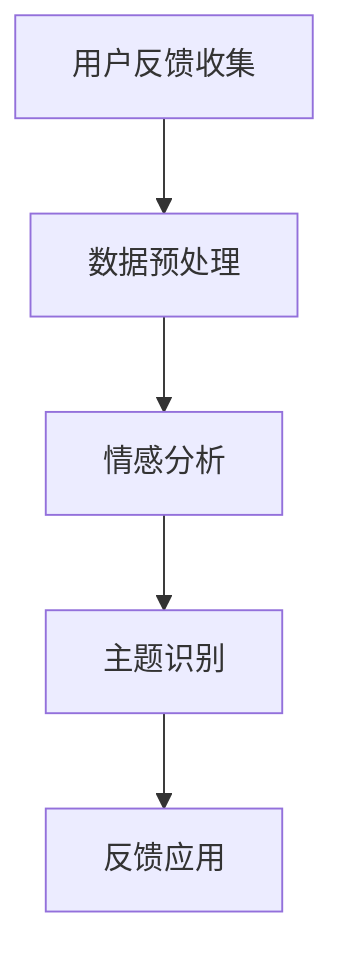
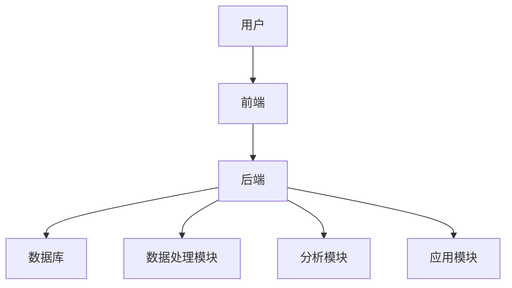

                 

# 用户反馈机制

## 关键词
用户反馈、机制设计、算法原理、系统架构、项目实战、最佳实践

## 摘要
本文将深入探讨用户反馈机制，从基本概念、核心算法原理、系统架构设计、项目实战等方面进行详细讲解。通过分析用户反馈机制在各领域的应用，本文旨在提供一个全面的技术指南，帮助读者理解、设计和优化用户反馈系统，提升产品和服务质量。

## 引言
### 引言1.1：用户反馈机制的基本概念
用户反馈机制是指企业或组织通过用户提供的反馈信息，来了解用户需求、改进产品和服务、提高用户体验的一系列方法和技术。用户反馈可以是结构化的，如问卷调查、评分系统；也可以是非结构化的，如用户评论、论坛讨论。

### 引言1.2：用户反馈机制的发展历程
用户反馈机制的发展经历了从简单的用户满意度调查，到现代复杂的数据分析和机器学习模型的应用。随着互联网和移动设备的普及，用户反馈机制变得更加智能化和自动化。

### 引言1.3：用户反馈机制的重要性
用户反馈机制对于企业来说至关重要。它不仅帮助企业了解用户需求，还能发现潜在的问题和改进点，提高产品和服务的竞争力。同时，用户反馈还能增强用户对产品的信任和忠诚度。

## 背景介绍
### 第2章：用户反馈机制在各个领域的应用
#### 2.1：用户反馈机制在客户服务中的应用
在客户服务领域，用户反馈机制主要用于评估服务质量、识别服务缺陷和改进服务流程。例如，通过电话满意度调查、在线客服评价和社交媒体监测，企业可以实时获取用户的反馈，并快速响应。

#### 2.2：用户反馈机制在产品开发中的应用
在产品开发过程中，用户反馈是产品迭代和改进的重要依据。通过用户测试、A/B测试和用户访谈，开发团队能够收集到关于产品功能、用户体验和性能的有效反馈。

#### 2.3：用户反馈机制在市场调研中的应用
用户反馈机制在市场调研中起着关键作用。通过问卷调查、焦点小组讨论和在线论坛，企业可以深入了解市场需求、用户偏好和竞争态势，从而制定更有针对性的市场策略。

## 核心概念与联系
### 第3章：用户反馈机制的核心概念
#### 3.1：用户
用户是用户反馈机制的核心。用户的行为、需求、偏好和反馈直接影响到产品的设计和改进。

#### 3.2：反馈
反馈是用户对产品或服务的评价和意见。有效的反馈可以帮助企业识别问题、优化产品和服务。

#### 3.3：机制
机制是指一系列用于收集、处理和分析用户反馈的方法和技术。一个完善的用户反馈机制应该能够确保反馈的及时性、准确性和有效性。

### ER实体关系图
```mermaid
erDiagram
  User ||--|{ Feedback }||>
  Product ||--|{ Feedback }||>
  Service ||--|{ Feedback }||>
  Company ||--|{ Feedback }||>
```

## 算法原理讲解
### 第4章：用户反馈机制的算法原理
#### 4.1：用户反馈的收集
用户反馈的收集是用户反馈机制的第一步。常用的方法包括问卷调查、用户评论分析、社交媒体监测和在线调查等。

#### 4.2：用户反馈的处理
处理用户反馈包括数据清洗、去噪、分类和标注等步骤。这些步骤的目的是确保反馈数据的准确性和可靠性。

#### 4.3：用户反馈的分析
用户反馈的分析通常涉及统计分析、文本挖掘和机器学习等算法。通过这些算法，企业可以识别出用户反馈中的关键信息，如高频词、主题和情感等。

#### 4.4：用户反馈的应用
用户反馈的应用包括问题定位、产品改进、服务优化和市场策略调整等。通过应用用户反馈，企业可以不断提升产品和服务的质量。

### 算法流程图


### 算法原理示例
```python
# 示例：情感分析算法原理

from textblob import TextBlob

def analyze_sentiment(text):
    analysis = TextBlob(text)
    if analysis.sentiment.polarity > 0:
        return 'Positive'
    elif analysis.sentiment.polarity == 0:
        return 'Neutral'
    else:
        return 'Negative'

text = "我很喜欢这个产品，它的功能非常强大。"
print(analyze_sentiment(text))  # 输出：Positive
```

## 系统分析与架构设计方案
### 第5章：用户反馈机制在系统架构中的应用
#### 5.1：系统功能设计
系统功能设计包括用户反馈收集模块、数据处理模块、分析模块和应用模块。

#### 5.2：系统架构设计
系统架构设计应考虑数据流、模块交互和安全性等因素。一个典型的用户反馈机制系统架构包括前端、后端和数据库三部分。

#### 5.3：系统接口设计
系统接口设计应确保不同模块之间能够高效、可靠地交互。常用的接口设计包括API、Webhook和消息队列等。

#### 5.4：系统交互
系统交互设计应考虑用户操作、系统响应和反馈处理等环节。一个良好的交互设计能够提升用户体验，降低操作难度。

### 系统架构图


## 项目实战
### 第6章：用户反馈机制的项目实战
#### 6.1：环境搭建
在项目实战中，首先需要搭建开发环境，包括安装Python、依赖库（如TextBlob、Numpy、Pandas）等。

#### 6.2：核心代码实现
核心代码实现包括用户反馈收集、数据处理、分析和应用等步骤。以下是一个简单的用户反馈处理流程：

```python
import pandas as pd
from textblob import TextBlob

def collect_feedback():
    # 采集用户反馈数据
    feedback = pd.read_csv('user_feedback.csv')
    return feedback

def preprocess_feedback(feedback):
    # 数据预处理
    feedback['cleaned_text'] = feedback['text'].str.replace('[^\w\s]', '')
    return feedback

def analyze_feedback(feedback):
    # 情感分析
    feedback['sentiment'] = feedback['cleaned_text'].apply(lambda x: TextBlob(x).sentiment.polarity)
    return feedback

def apply_feedback(feedback):
    # 应用反馈
    if feedback['sentiment'] > 0:
        print("用户反馈积极，产品改进建议：")
        print(feedback['suggestion'])
    else:
        print("用户反馈消极，产品改进建议：")
        print(feedback['suggestion'])

if __name__ == "__main__":
    feedback = collect_feedback()
    feedback = preprocess_feedback(feedback)
    feedback = analyze_feedback(feedback)
    apply_feedback(feedback)
```

#### 6.3：案例分析
通过实际案例，我们可以看到用户反馈机制如何帮助企业改进产品和服务。例如，一家电商平台通过用户反馈发现了购物流程中的瓶颈，从而进行了优化，提升了用户满意度。

## 最佳实践与总结
### 第7章：用户反馈机制的最佳实践
#### 7.1：最佳实践 tips
- 定期收集用户反馈，确保数据的及时性和准确性。
- 设计简洁明了的反馈收集表单，降低用户填写难度。
- 利用自然语言处理技术，对用户反馈进行自动分类和情感分析。
- 建立反馈处理机制，确保用户反馈得到及时响应和改进。

#### 7.2：项目小结
用户反馈机制是企业了解用户需求、优化产品和服务的重要手段。通过有效的用户反馈机制，企业可以不断提升用户满意度，增强市场竞争力。

#### 7.3：注意事项
- 用户隐私保护：确保用户反馈数据的隐私和安全。
- 反馈数据质量：确保反馈数据的真实性和可靠性。
- 反馈处理效率：建立快速响应机制，提高用户满意度。

## 拓展阅读
### 第8章：拓展阅读
#### 8.1：相关领域的最新研究
- 用户行为分析
- 机器学习在用户反馈中的应用
- 大数据与用户反馈机制

#### 8.2：拓展知识
- 用户画像
- 客户关系管理（CRM）
- 用户行为预测

## 结语
用户反馈机制是企业持续改进和发展的关键。通过深入理解用户需求，企业可以更好地设计产品和服务，提升用户体验，赢得用户信任。希望本文能帮助读者掌握用户反馈机制的理论和实践，为企业发展贡献力量。

## 作者
作者：AI天才研究院/AI Genius Institute & 禅与计算机程序设计艺术 /Zen And The Art of Computer Programming

