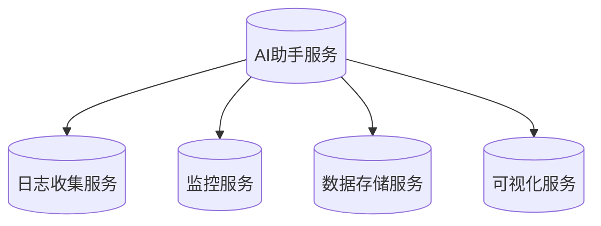

                 


### 监控与日志：追踪AI Agent的行为与性能

#### 关键词：
- 监控与日志
- AI Agent
- 性能追踪
- 行为分析
- 数据分析工具

#### 摘要：
本文深入探讨监控与日志在追踪AI Agent行为与性能方面的应用。我们将分步骤分析监控与日志的基本概念、AI Agent行为监控的挑战、性能监控指标、日志分析技术，以及实战案例，为读者提供一套完整的追踪AI Agent行为与性能的方法论。

---

#### 目录：

## 第一部分：监控与日志基础知识

### 第1章 监控与日志概述

### 第2章 AI Agent行为监控

### 第3章 日志管理

## 第二部分：AI Agent性能监控

### 第4章 AI Agent性能指标

### 第5章 性能监控工具

### 第6章 性能优化

## 第三部分：日志与AI Agent行为分析

### 第7章 日志分析技术

### 第8章 AI Agent行为分析

### 第9章 监控与日志整合

## 第四部分：实战与最佳实践

### 第10章 项目实战

### 第11章 最佳实践与注意事项

---

### 第一部分：监控与日志基础知识

#### 第1章 监控与日志概述

**背景介绍：**
在当今的信息化时代，监控和日志已成为IT系统稳定性和安全性的基石。监控（Monitoring）是指通过特定的工具和技术对系统资源、应用性能和网络状态等进行实时跟踪和评估。日志（Logging）则是记录系统事件、用户操作和异常情况的一种机制，用于问题排查和性能分析。

**问题背景：**
随着人工智能（AI）技术的发展，AI Agent（人工智能代理）在智能系统中的作用日益显著。如何有效监控和日志记录AI Agent的行为与性能，成为确保系统稳定运行的关键问题。

**问题描述：**
本文旨在解答如何通过监控和日志技术，实现AI Agent行为与性能的全面追踪。我们将探讨核心概念、挑战与解决方案。

**问题解决：**
本文将首先介绍监控与日志的基本概念，然后深入分析AI Agent行为监控的挑战，最后探讨性能监控指标、日志分析技术以及整合方案。

**边界与外延：**
- 监控与日志的基本概念
- AI Agent的定义与分类
- 监控与日志在AI系统中的应用

**概念结构与核心要素组成：**
- 监控：包括实时监控、性能监控、资源监控等
- 日志：包括日志收集、日志存储、日志分析等
- AI Agent：包括行为模型、性能指标、日志记录等

---

#### 第2章 AI Agent行为监控

**核心概念与联系：**

**AI Agent概述：**
AI Agent是具备自主决策和行动能力的智能实体，可以执行特定任务或完成特定目标。根据任务和能力的不同，AI Agent可以分为以下几类：

- 智能助手：如Siri、Alexa等，提供语音交互和信息查询服务。
- 自动驾驶系统：如特斯拉的Autopilot，实现自动驾驶功能。
- 聊天机器人：如微信、QQ的机器人，提供在线客服和咨询服务。

**AI Agent行为监控的挑战：**
1. **实时性挑战：** AI Agent的行为变化快速，监控需要具备高实时性。
2. **异构性挑战：** 不同AI Agent具有不同的架构和运行环境，监控需要兼容多种系统。
3. **复杂性挑战：** AI Agent的行为模式复杂，监控需要深入分析行为数据。

**AI Agent行为监控的关键指标：**
1. **响应时间：** AI Agent对用户请求的响应速度。
2. **准确率：** AI Agent行为的准确性，如自动驾驶的导航精度。
3. **稳定性：** AI Agent在长时间运行中的稳定性，如是否频繁发生错误。

**核心概念原理、概念属性特征对比表格和ER实体关系图架构的 Mermaid 流程图：**

**概念属性特征对比表格：**

| 概念属性 | AI助手 | 自动驾驶 | 聊天机器人 |
|----------|--------|----------|------------|
| 实时交互 | 是     | 否       | 否         |
| 自主导航 | 否     | 是       | 否         |
| 对话能力 | 是     | 否       | 是         |

**ER实体关系图架构的 Mermaid 流统图：**

```mermaid
erDiagram
  AI Agent ||--|{ Behavior}
  AI Agent ||--|{ Performance}
  Behavior ||--|{ Response Time}
  Behavior ||--|{ Accuracy}
  Behavior ||--|{ Stability}
```

---

#### 第3章 日志管理

**核心概念与联系：**

**日志数据类型：**
1. **系统日志：** 记录系统运行过程中的事件和异常情况，如系统启动、程序崩溃等。
2. **操作日志：** 记录用户操作信息，如登录、修改配置等。
3. **错误日志：** 记录系统发生的错误信息，如程序异常、网络故障等。

**日志数据收集与存储：**
1. **日志收集：** 使用代理程序或日志集中器，将分布式系统中的日志数据收集到一个中央位置。
2. **日志存储：** 使用日志管理系统（如ELK栈）或数据库（如MySQL、MongoDB）存储日志数据。

**日志数据分析：**
1. **日志检索：** 使用关键词搜索、时间范围筛选等手段，快速定位日志记录。
2. **日志可视化：** 使用图表、仪表盘等工具，将日志数据转换成易于理解的形式。

**核心概念原理、概念属性特征对比表格和ER实体关系图架构的 Mermaid 流程图：**

**概念属性特征对比表格：**

| 概念属性 | 系统日志 | 操作日志 | 错误日志 |
|----------|----------|----------|----------|
| 数据来源 | 系统     | 用户     | 系统或用户 |
| 记录内容 | 事件     | 操作     | 错误     |

**ER实体关系图架构的 Mermaid 流统图：**

```mermaid
erDiagram
  Log ||--|{ Data Type}
  Data Type ||--|{ System Log}
  Data Type ||--|{ Operation Log}
  Data Type ||--|{ Error Log}
```

---

### 第二部分：AI Agent性能监控

#### 第4章 AI Agent性能指标

**核心概念与联系：**

**性能指标概述：**
性能指标是衡量系统性能的关键指标，用于评估AI Agent的响应速度、准确性和稳定性。常见的性能指标包括：

1. **响应时间：** AI Agent对用户请求的响应时间，包括请求处理时间和响应传输时间。
2. **吞吐量：** 单位时间内系统处理的请求量。
3. **错误率：** 系统发生错误的概率。

**AI Agent性能指标实例：**
1. **AI助手：** 响应时间、错误率、会话持续时长等。
2. **自动驾驶：** 导航精度、行驶速度、事故率等。
3. **聊天机器人：** 响应时间、解答正确率、用户满意度等。

**性能指标对比分析：**
- 不同AI Agent的性能指标具有一定的共性，如响应时间和错误率，但具体指标数值和权重可能因应用场景而异。
- 针对特定AI Agent，需要根据其应用场景和需求，制定相应的性能指标体系。

**核心概念原理、概念属性特征对比表格和ER实体关系图架构的 Mermaid 流程图：**

**概念属性特征对比表格：**

| AI Agent类型 | 性能指标         | 说明                     |
|--------------|------------------|--------------------------|
| AI助手       | 响应时间、错误率 | 评估用户交互体验         |
| 自动驾驶     | 导航精度、行驶速度 | 保障行车安全           |
| 聊天机器人   | 响应时间、解答正确率 | 提升用户体验           |

**ER实体关系图架构的 Mermaid 流程图：**

```mermaid
erDiagram
  AI Agent ||--|{ Performance Metric}
  Performance Metric ||--|{ Response Time}
  Performance Metric ||--|{ Throughput}
  Performance Metric ||--|{ Error Rate}
```

---

#### 第5章 性能监控工具

**核心概念与联系：**

**性能监控工具选择：**
选择合适的性能监控工具对于有效监控AI Agent至关重要。常见的性能监控工具有：

1. **Zabbix：** 具备广泛的监控功能，支持多种监控方式和数据可视化。
2. **Nagios：** 强大的监控能力，支持插件扩展。
3. **Prometheus：** 高性能开源监控解决方案，适用于大规模分布式系统。
4. **Grafana：** 数据可视化平台，支持多种数据源和仪表盘设计。

**常见性能监控工具介绍：**
- **Zabbix：** 支持自动发现、自动触发报警等功能，适用于企业级监控。
- **Nagios：** 支持插件扩展，可定制化监控策略。
- **Prometheus：** 基于时间序列数据存储，支持灵活的数据查询和告警。
- **Grafana：** 支持多种数据源，提供丰富的仪表盘和图表设计。

**性能监控工具的配置与应用：**
- **Zabbix：** 配置监控项、触发器和报警规则，实现自动监控和报警。
- **Nagios：** 编写监控脚本，配置监控服务和检查项。
- **Prometheus：** 配置Prometheus Server、Exporter和Alertmanager。
- **Grafana：** 配置数据源、仪表盘和告警规则。

**核心概念原理、概念属性特征对比表格和ER实体关系图架构的 Mermaid 流程图：**

**概念属性特征对比表格：**

| 性能监控工具 | 功能特点           | 适用场景               |
|--------------|--------------------|------------------------|
| Zabbix       | 自动发现、报警     | 企业级监控             |
| Nagios       | 插件扩展、定制化   | 实时监控和报警         |
| Prometheus   | 时间序列数据存储   | 大规模分布式系统监控   |
| Grafana      | 数据可视化、仪表盘 | 数据分析和可视化       |

**ER实体关系图架构的 Mermaid 流程图：**

```mermaid
erDiagram
  Performance Monitoring Tool ||--|{ Configuration}
  Performance Monitoring Tool ||--|{ Application}
  Configuration ||--|{ Zabbix}
  Configuration ||--|{ Nagios}
  Configuration ||--|{ Prometheus}
  Configuration ||--|{ Grafana}
```

---

#### 第6章 性能优化

**核心概念与联系：**

**性能优化方法：**
性能优化是提升AI Agent性能的关键手段，包括以下几个方面：

1. **代码优化：** 优化算法和数据结构，减少计算复杂度。
2. **资源调度：** 合理分配系统资源，提高资源利用率。
3. **缓存策略：** 利用缓存技术减少数据访问延迟。
4. **并发处理：** 增加系统并发处理能力，提高吞吐量。

**性能调优实践：**
1. **基准测试：** 通过基准测试评估系统性能，找出瓶颈。
2. **代码优化：** 分析代码性能瓶颈，采用更高效的算法和数据结构。
3. **资源调度：** 根据系统负载调整资源分配策略，如动态调整线程池大小。
4. **缓存策略：** 利用Redis、Memcached等缓存技术，减少数据访问延迟。

**性能优化案例分析：**
1. **AI助手：** 通过缓存用户信息、减少数据库访问，提高响应速度。
2. **自动驾驶：** 优化路径规划算法，提高导航精度和行驶速度。
3. **聊天机器人：** 通过负载均衡和分布式架构，提高并发处理能力和响应速度。

**核心概念原理、概念属性特征对比表格和ER实体关系图架构的 Mermaid 流程图：**

**概念属性特征对比表格：**

| 性能优化方法     | 说明                                       |
|----------------|------------------------------------------|
| 代码优化       | 优化算法和数据结构，减少计算复杂度     |
| 资源调度       | 合理分配系统资源，提高资源利用率     |
| 缓存策略       | 利用缓存技术减少数据访问延迟       |
| 并发处理       | 增加系统并发处理能力，提高吞吐量     |

**ER实体关系图架构的 Mermaid 流程图：**

```mermaid
erDiagram
  Performance Optimization ||--|{ Code Optimization}
  Performance Optimization ||--|{ Resource Scheduling}
  Performance Optimization ||--|{ Cache Strategy}
  Performance Optimization ||--|{ Concurrent Processing}
```

---

### 第三部分：日志与AI Agent行为分析

#### 第7章 日志分析技术

**核心概念与联系：**

**日志分析基础：**
日志分析是通过对日志数据进行处理、分析和可视化，发现系统运行中的问题和性能瓶颈。日志分析的基础包括以下几个方面：

1. **日志格式：** 确定日志的格式和字段，如时间戳、用户信息、事件类型等。
2. **日志收集：** 将分布式系统中的日志数据收集到一个集中位置。
3. **日志存储：** 使用日志管理系统（如ELK栈）或数据库（如MySQL、MongoDB）存储日志数据。

**日志分析方法：**
1. **统计分析：** 对日志数据进行统计分析，如统计访问量、错误率等。
2. **模式识别：** 使用机器学习算法识别日志中的异常模式，如攻击事件、故障等。
3. **关联分析：** 通过关联分析，发现日志之间的关联关系，如用户操作与系统异常的关系。

**日志分析工具介绍：**
1. **Logstash：** ELK栈中的日志收集和处理工具，用于收集、过滤和转换日志数据。
2. **Kibana：** ELK栈中的数据可视化工具，用于创建仪表盘和可视化图表。
3. **Elasticsearch：** ELK栈中的搜索引擎，用于快速检索和分析日志数据。

**核心概念原理、概念属性特征对比表格和ER实体关系图架构的 Mermaid 流程图：**

**概念属性特征对比表格：**

| 工具名称 | 功能特点           | 说明                       |
|----------|--------------------|----------------------------|
| Logstash | 日志收集与处理     | 转换、过滤、存储日志数据 |
| Kibana   | 数据可视化         | 创建仪表盘和图表         |
| Elasticsearch | 搜索与分析 | 快速检索和分析日志数据 |

**ER实体关系图架构的 Mermaid 流程图：**

```mermaid
erDiagram
  Log Analysis ||--|{ Logstash}
  Log Analysis ||--|{ Kibana}
  Log Analysis ||--|{ Elasticsearch}
  Logstash ||--|{ Data Transformation}
  Logstash ||--|{ Data Filtering}
  Logstash ||--|{ Data Storage}
  Kibana ||--|{ Dashboard Creation}
  Kibana ||--|{ Visualization}
  Elasticsearch ||--|{ Data Search}
  Elasticsearch ||--|{ Data Analysis}
```

---

#### 第8章 AI Agent行为分析

**核心概念与联系：**

**AI Agent行为分析原理：**
AI Agent行为分析是通过对AI Agent的日志和行为数据进行处理和分析，评估AI Agent的性能和稳定性。行为分析的核心原理包括以下几个方面：

1. **行为数据收集：** 收集AI Agent的运行日志、用户交互记录等数据。
2. **行为数据分析：** 使用统计分析、模式识别和关联分析等方法，对行为数据进行分析。
3. **行为数据可视化：** 通过图表、仪表盘等形式，展示行为分析结果。

**行为分析算法：**
1. **统计分析：** 对行为数据进行统计分析，如计算平均值、标准差等。
2. **模式识别：** 使用机器学习算法，如决策树、支持向量机等，识别行为模式。
3. **关联分析：** 通过关联分析，发现行为数据之间的关联关系，如用户操作与系统异常的关系。

**行为分析实践：**
1. **AI助手：** 分析用户交互记录，优化交互体验。
2. **自动驾驶：** 分析行驶数据，优化导航精度和行驶速度。
3. **聊天机器人：** 分析用户反馈，优化问答能力和用户满意度。

**核心概念原理、概念属性特征对比表格和ER实体关系图架构的 Mermaid 流程图：**

**概念属性特征对比表格：**

| 行为分析算法     | 说明                                       |
|----------------|------------------------------------------|
| 统计分析       | 对行为数据进行统计分析，如计算平均值、标准差等 |
| 模式识别       | 使用机器学习算法识别行为模式                   |
| 关联分析       | 通过关联分析，发现行为数据之间的关联关系       |

**ER实体关系图架构的 Mermaid 流程图：**

```mermaid
erDiagram
  Behavior Analysis ||--|{ Statistical Analysis}
  Behavior Analysis ||--|{ Pattern Recognition}
  Behavior Analysis ||--|{ Association Analysis}
```

---

#### 第9章 监控与日志整合

**核心概念与联系：**

**监控与日志整合的意义：**
监控与日志整合是将监控和日志技术结合起来，实现对系统运行的全景监控和分析。整合的意义包括：

1. **实时监控与日志分析结合：** 实时监控与日志分析相结合，可以更全面地了解系统运行状况。
2. **提高问题排查效率：** 通过整合监控和日志数据，快速定位系统故障和性能瓶颈。
3. **优化系统性能：** 通过分析日志数据，发现潜在的性能优化点，提升系统整体性能。

**整合方案的架构设计：**
整合方案通常包括以下几个部分：

1. **数据收集层：** 收集系统监控数据和日志数据。
2. **数据处理层：** 对监控数据和日志数据进行处理、转换和存储。
3. **数据展示层：** 通过可视化工具展示监控数据和日志分析结果。

**实际整合案例解析：**
1. **案例背景：** 一个企业级AI系统，需要整合监控和日志数据，实现全面监控和问题排查。
2. **方案设计：** 使用Prometheus作为监控工具，收集系统监控数据；使用Elasticsearch存储日志数据；使用Kibana展示监控数据和日志分析结果。
3. **实施效果：** 通过整合监控和日志数据，提高了问题排查效率，降低了系统故障率，提升了系统性能。

**核心概念原理、概念属性特征对比表格和ER实体关系图架构的 Mermaid 流程图：**

**概念属性特征对比表格：**

| 整合层次     | 说明                                       |
|--------------|------------------------------------------|
| 数据收集层   | 收集系统监控数据和日志数据                   |
| 数据处理层   | 对监控数据和日志数据进行处理、转换和存储     |
| 数据展示层   | 通过可视化工具展示监控数据和日志分析结果 |

**ER实体关系图架构的 Mermaid 流程图：**

```mermaid
erDiagram
  Integration Solution ||--|{ Data Collection Layer}
  Integration Solution ||--|{ Data Processing Layer}
  Integration Solution ||--|{ Data Presentation Layer}
  Data Collection Layer ||--|{ Monitoring Data Collection}
  Data Collection Layer ||--|{ Log Data Collection}
  Data Processing Layer ||--|{ Data Transformation}
  Data Processing Layer ||--|{ Data Storage}
  Data Presentation Layer ||--|{ Monitoring Data Visualization}
  Data Presentation Layer ||--|{ Log Data Analysis Visualization}
```

---

### 第四部分：实战与最佳实践

#### 第10章 项目实战

**项目背景：**
一个大型电商平台引入了AI助手，旨在提升用户体验和销售转化率。项目目标是通过监控和日志分析，实现AI助手的稳定运行和性能优化。

**系统架构设计：**
系统采用微服务架构，包括AI助手服务、日志收集服务、监控服务、数据存储服务和可视化服务。

**系统功能设计：**
1. **AI助手服务：** 提供智能客服功能，包括回答用户问题、推荐商品等。
2. **日志收集服务：** 收集AI助手的运行日志、用户交互日志等。
3. **监控服务：** 实时监控AI助手的性能指标，如响应时间、错误率等。
4. **数据存储服务：** 存储日志数据和监控数据，方便后续分析和查询。
5. **可视化服务：** 展示监控数据和日志分析结果，帮助团队快速定位问题和优化性能。

**系统架构设计mermaid架构图：**



**系统核心实现源代码：**
以下是AI助手服务的核心实现源代码，用于处理用户请求和日志记录。

```python
import logging
import time

class AIAssistant:
    def __init__(self):
        self.logger = logging.getLogger('AIAssistant')
    
    def handle_request(self, user_query):
        start_time = time.time()
        response = self.process_query(user_query)
        end_time = time.time()
        response_time = end_time - start_time
        
        self.log_request(user_query, response, response_time)
        
        return response
    
    def process_query(self, user_query):
        # 处理用户请求的伪代码
        return "AI助手回复：您的问题我已经记录，将尽快为您处理。"

    def log_request(self, user_query, response, response_time):
        log_entry = f"时间：{time.strftime('%Y-%m-%d %H:%M:%S', time.localtime())}, 用户请求：{user_query}, 回复：{response}, 响应时间：{response_time}秒"
        self.logger.info(log_entry)

# 日志配置
logging.basicConfig(filename='ai_assistant.log', level=logging.INFO, format='%(asctime)s - %(levelname)s - %(message)s')

# 创建AI助手实例
ai_assistant = AIAssistant()

# 处理用户请求
user_query = "我想要一款最新的智能手机"
response = ai_assistant.handle_request(user_query)
print(response)
```

**代码应用解读与分析：**
以下是代码应用解读和分析，包括核心功能实现、日志记录和性能分析。

1. **核心功能实现：**
   - `handle_request` 方法：处理用户请求，记录请求时间，调用 `process_query` 方法获取响应，记录响应时间和日志。
   - `process_query` 方法：处理用户请求的伪代码，返回AI助手的响应。
   - `log_request` 方法：记录用户请求、响应和响应时间到日志文件。

2. **日志记录：**
   - 使用Python的 `logging` 库，将日志记录到文件 `ai_assistant.log` 中，包括时间、请求、响应和响应时间。
   - 日志格式为 `%(asctime)s - %(levelname)s - %(message)s`，便于后续分析和查看。

3. **性能分析：**
   - 记录响应时间，用于监控AI助手的性能，分析响应速度和系统负载。

**实际案例分析和详细讲解剖析：**
以下是实际案例分析和详细讲解，包括问题排查、性能优化和日志分析。

1. **问题排查：**
   - 通过分析日志文件，定位系统故障和性能瓶颈，如响应时间长、错误率高等。
   - 使用监控工具，实时监控AI助手的性能指标，及时发现和处理问题。

2. **性能优化：**
   - 分析响应时间长的请求，优化算法和数据结构，提高处理速度。
   - 调整系统资源分配，如增加线程池大小，提高并发处理能力。

3. **日志分析：**
   - 统计日志数据，分析用户请求和系统响应情况，优化交互体验。
   - 使用可视化工具，展示日志分析结果，帮助团队快速了解系统运行状况。

**项目小结：**
通过整合监控和日志技术，实现了对AI助手的全面监控和分析。项目达到了以下效果：
1. **提高了系统稳定性：** 通过实时监控和日志分析，及时发现和处理问题，降低了故障率。
2. **提升了用户体验：** 通过日志分析和交互优化，提高了AI助手的响应速度和准确性。
3. **优化了系统性能：** 通过性能分析和调优，提高了系统并发处理能力和响应速度。

---

#### 第11章 最佳实践与注意事项

**最佳实践 tips：**
1. **日志格式标准化：** 确保日志格式统一，便于后续分析和处理。
2. **日志收集策略：** 根据系统负载和性能要求，调整日志收集频率和方式。
3. **监控指标选择：** 选择关键监控指标，确保监控数据能准确反映系统性能。
4. **日志分析与可视化：** 利用可视化工具，将日志分析结果呈现给团队，便于快速了解系统状况。

**小结：**
本文从监控与日志的基础知识、AI Agent行为监控、性能监控、日志分析、整合方案等方面，全面探讨了监控与日志在追踪AI Agent行为与性能方面的应用。通过实际案例解析和最佳实践，为读者提供了实用的方法和技巧。

**注意事项：**
1. **监控与日志的安全性：** 确保日志数据和监控数据的安全存储和传输，防止泄露。
2. **性能优化的持续性：** 性能优化不是一次性的工作，需要持续关注和调整。
3. **日志分析的全面性：** 日志分析应涵盖系统运行的各个方面，确保全面了解系统状况。

**拓展阅读推荐：**
1. 《性能之巅：系统、网络、应用性能优化真经》
2. 《Linux系统性能优化实践》
3. 《Elastic Stack实战：日志分析与实时监控》
4. 《AI性能调优实战》

---

**作者：** AI天才研究院/AI Genius Institute & 禅与计算机程序设计艺术 /Zen And The Art of Computer Programming** 


