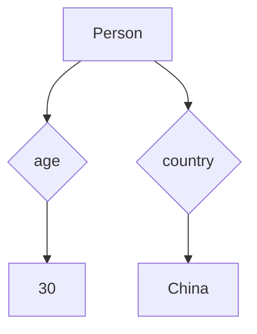
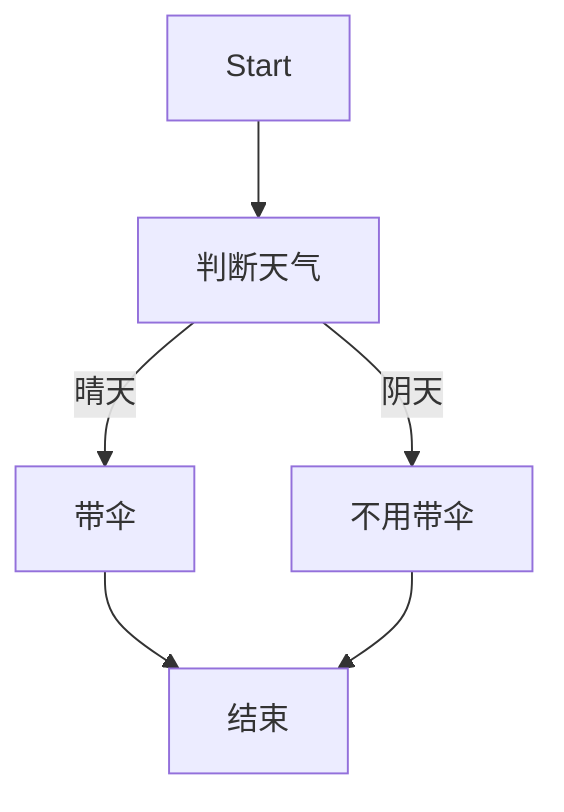

                 

## 知识图谱推理：提升AI Agent的逻辑分析

### 关键词：知识图谱、推理、AI Agent、逻辑分析、人工智能

> 摘要：
知识图谱作为一种结构化知识表示形式，在人工智能领域发挥着重要作用。本文将深入探讨知识图谱推理的基本原理、应用场景和未来趋势，以及如何通过推理提升AI Agent的逻辑分析能力。通过一步一步的逻辑分析，我们将理解知识图谱推理的关键技术，并探讨其在实际问题中的应用，为构建更强逻辑分析和推理能力的AI Agent提供思路。

----------------------------------------------------------------

## 第一部分：知识图谱与推理基础

### 第1章：知识图谱基础

#### 1.1 知识图谱概述

知识图谱（Knowledge Graph）是一种结构化、语义化的知识表示形式，它通过实体、属性和关系的网状结构来描述现实世界中的各类信息。知识图谱的定义与作用可以概括为以下几点：

- **定义**：知识图谱是一种通过语义网（Semantic Web）技术实现的语义信息组织方式，它利用实体（Entity）、属性（Attribute）、关系（Relationship）来构建语义网络，实现知识的关联和推理。
- **作用**：知识图谱在人工智能领域具有广泛的应用，包括智能搜索、自然语言处理、推荐系统、智能问答等。它能够提高信息检索的准确性，增强人工智能系统的语义理解和推理能力。

#### 1.2 知识图谱的构建

知识图谱的构建过程主要包括以下几个环节：

- **知识来源与收集**：知识来源可以是结构化数据（如数据库）、非结构化数据（如文本、图片）、半结构化数据（如XML、JSON）等。收集的知识需要经过清洗、转换和整合。
- **知识表示方法**：常见的知识表示方法包括基于属性的方法、基于图的表示方法和基于矩阵的方法。每种方法都有其优势和适用场景。
- **知识建模与存储**：知识建模是将知识表示为实体、属性和关系的过程。知识存储则涉及如何有效地存储和检索知识，常见的存储结构有图数据库、关系数据库和NoSQL数据库。

#### 1.3 知识图谱的核心概念

知识图谱的核心概念包括实体、属性和关系，它们是构建知识图谱的基础。以下是对这些概念的基本解释：

- **实体**：实体是知识图谱中的基本元素，代表现实世界中的对象或概念，如人、地点、组织、事物等。
- **属性**：属性是实体特征的描述，如人的年龄、地点的经纬度、组织的成立时间等。
- **关系**：关系是实体之间的语义联系，如人属于某个组织、地点位于某个国家、组织赞助某个活动等。

#### 1.4 知识图谱可视化与Mermaid流程图

知识图谱的可视化有助于理解和分析知识图谱的结构和关系。Mermaid是一种Markdown语法，可以用来绘制流程图、UML图、序列图等。以下是如何使用Mermaid来表示知识图谱的示例：



在这个示例中，我们创建了一个知识图谱，包括一个实体“Person”，其属性有“age”和“country”，以及相应的值。

### 第2章：知识图谱推理原理

#### 2.1 推理的基本概念

推理（Reasoning）是人工智能中的一个重要概念，它是指从已知信息出发，通过逻辑推理得出新的结论。推理可以分为以下几种类型：

- **演绎推理**：从一般到特殊的推理过程，如从“所有人都会死亡”到“苏格拉底会死亡”。
- **归纳推理**：从特殊到一般的推理过程，如从“所有的天鹅都是白色的”到“所有的天鹅都是白色的”。
- **类比推理**：通过比较两个相似的情况来推断结论，如从“猫有四条腿”到“老鼠有四条腿”。
- **逆推理**：从结果推回原因，如从“门开了”到“有人打开了门”。

#### 2.2 推理算法

知识图谱推理通常涉及以下几种算法：

- **基于规则的推理**：通过预定义的规则来匹配和推导结论，如“如果天气是晴天，那么需要带伞”。
- **基于模型的推理**：使用机器学习模型来预测和推断，如使用神经网络来预测股票价格。
- **基于图谱的推理**：直接在知识图谱上进行推理，如通过路径搜索来发现实体之间的关系。

#### 2.3 Mermaid流程图与算法讲解

使用Mermaid流程图可以直观地展示推理算法的流程。以下是一个基于规则推理的简单例子：



在这个流程图中，我们从“判断天气”开始，根据天气情况决定是否需要带伞，最终达到“结束”状态。

#### 2.4 知识图谱推理的数学模型

知识图谱推理的数学模型通常涉及图论中的路径搜索和关系运算。以下是一个简单的数学模型示例：

$$
P(A \rightarrow B) = P(A) \times P(B|A)
$$

其中，$P(A \rightarrow B)$表示从A推导到B的概率，$P(A)$表示A发生的概率，$P(B|A)$表示在A发生的条件下B发生的概率。

### 第3章：知识图谱推理应用场景

#### 3.1 推理在问答系统中的应用

问答系统是一种常见的人工智能应用，它能够理解和回答用户的问题。知识图谱推理在问答系统中起着关键作用，以下是其主要应用：

- **问题理解**：知识图谱能够帮助系统理解用户的问题，将其转化为可处理的形式。
- **信息检索**：通过知识图谱中的实体和关系，系统能够快速找到相关的信息。
- **答案生成**：基于知识图谱中的推理规则，系统可以生成准确的答案。

#### 3.2 推理在推荐系统中的应用

推荐系统通过推理来预测用户可能感兴趣的内容，其主要应用包括：

- **协同过滤**：基于用户的相似度和物品的相似度进行推荐。
- **基于内容的推荐**：根据用户的历史行为和物品的特征进行推荐。
- **混合推荐**：结合多种方法进行推荐，提高推荐的准确性。

#### 3.3 推理在自然语言处理中的应用

自然语言处理（NLP）中的推理主要用于理解文本的语义和逻辑关系，其主要应用包括：

- **实体识别**：通过推理识别文本中的实体，如人名、地点、组织等。
- **关系抽取**：通过推理识别实体之间的关系，如“张三属于公司A”。
- **语义分析**：通过推理分析文本的语义，如理解复杂的句子结构和逻辑关系。

### 第4章：构建推理驱动的AI Agent

#### 4.1 AI Agent概述

AI Agent是一种具有自主推理和决策能力的人工智能实体，它在各种环境中执行任务，并与其他Agent或环境进行交互。AI Agent的核心组成部分包括：

- **感知器**：用于感知环境中的信息。
- **推理模块**：基于知识图谱进行推理，以理解环境中的状态。
- **决策模块**：根据推理结果进行决策。
- **执行器**：执行决策，影响环境。

#### 4.2 AI Agent的推理能力

AI Agent的推理能力是其核心能力之一，以下是其主要方面：

- **知识表示**：AI Agent需要能够有效地表示和存储知识，以便进行推理。
- **推理算法**：AI Agent需要具备高效的推理算法，以快速地处理大量信息。
- **推理优化**：通过优化推理过程，提高AI Agent的推理效率和准确性。

#### 4.3 AI Agent的架构设计

AI Agent的架构设计需要考虑以下几个方面：

- **模块化设计**：将感知器、推理模块、决策模块和执行器等模块化，以提高系统的可维护性和扩展性。
- **知识图谱集成**：将知识图谱集成到AI Agent中，作为其推理的基础。
- **数据流设计**：设计合理的数据流，确保信息在系统中的高效传递和处理。

#### 4.4 AI Agent的Python实现

在Python中实现AI Agent需要使用一系列的库和框架，以下是一个基本的实现框架：

```python
import spacy
import networkx as nx
import numpy as np

# 初始化NLP模型
nlp = spacy.load("en_core_web_sm")

# 初始化知识图谱
knowledge_graph = nx.Graph()

# 初始化感知器、推理模块、决策模块和执行器
perceptor = Perceptor()
inference_module = InferenceModule(knowledge_graph)
decision_module = DecisionModule()
executor = Executor()

# 主循环
while True:
    # 感知环境
    environment_info = perceptor.perceive()
    
    # 更新知识图谱
    knowledge_graph.update(environment_info)
    
    # 推理
    inference_results = inference_module.infer(knowledge_graph)
    
    # 决策
    decision = decision_module.decide(inference_results)
    
    # 执行决策
    executor.execute(decision)
```

在这个示例中，我们使用Spacy进行NLP处理，使用NetworkX构建知识图谱，并设计了感知器、推理模块、决策模块和执行器的接口。

### 第5章：推理驱动的知识图谱扩展应用

#### 5.1 知识图谱在金融领域的应用

知识图谱在金融领域的应用非常广泛，以下是其主要应用场景：

- **信用评估**：通过知识图谱分析用户的信用记录和行为模式，进行信用评估。
- **风险评估**：通过知识图谱分析市场风险、信用风险等，进行风险评估。
- **投资建议**：通过知识图谱分析市场动态和公司信息，为用户提供投资建议。

#### 5.2 知识图谱在医疗健康领域的应用

知识图谱在医疗健康领域的应用也非常丰富，以下是其主要应用场景：

- **疾病诊断**：通过知识图谱分析患者的症状、检查结果和历史记录，进行疾病诊断。
- **治疗方案推荐**：通过知识图谱分析疾病和治疗方案的关系，为医生提供治疗方案推荐。
- **药物研究**：通过知识图谱分析药物的副作用、适应症和相互作用，加速药物研发。

#### 5.3 知识图谱在智能城市中的应用

知识图谱在智能城市中的应用旨在提高城市管理的效率和质量，以下是其主要应用场景：

- **交通管理**：通过知识图谱分析交通流量和路况信息，优化交通信号和路线规划。
- **公共安全**：通过知识图谱分析犯罪活动和人员行为，提高公共安全监控和应急响应能力。
- **智慧环保**：通过知识图谱分析环境数据和污染源信息，优化环保措施和资源分配。

### 第6章：知识图谱推理的挑战与未来趋势

#### 6.1 知识图谱推理的挑战

知识图谱推理面临着一系列挑战，以下是一些主要方面：

- **数据质量**：知识图谱中的数据需要高质量，否则推理结果可能会不准确。
- **推理效率**：随着知识图谱规模的增加，推理效率成为一个关键问题。
- **可解释性**：知识图谱推理的结果需要具备可解释性，以便用户理解和信任。

#### 6.2 知识图谱推理的未来趋势

知识图谱推理的未来趋势包括以下几个方面：

- **多模态知识图谱**：将不同类型的数据（如文本、图像、声音）整合到知识图谱中，实现多模态推理。
- **推理引擎优化**：通过优化推理算法和系统架构，提高推理效率和准确性。
- **知识图谱与AI的融合**：将知识图谱与深度学习、强化学习等AI技术相结合，实现更智能的推理和应用。

### 结论

知识图谱推理作为人工智能领域的重要技术之一，具有广泛的应用前景。通过深入理解和应用知识图谱推理，我们可以提升AI Agent的逻辑分析能力，为各种复杂问题提供高效的解决方案。未来，随着技术的不断进步，知识图谱推理将在更多领域发挥作用，推动人工智能的发展。让我们继续探索和研究，为构建更智能的人工智能系统而努力！

----------------------------------------------------------------

### 作者信息

作者：AI天才研究院/AI Genius Institute & 禅与计算机程序设计艺术 /Zen And The Art of Computer Programming

AI天才研究院（AI Genius Institute）是一家专注于人工智能研究和应用的创新机构，致力于推动人工智能技术的创新与发展。研究院的专家们深入研究和探索人工智能领域的各种前沿技术，包括知识图谱、深度学习、自然语言处理等。同时，作者也以其深入浅出的写作风格和丰富的实践经验，撰写了多本关于计算机程序设计艺术的畅销书籍，深受读者喜爱。

本文由AI天才研究院的专家团队撰写，旨在深入探讨知识图谱推理技术在人工智能领域中的应用，为读者提供有价值的见解和思考。希望通过本文的分享，能够激发更多人对知识图谱推理技术的研究和应用，共同推动人工智能技术的发展。

