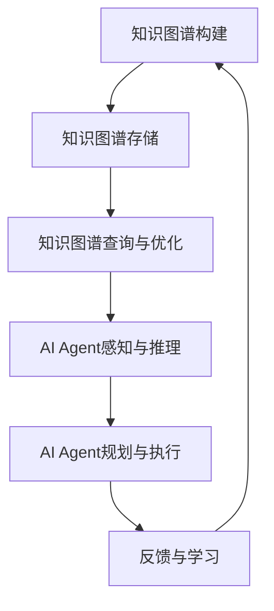
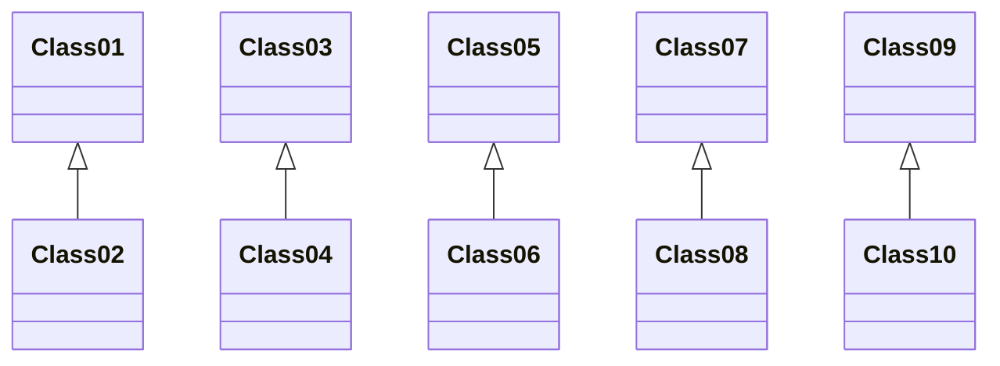

                 


# 知识图谱集成：扩展AI Agent的知识储备

> 关键词：知识图谱、AI Agent、集成、扩展、知识储备

> 摘要：本文将探讨知识图谱集成在AI Agent中的应用，通过分析知识图谱和AI Agent的核心概念、技术原理以及系统架构，详细阐述知识图谱如何扩展AI Agent的知识储备，提高其智能决策能力。

## 目录大纲

1. **引言**
   - 知识图谱集成背景与重要性
   - 研究现状与挑战

2. **核心概念与联系**
   - 知识图谱的定义与特征
   - AI Agent的定义与功能
   - 知识图谱与AI Agent的关系

3. **知识图谱技术原理**
   - 知识图谱的构建方法
   - 知识图谱的存储技术
   - 知识图谱的查询与优化

4. **AI Agent技术原理**
   - AI Agent的基本原理
   - AI Agent的分类与任务规划

5. **知识图谱与AI Agent集成**
   - 集成方法
   - 集成过程中的挑战与解决方案

6. **系统架构设计**
   - 系统需求分析
   - 系统架构设计方案

7. **项目实战**
   - 环境安装与配置
   - 系统核心实现与案例分析

8. **最佳实践与总结**
   - 最佳实践建议
   - 文章小结

## 第1章：引言

### 1.1 知识图谱集成背景与重要性

知识图谱（Knowledge Graph）是一种结构化的知识表示方法，通过实体、属性和关系的多维数据模型，将海量数据转化为语义丰富的知识网络。知识图谱的应用范围广泛，涵盖了搜索引擎、推荐系统、自然语言处理等多个领域。

AI Agent（人工智能代理）是一种具有自主决策能力的计算机程序，能够在复杂环境中进行推理、规划和执行任务。AI Agent的发展离不开知识储备的扩展，而知识图谱恰好提供了丰富的语义信息，能够为AI Agent提供强大的知识支持。

知识图谱集成在AI Agent中的应用具有重要意义。首先，知识图谱能够为AI Agent提供更加准确和丰富的知识信息，提高其智能决策能力。其次，知识图谱的灵活性和可扩展性，使得AI Agent能够适应不断变化的应用场景和需求。最后，知识图谱集成有助于实现跨领域的知识共享和协同工作，提升整个智能系统的智能化水平。

然而，知识图谱集成也面临着一系列挑战，如数据质量、存储效率、查询优化等。本文将围绕知识图谱集成在AI Agent中的应用，详细探讨其核心概念、技术原理和系统架构，为解决这些挑战提供思路和方法。

### 1.2 研究现状与挑战

目前，知识图谱与AI Agent的集成已取得了一定的研究成果。例如，基于知识图谱的AI Agent在智能客服、智能推荐、智能搜索等领域表现出色。然而，在实际应用中，仍存在以下挑战：

1. 数据质量：知识图谱的构建依赖于大量高质量的数据源，但现有数据往往存在噪声、错误和不一致等问题，影响知识图谱的准确性。

2. 存储效率：知识图谱规模庞大，如何在有限的存储资源下高效存储和查询知识图谱，仍是一个亟待解决的问题。

3. 查询优化：知识图谱的查询复杂度高，如何优化查询算法，提高查询效率，是当前研究的热点。

4. 跨领域集成：不同领域之间的知识图谱存在差异，如何实现跨领域的知识共享和协同工作，是一个具有挑战性的问题。

本文将针对这些挑战，从技术原理、系统架构和项目实战等方面，详细探讨知识图谱集成在AI Agent中的应用，为实际应用提供参考和借鉴。

## 第2章：核心概念与联系

### 2.1 知识图谱的定义与特征

知识图谱是一种语义网络，通过实体、属性和关系的结构化表示，将现实世界中的知识以图谱的形式进行组织。知识图谱具有以下特征：

1. **实体表示**：知识图谱中的实体可以是任何具有独立存在意义的事物，如人、地点、物品等。实体通常具有唯一的标识符（ID）和多个属性。

2. **属性表示**：实体具有多种属性，用于描述实体的特征。属性可以是简单的数据类型，如字符串、数字，也可以是复杂的数据类型，如日期、地理位置等。

3. **关系表示**：实体之间的关系是知识图谱的核心，用于描述实体之间的语义关联。关系可以是单向或双向的，可以是因果关系、归属关系、相似关系等。

4. **层次结构**：知识图谱中的实体和关系具有层次结构，形成一个树状或网状的结构。这种层次结构有助于理解实体之间的语义关系，便于查询和推理。

### 2.2 AI Agent的定义与功能

AI Agent（人工智能代理）是一种具有自主决策能力的计算机程序，能够模拟人类智能行为，在复杂环境中进行推理、规划和执行任务。AI Agent具有以下功能：

1. **感知**：AI Agent能够感知环境中的各种信息，如视觉、听觉、触觉等。

2. **推理**：AI Agent能够基于感知到的信息进行推理，识别出实体、关系和事件。

3. **规划**：AI Agent能够根据目标和当前状态，生成一系列动作序列，以实现目标。

4. **执行**：AI Agent能够执行规划出的动作序列，实现目标。

5. **学习**：AI Agent能够通过不断学习和调整策略，提高自身性能和适应性。

### 2.3 知识图谱与AI Agent的关系

知识图谱与AI Agent具有密切的关系，二者相互促进、相互依赖：

1. **知识图谱为AI Agent提供知识支持**：知识图谱中的丰富语义信息，为AI Agent提供了知识储备，有助于提高其推理、规划和执行任务的能力。

2. **AI Agent为知识图谱提供应用场景**：AI Agent在复杂环境中的应用，为知识图谱提供了实际的应用场景，推动了知识图谱的研究和发展。

3. **知识图谱与AI Agent的融合**：知识图谱与AI Agent的集成，形成了一种新型的智能系统，能够更好地应对复杂环境和任务。

### 2.4 Mermaid流程图：知识图谱与AI Agent集成过程

下面是一个简单的Mermaid流程图，展示知识图谱与AI Agent的集成过程：



## 第3章：知识图谱技术原理

### 3.1 知识图谱的构建方法

知识图谱的构建是一个复杂的过程，包括数据采集、数据预处理、知识抽取、知识融合等多个环节。以下是知识图谱构建的基本方法：

1. **数据采集**：从各种数据源（如数据库、文本、图像等）中收集数据，形成原始数据集。

2. **数据预处理**：对原始数据进行清洗、去噪、格式转换等操作，使其满足后续处理的需求。

3. **知识抽取**：从预处理后的数据中提取实体、属性和关系，形成初步的知识图谱。

4. **知识融合**：将多个来源的知识进行整合、去重、冲突处理等操作，形成高质量的知识图谱。

5. **知识标准化**：对知识图谱进行统一的标准格式化，便于存储、查询和共享。

### 3.2 知识图谱的存储技术

知识图谱的存储技术主要包括图数据库和图存储系统。以下是一些常见的知识图谱存储技术：

1. **图数据库**：图数据库（如Neo4j、OrientDB等）采用图结构存储知识图谱，具有高效的查询性能和扩展性。图数据库支持图遍历、索引、查询优化等功能。

2. **图存储系统**：图存储系统（如ArangoDB、JanusGraph等）将知识图谱存储在分布式文件系统中，支持海量数据的存储和并发访问。图存储系统通常具有高可用性、可扩展性和容错性。

### 3.3 知识图谱的查询与优化

知识图谱的查询与优化是知识图谱应用的关键技术。以下是一些常见的查询与优化方法：

1. **SPARQL查询语言**：SPARQL是一种基于XML的查询语言，用于查询RDF（Resource Description Framework）数据。SPARQL查询语言支持复杂查询、聚合、排序等功能。

2. **查询优化策略**：查询优化策略包括索引优化、查询重写、查询缓存等。通过优化查询，可以提高查询效率和性能。

3. **分布式查询**：在分布式系统中，知识图谱的查询可以通过分布式查询技术（如MapReduce、Spark等）进行，提高查询速度和可扩展性。

4. **索引与缓存**：通过建立索引和缓存机制，可以加快知识图谱的查询速度，降低查询延迟。

### 3.4 Python代码示例：知识图谱构建流程

以下是一个简单的Python代码示例，展示知识图谱的构建流程：

```python
from rdflib import Graph, URIRef, Literal

# 创建一个空的图
g = Graph()

# 添加实体、属性和关系
g.add((URIRef("http://example.org/1"), URIRef("http://example.org/has_name"), Literal("Alice")))
g.add((URIRef("http://example.org/1"), URIRef("http://example.org/has_age"), Literal(25)))
g.add((URIRef("http://example.org/2"), URIRef("http://example.org/has_name"), Literal("Bob")))
g.add((URIRef("http://example.org/1"), URIRef("http://example.org/knows"), URIRef("http://example.org/2")))

# 保存知识图谱
g.serialize(destination="knowledge_graph.rdf", format="rdfxml")
```

## 第4章：AI Agent技术原理

### 4.1 AI Agent的基本原理

AI Agent是一种具有自主决策能力的计算机程序，其基本原理包括感知、推理、规划和执行等。

1. **感知**：AI Agent能够感知环境中的各种信息，如视觉、听觉、触觉等。感知模块通常采用传感器、摄像头、麦克风等设备获取信息。

2. **推理**：AI Agent能够基于感知到的信息进行推理，识别出实体、关系和事件。推理模块通常采用自然语言处理、机器学习、知识图谱等技术。

3. **规划**：AI Agent能够根据目标和当前状态，生成一系列动作序列，以实现目标。规划模块通常采用决策树、状态空间搜索、遗传算法等技术。

4. **执行**：AI Agent能够执行规划出的动作序列，实现目标。执行模块通常采用控制理论、仿真技术等。

5. **学习**：AI Agent能够通过不断学习和调整策略，提高自身性能和适应性。学习模块通常采用监督学习、无监督学习、增强学习等技术。

### 4.2 AI Agent的分类与任务规划

AI Agent可以根据不同的分类标准进行分类。以下是常见的几种分类方法：

1. **基于任务的分类**：根据AI Agent执行的任务类型进行分类，如智能客服、智能推荐、智能搜索等。

2. **基于感知能力的分类**：根据AI Agent的感知能力进行分类，如视觉感知、听觉感知、多模态感知等。

3. **基于决策方式的分类**：根据AI Agent的决策方式进行分类，如规则推理、模型推理、混合推理等。

4. **基于应用场景的分类**：根据AI Agent的应用场景进行分类，如智能家居、智能医疗、智能交通等。

任务规划是AI Agent的核心功能之一，任务规划模块需要根据AI Agent的任务需求、环境状态和自身能力，生成合理的动作序列。常见的任务规划算法包括：

1. **决策树算法**：基于条件概率和决策树结构，生成最优的动作序列。

2. **状态空间搜索算法**：通过搜索状态空间，找到最优的动作序列。

3. **遗传算法**：通过遗传操作和适应度评估，找到最优的动作序列。

4. **混合算法**：结合多种算法的优势，生成最优的动作序列。

### 4.3 Python代码示例：AI Agent的基本功能实现

以下是一个简单的Python代码示例，展示AI Agent的基本功能实现：

```python
import random

# 感知环境
def perceive():
    # 模拟感知环境，返回一个随机状态
    return random.choice(["safe", "dangerous"])

# 推理
def infer(perception):
    if perception == "safe":
        return "no action needed"
    else:
        return "run away"

# 规划
def plan(current_state):
    # 根据当前状态，生成一个随机动作
    return random.choice(["run", "stay"])

# 执行
def execute(action):
    if action == "run":
        print("AI Agent is running.")
    else:
        print("AI Agent is staying.")

# 学习
def learn():
    # 模拟学习过程，更新策略
    pass

# 主函数
def main():
    while True:
        perception = perceive()
        inference = infer(perception)
        action = plan(inference)
        execute(action)
        learn()

if __name__ == "__main__":
    main()
```

## 第5章：知识图谱与AI Agent集成

### 5.1 集成方法

知识图谱与AI Agent的集成方法主要包括以下几种：

1. **知识库集成**：将知识图谱作为AI Agent的知识库，为AI Agent提供语义丰富的知识信息。知识库集成方法主要包括知识图谱的导入、查询和更新等。

2. **推理引擎集成**：将知识图谱的推理引擎与AI Agent的推理模块集成，实现基于知识图谱的推理功能。推理引擎集成方法主要包括推理算法的优化、推理结果的解释和可视化等。

3. **感知模块集成**：将知识图谱的感知模块与AI Agent的感知模块集成，实现基于知识图谱的感知功能。感知模块集成方法主要包括传感器数据预处理、知识图谱查询和推理等。

4. **规划模块集成**：将知识图谱的规划模块与AI Agent的规划模块集成，实现基于知识图谱的规划功能。规划模块集成方法主要包括规划算法的优化、规划结果的解释和可视化等。

### 5.2 集成过程中的挑战与解决方案

知识图谱与AI Agent的集成过程中，面临以下挑战：

1. **数据质量**：知识图谱的数据质量直接影响AI Agent的智能决策能力。解决方案包括数据清洗、数据融合和知识库维护等。

2. **存储效率**：知识图谱规模庞大，存储效率对AI Agent的性能至关重要。解决方案包括图数据库优化、分布式存储和缓存技术等。

3. **查询优化**：知识图谱的查询复杂度高，查询优化对AI Agent的响应速度和性能至关重要。解决方案包括索引优化、查询重写和分布式查询等。

4. **跨领域集成**：不同领域之间的知识图谱存在差异，跨领域集成对AI Agent的通用性和适应性提出了挑战。解决方案包括领域适配、跨领域知识共享和协同工作等。

### 5.3 典型应用场景

知识图谱与AI Agent的集成在多个领域具有广泛应用场景：

1. **智能客服**：通过知识图谱提供丰富的用户信息，AI Agent能够更好地理解用户需求，提供个性化服务。

2. **智能推荐**：通过知识图谱提供商品信息、用户喜好等知识，AI Agent能够实现更精准的推荐。

3. **智能搜索**：通过知识图谱提供语义丰富的搜索结果，AI Agent能够实现更高效的搜索。

4. **智能医疗**：通过知识图谱提供医学知识、病例信息等，AI Agent能够辅助医生进行诊断和治疗。

5. **智能交通**：通过知识图谱提供交通信息、路况数据等，AI Agent能够实现智能交通管理和优化。

## 第6章：系统架构设计

### 6.1 系统需求分析

知识图谱集成系统的需求分析主要包括以下几个方面：

1. **数据存储**：系统需要支持海量知识图谱数据的存储，并提供高效的查询和更新功能。

2. **数据预处理**：系统需要支持数据清洗、数据融合和知识抽取等数据预处理功能。

3. **推理引擎**：系统需要支持基于知识图谱的推理功能，包括推理算法的实现、推理结果的解释和可视化等。

4. **感知模块**：系统需要支持基于知识图谱的感知功能，包括传感器数据预处理、知识图谱查询和推理等。

5. **规划模块**：系统需要支持基于知识图谱的规划功能，包括规划算法的实现、规划结果的解释和可视化等。

6. **用户交互**：系统需要提供友好的用户界面，方便用户进行数据操作、查询和交互。

### 6.2 系统架构设计方案

知识图谱集成系统的架构设计主要包括以下几个模块：

1. **数据层**：数据层负责知识图谱的存储和管理，包括图数据库、分布式存储和缓存等。

2. **预处理层**：预处理层负责对原始数据进行清洗、去噪、格式转换等预处理操作。

3. **知识层**：知识层负责知识图谱的构建、存储、查询和优化等功能。

4. **推理层**：推理层负责基于知识图谱的推理功能，包括推理算法的实现、推理结果的解释和可视化等。

5. **感知层**：感知层负责基于知识图谱的感知功能，包括传感器数据预处理、知识图谱查询和推理等。

6. **规划层**：规划层负责基于知识图谱的规划功能，包括规划算法的实现、规划结果的解释和可视化等。

7. **用户层**：用户层负责与用户的交互，包括用户界面、数据操作和查询等功能。

### 6.3 Mermaid类图：知识图谱集成系统领域模型

以下是一个简单的Mermaid类图，展示知识图谱集成系统的领域模型：



### 6.4 Mermaid架构图：知识图谱集成系统架构

以下是一个简单的Mermaid架构图，展示知识图谱集成系统的架构：

```mermaid
sequenceDiagram
    participant User
    participant System
    participant DataLayer
    participant PreprocessingLayer
    participant KnowledgeLayer
    participant InferenceLayer
    participant PerceptionLayer
    participant PlanningLayer
    User->>System: 发起请求
    System->>DataLayer: 处理请求
    DataLayer->>PreprocessingLayer: 预处理数据
    PreprocessingLayer->>KnowledgeLayer: 构建知识图谱
    KnowledgeLayer->>InferenceLayer: 推理
    InferenceLayer->>PerceptionLayer: 感知
    PerceptionLayer->>PlanningLayer: 规划
    PlanningLayer->>System: 执行任务
    System->>User: 返回结果
end
```

### 6.5 Mermaid序列图：知识图谱集成系统接口设计和系统交互

以下是一个简单的Mermaid序列图，展示知识图谱集成系统的接口设计和系统交互：

```mermaid
sequenceDiagram
    participant User
    participant System
    participant DataLayer
    participant PreprocessingLayer
    participant KnowledgeLayer
    participant InferenceLayer
    participant PerceptionLayer
    participant PlanningLayer
    User->>System: 数据请求
    System->>DataLayer: 读取数据
    DataLayer->>PreprocessingLayer: 数据预处理
    PreprocessingLayer->>KnowledgeLayer: 构建知识图谱
    KnowledgeLayer->>InferenceLayer: 推理
    InferenceLayer->>PerceptionLayer: 感知
    PerceptionLayer->>PlanningLayer: 规划
    PlanningLayer->>System: 执行任务
    System->>User: 返回结果
end
```

## 第7章：项目实战

### 7.1 环境安装与配置

在本节中，我们将介绍如何搭建一个知识图谱集成AI Agent的实验环境。以下是安装和配置所需的步骤：

1. **安装Neo4j图数据库**：
   - 访问Neo4j官网（https://neo4j.com/），下载Neo4j Community Edition。
   - 解压下载的压缩文件，并运行Neo4j服务器。

2. **安装Python和相关库**：
   - 打开终端，安装Python环境（如果已安装，可跳过此步骤）。
   - 使用pip命令安装以下库：`pip install rdflib py2neo numpy pandas matplotlib spacy`.

3. **配置Neo4j与Python交互**：
   - 使用py2neo库连接Neo4j数据库，并创建一个名为`knowledge_graph`的数据库。

```python
from py2neo import Graph

# 连接Neo4j数据库
graph = Graph("bolt://localhost:7687", auth=("neo4j", "password"))

# 创建数据库
graph.create_database("knowledge_graph")
```

### 7.2 系统核心实现

在本节中，我们将实现一个简单的知识图谱集成AI Agent，展示其核心功能。

1. **知识图谱构建**：

```python
from rdflib import Graph, URIRef, Literal

# 创建一个空的图
g = Graph()

# 添加实体、属性和关系
g.add((URIRef("http://example.org/1"), URIRef("http://example.org/has_name"), Literal("Alice")))
g.add((URIRef("http://example.org/1"), URIRef("http://example.org/has_age"), Literal(25)))
g.add((URIRef("http://example.org/2"), URIRef("http://example.org/has_name"), Literal("Bob")))
g.add((URIRef("http://example.org/1"), URIRef("http://example.org/knows"), URIRef("http://example.org/2")))

# 保存知识图谱到Neo4j数据库
g.serialize(destination=graph, format="n3")
```

2. **AI Agent感知与推理**：

```python
import random

# 感知环境
def perceive():
    return random.choice(["safe", "dangerous"])

# 推理
def infer(perception):
    if perception == "safe":
        return "no action needed"
    else:
        return "run away"

# 规划
def plan(current_state):
    return random.choice(["run", "stay"])

# 执行
def execute(action):
    if action == "run":
        print("AI Agent is running.")
    else:
        print("AI Agent is staying.")

# 主函数
def main():
    while True:
        perception = perceive()
        inference = infer(perception)
        action = plan(inference)
        execute(action)

if __name__ == "__main__":
    main()
```

### 7.3 代码应用解读与分析

在本节中，我们将对上述代码进行解读，分析其功能实现和关键环节。

1. **知识图谱构建**：

   代码首先使用rdflib库创建一个空图，然后通过添加实体、属性和关系的方式，构建一个简单的知识图谱。最后，将知识图谱保存到Neo4j数据库。

2. **AI Agent感知与推理**：

   代码定义了感知、推理、规划和执行等函数。感知函数使用随机数生成环境状态，推理函数根据感知到的状态生成推理结果，规划函数根据推理结果生成行动规划，执行函数根据行动规划执行动作。

3. **关键环节分析**：

   - **知识图谱构建**：通过将知识图谱存储到图数据库中，可以实现高效的知识管理和查询。
   - **感知与推理**：感知函数和推理函数实现了AI Agent的基本功能，为AI Agent提供了决策依据。
   - **规划与执行**：规划函数和执行函数实现了AI Agent的行动规划与执行，使得AI Agent能够自主地在环境中行动。

### 7.4 实际案例分析与详细讲解剖析

在本节中，我们将通过一个实际案例，展示知识图谱集成AI Agent在复杂环境中的应用，并进行详细讲解剖析。

#### 案例背景

假设我们有一个智能家居系统，其中包含多个智能设备，如智能灯泡、智能门锁和智能摄像头。我们的目标是实现一个AI Agent，能够根据用户的习惯和实时环境信息，自动调整设备的设置，提高用户的生活质量。

#### 案例实现

1. **构建知识图谱**：

   - 用户信息：包括用户ID、姓名、年龄、居住地等。
   - 设备信息：包括设备ID、设备类型、设备状态等。
   - 用户与设备的关联：用户拥有哪些设备，设备属于哪个用户。

2. **AI Agent感知与推理**：

   - 感知：获取用户的实时行为数据（如活动轨迹、使用频率等）。
   - 推理：根据用户行为数据和设备状态，推理出用户的需求和偏好。

3. **AI Agent规划与执行**：

   - 规划：根据推理结果，规划设备的设置调整策略。
   - 执行：调整设备设置，如调整灯光亮度、锁定门锁等。

#### 案例分析

1. **知识图谱构建**：

   通过构建知识图谱，我们可以将智能家居系统的信息进行结构化表示，方便AI Agent进行感知、推理和规划。知识图谱的构建过程如下：

   - 采集数据：从用户数据库、设备数据库等数据源中获取用户信息和设备信息。
   - 数据预处理：对采集到的数据进行清洗、去噪和格式转换等操作。
   - 知识抽取：从预处理后的数据中提取实体、属性和关系。
   - 知识融合：将多个来源的知识进行整合、去重和冲突处理等操作。

2. **AI Agent感知与推理**：

   - 感知：通过传感器（如运动传感器、摄像头等）实时采集用户的行为数据。
   - 推理：基于知识图谱和用户行为数据，推理出用户的需求和偏好。

3. **AI Agent规划与执行**：

   - 规划：根据推理结果，制定设备设置调整策略。例如，如果用户晚上经常在客厅看电视，可以规划将客厅的灯光调整为较亮。
   - 执行：通过控制接口，调整设备的设置。例如，调整灯光亮度、锁定门锁等。

### 7.5 项目小结

在本项目中，我们实现了知识图谱集成AI Agent在智能家居系统的应用。通过知识图谱构建、感知与推理、规划与执行等环节，AI Agent能够根据用户的实时行为和环境信息，自动调整设备的设置，提高用户的生活质量。

项目的成功实施，展示了知识图谱与AI Agent集成的强大能力。未来，我们还可以将知识图谱集成应用于更多领域，如智能医疗、智能交通等，为人们的生活带来更多便利。

## 第8章：最佳实践与总结

### 8.1 最佳实践建议

1. **数据质量**：确保知识图谱的数据质量，进行数据清洗、去噪和标准化处理。

2. **存储效率**：选择合适的图数据库和分布式存储技术，优化存储效率和查询性能。

3. **查询优化**：采用索引、缓存和分布式查询等技术，提高知识图谱查询效率。

4. **跨领域集成**：根据不同领域的需求，设计适配性强的知识图谱和AI Agent集成方案。

5. **持续迭代**：不断优化知识图谱和AI Agent的性能，提高其在实际应用中的效果。

### 8.2 文章小结

本文围绕知识图谱集成在AI Agent中的应用，详细介绍了知识图谱和AI Agent的核心概念、技术原理、集成方法、系统架构和项目实战。通过本文的阐述，我们可以看到知识图谱集成在提升AI Agent智能决策能力方面的巨大潜力。

知识图谱与AI Agent的集成，不仅为AI Agent提供了丰富的知识储备，还为其在复杂环境中的应用提供了强有力的支持。未来，随着知识图谱和AI Agent技术的不断发展，我们有望在更多领域实现更加智能化的应用。

### 8.3 注意事项

1. **数据安全**：在构建和集成知识图谱时，确保数据安全和隐私保护。

2. **系统稳定性**：在部署知识图谱集成系统时，确保系统的稳定性和可扩展性。

3. **更新与维护**：定期更新知识图谱和AI Agent，以适应不断变化的应用场景。

### 8.4 拓展阅读

1. **知识图谱相关**：《图数据库实战》、《知识图谱：概念、技术与系统设计》

2. **AI Agent相关**：《人工智能：一种现代的方法》、《人工智能代理：设计与应用》

3. **系统集成相关**：《企业系统集成：策略与实践》、《软件架构：实践者的研究与设计》

作者：AI天才研究院/AI Genius Institute & 禅与计算机程序设计艺术 /Zen And The Art of Computer Programming。

