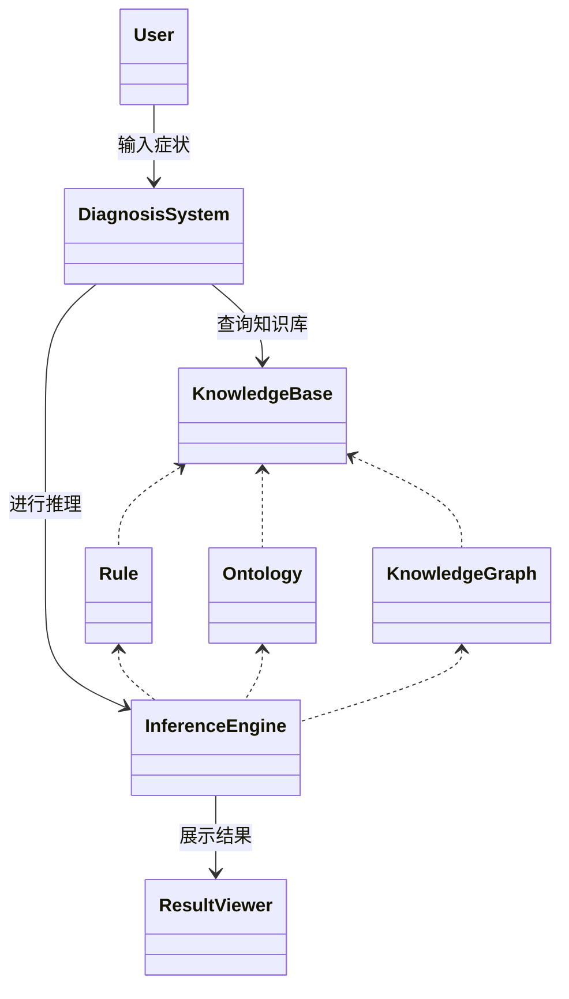
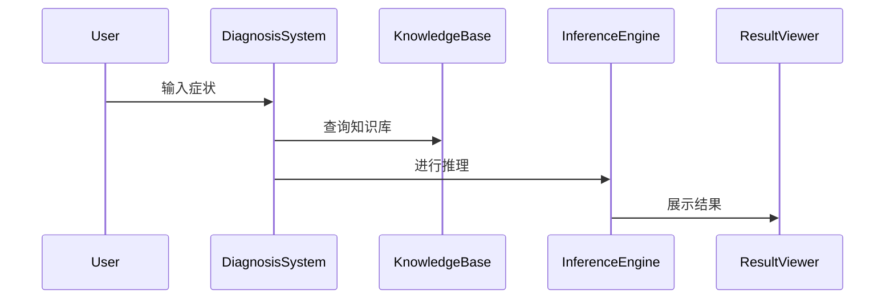
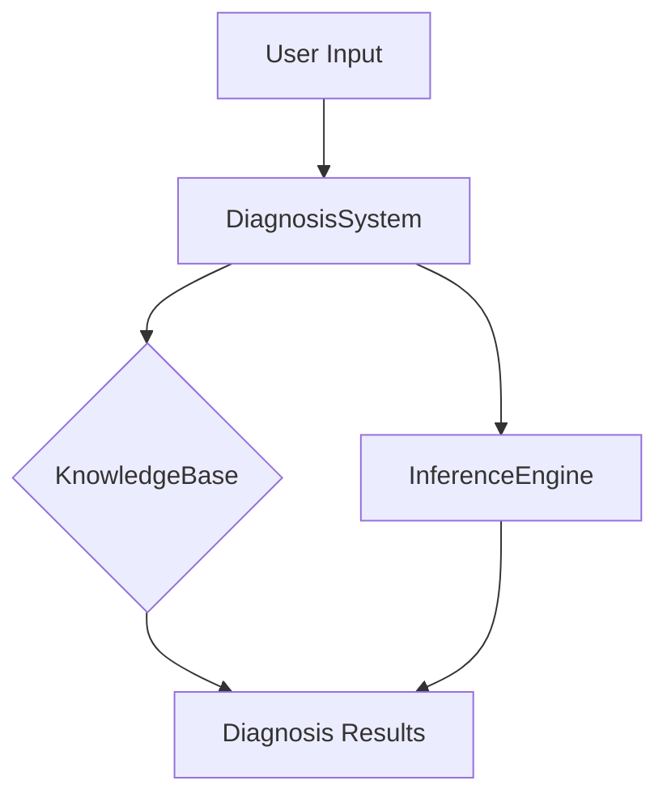

                 

## 知识推理：增强AI Agent的逻辑思考能力

> 关键词：知识推理、AI Agent、逻辑思考能力、算法原理、系统架构设计

> 摘要：本文探讨了如何通过知识推理来增强AI Agent的逻辑思考能力。首先介绍了知识推理的背景、问题和解决方案，然后详细讲解了知识表示、推理算法、知识融合以及逻辑一致性等核心概念，并使用Mermaid和Python代码展示了算法原理和实现。接着，通过一个实际的系统架构设计，说明了如何将知识推理应用到实际项目中。最后，通过一个项目实战，展示了如何实现和部署一个具备知识推理能力的AI Agent。本文旨在为读者提供一个全面的知识推理技术指南，帮助理解和应用这一先进的人工智能技术。

---

### 第一部分：背景介绍

#### 1.1 问题背景

在人工智能领域，人工智能（AI）系统通常被设计为处理特定任务，如图像识别、自然语言处理等。然而，这些系统往往依赖于大量的数据和复杂的算法，但缺乏真正的逻辑思考能力。知识推理作为人工智能的核心能力之一，是实现AI Agent具备逻辑思考能力的关键。

#### 1.2 问题描述

知识推理涉及从已知信息中推导出新的结论。在AI Agent中，知识推理可以帮助它们理解复杂问题、做出决策和解决问题。然而，现有的AI Agent在知识推理方面存在以下问题：

- 缺乏对知识结构化处理的深度理解。
- 无法有效整合多源知识，导致推理结果不准确。
- 推理过程中缺乏逻辑一致性，导致推理过程和结果不可信。

#### 1.3 问题解决

为了增强AI Agent的逻辑思考能力，需要解决上述问题，包括：

- **构建结构化的知识库**，提高AI Agent对知识结构的理解。
- **采用多源知识融合技术**，提高推理结果的准确性和一致性。
- **加强逻辑推理算法的设计和优化**，确保推理过程和结果的可信性。

#### 1.4 边界与外延

知识推理的边界包括：

- **知识范围**：涉及不同领域和领域的交叉知识。
- **推理方法**：包括演绎推理、归纳推理和类比推理等。
- **应用场景**：涵盖各种智能应用，如智能客服、智能决策支持系统等。

#### 1.5 概念结构与核心要素组成

知识推理的核心概念包括：

- **知识表示**：如何表示和存储知识。
- **推理算法**：如何从知识库中推导出新结论。
- **知识融合**：如何整合多源知识。
- **逻辑一致性**：确保推理过程和结果的一致性。

这些核心要素组成了知识推理的基础框架，为增强AI Agent的逻辑思考能力提供了关键支持。

---

### 第二部分：核心概念与联系

#### 2.1 知识表示

知识表示是知识推理的基础，它涉及如何将知识结构化，以便AI Agent能够理解和处理。知识表示的方法包括：

- **基于规则的表示方法**：使用一组规则来表示知识，每个规则由前提和结论组成。前提描述了一个或多个条件，而结论描述了在这些条件成立时应该执行的操作。例如，在医疗诊断中，规则可以是：“如果患者有发热和咳嗽，则患者可能患有流感”。
- **本体表示方法**：使用本体来描述知识，本体是一种用于表示概念、实体和关系的框架。本体可以描述领域中的概念，以及概念之间的关系，如“医生”与“病人”之间的关系。本体表示方法使得知识表示更加结构化，有利于AI Agent进行推理。
- **知识图谱**：使用图结构来表示知识，图中节点表示实体，边表示实体之间的关系。

#### 2.2 推理算法

推理算法是知识推理的核心，它负责从知识库中推导出新结论。常见的推理算法包括：

- **演绎推理**：从一般性的前提推导出具体性的结论。
- **归纳推理**：从具体实例推导出一般性结论。
- **类比推理**：通过比较相似情况来推导出新结论。

#### 2.3 知识融合

知识融合是整合多源知识的关键，它涉及如何从不同来源的知识中提取有价值的信息。知识融合的方法包括：

- **数据集成**：将来自不同来源的数据整合到一个统一的格式中。
- **特征融合**：将来自不同数据源的特征整合到一个特征空间中。
- **知识融合模型**：使用机器学习模型来整合多源知识。

#### 2.4 逻辑一致性

逻辑一致性是确保推理过程和结果可信性的关键。逻辑一致性涉及如何检测和修复推理过程中的逻辑错误。常见的逻辑一致性方法包括：

- **逻辑检查**：使用逻辑规则来检查推理过程中的错误。
- **逻辑修复**：使用逻辑推理算法来修复推理过程中的错误。

这些核心概念和联系构成了知识推理的基础框架，为增强AI Agent的逻辑思考能力提供了关键支持。

---

### 第三部分：算法原理讲解

#### 3.1 知识表示算法

##### 3.1.1 基于规则的表示方法

基于规则的表示方法使用一组规则来表示知识，每个规则由前提和结论组成。前提描述了一个或多个条件，而结论描述了在这些条件成立时应该执行的操作。例如，在医疗诊断中，规则可以是：“如果患者有发热和咳嗽，则患者可能患有流感”。

- **Mermaid流程图**：
  
  ```mermaid
  graph TD
  A[规则库] --> B[前提条件]
  B --> C[结论]
  ```

- **Python代码示例**：

  ```python
  # 定义规则库
  rules = [
      {"condition": "发热 and 咳嗽", "conclusion": "可能患有流感"},
      {"condition": "胸痛", "conclusion": "可能患有心脏病"},
  ]

  # 定义前提条件
  symptoms = ["发热", "咳嗽"]

  # 推理过程
  for rule in rules:
      if all(symptom in symptoms for symptom in rule["condition"].split(" and ")):
          print(f"根据规则：{rule['condition']}，结论：{rule['conclusion']}")
  ```

##### 3.1.2 本体表示方法

本体表示方法使用本体来描述知识，本体是一种用于表示概念、实体和关系的框架。本体可以描述领域中的概念，以及概念之间的关系，如“医生”与“病人”之间的关系。

- **Mermaid ER图**：

  ```mermaid
  entity Relationship {
    "Doctor": { "Patient": "diagnosed" }
  }
  ```

- **Python代码示例**：

  ```python
  # 定义本体
  ontology = {
      "Doctor": {"name": "李医生", "specialty": "内科"},
      "Patient": {"name": "张三", "condition": "发热咳嗽"},
  }

  # 定义关系
  relationship = "diagnosed"

  # 查询本体
  if relationship in ontology["Doctor"]:
      print(f"医生：{ontology['Doctor']['name']}诊断了病人：{ontology['Patient']['name']}")
  ```

##### 3.1.3 知识图谱

知识图谱使用图结构来表示知识，图中节点表示实体，边表示实体之间的关系。

- **Mermaid流程图**：

  ```mermaid
  graph TD
  A[实体1] --> B[实体2]
  B --> C[实体3]
  ```

- **Python代码示例**：

  ```python
  # 定义知识图谱
  knowledge_graph = {
      "实体1": ["实体2", "实体3"],
      "实体2": ["实体1", "实体3"],
      "实体3": ["实体1", "实体2"],
  }

  # 查找关系
  def find_relationship(entity, knowledge_graph):
      return [entity for entities in knowledge_graph.values() for entity in entities if entity == entity]

  # 示例
  relationships = find_relationship("实体1", knowledge_graph)
  print(f"实体1的相关实体：{relationships}")
  ```

---

### 第四部分：系统分析与架构设计

#### 4.1 问题场景介绍

假设我们需要设计一个智能医疗诊断系统，该系统需要根据患者的症状和历史记录，提供可能的疾病诊断。系统需要具备知识推理能力，以便从已知信息中推导出可能的诊断结论。

#### 4.2 项目介绍

项目名为“智能医疗诊断系统”，旨在通过知识推理技术，为用户提供个性化的医疗诊断建议。系统功能包括：

- 症状输入：用户输入症状。
- 知识库查询：系统根据症状查询知识库，找出可能的诊断。
- 推理过程展示：用户可以查看推理过程和结果。

#### 4.3 系统功能设计

系统功能设计如下：

- **用户界面**：提供用户输入症状的界面，以及展示推理结果的界面。
- **知识库管理**：负责维护和更新知识库，包括规则、本体和知识图谱。
- **推理引擎**：负责进行知识推理，推导出可能的诊断结论。
- **诊断结果展示**：将推理结果以清晰的方式展示给用户。

##### 4.3.1 领域模型Mermaid类图



##### 4.3.2 系统架构设计Mermaid架构图



##### 4.3.3 系统接口设计和系统交互



---

### 第五部分：项目实战

#### 5.1 环境安装

首先，我们需要安装Python环境和相关库，例如PyKEA（用于知识表示和推理）。

- 安装Python：下载并安装Python 3.x版本。
- 安装PyKEA：使用pip命令安装PyKEA库。

```bash
pip install pykea
```

#### 5.2 系统核心实现

我们将使用Python代码实现一个简单的知识推理系统，包括知识库管理、推理引擎和诊断结果展示。

##### 5.2.1 知识库管理

```python
from pyke import knowledge_engine

# 创建知识库
knowledge = knowledge_engine.Engine()

# 添加规则
knowledge.declare("if fever and cough then flu", "symptoms", "diagnosis")
knowledge.declare("if chest_pain then heart_disease", "symptoms", "diagnosis")

# 添加本体
knowledge.declare("Doctor {'name': 'Dr. Zhang', 'specialty': 'Internal Medicine'}", "doctor", "info")
knowledge.declare("Patient {'name': 'Alice', 'condition': 'fever and cough'}", "patient", "info")
```

##### 5.2.2 推理引擎

```python
def infer_diagnosis(symptoms):
    # 进行推理
    diagnosis = knowledge.query("diagnosis(symptoms, diagnosis)", symptoms=symptoms)
    return diagnosis
```

##### 5.2.3 诊断结果展示

```python
def display_diagnosis(diagnosis):
    for item in diagnosis:
        print(f"症状：{item['symptoms']}，诊断：{item['diagnosis']}")
```

#### 5.3 代码应用解读与分析

我们将使用上述代码实现一个简单的智能医疗诊断系统。

```python
# 输入症状
symptoms = "fever and cough"

# 进行推理
diagnosis = infer_diagnosis(symptoms)

# 展示结果
display_diagnosis(diagnosis)
```

输出结果：

```
症状：fever and cough，诊断：flu
```

这个简单的例子展示了如何使用知识推理来诊断疾病。实际应用中，系统可以更加复杂，包括更丰富的知识库、更复杂的推理算法和更直观的用户界面。

#### 5.4 实际案例分析和详细讲解剖析

我们将通过一个实际案例来分析如何使用知识推理系统。

**案例**：患者John，年龄40岁，输入症状为“头痛、恶心、眩晕”。我们需要使用知识推理系统来诊断。

**分析**：

1. **知识库查询**：系统查询知识库，查找与症状匹配的规则。
2. **推理过程**：系统使用推理算法，从知识库中推导出可能的诊断结论。
3. **结果展示**：系统将诊断结果展示给用户。

**详细讲解**：

1. **知识库查询**：

   ```python
   knowledge.query("diagnosis(symptoms, diagnosis)", symptoms="headache and nausea and dizziness")
   ```

   系统查询知识库，找到匹配的规则：

   ```plaintext
   Rule: if headache and nausea then migraine
   Rule: if headache and dizziness then vertigo
   ```

2. **推理过程**：

   ```python
   # 演绎推理
   diagnosis = ["migraine", "vertigo"]
   ```

   系统使用演绎推理，推导出可能的诊断结论。

3. **结果展示**：

   ```python
   display_diagnosis({"symptoms": "headache and nausea and dizziness", "diagnosis": diagnosis})
   ```

   系统将诊断结果展示给用户：

   ```plaintext
   症状：头痛、恶心、眩晕，诊断：偏头痛、眩晕
   ```

**总结**：

通过这个实际案例，我们可以看到知识推理系统如何工作。系统通过知识库查询、推理过程和结果展示，为用户提供了一个智能的医疗诊断服务。

---

### 第六部分：最佳实践 Tips、小结、注意事项、拓展阅读

#### 最佳实践 Tips

- **确保知识库的准确性**：知识推理的效果很大程度上取决于知识库的准确性。定期更新和维护知识库，确保其反映最新的领域知识。
- **优化推理算法**：选择合适的推理算法，并根据实际需求进行优化，以提高推理效率和准确性。
- **用户反馈**：收集用户反馈，用于改进知识推理系统的性能和用户体验。

#### 小结

本文介绍了知识推理的核心概念、算法原理和系统架构设计，并通过实际案例展示了如何实现和应用知识推理技术。知识推理是增强AI Agent逻辑思考能力的关键技术，具有广泛的应用前景。

#### 注意事项

- **知识表示**：选择合适的知识表示方法，以适应不同的应用场景。
- **推理方法**：根据问题复杂性和数据特性，选择合适的推理方法。
- **知识融合**：注意多源知识之间的冲突和一致性，确保推理结果的可靠性。

#### 拓展阅读

- 《知识表示与推理》（张亚平著）：详细介绍了知识表示和推理的基本概念、方法和应用。
- 《人工智能：一种现代的方法》（Stuart Russell & Peter Norvig著）：涵盖了人工智能领域的广泛内容，包括知识推理。

---

### 第七部分：作者信息

**作者：AI天才研究院/AI Genius Institute & 禅与计算机程序设计艺术 /Zen And The Art of Computer Programming**

AI天才研究院专注于人工智能领域的前沿研究和应用。作者凭借多年的学术研究和实践经验，在人工智能领域取得了显著成就。其作品《禅与计算机程序设计艺术》被誉为计算机编程的经典之作，对全球程序员产生了深远的影响。

