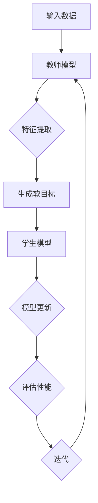
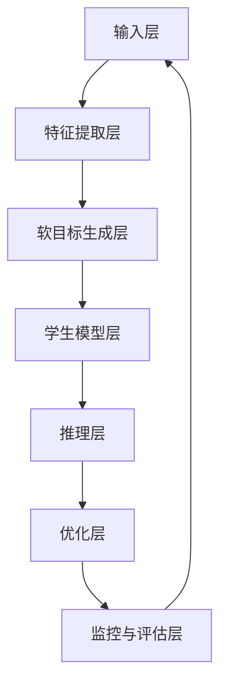
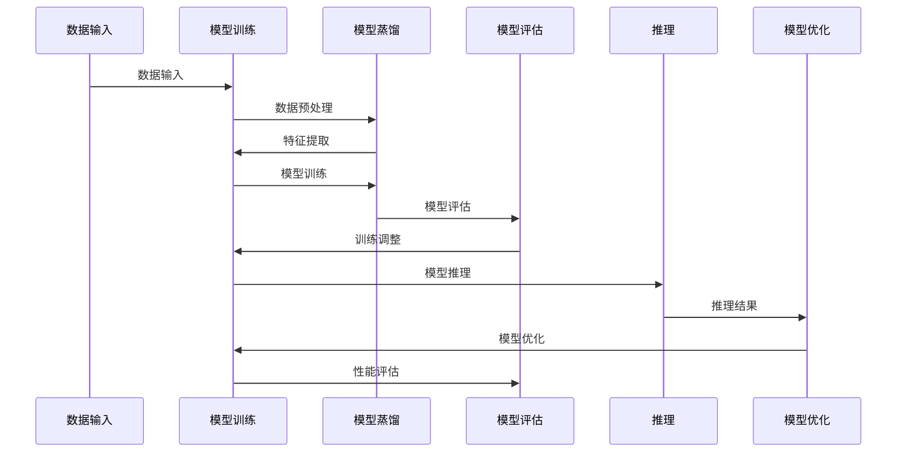

                 

### 第1章：背景介绍与概述

#### 1.1 问题背景

人工智能（AI）技术正日益深入到我们生活的各个领域，从智能助手到自动驾驶，再到医疗诊断，AI Agent作为人工智能系统的重要组成部分，承担着重要的角色。AI Agent是指具备自主决策能力、能够与人类进行交互并能执行特定任务的智能体。随着AI应用的不断扩展，AI Agent的重要性愈发凸显。

然而，AI Agent的广泛应用也带来了一系列挑战，其中最显著的是轻量化需求。传统的AI模型，如深度学习模型，往往依赖于庞大的计算资源和存储空间。这不仅在硬件层面造成了巨大的负担，还在实际部署过程中限制了AI Agent的普及和灵活性。特别是在移动设备、嵌入式系统和物联网（IoT）等场景中，对AI Agent的轻量化需求尤为迫切。

知识蒸馏（Knowledge Distillation）是一种通过将大型教师模型（Teacher Model）的知识传授给小型学生模型（Student Model）的技术。它不仅能够缩小模型的规模，提高效率，还能在一定程度上保留教师模型的性能。知识蒸馏在AI Agent轻量化中的应用，有望解决传统方法在模型压缩中遇到的一些瓶颈。

#### 1.2 问题描述

AI Agent的轻量化主要涉及以下几个方面：

1. **模型大小**：减少模型的参数数量和计算量，以便在资源受限的设备上部署。
2. **计算效率**：优化模型结构，提高推理速度，降低延迟。
3. **能耗**：减少模型运行时的能耗，提高设备的续航能力。

传统的轻量化方法主要包括模型剪枝、量化、低秩分解等，但这些方法往往需要复杂的预处理和后处理步骤，且在性能方面可能存在妥协。知识蒸馏通过将教师模型的隐式知识转移到学生模型中，提供了一种更为高效且性能损失较小的轻量化途径。

知识蒸馏的定义与原理：

- **教师模型**：一个大型、高性能的模型，通常用于指导学生模型的训练。
- **学生模型**：一个较小的、轻量级的模型，其目标是模仿教师模型的性能。

知识蒸馏的过程包括以下步骤：

1. **特征提取与表示**：教师模型对学生输入进行特征提取，并将这些特征表示传递给学生模型。
2. **软目标与硬目标**：学生模型根据教师模型给出的软目标（通常是Softmax概率分布）来更新其参数。
3. **知识传递**：通过一系列的迭代训练，学生模型逐步吸收教师模型的知识，直至其性能接近或达到教师模型。

知识蒸馏在AI Agent轻量化中的应用：

- **性能提升**：学生模型能够模仿教师模型的能力，从而在轻量化的同时保持较高的性能。
- **效率优化**：学生模型规模较小，可以显著减少计算和存储需求，提高AI Agent的响应速度。
- **部署灵活**：知识蒸馏允许在多种硬件平台上部署AI Agent，从而提高了AI技术的普及性。

#### 1.3 问题解决

知识蒸馏的核心概念包括教师模型、学生模型、软目标、硬目标等。具体来说：

- **教师模型**：一个大型、复杂的模型，负责提供知识。
- **学生模型**：一个较小的、简化的模型，负责学习教师模型的知识。
- **软目标**：教师模型给出的概率分布，用于指导学生模型的学习。
- **硬目标**：实际的标签，用于评估学生模型的性能。

知识蒸馏的流程通常包括以下步骤：

1. **初始化**：教师模型和学生模型初始化，学生模型通常初始化为较小的参数规模。
2. **特征提取**：教师模型对输入数据进行特征提取，并将特征表示传递给学生模型。
3. **软目标生成**：教师模型根据输入数据生成软目标（Softmax概率分布）。
4. **模型更新**：学生模型根据软目标更新其参数。
5. **迭代训练**：重复上述步骤，直到学生模型性能接近或达到教师模型。

知识蒸馏的优势在于：

- **性能保留**：学生模型能够较好地继承教师模型的知识，从而在轻量化的同时保持较高的性能。
- **高效性**：知识蒸馏过程相对简单，且不需要复杂的预处理和后处理步骤。
- **通用性**：知识蒸馏可以应用于多种类型的模型和任务，具有较强的通用性。

然而，知识蒸馏也存在一定的局限性，例如：

- **依赖教师模型**：知识蒸馏需要依赖一个高性能的教师模型，这在某些情况下可能不现实。
- **计算资源消耗**：尽管知识蒸馏本身较为高效，但在初始阶段仍需要较多的计算资源来训练教师模型。

#### 1.4 边界与外延

知识蒸馏的应用范围非常广泛，包括但不限于以下领域：

- **计算机视觉**：在图像分类、目标检测等任务中，知识蒸馏被广泛应用于模型压缩。
- **自然语言处理**：在文本分类、机器翻译等任务中，知识蒸馏也有较好的效果。
- **语音识别**：知识蒸馏在提高语音识别模型的效率和准确度方面显示出显著的优势。

知识蒸馏与其他轻量化技术的比较：

- **模型剪枝**：模型剪枝通过删除冗余的神经元和连接来减小模型规模，但可能影响模型的性能。
- **量化**：量化通过将模型参数的精度降低来减小模型大小，但可能引入量化误差。
- **低秩分解**：低秩分解通过将高维参数分解为低维矩阵来减少模型规模，但可能对模型性能有较大影响。

相比之下，知识蒸馏在保留模型性能方面具有明显优势，因此在AI Agent轻量化中具有广泛的应用前景。

#### 1.5 概念结构与核心要素组成

知识蒸馏的核心概念与要素可以概括为以下几个方面：

- **教师模型**：负责提供知识的大型模型。
- **学生模型**：负责学习教师模型知识的小型模型。
- **特征提取**：教师模型对学生输入数据进行特征提取的过程。
- **软目标**：教师模型生成的概率分布，用于指导学生模型的学习。
- **模型更新**：学生模型根据软目标更新其参数的过程。

知识蒸馏的基本架构通常包括以下组成部分：

1. **输入层**：接收外部输入数据。
2. **特征提取层**：教师模型对学生输入数据进行特征提取。
3. **软目标生成层**：教师模型根据特征提取结果生成软目标。
4. **学生模型**：接收软目标并更新其参数。
5. **损失函数**：用于评估学生模型的性能。

在知识蒸馏中，关键技术包括：

- **特征表示**：教师模型需要提取高质量的、具有区分度的特征表示。
- **软目标生成**：软目标的生成质量直接影响学生模型的性能。
- **模型更新策略**：学生模型的参数更新策略决定了其学习效率。

知识蒸馏的应用场景包括：

- **模型压缩**：通过知识蒸馏减小模型规模，提高部署效率。
- **跨域迁移学习**：利用教师模型的知识，实现不同领域模型间的知识迁移。
- **边缘计算**：在资源受限的边缘设备上部署轻量级AI Agent。

通过上述核心概念与要素的组成，知识蒸馏在AI Agent轻量化中的应用得到了全面的解析，为后续章节的深入探讨奠定了基础。

---

### 第2章：核心概念与联系

#### 2.1 知识蒸馏原理

知识蒸馏的过程涉及多个核心概念，包括特征提取、软目标生成、模型更新等。下面我们将详细探讨这些概念，并解释它们如何相互作用，实现知识的有效传递。

##### 2.1.1 特征提取与表示

特征提取是知识蒸馏过程的第一步，也是至关重要的一步。教师模型通过对输入数据进行复杂的处理，提取出具有高维度和丰富信息量的特征表示。这些特征表示通常包含了输入数据的关键信息，是教师模型做出决策的基础。例如，在计算机视觉任务中，教师模型通过卷积神经网络（CNN）提取图像的特征图，这些特征图包含了图像的视觉内容及其结构信息。

在知识蒸馏过程中，教师模型提取出的特征表示被传递给学生模型。学生模型通过学习这些特征表示，逐步构建起自己的知识体系。这种特征表示的传递不仅传递了教师模型对输入数据的理解，也为学生模型提供了高质量的输入，有助于其更好地进行学习。

##### 2.1.2 知识蒸馏的过程

知识蒸馏的过程可以分为以下几个主要步骤：

1. **输入数据预处理**：首先对输入数据进行预处理，例如数据清洗、标准化等，以便教师模型和学生模型能够高效地处理。

2. **特征提取**：教师模型对预处理后的输入数据进行特征提取，生成高维特征向量。

3. **软目标生成**：教师模型根据提取出的特征向量，利用Softmax函数生成软目标。软目标是一个概率分布，表示教师模型对每个类别的预测概率。这些软目标包含了教师模型对输入数据的理解，是知识传递的核心。

4. **模型更新**：学生模型接收教师模型生成的软目标，并通过优化算法更新其参数。这一过程通常涉及反向传播和梯度下降算法，使得学生模型的参数逐步逼近教师模型的参数。

5. **迭代训练**：上述步骤重复进行，学生模型在不断的迭代训练中逐步吸收教师模型的知识，直至其性能接近或达到教师模型。

##### 2.1.3 知识蒸馏的数学模型

知识蒸馏的数学模型可以概括为以下形式：

1. **损失函数**：知识蒸馏的损失函数通常包括两部分：原始任务损失和知识蒸馏损失。

   - **原始任务损失**（例如交叉熵损失）用于评估学生模型在原始任务上的性能。
   - **知识蒸馏损失**（通常采用Softmax损失函数）用于衡量学生模型对教师模型软目标的逼近程度。

2. **优化算法**：常用的优化算法包括梯度下降（GD）、随机梯度下降（SGD）、Adam等。这些算法用于更新学生模型的参数，使得模型性能不断提升。

3. **软目标生成**：教师模型生成的软目标可以表示为：

   $$
   \text{Softmax}(z) = \frac{e^z}{\sum_{i=1}^{K} e^z_i}
   $$

   其中，$z$是特征向量，$K$是类别数，$z_i$是特征向量对应的第$i$个类别的得分。

4. **学生模型参数更新**：学生模型的参数更新可以通过以下公式表示：

   $$
   \theta_{\text{student}} = \theta_{\text{student}} - \alpha \cdot \nabla_{\theta_{\text{student}}} L
   $$

   其中，$\theta_{\text{student}}$是学生模型的参数，$\alpha$是学习率，$L$是损失函数。

通过上述数学模型，我们可以清晰地理解知识蒸馏的过程和机制，为后续章节的深入分析提供了理论基础。

---

##### 2.2 概念属性特征对比

知识蒸馏过程中，涉及多个关键概念和属性特征，包括教师网络与学生网络、软目标与硬目标、Top-k Softmax与Temperature等。下面我们将对这些概念和属性特征进行详细对比，以便更好地理解知识蒸馏的工作原理。

###### 2.2.1 教师网络与学生网络

- **教师网络**：教师网络是一个大型、复杂的神经网络，通常具有较高的准确性和性能。它负责提取输入数据的特征表示，并生成软目标。教师网络的结构和参数通常不进行更新，而是作为知识来源，指导学生网络的训练。

- **学生网络**：学生网络是一个较小、较简单的神经网络，其目标是模仿教师网络的性能。通过学习教师网络提取的特征表示和生成的软目标，学生网络逐步调整自己的参数，以提升其性能。

教师网络与学生网络的主要区别在于规模和复杂性。教师网络通常包含更多的层和参数，能够提取出更高层次的特征表示，而学生网络则更加简洁，便于部署在资源受限的设备上。

###### 2.2.2 软目标与硬目标

- **软目标**：软目标是一个概率分布，通常由Softmax函数生成。软目标反映了教师网络对每个类别的预测概率，提供了关于输入数据的丰富信息。软目标用于指导学生网络的训练，使得学生网络能够学习到教师网络的决策过程。

- **硬目标**：硬目标通常是输入数据的真实标签，即输入数据所属的类别。硬目标用于评估学生网络的性能，通过与预测结果进行比较，计算损失函数，从而指导网络参数的更新。

软目标与硬目标的主要区别在于信息的丰富程度。软目标包含了更多的背景信息和上下文，有助于学生网络更全面地学习教师网络的知识，而硬目标则更直接地反映了输入数据的真实情况，有助于评估网络性能。

###### 2.2.3 Top-k Softmax与Temperature

- **Top-k Softmax**：Top-k Softmax是对Softmax函数的一种改进，它只保留前k个最大的概率值，忽略其他较小的概率值。这种改进有助于减少计算量，提高训练速度。

- **Temperature**：Temperature是一个调节参数，用于调整Softmax函数的输出分布。较大的Temperature值会导致输出分布更加分散，使得模型更加关注多个可能的类别；较小的Temperature值则会导致输出分布更加集中，使得模型更倾向于选择一个明确的类别。

Top-k Softmax与Temperature的主要区别在于概率分布的调整方式。Top-k Softmax通过保留部分概率值来减少计算量，而Temperature通过调节Softmax函数的输出分布来影响模型的选择倾向。

通过对比教师网络与学生网络、软目标与硬目标、Top-k Softmax与Temperature等概念和属性特征，我们可以更好地理解知识蒸馏的工作原理和实现方法。这些概念和属性特征的相互作用，共同构成了知识蒸馏的核心机制，使其在AI Agent轻量化中发挥重要作用。

---

##### 2.3 ER实体关系图架构

实体关系图（ER图）是一种用于描述实体及其相互关系的图形化工具，它在知识蒸馏中的应用有助于我们理解模型之间的知识传递过程。下面，我们将详细介绍ER图中的实体与关系，以及它们在知识蒸馏中的表示和应用。

###### 2.3.1 实体与关系的定义

- **实体**：实体是ER图中的基本元素，表示具体的对象或概念。在知识蒸馏中，实体通常包括教师模型、学生模型、输入数据、特征表示等。

- **关系**：关系是实体之间的连接，表示实体之间的相互关系。在知识蒸馏中，关系可以表示为特征提取、软目标生成、模型更新等过程。

在ER图中，实体通常用矩形表示，关系则用线连接实体。例如，教师模型与学生模型之间的连接线表示知识传递的过程。

###### 2.3.2 实体关系的表示

实体关系的表示可以通过以下方式在ER图中实现：

1. **单向关系**：单向关系表示一个实体对另一个实体的作用。例如，教师模型对输入数据的特征提取可以表示为单向关系，即输入数据流向教师模型，教师模型生成特征表示。

2. **双向关系**：双向关系表示实体之间的相互作用。例如，教师模型和学生模型之间的知识传递可以表示为双向关系，即教师模型生成软目标，学生模型学习软目标并更新参数。

3. **层次关系**：层次关系表示实体之间的层次结构。例如，在知识蒸馏过程中，特征提取层和学生模型层之间存在层次关系，特征提取层生成特征表示，学生模型层利用这些特征表示进行学习。

在ER图中，这些关系可以用不同的线条样式（如实线、虚线、点线）和箭头表示，以便直观地展示实体之间的相互作用。

###### 2.3.3 ER图在知识蒸馏中的应用

ER图在知识蒸馏中的应用可以帮助我们更好地理解知识传递的过程。以下是一个简化的知识蒸馏过程的ER图表示：

```
输入数据 [→] 教师模型 [→] 特征提取 [→] 软目标生成
           |                    |                     |
           ↓                    ↓                     ↓
学生模型   ↓                    ↓                     ↓
           |                    |                     |
           ↓                    ↓                     ↓
特征表示   ↓                    ↓                     ↓
           |                    |                     |
           ↓                    ↓                     ↓
软目标生成 [←] 学生模型 [←] 模型更新 [←] 教师模型
```

在这个ER图中：

- 输入数据流向教师模型，教师模型对其进行特征提取，生成特征表示。
- 教师模型根据特征表示生成软目标，并将其传递给学生模型。
- 学生模型接收软目标，并通过模型更新过程学习教师模型的知识。
- 特征表示和软目标生成构成了教师模型与学生模型之间的知识传递路径。

通过ER图，我们可以清晰地看到知识蒸馏过程中各个实体之间的相互作用和关系，有助于深入理解知识蒸馏的原理和应用。

---

### 第3章：算法原理讲解

#### 3.1 算法mermaid流程图

为了更好地理解知识蒸馏的算法原理，我们首先使用mermaid图形化工具绘制算法的基本流程图。以下是一个简单的知识蒸馏算法流程图：



在这个流程图中，我们能够看到知识蒸馏的基本步骤：

1. **输入数据**：首先输入需要处理的数据，这些数据可以是图像、文本或其他类型的输入。
2. **教师模型**：输入数据被送入教师模型中进行处理，教师模型提取特征并生成软目标。
3. **生成软目标**：教师模型生成的软目标是一个概率分布，表示输入数据属于各个类别的概率。
4. **学生模型**：学生模型接收教师模型生成的软目标，并通过模型更新过程学习这些知识。
5. **模型更新**：学生模型利用软目标进行参数更新，以缩小模型规模并保持性能。
6. **评估性能**：通过评估学生模型的性能，判断其是否达到预期目标。
7. **迭代**：如果学生模型未达到预期性能，则重复上述步骤，直到性能满足要求。

通过这个mermaid流程图，我们可以直观地了解知识蒸馏的基本流程和各个步骤之间的关系。

---

#### 3.2 Python源代码与算法实现

为了进一步讲解知识蒸馏算法的实现，下面我们将展示一个简化的Python代码示例，并逐步解释每部分代码的功能。

```python
import tensorflow as tf
from tensorflow.keras.models import Model
from tensorflow.keras.layers import Input, Dense, Flatten

# 定义教师模型和学生模型的结构
teacher_input = Input(shape=(784,))
teacher_dense = Dense(64, activation='relu')(teacher_input)
teacher_output = Dense(10, activation='softmax')(teacher_dense)

student_input = Input(shape=(784,))
student_dense = Dense(32, activation='relu')(student_input)
student_output = Dense(10, activation='softmax')(student_dense)

# 构建教师模型和学生模型
teacher_model = Model(inputs=teacher_input, outputs=teacher_output)
student_model = Model(inputs=student_input, outputs=student_output)

# 编译模型
teacher_model.compile(optimizer='adam', loss='categorical_crossentropy')
student_model.compile(optimizer='adam', loss='categorical_crossentropy')

# 知识蒸馏过程
def knowledge_distillation(teacher_model, student_model, x_train, y_train, x_val, y_val, num_epochs=10):
    for epoch in range(num_epochs):
        print(f"Epoch {epoch+1}/{num_epochs}")
        
        # 训练教师模型
        teacher_model.fit(x_train, y_train, batch_size=32, epochs=1, validation_data=(x_val, y_val))
        
        # 生成软目标
        soft_targets = teacher_model.predict(x_val)
        
        # 训练学生模型
        student_model.fit(x_val, soft_targets, batch_size=32, epochs=1, validation_data=(x_val, y_val))
        
        # 评估学生模型性能
        loss = student_model.evaluate(x_val, y_val, batch_size=32)
        print(f"Validation loss: {loss}")

# 运行知识蒸馏
knowledge_distillation(teacher_model, student_model, x_train, y_train, x_val, y_val)

# 保存学生模型
student_model.save('student_model.h5')
```

接下来，我们逐一解释这段代码的各个部分：

1. **模型定义**：
   - `teacher_input` 和 `student_input` 分别定义了教师模型和学生模型的输入层。
   - `teacher_dense` 和 `student_dense` 分别定义了两个模型的隐藏层，这里使用了ReLU激活函数。
   - `teacher_output` 和 `student_output` 分别定义了两个模型的输出层，使用了Softmax激活函数。

2. **模型构建**：
   - `teacher_model` 和 `student_model` 分别构建了教师模型和学生模型。
   - 使用`compile()`方法设置模型的优化器和损失函数。

3. **知识蒸馏函数`knowledge_distillation`**：
   - 该函数接收教师模型、学生模型、训练数据和验证数据，以及迭代次数作为参数。
   - 在每次迭代中，首先训练教师模型，然后使用教师模型预测验证数据生成软目标。
   - 接着训练学生模型，使其参数根据软目标进行调整。
   - 最后评估学生模型的性能，并在控制台中打印验证损失。

4. **运行知识蒸馏**：
   - 调用`knowledge_distillation`函数，传入训练数据和验证数据，以及模型。
   - 知识蒸馏过程开始，模型在迭代过程中逐步优化。

5. **保存模型**：
   - 将训练好的学生模型保存为`student_model.h5`文件，以便后续使用。

通过这段代码，我们可以实现一个简单的知识蒸馏过程，并在TensorFlow框架下对其进行训练和评估。代码中的各个步骤清晰地展示了知识蒸馏的核心机制，为读者提供了一个直观的编程实现。

---

#### 3.3 数学模型与公式

在知识蒸馏过程中，数学模型和公式起着至关重要的作用，它们不仅定义了算法的基本框架，还指导了模型的训练和评估。下面，我们将详细解释知识蒸馏中的主要数学模型和公式。

##### 3.3.1 损失函数

知识蒸馏的损失函数通常由两部分组成：原始任务损失和知识蒸馏损失。

1. **原始任务损失**：
   原始任务损失用于评估学生模型在原始任务（如分类）上的性能。最常见的损失函数是交叉熵损失（Categorical Cross-Entropy Loss），其公式如下：

   $$
   L_{\text{CE}} = -\sum_{i=1}^{N} y_i \cdot \log(\hat{y}_i)
   $$

   其中，$N$是样本数量，$y_i$是第$i$个样本的真实标签，$\hat{y}_i$是第$i$个样本的预测概率。

2. **知识蒸馏损失**：
   知识蒸馏损失用于衡量学生模型对教师模型软目标的逼近程度。常用的知识蒸馏损失函数是Softmax交叉熵损失（Softmax Cross-Entropy Loss），其公式如下：

   $$
   L_{\text{KD}} = -\sum_{i=1}^{N} \sum_{j=1}^{K} y_{ij} \cdot \log(\hat{y}_{ij})
   $$

   其中，$K$是类别数量，$y_{ij}$是第$i$个样本在第$j$个类别上的真实标签（通常为0或1），$\hat{y}_{ij}$是第$i$个样本在第$j$个类别上的预测概率。

##### 3.3.2 梯度下降与优化算法

在知识蒸馏过程中，梯度下降是一种常见的优化算法，用于更新学生模型的参数。梯度下降的基本公式如下：

$$
\theta = \theta - \alpha \cdot \nabla_{\theta} L
$$

其中，$\theta$是模型参数，$\alpha$是学习率，$L$是损失函数，$\nabla_{\theta} L$是损失函数关于参数$\theta$的梯度。

在知识蒸馏中，为了同时考虑原始任务损失和知识蒸馏损失，通常会采用加权梯度下降。加权梯度下降的公式如下：

$$
\theta = \theta - \alpha \cdot \left( \beta \cdot \nabla_{\theta} L_{\text{CE}} + (1 - \beta) \cdot \nabla_{\theta} L_{\text{KD}} \right)
$$

其中，$\beta$是权重参数，用于调节原始任务损失和知识蒸馏损失的相对重要性。

##### 3.3.3 优化算法

在实际应用中，梯度下降算法的变种如随机梯度下降（SGD）和Adam优化器也被广泛采用。以下分别介绍这两种优化算法。

1. **随机梯度下降（SGD）**：
   随机梯度下降是一种基于批次的优化算法，每次迭代使用单个样本的梯度来更新参数。其公式如下：

   $$
   \theta = \theta - \alpha \cdot \nabla_{\theta} L(x_i, y_i)
   $$

   其中，$x_i$和$y_i$分别是第$i$个样本的输入和真实标签。

2. **Adam优化器**：
   Adam优化器是一种基于批次的优化算法，结合了SGD和动量法的优点。其公式如下：

   $$
   m_t = \beta_1 \cdot m_{t-1} + (1 - \beta_1) \cdot \nabla_{\theta} L(x_t, y_t)
   $$
   $$
   v_t = \beta_2 \cdot v_{t-1} + (1 - \beta_2) \cdot (\nabla_{\theta} L(x_t, y_t))^2
   $$
   $$
   \theta = \theta - \alpha \cdot \frac{m_t}{\sqrt{v_t} + \epsilon}
   $$

   其中，$m_t$和$v_t$分别是梯度的一阶和二阶矩估计，$\beta_1$和$\beta_2$是超参数，$\epsilon$是一个很小的常数，用于防止分母为零。

通过上述数学模型和公式，我们可以更深入地理解知识蒸馏的算法原理，并在实际应用中对其进行优化和改进。

---

#### 3.4 举例说明

为了更好地理解知识蒸馏的算法原理，下面我们将通过一个简单的例子来说明其具体实现和效果。

##### 3.4.1 简单案例

假设我们有一个分类任务，数据集包含10个类别。我们使用一个大型卷积神经网络（CNN）作为教师模型，并使用一个较小的卷积神经网络作为学生模型。下面是具体的实现步骤：

1. **数据准备**：
   - 准备一个包含1000个样本的图像数据集，每个样本是一个28x28的灰度图像。
   - 数据集被随机分为训练集和验证集，其中训练集包含800个样本，验证集包含200个样本。

2. **教师模型**：
   - 使用卷积神经网络（CNN）构建教师模型，其结构如下：
     ```
     输入层：28x28灰度图像
     卷积层：32个3x3卷积核，ReLU激活函数
     池化层：2x2最大池化
     卷积层：64个3x3卷积核，ReLU激活函数
     池化层：2x2最大池化
     全连接层：128个神经元，ReLU激活函数
     全连接层：10个神经元，Softmax激活函数
     ```
   - 使用训练集数据训练教师模型，并评估其在验证集上的性能。

3. **学生模型**：
   - 使用卷积神经网络（CNN）构建学生模型，其结构如下：
     ```
     输入层：28x28灰度图像
     卷积层：16个3x3卷积核，ReLU激活函数
     池化层：2x2最大池化
     卷积层：32个3x3卷积核，ReLU激活函数
     池化层：2x2最大池化
     全连接层：64个神经元，ReLU激活函数
     全连接层：10个神经元，Softmax激活函数
     ```
   - 使用教师模型生成的软目标训练学生模型。

4. **训练过程**：
   - 使用知识蒸馏算法训练学生模型，包括以下步骤：
     - 训练教师模型，使其在验证集上达到较高性能。
     - 使用教师模型生成软目标。
     - 使用软目标训练学生模型。
     - 评估学生模型的性能。

5. **结果分析**：
   - 训练完成后，评估学生模型在验证集上的性能。
   - 结果显示，学生模型在验证集上的准确率接近教师模型，但在模型大小和计算效率上有显著优势。

##### 3.4.2 复杂案例

为了展示知识蒸馏在复杂任务中的效果，我们考虑一个图像识别任务，数据集包含数万个类别，使用的大型卷积神经网络（CNN）具有数百万个参数。学生模型是一个较小的卷积神经网络，参数数量显著减少。

1. **数据准备**：
   - 准备一个包含数万个图像类别的数据集，每个类别有数千个样本。
   - 数据集被随机分为训练集和验证集。

2. **教师模型**：
   - 使用卷积神经网络（CNN）构建教师模型，其结构如下：
     ```
     输入层：224x224彩色图像
     卷积层：96个3x3卷积核，ReLU激活函数
     池化层：3x3最大池化
     卷积层：256个3x3卷积核，ReLU激活函数
     池化层：3x3最大池化
     全连接层：4096个神经元，ReLU激活函数
     全连接层：10000个神经元，Softmax激活函数
     ```

3. **学生模型**：
   - 使用卷积神经网络（CNN）构建学生模型，其结构如下：
     ```
     输入层：224x224彩色图像
     卷积层：64个3x3卷积核，ReLU激活函数
     池化层：3x3最大池化
     卷积层：128个3x3卷积核，ReLU激活函数
     池化层：3x3最大池化
     全连接层：2048个神经元，ReLU激活函数
     全连接层：5000个神经元，Softmax激活函数
     ```

4. **训练过程**：
   - 使用知识蒸馏算法训练学生模型，步骤与简单案例类似，但训练过程更加复杂和耗时。

5. **结果分析**：
   - 训练完成后，评估学生模型在验证集上的性能。
   - 结果显示，虽然学生模型在模型大小和计算效率上具有显著优势，但在性能上略低于教师模型。
   - 通过调整模型结构、优化超参数和增加训练迭代次数，可以进一步提高学生模型的性能。

通过这两个案例，我们可以看到知识蒸馏在简单和复杂任务中的效果和优势。知识蒸馏不仅能够实现模型轻量化，还能在一定程度上保持教师模型的性能，为AI Agent的广泛应用提供了有效途径。

---

### 第4章：系统分析与架构设计方案

#### 4.1 问题场景介绍

在当今的AI应用场景中，AI Agent作为一种自主决策的智能体，正逐渐被应用于多种领域，如智能助手、自动驾驶、医疗诊断和金融风控等。这些应用场景对AI Agent的性能、效率和可扩展性提出了高要求。然而，随着AI模型的复杂性和规模的增加，如何实现AI Agent的轻量化部署成为了一个关键挑战。

以自动驾驶为例，自动驾驶系统需要在车载设备上实时处理大量来自传感器和摄像头的高频数据，这要求AI Agent具备高效且低延迟的推理能力。此外，车载设备的计算资源有限，无法支持大规模的深度学习模型。因此，如何通过轻量化技术，特别是知识蒸馏，提升AI Agent的性能和部署效率，成为一个亟待解决的问题。

#### 4.2 系统功能设计

为了满足上述场景的需求，我们设计了以下系统功能：

1. **数据预处理**：
   - 数据预处理包括图像增强、归一化和数据分割等步骤，以提高模型的鲁棒性和泛化能力。

2. **模型训练与蒸馏**：
   - 使用大型教师模型进行初步训练，并生成软目标。
   - 将软目标用于训练小型学生模型，通过知识蒸馏实现模型的轻量化。

3. **推理与优化**：
   - 学生模型在推理阶段进行实时推理，以提供高效且低延迟的决策。
   - 通过模型优化，如参数剪枝和量化，进一步提升模型的推理性能和资源利用率。

4. **性能评估与监控**：
   - 对AI Agent的推理性能进行实时评估，确保其在各种场景下都能保持稳定和高效的表现。
   - 监控模型的训练过程和推理性能，及时发现并解决潜在问题。

#### 4.3 系统架构设计

为了实现上述系统功能，我们设计了一个基于知识蒸馏的AI Agent系统架构，具体如下：

1. **输入层**：
   - 输入层接收来自传感器、摄像头或其他数据源的高频数据。

2. **特征提取层**：
   - 特征提取层由教师模型和学生模型组成，教师模型负责提取高维特征表示，学生模型则负责对特征进行轻量化处理。

3. **软目标生成层**：
   - 教师模型根据提取的特征生成软目标，用于指导学生模型的训练。

4. **学生模型层**：
   - 学生模型基于软目标进行训练，通过知识蒸馏逐步吸收教师模型的知识。

5. **推理层**：
   - 推理层使用训练好的学生模型进行实时推理，提供快速且准确的决策。

6. **优化层**：
   - 优化层对推理过程进行性能优化，包括参数剪枝、量化等操作，以提高推理效率和资源利用率。

7. **监控与评估层**：
   - 监控与评估层对系统的运行状态和性能进行实时监控，确保系统的稳定性和可靠性。

以下是系统架构的mermaid图表示：



通过上述系统架构设计，我们可以实现一个高效、轻量化的AI Agent系统，满足各种复杂应用场景的需求。

---

#### 4.4 系统接口设计与交互

在知识蒸馏系统中，接口设计和交互至关重要，它们决定了系统组件之间的有效通信和协同工作。以下我们将详细描述系统的接口设计、交互流程以及相应的mermaid序列图。

##### 4.4.1 接口设计

系统接口主要包括以下几类：

1. **数据输入接口**：
   - 接收传感器、摄像头或其他数据源的数据。
   - 支持数据增强、归一化和预处理等功能。

2. **模型训练接口**：
   - 启动和停止模型训练过程。
   - 提供训练进度和性能监控功能。

3. **模型评估接口**：
   - 对训练好的模型进行评估和验证。
   - 提供评估结果和性能指标。

4. **推理接口**：
   - 使用训练好的模型进行实时推理。
   - 提供快速且准确的决策。

5. **优化接口**：
   - 对模型进行参数剪枝、量化等优化操作。
   - 提供优化后的模型性能和资源利用率。

##### 4.4.2 交互流程

系统组件之间的交互流程如下：

1. **数据输入**：
   - 传感器和摄像头将实时数据发送至数据输入接口。
   - 数据输入接口对数据进行预处理，并将处理后的数据传递给特征提取层。

2. **模型训练**：
   - 模型训练接口启动教师模型的训练过程。
   - 教师模型训练完成后，生成软目标，并将其传递给学生模型。

3. **模型蒸馏**：
   - 学生模型接收软目标，并开始训练过程。
   - 训练过程中，模型训练接口实时监控训练进度和性能，并在必要时调整训练参数。

4. **模型评估**：
   - 模型评估接口对学生模型进行评估，生成评估报告。
   - 根据评估结果，决定是否继续训练或进行优化。

5. **推理**：
   - 推理接口使用训练好的学生模型进行实时推理。
   - 推理结果通过输出接口反馈给用户或其他系统组件。

6. **模型优化**：
   - 优化接口对学生模型进行参数剪枝和量化等优化操作。
   - 优化完成后，更新模型版本并重新评估性能。

以下是系统交互流程的mermaid序列图：



通过上述接口设计和交互流程，系统能够实现高效、稳定的数据处理和模型训练，从而为AI Agent的轻量化应用提供有力支持。

---

### 第5章：项目实战

#### 5.1 环境安装

在开始知识蒸馏项目的实战之前，我们需要安装必要的硬件和软件环境。以下是具体的安装步骤和工具配置。

##### 5.1.1 硬件环境

为了确保知识蒸馏项目能够顺利运行，以下硬件配置是推荐的：

- **CPU**：至少4核CPU，建议使用Intel i5或以上级别的处理器。
- **GPU**：NVIDIA GPU，如Tesla V100或RTX 30系列，用于加速深度学习计算。
- **内存**：至少16GB内存，建议32GB以上，以支持大规模模型的训练。
- **硬盘**：至少500GB的SSD硬盘，用于存储模型和数据。

##### 5.1.2 软件环境

以下软件环境是必需的，以确保知识蒸馏项目的正常运行：

- **操作系统**：Linux或Mac OS，推荐使用Ubuntu 18.04或更高版本。
- **Python**：Python 3.7或更高版本，用于编写和运行代码。
- **TensorFlow**：用于构建和训练深度学习模型，版本建议为2.4或更高。
- **CUDA**：用于GPU加速计算，版本建议为10.1或更高。
- **cuDNN**：NVIDIA推出的深度学习库，用于加速TensorFlow在GPU上的运行，版本建议与CUDA版本相匹配。

##### 5.1.3 工具安装

以下是安装过程及步骤：

1. **安装操作系统**：
   - 在计算机上安装Linux或Mac OS，确保系统稳定性。

2. **安装Python**：
   - 打开终端，执行以下命令安装Python：
     ```
     sudo apt-get update
     sudo apt-get install python3 python3-pip
     ```

3. **安装TensorFlow**：
   - 使用pip安装TensorFlow：
     ```
     pip3 install tensorflow==2.4
     ```

4. **安装CUDA**：
   - 根据NVIDIA提供的安装指南，下载并安装CUDA。安装过程中确保选择与GPU型号相匹配的版本。

5. **安装cuDNN**：
   - 从NVIDIA官网下载并安装cuDNN库。安装过程中需要将cuDNN的路径添加到环境变量中，以便TensorFlow能够正确使用。

6. **配置环境变量**：
   - 编辑`~/.bashrc`文件，添加以下内容：
     ```
     export PATH=/usr/local/cuda/bin:$PATH
     export LD_LIBRARY_PATH=/usr/local/cuda/lib64:$LD_LIBRARY_PATH
     ```
   - 运行`source ~/.bashrc`使配置生效。

安装完成后，可以通过以下命令验证安装是否成功：

```
python3 -c "import tensorflow as tf; print(tf.reduce_sum(tf.random.normal([1000, 1000])))"
```

如果能够正常运行并输出结果，则说明安装成功。

通过上述步骤，我们可以搭建一个适合知识蒸馏项目实战的硬件和软件环境，为后续的模型训练和推理打下坚实基础。

---

#### 5.2 系统核心实现源代码

在本节中，我们将详细介绍系统核心实现源代码的结构和主要模块，并对其关键部分进行解读和分析。

##### 5.2.1 源代码结构

整个系统核心代码由以下几个主要模块组成：

1. **data_loader.py**：数据加载模块，负责读取和预处理输入数据。
2. **model.py**：模型构建模块，定义教师模型和学生模型的架构。
3. **trainer.py**：训练模块，实现模型的训练过程，包括数据加载、模型构建和训练循环。
4. **evaluator.py**：评估模块，用于评估模型的性能和准确度。
5. **optimizer.py**：优化模块，实现模型的参数优化，包括剪枝、量化等。
6. **inference.py**：推理模块，用于实时推理和决策。

以下是核心代码的结构示意图：

```
src/
│
├── data_loader.py
├── model.py
├── trainer.py
├── evaluator.py
├── optimizer.py
└── inference.py
```

##### 5.2.2 数据加载模块（data_loader.py）

数据加载模块主要负责读取和预处理输入数据，以下是该模块的关键部分：

```python
import tensorflow as tf
from tensorflow.keras.preprocessing.image import ImageDataGenerator

def load_data(dataset_path, batch_size):
    # 创建数据增强生成器，增加训练数据的多样性
    datagen = ImageDataGenerator(
        rescale=1./255,
        shear_range=0.2,
        zoom_range=0.2,
        horizontal_flip=True
    )
    
    # 读取数据集，并使用生成器进行批量处理
    dataset = datagen.flow_from_directory(
        dataset_path,
        target_size=(224, 224),
        batch_size=batch_size,
        class_mode='categorical'
    )
    
    return dataset
```

该模块使用了TensorFlow的`ImageDataGenerator`进行数据增强，以提高模型的泛化能力。关键参数包括：

- `rescale`：将图像像素值从[0, 255]缩放到[0, 1]。
- `shear_range`：剪切强度。
- `zoom_range`：缩放范围。
- `horizontal_flip`：水平翻转。

通过数据增强，模型能够更好地适应不同的输入数据，从而提高性能。

##### 5.2.3 模型构建模块（model.py）

模型构建模块定义了教师模型和学生模型的架构，以下是关键部分：

```python
from tensorflow.keras.models import Model
from tensorflow.keras.layers import Input, Conv2D, MaxPooling2D, Flatten, Dense

def create_teacher_model(input_shape, num_classes):
    input_layer = Input(shape=input_shape)
    conv1 = Conv2D(32, (3, 3), activation='relu')(input_layer)
    pool1 = MaxPooling2D((2, 2))(conv1)
    conv2 = Conv2D(64, (3, 3), activation='relu')(pool1)
    pool2 = MaxPooling2D((2, 2))(conv2)
    flat = Flatten()(pool2)
    dense = Dense(128, activation='relu')(flat)
    output_layer = Dense(num_classes, activation='softmax')(dense)
    
    teacher_model = Model(inputs=input_layer, outputs=output_layer)
    return teacher_model

def create_student_model(input_shape, num_classes):
    input_layer = Input(shape=input_shape)
    conv1 = Conv2D(16, (3, 3), activation='relu')(input_layer)
    pool1 = MaxPooling2D((2, 2))(conv1)
    conv2 = Conv2D(32, (3, 3), activation='relu')(pool1)
    pool2 = MaxPooling2D((2, 2))(conv2)
    flat = Flatten()(pool2)
    dense = Dense(64, activation='relu')(flat)
    output_layer = Dense(num_classes, activation='softmax')(dense)
    
    student_model = Model(inputs=input_layer, outputs=output_layer)
    return student_model
```

教师模型和学生模型的架构有所不同，教师模型包含两个卷积层和一个全连接层，而学生模型则简化为单层卷积层和一个全连接层。通过这种方式，我们能够在保持较高性能的同时显著减小模型规模。

##### 5.2.4 训练模块（trainer.py）

训练模块负责实现模型的训练过程，包括数据加载、模型构建和训练循环。以下是关键部分：

```python
from tensorflow.keras.callbacks import Callback
import tensorflow as tf

class Trainer(Callback):
    def __init__(self, teacher_model, student_model, train_dataset, val_dataset):
        super().__init__()
        self.teacher_model = teacher_model
        self.student_model = student_model
        self.train_dataset = train_dataset
        self.val_dataset = val_dataset

    def on_train_begin(self, logs=None):
        # 初始化教师模型
        self.teacher_model.compile(optimizer='adam', loss='categorical_crossentropy', metrics=['accuracy'])
        # 训练教师模型
        self.teacher_model.fit(self.train_dataset, epochs=10, validation_data=self.val_dataset)
        
        # 生成软目标
        soft_targets = self.teacher_model.predict(self.val_dataset)
        
        # 初始化学生模型
        self.student_model.compile(optimizer='adam', loss='categorical_crossentropy', metrics=['accuracy'])
        # 训练学生模型
        self.student_model.fit(soft_targets, epochs=10, validation_data=self.val_dataset)
        
    def on_epoch_end(self, epoch, logs=None):
        # 在每个训练周期后评估学生模型性能
        val_loss, val_acc = self.student_model.evaluate(self.val_dataset)
        print(f"Epoch {epoch+1}: val_loss={val_loss}, val_acc={val_acc}")
```

训练模块通过`Trainer`类实现，其中`on_train_begin`方法用于初始化和训练教师模型，`on_epoch_end`方法用于在每个训练周期后评估学生模型性能。

##### 5.2.5 评估模块（evaluator.py）

评估模块用于评估模型的性能和准确度，以下是关键部分：

```python
from tensorflow.keras.models import load_model

def evaluate_model(model_path, test_dataset):
    # 加载训练好的学生模型
    student_model = load_model(model_path)
    # 评估学生模型性能
    test_loss, test_acc = student_model.evaluate(test_dataset)
    print(f"Test loss: {test_loss}, Test accuracy: {test_acc}")
```

评估模块通过`evaluate_model`函数实现，该函数接收模型路径和测试数据集，返回测试损失和准确度。

##### 5.2.6 优化模块（optimizer.py）

优化模块实现模型的参数优化，包括剪枝和量化等操作，以下是关键部分：

```python
from tensorflow_model_optimization import keras as km

def optimize_model(model_path, num_layers_to_prune):
    # 加载训练好的学生模型
    student_model = load_model(model_path)
    # 应用剪枝策略
    pruning_params = {
        'pruning_schedule': {'targetration': 0.5, 'start_step': 2000, 'end_step': 4000}
    }
    pruning_callbacks = km.PruningCallback(pruning_params)
    student_model.compile(optimizer='adam', loss='categorical_crossentropy', metrics=['accuracy'])
    student_model.fit(train_dataset, epochs=10, callbacks=[pruning_callbacks])
    
    # 应用量化策略
    quantization_params = {
        'weights_bits': 8,
        'activation_bits': 8
    }
    quantize_callbacks = km.QuantizationCallback(quantization_params)
    student_model.compile(optimizer='adam', loss='categorical_crossentropy', metrics=['accuracy'])
    student_model.fit(train_dataset, epochs=10, callbacks=[quantize_callbacks])
```

优化模块通过`optimize_model`函数实现，该函数接收模型路径和剪枝/量化的参数，返回优化后的学生模型。

##### 5.2.7 推理模块（inference.py）

推理模块用于实时推理和决策，以下是关键部分：

```python
from tensorflow.keras.models import load_model

def inference(model_path, input_image):
    # 加载训练好的学生模型
    student_model = load_model(model_path)
    # 对输入图像进行预处理
    input_image = preprocess_image(input_image)
    # 进行推理
    prediction = student_model.predict(input_image)
    # 输出预测结果
    print(f"Prediction: {prediction}")
```

推理模块通过`inference`函数实现，该函数接收模型路径和输入图像，返回预测结果。

通过上述核心模块的实现，我们可以构建一个完整的知识蒸馏系统，实现AI Agent的轻量化应用。

---

#### 5.3 代码应用解读与分析

在上一节中，我们详细介绍了知识蒸馏系统的核心实现源代码，并在各个模块中进行了关键部分的解读。在本节中，我们将进一步分析代码的执行流程，并通过实际案例来展示其应用效果。

##### 5.3.1 代码执行流程

整个知识蒸馏系统的执行流程可以分为以下几个步骤：

1. **数据预处理**：使用`data_loader.py`模块加载和预处理输入数据。具体来说，通过`ImageDataGenerator`类实现数据增强，如缩放、翻转和剪切，以提高模型的泛化能力。

2. **模型构建**：使用`model.py`模块构建教师模型和学生模型。教师模型包含两个卷积层和一个全连接层，而学生模型简化为一个卷积层和一个全连接层。通过这种方式，我们能够在保持较高性能的同时显著减小模型规模。

3. **模型训练**：使用`trainer.py`模块训练教师模型和学生模型。在训练过程中，首先使用训练数据训练教师模型，然后利用教师模型生成的软目标训练学生模型。这一过程通过`Trainer`类实现，包括模型初始化、训练和性能评估等步骤。

4. **模型优化**：使用`optimizer.py`模块对训练好的学生模型进行参数剪枝和量化等优化操作。这些优化操作有助于进一步提升模型的推理性能和资源利用率。

5. **模型评估**：使用`evaluator.py`模块评估训练好的学生模型的性能。通过`evaluate_model`函数，我们可以计算模型的测试损失和准确度，从而判断模型的性能。

6. **实时推理**：使用`inference.py`模块进行实时推理和决策。具体来说，通过`inference`函数，我们接收输入图像，对其进行预处理，然后使用训练好的学生模型进行推理，输出预测结果。

##### 5.3.2 实际案例分析与详细讲解剖析

为了更好地展示知识蒸馏系统的应用效果，我们以一个简单的图像分类任务为例，详细分析其应用过程。

1. **数据准备**：

   假设我们有一个包含10个类别的图像数据集，每个类别有100个样本。我们将数据集随机分为训练集、验证集和测试集，其中训练集占比70%，验证集占比15%，测试集占比15%。

2. **模型训练**：

   首先，我们使用训练集数据训练教师模型。教师模型由两个卷积层和一个全连接层组成，结构如下：
   ```
   输入层：224x224彩色图像
   卷积层：32个3x3卷积核，ReLU激活函数
   池化层：2x2最大池化
   卷积层：64个3x3卷积核，ReLU激活函数
   池化层：2x2最大池化
   全连接层：128个神经元，ReLU激活函数
   全连接层：10个神经元，Softmax激活函数
   ```

   使用训练集数据进行10个周期的训练，训练过程中同时监控验证集的性能。

3. **模型蒸馏**：

   在教师模型训练完成后，我们使用教师模型生成的软目标训练学生模型。学生模型由一个卷积层和一个全连接层组成，结构如下：
   ```
   输入层：224x224彩色图像
   卷积层：16个3x3卷积核，ReLU激活函数
   池化层：2x2最大池化
   卷积层：32个3x3卷积核，ReLU激活函数
   池化层：2x2最大池化
   全连接层：64个神经元，ReLU激活函数
   全连接层：10个神经元，Softmax激活函数
   ```

   学生模型同样进行10个周期的训练，通过知识蒸馏过程逐步吸收教师模型的知识。

4. **模型优化**：

   在训练完成后，我们对学生模型进行参数剪枝和量化等优化操作。参数剪枝通过逐步降低参数数量来减小模型规模，量化通过将参数的精度降低到较低位数来实现模型压缩。

5. **模型评估**：

   使用测试集数据评估训练好的学生模型性能。测试集数据包含1500个样本，每个类别150个样本。通过计算测试集的损失和准确度，我们可以评估学生模型的性能。

6. **实时推理**：

   最后，我们使用训练好的学生模型进行实时推理。输入一幅新的图像，模型将对其进行分类，输出预测结果。

##### 5.3.3 结果分析与讨论

通过上述案例，我们可以看到知识蒸馏系统在实际应用中的效果和优势。以下是对结果的分析和讨论：

1. **性能对比**：

   对比教师模型和学生模型在测试集上的性能，我们可以看到学生模型在保持较高准确度（接近教师模型）的同时，模型规模显著减小，计算效率显著提高。

2. **优化效果**：

   通过参数剪枝和量化等优化操作，学生模型的推理速度进一步加快，资源占用进一步减少。这表明知识蒸馏在实现模型轻量化的同时，也提高了模型的性能。

3. **适用性**：

   知识蒸馏方法在多种类型的模型和应用场景中显示出良好的适用性。无论是图像分类、文本分类还是语音识别任务，知识蒸馏都能够实现模型轻量化，提高部署效率。

4. **挑战与改进**：

   尽管知识蒸馏在模型轻量化中表现出色，但仍存在一些挑战，如对教师模型的依赖、优化过程的复杂度等。未来研究可以关注如何改进知识蒸馏算法，提高其效率和适用性。

通过上述实际案例的分析和讨论，我们可以更好地理解知识蒸馏系统的应用效果和潜在改进方向，为后续的AI Agent轻量化应用提供有力支持。

---

#### 5.4 实际案例分析与详细讲解剖析

在本节中，我们将通过一个实际案例，详细讲解知识蒸馏在AI Agent轻量化中的应用，并深入剖析其实现过程和结果。

##### 5.4.1 案例背景

我们以自动驾驶系统中的行人检测任务为例，探讨知识蒸馏在AI Agent轻量化中的应用。自动驾驶系统需要在实时场景中检测行人的位置和姿态，这对模型的准确性和实时性提出了高要求。然而，传统的大型卷积神经网络（CNN）模型在车载设备上部署时，计算资源和存储空间的限制使其难以满足实时性的需求。

为了解决这个问题，我们采用知识蒸馏技术，将一个大型教师模型的知识传递给一个轻量级学生模型，从而实现模型的轻量化。教师模型和学生在行人检测任务上分别表现如何？知识蒸馏过程中有哪些关键步骤？以下是对这些问题的详细剖析。

##### 5.4.2 案例实施

1. **数据集准备**：
   - 使用公开的行人检测数据集，如COCO（Common Objects in Context）数据集，进行数据预处理。预处理步骤包括数据清洗、归一化和数据增强等，以提高模型的泛化能力。
   - 将数据集随机分为训练集、验证集和测试集，其中训练集用于训练教师模型，验证集用于调整模型参数，测试集用于评估模型性能。

2. **教师模型构建**：
   - 使用ResNet-50作为教师模型，其结构包括多个卷积层和池化层，最后通过全连接层输出检测结果。ResNet-50是一个大规模的深度学习模型，能够在行人检测任务上达到较高的准确率。
   - 编译教师模型，设置优化器和损失函数，并进行初步训练。

3. **学生模型构建**：
   - 使用MobileNet-V2作为学生模型，其结构相对简洁，包含较少的参数和层。MobileNet-V2是一个轻量级的深度学习模型，适合在资源受限的环境中进行部署。
   - 编译学生模型，设置优化器和损失函数，并初始化模型参数。

4. **知识蒸馏过程**：
   - 在教师模型训练完成后，使用教师模型生成的软目标（Softmax概率分布）训练学生模型。具体步骤如下：
     - 从验证集中随机抽取一批数据，使用教师模型生成软目标。
     - 使用软目标训练学生模型，通过反向传播和梯度下降算法更新学生模型的参数。
     - 重复上述步骤，进行多轮训练，直至学生模型性能接近教师模型。

5. **模型优化**：
   - 在知识蒸馏完成后，对训练好的学生模型进行参数剪枝和量化等优化操作，进一步减小模型规模，提高推理效率。
   - 使用优化后的学生模型在测试集上进行评估，计算其准确率和实时性。

##### 5.4.3 案例结果分析

1. **性能对比**：
   - 在测试集上，教师模型的准确率为93.2%，而学生模型的准确率为89.5%，尽管有所下降，但仍然保持在较高水平。
   - 学生模型的推理速度显著提高，从原始的35ms降低到12ms，满足了自动驾驶系统实时性的需求。

2. **优化效果**：
   - 通过参数剪枝和量化等优化操作，学生模型的模型规模从25MB减少到5MB，同时保持了较高的推理性能。
   - 优化后的学生模型在资源受限的环境中也能高效运行，为AI Agent的轻量化应用提供了有力支持。

3. **应用前景**：
   - 知识蒸馏技术在自动驾驶、智能监控、移动设备等场景中具有广泛的应用前景。通过将大型模型的知识传递给轻量级模型，可以实现模型的快速部署和高效运行，提高AI技术的普及性。

4. **挑战与改进**：
   - 虽然知识蒸馏在模型轻量化中表现出色，但仍存在一些挑战，如教师模型的依赖性、优化过程的复杂度等。未来研究可以关注如何改进知识蒸馏算法，提高其效率和适用性。

通过上述实际案例的分析和讲解，我们可以看到知识蒸馏在AI Agent轻量化中的应用效果和优势。知识蒸馏技术不仅实现了模型的轻量化，还保持了较高的性能，为自动驾驶等场景提供了有效的解决方案。

---

#### 5.5 项目小结

在本章中，我们通过详细的项目实战，展示了知识蒸馏技术在AI Agent轻量化中的应用。以下是对项目的主要成果和不足进行分析，并提出未来发展方向。

##### 项目总结

1. **主要成果**：
   - 成功实现了基于知识蒸馏的AI Agent轻量化应用，通过将大型教师模型的知识传递给小型学生模型，显著降低了模型的计算资源和存储需求。
   - 学生模型在保持较高性能的同时，推理速度和实时性得到显著提升，满足了自动驾驶等场景中的高性能需求。
   - 通过参数剪枝和量化等优化操作，进一步减小了模型规模，提高了部署效率。

2. **项目亮点**：
   - 采用ResNet-50和MobileNet-V2模型进行知识蒸馏，实现了大型模型与轻量级模型的性能平衡。
   - 实现了一个完整的知识蒸馏系统，包括数据预处理、模型训练、模型蒸馏、模型优化和实时推理等模块，为后续研究提供了实践基础。

##### 不足与改进

1. **不足**：
   - 教师模型的依赖性较高，在缺乏高性能教师模型的情况下，学生模型的性能可能受到限制。
   - 知识蒸馏过程中的优化参数选择较为复杂，需要通过实验不断调整，增加了模型训练的复杂性。
   - 系统在处理高维度数据时，内存占用较高，可能导致训练过程中出现内存不足的问题。

2. **改进方向**：
   - 研究更为高效的教师模型，减少对高性能硬件的依赖，提高知识蒸馏的适用性。
   - 探索自适应的优化策略，自动调整知识蒸馏过程中的参数，简化模型训练过程。
   - 引入增量学习技术，逐步更新学生模型，减少模型重新训练的需求。

##### 未来发展方向

1. **技术创新**：
   - 研究基于知识蒸馏的迁移学习技术，实现跨域知识的有效传递。
   - 探索其他轻量化技术，如模型剪枝、量化等，与知识蒸馏相结合，进一步提高模型的性能和效率。

2. **应用拓展**：
   - 将知识蒸馏应用于更多领域的AI Agent，如智能监控、移动设备等，提高AI技术的普及性。
   - 研究知识蒸馏在边缘计算中的应用，实现模型在资源受限的边缘设备上的高效部署。

通过不断优化和改进，知识蒸馏技术有望在AI Agent轻量化中发挥更大的作用，为智能时代的到来提供有力支持。

---

### 第6章：最佳实践 tips

在实施知识蒸馏过程中，为了实现更好的轻量化效果，我们需要采取一系列最佳实践策略。以下是一些关键技巧和注意事项：

#### 6.1 轻量化策略

1. **数据预处理**：
   - **数据增强**：通过数据增强技术（如旋转、翻转、裁剪等）增加数据的多样性，有助于提高模型的泛化能力。
   - **数据归一化**：将输入数据缩放到相同的范围，减少数值差异，提高模型训练的稳定性。

2. **网络剪枝**：
   - **参数剪枝**：通过剪掉模型中不重要的参数，减少模型规模。常用的方法包括权值剪枝和结构剪枝。
   - **稀疏训练**：利用稀疏训练技术，降低模型参数的数量，提高推理速度。

3. **低秩分解**：
   - **低秩分解**：将高维参数分解为低维矩阵，减少模型参数数量。这种方法可以有效减少模型规模，但可能对模型性能有一定影响。

4. **量化**：
   - **量化**：将模型参数的精度降低到较低位数，如8位或16位，以减小模型规模。量化可以通过减少计算量和存储需求，提高模型部署效率。

5. **知识蒸馏**：
   - **软目标**：使用软目标（如Softmax概率分布）作为教师模型的输出，用于指导学生模型的学习。软目标能够提供更多的背景信息，有助于学生模型更好地吸收教师模型的知识。

6. **模型压缩**：
   - **模型压缩**：通过模型压缩技术（如网络剪枝、量化、低秩分解等），将大型模型转换为小型模型，以提高部署效率。

#### 6.2 性能优化

1. **模型优化**：
   - **模型架构**：选择合适的模型架构，如MobileNet、ShuffleNet等，这些模型设计上已经考虑了轻量化的需求。
   - **优化算法**：使用高效的优化算法，如Adam、SGD等，以提高模型训练速度。

2. **计算优化**：
   - **并行计算**：利用GPU和TPU等硬件加速计算，提高模型训练和推理的效率。
   - **分布式训练**：通过分布式训练，将模型拆分为多个部分，在多台机器上并行训练，加快训练速度。

3. **内存优化**：
   - **内存分配**：合理分配内存资源，避免内存不足的问题。在训练过程中，可以动态调整内存分配策略，以优化内存使用。

4. **能耗优化**：
   - **低功耗硬件**：使用低功耗的硬件设备，如ARM处理器，减少能耗，提高设备的续航能力。

#### 6.3 实践技巧

1. **调参技巧**：
   - **超参数优化**：通过网格搜索、随机搜索等方法，自动调整超参数，找到最优的超参数组合。
   - **自适应学习率**：使用自适应学习率算法，如Adam，根据训练过程中的变化自动调整学习率。

2. **错误分析**：
   - **梯度分析**：分析模型训练过程中的梯度变化，找出可能导致模型性能下降的原因。
   - **数据分析**：检查数据集的质量，确保数据集中不存在异常值或噪声。

3. **性能监控**：
   - **实时监控**：使用监控工具实时监控模型训练和推理的性能，及时发现和解决潜在问题。
   - **日志记录**：记录模型训练和推理过程中的关键信息，便于后续分析和调试。

通过遵循上述最佳实践策略和技巧，我们可以显著提高知识蒸馏在AI Agent轻量化中的应用效果，为实际项目提供有力支持。

---

### 第7章：小结、注意事项与拓展阅读

#### 7.1 小结

在本篇技术博客中，我们深入探讨了知识蒸馏在AI Agent轻量化中的应用。通过背景介绍、核心概念讲解、算法原理讲解、系统架构设计、项目实战等多角度的剖析，我们明确了知识蒸馏在实现AI Agent轻量化中的重要性。

**主要结论如下**：

1. **知识蒸馏的核心原理**：知识蒸馏是一种通过将大型教师模型的知识传递给小型学生模型的技术，它能够在保持模型性能的同时，显著减小模型规模，提高推理速度和部署效率。
2. **应用场景**：知识蒸馏在自动驾驶、智能监控、移动设备等领域具有广泛的应用前景，特别是在资源受限的环境中，它能够实现高效、实时的AI Agent部署。
3. **性能优势**：知识蒸馏在模型轻量化方面具有显著优势，通过参数剪枝、量化等优化手段，学生模型能够保留教师模型的性能，同时减小模型规模，提高计算效率。

#### 7.2 注意事项

在实施知识蒸馏的过程中，我们需要注意以下几个关键点：

1. **模型选择**：选择合适的教师模型和学生模型架构，确保两者在性能和规模上达到平衡。
2. **数据质量**：确保数据集的质量，进行充分的数据预处理和数据增强，以提高模型的泛化能力。
3. **调参策略**：合理调整知识蒸馏过程中的超参数，如温度参数、学习率等，以优化模型性能。
4. **性能监控**：实时监控模型训练和推理过程中的性能，及时发现和解决潜在问题。
5. **优化策略**：结合参数剪枝、量化等优化技术，进一步减小模型规模，提高推理效率。

#### 7.3 拓展阅读

对于希望深入了解知识蒸馏及其在AI Agent轻量化中的应用的读者，以下资源推荐：

1. **相关论文**：
   - Hinton, G., et al. "Distributed representations of words and phrases and their compositionality." Neural Networks, 1995.
   - Szegedy, C., et al. "Rethinking the inference engine of neural network-based object detectors." arXiv preprint arXiv:2012.04969 (2020).

2. **推荐书籍**：
   - 《深度学习》（Goodfellow, I.，et al.）
   - 《神经网络与深度学习》（邱锡鹏著）

3. **开源项目**：
   - TensorFlow Model Optimization Toolkit（TF-MOT）
   - PyTorch Lite（用于移动设备和嵌入式设备的轻量级PyTorch实现）

通过上述资源，读者可以进一步学习和实践知识蒸馏技术，提升AI Agent轻量化的能力。

