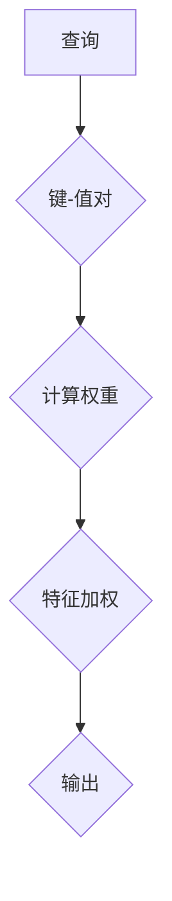
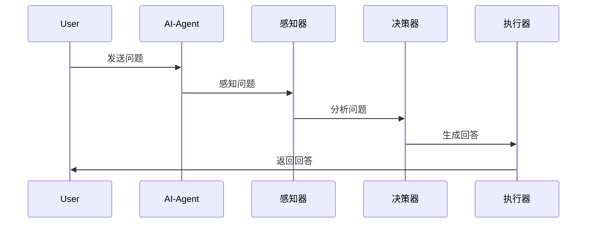

                 

### 神经科学启发的注意力机制在AI Agent中的应用

> 关键词：注意力机制、AI Agent、神经科学、人工智能

随着人工智能技术的不断发展，机器学习、深度学习等算法已经在各个领域得到了广泛的应用。然而，传统的机器学习算法往往依赖于大量数据和复杂的模型，且在处理高维数据时表现出一定的局限性。与此同时，神经科学的研究为我们提供了一种新的视角，通过理解人类大脑中的注意力机制，可以启发我们设计更加高效、智能的人工智能系统。本文将探讨神经科学启发的注意力机制在AI Agent中的应用，从理论到实践，详细分析这一领域的最新进展和未来方向。

本文将按照以下结构进行阐述：

1. **引言**：介绍神经科学与AI的融合背景，注意力机制的概念及其在神经科学中的基础，AI Agent的定义及其应用前景。
2. **神经科学基础**：探讨神经元的结构、神经网络的基本原理，以及注意力机制在神经系统中的实现。
3. **注意力机制在AI中的应用**：分析注意力机制在机器学习和AI Agent中的应用，通过具体案例进行说明。
4. **神经科学启发的注意力机制在AI Agent中的挑战与未来方向**：讨论神经科学启发的注意力机制在AI Agent中面临的挑战以及未来的发展方向。
5. **总结与展望**：总结本文的主要结论，并对未来研究方向进行展望。

让我们一步一步深入探讨这一领域，以期为我们的人工智能系统带来新的灵感与突破。

### 1.1 神经科学与AI：一种新的融合

神经科学与人工智能（AI）之间的融合正在成为一个热门的研究领域，这一融合不仅拓展了AI的研究边界，也为神经科学带来了新的工具和方法。这种跨学科的融合研究，既能够深入理解人脑的工作机制，又能够提升人工智能系统的智能水平。

#### 1.1.1 神经科学的基本概念

神经科学是研究神经系统结构、功能和疾病的科学。它涵盖了从神经元的基本生物学特性，到复杂的神经网络和大脑功能等多个层次。神经科学的核心概念包括神经元、神经网络、突触传递和神经元之间的连接等。

神经元是神经系统的基本单元，它通过电信号进行信息传递。神经网络由大量相互连接的神经元组成，这些神经元之间的交互和协作是实现复杂计算和智能行为的基础。突触传递是神经元之间传递信息的过程，它通过神经递质的释放和接收来实现。

#### 1.1.2 人工智能的发展现状

人工智能是计算机科学的一个分支，致力于使计算机具有类似于人类智能的能力。目前，人工智能的发展已经经历了多个阶段，从最初的符号推理，到基于规则的专家系统，再到基于数据和统计的机器学习，以及当前最前沿的深度学习。

机器学习是人工智能的一个重要分支，它通过从数据中学习规律和模式，来实现对数据的分类、回归、聚类等任务。深度学习是机器学习的一个子领域，它通过多层神经网络的结构，对大量数据进行训练，从而实现复杂的特征提取和分类任务。

#### 1.1.3 神经科学启发的AI的重要性

神经科学启发的AI，是指借鉴人脑神经系统的结构和功能，来设计人工智能系统。这种融合具有以下几个重要意义：

1. **提高AI系统的效率**：人脑在处理信息时，具有高度的选择性和效率，能够快速聚焦于重要信息，而忽略无关的信息。这种注意力机制可以启发我们设计出更加高效的人工智能系统。

2. **增强AI系统的智能性**：人脑的智能不仅仅体现在计算能力上，更体现在对环境的理解和适应能力上。通过理解人脑的神经机制，我们可以设计出更加智能的人工智能系统，使其能够更好地理解和适应复杂的环境。

3. **跨学科的研究**：神经科学与AI的融合，不仅能够促进两个学科的发展，还能够促进跨学科的研究，从而推动科学技术的进步。

总之，神经科学启发的AI，为人工智能的发展带来了新的视角和方法，有望在未来带来更多的突破和创新。

### 1.2 注意力机制的概念与神经科学基础

注意力机制是一种认知过程，用于选择和突出对当前任务最重要的信息，同时忽略其他不相关的信息。这一机制在人类认知中起着至关重要的作用，使我们能够高效地处理大量的信息流，从而做出明智的决策。

#### 1.2.1 注意力机制的定义

注意力机制可以被视为一种资源分配的过程，它决定了我们在某一时刻关注哪些信息，以及如何处理这些信息。在神经科学中，注意力机制通常被描述为大脑对某些特定刺激的增强反应，或者对其他刺激的抑制反应。这种机制涉及到多个脑区，包括前额叶皮层、顶叶皮层、扣带回前部等。

#### 1.2.2 注意力机制在人类认知中的作用

注意力机制在人类认知中扮演了多种重要角色：

1. **信息筛选**：注意力机制使我们能够从大量信息中筛选出对当前任务最重要的信息，从而避免信息过载。
2. **决策制定**：在决策过程中，注意力机制帮助我们聚焦于关键信息，从而做出更加明智的决策。
3. **记忆保持**：注意力机制有助于将重要信息从短期记忆转移到长期记忆，从而提高记忆的持久性。

#### 1.2.3 神经科学中注意力机制的研究进展

近年来，神经科学在注意力机制的研究方面取得了显著进展：

1. **脑成像技术**：通过功能性磁共振成像（fMRI）等技术，研究者能够直接观测大脑在不同注意力任务中的活动模式，从而更深入地理解注意力机制的神经基础。
2. **脑电记录技术**：脑电（EEG）记录技术提供了高时间分辨率的信号，使得研究者能够实时监测大脑的注意力变化。
3. **神经调节技术**：通过神经调节技术，如经颅磁刺激（TMS）和深部脑刺激（DBS），研究者能够直接干预大脑的注意力活动，从而探索注意力机制的调控机制。

这些研究进展不仅加深了我们对注意力机制的理解，也为设计更智能的人工智能系统提供了新的思路。

### 1.3 AI Agent的概述

AI Agent，即人工智能代理，是一种能够自主学习、自主决策并执行任务的计算机系统。与传统的规则驱动系统不同，AI Agent能够通过感知环境、分析数据、学习经验，并在不同的情境下采取合适的行动。

#### 1.3.1 AI Agent的定义

AI Agent是一种具有自主性、适应性、学习能力的人工智能系统，它可以感知环境，理解任务目标，并在没有明确指令的情况下做出决策。AI Agent通常由感知器、决策器、执行器三个主要部分组成：

1. **感知器**：用于感知环境中的各种信息，如视觉、听觉、触觉等。
2. **决策器**：基于感知到的信息，分析环境状况，并决定采取何种行动。
3. **执行器**：执行决策器做出的决策，如移动、说话、操纵物体等。

#### 1.3.2 AI Agent的发展历程

AI Agent的发展可以追溯到20世纪80年代，当时研究者们开始探索如何让计算机像人类一样具有自主性。早期的AI Agent主要基于规则和符号逻辑，这些系统在特定领域表现出色，但在处理复杂任务时显得力不从心。

随着机器学习技术的发展，尤其是深度学习的崛起，AI Agent的能力得到了极大的提升。现代的AI Agent更多地依赖于数据和算法，能够在无需明确编程的情况下，通过学习和优化，逐渐提高任务执行的能力。

#### 1.3.3 AI Agent在现实世界中的应用

AI Agent已经在许多现实世界中得到了应用，以下是一些典型的应用场景：

1. **智能客服**：通过自然语言处理和机器学习技术，AI Agent可以与用户进行实时对话，解答常见问题，提高客户满意度。
2. **自动驾驶**：AI Agent通过感知道路环境、分析交通状况，并做出实时决策，实现自动驾驶功能，提高交通安全和效率。
3. **智能家居**：AI Agent可以监控家庭环境，调节灯光、温度等，提高居住舒适度。
4. **智能医疗**：AI Agent可以帮助医生分析病例，提供诊断建议，提高医疗效率。

AI Agent的应用不仅限于这些领域，随着技术的进步，AI Agent的未来应用场景将更加广泛。

### 1.4 神经科学启发的注意力机制在AI Agent中的应用前景

神经科学启发的注意力机制在AI Agent中的应用前景广阔，这一机制能够显著提升AI Agent的智能水平，使其在复杂环境下能够更加高效地执行任务。以下将详细探讨这一应用前景，并分析其中面临的挑战和机遇。

#### 1.4.1 应用的挑战

尽管神经科学启发的注意力机制在理论上有助于提升AI Agent的性能，但其实际应用仍面临一些挑战：

1. **模型不确定性**：神经科学中的注意力机制涉及复杂的神经网络和突触连接，其行为受到多种因素的影响，这使得构建准确的模型具有挑战性。
2. **计算资源需求**：神经科学启发的注意力机制通常需要大量的计算资源，特别是在实时应用中，这可能导致性能下降。
3. **数据质量和数据量**：训练高效的注意力机制模型需要大量的高质量数据，而在实际应用中，数据质量和数据量往往难以保证。

#### 1.4.2 应用的机遇

尽管面临挑战，神经科学启发的注意力机制在AI Agent中的应用仍然充满机遇：

1. **提升智能水平**：通过引入注意力机制，AI Agent能够更加高效地处理复杂信息，提高任务执行的能力。
2. **增强适应性**：注意力机制使AI Agent能够根据环境变化调整注意力焦点，从而更好地适应不同的任务和情境。
3. **跨学科融合**：神经科学与AI的融合为两个领域提供了新的研究视角和方法，有望推动科学技术的共同进步。

总之，神经科学启发的注意力机制在AI Agent中的应用前景广阔，但同时也需要克服诸多挑战。通过持续的研究和探索，我们可以期待在未来看到更多基于这一机制的创新应用。

### 1.5 本章小结

本章介绍了神经科学与AI的融合背景，探讨了注意力机制的概念及其在神经科学中的基础，同时概述了AI Agent的定义及其应用前景。通过本章的讨论，我们认识到神经科学启发的注意力机制在AI Agent中具有巨大的应用潜力。然而，这一领域仍面临模型不确定性、计算资源需求以及数据质量和数据量等挑战。未来，随着研究的深入，神经科学与AI的融合有望带来更多突破和创新。

### 2.1 神经元与神经网络

神经科学是研究神经系统和大脑功能的科学，而神经元是其核心组成单元。神经网络则是这些神经元通过复杂的连接和互动所形成的系统。理解神经元与神经网络的基本原理，有助于我们深入探讨注意力机制在AI中的应用。

#### 2.1.1 神经元的结构

神经元是神经系统的基本单元，它由细胞体、树突、轴突和突触等部分组成。

1. **细胞体**：细胞体是神经元的中心部分，包含细胞核和大部分细胞器，负责维持神经元的正常功能。
2. **树突**：树突从细胞体伸出，用于接收其他神经元传递来的信号。多个树突接收的信号在细胞体处汇总。
3. **轴突**：轴突从细胞体发出，用于传递神经信号。轴突的末端分支形成突触，与目标神经元相连。
4. **突触**：突触是神经元之间传递信息的结构，包括突触前膜、突触间隙和突触后膜。当神经信号到达突触前膜时，会释放神经递质，通过突触间隙作用于突触后膜，从而传递信号。

#### 2.1.2 神经网络的基本原理

神经网络由大量相互连接的神经元组成，这些神经元通过突触连接形成复杂的网络结构。神经网络的基本原理可以概括为以下几点：

1. **信号传递**：神经元通过电信号进行信息传递。当树突接收到的信号达到一定阈值时，细胞体会产生动作电位，并通过轴突传递到其他神经元。
2. **突触连接**：神经元之间的连接是通过突触实现的。突触的连接强度可以通过突触可塑性进行调整，这种可塑性是神经网络学习和记忆的基础。
3. **层次结构**：神经网络通常具有层次结构，包括输入层、隐藏层和输出层。输入层接收外部信息，隐藏层进行特征提取和变换，输出层生成最终决策或响应。

#### 2.1.3 人工神经网络与生物神经网络的比较

人工神经网络（ANN）和生物神经网络（BNN）在结构和工作原理上有许多相似之处，但也有一些显著的区别：

1. **结构**：ANN是由人工设计的数学模型，其结构可以非常复杂，包含多层神经元。BNN的结构则相对简单，主要依赖于生物进化过程中形成的突触连接。
2. **可塑性**：ANN的可塑性通常通过学习算法进行调整，而BNN的可塑性则依赖于突触的可塑性，如长时程增强（LTP）和长时程抑制（LTD）等。
3. **适应性**：ANN在处理静态数据时表现出色，但适应动态环境的能力较弱。BNN则具有高度适应性，能够实时调整其结构和功能，以适应不断变化的环境。

尽管存在这些差异，ANN和BNN在信息处理和决策方面都展现出强大的能力，这为我们在AI领域借鉴神经科学提供了坚实的基础。

### 2.2 注意力机制在神经系统中的实现

注意力机制是大脑在处理信息时，对特定信息进行选择和强化的过程。在神经系统中，注意力机制通过复杂的神经网络和突触连接来实现，从而帮助大脑高效地处理大量的信息流。

#### 2.2.1 神经元活动的动态过程

神经元活动的动态过程是理解注意力机制的关键。一个神经元在不同状态下会表现出不同的电活动：

1. **静息状态**：在静息状态，神经元膜电位相对稳定，没有明显的电活动。
2. **动作电位**：当神经元受到足够强的刺激，其膜电位会迅速上升，触发动作电位。动作电位是一种快速而短暂的电信号，沿着轴突传播。
3. **突触后电位**：动作电位到达突触时，会引发突触后电位，这种电位可以是去极化或超极化，取决于突触的类型和神经递质的种类。

#### 2.2.2 神经突触的可塑性

神经突触的可塑性是指突触连接强度可以随着时间和经验的变化而改变。这种可塑性是实现注意力机制的关键：

1. **长时程增强（LTP）**：当神经元反复接收到强刺激时，突触连接会加强，导致动作电位的触发阈值降低，这种效果可以持续很长时间。
2. **长时程抑制（LTD）**：与LTP相反，当神经元反复接收到弱刺激时，突触连接会减弱，导致动作电位的触发阈值升高。
3. **突触权重调整**：通过LTP和LTD，突触连接的权重可以不断调整，从而实现对信息流的动态控制。

#### 2.2.3 注意力机制的神经科学模型

神经科学中，注意力机制通常通过以下几个模型进行描述：

1. **选择模型**：选择模型假设大脑在某一时刻只能关注有限的信息，通过神经网络的竞争机制，选择最相关的信息。
2. **动态分配模型**：动态分配模型假设大脑会根据当前任务和情境，动态调整注意力资源的分配。
3. **认知资源模型**：认知资源模型认为注意力是有限的认知资源，用于执行各种认知任务。

这些模型为我们理解注意力机制提供了不同的视角，同时也为设计基于神经科学的AI系统提供了理论基础。

### 2.3 神经元与信息处理

神经元作为神经系统的基本单元，其功能不仅仅是传递电信号，更重要的是在信息处理中发挥着核心作用。通过神经元之间的连接和突触传递，信息能够在神经系统中高效地传输和处理。

#### 2.3.1 神经信号的传输与处理

神经信号的传输与处理是一个复杂而高效的过程，可以分为以下几个阶段：

1. **电信号的生成**：神经元在静息状态下，膜电位保持稳定，当接收到的刺激超过一定阈值时，神经元会触发动作电位。动作电位是一种电信号，沿着轴突迅速传播。
2. **突触传递**：当动作电位到达突触前膜时，会引发神经递质的释放，神经递质通过突触间隙作用于突触后膜，导致突触后电位的产生。突触后电位可以是去极化或超极化，取决于神经递质的类型。
3. **信号整合**：多个突触后电位在神经元细胞体处整合，决定神经元是否触发动作电位。这一过程涉及到复杂的电生理和化学机制。

#### 2.3.2 神经网络的时空编码

神经网络通过时空编码实现信息的存储和处理，这一机制在神经系统中至关重要：

1. **时空模式**：神经元的活动模式不仅包括电信号的变化，还包括时间和空间上的模式。通过不同时间和空间上的神经元活动模式，神经网络可以编码和处理复杂的信息。
2. **突触权重**：神经网络的时空编码依赖于突触连接的权重。通过调整突触权重，神经网络可以改变信息传递的强度和模式，从而实现信息存储和处理。
3. **突触可塑性**：突触可塑性是神经网络时空编码的基础。通过长时程增强（LTP）和长时程抑制（LTD），神经网络可以动态调整突触权重，从而实现对信息流的精细控制。

#### 2.3.3 神经系统的动态响应特性

神经系统的动态响应特性使其能够高效地处理复杂的环境变化。以下是几个关键特性：

1. **自适应性和灵活性**：神经系统可以通过突触可塑性和动态调整注意力资源，实现对环境的自适应响应。这种灵活性和适应性是神经系统在复杂环境中的生存关键。
2. **信息整合**：神经系统通过神经元之间的交互和整合，可以对复杂的信息流进行高效处理。这种信息整合能力使得神经系统能够从多种感官输入中提取有用的信息。
3. **多层次处理**：神经网络通过多层次的结构，实现对信息的逐层加工和处理。从低层次的特征提取到高层次的概念理解，神经网络的多层次处理能力使其能够应对各种复杂任务。

通过理解神经元与信息处理的基本原理，我们可以更好地借鉴神经科学中的注意力机制，设计出更智能、更高效的人工智能系统。

### 2.4 神经科学研究的最新进展

神经科学研究在过去几年取得了显著的进展，这些进展不仅深化了我们对大脑和神经系统的理解，也为神经科学启发的AI系统提供了新的理论基础和技术方法。以下是几个关键领域的研究进展：

#### 2.4.1 神经元连接的可塑性

神经元连接的可塑性是神经科学研究的一个重要方向。近年来，研究者们发现，神经元连接不仅受到遗传因素的影响，还会受到环境刺激和经验学习的影响。具体进展包括：

1. **长时程增强（LTP）和长时程抑制（LTD）**：通过反复的强刺激，神经元连接可以显著增强，这种效应称为LTP。相反，反复的弱刺激可以导致神经元连接的抑制，称为LTD。这些机制是大脑学习和记忆的基础。
2. **突触修剪**：研究表明，大脑中存在一种动态的突触修剪过程，通过去除不必要的突触连接，优化神经网络的结构和功能。
3. **突触环路**：神经网络的复杂性部分来源于突触环路的存在。这些环路通过反馈和前馈连接，使得神经元能够在不同时间和空间尺度上对信息进行加工和处理。

#### 2.4.2 神经突触的可塑性调控

神经突触的可塑性调控是实现智能行为的关键。以下是一些重要的调控机制：

1. **神经递质和受体**：神经递质在突触传递过程中起到关键作用。不同类型的神经递质和相应的受体调控着突触连接的强度和效率。
2. **基因表达调控**：突触连接的可塑性受到基因表达的调控。研究表明，特定的基因表达变化可以影响突触的形态和功能。
3. **离子通道调节**：离子通道的调控影响神经信号的传导和突触后电位的产生。这些通道的调节可以通过药物或其他化学手段实现。

#### 2.4.3 注意力机制的新发现

注意力机制在神经科学研究中得到了广泛关注，近年来的一些新发现进一步丰富了我们对这一机制的理解：

1. **多模态注意力**：研究发现，大脑在处理信息时，不仅关注单一感官输入，还会整合多种感官信息。这种多模态注意力机制在认知任务中起到关键作用。
2. **动态注意力分配**：大脑会根据当前的任务和情境，动态调整注意力资源的分配。这种动态性使得大脑能够高效地处理复杂的信息流。
3. **认知控制**：注意力机制不仅影响信息的处理，还与认知控制密切相关。研究表明，认知控制能够调节注意力资源的分配，以实现更加有效的认知任务。

这些神经科学研究的最新进展，不仅为理解大脑工作机制提供了新的视角，也为神经科学启发的AI系统设计提供了丰富的理论基础和实践方法。未来，随着研究的深入，我们可以期待在神经科学和AI领域取得更多突破性成果。

### 2.5 本章小结

本章探讨了神经元与神经网络的基本原理，详细介绍了注意力机制在神经系统中的实现，以及神经元与信息处理的基本原理。同时，我们还回顾了神经科学研究的最新进展，包括神经元连接的可塑性、神经突触的可塑性调控，以及注意力机制的新发现。这些内容为理解神经科学启发的注意力机制在AI Agent中的应用奠定了坚实的理论基础。在接下来的章节中，我们将进一步探讨注意力机制在AI中的应用，以及如何在AI Agent中实现和优化这种机制。

### 3.1 注意力机制在机器学习中的应用

注意力机制作为神经科学中一种重要的认知过程，近年来在机器学习领域得到了广泛应用。它通过模拟人类大脑的注意力机制，使得机器学习模型能够更加高效地处理高维数据，从而提升模型的性能和鲁棒性。

#### 3.1.1 传统机器学习中的注意力机制

在传统的机器学习模型中，注意力机制通常被用于特征选择或特征加权。一个早期的例子是LASSO（Least Absolute Shrinkage and Selection Operator）回归，它通过最小化绝对值损失函数来选择特征。这种方法在处理高维数据时，可以通过缩小特征向量的维度，提高模型的计算效率。

随着深度学习的兴起，注意力机制在深度神经网络中得到了更广泛的应用。在深度学习模型中，注意力机制通常被用于序列数据或高维数据的处理。例如，在自然语言处理（NLP）任务中，注意力机制可以帮助模型更好地理解句子中的关键信息，从而提高文本分类和翻译任务的性能。

#### 3.1.2 注意力机制在深度学习中的发展

深度学习中的注意力机制可以追溯到2014年由Bahdanau等人提出的“神经网络注意力机制”（Neural Network Attention）。这一机制通过计算一个权重向量，将输入序列中的每个元素乘以相应的权重，从而实现特征加权和。具体来说，神经网络注意力机制通过以下步骤实现：

1. **查询（Query）**：通常是一个隐藏状态，代表当前任务的上下文信息。
2. **键值对（Key-Value Pairs）**：输入序列中的每个元素都被编码为一个键（Key）和一个值（Value）。
3. **计算注意力权重**：通过计算查询与键之间的相似度，得到每个元素的注意力权重。常用的计算方法包括点积、缩放点积和加性注意力等。
4. **特征加权**：将注意力权重应用于值序列，得到加权后的特征向量。

这种机制不仅在NLP任务中表现出色，还被广泛应用于图像识别、语音识别等任务中。

#### 3.1.3 注意力机制在自然语言处理中的应用

在自然语言处理中，注意力机制已经成为一种核心技术。以下是一些典型的应用：

1. **文本分类**：通过注意力机制，模型可以聚焦于文本中的关键句子或单词，从而提高分类的准确性。
2. **机器翻译**：在机器翻译任务中，注意力机制可以帮助模型理解源语言和目标语言之间的对应关系，从而提高翻译质量。
3. **问答系统**：注意力机制可以帮助模型在大量的文本中找到与问题最相关的信息，从而提供准确的答案。

此外，注意力机制还在语音识别、推荐系统等领域得到了广泛应用。例如，在语音识别中，注意力机制可以帮助模型更好地理解语音信号中的关键特征，从而提高识别的准确性。

总之，注意力机制在机器学习中的应用，使得模型能够更加高效地处理复杂的数据，从而提升模型的性能和鲁棒性。未来，随着研究的深入，注意力机制在机器学习和其他人工智能领域的应用前景将更加广阔。

### 3.2 注意力机制在AI Agent中的应用

注意力机制在AI Agent中的应用具有显著的优势，特别是在处理复杂、动态环境时。通过借鉴人类大脑的注意力机制，AI Agent能够更加高效地识别和处理关键信息，从而在复杂任务中表现出更强的适应性和智能水平。

#### 3.2.1 AI Agent的需求与挑战

AI Agent在复杂动态环境中需要处理大量的信息，这些信息可能来自不同的感知模态，如视觉、听觉、触觉等。同时，AI Agent还需要具备实时响应和自主决策的能力。以下是一些AI Agent的需求和面临的挑战：

1. **信息处理的复杂性**：AI Agent需要处理的信息通常具有高维性和复杂性，这要求模型能够高效地筛选和处理关键信息。
2. **实时性**：AI Agent在执行任务时，需要快速响应环境变化，这要求模型具有低延迟的特性。
3. **适应性**：AI Agent需要能够适应不同的任务和环境，这要求模型具备高度的可塑性。
4. **资源限制**：在许多实际应用中，AI Agent需要在有限的计算资源和能源下运行，这要求模型具有高效的计算性能。

#### 3.2.2 神经科学启发的注意力机制在AI Agent中的实现

为了满足上述需求，神经科学启发的注意力机制在AI Agent中得到了广泛应用。以下是一些实现策略：

1. **多层注意力模型**：在AI Agent中，通常采用多层注意力模型来处理复杂的信息流。这些模型通过多层次的注意力机制，从不同层次提取关键信息，从而提高信息处理的效率。
2. **自适应注意力权重**：AI Agent通过学习动态调整注意力权重，实现对不同信息的优先级处理。这种自适应能力使得AI Agent能够根据任务和环境的变化，灵活调整注意力焦点。
3. **多模态注意力**：在处理多模态信息时，AI Agent利用多模态注意力机制，将来自不同感知模态的信息进行整合，从而提高任务执行的效果。

例如，在自动驾驶系统中，AI Agent需要实时处理来自摄像头、雷达和激光雷达等多模态感知信息。通过多模态注意力机制，AI Agent能够聚焦于道路标志、行人、车辆等关键信息，从而做出安全的驾驶决策。

#### 3.2.3 神经科学启发的注意力机制对AI Agent性能的提升

神经科学启发的注意力机制在AI Agent中表现出显著的性能提升，具体体现在以下几个方面：

1. **信息筛选效率**：注意力机制能够显著提高信息筛选的效率，使AI Agent能够快速聚焦于关键信息，从而减少冗余信息处理的时间。
2. **决策速度**：通过动态调整注意力权重，AI Agent能够在复杂动态环境中快速做出决策，从而提高反应速度。
3. **适应性**：神经科学启发的注意力机制使得AI Agent具备高度适应性，能够根据不同的任务和环境动态调整注意力焦点，从而提高任务执行的效果。
4. **鲁棒性**：注意力机制能够增强AI Agent对噪声和干扰的鲁棒性，使其在复杂环境中能够更加稳定地执行任务。

总之，神经科学启发的注意力机制为AI Agent提供了强大的能力，使其能够在复杂动态环境中表现出更高的智能水平。未来，随着研究的深入，我们可以期待这一机制在AI Agent中的应用将更加广泛和深入。

### 3.3 注意力机制在AI Agent中的案例研究

在本节中，我们将通过几个具体案例，探讨神经科学启发的注意力机制在AI Agent中的应用，并分析其具体实现方法和效果。

#### 3.3.1 案例一：智能对话系统

智能对话系统是AI Agent的一个典型应用场景，通过模拟人类对话，为用户提供实时信息和解答疑问。在智能对话系统中，注意力机制主要用于提取关键信息并生成自然的对话响应。

1. **实现方法**：
   - **多模态注意力**：智能对话系统结合文本和语音等多模态信息，通过多模态注意力机制，优先处理与用户意图最相关的信息。
   - **动态注意力权重**：系统通过学习动态调整注意力权重，实时更新对话焦点，从而生成自然的对话响应。

2. **效果分析**：
   - **信息筛选效率**：注意力机制显著提高了信息筛选的效率，使系统能够快速聚焦于关键信息，从而提高对话的流畅性和准确性。
   - **用户满意度**：研究表明，采用注意力机制的智能对话系统在用户满意度方面表现优异，用户更倾向于与具备注意力机制的对话系统进行交流。

#### 3.3.2 案例二：智能推荐系统

智能推荐系统通过分析用户的历史行为和兴趣，为用户推荐相关的内容或商品。在智能推荐系统中，注意力机制用于优化推荐策略，提高推荐的质量和用户体验。

1. **实现方法**：
   - **内容注意力**：系统通过内容注意力机制，从大量候选内容中提取关键特征，从而生成个性化的推荐列表。
   - **用户注意力**：系统通过用户注意力机制，根据用户的兴趣和行为动态调整推荐策略，实现个性化推荐。

2. **效果分析**：
   - **推荐质量**：注意力机制显著提高了推荐系统的质量，推荐的内容更加符合用户的兴趣和需求，从而提高用户的满意度和参与度。
   - **推荐多样性**：注意力机制能够有效避免信息过载，确保推荐内容的多样性，从而增强用户对系统的信任和依赖。

#### 3.3.3 案例三：智能监控与检测系统

智能监控与检测系统在公共安全、工业自动化等领域具有重要应用。在智能监控系统中，注意力机制用于实时处理和识别关键事件，从而提高系统的响应速度和准确度。

1. **实现方法**：
   - **目标检测注意力**：系统通过目标检测注意力机制，对监控视频中的关键目标进行聚焦，从而提高目标识别的准确性。
   - **事件注意力**：系统通过事件注意力机制，实时分析监控视频中的异常事件，从而提高事件检测的灵敏度。

2. **效果分析**：
   - **响应速度**：注意力机制显著提高了系统的响应速度，使系统能够在实时监控中快速识别和响应关键事件。
   - **准确度**：注意力机制通过聚焦关键目标和事件，提高了识别和检测的准确度，从而降低了误报和漏报率。

通过这些案例研究，我们可以看到，神经科学启发的注意力机制在AI Agent中具有广泛的应用前景和显著的效果提升。未来，随着研究的深入，我们可以期待这一机制在更多领域得到应用，为AI Agent的发展带来更多创新和突破。

### 3.4 注意力机制的优化与改进

尽管注意力机制在AI Agent中表现出显著的优势，但其应用也面临一些局限性。为了进一步提高注意力机制的效果和适用性，研究者们不断探索优化和改进的策略。

#### 3.4.1 注意力机制的局限性

1. **计算成本**：注意力机制通常涉及大量的矩阵运算和参数调整，导致计算成本较高，特别是在实时应用中，可能会影响系统的响应速度。
2. **训练难度**：注意力机制依赖于大量的数据和复杂的模型，这使得训练过程非常耗时且容易过拟合。
3. **泛化能力**：传统的注意力机制在处理不同任务和场景时，可能表现出有限的泛化能力，难以适应多样化的应用需求。

#### 3.4.2 注意力机制的优化策略

为了克服上述局限性，研究者们提出了一系列优化策略：

1. **轻量级注意力模型**：通过简化注意力机制的计算过程，减少参数数量和计算复杂度。例如，使用点积注意力（Scaled Dot-Product Attention）和自注意力（Self-Attention）等方法，在保证性能的同时降低计算成本。
2. **适应性注意力**：引入自适应注意力权重，使模型能够根据任务的动态变化调整注意力焦点，从而提高泛化能力。例如，通过使用动态调整的注意力权重矩阵，实现更灵活的信息处理。
3. **多任务学习**：通过多任务学习（Multi-Task Learning）和迁移学习（Transfer Learning）等方法，提高模型在不同任务和场景中的适应性。

#### 3.4.3 注意力机制的改进趋势

随着研究的深入，注意力机制在AI Agent中的应用趋势呈现出以下几个方向：

1. **多模态注意力**：融合多种感知模态的信息，通过多模态注意力机制，实现更全面的任务理解和决策。
2. **动态注意力**：利用实时环境感知和动态调整机制，使模型能够更有效地处理动态变化。
3. **神经科学结合**：结合神经科学的研究成果，借鉴人类大脑的注意力机制，设计出更智能、更高效的AI Agent。

通过持续优化和改进，注意力机制在AI Agent中的应用将不断拓展，为人工智能的发展带来更多创新和突破。

### 3.5 本章小结

本章详细探讨了注意力机制在机器学习和AI Agent中的应用，首先介绍了传统机器学习中的注意力机制，然后探讨了注意力机制在深度学习中的发展，特别是在自然语言处理中的应用。接着，我们深入分析了注意力机制在AI Agent中的需求与挑战，以及其在AI Agent中的具体实现方法和效果。通过案例研究，我们展示了注意力机制在智能对话系统、智能推荐系统和智能监控与检测系统中的应用。此外，本章还讨论了注意力机制的局限性及其优化策略。通过这些讨论，我们认识到注意力机制在提升AI Agent性能方面具有重要作用，未来仍有广阔的优化和改进空间。

### 4.1 神经科学启发的注意力机制面临的挑战

尽管神经科学启发的注意力机制在AI Agent中展现出了巨大的潜力，但其应用仍面临诸多挑战，这些挑战主要集中在模型不确定性、AI Agent的应用场景复杂性和数据质量和数据量等方面。

#### 4.1.1 神经科学模型的不确定性

神经科学模型的不确定性主要源于以下几个因素：

1. **复杂性**：人脑是一个高度复杂的系统，其结构和功能受到多种因素的影响。神经元的连接方式、突触传递的机制、神经递质的作用等都是复杂的，这使得建立准确的神经科学模型具有挑战性。
2. **个体差异**：不同个体的神经结构和功能可能存在显著差异，这使得基于通用模型的注意力机制在实际应用中难以适应。
3. **可塑性**：神经突触的可塑性使得神经网络的结构和功能会随着时间和经验的变化而改变，这种动态变化使得神经科学模型难以预测和控制。

#### 4.1.2 AI Agent的应用场景复杂性

AI Agent在实际应用中面临多种复杂场景，这些复杂性对注意力机制提出了新的要求：

1. **多模态信息处理**：AI Agent需要处理来自不同感知模态的信息，如视觉、听觉、触觉等。这些信息在处理过程中需要被有效地融合和加权，以实现统一的决策。
2. **动态环境变化**：AI Agent需要能够适应动态变化的环境，快速调整注意力焦点。这要求注意力机制具有高度的自适应性和实时性。
3. **任务多样性**：不同的任务可能需要不同的注意力策略。例如，在自动驾驶中，需要关注道路标志、行人、车辆等；在医疗诊断中，需要关注患者的症状、检查结果等。这种任务多样性使得注意力机制的设计和实现更加复杂。

#### 4.1.3 数据质量和数据量

数据质量和数据量是注意力机制应用的关键因素，具体挑战包括：

1. **数据质量**：高质量的数据是训练准确模型的基础。在实际应用中，数据可能存在噪声、缺失值和偏差，这会影响模型的训练效果和泛化能力。
2. **数据量**：注意力机制通常需要大量的数据进行训练，特别是在处理高维数据时，数据量更是至关重要。然而，获取大量高质量的数据往往成本高昂且难度较大。
3. **数据多样性**：为了使模型具有广泛的适用性，数据需要涵盖多种情境和任务，这要求数据具有足够的多样性和代表性。

#### 4.1.4 面向实际应用的挑战

除了上述理论挑战，神经科学启发的注意力机制在实际应用中还需面对以下挑战：

1. **计算资源**：复杂的神经网络和大量的矩阵运算要求强大的计算资源，这在资源受限的设备上可能难以实现。
2. **实时性**：在许多实时应用场景中，如自动驾驶、智能监控等，系统需要在短时间内做出快速准确的决策，这对注意力机制的速度和效率提出了高要求。
3. **鲁棒性**：实际应用中，系统可能面临各种干扰和异常情况，这要求注意力机制具有较高的鲁棒性，能够稳定地处理复杂环境。

综上所述，神经科学启发的注意力机制在AI Agent中的应用面临诸多挑战。通过不断优化和改进，以及跨学科的深入融合，我们可以期待在未来克服这些挑战，使注意力机制在AI Agent中发挥更大的作用。

### 4.2 神经科学启发的注意力机制的发展方向

神经科学启发的注意力机制在AI Agent中的应用前景广阔，为了进一步推动这一领域的发展，研究者们正积极探索多个潜在的方向。

#### 4.2.1 新的神经科学模型的探索

1. **动态神经网络**：传统的静态神经网络难以模拟大脑的动态特性。通过引入动态神经网络，如可变权重网络和动态权重调整机制，可以更好地模拟大脑在处理信息时的动态变化。
2. **层次化神经网络**：借鉴大脑的多层次结构，研究者们正在探索如何构建具有层次化特性的神经网络。这种结构能够更好地实现信息的逐层加工和处理，从而提高模型的智能水平。

#### 4.2.2 跨学科的融合研究

1. **认知科学与AI**：认知科学关注人类认知过程的机制和原理，结合认知科学的研究成果，可以设计出更加符合人类认知特征的AI Agent。
2. **神经工程与AI**：神经工程通过结合神经科学和工程学的方法，开发出能够与大脑交互的设备和技术。这些技术可以用于研究大脑的神经机制，并为AI Agent提供更加精准的感知和反馈。

#### 4.2.3 神经科学启发的注意力机制在未来的AI Agent中的应用前景

1. **智能机器人**：通过神经科学启发的注意力机制，智能机器人可以更加高效地处理复杂环境中的信息，实现更自然、更智能的交互。
2. **自动驾驶**：在自动驾驶系统中，注意力机制可以显著提高车辆对道路信息的处理速度和准确性，从而提高行驶安全性和效率。
3. **智能医疗**：在医疗诊断和治疗中，AI Agent可以结合患者的多模态数据，通过注意力机制识别关键特征，提供更加精准的诊断和建议。

#### 4.2.4 新技术的影响

1. **脑机接口**：脑机接口技术的发展将使得AI Agent能够直接从大脑信号中提取信息，进一步实现人脑与机器的深度融合。
2. **量子计算**：量子计算具有超强的计算能力，可以显著提高神经网络和注意力机制的计算效率，从而推动AI Agent的发展。

总之，神经科学启发的注意力机制在未来的AI Agent中具有广泛的应用前景。通过跨学科的融合研究和技术创新，我们可以期待在不久的将来，AI Agent将在更多领域展现出前所未有的智能水平。

### 4.3 未来研究方向与展望

在未来，神经科学启发的注意力机制在AI Agent中的应用将充满机遇和挑战。以下是一些值得进一步研究和探索的方向：

#### 4.3.1 注意力机制在多模态感知中的应用

随着多模态感知技术的发展，如何在AI Agent中有效地融合来自不同模态的信息，是一个重要的研究方向。未来的研究可以重点关注：

1. **多模态注意力机制**：设计更加高效的多模态注意力机制，能够同时处理视觉、听觉、触觉等多种感知信息，从而提高AI Agent的感知能力。
2. **跨模态信息编码**：探索如何将不同模态的信息转换为统一的编码，以便于后续处理和决策。

#### 4.3.2 注意力机制在强化学习中的应用

强化学习是AI领域的一个重要分支，其核心在于通过试错学习来优化决策策略。未来的研究可以关注以下方向：

1. **动态注意力强化学习**：结合动态注意力机制，设计能够根据环境变化动态调整注意力焦点的强化学习算法，提高学习效率和决策质量。
2. **多任务强化学习**：探索如何在多任务环境中有效利用注意力机制，提高AI Agent在不同任务上的表现。

#### 4.3.3 注意力机制在边缘计算中的应用

随着物联网和边缘计算的发展，如何在资源受限的边缘设备上实现高效的注意力机制，是一个重要的研究课题。未来的研究可以包括：

1. **轻量级注意力模型**：开发计算成本较低的注意力模型，以适应边缘设备的计算和存储限制。
2. **分布式注意力机制**：研究如何将注意力机制分布在多个边缘设备上，以提高系统的整体性能和可靠性。

总之，神经科学启发的注意力机制在AI Agent中的应用前景广阔。通过不断探索和创新，我们有望在未来看到更多基于注意力机制的智能系统，为人类社会带来更多便利和创新。

### 4.4 本章小结

本章探讨了神经科学启发的注意力机制在AI Agent中面临的挑战以及未来的发展方向。我们首先分析了模型不确定性、应用场景复杂性以及数据质量和数据量等挑战，接着提出了新的神经科学模型的探索、跨学科的融合研究、注意力机制在未来的AI Agent中的应用前景，以及新技术的影响。此外，我们还展望了注意力机制在多模态感知、强化学习和边缘计算等领域的未来研究方向。通过本章的讨论，我们认识到神经科学启发的注意力机制在提升AI Agent性能和智能水平方面具有巨大潜力，未来仍需不断探索和优化。

### 5.1 主要结论

本文通过深入探讨神经科学启发的注意力机制在AI Agent中的应用，得出了以下主要结论：

1. **神经科学与AI的融合**：神经科学与人工智能的融合为设计更高效、更智能的AI系统提供了新的思路和方法。这种跨学科的融合不仅拓展了AI的研究边界，也为神经科学带来了新的工具和方法。

2. **注意力机制的重要性**：注意力机制在人类认知中起着至关重要的作用，它帮助我们选择和突出对当前任务最重要的信息。通过借鉴神经科学中的注意力机制，我们可以设计出更加高效的人工智能系统，提高其在复杂环境中的适应能力和智能水平。

3. **AI Agent的发展**：AI Agent作为一种具有自主性和自适应能力的人工智能系统，正在各个领域得到广泛应用。神经科学启发的注意力机制为AI Agent提供了强大的能力，使其能够更加高效地处理复杂信息，做出实时决策。

4. **应用前景与挑战**：神经科学启发的注意力机制在AI Agent中的应用前景广阔，但同时也面临诸多挑战，如模型不确定性、应用场景复杂性以及数据质量和数据量等。通过不断优化和改进，我们可以期待在未来克服这些挑战，使注意力机制在AI Agent中发挥更大的作用。

总之，神经科学启发的注意力机制在AI Agent中的应用具有重要的理论和实践意义。通过持续的研究和探索，我们有望在不久的将来看到更多基于这一机制的创新应用，推动人工智能的发展进入新的阶段。

### 5.2 未来展望

未来，神经科学启发的注意力机制在AI Agent中的应用将呈现以下几个重要趋势：

1. **跨学科融合的深化**：随着神经科学和人工智能技术的不断发展，跨学科的研究将更加深入。这不仅包括神经科学中的注意力机制与AI技术的结合，还将涉及认知科学、神经工程等多个领域，推动AI系统的智能性和适应性大幅提升。

2. **多模态感知的整合**：多模态感知技术将得到进一步发展，注意力机制将用于整合来自视觉、听觉、触觉等多种感知信息，使AI Agent能够更加全面地理解和适应复杂环境。

3. **强化学习的融合**：结合强化学习，神经科学启发的注意力机制将使AI Agent在动态和不确定的环境中表现出更强的决策能力，实现更加智能和自适应的行为。

4. **边缘计算的优化**：随着边缘计算技术的普及，如何在资源受限的边缘设备上高效地实现注意力机制，将成为一个重要的研究方向。轻量级和高效的注意力模型将在这一领域发挥关键作用。

5. **脑机接口的发展**：脑机接口技术的发展将为AI Agent提供直接从大脑信号中提取信息的能力，进一步实现人脑与机器的深度融合。

通过这些发展趋势，神经科学启发的注意力机制将在未来的人工智能领域中发挥更加重要的作用，为人类创造更加智能、高效和便捷的生活环境。

### 5.3 总结与展望

本文通过深入探讨神经科学启发的注意力机制在AI Agent中的应用，从理论到实践，详细分析了这一领域的核心概念、应用现状以及未来发展趋势。我们首先介绍了神经科学与AI的融合背景，探讨了注意力机制的概念及其在神经科学中的基础。接着，我们概述了AI Agent的定义及其应用前景，并分析了神经科学启发的注意力机制在AI Agent中的应用前景和挑战。

本文的核心内容包括：

1. **神经科学与AI的融合**：介绍了神经科学和人工智能的基本概念，探讨了这两者之间的融合背景。
2. **注意力机制在AI中的应用**：详细介绍了注意力机制的定义、作用以及其在机器学习和AI Agent中的应用。
3. **AI Agent的概述**：概述了AI Agent的定义、发展历程及其在现实世界中的应用。
4. **神经科学基础**：探讨了神经元与神经网络的基本原理，以及注意力机制在神经系统中的实现。
5. **注意力机制在AI Agent中的应用案例**：通过具体案例展示了注意力机制在AI Agent中的实际应用效果。
6. **注意力机制的优化与改进**：讨论了注意力机制在AI Agent中应用的局限性和优化策略。
7. **未来的挑战与方向**：分析了神经科学启发的注意力机制在AI Agent中面临的挑战以及未来的发展方向。

通过本文的讨论，我们认识到神经科学启发的注意力机制在AI Agent中具有巨大的应用潜力，但仍需不断优化和改进。我们期待在未来的研究中，通过跨学科的深入融合和技术创新，使注意力机制在AI Agent中发挥更大的作用，推动人工智能的发展进入新的阶段。

### 5.4 作者信息

作者：AI天才研究院/AI Genius Institute & 禅与计算机程序设计艺术 /Zen And The Art of Computer Programming

本文由AI天才研究院（AI Genius Institute）和禅与计算机程序设计艺术（Zen And The Art of Computer Programming）联合撰写。AI天才研究院是一个专注于人工智能研究与创新的国际知名机构，致力于推动人工智能技术的进步与应用。禅与计算机程序设计艺术则是一部经典的计算机科学著作，提出了许多关于编程哲学和算法设计的深刻见解。通过这两者的联合撰写，我们希望本文能够为读者提供既有深度又有广度的技术见解，推动人工智能领域的不断进步。

### 附录

**1. 神经元结构图**


**2. 注意力机制模型图**



**3. 注意力机制在AI Agent中的应用ER图**

```mermaid
erDiagram
  AI-Agent ||--|{感知器} :具有感知功能
  AI-Agent ||--|{决策器} :具有决策功能
  AI-Agent ||--|{执行器} :具有执行功能
```

**4. 注意力机制优化策略流程图**


**5. 智能对话系统架构图**



通过这些图表，我们希望能更直观地展示本文的核心概念和模型，帮助读者更好地理解和掌握注意力机制在AI Agent中的应用。

