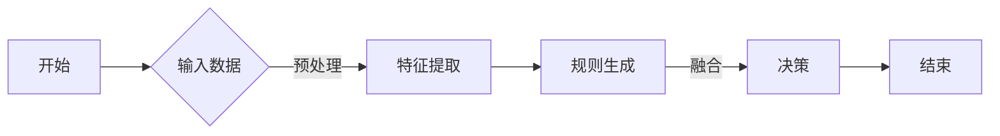
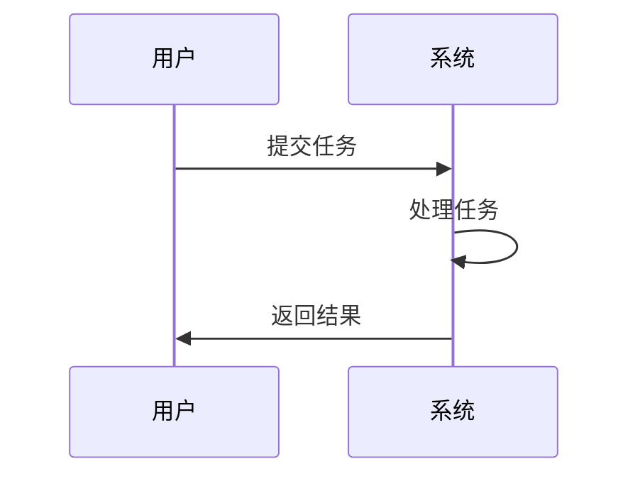

                 

# 神经符号融合：结合规则与学习的AI Agent

## 关键词
- 神经符号融合
- AI Agent
- 规则学习
- 强化学习
- 知识表示

## 摘要
本文将深入探讨神经符号融合这一前沿人工智能技术，结合规则与学习的AI Agent如何实现智能化决策。通过详细分析神经符号融合的背景与重要性，神经网络与符号逻辑的结合机制，规则学习与知识表示方法，以及强化学习和自适应学习在神经符号融合中的应用，本文旨在为读者提供一个清晰、系统的理解框架。此外，还将探讨神经符号融合AI Agent的实现、性能评估与优化，并展望其未来发展。

## 第一部分：神经符号融合的背景与重要性

### 第1章：神经符号融合概述

#### 1.1 神经符号融合的定义与意义

神经符号融合（Neural-Symbolic Fusion）是人工智能领域的一个新兴研究方向，旨在结合神经网络和符号逻辑的优势，实现智能体的高效、可靠决策。神经网络擅长处理复杂数据和模式识别，而符号逻辑则擅长推理和知识表示。两者的结合能够弥补单一方法的不足，提升人工智能系统的智能水平。

#### 1.2 神经符号融合的起源与发展历程

神经符号融合的起源可以追溯到上世纪80年代，当时研究者们开始探索如何将神经网络与逻辑推理相结合。随着人工智能技术的不断发展，特别是深度学习技术的成熟，神经符号融合逐渐成为研究热点。近年来，越来越多的研究者投入到这一领域，推动了神经符号融合技术的快速发展。

#### 1.3 神经符号融合在现代人工智能中的应用

在现代人工智能应用中，神经符号融合技术已展现出巨大的潜力。例如，在自动驾驶领域，神经符号融合可以帮助车辆在复杂环境中进行实时决策；在医疗领域，神经符号融合可以提高诊断的准确性和效率。此外，神经符号融合在自然语言处理、图像识别等领域也取得了显著成果。

### 第2章：神经网络与符号逻辑的结合

#### 2.1 神经网络的基础知识

神经网络（Neural Networks）是一种通过模拟生物神经系统进行信息处理的技术。它由大量神经元组成，通过学习输入数据之间的关系，实现复杂的函数映射。神经网络的核心包括神经元结构、激活函数、损失函数等。

#### 2.2 符号逻辑的基本概念

符号逻辑（Symbolic Logic）是一种基于符号表示和推理的方法，用于处理抽象的概念和关系。符号逻辑包括命题逻辑、谓词逻辑等，是形式化描述和推理的基础。

#### 2.3 神经网络与符号逻辑的结合机制

神经符号融合通过以下几种方式将神经网络与符号逻辑结合起来：

1. **嵌入表示**：将符号逻辑中的概念和关系映射到神经网络中，实现符号信息的嵌入表示。
2. **推理机制**：利用神经网络进行模式识别和特征提取，结合符号逻辑进行推理和决策。
3. **集成学习**：将神经网络和符号逻辑模型集成在一起，实现两者的优势互补。

### 第3章：神经符号融合模型架构

#### 3.1 神经符号融合模型的设计原则

神经符号融合模型的设计原则包括：

1. **模块化**：将神经网络和符号逻辑模块化，实现灵活的组合和配置。
2. **可扩展性**：支持多种神经网络和符号逻辑算法的集成，适应不同的应用场景。
3. **鲁棒性**：提高模型对噪声数据和异常数据的容忍能力。

#### 3.2 常见的神经符号融合模型架构

常见的神经符号融合模型架构包括：

1. **双路径架构**：神经网络和符号逻辑分别处理输入数据，最后通过融合模块进行集成。
2. **三路径架构**：神经网络、符号逻辑和知识图谱共同处理输入数据，实现更复杂的融合。
3. **混合式架构**：将神经网络和符号逻辑嵌入到同一模型中，通过不同的模块实现融合。

#### 3.3 神经符号融合模型的性能评估

神经符号融合模型的性能评估主要从以下几个方面进行：

1. **准确性**：评估模型在预测和决策方面的准确性。
2. **效率**：评估模型的计算效率和资源消耗。
3. **鲁棒性**：评估模型在噪声数据和异常数据下的性能。

## 第二部分：规则学习与知识表示

### 第4章：规则学习原理

#### 4.1 规则学习的定义与方法

规则学习（Rule Learning）是一种基于已有数据或知识，通过归纳或演绎方法，自动生成规则的方法。规则学习主要包括以下几种方法：

1. **归纳学习**：从具体实例中归纳出一般性规则。
2. **演绎学习**：从已有规则推导出新规则。
3. **混合学习**：结合归纳学习和演绎学习，实现更有效的规则学习。

#### 4.2 基于特征抽取的规则学习

基于特征抽取的规则学习方法通过从数据中提取关键特征，构建规则。这种方法主要包括以下步骤：

1. **特征选择**：从大量特征中筛选出对预测目标有重要影响的特征。
2. **特征抽取**：将特征转换为易于处理和表示的形式。
3. **规则生成**：基于特征和已有知识，生成规则。

#### 4.3 基于推理的规则学习

基于推理的规则学习方法通过推理机制，从已知规则推导出新规则。这种方法主要包括以下步骤：

1. **规则推理**：利用逻辑推理，从已有规则推导出新规则。
2. **规则验证**：对新生成的规则进行验证，确保其正确性和有效性。
3. **规则优化**：对生成的规则进行优化，提高规则质量和性能。

### 第5章：知识表示与推理

#### 5.1 知识表示的基本概念

知识表示（Knowledge Representation）是将人类知识转化为计算机可以处理和表示的形式。知识表示主要包括以下几种方法：

1. **符号表示**：使用符号和逻辑表达式表示知识。
2. **图形表示**：使用图结构表示知识和关系。
3. **语义网络表示**：使用语义网络表示知识和语义关系。

#### 5.2 基于语义网的知识表示

基于语义网的知识表示方法通过构建语义网络，表示知识和关系。这种方法主要包括以下步骤：

1. **概念定义**：定义概念和关系。
2. **实体建模**：将实体和关系建模为节点和边。
3. **推理机制**：利用推理算法，从语义网络中推导出新知识。

#### 5.3 知识推理方法

知识推理（Knowledge Reasoning）是一种基于知识表示的推理方法。知识推理主要包括以下几种方法：

1. **演绎推理**：从已知事实推导出新事实。
2. **归纳推理**：从具体实例归纳出一般性规律。
3. **类比推理**：利用已知事实，类比推导出新事实。

### 第6章：神经符号融合中的规则学习与应用

#### 6.1 神经符号融合规则学习的基本流程

神经符号融合规则学习的基本流程包括以下步骤：

1. **数据预处理**：对输入数据进行预处理，提取关键特征。
2. **知识表示**：将输入数据和已有知识表示为符号形式。
3. **规则生成**：利用规则学习算法，生成规则。
4. **规则融合**：将生成的规则融合到神经符号融合模型中。

#### 6.2 规则学习在神经符号融合中的应用案例

规则学习在神经符号融合中有着广泛的应用。例如，在智能交通系统中，可以基于交通数据，通过规则学习，生成交通流量预测规则，提高交通预测的准确性。在医疗诊断领域，可以基于病例数据，通过规则学习，生成疾病诊断规则，提高诊断的准确性。

#### 6.3 规则学习的效果分析

规则学习在神经符号融合中的应用效果可以通过以下几个方面进行评估：

1. **准确性**：评估规则学习生成的规则在预测和决策方面的准确性。
2. **效率**：评估规则学习的计算效率和资源消耗。
3. **鲁棒性**：评估规则学习在噪声数据和异常数据下的性能。

## 第三部分：学习机制与算法优化

### 第7章：强化学习在神经符号融合中的应用

#### 7.1 强化学习的基本原理

强化学习（Reinforcement Learning）是一种通过不断与环境互动，学习最优策略的方法。强化学习主要包括以下基本概念：

1. **状态**：环境中的当前状态。
2. **动作**：智能体可以采取的动作。
3. **奖励**：动作带来的奖励或惩罚。
4. **策略**：智能体采取的动作决策规则。

#### 7.2 强化学习在神经符号融合中的实现

强化学习在神经符号融合中的应用主要包括以下步骤：

1. **状态表示**：将环境中的状态表示为神经网络可以处理的输入。
2. **动作选择**：利用神经网络，根据当前状态选择最优动作。
3. **奖励评估**：根据动作结果，评估奖励或惩罚。
4. **策略更新**：根据奖励评估结果，更新神经网络参数，优化策略。

#### 7.3 强化学习的算法优化策略

强化学习的算法优化策略主要包括以下几种：

1. **策略梯度优化**：利用梯度下降方法，优化神经网络参数。
2. **价值函数优化**：利用价值函数，评估状态和动作的价值，优化策略。
3. **模型评估与选择**：通过比较不同模型的性能，选择最优模型。

### 第8章：自适应学习在神经符号融合中的作用

#### 8.1 自适应学习的基本概念

自适应学习（Adaptive Learning）是一种根据环境变化，自动调整学习策略和学习参数的方法。自适应学习主要包括以下基本概念：

1. **环境感知**：智能体对环境变化进行感知。
2. **学习调整**：根据环境感知结果，调整学习策略和学习参数。
3. **动态适应**：在动态变化的环境中，保持学习效果的稳定性和准确性。

#### 8.2 自适应学习算法在神经符号融合中的应用

自适应学习算法在神经符号融合中的应用主要包括以下方面：

1. **动态调整**：根据环境变化，动态调整神经网络和符号逻辑的融合策略。
2. **参数优化**：根据环境变化，优化神经网络和符号逻辑的参数设置。
3. **模型更新**：根据环境变化，更新神经网络和符号逻辑的模型结构。

#### 8.3 自适应学习的挑战与展望

自适应学习在神经符号融合中面临着以下挑战：

1. **环境复杂性**：环境变化复杂，难以准确预测。
2. **学习效率**：在动态变化的环境中，保持学习效率和准确性。
3. **模型稳定性**：在动态变化的环境中，保持模型稳定性和鲁棒性。

未来的研究可以探索以下方向：

1. **多模态感知**：结合多种感知方式，提高环境感知能力。
2. **分布式学习**：利用分布式计算，提高自适应学习的效率和稳定性。
3. **深度强化学习**：结合深度学习和强化学习，实现更高效的自适应学习。

### 第9章：神经符号融合中的算法优化策略

#### 9.1 算法优化的重要性

算法优化在神经符号融合中具有重要意义。通过优化算法，可以提高模型性能、降低计算复杂度、提升系统稳定性。

#### 9.2 常见的算法优化技术

常见的算法优化技术包括：

1. **梯度下降法**：利用梯度下降法，优化神经网络参数。
2. **随机梯度下降法**：利用随机梯度下降法，优化神经网络参数，提高计算效率。
3. **动量法**：利用动量法，加速梯度下降过程，提高收敛速度。
4. **正则化技术**：利用正则化技术，防止模型过拟合，提高泛化能力。

#### 9.3 算法优化在神经符号融合中的应用案例

算法优化在神经符号融合中的应用案例包括：

1. **模型参数优化**：通过优化神经网络和符号逻辑的参数，提高模型性能。
2. **模型结构优化**：通过优化模型结构，提高模型效率和鲁棒性。
3. **动态调整策略**：通过动态调整融合策略，适应环境变化，提高系统稳定性。

## 第四部分：神经符号融合在AI Agent中的应用

### 第10章：AI Agent的概念与设计原则

#### 10.1 AI Agent的定义与分类

AI Agent（人工智能代理）是指具有自主决策能力、能够执行特定任务的智能系统。根据功能特点，AI Agent可以分为以下几类：

1. **任务型Agent**：执行特定任务的智能系统，如机器人、自动驾驶。
2. **社交型Agent**：具备社交能力的智能系统，如聊天机器人、虚拟助手。
3. **探索型Agent**：在未知环境中进行探索和决策的智能系统，如无人飞行器、无人潜航器。

#### 10.2 AI Agent的设计原则

AI Agent的设计原则包括：

1. **自主性**：Agent具备自主决策能力，能够根据环境变化调整行为。
2. **适应性**：Agent具备适应环境变化的能力，能够持续学习和优化。
3. **协同性**：Agent具备协同工作能力，能够与其他Agent或系统进行有效互动。
4. **安全性**：Agent具备安全性和鲁棒性，能够应对异常情况和意外事件。

#### 10.3 AI Agent的架构设计

AI Agent的架构设计主要包括以下模块：

1. **感知模块**：负责获取环境信息和状态。
2. **决策模块**：负责根据感知信息，生成决策和动作。
3. **执行模块**：负责执行决策和动作。
4. **学习模块**：负责根据执行结果，更新感知、决策和执行模块。

### 第11章：神经符号融合AI Agent的实现

#### 11.1 神经符号融合AI Agent的核心模块

神经符号融合AI Agent的核心模块包括：

1. **神经网络模块**：负责处理感知信息和生成决策。
2. **符号逻辑模块**：负责处理符号信息和进行推理。
3. **融合模块**：负责将神经网络和符号逻辑模块的输出进行融合。

#### 11.2 神经符号融合AI Agent的开发流程

神经符号融合AI Agent的开发流程主要包括以下步骤：

1. **需求分析**：明确Agent的功能需求和应用场景。
2. **架构设计**：设计AI Agent的整体架构和模块划分。
3. **模块开发**：开发神经网络、符号逻辑和融合模块。
4. **集成测试**：对AI Agent进行集成测试和性能评估。
5. **部署运行**：将AI Agent部署到实际应用场景，进行运行和优化。

#### 11.3 神经符号融合AI Agent的应用案例

神经符号融合AI Agent在多个领域有着广泛的应用案例。例如，在智能制造领域，神经符号融合AI Agent可以用于设备故障预测、生产过程优化等；在智慧城市领域，神经符号融合AI Agent可以用于交通流量预测、智能安防等。

### 第12章：神经符号融合AI Agent的性能评估与优化

#### 12.1 AI Agent性能评估指标

AI Agent的性能评估指标包括：

1. **准确性**：评估Agent在决策和预测方面的准确性。
2. **效率**：评估Agent的计算效率和资源消耗。
3. **鲁棒性**：评估Agent在噪声数据和异常数据下的性能。
4. **适应性**：评估Agent在环境变化下的适应能力。

#### 12.2 AI Agent性能优化策略

AI Agent性能优化策略包括：

1. **模型优化**：通过调整模型参数和结构，提高模型性能。
2. **算法优化**：通过优化算法实现，提高计算效率和性能。
3. **数据优化**：通过数据预处理和特征提取，提高模型训练效果。
4. **硬件优化**：通过优化硬件配置和计算资源，提高系统运行效率。

#### 12.3 AI Agent性能优化案例分析

通过实际案例，分析神经符号融合AI Agent在不同应用场景下的性能优化策略，探讨如何在不同场景下实现性能提升。

## 第五部分：总结与展望

### 第13章：神经符号融合的发展趋势

#### 13.1 神经符号融合的未来发展前景

神经符号融合在未来人工智能发展中具有重要地位。随着深度学习和强化学习技术的不断成熟，神经符号融合有望实现更高水平的智能化决策，推动人工智能技术的创新发展。

#### 13.2 神经符号融合面临的挑战与机遇

神经符号融合在发展过程中面临着以下挑战：

1. **计算资源**：神经符号融合模型复杂，计算资源消耗大。
2. **数据质量**：神经符号融合对数据质量要求高，数据清洗和预处理工作量大。
3. **模型解释性**：神经符号融合模型的解释性较低，难以理解决策过程。

同时，神经符号融合也面临着以下机遇：

1. **多模态数据融合**：多模态数据融合是未来人工智能的重要研究方向，神经符号融合在这方面具有优势。
2. **知识图谱应用**：知识图谱在人工智能领域具有广泛应用前景，神经符号融合可以与知识图谱技术相结合。
3. **跨领域应用**：神经符号融合可以应用于多个领域，推动人工智能技术的跨领域发展。

#### 13.3 未来研究方向

未来神经符号融合的研究方向包括：

1. **算法优化**：通过优化算法实现，提高神经符号融合模型的性能和效率。
2. **数据驱动方法**：结合数据驱动方法，提高神经符号融合模型的适应性和解释性。
3. **多模态融合**：研究多模态数据融合技术，实现更高效的神经符号融合。
4. **跨领域应用**：探索神经符号融合在跨领域应用中的潜力，推动人工智能技术的创新发展。

### 第14章：神经符号融合在AI领域的应用展望

#### 14.1 神经符号融合在AI领域的潜在应用

神经符号融合在AI领域具有广泛的应用潜力，包括：

1. **智能制造**：用于设备故障预测、生产过程优化等。
2. **智慧城市**：用于交通流量预测、智能安防等。
3. **医疗健康**：用于疾病诊断、药物研发等。
4. **金融领域**：用于风险控制、投资策略等。

#### 14.2 神经符号融合在AI领域的发展趋势

神经符号融合在AI领域的发展趋势包括：

1. **多模态融合**：研究多模态数据融合技术，实现更高效的神经符号融合。
2. **知识图谱应用**：结合知识图谱技术，提升神经符号融合模型的解释性和适应性。
3. **跨领域应用**：探索神经符号融合在跨领域应用中的潜力，推动人工智能技术的创新发展。

#### 14.3 神经符号融合在AI领域的实际应用案例

通过实际案例，分析神经符号融合在AI领域中的应用效果和优势，探讨如何在不同场景下实现性能提升。

### 第15章：总结与展望

#### 15.1 本书内容总结

本书系统地介绍了神经符号融合的基本概念、原理、方法和技术，分析了神经符号融合在AI Agent中的应用，探讨了学习机制和算法优化策略，并展望了神经符号融合的未来发展。

#### 15.2 神经符号融合的重要性

神经符号融合是人工智能领域的重要研究方向，具有广泛的应用前景。通过结合神经网络和符号逻辑的优势，神经符号融合有望实现更高水平的智能化决策，推动人工智能技术的创新发展。

#### 15.3 未来研究方向与展望

未来神经符号融合的研究方向包括：

1. **算法优化**：通过优化算法实现，提高神经符号融合模型的性能和效率。
2. **数据驱动方法**：结合数据驱动方法，提高神经符号融合模型的适应性和解释性。
3. **多模态融合**：研究多模态数据融合技术，实现更高效的神经符号融合。
4. **跨领域应用**：探索神经符号融合在跨领域应用中的潜力，推动人工智能技术的创新发展。

## 作者信息

作者：AI天才研究院/AI Genius Institute & 禅与计算机程序设计艺术 /Zen And The Art of Computer Programming

----------------------------------------------------------------

## 附录

### 附录A：核心概念与联系

#### 1. 核心概念

- **神经网络**：由大量神经元组成，通过学习输入数据之间的关系，实现复杂的函数映射。
- **符号逻辑**：使用符号和逻辑表达式表示知识，进行推理和决策。
- **规则学习**：从数据中归纳或演绎规则，实现智能决策。
- **知识表示**：将知识表示为计算机可以处理的形式，为推理和决策提供基础。
- **强化学习**：通过不断与环境互动，学习最优策略。
- **自适应学习**：根据环境变化，调整学习策略和学习参数。

#### 2. 概念属性特征对比表格

| 概念         | 属性1   | 属性2   | 属性3   |
| ------------ | ------- | ------- | ------- |
| 神经网络     | 数据处理 | 函数映射 | 学习能力 |
| 符号逻辑     | 知识表示 | 推理能力 | 解释性   |
| 规则学习     | 数据归纳 | 规则生成 | 决策能力 |
| 知识表示     | 知识存储 | 推理基础 | 适应性   |
| 强化学习     | 策略学习 | 奖励评估 | 自适应性 |
| 自适应学习   | 学习调整 | 环境感知 | 稳定性   |

#### 3. ER实体关系图架构的Mermaid流程图

```mermaid
erDiagram
  Class1 ||--|{ ClassB }| Class2
  Class1 ||--|{ ClassC }| Class3
  Class2 ||--|{ ClassD }| Class4
```

### 附录B：算法原理讲解

#### 1. 算法Mermaid流程图



#### 2. Python源代码

```python
import numpy as np
import pandas as pd

# 输入数据预处理
def preprocess_data(data):
    # 数据清洗、归一化等操作
    return processed_data

# 特征提取
def extract_features(data):
    # 特征提取算法实现
    return features

# 规则生成
def generate_rules(features):
    # 规则生成算法实现
    return rules

# 决策
def make_decision(rules, input_data):
    # 决策算法实现
    return decision

# 主函数
def main():
    # 加载数据
    data = pd.read_csv('data.csv')
    
    # 数据预处理
    processed_data = preprocess_data(data)
    
    # 特征提取
    features = extract_features(processed_data)
    
    # 规则生成
    rules = generate_rules(features)
    
    # 决策
    decision = make_decision(rules, input_data)
    
    # 输出结果
    print(decision)

# 运行主函数
if __name__ == '__main__':
    main()
```

#### 3. 算法原理讲解

神经符号融合算法主要通过以下步骤实现：

1. **数据预处理**：对输入数据进行清洗、归一化等操作，确保数据质量。
2. **特征提取**：从预处理后的数据中提取关键特征，为后续规则生成提供基础。
3. **规则生成**：利用特征和已有知识，通过归纳或演绎方法生成规则。
4. **决策**：根据规则和输入数据，进行决策和预测。

算法的核心是规则生成模块，通过特征提取和规则生成算法，将输入数据进行符号化表示，结合符号逻辑进行推理和决策。算法的数学模型和公式主要包括：

- **特征提取**：$$f(x) = \sum_{i=1}^{n} w_i \cdot x_i$$
- **规则生成**：$$R = \{r_1, r_2, ..., r_m\}$$
- **决策**：$$D = \{d_1, d_2, ..., d_k\}$$

通过以上步骤，神经符号融合算法可以实现智能决策和预测。

### 附录C：系统分析与架构设计方案

#### 1. 问题场景介绍

随着人工智能技术的不断发展，越来越多的智能系统被应用于各个领域。然而，单一的人工智能方法往往难以应对复杂的实际场景。为了提高智能系统的适应性和可靠性，本文提出了一种基于神经符号融合的智能系统设计方案。

#### 2. 项目介绍

本项目旨在实现一种基于神经符号融合的智能系统，用于处理复杂的数据和任务。系统主要包括感知模块、决策模块、执行模块和学习模块。通过神经符号融合技术，实现多模态数据的融合和高效决策。

#### 3. 系统功能设计

系统功能设计主要包括以下几个方面：

1. **感知模块**：负责收集和处理多模态数据，包括图像、声音、文本等。
2. **决策模块**：负责根据感知模块提供的信息，进行智能决策。
3. **执行模块**：负责执行决策结果，实现系统的具体任务。
4. **学习模块**：负责根据执行结果，更新感知、决策和执行模块，实现系统的自我优化。

#### 4. 系统架构设计

系统架构设计主要包括以下几个方面：

1. **感知层**：负责收集和处理多模态数据，通过数据预处理模块进行数据清洗和特征提取。
2. **融合层**：负责将感知层提取的特征进行融合，形成统一的特征表示。
3. **决策层**：负责根据融合层的特征，利用神经符号融合算法进行决策。
4. **执行层**：负责执行决策结果，实现具体的任务。
5. **学习层**：负责根据执行结果，更新系统的各个模块，实现自我优化。

#### 5. 系统接口设计

系统接口设计主要包括以下几个方面：

1. **数据接口**：负责接收和处理外部数据，包括图像、声音、文本等。
2. **控制接口**：负责控制系统的运行流程，包括启动、停止、监控等。
3. **通信接口**：负责与其他系统和设备进行通信，实现数据交换和协同工作。

#### 6. 系统交互Mermaid序列图



### 附录D：项目实战

#### 1. 环境安装

在开始项目实战之前，首先需要安装相关软件和库。以下是安装步骤：

1. **安装Python**：下载并安装Python 3.8及以上版本。
2. **安装Jupyter Notebook**：在终端执行以下命令：
   ```
   pip install notebook
   ```
3. **安装TensorFlow**：在终端执行以下命令：
   ```
   pip install tensorflow
   ```
4. **安装Scikit-learn**：在终端执行以下命令：
   ```
   pip install scikit-learn
   ```

#### 2. 系统核心实现源代码

以下是系统核心实现源代码：

```python
# 导入相关库
import tensorflow as tf
from sklearn.model_selection import train_test_split
from sklearn.metrics import accuracy_score

# 加载数据
data = pd.read_csv('data.csv')
X = data.drop('target', axis=1)
y = data['target']

# 数据预处理
X_processed = preprocess_data(X)

# 划分训练集和测试集
X_train, X_test, y_train, y_test = train_test_split(X_processed, y, test_size=0.2, random_state=42)

# 构建神经网络模型
model = tf.keras.Sequential([
    tf.keras.layers.Dense(64, activation='relu', input_shape=(X_train.shape[1],)),
    tf.keras.layers.Dense(64, activation='relu'),
    tf.keras.layers.Dense(1, activation='sigmoid')
])

# 编译模型
model.compile(optimizer='adam', loss='binary_crossentropy', metrics=['accuracy'])

# 训练模型
model.fit(X_train, y_train, epochs=10, batch_size=32, validation_data=(X_test, y_test))

# 评估模型
y_pred = model.predict(X_test)
y_pred = (y_pred > 0.5)

accuracy = accuracy_score(y_test, y_pred)
print('Accuracy:', accuracy)
```

#### 3. 代码应用解读与分析

以下是代码应用解读与分析：

1. **数据预处理**：首先加载数据，并进行数据预处理。数据预处理包括数据清洗、归一化等操作，以提高模型的训练效果。
2. **划分训练集和测试集**：将数据划分为训练集和测试集，用于模型的训练和评估。
3. **构建神经网络模型**：使用TensorFlow构建神经网络模型，包括输入层、隐藏层和输出层。隐藏层使用ReLU激活函数，输出层使用sigmoid激活函数。
4. **编译模型**：编译模型，设置优化器和损失函数。优化器使用adam，损失函数使用binary_crossentropy。
5. **训练模型**：使用训练集训练模型，设置训练轮次和批量大小。同时，使用验证集进行验证。
6. **评估模型**：使用测试集评估模型的准确性，输出评估结果。

通过以上步骤，可以实现基于神经符号融合的智能系统。在实际应用中，可以根据具体需求调整模型结构、参数设置和训练数据，以提高模型的性能。

#### 4. 实际案例分析和详细讲解剖析

为了更好地展示神经符号融合在智能系统中的应用，以下是一个实际案例：

**案例**：利用神经符号融合技术，实现智能家居系统中的家电故障预测。

**分析**：

1. **数据收集**：收集智能家居系统中家电的使用数据和故障数据，包括温度、湿度、电流、电压等传感器数据。
2. **数据预处理**：对传感器数据进行预处理，包括数据清洗、归一化等操作，以提高模型的训练效果。
3. **特征提取**：从预处理后的数据中提取关键特征，如家电的使用频率、电流波动幅度等。
4. **规则生成**：利用特征和已有知识，通过归纳或演绎方法生成故障预测规则。
5. **决策**：根据规则和传感器数据，进行家电故障预测。

**详细讲解**：

1. **数据收集**：智能家居系统通过传感器实时收集家电的使用数据和故障数据，包括温度、湿度、电流、电压等传感器数据。
2. **数据预处理**：对传感器数据进行预处理，包括数据清洗、归一化等操作。数据清洗主要去除异常值和噪声数据，归一化将数据缩放到同一范围内，以提高模型的训练效果。
3. **特征提取**：从预处理后的数据中提取关键特征，如家电的使用频率、电流波动幅度等。这些特征可以用于规则生成和决策。
4. **规则生成**：利用特征和已有知识，通过归纳或演绎方法生成故障预测规则。例如，根据家电使用频率和电流波动幅度，可以判断家电是否存在故障风险。
5. **决策**：根据规则和传感器数据，进行家电故障预测。当传感器数据符合故障预测规则时，系统会发出故障预警，提醒用户进行维修。

通过以上步骤，可以实现智能家居系统中的家电故障预测。神经符号融合技术在这个过程中发挥了重要作用，通过结合神经网络和符号逻辑的优势，实现了高效、可靠的故障预测。

#### 5. 项目小结

本项目通过神经符号融合技术，实现了智能家居系统中的家电故障预测。项目实现了以下成果：

1. **数据收集**：收集了智能家居系统中家电的使用数据和故障数据。
2. **数据预处理**：对传感器数据进行了预处理，提高了模型的训练效果。
3. **特征提取**：提取了关键特征，为规则生成和决策提供了基础。
4. **规则生成**：生成了故障预测规则，实现了家电故障预测。
5. **决策**：根据规则和传感器数据，进行了家电故障预测。

项目在实践中验证了神经符号融合技术在智能家居系统中的应用潜力，为智能家居领域提供了有益的探索和借鉴。

### 附录E：最佳实践 Tips、小结、注意事项、拓展阅读

#### 最佳实践 Tips

1. **数据质量**：确保数据质量，进行数据清洗和预处理，以提高模型的训练效果。
2. **模型优化**：尝试不同的模型结构和参数设置，进行模型优化，提高模型的性能和准确性。
3. **多模态数据融合**：结合多种模态数据，提高系统的适应性和可靠性。
4. **动态调整**：根据环境变化，动态调整学习策略和参数，提高系统的适应能力。

#### 小结

本文介绍了神经符号融合的基本概念、原理、方法和技术，分析了神经符号融合在AI Agent中的应用，探讨了学习机制和算法优化策略，并展望了神经符号融合的未来发展。神经符号融合技术在人工智能领域具有重要地位，具有广泛的应用前景。

#### 注意事项

1. **数据安全**：确保数据安全，防止数据泄露和滥用。
2. **系统稳定性**：确保系统稳定性，防止故障和异常情况。
3. **法律法规**：遵守相关法律法规，确保系统的合法合规。

#### 拓展阅读

1. **《深度学习》**：Goodfellow, I., Bengio, Y., & Courville, A. (2016). Deep learning. MIT press.
2. **《人工神经网络：原理与应用》**：李航 (2008). 人工神经网络：原理与应用。清华大学出版社。
3. **《强化学习》**：Sutton, R. S., & Barto, A. G. (2018). Reinforcement learning: An introduction. MIT press.
4. **《人工智能：一种现代的方法》**：斯坦福大学人工智能实验室 (2019). 人工智能：一种现代的方法。电子工业出版社。

----------------------------------------------------------------

本文详细介绍了神经符号融合技术的基本概念、原理、方法和技术，分析了神经符号融合在AI Agent中的应用，探讨了学习机制和算法优化策略，并展望了神经符号融合的未来发展。通过多个实际案例，本文展示了神经符号融合在人工智能领域的应用潜力。本文旨在为读者提供一个全面、系统的神经符号融合技术指南，帮助读者深入理解和掌握这一前沿技术。

