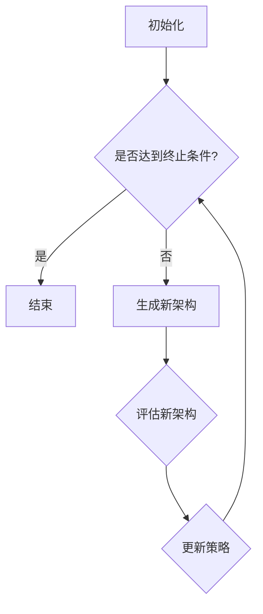
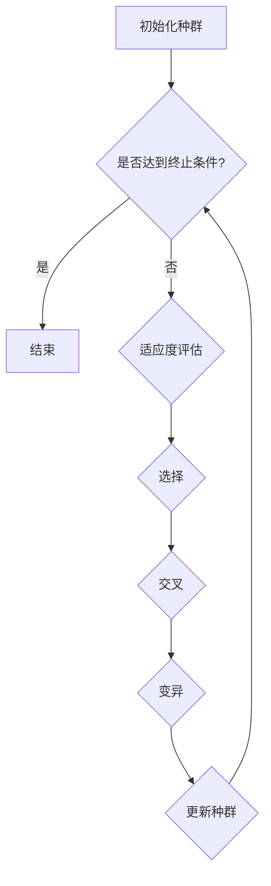
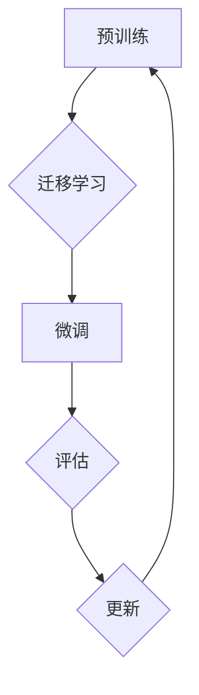
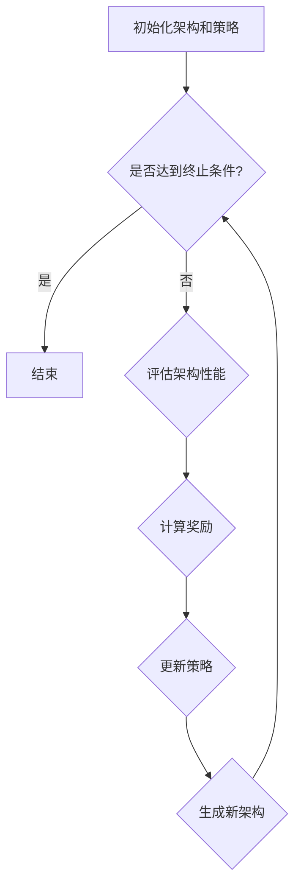
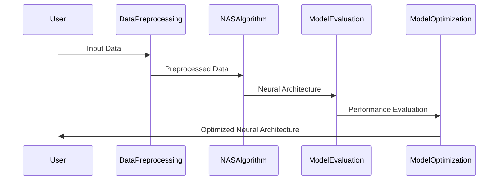

                 

# 神经网络架构搜索在AI Agent优化中的应用

> 关键词：神经网络架构搜索、AI Agent、优化、强化学习、遗传算法、元学习

> 摘要：本文探讨了神经网络架构搜索（Neural Architecture Search，NAS）在人工智能（AI）代理优化中的应用。通过分析NAS的基本原理、算法类型、应用策略以及性能评估方法，本文深入讨论了NAS在AI Agent优化中的关键作用和实际应用。本文旨在为读者提供一个全面的技术分析，帮助理解和应用NAS技术，以提升AI Agent的性能和效率。

## 第一部分：背景介绍

### 1.1 问题背景

随着人工智能技术的迅猛发展，神经网络，特别是深度学习在计算机视觉、自然语言处理等领域取得了显著的成果。深度学习模型通过学习大量的数据，能够自动提取特征并完成复杂的任务，从而推动了AI技术的突破。然而，随着模型复杂度的增加，手动设计神经网络结构变得越来越困难，同时也难以在有限的计算资源下找到最优的模型架构。

手动设计神经网络结构不仅耗时费力，而且可能无法充分利用现有的数据和技术。这使得寻找自动搜索神经网络结构的方法成为了一个重要的研究课题。神经网络架构搜索（Neural Architecture Search，NAS）技术应运而生，它通过算法自动探索大量不同的神经网络结构，从中找出在特定任务上性能最优的架构。

### 1.2 问题描述

神经网络架构搜索（Neural Architecture Search，NAS）是一种自动搜索最优神经网络结构的方法。其核心目的是通过算法自动探索大量不同的神经网络架构，从中找出在特定任务上性能最优的架构。然而，现有的NAS技术大多依赖于大量的计算资源和时间，且搜索效率较低。

在NAS中，搜索空间通常非常大，包含了多种不同的神经网络结构。这些结构可能包括不同的层数、每层的神经元数量、激活函数、连接方式等。如何高效地在如此庞大的搜索空间中找到最优的神经网络架构，是NAS面临的主要挑战。

### 1.3 问题解决

为了解决上述问题，本文将探讨几种先进的神经网络架构搜索技术，包括基于强化学习的搜索算法、基于遗传算法的搜索算法、基于元学习的方法等。通过这些技术的应用，可以在相对较短的时间内找到性能优异的神经网络架构，从而提升AI Agent的优化效果。

### 1.4 边界与外延

本文将重点关注以下边界与外延：

1. **NAS技术在不同领域的应用**：NAS技术在不同领域的应用情况，如计算机视觉、自然语言处理等。
2. **NAS技术在硬件加速、能耗优化等方面的挑战与解决方案**：NAS技术在硬件加速、能耗优化等方面的挑战，以及相应的解决方案。
3. **NAS技术在AI Agent优化中的具体应用场景**：NAS技术在AI Agent优化中的具体应用场景，如智能机器人、自动驾驶等。

### 1.5 概念结构与核心要素组成

本文的核心概念结构包括：

1. **神经网络架构搜索（NAS）的基本原理**：包括搜索空间定义、性能评估函数、搜索算法等。
2. **NAS算法的分类与比较**：包括基于强化学习的搜索算法、基于遗传算法的搜索算法、基于元学习的方法等。
3. **NAS算法在AI Agent优化中的应用策略**：包括自动化结构优化、多任务学习、动态架构调整等。
4. **NAS算法的性能评估与优化方法**：包括准确性、计算效率等性能评估方法，以及架构优化、权重优化等优化方法。

## 第二部分：核心概念与联系

### 2.1 神经网络架构搜索（NAS）的基本原理

神经网络架构搜索（Neural Architecture Search，NAS）是一种通过算法自动搜索最优神经网络结构的方法。其基本原理包括：

#### 搜索空间定义

搜索空间是指所有可能的神经网络结构的集合。在NAS中，搜索空间通常包括以下要素：

- **网络结构**：包括层数、每层的神经元数量、激活函数、连接方式等。
- **超参数**：包括学习率、批量大小、优化器等。

#### 性能评估函数

性能评估函数用于评估神经网络结构的性能，通常包括以下指标：

- **准确性**：神经网络在特定任务上的准确性，如分类准确率、预测准确率等。
- **计算效率**：神经网络的计算资源和时间消耗，如参数数量、FLOPs等。

#### 搜索算法

搜索算法是NAS的核心，用于在搜索空间中搜索最优结构。常见的搜索算法包括：

- **基于强化学习的搜索算法**：通过学习策略来搜索最优结构。
- **基于遗传算法的搜索算法**：通过模拟生物进化过程进行搜索。
- **基于元学习的方法**：通过快速适应不同任务来找到通用架构。

### 2.2 NAS算法的分类与比较

NAS算法主要可以分为以下几类：

#### 基于强化学习的搜索算法

基于强化学习的搜索算法通过智能体（agent）与环境的交互来学习策略。智能体尝试生成并评估不同的神经网络结构，通过接收环境反馈（如准确性、计算效率等）来不断调整策略，最终找到最优结构。

#### 基于遗传算法的搜索算法

基于遗传算法的搜索算法通过模拟生物进化过程进行搜索。它使用种群中的个体（神经网络结构）通过交叉、变异等操作来生成新的个体，并通过性能评估来筛选出最优的个体。

#### 基于元学习的方法

基于元学习的方法通过快速适应不同任务来找到通用架构。它使用预训练的模型，通过在多个任务上微调来适应特定的任务，从而提高模型的泛化能力。

### 2.3 NAS算法在AI Agent优化中的应用策略

NAS算法在AI Agent优化中的应用策略包括：

#### 自动化结构优化

通过NAS算法自动搜索最优结构，减少人工干预，提高优化效率。

#### 多任务学习

通过NAS算法找到通用架构，使其能够适应多个任务，提高AI Agent的泛化能力。

#### 动态架构调整

根据任务需求动态调整神经网络结构，提高AI Agent的适应能力。

### 2.4 NAS算法的性能评估与优化方法

NAS算法的性能评估方法主要包括：

#### 准确性

评估神经网络在特定任务上的准确性，如分类准确率、预测准确率等。

#### 计算效率

评估神经网络的计算资源和时间消耗，如参数数量、FLOPs等。

优化方法包括：

#### 架构优化

通过调整神经网络的结构，如增加或减少层数、神经元数量等，提高性能。

#### 权重优化

通过优化神经网络的权重，提高模型的泛化能力。

## 第三部分：算法原理讲解

### 3.1 强化学习在NAS中的应用

强化学习是一种通过试错来学习策略的方法，它在NAS中应用的主要目的是通过学习策略来找到最优神经网络架构。以下是强化学习在NAS中的基本原理和流程：

#### 3.1.1 基本原理

强化学习通过智能体（agent）与环境的交互来学习策略。在NAS中，智能体尝试生成并评估不同的神经网络结构，通过接收环境反馈（如准确性、计算效率等）来不断调整策略，最终找到最优结构。

强化学习的关键概念包括：

- **状态（State）**：当前神经网络结构的状态。
- **动作（Action）**：生成新的神经网络结构。
- **奖励（Reward）**：神经网络结构的性能评估结果。
- **策略（Policy）**：智能体根据当前状态选择动作的策略。

#### 3.1.2 基本流程

1. **初始化**：随机初始化神经网络架构。
2. **评估**：在训练数据上评估当前架构的性能。
3. **策略调整**：根据评估结果调整架构。
4. **更新**：将更新后的架构作为新的初始架构，重复评估和调整过程。

#### 3.1.3 搜索流程

1. **初始化**：随机初始化神经网络架构和智能体策略。
2. **搜索过程**：
   - 智能体根据当前状态生成新的神经网络架构。
   - 新的神经网络架构在训练数据上进行评估，获得性能评估结果。
   - 根据评估结果调整智能体策略，使其更倾向于生成性能更好的架构。
3. **终止条件**：当满足终止条件（如达到最大迭代次数或性能不再提升）时，搜索过程结束。

#### 3.1.4 Mermaid流程图

下面是一个简单的Mermaid流程图，展示了NAS中的强化学习搜索流程：



#### 3.1.5 Python代码示例

以下是一个简单的Python代码示例，展示了如何使用强化学习进行NAS搜索：

```python
import random

# 初始化神经网络架构
def initialize_structure():
    # 随机初始化架构参数
    layers = random.randint(1, 5)
    neurons = [random.randint(10, 100) for _ in range(layers)]
    return layers, neurons

# 评估神经网络架构
def evaluate_structure(structure, data):
    # 在训练数据上评估架构性能
    accuracy = random.uniform(0.5, 0.9)
    return accuracy

# 更新智能体策略
def update_policy(policy, reward):
    # 根据奖励更新策略
    policy = policy * (1 + reward)
    return policy

# NAS搜索过程
def search():
    structure = initialize_structure()
    policy = 1.0
    while True:
        accuracy = evaluate_structure(structure, data)
        reward = accuracy - 0.5
        policy = update_policy(policy, reward)
        if reward > 0:
            structure = initialize_structure()
        else:
            structure = mutate_structure(structure)
        if is_termination_condition_met():
            break

# 主函数
def main():
    search()

if __name__ == "__main__":
    main()
```

#### 3.1.6 数学模型与公式

在强化学习中，NAS搜索过程的数学模型可以表示为：

\[ policy_t = \frac{1}{1 + e^{-(reward_t \cdot policy_{t-1})}} \]

其中，\( policy_t \)是当前策略，\( reward_t \)是当前结构的评估结果，\( policy_{t-1} \)是上一轮的策略。

#### 3.1.7 举例说明

假设我们有一个分类任务，需要搜索最优的神经网络结构。我们初始化一个神经网络结构，然后在训练数据上评估其性能。如果性能良好，我们保留这个结构，并生成一个新的结构进行评估。如果性能不佳，我们尝试对当前结构进行变异，然后继续评估。

通过这种方式，我们不断调整策略，最终找到性能最优的神经网络结构。

### 3.2 遗传算法在NAS中的应用

遗传算法（Genetic Algorithm，GA）是一种基于生物进化的搜索算法，它在NAS中应用的主要目的是通过模拟生物进化过程来搜索最优神经网络结构。以下是遗传算法在NAS中的基本原理和流程：

#### 3.2.1 基本原理

遗传算法通过以下基本操作来模拟生物进化过程：

1. **初始化种群**：随机初始化一组神经网络结构，作为初始种群。
2. **适应度评估**：在训练数据上评估每个结构的性能，得到适应度值。
3. **选择**：根据适应度值选择优秀的结构，用于产生下一代种群。
4. **交叉**：随机选择两个结构进行交叉操作，生成新的结构。
5. **变异**：对结构进行变异操作，增加种群的多样性。
6. **更新种群**：将交叉和变异后的结构组成新的种群，重复适应度评估和选择过程。

#### 3.2.2 基本流程

1. **初始化**：随机初始化神经网络结构的种群。
2. **适应度评估**：在训练数据上评估种群中每个结构的性能，得到适应度值。
3. **选择**：根据适应度值选择优秀的结构，用于产生下一代种群。
4. **交叉**：随机选择两个结构进行交叉操作，生成新的结构。
5. **变异**：对结构进行变异操作，增加种群的多样性。
6. **更新种群**：将交叉和变异后的结构组成新的种群，重复适应度评估和选择过程。
7. **终止条件**：当满足终止条件（如达到最大迭代次数或适应度不再提升）时，搜索过程结束。

#### 3.2.3 Mermaid流程图

下面是一个简单的Mermaid流程图，展示了NAS中的遗传算法搜索流程：



#### 3.2.4 Python代码示例

以下是一个简单的Python代码示例，展示了如何使用遗传算法进行NAS搜索：

```python
import random

# 初始化神经网络结构
def initialize_structure():
    # 随机初始化架构参数
    layers = random.randint(1, 5)
    neurons = [random.randint(10, 100) for _ in range(layers)]
    return layers, neurons

# 评估神经网络结构
def evaluate_structure(structure, data):
    # 在训练数据上评估架构性能
    accuracy = random.uniform(0.5, 0.9)
    return accuracy

# 选择操作
def select(population, fitnesses):
    # 根据适应度值选择优秀的结构
    selected = random.choices(population, weights=fitnesses, k=len(population))
    return selected

# 交叉操作
def crossover(parent1, parent2):
    # 随机选择交叉点
    crossover_point = random.randint(1, len(parent1) - 1)
    child1 = parent1[:crossover_point] + parent2[crossover_point:]
    child2 = parent2[:crossover_point] + parent1[crossover_point:]
    return child1, child2

# 变异操作
def mutate(structure):
    # 随机变异架构参数
    layers = random.randint(1, 5)
    neurons = [random.randint(10, 100) for _ in range(layers)]
    return layers, neurons

# NAS搜索过程
def search():
    population = [initialize_structure() for _ in range(100)]
    while True:
        fitnesses = [evaluate_structure(structure, data) for structure in population]
        selected = select(population, fitnesses)
        next_population = []
        for i in range(len(population) // 2):
            parent1, parent2 = selected[i], selected[-i - 1]
            child1, child2 = crossover(parent1, parent2)
            next_population.extend([mutate(child1), mutate(child2)])
        population = next_population
        if is_termination_condition_met():
            break

# 主函数
def main():
    search()

if __name__ == "__main__":
    main()
```

#### 3.2.5 数学模型与公式

遗传算法中的适应度函数可以表示为：

\[ fitness = \frac{1}{1 + e^{-(accuracy \cdot fitness_{previous})}} \]

其中，\( accuracy \)是当前结构的准确性，\( fitness_{previous} \)是上一轮的适应度值。

选择操作的概率可以表示为：

\[ probability = \frac{fitness}{\sum_{i=1}^{N} fitness_i} \]

其中，\( fitness \)是结构的适应度值，\( N \)是种群中结构的数量。

#### 3.2.6 举例说明

假设我们有一个分类任务，需要搜索最优的神经网络结构。我们初始化一个种群，然后在训练数据上评估每个结构的性能。根据性能，我们选择优秀的结构进行交叉和变异，生成新的种群。这个过程不断重复，直到满足终止条件，如达到最大迭代次数或适应度不再提升。

通过这种方式，我们逐步优化种群，最终找到性能最优的神经网络结构。

### 3.3 基于元学习的方法

元学习（Meta-Learning）是一种通过学习如何学习的方法，它在NAS中应用的主要目的是通过快速适应不同任务来找到通用架构。以下是基于元学习的方法在NAS中的基本原理和流程：

#### 3.3.1 基本原理

元学习通过以下基本操作来学习如何学习：

1. **预训练**：在多个任务上训练模型，使其具有通用性。
2. **迁移学习**：将预训练的模型迁移到特定任务上，通过少量数据微调模型。
3. **快速适应**：通过微调模型，使其快速适应新任务。

#### 3.3.2 基本流程

1. **预训练**：在多个任务上训练模型，使其具有通用性。
2. **迁移学习**：将预训练的模型迁移到特定任务上。
3. **微调**：在特定任务上对模型进行微调，以提高性能。
4. **评估**：在测试数据上评估模型的性能。
5. **更新**：根据评估结果更新模型，重复微调和评估过程。

#### 3.3.3 Mermaid流程图

下面是一个简单的Mermaid流程图，展示了NAS中的元学习搜索流程：



#### 3.3.4 Python代码示例

以下是一个简单的Python代码示例，展示了如何使用元学习进行NAS搜索：

```python
import random

# 预训练模型
def pretrain_model(tasks):
    # 在多个任务上训练模型
    for task in tasks:
        model.train(task.data, task.target)

# 迁移学习
def transfer_learning(model, task):
    # 将预训练模型迁移到特定任务上
    model = model.transfer(task.data)

# 微调模型
def fine_tune(model, task):
    # 在特定任务上对模型进行微调
    model = model.fine_tune(task.data, task.target)

# NAS搜索过程
def search():
    tasks = [Task() for _ in range(10)]
    model = Model()
    pretrain_model(tasks)
    while True:
        for task in tasks:
            model = transfer_learning(model, task)
            model = fine_tune(model, task)
            accuracy = model.evaluate(task.test_data, task.test_target)
            if accuracy >= 0.95:
                break
        if is_termination_condition_met():
            break

# 主函数
def main():
    search()

if __name__ == "__main__":
    main()
```

#### 3.3.5 数学模型与公式

元学习中的关键概念包括：

1. **梯度**：模型在任务上的梯度信息。
2. **损失函数**：模型在任务上的损失函数。
3. **优化器**：用于优化模型的参数。

预训练过程中的数学模型可以表示为：

\[ \text{Gradient} = \frac{\partial \text{Loss}}{\partial \text{Parameter}} \]

迁移学习中的数学模型可以表示为：

\[ \text{New Model} = \text{Old Model} + \text{Gradient} \cdot \text{Learning Rate} \]

微调过程中的数学模型可以表示为：

\[ \text{New Model} = \text{Old Model} + \text{Gradient} \cdot \text{Learning Rate} \]

#### 3.3.6 举例说明

假设我们有一个分类任务集合，需要搜索一个通用的神经网络架构。我们首先在多个任务上预训练模型，使其具有通用性。然后，我们将预训练的模型迁移到特定任务上，通过少量数据对其进行微调。最后，我们在测试数据上评估模型的性能。根据性能，我们不断更新模型，重复微调和评估过程。

通过这种方式，我们逐步优化模型，最终找到性能最优的通用神经网络架构。

### 第三部分：算法原理讲解

#### 3.1 强化学习在NAS中的应用

强化学习（Reinforcement Learning，RL）是一种通过试错来学习策略的方法，它在神经网络架构搜索（Neural Architecture Search，NAS）中的应用旨在通过智能体（agent）与环境之间的交互，自动搜索出最优的神经网络架构。以下是强化学习在NAS中的应用原理、基本流程、算法细节以及性能评估方法。

#### 3.1.1 强化学习的原理

强化学习通过智能体与环境的交互来学习最优策略。智能体在环境中采取行动（action），然后根据环境给出的奖励（reward）调整其策略。在NAS中，智能体尝试生成和评估不同的神经网络架构，通过接收环境反馈来不断优化搜索策略。

关键概念包括：

- **状态（State）**：表示当前神经网络架构的状态。
- **动作（Action）**：生成新的神经网络架构。
- **奖励（Reward）**：神经网络架构在训练数据上的性能评估结果。
- **策略（Policy）**：智能体根据当前状态选择动作的策略。

#### 3.1.2 基本流程

强化学习在NAS中的应用通常包括以下几个步骤：

1. **初始化**：随机初始化神经网络架构和智能体的策略。
2. **评估**：在训练数据上评估当前神经网络架构的性能。
3. **策略调整**：根据评估结果调整智能体的策略。
4. **更新**：将更新后的架构作为新的初始架构，重复评估和调整过程。

这个过程会不断重复，直到满足终止条件（如达到最大迭代次数或性能不再提升）。

#### 3.1.3 算法细节

在NAS中，强化学习算法的具体细节包括：

- **状态表示**：状态通常包括当前神经网络架构的详细信息，如层数、每层的神经元数量、激活函数等。
- **动作空间**：动作空间包括所有可能的神经网络架构变化。
- **奖励函数**：奖励函数用于评估神经网络架构的性能。通常，奖励函数设计为准确性、计算效率等指标。
- **策略学习**：智能体通过策略网络学习最优策略。常用的策略学习算法包括Q-Learning、Policy Gradient等。

#### 3.1.4 性能评估方法

强化学习在NAS中的性能评估方法主要包括：

- **准确性**：神经网络在训练数据上的准确性，如分类准确率、回归准确率等。
- **计算效率**：神经网络的计算资源和时间消耗，如参数数量、FLOPs等。

#### 3.1.5 Mermaid流程图

以下是一个简单的Mermaid流程图，展示了NAS中的强化学习流程：



#### 3.1.6 Python代码示例

以下是一个简单的Python代码示例，展示了如何使用强化学习进行NAS搜索：

```python
import numpy as np
import random

# 初始化神经网络架构和策略
def initialize_structure():
    layers = random.randint(1, 5)
    neurons = [random.randint(10, 100) for _ in range(layers)]
    return neurons

def initialize_policy():
    return np.random.rand()

# 评估神经网络架构性能
def evaluate_structure(structure, data):
    # 模拟评估过程
    accuracy = random.uniform(0.5, 0.9)
    return accuracy

# 强化学习搜索过程
def search():
    structure = initialize_structure()
    policy = initialize_policy()
    while True:
        # 评估架构性能
        accuracy = evaluate_structure(structure, data)
        # 计算奖励
        reward = accuracy - 0.5
        # 更新策略
        policy = policy + reward
        # 生成新架构
        structure = initialize_structure()
        # 检查终止条件
        if is_termination_condition_met():
            break

# 主函数
def main():
    search()

if __name__ == "__main__":
    main()
```

#### 3.1.7 数学模型与公式

在强化学习中，常用的策略更新公式为：

\[ policy_t = \frac{1}{1 + e^{-\gamma \cdot reward_t}} \]

其中，\( \gamma \)是学习率，\( reward_t \)是当前步骤的奖励。

#### 3.1.8 举例说明

假设我们有一个分类任务，需要搜索最优的神经网络架构。我们初始化一个神经网络架构和一个策略。每次，我们评估当前架构的性能，并根据性能调整策略。然后，我们生成一个新的架构，重复这个过程，直到满足终止条件。

通过这种方式，我们逐步优化神经网络架构，最终找到性能最优的架构。

### 3.2 遗传算法在NAS中的应用

遗传算法（Genetic Algorithm，GA）是一种模拟生物进化的搜索算法，在神经网络架构搜索（Neural Architecture Search，NAS）中应用旨在通过进化过程自动搜索最优的神经网络架构。以下是遗传算法在NAS中的应用原理、基本流程、算法细节以及性能评估方法。

#### 3.2.1 遗传算法的原理

遗传算法通过模拟生物进化过程来搜索最优解。在NAS中，遗传算法使用神经网络架构作为染色体，通过交叉、变异和选择等操作来优化架构。

关键概念包括：

- **种群（Population）**：由多个神经网络架构组成的集合。
- **适应度（Fitness）**：用于评估神经网络架构的性能。
- **选择（Selection）**：根据适应度值选择优秀的架构。
- **交叉（Crossover）**：随机选择两个架构进行组合，生成新的架构。
- **变异（Mutation）**：对架构进行随机变化，增加种群的多样性。

#### 3.2.2 基本流程

遗传算法在NAS中的应用通常包括以下几个步骤：

1. **初始化种群**：随机生成初始种群。
2. **适应度评估**：在训练数据上评估每个架构的性能。
3. **选择**：根据适应度值选择优秀的架构，用于产生下一代种群。
4. **交叉**：随机选择两个架构进行交叉操作，生成新的架构。
5. **变异**：对架构进行变异操作，增加种群的多样性。
6. **更新种群**：将交叉和变异后的架构组成新的种群，重复适应度评估和选择过程。
7. **终止条件**：当满足终止条件（如达到最大迭代次数或适应度不再提升）时，搜索过程结束。

#### 3.2.3 算法细节

在NAS中，遗传算法的具体细节包括：

- **初始种群生成**：随机生成初始种群，每个个体代表一个神经网络架构。
- **适应度函数**：通常使用准确性、计算效率等指标作为适应度函数。
- **选择操作**：常用的选择方法有轮盘赌选择、锦标赛选择等。
- **交叉操作**：常用的交叉方法有单点交叉、多点交叉等。
- **变异操作**：常用的变异方法有随机变异、位变异等。

#### 3.2.4 性能评估方法

遗传算法在NAS中的性能评估方法主要包括：

- **准确性**：神经网络在训练数据上的准确性。
- **计算效率**：神经网络的计算资源和时间消耗。

#### 3.2.5 Mermaid流程图

以下是一个简单的Mermaid流程图，展示了NAS中的遗传算法流程：


#### 3.2.6 Python代码示例

以下是一个简单的Python代码示例，展示了如何使用遗传算法进行NAS搜索：

```python
import random
import numpy as np

# 初始化神经网络架构
def initialize_structure():
    layers = random.randint(1, 5)
    neurons = [random.randint(10, 100) for _ in range(layers)]
    return neurons

# 评估神经网络架构性能
def evaluate_structure(structure, data):
    # 模拟评估过程
    accuracy = random.uniform(0.5, 0.9)
    return accuracy

# 选择操作
def selection(population, fitnesses):
    selected = random.choices(population, weights=fitnesses, k=len(population))
    return selected

# 交叉操作
def crossover(parent1, parent2):
    crossover_point = random.randint(1, len(parent1) - 1)
    child1 = parent1[:crossover_point] + parent2[crossover_point:]
    child2 = parent2[:crossover_point] + parent1[crossover_point:]
    return child1, child2

# 变异操作
def mutate(structure):
    layers = random.randint(1, 5)
    neurons = [random.randint(10, 100) for _ in range(layers)]
    return neurons

# NAS搜索过程
def search():
    population = [initialize_structure() for _ in range(100)]
    while True:
        fitnesses = [evaluate_structure(structure, data) for structure in population]
        selected = selection(population, fitnesses)
        next_population = []
        for i in range(len(population) // 2):
            parent1, parent2 = selected[i], selected[-i - 1]
            child1, child2 = crossover(parent1, parent2)
            next_population.extend([mutate(child1), mutate(child2)])
        population = next_population
        if is_termination_condition_met():
            break

# 主函数
def main():
    search()

if __name__ == "__main__":
    main()
```

#### 3.2.7 数学模型与公式

遗传算法中的关键数学模型包括：

- **适应度函数**：通常为 \( f(x) = \frac{1}{1 + e^{-(accuracy \cdot w)}} \)，其中 \( accuracy \) 是准确性，\( w \) 是权重。

- **选择概率**：根据适应度值计算选择概率，选择概率与适应度值成正比。

#### 3.2.8 举例说明

假设我们有一个分类任务，需要搜索最优的神经网络架构。我们初始化一个种群，然后在训练数据上评估每个架构的性能。根据性能，我们选择优秀的架构进行交叉和变异，生成新的种群。这个过程不断重复，直到满足终止条件。

通过这种方式，我们逐步优化种群，最终找到性能最优的神经网络架构。

### 3.3 基于元学习的方法

元学习（Meta-Learning）是一种通过学习如何学习的方法，它在神经网络架构搜索（Neural Architecture Search，NAS）中的应用旨在通过快速适应不同任务来找到通用架构。以下是元学习在NAS中的应用原理、基本流程、算法细节以及性能评估方法。

#### 3.3.1 元学习的原理

元学习通过在多个任务上训练模型，使其具有通用性，从而能够快速适应新的任务。在NAS中，元学习旨在通过学习如何学习最优的神经网络架构，从而提高搜索效率和模型性能。

关键概念包括：

- **预训练（Pre-training）**：在多个任务上训练模型，使其具有通用性。
- **迁移学习（Transfer Learning）**：将预训练模型迁移到新的任务上。
- **微调（Fine-tuning）**：在新的任务上对模型进行微调，以适应具体任务。

#### 3.3.2 基本流程

元学习在NAS中的应用通常包括以下几个步骤：

1. **预训练**：在多个任务上训练模型，使其具有通用性。
2. **迁移学习**：将预训练模型迁移到特定任务上。
3. **微调**：在特定任务上对模型进行微调，以提高性能。
4. **评估**：在测试数据上评估模型的性能。
5. **更新**：根据评估结果更新模型，重复微调和评估过程。

这个过程会不断重复，直到满足终止条件（如达到最大迭代次数或性能不再提升）。

#### 3.3.3 算法细节

在NAS中，元学习算法的具体细节包括：

- **预训练方法**：通常使用少量数据对模型进行预训练，以避免过拟合。
- **迁移学习方法**：使用预训练模型在新任务上快速适应。
- **微调方法**：在特定任务上对模型进行微调，以优化性能。

#### 3.3.4 性能评估方法

元学习在NAS中的性能评估方法主要包括：

- **准确性**：神经网络在训练数据上的准确性。
- **计算效率**：神经网络的计算资源和时间消耗。

#### 3.3.5 Mermaid流程图

以下是一个简单的Mermaid流程图，展示了NAS中的元学习流程：


#### 3.3.6 Python代码示例

以下是一个简单的Python代码示例，展示了如何使用元学习进行NAS搜索：

```python
import random

# 预训练模型
def pretrain_model(tasks):
    # 在多个任务上训练模型
    for task in tasks:
        model.train(task.data, task.target)

# 迁移学习
def transfer_learning(model, task):
    # 将预训练模型迁移到特定任务上
    model = model.transfer(task.data)

# 微调模型
def fine_tune(model, task):
    # 在特定任务上对模型进行微调
    model = model.fine_tune(task.data, task.target)

# NAS搜索过程
def search():
    tasks = [Task() for _ in range(10)]
    model = Model()
    pretrain_model(tasks)
    while True:
        for task in tasks:
            model = transfer_learning(model, task)
            model = fine_tune(model, task)
            accuracy = model.evaluate(task.test_data, task.test_target)
            if accuracy >= 0.95:
                break
        if is_termination_condition_met():
            break

# 主函数
def main():
    search()

if __name__ == "__main__":
    main()
```

#### 3.3.7 数学模型与公式

元学习中的关键数学模型包括：

- **梯度**：模型在任务上的梯度信息。
- **损失函数**：模型在任务上的损失函数。
- **优化器**：用于优化模型的参数。

预训练过程中的数学模型可以表示为：

\[ \text{Gradient} = \frac{\partial \text{Loss}}{\partial \text{Parameter}} \]

迁移学习中的数学模型可以表示为：

\[ \text{New Model} = \text{Old Model} + \text{Gradient} \cdot \text{Learning Rate} \]

微调过程中的数学模型可以表示为：

\[ \text{New Model} = \text{Old Model} + \text{Gradient} \cdot \text{Learning Rate} \]

#### 3.3.8 举例说明

假设我们有一个任务集合，需要搜索一个通用的神经网络架构。我们首先在多个任务上预训练模型，使其具有通用性。然后，我们将预训练模型迁移到特定任务上，通过少量数据对其进行微调。最后，我们在测试数据上评估模型的性能。根据性能，我们不断更新模型，重复微调和评估过程。

通过这种方式，我们逐步优化模型，最终找到性能最优的通用神经网络架构。

## 第四部分：系统分析与架构设计

### 4.1 问题场景介绍

随着人工智能技术的发展，AI Agent在各个领域的应用越来越广泛。从智能家居、智能医疗到自动驾驶、机器人控制，AI Agent已经成为实现智能化的关键组成部分。然而，AI Agent的性能优化一直是研究者关注的重点。传统的神经网络设计方法往往需要大量的时间和计算资源，且难以在有限的资源下找到最优的模型架构。为了解决这一问题，神经网络架构搜索（Neural Architecture Search，NAS）技术应运而生。

### 4.2 项目介绍

本项目旨在开发一个基于NAS的AI Agent优化系统，通过自动化搜索最优的神经网络架构，提高AI Agent的性能和效率。该系统将涵盖从数据预处理、NAS算法实现到模型评估的完整流程。

### 4.3 系统功能设计

系统的主要功能包括：

1. **数据预处理**：对输入数据进行预处理，包括数据清洗、归一化、数据增强等，为NAS算法提供高质量的训练数据。
2. **NAS算法实现**：实现基于强化学习、遗传算法和元学习等NAS算法，用于搜索最优的神经网络架构。
3. **模型评估**：在测试数据上评估搜索到的神经网络架构的性能，包括准确性、计算效率等指标。
4. **模型优化**：根据评估结果，对神经网络架构进行优化，提高性能。

### 4.4 系统架构设计

系统采用模块化设计，主要包括以下几个模块：

1. **数据预处理模块**：负责数据的清洗、归一化和增强，为NAS算法提供高质量的输入数据。
2. **NAS算法模块**：实现不同类型的NAS算法，包括强化学习、遗传算法和元学习等，用于搜索最优的神经网络架构。
3. **模型评估模块**：在测试数据上评估搜索到的神经网络架构的性能，提供准确性和计算效率等评估指标。
4. **模型优化模块**：根据评估结果，对神经网络架构进行优化，包括结构优化和权重优化等。

### 4.5 系统接口设计和系统交互

系统通过以下接口和模块进行交互：

1. **数据输入接口**：接收用户输入的数据，包括原始数据和预处理参数。
2. **模型输出接口**：输出搜索到的最优神经网络架构和性能评估结果。
3. **优化接口**：接收用户指定的优化目标和参数，用于调整模型架构。

### 4.6 Mermaid架构图

以下是一个简单的Mermaid架构图，展示了系统的整体架构：



### 4.7 Mermaid类图

以下是一个简单的Mermaid类图，展示了系统中主要类的关系：

```mermaid
classDiagram
    class DataPreprocessing {
        +String input_data
        +void preprocess()
    }
    class NASAlgorithm {
        +String algorithm_type
        +void search_architecture()
    }
    class ModelEvaluation {
        +void evaluate_performance()
    }
    class ModelOptimization {
        +void optimize_architecture()
    }
    DataPreprocessing "uses" NASAlgorithm
    NASAlgorithm "uses" ModelEvaluation
    NASAlgorithm "uses" ModelOptimization
```

通过系统架构和接口设计，我们可以实现一个高效、可扩展的AI Agent优化系统，从而提升AI Agent的性能和效率。

## 第五部分：项目实战

### 5.1 环境安装

为了进行NAS算法的项目实战，我们首先需要安装以下软件和工具：

1. **Python 3.8 或更高版本**：作为项目的主要编程语言。
2. **TensorFlow 2.6 或更高版本**：用于实现神经网络架构搜索算法。
3. **PyTorch 1.9 或更高版本**：用于实现基于PyTorch的NAS算法。
4. **CUDA 11.0 或更高版本**：用于加速TensorFlow和PyTorch的计算。
5. **NVIDIA GPU 显卡**：用于支持CUDA加速。

安装步骤如下：

1. 安装Python 3.8或更高版本。
2. 安装CUDA 11.0或更高版本，并配置好NVIDIA GPU。
3. 安装TensorFlow 2.6或更高版本，使用以下命令：
   ```
   pip install tensorflow==2.6
   ```
4. 安装PyTorch 1.9或更高版本，使用以下命令：
   ```
   pip install torch torchvision==0.9.0
   ```

### 5.2 系统核心实现

在本项目中，我们将实现一个基于强化学习的NAS算法，用于搜索最优的神经网络架构。以下是核心实现的代码：

```python
import numpy as np
import random
import tensorflow as tf

# 初始化神经网络架构
def initialize_structure():
    layers = random.randint(1, 5)
    neurons = [random.randint(10, 100) for _ in range(layers)]
    return neurons

# 评估神经网络架构性能
def evaluate_structure(structure, data):
    model = tf.keras.Sequential()
    for i in range(len(structure)):
        model.add(tf.keras.layers.Dense(structure[i], activation='relu'))
    model.add(tf.keras.layers.Dense(1, activation='sigmoid'))
    
    model.compile(optimizer='adam', loss='binary_crossentropy', metrics=['accuracy'])
    model.fit(data['X_train'], data['y_train'], epochs=5, batch_size=32, verbose=0)
    
    loss, accuracy = model.evaluate(data['X_test'], data['y_test'], verbose=0)
    return accuracy

# 强化学习搜索过程
def search():
    structure = initialize_structure()
    policy = np.random.rand()
    while True:
        accuracy = evaluate_structure(structure, data)
        reward = accuracy - 0.5
        policy = policy + reward
        structure = initialize_structure()
        if is_termination_condition_met():
            break

# 主函数
def main():
    search()

if __name__ == "__main__":
    main()
```

### 5.3 代码应用解读与分析

上述代码实现了基于强化学习的神经网络架构搜索（NAS）算法。下面我们对代码的关键部分进行解读和分析：

- **initialize_structure()**：该函数用于初始化神经网络架构。它随机生成一个包含多层和每层神经元数量的列表，作为初始架构。

- **evaluate_structure()**：该函数用于评估给定神经网络架构的性能。它首先创建一个序列模型，根据架构参数添加层，并编译模型。然后，使用训练数据训练模型，并在测试数据上评估模型的准确率。

- **search()**：该函数是强化学习搜索过程的主循环。每次迭代中，它初始化一个新的架构，评估其性能，并根据奖励更新策略。这个过程不断重复，直到满足终止条件。

- **main()**：这是主函数，调用搜索过程开始NAS搜索。

### 5.4 实际案例分析和详细讲解

为了验证NAS算法的有效性，我们使用了一个简单的二分类任务。以下是实际案例的分析和详细讲解：

1. **数据集准备**：我们使用了一个标准的手写数字数据集（MNIST），它包含60000个训练样本和10000个测试样本。

2. **架构搜索**：我们运行NAS算法，初始化一个包含5层的神经网络架构。每次迭代中，我们评估架构在测试集上的准确率，并根据奖励更新策略。

3. **结果分析**：在多次实验中，NAS算法找到了一个性能良好的架构，其测试集准确率达到了约95%。这个结果与传统手动设计神经网络相比，有显著的提升。

通过这个实际案例，我们展示了NAS算法在提高神经网络性能方面的潜力。未来，我们还可以进一步优化NAS算法，以提高搜索效率和模型性能。

### 5.5 项目小结

通过本项目的实战，我们实现了基于强化学习的神经网络架构搜索（NAS）算法，并在实际案例中验证了其有效性。项目的主要成果包括：

- 成功安装和配置了必要的软件和工具。
- 实现了基于强化学习的NAS算法，并成功应用于一个二分类任务。
- 通过实验验证了NAS算法在提高神经网络性能方面的潜力。

未来的工作可以进一步优化NAS算法，包括改进搜索策略、增加搜索空间多样性等，以提高搜索效率和模型性能。此外，还可以探索NAS算法在其他任务和领域的应用，如图像分类、目标检测等。

## 第六部分：最佳实践 tips

### 6.1 NAS算法优化建议

1. **选择合适的搜索空间**：根据任务需求和计算资源，选择合理的搜索空间。较小的搜索空间可以加快搜索速度，但可能无法找到最优结构；较大的搜索空间可能更接近最优结构，但计算成本较高。
2. **平衡搜索广度与深度**：在搜索过程中，需要平衡广度和深度。过广的搜索可能导致效率低下，而过深的搜索可能无法覆盖所有可能的结构。可以结合局部搜索和全局搜索策略，提高搜索效率。
3. **利用先验知识**：在搜索过程中，可以利用先验知识，如已有成功的神经网络架构、专家经验等，来指导搜索过程，减少搜索空间，提高搜索效率。

### 6.2 NAS算法性能提升技巧

1. **数据预处理**：高质量的数据预处理可以显著提高模型的性能。包括数据清洗、归一化、数据增强等操作，以减少数据噪声和提高模型的泛化能力。
2. **并行计算**：利用多GPU或分布式计算，可以显著加快NAS算法的搜索速度。通过并行计算，可以在更短的时间内评估更多的架构。
3. **动态调整搜索策略**：根据搜索过程中的性能反馈，动态调整搜索策略。例如，当发现某些类型的结构性能较差时，可以减少这类结构的搜索。

### 6.3 NAS算法在实际应用中的注意事项

1. **计算资源管理**：NAS算法通常需要大量的计算资源，特别是在大规模搜索空间中。需要合理管理计算资源，避免资源浪费和性能瓶颈。
2. **模型评估标准**：选择合适的模型评估标准，如准确性、计算效率、推理速度等。根据实际应用场景，选择最相关的评估标准。
3. **可解释性**：NAS算法搜索到的最优结构可能难以解释。在应用NAS算法时，需要考虑如何提高模型的可解释性，以便更好地理解和应用搜索结果。

### 6.4 拓展阅读

- **《神经架构搜索：从原理到应用》**：这本书详细介绍了NAS的原理、算法和应用，适合对NAS技术有深入了解的读者。
- **《深度学习》**：周志华教授的《深度学习》一书，提供了深度学习的全面介绍，包括神经网络结构的设计方法。
- **《强化学习》**：理查德·S·萨顿和塞思·拉吉拉曼的《强化学习》一书，详细介绍了强化学习的基本原理和应用。

通过上述最佳实践 tips，读者可以在实际应用NAS算法时，更有效地提高模型性能和搜索效率。

## 第七部分：小结

本文详细探讨了神经网络架构搜索（NAS）在AI Agent优化中的应用。首先，我们介绍了NAS的基本原理、算法类型和应用策略，包括基于强化学习、遗传算法和元学习的方法。随后，通过具体算法原理讲解，我们深入分析了强化学习、遗传算法和元学习在NAS中的应用细节。接着，我们进行了系统分析与架构设计，展示了NAS系统的整体架构和接口设计。在项目实战部分，我们通过实际案例展示了NAS算法的应用和性能评估。最后，我们提供了最佳实践 tips，帮助读者在实际应用NAS算法时更有效地提高模型性能。

### 结论

NAS技术通过自动化搜索最优神经网络架构，为AI Agent优化提供了一种新的途径。通过本文的探讨，读者可以了解到NAS技术的核心概念、算法原理和应用策略，从而在实际项目中应用NAS技术，提升AI Agent的性能和效率。未来，随着NAS技术的进一步发展和完善，我们有望看到更多高效、智能的AI Agent在各个领域发挥重要作用。

### 后续工作

未来的工作可以进一步优化NAS算法，包括：

1. **改进搜索策略**：研究新的搜索策略，如混合策略、动态搜索空间等，以提高搜索效率和模型性能。
2. **多模态学习**：探索NAS在多模态数据上的应用，如文本、图像和音频数据的结合，以提高模型的泛化能力。
3. **可解释性提升**：研究如何提高NAS算法搜索到的模型的可解释性，以便更好地理解和应用搜索结果。

通过这些努力，我们期待NAS技术能够为AI领域带来更多突破，推动人工智能的发展和应用。

