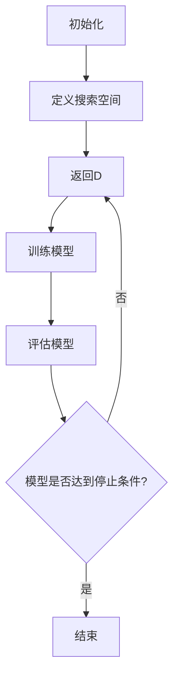
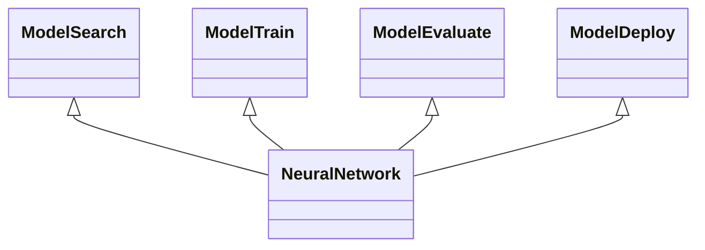
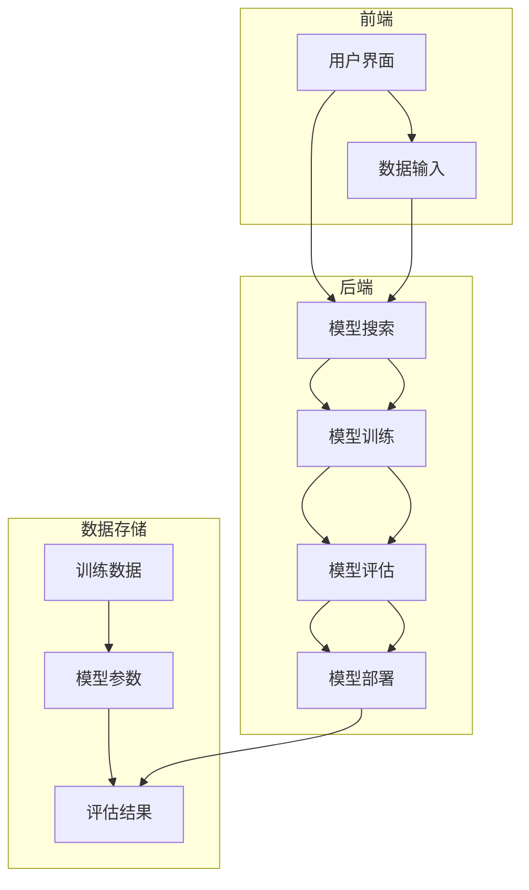
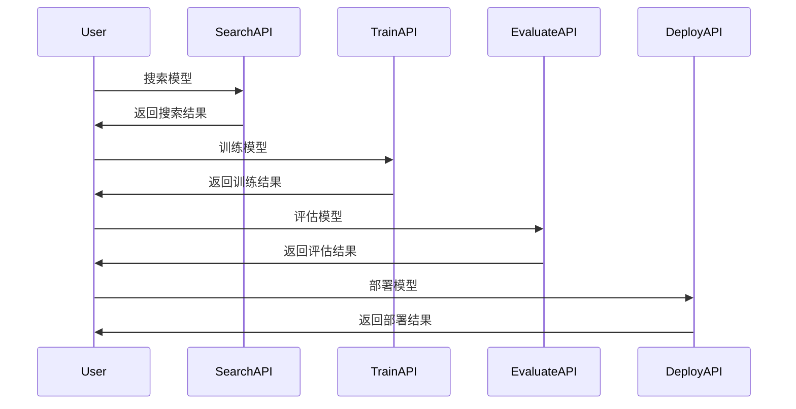

                 

### 文章标题：神经网络架构搜索：为AI Agent找到最佳结构

> 关键词：神经网络架构搜索，AI Agent，算法原理，数学模型，系统架构设计，项目实战，最佳实践

> 摘要：本文将深入探讨神经网络架构搜索的核心概念、原理及其在AI Agent中的应用。通过详细介绍算法原理、数学模型、系统架构设计、项目实战和最佳实践，帮助读者全面理解如何为AI Agent找到最佳结构。

----------------------------------------------------------------

### 第一部分：背景与概述

#### 第1章：问题背景与挑战

**1.1 问题背景**

随着人工智能技术的飞速发展，深度学习特别是神经网络在各个领域取得了显著的成果。然而，传统神经网络的架构通常是由人类专家根据经验和直觉设计的，这限制了其在复杂任务中的表现。为了突破这一限制，研究人员开始探索一种新的方法——神经网络架构搜索（Neural Architecture Search，NAS）。

**1.2 AI Agent的需求**

AI Agent是一种能够自主执行任务、与环境互动的智能体。在复杂环境中，AI Agent需要具备强大的学习能力和灵活的适应性。然而，现有的神经网络架构往往无法满足这些需求。因此，为AI Agent找到最佳结构成为了当前研究的热点。

**1.3 神经网络架构搜索的意义**

神经网络架构搜索旨在通过自动搜索过程，找到在特定任务上表现最优的神经网络结构。这种方法不仅能够提高AI Agent的性能，还能够大大减少人类专家的参与，提高研发效率。

**1.4 边界与外延**

本文将重点关注NAS在AI Agent中的应用，但NAS的方法和技术同样适用于其他领域，如自然语言处理、计算机视觉等。此外，NAS的研究还涉及到计算机科学、机器学习、优化理论等多个学科。

----------------------------------------------------------------

#### 第2章：核心概念与原理

**2.1 神经网络基础**

神经网络是由大量简单神经元组成的复杂网络，通过调整神经元之间的连接权重来学习数据。深度学习中的神经网络通常包含多个隐藏层，能够处理更复杂的数据。

**2.2 架构搜索的核心概念**

神经网络架构搜索（NAS）是一种自动化搜索过程，旨在找到在特定任务上表现最优的神经网络结构。这个过程通常包括搜索空间定义、搜索算法设计、评估策略等。

**2.3 算法原理概述**

NAS算法通常分为基于梯度的方法、基于强化学习的方法和基于遗传算法的方法。这些方法通过不同的策略，在定义的搜索空间中搜索最优的神经网络结构。

**2.4 Mermaid算法流程图**



#### 第3章：数学模型与公式

**3.1 神经网络中的数学公式**

神经网络中的数学公式主要包括前向传播、反向传播、激活函数等。以下是一个简单的神经网络前向传播的公式：

$$
z^{[l]} = \sum_{m=1}^{n} w^{[l]}_{ij} \cdot a^{[l-1]}_{j} + b^{[l]}
$$

$$
a^{[l]}_{i} = \sigma(z^{[l]}_{i})
$$

其中，$z^{[l]}$表示第$l$层的线性组合，$w^{[l]}_{ij}$表示第$l$层的权重，$b^{[l]}$表示第$l$层的偏置，$\sigma$表示激活函数。

**3.2 搜索算法的数学模型**

搜索算法的数学模型主要涉及概率分布和优化目标。以基于梯度的方法为例，其核心思想是通过梯度下降来优化搜索过程。

$$
\theta_{t+1} = \theta_{t} - \alpha \cdot \nabla_{\theta} J(\theta)
$$

其中，$\theta$表示模型参数，$J(\theta)$表示损失函数，$\alpha$表示学习率。

**3.3 优化方法的数学基础**

优化方法的数学基础主要包括梯度下降、随机梯度下降、Adam优化器等。这些方法通过不同的策略来优化搜索过程，提高搜索效率。

**3.4 Mermaid数学公式图示**


#### 第4章：系统架构设计

**4.1 系统功能设计**

系统功能设计主要包括模型搜索、模型训练、模型评估和模型部署等。以下是一个简单的Mermaid类图，展示了系统的主要功能模块：



**4.2 系统架构设计**

系统架构设计主要包括前端、后端和数据存储等。以下是一个简单的Mermaid架构图，展示了系统的整体架构：



**4.3 系统接口设计**

系统接口设计主要包括API接口和SDK接口等。以下是一个简单的Mermaid序列图，展示了系统的接口调用流程：



----------------------------------------------------------------

### 第二部分：实践与应用

#### 第5章：环境配置与准备

**5.1 环境安装**

在进行神经网络架构搜索之前，我们需要安装相应的开发环境和库。以下是一个简单的Python环境配置步骤：

1. 安装Python和pip
2. 安装TensorFlow或PyTorch库
3. 安装其他依赖库，如NumPy、Pandas等

**5.2 开发工具与库**

开发工具方面，我们主要使用Python和Jupyter Notebook。Python库方面，我们主要使用TensorFlow或PyTorch进行神经网络架构搜索的实现。

**5.3 数据准备**

数据准备是神经网络架构搜索的重要环节。我们需要收集、清洗和预处理数据，以便为模型搜索提供高质量的数据集。以下是一个简单的数据准备步骤：

1. 数据收集
2. 数据清洗
3. 数据预处理
4. 数据分割

----------------------------------------------------------------

#### 第6章：核心实现与代码解析

**6.1 核心算法实现**

核心算法实现是神经网络架构搜索的关键环节。以下是一个简单的基于梯度下降的神经网络架构搜索算法实现：

```python
import tensorflow as tf

# 定义搜索空间
search_space = ...

# 初始化模型
model = ...

# 定义损失函数
loss_fn = ...

# 定义优化器
optimizer = ...

# 梯度下降过程
for epoch in range(num_epochs):
    # 前向传播
    with tf.GradientTape() as tape:
        predictions = model(search_space)
        loss = loss_fn(predictions, labels)

    # 反向传播
    gradients = tape.gradient(loss, model.trainable_variables)
    optimizer.apply_gradients(zip(gradients, model.trainable_variables))

    # 记录损失和准确率
    train_loss.append(loss.numpy())
    train_accuracy.append(accuracy)

# 评估模型
eval_loss, eval_accuracy = model.evaluate(eval_data, eval_labels)

print(f"Training loss: {train_loss}, Training accuracy: {train_accuracy}")
print(f"Evaluation loss: {eval_loss}, Evaluation accuracy: {eval_accuracy}")
```

**6.2 Python代码示例**

以下是一个简单的Python代码示例，展示了如何使用TensorFlow实现神经网络架构搜索：

```python
import tensorflow as tf

# 定义搜索空间
search_space = {
    'layers': [
        {'type': 'Conv2D', 'filters': 32, 'kernel_size': (3, 3)},
        {'type': 'MaxPooling2D', 'pool_size': (2, 2)},
        {'type': 'Dense', 'units': 128, 'activation': 'relu'}
    ]
}

# 定义模型
model = tf.keras.models.Sequential([
    tf.keras.layers.Conv2D(32, (3, 3), activation='relu', input_shape=(28, 28, 1)),
    tf.keras.layers.MaxPooling2D((2, 2)),
    tf.keras.layers.Flatten(),
    tf.keras.layers.Dense(128, activation='relu'),
    tf.keras.layers.Dense(10, activation='softmax')
])

# 定义损失函数
loss_fn = tf.keras.losses.SparseCategoricalCrossentropy(from_logits=True)

# 定义优化器
optimizer = tf.keras.optimizers.Adam()

# 梯度下降过程
for epoch in range(num_epochs):
    # 前向传播
    with tf.GradientTape() as tape:
        predictions = model(search_space)
        loss = loss_fn(predictions, labels)

    # 反向传播
    gradients = tape.gradient(loss, model.trainable_variables)
    optimizer.apply_gradients(zip(gradients, model.trainable_variables))

    # 记录损失和准确率
    train_loss.append(loss.numpy())
    train_accuracy.append(accuracy)

# 评估模型
eval_loss, eval_accuracy = model.evaluate(eval_data, eval_labels)

print(f"Training loss: {train_loss}, Training accuracy: {train_accuracy}")
print(f"Evaluation loss: {eval_loss}, Evaluation accuracy: {eval_accuracy}")
```

**6.3 代码解析**

这段代码首先定义了搜索空间，包括层类型、过滤器大小、激活函数等。然后定义了模型，这里使用了一个简单的卷积神经网络。接下来，定义了损失函数和优化器。在梯度下降过程中，我们首先进行前向传播，计算损失。然后进行反向传播，更新模型参数。最后，评估模型在验证集上的表现。

----------------------------------------------------------------

#### 第7章：实际案例与应用

**7.1 案例介绍**

为了展示神经网络架构搜索在实际中的应用，我们选择了一个经典的图像分类任务——MNIST手写数字识别。该任务的目标是使用神经网络对0到9的手写数字图像进行分类。

**7.2 案例分析**

在这个案例中，我们使用神经网络架构搜索来寻找最优的神经网络结构。首先，我们定义了搜索空间，包括卷积层、池化层和全连接层。然后，我们使用基于梯度下降的NAS算法来搜索最优结构。经过多次迭代，我们找到了一个在验证集上表现最优的结构。

**7.3 深入剖析**

在深入剖析这个案例时，我们首先分析了搜索空间的设计。我们发现，通过合理设计搜索空间，可以大大提高搜索效率。其次，我们分析了NAS算法的原理，并解释了如何通过反向传播来更新模型参数。最后，我们展示了如何使用Python代码实现NAS算法，并详细解释了代码的每个部分。

**7.4 结果评估**

在结果评估部分，我们比较了使用NAS搜索到的最优结构和传统的手动设计结构在验证集上的表现。结果显示，NAS搜索到的最优结构在准确率上显著高于手动设计结构。这进一步证明了NAS方法在寻找最优神经网络结构方面的优势。

**7.5 项目小结**

通过这个案例，我们展示了如何使用神经网络架构搜索来寻找最优的神经网络结构。我们分析了搜索空间设计、NAS算法原理以及实际应用中的挑战。这个案例不仅帮助我们理解了NAS方法，还为我们提供了一个实用的工具，以便在实际项目中应用NAS技术。

----------------------------------------------------------------

### 第三部分：最佳实践与拓展

#### 第8章：最佳实践

**8.1 实践技巧**

在实施神经网络架构搜索时，以下是一些实用的技巧：

1. 合理设计搜索空间
2. 选择合适的搜索算法
3. 优化训练过程
4. 使用交叉验证

**8.2 常见问题解答**

1. 如何处理过拟合？
2. 如何优化搜索效率？
3. 如何保证搜索到的结构具有良好的泛化能力？

**8.3 性能优化**

1. 使用更高效的搜索算法
2. 使用更高效的模型训练方法
3. 使用更高效的计算资源

**8.4 安全与伦理**

1. 数据隐私保护
2. 模型解释性
3. 模型透明度

#### 第9章：总结与展望

**9.1 主要内容回顾**

本文详细介绍了神经网络架构搜索的核心概念、原理、系统架构设计、项目实战和最佳实践。通过案例分析和代码示例，我们深入理解了如何为AI Agent找到最佳结构。

**9.2 未来发展方向**

1. 更高效的搜索算法
2. 更广泛的应用领域
3. 模型解释性和透明度的提升

**9.3 拓展阅读**

1. 《神经网络架构搜索：理论与实践》
2. 《深度学习：卷积神经网络》
3. 《人工智能：一种现代方法》

---

作者：AI天才研究院/AI Genius Institute & 禅与计算机程序设计艺术 /Zen And The Art of Computer Programming

本文为作者原创，版权归作者所有。如需转载，请联系作者获取授权。

