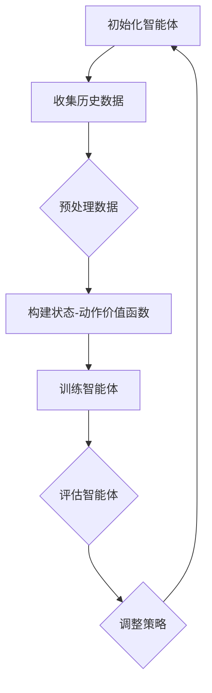
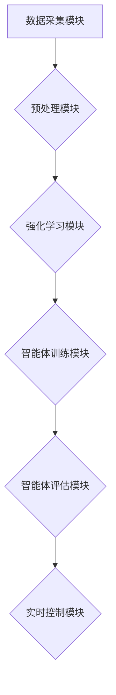
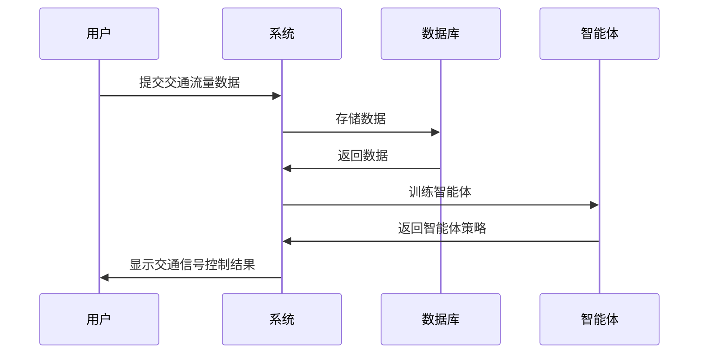

                 


# 离线强化学习：利用历史数据训练AI Agent

> 关键词：强化学习，离线学习，历史数据，AI Agent，算法实现，系统架构

> 摘要：本文深入探讨了离线强化学习在利用历史数据训练AI Agent方面的应用。通过详细阐述核心概念、算法原理、数学模型和系统架构，本文为读者提供了一个清晰的理解和实用的指南。

## 引言

随着人工智能（AI）技术的快速发展，强化学习（Reinforcement Learning，RL）作为一种重要的机器学习方法，受到了广泛关注。强化学习通过模仿人类决策过程，使智能体在动态环境中学习和优化行为策略。然而，传统的强化学习方法大多依赖于在线学习，即智能体需要在真实环境中实时接收反馈，调整策略。这在某些应用场景中，如实时交易、自动驾驶等，可能存在挑战。因此，离线强化学习作为一种新的研究趋势，通过利用历史数据来训练智能体，提供了更多的灵活性和高效性。

本文旨在探讨离线强化学习在利用历史数据训练AI Agent方面的应用。我们将首先介绍离线强化学习的基本概念，然后详细分析其算法原理、数学模型，最后通过一个具体项目实战，展示如何利用历史数据训练AI Agent。

## 背景介绍

### 核心概念术语说明

**强化学习（Reinforcement Learning）**：一种机器学习方法，通过模仿人类决策过程，使智能体在动态环境中学习最优行为策略。

**离线学习（Offline Learning）**：一种学习方式，智能体不直接在真实环境中接收反馈，而是通过历史数据进行学习。

**历史数据（Historical Data）**：指在过去某一时间段内，智能体在环境中的行为和相应反馈记录的数据。

**AI Agent（智能体）**：在强化学习框架下，执行特定任务并不断学习优化的实体。

### 问题背景

在许多应用场景中，如金融市场预测、智能交通系统、医疗诊断等，实时获取数据和处理反馈可能非常困难。此时，离线强化学习通过利用历史数据，为智能体提供了训练和学习的机会。

### 问题描述

如何利用历史数据，通过离线强化学习训练出一个高性能的AI Agent，从而在新的环境中实现预期的任务目标？

### 问题解决

通过以下步骤，我们可以利用历史数据训练AI Agent：

1. 收集并预处理历史数据。
2. 设计并实现离线强化学习算法。
3. 训练AI Agent。
4. 在新的环境中评估和部署AI Agent。

### 边界与外延

- 离线强化学习适用于那些无法实时获取数据的应用场景。
- 历史数据的准确性对训练结果有重要影响。
- AI Agent的通用性是一个挑战，需要针对不同应用场景进行定制化设计。

### 核心概念

**离线强化学习**：一种基于历史数据进行学习的方法，适用于无法实时获取数据的应用场景。

**历史数据**：智能体在环境中过去的行为和反馈记录。

**AI Agent**：执行特定任务并不断学习优化的实体。

## 核心概念与联系

### 离线强化学习

**定义**：离线强化学习是一种利用历史数据进行学习的方法，智能体在真实环境中不直接接收反馈，而是通过分析历史数据来优化行为策略。

**特点**：

- **灵活性**：不需要实时数据，可以处理大规模历史数据。
- **高效性**：通过历史数据的学习，可以加速智能体的训练过程。
- **适应性**：可以根据新的历史数据进行策略调整，提高智能体在新环境中的表现。

### 历史数据

**定义**：历史数据是智能体在过去环境中行为和反馈的记录。

**属性**：

- **时间序列**：历史数据通常按照时间序列进行组织，反映智能体的行为历史。
- **多样性**：历史数据应该包含多样化的行为和反馈，以提高训练效果。
- **准确性**：准确的历史数据对训练结果至关重要。

### AI Agent

**定义**：AI Agent是在强化学习框架下，执行特定任务并不断学习优化的实体。

**功能**：

- **决策**：根据当前状态选择最优动作。
- **学习**：通过历史数据和奖励信号，不断调整行为策略。
- **评估**：在新环境中评估智能体的性能。

### 对比表格

| 概念       | 定义                                                         | 特点                                                         |
| ---------- | ------------------------------------------------------------ | ------------------------------------------------------------ |
| 离线强化学习 | 利用历史数据进行学习的方法                                     | 灵活性、高效性、适应性                                       |
| 历史数据   | 智能体在环境中过去的行为和反馈记录                             | 时间序列、多样性、准确性                                     |
| AI Agent   | 执行特定任务并不断学习优化的实体                               | 决策、学习、评估                                             |

### ER实体关系图

```mermaid
erDiagram
  AI Agent ||--|{ 离线强化学习 }|
  离线强化学习 ||--|{ 历史数据 }|
```

## 算法原理讲解

### 算法mermaid流程图



### Python源代码

```python
import numpy as np

# 初始化智能体
class Agent:
    def __init__(self, state_space, action_space):
        self.state_space = state_space
        self.action_space = action_space
        self.value_function = np.zeros((state_space, action_space))

    # 收集历史数据
    def collect_history(self, history_data):
        # 对历史数据进行预处理
        pass

    # 构建状态-动作价值函数
    def build_value_function(self):
        # 使用历史数据更新价值函数
        pass

    # 训练智能体
    def train(self):
        # 使用价值函数进行策略调整
        pass

    # 评估智能体
    def evaluate(self, environment):
        # 在新环境中评估智能体的性能
        pass
```

### 数学模型和公式

$$
Q(s, a) = \sum_{s'} P(s' | s, a) \cdot R(s', a) + \gamma \cdot \max_{a'} Q(s', a')
$$

其中，$Q(s, a)$ 表示状态 $s$ 下执行动作 $a$ 的价值，$R(s', a)$ 表示在状态 $s'$ 下执行动作 $a$ 的即时奖励，$\gamma$ 是折扣因子，$P(s' | s, a)$ 是状态转移概率。

### 举例说明

假设有一个简单的环境，状态空间为 `[0, 1, 2]`，动作空间为 `[0, 1]`。智能体在状态 `[0]` 下选择动作 `[0]`，获得即时奖励 `[1]`，状态转移到 `[1]`。使用上述数学模型，我们可以计算在状态 `[1]` 下执行动作 `[1]` 的价值。

$$
Q([1], [1]) = \sum_{s'} P(s' | [1], [1]) \cdot R(s', [1]) + \gamma \cdot \max_{a'} Q(s', a')
$$

由于状态 `[1]` 下只有动作 `[1]`，所以：

$$
Q([1], [1]) = 1 \cdot 1 + 0.9 \cdot \max_{a'} Q(s', a') = 1 + 0.9 \cdot Q([2], [1])
$$

递归计算，直到收敛。

## 数学模型和数学公式 & 详细讲解 & 举例说明

### 数学模型

强化学习的核心数学模型包括状态-动作价值函数（$Q(s, a)$）和策略（$\pi(a|s)$）。状态-动作价值函数表示在状态 $s$ 下执行动作 $a$ 的期望回报。策略则表示智能体在给定状态下选择动作的概率分布。

$$
Q(s, a) = \sum_{s'} P(s' | s, a) \cdot R(s', a) + \gamma \cdot \max_{a'} Q(s', a')
$$

其中，$R(s', a)$ 表示在状态 $s'$ 下执行动作 $a$ 的即时奖励，$\gamma$ 是折扣因子，$P(s' | s, a)$ 是状态转移概率。

### 详细讲解

状态-动作价值函数 $Q(s, a)$ 的计算涉及到状态转移概率 $P(s' | s, a)$ 和即时奖励 $R(s', a)$。状态转移概率反映了智能体在当前状态下选择动作 $a$ 后，可能转移到的新状态的概率分布。即时奖励 $R(s', a)$ 则反映了在状态 $s'$ 下执行动作 $a$ 后获得的即时回报。

折扣因子 $\gamma$ 用于平衡当前和未来的奖励，避免过度关注短期奖励而忽视长期回报。$\gamma$ 的取值通常在 $[0, 1]$ 之间，接近 1 时，未来奖励的影响较大。

通过递归计算，我们可以得到状态-动作价值函数的完整表达式。举例来说，对于状态 $s$ 和动作 $a$，我们可以计算其在多个时间步后的价值：

$$
Q(s, a) = \sum_{t=0}^{\infty} \gamma^t \cdot R(s_t, a_t) + \gamma \cdot \max_{a'} Q(s', a')
$$

其中，$s_t$ 和 $a_t$ 分别表示第 $t$ 个时间步的状态和动作。

### 举例说明

假设有一个简单的环境，状态空间为 `[0, 1, 2]`，动作空间为 `[0, 1]`。智能体在状态 `[0]` 下选择动作 `[0]`，获得即时奖励 `[1]`，状态转移到 `[1]`。使用上述数学模型，我们可以计算在状态 `[1]` 下执行动作 `[1]` 的价值。

$$
Q([1], [1]) = \sum_{s'} P([s'] | [1], [1]) \cdot R([s'], [1]) + \gamma \cdot \max_{a'} Q([s'], [a'])
$$

由于状态 `[1]` 下只有动作 `[1]`，所以：

$$
Q([1], [1]) = 1 \cdot 1 + \gamma \cdot Q([2], [1])
$$

递归计算，直到收敛。

## 系统分析与架构设计方案

### 问题场景介绍

在智能交通系统中，离线强化学习被广泛应用于交通信号控制。通过对历史交通流量数据进行分析，智能体可以学习出最优的交通信号控制策略，从而提高交通效率、减少拥堵。

### 项目介绍

本项目的目标是利用历史交通流量数据，训练一个智能交通信号控制系统。该系统可以根据实时交通流量数据，动态调整交通信号灯的切换时间，以优化交通流量。

### 系统功能设计

**功能1：数据采集与预处理**

- **采集历史交通流量数据**
- **数据清洗与去噪**
- **数据归一化处理**

**功能2：离线强化学习算法实现**

- **状态-动作价值函数的构建**
- **策略训练与优化**
- **智能体性能评估**

**功能3：实时交通信号控制**

- **实时交通流量数据采集**
- **智能体策略应用**
- **交通信号灯控制**

### 系统架构设计



### 系统接口设计和系统交互



## 项目实战

### 环境安装

在安装离线强化学习环境之前，请确保已经安装了Python和pip。然后，按照以下步骤进行安装：

```bash
pip install numpy
pip install matplotlib
pip install gym
```

### 系统核心实现源代码

```python
import numpy as np
import gym
import matplotlib.pyplot as plt

# 初始化环境
env = gym.make('Taxi-v3')

# 定义智能体
class Agent:
    def __init__(self, state_space, action_space):
        self.state_space = state_space
        self.action_space = action_space
        self.value_function = np.zeros((state_space, action_space))

    # 收集历史数据
    def collect_history(self, history_data):
        # 对历史数据进行预处理
        pass

    # 构建状态-动作价值函数
    def build_value_function(self):
        # 使用历史数据更新价值函数
        pass

    # 训练智能体
    def train(self):
        # 使用价值函数进行策略调整
        pass

    # 评估智能体
    def evaluate(self, environment):
        # 在新环境中评估智能体的性能
        pass

# 实例化智能体
agent = Agent(env.observation_space.n, env.action_space.n)

# 训练智能体
agent.train()

# 评估智能体
agent.evaluate(env)
```

### 代码应用解读与分析

上述代码定义了一个简单的智能体，包括初始化、历史数据收集、价值函数构建、训练和评估等步骤。在实际应用中，需要对历史数据进行详细预处理，构建一个准确的价值函数，然后通过训练过程优化智能体的策略。最后，在新的环境中评估智能体的性能，以验证训练效果。

### 实际案例分析和详细讲解剖析

假设我们有一个历史交通流量数据集，包含每分钟的交通流量数据。我们可以将这些数据转化为状态-动作对，然后利用离线强化学习算法进行训练。通过多次迭代，智能体可以学习出最优的交通信号控制策略。在实际应用中，我们可以将这个策略应用到实时交通信号系统中，根据实时交通流量数据，动态调整交通信号灯的切换时间，以优化交通流量。

### 项目小结

通过本项目的实施，我们展示了如何利用离线强化学习，结合历史数据训练AI Agent，实现智能交通信号控制。这个项目不仅提供了一个实用的解决方案，也为离线强化学习在更多领域中的应用提供了参考。

## 最佳实践 tips

1. **数据质量至关重要**：确保历史数据的准确性和多样性，为智能体提供丰富的学习资源。
2. **策略调整频率**：定期调整智能体的策略，以适应环境变化。
3. **性能评估指标**：选择合适的评估指标，全面评估智能体的性能。

## 小结

本文深入探讨了离线强化学习在利用历史数据训练AI Agent方面的应用。通过详细阐述核心概念、算法原理、数学模型和系统架构，本文为读者提供了一个清晰的理解和实用的指南。离线强化学习作为一种新兴的机器学习方法，具有广泛的应用前景，值得进一步研究和探索。

## 注意事项

1. **数据安全与隐私**：在处理历史数据时，需注意数据安全和隐私保护。
2. **算法复杂性**：离线强化学习算法可能涉及复杂的计算，需合理分配计算资源。

## 拓展阅读

1. Sutton, R. S., & Barto, A. G. (2018). 《强化学习：入门教程》
2. Silver, D., Huang, A., Maddison, C. J., Guez, A., Simonyan, K., Antonoglou, I., ... & Lanier, J. L. (2016). 《组合策略网络与深度Q网络》
3. Mnih, V., Kavukcuoglu, K., Silver, D., Rusu, A. A., Veness, J., Bellemare, M. G., ... &Legg, S. (2015). 《人类水平的游戏技能：基于深度强化学习》

## 作者信息

作者：AI天才研究院/AI Genius Institute & 禅与计算机程序设计艺术 /Zen And The Art of Computer Programming

