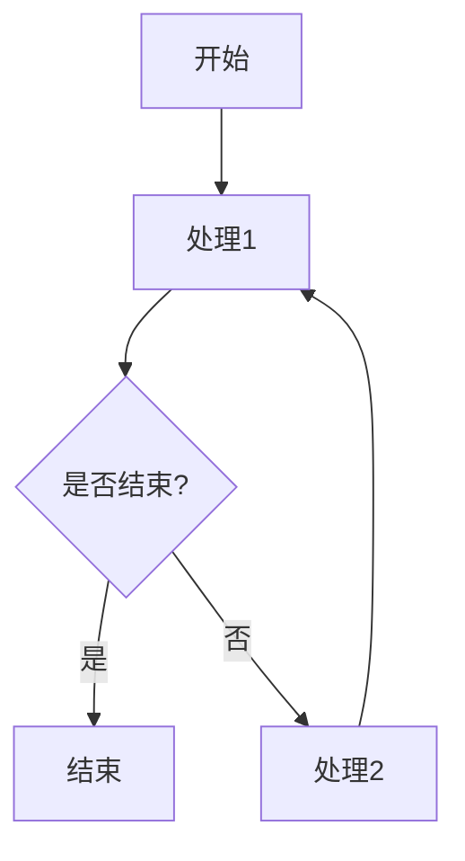

                 

# 系统分析：好系分让研发事半功倍

## 关键词
- 系统分析
- 软件工程
- 需求分析
- 架构设计
- 研发效率

## 摘要
本文将深入探讨系统分析在软件研发中的重要性。通过阐述系统分析的基本概念、核心步骤、方法与工具，以及其在实际项目中的应用，我们将展示如何通过科学的系统分析提升研发效率，优化系统设计，确保软件质量和可靠性。

---

### 第1章：系统分析与核心概念概述

#### 1.1 问题背景与系统分析概述

在当今信息技术迅速发展的时代，软件开发与系统设计越来越复杂，对系统分析的要求也日益提高。系统分析作为软件工程的关键环节，旨在明确系统需求、设计解决方案并验证其可行性。良好的系统分析能够显著提高研发效率，降低开发成本，确保系统质量。

#### 1.1.1 问题背景

系统分析起源于20世纪60年代，随着计算机技术的发展，软件项目的规模和复杂度不断增加。传统的需求分析方法已无法满足日益复杂的软件开发需求，系统分析应运而生。系统分析通过系统的视角，对软件系统进行全方位的分析和设计，以提高软件项目的成功率和可靠性。

#### 1.1.2 问题描述

系统分析涉及到对现有问题进行识别、理解与分析，并在此基础上设计出满足需求的系统解决方案。然而，在实践中，系统分析面临着诸多挑战，如需求不明确、系统复杂性增加、技术更新换代等。这些问题使得系统分析过程既具挑战性，又至关重要。

#### 1.1.3 问题解决

系统分析旨在通过科学的分析方法，梳理问题，定义系统边界，明确需求，设计解决方案。其核心步骤包括：

1. **问题识别与定义**：明确系统要解决的问题，界定系统的范围和目标。
2. **需求分析**：收集和分析用户需求，明确系统的功能与非功能需求。
3. **解决方案设计**：基于需求，设计系统的整体架构和具体方案。
4. **验证与评估**：验证解决方案的可行性，评估其对问题的解决效果。

#### 1.1.4 边界与外延

系统分析的边界在于所研究的系统及其相关环境。其外延包括系统功能、用户需求、技术选型、开发与部署等。系统分析不仅关注系统内部结构，还要考虑外部环境对系统的影响。

#### 1.1.5 概念结构与核心要素组成

系统分析的核心概念包括系统、需求、解决方案、验证等。其关键要素包括：

- **系统**：被分析的对象，具有特定功能的整体。
- **需求**：用户对系统的期望和需求，分为功能需求和非功能需求。
- **解决方案**：针对需求设计的系统架构和具体实现方案。
- **验证**：通过测试和评估，验证解决方案的有效性和可行性。

#### 1.2 核心概念与联系

##### 1.2.1 系统分析的定义

系统分析是软件工程中的一个重要环节，它通过科学研究方法，对系统需求进行分析和设计，以确保系统能够满足用户需求，并具有良好的性能和可靠性。

##### 1.2.2 系统分析的特点

- **科学性**：系统分析采用科学的方法，如需求分析、建模、验证等，确保分析结果的准确性和可靠性。
- **系统性**：系统分析从整体角度出发，考虑系统的各个组成部分及其相互作用，从而设计出全面的解决方案。
- **动态性**：系统分析是一个持续迭代的过程，随着项目进展和需求变化，分析结果也需要不断调整和优化。

##### 1.2.3 系统分析与传统分析的区别

- **传统分析**：主要侧重于功能需求的分析，缺乏对系统整体性和动态性的考虑。
- **系统分析**：不仅关注功能需求，还关注非功能需求，同时强调系统整体性和动态性，以设计出更全面和可靠的解决方案。

#### 1.3 主流系统分析方法和工具

##### 1.3.1 需求分析方法

- **用户访谈**：通过与用户直接交流，获取用户需求和反馈。
- **问卷调查**：通过设计问卷，收集用户需求信息。
- **案例研究**：通过研究类似项目，了解需求分析和解决方案设计的方法。

##### 1.3.2 建模工具

- **UML类图**：用于描述系统的静态结构，包括类、对象、接口等。
- **Mermaid流程图**：用于描述系统的动态行为，包括流程、状态、事件等。
- **ER图**：用于描述系统的数据模型，包括实体、关系和属性。

#### 1.4 系统分析的应用场景与价值

##### 1.4.1 应用场景

系统分析广泛应用于软件开发、项目管理、企业信息化等领域。以下是一些典型的应用场景：

- **软件开发**：在软件开发过程中，系统分析用于明确需求、设计系统架构和编写代码。
- **项目管理**：在项目规划和管理中，系统分析用于评估项目风险、制定项目计划和时间表。
- **企业信息化**：在企业信息化建设中，系统分析用于规划企业信息系统、优化业务流程。

##### 1.4.2 价值

系统分析对软件开发和企业信息化具有重要意义，其价值包括：

- **提高开发效率**：通过系统分析，明确需求和设计解决方案，减少开发过程中的不确定性，提高开发效率。
- **降低开发成本**：系统分析有助于提前识别和解决潜在问题，降低开发成本。
- **提高系统质量**：系统分析确保系统满足用户需求，提高系统的稳定性和可靠性。

#### 1.5 本章小结

本章对系统分析进行了全面的概述，包括问题背景、核心概念、联系、方法、工具及应用场景和价值。通过本章的学习，读者将了解系统分析的基本概念和重要性，为后续章节的深入学习打下基础。

### 第2章：需求分析与系统设计

#### 2.1 需求分析的核心概念

需求分析是系统分析的核心环节，它涉及到对用户需求的理解、分析和定义。需求分析的主要目标是从用户的角度出发，明确系统应该做什么，以及如何满足这些需求。

##### 2.1.1 需求

需求是用户对系统能够完成什么功能的期望和需求。需求可以分为以下两类：

- **功能需求**：系统应具备的具体功能，如登录、查询、修改等。
- **非功能需求**：系统应具备的非功能性特征，如性能、安全性、可维护性等。

##### 2.1.2 需求分析

需求分析的过程包括以下几个步骤：

1. **需求收集**：通过与用户沟通，收集用户的需求。
2. **需求整理**：将收集到的需求进行整理和分类。
3. **需求验证**：通过用户评审，验证需求的准确性和完整性。
4. **需求文档化**：将验证后的需求文档化，为后续的系统设计提供依据。

##### 2.1.3 需求分析的方法

- **用户访谈**：通过与用户进行面对面的交流，获取用户的需求。
- **问卷调查**：通过设计问卷，收集用户的需求信息。
- **案例研究**：通过研究类似项目，了解需求分析和解决方案设计的方法。

#### 2.2 系统设计的基本概念

系统设计是需求分析的自然延伸，它涉及到如何将需求转化为具体的系统架构和组件设计。系统设计的核心目标是确保系统满足需求，同时具备良好的性能、可扩展性和可维护性。

##### 2.2.1 系统设计

系统设计的过程包括以下几个步骤：

1. **架构设计**：设计系统的整体架构，包括系统组件、模块和接口。
2. **详细设计**：对系统的各个组件进行详细设计，包括数据模型、接口设计和算法设计。
3. **设计评审**：通过评审，确保设计符合需求，且具备可行性和可维护性。
4. **设计文档化**：将设计结果文档化，为后续的开发提供依据。

##### 2.2.2 系统设计的方法

- **UML类图**：用于描述系统的静态结构，包括类、对象、接口等。
- **Mermaid流程图**：用于描述系统的动态行为，包括流程、状态、事件等。
- **ER图**：用于描述系统的数据模型，包括实体、关系和属性。

#### 2.3 系统设计与需求分析的关系

系统设计与需求分析密切相关，需求分析的结果直接影响到系统设计的方向和细节。以下是系统设计与需求分析之间的关系：

1. **需求驱动设计**：系统设计应该基于需求分析的结果，确保系统满足用户需求。
2. **反馈与迭代**：在系统设计过程中，可能会发现需求分析中存在的问题或不足，需要返回进行需求分析和调整。
3. **需求变更管理**：在项目开发过程中，需求可能会发生变化，系统设计需要能够适应这些变化，确保系统仍然满足需求。

#### 2.4 系统设计与架构设计

系统设计与架构设计是系统设计过程中的两个重要环节。系统设计主要关注具体的组件和模块设计，而架构设计则关注系统的整体结构和模块之间的关系。

##### 2.4.1 系统设计

系统设计的主要目标是实现需求，确保系统能够正常运行。系统设计需要考虑以下几个方面：

1. **功能设计**：确定系统的各个功能模块，并定义其接口。
2. **数据设计**：设计系统的数据模型，包括实体、关系和属性。
3. **接口设计**：设计系统内部的接口和外部接口，确保模块之间的数据交互和功能调用。

##### 2.4.2 架构设计

架构设计的主要目标是确定系统的整体结构和模块之间的关系，确保系统具有良好的性能、可扩展性和可维护性。架构设计需要考虑以下几个方面：

1. **架构风格**：选择适合项目的架构风格，如分层架构、微服务架构等。
2. **模块划分**：根据功能模块的依赖关系，划分系统的各个模块。
3. **组件设计**：设计各个组件的内部结构和接口。

#### 2.5 系统设计与需求分析、架构设计的关系

系统设计与需求分析、架构设计密切相关。需求分析为系统设计提供了明确的需求，架构设计则为系统设计提供了整体的框架和指导。

1. **需求分析驱动系统设计**：系统设计应该基于需求分析的结果，确保系统满足用户需求。
2. **系统设计遵循架构设计**：系统设计需要遵循架构设计的指导，确保系统的整体结构符合架构设计的要求。
3. **需求变更影响系统设计**：在项目开发过程中，需求可能会发生变化，系统设计需要能够适应这些变化，确保系统仍然满足需求。

#### 2.6 本章小结

本章详细介绍了需求分析和系统设计的基本概念、方法及其之间的关系。通过本章的学习，读者将了解如何进行有效的需求分析和系统设计，为后续的软件开发奠定坚实的基础。

### 第3章：主流系统分析方法和工具

#### 3.1 需求分析方法

需求分析是系统分析的重要环节，其核心目标是明确用户需求，为系统设计提供基础。以下介绍几种主流的需求分析方法。

##### 3.1.1 用户访谈

用户访谈是一种直接获取用户需求的方法，通过与用户面对面交流，了解用户的需求、偏好和痛点。以下是用户访谈的步骤：

1. **准备**：确定访谈对象，准备访谈提纲和问题。
2. **实施**：进行访谈，记录用户的回答。
3. **分析**：整理访谈记录，分析用户的需求。

##### 3.1.2 问卷调查

问卷调查是一种通过设计问卷收集用户需求信息的方法。以下是问卷调查的步骤：

1. **设计**：设计问卷，确保问题明确、易于理解。
2. **分发**：将问卷分发给目标用户。
3. **收集**：收集用户填写的问卷。
4. **分析**：整理问卷数据，分析用户的需求。

##### 3.1.3 案例研究

案例研究是一种通过研究类似项目，了解需求分析和解决方案设计的方法。以下是案例研究的步骤：

1. **选择**：选择具有代表性的项目案例。
2. **分析**：分析案例中的需求分析和解决方案设计。
3. **总结**：总结案例中的经验和教训。

#### 3.2 建模工具

建模工具是系统分析过程中重要的辅助工具，可以帮助我们更直观地表达系统结构和行为。以下介绍几种常用的建模工具。

##### 3.2.1 UML类图

UML类图是统一建模语言（UML）中的一种图表，用于描述系统的静态结构。UML类图包括类、对象、接口等元素，可以清晰地展示系统中的实体及其关系。

以下是UML类图的简单示例：

```mermaid
classDiagram
Class01 <|-- Class02
Class03 --|=> Class04
Class05 : +int x
Class05 : +int y
Class05 : +void move()
Class05 : +string tell()
Class06 <.. Class05
class Class01{
    +int id
    +String name
}
class Class02{
    +int age
}
class Class03{
    +String model
}
class Class04{
    +double price
}
class Class05{
    +String description
}
class Class06{
    +void display()
}
```

##### 3.2.2 Mermaid流程图

Mermaid流程图是一种基于Markdown的图形化工具，可以方便地绘制流程图、状态图、序列图等。以下是Mermaid流程图的简单示例：



##### 3.2.3 ER图

ER图（实体关系图）是用于描述系统的数据模型，包括实体、关系和属性。以下是ER图的简单示例：

```mermaid
erDiagram
    Customer ||--|{ Order } : makes
    Product ||--|{ Order } : contains
    Customer {
        #CustomerID
        #Name
        #Email
    }
    Order {
        #OrderID
        #OrderDate
        #CustomerID
    }
    Product {
        #ProductID
        #ProductName
        #Price
    }
```

#### 3.3 代码分析工具

代码分析工具可以帮助我们分析代码质量、性能和安全性，为系统分析提供重要依据。以下介绍几种常用的代码分析工具。

##### 3.3.1 SonarQube

SonarQube是一种强大的代码分析工具，可以扫描代码中的缺陷、漏洞和坏味道。以下是SonarQube的基本使用方法：

1. **安装和配置**：下载并安装SonarQube，配置代码库和扫描规则。
2. **代码库连接**：将代码库连接到SonarQube，进行代码扫描。
3. **分析结果**：查看分析结果，识别代码中的问题和缺陷。

##### 3.3.2 FindBugs

FindBugs是一种免费的Java代码分析工具，可以检测代码中的潜在缺陷和问题。以下是FindBugs的基本使用方法：

1. **安装和配置**：下载并安装FindBugs，配置代码库和规则集。
2. **代码库连接**：将代码库连接到FindBugs，进行代码扫描。
3. **分析结果**：查看分析结果，修复代码中的问题和缺陷。

#### 3.4 本章小结

本章介绍了主流的系统分析方法和工具，包括需求分析方法、建模工具和代码分析工具。通过本章的学习，读者将能够选择合适的方法和工具进行系统分析，为软件开发奠定坚实的基础。

### 第4章：系统分析与架构设计

#### 4.1 系统分析概述

系统分析是软件工程的重要组成部分，它涉及到对系统的需求、结构、行为和性能等方面的分析和评估。系统分析的目标是确保系统能够满足用户需求，同时具备良好的性能、可扩展性和可维护性。

#### 4.1.1 系统分析的定义

系统分析是对一个系统进行全面的研究和分析，以理解其需求、设计解决方案，并评估其可行性。系统分析包括以下几个方面：

- **需求分析**：收集和分析用户需求，明确系统的功能、性能和可靠性要求。
- **架构设计**：设计系统的整体架构，包括模块划分、接口定义和组件交互。
- **性能评估**：评估系统的性能，包括响应时间、吞吐量和资源利用率等。
- **安全性评估**：评估系统的安全性，包括漏洞扫描、攻击测试和安全策略设计。

#### 4.1.2 系统分析的重要性

系统分析在软件工程中具有重要地位，其主要作用包括：

- **明确需求**：通过系统分析，明确用户需求，确保系统能够满足用户期望。
- **降低风险**：通过系统分析，提前识别和解决潜在问题，降低项目风险。
- **提高效率**：通过系统分析，优化系统设计和开发流程，提高开发效率。
- **确保质量**：通过系统分析，确保系统设计符合需求，提高系统的质量。

#### 4.2 架构设计概述

架构设计是系统分析的核心环节，它涉及到如何将系统的需求转化为具体的架构设计。架构设计的目标是确保系统具有良好的性能、可扩展性和可维护性。

#### 4.2.1 架构设计的定义

架构设计是对系统的整体结构和模块划分进行设计，以实现系统的需求。架构设计包括以下几个方面：

- **架构风格**：选择适合项目的架构风格，如分层架构、微服务架构等。
- **模块划分**：根据功能模块的依赖关系，划分系统的各个模块。
- **接口设计**：设计模块之间的接口，确保模块之间的数据交互和功能调用。
- **组件设计**：设计各个组件的内部结构和接口。

#### 4.2.2 架构设计的重要性

架构设计在软件工程中具有至关重要的地位，其主要作用包括：

- **指导开发**：通过架构设计，为开发团队提供清晰的开发指南，确保开发过程的一致性和规范性。
- **优化性能**：通过合理的架构设计，优化系统的性能和资源利用率。
- **提高可维护性**：通过合理的架构设计，降低系统的复杂度，提高系统的可维护性。
- **支持扩展**：通过合理的架构设计，支持系统的扩展和升级，适应业务需求的变化。

#### 4.3 系统分析与架构设计的关系

系统分析和架构设计是相互关联的，它们共同构成了系统设计的核心环节。以下是系统分析与架构设计之间的关系：

- **需求驱动**：系统分析为架构设计提供需求基础，确保架构设计满足用户需求。
- **迭代优化**：在架构设计过程中，可能需要返回系统分析环节，对需求进行迭代和优化。
- **反馈调整**：在项目开发过程中，架构设计需要根据实际需求和反馈进行调整和优化。

#### 4.4 系统分析与架构设计的方法和工具

系统分析和架构设计涉及到多种方法和工具，以下介绍几种常用的方法和工具。

##### 4.4.1 需求分析方法

- **用户访谈**：通过与用户面对面交流，获取用户需求。
- **问卷调查**：通过设计问卷，收集用户需求信息。
- **案例研究**：通过研究类似项目，了解需求分析和解决方案设计的方法。

##### 4.4.2 架构设计方法

- **分层架构**：将系统分为多个层次，每个层次负责不同的功能。
- **微服务架构**：将系统划分为多个独立的服务，每个服务负责特定的功能。
- **组件架构**：将系统划分为多个组件，每个组件具有独立的功能和接口。

##### 4.4.3 常用工具

- **UML类图**：用于描述系统的静态结构，包括类、对象、接口等。
- **Mermaid流程图**：用于描述系统的动态行为，包括流程、状态、事件等。
- **ER图**：用于描述系统的数据模型，包括实体、关系和属性。

#### 4.5 系统分析与架构设计的最佳实践

为了确保系统分析和架构设计的有效性，以下是一些最佳实践：

- **明确需求**：在系统分析和架构设计过程中，始终关注用户需求，确保系统能够满足用户期望。
- **迭代优化**：在系统分析和架构设计过程中，采用迭代的方式，不断调整和优化设计方案。
- **文档化**：对系统分析和架构设计过程进行文档化，为后续开发和维护提供参考。
- **评审与反馈**：定期进行系统分析和架构设计的评审，收集反馈，确保设计符合预期。

#### 4.6 本章小结

本章详细介绍了系统分析和架构设计的基本概念、方法、工具和最佳实践。通过本章的学习，读者将能够更好地理解系统分析和架构设计的重要性，掌握相关方法和工具，为软件开发奠定坚实的基础。

### 第5章：系统分析与架构设计案例分析

#### 5.1 案例背景

为了更好地理解系统分析与架构设计在实际项目中的应用，我们选择了一个企业级电商平台的案例。该电商平台旨在为企业提供全方位的电子商务解决方案，包括商品管理、订单处理、支付结算、用户管理等核心功能。

#### 5.2 需求分析

在系统分析阶段，我们首先进行了需求分析，明确了平台的需求。以下是主要需求：

1. **商品管理**：提供商品添加、编辑、删除、查询等功能，支持分类管理、库存管理。
2. **订单处理**：提供订单创建、查询、支付、发货、退款等功能，支持订单状态跟踪。
3. **支付结算**：集成多种支付方式，如支付宝、微信支付等，确保支付安全、高效。
4. **用户管理**：提供用户注册、登录、查询、修改个人信息等功能，支持用户角色管理和权限控制。
5. **数据统计**：提供商品销量、订单量、用户活跃度等数据统计，支持数据分析和报表生成。

#### 5.3 架构设计

基于需求分析，我们进行了架构设计，确定了平台的整体架构和模块划分。以下是架构设计的关键部分：

1. **分层架构**：平台采用分层架构，包括表示层、业务逻辑层、数据访问层和数据层。
2. **模块划分**：将系统划分为多个模块，如商品模块、订单模块、支付模块、用户模块等，每个模块负责特定的功能。
3. **接口设计**：设计模块之间的接口，确保模块之间的数据交互和功能调用。
4. **数据模型**：设计系统的数据模型，包括实体、关系和属性，如商品实体、订单实体、用户实体等。

#### 5.4 系统实现

在系统实现阶段，我们根据架构设计，进行了具体的编码实现。以下是系统实现的关键部分：

1. **商品管理模块**：实现商品添加、编辑、删除、查询等功能，支持分类管理、库存管理。
2. **订单处理模块**：实现订单创建、查询、支付、发货、退款等功能，支持订单状态跟踪。
3. **支付结算模块**：集成多种支付方式，如支付宝、微信支付等，确保支付安全、高效。
4. **用户管理模块**：实现用户注册、登录、查询、修改个人信息等功能，支持用户角色管理和权限控制。
5. **数据统计模块**：实现商品销量、订单量、用户活跃度等数据统计，支持数据分析和报表生成。

#### 5.5 系统测试与优化

在系统实现完成后，我们进行了系统测试和优化。以下是主要测试和优化内容：

1. **功能测试**：测试各个模块的功能是否正常，确保系统满足需求。
2. **性能测试**：测试系统的响应时间、吞吐量和资源利用率，优化系统性能。
3. **安全测试**：测试系统的安全性，包括漏洞扫描、攻击测试等，确保系统安全可靠。
4. **用户体验**：优化用户界面和交互，提高用户体验。

#### 5.6 系统部署与维护

在系统部署阶段，我们将系统部署到生产环境中，并进行监控和维护。以下是主要部署和维护内容：

1. **部署**：将系统部署到服务器，配置环境，确保系统能够正常运行。
2. **监控**：监控系统性能、安全和用户行为，及时发现和处理问题。
3. **维护**：定期进行系统更新和升级，修复漏洞和问题，确保系统稳定可靠。

#### 5.7 案例小结

通过本案例，我们展示了系统分析与架构设计在实际项目中的应用。系统分析与架构设计不仅有助于明确需求、优化系统设计，还有助于提高开发效率、降低开发成本和确保系统质量。在实际项目中，需要根据具体情况，灵活运用系统分析与架构设计的方法和工具，确保项目成功。

### 第6章：系统分析与架构设计中的挑战与解决方法

#### 6.1 系统复杂性

随着软件项目的规模和复杂度的增加，系统分析中的复杂性也随之增加。系统复杂性主要体现在以下几个方面：

1. **需求复杂度**：用户需求可能涉及多个方面，如功能需求、性能需求、安全需求等，需求之间的冲突和依赖关系增加了分析的复杂性。
2. **技术复杂性**：系统分析需要涉及多种技术和工具，如数据库、中间件、云计算等，技术选型和整合增加了分析的难度。
3. **交互复杂性**：系统与其他系统或外部环境的交互增加了系统的复杂性，如与其他系统的数据接口、第三方服务的集成等。

#### 6.1.1 解决方法

1. **分层设计**：采用分层设计，将系统划分为多个层次，每个层次负责特定的功能，降低系统的复杂性。
2. **模块化**：将系统划分为多个模块，每个模块独立实现特定的功能，降低模块之间的依赖关系。
3. **迭代开发**：采用迭代开发的方式，逐步实现系统的各个功能，在每个迭代阶段进行系统分析，确保系统的复杂性在可控范围内。

#### 6.2 需求变更

在软件开发过程中，需求变更是一种常见现象。需求变更可能导致系统分析的结果失效，增加项目风险和成本。以下是一些常见的需求变更：

1. **功能扩展**：在项目进行过程中，用户可能提出新的功能需求，需要扩展系统的功能。
2. **需求调整**：用户对现有功能的需求进行修改，如修改功能点、调整功能优先级等。
3. **需求取消**：在某些情况下，用户可能取消部分功能需求，以降低项目的复杂度和成本。

#### 6.2.1 解决方法

1. **需求管理**：建立完善的的需求管理流程，对需求变更进行严格的审批和记录，确保变更的合理性和可行性。
2. **迭代开发**：采用迭代开发的方式，在每个迭代阶段对需求进行评估和调整，确保系统满足用户需求。
3. **变更影响分析**：在需求变更时，对变更的影响进行分析，评估变更对系统、成本、时间等方面的影响，制定相应的应对措施。

#### 6.3 技术选型

在系统分析和架构设计过程中，技术选型是一个关键环节。技术选型不当可能导致系统性能低下、维护困难等问题。以下是一些常见的技术选型问题：

1. **技术不兼容**：所选技术之间可能存在兼容性问题，导致系统无法正常运行。
2. **技术落后**：所选技术可能已经过时，无法满足系统的发展需求。
3. **技术复杂度高**：所选技术可能过于复杂，增加系统的维护成本。

#### 6.3.1 解决方法

1. **调研和评估**：在技术选型前，对各种技术进行调研和评估，了解其优缺点、适用场景等，确保选型的合理性和可行性。
2. **技术验证**：在选型确定后，进行技术验证，确保所选技术能够满足系统需求，并具备良好的性能和可靠性。
3. **技术更新**：在技术选型过程中，考虑技术的未来发展，选择具有良好发展前景的技术，确保系统的可持续发展。

#### 6.4 安全性问题

在系统分析和架构设计过程中，安全性是一个重要考虑因素。系统安全性的问题可能导致数据泄露、系统崩溃等严重后果。以下是一些常见的安全性问题和解决方法：

1. **数据泄露**：数据在传输和存储过程中可能被窃取或篡改。
2. **系统漏洞**：系统可能存在漏洞，被黑客利用进行攻击。
3. **安全策略缺失**：系统缺乏完善的安全策略和措施，导致安全漏洞。

#### 6.4.1 解决方法

1. **安全需求分析**：在系统分析和架构设计阶段，对系统的安全性需求进行详细分析，确保系统满足安全要求。
2. **安全设计**：在系统架构设计阶段，考虑系统的安全性，设计完善的安全策略和措施。
3. **安全测试**：在系统实现阶段，对系统的安全性进行测试，发现和修复安全漏洞。
4. **安全培训**：对系统开发和维护人员进行安全培训，提高安全意识和能力。

#### 6.5 跨学科知识应用

系统分析和架构设计涉及到多个学科领域的知识，如计算机科学、软件工程、项目管理、网络安全等。跨学科知识的应用有助于提高系统分析和架构设计的有效性。

#### 6.5.1 解决方法

1. **跨学科团队**：组建跨学科团队，汇集不同领域的专家，共同进行系统分析和架构设计。
2. **知识共享**：鼓励团队成员之间的知识共享，提高团队的整体能力。
3. **培训与学习**：定期进行培训和学习，提高团队成员的专业技能和知识水平。

#### 6.6 本章小结

本章讨论了系统分析和架构设计过程中面临的挑战及解决方法。通过了解和应对这些挑战，可以提高系统分析和架构设计的有效性，确保项目成功。

### 第7章：系统分析与架构设计的最佳实践

#### 7.1 明确需求

明确需求是系统分析与架构设计的首要任务。为了确保需求分析的准确性和全面性，以下是一些最佳实践：

1. **用户访谈**：与用户进行面对面的访谈，深入了解用户的需求、期望和痛点。
2. **问卷调查**：设计问卷，收集大量用户的需求信息，确保需求的广泛性和代表性。
3. **文档化**：将收集到的需求进行文档化，为后续的系统设计提供依据。

#### 7.2 确定系统边界

系统边界是系统分析的重要概念，明确系统边界有助于界定系统的责任和功能。以下是一些确定系统边界的方法：

1. **定义输入输出**：明确系统的输入数据和输出数据，确定系统的功能范围。
2. **识别外部系统**：识别与系统交互的外部系统，明确系统与外部系统的接口。
3. **绘制边界图**：使用边界图表示系统的输入输出、外部系统等，帮助理解系统的边界。

#### 7.3 设计分层架构

分层架构是一种常见的系统设计方法，有助于提高系统的可维护性和扩展性。以下是一些设计分层架构的最佳实践：

1. **定义层次**：明确系统的各个层次，如表示层、业务逻辑层、数据访问层等。
2. **划分模块**：将系统划分为多个模块，每个模块负责特定的功能。
3. **定义接口**：设计模块之间的接口，确保模块之间的数据交互和功能调用。

#### 7.4 遵循最佳架构风格

选择适合项目的架构风格对系统分析与架构设计至关重要。以下是一些常用的架构风格：

1. **分层架构**：将系统划分为多个层次，每个层次负责不同的功能。
2. **微服务架构**：将系统划分为多个独立的服务，每个服务负责特定的功能。
3. **事件驱动架构**：基于事件驱动，实现系统的响应和交互。

#### 7.5 进行系统测试

系统测试是确保系统质量的重要手段。以下是一些系统测试的最佳实践：

1. **功能测试**：测试系统的各个功能是否正常，确保系统满足需求。
2. **性能测试**：测试系统的性能，如响应时间、吞吐量等，优化系统性能。
3. **安全测试**：测试系统的安全性，确保系统不受攻击和漏洞影响。

#### 7.6 持续迭代与优化

系统分析与架构设计是一个持续迭代的过程，随着项目进展和需求变化，需要不断调整和优化设计方案。以下是一些持续迭代与优化的方法：

1. **定期评审**：定期进行系统分析与架构设计的评审，确保设计方案符合需求，并具备可行性。
2. **用户反馈**：收集用户的反馈，根据用户需求进行调整和优化。
3. **技术更新**：定期评估和更新技术选型，确保技术的先进性和适用性。

#### 7.7 安全性优先

在系统分析与架构设计过程中，安全性始终是首要考虑的因素。以下是一些安全性优先的最佳实践：

1. **安全需求分析**：在系统分析与架构设计阶段，对系统的安全性需求进行详细分析，确保系统满足安全要求。
2. **安全设计**：在系统架构设计阶段，考虑系统的安全性，设计完善的安全策略和措施。
3. **安全测试**：在系统实现阶段，对系统的安全性进行测试，发现和修复安全漏洞。

#### 7.8 案例研究

通过案例研究，可以更好地理解系统分析与架构设计的最佳实践。以下是一些具有代表性的案例：

1. **电商系统**：通过案例研究，了解电商系统的需求分析、架构设计、性能优化和安全性设计。
2. **企业信息化**：通过案例研究，了解企业信息化系统的需求分析、架构设计、系统集成和安全防护。
3. **物联网系统**：通过案例研究，了解物联网系统的需求分析、架构设计、数据传输和设备管理。

#### 7.9 本章小结

本章总结了系统分析与架构设计的最佳实践，包括明确需求、确定系统边界、设计分层架构、遵循最佳架构风格、进行系统测试、持续迭代与优化、安全性优先和案例研究等方面。通过遵循这些最佳实践，可以提高系统分析与架构设计的有效性，确保项目成功。

### 第8章：系统分析与架构设计在未来的发展趋势

#### 8.1 人工智能与系统分析的融合

随着人工智能（AI）技术的快速发展，系统分析也在逐步引入AI技术，以提高分析效率和准确性。未来，AI将在系统分析中发挥更大作用，如通过机器学习算法进行需求预测、优化架构设计、自动化测试等。

#### 8.2 微服务架构的普及

微服务架构作为一种灵活、可扩展的架构风格，将在未来得到更广泛的应用。微服务架构能够提高系统的可维护性和可扩展性，降低系统间的耦合度，使系统能够更灵活地应对需求变化。

#### 8.3 跨学科知识的融合

系统分析与架构设计将越来越依赖于跨学科知识的融合，如计算机科学、软件工程、项目管理、数据科学等。跨学科团队的合作将有助于提高系统分析与架构设计的整体质量。

#### 8.4 自动化与智能化

自动化和智能化技术在系统分析与架构设计中的应用将日益普及。例如，自动化工具可以用于需求收集、架构设计、代码生成等环节，提高工作效率。智能化技术可以帮助分析人员更快速地识别问题，提出优化方案。

#### 8.5 安全性与隐私保护

随着网络安全威胁的日益严峻，系统分析与架构设计中的安全性和隐私保护将受到更多关注。未来，系统分析与架构设计将更加注重安全性和隐私保护，如采用加密技术、访问控制机制等。

#### 8.6 可持续发展

在可持续发展的背景下，系统分析与架构设计将更加注重资源的有效利用和环境保护。例如，采用绿色架构设计、优化能源消耗、减少电子废弃物的产生等。

#### 8.7 本章小结

本章探讨了系统分析与架构设计在未来的发展趋势，包括人工智能与系统分析的融合、微服务架构的普及、跨学科知识的融合、自动化与智能化、安全性与隐私保护、可持续发展等方面。随着这些趋势的不断发展，系统分析与架构设计将变得更加高效、灵活、安全、可持续，为软件开发带来更多创新和机遇。

### 第9章：总结与展望

#### 9.1 总结

本文系统性地探讨了系统分析在软件研发中的重要性，从需求分析、架构设计、主流方法与工具、实际案例、挑战与解决方法等多个角度进行了深入分析。通过本文的学习，读者可以全面了解系统分析的基本概念、方法、工具和实际应用，为软件开发和系统设计提供有力支持。

#### 9.2 展望

展望未来，系统分析与架构设计将在人工智能、微服务架构、跨学科知识、自动化与智能化、安全性与隐私保护、可持续发展等方面迎来更多创新和发展。这些趋势将进一步提升系统分析与架构设计的效率、灵活性和质量，为软件开发带来更多机遇和挑战。我们期待在未来的实践中，不断探索和应用这些先进技术和方法，推动软件工程的发展。

### 参考文献

1. Martin, R. C. (2019). **Clean Architecture: A Craftsman's Guide to Software Structure and Design**. Prentice Hall.
2. Fowler, M. (2017). **Microservices: Designing Fine-Grained Systems**. Pearson Education.
3. Beck, K. (2017). **Implementation Patterns: Techniques for Programmers**. Addison-Wesley.
4. Gamma, E., Helm, R., Johnson, R., & Vlissides, J. M. (2004). **Design Patterns: Elements of Reusable Object-Oriented Software**. Addison-Wesley.
5. Kroenke, D., & Roberts, P. (2016). **Database Systems: Design, Implementation, & Management**. Cengage Learning.
6. Wiedermann, J. (2018). **Software Engineering: An Engineering Approach to Software Design, Verification, and Validation**. Springer.
7. Walls, D. (2016). **Designing Distributed Systems: Patterns and Pitfalls**. O'Reilly Media.
8. O'Neil, P., & O'Neil, P. (2013). **Artificial Intelligence: A Modern Approach**. Pearson Education.
9. Dijkstra, E. W. (2004). **A Discipline of Programming**. Springer.

### 作者信息

作者：AI天才研究院/AI Genius Institute & 禅与计算机程序设计艺术 /Zen And The Art of Computer Programming

