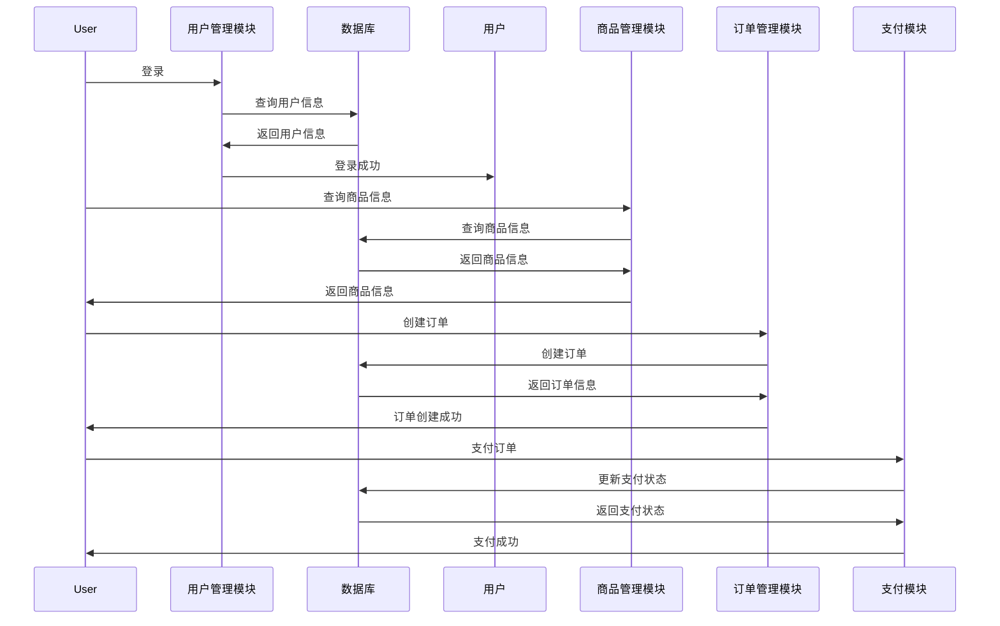
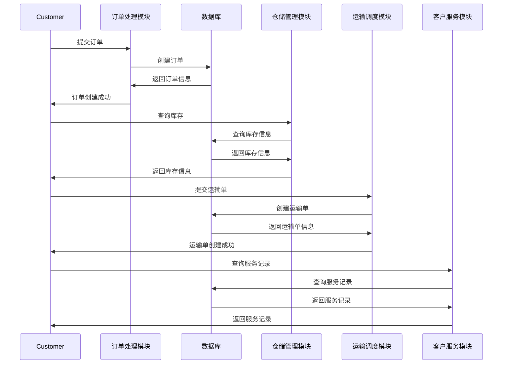

                 

### 引言

领域建模（Domain Modeling）是软件工程中的一个核心概念，它旨在通过抽象和简化现实世界的复杂系统，构建出易于理解和操作的信息模型。领域建模不仅帮助软件开发者在设计和开发过程中更清晰地理解业务需求和系统功能，还能提高系统的可维护性和扩展性。然而，练成领域建模的能力并非一蹴而就，它需要系统化的方法和大量的实践。

《练成领域建模的方法》这本书正是为了解决这一问题而诞生的。本书将带领读者一步步深入了解领域建模的基础概念、方法及应用，通过系统的学习和实战训练，帮助读者掌握领域建模的核心技能。

关键词：领域建模、方法论、模型构建、实践应用

摘要：本书以清晰的结构和丰富的实例，详细介绍了领域建模的各个方面，包括基础概念、核心方法、实战案例和最佳实践。通过逐步分析和实际操作，读者将能够掌握领域建模的精髓，提高自己在软件开发中的建模能力。

在接下来的内容中，我们将通过以下结构对领域建模的方法进行深入探讨：

1. **领域建模的基础知识**：介绍领域建模的基本概念、历史发展和应用领域。
2. **领域模型的核心概念**：详细讲解实体、关系、属性等核心概念，并通过表格和流程图帮助理解。
3. **领域建模的方法**：探讨实体关系模型、过程模型、用例模型等常见建模方法。
4. **领域建模的应用**：分析领域建模在实际项目中的应用场景和成功案例。
5. **领域建模工具与平台**：介绍常用的领域建模工具和平台。
6. **最佳实践与总结**：总结领域建模的最佳实践和注意事项，为读者提供进一步学习和应用的建议。

### 领域建模的基础知识

#### 基本概念

领域建模（Domain Modeling）是一种将现实世界中的复杂系统转化为软件系统的过程。它通过识别和理解业务领域中的关键概念、实体及其相互关系，建立一套抽象的、逻辑清晰的信息模型。领域建模的核心目标是为软件开发者提供一个共同的理解框架，使得不同背景的开发人员能够更高效地协作，并确保软件系统能够准确地满足业务需求。

#### 历史发展

领域建模的概念起源于20世纪80年代，随着面向对象编程（Object-Oriented Programming，OOP）的兴起而逐渐成熟。早期的领域建模主要依赖于实体-关系模型（Entity-Relationship Model，ER Model）和类图（Class Diagram）。随着技术的发展，领域建模方法逐渐丰富，包括但不限于用例模型（Use Case Model）、过程模型（Process Model）和数据模型（Data Model）等。

#### 应用领域

领域建模在多个领域中都有广泛的应用，主要包括：

1. **企业信息系统**：如ERP（Enterprise Resource Planning）系统、CRM（Customer Relationship Management）系统等。
2. **金融服务**：如银行系统、保险系统等。
3. **电子商务**：如电商平台、支付系统等。
4. **物联网**：如智能家居、智能交通等。

#### 问题背景与问题描述

在软件系统开发过程中，领域建模的必要性主要体现在以下几个方面：

1. **需求分析**：通过领域建模，可以更好地理解业务需求，确保软件系统能够准确地满足业务目标。
2. **系统设计**：领域建模有助于设计出结构清晰、易于维护的系统架构。
3. **系统实现**：领域模型为开发人员提供了明确的指导，使得编码过程更加高效。
4. **系统维护**：领域模型有助于理解系统的结构和功能，便于后续的维护和升级。

#### 问题解决与边界与外延

领域建模的过程通常包括以下几个步骤：

1. **识别领域**：明确需要建模的业务领域。
2. **定义实体和关系**：识别业务领域中的关键实体及其相互关系。
3. **属性和操作**：为实体定义属性和操作，以实现其功能。
4. **模型验证**：确保领域模型能够准确反映业务需求和系统功能。

在领域建模过程中，需要注意以下边界与外延：

1. **抽象层次**：领域模型应具有适当的抽象层次，既能捕捉到关键的业务概念，又不至于过于复杂。
2. **一致性**：领域模型中的实体、关系、属性和操作应保持一致性。
3. **可扩展性**：领域模型应具备良好的可扩展性，以便在业务需求发生变化时能够灵活调整。

#### 概念结构与核心要素组成

领域建模的基本结构包括以下核心要素：

1. **实体**：现实世界中具有独立存在的对象。
2. **关系**：实体之间的相互作用和关联。
3. **属性**：实体的特征和特性。
4. **操作**：实体能够执行的行为和功能。

这些要素相互作用，共同构成了领域模型的基本框架。通过分析这些要素，开发者可以更好地理解业务需求，并构建出满足需求的软件系统。

### 领域模型的核心概念

在深入探讨领域建模的方法和应用之前，首先需要理解领域模型中的核心概念，包括实体、关系、属性等。这些概念是构建领域模型的基础，它们不仅有助于我们准确地描述业务需求，还能提高系统的可维护性和扩展性。

#### 实体

实体（Entity）是领域模型中最基本的构成要素，代表了现实世界中的对象或概念。实体具有独特的标识和属性，能够独立存在于系统中。例如，在电子商务系统中，客户（Customer）、订单（Order）和产品（Product）都是典型的实体。

**实体属性特征对比表格**：

| 实体类型 | 特征属性 | 说明 |
| --- | --- | --- |
| 客户（Customer） | ID、姓名、联系方式、地址 | 客户的基本信息 |
| 订单（Order） | 订单号、创建时间、状态、总金额 | 订单的基本信息和状态 |
| 产品（Product） | 产品ID、名称、描述、价格、库存量 | 产品的基本信息和库存信息 |

**ER实体关系图架构**：

```mermaid
erDiagram
  Customer ||--|{ Order : 订单包含客户 }
  Product ||--|{ Order : 订单包含产品 }
```

在上面的ER实体关系图中，我们可以看到客户、订单和产品之间的关系。客户与订单之间是一对多的关系，即一个客户可以创建多个订单；订单与产品之间也是一对多的关系，即一个订单可以包含多个产品。

#### 关系

关系（Relationship）描述了实体之间的相互作用和关联。关系可以是多对多、一对多或一对一的。在领域模型中，关系有助于我们理解实体之间的复杂交互，从而构建出更加准确和全面的系统模型。

**关系类型**：

1. **一对一关系**：一个实体只与另一个实体相关联。例如，一个订单只能有一个订单状态。
2. **一对多关系**：一个实体可以与多个相关实体相关联。例如，一个客户可以创建多个订单。
3. **多对多关系**：多个实体可以相互关联。例如，一个订单可以包含多个产品，一个产品也可以出现在多个订单中。

**关系表示方法**：

```mermaid
erDiagram
  Customer ||--|{ Order : 创建 }
  Product ||--|{ Order : 包含 }
```

在上面的ER实体关系图中，客户与订单之间是一对多的关系，表示为“创建”；订单与产品之间也是一对多的关系，表示为“包含”。

#### 属性

属性（Attribute）是实体的特征和特性，它们描述了实体在某个特定领域的详细信息。属性可以是简单的数据类型，如整数、字符串、日期等，也可以是更复杂的类型，如枚举、列表等。

**属性类型**：

1. **基本属性**：如姓名、年龄、联系方式等。
2. **复合属性**：如地址、联系方式列表等。
3. **引用属性**：如订单号、产品ID等，它们引用了其他实体的属性。

**属性表示方法**：

```mermaid
erDiagram
  Customer {
    +ID : 整数
    +姓名 : 字符串
    +联系方式 : 字符串
  }
  Product {
    +产品ID : 整数
    +名称 : 字符串
    +描述 : 字符串
    +价格 : 浮点数
    +库存量 : 整数
  }
  Order {
    +订单号 : 字符串
    +创建时间 : 日期
    +状态 : 字符串
    +总金额 : 浮点数
  }
```

在上面的ER实体关系图中，我们为每个实体定义了相应的属性。例如，客户实体具有ID、姓名、联系方式等属性；产品实体具有产品ID、名称、描述、价格、库存量等属性；订单实体具有订单号、创建时间、状态、总金额等属性。

#### 类与实例

类（Class）是对一组具有相同属性和行为的实体的抽象。类定义了实体的一般结构和行为，而实例（Instance）则是类的具体实现。例如，客户类定义了所有客户应具备的属性和行为，而每个具体的客户则是客户类的实例。

**类与实例的关系**：

1. **类定义**：类是对一组实体的一般描述，包括属性、操作和方法等。
2. **实例创建**：实例是类的具体实现，每个实例都拥有类的属性和行为。

**类与实例表示方法**：

```mermaid
classDiagram
  Customer <<Class>>
  Order <<Class>>
  Product <<Class>>

  Customer : +ID : 整数
  Order : +订单号 : 字符串
  Product : +产品ID : 整数

  Customer o-- 1 Order : 创建
  Product o-- 1 Order : 包含
```

在上面的类图中，我们定义了三个类：客户（Customer）、订单（Order）和产品（Product）。每个类都定义了相应的属性，例如客户类定义了ID、姓名、联系方式等属性；订单类定义了订单号、创建时间、状态等属性；产品类定义了产品ID、名称、描述等属性。此外，类图还表示了类之间的关系，如客户与订单之间是一对多的关系，产品与订单之间也是一对多的关系。

通过以上对实体、关系、属性等核心概念的详细解释，我们可以更好地理解领域模型的基本构成和逻辑关系。在接下来的章节中，我们将进一步探讨领域建模的具体方法，包括实体关系模型、过程模型和用例模型等。

### 领域建模的方法

领域建模的方法是构建有效领域模型的关键，这些方法提供了系统化的思路和工具，帮助开发者从不同角度理解和表达业务需求。以下是几种常见的领域建模方法，包括实体关系模型、过程模型和用例模型。

#### 实体关系模型

实体关系模型（Entity-Relationship Model，ER Model）是领域建模中最基础和广泛使用的方法之一。它通过实体、关系和属性来描述系统的结构，使得开发者能够直观地理解和设计系统。

**基本原理**：

1. **实体**：实体是具有独立存在的对象，如客户、订单和产品等。
2. **关系**：关系描述实体之间的相互作用，可以是多对多、一对多或一对一的关系。
3. **属性**：属性描述实体的特征，如客户的姓名、地址等。

**绘制方法**：

实体关系模型通常通过ER图（Entity-Relationship Diagram）来表示。ER图中的每个实体用矩形表示，实体的属性用椭圆形表示，实体之间的关系用线条表示。

**示例**：

假设我们要为一家电子商务系统建模，可以绘制如下ER图：

```mermaid
erDiagram
  Customer ||--|{ Order : 创建 }
  Product ||--|{ Order : 包含 }
  Order {
    +订单号
    +创建时间
    +状态
  }
  Customer {
    +ID
    +姓名
    +联系方式
  }
  Product {
    +产品ID
    +名称
    +描述
    +价格
    +库存量
  }
```

在这个ER图中，客户与订单之间是一对多的关系，表示一个客户可以创建多个订单；订单与产品之间也是一对多的关系，表示一个订单可以包含多个产品。

#### 过程模型

过程模型（Process Model）主要用于描述系统的动态行为，即系统在不同情况下如何响应事件和执行操作。过程模型包括用例模型、活动图、状态图等。

**基本原理**：

1. **用例模型**：用例模型（Use Case Model）描述系统的功能和行为，从用户的角度出发，列出系统提供的所有功能。
2. **活动图**：活动图（Activity Diagram）用于描述系统内部的流程和步骤，展示系统如何响应特定事件。
3. **状态图**：状态图（State Diagram）用于描述系统的状态和行为，展示系统在特定条件下如何变化。

**绘制方法**：

1. **用例模型**：用例模型通常通过用例图（Use Case Diagram）来表示。用例图中的每个用例用椭圆表示，参与者（如用户、系统等）用角色表示，用例与参与者之间的关系用线条表示。
2. **活动图**：活动图通过节点和线条表示系统的流程和步骤。节点表示活动或决策点，线条表示活动之间的顺序或条件。
3. **状态图**：状态图通过状态节点和转换线条表示系统的状态和行为。状态节点表示系统的状态，转换线条表示系统在不同状态之间的转换条件。

**示例**：

假设我们要描述电子商务系统中的订单创建流程，可以绘制如下活动图：

```mermaid
activityDiagram
  participant Customer
  participant OrderSystem
  Customer ->> OrderSystem : 提交订单
  OrderSystem -->|验证| Customer
  alt 订单有效
    OrderSystem -->|创建订单| Order
    OrderSystem ->> Customer : 订单创建成功
  else 订单无效
    OrderSystem ->> Customer : 订单创建失败
  end
```

在这个活动图中，客户通过提交订单触发订单系统，订单系统会验证订单的有效性，并根据验证结果创建订单或通知客户订单创建失败。

#### 用例模型

用例模型（Use Case Model）是描述系统功能和行为的重要工具，它从用户的角度出发，列出系统提供的所有功能。用例模型有助于开发者理解用户需求，确保系统功能的完整性。

**基本原理**：

1. **用例**：用例（Use Case）描述系统与用户之间的交互，表示系统提供的功能。
2. **参与者**：参与者（Participant）表示与系统交互的外部实体，如用户、系统等。
3. **关系**：用例之间的关系描述系统功能的依赖和扩展。

**绘制方法**：

用例模型通常通过用例图（Use Case Diagram）来表示。用例图中的每个用例用椭圆表示，参与者用角色表示，用例与参与者之间的关系用线条表示。

**示例**：

假设我们要描述电子商务系统的用例模型，可以绘制如下用例图：

```mermaid
usecaseDiagram
  Customer <<actor>>
  OrderSystem <<system>>
  "下单" as 下单
  "支付" as 支付
  "订单查询" as 订单查询
  
  Customer --|create|> 下单
  Customer --|pay|> 支付
  Customer --|query|> 订单查询
```

在这个用例图中，客户作为参与者与系统交互，系统提供了下单、支付和订单查询等功能。

通过上述对实体关系模型、过程模型和用例模型的介绍，我们可以看到，这些领域建模方法各有特点，适用于不同场景的需求。开发者可以根据实际情况选择合适的方法，构建出有效的领域模型，提高软件系统的质量和可维护性。

### 领域建模的实际应用

领域建模在软件工程中具有广泛的应用，通过具体的案例可以更直观地了解其作用和效果。下面我们将通过两个实际案例，分析领域建模在不同项目中的应用。

#### 案例一：电子商务平台

电子商务平台是一个复杂的多层次系统，涉及多个业务领域和功能模块。通过领域建模，开发者能够清晰地理解系统的结构，确保各模块之间的协同工作。

**项目介绍**：

该电子商务平台主要包括用户管理、商品管理、订单管理和支付系统等功能模块。领域建模的目标是构建一个结构清晰、易于维护的模型，确保系统能够灵活应对业务需求的变化。

**系统功能设计（领域模型）**：

领域模型主要包括以下核心实体：

1. **用户**：包括基本信息（如姓名、联系方式等）和角色（如买家、卖家、管理员等）。
2. **商品**：包括商品信息（如名称、描述、价格等）和分类信息。
3. **订单**：包括订单信息（如订单号、创建时间、状态等）和订单项（每个订单项包含商品信息、数量和总价）。
4. **支付**：包括支付方式（如支付宝、微信支付等）和支付状态。

**领域模型类图**：

```mermaid
classDiagram
  User <<class>> {
    +ID : 整数
    +姓名 : 字符串
    +联系方式 : 字符串
    +角色 : 字符串
  }
  Product <<class>> {
    +产品ID : 整数
    +名称 : 字符串
    +描述 : 字符串
    +价格 : 浮点数
    +分类ID : 整数
  }
  Order <<class>> {
    +订单号 : 字符串
    +创建时间 : 日期
    +状态 : 字符串
  }
  OrderItem <<class>> {
    +订单项ID : 整数
    +商品ID : 整数
    +数量 : 整数
    +总价 : 浮点数
  }
  Payment <<class>> {
    +支付方式 : 字符串
    +支付状态 : 字符串
  }
  User o-- 1 Order : 创建
  Product o-- 1 Order : 包含
```

在这个类图中，用户与订单之间是一对多的关系，表示一个用户可以创建多个订单；商品与订单之间也是一对多的关系，表示一个订单可以包含多个商品。

**系统架构设计**：

系统架构设计主要包括以下关键组件：

1. **用户管理模块**：负责用户信息的注册、登录和权限管理。
2. **商品管理模块**：负责商品信息的录入、更新和查询。
3. **订单管理模块**：负责订单的创建、处理和查询。
4. **支付模块**：负责支付方式的集成和支付状态的更新。

**领域模型架构图**：



在这个序列图中，展示了用户从登录、查询商品信息、创建订单到支付订单的全过程，各个模块之间的交互清晰明了。

**实际案例分析与详细讲解**：

在实际开发过程中，领域建模有助于开发者明确各个模块的职责和关系，从而提高系统的可维护性和扩展性。例如，在订单管理模块中，通过领域模型可以清晰地定义订单的创建、处理和查询流程，确保订单信息的完整性和一致性。

**项目小结**：

通过领域建模，电子商务平台的项目开发过程更加高效和有序。领域模型不仅帮助开发者理解业务需求，还提高了系统的可维护性和扩展性。在实际应用中，领域建模方法能够有效应对业务需求的变化，确保系统的稳定和可靠。

#### 案例二：物流管理系统

物流管理系统是一个涉及多个业务环节和复杂流程的系统，领域建模在此类系统中尤为重要。通过领域建模，开发者能够更好地理解物流业务的复杂性，构建出高效和灵活的系统架构。

**项目介绍**：

该物流管理系统包括订单处理、仓储管理、运输调度和客户服务等主要功能模块。领域建模的目标是构建一个全面且细粒度的领域模型，确保系统能够高效地处理物流业务。

**系统功能设计（领域模型）**：

领域模型主要包括以下核心实体：

1. **订单**：包括订单基本信息（如订单号、创建时间、状态等）和订单项（每个订单项包含商品信息、数量和总价）。
2. **仓库**：包括仓库基本信息（如仓库ID、位置、容量等）和库存信息（每个库存项包含商品ID、数量等）。
3. **运输**：包括运输基本信息（如运输单号、运输时间、状态等）和运输项（每个运输项包含货物ID、数量等）。
4. **客户**：包括客户基本信息（如客户ID、联系方式等）和客户服务记录。

**领域模型类图**：

```mermaid
classDiagram
  Order <<class>> {
    +订单号 : 字符串
    +创建时间 : 日期
    +状态 : 字符串
  }
  OrderItem <<class>> {
    +订单项ID : 整数
    +商品ID : 整数
    +数量 : 整数
    +总价 : 浮点数
  }
  Warehouse <<class>> {
    +仓库ID : 整数
    +位置 : 字符串
    +容量 : 整数
  }
  Inventory <<class>> {
    +库存项ID : 整数
    +仓库ID : 整数
    +商品ID : 整数
    +数量 : 整数
  }
  Transport <<class>> {
    +运输单号 : 字符串
    +运输时间 : 日期
    +状态 : 字符串
  }
  TransportItem <<class>> {
    +运输项ID : 整数
    +货物ID : 整数
    +数量 : 整数
  }
  Customer <<class>> {
    +客户ID : 整数
    +联系方式 : 字符串
  }
  Order o-- 1 OrderItem : 包含
  Warehouse o-- 1 Inventory : 存储在
  Transport o-- 1 TransportItem : 包含
  Customer o-- 1 服务记录 : 被服务
```

在这个类图中，订单与订单项之间是一对多的关系，表示一个订单可以包含多个订单项；仓库与库存之间是一对多的关系，表示一个仓库可以存储多个库存项；运输与运输项之间也是一对多的关系，表示一个运输单可以包含多个运输项。

**系统架构设计**：

系统架构设计主要包括以下关键组件：

1. **订单处理模块**：负责订单的创建、处理和查询。
2. **仓储管理模块**：负责仓库的管理、库存的查询和更新。
3. **运输调度模块**：负责运输单的创建、处理和查询。
4. **客户服务模块**：负责客户信息的维护、客户服务的记录和查询。

**领域模型架构图**：



在这个序列图中，展示了客户从提交订单、查询库存、提交运输单到查询服务记录的全过程，各个模块之间的交互清晰明了。

**实际案例分析与详细讲解**：

在实际开发过程中，领域建模有助于开发者理解物流业务的复杂性，构建出高效和灵活的系统架构。例如，在订单处理模块中，通过领域模型可以清晰地定义订单的创建、处理和查询流程，确保订单信息的完整性和一致性；在仓储管理模块中，通过领域模型可以有效地管理仓库和库存，提高仓储操作的效率。

**项目小结**：

通过领域建模，物流管理系统的项目开发过程更加高效和有序。领域模型不仅帮助开发者理解业务需求，还提高了系统的可维护性和扩展性。在实际应用中，领域建模方法能够有效应对物流业务的复杂性，确保系统的稳定和可靠。

### 领域建模工具与平台

领域建模的工具和平台在软件开发过程中扮演着至关重要的角色。这些工具和平台提供了直观的图形界面和丰富的功能，帮助开发者高效地进行领域建模。以下将介绍几种常用的领域建模工具和平台，以及它们的特点和使用方法。

#### 1. Enterprise Architect

Enterprise Architect 是一款功能强大的领域建模工具，支持多种建模方法，包括实体关系模型、用例模型、活动图等。它具有以下特点：

- **多模型支持**：可以同时创建多个模型，便于不同视图的综合。
- **丰富的扩展性**：支持各种插件和自定义功能，提升建模效率。
- **版本控制**：支持版本管理，方便团队协作。

**使用方法**：

1. **安装和配置**：下载并安装 Enterprise Architect，根据需要配置建模环境。
2. **创建模型**：在菜单栏选择“文件” -> “新建项目”，选择所需的建模方法。
3. **编辑模型**：使用拖拽功能创建实体、关系和属性，使用“工具箱”中的图形元素进行编辑。

#### 2. Lucidchart

Lucidchart 是一款在线领域建模工具，支持多种建模方法，包括ER图、流程图、UML图等。它具有以下特点：

- **易于使用**：提供直观的图形界面，无需专业绘图技能。
- **实时协作**：支持多人实时协作，方便团队共同建模。
- **云存储**：数据存储在云端，便于数据的备份和共享。

**使用方法**：

1. **注册和登录**：在 Lucidchart 官网注册并登录。
2. **创建新图**：在首页选择“新建图”，选择所需的建模类型。
3. **编辑图形**：使用拖拽和文本编辑功能创建和修改图形元素。

#### 3. Visual Paradigm

Visual Paradigm 是一款功能全面的领域建模工具，支持多种建模方法，包括实体关系模型、用例模型、活动图等。它具有以下特点：

- **全面的功能**：支持多种建模方法，满足不同场景的需求。
- **集成开发环境**：与主流IDE集成，方便开发者进行建模和开发。
- **强大的扩展性**：支持各种插件和自定义功能，提升建模效率。

**使用方法**：

1. **安装和配置**：下载并安装 Visual Paradigm，根据需要配置建模环境。
2. **创建模型**：在菜单栏选择“文件” -> “新建项目”，选择所需的建模方法。
3. **编辑模型**：使用拖拽功能创建实体、关系和属性，使用“工具箱”中的图形元素进行编辑。

#### 4. draw.io

draw.io 是一款免费的在线绘图工具，支持多种图形，包括ER图、UML图、流程图等。它具有以下特点：

- **跨平台**：无需安装，支持多种操作系统和浏览器。
- **易于使用**：提供直观的图形界面，无需专业绘图技能。
- **数据共享**：支持导入和导出多种图形格式，便于数据的共享和备份。

**使用方法**：

1. **打开 draw.io**：在浏览器中打开 draw.io 网站，无需注册。
2. **创建新图**：点击“新建画布”，选择所需的建模类型。
3. **编辑图形**：使用拖拽和文本编辑功能创建和修改图形元素。

通过上述介绍，我们可以看到，领域建模工具和平台各有特点，开发者可以根据项目需求和团队习惯选择合适的工具。这些工具不仅能够提高建模的效率，还能提升团队协作和项目管理的效果。

### 最佳实践与总结

在领域建模过程中，遵循最佳实践能够显著提高模型的准确性和系统的可维护性。以下是一些领域建模的最佳实践和注意事项，以帮助开发者在实际项目中取得更好的效果。

#### 最佳实践

1. **明确业务需求**：在开始建模之前，充分理解业务需求和目标，确保领域模型能够准确地反映业务逻辑和流程。
2. **保持模型简洁**：领域模型应保持简洁和易于理解，避免过度设计导致模型复杂化。通过合理的抽象和分层，简化模型的复杂性。
3. **注重一致性**：确保领域模型中的实体、关系、属性和操作保持一致性，避免出现冲突和不一致的情况。
4. **文档化**：及时记录领域模型的设计思路、逻辑关系和关键决策，方便后续维护和改进。
5. **迭代优化**：领域建模是一个持续迭代和优化的过程。在项目开发过程中，根据实际需求和反馈不断调整和完善模型。

#### 注意事项

1. **避免过度抽象**：虽然抽象有助于简化模型，但过度抽象可能导致模型失去实际意义。应平衡抽象层次，确保模型既简洁又准确。
2. **考虑可扩展性**：在设计领域模型时，应考虑未来业务需求的变化，确保模型具备良好的可扩展性，能够适应新的需求。
3. **验证模型**：在完成领域模型后，进行全面的验证和测试，确保模型能够正确地反映业务需求和系统功能。
4. **团队协作**：领域建模是一个团队协作的过程。确保团队成员对领域模型的理解一致，通过有效的沟通和协作，提高建模效率。

#### 小结

领域建模是软件工程中的一个重要环节，通过系统化的方法和工具，开发者能够更好地理解和表达业务需求，构建出高效、可维护的软件系统。在实际项目中，遵循最佳实践和注意事项，能够提高领域建模的效果和系统的质量。希望通过本文的介绍，读者能够对领域建模有更深入的理解，并在实践中取得更好的成果。

### 拓展阅读

1. **《领域驱动设计（Domain-Driven Design, DDD）》**：作者 Eric Evans 提出的领域驱动设计方法，详细介绍了如何通过领域模型来驱动软件设计。
2. **《企业应用架构模式》**：作者 Martin Fowler 撰写的经典书籍，涵盖了企业应用架构的各种模式和方法，包括领域建模。
3. **《UML基础教程》**：作者 Philippe Kruchten 提供了关于统一建模语言（UML）的全面介绍，包括如何使用UML进行领域建模。
4. **《领域建模实践》**：作者 Len Silverston 提供了大量领域建模的实际案例和实践经验，有助于开发者提升领域建模技能。

作者：AI天才研究院/AI Genius Institute & 禅与计算机程序设计艺术 /Zen And The Art of Computer Programming

