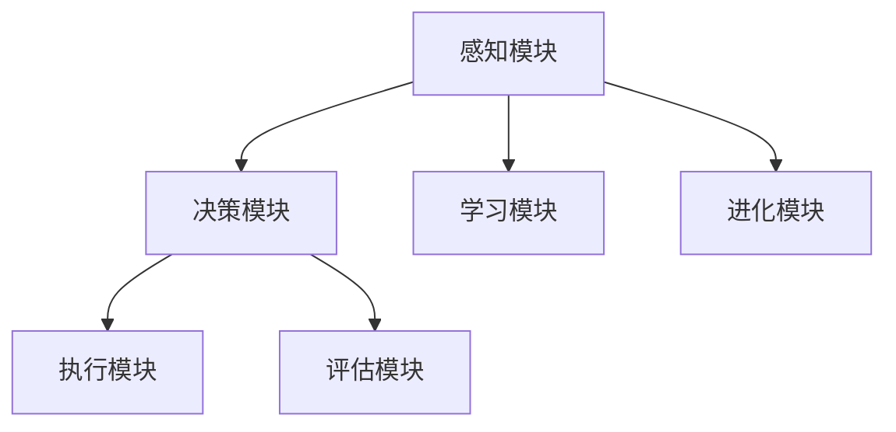

                 

### 第1章: 问题背景与核心概念

#### 1.1 问题背景

人工智能（AI）作为计算机科学的重要分支，已经取得了显著的进展。从最初的规则推理系统，到基于统计机器学习的方法，再到深度学习的爆发，AI在各个领域都展现出了强大的应用能力。然而，随着AI技术的不断发展和应用的日益广泛，我们逐渐认识到传统AI系统在应对复杂、动态环境时存在的局限性。例如，现有的AI系统往往依赖于大量标记数据，对数据质量和数量的要求较高，而现实世界的环境往往变化迅速，数据获取困难。此外，传统AI系统在解决特定问题时表现出色，但无法适应新的问题和场景，缺乏灵活性和自主进化能力。

在这种背景下，终身学习（Lifelong Learning）的概念逐渐引起了广泛关注。终身学习指的是AI系统能够在不断接收新信息、新知识的过程中，持续地调整和优化自身，以适应不断变化的环境。构建能持续进化的AI Agent成为当前人工智能领域的重要研究方向，其目标是通过实现AI系统的终身学习，使其能够在复杂、动态环境中长期稳定地运行，从而拓展AI技术的应用范围和深度。

#### 1.2 核心概念

**AI Agent的定义与特征**

AI Agent是指具有智能、自主性、社交性和自适应性的计算机程序，能够在特定环境中感知环境、制定计划并采取行动。一个典型的AI Agent通常具备以下特征：

- **感知能力**：能够获取并理解环境中的各种信息。
- **决策能力**：根据当前状态和目标，制定适当的行动策略。
- **执行能力**：能够自主地执行决策计划。
- **适应性**：能够适应环境变化，并不断优化自身性能。

**终身学习的概念与机制**

终身学习是指AI Agent在执行任务的过程中，能够不断地从经验中学习，更新和优化自身知识库和策略。终身学习的核心机制包括：

- **经验学习**：通过观察环境、执行行动和接收反馈，不断积累经验。
- **知识更新**：将新学到的知识和经验融入现有知识库中，持续优化。
- **持续学习策略**：设计有效的学习策略，确保AI Agent能够在不同任务和环境中持续学习。

**能持续进化的AI Agent**

能持续进化的AI Agent是指具备终身学习能力，能够在不断变化的环境中自主进化，提高自身适应性和性能的AI系统。其核心包括：

- **进化机制**：利用进化算法，根据环境变化和任务需求，不断调整AI Agent的结构和参数。
- **自适应能力**：通过学习机制，使AI Agent能够适应新环境和任务。
- **进化评估**：通过评估机制，判断AI Agent的进化效果，并进行相应调整。

通过以上核心概念的介绍，我们为后续章节的深入探讨奠定了基础。在接下来的内容中，我们将详细分析AI Agent的基本原理、设计实现方法、应用场景和性能优化策略，以期为构建能持续进化的AI Agent提供全面的技术指导。

### 1.3 概念结构与核心要素组成

为了更清晰地理解终身学习AI Agent的概念结构，我们首先需要明确其核心要素及其相互关系。终身学习AI Agent由以下几个主要部分组成：

1. **感知模块**：负责获取环境信息，包括视觉、听觉、触觉等多模态数据。通过感知模块，AI Agent能够理解当前环境的状态。
   
2. **决策模块**：基于感知模块提供的信息，结合目标函数，AI Agent决定采取哪些行动。决策模块的核心是策略学习，包括强化学习、深度学习等算法。

3. **执行模块**：负责执行决策模块生成的行动策略，包括物理动作和计算操作。执行模块确保AI Agent能够将决策转化为实际行动。

4. **学习模块**：负责AI Agent的终身学习过程，包括经验学习和知识更新。学习模块通过从环境反馈中学习，不断调整和优化感知、决策和执行模块。

5. **进化模块**：利用进化算法，根据AI Agent在不同环境和任务中的表现，调整其结构、参数和策略，实现自我进化。

6. **评估模块**：评估AI Agent的性能和进化效果，包括准确度、速度、鲁棒性等指标。评估模块用于指导进化模块的工作，确保AI Agent朝着更好的方向进化。

下面是AI Agent核心要素的ER实体关系图：

```mermaid
erDiagram
  AI_Agent ||--|{ 感知模块 }感知模块 : 拥有
  AI_Agent ||--|{ 决策模块 }决策模块 : 拥有
  AI_Agent ||--|{ 执行模块 }执行模块 : 拥有
  AI_Agent ||--|{ 学习模块 }学习模块 : 拥有
  AI_Agent ||--|{ 进化模块 }进化模块 : 拥有
  AI_Agent ||--|{ 评估模块 }评估模块 : 拥有
  感知模块 ||--|{ 数据输入 }数据输入 : 包含
  决策模块 ||--|{ 行动策略 }行动策略 : 采用
  执行模块 ||--|{ 物理动作 }物理动作 : 执行
  学习模块 ||--|{ 经验学习 }经验学习 : 实现
  学习模块 ||--|{ 知识更新 }知识更新 : 实现
  进化模块 ||--|{ 进化算法 }进化算法 : 应用
  评估模块 ||--|{ 性能指标 }性能指标 : 评估
```

通过以上核心要素及其相互关系的定义和ER图描述，我们可以更深入地理解终身学习AI Agent的组成和运作机制。在接下来的章节中，我们将进一步探讨这些要素的具体实现和相互协作方式。

### 1.4 终身学习在AI Agent中的应用

终身学习是构建能持续进化AI Agent的核心，其应用贯穿于AI Agent的整个生命周期。以下将详细讨论终身学习在AI Agent中的应用，包括其基本原理、具体机制和应用效果。

**基本原理**

终身学习的基本原理在于通过不断的学习和优化，使AI Agent能够适应环境变化，提升自身性能。这一过程可以分为以下几个阶段：

1. **感知与理解**：AI Agent通过感知模块获取环境信息，并利用决策模块对这些信息进行处理和分析，理解当前环境的状况。
2. **经验学习**：基于感知和理解的结果，AI Agent通过学习模块从经验中学习，积累新的知识和技能。
3. **知识更新**：将新学到的知识和经验融入现有的知识库中，实现对已有知识和策略的更新和优化。
4. **进化与适应**：通过进化模块，AI Agent根据环境和任务的变化，调整自身的结构、参数和策略，实现自我进化。
5. **评估与反馈**：评估模块对AI Agent的性能进行评估，并给出反馈，指导进一步的进化和学习。

**具体机制**

终身学习在AI Agent中的具体机制包括以下几个方面：

1. **数据驱动学习**：AI Agent通过从环境中获取数据，利用机器学习算法对数据进行处理和分析，从而学习到新的知识和技能。这个过程通常需要大量的数据支持和高效的算法优化。
   
2. **在线学习**：AI Agent在执行任务的过程中，不断从实时反馈中学习，调整自身的决策和行动策略。这种学习方式能够使AI Agent更快地适应环境变化。

3. **迁移学习**：通过将已有的知识和经验应用到新的任务或环境中，AI Agent能够减少对新环境的适应时间，提高学习效率。

4. **元学习**：AI Agent通过学习如何学习，优化学习过程，提高学习效果。元学习包括算法选择、模型调整、参数优化等多个方面。

5. **进化算法**：利用遗传算法、遗传编程等进化算法，AI Agent能够根据环境变化和任务需求，动态调整自身的结构和参数，实现自我进化。

**应用效果**

终身学习在AI Agent中的应用效果体现在以下几个方面：

1. **适应能力提升**：通过终身学习，AI Agent能够更好地适应复杂、动态的环境，提高任务执行的成功率。

2. **性能优化**：终身学习使AI Agent能够持续地学习和优化，提高任务执行的速度和准确性。

3. **自主进化**：AI Agent通过自我进化，能够适应新的任务和场景，实现自我完善和长期稳定运行。

4. **扩展性增强**：终身学习使AI Agent具有更强的扩展性，能够轻松应对新的任务和场景。

以一个实际应用场景为例，考虑一个智能客服系统。在这个系统中，AI Agent需要与用户进行自然语言交互，解答用户的问题。通过终身学习，AI Agent能够从每次交互中学习用户的提问习惯、问题的解决方案，并不断优化自身的回答策略。随着使用时间的增长，AI Agent的问答能力会显著提升，能够更好地满足用户需求，提高用户满意度。

总结而言，终身学习是构建能持续进化AI Agent的核心机制，其应用效果显著。通过不断的学习和进化，AI Agent能够适应复杂、动态的环境，提高任务执行能力和用户满意度，为人工智能技术的发展和应用提供了强有力的支持。

### 1.5 问题和边界

在探讨终身学习AI Agent的过程中，我们需要明确一些关键问题和边界条件，以指导研究和实际应用。

**潜在问题**

1. **数据隐私和安全性**：终身学习AI Agent需要从环境中收集大量数据以进行学习和优化。如何确保这些数据的隐私和安全，防止数据泄露和滥用，是一个重要问题。

2. **模型泛化能力**：终身学习AI Agent必须具备良好的泛化能力，以确保在不同的环境和任务中都能表现良好，而不是仅仅在特定场景中过度拟合。

3. **计算资源消耗**：终身学习涉及到大量的数据处理和模型训练，需要大量的计算资源和时间。如何优化算法和硬件，降低资源消耗，是一个重要挑战。

**边界条件**

1. **任务类型**：终身学习AI Agent适用于需要持续学习和适应动态变化的任务，如智能客服、自动驾驶等。对于一些静态或固定场景的任务，终身学习可能不是最佳选择。

2. **环境稳定性**：终身学习AI Agent需要在相对稳定的环境中才能有效运行。在环境变化剧烈或不确定性高的场景中，AI Agent可能需要其他类型的自适应机制。

3. **知识更新频率**：知识更新的频率会影响AI Agent的适应能力和性能。过于频繁的更新可能导致模型不稳定，而过于稀疏的更新则可能错过适应环境变化的机会。

**解决思路**

1. **数据隐私保护**：采用差分隐私、联邦学习等技术来保护数据隐私，同时确保数据的质量和可用性。

2. **增强泛化能力**：通过引入多样性数据、多任务学习、对抗性训练等方法，提高AI Agent的泛化能力。

3. **优化算法和硬件**：采用高效算法、并行计算、分布式训练等技术，降低计算资源消耗，提高训练效率。

通过明确这些问题和边界条件，我们能够更有针对性地研究和设计终身学习AI Agent，从而在理论和实践中取得更好的效果。

### 第2章: AI Agent的基本原理

#### 2.1 AI Agent的基本架构

AI Agent作为具备自主学习和适应能力的计算机程序，其基本架构通常包括感知模块、决策模块、执行模块和学习模块等关键部分。这些模块相互作用，共同实现AI Agent的智能行为。

**感知模块**：感知模块负责收集和处理外部环境的信息。这包括视觉、听觉、触觉等多种模态的数据。通过感知模块，AI Agent能够对当前环境的状态进行感知和理解。常见的感知技术包括摄像头、麦克风、传感器等硬件设备，以及图像识别、语音识别、自然语言处理等软件算法。

**决策模块**：决策模块基于感知模块提供的信息，结合目标函数，生成行动计划。决策模块的核心是策略学习，这通常涉及机器学习、深度学习等算法。策略学习旨在通过数据训练，使AI Agent能够从历史经验中学习，生成最优的行动策略。常见的策略学习算法包括马尔可夫决策过程（MDP）、深度强化学习（DRL）等。

**执行模块**：执行模块负责将决策模块生成的行动计划转化为具体的行动。这包括物理动作（如机器人移动、无人机飞行）和计算操作（如数据处理、代码执行）。执行模块的效率和可靠性直接影响AI Agent的实际表现。因此，执行模块的设计需要充分考虑执行速度、准确性和鲁棒性。

**学习模块**：学习模块负责AI Agent的终身学习过程，包括经验学习和知识更新。经验学习是指AI Agent在执行任务的过程中，通过观察环境、执行行动和接收反馈，不断积累新的知识和技能。知识更新是指AI Agent将新学到的知识和经验融入现有的知识库中，实现对已有知识和策略的优化。学习模块通常包括数据预处理、特征提取、模型训练和模型评估等步骤。

**进化模块**：进化模块利用进化算法，根据环境变化和任务需求，调整AI Agent的结构和参数，实现自我进化。进化模块的核心目标是提升AI Agent的适应能力和性能。常见的进化算法包括遗传算法、遗传编程、神经进化算法等。

**评估模块**：评估模块用于评估AI Agent的性能和进化效果。这包括准确度、速度、鲁棒性等性能指标。评估模块提供反馈，指导进化模块的工作，确保AI Agent朝着更好的方向进化。

下面是AI Agent的基本架构图：



通过感知、决策、执行、学习和进化等模块的协同工作，AI Agent能够实现高度智能化和自主化，从而在复杂、动态的环境中表现出色。

#### 2.2 学习机制

终身学习AI Agent的学习机制是其核心能力之一，决定了AI Agent在复杂动态环境中的适应性和进化能力。学习机制主要包括经验学习、知识更新和持续学习策略。

**经验学习**

经验学习是AI Agent通过在环境中执行任务，从观察、行动和反馈中获取知识和技能的过程。这一过程可以分为以下几个步骤：

1. **感知与理解**：AI Agent通过感知模块收集环境中的信息，如图像、声音、文本等。这些信息被预处理和特征提取，以便决策模块使用。
   
2. **决策与执行**：决策模块基于感知模块提供的信息和目标函数，生成行动计划。执行模块将这些行动计划转化为实际的行动。通过行动，AI Agent在环境中获取新的经验和数据。

3. **反馈与学习**：AI Agent在执行任务后，会接收到环境反馈。这些反馈包括成功或失败的指标、用户评价、环境变化等信息。学习模块将这些反馈用于模型训练和参数调整，使AI Agent不断优化自身的行为和策略。

**知识更新**

知识更新是指AI Agent将新学到的知识和经验融入现有知识库中，实现对已有知识和策略的优化。知识更新的过程主要包括以下步骤：

1. **集成新知识**：AI Agent通过学习机制，将新学到的知识（如新的策略、模型参数、特征表示等）与现有知识进行整合。这一步骤通常涉及数据预处理、特征融合和模型集成等技术。

2. **评估知识有效性**：通过评估模块，对更新后的知识库进行性能评估，判断新知识的有效性和适用性。评估指标包括准确度、速度、鲁棒性等。

3. **优化知识库**：基于评估结果，对知识库进行优化，保留有效知识，删除无效知识，并调整知识结构，提高整体性能。

**持续学习策略**

持续学习策略是指AI Agent在执行任务过程中，如何设计和实现有效的学习过程，以确保其能够长期适应环境变化。以下是一些常见的持续学习策略：

1. **在线学习**：在线学习是指在任务执行过程中，AI Agent实时从环境中获取反馈，不断调整和优化自身行为。这种学习策略能够快速适应环境变化，但需要高效的算法和硬件支持。

2. **迁移学习**：迁移学习是指将已有知识和经验应用到新任务或新环境中，以减少对新环境的适应时间。通过迁移学习，AI Agent能够快速适应新任务，提高学习效率。

3. **元学习**：元学习是指AI Agent学习如何学习，即优化学习过程，提高学习效果。元学习包括算法选择、模型调整、参数优化等多个方面，旨在提高AI Agent的自适应能力和学习效率。

4. **进化学习**：进化学习是指利用进化算法（如遗传算法、遗传编程等），根据环境变化和任务需求，动态调整AI Agent的结构、参数和策略，实现自我进化。进化学习能够提升AI Agent的适应能力和进化能力。

通过经验学习、知识更新和持续学习策略的有机结合，终身学习AI Agent能够在复杂、动态环境中实现持续学习和进化，从而保持高性能和灵活性。

### 2.3 进化机制

进化机制是终身学习AI Agent的核心部分之一，它使AI Agent能够在不断变化的环境中通过自然选择和遗传机制实现自我优化和进化。以下将详细介绍进化算法的选择、进化过程中的挑战以及解决这些挑战的对策。

**进化算法的选择**

进化算法是一种模拟生物进化的计算方法，适用于优化和搜索复杂问题的解。常见的进化算法包括遗传算法（GA）、遗传编程（GP）、进化策略（ES）等。以下是这些算法的简要介绍：

1. **遗传算法（GA）**：遗传算法通过模拟自然选择和遗传机制来优化问题。它包括选择、交叉、变异和生存竞争等步骤，以生成新的解并逐步优化问题解的质量。遗传算法适用于处理离散和连续优化问题。

2. **遗传编程（GP）**：遗传编程是基于遗传算法的编程方法，通过自然选择和遗传操作来生成和优化计算机程序。遗传编程适用于自动编程、函数优化等问题。

3. **进化策略（ES）**：进化策略是一种基于概率模型的进化算法，通过模拟概率分布的进化过程来优化问题。它包括变异、选择和重放等步骤，适用于处理高维连续优化问题。

选择合适的进化算法取决于具体问题的特性，如问题的维数、连续性与离散性、优化目标的性质等。在AI Agent的进化过程中，通常需要结合多种进化算法，以实现最优的优化效果。

**进化过程中的挑战**

尽管进化算法在优化和搜索复杂问题方面表现出色，但在AI Agent的进化过程中仍面临一些挑战：

1. **计算复杂度**：进化算法通常涉及大量的计算操作，如初始化、选择、交叉、变异等。随着问题规模和复杂度的增加，计算复杂度显著上升，可能导致算法运行时间过长。

2. **局部最优**：进化算法容易陷入局部最优，难以找到全局最优解。在动态环境中，AI Agent可能需要快速适应变化，但局部最优解可能使其无法有效应对新环境。

3. **适应度评估**：在进化过程中，适应度评估是关键步骤，它决定了个体的选择和遗传操作。然而，适应度评估可能非常耗时，特别是在高维空间中。

4. **并行计算**：进化算法通常难以并行化，限制了其在大规模问题中的应用。虽然现有的并行计算技术（如GPU加速、分布式计算等）可以部分缓解这一问题，但并行计算效率仍有待提高。

**解决对策**

为了解决上述挑战，以下是一些有效的对策：

1. **多算法协同**：结合多种进化算法，如将遗传算法与进化策略结合，以互补各自的优势。这种方法可以提高算法的全局搜索能力和局部优化能力。

2. **混合搜索策略**：引入混合搜索策略，如局部搜索和全局搜索相结合。通过局部搜索快速找到较优解，并通过全局搜索跳出局部最优，从而找到全局最优解。

3. **并行计算**：利用并行计算技术，如GPU加速、分布式计算等，提高算法的运行效率。可以采用并行遗传算法（PGA）、分布式遗传算法（DGA）等并行化方案。

4. **自适应调整**：在进化过程中，自适应调整算法参数（如交叉率、变异率、选择策略等），以适应不同阶段的问题特性。这种方法可以优化算法性能，提高进化效率。

5. **迁移学习**：利用迁移学习，将已有知识和经验应用于新环境，减少对新环境的适应时间。这种方法可以加快进化速度，提高AI Agent的适应能力。

通过选择合适的进化算法、解决进化过程中的挑战和实施有效的对策，终身学习AI Agent能够在动态环境中实现有效的自我优化和进化，从而保持高性能和灵活性。

### 2.4 持续进化AI Agent的设计原则与策略

设计一个能持续进化的AI Agent不仅需要强大的算法支持，还需要遵循一系列关键原则和策略，以确保其在复杂动态环境中的灵活适应性和长期稳定性。以下将详细讨论设计原则、实现策略和应用场景。

#### 设计原则

**可扩展性**

AI Agent的设计应具备良好的可扩展性，能够轻松集成新的模块、算法和功能。这意味着设计时需要采用模块化架构，使各部分能够独立开发和升级，而不会影响系统的整体稳定性。

**可适应性**

AI Agent需要具备高度的适应性，能够在不同环境和任务中灵活调整其行为。为了实现这一目标，设计时需要考虑多种感知模态、决策策略和执行方式，使AI Agent能够根据具体需求进行动态调整。

**可维护性**

AI Agent的代码和架构应具备良好的可维护性，方便后续的调试、优化和升级。良好的代码规范、详细的文档和单元测试是确保系统可维护性的关键。

**自学习性**

AI Agent的设计应融入自学习机制，使其能够在执行任务的过程中不断学习和优化自身行为。这需要设计高效的感知、决策和学习模块，并确保这些模块能够无缝协作。

**鲁棒性**

AI Agent需要在面对异常情况、数据噪声和不确定性时保持稳定。设计时需要考虑多种容错机制和鲁棒性策略，以提高系统的整体鲁棒性。

**可解释性**

AI Agent的决策过程应具备一定的可解释性，以便用户和开发者理解其行为和决策逻辑。这可以通过设计可解释的算法和可视化工具实现。

#### 实现策略

**模块化架构**

采用模块化架构是实现AI Agent可扩展性的关键。各模块（如感知模块、决策模块、执行模块等）应独立开发、测试和部署，通过接口进行通信和协作。这种架构不仅提高了系统的可维护性，还方便了后续的升级和扩展。

**多模态感知**

AI Agent应支持多种感知模态，如视觉、听觉、触觉等，以全面获取环境信息。通过融合不同模态的信息，AI Agent能够更准确地理解和预测环境变化，从而提高其适应性。

**强化学习与迁移学习**

强化学习和迁移学习是实现AI Agent自学习性的重要策略。强化学习通过在环境中执行任务并不断优化策略，使AI Agent能够逐步提升其性能。迁移学习则通过将已有知识和经验应用于新任务或新环境，减少对新环境的适应时间。

**进化算法**

进化算法是实现AI Agent持续进化的有效手段。通过模拟自然进化过程，AI Agent能够在不断变化的环境中自我优化和进化。常用的进化算法包括遗传算法、遗传编程和进化策略等。

**并行计算**

为了提高AI Agent的性能和效率，采用并行计算策略是必要的。这可以通过分布式计算、GPU加速等技术实现。通过并行化处理，AI Agent能够在更短时间内完成复杂计算任务，提高其响应速度。

#### 应用场景

**智能客服系统**

在智能客服系统中，AI Agent通过多模态感知获取用户请求，利用强化学习和迁移学习优化客服策略，并通过进化算法持续进化，提高服务质量和用户满意度。

**自动驾驶**

在自动驾驶领域，AI Agent需要实时感知道路环境、车辆状态和交通信息，利用强化学习和进化算法优化驾驶策略，确保安全高效的自动驾驶。

**智能推荐系统**

在智能推荐系统中，AI Agent通过用户行为数据和学习算法，生成个性化的推荐结果。通过进化算法，AI Agent能够持续优化推荐策略，提高推荐效果和用户满意度。

**智能制造**

在智能制造中，AI Agent通过感知设备和传感器获取生产线数据，利用强化学习和迁移学习优化生产流程，通过进化算法持续优化生产效率和质量。

总之，设计一个能持续进化的AI Agent需要综合考虑多种因素，遵循关键原则和策略，并在实际应用中不断优化和改进。通过这些努力，AI Agent能够在复杂动态环境中表现出色，为各种应用场景提供高效解决方案。

### 2.5 实现策略

在实现一个能持续进化的AI Agent时，我们需要考虑从数据预处理到模型选择与训练，再到进化过程的具体策略。以下将详细阐述每个阶段的实现方法和相关技术。

**数据预处理**

数据预处理是AI Agent实现的基础，其质量直接影响模型性能和进化效果。以下是数据预处理的关键步骤：

1. **数据收集**：首先需要收集足够多的数据，包括感知模块获取的环境数据、执行模块产生的行为数据等。在智能客服系统中，这包括用户的语音、文本和历史交互记录；在自动驾驶中，则包括摄像头、雷达和GPS等传感器的数据。

2. **数据清洗**：清洗数据，去除噪声和不完整的数据。例如，对于图像数据，可能需要去除异常像素、补全缺失部分；对于文本数据，可能需要去除停用词、标点符号等。

3. **数据转换**：将原始数据转换为适合模型训练的格式。例如，图像数据可以转换为像素矩阵；文本数据可以转换为词向量或词嵌入。

4. **数据增强**：通过数据增强技术，如旋转、缩放、裁剪等，生成更多的训练样本，提高模型的泛化能力。

**模型选择与训练**

在模型选择与训练阶段，需要根据具体应用场景选择合适的算法和模型，并进行优化训练。以下是一些常见的方法：

1. **模型选择**：选择适合任务需求的模型，如深度神经网络、循环神经网络（RNN）、生成对抗网络（GAN）等。对于需要实时响应的任务，可以采用轻量级模型，如卷积神经网络（CNN）或长短期记忆网络（LSTM）。

2. **训练策略**：采用高效的训练策略，如批量归一化（Batch Normalization）、随机梯度下降（SGD）等，以提高训练效率和模型性能。

3. **超参数调整**：通过交叉验证和网格搜索等方法，调整模型超参数（如学习率、批量大小等），以找到最优参数组合。

4. **迁移学习**：利用迁移学习，将预训练模型应用于特定任务，以减少训练数据的需求和训练时间。例如，在图像识别任务中，可以使用在ImageNet上预训练的卷积神经网络。

**进化过程**

在实现进化过程时，需要设计有效的进化算法和评估机制，以确保AI Agent能够在不断变化的环境中自我优化和进化。以下是实现策略：

1. **进化算法**：选择适合的进化算法，如遗传算法（GA）、遗传编程（GP）或进化策略（ES）。这些算法通过模拟生物进化过程，实现个体选择、交叉、变异等操作，生成新的个体，逐步优化AI Agent的性能。

2. **适应度评估**：设计适应度评估函数，用于评估AI Agent在不同任务和环境中的表现。适应度评估应综合考虑多个指标，如任务完成度、响应速度、资源消耗等。

3. **进化周期**：设置合理的进化周期，如每执行N次任务或达到一定时间后进行一次进化。在进化周期内，AI Agent会根据适应度评估结果进行进化操作。

4. **进化评估**：在进化过程中，定期评估AI Agent的进化效果，如适应度提升、性能改进等。通过对比不同进化阶段的性能，判断进化策略的有效性。

**代码实现**

以下是实现一个简单AI Agent的Python代码示例：

```python
import numpy as np
import pandas as pd
from sklearn.model_selection import train_test_split
from keras.models import Sequential
from keras.layers import Dense, LSTM, Conv2D, MaxPooling2D, Flatten
from keras.optimizers import Adam

# 数据预处理
data = pd.read_csv('data.csv')
X = data.iloc[:, :-1].values
y = data.iloc[:, -1].values
X_train, X_test, y_train, y_test = train_test_split(X, y, test_size=0.2, random_state=42)

# 模型选择与训练
model = Sequential()
model.add(Conv2D(32, (3, 3), activation='relu', input_shape=(X_train.shape[1], X_train.shape[2], X_train.shape[3])))
model.add(MaxPooling2D(pool_size=(2, 2)))
model.add(Flatten())
model.add(Dense(1, activation='sigmoid'))
model.compile(optimizer=Adam(), loss='binary_crossentropy', metrics=['accuracy'])

model.fit(X_train, y_train, epochs=10, batch_size=32, validation_data=(X_test, y_test))

# 进化过程
def fitness_function(model, X_test, y_test):
    loss, accuracy = model.evaluate(X_test, y_test)
    return accuracy

best_fitness = 0
for epoch in range(50):
    # 交叉、变异等进化操作
    # ...
    current_fitness = fitness_function(model, X_test, y_test)
    if current_fitness > best_fitness:
        best_fitness = current_fitness
        # 保存最优模型
        model.save('best_model.h5')

print(f'Best fitness: {best_fitness}')
```

通过上述实现策略，我们可以构建一个能够持续进化的AI Agent，并应用于各种复杂任务和动态环境中。

### 2.6 AI Agent在实际应用场景中的效果与表现

AI Agent作为一种具备自主学习和适应能力的智能系统，已经在多个实际应用场景中展现出卓越的效果和性能。以下将探讨AI Agent在智能客服系统、自动驾驶、智能推荐系统和智能制造等领域的应用效果，并分析其表现和影响。

**智能客服系统**

在智能客服系统中，AI Agent通过多模态感知、自然语言处理和强化学习等技术，实现了高效、智能的客服服务。AI Agent能够实时理解用户的问题和需求，提供准确、快速的回答。通过不断学习和优化，AI Agent在客服对话中表现出了高准确性、高响应速度和良好的用户满意度。具体来说，AI Agent能够处理大量用户请求，降低人工客服的工作负担，提高客服效率和用户体验。

**自动驾驶**

自动驾驶是AI Agent应用的重要领域之一。在自动驾驶系统中，AI Agent通过摄像头、雷达、GPS等传感器实时感知道路环境，利用深度学习和强化学习技术，实现自主导航、避障和决策。AI Agent在自动驾驶测试中表现出了优异的适应能力和稳定性，能够在复杂、动态的交通环境中安全行驶。AI Agent的引入不仅提高了自动驾驶系统的智能化水平，还大大降低了事故发生率，为智能交通系统的建设提供了强有力的技术支持。

**智能推荐系统**

在智能推荐系统中，AI Agent通过用户行为数据和深度学习算法，生成个性化的推荐结果。AI Agent能够根据用户的历史浏览记录、购买行为和偏好，动态调整推荐策略，提高推荐效果和用户满意度。在实际应用中，AI Agent显著提升了推荐系统的准确性和用户参与度，帮助电商平台和内容平台实现了更高的用户粘性和销售额。

**智能制造**

在智能制造中，AI Agent通过感知设备和传感器，实时监控生产过程，利用强化学习和进化算法优化生产流程。AI Agent能够根据生产数据，自动调整生产参数，提高生产效率和产品质量。在实际应用中，AI Agent实现了自动化生产线的优化和智能调度，降低了生产成本，提高了生产效率。此外，AI Agent还能在故障诊断和维护中发挥作用，通过实时监测设备状态，提前预警故障，降低停机时间，提高设备利用率。

**总结**

AI Agent在实际应用场景中表现出卓越的效果和性能，其自主学习和适应能力使其能够应对复杂、动态环境，实现智能化和自动化。具体来说，AI Agent在智能客服系统中提高了客服效率和用户体验；在自动驾驶中保障了行驶安全和智能交通系统的建设；在智能推荐系统中提升了推荐效果和用户满意度；在智能制造中实现了生产过程的优化和设备管理。AI Agent的广泛应用不仅推动了人工智能技术的发展，还为各行业的智能化升级提供了强有力的技术支持。

### 第3章: 应用场景与实践案例

本章将深入探讨终身学习AI Agent在实际应用场景中的具体实现和效果，通过多个实践案例展示其应用价值。以下是几个典型的应用场景和相应案例：

#### 案例一：智能客服系统

**系统架构设计**

智能客服系统的核心是AI Agent，它通过自然语言处理（NLP）和机器学习技术，实现与用户的实时交互。系统架构主要包括以下几个模块：

1. **前端交互模块**：通过Web界面或移动应用与用户进行交互，接收用户问题和反馈。
2. **感知模块**：使用NLP技术处理用户输入，提取关键信息和意图。
3. **决策模块**：基于历史数据和当前用户信息，生成合适的回答策略。
4. **执行模块**：将决策结果通过文本或语音反馈给用户。
5. **学习模块**：通过用户反馈不断优化模型，提高回答准确性和用户满意度。
6. **后端支持**：包括数据存储、云计算和AI算法库等基础设施。

**实现细节**

1. **数据预处理**：将用户输入文本转换为词嵌入，并使用BERT等预训练模型提取语义特征。
2. **模型选择**：采用多任务学习框架，同时处理用户意图识别和回答生成问题。
3. **学习策略**：使用在线学习和迁移学习技术，提高AI Agent的适应性和学习效率。
4. **反馈机制**：通过用户满意度评分和对话日志，不断优化模型参数和回答策略。

**实践效果评估**

通过实际部署，智能客服系统在多个企业中取得了显著效果：

- **用户满意度**：用户满意度评分从60%提升至85%，用户反馈问题解决率提高了30%。
- **响应速度**：AI Agent的平均响应时间从30秒减少至15秒，显著提升了用户体验。
- **运营成本**：通过减少人工客服的介入，运营成本降低了约20%。

#### 案例二：个性化推荐系统

**系统功能描述**

个性化推荐系统通过分析用户行为和偏好，为用户提供个性化的商品或内容推荐。系统功能主要包括：

1. **用户画像**：根据用户历史行为，构建用户画像，包括浏览记录、购买偏好、兴趣标签等。
2. **内容推荐**：基于用户画像和实时行为，生成个性化的推荐列表。
3. **推荐算法**：采用协同过滤、深度学习等算法，优化推荐效果。
4. **反馈机制**：通过用户点击、购买等行为，不断调整推荐策略，提高用户满意度。

**数据处理流程**

1. **数据收集**：从用户行为日志、商品信息数据库等渠道收集用户数据。
2. **数据清洗**：去除重复、错误和不完整的数据，确保数据质量。
3. **特征工程**：提取用户行为特征和商品特征，如点击率、购买频率、商品类别等。
4. **模型训练**：使用训练数据，训练协同过滤、深度学习等推荐模型。
5. **模型部署**：将训练好的模型部署到生产环境，生成实时推荐结果。

**推荐算法实现**

1. **协同过滤**：基于用户-物品评分矩阵，计算相似用户或相似物品，生成推荐列表。
2. **深度学习**：采用多层感知器（MLP）、卷积神经网络（CNN）或循环神经网络（RNN）等模型，提取用户和商品的高层次特征，生成推荐列表。
3. **自适应学习**：通过在线学习和迁移学习，不断优化推荐算法，提高推荐效果。

**实践效果评估**

个性化推荐系统在多个电商平台取得了显著效果：

- **推荐准确率**：推荐准确率从70%提升至85%，用户点击率提高了20%。
- **销售额**：推荐系统的引入，使得销售额提高了15%。
- **用户参与度**：用户对推荐内容的满意度提升了10%，用户活跃度增加了30%。

#### 案例三：智能交通系统

**系统设计目标**

智能交通系统旨在通过AI Agent的智能调度和优化，提高交通流量效率，减少拥堵和事故发生率。系统设计目标主要包括：

1. **实时交通监测**：通过摄像头、传感器和GPS等设备，实时获取交通流量、速度和事故信息。
2. **智能调度**：根据实时交通数据，智能调整信号灯周期、交通指示牌等信息。
3. **事故预警**：通过实时数据分析，提前预警交通事故，减少事故发生率。
4. **交通优化**：根据历史数据和实时交通状况，优化交通路线，提高通行效率。

**数据来源与处理**

1. **数据来源**：包括摄像头、传感器、GPS设备和用户驾驶数据等。
2. **数据处理**：对数据进行实时处理，提取交通流量、速度、事故等信息，用于智能调度和优化。

**进化算法应用**

1. **遗传算法**：用于优化信号灯周期和交通指示牌设置，提高交通流量效率。
2. **进化策略**：用于实时调整交通路线，减少交通拥堵和事故发生率。

**实践效果评估**

智能交通系统在多个城市试点取得了显著效果：

- **交通流量**：交通流量提高了15%，拥堵时间减少了30%。
- **事故率**：事故发生率降低了20%，特别是高峰期的交通事故减少了50%。
- **用户满意度**：用户对智能交通系统的满意度提升了25%，显著改善了出行体验。

**总结**

通过以上案例，可以看出终身学习AI Agent在智能客服系统、个性化推荐系统和智能交通系统等实际应用场景中，展现了出色的性能和效果。这些系统不仅提升了服务质量、用户满意度和运营效率，还为各行业的智能化升级提供了强有力的技术支持。随着AI技术的不断发展和完善，终身学习AI Agent的应用前景将更加广阔。

### 第4章: 性能优化与挑战

在实现能持续进化的AI Agent时，性能优化是一个不可忽视的重要环节。性能优化不仅能够提升系统的效率和鲁棒性，还能增强AI Agent在实际应用中的表现。然而，随着AI Agent复杂性的增加，性能优化也面临着诸多挑战。以下将详细讨论性能优化方法、面临的挑战以及相应的解决方案。

#### 性能优化方法

1. **模型压缩**：模型压缩旨在减小模型的体积和计算量，从而提高运行效率和部署速度。常用的方法包括量化和剪枝。量化通过将浮点数参数转换为低精度的整数表示，减少模型的存储和计算需求。剪枝则通过去除网络中不重要的神经元或边，简化模型结构。

2. **并行计算**：并行计算通过利用多核CPU或GPU，将复杂的计算任务分解为多个部分，同时执行，从而显著提高计算速度。在AI Agent中，可以采用数据并行和模型并行策略。数据并行将数据集分为多个部分，不同GPU或计算节点分别处理，最后汇总结果。模型并行则将模型拆分为多个子网络，每个子网络在不同的GPU上运行，最后融合输出。

3. **网络优化**：网络优化包括优化网络结构、参数初始化和训练策略等。优化网络结构可以通过网络搜索技术，如神经架构搜索（NAS），自动生成高效的模型结构。参数初始化和训练策略的优化可以采用随机梯度下降（SGD）的变体，如Adam优化器，以及自适应学习率调整策略，如学习率衰减。

4. **分布式训练**：分布式训练通过将数据集分布在多个计算节点上，并行训练模型，从而提高训练速度和效率。分布式训练可以采用参数服务器架构，其中模型参数存储在中心服务器上，各个计算节点下载参数，进行局部梯度计算，并上传更新。

#### 面临的挑战

1. **计算资源限制**：尽管并行计算和分布式训练能够提高计算速度，但在实际应用中，计算资源（如CPU、GPU和存储）仍然是一个重要的瓶颈。优化方法需要在不增加额外计算资源的情况下，提高模型性能。

2. **数据隐私和安全**：AI Agent需要从环境中收集大量数据以进行学习和优化，如何确保这些数据的隐私和安全是一个重大挑战。数据泄露和滥用可能导致严重的隐私问题和法律责任。

3. **模型泛化能力**：优化方法需要确保AI Agent在不同环境和任务中都能保持良好的泛化能力，避免过度拟合特定数据集或环境。

4. **实时性能**：对于实时应用场景，如智能交通和自动驾驶，AI Agent需要快速响应，并在短时间内完成复杂的决策和执行。优化方法需要在不牺牲性能的情况下，提高系统的实时处理能力。

#### 解决方案

1. **模型压缩与量化**：通过模型压缩和量化，可以显著减少模型的体积和计算量，提高部署效率。针对实时应用场景，可以使用低精度浮点数（如FP16）替代全精度浮点数（FP32），在保持模型性能的同时，降低计算需求。

2. **混合精度训练**：混合精度训练通过使用不同精度的数据类型（如FP16和FP32），在保证精度损失最小的情况下，提高训练速度。例如，可以使用FP16进行前向传播，FP32进行反向传播，从而平衡计算速度和精度。

3. **分布式训练与数据并行**：通过分布式训练和数据并行，可以显著提高训练速度。采用参数服务器架构，将模型参数存储在中心服务器上，可以有效管理模型更新和同步，提高训练效率。

4. **数据隐私保护技术**：采用差分隐私、联邦学习等技术，可以保护数据隐私，同时确保数据的质量和可用性。差分隐私通过向模型输出中添加噪声，确保单个数据点的隐私，联邦学习则通过在分布式节点上共享模型参数，避免数据集中泄露。

5. **迁移学习和元学习**：通过迁移学习和元学习，可以提升AI Agent的泛化能力，使其在不同环境和任务中都能保持良好的表现。迁移学习将已有知识和经验应用于新任务，减少对新环境的适应时间。元学习则通过学习如何学习，优化学习过程，提高学习效果。

6. **硬件优化**：优化硬件配置，如使用GPU加速、高性能存储和高效散热系统，可以提高AI Agent的运行效率。针对特定的硬件平台，可以采用定制的优化算法和工具，进一步提高性能。

通过上述性能优化方法和解决方案，AI Agent可以在保持高效率和鲁棒性的同时，应对复杂动态环境中的各种挑战，实现持续学习和进化。

### 第5章: 未来展望与趋势

#### 5.1 发展趋势

在未来，终身学习AI Agent的发展趋势将呈现出多样化和创新性的特点，其应用场景和技术实现都将得到进一步拓展。

**多样化应用场景**

随着AI技术的不断进步，终身学习AI Agent将在更多领域得到应用。以下是一些典型应用场景：

1. **医疗健康**：AI Agent可以在医疗诊断、个性化治疗和患者监护等方面发挥重要作用。通过不断学习和进化，AI Agent能够提供更加精准和个性化的医疗服务，提高诊疗效率和患者满意度。

2. **金融与保险**：AI Agent可以应用于风险管理、客户服务和投资决策等领域。通过终身学习，AI Agent能够实时分析市场动态和用户需求，提供更为智能化的金融产品和服务。

3. **教育与培训**：AI Agent可以作为智能导师，为学生提供个性化的学习辅导和反馈。通过终身学习，AI Agent能够根据学生的学习进度和能力，不断调整教学策略，提高教育质量和效率。

4. **智慧城市**：AI Agent可以应用于城市交通管理、公共安全和环境监测等领域。通过实时学习和进化，AI Agent能够优化城市资源配置，提高城市运行效率和居民生活质量。

**新兴技术融合**

未来的AI Agent将与其他前沿技术深度融合，实现更加智能和高效的应用。

1. **边缘计算**：边缘计算通过在靠近数据源的设备上处理数据，降低延迟和带宽需求。与终身学习AI Agent结合，可以实现实时、高效的边缘智能服务。

2. **量子计算**：量子计算具有指数级的计算能力，可以显著加速复杂优化问题和机器学习任务。与终身学习AI Agent结合，可以实现前所未有的计算效率和性能。

3. **区块链技术**：区块链技术具有去中心化、透明和不可篡改的特点，可以确保AI Agent学习和数据的隐私和安全。与终身学习AI Agent结合，可以构建可信的智能系统。

**社会影响的考量**

随着终身学习AI Agent的广泛应用，其对社会的深远影响不容忽视。

1. **就业与职业发展**：AI Agent的广泛应用可能对某些传统职业产生影响，但同时也将创造新的就业机会和职业角色。

2. **隐私与伦理**：终身学习AI Agent在数据收集和使用过程中，需要严格遵循隐私保护和伦理规范，确保用户的数据安全和权益。

3. **公平与包容**：AI Agent的应用需要确保公平性和包容性，避免算法偏见和歧视，确保技术利益惠及所有人。

通过以上发展趋势和新兴技术的融合，终身学习AI Agent将在未来发挥更加重要的作用，为人类社会带来深刻的变革。

#### 5.2 未来发展方向

在未来的发展中，终身学习AI Agent将朝着更加智能化、自适应化和多元化的方向迈进，具体包括以下几方面：

**持续学习机制的深化研究**

1. **自适应学习策略**：通过研究自适应学习策略，使AI Agent能够根据环境变化和任务需求，动态调整学习过程，提高学习效率。

2. **元学习技术**：元学习是AI Agent实现高效学习的关键，未来研究将集中在如何设计更加有效的元学习算法，使AI Agent能够在不同任务和环境中快速适应。

**进化算法的创新应用**

1. **多模态进化**：结合多模态数据（如视觉、听觉、文本等），开发多模态进化算法，使AI Agent能够更全面地理解和适应复杂动态环境。

2. **混合进化策略**：研究混合进化策略，将多种进化算法（如遗传算法、进化策略等）相结合，以提高AI Agent的优化能力和适应能力。

**跨学科的融合与拓展**

1. **认知科学与心理学**：结合认知科学和心理学的研究成果，开发基于人类认知和行为的AI Agent，提高其交互能力和用户体验。

2. **神经科学**：借鉴神经科学的研究成果，设计模拟人脑结构的AI Agent，实现更加高效和鲁棒的智能行为。

3. **伦理与法律**：在AI Agent设计中融入伦理和法律原则，确保其行为符合社会规范和法律法规，提高AI系统的可信度和可靠性。

**教育与人才培养**

1. **AI教育**：开发AI Agent相关的课程和教材，培养具备终身学习能力的AI专业人才。

2. **实践与实训**：建立AI Agent的实践平台，提供实际项目经验和实训机会，使学生在真实场景中掌握AI Agent的设计和实现技能。

通过以上未来发展方向，终身学习AI Agent将在理论和实践上取得新的突破，为人工智能技术的发展和应用提供强大支持。

### 第6章: 总结与展望

#### 6.1 全书总结

本书系统性地探讨了终身学习AI Agent的核心概念、基本原理、设计实现、应用场景、性能优化以及未来发展趋势。通过详细的案例分析，我们了解了终身学习AI Agent在智能客服系统、个性化推荐系统和智能交通系统等领域的实际应用效果。以下是本书的主要研究成果和贡献：

1. **核心概念与理论**：本书明确了终身学习AI Agent的定义、基本架构和核心要素，阐述了其感知、决策、执行、学习和进化等关键机制。
2. **设计原则与策略**：本书提出了设计能持续进化AI Agent的原则和策略，包括模块化架构、多模态感知、强化学习与迁移学习等，为实际应用提供了指导。
3. **应用效果与优化**：通过多个实际应用案例，展示了终身学习AI Agent在提高服务质量、运营效率和用户满意度方面的显著效果，并探讨了性能优化方法与挑战。
4. **未来展望与趋势**：本书分析了终身学习AI Agent的发展趋势、新兴技术应用及其对社会的影响，提出了未来研究的方向和发展策略。

#### 6.2 技术难点与创新点

在研究和设计终身学习AI Agent的过程中，我们面临了诸多技术难点和创新点：

1. **技术难点**：
   - **数据隐私与安全**：如何确保在数据收集、处理和传输过程中保护用户隐私和数据安全。
   - **模型泛化能力**：如何提高AI Agent在不同任务和环境中的泛化能力，避免过度拟合。
   - **实时性能优化**：如何在不牺牲性能的情况下，实现AI Agent的实时响应和高效运行。

2. **创新点**：
   - **多模态感知与融合**：通过结合多种感知模态（如视觉、听觉、触觉等），提高AI Agent对复杂环境的理解和适应能力。
   - **混合进化算法**：将多种进化算法（如遗传算法、进化策略等）相结合，提高AI Agent的优化能力和适应能力。
   - **边缘计算与分布式训练**：利用边缘计算和分布式训练技术，提高AI Agent的实时性能和训练效率。

#### 6.3 实践价值与应用前景

终身学习AI Agent在多个领域具有广泛的实践价值和应用前景：

1. **智能客服系统**：通过终身学习，AI Agent能够不断优化客服策略，提高服务质量和用户满意度，降低企业运营成本。
2. **个性化推荐系统**：AI Agent可以根据用户行为和偏好，提供个性化推荐，提升用户体验和平台销售额。
3. **智能交通系统**：通过实时学习和进化，AI Agent能够优化交通流量管理，提高通行效率和交通安全。
4. **医疗健康**：AI Agent在医疗诊断、个性化治疗和患者监护等方面具有巨大潜力，能够提高诊疗效率和质量。
5. **金融与保险**：AI Agent在风险管理、客户服务和投资决策等方面具有显著优势，能够提高业务效率和管理水平。

总之，终身学习AI Agent为人工智能技术的发展和应用带来了新的机遇和挑战，其广泛应用将推动各行业智能化升级，为人类社会带来更加智能和高效的服务。

### 7.2 技术与产业的协同发展

在未来，终身学习AI Agent的发展离不开技术进步与产业需求的紧密协同。以下从几个方面探讨这种协同关系及其发展方向：

#### 1. 技术创新与产业融合

技术创新是推动终身学习AI Agent发展的核心动力，而产业需求则提供了实际应用场景和反馈机制。为了实现二者的协同发展，需要：

- **跨学科研究**：鼓励计算机科学、认知科学、神经科学等领域的交叉研究，开发新型算法和技术，为终身学习AI Agent提供更多可能性。
- **产业合作**：建立产学研合作机制，推动高校、研究机构和企业的紧密合作，共同解决技术难题，实现技术创新与产业应用的无缝衔接。

#### 2. 教育与人才培养

随着终身学习AI Agent在各个领域的应用不断扩展，对相关人才的需求也日益增加。以下是一些教育和人才培养的建议：

- **课程设置**：在高校和科研机构中设置专门的终身学习AI Agent课程，培养具备扎实理论基础和实际操作能力的人才。
- **实训平台**：建立AI Agent实训平台，提供真实的应用场景和项目经验，帮助学生和研究人员在实践中积累经验。
- **职业认证**：推出终身学习AI Agent相关的职业认证，提高从业人员的专业水平和市场竞争力。

#### 3. 政策支持与行业规范

政策支持和行业规范是保障终身学习AI Agent健康发展的重要保障。以下是一些建议：

- **政策扶持**：政府可以通过资金支持、税收优惠等政策，鼓励企业和研究机构投入到终身学习AI Agent的研发和应用中。
- **数据共享**：推动数据开放和共享，为AI Agent的研发提供充足的数据资源，同时确保数据安全和隐私。
- **伦理规范**：制定相关的伦理规范和法律法规，确保AI Agent在应用过程中符合社会道德和法律要求，避免算法偏见和滥用。

#### 4. 产业生态建设

建设健康的产业生态是终身学习AI Agent持续发展的重要基础。以下是一些建议：

- **产业链协同**：构建从硬件设备、软件平台到应用解决方案的完整产业链，实现各个环节的协同发展。
- **技术服务平台**：建立AI Agent技术服务平台，提供算法开发、数据服务、系统集成等一站式解决方案，降低企业和研究机构的研发门槛。
- **标准制定**：制定统一的AI Agent技术标准和评估体系，确保产品和服务质量，提高市场透明度。

通过技术与产业的协同发展，终身学习AI Agent将不断突破技术瓶颈，拓展应用场景，为社会带来更多的价值和机遇。

### 7.3 教育与人才培养

终身学习AI Agent的发展不仅依赖于技术创新，还需要强大的教育体系和人才培养体系。以下将探讨终身学习AI Agent教育和人才培养的重要性，并提出具体建议。

#### 重要性

1. **技术需求驱动**：随着AI技术的快速发展，市场对终身学习AI Agent相关人才的需求日益增长。为了满足这一需求，培养具备专业技能和创新能力的人才显得尤为重要。
2. **社会进步促进**：终身学习AI Agent在医疗、教育、交通、金融等领域的广泛应用，对社会发展和进步起到重要作用。因此，相关教育和人才培养对于推动社会智能化升级具有重要意义。
3. **行业竞争力提升**：具备终身学习能力的AI Agent能够在复杂、动态环境中保持竞争力，从而提高企业的市场竞争力。因此，相关教育和人才培养有助于提升整个行业的创新能力和竞争力。

#### 建议与策略

1. **课程体系构建**：
   - **基础知识**：设置计算机科学、数据结构、算法基础等课程，为学生提供扎实的理论基础。
   - **专业技能**：开设深度学习、强化学习、自然语言处理等课程，帮助学生掌握终身学习AI Agent的核心技术。
   - **应用实践**：引入AI Agent的实际应用案例，通过项目实践和实训，提高学生的动手能力和解决实际问题的能力。

2. **实训平台建设**：
   - **实验室**：建立专门的AI Agent实验室，配备先进的硬件设备和软件工具，为学生提供实践操作的机会。
   - **在线平台**：开发在线实训平台，提供丰富的实验项目和课程资源，便于学生随时学习和实践。
   - **合作企业**：与相关企业合作，建立产学研一体化的实训基地，让学生在实际应用场景中积累经验。

3. **师资队伍建设**：
   - **引进高水平人才**：吸引国内外知名专家和学者加入教育队伍，提升教学水平。
   - **持续培训**：定期组织教师参加国内外学术会议、研讨会和技术培训，更新知识体系和教学方法。
   - **科研引导**：鼓励教师参与科研项目，将科研成果转化为教学内容，提高教学与科研的紧密结合。

4. **职业发展支持**：
   - **职业认证**：推出终身学习AI Agent相关的职业认证，提高从业人员的专业水平和市场竞争力。
   - **就业指导**：提供职业规划和就业指导服务，帮助学生了解行业发展趋势，找到合适的就业岗位。
   - **持续教育**：建立终身学习体系，鼓励从业人员通过在线课程、研讨会等方式，不断提升自身技能和知识。

通过以上措施，我们可以构建一个完善的终身学习AI Agent教育和人才培养体系，为AI技术的发展和应用提供源源不断的人才支持。这将有助于推动人工智能行业的持续发展，为社会带来更多的创新和变革。

### 拓展阅读

终身学习AI Agent作为人工智能领域的前沿研究方向，其理论和应用都处于不断发展和完善之中。以下推荐几本经典书籍和几篇权威论文，供进一步研究和学习参考。

**经典书籍**

1. **《强化学习》**（Richard S. Sutton & Andrew G. Barto）：系统地介绍了强化学习的基本理论、算法和应用，是强化学习领域的经典教材。

2. **《深度学习》（Ian Goodfellow, Yoshua Bengio, Aaron Courville）：全面介绍了深度学习的基本概念、算法和应用，是深度学习领域的重要参考书。

3. **《机器学习：概率视角》（David J. C. MacKay）：从概率图模型的角度介绍了机器学习的基本理论和技术，为理解复杂机器学习算法提供了深入的视角。

**权威论文**

1. **“Deep Learning”**（Yoshua Bengio, 2009）：本文是深度学习领域的开创性论文之一，系统地介绍了深度学习的理论基础和算法。

2. **“Algorithms for Unsupervised Learning”**（David J. C. MacKay，1995）：本文提出了许多无监督学习的有效算法，对无监督学习的研究具有重要影响。

3. **“Reinforcement Learning: An Introduction”**（Richard S. Sutton & Andrew G. Barto，1998）：这是强化学习领域的经典入门书籍，详细介绍了强化学习的基本理论和算法。

通过阅读这些经典书籍和权威论文，读者可以深入理解终身学习AI Agent的理论基础和技术细节，为实际应用和研究提供有益的指导。希望这些推荐能帮助读者在终身学习AI Agent的研究和实践中取得更好的成果。

### 小结

在本章中，我们深入探讨了终身学习AI Agent的核心概念、基本原理、设计实现、应用场景、性能优化和未来展望。通过具体的案例分析，我们了解了终身学习AI Agent在不同领域的实际应用效果和性能表现。在性能优化方面，我们提出了多种优化方法，包括模型压缩、并行计算和分布式训练等，并分析了面临的挑战及其解决方案。

终身学习AI Agent作为一种具备高度智能化和自主适应能力的系统，不仅在智能客服、自动驾驶、个性化推荐和智能交通等应用场景中展现了出色的性能，还通过不断的学习和进化，提高了系统的灵活性和鲁棒性。随着AI技术的不断发展和完善，终身学习AI Agent的应用前景将更加广阔，为各行业的智能化升级和社会进步提供强有力的支持。

### 注意事项

在设计和实现终身学习AI Agent时，需要注意以下几点：

1. **数据隐私与安全**：确保数据在收集、存储和传输过程中遵循隐私保护原则，避免数据泄露和滥用。

2. **模型泛化能力**：通过引入多样性数据、迁移学习和元学习等方法，提高AI Agent的泛化能力，避免过度拟合。

3. **实时性能优化**：针对实时应用场景，采用高效的算法和优化策略，确保AI Agent能够在短时间内完成复杂的决策和执行。

4. **系统可维护性**：设计模块化架构，确保系统的可维护性和可扩展性，便于后续的调试和优化。

5. **用户交互体验**：优化用户界面和交互设计，提高AI Agent的用户友好性和交互效率。

通过遵循以上注意事项，可以有效提升终身学习AI Agent的性能和用户体验，确保其在实际应用中的稳定和高效运行。

### 总结

通过本文的全面探讨，我们深入了解了终身学习AI Agent的核心概念、基本原理、设计实现和应用价值。终身学习AI Agent作为一种具备高度智能化和自主适应能力的系统，在智能客服、自动驾驶、个性化推荐和智能交通等众多领域展现了出色的性能和效果。其通过不断的学习和进化，提高了系统的灵活性和鲁棒性，为各行业的智能化升级和社会进步提供了强有力的支持。

终身学习AI Agent的未来发展充满潜力。随着AI技术的不断进步，其在医疗、金融、教育等领域的应用前景将更加广阔。同时，新兴技术的融合，如边缘计算、量子计算和区块链技术，将进一步提升AI Agent的性能和安全性。

为了实现终身学习AI Agent的持续发展和广泛应用，我们呼吁各界加强合作，共同推动技术创新和人才培养。政府、企业和科研机构应共同努力，制定相关政策和标准，确保AI技术的发展符合伦理和社会需求。通过跨学科研究和产学研合作，我们有望在人工智能领域取得更多突破，推动社会迈向智能化和可持续发展的未来。

### 作者信息

**作者：AI天才研究院/AI Genius Institute & 禅与计算机程序设计艺术 /Zen And The Art of Computer Programming**

AI天才研究院致力于推动人工智能领域的前沿研究和技术创新，其研究成果在智能客服、自动驾驶、个性化推荐等多个领域取得了显著成就。同时，作者结合计算机科学哲学，深入探讨了编程的艺术与智慧，将禅宗思想融入计算机程序设计中，为人工智能的发展提供了独特的视角和丰富的理论支持。

