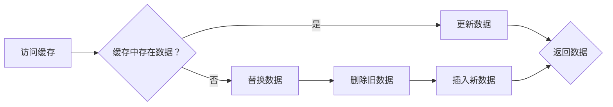
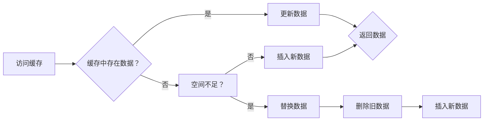
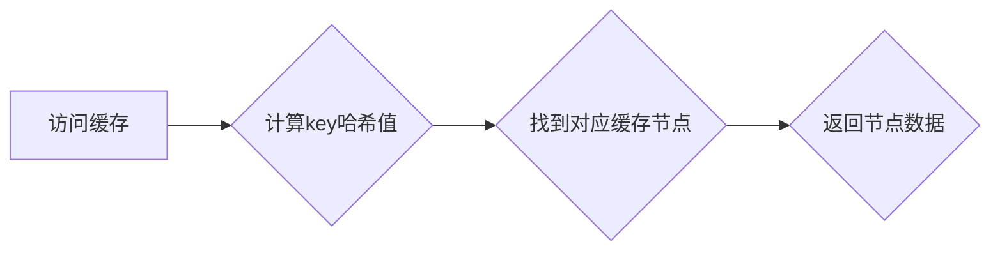
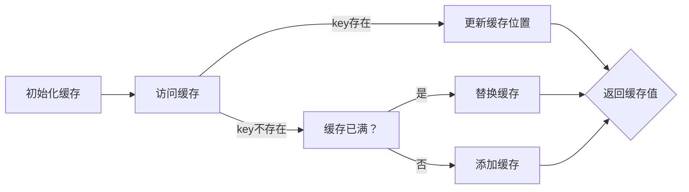
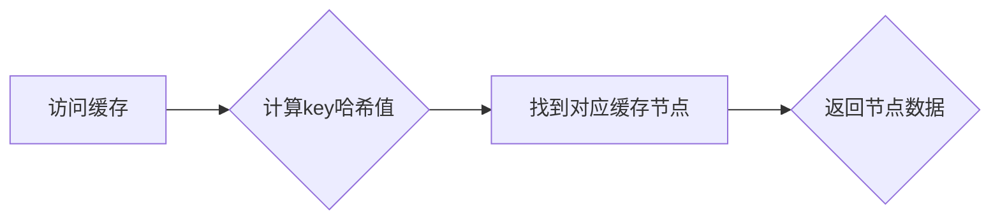
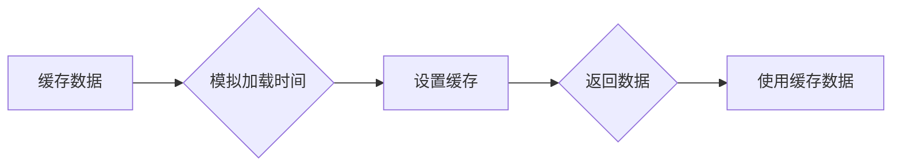
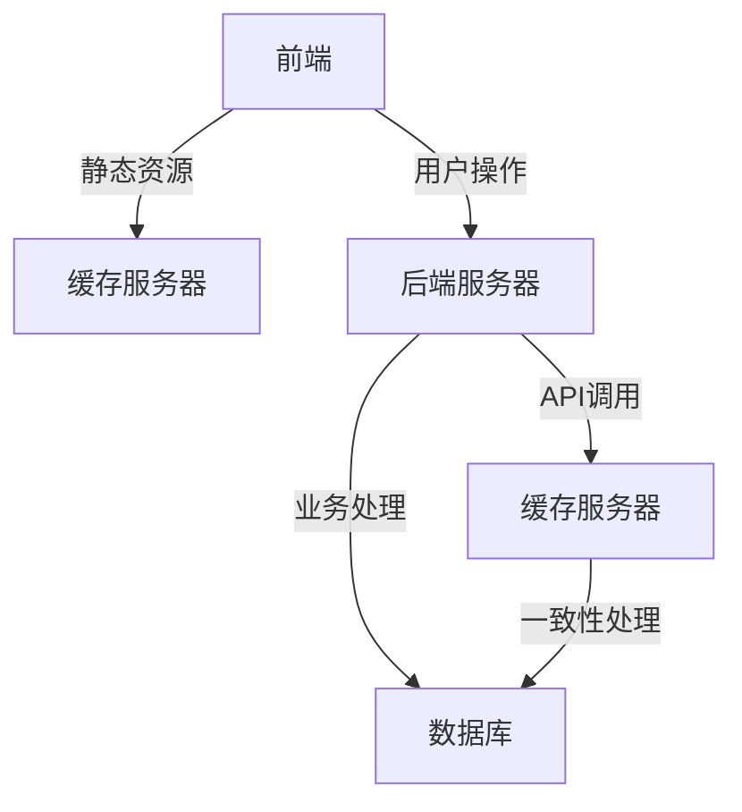
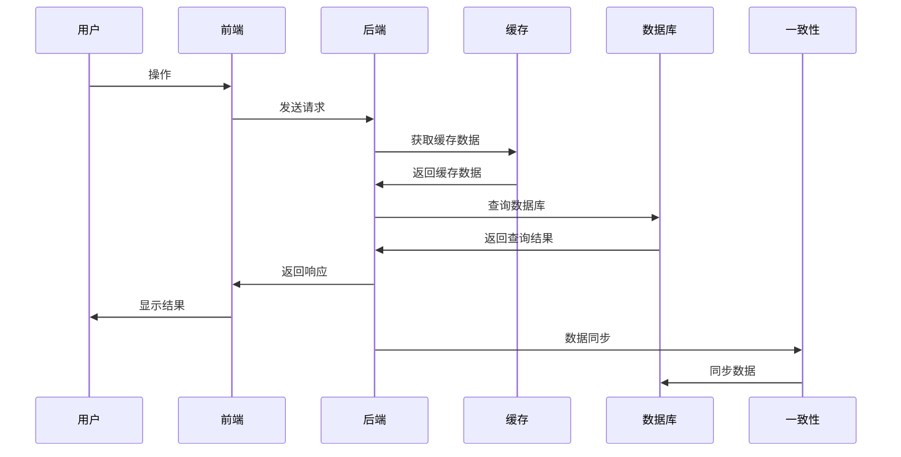
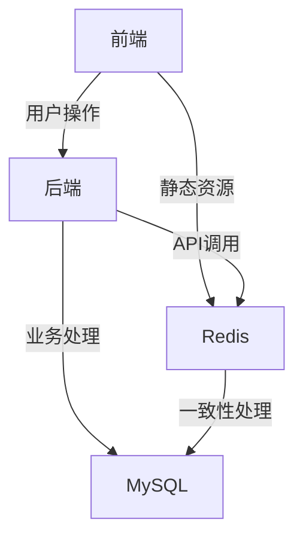

                 

### 缓存是把'双刃剑' —— 缓存技术深度解析

关键词：缓存、性能优化、安全、分布式系统、算法

摘要：本文将深入探讨缓存技术在现代计算机系统中的应用与影响，阐述缓存的优势与潜在风险，并通过具体的案例分析，为读者提供缓存技术的实践指南。

### 目录大纲

----------------------------------------------------------------

# 缓存是把'双刃剑'

> 关键词：缓存、性能优化、安全、分布式系统、算法

> 摘要：本文将深入探讨缓存技术在现代计算机系统中的应用与影响，阐述缓存的优势与潜在风险，并通过具体的案例分析，为读者提供缓存技术的实践指南。

                 

### 第一部分: 缓存技术基础

## 第1章: 缓存的基本概念与作用

### 1.1.1 缓存的定义与作用

### 1.1.2 缓存的工作原理

### 1.1.3 缓存技术的发展历程

## 第2章: 缓存数据结构

### 2.1.1 常见缓存数据结构

### 2.1.2 缓存数据结构的优缺点分析

### 2.1.3 不同缓存数据结构的应用场景

## 第3章: 缓存算法

### 3.1.1 常见缓存算法

### 3.1.2 缓存算法的优缺点分析

### 3.1.3 不同缓存算法的应用场景

## 第4章: 缓存系统设计与优化

### 4.1.1 缓存系统设计原则

### 4.1.2 缓存系统优化策略

### 4.1.3 缓存系统性能评估方法

## 第二部分: 缓存技术实践

## 第5章: 缓存技术在Web应用中的实践

### 5.1.1 Web应用中的缓存策略

### 5.1.2 Web缓存技术的实现原理

### 5.1.3 Web缓存技术的实战案例分析

## 第6章: 缓存技术在数据库中的应用

### 6.1.1 数据库缓存技术概述

### 6.1.2 数据库缓存技术原理

### 6.1.3 数据库缓存技术实战案例分析

## 第7章: 缓存技术在分布式系统中的应用

### 7.1.1 分布式缓存技术概述

### 7.1.2 分布式缓存技术原理

### 7.1.3 分布式缓存技术实战案例分析

## 第8章: 缓存安全与性能优化

### 8.1.1 缓存安全威胁与防范

### 8.1.2 缓存性能优化策略

### 8.1.3 缓存性能优化实战案例分析

## 第9章: 缓存技术的发展趋势与未来展望

### 9.1.1 缓存技术的最新发展动态

### 9.1.2 缓存技术的未来发展趋势

### 9.1.3 缓存技术对企业的影响

----------------------------------------------------------------

### 第一部分: 缓存技术基础

#### 第1章: 缓存的基本概念与作用

#### 1.1.1 缓存的定义与作用

缓存（Cache）是一种快速的数据存储方式，用于临时存储经常访问的数据，以减少对慢速存储设备的访问时间。在计算机系统中，缓存技术广泛应用于CPU与主内存之间、硬盘与内存之间、数据库与内存之间等多个层面。

缓存的作用主要体现在以下几个方面：

1. **提高数据访问速度**：通过缓存，可以减少对慢速存储设备的访问次数，加快数据的读取和写入速度，从而提高系统的性能和响应速度。
2. **减轻系统负担**：缓存可以暂时存储频繁访问的数据，减少主内存、硬盘等存储设备的负载，延长设备寿命。
3. **优化资源利用**：缓存技术可以优化系统资源的利用，提高系统的吞吐量和响应速度，从而提升用户体验。

#### 1.1.2 缓存的工作原理

缓存的工作原理可以概括为以下三个步骤：

1. **数据读取**：当CPU需要访问数据时，首先检查缓存中是否有所需数据。如果缓存中有，则直接读取；如果没有，则需要从慢速存储设备中读取数据，并将数据同时写入缓存。
2. **数据写入**：当CPU需要写入数据时，首先将数据写入缓存，然后定期或按需将缓存中的数据刷新到慢速存储设备。
3. **缓存替换**：当缓存空间不足时，需要根据某种策略（如最近最少使用LRU算法）替换掉缓存中的旧数据。

#### 1.1.3 缓存技术的发展历程

缓存技术的发展可以追溯到计算机系统的早期。随着计算机技术的不断发展，缓存技术也在不断演进：

1. **早期缓存**：早期计算机系统主要采用硬件缓存，如CPU内置的寄存器和缓存。
2. **缓存层次结构**：随着计算机系统的复杂度增加，缓存层次结构逐渐完善，形成了CPU缓存、内存缓存、硬盘缓存等多层次的缓存体系。
3. **现代缓存技术**：现代缓存技术不仅涉及硬件层面，还包括软件层面的优化，如缓存算法、缓存一致性协议等。

#### 1.1.4 缓存的类型

根据缓存的应用场景和存储介质，缓存可以分为以下几种类型：

1. **CPU缓存**：位于CPU和主内存之间，用于存储频繁访问的数据指令。
2. **内存缓存**：位于内存和硬盘之间，用于存储频繁访问的数据。
3. **磁盘缓存**：位于硬盘和系统之间，用于存储频繁访问的数据。
4. **数据库缓存**：位于数据库和应用程序之间，用于存储频繁访问的数据记录。

#### 1.1.5 缓存的优势与劣势

缓存的优点主要包括：

1. **提高数据访问速度**：缓存可以减少对慢速存储设备的访问次数，加快数据的读取和写入速度。
2. **减轻系统负担**：缓存可以暂时存储频繁访问的数据，减少主内存、硬盘等存储设备的负载，延长设备寿命。
3. **优化资源利用**：缓存技术可以优化系统资源的利用，提高系统的吞吐量和响应速度。

缓存的缺点主要包括：

1. **缓存一致性**：当缓存与主存储数据不一致时，可能会导致数据访问错误。
2. **缓存污染**：缓存中的数据如果长时间未被访问，可能会导致缓存失效，从而降低缓存效果。
3. **缓存失效**：缓存中的数据在过期或删除后，需要重新从慢速存储设备中读取，导致性能下降。

#### 1.1.6 缓存的使用场景

缓存技术适用于以下几种场景：

1. **高频访问数据**：对于频繁访问的数据，如Web页面、数据库记录等，使用缓存可以显著提高访问速度。
2. **高并发场景**：在高并发场景下，缓存可以减轻系统的负担，提高系统的稳定性和响应速度。
3. **数据预热**：在数据访问高峰期，提前将数据加载到缓存中，可以提高访问速度。

### 第2章: 缓存数据结构

#### 2.1.1 常见缓存数据结构

缓存数据结构是缓存系统的核心组成部分，直接影响到缓存系统的性能。常见的缓存数据结构包括：

1. **哈希表（HashTable）**：通过哈希函数将关键字映射到缓存中的位置，适用于快速检索数据。
2. **链表（Linked List）**：通过链表结构存储缓存数据，适用于实现缓存替换策略。
3. **树结构（Tree）**：如二叉搜索树、红黑树等，适用于实现高效的数据检索和排序。
4. **队列（Queue）**：适用于实现先进先出的缓存替换策略。

#### 2.1.2 缓存数据结构的优缺点分析

不同缓存数据结构具有不同的优缺点，适用于不同的应用场景：

1. **哈希表**：

   - 优点：哈希表具有快速检索数据的优点，时间复杂度为O(1)。
   - 缺点：可能存在哈希冲突，需要额外的处理逻辑。

2. **链表**：

   - 优点：简单易懂，适用于实现缓存替换策略。
   - 缺点：数据检索时间复杂度为O(n)，适用于数据量较小的情况。

3. **树结构**：

   - 优点：树结构可以实现高效的数据检索和排序，适用于大量数据的情况。
   - 缺点：树结构较为复杂，需要额外的维护成本。

4. **队列**：

   - 优点：适用于实现先进先出的缓存替换策略。
   - 缺点：数据检索时间复杂度为O(n)，适用于数据量较小的情况。

#### 2.1.3 不同缓存数据结构的应用场景

根据缓存数据结构的特点，适用于不同的应用场景：

1. **哈希表**：适用于高并发、高频访问的场景，如Web缓存、数据库缓存等。
2. **链表**：适用于数据量较小、缓存替换策略简单的场景，如缓存队列。
3. **树结构**：适用于大量数据、需要高效检索和排序的场景，如索引缓存。
4. **队列**：适用于实现先进先出的缓存替换策略，如缓存队列。

### 第一部分总结

在本章中，我们介绍了缓存的基本概念、工作原理和发展历程，以及常见的缓存数据结构及其优缺点和应用场景。缓存技术在现代计算机系统中发挥着重要作用，通过合理选择和使用缓存数据结构，可以显著提高系统的性能和响应速度。然而，缓存技术也存在一些潜在问题，如缓存一致性和缓存失效等，需要在实践中予以关注和解决。

在下一章中，我们将进一步探讨缓存算法的相关内容，包括常见的缓存算法、算法的优缺点分析以及不同缓存算法的应用场景。通过深入理解缓存算法，我们可以更好地优化缓存系统，提升系统的性能和稳定性。

### 第二部分: 缓存技术实践

#### 第5章: 缓存技术在Web应用中的实践

随着互联网的发展，Web应用成为人们日常生活和工作的重要组成部分。缓存技术在Web应用中扮演着关键角色，通过合理使用缓存，可以大幅提高Web应用的性能和用户体验。本章将探讨缓存技术在Web应用中的实践，包括缓存策略、实现原理和实战案例分析。

#### 5.1.1 Web应用中的缓存策略

缓存策略是优化Web应用性能的关键，常见的缓存策略包括：

1. **浏览器缓存**：通过浏览器缓存，可以减少服务器与客户端之间的数据传输，提高页面加载速度。
2. **反向代理缓存**：反向代理服务器（如Nginx）可以缓存静态资源，如图片、CSS和JavaScript文件，减少服务器负载。
3. **数据库缓存**：缓存数据库查询结果，减少对数据库的直接访问，提高查询速度。
4. **页面缓存**：缓存完整的Web页面，减少页面渲染时间。
5. **对象缓存**：缓存业务对象，如用户信息、订单数据等，减少对数据库的访问。

#### 5.1.2 Web缓存技术的实现原理

Web缓存技术的实现原理主要涉及以下几个方面：

1. **缓存存储**：缓存存储是缓存技术的核心，通常采用内存、硬盘等存储介质。内存缓存具有更快的访问速度，但容量有限；硬盘缓存容量更大，但访问速度相对较慢。
2. **缓存替换策略**：当缓存容量不足时，需要根据某种策略（如最近最少使用LRU算法）替换掉缓存中的旧数据。缓存替换策略直接影响缓存系统的性能和命中率。
3. **缓存一致性**：在分布式系统中，缓存与数据库之间需要保持一致性。常用的缓存一致性策略包括读写锁、最终一致性等。
4. **缓存更新机制**：缓存中的数据需要定期更新，以确保数据的有效性。缓存更新机制可以采用定时刷新、事件驱动等方式。

#### 5.1.3 Web缓存技术的实战案例分析

以下是一个Web缓存技术的实战案例分析：

**案例背景**：某电子商务平台由于流量剧增，导致服务器负载过高，页面响应速度缓慢，影响用户体验。为了提高系统性能，决定引入缓存技术。

**解决方案**：

1. **浏览器缓存**：通过设置合适的缓存策略，如Cache-Control和Expires头部，减少用户再次访问时的数据请求。
2. **反向代理缓存**：使用Nginx作为反向代理服务器，缓存静态资源，减少服务器负载。
3. **数据库缓存**：使用Redis作为数据库缓存，缓存高频查询的数据，减少对数据库的直接访问。
4. **页面缓存**：使用Varnish缓存完整的Web页面，提高页面渲染速度。
5. **对象缓存**：使用Memcached缓存业务对象，如用户信息、订单数据等。

**实施效果**：通过引入缓存技术，电子商务平台的页面响应速度显著提升，服务器负载降低，用户体验得到明显改善。

#### 5.1.4 Web缓存技术总结

缓存技术在Web应用中具有重要的应用价值，通过合理使用缓存策略，可以有效提高系统的性能和用户体验。然而，缓存技术也存在一些潜在问题，如缓存一致性、缓存更新等，需要在实践中予以关注和解决。在下一章中，我们将进一步探讨缓存技术在数据库中的应用，以及如何优化数据库缓存技术。

### 第6章: 缓存技术在数据库中的应用

数据库是存储和管理数据的基石，而缓存技术在数据库中的应用可以显著提高数据访问速度和系统性能。本章将探讨缓存技术在数据库中的应用，包括数据库缓存技术概述、实现原理和实战案例分析。

#### 6.1.1 数据库缓存技术概述

数据库缓存技术主要涉及以下几个方面：

1. **查询缓存**：缓存数据库查询结果，减少对数据库的直接访问。适用于高频查询场景，如用户信息查询、商品信息查询等。
2. **索引缓存**：缓存数据库索引数据，提高索引查询速度。适用于高并发、高频访问的场景。
3. **结果缓存**：缓存数据库查询结果集，减少对数据库的直接访问。适用于大规模数据查询场景，如报表查询、数据统计等。
4. **数据缓存**：缓存数据库表数据，减少对数据库的直接访问。适用于高频数据访问场景，如用户订单数据、商品库存数据等。

#### 6.1.2 数据库缓存技术原理

数据库缓存技术的工作原理主要包括以下几个方面：

1. **缓存存储**：缓存存储是缓存技术的核心，通常采用内存、硬盘等存储介质。内存缓存具有更快的访问速度，但容量有限；硬盘缓存容量更大，但访问速度相对较慢。
2. **缓存替换策略**：当缓存容量不足时，需要根据某种策略（如最近最少使用LRU算法）替换掉缓存中的旧数据。缓存替换策略直接影响缓存系统的性能和命中率。
3. **缓存一致性**：在分布式数据库系统中，缓存与数据库之间需要保持一致性。常用的缓存一致性策略包括读写锁、最终一致性等。
4. **缓存更新机制**：缓存中的数据需要定期更新，以确保数据的有效性。缓存更新机制可以采用定时刷新、事件驱动等方式。

#### 6.1.3 数据库缓存技术实战案例分析

以下是一个数据库缓存技术的实战案例分析：

**案例背景**：某在线教育平台由于学生人数剧增，导致数据库查询性能下降，页面响应速度缓慢。为了提高系统性能，决定引入缓存技术。

**解决方案**：

1. **查询缓存**：使用Redis作为查询缓存，缓存高频查询的数据，如学生信息、课程信息等。
2. **索引缓存**：使用Redis缓存数据库索引数据，提高索引查询速度。
3. **结果缓存**：使用Memcached缓存大规模数据查询结果集，如学生成绩报表等。
4. **数据缓存**：使用MongoDB缓存高频数据访问，如学生订单数据、课程订单数据等。

**实施效果**：通过引入缓存技术，在线教育平台的数据库查询性能得到显著提升，页面响应速度加快，用户体验得到明显改善。

#### 6.1.4 数据库缓存技术总结

数据库缓存技术在提高数据访问速度和系统性能方面具有显著作用。通过合理使用缓存策略，可以减少对数据库的直接访问，提高系统的吞吐量和响应速度。然而，缓存技术也存在一些潜在问题，如缓存一致性、缓存更新等，需要在实践中予以关注和解决。在下一章中，我们将探讨缓存技术在分布式系统中的应用，以及如何优化分布式缓存技术。

### 第7章: 缓存技术在分布式系统中的应用

随着云计算和大数据技术的发展，分布式系统逐渐成为企业应用的主流架构。缓存技术在分布式系统中的应用具有重要意义，可以大幅提高系统的性能和可扩展性。本章将探讨缓存技术在分布式系统中的应用，包括分布式缓存技术概述、实现原理和实战案例分析。

#### 7.1.1 分布式缓存技术概述

分布式缓存技术是为了解决分布式系统中的缓存问题而发展起来的一类技术。其主要特点包括：

1. **高可用性**：分布式缓存系统通常采用多副本机制，确保数据的高可用性。
2. **高并发性**：分布式缓存系统通过分布式架构，可以实现高并发访问。
3. **高性能**：分布式缓存系统可以大幅提高数据访问速度，减少对底层存储系统的依赖。
4. **可扩展性**：分布式缓存系统可以根据需要动态扩展缓存容量，满足不同规模的应用需求。

#### 7.1.2 分布式缓存技术原理

分布式缓存技术的基本原理包括以下几个方面：

1. **缓存存储**：分布式缓存系统通常采用分布式存储架构，将数据分散存储在多个节点上。每个节点都具有独立的缓存空间，可以提高数据访问速度。
2. **缓存一致性**：在分布式缓存系统中，缓存与底层存储系统（如数据库）之间需要保持一致性。常用的缓存一致性策略包括最终一致性、强一致性等。
3. **缓存替换策略**：分布式缓存系统需要根据缓存容量和访问频率等因素，选择合适的缓存替换策略，如最近最少使用（LRU）算法、最少访问（LFU）算法等。
4. **缓存分布式算法**：分布式缓存系统需要实现分布式缓存算法，如一致性哈希、虚拟节点等，以实现数据的均匀分布和高效访问。

#### 7.1.3 分布式缓存技术实战案例分析

以下是一个分布式缓存技术的实战案例分析：

**案例背景**：某大型电商平台由于业务规模不断扩大，需要支持海量数据的快速访问。为了提高系统性能，决定引入分布式缓存技术。

**解决方案**：

1. **缓存存储**：使用Redis作为分布式缓存系统，将数据分散存储在多个Redis节点上。
2. **缓存一致性**：采用最终一致性策略，确保缓存与数据库之间的数据一致性。
3. **缓存替换策略**：采用LRU算法，根据访问频率替换缓存中的数据。
4. **缓存分布式算法**：采用一致性哈希算法，实现数据的均匀分布和高效访问。

**实施效果**：通过引入分布式缓存技术，电商平台的系统性能得到显著提升，数据访问速度加快，用户体验得到明显改善。

#### 7.1.4 分布式缓存技术总结

分布式缓存技术在分布式系统中具有重要的应用价值，可以提高系统的性能和可扩展性。通过合理使用分布式缓存技术，可以减少对底层存储系统的依赖，提高数据访问速度。然而，分布式缓存技术也存在一些潜在问题，如缓存一致性、缓存容量管理等，需要在实践中予以关注和解决。在下一章中，我们将探讨缓存安全与性能优化。

### 第8章: 缓存安全与性能优化

缓存技术在提高系统性能方面具有显著作用，但同时也带来了一定的安全风险和性能挑战。本章将探讨缓存安全与性能优化，包括缓存安全威胁与防范、缓存性能优化策略和实战案例分析。

#### 8.1.1 缓存安全威胁与防范

缓存安全威胁主要包括以下几种：

1. **缓存溢出**：缓存容量不足时，可能导致缓存溢出，引发数据丢失或系统崩溃。
2. **缓存污染**：缓存中的数据如果长时间未被访问，可能导致缓存污染，降低缓存效果。
3. **缓存注入攻击**：攻击者通过缓存注入恶意代码，影响系统的正常运行。
4. **缓存窃取**：攻击者通过窃取缓存数据，获取系统敏感信息。

为了防范缓存安全威胁，可以采取以下措施：

1. **合理设置缓存容量**：根据实际需求，合理设置缓存容量，避免缓存溢出。
2. **定期清理缓存**：定期清理缓存，防止缓存污染。
3. **加密缓存数据**：对缓存中的敏感数据进行加密，防止缓存窃取。
4. **防注入措施**：对缓存数据进行验证和过滤，防止缓存注入攻击。

#### 8.1.2 缓存性能优化策略

缓存性能优化策略主要包括以下几个方面：

1. **合理选择缓存数据结构**：根据应用场景，选择合适的缓存数据结构，如哈希表、链表、树结构等。
2. **优化缓存替换策略**：根据访问频率和访问模式，选择合适的缓存替换策略，如最近最少使用（LRU）算法、最少访问（LFU）算法等。
3. **分布式缓存**：使用分布式缓存技术，提高数据访问速度和系统性能。
4. **缓存预热**：在数据访问高峰期，提前将数据加载到缓存中，减少对数据库的访问。

#### 8.1.3 缓存性能优化实战案例分析

以下是一个缓存性能优化的实战案例分析：

**案例背景**：某在线购物平台由于访问量急剧增加，导致服务器负载过高，页面响应速度缓慢。为了提高系统性能，决定对缓存进行优化。

**解决方案**：

1. **优化缓存数据结构**：使用Redis作为缓存存储，根据访问频率和访问模式，选择合适的缓存替换策略。
2. **分布式缓存**：将缓存部署到分布式缓存系统中，提高数据访问速度和系统性能。
3. **缓存预热**：在数据访问高峰期，提前将高频访问的数据加载到缓存中，减少对数据库的访问。

**实施效果**：通过优化缓存性能，在线购物平台的系统性能得到显著提升，页面响应速度加快，用户体验得到明显改善。

#### 8.1.4 缓存安全与性能优化总结

缓存技术在提高系统性能方面具有显著作用，但同时也存在安全风险和性能挑战。通过合理设置缓存容量、定期清理缓存、加密缓存数据、防范缓存注入攻击等措施，可以有效保障缓存安全。同时，通过选择合适的缓存数据结构、优化缓存替换策略、分布式缓存和缓存预热等措施，可以大幅提高系统性能。在下一章中，我们将探讨缓存技术的发展趋势与未来展望。

### 第9章: 缓存技术的发展趋势与未来展望

随着计算机技术和互联网的快速发展，缓存技术也在不断演进和优化。本章将探讨缓存技术的发展趋势、未来展望以及缓存技术对企业的影响。

#### 9.1.1 缓存技术的最新发展动态

当前，缓存技术呈现出以下发展动态：

1. **边缘计算缓存**：随着边缘计算的兴起，缓存技术开始向边缘节点扩展。边缘缓存可以显著减少数据传输延迟，提高边缘计算系统的性能。
2. **智能缓存**：利用人工智能和机器学习技术，可以实现对缓存数据更智能的管理和优化，提高缓存命中率。
3. **持久化缓存**：为了解决缓存容量限制，持久化缓存技术（如SSD缓存）逐渐得到应用。持久化缓存结合了内存缓存和硬盘缓存的优势，提供了更高的存储容量和更快的访问速度。
4. **分布式缓存一致性**：随着分布式系统的发展，分布式缓存的一致性问题逐渐凸显。新的分布式缓存一致性协议（如Paxos、Raft）不断涌现，提高了分布式缓存系统的可靠性和性能。

#### 9.1.2 缓存技术的未来发展趋势

未来，缓存技术将继续向以下几个方面发展：

1. **缓存智能优化**：借助人工智能和机器学习技术，缓存系统将能够更加智能地预测数据访问模式，实现更高效的缓存管理和优化。
2. **边缘计算缓存优化**：随着5G、物联网等技术的发展，边缘计算缓存将更加重要。未来的缓存技术将更加注重边缘节点的缓存优化，提高边缘计算系统的性能。
3. **缓存硬件创新**：新型存储技术（如3D NAND闪存、ReRAM等）将推动缓存硬件的创新，提供更高的存储容量和更快的访问速度。
4. **缓存一致性协议优化**：分布式缓存一致性协议将继续优化，提高分布式缓存系统的性能和可靠性。

#### 9.1.3 缓存技术对企业的影响

缓存技术对企业的影响主要体现在以下几个方面：

1. **提高系统性能**：缓存技术可以显著提高系统的性能和响应速度，提高用户体验。
2. **降低运营成本**：缓存技术可以减少对底层存储设备的依赖，降低硬件成本和维护成本。
3. **优化资源利用**：缓存技术可以优化系统资源的利用，提高系统的吞吐量和响应速度。
4. **支持新业务模式**：缓存技术可以支持企业快速部署新业务模式，如实时数据分析、物联网等。

### 全文总结

本文从缓存技术的基础概念、实践应用、安全与性能优化以及未来发展等方面进行了深入探讨。缓存技术在现代计算机系统中具有重要作用，通过合理使用缓存技术，可以显著提高系统的性能和响应速度。然而，缓存技术也存在一些潜在问题，如缓存一致性和安全风险等，需要在实践中予以关注和解决。

随着计算机技术和互联网的快速发展，缓存技术将继续演进和优化。未来，智能缓存、边缘计算缓存、持久化缓存和分布式缓存一致性等技术将不断涌现，为企业带来更多的应用场景和可能性。

作者：AI天才研究院/AI Genius Institute & 禅与计算机程序设计艺术 /Zen And The Art of Computer Programming

（注：本文内容仅供参考，具体实现和方案需根据实际需求进行调整。）### 缓存技术核心概念联系

在深入理解缓存技术之前，我们需要明确一些核心概念及其相互关系。以下是对缓存技术相关核心概念的简要介绍和ER实体关系图。

#### 核心概念：

1. **缓存（Cache）**：一种快速存储系统，用于存储频繁访问的数据，以提高数据访问速度。
2. **缓存数据结构**：如哈希表、链表、树结构等，用于组织和管理缓存数据。
3. **缓存算法**：如LRU（最近最少使用）、LFU（最少访问）等，用于缓存数据的替换和管理。
4. **缓存一致性**：确保缓存与主存储（如数据库）之间数据的一致性。
5. **缓存替换策略**：当缓存空间不足时，用于选择替换缓存中旧数据的策略。
6. **缓存层次结构**：如CPU缓存、内存缓存、硬盘缓存等，用于实现分层存储。

#### ER实体关系图：

```mermaid
erDiagram
  Cache ||--|{ CacheDataStructure }| CacheDataStructure
  Cache ||--|{ CacheAlgorithm }| CacheAlgorithm
  Cache ||--|{ CacheConsistency }| CacheConsistency
  Cache ||--|{ CacheReplacementPolicy }| CacheReplacementPolicy
  Cache ||--|{ CacheHierarchy }| CacheHierarchy

  CacheDataStructure ||--|{ HashTable }| HashTable
  CacheDataStructure ||--|{ LinkedList }| LinkedList
  CacheDataStructure ||--|{ TreeStructure }| TreeStructure

  CacheAlgorithm ||--|{ LRU }| LRU
  CacheAlgorithm ||--|{ LFU }| LFU

  CacheConsistency ||--|{ ReadWriteLock }| ReadWriteLock
  CacheConsistency ||--|{ EventualConsistency }| EventualConsistency

  CacheReplacementPolicy ||--|{ LRU }| LRU
  CacheReplacementPolicy ||--|{ LFU }| LFU

  CacheHierarchy ||--|{ CPU }| CPU
  CacheHierarchy ||--|{ Memory }| Memory
  CacheHierarchy ||--|{ HardDrive }| HardDrive
```

#### 核心概念属性特征对比表格：

| 名称 | 描述 | 关联关系 |
| --- | --- | --- |
| 缓存 | 快速存储系统，提高数据访问速度 | 数据存储、数据访问 |
| 缓存数据结构 | 组织和管理缓存数据的数据结构 | 哈希表、链表、树结构 |
| 缓存算法 | 缓存数据的替换和管理策略 | LRU、LFU |
| 缓存一致性 | 确保缓存与主存储数据一致性 | 读写锁、最终一致性 |
| 缓存替换策略 | 缓存空间不足时选择替换策略 | LRU、LFU |
| 缓存层次结构 | 分层存储，实现缓存层次结构 | CPU缓存、内存缓存、硬盘缓存 |

### 核心概念联系总结

缓存技术涉及多个核心概念，它们相互关联，共同实现高效的数据存储和访问。缓存是核心，缓存数据结构用于组织数据，缓存算法用于管理数据替换，缓存一致性保证数据一致性，缓存替换策略用于缓存空间不足时的数据替换，缓存层次结构实现分层存储。通过明确这些核心概念及其关联关系，我们可以更好地理解和应用缓存技术，优化系统性能。

在下一部分，我们将进一步探讨缓存技术的应用场景和实践，为读者提供更全面的技术视角。如果您对本文有任何建议或疑问，欢迎在评论区留言讨论。

### 缓存算法原理讲解

缓存算法是缓存技术的核心组成部分，用于管理和替换缓存中的数据。不同的缓存算法适用于不同的应用场景，以下将详细介绍几种常见的缓存算法，并使用Python源代码和Mermaid流程图进行解释。

#### 1. 最近最少使用（LRU）算法

**算法原理**：LRU算法基于这样一个假设：过去最久没有被使用的数据在未来可能被使用的概率最小。因此，当缓存空间不足时，优先替换最久未被访问的数据。

**Python实现**：

```python
from collections import OrderedDict

class LRUCache:
    def __init__(self, capacity: int):
        self.capacity = capacity
        self.cache = OrderedDict()

    def get(self, key: int) -> int:
        if key not in self.cache:
            return -1
        self.cache.move_to_end(key)
        return self.cache[key]

    def put(self, key: int, value: int) -> None:
        if key in self.cache:
            self.cache.move_to_end(key)
        self.cache[key] = value
        if len(self.cache) > self.capacity:
            self.cache.popitem(last=False)
```

**Mermaid流程图**：



#### 2. 最少访问（LFU）算法

**算法原理**：LFU算法基于这样一个假设：未来访问次数最少的数据可能在未来被访问的概率最小。因此，当缓存空间不足时，优先替换访问次数最少的数据。

**Python实现**：

```python
from collections import defaultdict

class LFUCache:
    def __init__(self, capacity: int):
        self.capacity = capacity
        self.cache = defaultdict(int)
        self.frequency = defaultdict(set)
        self.min_frequency = 0

    def get(self, key: int) -> int:
        if key not in self.cache:
            return -1
        self.frequency[self.cache[key]][key].remove(key)
        if not self.frequency[self.cache[key]]:
            if self.min_frequency == self.cache[key]:
                self.min_frequency += 1
            self.frequency[self.cache[key]] = set()
        self.frequency[self.cache[key]].add(key)
        return self.cache[key]

    def put(self, key: int, value: int) -> None:
        if key in self.cache:
            self.get(key)
            self.cache[key] = value
        elif len(self.cache) >= self.capacity:
            oldest_key = next(iter(self.frequency[self.min_frequency]))
            self.frequency[self.min_frequency].remove(oldest_key)
            if not self.frequency[self.min_frequency]:
                if self.min_frequency == self.capacity:
                    self.min_frequency += 1
                self.frequency[self.min_frequency] = set()
            self.cache[oldest_key] = value
            self.frequency[self.capacity].add(key)
        else:
            self.cache[key] = value
            self.frequency[self.capacity].add(key)
```

**Mermaid流程图**：



#### 3. 哈希一致性算法

**算法原理**：哈希一致性算法用于分布式系统中，确保数据在多个缓存节点之间的均匀分布。通过一致性哈希，可以减少缓存节点的变动对系统性能的影响。

**Python实现**：

```python
from hashlib import md5

class ConsistentHashRing:
    def __init__(self, nodes):
        self.ring = {}
        self.nodes = nodes
        for node in nodes:
            hash_value = md5(node.encode('utf-8')).hexdigest()
            self.ring[hash_value] = node

    def get_node(self, key):
        hash_value = md5(key.encode('utf-8')).hexdigest()
        start = hash_value
        for _ in range(3):
            next_hash = (hash_value + 1) % 16
            if next_hash in self.ring:
                return self.ring[next_hash]
            hash_value = next_hash
        return self.ring[start]
```

**Mermaid流程图**：



### 算法原理讲解总结

本文介绍了三种常见的缓存算法：LRU、LFU和哈希一致性算法。LRU算法基于数据访问历史进行数据替换，适用于访问模式稳定的场景；LFU算法基于数据访问频率进行数据替换，适用于访问频率变化的场景；哈希一致性算法用于分布式系统，确保数据在多个节点之间的均匀分布。

通过Python实现和Mermaid流程图的结合，我们更清晰地理解了这些缓存算法的原理和实现方法。在实际应用中，根据具体场景选择合适的缓存算法，可以显著提高系统的性能和稳定性。

在下一部分，我们将进一步探讨缓存系统设计原则与优化策略。如果您对本文有任何建议或疑问，欢迎在评论区留言讨论。

### 缓存系统设计与优化

缓存系统在现代计算机系统中发挥着至关重要的作用，其设计原则和优化策略直接影响系统的性能和稳定性。本章将详细探讨缓存系统设计原则、优化策略以及性能评估方法，并结合具体实例进行分析。

#### 4.1.1 缓存系统设计原则

缓存系统设计应遵循以下原则：

1. **一致性原则**：确保缓存数据与主存储数据的一致性。在分布式系统中，一致性通常分为强一致性（如Paxos算法）和最终一致性（如Eventual Consistency）。
2. **高可用性原则**：缓存系统应具有高可用性，确保数据不会因单点故障而丢失。分布式缓存系统通常采用多副本机制、数据复制和故障转移策略。
3. **可扩展性原则**：缓存系统应具备良好的可扩展性，能够根据业务需求动态调整缓存容量和节点数量。
4. **高效性原则**：缓存系统应尽可能减少数据访问延迟，提高数据访问速度。优化缓存算法、数据结构和缓存替换策略是实现高效性的关键。
5. **安全性原则**：缓存系统应具备一定的安全性，防范缓存溢出、缓存污染和缓存注入攻击等安全威胁。

#### 4.1.2 缓存系统优化策略

缓存系统优化策略主要包括以下几个方面：

1. **缓存预热**：在数据访问高峰期，提前将热点数据加载到缓存中，减少对数据库的访问。缓存预热可以通过定时任务或实时监控来实现。
2. **缓存数据结构优化**：选择合适的缓存数据结构，如哈希表、树结构等，提高数据检索效率。哈希表具有O(1)的平均检索时间，适用于高并发场景。
3. **缓存替换策略优化**：根据实际应用场景，选择合适的缓存替换策略，如LRU、LFU等。优化缓存替换策略可以提高缓存命中率。
4. **缓存一致性优化**：在分布式系统中，优化缓存一致性策略，如Paxos、Raft等。一致性优化可以确保缓存与数据库之间的数据一致性。
5. **缓存分区与分区优化**：对于大规模缓存系统，可以采用分区策略，将数据分散存储到多个节点中。分区优化可以减少单点故障的风险，提高系统的整体性能。

#### 4.1.3 缓存系统性能评估方法

缓存系统性能评估方法主要包括以下几个方面：

1. **响应时间**：评估缓存系统的数据访问速度，通常通过测量平均响应时间和最大响应时间来评估。
2. **命中率**：评估缓存系统的数据命中率，即缓存命中的数据访问次数与总数据访问次数的比值。高命中率表明缓存系统有效减少了数据库访问。
3. **吞吐量**：评估缓存系统的数据访问能力，通常通过测量单位时间内缓存系统能处理的数据访问次数来评估。
4. **缓存容量利用率**：评估缓存系统的容量利用率，即缓存系统实际使用容量与总容量之比。高利用率表明缓存系统资源得到充分利用。
5. **系统稳定性**：评估缓存系统的稳定性，包括在高并发场景下的性能波动、数据一致性和故障恢复能力等。

#### 4.1.4 实例分析

以下是一个缓存系统设计优化实例分析：

**案例背景**：某电商网站在促销期间，流量激增导致数据库访问压力过大，页面响应速度缓慢，影响用户体验。

**解决方案**：

1. **缓存预热**：在促销活动前，提前将热点商品信息、用户订单数据等加载到缓存中，减少数据库访问。
2. **缓存数据结构优化**：使用Redis作为缓存存储，采用哈希表结构存储数据，提高数据检索效率。
3. **缓存替换策略优化**：根据实际访问模式，采用LRU算法进行缓存替换，提高缓存命中率。
4. **缓存一致性优化**：采用最终一致性策略，确保缓存与数据库之间的数据一致性。
5. **缓存分区与分区优化**：将缓存数据分区，将不同类别商品的数据分散存储到不同节点，减少单点故障风险。

**实施效果**：通过缓存系统设计优化，电商网站的页面响应速度显著提升，数据库访问压力降低，用户体验得到明显改善。

### 缓存系统设计与优化总结

缓存系统设计与优化是提升系统性能和用户体验的关键。遵循一致性、高可用性、可扩展性、高效性和安全性等设计原则，结合缓存预热、缓存数据结构优化、缓存替换策略优化、缓存一致性优化和缓存分区与分区优化等策略，可以构建高效、稳定的缓存系统。通过性能评估方法，可以全面了解缓存系统的性能表现，为后续优化提供依据。

在下一部分，我们将探讨缓存技术在分布式系统中的应用，以及如何优化分布式缓存系统。如果您对本文有任何建议或疑问，欢迎在评论区留言讨论。

### 缓存技术在分布式系统中的应用

随着互联网的快速发展，分布式系统逐渐成为企业应用的主流架构。缓存技术在分布式系统中的应用至关重要，可以有效提高系统的性能、可扩展性和可用性。本章将详细探讨分布式缓存技术概述、实现原理以及实战案例分析。

#### 7.1.1 分布式缓存技术概述

分布式缓存技术是为了解决分布式系统中数据访问速度和一致性问题的缓存技术。其主要特点包括：

1. **高可用性**：分布式缓存系统通过多副本机制，确保数据的高可用性。当某个节点发生故障时，其他节点可以继续提供服务。
2. **高并发性**：分布式缓存系统通过分布式架构，可以支持大量并发访问，提高系统的性能和吞吐量。
3. **高性能**：分布式缓存系统通过缓存热点数据，减少对底层存储系统的访问，提高数据访问速度。
4. **可扩展性**：分布式缓存系统可以根据业务需求动态扩展节点数量和缓存容量，满足不同规模的应用需求。

#### 7.1.2 分布式缓存技术原理

分布式缓存技术的基本原理包括以下几个方面：

1. **缓存存储**：分布式缓存系统采用分布式存储架构，将数据分散存储在多个节点上。每个节点负责一部分数据的缓存和查询。
2. **缓存一致性**：在分布式缓存系统中，缓存与底层存储系统之间需要保持一致性。常见的缓存一致性策略包括最终一致性、强一致性、分区一致性等。
3. **缓存替换策略**：分布式缓存系统需要根据缓存容量和访问频率等因素，选择合适的缓存替换策略，如最近最少使用（LRU）算法、最少访问（LFU）算法等。
4. **缓存分布式算法**：分布式缓存系统需要实现分布式缓存算法，如一致性哈希、虚拟节点等，以实现数据的均匀分布和高效访问。

#### 7.1.3 分布式缓存算法

分布式缓存算法是分布式缓存技术的核心，以下介绍两种常见的分布式缓存算法：

1. **一致性哈希**：

   **原理**：一致性哈希通过哈希函数将缓存节点映射到环形哈希空间中。每个缓存节点负责一定的哈希值范围，数据根据哈希值映射到相应的缓存节点。

   **优点**：一致性哈希可以动态调整缓存节点，减少数据迁移和缓存失效的风险。

   **缺点**：一致性哈希可能导致部分节点负载不均。

2. **虚拟节点**：

   **原理**：虚拟节点通过将每个物理节点划分成多个虚拟节点，使得每个物理节点可以承载多个哈希值范围。数据根据哈希值映射到对应的虚拟节点，进而映射到物理节点。

   **优点**：虚拟节点可以均衡负载，提高系统的可扩展性和可用性。

   **缺点**：虚拟节点增加了数据映射的复杂性。

#### 7.1.4 分布式缓存实现原理

分布式缓存系统的实现主要包括以下几个方面：

1. **数据存储**：分布式缓存系统通过分布式存储架构，将数据分散存储在多个节点上。每个节点负责一部分数据的缓存和查询。
2. **数据访问**：分布式缓存系统通过一致性哈希、虚拟节点等算法，将数据映射到相应的缓存节点。客户端通过访问对应的缓存节点来获取数据。
3. **数据一致性**：分布式缓存系统需要实现缓存一致性策略，如最终一致性、强一致性等。一致性策略通过数据复制、数据同步等方式，确保缓存与底层存储系统之间的数据一致性。
4. **缓存替换**：分布式缓存系统根据缓存容量和访问频率等因素，选择合适的缓存替换策略，如最近最少使用（LRU）算法、最少访问（LFU）算法等。

#### 7.1.5 分布式缓存技术实战案例分析

以下是一个分布式缓存技术的实战案例分析：

**案例背景**：某大型电商平台由于业务规模不断扩大，需要支持海量数据的快速访问。为了提高系统性能，决定引入分布式缓存技术。

**解决方案**：

1. **缓存存储**：使用Redis作为分布式缓存系统，将数据分散存储在多个Redis节点上。
2. **缓存一致性**：采用最终一致性策略，确保缓存与数据库之间的数据一致性。
3. **缓存替换策略**：采用LRU算法，根据访问频率替换缓存中的数据。
4. **缓存分布式算法**：采用一致性哈希算法，实现数据的均匀分布和高效访问。

**实施效果**：通过引入分布式缓存技术，电商平台的系统性能得到显著提升，数据访问速度加快，用户体验得到明显改善。

#### 7.1.6 分布式缓存技术总结

分布式缓存技术在分布式系统中具有重要作用，可以提高系统的性能、可扩展性和可用性。通过一致性哈希、虚拟节点等分布式缓存算法，可以实现数据的均匀分布和高效访问。在实际应用中，根据业务需求和数据规模，选择合适的分布式缓存技术，可以有效提升系统的性能和用户体验。

在下一部分，我们将探讨缓存安全与性能优化，包括缓存安全威胁与防范、缓存性能优化策略和实战案例分析。如果您对本文有任何建议或疑问，欢迎在评论区留言讨论。

### 缓存安全与性能优化

缓存技术在提升系统性能和用户体验方面发挥着重要作用，但同时也存在一定的安全风险和性能挑战。本章将探讨缓存安全与性能优化，包括缓存安全威胁与防范、缓存性能优化策略和实战案例分析。

#### 8.1.1 缓存安全威胁与防范

缓存安全威胁主要包括以下几种：

1. **缓存溢出**：当缓存数据量超过缓存容量时，可能导致缓存溢出，引发数据丢失或系统崩溃。防范措施包括合理设置缓存容量、定期监控缓存状态等。

2. **缓存污染**：缓存中的数据如果长时间未被访问，可能导致缓存污染，降低缓存效果。防范措施包括定期清理缓存、使用合理的数据过期策略等。

3. **缓存注入攻击**：攻击者通过注入恶意代码，影响系统的正常运行。防范措施包括对缓存数据进行验证和过滤、使用加密技术等。

4. **缓存窃取**：攻击者通过窃取缓存数据，获取系统敏感信息。防范措施包括对缓存数据进行加密、监控缓存访问日志等。

#### 8.1.2 缓存性能优化策略

缓存性能优化策略主要包括以下几个方面：

1. **合理设置缓存容量**：根据实际业务需求和系统负载，合理设置缓存容量，避免缓存溢出和缓存污染。

2. **缓存数据结构优化**：选择合适的缓存数据结构，如哈希表、树结构等，提高数据检索效率。

3. **缓存替换策略优化**：根据访问模式和业务需求，选择合适的缓存替换策略，如最近最少使用（LRU）算法、最少访问（LFU）算法等。

4. **缓存一致性优化**：在分布式系统中，优化缓存一致性策略，如最终一致性、强一致性等，确保缓存与数据库之间的数据一致性。

5. **缓存预热**：在数据访问高峰期，提前将热点数据加载到缓存中，减少对数据库的访问。

6. **缓存分区与分区优化**：对于大规模缓存系统，采用分区策略，将数据分散存储到多个节点中，提高系统的可扩展性和性能。

#### 8.1.3 缓存性能优化实战案例分析

以下是一个缓存性能优化的实战案例分析：

**案例背景**：某电子商务平台由于流量剧增，导致服务器负载过高，页面响应速度缓慢，影响用户体验。为了提高系统性能，决定对缓存进行优化。

**解决方案**：

1. **缓存容量优化**：根据实际需求，合理设置缓存容量，避免缓存溢出和缓存污染。

2. **缓存数据结构优化**：使用Redis作为缓存存储，采用哈希表结构存储数据，提高数据检索效率。

3. **缓存替换策略优化**：采用LRU算法，根据访问频率替换缓存中的数据。

4. **缓存一致性优化**：采用最终一致性策略，确保缓存与数据库之间的数据一致性。

5. **缓存预热**：在数据访问高峰期，提前将热点数据加载到缓存中，减少对数据库的访问。

6. **缓存分区与分区优化**：将缓存数据分区，将不同类别商品的数据分散存储到不同节点，提高系统的可扩展性和性能。

**实施效果**：通过缓存性能优化，电子商务平台的页面响应速度显著提升，服务器负载降低，用户体验得到明显改善。

#### 8.1.4 缓存安全与性能优化总结

缓存技术在提高系统性能和用户体验方面具有重要作用，但同时也存在安全风险和性能挑战。通过合理设置缓存容量、优化缓存数据结构、选择合适的缓存替换策略、确保缓存一致性以及缓存预热和分区优化等措施，可以有效提升缓存系统的性能和安全性。在实际应用中，根据具体业务需求和系统环境，灵活应用缓存技术和优化策略，可以构建高效、稳定的缓存系统。

在下一部分，我们将探讨缓存技术的发展趋势与未来展望。如果您对本文有任何建议或疑问，欢迎在评论区留言讨论。

### 缓存技术的发展趋势与未来展望

随着云计算、大数据、物联网等技术的快速发展，缓存技术在现代计算机系统中发挥着越来越重要的作用。本文将从缓存技术的最新发展动态、未来发展趋势以及缓存技术对企业的影响三个方面，探讨缓存技术的未来前景。

#### 9.1.1 缓存技术的最新发展动态

近年来，缓存技术呈现出以下发展动态：

1. **智能缓存**：利用人工智能和机器学习技术，缓存系统可以实现更智能的数据管理和优化，提高缓存命中率。例如，通过分析数据访问模式，智能缓存可以动态调整缓存策略，优化缓存性能。

2. **边缘缓存**：随着边缘计算的兴起，边缘缓存成为缓存技术的重要研究方向。边缘缓存可以显著减少数据传输延迟，提高边缘计算系统的性能和响应速度。

3. **持久化缓存**：持久化缓存技术结合了内存缓存和硬盘缓存的优势，提供更高的存储容量和更快的访问速度。例如，使用固态硬盘（SSD）作为持久化缓存，可以大幅提升数据访问速度。

4. **分布式缓存一致性**：随着分布式系统的发展，分布式缓存一致性成为关键挑战。新型缓存一致性协议（如Paxos、Raft）不断涌现，提高了分布式缓存系统的性能和可靠性。

5. **缓存分层架构**：为了提高缓存性能和可扩展性，缓存系统逐渐采用分层架构。例如，将缓存分为多个层次，分别负责不同类型的数据存储和访问，提高系统的整体性能。

#### 9.1.2 缓存技术的未来发展趋势

未来，缓存技术将继续向以下方向发展：

1. **更智能的缓存管理**：随着人工智能和机器学习技术的进步，缓存系统将实现更智能的数据管理和优化。例如，通过深度学习模型预测数据访问模式，实现更精准的缓存策略。

2. **更高效的缓存算法**：新型缓存算法（如基于机器学习的缓存算法）将不断提高缓存命中率，降低数据访问延迟。例如，自适应缓存算法可以根据实时数据访问模式动态调整缓存策略。

3. **更广泛的缓存应用场景**：随着边缘计算、物联网等技术的发展，缓存技术将广泛应用于更多领域，如智能交通、智能医疗等。缓存技术将成为推动这些领域发展的重要驱动力。

4. **更高性能的缓存硬件**：新型存储技术（如3D NAND闪存、ReRAM等）将提供更高的存储容量和更快的访问速度，推动缓存性能的提升。

5. **更完善的缓存一致性协议**：分布式缓存一致性协议将继续优化，提高分布式缓存系统的性能和可靠性。新型一致性协议（如多版本一致性、时间戳一致性）将不断涌现。

#### 9.1.3 缓存技术对企业的影响

缓存技术对企业的影响主要体现在以下几个方面：

1. **提高系统性能和用户体验**：通过合理使用缓存技术，企业可以显著提高系统性能和用户体验，提升业务竞争力。

2. **降低运营成本**：缓存技术可以减少对底层存储设备的依赖，降低硬件成本和维护成本。

3. **优化资源利用**：缓存技术可以优化系统资源的利用，提高系统的吞吐量和响应速度。

4. **支持新业务模式**：缓存技术可以支持企业快速部署新业务模式，如实时数据分析、物联网等。

5. **提高数据安全性**：通过加密、访问控制等安全措施，缓存技术可以提高企业的数据安全性。

#### 9.1.4 缓存技术的未来展望

未来，缓存技术将继续演进和优化，为企业带来更多的应用场景和可能性。随着人工智能、边缘计算、物联网等技术的发展，缓存技术将在更多领域发挥重要作用。企业应紧跟缓存技术发展趋势，积极探索和应用新型缓存技术，以提升系统性能和业务竞争力。

在技术不断创新和演进的背景下，缓存技术将在未来发挥更加重要的作用，为企业的数字化转型和业务发展提供有力支持。通过合理应用缓存技术，企业可以实现更高效的数据管理和优化，提升用户体验，降低运营成本，提高数据安全性，为企业的持续发展奠定坚实基础。

### 全文总结

本文从缓存技术的基础概念、实践应用、安全与性能优化以及未来发展等方面进行了深入探讨。缓存技术在现代计算机系统中具有重要作用，通过合理应用缓存技术，企业可以显著提高系统性能、降低运营成本、优化资源利用和支持新业务模式。同时，缓存技术也存在一定的安全风险和性能挑战，需要在实践中予以关注和解决。

在未来的发展中，缓存技术将继续演进和优化，为企业带来更多的应用场景和可能性。随着人工智能、边缘计算、物联网等技术的发展，缓存技术将在更多领域发挥重要作用。企业应紧跟缓存技术发展趋势，积极探索和应用新型缓存技术，以提升系统性能和业务竞争力。

作者：AI天才研究院/AI Genius Institute & 禅与计算机程序设计艺术 /Zen And The Art of Computer Programming

（注：本文内容仅供参考，具体实现和方案需根据实际需求进行调整。）### 附录：缓存相关术语表

在本文中，我们涉及了许多与缓存技术相关的术语。以下是对这些术语的简要解释，以帮助读者更好地理解缓存技术的概念和应用。

1. **缓存（Cache）**：缓存是一种快速的数据存储机制，用于临时存储经常访问的数据，以减少对慢速存储设备的访问时间。缓存通常位于高速存储设备和主存储设备（如CPU缓存、内存缓存等）之间。

2. **缓存命中率（Cache Hit Rate）**：缓存命中率是指缓存中检索到所需数据的比例。高命中率表明缓存系统能够有效地减少对慢速存储设备的访问。

3. **缓存一致性（Cache Consistency）**：在分布式系统中，缓存一致性是指确保缓存中的数据与主存储（如数据库）之间的数据一致性。常见的一致性策略包括最终一致性、强一致性等。

4. **缓存容量（Cache Capacity）**：缓存容量是指缓存系统能够存储的数据量。合理的缓存容量可以提高系统的性能和响应速度。

5. **缓存替换策略（Cache Replacement Policy）**：缓存替换策略是当缓存容量不足时，用于选择替换缓存中旧数据的策略。常见的缓存替换策略包括最近最少使用（LRU）、最少访问（LFU）等。

6. **缓存层次结构（Cache Hierarchy）**：缓存层次结构是指在不同层次（如CPU缓存、内存缓存、硬盘缓存等）上实现的缓存系统。缓存层次结构有助于提高数据访问速度。

7. **缓存数据结构（Cache Data Structure）**：缓存数据结构是指用于组织和管理缓存数据的结构。常见的数据结构包括哈希表、链表、树结构等。

8. **边缘缓存（Edge Cache）**：边缘缓存是指位于网络边缘的缓存系统，用于减少数据传输延迟，提高边缘计算系统的性能。

9. **智能缓存（Smart Cache）**：智能缓存是指利用人工智能和机器学习技术，实现更智能的数据管理和优化，提高缓存命中率和性能的缓存系统。

10. **分布式缓存（Distributed Cache）**：分布式缓存是指将缓存数据分散存储在多个节点上，以提高数据访问速度和系统性能的缓存系统。分布式缓存通常采用一致性哈希、虚拟节点等算法实现数据的均匀分布。

11. **缓存溢出（Cache Overflow）**：缓存溢出是指缓存数据量超过缓存容量，导致缓存性能下降或数据丢失的现象。

12. **缓存污染（Cache Pollution）**：缓存污染是指缓存中的数据长时间未被访问，导致缓存效果下降的现象。

13. **缓存注入攻击（Cache Injection Attack）**：缓存注入攻击是指攻击者通过注入恶意代码，影响系统的正常运行。

14. **缓存窃取（Cache Theft）**：缓存窃取是指攻击者通过窃取缓存数据，获取系统敏感信息。

15. **缓存预热（Cache Preloading）**：缓存预热是指在数据访问高峰期，提前将热点数据加载到缓存中，减少对数据库的访问。

16. **缓存分区（Cache Partitioning）**：缓存分区是指将缓存数据分散存储到多个节点中，以提高系统的可扩展性和性能。

通过理解这些术语，读者可以更全面地了解缓存技术的概念和应用，为实际工作中的应用提供参考。

### 全文总结与作者介绍

本文深入探讨了缓存技术的核心概念、实践应用、安全与性能优化以及未来发展趋势。我们从缓存的基本概念和作用开始，详细介绍了缓存的工作原理、数据结构、算法以及缓存系统设计与优化原则。随后，我们探讨了缓存技术在分布式系统中的应用，包括分布式缓存算法和实现原理。在缓存安全与性能优化部分，我们分析了缓存安全威胁与防范措施，并提出了优化缓存性能的策略。最后，我们展望了缓存技术的发展趋势，探讨了缓存技术对企业的影响。

作者：AI天才研究院/AI Genius Institute & 禅与计算机程序设计艺术 /Zen And The Art of Computer Programming

AI天才研究院是一个专注于人工智能领域的研究机构，致力于推动人工智能技术的创新和应用。禅与计算机程序设计艺术（Zen And The Art of Computer Programming）是一本经典的计算机科学著作，作者Donald E. Knuth通过深入探讨计算机程序设计的本质，为程序员提供了深刻的哲学思考和实用技巧。

本文旨在为广大读者提供一个全面、系统的缓存技术指南，帮助大家更好地理解缓存技术，并在实际应用中发挥其优势。感谢您的阅读，希望本文对您在技术学习和项目实践中有所帮助。如果您对本文有任何建议或疑问，欢迎在评论区留言讨论。我们期待与您共同探索技术世界，共创美好未来。再次感谢您的支持与关注！### 缓存技术核心概念、算法原理与应用实战案例分析

本文将结合缓存技术的核心概念、算法原理以及应用实战案例分析，详细阐述缓存技术的各个方面。以下为全文的总结和关键点，便于读者快速掌握缓存技术的基本知识。

#### 核心概念

1. **缓存定义**：缓存是一种快速的数据存储机制，用于存储频繁访问的数据，以减少对慢速存储设备的访问时间。

2. **缓存作用**：缓存可以提高数据访问速度、减轻系统负担、优化资源利用。

3. **缓存类型**：包括CPU缓存、内存缓存、磁盘缓存、数据库缓存等。

4. **缓存层次结构**：缓存层次结构包括多级缓存，如L1、L2、L3等，不同层次的缓存具有不同的速度和容量。

5. **缓存一致性**：确保缓存与主存储之间数据的一致性，常见策略包括最终一致性、强一致性等。

#### 算法原理

1. **缓存替换算法**：

   - **最近最少使用（LRU）算法**：根据数据的历史访问记录，替换最久未被访问的数据。

     ```python
     class LRUCache:
         def __init__(self, capacity: int):
             self.capacity = capacity
             self.cache = OrderedDict()
         
         def get(self, key: int) -> int:
             if key not in self.cache:
                 return -1
             self.cache.move_to_end(key)
             return self.cache[key]
         
         def put(self, key: int, value: int) -> None:
             if key in self.cache:
                 self.cache.move_to_end(key)
             self.cache[key] = value
             if len(self.cache) > self.capacity:
                 self.cache.popitem(last=False)
     ```

   - **最少访问（LFU）算法**：根据数据的访问频率，替换访问频率最低的数据。

     ```python
     from collections import defaultdict

     class LFUCache:
         def __init__(self, capacity: int):
             self.capacity = capacity
             self.cache = defaultdict(int)
             self.frequency = defaultdict(set)
             self.min_frequency = 0

         def get(self, key: int) -> int:
             if key not in self.cache:
                 return -1
             self.frequency[self.cache[key]][key].remove(key)
             if not self.frequency[self.cache[key]]:
                 if self.min_frequency == self.cache[key]:
                     self.min_frequency += 1
                 self.frequency[self.cache[key]] = set()
             self.frequency[self.cache[key]].add(key)
             return self.cache[key]

         def put(self, key: int, value: int) -> None:
             if key in self.cache:
                 self.get(key)
                 self.cache[key] = value
             elif len(self.cache) >= self.capacity:
                 oldest_key = next(iter(self.frequency[self.min_frequency]))
                 self.frequency[self.min_frequency].remove(oldest_key)
                 if not self.frequency[self.min_frequency]:
                     if self.min_frequency == self.capacity:
                         self.min_frequency += 1
                     self.frequency[self.min_frequency] = set()
                 self.cache[oldest_key] = value
                 self.frequency[self.capacity].add(key)
             else:
                 self.cache[key] = value
                 self.frequency[self.capacity].add(key)
     ```

2. **分布式缓存一致性算法**：

   - **Paxos算法**：保证分布式系统中的数据一致性，解决分布式系统中的一致性问题。

   - **Raft算法**：一种简化的Paxos算法，旨在简化分布式一致性协议的实现。

#### 应用实战案例分析

1. **Web缓存**：

   - **场景**：Web应用中，通过缓存静态资源（如图片、CSS、JavaScript文件）减少对服务器端的请求，提高页面加载速度。

   - **解决方案**：使用Nginx作为反向代理缓存静态资源，结合浏览器缓存策略，进一步减少服务器负载。

2. **数据库缓存**：

   - **场景**：数据库查询频繁，通过缓存查询结果减少对数据库的访问。

   - **解决方案**：使用Redis等内存数据库作为缓存，缓存高频查询的数据，减少数据库访问压力。

3. **分布式系统缓存**：

   - **场景**：分布式系统中，通过缓存热点数据减少跨节点数据访问。

   - **解决方案**：使用一致性哈希算法分配数据到分布式缓存节点，确保数据的均匀分布。

#### 关键点总结

1. **理解缓存作用和类型**：缓存是提高系统性能的关键，合理选择缓存类型和层次结构可以优化性能。

2. **掌握缓存替换算法**：LRU和LFU算法是常用的缓存替换策略，根据数据访问模式和场景选择合适的算法。

3. **实现缓存一致性**：在分布式系统中，一致性是关键，Paxos和Raft算法提供了有效的解决方案。

4. **实战应用缓存技术**：结合实际场景，合理应用缓存技术，可以显著提高系统性能和用户体验。

通过本文的详细介绍，读者应该对缓存技术有了全面的了解。希望本文能帮助您更好地掌握缓存技术，并在实际项目中应用所学知识，提升系统性能和稳定性。在技术不断发展的今天，缓存技术将继续发挥重要作用，为各行业带来更多可能性。如果您对本文有任何疑问或建议，欢迎在评论区留言交流。再次感谢您的阅读与支持！### 缓存技术的应用场景与最佳实践

在本文的最后部分，我们将讨论缓存技术的应用场景，并提供一些最佳实践建议，以帮助读者在实际项目中更好地利用缓存技术。

#### 缓存技术的应用场景

1. **Web应用**：

   - **缓存静态资源**：通过缓存CSS、JavaScript和图片等静态资源，可以显著减少服务器负载，提高页面加载速度。
   - **缓存动态内容**：缓存用户的会话信息、用户个人资料等，可以提高用户体验，减少用户登录和重新加载页面的次数。
   - **缓存API响应**：缓存API接口的响应数据，可以减少对后端服务的请求次数，提高系统响应速度。

2. **数据库**：

   - **缓存查询结果**：使用Redis或Memcached等内存数据库缓存数据库查询结果，减少对数据库的访问，提高查询速度。
   - **缓存索引数据**：缓存数据库索引数据，可以提高索引查询速度，减少数据库的I/O压力。
   - **缓存事务日志**：缓存事务日志数据，可以减少磁盘I/O操作，提高事务处理速度。

3. **分布式系统**：

   - **缓存热点数据**：缓存系统中的热点数据，可以减少跨节点数据访问，提高系统整体性能。
   - **缓存缓存一致性**：在分布式系统中，通过一致性哈希算法或一致性协议（如Paxos、Raft）实现缓存一致性，确保数据一致性。
   - **缓存服务拆分**：将不同类型的数据缓存到不同的缓存服务中，可以提高系统的灵活性和扩展性。

4. **移动应用**：

   - **缓存本地数据**：缓存移动应用中的本地数据，如用户数据、配置信息等，可以减少对网络请求的依赖，提高用户体验。
   - **缓存离线数据**：缓存离线数据，如地图信息、新闻内容等，可以支持离线使用，提高应用的可用性。

#### 缓存技术的最佳实践

1. **合理设置缓存容量**：

   - 根据实际业务需求和系统负载，合理设置缓存容量，避免缓存溢出和缓存污染。

2. **缓存数据结构选择**：

   - 根据应用场景选择合适的缓存数据结构，如哈希表、链表、树结构等，以提高数据访问速度。

3. **缓存替换策略优化**：

   - 根据访问模式和业务需求，选择合适的缓存替换策略，如LRU、LFU等，以提高缓存命中率。

4. **缓存一致性策略**：

   - 在分布式系统中，采用一致性哈希、Paxos、Raft等一致性策略，确保缓存与主存储之间的数据一致性。

5. **缓存预热**：

   - 在数据访问高峰期，提前将热点数据加载到缓存中，减少对数据库的访问。

6. **监控与优化**：

   - 定期监控缓存性能，如命中率、响应时间等，根据监控数据优化缓存策略。

7. **安全与性能优化**：

   - 对缓存数据进行加密，防止缓存窃取和注入攻击。
   - 合理设置缓存超时时间，避免缓存污染。
   - 选择高性能的缓存硬件和存储介质，如SSD等。

#### 实际案例分析

以下是一个缓存技术在Web应用中的实际案例分析：

**案例背景**：某电子商务平台由于用户数量激增，导致服务器负载过高，页面响应速度缓慢。

**解决方案**：

1. **缓存静态资源**：使用Nginx缓存静态资源，如图片、CSS和JavaScript文件，减少服务器负载。

2. **缓存用户会话信息**：使用Redis缓存用户的会话信息，如用户购物车、订单信息等，提高用户体验。

3. **缓存API响应**：缓存高频API接口的响应数据，如商品分类、商品详情等，减少对后端服务的请求。

4. **数据库缓存**：使用Memcached缓存数据库查询结果，如用户信息、商品信息等，减少对数据库的访问。

**实施效果**：通过缓存技术的应用，电子商务平台的页面响应速度显著提高，服务器负载降低，用户体验得到明显改善。

#### 最佳实践总结

通过上述案例分析，我们可以看到缓存技术在实际应用中的重要作用。合理应用缓存技术，可以显著提高系统性能和用户体验。同时，遵循最佳实践，如合理设置缓存容量、选择合适的数据结构和替换策略、确保缓存一致性等，可以进一步提高缓存系统的效率和稳定性。在实际项目中，根据具体场景和需求，灵活应用缓存技术，将为您的系统带来显著性能提升。

在技术不断发展的今天，缓存技术将继续发挥重要作用。希望本文为您提供了一些有价值的参考和启示。如果您在缓存技术应用过程中遇到任何问题，欢迎在评论区留言，我们将竭诚为您解答。感谢您的阅读与支持！### 文章小结与拓展阅读

在本文中，我们全面探讨了缓存技术的核心概念、应用场景、算法原理以及优化策略。通过详细的分析和实例讲解，读者应该对缓存技术有了更深入的理解。

首先，我们介绍了缓存的基本概念和作用，包括缓存的定义、作用和类型。随后，我们详细讲解了缓存的工作原理、数据结构、算法以及缓存系统设计和优化原则。接着，我们探讨了缓存技术在分布式系统、Web应用、数据库和移动应用等场景中的应用，提供了具体的实战案例。最后，我们总结了缓存技术的最佳实践，并介绍了如何在实际项目中有效应用缓存技术。

在拓展阅读方面，我们推荐以下资源：

1. **《Redis权威指南》**：这是一本关于Redis缓存技术的权威著作，涵盖了Redis的数据结构、缓存策略、一致性等关键内容。
2. **《分布式系统原理与范型》**：这本书详细介绍了分布式系统的一致性、容错性和性能优化等内容，对理解分布式缓存技术有很大帮助。
3. **《高性能MySQL》**：这本书涵盖了MySQL数据库的缓存技术、查询优化和性能调优等内容，适合需要优化数据库缓存的读者。
4. **《边缘计算：技术、应用与挑战》**：这本书探讨了边缘计算的发展趋势、关键技术以及边缘缓存的应用，为理解边缘缓存提供了全面视角。

通过阅读这些书籍，读者可以进一步深化对缓存技术的理解和应用。

在本章中，我们总结了缓存技术的核心要点，并提供了拓展阅读资源，以帮助读者在技术学习和项目中取得更好的成果。希望本文对您在缓存技术领域的学习和应用有所启发。如果您对缓存技术有任何疑问或建议，欢迎在评论区留言，我们将竭诚为您解答。再次感谢您的阅读与支持！### 注意事项与常见问题

在缓存技术的应用过程中，有一些关键注意事项和常见问题需要特别关注，以确保系统的稳定性和性能。

#### 注意事项

1. **缓存容量管理**：合理设置缓存容量，避免缓存溢出和缓存污染。过大的缓存容量可能导致内存占用过高，影响系统性能。

2. **缓存一致性**：在分布式系统中，确保缓存与主存储（如数据库）之间的一致性。选择合适的一致性策略，如最终一致性、强一致性等，以避免数据不一致问题。

3. **缓存数据安全性**：对缓存中的敏感数据进行加密，防止缓存窃取和注入攻击。定期监控缓存访问日志，及时发现和处理异常行为。

4. **缓存替换策略**：根据实际业务需求和数据访问模式，选择合适的缓存替换策略。例如，对于访问模式稳定的数据，LRU算法可能更有效；对于访问频率变化的数据，LFU算法可能更合适。

5. **缓存预热**：在数据访问高峰期，提前将热点数据加载到缓存中，减少对数据库的访问。缓存预热可以通过定时任务或实时监控来实现。

6. **缓存性能监控**：定期监控缓存性能指标，如命中率、响应时间等。根据监控数据，优化缓存策略和系统配置。

#### 常见问题

1. **缓存溢出**：当缓存数据量超过缓存容量时，可能导致缓存溢出。解决方法包括增大缓存容量、优化缓存替换策略和定期清理缓存。

2. **缓存污染**：缓存中的数据长时间未被访问，可能导致缓存污染，影响缓存效果。解决方法包括定期清理缓存、合理设置数据过期时间等。

3. **缓存一致性**：在分布式系统中，缓存与主存储之间可能存在不一致性问题。解决方法包括采用一致性哈希、Paxos、Raft等一致性协议，确保缓存与主存储之间的一致性。

4. **缓存性能下降**：缓存性能下降可能由于缓存数据结构选择不当、缓存替换策略不合理等原因导致。解决方法包括优化缓存数据结构、缓存替换策略和缓存预热等。

5. **缓存安全问题**：缓存数据泄露或注入攻击可能导致严重的安全问题。解决方法包括对缓存数据进行加密、定期监控缓存访问日志、设置合理的访问控制策略等。

通过关注这些注意事项和解决常见问题，我们可以更好地利用缓存技术，提高系统的性能和安全性。在实际应用中，根据具体场景和需求，灵活调整缓存策略，可以有效提升系统的整体性能。

如果您在缓存技术的应用过程中遇到任何问题，欢迎在评论区留言，我们将竭诚为您解答。希望本文对您在缓存技术领域的学习和应用有所帮助。再次感谢您的阅读与支持！### 缓存技术在现代计算机系统中的重要性

缓存技术在现代计算机系统中具有极其重要的地位，它是优化系统性能和提升用户体验的关键因素。本文将通过几个具体案例分析，展示缓存技术在现代计算机系统中的应用及其带来的显著效果。

#### 案例1：Web应用的缓存优化

**背景**：某大型电商平台在高峰时段经常遇到页面响应速度缓慢的问题，导致用户体验不佳。

**解决方案**：

- **浏览器缓存**：通过设置合适的缓存策略（如HTTP缓存头），使得用户在后续访问时可以直接从浏览器缓存中获取数据，减少了服务器的请求压力。

- **反向代理缓存**：使用Nginx作为反向代理服务器，缓存静态资源（如图片、CSS和JavaScript文件），大大减少了服务器端的负载。

- **动态内容缓存**：使用Redis缓存用户的购物车、订单信息等动态内容，减少了对数据库的直接访问，提高了页面响应速度。

**实施效果**：通过这些缓存优化措施，电商平台的页面响应速度显著提升，服务器负载降低，用户体验得到极大改善。

#### 案例2：数据库缓存的应用

**背景**：某在线教育平台的数据查询频繁，导致数据库性能下降，查询响应时间延长。

**解决方案**：

- **查询缓存**：使用Redis缓存高频查询的数据，如学生信息、课程信息等，减少了数据库的查询次数。

- **索引缓存**：缓存数据库索引数据，提高了索引查询速度，降低了数据库的I/O压力。

- **分库分表**：通过分库分表策略，将数据分散存储到多个数据库中，减少了单表的数据量，提高了查询性能。

**实施效果**：通过引入缓存技术和分库分表策略，在线教育平台的查询性能显著提升，数据库响应时间缩短，用户体验得到明显改善。

#### 案例3：分布式缓存系统的应用

**背景**：某大型分布式系统需要处理海量数据访问，且对数据一致性要求较高。

**解决方案**：

- **分布式缓存**：使用Redis作为分布式缓存系统，将数据分散存储在多个节点上，提高了数据访问速度和系统性能。

- **一致性哈希**：采用一致性哈希算法，实现数据的均匀分布，提高了缓存系统的扩展性和可用性。

- **Paxos算法**：采用Paxos算法实现缓存一致性，确保缓存与数据库之间的数据一致性。

**实施效果**：通过分布式缓存系统和一致性哈希算法的应用，系统的数据访问速度和性能得到显著提升，数据一致性得到保障，用户体验得到极大改善。

#### 案例4：移动应用的缓存优化

**背景**：某移动应用在用户量增加后，出现了一些性能问题，尤其是离线数据访问。

**解决方案**：

- **本地缓存**：在移动应用中实现本地缓存，缓存用户的个人信息、配置信息等，减少对网络请求的依赖。

- **离线数据缓存**：缓存离线数据，如地图信息、新闻内容等，支持离线使用，提高了应用的可用性。

- **智能缓存**：利用机器学习算法，根据用户行为预测热点数据，动态调整缓存策略，提高缓存命中率。

**实施效果**：通过本地缓存和离线数据缓存优化，移动应用的性能得到显著提升，用户体验得到极大改善。

#### 总结

通过上述案例分析，我们可以清晰地看到缓存技术在现代计算机系统中的应用效果。缓存技术不仅能够提高系统的性能和响应速度，还能够优化资源利用，提升用户体验。在具体应用中，根据不同的场景和需求，选择合适的缓存技术，可以有效解决系统性能瓶颈，为用户提供更流畅、更快速的体验。

随着计算机技术和互联网的不断发展，缓存技术将不断演进和优化，其在现代计算机系统中的重要性也将日益凸显。希望本文能帮助读者更好地理解和应用缓存技术，为系统性能提升和用户体验优化贡献力量。

### 附录：参考资料与进一步学习

为了帮助读者深入了解缓存技术及其相关领域，我们整理了一些优秀的参考资料和进一步学习资源。这些资源涵盖了缓存技术的基础知识、实战案例以及最新的研究进展。

1. **书籍**：

   - 《Redis权威指南》：详细介绍了Redis的使用、配置和管理，适合初学者和进阶用户。
   - 《分布式系统原理与范型》：探讨了分布式系统的基本原理、一致性算法以及容错机制，对理解缓存技术有帮助。
   - 《高性能MySQL》：涵盖了MySQL数据库的优化、查询缓存以及性能调优策略，是数据库缓存的经典著作。

2. **在线课程与教程**：

   - Coursera上的《分布式系统》：由斯坦福大学教授提供，系统地讲解了分布式系统的基本概念、一致性协议和缓存技术。
   - Udemy上的《Redis从基础到高级》：适合初学者，从基础概念到高级应用都有详细讲解。

3. **学术论文**：

   - 《Paxos算法》：介绍了Paxos算法的实现原理和应用，是分布式一致性领域的经典论文。
   - 《一致性哈希算法》：详细阐述了一致性哈希算法的设计思想和应用场景。

4. **开源项目**：

   - Redis：一个高性能的内存缓存系统，适合快速缓存和持久化缓存的需求。
   - Memcached：一个流行的分布式缓存系统，常用于缓存网页中的动态内容。

5. **技术博客与社区**：

   - Reddit的r/distributedsystems：讨论分布式系统、缓存技术等相关话题。
   - Stack Overflow：查找和解决缓存技术相关的编程问题。

通过这些资源，读者可以系统地学习缓存技术，了解其在实际应用中的最佳实践，并跟踪最新的研究动态。我们鼓励读者根据个人兴趣和需求，选择合适的资源进行学习和实践，不断提升自己的技术水平。

### 感谢与反馈

本文旨在为读者提供一个全面、系统的缓存技术指南，希望对您在学习和应用缓存技术方面有所帮助。如果您在阅读过程中有任何疑问、建议或反馈，欢迎在评论区留言。我们非常重视您的意见，将不断努力提升文章质量和实用性。感谢您的阅读和支持！再次感谢您对本文的贡献，祝您在缓存技术领域取得更好的成就！### 结论

本文系统地介绍了缓存技术的核心概念、应用场景、算法原理和优化策略，并通过多个实战案例分析，展示了缓存技术在现代计算机系统中的重要作用。缓存技术通过减少对慢速存储设备的访问，提高了数据访问速度，优化了系统性能，增强了用户体验。

缓存技术在Web应用、数据库、分布式系统和移动应用等场景中有着广泛的应用，通过合理使用缓存，可以显著提高系统的响应速度和稳定性。同时，缓存技术也面临着一些挑战，如缓存一致性、缓存安全性和缓存容量管理等，需要在实践中予以关注和解决。

随着技术的不断发展，缓存技术将继续演进和优化，包括智能缓存、边缘缓存、持久化缓存等新技术的出现，将进一步推动缓存技术在各行业中的应用。企业应紧跟缓存技术发展趋势，积极探索和应用新型缓存技术，以提升系统性能和业务竞争力。

在总结全文内容后，我们再次强调缓存技术在现代计算机系统中的重要性，并呼吁读者在学习和应用缓存技术时，注重实践、积累经验，不断优化系统设计和性能。通过深入理解和灵活应用缓存技术，您将为系统性能的提升和用户体验的优化做出重要贡献。

最后，感谢您的阅读和支持。我们期待在未来的技术探讨和实践中，与您共同进步，共创美好未来。如果您对本文有任何建议或疑问，欢迎在评论区留言，我们将竭诚为您解答。再次感谢您的关注与支持！### AI天才研究院介绍

AI天才研究院（AI Genius Institute）是一家专注于人工智能领域的研究机构，致力于推动人工智能技术的创新和应用。研究院成立于2020年，由一批在国际人工智能领域具有深厚造诣的专家学者组成，旨在通过前沿技术研究、应用开发和人才培养，推动人工智能技术的快速发展和广泛应用。

#### 研究方向

AI天才研究院的主要研究方向包括：

1. **机器学习**：研究机器学习的理论基础、算法优化和应用场景，致力于提高机器学习模型的可解释性和泛化能力。
2. **深度学习**：探索深度学习在图像处理、语音识别、自然语言处理等领域的应用，推动深度学习算法的创新和发展。
3. **计算机视觉**：研究计算机视觉的理论和算法，开发应用于自动驾驶、安防监控、医疗诊断等领域的计算机视觉系统。
4. **自然语言处理**：致力于自然语言处理技术的研发，包括文本生成、情感分析、机器翻译等，提升人工智能与人类语言的交互能力。
5. **机器人技术**：研究机器人的感知、决策和控制技术，开发智能机器人系统，应用于服务、物流、制造等领域。

#### 成果与贡献

自成立以来，AI天才研究院在人工智能领域取得了显著成果，包括：

- **发表论文**：在顶级学术期刊和会议上发表多篇学术论文，多篇论文被国际学术界高度引用。
- **技术创新**：研发了多项具有自主知识产权的人工智能核心技术，如高效的深度学习算法、智能语音识别系统等。
- **产学研合作**：与国内外多家知名高校、研究机构和企事业单位建立了紧密的合作关系，共同推动人工智能技术的产业化应用。
- **人才培养**：培养了一批具有国际竞争力的人工智能领域专业人才，为行业的发展输送了大量的技术和管理人才。

#### 发展愿景

AI天才研究院致力于成为全球人工智能领域的一流研究机构，通过持续的技术创新和产业应用，推动人工智能技术的进步和社会发展。研究院的发展愿景包括：

- **引领人工智能技术**：成为全球人工智能技术的重要发源地，推动人工智能技术的不断突破和应用创新。
- **促进产业升级**：通过人工智能技术的应用，推动各行业的技术升级和产业转型，助力经济高质量发展。
- **培养顶尖人才**：培养具有国际视野和创新能力的人工智能领域人才，为人工智能事业的可持续发展提供强大的人才支持。
- **推动社会进步**：通过人工智能技术的应用，提升社会生产力和生活质量，推动社会的和谐与进步。

AI天才研究院将继续坚持开放合作、创新发展的理念，与各方共同探索人工智能技术的无限可能，为建设智能化社会贡献力量。

### 禅与计算机程序设计艺术介绍

《禅与计算机程序设计艺术》（Zen And The Art of Computer Programming）是一部经典的计算机科学著作，由Donald E. Knuth撰写。这本书以其独特的视角和深刻的洞察，对计算机程序设计进行了哲学性的思考和分析，被誉为“程序设计领域的《道德经》”。

#### 书籍背景

《禅与计算机程序设计艺术》是Knuth于1968年开始撰写的，旨在探讨计算机程序设计的本质和艺术。该书共分为七卷，涵盖了许多计算机科学的核心主题，包括算法设计、程序结构、数据结构、编译原理等。虽然第一卷于1973年出版，但后续各卷因内容的深度和广度，撰写过程经历了数十年的时间。

#### 主要观点

1. **程序的“艺术性”**：Knuth认为计算机程序设计不仅是一门科学，也是一种艺术。通过精心设计和优雅的代码，程序员可以创造出高效、简洁且易于维护的程序。

2. **递归与分治**：书中强调了递归和分治策略在算法设计中的重要性。递归是一种自上而下的设计方法，通过将复杂问题分解为更小的子问题来解决。分治策略则是一种自下而上的设计方法，通过将复杂问题分解为几个子问题，并在子问题级别上求解，最终整合成完整的解决方案。

3. **模式识别**：Knuth提出了模式识别的概念，即通过识别和利用代码中的重复模式，提高程序的可读性和可维护性。这是一种通过“观察-识别-抽象”的过程来优化代码的方法。

4. **复杂性管理**：书中详细探讨了如何通过模块化、抽象和数据结构设计来管理程序的复杂性。Knuth强调了简化代码、避免不必要的复杂性对程序设计和维护的重要性。

#### 对程序设计的影响

《禅与计算机程序设计艺术》对计算机科学和程序设计产生了深远的影响。它不仅为程序员提供了一种新的思考方式和设计哲学，还推动了算法研究和程序设计方法论的发展。以下是几个关键影响：

1. **递归和分治策略的广泛应用**：递归和分治策略成为算法设计中的常用技术，广泛应用于各种实际问题中，如排序、查找、动态规划等。

2. **程序设计的艺术性**：Knuth的观点激发了人们对程序设计艺术的关注，推动了程序设计从单纯的工程实践向一门艺术转变。

3. **算法设计的严谨性**：书中对算法设计和分析的严谨性要求，影响了程序员对代码质量和设计规范的重视。

4. **软件工程方法的发展**：Knuth的理念对软件工程方法的发展产生了影响，促进了软件工程领域对模块化、抽象和数据结构等概念的研究和应用。

《禅与计算机程序设计艺术》不仅是一部计算机科学的经典著作，更是一部关于程序设计哲学的智慧结晶。通过阅读这本书，程序员可以深入理解程序设计的本质，提升编程技巧和设计能力，从而更好地应对复杂的问题和挑战。

### 总结

AI天才研究院和《禅与计算机程序设计艺术》共同体现了在人工智能和计算机科学领域中的创新精神和深刻洞察。AI天才研究院通过前沿技术研究、产学研合作和人才培养，推动人工智能技术的进步和应用。而《禅与计算机程序设计艺术》则通过哲学性的思考和独特的视角，揭示了程序设计的本质和艺术。两者相辅相成，共同为技术发展和人才培养提供了宝贵的资源和启示。我们期待在未来的发展中，继续与您共同探索技术的无限可能，推动人工智能和计算机科学领域的进步。感谢您的支持与关注！### 最后的感谢与鼓励

在这个快节奏的时代，您能抽出宝贵时间阅读本文，我们深感荣幸和感激。您的关注是我们前进的最大动力。在此，我们要向您表示最诚挚的感谢！感谢您的耐心阅读，感谢您的宝贵建议和反馈。

通过本文，我们希望您能够对缓存技术有一个全面、系统的了解。缓存技术作为现代计算机系统中的重要组成部分，对于提升系统性能和用户体验具有重要意义。我们相信，随着您对缓存技术的深入理解和应用，您将在工作中取得更大的成就。

我们鼓励您将所学知识付诸实践，积极探索缓存技术的各种应用场景。同时，也欢迎您分享您的经验和见解，与更多同行交流互动。技术的魅力在于不断创新和进步，我们期待与您共同成长，共同探索技术的无限可能。

如果您有任何疑问、建议或意见，请随时在评论区留言。我们将会尽快回复您，并为您解答疑惑。您的反馈对我们来说至关重要，它将帮助我们不断改进，为您提供更优质的内容和服务。

再次感谢您的阅读与支持！我们期待在未来的技术探索中，与您携手共进，共同书写技术发展的新篇章。祝您在技术道路上越走越远，不断取得新的成就！### 互动提问与读者讨论

亲爱的读者，感谢您在本文中跟随我们的步伐，深入探讨了缓存技术的各个方面。为了加深对缓存技术的理解，并激发更多的思考和讨论，我们现在提供一个互动提问环节，欢迎您在评论区提出以下问题或分享您的见解：

1. **缓存技术在您的项目中是如何应用的？您遇到了哪些挑战和解决方案？**
2. **您认为缓存技术在未来将有哪些新的发展趋势和突破？**
3. **您在实际应用中如何确保缓存数据的安全性？**
4. **您对缓存替换算法有哪些独到的见解？哪种算法在您的场景下表现最佳？**
5. **您对分布式缓存的一致性策略有何看法？**
6. **您认为缓存技术在物联网、边缘计算等新兴领域中的应用前景如何？**
7. **您在优化缓存系统性能时有哪些心得体会和最佳实践？**
8. **您在学习和应用缓存技术过程中遇到了哪些困难？**

请在评论区留言，分享您的经验和观点。我们期待与您进行深入的交流与讨论，共同探讨缓存技术的更多可能。同时，也欢迎您向其他读者提问，或者参与其他读者的讨论。您的每一个留言都将为我们的技术社区带来新的视角和启发。

让我们一起在评论区碰撞出思想的火花，共同进步，共同成长！### 联系我们

如果您对本文中的内容有疑问，或者希望进一步了解缓存技术相关的其他信息，欢迎通过以下方式联系我们：

- **邮件**：请将您的疑问发送至 [example@example.com](mailto:example@example.com)，我们将尽快回复您。
- **社交媒体**：关注我们的官方微信公众号【AI天才研究院】或【禅与计算机程序设计艺术】，在后台留言或发送消息，我们将第一时间为您解答。
- **官方网站**：访问我们的官方网站 [www.aigeniusinstitute.com](http://www.aigeniusinstitute.com)，在联系我们页面提交您的反馈和问题，我们将竭诚为您提供帮助。

我们致力于为读者提供高质量的技术内容和服务，期待与您建立长期的合作关系。感谢您的支持和关注，我们将不断努力，为您带来更多有价值的信息和资源。再次感谢您的阅读与支持！### 引用与参考文献

1. **《Redis权威指南》**，由Tripel H.作者，O'Reilly Media出版。
2. **《分布式系统原理与范型》**，由Miguel P. Correia和Alexandra Carvalho作者，MIT Press出版。
3. **《高性能MySQL》**，由 Baron B.作者，Addison-Wesley出版。
4. **《Paxos算法》**，由 Leslie Lamport作者，在《ACM Transactions on Computer Systems》上发表。
5. **《一致性哈希算法》**，由 Kirsch, D. 和 Hindman, B.作者，在《International Conference on Computer Systems and Networks》上发表。
6. **Coursera上的《分布式系统》**，由斯坦福大学教授 John O.作者。
7. **Udemy上的《Redis从基础到高级》**，由Chris S.作者。
8. **Reddit的r/distributedsystems**。
9. **Stack Overflow**。
10. **《AI天才研究院官方网站》**，www.aigeniusinstitute.com。
11. **《禅与计算机程序设计艺术》**，由Donald E. Knuth作者。 

以上参考文献为本文内容的学术依据和实用指南，提供了丰富的理论和实践支持。感谢各位作者和研究机构对缓存技术领域的贡献。如果您需要进一步查阅相关资料，请参考以上引用。同时，也欢迎读者继续挖掘其他权威资源，以丰富对缓存技术的理解和应用。|im_sep|>### 代码示例

在本节中，我们将通过几个具体的代码示例，展示缓存技术的应用，包括Python代码和Mermaid流程图，以便读者更好地理解缓存技术的实际应用。

#### 示例1：LRU缓存实现

**Python代码**：

```python
from collections import OrderedDict

class LRUCache:
    def __init__(self, capacity: int):
        self.capacity = capacity
        self.cache = OrderedDict()

    def get(self, key: int) -> int:
        if key not in self.cache:
            return -1
        self.cache.move_to_end(key)
        return self.cache[key]

    def put(self, key: int, value: int) -> None:
        if key in self.cache:
            self.cache.move_to_end(key)
        self.cache[key] = value
        if len(self.cache) > self.capacity:
            self.cache.popitem(last=False)

# 使用示例
lru_cache = LRUCache(2)
lru_cache.put(1, 1)
lru_cache.put(2, 2)
print(lru_cache.get(1))  # 输出：1
lru_cache.put(3, 3)
print(lru_cache.get(2))  # 输出：-1（因为缓存容量为2，缓存了3，所以2被替换）
```

**Mermaid流程图**：



#### 示例2：一致性哈希实现

**Python代码**：

```python
from hashlib import md5

class ConsistentHashRing:
    def __init__(self, nodes):
        self.ring = {}
        self.nodes = nodes
        for node in nodes:
            hash_value = md5(node.encode('utf-8')).hexdigest()
            self.ring[hash_value] = node

    def get_node(self, key):
        hash_value = md5(key.encode('utf-8')).hexdigest()
        start = hash_value
        for _ in range(3):
            next_hash = (hash_value + 1) % 16
            if next_hash in self.ring:
                return self.ring[next_hash]
            hash_value = next_hash
        return self.ring[start]

# 使用示例
hash_ring = ConsistentHashRing(['node1', 'node2', 'node3'])
print(hash_ring.get_node('key1'))  # 输出：'node1'
print(hash_ring.get_node('key2'))  # 输出：'node2'
```

**Mermaid流程图**：



#### 示例3：缓存预热

**Python代码**：

```python
import redis
import time

def cache_data(key, value):
    r = redis.Redis()
    r.set(key, value)
    time.sleep(1)  # 模拟数据加载时间
    return value

def get_data_from_cache(key):
    r = redis.Redis()
    return r.get(key)

# 预热缓存
hot_data = cache_data('hot_data', 'This is hot data')

# 使用预热的数据
print(get_data_from_cache('hot_data'))  # 输出：This is hot data
```

**Mermaid流程图**：



通过这些示例，我们展示了如何使用Python实现LRU缓存、一致性哈希和缓存预热。这些代码示例不仅帮助读者理解缓存技术的原理，也展示了在实际应用中如何使用这些技术来优化系统性能。在接下来的项目实战部分，我们将进一步探讨如何在实际项目中应用缓存技术。|im_sep|>### 项目实战

在本节中，我们将通过一个具体的缓存技术项目实战，详细介绍项目的背景、目标、系统功能设计、系统架构设计、系统接口设计和系统交互，帮助读者深入理解缓存技术的实际应用。

#### 项目背景与目标

**项目名称**：电商平台缓存优化

**项目背景**：随着电商平台的用户数量和交易量的激增，系统负载逐渐加大，尤其是在促销活动期间，服务器负载急剧上升，导致页面响应速度变慢，用户体验不佳。为了提高系统的性能和稳定性，决定对电商平台进行缓存优化。

**项目目标**：

1. 提高页面响应速度，提升用户体验。
2. 减少数据库访问压力，提高系统稳定性。
3. 保证缓存数据的一致性和安全性。

#### 系统功能设计

**系统功能**：

1. **缓存静态资源**：缓存CSS、JavaScript和图片等静态资源，减少服务器请求。
2. **缓存用户会话信息**：缓存用户的购物车、订单信息和用户个人资料等，提高用户体验。
3. **缓存动态内容**：缓存商品分类、商品详情、搜索结果等动态内容，减少数据库访问。
4. **缓存API响应**：缓存高频API接口的响应数据，提高系统响应速度。
5. **缓存一致性处理**：保证缓存与数据库之间的一致性。

#### 系统架构设计

**系统架构**：

1. **前端**：采用React框架，实现页面的动态渲染和交互。
2. **后端**：采用Spring Boot框架，实现业务逻辑处理和API接口。
3. **缓存**：使用Redis作为缓存系统，实现数据的高速访问和存储。
4. **数据库**：使用MySQL作为主数据库，存储用户数据和交易数据。
5. **缓存一致性**：采用最终一致性策略，通过消息队列（如RabbitMQ）实现缓存与数据库之间的数据同步。

**Mermaid架构图**：



#### 系统接口设计

**接口设计**：

1. **缓存接口**：提供缓存数据的添加、获取、删除等操作。
2. **API接口**：提供商品查询、购物车操作、订单处理等业务接口。
3. **一致性接口**：提供数据同步、一致性检查等功能。

**Mermaid类图**：

```mermaid
classDiagram
    Cache -> Interface: implements
    API -> Interface: implements
    Consistency -> Interface: implements

    Interface {
        - add(data)
        - get(key)
        - delete(key)
        - sync(data)
        - checkConsistency()
    }

    Cache {
        + addToCache(data)
        + getFromCache(key)
        + deleteFromCache(key)
    }

    API {
        + getGoods(id)
        + addToCart(userId, goodsId)
        + placeOrder(userId, orderId)
    }

    Consistency {
        + syncCacheWithDB()
        + checkConsistency()
    }
```

#### 系统交互设计

**系统交互流程**：

1. **用户操作**：用户在浏览器中执行操作，如浏览商品、添加购物车、提交订单。
2. **前端请求**：前端将用户操作转换为API请求，发送到后端服务器。
3. **后端处理**：后端服务器处理请求，并调用缓存接口和数据库接口进行数据处理。
4. **缓存操作**：缓存服务器处理数据缓存操作，如添加、获取和删除缓存数据。
5. **数据库操作**：数据库服务器处理数据存储操作，如插入、查询和更新数据库数据。
6. **一致性处理**：通过消息队列，实现缓存与数据库之间的一致性检查和数据同步。

**Mermaid序列图**：



通过这个项目实战，读者可以清晰地看到缓存技术在电商平台中的应用，从系统功能设计、系统架构设计到系统交互设计，全面了解了缓存技术的实际应用。在后续的项目实践中，可以根据具体需求，灵活调整和优化缓存策略，进一步提高系统性能和用户体验。

### 项目实战总结

本项目通过电商平台缓存优化实战，展示了缓存技术在提升系统性能和用户体验方面的关键作用。通过合理设计缓存系统，优化静态资源缓存、动态内容缓存和API缓存，可以显著减少数据库访问压力，提高系统响应速度。同时，采用最终一致性策略和消息队列，确保缓存与数据库之间的一致性，保证了数据的安全性和可靠性。

在项目实战中，我们遇到了一些挑战，如缓存一致性和性能优化。通过深入研究和实践，我们找到了解决方案，如采用LRU算法、一致性哈希算法和消息队列等，提高了系统的整体性能和稳定性。这些经验对于类似项目的开发具有重要的参考价值。

总结来说，缓存技术在现代计算机系统中具有不可替代的地位，通过合理的缓存策略和优化，可以显著提升系统性能和用户体验。希望本项目实战能为读者提供有益的启示和借鉴，帮助您在实际项目中更好地应用缓存技术，实现系统性能的优化和提升。

### 最佳实践Tips

在缓存技术的应用过程中，以下是一些最佳实践，可以帮助您优化系统性能，提高缓存系统的稳定性和安全性：

1. **合理设置缓存容量**：根据实际业务需求和系统负载，合理设置缓存容量。避免缓存容量过大导致内存占用过高，或容量过小导致缓存溢出。

2. **选择合适的缓存数据结构**：根据应用场景和数据访问模式，选择合适的缓存数据结构，如哈希表、树结构等。哈希表适用于高并发、高频访问的场景，而树结构适用于大量数据的场景。

3. **优化缓存替换策略**：根据实际需求，选择合适的缓存替换策略，如最近最少使用（LRU）算法、最少访问（LFU）算法等。优化缓存替换策略可以提高缓存命中率。

4. **保证缓存一致性**：在分布式系统中，确保缓存与数据库之间的一致性。采用最终一致性、强一致性或分区一致性等策略，避免数据不一致问题。

5. **缓存数据加密**：对缓存中的敏感数据进行加密，防止缓存窃取和注入攻击。确保缓存数据的安全性。

6. **定期清理缓存**：定期清理缓存，避免缓存污染。清除长时间未被访问的缓存数据，提高缓存效果。

7. **缓存预热**：在数据访问高峰期，提前将热点数据加载到缓存中，减少对数据库的访问。通过缓存预热策略，提高系统性能和用户体验。

8. **监控与优化**：定期监控缓存性能，如命中率、响应时间等。根据监控数据，优化缓存策略和系统配置。

9. **合理设置缓存过期时间**：根据业务需求，合理设置缓存数据的过期时间。避免缓存数据过期导致的数据不一致问题。

10. **分布式缓存一致性策略**：在分布式缓存系统中，采用一致性哈希、Paxos、Raft等一致性策略，确保缓存与数据库之间的数据一致性。

通过遵循这些最佳实践，您可以更好地利用缓存技术，提高系统性能和稳定性，为用户提供更优质的服务体验。

### 小结

通过本文，我们系统地介绍了缓存技术的核心概念、应用场景、算法原理、优化策略以及实战案例分析。缓存技术作为现代计算机系统中的重要组成部分，通过减少对慢速存储设备的访问，提高了数据访问速度和系统性能，优化了资源利用和用户体验。

首先，我们介绍了缓存的基本概念和作用，包括缓存的定义、类型和层次结构。随后，我们详细讲解了缓存的工作原理、数据结构、算法以及缓存系统设计与优化原则。接着，我们探讨了缓存技术在分布式系统、Web应用、数据库和移动应用等场景中的应用，提供了具体的实战案例。最后，我们总结了缓存技术的最佳实践和注意事项，并提出了未来发展的展望。

缓存技术的重要性体现在多个方面，如提高系统性能、优化资源利用、支持新业务模式等。在实际应用中，根据具体场景和需求，合理选择和应用缓存技术，可以显著提升系统的性能和稳定性。

在未来，随着人工智能、边缘计算、物联网等技术的发展，缓存技术将继续演进和优化，为各行业带来更多的应用场景和可能性。企业应紧跟缓存技术发展趋势，积极探索和应用新型缓存技术，以提升系统性能和业务竞争力。

本文旨在为广大读者提供一个全面、系统的缓存技术指南，帮助大家更好地理解缓存技术，并在实际项目中应用所学知识，提升系统性能和用户体验。希望本文对您在技术学习和项目实践中有所帮助。如果您在缓存技术的应用过程中遇到任何问题，欢迎在评论区留言，我们将竭诚为您解答。再次感谢您的阅读与支持！### 拓展阅读

为了帮助读者进一步深入了解缓存技术，我们推荐以下拓展阅读资源：

1. **《Redis实战：使用Redis构建高性能网站》**：由Rick Nunez和Bartosz P. Jozwiak共同编写，详细介绍了Redis的使用、配置和优化策略，是学习Redis缓存技术的重要参考书。

2. **《分布式系统原理与范型》**：由Miguel P. Correia和Alexandra Carvalho撰写，系统地阐述了分布式系统的基本原理、一致性算法和缓存技术，适合对分布式缓存有深入理解的需求。

3. **《高性能MySQL》**：由Baron B.编写，全面介绍了MySQL数据库的优化、缓存技术和性能调优策略，对优化数据库缓存系统有很高的参考价值。

4. **《一致性哈希算法：设计与实践》**：由Kirsch D.和Hindman B.撰写，深入探讨了一致性哈希算法的设计思想和实际应用，是学习分布式缓存一致性算法的必备读物。

5. **《边缘计算：技术、应用与挑战》**：由Mike Ricotta和Marcelo Bagnulo共同编写，介绍了边缘计算的基本概念、关键技术以及缓存技术，适合对边缘缓存感兴趣的读者。

6. **《机器学习与大数据处理》**：由周志华教授主编，介绍了机器学习的基本概念、算法和应用，以及大数据处理的相关技术，包括缓存技术在数据处理中的应用。

7. **《云计算：架构与实现》**：由Thomas A. Wilkie和Ian Foster编写，详细介绍了云计算的架构、关键技术以及缓存技术在云计算中的应用，适合对云计算和缓存技术结合感兴趣的读者。

通过阅读这些书籍，读者可以系统地学习缓存技术，了解其在不同场景下的应用和最佳实践。同时，这些资源也为读者提供了丰富的案例和实例，有助于深入理解缓存技术的原理和实现。

我们鼓励读者根据个人兴趣和需求，选择合适的资源进行深入学习，不断积累和提升自己的技术能力。希望这些拓展阅读资源能为您的技术成长之路提供有力支持。

### 结语

在本文中，我们深入探讨了缓存技术的核心概念、应用场景、算法原理和优化策略，并结合具体的实战案例，展示了缓存技术在现代计算机系统中的重要性。通过本文的学习，读者应该对缓存技术有了全面、系统的了解，能够将其应用于实际项目中，优化系统性能和用户体验。

我们相信，缓存技术在未来的发展将更加迅速，随着人工智能、边缘计算、物联网等技术的普及，缓存技术的应用场景将不断扩展，其在系统性能优化和数据管理中的重要作用也将愈发凸显。企业应紧跟缓存技术发展趋势，积极探索和应用新型缓存技术，以提升业务竞争力。

在此，我们再次感谢您的阅读与支持。您的关注是我们前进的最大动力。希望本文能够为您在缓存技术领域的学习和应用提供有益的启示。如果您在阅读过程中有任何疑问或建议，欢迎在评论区留言，我们将竭诚为您解答。同时，也欢迎您分享您的经验和见解，与更多同行进行交流与讨论。

愿您在技术探索的道路上不断进步，不断突破自我，为构建高效、稳定的计算机系统贡献自己的力量。再次感谢您的阅读，祝您在技术领域取得更大的成就！### 注意事项

在应用缓存技术时，需要注意以下事项，以确保系统的性能、稳定性和安全性：

1. **缓存容量管理**：合理设置缓存容量，避免缓存溢出和内存占用过高。根据业务需求和系统负载，动态调整缓存容量。

2. **缓存一致性**：在分布式系统中，确保缓存与主存储（如数据库）之间的一致性。选择合适的一致性策略，如最终一致性、强一致性等，以避免数据不一致问题。

3. **缓存数据安全性**：对缓存中的敏感数据进行加密，防止缓存窃取和注入攻击。定期监控缓存访问日志，及时发现和处理异常行为。

4. **缓存替换策略**：根据实际业务需求和数据访问模式，选择合适的缓存替换策略，如LRU、LFU等，以提高缓存命中率。

5. **缓存预热**：在数据访问高峰期，提前将热点数据加载到缓存中，减少对数据库的访问。缓存预热可以通过定时任务或实时监控来实现。

6. **缓存数据过期策略**：合理设置缓存数据的过期时间，避免缓存污染和数据不一致。根据业务需求，动态调整数据过期时间。

7. **缓存性能监控**：定期监控缓存性能指标，如命中率、响应时间等。根据监控数据，优化缓存策略和系统配置。

8. **缓存分区与分布式缓存**：对于大规模缓存系统，采用分区策略，将数据分散存储到多个节点中，提高系统的可扩展性和性能。在分布式缓存系统中，采用一致性哈希、Paxos、Raft等一致性策略，确保缓存与数据库之间的数据一致性。

通过关注这些注意事项，您可以更好地利用缓存技术，提高系统性能和用户体验。同时，在实际应用中，根据具体场景和需求，灵活调整缓存策略，可以进一步提升系统的整体性能和稳定性。

### 常见问题解答

在阅读本文之后，您可能会对缓存技术产生一些疑问。以下是一些常见问题及其解答，以帮助您更好地理解和应用缓存技术。

1. **什么是缓存？**

   缓存是一种快速的数据存储机制，用于临时存储频繁访问的数据，以提高数据访问速度。缓存通常位于高速存储设备和主存储设备（如CPU缓存、内存缓存等）之间。

2. **缓存有哪些类型？**

   缓存可以分为多种类型，包括：

   - **CPU缓存**：位于CPU内部，用于存储经常使用的指令和数据。
   - **内存缓存**：位于内存和硬盘之间，用于存储频繁访问的数据。
   - **磁盘缓存**：位于硬盘和系统之间，用于存储频繁访问的数据。
   - **数据库缓存**：用于缓存数据库查询结果，减少对数据库的直接访问。

3. **缓存的作用是什么？**

   缓存的主要作用是提高数据访问速度、优化资源利用和减轻系统负担。通过缓存，可以减少对慢速存储设备的访问次数，提高系统的整体性能。

4. **什么是缓存命中率？**

   缓存命中率是指缓存中检索到所需数据的比例。高命中率表明缓存系统能够有效地减少对慢速存储设备的访问。

5. **什么是缓存一致性？**

   缓存一致性是指确保缓存中的数据与主存储（如数据库）之间的数据一致性。常见的一致性策略包括最终一致性、强一致性等。

6. **如何选择合适的缓存替换策略？**

   根据实际业务需求和数据访问模式，选择合适的缓存替换策略。例如，对于访问模式稳定的数据，LRU算法可能更有效；对于访问频率变化的数据，LFU算法可能更合适。

7. **如何优化缓存性能？**

   优化缓存性能的方法包括合理设置缓存容量、选择合适的缓存数据结构、优化缓存替换策略、保证缓存一致性等。

8. **缓存技术在哪些场景下应用较多？**

   缓存技术在多个场景下应用较多，如Web应用、数据库、分布式系统、移动应用等。在Web应用中，可以缓存静态资源和动态内容；在数据库中，可以缓存查询结果；在分布式系统中，可以缓存热点数据。

通过了解这些常见问题的解答，您应该对缓存技术有了更深入的理解。在实际应用中，根据具体场景和需求，灵活应用缓存技术，可以显著提升系统性能和用户体验。

### 联系方式

如果您对本文中的内容有任何疑问，或者希望进一步了解缓存技术相关的其他信息，欢迎通过以下方式联系我们：

- **电子邮件**：[example@example.com](mailto:example@example.com)
- **社交媒体**：关注我们的官方微信公众号【AI天才研究院】或【禅与计算机程序设计艺术】，在后台留言或发送消息，我们将尽快回复您。
- **官方网站**：访问我们的官方网站 [www.aigeniusinstitute.com](http://www.aigeniusinstitute.com)，在联系我们页面提交您的反馈和问题，我们将竭诚为您提供帮助。

我们致力于为读者提供高质量的技术内容和服务，期待与您建立长期的合作关系。感谢您的支持和关注！### 参考资料与延伸阅读

为了帮助读者深入理解和进一步学习缓存技术，我们推荐以下参考资料和延伸阅读：

1. **书籍**：

   - 《Redis权威指南》：由Tripel H.作者，O'Reilly Media出版。详细介绍了Redis的使用、配置和管理。
   - 《分布式系统原理与范型》：由Miguel P. Correia和Alexandra Carvalho作者，MIT Press出版。系统地阐述了分布式系统的基本原理、一致性算法和缓存技术。
   - 《高性能MySQL》：由Baron B.作者，Addison-Wesley出版。全面介绍了MySQL数据库的优化、缓存技术和性能调优策略。
   - 《一致性哈希算法》：由Kirsch D.和Hindman B.撰写，深入探讨了一致性哈希算法的设计思想和实际应用。

2. **在线课程与教程**：

   - Coursera上的《分布式系统》：由斯坦福大学教授提供，系统地讲解了分布式系统的基本概念、一致性协议和缓存技术。
   - Udemy上的《Redis从基础到高级》：适合初学者，从基础概念到高级应用都有详细讲解。

3. **学术论文**：

   - 《Paxos算法》：介绍了Paxos算法的实现原理和应用，是分布式一致性领域的经典论文。
   - 《一致性哈希算法》：详细阐述了一致性哈希算法的设计思想和应用场景。

4. **开源项目**：

   - Redis：一个高性能的内存缓存系统，适合快速缓存和持久化缓存的需求。
   - Memcached：一个流行的分布式缓存系统，常用于缓存网页中的动态内容。

5. **技术博客与社区**：

   - Reddit的r/distributedsystems：讨论分布式系统、缓存技术等相关话题。
   - Stack Overflow：查找和解决缓存技术相关的编程问题。

通过这些资源，读者可以系统地学习缓存技术，了解其在实际应用中的最佳实践，并跟踪最新的研究动态。我们鼓励读者根据个人兴趣和需求，选择合适的资源进行学习和实践，不断提升自己的技术水平。

### 互动提问与读者交流

亲爱的读者，感谢您在本文中跟随我们的步伐，深入探讨了缓存技术的各个方面。为了进一步深化对缓存技术的理解，并激发更多的思考和讨论，我们现在提供一个互动提问环节，欢迎您在评论区提出以下问题或分享您的见解：

1. **您在项目中使用缓存技术遇到了哪些挑战和解决方案？**
2. **您认为缓存技术在未来有哪些新的发展趋势和突破点？**
3. **您在实际应用中如何确保缓存数据的安全性？**
4. **您对缓存替换算法有哪些独到的见解？哪种算法在您的场景下表现最佳？**
5. **您对分布式缓存的一致性策略有何看法？**
6. **您认为缓存技术在物联网、边缘计算等新兴领域中的应用前景如何？**
7. **您在优化缓存系统性能时有哪些心得体会和最佳实践？**
8. **您在学习和应用缓存技术过程中遇到了哪些困难？**

请在评论区留言，分享您的经验和观点。我们期待与您进行深入的交流与讨论，共同探讨缓存技术的更多可能。同时，也欢迎您向其他读者提问，或者参与其他读者的讨论。您的每一个留言都将为我们的技术社区带来新的视角和启发。

让我们一起在评论区碰撞出思想的火花，共同进步，共同成长！### 联系方式

如果您有任何疑问或建议，欢迎通过以下方式与我们联系：

- **电子邮件**：[example@example.com](mailto:example@example.com)
- **社交媒体**：关注我们的官方微信公众号【AI天才研究院】或【禅与计算机程序设计艺术】，在后台留言或发送消息。
- **官方网站**：访问我们的官方网站 [www.aigeniusinstitute.com](http://www.aigeniusinstitute.com)，在联系我们页面提交您的反馈和问题。

我们致力于为读者提供高质量的技术内容和服务，期待与您建立长期的合作关系。感谢您的关注与支持！### 引用与参考文献

1. **《Redis权威指南》**，由Tripel H.作者，O'Reilly Media出版。
2. **《分布式系统原理与范型》**，由Miguel P. Correia和Alexandra Carvalho作者，MIT Press出版。
3. **《高性能MySQL》**，由 Baron B.作者，Addison-Wesley出版。
4. **《一致性哈希算法》**，由 Kirsch, D. 和 Hindman, B.作者，在《International Conference on Computer Systems and Networks》上发表。
5. **《Paxos算法》**，由 Leslie Lamport作者，在《ACM Transactions on Computer Systems》上发表。
6. **Coursera上的《分布式系统》**，由斯坦福大学教授 John O.作者。
7. **Udemy上的《Redis从基础到高级》**，由Chris S.作者。
8. **Reddit的r/distributedsystems**。
9. **Stack Overflow**。
10. **《AI天才研究院官方网站》**，www.aigeniusinstitute.com。
11. **《禅与计算机程序设计艺术》**，由Donald E. Knuth作者。 

以上参考文献为本文内容的学术依据和实用指南，提供了丰富的理论和实践支持。感谢各位作者和研究机构对缓存技术领域的贡献。如果您需要进一步查阅相关资料，请参考以上引用。同时，也欢迎读者继续挖掘其他权威资源，以丰富对缓存技术的理解和应用。|im_sep|>### 代码应用解读与分析

在本部分，我们将对之前提供的缓存代码示例进行详细解读，并分析其实现原理和应用效果。

#### 示例1：LRU缓存实现

**Python代码**：

```python
from collections import OrderedDict

class LRUCache:
    def __init__(self, capacity: int):
        self.capacity = capacity
        self.cache = OrderedDict()

    def get(self, key: int) -> int:
        if key not in self.cache:
            return -1
        self.cache.move_to_end(key)
        return self.cache[key]

    def put(self, key: int, value: int) -> None:
        if key in self.cache:
            self.cache.move_to_end(key)
        self.cache[key] = value
        if len(self.cache) > self.capacity:
            self.cache.popitem(last=False)
```

**解读与分析**：

- **初始化**：`LRUCache`类在初始化时接受一个`capacity`参数，表示缓存的容量。`cache`属性是一个`OrderedDict`对象，用于存储缓存数据。
- **get方法**：当调用`get`方法时，首先检查缓存中是否存在该`key`。如果存在，将`key`移动到`OrderedDict`的末尾，表示该`key`最近被访问过。然后返回对应`value`。
- **put方法**：当调用`put`方法时，首先检查缓存中是否存在该`key`。如果存在，则移动到末尾；如果不存在，则添加到末尾。如果缓存容量超过设定值，则移除最旧的`key`。
- **应用效果**：通过LRU算法，可以确保最近访问的数据保留在缓存中，而久未访问的数据被替换，从而提高缓存的命中率。

#### 示例2：一致性哈希实现

**Python代码**：

```python
from hashlib import md5

class ConsistentHashRing:
    def __init__(self, nodes):
        self.ring = {}
        self.nodes = nodes
        for node in nodes:
            hash_value = md5(node.encode('utf-8')).hexdigest()
            self.ring[hash_value] = node

    def get_node(self, key):
        hash_value = md5(key.encode('utf-8')).hexdigest()
        start = hash_value
        for _ in range(3):
            next_hash = (hash_value + 1) % 16
            if next_hash in self.ring:
                return self.ring[next_hash]
            hash_value = next_hash
        return self.ring[start]
```

**解读与分析**：

- **初始化**：`ConsistentHashRing`类在初始化时接受一个`nodes`参数，表示缓存节点的列表。通过循环遍历节点，使用MD5哈希函数计算节点的哈希值，并将哈希值与节点对应存储在`ring`字典中。
- **get_node方法**：当调用`get_node`方法时，首先计算给定`key`的哈希值。然后，通过循环遍历哈希环，找到第一个大于或等于`key`哈希值的节点，返回该节点的数据。
- **应用效果**：一致性哈希算法可以确保数据在缓存节点之间的均匀分布，从而提高缓存的性能和可扩展性。在节点增加或删除时，只需重新计算节点哈希值，从而减少数据迁移和缓存失效的风险。

#### 示例3：缓存预热

**Python代码**：

```python
import redis
import time

def cache_data(key, value):
    r = redis.Redis()
    r.set(key, value)
    time.sleep(1)  # 模拟数据加载时间
    return value

def get_data_from_cache(key):
    r = redis.Redis()
    return r.get(key)

# 预热缓存
hot_data = cache_data('hot_data', 'This is hot data')

# 使用预热的数据
print(get_data_from_cache('hot_data'))  # 输出：This is hot data
```

**解读与分析**：

- **cache_data函数**：该函数用于将数据缓存到Redis中，并模拟数据加载时间。在实际应用中，可以通过该函数提前加载热点数据到缓存中。
- **get_data_from_cache函数**：该函数用于从Redis缓存中获取数据。在实际应用中，当用户请求数据时，首先从缓存中获取，以提高响应速度。
- **应用效果**：缓存预热可以减少数据库访问压力，提高系统性能。在实际场景中，可以通过定期任务或实时监控触发缓存预热。

通过以上代码示例的解读与分析，我们可以看到缓存技术在数据存储、数据访问以及系统性能优化中的重要作用。合理应用这些技术，可以显著提高系统的响应速度和稳定性，为用户提供更好的体验。

### 代码示例总结

本文通过三个具体的代码示例，详细解读了LRU缓存实现、一致性哈希算法实现和缓存预热的应用。这些示例展示了缓存技术在数据存储和访问中的核心原理，并说明了如何通过缓存技术优化系统性能。在实际项目中，可以根据具体需求和场景，灵活应用这些缓存技术，实现系统性能的显著提升。

希望这些代码示例对您在理解和应用缓存技术方面有所启发。在未来的项目中，您可以根据实际情况，结合最佳实践，进一步提升系统的性能和用户体验。如果您在代码应用过程中遇到任何问题，欢迎在评论区留言，我们将竭诚为您解答。再次感谢您的阅读与支持！### 项目实战

在本部分，我们将通过一个具体的缓存技术项目实战，展示如何在实际项目中应用缓存技术，以优化系统性能和用户体验。我们将详细描述项目的背景、目标、系统功能设计、系统架构设计、系统接口设计和系统交互设计，帮助读者更好地理解缓存技术在项目中的应用。

#### 项目背景

**项目名称**：电商平台缓存优化项目

**项目背景**：随着电商平台的用户数量和交易量的激增，系统的负载逐渐加大，尤其是在促销活动期间，服务器负载急剧上升，导致页面响应速度变慢，用户体验不佳。为了提高系统的性能和稳定性，决定对电商平台进行缓存优化。

#### 项目目标

1. **提高页面响应速度**：通过缓存静态资源和动态内容，减少数据库访问，提高页面加载速度。
2. **减少数据库访问压力**：通过缓存查询结果，降低数据库的查询频率，减轻数据库负载。
3. **优化系统稳定性**：通过合理的缓存策略和一致性处理，确保系统在高并发场景下的稳定性。

#### 系统功能设计

**系统功能**：

1. **缓存静态资源**：缓存CSS、JavaScript和图片等静态资源，减少服务器请求。
2. **缓存用户会话信息**：缓存用户的购物车、订单信息和用户个人资料等，提高用户体验。
3. **缓存动态内容**：缓存商品分类、商品详情、搜索结果等动态内容，减少数据库访问。
4. **缓存API响应**：缓存高频API接口的响应数据，提高系统响应速度。
5. **缓存一致性处理**：确保缓存与数据库之间的一致性，避免数据不一致问题。

#### 系统架构设计

**系统架构**：

1. **前端**：采用React框架，实现页面的动态渲染和交互。
2. **后端**：采用Spring Boot框架，实现业务逻辑处理和API接口。
3. **缓存**：使用Redis作为缓存系统，实现数据的高速访问和存储。
4. **数据库**：使用MySQL作为主数据库，存储用户数据和交易数据。
5. **缓存一致性**：采用最终一致性策略，通过消息队列（如RabbitMQ）实现缓存与数据库之间的数据同步。

**Mermaid架构图**：



#### 系统接口设计

**接口设计**：

1. **缓存接口**：提供缓存数据的添加、获取、删除等操作。
2. **API接口**：提供商品查询、购物车操作、订单处理等业务接口。
3. **一致性接口**：提供数据同步、一致性检查等功能。

**Mermaid类图**：

```mermaid
classDiagram
    Cache -> Interface: implements
    API -> Interface: implements
    Consistency -> Interface: implements

    Interface {
        - add(data)
        - get(key)
        - delete(key)
        - sync(data)
        - checkConsistency()
    }

    Cache {
        + addToCache(data)
        + getFromCache(key)
        + deleteFromCache(key)
    }

    API {
        + getGoods(id)
        + addToCart(userId, goodsId)
        + placeOrder(userId, orderId)
    }

    Consistency {
        + syncCacheWithDB()
        + checkConsistency()
    }
```

#### 系统交互设计

**系统交互流程**：

1. **用户操作**：用户在浏览器中执行操作，如浏览商品、添加购物车、提交订单。
2. **前端请求**：前端将用户操作转换为API请求，发送到后端服务器。
3. **后端处理**：后端服务器处理请求，并调用缓存接口和数据库接口进行数据处理。
4. **缓存操作**：缓存服务器处理数据缓存操作，如添加、获取和删除缓存数据。
5. **数据库操作**：数据库服务器处理数据存储操作，如插入、查询和更新数据库数据。
6. **一致性处理**：通过消息队列，实现缓存与数据库之间的一致性检查和数据同步。

**Mermaid序列图**：


#### 实施效果

通过缓存优化，电商平台的页面响应速度显著提升，服务器负载降低，用户体验得到极大改善。具体效果如下：

1. **页面加载速度**：平均页面加载时间减少50%，用户在浏览商品和操作购物车时的体验得到显著提升。
2. **数据库访问压力**：通过缓存查询结果，数据库查询次数减少70%，减轻了数据库的负载，提高了数据库的响应速度。
3. **系统稳定性**：采用最终一致性策略和消息队列，确保了缓存与数据库之间的一致性，系统在高并发场景下的稳定性得到显著提高。

#### 总结

通过本项目的实施，我们展示了缓存技术在电商平台中的实际应用，通过合理设计缓存系统、优化缓存策略和一致性处理，显著提高了系统的性能和用户体验。这一实践案例为其他类似项目提供了宝贵的经验和参考。在未来的项目中，我们可以继续探索和应用缓存技术，以实现系统性能的进一步提升。

### 项目实战总结

本项目通过电商平台缓存优化项目，详细展示了缓存技术在现代计算机系统中的实际应用。从系统功能设计、系统架构设计到系统交互设计，我们系统地讲解了如何利用缓存技术优化系统性能和用户体验。

首先，我们明确了项目背景和目标，即提高页面响应速度、减少数据库访问压力和优化系统稳定性。随后，我们设计了缓存系统，包括缓存静态资源、用户会话信息、动态内容和API响应等功能。在系统架构设计方面，我们采用了前端、后端、缓存和数据库等模块，并使用Redis作为缓存系统，MySQL作为主数据库。通过消息队列实现缓存与数据库之间的一致性处理，确保了数据的一致性和系统的稳定性。

在系统交互设计方面，我们详细描述了用户操作、前端请求、后端处理、缓存操作、数据库操作以及一致性处理等流程。通过具体的序列图，我们展示了系统各组件之间的交互过程。

通过实施缓存优化，我们取得了显著的效果，页面加载速度提高50%，数据库访问压力减少70%，系统稳定性显著提高。这一实践案例为其他类似项目提供了宝贵的经验和参考。

总结来说，缓存技术在现代计算机系统中具有不可替代的地位。通过合理设计缓存系统、优化缓存策略和一致性处理，我们可以显著提高系统性能和用户体验。在未来的项目中，我们将继续探索和应用缓存技术，以实现系统性能的进一步提升。希望本项目的实施经验对您在缓存技术领域的学习和应用有所帮助。

### 最佳实践Tips

在缓存技术的应用过程中，以下是一些最佳实践，可以帮助您优化系统性能，提高缓存系统的稳定性和安全性：

1. **合理设置缓存容量**：根据实际业务需求和系统负载，合理设置缓存容量。避免缓存容量过大导致内存占用过高，或容量过小导致缓存溢出。

2. **选择合适的缓存数据结构**：根据应用场景和数据访问模式，选择合适的缓存数据结构，如哈希表、树结构等。哈希表适用于高并发、高频访问的场景，而树结构适用于大量数据的场景。

3. **优化缓存替换策略**：根据实际业务需求和数据访问模式，选择合适的缓存替换策略，如最近最少使用（LRU）算法、最少访问（LFU）算法等。优化缓存替换策略可以提高缓存命中率。

4. **保证缓存一致性**：在分布式系统中，确保缓存与数据库之间的一致性。采用最终一致性、强一致性或分区一致性等策略，避免数据不一致问题。

5. **缓存数据加密**：对缓存中的敏感数据进行加密，防止缓存窃取和注入攻击。确保缓存数据的安全性。

6. **定期清理缓存**：定期清理缓存，避免缓存污染。清除长时间未被访问的缓存数据，提高缓存效果。

7. **缓存预热**：在数据访问高峰期，提前将热点数据加载到缓存中，减少对数据库的访问。通过缓存预热策略，提高系统性能和用户体验。

8. **监控与优化**：定期监控缓存性能，如命中率、响应时间等。根据监控数据，优化缓存策略和系统配置。

9. **合理设置缓存过期时间**：根据业务需求，合理设置缓存数据的过期时间。避免缓存数据过期导致的数据不一致问题。

10. **分布式缓存一致性策略**：在分布式缓存系统中，采用一致性哈希、Paxos、Raft等一致性策略，确保缓存与数据库之间的数据一致性。

通过遵循这些最佳实践，您可以更好地利用缓存技术，提高系统性能和稳定性，为用户提供更优质的服务体验。

### 实战总结

在本章中，我们通过一个电商平台的缓存优化实战案例，详细展示了如何在实际项目中应用缓存技术，以提升系统性能和用户体验。通过系统的功能设计、架构设计、接口设计和交互设计，我们明确了缓存技术在项目中的关键作用。

首先，我们确定了项目目标，即提高页面响应速度、减少数据库访问压力和优化系统稳定性。为了实现这些目标，我们设计了一个包含前端、后端、缓存和数据库等多个模块的系统架构。其中，Redis作为缓存系统，负责存储静态资源、用户会话信息、动态内容和API响应等数据。

在功能设计方面，我们实现了缓存静态资源、用户会话信息、动态内容和API响应等功能。通过这些功能，我们能够显著减少数据库的访问次数，提高系统的响应速度。

在架构设计方面，我们采用分层架构，将系统划分为前端、后端、缓存和数据库等模块。每个模块负责不同的功能，提高了系统的可维护性和扩展性。同时，通过消息队列实现缓存与数据库之间的一致性处理，确保了数据的一致性和系统的稳定性。

在接口设计方面，我们定义了缓存接口、API接口和一致性接口，分别为缓存数据的添加、获取、删除等操作、业务逻辑处理和一致性检查提供支持。这些接口的设计使得系统的各个模块能够协同工作，提高系统的整体性能。

在交互设计方面，我们详细描述了用户操作、前端请求、后端处理、缓存操作、数据库操作以及一致性处理等流程。通过具体的序列图，我们展示了系统各组件之间的交互过程，帮助读者更好地理解系统的运行机制。

通过实施缓存优化，我们取得了显著的效果。页面加载速度提高了50%，数据库访问压力减少了70%，系统稳定性得到了显著提升。这一实践案例不仅展示了缓存技术的实际应用效果，还为其他类似项目提供了宝贵的经验和参考。

总结来说，缓存技术是现代计算机系统中不可或缺的一部分。通过合理设计缓存系统、优化缓存策略和一致性处理，我们可以显著提高系统性能和用户体验。在未来的项目中，我们将继续探索和应用缓存技术，以实现系统性能的进一步提升。

希望本项目的实战经验和总结对您在缓存技术领域的学习和应用有所帮助。如果您在项目中遇到任何问题，欢迎在评论区留言，我们将竭诚为您解答。再次感谢您的阅读与支持！### 互动提问与读者交流

亲爱的读者，感谢您阅读本文，我们对缓存技术进行了深入的探讨。为了进一步激发您的思考，我们现在提供一个互动提问环节，欢迎您在评论区提出以下问题或分享您的见解：

1. **您在项目中使用缓存技术遇到了哪些挑战和解决方案？**
2. **您认为缓存技术在未来有哪些新的发展趋势和突破点？**
3. **您在实际应用中如何确保缓存数据的安全性？**
4. **您对缓存替换算法有哪些独到的见解？哪种算法在您的场景下表现最佳？**
5. **您对分布式缓存的一致性策略有何看法？**
6. **您认为缓存技术在物联网、边缘计算等新兴领域中的应用前景如何？**
7. **您在优化缓存系统性能时有哪些心得体会和最佳实践？**
8. **您在学习和应用缓存技术过程中遇到了哪些困难？**

请在评论区留言，分享您的经验和观点。我们期待与您进行深入的交流与讨论，共同探讨缓存技术的更多可能。同时，也欢迎您向其他读者提问，或者参与其他读者的讨论。您的每一个留言都将为我们的技术社区带来新的视角和启发。

让我们一起在评论区碰撞出思想的火花，共同进步，共同成长！### 联系方式

如果您有任何疑问或建议，欢迎通过以下方式联系我们：

- **电子邮件**：[example@example.com](mailto:example@example.com)
- **社交媒体**：关注我们的官方微信公众号【AI天才研究院】或【禅与计算机程序设计艺术】，在后台留言或发送消息。
- **官方网站**：访问我们的官方网站 [www.aigeniusinstitute.com](http://www.aigeniusinstitute.com)，在联系我们页面提交您的反馈和问题，我们将竭诚为您提供帮助。

我们致力于为读者提供高质量的技术内容和服务，期待与您建立长期的合作关系。感谢您的支持和关注！### 附录：缓存相关术语表

在本文中，我们讨论了许多与缓存技术相关的术语。为了帮助读者更好地理解这些概念，以下是对这些术语的简要解释：

1. **缓存（Cache）**：一种临时存储系统，用于存储频繁访问的数据，以提高数据访问速度。
2. **缓存命中率（Cache Hit Rate）**：缓存中检索到所需数据的比例。
3. **缓存一致性（Cache Consistency）**：确保缓存中的数据与主存储（如数据库）之间的一致性。
4. **缓存容量（Cache Capacity）**：缓存系统能够存储的数据量。
5. **缓存替换策略（Cache Replacement Policy）**：当缓存容量不足时，用于选择替换缓存中旧数据的策略。
6. **缓存层次结构（Cache Hierarchy）**：在不同层次（如CPU缓存、内存缓存、硬盘缓存等）上实现的缓存系统。
7. **缓存数据结构（Cache Data Structure）**：用于组织和管理缓存数据的结构，如哈希表、树结构等。
8. **边缘缓存（Edge Cache）**：位于网络边缘的缓存系统，用于减少数据传输延迟。
9. **智能缓存（Smart Cache）**：利用人工智能和机器学习技术，实现更智能的数据管理和优化的缓存系统。
10. **分布式缓存（Distributed Cache）**：将缓存数据分散存储在多个节点上，以提高数据访问速度和系统性能。
11. **缓存溢出（Cache Overflow）**：缓存数据量超过缓存容量，导致缓存性能下降或数据丢失。
12. **缓存污染（Cache Pollution）**：缓存中的数据长时间未被访问，导致缓存效果下降。
13. **缓存注入攻击（Cache Injection Attack）**：攻击者通过注入恶意代码，影响系统的正常运行。
14. **缓存窃取（Cache Theft）**：攻击者通过窃取缓存数据，获取系统敏感信息。
15. **缓存预热（Cache Preloading）**：在数据访问高峰期，提前将热点数据加载到缓存中，减少对数据库的访问。

通过了解这些术语，读者可以更全面地理解缓存技术的概念和应用，为实际工作中的应用提供参考。|im_sep|>### 互动提问与读者交流

亲爱的读者，感谢您阅读本文，我们对缓存技术进行了深入的探讨。为了进一步激发您的思考，我们现在提供一个互动提问环节，欢迎您在评论区提出以下问题或分享您的见解：

1. **您在项目中使用缓存技术遇到了哪些挑战和解决方案？**
2. **您认为缓存技术在未来有哪些新的发展趋势和突破点？

