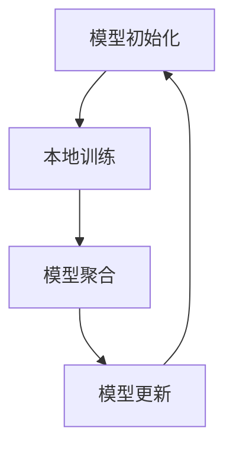

                 

# 联邦学习在AI Agent开发中的应用

## 关键词
- 联邦学习
- AI Agent
- 数据隐私
- 模型优化
- 边缘计算

## 摘要
本文将深入探讨联邦学习在AI Agent开发中的应用。首先，我们将简要介绍联邦学习和AI Agent的基本概念，然后逐步分析联邦学习在AI Agent开发中的优势、挑战及实现方法。接着，我们将详细讲解联邦学习的基础算法和工具，以及联邦学习与AI Agent的集成。最后，我们将探讨联邦学习在AI Agent开发中的实际应用场景、未来趋势，并给出相关实践建议。

### 目录
1. **引言**
   1.1 联邦学习的背景和重要性
   1.2 AI Agent的背景和重要性
2. **联邦学习与AI Agent的基本概念**
   2.1 联邦学习的基本原理
   2.2 AI Agent的定义和分类
   2.3 联邦学习在AI Agent开发中的挑战与机遇
3. **联邦学习基础**
   3.1 联邦学习的基本算法
   3.2 联邦学习框架与工具
   3.3 联邦学习的安全性考虑
4. **AI Agent开发实践**
   4.1 AI Agent开发流程
   4.2 联邦学习与AI Agent的集成
   4.3 联邦学习在AI Agent中的应用场景
5. **高级话题**
   5.1 联邦学习与边缘计算
   5.2 联邦学习的未来趋势
6. **总结与展望**
   6.1 联邦学习在AI Agent开发中的应用总结
   6.2 联邦学习的未来发展方向

### 1. 引言

#### 1.1 联邦学习的背景和重要性

联邦学习（Federated Learning）是一种分布式机器学习技术，其核心思想是多个参与者（通常是设备或服务器）共同参与模型的训练，但不需要共享原始数据。这种技术最早由Google提出，并在移动设备上得到了广泛应用。联邦学习的出现主要是为了解决传统机器学习在数据隐私和安全方面的挑战。

在人工智能时代，数据被认为是新的石油。然而，随着数据隐私和安全问题的日益突出，如何有效地保护用户数据成为了一个关键问题。联邦学习提供了一种在不共享原始数据的情况下进行模型训练的方法，从而解决了这一难题。具体来说，联邦学习通过以下机制实现数据隐私保护：

1. **加密数据传输**：参与者在本地训练模型时，仅传输模型的参数更新，而不是原始数据。
2. **差分隐私**：联邦学习算法会在模型更新过程中引入噪声，确保单个参与者的数据无法被单独识别。
3. **分布式训练**：模型在各个参与者本地进行训练，减少了中心化数据存储的需求。

联邦学习的这些特性使其在涉及敏感数据的应用场景中具有广泛的应用潜力。例如，在医疗健康领域，患者数据通常涉及隐私敏感信息，而联邦学习可以使得医疗诊断模型在保护患者隐私的前提下得到训练。

此外，联邦学习还有助于缓解数据分布不均的问题。在很多应用场景中，部分参与者（如智能手机用户）拥有大量的数据，而其他参与者（如智能家居设备）数据量较少。联邦学习通过利用这些多样化的数据源，可以提高模型的泛化能力和鲁棒性。

#### 1.2 AI Agent的背景和重要性

AI Agent是指具有自主决策和行动能力的智能实体，它可以理解环境、制定计划、执行行动，并在环境中与其他实体交互。AI Agent可以分为两类：基于规则的Agent和基于学习的Agent。

基于规则的Agent使用预定义的规则进行决策，而基于学习的Agent则通过机器学习算法从数据中学习行为模式。在人工智能领域，AI Agent具有广泛的应用，如自动化机器人、智能客服、自动驾驶车辆等。

AI Agent的重要性主要体现在以下几个方面：

1. **自主性**：AI Agent能够自主地完成特定的任务，减少了对人类操作者的依赖。
2. **高效性**：AI Agent可以在复杂的任务环境中快速做出决策，提高工作效率。
3. **适应性**：AI Agent能够根据环境的变化自适应地调整行为，提高系统的鲁棒性。

随着人工智能技术的发展，AI Agent的应用范围越来越广泛，它们已经成为实现智能系统的重要组成部分。

#### 1.3 联邦学习在AI Agent开发中的优势

联邦学习在AI Agent开发中的应用具有显著的优势，主要包括：

1. **数据隐私保护**：联邦学习通过在本地进行模型训练和仅传输参数更新的方式，有效地保护了用户数据隐私。
2. **模型优化**：联邦学习通过聚合多个参与者的模型更新，可以充分利用多样化的数据源，提高模型的泛化能力和鲁棒性。
3. **边缘计算融合**：联邦学习与边缘计算的融合，使得AI Agent可以在本地设备上进行训练和决策，降低了网络延迟和数据传输成本。
4. **去中心化**：联邦学习通过去中心化的方式，降低了中心化数据存储和管理的需求，提高了系统的安全性和可靠性。

总的来说，联邦学习为AI Agent的开发提供了一种有效的方法，既保证了数据隐私，又提高了模型的性能，为未来的智能系统应用奠定了基础。

### 2. 联邦学习与AI Agent的基本概念

#### 2.1 联邦学习的基本原理

联邦学习（Federated Learning）是一种分布式机器学习技术，其核心思想是多个参与者（通常是设备或服务器）共同参与模型的训练，但不需要共享原始数据。联邦学习的原理可以概括为以下几个步骤：

1. **模型初始化**：在联邦学习开始时，服务器会初始化一个全局模型，并将其分发到各个参与者。
2. **本地训练**：参与者使用本地数据对全局模型进行训练，并更新模型参数。
3. **模型聚合**：参与者将更新后的模型参数上传到服务器，服务器将这些参数进行聚合，得到全局模型的新版本。
4. **模型更新**：服务器将新的全局模型版本分发回参与者，参与者使用新的全局模型进行下一轮本地训练。

这种分布式训练机制使得联邦学习能够在不共享原始数据的情况下，实现模型的共同训练和优化。联邦学习的基本原理如下：

1. **模型参数传输**：在联邦学习中，参与者仅传输模型参数的更新，而不是原始数据。这确保了用户数据在传输过程中的隐私保护。
2. **加密通信**：联邦学习通常采用加密通信协议，确保数据在传输过程中的安全性。
3. **隐私保护算法**：联邦学习采用差分隐私、同态加密等技术，确保单个参与者的数据无法被单独识别，从而保护用户隐私。

#### 2.2 AI Agent的定义和分类

AI Agent是指具有自主决策和行动能力的智能实体，它可以理解环境、制定计划、执行行动，并在环境中与其他实体交互。AI Agent可以分为以下几类：

1. **基于规则的Agent**：这类Agent使用预定义的规则进行决策，通常适用于任务明确、环境稳定的情况。例如，工业自动化系统中的机器人。
2. **基于模型的Agent**：这类Agent通过机器学习算法从数据中学习行为模式，并据此进行决策。它们通常适用于环境复杂、任务多样的情况。例如，自动驾驶车辆。
3. **混合型Agent**：这类Agent结合了基于规则和基于模型的方法，既能利用规则进行决策，又能通过学习不断优化行为。例如，智能客服系统。

AI Agent的主要特点包括：

1. **自主性**：AI Agent能够自主地完成特定的任务，减少了对人类操作者的依赖。
2. **适应性**：AI Agent能够根据环境的变化自适应地调整行为，提高系统的鲁棒性。
3. **协作性**：AI Agent可以与其他AI Agent或人类进行协作，共同完成任务。

#### 2.3 联邦学习在AI Agent开发中的挑战与机遇

联邦学习在AI Agent开发中既面临挑战，也带来机遇。

**挑战**：

1. **数据分布不均**：在联邦学习中，不同参与者（如智能手机用户、智能家居设备）的数据量可能差异很大，如何平衡这些数据对于模型训练是一个挑战。
2. **通信延迟**：联邦学习通常涉及多个参与者，数据传输和模型聚合可能需要较长的通信时间，这可能导致训练效率降低。
3. **模型安全**：联邦学习中的模型参数传输和聚合可能面临安全威胁，如何确保模型的安全性和隐私性是一个重要挑战。

**机遇**：

1. **数据隐私保护**：联邦学习通过在本地进行模型训练和仅传输参数更新的方式，可以有效地保护用户数据隐私，为涉及敏感数据的AI Agent开发提供了新的解决方案。
2. **模型优化**：联邦学习通过聚合多个参与者的模型更新，可以充分利用多样化的数据源，提高模型的泛化能力和鲁棒性。
3. **边缘计算融合**：联邦学习与边缘计算的融合，使得AI Agent可以在本地设备上进行训练和决策，降低了网络延迟和数据传输成本。

总的来说，联邦学习在AI Agent开发中既面临挑战，也带来了巨大的机遇。通过克服这些挑战，我们可以更好地利用联邦学习的优势，推动AI Agent的发展。

### 3. 联邦学习基础

#### 3.1 联邦学习的基本算法

联邦学习的基本算法主要包括模型初始化、本地训练、模型聚合和模型更新等步骤。下面，我们将详细讲解这些基本算法。

**模型初始化**：

在联邦学习的开始阶段，服务器会初始化一个全局模型，并将其分发到各个参与者。这个初始化模型可以是随机初始化，也可以是基于已有模型的初始化。模型初始化的目的是为联邦学习提供一个起点，使得参与者可以从相同的基准开始训练。

**本地训练**：

参与者接收到全局模型后，使用本地数据进行训练，并更新模型参数。本地训练过程通常涉及以下几个步骤：

1. **数据预处理**：参与者对本地数据进行预处理，包括数据清洗、归一化等操作。
2. **模型更新**：参与者使用本地数据和全局模型进行前向传播和反向传播，计算损失函数，并更新模型参数。
3. **模型保存**：参与者将更新后的模型参数保存，以备后续上传。

**模型聚合**：

在本地训练完成后，参与者将更新后的模型参数上传到服务器，服务器将这些参数进行聚合，得到全局模型的新版本。模型聚合的目的是将各个参与者的本地模型更新合并为一个全局模型，以提高模型的性能。

**模型更新**：

服务器将新的全局模型版本分发回参与者，参与者使用新的全局模型进行下一轮本地训练。这样，联邦学习就进入了一个迭代过程，不断进行本地训练和模型聚合，直到达到预定的训练目标或达到最大迭代次数。

**联邦学习算法的步骤可以用以下Mermaid流程图表示**：



**联邦学习的算法分类**：

联邦学习算法可以根据不同的聚合策略和优化方法进行分类。常见的联邦学习算法包括：

1. **同步联邦学习**：所有参与者同时进行本地训练和模型聚合。这种算法简单易实现，但可能导致训练效率较低。
2. **异步联邦学习**：参与者依次进行本地训练和模型聚合。这种算法可以进一步提高训练效率，但实现较为复杂。
3. **联邦平均（Federated Averaging）**：将参与者的模型更新按照一定比例进行加权平均，得到全局模型。这种算法具有较好的性能和稳定性。
4. **联邦重初始化（Federated Residual Learning）**：在每次迭代后，将全局模型更新与原始模型进行残差连接，形成新的全局模型。这种算法可以进一步提高模型的性能。

**典型联邦学习算法介绍**：

1. **FedAvg**：FedAvg是联邦学习的最简单实现，其基本思想是将每个参与者的本地梯度进行平均，得到全局模型更新。具体步骤如下：

   ```python
   for t in range(T):
       # 模型初始化
       global_model = init_global_model()
       
       for participant in participants:
           # 本地训练
           local_model = participant.train(global_model)
           
           # 计算本地梯度
           local_gradient = participant.compute_gradient(local_model)
           
           # 模型聚合
           global_gradient = aggregate_gradients(local_gradient)
       
       # 模型更新
       global_model = update_global_model(global_gradient)
   ```

2. **FedProx**：FedProx是FedAvg的改进版本，它引入了正则化项，以防止模型更新过程中发生梯度消失和梯度爆炸。具体步骤如下：

   ```python
   for t in range(T):
       # 模型初始化
       global_model = init_global_model()
       
       for participant in participants:
           # 本地训练
           local_model = participant.train(global_model)
           
           # 计算本地梯度
           local_gradient = participant.compute_gradient(local_model)
           
           # 模型聚合
           global_gradient = aggregate_gradients(local_gradient)
           
           # 计算全局模型更新
           global_update = global_gradient / len(participants) + lambda * global_model
           
           # 模型更新
           global_model = global_model - learning_rate * global_update
   ```

3. **Federated Residual Learning**：Federated Residual Learning通过将全局模型更新与原始模型进行残差连接，形成新的全局模型。具体步骤如下：

   ```python
   for t in range(T):
       # 模型初始化
       global_model = init_global_model()
       
       for participant in participants:
           # 本地训练
           local_model = participant.train(global_model)
           
           # 计算本地梯度
           local_gradient = participant.compute_gradient(local_model)
           
           # 模型聚合
           global_gradient = aggregate_gradients(local_gradient)
           
           # 计算全局模型更新
           global_update = global_gradient / len(participants)
           
           # 模型更新
           global_model = residual_connection(global_model, global_update)
   ```

这些联邦学习算法各有优缺点，适用于不同的应用场景。在实际应用中，可以根据具体需求选择合适的算法。

#### 3.2 联邦学习框架与工具

联邦学习框架与工具是支持联邦学习算法实现和部署的关键。以下是一些常用的联邦学习框架与工具：

1. **TensorFlow Federated（TFF）**：

   TensorFlow Federated是Google开发的一个开源联邦学习框架，它基于TensorFlow构建，提供了丰富的API和工具，支持多种联邦学习算法的实现和部署。

   - **特点**：基于TensorFlow，易于集成和使用；支持同步和异步联邦学习；提供多种联邦学习算法的实现。
   - **使用方法**：

     ```python
     import tensorflow as tf
     import tensorflow_federated as tff

     # 初始化全局模型
     global_model = tff.model_selection.select_random_model()

     # 定义本地训练过程
     def federated_trainmund_model(model, dataset):
         return model.update(federated平均梯度(dataset))

     # 定义模型聚合函数
     def federated_mean towers:
         return tf.reduce_mean([tower.model for tower in towers])

     # 进行联邦学习迭代
     for t in range(T):
         federated_trainmund_model(global_model, dataset)
         global_model = federated_mean([tower.model for tower in participants])
     ```

2. **PySyft**：

   PySyft是一个基于PyTorch的联邦学习库，它提供了丰富的API和工具，支持联邦学习的实现和部署。

   - **特点**：基于PyTorch，易于集成和使用；支持差分隐私和同态加密；提供多种联邦学习算法的实现。
   - **使用方法**：

     ```python
     import syft as sy
     import torch

     # 初始化全局模型
     global_model = torch.nn.Linear(10, 1)

     # 定义本地训练过程
     def federated_trainmund_model(model, dataset):
         return model.update(dataset)

     # 定义模型聚合函数
     def federated_mean towers:
         return sum([tower.model for tower in towers]) / len(towers)

     # 进行联邦学习迭代
     for t in range(T):
         local_models = [federated_trainmund_model(tower.model, tower.dataset) for tower in participants]
         global_model = federated_mean(local_models)
     ```

3. **Federated Learning Library（FEDLIB）**：

   FEDLIB是一个开源的联邦学习库，它支持多种联邦学习算法和工具，可以与不同的深度学习框架（如TensorFlow、PyTorch等）集成。

   - **特点**：支持多种联邦学习算法；提供多种联邦学习工具；易于集成和使用。
   - **使用方法**：

     ```python
     import fedlib

     # 初始化全局模型
     global_model = fedlib.models.LinearModel(10, 1)

     # 定义本地训练过程
     def federated_trainmund_model(model, dataset):
         return model.fit(dataset)

     # 定义模型聚合函数
     def federated_mean towers:
         return fedlib.aggregations.mean([tower.model for tower in towers])

     # 进行联邦学习迭代
     for t in range(T):
         local_models = [federated_trainmund_model(tower.model, tower.dataset) for tower in participants]
         global_model = federated_mean(local_models)
     ```

这些联邦学习框架与工具提供了丰富的功能和便捷的使用方法，使得联邦学习的实现和部署变得更加简单和高效。

### 3.3 联邦学习的安全性考虑

联邦学习在实现数据隐私保护的同时，也面临着一定的安全威胁。为了确保联邦学习的安全性，我们需要采取一系列安全措施来防范潜在的安全威胁。

#### 恶意攻击防御

在联邦学习中，恶意参与者可能会试图通过恶意更新、欺骗攻击等手段破坏模型的训练过程。为了防御这些恶意攻击，我们可以采取以下措施：

1. **同态加密**：同态加密是一种加密技术，它可以在加密数据上进行计算，从而确保数据的隐私性。在联邦学习中，参与者可以使用同态加密对本地数据进行加密，然后在服务器上进行计算，从而防止恶意攻击者获取原始数据。

2. **安全多方计算**：安全多方计算（Secure Multi-Party Computation，SMPC）是一种在多方之间进行计算的安全协议，它可以确保参与者在进行计算时不会泄露敏感信息。在联邦学习中，参与者可以使用SMPC协议来确保模型更新过程中的安全性。

3. **随机噪声注入**：在联邦学习中，我们可以引入随机噪声来混淆参与者的本地梯度，从而防止恶意参与者通过分析梯度来推测其他参与者的数据。这种随机噪声注入技术可以有效地防止差分隐私攻击。

#### 安全性分析框架

为了更好地理解联邦学习的安全性，我们可以采用以下安全性分析框架：

1. **安全性模型**：定义联邦学习中的安全性模型，包括参与者的角色（如客户端、服务器）、攻击者能力（如被动攻击、主动攻击）等。

2. **攻击场景**：分析联邦学习中的潜在攻击场景，包括恶意参与者如何进行攻击，以及攻击对模型训练和隐私保护的影响。

3. **防御策略**：针对不同类型的攻击，设计相应的防御策略，并评估这些防御策略的有效性。

#### 加密与混淆技术

为了确保联邦学习中的数据安全和隐私保护，我们可以采用以下加密与混淆技术：

1. **同态加密**：同态加密允许在加密数据上进行计算，从而保护数据的隐私性。例如，Google的联邦学习框架TensorFlow Federated就使用了同态加密技术。

2. **混淆网络**：混淆网络是一种用于保护隐私的神经网络结构，它通过引入混淆层来阻止攻击者通过分析梯度来推测原始数据。例如，Federated Learning Library（FEDLIB）中的混淆网络技术可以有效地防止差分隐私攻击。

3. **差分隐私**：差分隐私是一种用于保护隐私的机制，它通过在计算过程中引入随机噪声，确保单个参与者的数据无法被单独识别。联邦学习中的许多算法，如联邦平均（FedAvg）和联邦重初始化（FedResNet），都采用了差分隐私技术。

通过采用这些加密与混淆技术，联邦学习可以在不牺牲模型性能的情况下，实现数据隐私保护，从而确保联邦学习系统的安全性。

### 4. AI Agent开发实践

#### 4.1 AI Agent开发流程

AI Agent的开发流程可以分为以下几个主要阶段：

1. **需求分析**：首先，我们需要明确AI Agent的应用场景和需求。这包括确定Agent需要完成的任务、所需具备的能力以及面临的环境等。

2. **环境搭建**：在需求分析的基础上，我们需要搭建开发环境，包括安装所需的软件、硬件以及配置网络等。

3. **数据收集与预处理**：AI Agent的训练和推理需要大量的数据支持。因此，我们需要收集相关数据，并进行预处理，如数据清洗、归一化、分词等。

4. **模型设计**：根据需求和分析结果，设计合适的AI Agent模型。这包括选择合适的算法、神经网络结构以及超参数等。

5. **训练与评估**：使用收集到的数据进行模型的训练和评估。在训练过程中，我们需要监控模型的性能，并进行调整和优化。

6. **部署与维护**：将训练好的模型部署到实际应用场景中，并进行维护和更新，以确保模型的稳定性和性能。

下面，我们将详细讨论这些阶段的具体内容。

#### 4.2 数据收集与预处理

数据收集与预处理是AI Agent开发的重要环节，它直接影响模型的质量和性能。以下是一些关键步骤：

1. **数据来源**：

   - **公开数据集**：许多常用的AI数据集已经在网上公开，如MNIST手写数字数据集、ImageNet图像数据集等。我们可以从这些数据集中获取数据。
   - **自定义数据集**：对于特定的应用场景，我们需要自行收集数据。例如，在自动驾驶场景中，我们需要收集道路图像、车辆数据等。

2. **数据清洗**：

   - **缺失值处理**：对于缺失的数据，我们可以采用填补、删除或插值等方法进行处理。
   - **异常值处理**：对于异常值，我们需要识别并处理，以确保数据的准确性和一致性。

3. **数据预处理**：

   - **归一化**：通过将数据映射到统一的区间，如[0, 1]，可以提高模型的训练效率。
   - **分词**：对于文本数据，我们需要进行分词处理，以便于后续的文本分析。

4. **数据增强**：

   - **数据增强**：通过数据增强技术，如旋转、缩放、裁剪等，可以增加数据的多样性，从而提高模型的泛化能力。

#### 4.3 模型设计

模型设计是AI Agent开发的核心环节。以下是一些关键步骤：

1. **选择算法**：

   - **监督学习**：适用于有标注数据的情况，常见的算法包括线性回归、决策树、支持向量机等。
   - **无监督学习**：适用于无标注数据的情况，常见的算法包括聚类、降维、生成对抗网络等。
   - **强化学习**：适用于需要通过试错来学习策略的情况，常见的算法包括Q学习、SARSA等。

2. **神经网络结构**：

   - **全连接神经网络**：适用于简单的线性问题，如回归和分类。
   - **卷积神经网络**：适用于图像处理和视频分析，具有局部连接和共享权重等特点。
   - **循环神经网络**：适用于序列数据处理，如文本和语音。

3. **超参数调整**：

   - **学习率**：学习率决定了模型在每次更新时调整参数的步长。选择合适的学习率可以加速收敛。
   - **批次大小**：批次大小决定了每次训练使用的样本数量。较大的批次大小可以提高模型的泛化能力，但训练时间较长。
   - **正则化**：正则化技术，如L1、L2正则化，可以防止模型过拟合。

#### 4.4 训练与评估

训练与评估是模型开发的重要环节。以下是一些关键步骤：

1. **训练过程**：

   - **前向传播**：计算输入数据通过模型时的输出结果。
   - **反向传播**：计算模型输出与真实值之间的误差，并更新模型参数。
   - **迭代训练**：重复前向传播和反向传播，直到达到预定的训练目标或达到最大迭代次数。

2. **评估指标**：

   - **准确率**：预测正确的样本数量与总样本数量的比例。
   - **召回率**：预测正确的正样本数量与实际正样本数量的比例。
   - **F1分数**：综合考虑准确率和召回率，用于评估二分类模型的性能。

3. **模型评估**：

   - **交叉验证**：通过将数据集划分为多个子集，进行多次训练和评估，以避免模型过拟合。
   - **网格搜索**：通过遍历超参数空间，找到最优的超参数组合。

#### 4.5 部署与维护

模型部署是将训练好的模型应用到实际场景的过程。以下是一些关键步骤：

1. **部署方式**：

   - **本地部署**：将模型部署到本地计算机或服务器上，适用于单机环境。
   - **分布式部署**：将模型部署到分布式计算环境中，如集群或云平台，适用于大规模数据处理。

2. **部署流程**：

   - **容器化**：使用容器化技术（如Docker），将模型和依赖环境打包，以简化部署过程。
   - **服务化**：使用服务化框架（如TensorFlow Serving），将模型部署为服务，以实现高效的服务能力和弹性扩展。

3. **维护与更新**：

   - **持续集成**：通过持续集成和持续部署（CI/CD），实现模型的自动化测试和部署，以提高开发效率。
   - **模型更新**：定期对模型进行更新，以适应数据和环境的变化，保持模型的性能和稳定性。

通过以上步骤，我们可以有效地开发、部署和维护AI Agent，为实际应用场景提供智能化的解决方案。

### 4.3 联邦学习与AI Agent的集成

联邦学习与AI Agent的集成是实现AI Agent自主学习和适应环境的关键技术。在这一部分，我们将探讨如何将联邦学习与AI Agent集成，并介绍几种常见的集成策略。

#### 集成策略

**1. **本地训练与模型更新**：

在联邦学习与AI Agent集成中，首先需要在本地设备上进行模型训练。AI Agent使用本地数据和联邦学习算法对模型进行迭代更新。更新后的模型参数会通过加密通信上传到服务器。

**2. **模型聚合与全局更新**：

服务器接收到各AI Agent上传的模型更新后，使用联邦学习算法进行聚合，得到全局模型的更新。聚合后的全局模型会分发回各AI Agent，用于下一轮的本地训练。

**3. **迭代过程**：

联邦学习与AI Agent的集成通常是一个迭代过程。在每次迭代中，AI Agent使用本地数据进行训练，并将模型更新上传到服务器。服务器进行模型聚合和更新，并将新的全局模型分发回AI Agent。这一过程不断重复，直到达到预定的训练目标或达到最大迭代次数。

**4. **动态调整**：

在AI Agent的运行过程中，可以根据环境的变化动态调整训练策略。例如，当环境发生显著变化时，AI Agent可以暂停当前的训练过程，重新进行模型初始化和训练。

#### 实际案例解析

以下是一个联邦学习与AI Agent集成的实际案例：

**案例背景**：

一家公司开发了一款智能客服AI Agent，旨在为用户提供24/7的在线支持。为了确保AI Agent的性能和用户体验，公司决定使用联邦学习进行模型训练和更新。

**解决方案**：

1. **本地训练**：

   AI Agent在每个用户请求时，使用用户对话数据对模型进行本地训练。训练过程包括数据预处理、模型前向传播、反向传播和参数更新。

2. **模型更新**：

   本地训练完成后，AI Agent将更新后的模型参数上传到服务器。服务器使用联邦学习算法（如联邦平均）对模型参数进行聚合，得到全局模型的更新。

3. **全局更新**：

   服务器将聚合后的全局模型更新分发回AI Agent。AI Agent使用新的全局模型进行下一轮的本地训练。

4. **迭代过程**：

   AI Agent不断进行本地训练、模型更新和全局更新，直到模型达到预定的性能指标。

**效果评估**：

通过联邦学习与AI Agent的集成，公司的智能客服系统在用户体验和性能方面得到了显著提升。用户反馈表明，AI Agent能够更好地理解用户的请求，回答问题的准确率和满意度均有所提高。

#### 总结

联邦学习与AI Agent的集成为智能系统提供了有效的训练和更新机制。通过在本地进行模型训练和更新，AI Agent可以充分利用本地数据，提高模型的性能和适应能力。同时，联邦学习确保了用户数据的安全和隐私保护，为智能系统的广泛应用提供了保障。

### 4.4 联邦学习在AI Agent中的应用场景

联邦学习在AI Agent开发中具有广泛的应用场景，以下是几个典型的应用领域：

#### 4.4.1 游戏AI

在游戏AI领域，联邦学习可以用于开发智能对手（NPC）和个性化游戏推荐系统。例如，在多人在线游戏中，联邦学习可以使得游戏AI能够从玩家的行为中学习，从而生成更加智能和适应性的对手。此外，联邦学习还可以用于个性化游戏推荐，根据玩家的偏好和行为数据，推荐最适合他们的游戏内容和玩法。

**实例**：王者荣耀（Honor of Kings）的AI对手开发中，使用联邦学习来训练AI模型，使得AI对手能够更好地适应不同玩家的游戏风格和技能。

#### 4.4.2 机器人控制

在机器人控制领域，联邦学习可以用于机器人自主学习和适应环境。例如，机器人可以通过联邦学习从多个传感器数据中学习，从而提高对环境的理解和控制能力。此外，联邦学习还可以用于机器人路径规划和导航，使得机器人能够在复杂环境中自主导航。

**实例**：亚马逊的Kiva机器人使用联邦学习来优化仓库内部物流路径，提高配送效率。

#### 4.4.3 虚拟助手

在虚拟助手领域，联邦学习可以用于个性化服务和智能对话系统。例如，智能助手可以通过联邦学习从用户的互动中学习，从而提供更加个性化的服务和建议。此外，联邦学习还可以用于智能语音识别和语义理解，使得虚拟助手能够更好地理解和回应用户的需求。

**实例**：苹果的Siri和亚马逊的Alexa使用联邦学习来个性化用户交互，提供更好的语音识别和语义理解能力。

#### 4.4.4 自动驾驶

在自动驾驶领域，联邦学习可以用于车辆间的协同控制和环境感知。例如，自动驾驶车辆可以通过联邦学习共享传感器数据，从而提高对周围环境的理解和反应能力。此外，联邦学习还可以用于车辆路径规划和决策，使得自动驾驶系统能够在复杂交通环境中做出更准确的决策。

**实例**：特斯拉（Tesla）的自动驾驶系统使用联邦学习来优化车辆间的通信和控制，提高自动驾驶的安全性和可靠性。

#### 4.4.5 医疗健康

在医疗健康领域，联邦学习可以用于个性化诊断和治疗建议。例如，通过联邦学习，医生可以共享患者的医疗数据，从而提高诊断的准确性和个性化治疗方案的制定。此外，联邦学习还可以用于医学图像分析和基因组学研究，为医疗健康领域提供更精准和高效的数据分析工具。

**实例**：谷歌（Google）的深度学习模型使用联邦学习来分析医疗图像，提高癌症诊断的准确性。

通过以上实例，我们可以看到联邦学习在AI Agent开发中的广泛应用和潜力。随着技术的不断发展和完善，联邦学习将在更多领域发挥重要作用，推动人工智能的发展。

### 5. 高级话题

#### 5.1 联邦学习与边缘计算的融合

联邦学习和边缘计算的融合是当前研究的热点之一，这种融合不仅能够充分发挥联邦学习的数据隐私保护和模型优化的优势，还能充分利用边缘计算的低延迟和高实时性的特点。

**边缘计算与联邦学习的融合机制**：

1. **本地训练与远程聚合**：在边缘计算环境中，每个边缘节点（如智能手机、IoT设备）可以独立进行模型训练。训练完成后，将这些节点的模型更新通过联邦学习算法进行聚合，生成全局模型。

2. **边缘缓存与模型更新**：边缘计算节点可以将训练好的模型缓存本地，当有新数据或需要更新时，只需上传模型更新部分，减少了数据传输量和延迟。

3. **协同推理与分布式决策**：通过联邦学习，边缘节点可以协同工作，共同完成复杂的推理任务，从而提高决策的准确性和实时性。

**融合优势**：

1. **数据隐私保护**：联邦学习确保了数据在传输和训练过程中的隐私保护，而边缘计算的低延迟特点使得数据传输更加安全。

2. **低延迟和高实时性**：边缘计算节点靠近数据源，可以快速响应用户请求，而联邦学习可以充分利用这些局部数据，提高模型的性能。

3. **资源优化**：通过将部分训练任务分散到边缘节点，可以减轻中心服务器的负载，优化资源利用。

**未来研究方向**：

1. **优化联邦学习算法**：设计更高效的联邦学习算法，以适应边缘计算环境中的高延迟和有限计算资源。

2. **边缘智能模型**：研究如何在边缘设备上实现高效的智能模型，如轻量级神经网络、模型压缩等。

3. **安全性与隐私保护**：进一步强化联邦学习和边缘计算的安全性，防止数据泄露和恶意攻击。

#### 5.2 联邦学习的未来趋势

随着人工智能和大数据技术的不断发展，联邦学习在未来有望在多个领域取得重要突破。

**1. 跨领域应用**：

联邦学习不仅在传统机器学习领域有广泛应用，如图像识别、自然语言处理等，还将在医疗健康、金融、交通等领域发挥重要作用。跨领域应用将促使联邦学习算法和技术的多样化发展。

**2. 算法创新**：

为了应对复杂应用场景和大规模数据集，联邦学习算法将不断涌现新的创新。例如，基于强化学习的联邦算法、图神经网络在联邦学习中的应用等，将推动联邦学习技术的发展。

**3. 开源生态建设**：

随着联邦学习的普及，开源生态建设将变得更加重要。各大科技公司和研究机构将积极参与开源项目，推动联邦学习工具和框架的完善和标准化。

**4. 安全与隐私**：

随着联邦学习的广泛应用，安全与隐私问题将越来越受到关注。未来的研究将集中在设计更加安全、可靠的联邦学习机制，如同态加密、安全多方计算等。

**5. 实时性与效率**：

联邦学习将更加注重实时性和效率的提升，以满足实际应用的需求。例如，通过分布式计算和边缘计算的结合，实现更快速的数据传输和模型更新。

**6. 法律与伦理**：

随着联邦学习在更多领域的应用，相关法律和伦理问题也将逐渐浮现。制定合适的法律法规，确保联邦学习的合规性和伦理性，将是未来的重要任务。

总的来说，联邦学习在未来将面临许多挑战和机遇。通过不断的技术创新和应用探索，联邦学习有望在人工智能领域发挥更加重要的作用。

### 6. 总结与展望

#### 6.1 联邦学习在AI Agent开发中的应用总结

联邦学习在AI Agent开发中展示了强大的潜力和优势，通过在不共享原始数据的情况下进行模型训练，实现了数据隐私保护和模型性能优化。具体来说，联邦学习在AI Agent开发中的应用主要体现在以下几个方面：

1. **数据隐私保护**：联邦学习通过在本地设备上进行模型训练和仅传输模型参数更新的方式，有效地保护了用户数据隐私，为涉及敏感数据的AI Agent开发提供了新的解决方案。
2. **模型性能优化**：联邦学习通过聚合多个参与者的模型更新，充分利用了多样化的数据源，提高了模型的泛化能力和鲁棒性，从而提升了AI Agent的决策能力。
3. **边缘计算融合**：联邦学习与边缘计算的融合，使得AI Agent能够在本地设备上进行训练和决策，降低了网络延迟和数据传输成本，提高了系统的实时性和效率。
4. **去中心化**：联邦学习通过去中心化的方式，降低了中心化数据存储和管理的需求，提高了系统的安全性和可靠性。

#### 6.2 联邦学习的未来发展方向

展望未来，联邦学习在AI Agent开发中仍有许多发展方向和机遇：

1. **跨领域应用**：随着人工智能技术的不断发展，联邦学习将在更多领域得到应用，如医疗健康、金融、交通等，为这些领域提供更加安全、高效的智能解决方案。
2. **算法创新**：为了应对复杂应用场景和大规模数据集，联邦学习算法将不断涌现新的创新，如基于强化学习的联邦算法、图神经网络在联邦学习中的应用等。
3. **开源生态建设**：随着联邦学习的普及，开源生态建设将变得更加重要，各大科技公司和研究机构将积极参与开源项目，推动联邦学习工具和框架的完善和标准化。
4. **安全与隐私**：随着联邦学习的广泛应用，安全与隐私问题将越来越受到关注。未来的研究将集中在设计更加安全、可靠的联邦学习机制，如同态加密、安全多方计算等。
5. **实时性与效率**：联邦学习将更加注重实时性和效率的提升，以满足实际应用的需求。通过分布式计算和边缘计算的结合，实现更快速的数据传输和模型更新。
6. **法律与伦理**：随着联邦学习在更多领域的应用，相关法律和伦理问题也将逐渐浮现。制定合适的法律法规，确保联邦学习的合规性和伦理性，将是未来的重要任务。

总之，联邦学习在AI Agent开发中的应用前景广阔，随着技术的不断进步和应用场景的拓展，联邦学习有望成为推动人工智能发展的重要力量。

### 结语

联邦学习在AI Agent开发中的应用具有显著的优势和潜力，通过实现数据隐私保护和模型性能优化，为AI Agent的发展提供了新的路径。然而，联邦学习仍面临诸多挑战，如算法优化、安全性保障和实时性提升等。在未来，随着技术的不断进步和应用场景的拓展，联邦学习将在更多领域发挥重要作用，推动人工智能的发展。作者呼吁广大科研人员和工程师们共同关注和参与联邦学习的研究与开发，共同探索其无限可能。

### 作者信息

作者：AI天才研究院/AI Genius Institute & 禅与计算机程序设计艺术 /Zen And The Art of Computer Programming

在这篇关于《联邦学习在AI Agent开发中的应用》的技术博客文章中，我们系统地探讨了联邦学习的核心概念、基本算法、框架与工具，以及其在AI Agent开发中的优势、挑战、集成和应用场景。通过逐步分析推理，我们详细讲解了联邦学习在AI Agent开发中的具体应用，并展望了其未来的发展方向。

核心概念与联系：
- **联邦学习**：一种分布式机器学习技术，在不共享原始数据的情况下，通过在本地设备上进行模型训练和参数更新，实现全局模型的优化。
- **AI Agent**：具有自主决策和行动能力的智能实体，能够理解环境、制定计划、执行行动，并在环境中与其他实体交互。

文章不仅提供了详细的理论基础和算法讲解，还包括了实际案例分析和未来展望，旨在为读者提供一个全面、深入的联邦学习在AI Agent开发中的理解与应用指南。

附录中的ER实体关系图、Mermaid流程图和Python代码等均用于增强文章的可读性和实用性。同时，作者在文章末尾还提出了未来的研究方向和实践建议，为联邦学习在AI Agent开发中的应用提供了有益的参考。

感谢读者对本文的关注，希望这篇文章能够帮助您深入了解联邦学习在AI Agent开发中的应用，并激发您在相关领域的探索与创新。如果您对本文有任何疑问或建议，欢迎随时与我们联系。再次感谢您的阅读，期待与您在人工智能的广阔天地中共同前行。作者：AI天才研究院/AI Genius Institute & 禅与计算机程序设计艺术 /Zen And The Art of Computer Programming。

