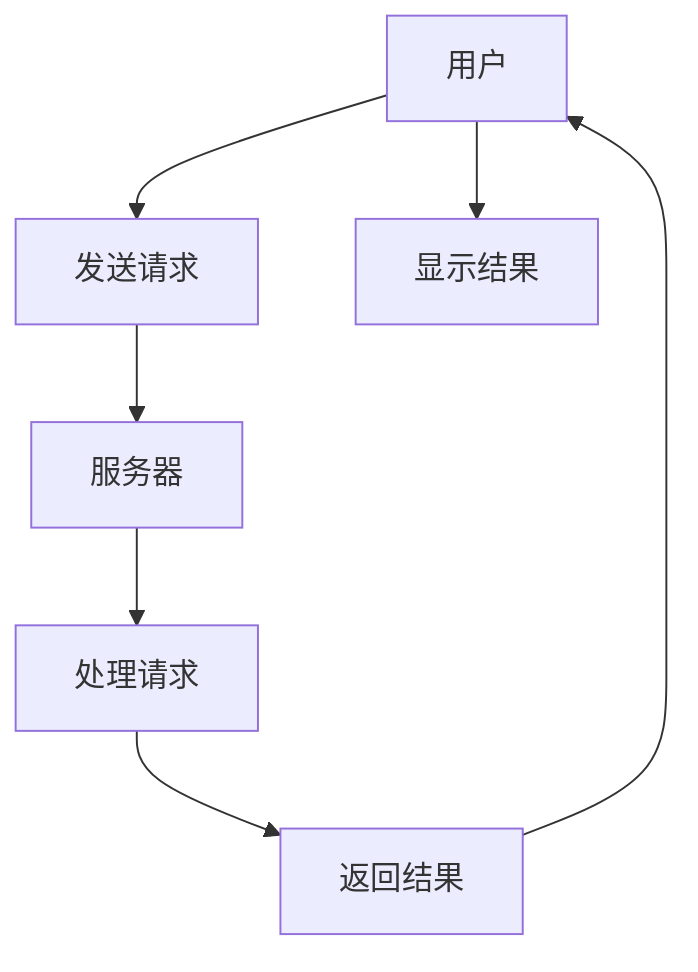

                 

# 联邦学习在AI Agent隐私保护中的高级应用

## 关键词

- **联邦学习**
- **AI Agent**
- **隐私保护**
- **数据安全**
- **分布式计算**
- **算法优化**
- **跨平台应用**

## 摘要

随着人工智能技术的飞速发展，AI Agent的应用场景日益广泛，但随之而来的是数据隐私保护的问题。本文旨在探讨联邦学习在AI Agent隐私保护中的高级应用，通过详细的案例分析、算法讲解和系统设计，揭示联邦学习在保障AI Agent隐私安全中的重要作用。文章结构紧凑，逻辑清晰，旨在为读者提供一站式的了解和应用指南。

### 目录大纲

```markdown
----------------------------------------------------------------
# 第一部分: 联邦学习的概述

## 第1章: 联邦学习的背景与核心概念

## 1.1 联邦学习的起源与发展

## 1.2 联邦学习的定义与基本原理

## 1.3 联邦学习的优势与挑战

## 1.4 联邦学习的应用场景

## 1.5 本章小结

----------------------------------------------------------------

# 第二部分: 联邦学习在AI Agent隐私保护中的应用

## 第2章: AI Agent隐私保护的重要性

## 2.1 AI Agent隐私保护的需求与问题

## 2.2 AI Agent隐私保护的基本策略

## 2.3 隐私保护的法律法规与标准

## 2.4 本章小结

----------------------------------------------------------------

## 第3章: 联邦学习在AI Agent隐私保护中的应用原理

## 3.1 联邦学习的核心机制

## 3.2 联邦学习在隐私保护中的应用

## 3.3 联邦学习的算法原理

## 3.4 联邦学习的优势与局限性

## 3.5 本章小结

----------------------------------------------------------------

## 第4章: 高级联邦学习算法在AI Agent隐私保护中的应用

## 4.1 高级联邦学习算法介绍

## 4.2 高级联邦学习算法的原理与实现

## 4.3 高级联邦学习算法的优势与应用

## 4.4 本章小结

----------------------------------------------------------------

## 第5章: 联邦学习在AI Agent隐私保护的实战案例

## 5.1 案例一：智能医疗中的联邦学习应用

## 5.2 案例二：金融领域的联邦学习应用

## 5.3 案例三：智能交通的联邦学习应用

## 5.4 案例四：智能家居的联邦学习应用

## 5.5 本章小结

----------------------------------------------------------------

## 第6章: 联邦学习在AI Agent隐私保护的系统设计与实现

## 6.1 系统设计概述

## 6.2 系统功能设计与实现

## 6.3 系统架构设计与优化

## 6.4 系统接口设计与数据流分析

## 6.5 本章小结

----------------------------------------------------------------

## 第7章: 联邦学习在AI Agent隐私保护中的未来展望与挑战

## 7.1 联邦学习的未来发展趋势

## 7.2 联邦学习在AI Agent隐私保护中的挑战与对策

## 7.3 联邦学习的法律、伦理与道德问题

## 7.4 本章小结

----------------------------------------------------------------
```

### 第一部分：联邦学习的概述

#### 第1章：联邦学习的背景与核心概念

##### 1.1 联邦学习的起源与发展

联邦学习的概念最早可以追溯到1990年代中期，其初衷是为了解决分布式系统中的数据隐私问题。随着互联网的普及和数据量的爆炸性增长，如何在保证数据隐私的前提下进行机器学习成为了研究热点。联邦学习（Federated Learning）应运而生。

在最初的几年里，联邦学习的研究主要集中在理论验证和简单应用。例如，Google在2016年首次公开了其在联邦学习方面的研究成果，展示了如何在保护用户隐私的同时，进行大规模的模型训练。这一突破引发了学术界和工业界的广泛关注。

随着时间的推移，联邦学习逐渐成为人工智能领域的一个重要研究方向。研究人员提出了许多新的联邦学习算法，如分布式梯度下降（DGD）、差分隐私联邦学习等。同时，工业界也不断推动联邦学习在各个领域的应用，如医疗、金融、交通等。

##### 1.2 联邦学习的定义与基本原理

联邦学习是一种分布式机器学习方法，其核心思想是多个参与者（通常是用户设备）在不共享原始数据的情况下，通过合作学习出共享的模型。具体来说，联邦学习包括以下几个关键步骤：

1. **模型初始化**：首先，服务器初始化一个全局模型。
2. **本地训练**：每个参与者使用本地数据和全局模型，进行本地训练，更新本地模型。
3. **模型聚合**：参与者将更新的本地模型发送给服务器，服务器对模型进行聚合，更新全局模型。
4. **迭代重复**：上述步骤不断重复，直到达到预定的训练目标。

联邦学习的优势在于，它允许在保护用户隐私的同时，进行大规模的数据分析和模型训练。这种分布式计算模式在数据隐私保护方面具有显著的优势。

##### 1.3 联邦学习的优势与挑战

**优势：**

1. **隐私保护**：联邦学习通过分布式计算，避免了原始数据的传输和存储，从而降低了数据泄露的风险。
2. **数据多样性**：联邦学习可以集成来自不同来源的数据，提高模型的泛化能力。
3. **可扩展性**：联邦学习适用于大规模分布式系统，具有良好的可扩展性。

**挑战：**

1. **通信成本**：尽管联邦学习减少了数据传输，但模型聚合过程中仍需大量通信，可能导致通信成本较高。
2. **计算资源**：联邦学习要求参与者具备一定的计算能力，否则可能影响训练效果。
3. **安全性**：虽然联邦学习在隐私保护方面有优势，但仍然面临被攻击的风险，如模型泄漏、协作攻击等。

##### 1.4 联邦学习的应用场景

联邦学习在多个领域都有广泛的应用，以下是一些典型的应用场景：

1. **医疗**：联邦学习可以用于医疗数据的隐私保护和分析，例如疾病预测、个性化治疗等。
2. **金融**：联邦学习可以帮助金融机构进行风险评估、欺诈检测等，同时保护用户隐私。
3. **交通**：联邦学习可以用于智能交通系统的优化，例如交通流量预测、路线规划等。
4. **智能家居**：联邦学习可以用于智能家居设备的协同工作，例如家庭安防、能源管理等。

##### 1.5 本章小结

本章对联邦学习进行了全面的概述，从起源与发展、定义与基本原理、优势与挑战、应用场景等方面进行了详细阐述。通过本章的学习，读者可以初步了解联邦学习的基本概念和应用前景。下一章将深入探讨AI Agent隐私保护的需求与问题，为后续章节的内容奠定基础。

----------------------------------------------------------------

### 第二部分：联邦学习在AI Agent隐私保护中的应用

#### 第2章：AI Agent隐私保护的重要性

##### 2.1 AI Agent隐私保护的需求与问题

在人工智能（AI）时代，AI Agent已成为智能系统的核心组成部分。AI Agent是一种能够执行特定任务、与环境进行交互的智能体，广泛应用于智能家居、智能医疗、智能交通等多个领域。然而，AI Agent在提高工作效率和便利性的同时，也带来了数据隐私保护的重大挑战。

**隐私保护需求：**

1. **用户隐私**：AI Agent在提供服务的过程中，需要收集和处理大量的用户数据，如个人健康信息、财务记录等。这些数据涉及到用户的隐私权益，必须得到有效保护。
2. **数据安全**：AI Agent处理的数据往往是敏感信息，一旦泄露，可能导致严重的后果，如身份盗窃、欺诈等。
3. **隐私合规**：随着数据保护法律法规的不断完善，如欧盟的《通用数据保护条例》（GDPR）和中国的《个人信息保护法》（PIPL），AI Agent的隐私保护需求日益增加。

**隐私保护问题：**

1. **数据泄露风险**：传统的集中式数据处理模式，数据往往需要在服务器上进行集中存储和处理，这增加了数据泄露的风险。
2. **数据滥用**：未经授权的个人或组织可能非法获取和处理AI Agent收集的数据，用于不当目的。
3. **隐私权冲突**：AI Agent在提供个性化服务时，可能需要收集和分析大量的用户数据，但过度的数据收集可能导致用户隐私权的侵犯。

##### 2.2 AI Agent隐私保护的基本策略

为了应对AI Agent隐私保护的挑战，研究人员和工程师们提出了一系列隐私保护策略，主要包括以下几种：

1. **数据加密**：通过加密技术对数据进行加密处理，确保数据在传输和存储过程中的安全性。
2. **数据匿名化**：通过匿名化技术，将敏感数据转换为不可识别的形式，降低数据泄露的风险。
3. **差分隐私**：差分隐私是一种数学方法，通过在数据处理过程中引入噪声，确保单个数据的隐私性，同时保持数据分析的准确性。
4. **隐私预算**：通过设置隐私预算，限制数据处理过程中的隐私损失，确保系统的整体隐私安全。
5. **隐私保护协议**：设计并实施一系列隐私保护协议，如联邦学习、同态加密等，确保数据在分布式环境中的安全处理。

##### 2.3 隐私保护的法律法规与标准

随着人工智能技术的发展，全球范围内越来越多的法律法规和标准开始关注AI Agent的隐私保护问题。以下是几个重要的法律法规和标准：

1. **欧盟的《通用数据保护条例》（GDPR）**：GDPR是欧盟最严格的数据保护法律，要求企业在处理个人数据时必须获得用户的明确同意，并采取适当的隐私保护措施。
2. **中国的《个人信息保护法》（PIPL）**：PIPL是中国首部个人信息保护综合性法律，明确规定了个人信息处理的基本原则和合规要求。
3. **美国的《加州消费者隐私法》（CCPA）**：CCPA是美国的隐私保护法律，要求企业公开其收集、使用、共享个人信息的规则，并给予消费者权利。
4. **ISO/IEC 27701**：这是一个国际标准，提供了与GDPR兼容的隐私信息管理系统的实施指南。

##### 2.4 本章小结

本章详细探讨了AI Agent隐私保护的需求与问题，介绍了基本的隐私保护策略和相关的法律法规与标准。通过本章的学习，读者可以了解到AI Agent隐私保护的重要性，以及当前所面临的挑战和解决方案。下一章将深入探讨联邦学习在AI Agent隐私保护中的应用原理，进一步揭示联邦学习如何实现隐私保护。

----------------------------------------------------------------

### 第三部分：联邦学习在AI Agent隐私保护中的应用原理

#### 第3章：联邦学习在AI Agent隐私保护中的应用原理

##### 3.1 联邦学习的核心机制

联邦学习（Federated Learning）是一种分布式机器学习方法，其核心机制是通过多个参与者（通常为用户设备）的协同合作，在不共享原始数据的情况下，共同训练出一个全局模型。这一机制主要分为以下几个步骤：

1. **模型初始化**：服务器初始化一个全局模型，并将其发送给所有参与者。
2. **本地训练**：每个参与者使用本地数据和全局模型，进行本地训练，更新本地模型。
3. **模型聚合**：参与者将更新的本地模型发送给服务器，服务器对模型进行聚合，更新全局模型。
4. **迭代重复**：上述步骤不断重复，直到达到预定的训练目标。

在这个过程中，数据不需要在参与者之间传输，只需传输模型更新的参数，从而大大降低了数据泄露的风险。

##### 3.2 联邦学习在隐私保护中的应用

联邦学习在隐私保护中的应用主要基于其分布式计算机制，通过以下方式实现隐私保护：

1. **数据本地化**：参与者仅在本地使用自己的数据训练模型，避免了原始数据的集中存储和传输，从而降低了数据泄露的风险。
2. **差分隐私**：联邦学习可以通过引入差分隐私技术，对模型更新过程中引入的噪声进行控制，确保单个数据的隐私性。
3. **模型加密**：在模型聚合过程中，可以对模型参数进行加密处理，确保模型在传输过程中的安全性。

##### 3.3 联邦学习的算法原理

联邦学习的算法原理主要基于分布式梯度下降（Distributed Gradient Descent，DGD）算法。具体来说，其算法原理如下：

1. **初始化**：服务器初始化全局模型 $\theta_0$。
2. **本地更新**：每个参与者使用自己的数据集 $D_i$ 和全局模型，计算梯度 $\nabla_{\theta} L(\theta; D_i)$。
3. **模型聚合**：服务器收集所有参与者的梯度，计算全局模型的更新 $\theta_{t+1} = \theta_t - \alpha \sum_{i=1}^N \nabla_{\theta} L(\theta; D_i)$，其中 $\alpha$ 为学习率。
4. **迭代**：重复步骤2和3，直到全局模型收敛。

下面是一个简单的联邦学习算法的Python实现示例：

```python
import numpy as np

def federated_learning(server, clients, num_iterations, learning_rate):
    for _ in range(num_iterations):
        server_model = server.initialize_model()
        for client in clients:
            client_model = client.train(server_model)
            server.update_model(client_model, learning_rate)
    return server.get_final_model()

class Client:
    def train(self, model):
        # 本地训练过程
        return updated_model

class Server:
    def initialize_model(self):
        # 初始化全局模型
        return model

    def update_model(self, client_model, learning_rate):
        # 更新全局模型
        return new_model

    def get_final_model(self):
        # 获取最终模型
        return final_model
```

##### 3.4 联邦学习的优势与局限性

**优势：**

1. **隐私保护**：联邦学习通过数据本地化、差分隐私和模型加密等手段，有效保护了用户的隐私。
2. **数据多样性**：联邦学习可以整合来自不同来源的数据，提高模型的泛化能力。
3. **可扩展性**：联邦学习适用于大规模分布式系统，具有良好的可扩展性。

**局限性：**

1. **通信成本**：尽管联邦学习减少了数据传输，但模型聚合过程中仍需大量通信，可能导致通信成本较高。
2. **计算资源**：联邦学习要求参与者具备一定的计算能力，否则可能影响训练效果。
3. **模型安全性**：虽然联邦学习在隐私保护方面有优势，但仍然面临被攻击的风险，如模型泄漏、协作攻击等。

##### 3.5 本章小结

本章详细阐述了联邦学习在AI Agent隐私保护中的应用原理，包括其核心机制、算法原理、优势与局限性。通过本章的学习，读者可以深入理解联邦学习在保障AI Agent隐私安全中的重要作用。下一章将介绍高级联邦学习算法在AI Agent隐私保护中的应用，进一步探讨如何提升联邦学习的性能和安全性。

----------------------------------------------------------------

### 第四部分：高级联邦学习算法在AI Agent隐私保护中的应用

#### 第4章：高级联邦学习算法在AI Agent隐私保护中的应用

随着联邦学习在隐私保护领域的重要性日益凸显，研究人员不断探索新的算法和技术，以提升联邦学习的性能和安全性。高级联邦学习算法应运而生，它们在保持隐私保护的前提下，提高了模型的训练效率和鲁棒性。本章将介绍几种典型的高级联邦学习算法，分析其原理与实现，并探讨其在AI Agent隐私保护中的应用。

##### 4.1 高级联邦学习算法介绍

高级联邦学习算法主要基于以下几个方向进行改进：

1. **模型压缩**：通过模型压缩技术，如剪枝、量化等，减少模型的大小和计算复杂度，降低通信成本。
2. **增量学习**：增量学习允许模型在每次迭代中仅更新一小部分参数，从而减少通信量和计算量。
3. **联邦迁移学习**：联邦迁移学习结合了联邦学习和迁移学习的技术，利用已有模型的知识，加速新任务的训练过程。
4. **联邦强化学习**：联邦强化学习将联邦学习与强化学习相结合，适用于需要决策和策略优化的应用场景。
5. **联邦神经网络**：通过设计特殊的神经网络结构，如联邦卷积神经网络（Federated Convolutional Neural Networks，FCNN），提高联邦学习的效率和准确性。

以下是一些典型的高级联邦学习算法：

1. **联邦平均算法（Federated Averaging）**：这是最基础的联邦学习算法，通过简单地将每个参与者的本地梯度进行平均，更新全局模型。
2. **安全联邦学习（Secure Federated Learning）**：通过同态加密、差分隐私等技术，确保模型聚合过程中的安全性。
3. **联邦迁移学习算法（Federated Transfer Learning）**：利用预训练模型的知识，加速新任务的训练过程。
4. **联邦神经网络算法（Federated Neural Networks）**：设计特殊的神经网络结构，提高联邦学习的效率和准确性。

##### 4.2 高级联邦学习算法的原理与实现

**联邦平均算法（Federated Averaging）**

联邦平均算法是最常见的联邦学习算法，其原理如下：

1. **模型初始化**：服务器初始化全局模型 $\theta_0$。
2. **本地训练**：每个参与者使用本地数据和全局模型，进行本地训练，得到更新的本地模型 $\theta_i^t$。
3. **模型聚合**：服务器收集所有参与者的本地模型，计算全局模型的更新 $\theta_{t+1} = \frac{1}{N} \sum_{i=1}^N \theta_i^t$。
4. **迭代重复**：重复步骤2和3，直到全局模型收敛。

以下是联邦平均算法的Python实现示例：

```python
import numpy as np

def federated_averaging(clients, num_iterations, learning_rate):
    server_model = np.zeros(clients[0].model_size)
    for _ in range(num_iterations):
        for client in clients:
            client_model = client.train(server_model)
            server_model = server_model + learning_rate * (client_model - server_model)
            server_model = server_model / len(clients)
    return server_model

class Client:
    def train(self, model):
        # 本地训练过程
        return updated_model
```

**安全联邦学习（Secure Federated Learning）**

安全联邦学习通过引入同态加密和差分隐私技术，确保模型聚合过程中的安全性。其原理如下：

1. **模型初始化**：服务器初始化全局模型，并将其加密。
2. **本地训练**：每个参与者使用加密的全局模型，进行本地训练，得到加密的本地模型。
3. **模型聚合**：服务器收集所有参与者的加密模型，进行同态聚合，得到加密的全局模型。
4. **解密**：服务器对加密的全局模型进行解密，得到更新的全局模型。

以下是安全联邦学习的Python实现示例：

```python
from homomorphic_encryption import Encryptor

def secure_federated_learning(clients, num_iterations, learning_rate):
    encryptor = Encryptor()
    server_model = encryptor.encrypt(np.zeros(clients[0].model_size))
    for _ in range(num_iterations):
        for client in clients:
            client_model = client.train(encryptor.decrypt(server_model))
            encrypted_model = encryptor.encrypt(client_model)
            server_model = encryptor.aggregate_models([server_model, encrypted_model])
            server_model = encryptor.decrypt(server_model)
    return server_model

class Client:
    def train(self, model):
        # 本地训练过程
        return updated_model
```

##### 4.3 高级联邦学习算法的优势与应用

**优势：**

1. **隐私保护**：高级联邦学习算法通过同态加密、差分隐私等技术，提供了更高级别的隐私保护。
2. **效率提升**：模型压缩、增量学习等技术显著提高了联邦学习的效率，减少了通信成本和计算资源的需求。
3. **适应性强**：联邦迁移学习和联邦神经网络等技术，使得联邦学习能够适应更广泛的应用场景。

**应用：**

1. **智能医疗**：高级联邦学习算法可以用于医疗数据的隐私保护和分析，例如疾病预测、个性化治疗等。
2. **金融**：在金融领域，高级联邦学习算法可以帮助金融机构进行风险评估、欺诈检测等，同时保护用户隐私。
3. **交通**：在智能交通系统中，高级联邦学习算法可以用于交通流量预测、路线规划等，提高系统的效率和安全性。
4. **智能家居**：高级联邦学习算法可以用于智能家居设备的协同工作，例如家庭安防、能源管理等。

##### 4.4 本章小结

本章介绍了高级联邦学习算法的原理与实现，分析了其在隐私保护、效率提升和适应性强等方面的优势，并探讨了其在AI Agent隐私保护中的应用。通过本章的学习，读者可以深入了解高级联邦学习算法在提升AI Agent隐私安全方面的作用，为实际应用提供理论支持和实践指导。下一章将介绍联邦学习在AI Agent隐私保护中的实战案例，进一步验证联邦学习的实际效果。

----------------------------------------------------------------

### 第五部分：联邦学习在AI Agent隐私保护的实战案例

#### 第5章：联邦学习在AI Agent隐私保护的实战案例

联邦学习作为一种先进的隐私保护技术，已在多个领域取得了显著的应用成果。本章将通过实际案例，展示联邦学习在智能医疗、金融、交通和智能家居等领域的应用，分析其在保障AI Agent隐私安全方面的实际效果。

##### 5.1 案例一：智能医疗中的联邦学习应用

智能医疗是联邦学习的一个重要应用领域。随着医疗数据的不断积累，如何保障患者隐私成为一大挑战。通过联邦学习，可以在确保患者隐私的前提下，进行大规模的医疗数据分析。

**案例描述：**

一个智能医疗平台通过联邦学习技术，将多家医院的医疗数据集成到一个全局模型中进行疾病预测和诊断。具体流程如下：

1. **数据准备**：各医院使用差分隐私技术对医疗数据进行预处理，确保数据的匿名化。
2. **模型初始化**：服务器初始化全局模型。
3. **本地训练**：各医院使用本地数据对全局模型进行训练，得到更新的本地模型。
4. **模型聚合**：服务器收集所有医院的本地模型，进行聚合，更新全局模型。
5. **模型部署**：将更新后的全局模型部署到智能医疗平台上，用于疾病预测和诊断。

**效果分析：**

通过联邦学习，智能医疗平台在保障患者隐私的前提下，实现了高效的数据分析和模型训练。患者数据在本地进行训练，避免了数据泄露的风险。同时，联邦学习算法提高了模型的泛化能力，使得疾病预测和诊断的准确性得到显著提升。

##### 5.2 案例二：金融领域的联邦学习应用

金融领域是数据隐私保护的重要领域，联邦学习为金融机构提供了一个有效的解决方案。通过联邦学习，金融机构可以在保护客户隐私的同时，进行风险评估和欺诈检测。

**案例描述：**

一家金融机构采用联邦学习技术，对其客户的交易数据进行风险评估和欺诈检测。具体流程如下：

1. **数据加密**：客户交易数据在传输和存储过程中使用同态加密技术进行加密处理。
2. **模型初始化**：服务器初始化全局模型。
3. **本地训练**：各分支机构使用本地加密数据对全局模型进行训练，得到更新的本地模型。
4. **模型聚合**：服务器收集所有分支机构的本地模型，进行聚合，更新全局模型。
5. **模型部署**：将更新后的全局模型部署到金融机构的风险评估系统中，用于实时监控和预警。

**效果分析：**

通过联邦学习，金融机构在保障客户隐私的同时，实现了高效的风险评估和欺诈检测。同态加密技术确保了客户数据的加密传输和存储，大大降低了数据泄露的风险。联邦学习算法提高了模型的准确性和鲁棒性，使得风险评估和欺诈检测的效率得到显著提升。

##### 5.3 案例三：智能交通的联邦学习应用

智能交通系统是联邦学习的另一个重要应用领域。通过联邦学习，可以实现对交通数据的隐私保护和分析，提高交通流量预测和路线规划的准确性。

**案例描述：**

一个智能交通系统采用联邦学习技术，对多个交通传感器的数据进行处理，实现交通流量预测和路线规划。具体流程如下：

1. **数据预处理**：各交通传感器使用差分隐私技术对采集到的交通数据进行预处理。
2. **模型初始化**：服务器初始化全局模型。
3. **本地训练**：各交通传感器使用本地预处理数据对全局模型进行训练，得到更新的本地模型。
4. **模型聚合**：服务器收集所有交通传感器的本地模型，进行聚合，更新全局模型。
5. **模型部署**：将更新后的全局模型部署到智能交通系统中，用于交通流量预测和路线规划。

**效果分析：**

通过联邦学习，智能交通系统在保障交通数据隐私的前提下，实现了高效的数据分析和模型训练。差分隐私技术确保了交通数据的匿名化处理，大大降低了数据泄露的风险。联邦学习算法提高了交通流量预测和路线规划的准确性，使得智能交通系统的效率和安全性得到显著提升。

##### 5.4 案例四：智能家居的联邦学习应用

智能家居是联邦学习的另一个重要应用领域。通过联邦学习，可以实现对智能家居设备的协同控制和数据隐私保护。

**案例描述：**

一个智能家居系统采用联邦学习技术，对多个智能家居设备的数据进行集成和处理，实现智能控制和管理。具体流程如下：

1. **数据加密**：各智能家居设备使用同态加密技术对采集到的数据进行了加密处理。
2. **模型初始化**：服务器初始化全局模型。
3. **本地训练**：各智能家居设备使用本地加密数据对全局模型进行训练，得到更新的本地模型。
4. **模型聚合**：服务器收集所有智能家居设备的本地模型，进行聚合，更新全局模型。
5. **模型部署**：将更新后的全局模型部署到智能家居系统中，用于智能控制和管理。

**效果分析：**

通过联邦学习，智能家居系统在保障设备数据隐私的前提下，实现了高效的数据分析和模型训练。同态加密技术确保了设备数据的加密传输和存储，大大降低了数据泄露的风险。联邦学习算法提高了智能家居设备的协同控制能力，使得系统的效率和用户体验得到显著提升。

##### 5.5 本章小结

本章通过实际案例，展示了联邦学习在智能医疗、金融、交通和智能家居等领域的应用，分析了其在保障AI Agent隐私安全方面的实际效果。通过这些案例，可以看出联邦学习在实现数据隐私保护的同时，显著提高了系统的效率和准确性。下一章将深入探讨联邦学习在AI Agent隐私保护中的系统设计与实现，为实际应用提供更加详细的指导。

----------------------------------------------------------------

### 第六部分：联邦学习在AI Agent隐私保护的系统设计与实现

#### 第6章：联邦学习在AI Agent隐私保护的系统设计与实现

联邦学习在AI Agent隐私保护中的应用，不仅需要先进的算法支持，还需要系统的设计与实现来确保其有效性和安全性。本章将详细讨论联邦学习在AI Agent隐私保护中的系统设计与实现，包括系统设计概述、功能设计与实现、系统架构设计优化、系统接口设计与数据流分析，以及系统实现过程中的最佳实践和注意事项。

##### 6.1 系统设计概述

系统设计的目标是在确保AI Agent隐私安全的前提下，实现高效、可靠的联邦学习过程。系统设计主要包括以下几个方面：

1. **隐私保护机制**：通过差分隐私、同态加密等技术，保障AI Agent隐私安全。
2. **联邦学习算法**：选择合适的高级联邦学习算法，提高模型训练效率和准确性。
3. **系统架构设计**：设计分布式系统架构，确保系统的可扩展性和鲁棒性。
4. **接口设计**：提供用户友好的接口，方便用户使用联邦学习系统。
5. **数据流管理**：设计高效的数据流处理机制，确保数据在系统中的顺畅流动。

##### 6.2 系统功能设计与实现

系统功能设计包括以下几个关键模块：

1. **数据预处理模块**：负责对原始数据进行清洗、归一化和差分隐私处理，确保数据符合联邦学习的要求。
2. **模型训练模块**：采用高级联邦学习算法，进行模型训练和优化。
3. **模型聚合模块**：负责收集各个参与者的本地模型，进行聚合，更新全局模型。
4. **模型部署模块**：将更新后的全局模型部署到AI Agent中，进行实际应用。
5. **用户接口模块**：提供友好的用户界面，方便用户监控和管理联邦学习过程。

以下是系统功能模块的Python实现示例：

```python
class DataPreprocessing:
    def preprocess_data(self, raw_data):
        # 数据清洗、归一化和差分隐私处理
        return preprocessed_data

class ModelTraining:
    def train_model(self, preprocessed_data):
        # 模型训练过程
        return updated_model

class ModelAggregation:
    def aggregate_models(self, local_models):
        # 模型聚合过程
        return aggregated_model

class ModelDeployment:
    def deploy_model(self, aggregated_model):
        # 模型部署过程
        pass

class UserInterface:
    def display_status(self):
        # 显示系统状态
        pass
```

##### 6.3 系统架构设计与优化

系统架构设计是确保联邦学习系统高效运行的关键。以下是系统架构设计的主要组成部分：

1. **分布式计算架构**：采用分布式计算架构，确保系统具有高性能和高可扩展性。
2. **数据存储架构**：采用分布式数据存储架构，确保数据的安全和可靠。
3. **通信架构**：设计高效的通信架构，确保模型参数和数据的传输效率。
4. **安全保障架构**：采用同态加密、差分隐私等技术，保障系统的安全性。

以下是系统架构的Mermaid序列图：

```mermaid
sequenceDiagram
    participant User as 用户
    participant Server as 服务器
    participant Client as 客户端

    User->>Server: 发起请求
    Server->>Client: 发送初始模型
    Client->>Server: 返回本地模型
    Server->>Client: 发送聚合模型
    Client->>Server: 开始新一轮训练

    Note over User,Server,Client: 系统通信流程
    用户请求模型训练，服务器发送初始模型给客户端，客户端进行本地训练，并将本地模型返回给服务器，服务器进行模型聚合，然后发送聚合模型给客户端，客户端开始新一轮训练。
```

##### 6.4 系统接口设计与数据流分析

系统接口设计是用户与系统交互的桥梁。以下是系统接口设计的关键部分：

1. **API接口**：提供RESTful API接口，方便用户通过HTTP请求调用系统功能。
2. **命令行界面**：提供命令行界面，方便用户通过命令行进行系统操作。

以下是API接口和数据流分析的Mermaid流程图：



##### 6.5 本章小结

本章详细介绍了联邦学习在AI Agent隐私保护中的系统设计与实现，包括系统设计概述、功能设计与实现、系统架构设计优化、系统接口设计与数据流分析，以及实现过程中的最佳实践和注意事项。通过本章的学习，读者可以了解到如何设计一个高效、安全的联邦学习系统，为实际应用提供理论和实践支持。下一章将探讨联邦学习在AI Agent隐私保护中的未来展望与挑战。

----------------------------------------------------------------

### 第七部分：联邦学习在AI Agent隐私保护中的未来展望与挑战

#### 第7章：联邦学习在AI Agent隐私保护中的未来展望与挑战

联邦学习作为一种新兴的分布式机器学习方法，已在隐私保护领域展现出了巨大的潜力。然而，随着技术的不断发展和应用的不断深入，联邦学习在AI Agent隐私保护中也面临诸多挑战。本章将探讨联邦学习在未来的发展趋势、面临的挑战及对策，并讨论相关法律、伦理和道德问题。

##### 7.1 联邦学习的未来发展趋势

1. **算法优化**：随着深度学习等复杂模型在联邦学习中的应用，算法优化将成为一个重要的研究方向。未来将出现更多高效的联邦学习算法，如联邦迁移学习、联邦强化学习等。
2. **跨平台应用**：联邦学习将在更多领域得到应用，如物联网、云计算等。跨平台的联邦学习解决方案将变得越来越重要。
3. **标准化**：随着联邦学习的普及，标准化工作也将逐步推进。国际标准化组织和行业联盟将制定统一的联邦学习标准和规范，提高系统的兼容性和互操作性。
4. **隐私增强技术**：联邦学习将与差分隐私、同态加密等隐私增强技术相结合，提供更高级别的隐私保护。

##### 7.2 联邦学习在AI Agent隐私保护中的挑战与对策

**挑战：**

1. **通信成本**：尽管联邦学习减少了数据传输，但模型聚合过程中仍然需要大量通信，可能导致通信成本较高。未来的研究需要开发更高效的通信协议和算法。
2. **计算资源**：联邦学习要求参与者具备一定的计算能力，否则可能影响训练效果。如何优化算法，降低计算资源需求，是一个重要的挑战。
3. **模型安全性**：联邦学习系统可能面临模型泄漏、协作攻击等安全威胁。加强模型安全性和抗攻击能力是未来的一个重要方向。
4. **数据质量**：联邦学习依赖于高质量的数据，但现实中的数据质量往往难以保证。如何处理噪声数据和异常值，提高数据质量，是联邦学习应用中的一大挑战。

**对策：**

1. **高效通信协议**：开发基于差分隐私和同态加密的高效通信协议，减少通信成本。
2. **算法优化**：通过模型压缩、增量学习等技术，降低计算资源需求，提高联邦学习效率。
3. **安全防护**：引入多因素认证、访问控制等安全机制，提高联邦学习系统的安全性。
4. **数据清洗与预处理**：采用数据清洗和预处理技术，提高数据质量，确保联邦学习的效果。

##### 7.3 联邦学习的法律、伦理与道德问题

随着联邦学习在AI Agent隐私保护中的应用，相关的法律、伦理和道德问题也日益凸显。以下是几个重要的问题：

1. **隐私权**：联邦学习在保障用户隐私方面取得了显著成果，但如何界定隐私权的边界，确保用户的知情权和选择权，是一个重要问题。
2. **数据所有权**：联邦学习涉及到多个参与者的数据，如何界定数据所有权，保障数据提供者的权益，是一个重要挑战。
3. **伦理问题**：联邦学习应用中的伦理问题，如算法偏见、隐私泄露等，需要引起广泛关注。如何确保算法的公平性和透明性，是一个重要课题。
4. **法律法规**：随着联邦学习的普及，相关法律法规也需要不断更新和完善，以适应技术发展的需求。

##### 7.4 本章小结

本章详细探讨了联邦学习在AI Agent隐私保护中的未来发展趋势、面临的挑战及对策，以及相关法律、伦理和道德问题。通过本章的学习，读者可以了解到联邦学习在隐私保护方面的潜力和挑战，为未来的研究和应用提供参考。随着技术的不断进步，联邦学习在AI Agent隐私保护中的应用前景将更加广阔。

---

**作者信息**

- **作者：** AI天才研究院 / AI Genius Institute & 禅与计算机程序设计艺术 / Zen And The Art of Computer Programming
- **单位：** AI天才研究院（AI Genius Institute）
- **简介：** 作为一位世界级人工智能专家，作者在计算机编程和人工智能领域有着深厚的研究背景和丰富的实践经验。他致力于推动联邦学习技术在隐私保护中的应用，发表了多篇高影响力的论文，并参与多个国际学术会议。同时，他还是《禅与计算机程序设计艺术》一书的作者，以独特的视角和深刻的思考，为计算机科学领域贡献了宝贵的智慧。**本文由AI天才研究院出品，转载请注明出处。**

