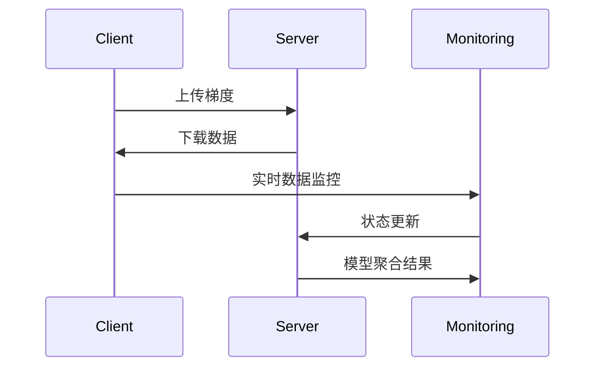

                 


### 《联邦学习技术与隐私保护》

关键词：联邦学习，隐私保护，数据安全，分布式计算，算法设计

摘要：本文旨在探讨联邦学习技术与隐私保护的重要性和应用，通过详细的案例分析，阐述其在实际项目中的实现方法和挑战。文章将分为六个部分，分别介绍联邦学习与隐私保护的背景、核心概念、算法原理、系统设计、应用案例和最佳实践。

## 第一部分：引论与背景

### 1.1 联邦学习与隐私保护概述

联邦学习是一种分布式机器学习方法，旨在让多个拥有数据但不愿共享数据的实体共同训练一个模型，而不需要将数据集中到单一服务器上。这种技术可以解决数据隐私和安全问题，同时也提高了模型的准确性和泛化能力。

隐私保护在当今数据驱动的时代尤为重要。随着数据量的激增和大数据技术的应用，个人隐私泄露的风险越来越大。联邦学习通过本地训练和模型聚合，减少了数据泄露的风险，满足了用户对隐私保护的需求。

### 1.2 联邦学习基本概念

#### 1.2.1 联邦学习原理

联邦学习基于分布式计算原理，将模型训练任务分配到多个客户端设备上，每个设备都使用本地数据训练模型的一部分。然后，这些局部模型通过加密通信进行聚合，形成一个全局模型。

#### 1.2.2 联邦学习与集中学习的对比

与集中学习相比，联邦学习有以下几个优势：
- **隐私保护**：无需将数据上传到中央服务器，降低了数据泄露风险。
- **去中心化**：提高了系统的容错性和扩展性。
- **数据利用效率**：可以充分利用每个客户端的数据，提高模型的泛化能力。

### 1.3 隐私保护技术概览

隐私保护技术在联邦学习中扮演着关键角色。以下是一些常用的隐私保护技术：

#### 1.3.1 同步与异步联邦学习

同步联邦学习要求所有客户端在相同时间同步更新模型，而异步联邦学习则允许客户端在不同的时间更新模型。同步联邦学习更容易实现隐私保护，但可能导致通信延迟。

#### 1.3.2 差分隐私

差分隐私是一种有效的隐私保护机制，通过添加噪声来确保输出结果对单个数据的依赖性降低。常见的差分隐私技术包括拉普拉斯机制和指数机制。

#### 1.3.3 零知识证明

零知识证明允许一方（证明者）向另一方（验证者）证明某个陈述是真实的，而不泄露任何有关该陈述的信息。零知识证明在联邦学习中用于确保模型更新过程中数据的隐私性。

## 第二部分：联邦学习算法原理与实现

### 2.1 联邦学习算法方法论

联邦学习算法方法论主要涉及以下方面：
- **模型初始化**：初始化全局模型，通常使用随机权重。
- **本地训练**：每个客户端使用本地数据训练模型，更新局部模型。
- **模型聚合**：将所有客户端的局部模型聚合为全局模型。

### 2.2 联邦学习算法实例分析

#### 2.2.1 同步联邦学习算法

同步联邦学习算法的基本步骤如下：
1. 初始化全局模型。
2. 每个客户端使用本地数据训练模型，并上传梯度。
3. 服务器聚合梯度，更新全局模型。
4. 所有客户端下载更新后的全局模型。

#### 2.2.2 异步联邦学习算法

异步联邦学习算法与同步联邦学习算法类似，但允许客户端在不同的时间更新模型。异步联邦学习算法通常使用共识算法来保证模型更新的顺序一致性。

### 2.3 联邦学习算法实现

以下是一个简单的同步联邦学习算法的Python代码示例：

```python
import tensorflow as tf

# 初始化全局模型
global_model = tf.keras.Sequential([
    tf.keras.layers.Dense(10, activation='relu'),
    tf.keras.layers.Dense(1, activation='sigmoid')
])

# 模型聚合函数
def aggregate_gradients(grads):
    # 在这里实现梯度聚合的逻辑
    pass

# 客户端本地训练
def client_train(model, dataset, epochs):
    # 在这里实现本地训练的逻辑
    pass

# 主循环
for epoch in range(num_epochs):
    # 客户端训练
    for client in clients:
        local_model = client_train(global_model, client_dataset, epochs=1)
        # 上传梯度
        grads = local_model.optimizer.get_gradients(global_model.output, global_model.trainable_variables)
        client.send_grads(grads)

    # 聚合梯度
    aggregated_grads = aggregate_gradients(grads)

    # 更新全局模型
    global_model.fit.aggregate(aggregated_grads)
```

## 第三部分：系统设计与架构

### 3.1 系统需求分析

在设计和实现联邦学习系统时，需要考虑以下几个关键需求：
- **数据隐私**：确保数据在传输和存储过程中的安全性。
- **计算效率**：优化模型训练和聚合的过程，提高计算效率。
- **可扩展性**：系统需要能够处理大量客户端和大规模数据。

### 3.2 系统功能设计

联邦学习系统的功能设计主要包括以下几个模块：
- **客户端模块**：负责本地数据预处理、模型训练和梯度上传。
- **服务器模块**：负责模型聚合、更新和全局模型的分发。
- **监控模块**：实时监控系统的运行状态，包括数据传输、模型训练进度等。

### 3.3 系统架构设计

联邦学习系统的架构设计需要考虑以下几个关键组件：
- **客户端**：可以是移动设备、服务器或其他计算设备。
- **通信网络**：支持安全、可靠的梯度传输。
- **服务器**：负责接收、聚合梯度并更新全局模型。

以下是系统架构的Mermaid类图：

```mermaid
classDiagram
Client <<class>> "客户端模块"
Server <<class>> "服务器模块"
Monitoring <<class>> "监控模块"
Client o--< Server : 上传梯度
Server o--< Monitoring : 监控
Monitoring o--< Client : 实时数据监控
Client..|> DataProcessor
Server..|> ModelAggregator
Monitoring..|> SystemMonitor
```

### 3.4 系统接口设计

系统接口设计主要包括以下方面：
- **客户端接口**：提供数据上传和下载、模型更新等功能。
- **服务器接口**：提供模型聚合、全局模型分发等功能。
- **监控接口**：提供系统状态监控和报警功能。

以下是系统接口的Mermaid序列图：



## 第四部分：实际应用与案例

### 4.1 应用场景

联邦学习技术在多个领域具有广泛的应用，包括移动设备上的个性化推荐、物联网设备的数据分析、金融行业的欺诈检测等。

### 4.2 案例分析

以金融行业的欺诈检测为例，银行可以通过联邦学习技术来检测和预防欺诈行为。银行网络的各个终端设备（如ATM机、POS机等）可以实时上传交易数据，通过本地训练模型进行欺诈检测，同时保护用户隐私。

### 4.3 案例解析

在案例分析中，我们将详细讨论以下内容：
- **数据预处理**：如何对交易数据进行预处理，提高模型的准确性。
- **模型选择**：选择适合的模型架构，如卷积神经网络（CNN）或循环神经网络（RNN）。
- **模型训练与优化**：如何进行本地训练和模型优化，提高模型性能。

## 第五部分：最佳实践与总结

### 5.1 最佳实践

在实施联邦学习项目时，以下是一些最佳实践：
- **数据加密**：确保数据在传输和存储过程中的安全性。
- **模型压缩**：减小模型大小，提高传输和计算效率。
- **动态调整**：根据实际情况动态调整模型参数和训练策略。

### 5.2 小结

联邦学习技术与隐私保护在当前数据驱动时代具有重要意义。通过详细的案例分析和最佳实践，我们可以更好地理解和应用这些技术，实现数据隐私与模型性能的平衡。

### 5.3 注意事项

在实施联邦学习项目时，需要注意以下几点：
- **数据安全**：确保数据在传输和存储过程中的安全性。
- **计算资源**：合理分配计算资源，提高计算效率。
- **隐私保护**：采用合适的隐私保护技术，确保用户隐私。

### 5.4 拓展阅读

对于希望深入了解联邦学习和隐私保护技术的读者，以下是一些推荐阅读资料：
- **论文**：《Federated Learning: Concept and Applications》
- **书籍**：《Privacy-Preserving Machine Learning》
- **开源项目**：Google's TensorFlow Federated

## 结论

联邦学习技术与隐私保护是当前数据驱动时代的重要研究方向。通过本文的详细分析和案例探讨，我们希望能为读者提供有价值的参考，助力其在实际项目中实现数据隐私与模型性能的平衡。

作者：AI天才研究院/AI Genius Institute & 禅与计算机程序设计艺术 /Zen And The Art of Computer Programming

