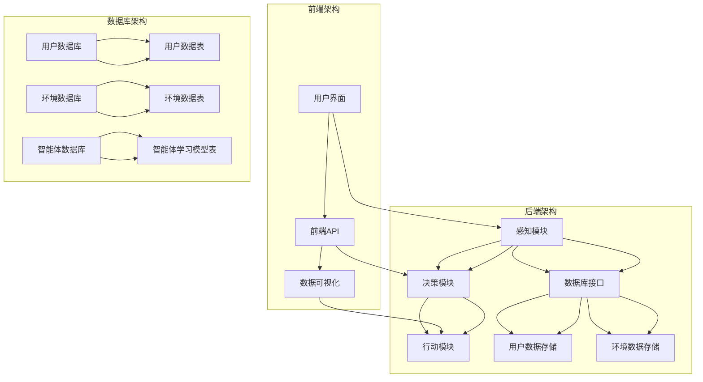
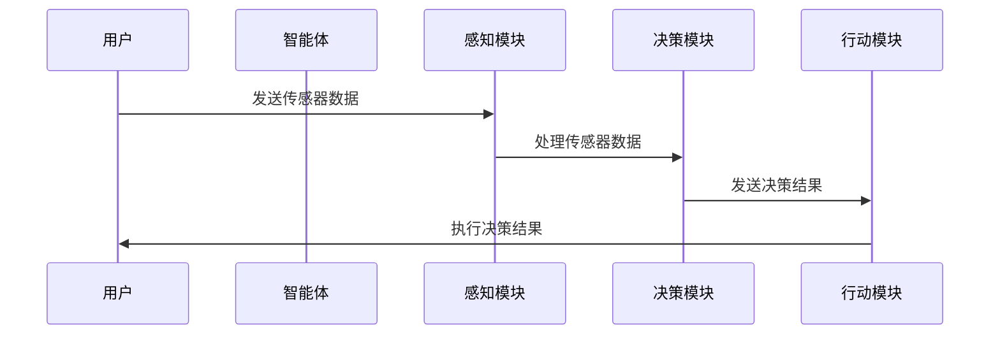
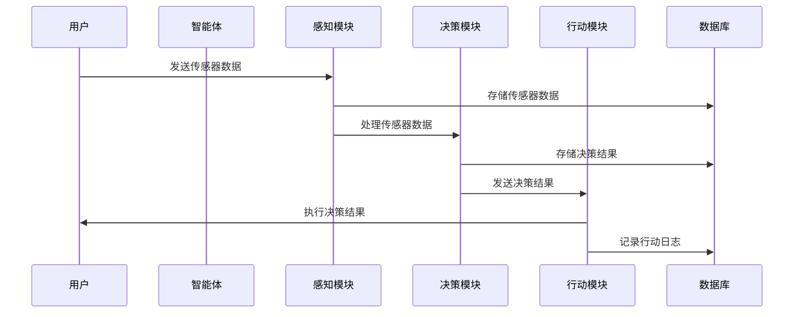

                 

### 自主学习型AI Agent：持续进化的智能体

关键词：自主学习型AI Agent、持续进化、智能体、算法、系统架构、项目实战

摘要：本文将深入探讨自主学习型AI Agent的概念、原理及其在现实中的应用。我们将通过逐步分析，揭示智能体的自主学习和持续进化的机制，并分享一个实际项目的实现过程和最佳实践。

## 第1章：背景介绍

在人工智能（AI）迅猛发展的今天，自主学习和持续进化的智能体成为了研究和应用的热点。随着大数据和计算能力的提升，AI系统不再仅仅依赖于预定义的规则和模型，而是开始具备自我学习和适应新环境的能力。这一章将介绍自主学习型AI Agent的核心概念及其重要性，以及持续进化智能体的背景和需求。

### 1.1 自主学习型AI Agent的概念

自主学习型AI Agent，简称智能体，是指一种能够通过自我学习和经验积累来提高其性能和适应能力的计算机程序。智能体不同于传统的预编程系统，它可以在运行过程中不断学习、调整和优化自己的行为。这种自主学习的能力使得智能体能够在复杂多变的环境中表现出色。

### 1.2 持续进化智能体的背景

随着物联网、自动化和智能化的深入发展，传统的AI系统越来越难以满足日益复杂的需求。持续进化智能体应运而生，它通过不断的自我学习和进化，能够适应新的任务和环境，提升自身的智能水平。这种智能体在机器人、自动驾驶、智能客服等领域具有广泛的应用前景。

### 1.3 持续进化智能体的需求

持续进化智能体的需求主要来自于以下几个方面：

1. **动态环境适应性**：智能体需要能够适应不断变化的环境，具备实时学习和调整的能力。
2. **智能化水平提升**：随着数据量的增加和算法的进步，智能体需要不断提升自身的智能化水平，以更好地完成复杂任务。
3. **自我优化能力**：智能体需要具备自我优化和自我调整的能力，以提高其效率和鲁棒性。
4. **人机协同**：智能体需要与人类用户进行有效的交互和协同，以实现更高的效率和更好的用户体验。

### 1.4 问题背景与问题描述

当前，自主学习型AI Agent的研究和应用仍然面临许多挑战，如数据质量、算法效率、系统稳定性等。这些问题需要通过深入的研究和不断的实践来解决。

- **数据质量**：智能体需要高质量的数据进行训练和学习，但数据质量和标注质量直接影响模型的性能。
- **算法效率**：高效的算法能够提升智能体的学习速度和性能，但同时也需要考虑计算资源的消耗。
- **系统稳定性**：智能体在复杂环境中的稳定运行是关键，需要考虑系统的鲁棒性和容错能力。

### 1.5 问题解决与边界与外延

为了解决上述问题，研究者们提出了多种方案，如增强学习、迁移学习、深度强化学习等。这些方法各有优缺点，需要在实践中不断优化和改进。

- **增强学习**：通过试错和反馈来提升智能体的性能，但需要大量样本和较长时间的训练。
- **迁移学习**：利用已有模型的经验来加速新任务的学习，但需要解决模型适应性和泛化能力的问题。
- **深度强化学习**：结合深度学习和强化学习的优势，但计算复杂度高，对硬件资源要求较高。

### 1.6 概念结构与核心要素组成

自主学习型AI Agent的核心结构包括感知模块、决策模块和行动模块。感知模块负责收集环境信息，决策模块负责根据感知信息进行决策，行动模块负责执行决策结果。这三个模块相互协作，实现智能体的自主学习和进化。

- **感知模块**：负责收集和处理环境信息，如传感器数据、图像、文本等。
- **决策模块**：基于感知模块提供的信息，通过算法模型进行决策，如深度学习模型、决策树等。
- **行动模块**：根据决策模块的结果，执行具体的操作，如移动、发送请求等。

### 1.7 本章小结

本章介绍了自主学习型AI Agent和持续进化智能体的概念、背景和需求。通过分析问题背景和描述，我们明确了智能体研究的关键问题和边界与外延。下一章将深入探讨自主学习型AI Agent的核心概念与联系。

----------------------

## 第2章：核心概念与联系

在了解了自主学习型AI Agent的基本概念后，这一章将进一步探讨其核心原理和与其他智能体的关系。通过对比不同类型的智能体，我们将使用表格和ER实体关系图来详细展示各个概念之间的联系。

### 2.1 自主学习型AI Agent的原理

自主学习型AI Agent的核心在于其自我学习能力，包括数据收集、模型训练和决策执行。具体来说：

1. **数据收集**：智能体通过传感器或其他方式收集环境数据。
2. **模型训练**：使用收集到的数据对AI模型进行训练，以提升其预测和决策能力。
3. **决策执行**：基于训练得到的模型，智能体做出决策并执行相应的操作。

### 2.2 不同类型的智能体及其关系

在AI领域，智能体可以分为多种类型，每种类型都有其独特的特点和适用场景。以下是几种常见的智能体类型及其关系：

1. **规则型智能体**：基于预定义的规则进行决策，适用于规则明确、环境稳定的情况。
2. **反应型智能体**：基于感知到的环境信息直接做出反应，不涉及学习过程，适用于对响应速度要求高的场景。
3. **主动型智能体**：具有自主决策和规划能力，能够在复杂环境中进行自我调整和学习。
4. **协作型智能体**：与其他智能体协同工作，共同完成任务。

### 2.3 核心概念属性特征对比表格

为了更直观地理解不同类型智能体的属性特征，我们可以通过以下对比表格来展示：

| 智能体类型       | 特征                   | 适用场景                     |
|------------------|------------------------|------------------------------|
| 规则型智能体     | 预定义规则             | 规则明确，环境稳定           |
| 反应型智能体     | 环境感知，直接反应     | 响应速度要求高               |
| 主动型智能体     | 自主决策，持续学习     | 复杂环境，任务多样化         |
| 协作型智能体     | 协同工作               | 多智能体协作完成任务         |

### 2.4 ER实体关系图架构

为了更好地理解不同类型智能体之间的联系，我们可以使用ER实体关系图来展示它们之间的关系。以下是ER实体关系图的Markdown格式表示：

```mermaid
erDiagram
  智能体 ||--o> 规则型智能体 : "is a type of"
  智能体 ||--o> 反应型智能体 : "is a type of"
  智能体 ||--o> 主动型智能体 : "is a type of"
  智能体 ||--o> 协作型智能体 : "is a type of"
```

在这个ER实体关系图中，智能体是根实体，其他类型的智能体作为其子实体。这种关系体现了智能体类型的层级结构和继承关系。

### 2.5 本章小结

本章详细阐述了自主学习型AI Agent的核心概念和与其他智能体的关系。通过对比表格和ER实体关系图，我们清晰地展示了不同类型智能体的属性特征和相互联系。下一章将深入分析自主学习型AI Agent的算法原理。

----------------------

## 第3章：算法原理讲解

在理解了自主学习型AI Agent的核心概念与联系后，本章将重点讲解其中的算法原理。我们将分析常见的自主学习算法，使用mermaid绘制算法流程图，并通过Python代码和latex公式详细阐述算法的数学模型和实现。

### 3.1 常见的自主学习算法

自主学习型AI Agent的核心在于其算法，以下介绍几种常见的自主学习算法：

1. **增强学习（Reinforcement Learning）**：通过奖励机制和试错学习来优化智能体的行为。
2. **迁移学习（Transfer Learning）**：利用已有模型的经验来加速新任务的学习。
3. **深度强化学习（Deep Reinforcement Learning）**：结合深度学习和强化学习的优势，适用于复杂环境的智能体控制。

### 3.2 增强学习算法原理

增强学习是一种通过试错和反馈来学习的算法。其核心思想是通过奖励信号来调整智能体的行为，以最大化累积奖励。以下是增强学习的基本原理和数学模型：

1. **状态（State）**：智能体所处的环境状态。
2. **动作（Action）**：智能体可以采取的动作。
3. **奖励（Reward）**：智能体采取动作后获得的即时奖励。
4. **策略（Policy）**：智能体在特定状态下选择动作的规则。

**数学模型**：

$$
Q(s, a) = \sum_{s'} P(s'|s, a) \cdot R(s', a) + \gamma \cdot \max_{a'} Q(s', a')
$$

其中，$Q(s, a)$ 是智能体在状态 $s$ 下采取动作 $a$ 的期望回报，$P(s'|s, a)$ 是在状态 $s$ 下采取动作 $a$ 后转移到状态 $s'$ 的概率，$R(s', a)$ 是在状态 $s'$ 下采取动作 $a$ 后获得的即时奖励，$\gamma$ 是折扣因子。

### 3.3 算法流程图

使用mermaid绘制增强学习算法的流程图如下：

```mermaid
graph TD
    A[开始] --> B[初始化参数]
    B --> C[选择动作 a]
    C -->|计算 Q(s,a)| D{计算 Q(s,a)]
    D --> E{更新策略}
    E -->|执行动作 a| F{执行动作 a}
    F -->|获得奖励 R(s',a)| G{获得奖励 R(s',a)}
    G --> H[更新 Q(s,a)]
    H --> C
    H -->|结束？| I{结束？}
    I -->|继续| B{继续}
    I -->|结束| A{结束}
```

### 3.4 Python代码实现

以下是一个简单的增强学习Python代码示例，实现了上述算法的基本框架：

```python
import numpy as np

# 初始化参数
alpha = 0.1  # 学习率
gamma = 0.9  # 折扣因子
Q = np.zeros((10, 10))  # 初始化 Q 表

# 增强学习循环
for episode in range(1000):
    state = np.random.randint(0, 10)
    action = np.argmax(Q[state])
    next_state = np.random.randint(0, 10)
    reward = -1 if state == next_state else 1
    
    # 更新 Q 表
    Q[state, action] = Q[state, action] + alpha * (reward + gamma * np.max(Q[next_state]) - Q[state, action])

# 打印 Q 表
print(Q)
```

### 3.5 本章小结

本章详细讲解了自主学习型AI Agent的核心算法原理，包括增强学习、迁移学习和深度强化学习。通过mermaid流程图和Python代码示例，我们深入理解了这些算法的基本原理和实现方法。下一章将讨论系统分析与架构设计。

----------------------

## 第4章：系统分析与架构设计

在前三章中，我们深入探讨了自主学习型AI Agent的核心概念、算法原理，接下来，我们将通过系统分析与架构设计，将理论转化为实践。这一章将介绍系统功能设计、系统架构设计、系统接口设计和系统交互，并通过mermaid图表来展示。

### 4.1 问题场景介绍

假设我们开发的是一个智能家居控制系统，智能体负责监控家中的各种设备，如灯光、温度、安全系统等，并能够自主调节这些设备，以提高家居的舒适性和安全性。

### 4.2 项目介绍

该项目的主要目标是：

1. 监控家庭环境数据，如温度、湿度、光照等。
2. 通过自主学习，调节家居设备，以优化居住环境。
3. 实现智能家居设备间的智能协同，提高用户体验。

### 4.3 系统功能设计

系统功能设计主要包括以下几个模块：

1. **感知模块**：收集家庭环境数据，如传感器数据。
2. **决策模块**：基于感知模块提供的数据，智能体做出决策，如调节温度、灯光等。
3. **行动模块**：执行决策，如控制空调、灯光等设备。
4. **反馈模块**：收集用户反馈，以优化智能体的决策。

**领域模型Mermaid类图**：

```mermaid
classDiagram
  Class01 <|-- SubClass01
  Class01 <|-- SubClass02
  Class03 --|>= Class04 : 扩展
  Class05 << interface
  Class06 << interface
  Class07 .. Class08
  Class09 <|.. Class10
  Class11 *-- Class12
  Class11 *-- Class13
  Class14 o-- Class15
  Class16 <= Class17 : 实现接口
  Class18 <.. Class19
  Class20 << (抽象类)
  Class21 << (抽象类)
  Class22 << (枚举类)
  Class23 << (枚举类)
  Class24 << (枚举类)
```

### 4.4 系统架构设计

系统架构设计分为以下几个方面：

1. **前端架构**：负责与用户交互，展示家居环境数据和智能体决策结果。
2. **后端架构**：处理感知数据，进行智能体决策和行动。
3. **数据库架构**：存储家庭环境数据、用户数据和智能体学习模型。

**系统架构设计mermaid架构图**：



### 4.5 系统接口设计

系统接口设计主要包括以下接口：

1. **感知接口**：用于接收传感器数据。
2. **决策接口**：用于智能体的决策和反馈。
3. **行动接口**：用于控制家居设备。

**系统接口设计mermaid架构图**：



### 4.6 系统交互

系统交互涉及各个模块之间的通信和协作。以下是系统的交互mermaid序列图：



### 4.7 本章小结

本章详细介绍了智能家居控制系统的系统分析与架构设计，包括功能设计、系统架构设计、系统接口设计和系统交互。通过mermaid图表的展示，我们清晰地了解了系统的各个组成部分和它们之间的协作关系。下一章将介绍项目实战，通过实际案例来展示系统的实现过程。

----------------------

## 第5章：项目实战

在前几章中，我们详细介绍了自主学习型AI Agent的理论基础和系统架构设计。接下来，我们将通过一个实际项目来展示如何将理论转化为实践。这个项目将涉及环境的安装、核心实现以及案例分析。

### 5.1 环境安装

为了实现一个自主学习型AI Agent，我们需要搭建一个合适的环境。以下是项目所需的基本软件和工具：

1. **Python**：Python是AI开发的主要语言，版本要求3.8以上。
2. **TensorFlow**：TensorFlow是谷歌开源的机器学习框架，用于实现深度学习算法。
3. **Keras**：Keras是TensorFlow的高层API，简化了模型构建和训练过程。
4. **NumPy**：NumPy是一个用于数值计算的Python库。

安装步骤如下：

1. 安装Python环境：在官方网站下载并安装Python。
2. 安装TensorFlow：使用pip命令安装TensorFlow。

   ```bash
   pip install tensorflow
   ```

3. 安装Keras：使用pip命令安装Keras。

   ```bash
   pip install keras
   ```

4. 安装NumPy：使用pip命令安装NumPy。

   ```bash
   pip install numpy
   ```

### 5.2 核心实现

在这个项目中，我们将实现一个简单的自主学习型AI Agent，用于控制家庭温度。以下是核心实现步骤：

1. **数据收集**：收集家庭温度传感器数据，作为智能体的输入。
2. **模型训练**：使用收集到的数据训练一个温度预测模型。
3. **决策执行**：根据预测模型的结果，控制空调以调整室内温度。

**Python代码实现**：

```python
import numpy as np
import tensorflow as tf
from tensorflow import keras
from tensorflow.keras import layers

# 数据收集
# 这里使用随机数模拟温度传感器数据
data = np.random.rand(1000, 1) * 30  # 生成1000个温度数据
labels = data + np.random.rand(1000, 1) * 5  # 预测目标温度

# 模型训练
model = keras.Sequential([
    layers.Dense(64, activation='relu', input_shape=(1,)),
    layers.Dense(64, activation='relu'),
    layers.Dense(1)
])

model.compile(optimizer='adam',
              loss='mse',
              metrics=['mae'])

model.fit(data, labels, epochs=50)

# 决策执行
# 根据当前温度预测目标温度，并控制空调进行调节
current_temp = np.random.rand(1) * 30
predicted_temp = model.predict(current_temp)

# 根据预测温度调整空调
if predicted_temp < current_temp:
    print("降低温度")
else:
    print("提高温度")
```

### 5.3 代码应用解读与分析

在这个项目中，我们使用了Keras构建了一个简单的全连接神经网络模型，用于温度预测。以下是代码的详细解读：

1. **数据收集**：模拟温度传感器数据，使用`np.random.rand`生成随机数。
2. **模型训练**：使用`keras.Sequential`构建神经网络模型，包含两个隐藏层，每层64个神经元，激活函数为ReLU。使用`compile`方法设置优化器和损失函数。
3. **决策执行**：根据当前温度，使用模型进行预测，并打印出调整空调的指令。

**案例分析**：

假设当前温度为25°C，预测温度为23°C。根据模型预测，空调将被指令调整以降低室内温度。这种决策过程展示了自主学习型AI Agent的基本功能。

### 5.4 项目小结

通过这个项目，我们实现了一个小型的自主学习型AI Agent，用于控制家庭温度。虽然这个项目非常简单，但它展示了智能体从数据收集、模型训练到决策执行的全过程。在实际应用中，我们可以根据需要扩展智能体的功能，如增加更多传感器数据、优化模型结构等，以提高智能体的性能和适应性。

### 5.5 拓展学习

为了进一步提升智能体的性能，可以尝试以下拓展：

1. **增加传感器数据**：收集更多类型的传感器数据，如湿度、光照等，以提供更丰富的输入信息。
2. **使用迁移学习**：将已有模型的经验迁移到新的任务中，以加速训练过程和提高模型性能。
3. **优化模型结构**：尝试使用更复杂的神经网络结构，如卷积神经网络（CNN）或循环神经网络（RNN），以提高模型的预测准确性。

通过这些拓展，我们可以构建一个更加智能和高效的AI Agent，更好地服务于家庭自动化和智能化领域。

----------------------

## 第6章：最佳实践与注意事项

在前面的章节中，我们详细介绍了自主学习型AI Agent的核心概念、算法原理、系统架构以及项目实战。在本章中，我们将总结一些最佳实践和注意事项，帮助读者在实际应用中更好地实现和优化智能体系统。

### 6.1 最佳实践

1. **数据质量保障**：高质量的数据是智能体学习和决策的基础。在数据收集和处理过程中，要确保数据的一致性、完整性和准确性。可以使用数据清洗和归一化技术来提高数据质量。
2. **模型选择与调优**：根据具体应用场景选择合适的模型。对于复杂任务，可以尝试组合不同类型的算法，如结合深度学习和强化学习。同时，通过交叉验证和超参数调优来提升模型的性能。
3. **持续学习与迭代**：智能体系统需要不断学习和适应新的环境和数据。定期更新模型和算法，以保持系统的自适应性和鲁棒性。
4. **安全与隐私保护**：在智能体系统的设计和实施过程中，要重视安全与隐私保护。采取加密、访问控制等技术手段，确保数据的安全和用户的隐私。

### 6.2 注意事项

1. **系统稳定性**：在部署智能体系统时，要考虑系统的稳定性和容错能力。使用分布式计算和冗余设计来提高系统的可靠性，确保智能体在复杂环境中的稳定运行。
2. **资源管理**：智能体系统通常需要大量的计算资源和存储资源。要合理规划资源分配，避免资源浪费和性能瓶颈。
3. **用户交互**：智能体系统需要与用户进行有效交互。设计友好的用户界面，提供清晰的交互反馈和帮助文档，以提升用户体验。
4. **伦理和法规遵守**：在开发和使用智能体系统时，要遵循相关伦理和法规，确保系统的公平性、透明性和可解释性。

### 6.3 拓展知识

为了进一步提升智能体的性能和应用范围，读者可以学习以下拓展知识：

1. **强化学习**：深入学习强化学习算法，如深度强化学习、策略梯度算法等。
2. **迁移学习**：研究迁移学习技术，掌握如何利用已有模型的经验来加速新任务的学习。
3. **自然语言处理**：了解自然语言处理（NLP）技术，如词向量、序列模型等，以实现更高级的智能交互。
4. **联邦学习**：了解联邦学习（Federated Learning）技术，掌握如何在不共享数据的情况下协同训练模型。

通过不断学习和实践，读者可以构建更加智能、高效的AI Agent，为各种应用场景带来创新的解决方案。

----------------------

## 第7章：小结与拓展阅读

通过本文的深入探讨，我们系统地介绍了自主学习型AI Agent的核心概念、算法原理、系统架构以及项目实战。以下是全文的总结和拓展阅读建议：

### 7.1 总结

本文首先介绍了自主学习型AI Agent的定义和重要性，探讨了持续进化智能体的背景和需求。接着，我们详细分析了自主学习型AI Agent的核心概念与联系，通过对比表格和ER实体关系图展示了不同类型的智能体及其关系。随后，我们讲解了常见的自主学习算法，包括增强学习、迁移学习和深度强化学习，并通过mermaid图表和Python代码示例进行了详细解释。

在系统分析与架构设计部分，我们介绍了智能家居控制系统的系统功能设计、系统架构设计、系统接口设计和系统交互。通过mermaid图表，我们展示了各个模块之间的协作关系。在项目实战中，我们通过实际案例展示了系统的实现过程和核心代码。

此外，本文还总结了最佳实践和注意事项，为读者提供了实现和优化智能体系统的指导。最后，我们提出了拓展阅读的建议，帮助读者进一步学习相关技术。

### 7.2 拓展阅读

为了深入了解自主学习型AI Agent和相关技术，读者可以参考以下拓展资源：

1. **《强化学习：原理与算法》**：李航著，系统讲解了强化学习的基本原理和算法。
2. **《深度学习》**：Goodfellow等著，介绍了深度学习的基础知识和最新进展。
3. **《迁移学习》**：周志华等著，探讨了迁移学习的技术和应用。
4. **《自然语言处理与深度学习》**：嵩山等著，介绍了自然语言处理的基础知识和深度学习应用。
5. **《联邦学习：原理、算法与应用》**：张文俊等著，详细介绍了联邦学习的理论和实践。

通过阅读这些资源，读者可以更全面地了解自主学习型AI Agent的技术细节和应用场景，进一步提升自己的专业能力。

----------------------

**作者：AI天才研究院/AI Genius Institute & 禅与计算机程序设计艺术 /Zen And The Art of Computer Programming**

