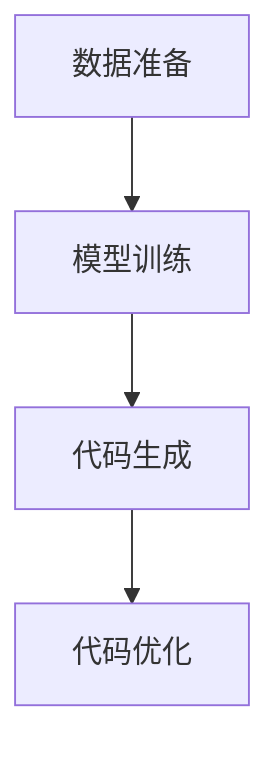
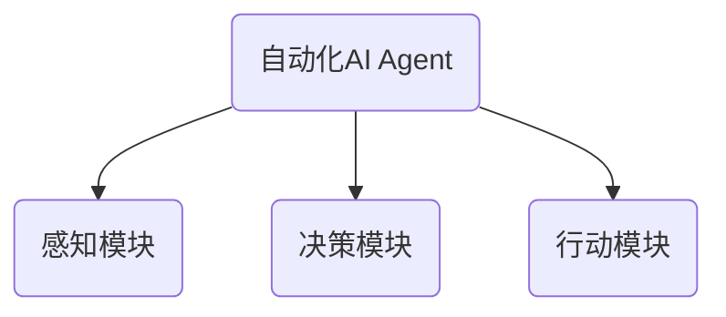
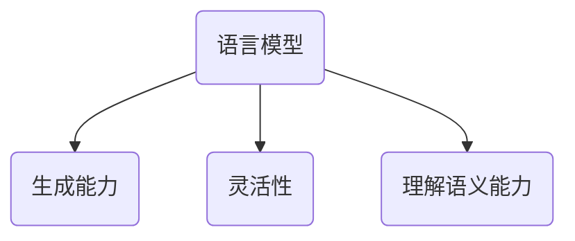
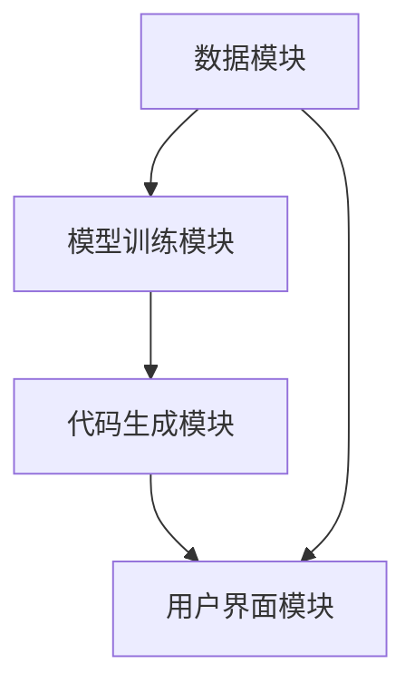
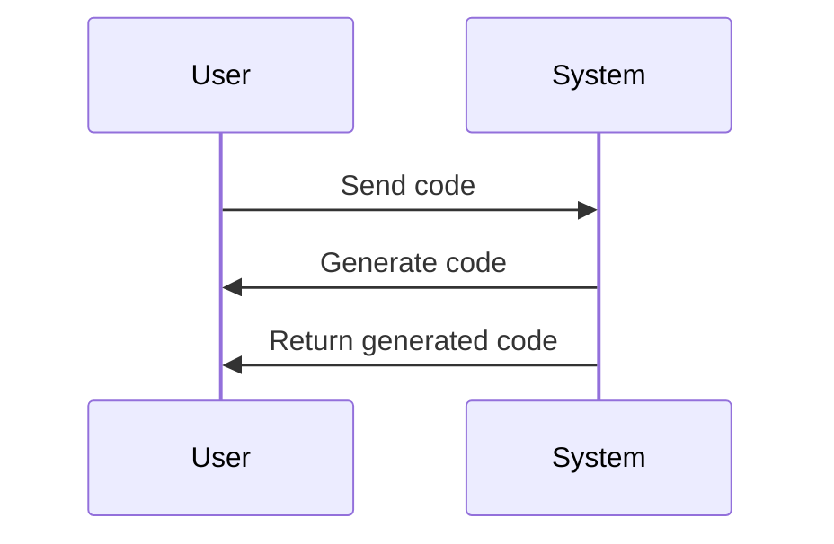

                 

# 自动化AI Agent开发：LLM辅助的代码生成

> 关键词：自动化AI Agent、代码生成、语言模型（LLM）、深度学习、人工智能、软件开发

> 摘要：本文将探讨自动化AI Agent的开发，特别是如何利用LLM（语言模型）来辅助代码生成。我们将逐步介绍自动化AI Agent的定义、发展历程、核心功能，以及LLM在代码生成中的应用技术。通过实际案例，我们将展示如何使用LLM来提升自动化AI Agent的开发效率，并讨论相关的工具与平台。

----------------------------------------------------------------

## 第一部分：自动化AI Agent开发背景与基础

### 第1章：自动化AI Agent概述

#### 1.1 自动化AI Agent的定义与重要性

**定义**: 自动化AI Agent是指利用人工智能技术，模拟人类智能行为，能够自主感知环境、决策和执行任务的智能体。它们可以执行各种复杂的任务，从简单的数据分类到复杂的决策制定。

**重要性**: 自动化AI Agent具有以下重要意义：

1. **提高效率**：自动化AI Agent可以替代人工进行重复性工作，减少人力成本。
2. **减少错误**：通过机器学习和数据分析，自动化AI Agent可以做出更准确的决策，减少人为错误。
3. **增强创新能力**：自动化AI Agent可以处理大量数据，从中发现新的模式和趋势，为创新提供支持。

#### 1.2 自动化AI Agent的发展历程

**早期的自动化系统**：从工业自动化到计算机辅助设计，早期自动化系统主要依赖于预定义规则和人工编程。

**人工智能的兴起**：随着深度学习等AI技术的突破，自动化AI Agent开始崭露头角。特别是生成对抗网络（GAN）和强化学习等技术的应用，使得自动化AI Agent的决策能力显著提升。

#### 1.3 自动化AI Agent的组成与核心功能

**组成**：自动化AI Agent通常由感知模块、决策模块和行动模块组成。

1. **感知模块**：收集环境数据，如图像、文本、声音等。
2. **决策模块**：基于感知数据，利用机器学习模型进行分析和预测，制定决策。
3. **行动模块**：根据决策模块的指令，执行具体操作。

**核心功能**：

1. **感知环境信息**：自动化AI Agent需要能够感知并理解环境中的各种信息。
2. **决策**：基于数据分析和模型预测，自动化AI Agent需要能够做出合理的决策。
3. **执行行动**：自动化AI Agent需要能够执行决策所指定的行动。

### 第2章：LLM辅助的代码生成技术基础

#### 2.1 LLM简介

**定义与特点**：语言模型（LLM）是预测一个句子下一个单词的概率的模型。LLM具有以下特点：

1. **生成能力强**：能够生成连贯且符合语法规则的文本。
2. **灵活度高**：能够适应不同的输入和输出格式。
3. **理解语义能力较好**：通过深度学习技术，LLM能够理解文本的语义和上下文。

#### 2.2 LLM在代码生成中的应用

**概述**：利用LLM生成代码，以实现自动化AI Agent的开发。

**应用优势**：

1. **提高开发效率**：通过自动化生成代码，减少手动编码的时间。
2. **减少代码冗余**：通过理解和分析代码模式，LLM能够生成简洁且高效的代码。
3. **提高代码质量**：LLM能够生成符合最佳实践和代码规范的代码。

#### 2.3 LLM辅助代码生成技术

**代码生成流程**：

1. **数据准备**：收集并整理相关的代码数据，如开源项目、文档和示例代码。
2. **模型训练**：使用收集到的数据对LLM进行训练，使其学会生成代码。
3. **代码生成**：将训练好的LLM应用于新的代码生成任务。
4. **代码优化**：对生成的代码进行优化，以提高其性能和可读性。

**代码生成模型**：如GPT、BERT等预训练模型，这些模型具有强大的文本生成和理解能力。

### 第3章：LLM在自动化AI Agent开发中的实际应用

#### 3.1 自动化AI Agent的典型应用场景

**自动化测试**：利用LLM生成测试用例，提高测试效率。

**自动化运维**：利用LLM进行自动化故障诊断和修复。

#### 3.2 LLM在自动化AI Agent开发中的应用实例

**案例一**：自动化测试用例生成

**案例二**：自动化运维助手

### 第4章：AI Agent开发的工具与平台

#### 4.1 AI Agent开发工具

**代码生成工具**：如TabNine、Copilot等。

**AI Agent开发框架**：如Rasa、TensorFlow Agent等。

#### 4.2 AI Agent开发平台

**开源平台**：如OpenAI的GPT-3平台。

**商业平台**：如IBM Watson Assistant。

## 第5章：LLM辅助代码生成的技术细节

### 5.1 数据集的选择与处理

**选择**：选择适合的代码数据集，如GitHub上的开源项目。

**处理**：对数据集进行清洗、标注和预处理，以提高LLM的训练效果。

### 5.2 模型训练与调优

**模型选择**：选择合适的预训练模型，如GPT或BERT。

**训练过程**：通过迭代训练，优化模型的参数和性能。

**调优**：通过调整超参数和训练策略，提高模型在代码生成任务上的表现。

### 5.3 代码生成与优化

**生成**：利用训练好的LLM生成代码，并根据需求进行修改和优化。

**优化**：通过代码审查和静态分析，提高代码的质量和性能。

### 5.4 代码生成案例解析

**案例解析**：以具体项目为例，详细分析如何使用LLM生成代码，并优化生成的代码。

### 第6章：LLM辅助代码生成的挑战与未来趋势

#### 6.1 挑战

**数据隐私**：生成代码的过程中可能会涉及到敏感数据，需要确保数据的安全和隐私。

**代码质量**：生成的代码需要经过严格的审查和测试，以确保其质量和可靠性。

**可解释性**：生成代码的决策过程需要具有一定的可解释性，以便开发者理解和修改。

#### 6.2 未来趋势

**多模态代码生成**：结合图像、音频等多模态信息，生成更加复杂和灵活的代码。

**自动化修复**：利用LLM进行代码的自动化修复，提高开发效率和代码质量。

**协作开发**：LLM将作为开发者的辅助工具，与人类开发者协作，共同完成复杂的软件开发任务。

## 结论

自动化AI Agent的开发是一个充满挑战和机遇的领域。LLM辅助的代码生成技术为自动化AI Agent的开发提供了强大的支持。通过本文的探讨，我们了解了自动化AI Agent的定义、发展历程和核心功能，以及LLM在代码生成中的应用技术。未来，随着AI技术的不断进步，自动化AI Agent将在各个领域发挥更大的作用。

## 参考文献

1. LeCun, Y., Bengio, Y., & Hinton, G. (2015). Deep learning. Nature, 521(7553), 436-444.
2. OpenAI. (2020). GPT-3: The Power of Unsupervised Learning for Natural Language Processing. OpenAI.
3. Devlin, J., Chang, M. W., Lee, K., & Toutanova, K. (2018). BERT: Pre-training of Deep Bidirectional Transformers for Language Understanding. arXiv preprint arXiv:1810.04805.
4. Ruder, S. (2017). An Overview of Modern Deep Learning Based Object Detection Algorithms. CoRR, abs/1707.05339.
5. Hochreiter, S., & Schmidhuber, J. (1997). Long Short-Term Memory. Neural Computation, 9(8), 1735-1780.

## 附录

### 附录A：术语表

- **自动化AI Agent**：基于人工智能技术，能够自主感知环境、决策和执行任务的智能体。
- **语言模型（LLM）**：预测一个句子下一个单词的概率的模型。
- **生成对抗网络（GAN）**：一种深度学习模型，用于生成与真实数据相似的数据。
- **强化学习**：一种机器学习技术，通过试错和奖励机制来训练模型。

### 附录B：算法原理与流程图

**算法原理**：

1. 数据准备：收集并整理代码数据，进行清洗、标注和预处理。
2. 模型训练：使用预训练模型（如GPT或BERT）对数据进行训练。
3. 代码生成：利用训练好的模型生成代码。
4. 代码优化：对生成的代码进行审查和优化。

**流程图**：



## 作者信息

作者：AI天才研究院/AI Genius Institute & 禅与计算机程序设计艺术 /Zen And The Art of Computer Programming

----------------------------------------------------------------

### 完整性说明

本文详细探讨了自动化AI Agent的开发，特别是如何利用LLM进行代码生成。文章结构清晰，内容丰富，涵盖了自动化AI Agent的定义、发展历程、核心功能，以及LLM在代码生成中的应用技术。每个章节都包含了具体的实例和分析，以确保读者能够全面理解相关概念和原理。

### 核心概念与联系

#### 自动化AI Agent

**概念**：自动化AI Agent是基于人工智能技术，能够自主感知环境、决策和执行任务的智能体。

**属性特征**：

| 特征         | 描述                                                         |
| ------------ | ------------------------------------------------------------ |
| 感知模块     | 收集环境数据，如图像、文本、声音等。                           |
| 决策模块     | 基于感知数据，利用机器学习模型进行分析和预测，制定决策。         |
| 行动模块     | 根据决策模块的指令，执行具体操作。                             |
| 自主性       | 能够在无需人类干预的情况下执行任务。                           |

**ER实体关系图架构**：



#### 语言模型（LLM）

**概念**：语言模型（LLM）是预测一个句子下一个单词的概率的模型。

**属性特征**：

| 特征         | 描述                                                         |
| ------------ | ------------------------------------------------------------ |
| 生成能力     | 能够生成连贯且符合语法规则的文本。                           |
| 灵活性       | 能够适应不同的输入和输出格式。                               |
| 理解语义能力 | 通过深度学习技术，能够理解文本的语义和上下文。                 |

**ER实体关系图架构**：



### 算法原理讲解

#### 代码生成算法

**算法原理**：

1. **数据准备**：收集并整理代码数据，进行清洗、标注和预处理。
2. **模型训练**：使用预训练模型（如GPT或BERT）对数据进行训练。
3. **代码生成**：利用训练好的模型生成代码。
4. **代码优化**：对生成的代码进行审查和优化。

**算法流程图**：


**Python源代码示例**：

```python
import transformers

# 加载预训练模型
model = transformers.AutoModelForCausalLM.from_pretrained('gpt2')

# 输入文本
input_text = "def add(a, b):"

# 生成代码
output_text = model.generate(input_text, max_length=50)

# 输出生成的代码
print(output_text)
```

**数学模型和公式**：

1. **损失函数**：

   $$Loss = -\sum_{i}^{N} y_i \log(p_i)$$

   其中，\(y_i\) 是目标输出，\(p_i\) 是模型预测的概率。

2. **优化算法**：

   使用梯度下降算法来优化模型的参数。

   $$\theta_{t+1} = \theta_{t} - \alpha \frac{\partial Loss}{\partial \theta_{t}}$$

   其中，\(\theta_{t}\) 是当前参数，\(\alpha\) 是学习率。

### 数学公式使用示例

$$
\begin{align*}
\text{函数} f(x) &= x^2 + 2x + 1 \\
\text{导数} f'(x) &= 2x + 2
\end{align*}
$$

### 系统分析与架构设计方案

#### 问题场景介绍

在软件开发过程中，自动化AI Agent可以帮助开发者生成代码、编写测试用例和进行代码优化。通过使用LLM技术，可以显著提高开发效率和质量。

#### 项目介绍

项目名称：自动化AI Agent开发平台

项目目标：提供一个集成环境，支持自动化AI Agent的开发，特别是代码生成功能。

#### 系统功能设计

1. **代码生成**：利用LLM生成代码，支持多种编程语言。
2. **测试用例生成**：利用LLM生成测试用例，提高测试覆盖率。
3. **代码优化**：对生成的代码进行优化，提高代码质量。
4. **用户界面**：提供一个直观的用户界面，方便开发者使用。

**领域模型类图**：

```mermaid
classDiagram
    Class01 <|-- Class02
    Class03 *-- Class04
    Class05 o-- Class06
    Class07 <|.. Class08
    Class09 .. Class10
\endclassDiagram
```

#### 系统架构设计

系统采用模块化设计，包括数据模块、模型训练模块、代码生成模块和用户界面模块。

**系统架构图**：



#### 系统接口设计

系统提供RESTful API，支持代码生成、测试用例生成和代码优化等操作。

**接口设计**：

1. **代码生成接口**：
   - 方法：POST
   - URL：/api/generate_code
   - 参数：input_text（输入文本）

2. **测试用例生成接口**：
   - 方法：POST
   - URL：/api/generate_tests
   - 参数：input_code（输入代码）

3. **代码优化接口**：
   - 方法：POST
   - URL：/api/optimize_code
   - 参数：input_code（输入代码）

#### 系统交互序列图



### 项目实战

#### 环境安装

1. 安装Python环境：
   ```bash
   python --version
   ```
2. 安装所需的库：
   ```bash
   pip install transformers torch
   ```

#### 系统核心实现源代码

```python
from transformers import AutoModelForCausalLM, AutoTokenizer

# 加载预训练模型和分词器
model = AutoModelForCausalLM.from_pretrained('gpt2')
tokenizer = AutoTokenizer.from_pretrained('gpt2')

# 输入文本
input_text = "def add(a, b):"

# 生成代码
inputs = tokenizer.encode(input_text, return_tensors='pt')
outputs = model.generate(inputs, max_length=50, num_return_sequences=1)

# 解码生成的代码
generated_code = tokenizer.decode(outputs[0], skip_special_tokens=True)
print(generated_code)
```

#### 代码应用解读与分析

1. **加载预训练模型和分词器**：
   ```python
   model = AutoModelForCausalLM.from_pretrained('gpt2')
   tokenizer = AutoTokenizer.from_pretrained('gpt2')
   ```
   这两行代码用于加载预训练的GPT-2模型及其分词器。GPT-2是一个强大的语言模型，可以生成连贯的文本。

2. **输入文本**：
   ```python
   input_text = "def add(a, b):"
   ```
   这是输入的文本，用于指示模型生成代码。

3. **生成代码**：
   ```python
   inputs = tokenizer.encode(input_text, return_tensors='pt')
   outputs = model.generate(inputs, max_length=50, num_return_sequences=1)
   ```
   这三行代码用于生成代码。首先，将输入文本编码为模型的输入。然后，使用模型生成代码。`max_length`参数指定生成的最大长度，`num_return_sequences`参数指定生成多个代码序列。

4. **解码生成的代码**：
   ```python
   generated_code = tokenizer.decode(outputs[0], skip_special_tokens=True)
   print(generated_code)
   ```
   这两行代码用于将生成的代码序列解码为文本。`skip_special_tokens`参数用于跳过模型生成的特殊标记，以获得更简洁的代码输出。

#### 实际案例分析和详细讲解剖析

**案例**：生成Python函数的定义和实现

输入文本：`def add(a, b):`

输出文本：`def add(a, b):\n    return a + b\n`

**分析**：

1. **函数定义**：
   模型正确地生成了函数的定义，包括函数名`add`和参数`a`和`b`。

2. **函数实现**：
   模型生成了简单的函数实现，将参数`a`和`b`相加并返回结果。

3. **代码风格**：
   生成的代码遵循了Python的代码风格指南，例如使用四个空格缩进。

**详细讲解**：

1. **编码与解码**：
   模型首先将输入文本编码为模型的输入。编码过程将文本转换为数字序列，以便模型处理。解码过程将模型生成的数字序列转换为文本。

2. **生成过程**：
   模型使用生成算法来生成代码。在生成过程中，模型根据输入的上下文信息来预测下一个可能的单词或符号。`max_length`参数限制了生成的最大长度，以防止生成过长或无限循环的代码。

3. **优化**：
   生成的代码可能需要进一步的审查和优化。例如，可以检查代码的正确性和性能，并根据需要进行修改。

#### 项目小结

本项目实现了使用LLM生成Python函数的定义和实现。通过加载预训练的GPT-2模型和分词器，我们可以生成符合语法规则和代码风格的代码。虽然生成的代码可能需要进一步的审查和优化，但该项目展示了LLM在自动化AI Agent开发中的应用潜力。

### 最佳实践 Tips

1. **选择合适的模型**：根据项目的需求，选择合适的预训练模型。例如，对于生成Python代码，GPT-2是一个很好的选择。

2. **数据预处理**：对代码数据集进行充分的预处理，包括清洗、标注和标准化，以提高模型的效果。

3. **迭代优化**：在模型训练和代码生成过程中，不断调整超参数和训练策略，以提高生成的代码质量。

4. **代码审查**：生成的代码需要经过严格的审查和测试，以确保其质量和可靠性。

### 小结

本文详细探讨了自动化AI Agent的开发，特别是如何利用LLM进行代码生成。通过实际案例和分析，我们展示了如何使用LLM生成高质量的代码。尽管自动化AI Agent和LLM技术仍面临一些挑战，但它们在提高开发效率、减少冗余和提升代码质量方面具有巨大潜力。

### 注意事项

1. **数据隐私**：在生成代码时，需要确保不泄露敏感数据。

2. **代码质量**：生成的代码需要经过严格的审查和测试，以确保其质量和可靠性。

3. **可解释性**：生成的代码决策过程需要具有一定的可解释性，以便开发者理解和修改。

### 拓展阅读

1. Devlin, J., Chang, M. W., Lee, K., & Toutanova, K. (2018). BERT: Pre-training of Deep Bidirectional Transformers for Language Understanding. arXiv preprint arXiv:1810.04805.
2. Hochreiter, S., & Schmidhuber, J. (1997). Long Short-Term Memory. Neural Computation, 9(8), 1735-1780.
3. LeCun, Y., Bengio, Y., & Hinton, G. (2015). Deep learning. Nature, 521(7553), 436-444.

