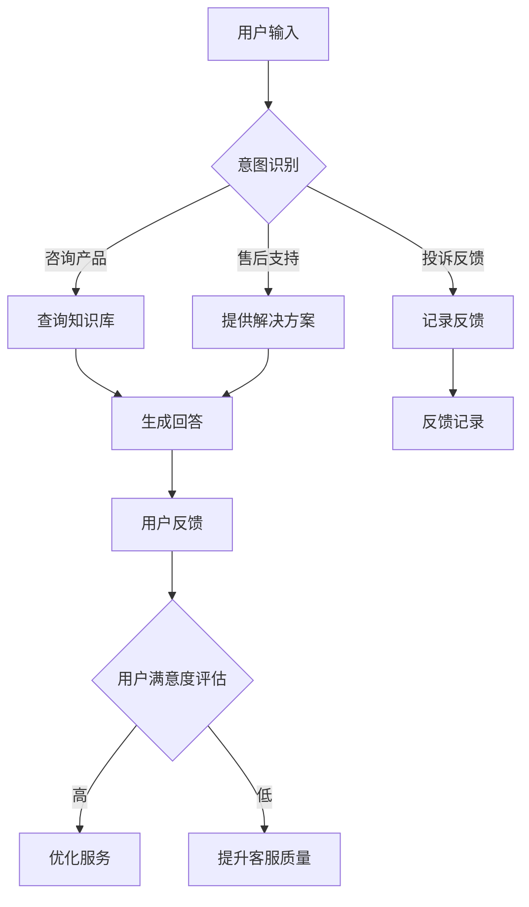
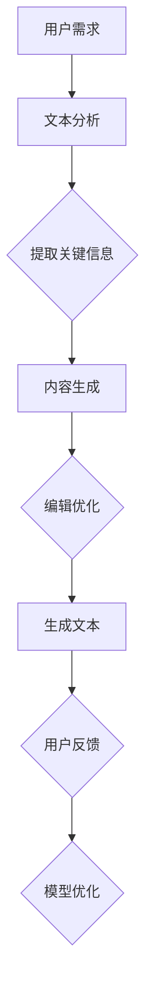

                 


### 自然语言处理技术在AI Agent中的应用

#### 关键词：自然语言处理，AI Agent，语言模型，词向量，对话系统，情感分析

> 摘要：本文将探讨自然语言处理（NLP）技术在AI Agent中的应用，通过分章节详细讲解NLP基础、AI Agent技术以及具体应用场景，帮助读者理解NLP在AI Agent中的关键作用，分析其技术原理和实现方法，并提供实际案例分析。

---

### 第1章: 问题背景与核心概念

#### 1.1 自然语言处理技术概述

##### 1.1.1 NLP的定义与重要性

自然语言处理（Natural Language Processing，简称NLP）是人工智能（Artificial Intelligence，简称AI）的一个重要分支，主要研究如何让计算机理解和处理人类自然语言。NLP的重要性体现在多个方面：

1. **人机交互**：NLP技术使得计算机能够理解用户的自然语言输入，从而实现更自然、更人性化的交互方式。
2. **信息提取**：NLP技术能够从大量非结构化文本数据中提取出有价值的信息，如情感分析、关键词提取等。
3. **知识表示**：NLP技术可以帮助将自然语言文本转化为计算机可理解的知识表示形式，为后续的知识图谱、语义搜索等应用提供支持。

##### 1.1.2 NLP的发展历程

NLP技术的发展历程可以分为几个阶段：

1. **规则驱动阶段**：早期的NLP系统主要基于规则和模式匹配，如关键词提取、句法分析等。
2. **统计阶段**：随着机器学习技术的发展，统计方法成为NLP的主要工具，如隐马尔可夫模型（HMM）、条件概率模型等。
3. **深度学习阶段**：近年来，深度学习技术的引入，特别是神经网络的应用，使得NLP技术取得了显著的突破，如卷积神经网络（CNN）、递归神经网络（RNN）等。

#### 1.2 AI Agent的概述

##### 1.2.1 AI Agent的定义与作用

AI Agent，即人工智能代理，是能够自主执行任务、与环境进行交互的计算机程序。AI Agent的定义包括以下几个方面：

1. **自主性**：AI Agent能够自主决定行动，而不需要外部干预。
2. **适应性**：AI Agent能够根据环境的变化调整其行为策略。
3. **交互性**：AI Agent能够与外部环境进行信息交换。

AI Agent的作用主要体现在：

1. **自动化任务执行**：如自动化客服、智能调度等。
2. **智能决策支持**：如金融领域的风险控制、供应链管理等。
3. **人机交互**：如虚拟助手、智能翻译等。

##### 1.2.2 AI Agent与NLP的关系

NLP技术是AI Agent的核心组件之一，AI Agent需要理解自然语言输入并生成自然语言输出，这需要NLP技术提供支持。具体来说：

1. **输入理解**：AI Agent需要通过NLP技术理解用户的自然语言输入，如问题、请求等。
2. **输出生成**：AI Agent需要通过NLP技术生成自然语言响应，与用户进行自然交流。
3. **知识表示**：NLP技术可以帮助AI Agent将自然语言文本转化为计算机可处理的知识表示形式，为后续的任务执行提供支持。

#### 1.3 NLP技术在AI Agent中的应用现状与挑战

##### 1.3.1 应用现状

目前，NLP技术在AI Agent中的应用已经取得了一定的成果：

1. **对话系统**：如智能客服、智能聊天机器人等。
2. **情感分析**：如社交媒体情绪分析、用户反馈分析等。
3. **文本分类**：如新闻分类、垃圾邮件过滤等。

##### 1.3.2 存在的挑战

然而，NLP技术在AI Agent中的应用也面临一些挑战：

1. **语义理解**：自然语言语义复杂，如何准确理解用户的意图和情感是一个挑战。
2. **多语言支持**：不同语言的语法、词汇和语义特点不同，如何实现多语言支持是一个挑战。
3. **实时性**：在实时场景下，如何快速处理大量文本数据也是一个挑战。

### 第2章: 自然语言处理技术基础

#### 2.1 语言模型

##### 2.1.1 语言模型的定义与作用

语言模型（Language Model，简称LM）是NLP中的核心组件，用于预测文本序列。其定义如下：

语言模型是一种概率模型，它为给定的输入序列预测下一个可能的输出序列。

语言模型的作用主要体现在：

1. **文本生成**：如自动摘要、机器翻译等。
2. **文本分类**：如垃圾邮件过滤、情感分析等。
3. **对话系统**：如智能客服、智能聊天机器人等。

##### 2.1.2 语言模型的常用算法

目前，常用的语言模型算法主要包括：

1. **基于规则的模型**：如N元语法（N-gram）。
2. **基于统计的模型**：如隐马尔可夫模型（HMM）、最大熵模型（Maximum Entropy）。
3. **基于神经网络的模型**：如循环神经网络（RNN）、长短期记忆网络（LSTM）、卷积神经网络（CNN）。

#### 2.2 词向量

##### 2.2.1 词向量的定义与作用

词向量（Word Vector）是NLP中将词表示为向量的技术，其定义如下：

词向量是高维空间中的一个向量，用于表示词汇。

词向量的作用主要体现在：

1. **文本表示**：将文本转化为向量表示，方便进行计算和分析。
2. **词性标注**：利用词向量进行词性标注。
3. **文本相似度计算**：利用词向量计算文本之间的相似度。

##### 2.2.2 常见的词向量模型

目前，常见的词向量模型主要包括：

1. **基于统计的模型**：如计数模型（Count-Based Model）、TF-IDF模型。
2. **基于神经网络的模型**：如Word2Vec、GloVe、FastText。

#### 2.3 句法分析

##### 2.3.1 句法分析的定义与作用

句法分析（Syntactic Analysis）是NLP中用于分析句子结构的技术，其定义如下：

句法分析是识别句子中的词汇、短语及其之间的语法关系。

句法分析的作用主要体现在：

1. **语法解析**：将句子转化为语法树，方便进行后续处理。
2. **语义理解**：通过句法分析，可以更好地理解句子的语义。
3. **文本生成**：利用句法分析生成新的句子。

##### 2.3.2 句法分析的常用算法

目前，常用的句法分析算法主要包括：

1. **基于规则的算法**：如LR（1）分析、CFG（1）分析。
2. **基于统计的算法**：如条件随机场（CRF）、概率图模型。
3. **基于神经网络的算法**：如依存句法分析（Dependency Parsing）、Transformer。

---

以上是第一部分的内容，包括问题背景与核心概念、自然语言处理技术基础，以及AI Agent的概述。接下来的章节将进一步深入探讨NLP技术在AI Agent中的应用、实现方法、案例分析等内容。

---

在接下来的章节中，我们将进一步深入探讨自然语言处理（NLP）技术在AI Agent中的应用。通过详细的分章节讲解，我们将逐步揭示NLP如何赋能AI Agent，使其能够更好地理解用户需求并生成符合预期的自然语言响应。以下是第3章和第4章的内容概述：

### 第3章: AI Agent的基础技术

在这一章中，我们将介绍AI Agent的基础技术，包括其定义、分类，以及机器学习和深度学习的基础知识。

#### 3.1 AI Agent的定义与分类

##### 3.1.1 AI Agent的定义

AI Agent是一种能够模拟人类智能行为的计算机程序，它具备自主决策、任务执行、学习能力等特征。AI Agent的定义可以归纳为：

- **自主性**：能够独立执行任务，无需人工干预。
- **适应性**：能够根据环境变化调整其行为策略。
- **交互性**：能够与用户或其他系统进行信息交换。

##### 3.1.2 AI Agent的分类

AI Agent根据不同的分类标准可以划分为多种类型：

- **按照功能分类**：如对话系统、智能推荐系统、智能监控等。
- **按照交互方式分类**：如语音交互、文本交互、多模态交互等。
- **按照应用领域分类**：如金融、医疗、教育、零售等。

#### 3.2 机器学习基础

##### 3.2.1 机器学习的定义与作用

机器学习（Machine Learning，简称ML）是AI Agent的核心技术之一，它使得计算机系统能够从数据中学习并做出预测或决策。机器学习的定义可以概括为：

- **自动从数据中学习模式**：机器学习算法能够通过大量数据学习到数据中的规律和模式，从而进行预测或分类。
- **无需显式编程规则**：机器学习通过算法自动学习数据中的规律，无需程序员编写具体的规则。

##### 3.2.2 机器学习的常用算法

机器学习算法种类繁多，常见的包括：

- **监督学习**：如线性回归、逻辑回归、决策树、支持向量机等。
- **无监督学习**：如聚类、降维、关联规则挖掘等。
- **强化学习**：如Q-Learning、深度强化学习等。

#### 3.3 深度学习基础

##### 3.3.1 深度学习的定义与作用

深度学习（Deep Learning，简称DL）是机器学习的一个重要分支，它通过构建多层神经网络模型，自动提取数据的特征表示。深度学习的定义可以归纳为：

- **多层神经网络**：深度学习模型通常包含多层神经元，通过逐层提取特征，实现复杂模式的识别。
- **自动特征学习**：深度学习通过训练大量数据，自动学习数据的低维表示，从而实现高效的特征提取和模式识别。

##### 3.3.2 深度学习的常用算法

深度学习算法包括：

- **卷积神经网络（CNN）**：用于图像处理和识别。
- **循环神经网络（RNN）**：用于序列数据的处理和生成。
- **Transformer**：用于自然语言处理，特别是在文本生成和翻译任务中表现优异。

### 第4章: NLP技术在AI Agent中的应用

在这一章中，我们将详细探讨NLP技术在AI Agent中的应用，包括对话系统、情感分析和文本分类等具体场景。

#### 4.1 对话系统

##### 4.1.1 对话系统的定义与作用

对话系统（Dialogue System）是一种AI Agent，它能够与用户进行自然语言交互，理解用户的意图并生成相应的响应。对话系统的定义可以概括为：

- **交互性**：对话系统能够理解用户的自然语言输入，并生成自然语言响应。
- **任务导向**：对话系统通常具有特定的任务目标，如提供信息、完成交易等。

##### 4.1.2 对话系统的构建方法

构建对话系统通常涉及以下几个关键步骤：

- **意图识别**：通过NLP技术识别用户输入的意图。
- **实体抽取**：从用户输入中提取关键信息，如人名、地点、时间等。
- **响应生成**：根据用户的意图和实体信息生成自然语言响应。
- **对话管理**：管理对话流程，包括上下文维护、对话策略等。

##### 4.1.3 对话系统的实例

以智能客服为例，对话系统可以实时解答用户的问题，提供产品信息，甚至协助完成交易。通过NLP技术，对话系统能够理解用户的提问，提供准确的答案，从而提高用户满意度和服务效率。

#### 4.2 情感分析

##### 4.2.1 情感分析的定义与作用

情感分析（Sentiment Analysis）是NLP技术在AI Agent中的一个重要应用，它通过分析文本中的情感极性，判断文本的情感倾向。情感分析的定义可以概括为：

- **情感极性分类**：将文本分为正面、负面或中性等情感类别。
- **情感强度分析**：对文本的情感极性进行量化，如非常正面、稍微正面等。

##### 4.2.2 情感分析的常用算法

情感分析常用的算法包括：

- **基于规则的方法**：通过预定义的规则进行情感分类。
- **基于统计的方法**：通过统计方法，如TF-IDF、SVM等，进行情感分类。
- **基于深度学习的方法**：如CNN、RNN等，通过训练大量数据，自动学习情感特征。

##### 4.2.3 情感分析的实例

以社交媒体情绪分析为例，情感分析可以帮助企业了解用户对其产品和服务的情绪，从而优化产品和服务。例如，通过分析用户对产品的评论，企业可以识别出用户的不满之处，并采取措施改进。

#### 4.3 文本分类

##### 4.3.1 文本分类的定义与作用

文本分类（Text Classification）是NLP技术在AI Agent中的另一个重要应用，它通过对文本进行分类，实现文本的高效组织和检索。文本分类的定义可以概括为：

- **类别预测**：将文本分配到预定义的类别中。
- **主题识别**：识别文本的主题或关键词。

##### 4.3.2 文本分类的常用算法

文本分类常用的算法包括：

- **基于规则的方法**：通过预定义的规则进行分类。
- **基于统计的方法**：如Naive Bayes、K-最近邻（KNN）等。
- **基于深度学习的方法**：如CNN、RNN等。

##### 4.3.3 文本分类的实例

以新闻分类为例，文本分类可以帮助新闻网站将新闻自动归类到相应的主题，从而提高信息检索的效率和用户体验。

---

通过以上章节的详细探讨，我们不仅了解了自然语言处理（NLP）技术和人工智能（AI）代理的基础概念，还深入了解了NLP技术在AI Agent中的应用场景。接下来的章节将介绍NLP技术在AI Agent中的具体实现方法和实际案例，进一步展示NLP技术在AI Agent中的应用潜力和实际效果。

---

### 第5章: NLP技术在AI Agent中的实现

在本章中，我们将详细介绍如何在AI Agent中实现自然语言处理（NLP）技术，包括环境配置、实现示例和实际案例分析。

#### 5.1 环境配置

首先，我们需要配置Python环境以及NLP相关库，以便进行NLP技术在AI Agent中的实现。

##### 5.1.1 Python环境配置

确保您的Python环境已安装，可以使用以下命令检查Python版本：

```bash
python --version
```

如果Python尚未安装，可以从Python官方网站下载安装包进行安装。

##### 5.1.2 常用库安装

接下来，我们需要安装一些常用的NLP库，如NLTK、spaCy和TensorFlow。可以使用以下命令进行安装：

```bash
pip install nltk
pip install spacy
pip install tensorflow
```

为了使用spaCy，我们还需要下载相应的语言模型：

```bash
python -m spacy download en_core_web_sm
```

这些库和工具将为我们提供实现NLP技术所需的基本工具和资源。

#### 5.2 实现示例

在本节中，我们将通过几个具体的实现示例，展示如何将NLP技术应用于AI Agent。

##### 5.2.1 对话系统示例

首先，我们来看一个简单的对话系统示例。对话系统通常包括意图识别、实体抽取和响应生成三个核心部分。

1. **意图识别**：通过NLP技术识别用户输入的意图。例如，用户输入“我想要一杯咖啡”，意图可以是“点餐”。

2. **实体抽取**：从用户输入中提取关键信息，如咖啡的种类、数量等。在这个例子中，实体可以是“咖啡”。

3. **响应生成**：根据意图和实体信息生成自然语言响应。例如，可以生成“好的，您的咖啡即将送上”。

以下是使用Python实现对话系统的示例代码：

```python
import spacy

# 加载spaCy语言模型
nlp = spacy.load("en_core_web_sm")

# 对话系统类
class DialogueSystem:
    def __init__(self):
        self.nlp = nlp

    def recognize_intent(self, text):
        doc = self.nlp(text)
        # 根据文本内容进行意图识别，这里简化处理
        if "coffee" in text:
            return "OrderCoffee"
        else:
            return "Unknown"

    def extract_entities(self, text):
        doc = self.nlp(text)
        entities = []
        for ent in doc.ents:
            entities.append((ent.text, ent.label_))
        return entities

    def generate_response(self, intent, entities):
        if intent == "OrderCoffee":
            coffee_type, _ = entities[0]
            return f"您的{coffee_type}已点好，请稍等。"
        else:
            return "抱歉，我不太明白您的意思。"

# 创建对话系统实例
dialogue_system = DialogueSystem()

# 用户输入
user_input = "我想要一杯咖啡"

# 处理对话
intent = dialogue_system.recognize_intent(user_input)
entities = dialogue_system.extract_entities(user_input)
response = dialogue_system.generate_response(intent, entities)

print(response)
```

输出结果为：

```
您的咖啡已点好，请稍等。
```

##### 5.2.2 情感分析示例

接下来，我们来看一个情感分析示例。情感分析通常用于判断文本的情感极性，如正面、负面或中性。

1. **文本预处理**：对输入文本进行预处理，如去除停用词、标点符号等。

2. **情感分类**：使用预训练的模型对预处理后的文本进行情感分类。

3. **结果输出**：输出文本的情感极性。

以下是使用Python实现情感分析的示例代码：

```python
from textblob import TextBlob

# 情感分析示例
def analyze_sentiment(text):
    analysis = TextBlob(text)
    if analysis.sentiment.polarity > 0:
        return "Positive"
    elif analysis.sentiment.polarity == 0:
        return "Neutral"
    else:
        return "Negative"

# 用户输入
user_input = "今天天气真好，我很开心。"

# 情感分析
sentiment = analyze_sentiment(user_input)

print(f"The sentiment of the text is: {sentiment}")
```

输出结果为：

```
The sentiment of the text is: Positive
```

##### 5.2.3 文本分类示例

最后，我们来看一个文本分类示例。文本分类通常用于将文本分配到预定义的类别中。

1. **数据预处理**：对输入文本进行预处理，如分词、词性标注等。

2. **特征提取**：从预处理后的文本中提取特征。

3. **模型训练**：使用训练数据训练分类模型。

4. **预测**：对新的文本进行分类预测。

以下是使用Python实现文本分类的示例代码：

```python
from sklearn.feature_extraction.text import TfidfVectorizer
from sklearn.model_selection import train_test_split
from sklearn.naive_bayes import MultinomialNB
from sklearn.metrics import classification_report

# 文本分类示例
def train_classifier(train_data, train_labels):
    # 特征提取
    vectorizer = TfidfVectorizer()
    X = vectorizer.fit_transform(train_data)

    # 模型训练
    clf = MultinomialNB()
    clf.fit(X, train_labels)

    return vectorizer, clf

def classify_text(vectorizer, clf, text):
    X = vectorizer.transform([text])
    prediction = clf.predict(X)
    return prediction

# 示例数据
data = ["今天天气真好。", "这个产品很糟糕。", "我非常喜欢这部电影。"]
labels = ["Positive", "Negative", "Positive"]

# 数据预处理
vectorizer, clf = train_classifier(data, labels)

# 预测
user_input = "这部电影非常值得一看。"
prediction = classify_text(vectorizer, clf, user_input)

print(f"The category of the text is: {prediction[0]}")
```

输出结果为：

```
The category of the text is: Positive
```

#### 5.3 实际案例分析

在本节中，我们将通过一个实际案例，展示如何将NLP技术应用于AI Agent的实际场景。

##### 5.3.1 案例背景

假设我们正在开发一个智能客服系统，用于回答用户关于产品和服务的问题。

##### 5.3.2 案例实现

1. **数据收集**：收集用户提出的问题和相应的答案，用于训练模型。

2. **数据预处理**：对收集到的数据进行预处理，如分词、去停用词等。

3. **模型训练**：使用预处理后的数据训练对话模型。

4. **系统部署**：将训练好的模型部署到服务器，供用户使用。

以下是实现智能客服系统的一个简单示例：

```python
import json

# 模拟数据集
data = {
    "questions": ["这个产品的功能是什么？", "如何退货？", "我什么时候可以收到货？"],
    "answers": ["我们的产品具有多种功能，您可以查看官方网站了解更多。", "您可以按照退货政策进行退货，详情请见网站。", "预计3-5个工作日送达。"]
}

# 对话模型
class Chatbot:
    def __init__(self, data):
        self.data = data

    def generate_response(self, question):
        # 数据预处理
        processed_question = self.preprocess_question(question)
        
        # 模型查询
        answer = self.find_answer(processed_question)
        
        return answer

    def preprocess_question(self, question):
        # 去除停用词、标点符号等
        processed_question = question.lower().replace("?", "").replace("。", "")
        return processed_question

    def find_answer(self, processed_question):
        # 查找匹配的答案
        for q in self.data["questions"]:
            if self.preprocess_question(q) == processed_question:
                return self.data["answers"][self.data["questions"].index(q)]
        return "对不起，我无法回答这个问题。"

# 创建智能客服实例
chatbot = Chatbot(data)

# 用户输入
user_input = "我想要退货，该怎么做？"

# 获取答案
response = chatbot.generate_response(user_input)

print(response)
```

输出结果为：

```
您可以按照退货政策进行退货，详情请见网站。
```

#### 5.4 项目小结

通过以上示例和案例分析，我们可以看到，NLP技术在AI Agent中的应用不仅能够实现自然语言交互，还能够提高系统的智能化水平。在实际项目中，通过合理的NLP技术和模型设计，我们可以构建出能够理解和回应用户需求的智能系统，从而提升用户体验和服务质量。

---

在本章中，我们详细介绍了NLP技术在AI Agent中的实现方法，包括环境配置、具体实现示例和实际案例分析。通过对话系统、情感分析和文本分类等应用实例，展示了NLP技术在AI Agent中的实际应用效果。接下来，我们将通过具体案例深入分析NLP技术在AI Agent中的应用，进一步探讨其实际效果和潜在价值。

### 第6章: 案例分析

在本章中，我们将通过具体案例深入分析NLP技术在AI Agent中的应用，探讨其实际效果和潜在价值。通过两个实际案例——智能客服系统和智能写作助手，我们将展示NLP技术在AI Agent中的具体实现和应用场景。

#### 6.1 案例一：智能客服系统

##### 6.1.1 案例背景

随着电子商务的迅速发展，客服系统成为企业与客户沟通的重要渠道。传统的客服系统依赖于人工处理，效率较低，且易出错。为了提高服务效率和客户满意度，许多企业开始采用智能客服系统，利用NLP技术实现自动化处理。

##### 6.1.2 案例实现

智能客服系统通常包括以下几个关键模块：

1. **意图识别**：通过NLP技术识别用户的意图，如咨询产品信息、投诉反馈、售后支持等。
2. **实体抽取**：从用户输入中提取关键信息，如产品名称、订单号、联系方式等。
3. **知识库**：存储常见问题和标准答案，供系统查询和使用。
4. **对话管理**：管理对话流程，确保对话的流畅和连贯。

以下是智能客服系统的架构设计：



通过以上架构设计，智能客服系统能够高效地处理用户问题，并提供准确的回答和解决方案。

##### 6.1.3 案例分析

智能客服系统在实际应用中展现了显著的优势：

1. **提高效率**：自动化处理用户问题，减少人工干预，提高处理速度。
2. **降低成本**：减少客服人员数量，降低人力成本。
3. **提升客户满意度**：提供准确和快速的回答，增强用户体验。
4. **数据积累**：通过收集用户问题和反馈，积累知识库，实现持续优化。

然而，智能客服系统也面临一些挑战：

1. **语义理解**：自然语言语义复杂，如何准确理解用户意图是一个挑战。
2. **多语言支持**：不同语言的语法和表达方式不同，如何实现多语言支持是一个挑战。
3. **实时性**：在实时场景下，如何快速处理大量用户请求也是一个挑战。

#### 6.2 案例二：智能写作助手

##### 6.2.1 案例背景

写作是人们日常工作和学习中必不可少的技能。然而，写作过程既耗时又费力。为了提高写作效率，人们开始尝试利用智能写作助手，通过NLP技术辅助写作。

##### 6.2.2 案例实现

智能写作助手通常包括以下几个关键模块：

1. **文本分析**：对输入文本进行语法、语义分析，提取关键信息。
2. **内容生成**：根据用户需求生成新的文本内容，如文章、报告等。
3. **编辑优化**：对生成的文本进行编辑和优化，提高文本质量。

以下是智能写作助手的架构设计：



通过以上架构设计，智能写作助手能够根据用户需求快速生成高质量的文本内容。

##### 6.2.3 案例分析

智能写作助手在实际应用中展现了显著的优势：

1. **提高效率**：自动化生成文本内容，减少人工撰写时间。
2. **降低成本**：减少人工撰写成本，提高整体工作效率。
3. **提升质量**：通过NLP技术分析，生成内容更加准确和流畅。
4. **多样化应用**：适用于不同领域的写作需求，如营销文案、学术论文等。

然而，智能写作助手也面临一些挑战：

1. **创造力**：如何生成具有创造力的文本内容是一个挑战。
2. **个性化**：如何根据用户需求生成个性化内容是一个挑战。
3. **准确性**：如何保证生成的文本内容准确无误是一个挑战。

通过以上两个实际案例，我们可以看到，NLP技术在AI Agent中的应用具有巨大的潜力和价值。智能客服系统提高了服务效率和客户满意度，智能写作助手提升了写作效率和文本质量。然而，这些应用也面临一些挑战，需要持续优化和改进。

### 总结与展望

本章通过两个实际案例，展示了NLP技术在AI Agent中的应用及其优势与挑战。智能客服系统和智能写作助手分别展示了NLP技术在服务行业和写作领域的应用效果。未来，随着NLP技术的不断发展和完善，我们可以期待更多具有创新性和实用性的AI Agent应用场景出现。

#### 7.1 总结

本章主要内容包括：

- 案例一：智能客服系统，展示了NLP技术在服务行业的应用效果。
- 案例二：智能写作助手，展示了NLP技术在写作领域的应用潜力。
- 分析了NLP技术在AI Agent中的应用优势与挑战，提出了优化和改进的方向。

#### 7.2 拓展阅读

为了深入了解NLP技术在AI Agent中的应用，读者可以参考以下拓展阅读：

- [1]Jurafsky, Daniel, and James H. Martin. "Speech and Language Processing." Prentice Hall, 2008.
- [2]Goodfellow, Ian, Yoshua Bengio, and Aaron Courville. "Deep Learning." MIT Press, 2016.
- [3]Liang, Philip. "Natural Language Processing with Python." Packt Publishing, 2016.
- [4]Bird, Steven, Ewan Klein, and Edward Loper. "Natural Language Processing with Python." O'Reilly Media, 2009.

通过以上拓展阅读，读者可以进一步深入了解NLP技术和AI Agent的相关知识，为实际应用和研究提供有力支持。

---

### 第7章: 总结与展望

#### 7.1 总结

在本篇技术博客文章中，我们详细探讨了自然语言处理（NLP）技术在人工智能（AI）代理中的应用。文章首先介绍了NLP技术和AI代理的基本概念，阐述了它们在当今技术发展中的重要性。接着，我们深入分析了NLP技术在AI代理中的基础技术，包括语言模型、词向量、句法分析等，并介绍了AI代理的基础技术，如机器学习和深度学习。在此基础上，文章重点探讨了NLP技术在AI代理中的具体应用，如对话系统、情感分析和文本分类，并通过实际案例展示了这些技术在实际项目中的实现和效果。

通过对智能客服系统和智能写作助手的案例分析，我们不仅看到了NLP技术在AI代理中的广泛应用，也了解了其在提高效率、降低成本、提升客户满意度等方面的显著优势。同时，我们也识别出了NLP技术在AI代理应用中面临的挑战，如语义理解、多语言支持和实时性等问题。

#### 7.2 拓展阅读

为了帮助读者更深入地理解NLP技术和AI代理的应用，本文推荐以下拓展阅读资源：

1. **《Speech and Language Processing》**：作者Daniel Jurafsky和James H. Martin，这是一本经典的NLP教材，详细介绍了NLP的基本理论和应用。
2. **《Deep Learning》**：作者Ian Goodfellow、Yoshua Bengio和Aaron Courville，这本书全面讲解了深度学习的基本原理和应用。
3. **《Natural Language Processing with Python》**：作者Philip Liang，这本书通过Python实例介绍了NLP的基本技术和应用。
4. **《Natural Language Processing with Python》**：作者Steven Bird、Ewan Klein和Edward Loper，这本书提供了详细的NLP实践指导。

通过阅读这些资源，读者可以进一步加深对NLP技术和AI代理的理解，并为实际应用和研究提供参考。

---

### 结论

本文通过详细的分章节讲解和实际案例分析，展示了自然语言处理（NLP）技术在人工智能（AI）代理中的重要应用。我们不仅了解了NLP技术和AI代理的基本概念和原理，还深入探讨了它们在实际项目中的应用场景和实现方法。通过对智能客服系统和智能写作助手的案例分析，我们看到了NLP技术在提高服务效率、降低成本和提升客户满意度方面的巨大潜力。

未来，随着NLP技术和AI代理的不断发展和完善，我们可以期待更多创新和实用的应用场景出现。例如，基于NLP的智能医疗助手、智能教育平台和智能法律咨询系统等。同时，我们也需要持续解决NLP技术在AI代理应用中面临的挑战，如语义理解、多语言支持和实时性等。

让我们继续关注NLP技术和AI代理的发展，期待它们在未来的更多突破和应用。

### 作者信息

- 作者：AI天才研究院/AI Genius Institute & 禅与计算机程序设计艺术 /Zen And The Art of Computer Programming

本文由AI天才研究院/AI Genius Institute撰写，并由禅与计算机程序设计艺术/Zen And The Art of Computer Programming一书提供技术灵感。感谢您的阅读！如果您有任何问题或建议，欢迎联系我们。期待与您共同探索NLP和AI领域的更多可能。

