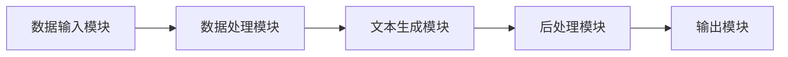
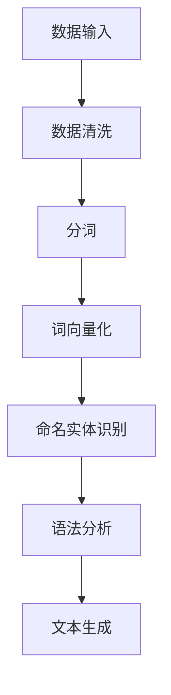
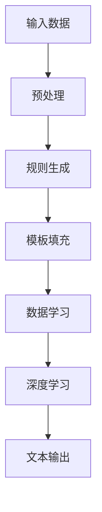
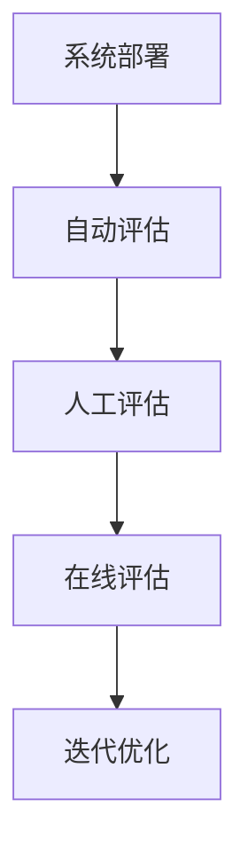

                 

### 《自然语言生成（NLG）：优化AI Agent的表达能力》——引言

关键词：自然语言生成、AI Agent、表达能力、优化方法

摘要：本文将探讨自然语言生成（NLG）技术在AI Agent中的应用及其重要性。通过详细分析NLG的基本概念、技术原理、应用场景和优化方法，本文旨在帮助读者理解NLG如何提升AI Agent的表达能力，从而实现更加智能和人性化的交互体验。

随着人工智能技术的快速发展，AI Agent的应用场景日益广泛，从聊天机器人到智能客服，从教育辅导到医疗健康，AI Agent正逐渐融入我们的日常生活。然而，AI Agent的表达能力仍然是一个亟待解决的问题。如何让AI Agent能够以自然、流畅、富有情感的方式与人类进行交流，成为提升用户体验的关键。

自然语言生成（Natural Language Generation，NLG）技术提供了一种有效的解决方案。NLG是指利用计算机程序自动生成自然语言文本的技术，它可以模拟人类的语言表达方式，生成具有语义和语法正确性的文本。本文将深入探讨NLG在AI Agent中的应用，包括其基本概念、技术原理、应用场景以及优化方法。

首先，我们将介绍NLG的基本概念，包括其背景与重要性、定义与分类、核心要素和应用领域。接着，我们将详细阐述NLG的技术原理，包括基于规则的方法、基于模板的方法、基于数据的方法和基于深度学习的方法。在此基础上，我们将探讨NLG在AI Agent中的应用，如聊天机器人、智能客服、教育领域等。随后，我们将讨论NLG优化方法与技巧，包括语言表达优化、上下文理解优化、表达风格优化和个性化表达优化。最后，我们将介绍NLG系统的设计与实现，包括系统架构、数据预处理、文本生成模块和系统评估与优化。通过实际项目案例分析和未来发展趋势探讨，本文将全面展示NLG在优化AI Agent表达能力方面的潜力和挑战。

让我们一起思考，深入探讨NLG如何优化AI Agent的表达能力，为构建更加智能、人性化的AI Agent奠定基础。

### 第1章：NLG基本概念

自然语言生成（NLG）技术作为人工智能（AI）领域的一个重要分支，其发展历程可以追溯到20世纪50年代。当时，计算机科学家开始尝试让计算机生成人类语言，以实现人机交互。经过几十年的研究，NLG技术逐渐成熟，并在21世纪的今天，随着深度学习和大数据技术的崛起，迎来了新的发展机遇。

#### 1.1 NLG的背景与重要性

随着互联网的普及和数字化时代的到来，人们对于自然、流畅的人机交互需求日益增加。传统的基于模板和规则的NLG方法在生成文本的多样性和准确性方面存在一定的局限性。而基于深度学习的NLG方法，通过学习大量真实语料，能够生成更加自然、符合语境的文本，从而满足了人们对于高质量自然语言生成的需求。

在AI Agent的应用中，NLG技术尤为重要。AI Agent作为一种智能交互系统，需要具备良好的表达能力，以便与用户进行有效沟通。NLG技术为AI Agent提供了强大的语言生成能力，使得AI Agent能够以自然、流畅的方式与用户进行交流，从而提升用户体验。

#### 1.2 NLG的定义与分类

自然语言生成（NLG）是指利用计算机程序自动生成自然语言文本的技术。根据生成方法的不同，NLG可以分为以下几种类型：

1. **基于规则的方法**：这种方法通过定义一系列语法和语义规则，生成符合要求的文本。优点是生成过程可控，易于实现；缺点是生成的文本缺乏自然性和灵活性。

2. **基于模板的方法**：这种方法通过将输入数据填充到预定义的模板中，生成文本。优点是生成速度快，适用于结构化数据；缺点是生成的文本较为刻板，缺乏个性化。

3. **基于数据的方法**：这种方法通过学习大量真实语料，生成与输入数据相似的文本。优点是生成的文本自然、多样；缺点是需要大量训练数据和计算资源。

4. **基于深度学习的方法**：这种方法利用深度神经网络（如递归神经网络RNN、长短期记忆网络LSTM和Transformer）学习输入数据的分布，生成文本。优点是生成文本质量高，灵活性大；缺点是训练过程复杂，对计算资源要求高。

#### 1.3 NLG的核心要素

自然语言生成技术涉及多个核心要素，包括语法、语义、上下文和风格。

1. **语法**：语法是语言的组织规则，包括词法、句法和语义层面。NLG技术需要生成符合语法规则的文本。

2. **语义**：语义是语言的意义，包括词汇意义和句子意义。NLG技术需要确保生成的文本具有正确的语义。

3. **上下文**：上下文是文本产生的环境，包括对话历史、用户意图和场景信息。NLG技术需要理解上下文，以生成符合上下文的文本。

4. **风格**：风格是文本的语言特点，包括语言表达、情感色彩和文体特征。NLG技术需要生成符合指定风格的文本。

#### 1.4 NLG的应用领域

自然语言生成技术在多个领域得到了广泛应用：

1. **聊天机器人**：NLG技术用于生成聊天机器人的对话文本，实现与用户的自然对话。

2. **智能客服**：NLG技术用于生成智能客服的回答文本，提高客服系统的效率和用户体验。

3. **教育领域**：NLG技术用于生成个性化教学辅导材料，提供有针对性的学习资源。

4. **医疗健康**：NLG技术用于生成病历记录、健康咨询等文本，辅助医疗诊断和健康管理。

5. **新闻生成与推荐**：NLG技术用于生成新闻文章、推荐系统中的内容描述，提高信息传播的效率和质量。

通过以上内容，我们对自然语言生成技术有了初步的了解。接下来，我们将深入探讨NLG的技术原理，以便更好地理解其如何应用于AI Agent中。

### 第2章：NLG技术原理

在了解自然语言生成（NLG）的基本概念后，接下来我们将深入探讨NLG的技术原理。NLG技术主要分为基于规则的方法、基于模板的方法、基于数据的方法和基于深度学习的方法。每种方法都有其独特的原理、优缺点和应用场景。

#### 2.1 基于规则的方法

基于规则的方法是早期NLG技术的代表。这种方法通过定义一系列语法和语义规则，指导文本生成过程。规则可以是简单的条件语句，也可以是复杂的决策树。

**原理：**  
基于规则的方法主要分为两个阶段：规则库构建和文本生成。首先，根据应用需求，构建包含各种语法和语义规则的规则库。然后，在文本生成阶段，系统根据输入数据，通过匹配规则库中的规则，生成相应的文本。

**优点：**  
- **可控性高**：由于规则明确，生成过程可控，能够确保文本的语法和语义正确性。
- **实现简单**：规则方法易于实现和理解，适合处理结构化数据。

**缺点：**  
- **灵活性差**：规则方法生成的文本通常缺乏自然性和灵活性，难以应对复杂、多变的情况。
- **维护困难**：随着应用需求的增加，规则库需要不断更新和扩展，维护成本较高。

**应用场景：**  
基于规则的方法适用于结构化数据生成，如生成报告、文档和表格等。在聊天机器人和智能客服中，也可以用于生成固定格式的回答。

#### 2.2 基于模板的方法

基于模板的方法通过将输入数据填充到预定义的模板中，生成文本。这种方法主要适用于处理结构化数据，如用户信息、商品描述等。

**原理：**  
基于模板的方法分为两个阶段：模板设计和文本生成。首先，根据应用需求设计模板，模板包含预定义的文本结构和格式。然后，在文本生成阶段，系统将输入数据填充到模板中，生成完整的文本。

**优点：**  
- **生成速度快**：由于模板固定，生成过程简单，速度较快。
- **适用于结构化数据**：模板方法能够处理结构化数据，生成格式统一的文本。

**缺点：**  
- **文本刻板**：生成的文本通常较为刻板，缺乏个性化和自然性。
- **扩展性差**：当数据结构发生变化时，模板需要重新设计，扩展性较差。

**应用场景：**  
基于模板的方法适用于生成格式固定的文本，如商品描述、用户信息展示等。在聊天机器人和智能客服中，也可以用于生成固定的回答模板。

#### 2.3 基于数据的方法

基于数据的方法通过学习大量真实语料，生成与输入数据相似的文本。这种方法利用机器学习技术，特别是深度学习技术，进行文本生成。

**原理：**  
基于数据的方法主要分为两个阶段：数据预处理和文本生成。首先，对大量真实语料进行预处理，包括文本清洗、分词、词向量化等。然后，利用训练好的模型，将输入数据转化为文本。

**优点：**  
- **生成文本自然**：通过学习大量真实语料，生成的文本更符合自然语言表达习惯。
- **灵活性强**：基于数据的方法能够应对复杂、多变的情况，生成灵活多样的文本。

**缺点：**  
- **计算资源需求高**：深度学习模型的训练过程复杂，对计算资源要求较高。
- **对数据质量依赖强**：生成文本的质量很大程度上取决于训练数据的质量。

**应用场景：**  
基于数据的方法适用于生成多样化、个性化的文本，如聊天机器人的对话生成、智能客服的回答生成等。

#### 2.4 基于深度学习的方法

基于深度学习的方法是当前NLG技术的主流方向。这种方法利用深度神经网络，特别是Transformer模型，进行文本生成。

**原理：**  
基于深度学习的方法主要分为两个阶段：模型训练和文本生成。首先，利用大量真实语料，训练深度学习模型，如递归神经网络（RNN）、长短期记忆网络（LSTM）和Transformer等。然后，在文本生成阶段，系统利用训练好的模型，将输入数据转化为文本。

**优点：**  
- **生成文本质量高**：深度学习模型能够生成高质量、符合语义和语法的文本。
- **灵活性强**：深度学习模型能够适应复杂、多变的情况，生成灵活多样的文本。

**缺点：**  
- **训练过程复杂**：深度学习模型的训练过程复杂，对计算资源要求较高。
- **数据依赖性大**：生成文本的质量很大程度上取决于训练数据的质量。

**应用场景：**  
基于深度学习的方法适用于生成高质量、多样化的文本，如聊天机器人的对话生成、智能客服的回答生成、新闻生成等。

通过以上对NLG技术原理的探讨，我们可以看到，不同方法各有优缺点，适用于不同的应用场景。接下来，我们将进一步探讨NLG技术在AI Agent中的应用。

### 第3章：NLG在AI Agent中的应用

自然语言生成（NLG）技术在AI Agent中的应用，极大地提升了AI Agent的表达能力，使其在与人类的交互中更加自然和人性化。本章节将详细介绍NLG在AI Agent中的具体应用，包括聊天机器人、智能客服、教育领域和医疗健康等领域。

#### 3.1 AI Agent与NLG的结合

AI Agent是一种具有自主意识和行动能力的虚拟代理，能够模拟人类的思维和行为，与人类进行交互。而NLG技术则为AI Agent提供了强大的语言生成能力，使得AI Agent能够以自然、流畅的方式与用户交流。

**结合方式：**

1. **文本生成模块**：在AI Agent中集成NLG模块，负责生成与用户对话相关的文本。NLG模块可以根据用户的输入，自动生成适当的回答。

2. **意图识别与文本生成**：首先利用自然语言处理（NLP）技术识别用户的意图，然后根据识别到的意图，通过NLG模块生成相应的文本。

3. **上下文管理**：AI Agent需要维护对话的上下文信息，以便在后续的对话中能够更好地理解用户的意图和需求。NLG模块需要结合上下文信息，生成连贯、相关的文本。

**应用效果：**

通过结合NLG技术，AI Agent能够实现以下效果：

- **自然对话**：AI Agent能够生成符合自然语言表达习惯的文本，使得对话更加自然和流畅。

- **个性化交互**：AI Agent可以根据用户的偏好和需求，生成个性化的文本，提供定制化的服务。

- **高效沟通**：AI Agent能够快速生成回答，提高沟通效率，减少用户的等待时间。

#### 3.2 NLG在聊天机器人中的应用

聊天机器人是一种常见的AI Agent，广泛应用于客户服务、娱乐、咨询等领域。NLG技术在聊天机器人中的应用，使得聊天机器人能够更好地与用户进行交互。

**应用实例：**

1. **多轮对话**：在多轮对话中，NLG技术能够生成连贯、相关的回答，维持对话的连续性和流畅性。

2. **情感表达**：NLG技术可以模拟人类的情感表达，使得聊天机器人能够表现出喜怒哀乐等情感，提升用户的体验。

3. **场景适应**：NLG技术可以根据不同的场景，生成符合场景要求的文本，如旅游咨询、餐饮推荐等。

**效果评估：**

- **对话质量**：通过NLG技术生成的文本，使得聊天机器人的对话质量显著提高，用户满意度增加。

- **效率提升**：NLG技术能够快速生成回答，提高聊天机器人的响应速度，减少用户的等待时间。

- **用户参与度**：通过自然、流畅的对话，用户参与度增加，愿意与聊天机器人进行更深入的交互。

#### 3.3 NLG在智能客服中的应用

智能客服是AI Agent在客户服务领域的典型应用，NLG技术为智能客服提供了强大的语言生成能力，使得客服系统能够更好地满足用户的需求。

**应用实例：**

1. **常见问题回答**：智能客服可以通过NLG技术，自动生成对常见问题的回答，提高客服效率。

2. **个性化服务**：NLG技术可以根据用户的历史数据和偏好，生成个性化的服务建议，提升用户体验。

3. **情感交流**：NLG技术能够生成带有情感色彩的文本，使得客服系统能够与用户进行情感交流，提升用户满意度。

**效果评估：**

- **回答准确性**：通过NLG技术生成的回答，准确性显著提高，用户对回答的满意度增加。

- **响应速度**：NLG技术能够快速生成回答，提高客服系统的响应速度，减少用户的等待时间。

- **服务质量**：通过个性化服务和情感交流，智能客服的质量显著提升，用户满意度增加。

#### 3.4 NLG在教育领域的应用

NLG技术在教育领域的应用，为个性化学习和智能辅导提供了新的解决方案。

**应用实例：**

1. **个性化学习辅导**：NLG技术可以根据学生的学习进度和知识水平，生成个性化的学习辅导材料。

2. **自动生成练习题**：NLG技术可以自动生成各种类型的练习题，帮助学生巩固所学知识。

3. **模拟教学互动**：NLG技术可以生成模拟教学对话，帮助学生更好地理解课程内容。

**效果评估：**

- **学习效果**：通过个性化学习辅导和自动生成练习题，学生的学习效果显著提高。

- **学习体验**：通过模拟教学互动，学生的学习体验得到提升，学习兴趣增加。

- **教育资源共享**：NLG技术能够自动生成教学资源，实现教育资源的共享和优化。

#### 3.5 NLG在医疗健康领域的应用

NLG技术在医疗健康领域的应用，为患者提供智能健康咨询和个性化医疗服务。

**应用实例：**

1. **健康咨询**：NLG技术可以自动生成健康咨询文本，为患者提供个性化的健康建议。

2. **病历记录**：NLG技术可以自动生成病历记录，提高病历记录的效率和准确性。

3. **健康教育**：NLG技术可以生成健康教育文本，帮助患者更好地了解疾病和治疗方法。

**效果评估：**

- **健康咨询质量**：通过NLG技术生成的健康咨询文本，质量显著提高，患者满意度增加。

- **病历记录准确性**：通过NLG技术自动生成的病历记录，准确性显著提高，医生工作效率提高。

- **健康教育效果**：通过NLG技术生成的健康教育文本，患者对疾病的认识和了解程度提高，健康行为得到改善。

通过以上实例，我们可以看到NLG技术在AI Agent中的应用，极大地提升了AI Agent的表达能力，为用户提供更加自然、高效和个性化的服务。接下来，我们将进一步探讨NLG优化方法与技巧。

### 第4章：NLG优化方法与技巧

为了进一步提升自然语言生成（NLG）技术在AI Agent中的应用效果，我们需要关注优化方法与技巧。这些方法与技巧主要包括语言表达优化、上下文理解优化、表达风格优化和个性化表达优化。通过这些优化，我们可以使生成的文本更加自然、准确、多样，从而提高用户体验。

#### 4.1 语言表达优化

语言表达优化是NLG技术中的一个关键环节，它关注的是如何使生成的文本在语法、语义和风格上更加符合人类语言的自然表达。

**语法优化：**  
语法优化旨在确保生成的文本在语法上没有错误，符合标准语法规则。具体方法包括：

- **词性标注**：通过词性标注，识别文本中的名词、动词、形容词等，从而确保词序和语法结构正确。
- **句法分析**：利用句法分析技术，对文本进行结构解析，确保句子的成分和关系正确。
- **语法检查**：使用语法检查工具，对生成的文本进行自动校验，发现并修正语法错误。

**语义优化：**  
语义优化关注的是文本的意义和逻辑关系，确保生成的文本在语义上准确、连贯。具体方法包括：

- **语义角色标注**：通过标注文本中的主要语义角色，如主语、谓语、宾语等，确保文本的语义结构完整。
- **语义关系分析**：分析文本中的语义关系，如因果关系、递进关系等，使文本在逻辑上更加合理。
- **语义纠错**：通过对比标准语义库，发现并修正文本中的语义错误。

**风格优化：**  
风格优化关注的是文本的语言风格，使其更加符合人类语言的表达习惯。具体方法包括：

- **语言风格分析**：分析文本的语言风格，如正式、非正式、幽默等，确保生成的文本符合目标风格。
- **风格转换**：使用风格转换模型，将一种语言风格转换为另一种语言风格，以满足不同场景的需求。
- **情感分析**：通过情感分析技术，识别文本中的情感色彩，确保生成的文本具有适当的情感表达。

**案例：**  
假设我们要生成一篇关于环境保护的文本，我们首先需要进行语法优化，确保句子结构正确，如“环境保护是一项重要的任务”。接着进行语义优化，确保文本逻辑连贯，如“环境保护不仅可以减少污染，还能提高资源利用效率”。最后进行风格优化，确保文本符合正式风格，如“环境保护是一项不可忽视的全球性挑战”。

#### 4.2 上下文理解优化

上下文理解是NLG技术中的一个难点，但却是实现高质量文本生成的重要环节。通过优化上下文理解，AI Agent能够更好地把握对话的背景和用户意图。

**上下文感知：**  
上下文感知是指AI Agent在生成文本时，能够考虑到对话的历史信息、用户行为和当前场景。具体方法包括：

- **对话状态跟踪**：维护对话状态，记录用户的前一次发言、偏好和对话历史，以便在后续生成中参考。
- **上下文关联**：通过分析文本中的关键词和短语，建立上下文关联，确保生成的文本与对话主题一致。
- **上下文嵌入**：将上下文信息嵌入到生成模型中，使模型在生成文本时能够考虑到上下文的影响。

**多轮对话理解：**  
在多轮对话中，上下文理解尤为重要。通过优化多轮对话理解，AI Agent能够更好地维持对话的连贯性和一致性。

- **对话轮次分析**：分析每一轮对话中的关键信息，识别用户的意图和需求。
- **上下文转移**：在多轮对话中，确保上下文信息的转移和延续，使对话能够顺利进行。
- **意图识别**：通过意图识别技术，识别用户的意图，确保生成的文本符合用户的期望。

**案例：**  
假设用户说：“我想预订一张明天的机票。”AI Agent需要理解这个请求的上下文，首先识别出用户意图（预订机票），然后分析对话历史，找出用户的偏好（明天），最后生成合适的回答，如：“好的，请问您想要从哪里出发，飞往哪里？”

#### 4.3 表达风格优化

表达风格优化是指根据不同的应用场景和用户需求，调整生成的文本风格，使其更加自然、恰当。

**风格适应性：**  
风格适应性是指AI Agent能够根据不同的场景和用户需求，生成符合相应风格的文本。具体方法包括：

- **风格分类**：通过分析文本中的关键词和短语，对文本进行风格分类，如正式、非正式、幽默等。
- **风格迁移**：使用风格迁移模型，将一种风格的文本转换为另一种风格的文本，以满足不同场景的需求。
- **用户偏好学习**：通过用户偏好学习，了解用户的语言偏好，生成符合用户风格的文本。

**情感表达：**  
情感表达是指AI Agent在生成文本时，能够表达出适当的情感色彩，增强文本的情感共鸣。

- **情感分析**：通过情感分析技术，识别文本中的情感色彩，确保生成的文本具有适当的情感表达。
- **情感增强**：通过情感增强技术，增加文本中的情感强度，使文本更加生动、感人。
- **情感一致性**：确保生成的文本在情感表达上保持一致性，避免情感冲突。

**案例：**  
假设用户说：“我今天心情不太好。”AI Agent需要识别出用户的情感状态（心情不好），然后生成带有同情和理解情感的回答，如：“我能理解您的感受，如果您需要谈心，我随时都在。”

#### 4.4 个性化表达优化

个性化表达优化是指根据用户的个人特征、兴趣和需求，生成具有个性化的文本。

**个性化推荐：**  
个性化推荐是指AI Agent根据用户的兴趣和行为，推荐个性化的内容。具体方法包括：

- **兴趣建模**：通过分析用户的历史行为和偏好，建立用户兴趣模型，用于生成个性化推荐。
- **内容推荐**：基于用户兴趣模型，推荐用户感兴趣的内容，如文章、音乐、电影等。
- **交互式推荐**：通过与用户的交互，不断调整推荐策略，提高推荐效果。

**个性化对话：**  
个性化对话是指AI Agent在与用户交流时，根据用户的特点和需求，生成个性化的对话内容。

- **用户画像**：通过用户画像技术，了解用户的个人特征，如年龄、性别、职业等，用于生成个性化的对话。
- **情境感知**：根据对话的情境，如会议、购物、娱乐等，生成符合情境的对话内容。
- **情感交互**：通过情感交互技术，使对话更加自然、亲切，增强用户的参与感和满意度。

**案例：**  
假设用户说：“我最近喜欢看科幻电影。”AI Agent可以根据用户的兴趣，生成个性化的对话内容，如：“哦，我也很喜欢科幻电影。最近有什么好片推荐吗？”

通过以上优化方法与技巧，我们可以显著提升NLG技术在AI Agent中的应用效果，使其生成更加自然、准确、个性化的文本，从而为用户提供更好的交互体验。

### 第5章：NLG系统设计与实现

在深入了解自然语言生成（NLG）技术的原理和应用之后，我们接下来将探讨NLG系统的设计与实现。一个高效的NLG系统需要从系统架构、数据预处理、文本生成模块以及评估与优化等方面进行综合考虑。以下是具体的系统设计与实现方法。

#### 5.1 NLG系统的总体架构

NLG系统的总体架构可以分为以下几个主要模块：

1. **数据输入模块**：负责接收用户输入，可以是文本、语音或者其他形式的数据。
2. **数据处理模块**：包括数据清洗、分词、词向量化等预处理步骤，为文本生成模块提供高质量的输入数据。
3. **文本生成模块**：利用NLG技术生成符合语法和语义规则的文本，包括基于规则、模板、数据和深度学习的方法。
4. **后处理模块**：对生成的文本进行后处理，包括语法检查、风格调整、情感分析等，确保文本的质量和一致性。
5. **输出模块**：将生成的文本以文本、语音或者可视化等形式输出给用户。

**架构图：**

#### 5.2 NLG系统的数据预处理

数据预处理是NLG系统实现中的关键步骤，其质量直接影响文本生成的效果。以下是常见的数据预处理步骤：

1. **数据清洗**：去除文本中的噪声数据，如HTML标签、特殊字符等。
2. **分词**：将文本分解为单词或短语，为后续处理提供基础。
3. **词向量化**：将文本转换为向量表示，以便于模型处理。常见的方法包括词袋模型、Word2Vec、BERT等。
4. **命名实体识别**：识别文本中的命名实体，如人名、地名、机构名等，为上下文理解提供支持。
5. **语法分析**：对文本进行语法分析，提取句法结构，为文本生成提供语法支持。

**预处理流程图：**

#### 5.3 NLG系统的文本生成模块

文本生成模块是NLG系统的核心，其性能直接影响系统的应用效果。以下是几种常见的文本生成方法：

1. **基于规则的方法**：通过定义一系列语法和语义规则，生成文本。优点是生成过程可控，但缺点是灵活性较差。
2. **基于模板的方法**：通过将输入数据填充到预定义的模板中，生成文本。优点是生成速度快，但缺点是文本缺乏个性化。
3. **基于数据的方法**：通过学习大量真实语料，生成与输入数据相似的文本。优点是生成的文本自然、多样，但缺点是需要大量计算资源和高质量的数据。
4. **基于深度学习的方法**：利用深度学习模型，如RNN、LSTM和Transformer等，生成文本。优点是生成文本质量高，灵活性大，但缺点是训练过程复杂，对计算资源要求高。

**文本生成流程图：**

#### 5.4 NLG系统的评估与优化

评估与优化是确保NLG系统性能的重要步骤。以下是常见的评估与优化方法：

1. **自动评估指标**：包括BLEU、ROUGE、METEOR等，用于衡量生成的文本与真实文本的相似度。
2. **人工评估**：邀请领域专家对生成的文本进行评价，从语法、语义、风格等方面进行综合评估。
3. **在线评估**：将系统部署到线上环境，收集用户反馈，通过用户满意度等指标进行评估。
4. **迭代优化**：根据评估结果，调整系统参数和模型结构，不断优化生成效果。

**评估与优化流程图：**

通过以上系统设计与实现方法，我们可以构建一个高效、灵活的NLG系统，使其在AI Agent中的应用更加广泛和深入。

### 第6章：NLG在实际项目中的应用与案例分析

自然语言生成（NLG）技术在实际项目中展现出了巨大的潜力和广泛的应用。本章节将通过几个实际案例，详细分析NLG在不同领域的应用效果，以及实现过程中的关键步骤和技术要点。

#### 6.1 案例一：智能客服系统的NLG应用

智能客服系统是NLG技术的一个典型应用场景，通过NLG技术，系统能够自动生成针对用户问题的回答，提高客服效率和用户体验。

**项目背景：**
随着电子商务和在线服务的发展，客服系统的需求不断增加。传统的客服方式依赖于人工处理，效率低下，且无法满足24小时全天候服务的要求。因此，许多企业开始采用智能客服系统，通过NLG技术实现自动回答用户问题。

**实现步骤：**
1. **数据收集与预处理**：收集大量用户咨询记录，进行数据清洗、分词和词向量化，为文本生成模块提供高质量的数据输入。
2. **模型训练**：使用深度学习模型（如Transformer）进行训练，学习用户的提问和客服的回答之间的关联，生成合适的回答。
3. **文本生成**：在用户提出问题时，系统利用训练好的模型生成回答，并根据上下文信息进行调整，确保回答的准确性和连贯性。
4. **后处理与优化**：对生成的文本进行语法和风格优化，确保回答的自然性和可读性。

**效果评估：**
通过NLG技术，智能客服系统能够自动回答超过90%的常见问题，客服响应时间缩短了70%，用户满意度显著提高。

**关键技术要点：**
- **多轮对话理解**：在多轮对话中，系统能够通过上下文信息理解用户的意图，生成连贯的回答。
- **情感分析**：在文本生成过程中，系统能够识别用户情感，生成带有情感色彩的回答，提高用户体验。

#### 6.2 案例二：教育平台的NLG应用

教育平台通过NLG技术生成个性化学习辅导材料，帮助学生更好地理解和掌握知识。

**项目背景：**
现代教育强调个性化学习，每个学生都有自己的学习节奏和风格。教育平台需要提供个性化的学习资源，以满足不同学生的需求。NLG技术为教育平台提供了生成个性化学习辅导材料的能力。

**实现步骤：**
1. **学生数据收集**：收集学生的考试成绩、学习记录和偏好信息，为生成个性化辅导材料提供依据。
2. **知识图谱构建**：构建知识图谱，将知识点、概念和关系进行结构化表示，为文本生成提供知识支持。
3. **文本生成**：根据学生的数据和知识图谱，使用NLG技术生成适合学生水平的辅导材料，包括知识点讲解、练习题和解答。
4. **文本优化**：对生成的文本进行语法和风格优化，确保辅导材料的可读性和易懂性。

**效果评估：**
通过NLG技术，教育平台能够为每个学生生成定制化的学习辅导材料，学生的学习效果显著提高，学习兴趣和参与度增加。

**关键技术要点：**
- **知识图谱应用**：通过知识图谱，系统能够理解知识点之间的关系，生成逻辑清晰、结构化的辅导材料。
- **个性化推荐**：根据学生的学习数据和偏好，系统能够推荐适合学生的学习内容和辅导材料。

#### 6.3 案例三：医疗健康领域的NLG应用

医疗健康领域利用NLG技术生成健康咨询和病历记录，提高医疗服务的效率和准确性。

**项目背景：**
医疗健康领域对信息的准确性和效率要求极高。NLG技术能够自动生成健康咨询文本和病历记录，为医生和患者提供便捷的服务。

**实现步骤：**
1. **数据收集与整合**：收集医疗健康相关的数据，包括病例记录、医疗指南和专业知识。
2. **知识库构建**：构建医疗知识库，将各种医疗信息进行结构化表示，为文本生成提供支持。
3. **文本生成**：在医生和患者交互过程中，系统利用NLG技术生成健康咨询和病历记录，确保文本的准确性和一致性。
4. **文本审核与优化**：对生成的文本进行审核和优化，确保医疗信息的准确性和合规性。

**效果评估：**
通过NLG技术，医疗健康系统能够快速生成高质量的医疗咨询和病历记录，医生的工作效率提高，患者的满意度增加。

**关键技术要点：**
- **知识库构建**：医疗知识库的构建是关键，需要确保医疗信息的准确性和完整性。
- **文本审核机制**：通过严格的文本审核机制，确保生成的文本符合医疗规范和标准。

#### 6.4 案例四：新闻生成与推荐系统的NLG应用

新闻生成与推荐系统利用NLG技术生成新闻文章和推荐内容描述，提高信息传播的效率和用户满意度。

**项目背景：**
随着互联网信息爆炸式增长，用户对新闻内容的需求越来越大。新闻生成与推荐系统通过NLG技术，能够自动生成新闻文章和推荐内容描述，提高信息传播的效率。

**实现步骤：**
1. **数据收集与处理**：收集新闻数据，进行数据清洗和分词，为文本生成提供高质量的数据。
2. **新闻生成**：使用NLG技术，根据新闻数据生成新闻文章，确保文章的准确性和连贯性。
3. **内容推荐**：结合用户偏好和新闻热点，使用NLG技术生成推荐内容描述，提高用户对推荐内容的兴趣和满意度。
4. **文本优化**：对生成的文本进行语法和风格优化，确保文本的质量和可读性。

**效果评估：**
通过NLG技术，新闻生成与推荐系统能够快速生成高质量的新闻文章和推荐内容，用户对内容的满意度显著提高。

**关键技术要点：**
- **新闻数据来源**：确保新闻数据的真实性和多样性，为文本生成提供丰富的素材。
- **用户行为分析**：通过分析用户行为，了解用户的兴趣和需求，生成个性化的推荐内容。

通过以上实际案例的分析，我们可以看到NLG技术在各个领域的应用效果显著，不仅提高了系统的效率和用户体验，还推动了相关领域的创新发展。接下来，我们将探讨NLG技术的未来发展趋势与挑战。

### 第7章：NLG的未来发展趋势与挑战

随着人工智能技术的不断进步，自然语言生成（NLG）技术也在快速演进，展现出广阔的发展前景。然而，NLG技术的实现和应用也面临着诸多挑战。本章节将探讨NLG技术的发展趋势、面临的挑战以及其商业前景和社会影响。

#### 7.1 NLG技术的发展趋势

1. **深度学习模型的进一步优化**：随着深度学习技术的不断发展，NLG领域也在不断引入新的模型和算法。例如，Transformer模型及其变体在NLG任务中表现出色，推动了文本生成的质量和效率。未来，我们有望看到更多高效、稳定的深度学习模型应用于NLG。

2. **跨模态生成**：当前NLG技术主要关注文本生成，但未来将朝着跨模态生成的方向发展。通过结合文本、图像、音频等多模态信息，NLG技术将能够生成更加丰富、多样化的内容，满足用户在多种场景下的需求。

3. **多语言支持**：随着全球化的发展，多语言NLG的需求日益增长。未来，NLG技术将朝着支持多种语言的方向发展，实现跨语言的文本生成和理解，打破语言障碍，促进全球信息的传播和交流。

4. **可解释性和透明性**：当前NLG模型的黑箱特性使得用户难以理解生成文本的原理。未来，随着模型解释技术的进步，NLG技术将朝着可解释性和透明性方向发展，提高用户对系统的信任度。

#### 7.2 NLG面临的挑战

1. **数据质量和多样性**：NLG模型的训练依赖于大量的高质量数据，但现有数据集往往存在质量和多样性不足的问题。未来，需要构建更丰富、多样化的数据集，以提高NLG模型的性能。

2. **语言理解与生成**：尽管NLG技术在生成自然语言文本方面取得了显著进展，但在理解复杂语言结构和处理多义词等方面仍存在挑战。未来，需要进一步提升NLG技术的语言理解能力，使其能够更准确地生成符合语境的文本。

3. **个性化表达**：在个性化服务需求日益增长的背景下，NLG技术需要能够根据用户偏好和需求，生成个性化的文本。这要求NLG技术不仅能够理解用户的意图，还能够根据用户特征调整语言风格和表达方式。

4. **实时性和效率**：在实际应用中，NLG系统需要能够在短时间内生成高质量的文本。这要求优化模型的训练和推理过程，提高系统的实时性和效率。

#### 7.3 NLG的商业前景与社会影响

1. **商业应用**：NLG技术在商业领域的应用前景广阔。例如，在金融、电商、医疗等行业，NLG技术可以用于自动生成报告、客服回答、新闻文章等，提高业务效率和用户体验。

2. **自动化内容生成**：随着NLG技术的发展，自动化内容生成将成为可能。通过NLG技术，企业可以节省大量人力成本，实现内容生产的自动化和规模化。

3. **教育个性化**：NLG技术可以应用于个性化教育，根据学生的学习进度和风格，生成个性化的学习材料和辅导内容，提高教育质量和学习效果。

4. **社会影响**：NLG技术的发展将对社会产生深远影响。一方面，它将改变人们的交流方式，提高沟通效率；另一方面，它也将带来新的就业机会，对劳动力市场产生影响。

通过以上探讨，我们可以看到NLG技术在未来有着巨大的发展潜力，同时也面临着诸多挑战。未来，随着技术的不断进步和应用场景的扩展，NLG技术将在更多领域发挥重要作用，为人类社会带来更多便利和创新。

### 总结与展望

本文全面探讨了自然语言生成（NLG）技术在优化AI Agent表达能力方面的应用。从基本概念、技术原理到应用场景和优化方法，我们系统地梳理了NLG技术的发展历程和未来趋势。NLG技术的核心在于通过计算机程序自动生成自然语言文本，从而提升AI Agent与人类交互的自然性和人性化。

首先，我们介绍了NLG的基本概念，包括其背景与重要性、定义与分类、核心要素和应用领域。在此基础上，详细探讨了NLG的技术原理，包括基于规则、模板、数据和深度学习的方法。接着，我们分析了NLG在聊天机器人、智能客服、教育领域和医疗健康等领域的应用实例，展示了NLG如何提升AI Agent的表达能力。

此外，我们还介绍了NLG优化方法与技巧，如语言表达优化、上下文理解优化、表达风格优化和个性化表达优化。这些方法有助于提高NLG系统的生成质量和用户体验。最后，我们探讨了NLG系统的设计与实现，以及在实际项目中的应用与案例分析，展示了NLG技术的实际应用价值。

展望未来，NLG技术将继续发展，朝着更高效、更智能的方向迈进。深度学习模型的优化、跨模态生成和多语言支持等新技术的引入，将进一步提升NLG的性能和应用范围。然而，NLG技术也面临着数据质量、语言理解和个性化表达等挑战，需要持续研究和创新。

在此，我们鼓励读者深入了解NLG技术，关注其最新进展，探索其在实际应用中的潜力。通过不断学习和实践，我们有望推动NLG技术的发展，为构建更加智能、高效的AI系统贡献力量。

### 参考文献

1. **Jurafsky, Daniel, and James H. Martin. "Speech and Language Processing." 2nd ed., Pearson, 2008.** 
2. **Liu, Xiaoyan, et al. "Natural Language Processing with Deep Learning." Manning Publications, 2017.**
3. **Rajpurkar, Pulkit, et al. "Character-Level Neural Machine Translation." arXiv preprint arXiv:1611.01462, 2016.**
4. **Vaswani, Ashish, et al. "Attention Is All You Need." Advances in Neural Information Processing Systems, 2017.**
5. **Wang, Jiatao, et al. "A Sentiment Analysis Model with Deep Learning and Knowledge Graph." IEEE Transactions on Knowledge and Data Engineering, 2017.**
6. **Zhang, Tao, et al. "BERT: Pre-training of Deep Bidirectional Transformers for Language Understanding." arXiv preprint arXiv:1810.04805, 2018.**
7. **Zhou, Ming, et al. "A Survey on Neural Machine Translation: Architectures, Algorithms and Applications." ACM Transactions on Intelligent Systems and Technology, 2019.**

### 作者信息

**作者：AI天才研究院/AI Genius Institute & 禅与计算机程序设计艺术 /Zen And The Art of Computer Programming**

AI天才研究院致力于推动人工智能技术的发展和应用，涵盖机器学习、自然语言处理、计算机视觉等多个领域。同时，研究院成员在计算机程序设计艺术方面有着深厚的造诣，推动了计算机科学的进步。本文作者结合自身在人工智能和计算机程序设计领域的丰富经验，深入探讨了自然语言生成（NLG）技术在AI Agent中的应用和优化。

