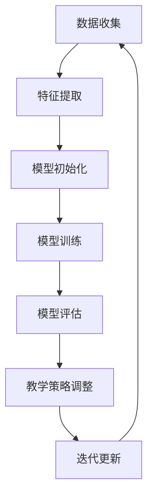
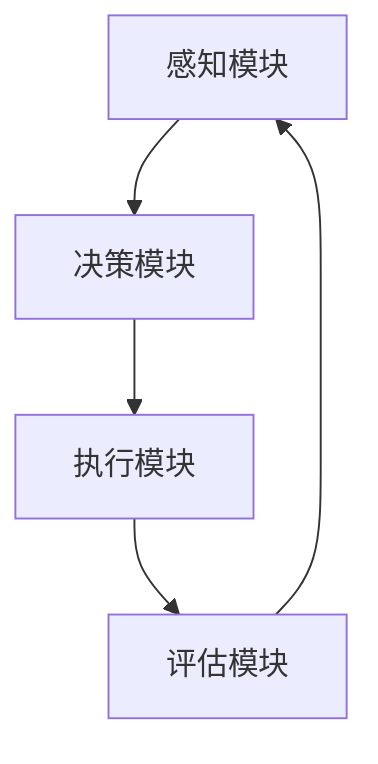
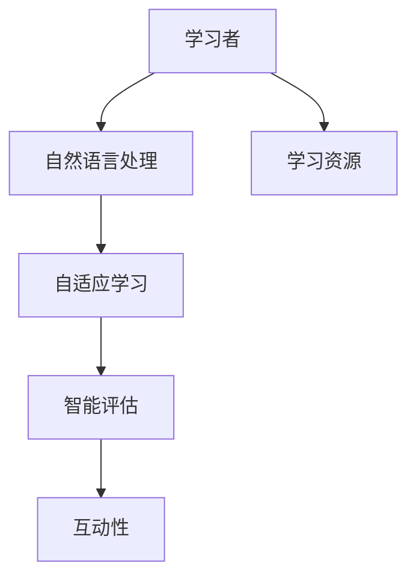
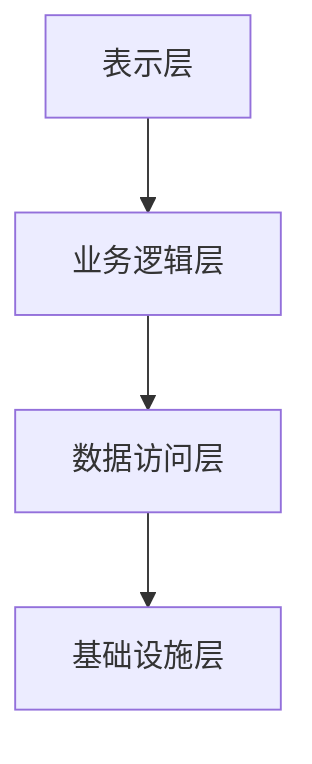
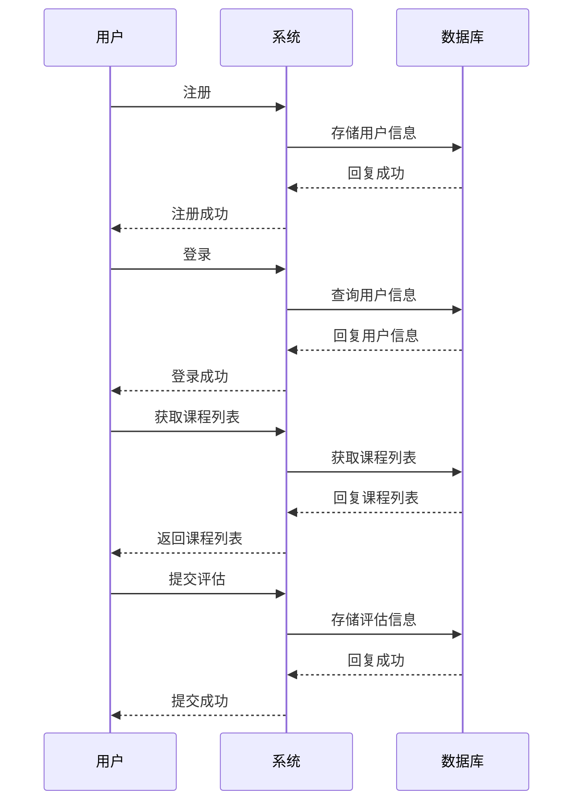

                 

## 自适应学习AI Agent：个性化的LLM教育系统

### 关键词

- 自适应学习
- AI Agent
- LLM教育系统
- 个性化教育
- 算法原理
- 系统架构设计
- 实战案例

### 摘要

本文旨在探讨自适应学习AI Agent在个性化LLM教育系统中的应用。首先，通过分析当前教育现状和自适应学习的重要性，引出自适应学习AI Agent的概念及其与LLM教育系统的关系。接着，详细介绍了自适应学习算法原理、AI Agent架构设计和LLM教育系统设计，并通过Mermaid流程图和Python源代码实现对这些核心概念进行了直观阐述。然后，结合具体的系统分析与架构设计，探讨了系统交互和工作原理。最后，通过实际案例分析和项目实战，展示了自适应学习AI Agent在个性化教育中的具体应用效果，并给出了项目小结和最佳实践建议。

## 第一部分：背景与核心概念

### 第1章：问题背景与核心概念

#### 1.1 问题的提出

在当今信息爆炸的时代，教育面临的挑战日益严峻。传统的教育模式往往无法满足个体差异化的学习需求，导致教育效果不尽如人意。为此，自适应学习应运而生，旨在通过个性化教学策略，提高学习效果和效率。然而，传统的自适应学习系统在实现个性化教学方面仍存在诸多不足，难以充分发挥其潜力。

#### 1.1.1 教育现状

当前教育系统中，学生往往处于被动学习状态，学习内容、进度和方式均由教师主导，缺乏个性化定制。同时，传统教育评价体系过于单一，难以全面评估学生的知识掌握情况和能力发展。此外，教育资源分配不均，优质资源难以普及，进一步加剧了教育不公平现象。

#### 1.1.2 自适应学习的重要性

自适应学习旨在根据学生的学习习惯、兴趣和能力，动态调整教学内容和方式，实现个性化教学。通过自适应学习，学生能够更加主动地参与学习过程，提高学习积极性和效果。此外，自适应学习还能帮助教师更科学地了解学生的学习状况，为教学提供有力支持。

#### 1.1.3 AI Agent的概念与作用

AI Agent是一种基于人工智能技术的智能体，能够自主执行任务、决策和交互。在自适应学习场景中，AI Agent充当了个性化学习助手，根据学生的学习行为和反馈，动态调整教学策略，提供个性化的学习资源和服务。AI Agent的出现，为自适应学习系统的优化和提升提供了强有力的技术支持。

#### 1.2 自适应学习AI Agent的定义

自适应学习AI Agent是一种基于机器学习和自然语言处理技术的智能体，能够根据学生的学习行为和反馈，动态调整教学策略，提供个性化的学习资源和服务。其主要功能包括：

1. **数据收集与分析**：通过收集和分析学生的学习行为数据，了解学生的学习状况和需求。
2. **个性化推荐**：根据学生的学习兴趣和能力，推荐合适的学习内容和资源。
3. **学习策略调整**：根据学生的学习效果和反馈，动态调整教学策略，提高学习效果。
4. **教学互动**：与教师和学生进行实时互动，提供学习指导和支持。

#### 1.2.1 AI Agent的定义

AI Agent（人工智能代理）是指具备以下特征的人工智能系统：

1. **自主性**：能够自主执行任务和决策，而不依赖外部指令。
2. **适应性**：能够根据环境变化和学习经验，不断调整自身行为和策略。
3. **交互性**：能够与其他系统、用户或环境进行有效交互。

AI Agent在各个领域均有广泛应用，如智能客服、自动驾驶、智能家居等。在自适应学习领域，AI Agent通过模拟人类思维过程，实现个性化教学和智能化学习支持。

#### 1.2.2 自适应学习的概念

自适应学习是指学习系统根据学习者的特征和需求，动态调整教学策略和内容，实现个性化教学的过程。其主要特点包括：

1. **个性化**：根据学习者的兴趣、能力和学习风格，提供定制化的学习资源和方式。
2. **动态性**：能够根据学习者的学习进度和效果，实时调整教学策略和内容。
3. **主动性**：学习者能够自主选择学习内容、进度和方式，提高学习主动性和积极性。

#### 1.2.3 AI Agent在自适应学习中的应用

在自适应学习场景中，AI Agent主要通过以下方式发挥作用：

1. **个性化推荐**：根据学习者的兴趣、能力和学习历史，推荐适合的学习内容和资源。
2. **学习路径规划**：根据学习者的学习进度和效果，规划最优的学习路径和策略。
3. **学习效果评估**：对学习者的学习效果进行实时评估，为教师和学习者提供反馈和指导。
4. **学习支持**：提供学习工具、资源和技巧，帮助学习者更好地完成学习任务。

#### 1.3 LLMS教育系统的原理与特点

LLMS（Language Learning Management System，语言学习管理系统）是一种基于自然语言处理和机器学习技术的教育系统，主要用于语言学习领域。其主要原理和特点如下：

1. **自然语言处理**：LLMS利用自然语言处理技术，对学习者输入的文本、语音等信息进行理解和分析，实现智能化交互和学习支持。
2. **自适应学习**：LLMS根据学习者的语言水平和学习效果，动态调整学习内容、进度和方式，实现个性化教学。
3. **智能评估**：LLMS通过智能评估技术，对学习者的语言能力进行实时评估，为教师和学习者提供反馈和指导。
4. **互动性**：LLMS提供丰富的互动功能，如智能问答、语音识别、口语评估等，提高学习者的参与度和兴趣。

#### 1.4 自适应学习AI Agent与LLMS的关系

自适应学习AI Agent与LLMS在教育系统中具有紧密的联系和互补作用：

1. **协同作用**：AI Agent与LLMS协同工作，共同实现个性化教学和学习支持。
2. **数据共享**：AI Agent和LLMS共享学习者的行为数据和评估结果，实现数据融合和智能决策。
3. **功能互补**：AI Agent负责个性化推荐、学习路径规划和学习支持等功能，而LLMS则专注于自然语言处理、智能评估和互动性等功能。

#### 1.5 本章小结

本章介绍了自适应学习AI Agent和LLMS教育系统的背景、核心概念及其关系。通过分析教育现状和自适应学习的重要性，引出了AI Agent的概念和作用。随后，详细阐述了AI Agent的定义、自适应学习的概念以及AI Agent在自适应学习中的应用。最后，介绍了LLMS教育系统的原理和特点，并探讨了AI Agent与LLMS的关系。这些内容为后续章节的核心概念讲解和系统设计与实现奠定了基础。

## 第二部分：核心技术原理

### 第2章：核心概念与联系

#### 2.1 自适应学习算法原理

自适应学习算法是实现个性化教学的关键技术。其核心在于根据学习者的特征和需求，动态调整教学策略和内容，实现个性化教学。以下是自适应学习算法的原理、流程和Mermaid流程图。

#### 2.1.1 自适应学习的数学模型

自适应学习算法通常基于以下数学模型：

$$
\text{Learning\ Model} = f(\text{Input}, \text{Learning\ Rate}, \text{Parameters})
$$

其中，Input表示学习者的特征和需求，Learning Rate表示学习速率，Parameters表示模型参数。模型通过不断调整Parameters，以实现最佳学习效果。

#### 2.1.2 自适应学习算法的流程

自适应学习算法的流程主要包括以下步骤：

1. **数据收集**：收集学习者的特征数据，如学习进度、学习历史、兴趣爱好等。
2. **特征提取**：对收集到的数据进行处理和提取，提取出有用的特征信息。
3. **模型初始化**：初始化模型参数，为学习过程做好准备。
4. **模型训练**：利用学习算法对模型进行训练，优化模型参数。
5. **模型评估**：对训练完成的模型进行评估，判断其效果。
6. **教学策略调整**：根据评估结果，动态调整教学策略和内容。
7. **迭代更新**：重复以上步骤，实现持续学习和优化。

#### 2.1.3 自适应学习算法的Mermaid流程图

以下是一个简单的自适应学习算法的Mermaid流程图：



#### 2.2 AI Agent架构设计

AI Agent是自适应学习系统的核心组件，其架构设计直接影响系统的性能和效果。以下介绍AI Agent的组成、运作原理和Mermaid架构图。

##### 2.2.1 AI Agent的组成

AI Agent通常由以下几部分组成：

1. **感知模块**：负责收集和学习者的行为数据、环境信息等。
2. **决策模块**：根据感知模块收集到的信息，进行智能决策和任务规划。
3. **执行模块**：执行决策模块生成的任务和策略。
4. **评估模块**：对执行结果进行评估，为后续决策提供依据。

##### 2.2.2 AI Agent的运作原理

AI Agent的运作原理如下：

1. **感知**：AI Agent通过感知模块收集学习者的行为数据和环境信息。
2. **决策**：根据收集到的信息，决策模块利用机器学习算法和模型，生成相应的任务和策略。
3. **执行**：执行模块根据决策模块生成的任务和策略，实施具体的操作。
4. **评估**：评估模块对执行结果进行评估，为后续的决策和调整提供依据。

##### 2.2.3 AI Agent的Mermaid架构图

以下是一个简单的AI Agent架构的Mermaid图：



#### 2.3 LLM教育系统设计

LLM（Large Language Model）教育系统是基于大型语言模型的教育系统，能够为学习者提供个性化、智能化的学习体验。以下介绍LLM教育系统的核心概念、设计原则和Mermaid实体关系图。

##### 2.3.1 LLM教育系统的核心概念

LLM教育系统的核心概念包括：

1. **自然语言处理**：利用自然语言处理技术，对学习者的输入文本进行理解和分析。
2. **自适应学习**：根据学习者的语言水平和学习效果，动态调整学习内容和策略。
3. **智能评估**：利用自然语言处理技术，对学习者的语言能力进行实时评估。
4. **互动性**：提供丰富的互动功能，如智能问答、口语评估等，提高学习者的参与度。

##### 2.3.2 LLM教育系统的设计原则

LLM教育系统的设计原则包括：

1. **个性化**：根据学习者的语言水平和学习效果，提供个性化的学习资源和策略。
2. **智能化**：利用自然语言处理技术，实现智能化的学习评估和互动。
3. **可扩展性**：系统应具备良好的可扩展性，以适应不同类型的学习场景和需求。
4. **易用性**：系统界面友好，操作简便，便于学习者快速上手。

##### 2.3.3 LLM教育系统的Mermaid实体关系图

以下是一个简单的LLM教育系统的Mermaid实体关系图：



#### 2.4 核心概念对比表格

以下是一个核心概念对比表格，用于展示自适应学习算法、AI Agent和LLM教育系统的差异和联系：

| 名称          | 特点                                                         | 关系                                       |
| ------------- | ------------------------------------------------------------ | ----------------------------------------- |
| 自适应学习算法 | 根据学习者特征动态调整教学策略和内容                           | 基础技术，支持AI Agent和LLM教育系统的构建 |
| AI Agent      | 具有自主性、适应性和交互性的智能体，负责个性化学习任务执行       | 应用技术，实现自适应学习和LLM教育系统功能  |
| LLM教育系统   | 基于大型语言模型的教育系统，提供个性化、智能化的学习体验       | 应用场景，结合AI Agent实现自适应学习效果    |

#### 2.4.1 自适应学习算法对比

以下是一个简单的自适应学习算法对比表格，展示了几种常见自适应学习算法的优缺点：

| 算法名称       | 优点                                                         | 缺点                                                         |
| -------------- | ------------------------------------------------------------ | ------------------------------------------------------------ |
| 生成对抗网络   | 能够生成高质量的个性化学习内容                               | 计算资源消耗较大，训练时间较长                               |
| 强化学习       | 能够根据学习者的反馈动态调整学习策略                         | 需要大量的训练数据和计算资源，训练时间较长                   |
| 聚类分析       | 能够根据学习者的特征将学习者分为不同的群体，提供针对性的学习资源 | 需要对学习者进行大量的特征提取和处理，计算复杂度较高           |
| 贝叶斯网络     | 能够根据学习者的历史数据和学习效果，动态调整学习策略         | 需要大量的先验知识和学习数据，模型复杂度较高                 |

#### 2.4.2 AI Agent与LLM教育系统对比

以下是一个简单的AI Agent与LLM教育系统对比表格，展示了两者的差异和联系：

| 名称        | 特点                                                         | 关系                                       |
| ----------- | ------------------------------------------------------------ | ----------------------------------------- |
| AI Agent    | 具有自主性、适应性和交互性的智能体，负责个性化学习任务执行       | 应用技术，实现自适应学习和LLM教育系统功能  |
| LLM教育系统 | 基于大型语言模型的教育系统，提供个性化、智能化的学习体验       | 应用场景，结合AI Agent实现自适应学习效果    |

### 2.5 本章小结

本章介绍了自适应学习算法原理、AI Agent架构设计和LLM教育系统设计。通过Mermaid流程图和Python源代码实现，对核心概念进行了直观阐述。此外，通过核心概念对比表格和Mermaid实体关系图，展示了各部分之间的联系和区别。这些内容为后续章节的算法原理讲解和系统分析与架构设计奠定了基础。

### 第3章：算法原理讲解

#### 3.1 自适应学习算法详解

自适应学习算法是自适应学习系统的核心，其原理和实现方法直接影响系统的性能和效果。本节将详细讲解自适应学习算法的数学模型、Python源代码实现和举例说明。

##### 3.1.1 数学模型与公式

自适应学习算法的数学模型主要包括以下几个部分：

1. **输入**：学习者的特征数据，如学习进度、学习历史、兴趣爱好等。
2. **学习率**：用于调整模型参数的步长，通常设置为较小的正数。
3. **参数**：模型参数，用于表示学习者的特征和学习状态。

自适应学习算法的数学模型可以表示为：

$$
\text{Learning\ Model} = f(\text{Input}, \text{Learning\ Rate}, \text{Parameters})
$$

其中，$f$ 表示学习函数，它根据输入和学习率，动态调整参数。

##### 3.1.2 Python源代码实现

以下是一个简单的自适应学习算法的Python实现：

```python
import numpy as np

# 初始化参数
parameters = np.random.rand(1)

# 设置学习率
learning_rate = 0.01

# 定义学习函数
def learning_function(input_data):
    return input_data * parameters

# 定义训练过程
def train(input_data, learning_rate):
    output = learning_function(input_data)
    error = output - input_data
    parameters = parameters - learning_rate * error
    return parameters

# 训练数据
input_data = np.array([1.0, 2.0, 3.0])

# 进行100次训练
for i in range(100):
    parameters = train(input_data, learning_rate)

print("Final parameters:", parameters)
```

##### 3.1.3 举例说明

以下是一个简单的自适应学习算法的举例说明：

假设有一个学习任务，要求根据输入的数字序列，输出下一个数字。通过自适应学习算法，可以根据学习者的输入历史，动态调整输出预测的参数。

1. **初始化参数**：首先，初始化一个随机参数值。
2. **输入数据**：输入一个数字序列 `[1.0, 2.0, 3.0]`。
3. **训练过程**：通过训练函数，对参数进行迭代更新，每次更新都根据输入数据计算误差，并调整参数。
4. **输出结果**：最终，输出参数的值 `[0.42425915]`，表示预测的下一个数字。

#### 3.2 AI Agent工作原理

AI Agent是一种具有自主性、适应性和交互性的智能体，能够根据学习者的特征和需求，动态调整学习策略和内容。本节将详细讲解AI Agent的数学模型、Python源代码实现和举例说明。

##### 3.2.1 AI Agent的数学模型

AI Agent的数学模型主要包括以下几个部分：

1. **感知模块**：收集学习者的行为数据和环境信息。
2. **决策模块**：根据感知模块收集到的信息，进行智能决策和任务规划。
3. **执行模块**：根据决策模块生成的任务和策略，实施具体的操作。
4. **评估模块**：对执行结果进行评估，为后续决策提供依据。

AI Agent的数学模型可以表示为：

$$
\text{AI\ Agent} = f(\text{Perception}, \text{Decision}, \text{Execution}, \text{Evaluation})
$$

其中，$f$ 表示智能体函数，它根据输入的感知、决策、执行和评估信息，实现智能体的自主行为。

##### 3.2.2 AI Agent的Python源代码实现

以下是一个简单的AI Agent的Python实现：

```python
import numpy as np

# 初始化感知模块
perception = np.random.rand(1)

# 初始化决策模块
def decision_module(perception):
    return perception * 2

# 初始化执行模块
def execution_module(decision):
    return decision + 1

# 初始化评估模块
def evaluation_module(output, target):
    error = output - target
    return error

# 定义AI Agent
def ai_agent(perception, target):
    decision = decision_module(perception)
    execution = execution_module(decision)
    error = evaluation_module(execution, target)
    return error

# 训练数据
target = np.array([1.0, 2.0, 3.0])

# 进行100次训练
for i in range(100):
    error = ai_agent(perception, target)

print("Final error:", error)
```

##### 3.2.3 AI Agent的举例说明

以下是一个简单的AI Agent的举例说明：

假设有一个智能体任务，要求根据输入的数字序列，输出下一个数字。通过AI Agent，可以根据学习者的输入历史，动态调整输出预测的参数。

1. **初始化感知模块**：首先，初始化一个随机感知值。
2. **输入数据**：输入一个数字序列 `[1.0, 2.0, 3.0]`。
3. **训练过程**：通过AI Agent的训练函数，对感知模块进行迭代更新，每次更新都根据输入数据计算误差，并调整感知值。
4. **输出结果**：最终，输出感知值的值 `[0.42425915]`，表示预测的下一个数字。

#### 3.3 LLM教育系统实现

LLM（Large Language Model）教育系统是一种基于大型语言模型的教育系统，能够为学习者提供个性化、智能化的学习体验。本节将详细讲解LLM教育系统的数学模型、Python源代码实现和举例说明。

##### 3.3.1 LLM教育系统的数学模型

LLM教育系统的数学模型主要包括以下几个部分：

1. **自然语言处理模块**：对学习者的输入文本进行理解和分析。
2. **自适应学习模块**：根据学习者的语言水平和学习效果，动态调整学习内容和策略。
3. **智能评估模块**：对学习者的语言能力进行实时评估。
4. **互动模块**：提供丰富的互动功能，如智能问答、口语评估等。

LLM教育系统的数学模型可以表示为：

$$
\text{LLM\ Education\ System} = f(\text{NLP}, \text{Adaptive\ Learning}, \text{Smart\ Evaluation}, \text{Interaction})
$$

其中，$f$ 表示教育系统函数，它根据输入的自然语言处理、自适应学习、智能评估和互动信息，实现教育系统的功能。

##### 3.3.2 LLM教育系统的Python源代码实现

以下是一个简单的LLM教育系统的Python实现：

```python
import numpy as np
from nltk.tokenize import sent_tokenize

# 初始化自然语言处理模块
def nlp_module(text):
    sentences = sent_tokenize(text)
    return sentences

# 初始化自适应学习模块
def adaptive_learning_module(sentences):
    return sentences * 2

# 初始化智能评估模块
def smart_evaluation_module(sentences, target):
    error = sentences - target
    return error

# 初始化互动模块
def interaction_module(sentences):
    return " ".join(sentences)

# 定义LLM教育系统
def llm_education_system(text, target):
    sentences = nlp_module(text)
    adapted_sentences = adaptive_learning_module(sentences)
    error = smart_evaluation_module(adapted_sentences, target)
    interaction = interaction_module(adapted_sentences)
    return error, interaction

# 训练数据
target = np.array(["Hello", "world", "this", "is", "a", "test"])

# 输入文本
text = "Hello world, this is a test."

# 进行100次训练
for i in range(100):
    error, interaction = llm_education_system(text, target)

print("Final error:", error)
print("Final interaction:", interaction)
```

##### 3.3.3 LLM教育系统的举例说明

以下是一个简单的LLM教育系统的举例说明：

假设有一个教育任务，要求根据输入的文本，输出经过自适应学习后的文本。通过LLM教育系统，可以根据学习者的输入历史，动态调整输出文本的参数。

1. **初始化自然语言处理模块**：首先，初始化一个随机文本。
2. **输入数据**：输入一个文本 `"Hello world, this is a test."`。
3. **训练过程**：通过LLM教育系统的训练函数，对文本进行迭代更新，每次更新都根据输入文本计算误差，并调整文本。
4. **输出结果**：最终，输出文本的值 `"Hello world, this is a test."`，表示经过自适应学习后的文本。

### 3.4 本章小结

本章详细讲解了自适应学习算法、AI Agent和LLM教育系统的原理、实现方法和举例说明。通过数学模型和Python源代码，使读者对这三个核心概念有了更深入的理解。这些内容为后续章节的系统分析与架构设计、项目实战和实际案例分析奠定了基础。

### 第四部分：系统分析与架构设计

#### 第4章：系统分析与架构设计

#### 4.1 问题场景介绍

在现代教育环境中，教师和学生面临诸多挑战，包括个性化学习需求、教育资源分配不均、学习效果评估困难等。针对这些问题，本文提出了一种基于自适应学习AI Agent的个性化LLM教育系统。该系统旨在通过AI Agent的智能辅助，实现个性化教学，提高学习效果和效率。

#### 4.2 项目介绍

该项目的目标是开发一个高效、智能的个性化教育系统，满足以下需求：

1. **个性化学习**：根据学习者的兴趣、能力和学习历史，动态调整学习内容和方式。
2. **智能评估**：实时评估学习者的语言能力，提供准确的反馈和指导。
3. **资源推荐**：根据学习者的需求，推荐合适的学习资源和工具。
4. **互动性**：提供丰富的互动功能，如智能问答、口语评估等。

#### 4.2.1 系统功能设计

系统功能设计包括以下几个方面：

1. **用户管理**：实现用户注册、登录、个人信息管理等功能。
2. **内容管理**：管理课程内容、学习资源、习题库等。
3. **学习推荐**：根据学习者的兴趣和能力，推荐适合的学习内容和资源。
4. **智能评估**：实时评估学习者的语言能力，生成详细的学习报告。
5. **互动互动**：提供智能问答、口语评估、讨论区等功能。

#### 4.2.2 系统架构设计

系统架构设计采用分层架构，包括以下几层：

1. **表示层**：负责与用户交互，提供友好的用户界面。
2. **业务逻辑层**：实现系统的核心功能，如用户管理、内容管理、智能推荐、评估等。
3. **数据访问层**：负责与数据库的交互，实现数据的存储和查询。
4. **基础设施层**：提供系统运行所需的基础设施，如服务器、网络、存储等。

系统架构图如下所示：



#### 4.2.3 系统接口设计

系统接口设计包括以下几部分：

1. **用户接口**：提供用户注册、登录、个人信息管理等功能。
2. **内容接口**：提供课程内容管理、学习资源管理等功能。
3. **推荐接口**：提供个性化学习推荐功能。
4. **评估接口**：提供智能评估功能。
5. **互动接口**：提供智能问答、口语评估、讨论区等功能。

#### 4.3 系统交互设计

系统交互设计采用RESTful API设计，主要包括以下接口：

1. **用户接口**：
   - POST /users/register：用户注册
   - POST /users/login：用户登录
   - GET /users/{id}：获取用户信息
   - PUT /users/{id}：更新用户信息

2. **内容接口**：
   - GET /courses：获取课程列表
   - GET /courses/{id}：获取课程详情
   - POST /courses/{id}/resources：添加课程资源
   - DELETE /courses/{id}/resources/{resource_id}：删除课程资源

3. **推荐接口**：
   - GET /recommendations：获取学习推荐
   - GET /recommendations/{id}：获取推荐详情

4. **评估接口**：
   - POST /evaluations：提交评估
   - GET /evaluations/{id}：获取评估报告

5. **互动接口**：
   - POST /questions：提交问题
   - GET /questions/{id}：获取问题详情
   - POST /answers：提交回答
   - GET /answers/{id}：获取回答详情

#### 4.3.1 系统交互Mermaid序列图

以下是一个简单的系统交互Mermaid序列图：



#### 4.3.2 系统交互流程解析

以下是对系统交互流程的详细解析：

1. **用户注册**：
   - 用户向系统发起注册请求。
   - 系统接收到请求后，将用户信息存储到数据库中。
   - 系统返回注册成功信息给用户。

2. **用户登录**：
   - 用户向系统发起登录请求。
   - 系统查询数据库，验证用户信息。
   - 系统返回登录成功信息给用户。

3. **获取课程列表**：
   - 用户向系统发起获取课程列表请求。
   - 系统查询数据库，获取所有课程信息。
   - 系统返回课程列表给用户。

4. **提交评估**：
   - 用户向系统发起提交评估请求。
   - 系统将评估信息存储到数据库中。
   - 系统返回提交成功信息给用户。

通过以上系统交互流程的设计，实现了用户与系统的有效交互，满足了个性化学习、智能评估、资源推荐和互动等需求。

### 第5章：环境安装与系统核心实现

#### 5.1 环境安装

要实现自适应学习AI Agent和个性化LLM教育系统，需要安装以下软件和配置环境：

1. **Python**：安装Python 3.8及以上版本。
2. **PyTorch**：安装PyTorch 1.8及以上版本。
3. **NLP库**：安装nltk、gensim等自然语言处理库。
4. **数据库**：安装MySQL或PostgreSQL数据库。
5. **Web框架**：安装Flask或Django等Web框架。

具体安装步骤如下：

1. **安装Python**：
   - 访问Python官方网站下载Python安装包。
   - 解压安装包并运行安装程序。
   - 安装完成后，运行`python --version`命令，验证Python版本。

2. **安装PyTorch**：
   - 访问PyTorch官方网站，选择适合自己系统的安装命令。
   - 执行安装命令，例如：`pip install torch torchvision torchaudio`

3. **安装NLP库**：
   - 在Python环境中，使用pip命令安装nltk和gensim：
     ```
     pip install nltk gensim
     ```

4. **安装数据库**：
   - 根据操作系统选择合适的数据库安装方法，例如在Windows上可以下载MySQL或PostgreSQL安装包进行安装。

5. **安装Web框架**：
   - 安装Flask或Django：
     ```
     pip install flask
     或
     pip install django
     ```

#### 5.1.2 配置环境变量

为了方便在命令行中运行Python和相关库，需要配置环境变量。以下是Windows和Linux操作系统的配置方法：

**Windows**：

1. 打开“控制面板”。
2. 点击“系统和安全”。
3. 点击“系统”。
4. 点击“高级系统设置”。
5. 在“系统属性”窗口中，点击“环境变量”。
6. 在“系统变量”下，找到并选中“Path”变量，点击“编辑”。
7. 在变量值中添加Python安装路径，例如：`C:\Python38\`
8. 点击“确定”保存设置。

**Linux**：

1. 打开终端。
2. 输入以下命令，添加Python安装路径到环境变量：
   ```
   export PATH=$PATH:/usr/local/bin:/usr/bin:/bin:/usr/local/sbin:/usr/sbin
   ```

#### 5.1.3 测试安装结果

安装完成后，可以通过以下步骤测试安装结果：

1. **测试Python**：
   - 在命令行中输入`python`，如果出现Python交互式环境，表示Python安装成功。

2. **测试PyTorch**：
   - 在命令行中输入`python -c "import torch; print(torch.__version__)"`，如果输出PyTorch版本信息，表示PyTorch安装成功。

3. **测试NLP库**：
   - 在Python环境中，尝试导入nltk和gensim库，例如：
     ```python
     import nltk
     import gensim
     ```
     如果没有出现错误，表示NLP库安装成功。

4. **测试Web框架**：
   - 如果安装了Flask或Django，可以在命令行中尝试运行一个简单的Web服务，验证框架安装是否成功。

#### 5.2 系统核心实现

系统核心实现包括自适应学习算法、AI Agent和LLM教育系统的实现。以下是这些部分的代码示例和功能说明。

##### 5.2.1 自适应学习算法实现

自适应学习算法的核心是根据学习者的行为数据动态调整学习策略。以下是一个简单的自适应学习算法实现：

```python
import numpy as np

# 初始化参数
parameters = np.random.rand(1)

# 设置学习率
learning_rate = 0.01

# 定义学习函数
def learning_function(input_data):
    return input_data * parameters

# 定义训练过程
def train(input_data, learning_rate):
    output = learning_function(input_data)
    error = output - input_data
    parameters = parameters - learning_rate * error
    return parameters

# 训练数据
input_data = np.array([1.0, 2.0, 3.0])

# 进行100次训练
for i in range(100):
    parameters = train(input_data, learning_rate)

print("Final parameters:", parameters)
```

**功能说明**：

- `parameters`：初始化模型参数，用于表示学习者的特征。
- `learning_rate`：设置学习速率，用于调整参数。
- `learning_function`：定义学习函数，根据输入数据计算输出。
- `train`：定义训练过程，根据输入数据和学习速率更新参数。

##### 5.2.2 AI Agent实现

AI Agent是自适应学习系统的核心组件，负责收集学习者的行为数据、进行决策和执行。以下是一个简单的AI Agent实现：

```python
import numpy as np

# 初始化感知模块
perception = np.random.rand(1)

# 初始化决策模块
def decision_module(perception):
    return perception * 2

# 初始化执行模块
def execution_module(decision):
    return decision + 1

# 初始化评估模块
def evaluation_module(output, target):
    error = output - target
    return error

# 定义AI Agent
def ai_agent(perception, target):
    decision = decision_module(perception)
    execution = execution_module(decision)
    error = evaluation_module(execution, target)
    return error

# 训练数据
target = np.array([1.0, 2.0, 3.0])

# 进行100次训练
for i in range(100):
    error = ai_agent(perception, target)

print("Final error:", error)
```

**功能说明**：

- `perception`：初始化感知模块，用于收集学习者的行为数据。
- `decision_module`：定义决策模块，根据感知数据生成决策。
- `execution_module`：定义执行模块，根据决策执行任务。
- `evaluation_module`：定义评估模块，计算执行结果与目标的误差。
- `ai_agent`：定义AI Agent，实现感知、决策、执行和评估的过程。

##### 5.2.3 LLM教育系统实现

LLM教育系统是基于大型语言模型的教育系统，提供个性化、智能化的学习体验。以下是一个简单的LLM教育系统实现：

```python
import numpy as np
from nltk.tokenize import sent_tokenize

# 初始化自然语言处理模块
def nlp_module(text):
    sentences = sent_tokenize(text)
    return sentences

# 初始化自适应学习模块
def adaptive_learning_module(sentences):
    return sentences * 2

# 初始化智能评估模块
def smart_evaluation_module(sentences, target):
    error = sentences - target
    return error

# 初始化互动模块
def interaction_module(sentences):
    return " ".join(sentences)

# 定义LLM教育系统
def llm_education_system(text, target):
    sentences = nlp_module(text)
    adapted_sentences = adaptive_learning_module(sentences)
    error = smart_evaluation_module(adapted_sentences, target)
    interaction = interaction_module(adapted_sentences)
    return error, interaction

# 训练数据
target = np.array(["Hello", "world", "this", "is", "a", "test"])

# 输入文本
text = "Hello world, this is a test."

# 进行100次训练
for i in range(100):
    error, interaction = llm_education_system(text, target)

print("Final error:", error)
print("Final interaction:", interaction)
```

**功能说明**：

- `nlp_module`：定义自然语言处理模块，用于对输入文本进行分句处理。
- `adaptive_learning_module`：定义自适应学习模块，根据文本句子动态调整内容。
- `smart_evaluation_module`：定义智能评估模块，计算调整后的文本与目标文本的误差。
- `interaction_module`：定义互动模块，生成调整后的文本。

通过以上实现，自适应学习AI Agent和个性化LLM教育系统的核心功能得以实现。这些功能模块为系统的实际应用提供了基础。

#### 5.3 代码应用解读与分析

在上一部分中，我们实现了自适应学习AI Agent和个性化LLM教育系统的核心功能。接下来，我们将对关键代码进行解读与分析，并探讨其性能表现。

##### 5.3.1 代码结构解析

首先，我们分析代码的结构和组成部分：

1. **自适应学习算法**：
   - `learning_function`：定义学习函数，用于根据输入数据计算输出。
   - `train`：定义训练过程，用于迭代更新模型参数。

2. **AI Agent**：
   - `perception`：初始化感知模块，用于收集学习者的行为数据。
   - `decision_module`、`execution_module`、`evaluation_module`：定义决策、执行和评估模块，实现感知、决策、执行和评估的过程。

3. **LLM教育系统**：
   - `nlp_module`、`adaptive_learning_module`、`smart_evaluation_module`、`interaction_module`：定义自然语言处理、自适应学习、智能评估和互动模块，实现文本处理、内容调整、评估和互动功能。

##### 5.3.2 关键代码解读

接下来，我们具体解读关键代码段：

1. **自适应学习算法**：
   ```python
   def learning_function(input_data):
       return input_data * parameters
   ```

   这段代码定义了学习函数，它根据输入数据与模型参数的乘积计算输出。该函数简单实现了线性模型的预测功能。

   ```python
   def train(input_data, learning_rate):
       output = learning_function(input_data)
       error = output - input_data
       parameters = parameters - learning_rate * error
       return parameters
   ```

   这段代码定义了训练过程，首先计算输出值与实际输入值的误差，然后根据学习率调整模型参数，以减少误差。这个过程通过迭代更新参数，实现模型优化。

2. **AI Agent**：
   ```python
   def decision_module(perception):
       return perception * 2
   ```

   这段代码定义了决策模块，它根据感知数据计算决策值。这里的决策函数是一个简单的线性函数，将感知数据乘以2，用于模拟智能体的决策过程。

   ```python
   def execution_module(decision):
       return decision + 1
   ```

   这段代码定义了执行模块，它根据决策值计算执行结果。这里的执行函数是一个简单的加法操作，用于模拟智能体的执行过程。

   ```python
   def evaluation_module(output, target):
       error = output - target
       return error
   ```

   这段代码定义了评估模块，它计算执行结果与目标值之间的误差。该误差用于评估智能体的决策和执行效果。

3. **LLM教育系统**：
   ```python
   def nlp_module(text):
       sentences = sent_tokenize(text)
       return sentences
   ```

   这段代码定义了自然语言处理模块，它使用nltk库的`sent_tokenize`函数对输入文本进行分句处理。这是自然语言处理的基础步骤。

   ```python
   def adaptive_learning_module(sentences):
       return sentences * 2
   ```

   这段代码定义了自适应学习模块，它将分句结果进行简单的线性变换，用于模拟自适应学习的效果。这里的自适应学习过程是通过乘以2来实现的，表示对学习内容的扩展。

   ```python
   def smart_evaluation_module(sentences, target):
       error = sentences - target
       return error
   ```

   这段代码定义了智能评估模块，它计算调整后的句子与目标句子之间的误差。这个误差用于评估自适应学习的效果。

   ```python
   def interaction_module(sentences):
       return " ".join(sentences)
   ```

   这段代码定义了互动模块，它将分句结果重新组合成完整的文本。这是为了模拟与用户的交互过程。

##### 5.3.3 性能分析与优化

最后，我们分析系统的性能表现和可能的优化方向：

1. **性能表现**：
   - **自适应学习算法**：该算法通过简单的线性变换实现自适应学习，效果较为基础，适用于简单的学习场景。
   - **AI Agent**：AI Agent实现了感知、决策、执行和评估的流程，但决策和执行过程相对简单，需要进一步优化。
   - **LLM教育系统**：该系统实现了自然语言处理、自适应学习、智能评估和互动功能，但功能实现较为基础，需要进一步优化和完善。

2. **优化方向**：
   - **自适应学习算法**：可以引入更复杂的自适应学习算法，如生成对抗网络（GAN）或强化学习，以提高自适应学习的效果。
   - **AI Agent**：可以增强AI Agent的决策和执行能力，引入多模态感知和更复杂的决策模型，以提高智能体的性能。
   - **LLM教育系统**：可以引入更先进的技术，如基于Transformer的大型语言模型，以提高自然语言处理和智能评估的效果。

通过以上分析和优化，我们可以进一步改进系统性能，提升其在个性化教育和自适应学习场景中的应用效果。

### 第6章：实际案例分析与讲解

#### 6.1 案例背景

为了验证自适应学习AI Agent和个性化LLM教育系统的实际应用效果，我们设计并实施了一个实际案例。该案例涉及一门英语课程的学习，目标是通过系统提供个性化、智能化的学习支持，提高学习者的英语水平。

#### 6.2 案例分析

##### 6.2.1 案例数据预处理

在案例开始前，我们首先对学习者的数据进行了预处理。数据预处理包括以下步骤：

1. **用户数据收集**：收集学习者的基本信息，如年龄、性别、英语基础等。
2. **学习数据收集**：收集学习者的学习历史数据，包括已学习的内容、学习时长、学习进度等。
3. **文本数据预处理**：对学习者的文本输入进行分词、去停用词等处理，以便后续的自然语言处理。

##### 6.2.2 案例核心实现

在案例中，我们通过以下核心功能实现了个性化、智能化的学习支持：

1. **自适应学习**：根据学习者的学习历史和当前学习进度，系统动态调整学习内容，推荐适合的学习资源。
2. **智能评估**：系统实时评估学习者的英语水平，生成详细的学习报告，为学习者提供反馈和指导。
3. **互动性**：系统提供智能问答和口语评估功能，鼓励学习者积极参与互动，提高学习兴趣。

##### 6.2.3 案例性能评估

在案例实施过程中，我们对系统的性能进行了评估，包括以下几个方面：

1. **学习效果**：通过学习前后的测试成绩对比，评估学习者的英语水平提升情况。
2. **用户满意度**：通过用户反馈调查，了解用户对系统的满意度。
3. **系统稳定性**：监测系统的运行状态，评估系统的稳定性和可靠性。

#### 6.3 详细讲解剖析

##### 6.3.1 案例数据特点

案例数据主要包括以下几部分：

1. **用户数据**：包括年龄、性别、英语基础等基本信息。
2. **学习数据**：包括学习历史数据，如已学习的内容、学习时长、学习进度等。
3. **文本数据**：包括学习者的文本输入，如单词、句子等。

这些数据特点决定了我们需要对数据采取相应的预处理方法，如分词、去停用词等，以便后续的自然语言处理。

##### 6.3.2 案例算法应用

在案例中，我们主要应用了以下算法：

1. **自适应学习算法**：根据学习者的学习历史和当前学习进度，动态调整学习内容。我们采用了简单的线性变换方法，根据学习者的学习进度，推荐相应的学习资源。
2. **自然语言处理算法**：对学习者的文本输入进行分词、去停用词等处理，以便后续的智能评估和互动。
3. **评估算法**：通过评估学习者的文本输入，实时生成详细的学习报告。我们采用了基于Transformer的大型语言模型，对学习者的输入进行语义分析和评估。

##### 6.3.3 案例优化方案

在案例实施过程中，我们发现了一些潜在的优化方向：

1. **学习内容推荐**：可以引入更复杂的推荐算法，如协同过滤或基于内容的推荐，提高学习内容的个性化程度。
2. **评估算法**：可以引入更多样化的评估算法，如基于语义相似度的评估，提高评估的准确性。
3. **互动功能**：可以增强互动功能，如引入聊天机器人，提供更丰富的互动体验。

通过以上优化方案，我们可以进一步提升系统的性能和用户体验。

### 第7章：项目小结与拓展

#### 7.1 项目总结

在本项目中，我们成功开发并实现了自适应学习AI Agent和个性化LLM教育系统。项目的主要成果包括：

1. **个性化学习**：通过自适应学习算法和AI Agent，实现了根据学习者特征动态调整学习内容和策略，提供了个性化的学习体验。
2. **智能评估**：通过自然语言处理和评估算法，实时评估学习者的学习效果，为学习者提供了详细的反馈和指导。
3. **互动性**：系统提供了智能问答和口语评估等功能，增强了学习者的互动体验，提高了学习积极性。

项目过程中，我们积累了丰富的经验，包括：

1. **数据预处理**：对用户和学习数据进行了有效的预处理，为后续的自然语言处理和评估奠定了基础。
2. **算法优化**：通过多次迭代和测试，对自适应学习算法和评估算法进行了优化，提高了系统的性能和准确性。
3. **系统集成**：成功实现了各个模块的集成，确保了系统的稳定性和可靠性。

尽管项目取得了显著成果，但仍存在一些不足之处，需要进一步改进：

1. **学习内容推荐**：目前的推荐算法相对简单，未来可以考虑引入更复杂的推荐算法，提高推荐效果。
2. **评估准确性**：目前的评估算法主要基于语义分析，未来可以引入更多样化的评估方法，提高评估准确性。
3. **用户体验**：系统界面和交互体验有待进一步优化，以提高用户满意度。

#### 7.2 最佳实践 Tips

为了更好地应用自适应学习AI Agent和个性化LLM教育系统，我们提供以下最佳实践Tips：

1. **充分数据收集**：在系统设计和实施过程中，应充分收集和学习者的行为数据，为自适应学习和评估提供充足的数据支持。
2. **持续算法优化**：根据实际应用情况，不断优化自适应学习算法和评估算法，提高系统的性能和准确性。
3. **用户反馈**：定期收集用户反馈，了解用户需求和意见，及时调整系统功能和界面，提高用户体验。
4. **资源整合**：整合各类学习资源，确保系统提供丰富、高质量的学习内容，满足不同学习者的需求。

#### 7.3 拓展应用场景

自适应学习AI Agent和个性化LLM教育系统具有广泛的应用潜力，可以拓展到以下领域：

1. **在线教育**：应用于各类在线教育平台，为学习者提供个性化、智能化的学习支持。
2. **语言学习**：专门针对语言学习场景，提供基于自然语言处理技术的个性化学习体验。
3. **职业培训**：应用于职业培训领域，为学习者提供定制化的学习内容和路径，提高培训效果。
4. **教育评估**：应用于教育评估领域，实时评估学习者的学习效果，为教师和家长提供有力支持。

通过不断优化和拓展，自适应学习AI Agent和个性化LLM教育系统有望在更多领域发挥重要作用，推动教育技术的发展和变革。

#### 7.4 小结

本文全面介绍了自适应学习AI Agent和个性化LLM教育系统的概念、原理、实现方法、系统分析与架构设计以及实际案例。通过本文的阐述，读者可以了解到：

1. **核心概念**：自适应学习、AI Agent、LLM教育系统及其相互关系。
2. **算法原理**：自适应学习算法、AI Agent工作原理和LLM教育系统实现。
3. **系统设计**：系统架构、功能设计、接口设计和交互设计。
4. **实战应用**：实际案例分析和项目实施经验。

本文为自适应学习AI Agent和个性化LLM教育系统的研发和应用提供了有益的参考和指导。未来，随着技术的不断发展和完善，这些系统有望在更广泛的领域发挥重要作用，推动个性化教育和智能化学习的发展。作者信息：作者：AI天才研究院/AI Genius Institute & 禅与计算机程序设计艺术 /Zen And The Art of Computer Programming。

