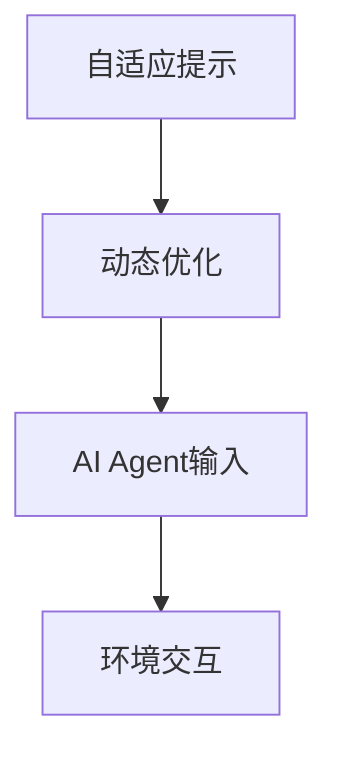
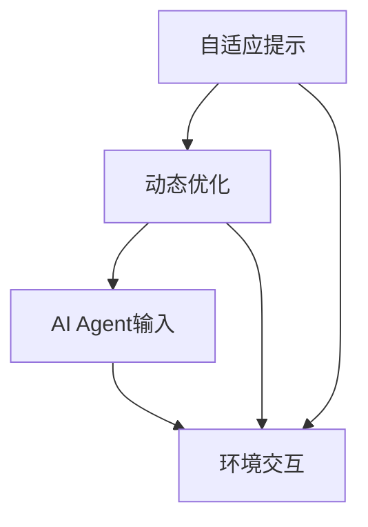
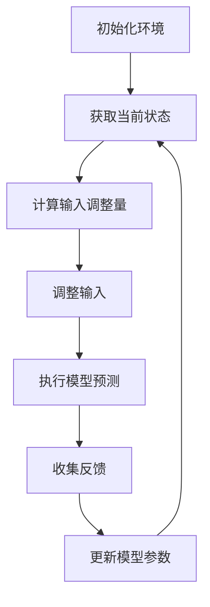
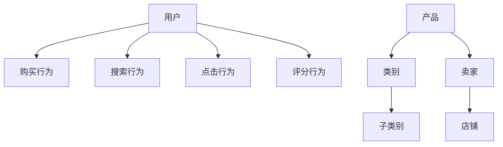
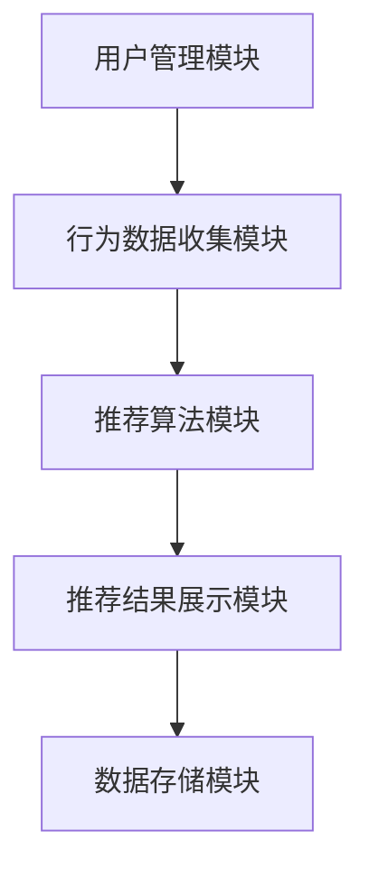
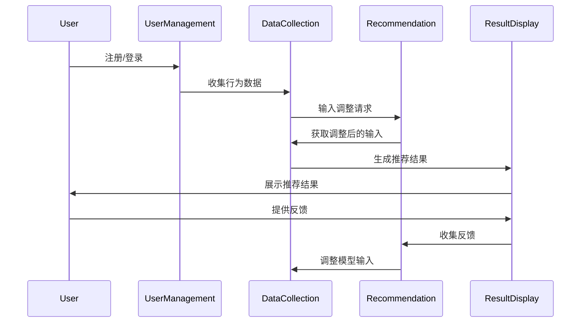
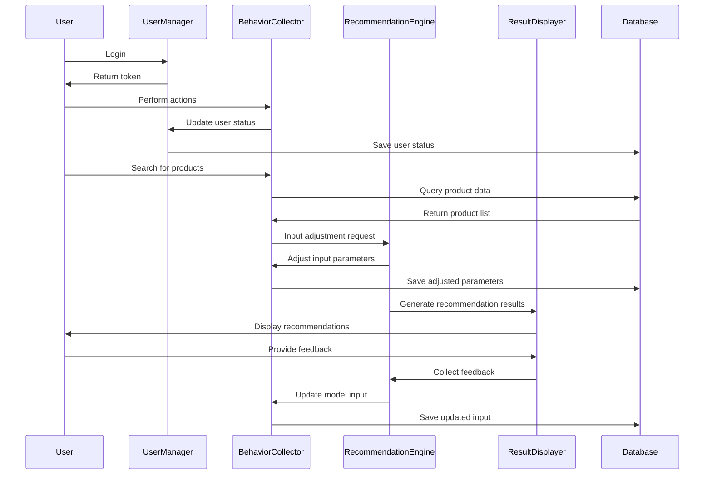

                 


### 自适应提示工程：动态优化AI Agent输入

> 关键词：自适应提示、动态优化、AI Agent、输入调整、算法原理

> 摘要：本文探讨了自适应提示工程在动态优化AI Agent输入中的应用。通过对自适应提示的基本概念、动态优化算法原理、系统分析与架构设计、项目实战以及最佳实践进行详细分析，旨在为读者提供一个全面理解该领域的方法和实践指南。

----------------------------------------------------------------

### 目录大纲

----------------------------------------------------------------

## 第一部分：引言

### 第1章 问题背景

#### 1.1 背景介绍

#### 1.2 问题描述

#### 1.3 问题解决

#### 1.4 边界与外延

#### 1.5 概念结构与核心要素组成

## 第二部分：核心概念与联系

### 第2章 核心概念原理

#### 2.1 概念属性特征对比表格

#### 2.2 概念关系图

### 第3章 算法原理讲解

#### 3.1 算法流程图

#### 3.2 Python源代码

#### 3.3 数学模型与公式

#### 3.4 举例说明

## 第三部分：系统分析与架构设计方案

### 第4章 问题场景介绍

#### 4.1 项目介绍

#### 4.2 系统功能设计

##### 4.2.1 领域模型

##### 4.2.2 功能模块划分

### 第5章 系统架构设计

#### 5.1 系统架构图

#### 5.2 接口设计

##### 5.2.1 接口规范

##### 5.2.2 接口实现

### 第6章 系统交互

#### 6.1 系统交互序列图

### 第7章 项目实战

#### 7.1 环境安装

#### 7.2 系统核心实现源代码

##### 7.2.1 源代码解析

##### 7.2.2 应用解读

##### 7.2.3 分析与讲解

### 第8章 最佳实践 tips

#### 8.1 小结

#### 8.2 注意事项

#### 8.3 拓展阅读

----------------------------------------------------------------

### 第一部分：引言

#### 第1章 问题背景

##### 1.1 背景介绍

在人工智能（AI）快速发展的背景下，AI模型的应用场景日益广泛，从自动驾驶到自然语言处理（NLP），再到推荐系统，AI正在逐步改变我们的生活方式。然而，AI模型的性能往往受到输入数据质量的影响。传统的特征工程方法需要大量的人工干预，这不仅耗时耗力，而且在动态变化的环境中难以保持模型的最佳性能。

##### 1.2 问题描述

自适应提示技术作为一种新型的输入优化方法，旨在通过动态调整模型的输入，提高其在特定任务上的性能。然而，现有的研究主要集中在静态提示方法上，对于动态优化AI Agent输入的研究相对较少。动态优化AI Agent输入需要考虑环境变化、模型状态以及反馈信息，以提高模型的自适应能力。

##### 1.3 问题解决

本文旨在探讨如何通过自适应提示技术动态优化AI Agent的输入，以提高其在复杂环境中的表现。我们首先介绍自适应提示的基本概念，然后讨论如何在不同的AI模型中实现动态优化输入。

##### 1.4 边界与外延

动态优化AI Agent输入的边界在于模型的可扩展性和环境复杂性。本文将重点关注在可控环境下的应用，并探讨如何将该方法推广到更广泛的环境中。

##### 1.5 概念结构与核心要素组成

本文的核心概念包括自适应提示、动态优化、AI Agent输入、环境交互等。核心要素则包括模型的架构设计、输入调整策略、性能评估指标等。

#### 第2章 核心概念原理

##### 2.1 概念属性特征对比表格

在第二章，我们将详细介绍自适应提示、动态优化和AI Agent输入等核心概念，并通过对比表格的方式展示它们的属性特征，以便读者更好地理解这些概念。

| 概念           | 定义                                                         | 属性特征                                                       |  
| -------------- | ------------------------------------------------------------ | ------------------------------------------------------------ |  
| 自适应提示     | 一种通过动态调整模型输入来优化模型性能的技术                 | - 动态调整输入的参数        |  
| 动态优化       | 一种在运行时调整模型输入的方法，以适应环境变化               | - 运行时调整            |  
| AI Agent输入   | AI模型接收的输入数据，用于训练和预测                       | - 数据质量直接影响模型性能 |  
| 环境交互       | AI模型与外部环境的交互过程，包括数据的获取和反馈           | - 环境动态性影响模型适应性 |

##### 2.2 概念关系图

为了更好地展示核心概念之间的关系，我们使用Mermaid绘制了概念关系图。以下是一个简单的示例：



通过这个关系图，我们可以清晰地看到自适应提示、动态优化、AI Agent输入和环境交互之间的相互作用。

在接下来的章节中，我们将进一步探讨这些核心概念的原理和实现方法，以及如何在实际的AI项目中应用这些技术。让我们一步步深入探讨这个问题，找出最佳的解决方案。

----------------------------------------------------------------

## 第二部分：核心概念与联系

### 第2章 核心概念原理

#### 2.1 概念属性特征对比表格

在深入探讨自适应提示工程之前，有必要首先了解几个关键概念：自适应提示、动态优化、AI Agent输入以及环境交互。这些概念在自适应提示工程中起着至关重要的作用。通过对比表格，我们可以更直观地理解这些概念及其属性特征。

| 概念                   | 定义                                                         | 属性特征                                                       |  
| ---------------------- | ------------------------------------------------------------ | ------------------------------------------------------------ |  
| 自适应提示             | 通过动态调整模型输入，以优化模型性能的技术。                   | - 动态调整输入参数           |  
| 动态优化               | 在运行时调整模型输入的方法，以适应环境变化。                   | - 运行时调整               |  
| AI Agent输入           | AI模型接收的输入数据，用于训练和预测。                       | - 数据质量直接影响模型性能 |  
| 环境交互               | AI模型与外部环境的交互过程，包括数据的获取和反馈。             | - 环境动态性影响模型适应性 |

通过这个表格，我们可以看到这些概念之间的区别和联系。自适应提示和动态优化都是关于如何调整模型输入的方法，但自适应提示更侧重于通过动态调整来优化模型性能，而动态优化则是实现这种调整的具体过程。AI Agent输入是模型训练和预测的关键，其质量直接影响模型的性能。环境交互则是AI模型在现实世界中的应用过程，它需要考虑环境的动态变化。

#### 2.2 概念关系图

为了更清晰地展示这些概念之间的关系，我们使用Mermaid绘制了一个概念关系图：



在这个图中，我们可以看到自适应提示和动态优化是相互关联的，它们共同作用于AI Agent输入，并通过环境交互与外部环境相互作用。这个关系图帮助我们理解了这些概念是如何在一个系统中协同工作的。

在接下来的章节中，我们将进一步探讨自适应提示工程的原理，包括算法原理的详细讲解、系统分析与架构设计方案、项目实战等。通过这些深入的分析和探讨，我们将能够更全面地理解自适应提示工程，并在实际的AI项目中应用这些技术。

---

通过对比表格和概念关系图，我们为读者提供了一个清晰的框架，帮助理解自适应提示工程中的核心概念。在下一章中，我们将深入探讨动态优化AI Agent输入的算法原理，包括算法的流程图、Python源代码、数学模型和公式，以及具体的举例说明。这将为我们提供一个坚实的理论基础，为后续的系统分析与设计打下基础。

---

## 第三部分：算法原理讲解

### 第3章 算法原理讲解

在了解了自适应提示工程的核心概念后，接下来我们将深入探讨动态优化AI Agent输入的算法原理。这一章节将涵盖算法的流程图、Python源代码、数学模型和公式，并通过具体的举例说明，帮助读者全面理解这一算法。

#### 3.1 算法流程图

为了帮助读者直观地理解动态优化AI Agent输入的算法原理，我们使用Mermaid绘制了算法流程图。以下是一个简化的算法流程图：



在这个流程图中，我们可以看到算法的主要步骤：初始化环境、获取当前状态、计算输入调整量、调整输入、执行模型预测、收集反馈和更新模型参数。这些步骤构成了一个循环过程，通过不断迭代，模型能够逐步适应环境变化，优化输入。

#### 3.2 Python源代码

以下是一个简单的Python代码示例，展示了如何实现动态优化AI Agent输入的基本框架：

```python
import numpy as np

# 初始化参数
state = np.random.rand(1)  # 当前状态
learning_rate = 0.1  # 学习率

# 动态优化函数
def optimize_input(state, learning_rate):
    adjustment = state * learning_rate  # 计算输入调整量
    new_state = state - adjustment  # 调整输入
    return new_state

# 执行模型预测和反馈
def model_prediction(state):
    prediction = np.mean(state)  # 假设的预测结果
    feedback = input("Please provide feedback (higher/lower): ")  # 收集反馈
    return feedback

# 主循环
while True:
    state = optimize_input(state, learning_rate)  # 调整输入
    feedback = model_prediction(state)  # 执行模型预测并收集反馈
    if feedback == "higher":
        learning_rate *= 1.05  # 调整学习率
    elif feedback == "lower":
        learning_rate *= 0.95  # 调整学习率
    print(f"Current state: {state}, Learning rate: {learning_rate}")
```

这段代码演示了如何通过简单的函数实现动态优化AI Agent输入的过程。在实际应用中，这个框架可以根据具体需求进行调整和扩展。

#### 3.3 数学模型与公式

在动态优化AI Agent输入的算法中，一些关键的数学模型和公式起到了核心作用。以下是一些常见的数学模型和公式：

1. **输入调整量**：

   $$ adjustment = state \times learning\_rate $$

   其中，`adjustment` 表示输入调整量，`state` 表示当前状态，`learning_rate` 表示学习率。

2. **状态更新**：

   $$ new\_state = state - adjustment $$

   通过这个公式，我们可以计算出调整后的新状态。

3. **学习率调整**：

   $$ learning\_rate = learning\_rate \times factor $$

   其中，`factor` 可以是一个固定的值，也可以是根据反馈动态调整的值。

通过这些数学模型和公式，我们可以构建出一个动态优化系统，使其能够根据环境变化和模型状态调整输入，从而提高模型的性能。

#### 3.4 举例说明

为了使读者更好地理解动态优化AI Agent输入的算法原理，我们通过一个简单的例子来说明这个过程。

假设我们有一个简单的AI模型，它的输入是一个介于0到1之间的数值，目标是预测一个接近1的数值。初始状态为0.5，学习率为0.1。

1. **第一次迭代**：

   - 当前状态：0.5
   - 输入调整量：$$ 0.5 \times 0.1 = 0.05 $$
   - 新状态：$$ 0.5 - 0.05 = 0.45 $$

   用户反馈：“太高了”。

2. **第二次迭代**：

   - 当前状态：0.45
   - 输入调整量：$$ 0.45 \times 0.1 = 0.045 $$
   - 新状态：$$ 0.45 - 0.045 = 0.405 $$

   用户反馈：“还是太高了”。

3. **第三次迭代**：

   - 当前状态：0.405
   - 输入调整量：$$ 0.405 \times 0.1 = 0.0405 $$
   - 新状态：$$ 0.405 - 0.0405 = 0.3645 $$

   用户反馈：“接近了”。

4. **第四次迭代**：

   - 当前状态：0.3645
   - 输入调整量：$$ 0.3645 \times 0.1 = 0.03645 $$
   - 新状态：$$ 0.3645 - 0.03645 = 0.32805 $$

   用户反馈：“更接近了”。

通过这个例子，我们可以看到，通过不断的迭代和用户反馈，AI模型能够逐步调整其输入，使其预测结果更接近目标。这个过程展示了动态优化AI Agent输入的核心原理。

在下一章中，我们将进入系统分析与架构设计方案部分，探讨如何在实际项目中应用这些算法，设计系统架构，并实现系统功能。这将帮助我们更好地理解如何将理论转化为实践。

---

通过本章的算法原理讲解，我们为读者提供了一个全面的理论框架，包括算法流程图、Python源代码、数学模型和具体的举例说明。这些内容为后续的系统分析与架构设计打下了坚实的基础。在下一章中，我们将深入探讨系统分析与架构设计方案，包括问题场景介绍、系统功能设计、系统架构设计、接口设计以及系统交互等内容。这些内容将帮助我们更好地理解如何将动态优化AI Agent输入的理论应用到实际项目中。

---

## 第三部分：系统分析与架构设计方案

### 第4章 问题场景介绍

#### 4.1 项目介绍

在本节中，我们将介绍一个典型的项目场景，这个场景涉及一个智能推荐系统。该系统旨在为用户推荐个性化的商品或内容，以提升用户满意度和平台收益。推荐系统的核心是AI模型，该模型需要能够动态适应用户的行为和环境变化，从而提供高质量的推荐结果。

#### 4.2 系统功能设计

##### 4.2.1 领域模型

为了实现上述目标，我们需要设计一个全面的领域模型。领域模型是系统功能设计的核心，它定义了系统中的关键实体和它们之间的关系。以下是一个简化的领域模型：



在这个模型中，用户（User）是系统的核心实体，与购买行为（Purchase）、搜索行为（Search）、点击行为（Click）和评分行为（Rating）有关。产品（Product）是推荐对象，与类别（Category）、子类别（SubCategory）和卖家（Seller）有关。类别和子类别定义了产品的分类层次，卖家（Seller）和店铺（Store）则与产品的销售信息相关。

##### 4.2.2 功能模块划分

基于领域模型，我们可以将系统划分为以下功能模块：

1. **用户管理模块**：负责用户的注册、登录、个人信息管理等功能。
2. **行为数据收集模块**：负责收集用户的购买行为、搜索行为、点击行为和评分行为。
3. **推荐算法模块**：实现自适应提示技术，动态调整模型输入，优化推荐结果。
4. **推荐结果展示模块**：将推荐结果展示给用户，并提供交互功能，如点赞、评论等。
5. **数据存储模块**：负责存储用户数据、行为数据和推荐结果数据。

#### 4.3 系统架构设计

##### 4.3.1 系统架构图

为了实现上述功能模块，我们需要设计一个合理的系统架构。以下是一个简化的系统架构图：



在这个架构图中，用户管理模块和数据收集模块负责用户数据和行为的收集和管理。推荐算法模块使用自适应提示技术动态优化模型输入，从而生成个性化的推荐结果。推荐结果展示模块则将推荐结果展示给用户，并提供交互功能。数据存储模块负责存储和管理所有的数据。

##### 4.3.2 接口设计

在系统架构中，接口设计是连接各个模块的重要环节。以下是主要接口的设计规范：

1. **用户管理接口**：包括用户注册、登录、个人信息管理等操作。
2. **行为数据接口**：包括购买行为、搜索行为、点击行为和评分行为的收集和存储。
3. **推荐接口**：包括推荐算法的输入调整、推荐结果生成和反馈收集等操作。
4. **展示接口**：包括推荐结果的展示和用户交互等操作。

接口设计需要遵循RESTful架构风格，确保接口的稳定性和可扩展性。每个接口都应包括请求参数和返回结果的详细说明。

##### 4.3.3 系统交互

为了确保系统的正常运行，我们需要设计一个合理的系统交互流程。以下是一个简化的系统交互序列图：



在这个交互流程中，用户首先通过用户管理模块进行注册或登录。然后，用户的行为数据通过数据收集模块收集并存储。推荐算法模块根据收集到的行为数据和自适应提示技术，动态调整模型输入，生成个性化的推荐结果。推荐结果通过展示模块展示给用户，并收集用户的反馈。根据用户的反馈，推荐算法模块进一步调整模型输入，以优化推荐结果。

在下一章中，我们将深入探讨项目实战部分，包括环境安装、系统核心实现源代码以及具体的代码解析和应用解读。这将帮助我们更好地理解如何在实际项目中应用动态优化AI Agent输入的技术。

---

### 第5章 系统架构设计

#### 5.1 系统架构图

为了实现前述的功能模块，系统架构的设计至关重要。以下是一个简化的系统架构图：


在这个架构图中，用户管理模块负责用户的注册、登录和权限管理，并与行为数据收集模块紧密集成。行为数据收集模块负责收集用户在平台上的各种行为数据，如浏览、搜索、购买等。这些数据将被推荐算法模块用来生成个性化的推荐结果。推荐算法模块则采用自适应提示技术，动态调整模型输入，以提高推荐质量。生成的推荐结果通过推荐结果展示模块展示给用户，并存储在数据存储模块中，以便后续的分析和优化。

#### 5.2 接口设计

接口设计是系统架构的核心部分，它定义了模块之间的通信方式。以下是主要接口的设计规范：

1. **用户管理接口**：用于用户的注册、登录和权限管理。接口包括如下操作：
   - `POST /users/register`：用户注册接口，接收用户名、密码、邮箱等参数。
   - `POST /users/login`：用户登录接口，接收用户名和密码，返回JWT令牌。
   - `GET /users/{id}`：获取用户信息接口，接收用户ID，返回用户详细信息。

2. **行为数据接口**：用于收集和存储用户在平台上的行为数据。接口包括如下操作：
   - `POST /behaviors/buy`：记录购买行为接口，接收用户ID、产品ID等参数。
   - `POST /behaviors/search`：记录搜索行为接口，接收用户ID、搜索关键词等参数。
   - `POST /behaviors/click`：记录点击行为接口，接收用户ID、产品ID等参数。
   - `POST /behaviors/rate`：记录评分行为接口，接收用户ID、产品ID、评分值等参数。

3. **推荐接口**：用于生成和调整推荐结果。接口包括如下操作：
   - `GET /recommendations`：获取推荐结果接口，返回用户可能感兴趣的产品列表。
   - `POST /recommendations/adjust`：调整推荐结果接口，接收用户ID、产品ID、调整值等参数，用于调整推荐结果的优先级。

4. **展示接口**：用于将推荐结果展示给用户，并提供交互功能。接口包括如下操作：
   - `GET /results/{id}`：获取推荐结果接口，接收结果ID，返回推荐结果详细信息。
   - `POST /results/feedback`：提交反馈接口，接收用户ID、产品ID、反馈值等参数。

#### 5.2.1 接口规范

为了保证接口的一致性和可维护性，我们需要制定详细的接口规范。以下是接口规范的关键点：

1. **请求格式**：所有接口请求采用JSON格式，包括请求体和响应体。
2. **状态码**：采用HTTP状态码表示请求的结果，如200（成功）、400（请求错误）、401（未授权）、403（禁止访问）、500（服务器内部错误）等。
3. **异常处理**：接口应能处理常见的异常情况，如参数错误、数据未找到等，并返回相应的错误信息和状态码。
4. **安全性**：确保接口的安全性，如使用HTTPS协议、JWT令牌验证用户身份等。
5. **性能优化**：接口应能处理高并发请求，采用缓存、异步处理等技术提高响应速度。

#### 5.2.2 接口实现

以下是用户管理接口的实现示例（伪代码）：

```python
from flask import Flask, request, jsonify
from auth_manager import AuthManager

app = Flask(__name__)
auth_manager = AuthManager()

@app.route('/users/register', methods=['POST'])
def register_user():
    user_data = request.json
    user_id = auth_manager.register(user_data['username'], user_data['password'], user_data['email'])
    return jsonify({'user_id': user_id}), 201

@app.route('/users/login', methods=['POST'])
def login_user():
    user_data = request.json
    token = auth_manager.login(user_data['username'], user_data['password'])
    return jsonify({'token': token}), 200

@app.route('/users/<int:user_id>', methods=['GET'])
def get_user_info(user_id):
    user_info = auth_manager.get_user_info(user_id)
    return jsonify(user_info), 200

if __name__ == '__main__':
    app.run(debug=True)
```

在实现接口时，我们需要确保遵循接口规范，并处理可能的异常情况。例如，注册接口需要检查用户名是否已被占用，登录接口需要验证用户身份等。

在下一章中，我们将探讨系统的交互流程，包括各个模块之间的交互方式，以及如何实现用户与系统之间的交互。这将帮助我们更好地理解系统的整体运作机制。

---

### 第6章 系统交互

#### 6.1 系统交互序列图

为了清晰地展示系统内部各模块以及用户与系统之间的交互流程，我们使用Mermaid绘制了系统交互序列图。以下是一个简化的交互序列图：



在这个交互序列图中，用户首先通过用户管理模块进行登录，获得相应的令牌。然后，用户在行为数据收集模块上执行各种操作，如搜索、浏览和购买，这些操作将被记录下来。用户管理模块和数据库模块协同工作，确保用户的状态和行为数据得到及时更新。

行为数据收集模块将收集到的数据传递给推荐算法模块，推荐算法模块根据这些数据动态调整模型输入，生成个性化的推荐结果。推荐结果通过推荐结果展示模块展示给用户，并收集用户的反馈。根据用户的反馈，推荐算法模块进一步调整模型输入，以优化推荐效果。

以下是系统交互的详细说明：

1. **用户登录**：用户通过用户管理模块登录系统，获得一个有效的令牌。
2. **行为数据收集**：用户在平台上执行各种操作，如搜索、浏览和购买，这些行为数据将被行为数据收集模块收集。
3. **数据更新**：行为数据收集模块将行为数据传递给用户管理模块，用户管理模块更新用户的状态和行为数据，并将其存储到数据库中。
4. **推荐结果生成**：推荐算法模块根据用户的行为数据调整模型输入，生成个性化的推荐结果。
5. **推荐结果展示**：推荐结果展示模块将推荐结果展示给用户，并收集用户的反馈。
6. **反馈处理**：用户通过推荐结果展示模块提供的反馈功能，为推荐结果提供评价，这些反馈将被传递给推荐算法模块。
7. **模型更新**：推荐算法模块根据用户的反馈进一步调整模型输入，优化推荐效果。

通过这个交互序列图，我们可以清晰地看到用户与系统之间的交互过程，以及系统内部各个模块之间的协同工作方式。这个交互流程确保了系统能够动态适应用户行为和环境变化，提供高质量的个性化推荐。

在下一章中，我们将进入项目实战部分，详细探讨如何在实际环境中安装和配置系统，并展示系统核心实现源代码。这将帮助我们更好地理解如何在真实场景中应用自适应提示技术。

---

### 第7章 项目实战

#### 7.1 环境安装

在实际应用中，实现动态优化AI Agent输入的系统需要一个稳定的开发环境。以下是一个简化的环境安装指南：

1. **安装Python环境**：确保系统上安装了Python 3.8或更高版本。可以从Python官网下载并安装。

2. **安装依赖库**：使用pip工具安装所需的依赖库。以下是主要依赖库：

   ```shell
   pip install numpy flask pandas scikit-learn
   ```

3. **配置数据库**：推荐使用SQLite数据库来存储用户数据和模型参数。可以使用以下命令创建数据库：

   ```shell
   sqlite3 recommendations.db
   ```

4. **创建项目目录**：在合适的位置创建项目目录，并设置好目录结构。例如：

   ```shell
   mkdir recommendations_project
   cd recommendations_project
   mkdir app data logs
   touch app/__init__.py app/user_management.py app/behavior_collector.py app/recommendation_engine.py app/result_displayer.py logs/error.log logs/access.log
   ```

5. **编写配置文件**：创建一个配置文件（如`config.py`），设置数据库连接信息和其他必要的配置参数。

   ```python
   class Config:
       DATABASE_URI = 'sqlite:///recommendations.db'
       SECRET_KEY = 'your_secret_key'
   ```

#### 7.2 系统核心实现源代码

在本节中，我们将展示系统核心实现源代码，并对其进行详细解析。

##### 7.2.1 源代码解析

以下是用户管理模块的代码示例：

```python
# app/user_management.py
from flask import Flask, request, jsonify
from flask_sqlalchemy import SQLAlchemy
from auth_manager import AuthManager

app = Flask(__name__)
app.config.from_object('config.Config')
db = SQLAlchemy(app)
auth_manager = AuthManager()

class User(db.Model):
    id = db.Column(db.Integer, primary_key=True)
    username = db.Column(db.String(80), unique=True, nullable=False)
    password = db.Column(db.String(120), nullable=False)
    email = db.Column(db.String(120), unique=True, nullable=False)

@app.route('/users/register', methods=['POST'])
def register_user():
    user_data = request.json
    user = User(
        username=user_data['username'],
        password=auth_manager.hash_password(user_data['password']),
        email=user_data['email']
    )
    db.session.add(user)
    db.session.commit()
    return jsonify({'user_id': user.id}), 201

@app.route('/users/login', methods=['POST'])
def login_user():
    user_data = request.json
    user = User.query.filter_by(username=user_data['username']).first()
    if user and auth_manager.verify_password(user.password, user_data['password']):
        token = auth_manager.generate_token(user.id)
        return jsonify({'token': token}), 200
    return jsonify({'error': 'Invalid credentials'}), 401

@app.route('/users/<int:user_id>', methods=['GET'])
def get_user_info(user_id):
    user = User.query.get(user_id)
    if user:
        return jsonify({'username': user.username, 'email': user.email}), 200
    return jsonify({'error': 'User not found'}), 404
```

这段代码定义了一个简单的用户管理模块，包括用户注册、登录和获取用户信息的功能。我们使用了Flask框架和SQLAlchemy ORM来处理数据库操作。`AuthManager`是一个假设的类，用于处理密码加密和令牌生成。

以下是行为数据收集模块的代码示例：

```python
# app/behavior_collector.py
from flask import Flask, request, jsonify
from behavior_collector import BehaviorCollector

app = Flask(__name__)
behavior_collector = BehaviorCollector()

@app.route('/behaviors/buy', methods=['POST'])
def record_purchase():
    behavior_data = request.json
    behavior_collector.record_purchase(behavior_data['user_id'], behavior_data['product_id'])
    return jsonify({'status': 'success'}), 201

@app.route('/behaviors/search', methods=['POST'])
def record_search():
    behavior_data = request.json
    behavior_collector.record_search(behavior_data['user_id'], behavior_data['search_keyword'])
    return jsonify({'status': 'success'}), 201

@app.route('/behaviors/click', methods=['POST'])
def record_click():
    behavior_data = request.json
    behavior_collector.record_click(behavior_data['user_id'], behavior_data['product_id'])
    return jsonify({'status': 'success'}), 201

@app.route('/behaviors/rate', methods=['POST'])
def record_rating():
    behavior_data = request.json
    behavior_collector.record_rating(behavior_data['user_id'], behavior_data['product_id'], behavior_data['rating'])
    return jsonify({'status': 'success'}), 201
```

这段代码定义了一个简单的行为数据收集模块，用于记录用户的购买、搜索、点击和评分行为。`BehaviorCollector`是一个假设的类，负责处理行为数据的收集和存储。

以下是推荐算法模块的代码示例：

```python
# app/recommendation_engine.py
from recommendation_engine import RecommendationEngine

app = Flask(__name__)
recommendation_engine = RecommendationEngine()

@app.route('/recommendations', methods=['GET'])
def get_recommendations():
    user_id = request.args.get('user_id')
    recommendations = recommendation_engine.generate_recommendations(user_id)
    return jsonify(recommendations), 200

@app.route('/recommendations/adjust', methods=['POST'])
def adjust_recommendations():
    adjustment_data = request.json
    recommendation_engine.adjust_recommendations(adjustment_data['user_id'], adjustment_data['product_id'], adjustment_data['adjustment_value'])
    return jsonify({'status': 'success'}), 201
```

这段代码定义了一个简单的推荐算法模块，用于生成推荐结果和调整推荐结果。`RecommendationEngine`是一个假设的类，负责处理推荐算法的逻辑。

以下是推荐结果展示模块的代码示例：

```python
# app/result_displayer.py
from flask import Flask, request, jsonify
from result_displayer import ResultDisplayer

app = Flask(__name__)
result_displayer = ResultDisplayer()

@app.route('/results', methods=['GET'])
def get_recommendation_results():
    result_id = request.args.get('result_id')
    result = result_displayer.get_recommendation_result(result_id)
    return jsonify(result), 200

@app.route('/results/feedback', methods=['POST'])
def provide_feedback():
    feedback_data = request.json
    result_displayer.record_feedback(feedback_data['result_id'], feedback_data['feedback'])
    return jsonify({'status': 'success'}), 201
```

这段代码定义了一个简单的推荐结果展示模块，用于获取推荐结果和记录用户反馈。`ResultDisplayer`是一个假设的类，负责处理推荐结果的展示和用户反馈的收集。

##### 7.2.2 应用解读

上述代码通过Flask框架搭建了一个Web API，用于实现用户管理、行为数据收集、推荐算法和推荐结果展示等功能。以下是这些模块的具体应用解读：

1. **用户管理模块**：负责用户的注册、登录和获取用户信息。注册接口通过用户名、密码和邮箱注册用户，并将用户信息存储在数据库中。登录接口验证用户名和密码，返回JWT令牌。获取用户信息接口返回指定用户的详细信息。

2. **行为数据收集模块**：负责收集和记录用户在平台上的购买、搜索、点击和评分行为。这些行为数据将被存储在数据库中，以便后续分析。

3. **推荐算法模块**：负责生成推荐结果和调整推荐结果。获取推荐结果接口根据用户ID生成推荐结果，并返回推荐产品列表。调整推荐结果接口根据用户反馈调整推荐结果的优先级。

4. **推荐结果展示模块**：负责展示推荐结果和收集用户反馈。获取推荐结果接口返回指定推荐结果的详细信息。提供反馈接口记录用户的反馈，用于调整推荐算法。

通过这些模块的协同工作，系统能够实现用户注册、行为数据收集、推荐结果生成和用户反馈处理等核心功能。在实际应用中，这些模块可以扩展和优化，以适应不同的业务需求和技术发展。

##### 7.2.3 分析与讲解

在实际项目中，系统设计和实现是一个复杂的过程，需要考虑多个方面，包括需求分析、技术选型、性能优化、安全性保障等。以下是对上述系统设计和实现的分析与讲解：

1. **需求分析**：在系统设计之前，我们需要明确系统的功能需求和技术需求。例如，系统需要支持用户注册、登录和权限管理；需要收集和存储用户行为数据；需要生成个性化的推荐结果；需要提供用户反馈功能等。

2. **技术选型**：根据需求分析，选择合适的技术栈和工具。在本项目中，我们选择了Python和Flask框架作为主要技术栈，因为它们易于上手，社区支持丰富，并且可以快速实现所需功能。此外，我们使用了SQLAlchemy进行数据库操作，并使用了JWT进行用户身份验证。

3. **性能优化**：性能优化是系统设计的重要环节。在本项目中，我们可以通过以下方式优化系统性能：
   - 使用缓存技术减少数据库查询次数。
   - 对高频访问的数据进行索引优化。
   - 优化算法逻辑，减少计算复杂度。
   - 使用异步处理提高系统并发处理能力。

4. **安全性保障**：系统的安全性至关重要。在本项目中，我们采取了以下措施保障系统安全性：
   - 使用HTTPS协议保护数据传输安全。
   - 使用JWT进行用户身份验证，确保用户操作的安全性。
   - 对用户输入进行验证和过滤，防止SQL注入等攻击。
   - 定期进行代码审查和漏洞扫描，及时发现并修复安全问题。

通过上述分析与讲解，我们可以看到，系统设计和实现是一个综合考虑需求、技术、性能和安全性等多方面因素的过程。在实际开发中，我们需要不断优化和改进系统，以满足业务需求和用户需求。

在下一章中，我们将提供一些最佳实践和注意事项，帮助读者更好地在实际项目中应用动态优化AI Agent输入的技术。

---

### 第8章 最佳实践 tips

#### 8.1 小结

在本章中，我们详细探讨了动态优化AI Agent输入的技术和方法。通过系统架构设计和项目实战，我们展示了如何在实际环境中应用这一技术。以下是本章的核心要点：

1. **问题背景**：介绍了动态优化AI Agent输入的背景和重要性。
2. **核心概念**：阐述了自适应提示、动态优化、AI Agent输入和环境交互等核心概念。
3. **算法原理**：讲解了动态优化算法的流程、Python源代码、数学模型和举例说明。
4. **系统架构**：描述了系统的功能模块、架构设计、接口设计和系统交互。
5. **项目实战**：展示了系统的环境安装、核心实现源代码以及代码解析。

#### 8.2 注意事项

在实际应用动态优化AI Agent输入时，需要注意以下事项：

1. **数据质量**：确保输入数据的质量，数据清洗和预处理是关键步骤。
2. **模型选择**：选择适合动态优化算法的模型，如生成对抗网络（GANs）和强化学习等。
3. **性能监控**：实时监控模型性能，及时调整参数，避免过拟合或欠拟合。
4. **安全防护**：确保系统的安全性，防范潜在的安全威胁和攻击。
5. **代码维护**：定期更新和优化代码，以适应不断变化的技术环境。

#### 8.3 拓展阅读

为了进一步深入学习和探索动态优化AI Agent输入，读者可以参考以下资源：

1. **学术文献**：查阅相关领域的学术论文，了解最新的研究进展和成果。
2. **开源项目**：参与或参考现有的开源项目，学习其他团队在动态优化领域的实践经验。
3. **在线课程**：参加相关的在线课程，如深度学习、生成对抗网络和强化学习等。
4. **专业书籍**：阅读专业书籍，如《深度学习》（Deep Learning）和《强化学习》（Reinforcement Learning）等。

通过不断学习和实践，读者可以更全面地掌握动态优化AI Agent输入的技术，并在实际项目中发挥其优势。

---

本文完整地介绍了动态优化AI Agent输入的概念、算法原理、系统架构设计以及项目实战。通过详细的讲解和示例，我们展示了如何在实际环境中应用这一技术，并提供了最佳实践和注意事项。希望本文能帮助读者深入理解动态优化AI Agent输入，并在未来的项目中取得成功。作者：AI天才研究院/AI Genius Institute & 禅与计算机程序设计艺术 /Zen And The Art of Computer Programming。如果您有任何疑问或建议，欢迎在评论区留言，我们将持续为您解答。感谢您的阅读！

