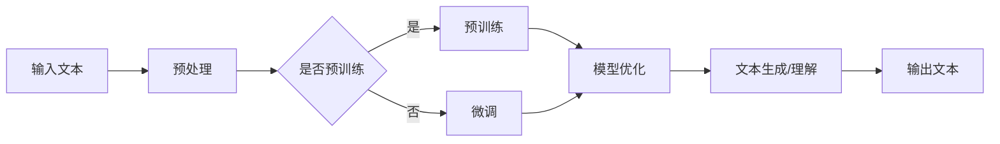
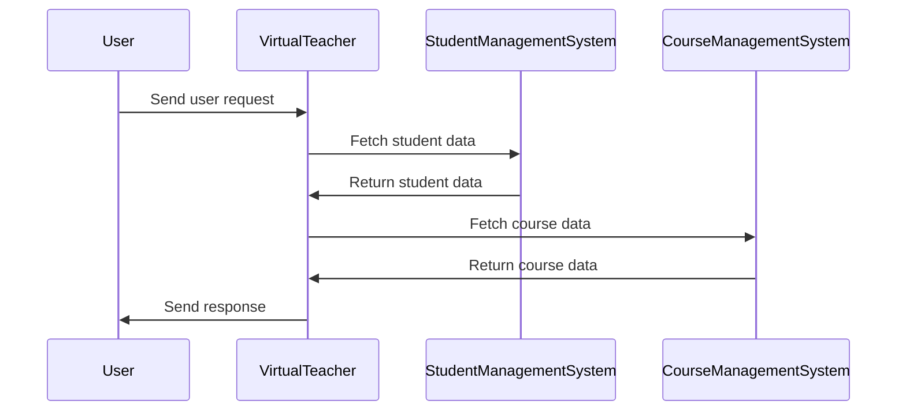

                 

### 让我们一步一步思考：虚拟教师 AI Agent：LLM 驱动的个性化教育系统

#### 引言

在数字化时代，人工智能（AI）技术的迅猛发展为教育行业带来了前所未有的变革机遇。虚拟教师 AI Agent，作为人工智能在教育领域的重要应用，正逐渐成为个性化教育的重要推动力量。本文将围绕“虚拟教师 AI Agent：LLM 驱动的个性化教育系统”这一主题，逐步深入探讨其核心概念、原理、架构以及实际应用。

首先，我们将从背景介绍入手，明确虚拟教师和 AI Agent 的定义及其在教育系统中的重要性。接着，我们深入分析 LLM（大型语言模型）的基本原理和在个性化教育系统中的具体应用。随后，我们将详细阐述算法原理、数学模型以及具体实现过程。在此基础上，我们还将探讨系统分析与架构设计、项目实战以及最佳实践，从而全面了解虚拟教师 AI Agent 的构建和应用。

#### 背景介绍

##### 虚拟教师与AI Agent的定义

虚拟教师：虚拟教师是指利用人工智能技术，模拟人类教师的教学过程，为学生提供个性化教学服务的系统。虚拟教师能够根据学生的学习特点和需求，动态调整教学策略，提供个性化的教学资源和学习路径。

AI Agent：AI Agent是一种具备自主决策、学习、适应和互动能力的智能体。它可以在特定环境下执行任务，并根据环境的变化和自身的经验进行自我优化。AI Agent在虚拟教师系统中，充当了教学过程中的智能助手，能够为学生提供智能化的学习支持和反馈。

##### 问题背景与核心概念

随着教育信息化和个性化学习的需求日益增长，传统的教育模式已无法满足现代教育的需求。虚拟教师 AI Agent 的出现，为解决这一问题提供了新的思路。其核心在于通过 LLM（大型语言模型）实现对学生个性化学习需求的精准把握，从而提供更加智能化和个性化的教育服务。

##### 问题解决与边界

虚拟教师 AI Agent 的核心在于将 AI 技术与教育系统深度融合，实现个性化教育。然而，这一过程中也存在一定的挑战，如数据隐私、安全性、算法透明性等问题。因此，在构建虚拟教师 AI Agent 时，需要充分考虑这些边界条件，确保系统的稳定性和可靠性。

##### 概念结构与核心要素

虚拟教师 AI Agent 的概念结构主要包括以下核心要素：

1. **数据收集与处理**：通过收集学生的学习数据，如学习进度、成绩、兴趣爱好等，为个性化教育提供基础。
2. **语言理解与生成**：利用 LLM 技术，实现对学生语言表达的理解和生成，提供智能化的教学反馈和指导。
3. **教学策略调整**：根据学生的学习反馈和需求，动态调整教学策略，提供个性化的学习路径和资源。
4. **反馈与评估**：通过实时收集学生的学习情况和反馈，对虚拟教师 AI Agent 的教学效果进行评估和优化。

#### 核心概念与联系

##### 核心概念原理

1. **虚拟教师**：虚拟教师的核心在于模拟人类教师的教学过程，实现个性化教学。其原理主要包括教学内容的生成、教学策略的调整、学习反馈的收集与处理等。

2. **AI Agent**：AI Agent 的核心在于其自主决策和学习能力。其原理包括环境感知、目标规划、行为决策、学习与优化等。

3. **LLM**：LLM 是一种大型语言模型，其核心在于对人类语言的理解和生成。其原理包括神经网络结构、预训练与微调、文本生成与理解等。

##### 概念属性特征对比表格

为了更好地理解虚拟教师、AI Agent、LLM 之间的关系，我们可以通过以下表格进行对比：

| 概念         | 特点                                                     | 作用                                                       |
|--------------|----------------------------------------------------------|------------------------------------------------------------|
| 虚拟教师     | 模拟人类教师的教学过程，提供个性化教学服务               | 实现个性化教育，提高教学效果                             |
| AI Agent     | 具备自主决策、学习、适应和互动能力                       | 在虚拟教师系统中充当智能助手，提供智能化学习支持           |
| LLM          | 一种大型语言模型，能够理解、生成和预测人类语言           | 为虚拟教师提供语言理解与生成能力，实现个性化教学反馈       |

##### ER实体关系图架构

为了直观地展示虚拟教师、AI Agent、LLM 等概念之间的关联，我们可以使用 Mermaid 语言绘制 ER 实体关系图：

```mermaid
erDiagram
  虚拟教师 ||--|{ AI Agent }|
  AI Agent ||--|{ LLM }|
```

在这个 ER 实体关系图中，虚拟教师与 AI Agent 之间存在关联，AI Agent 又与 LLM 相互关联，形成了一个紧密的生态系统，共同推动个性化教育的发展。

#### 算法原理讲解

##### LLM算法原理

LLM（大型语言模型）是一种基于深度学习技术的语言模型，其核心在于对大量文本数据的学习和处理，从而实现对人类语言的理解和生成。LLM 的算法原理主要包括以下几个方面：

1. **神经网络结构**：LLM 通常采用多层感知器（MLP）或者变换器（Transformer）等神经网络结构，其中 Transformer 结构是目前最常用的架构。

2. **预训练与微调**：LLM 首先在大规模文本语料库上进行预训练，以学习语言的一般规律和特征。然后，针对特定应用场景，通过微调（Fine-tuning）的方式，对模型进行优化和调整，提高其在特定任务上的性能。

3. **文本生成与理解**：LLM 能够根据输入文本生成相应的输出文本，或者根据上下文信息对文本进行理解和解析。

##### 算法mermaid流程图

为了更直观地展示 LLM 的算法流程，我们可以使用 Mermaid 语言绘制以下流程图：



在这个流程图中，输入文本经过预处理后，根据是否进行预训练和微调，分别进入预训练和微调阶段。完成模型优化后，LLM 能够根据输入文本生成相应的输出文本。

##### Python源代码阐述

下面，我们将通过一个简单的 Python 示例，展示 LLM 的基本实现过程：

```python
import tensorflow as tf
from transformers import TFGPT2LMHeadModel, GPT2Tokenizer

# 加载预训练模型和 tokenizer
tokenizer = GPT2Tokenizer.from_pretrained('gpt2')
model = TFGPT2LMHeadModel.from_pretrained('gpt2')

# 输入文本预处理
input_text = "I am learning AI."
input_ids = tokenizer.encode(input_text, return_tensors='tf')

# 使用模型生成文本
output_ids = model.generate(input_ids, max_length=50, num_return_sequences=1)

# 输出文本
generated_text = tokenizer.decode(output_ids[0], skip_special_tokens=True)
print(generated_text)
```

在这个示例中，我们首先加载了预训练的 GPT-2 模型和 tokenizer，然后对输入文本进行预处理，接着使用模型生成相应的输出文本。这个简单的示例展示了 LLM 生成文本的基本实现过程。

##### 数学模型和公式详细讲解

在 LLM 中，数学模型和公式起到了至关重要的作用。以下是一个简单的数学模型，用于描述 LLM 的基本原理：

$$
P(y|x) = \frac{e^{f(x, y)}}{\sum_{y'} e^{f(x, y')}}
$$

其中，$P(y|x)$ 表示在输入 $x$ 的情况下，输出 $y$ 的概率。$f(x, y)$ 表示输入 $x$ 和输出 $y$ 之间的相似度函数。这个概率模型通过神经网络进行训练和优化，从而实现对输入文本的理解和生成。

为了更直观地理解这个数学模型，我们可以通过以下步骤进行详细讲解：

1. **相似度函数 $f(x, y)$**：相似度函数用于衡量输入文本 $x$ 和输出文本 $y$ 之间的相似程度。在实际应用中，通常使用点积、余弦相似度等度量方式。例如：

$$
f(x, y) = \cos(\theta) = \frac{x \cdot y}{\|x\| \|y\|}
$$

其中，$\theta$ 表示输入文本 $x$ 和输出文本 $y$ 之间的夹角。

2. **概率模型 $P(y|x)$**：概率模型用于预测在输入文本 $x$ 的情况下，输出文本 $y$ 的概率。通过最大化这个概率，神经网络可以学习到输入文本和输出文本之间的关联。

3. **神经网络优化**：为了优化神经网络，我们通常使用梯度下降（Gradient Descent）算法。梯度下降算法通过计算损失函数（例如交叉熵损失函数）关于模型参数的梯度，并更新模型参数，从而降低损失函数的值。

以下是一个简单的神经网络优化过程的伪代码：

```python
# 初始化模型参数
W, b = initialize_parameters()

# 定义损失函数
loss_function = cross_entropy

# 定义梯度下降算法
for epoch in range(num_epochs):
    for x, y in data_loader:
        # 前向传播
        output = model(x)
        
        # 计算损失
        loss = loss_function(output, y)
        
        # 反向传播
        gradients = compute_gradients(loss, model.parameters())
        
        # 更新参数
        update_parameters(W, b, gradients)

# 计算最终预测结果
predicted_output = model.generate(x)
```

通过这个简单的伪代码，我们可以看到神经网络优化过程的基本步骤。在实际应用中，LLM 的训练和优化过程会涉及到更复杂的神经网络架构和优化算法，但基本原理是类似的。

##### 举例说明

为了更好地理解 LLM 的原理和应用，我们可以通过一个简单的例子进行说明。

假设我们有一个简单的输入文本“我喜欢学习 AI。”，我们希望使用 LLM 生成相应的输出文本。以下是一个简单的例子：

1. **输入文本预处理**：将输入文本“我喜欢学习 AI。”转换为 tokens，例如：["我", "喜", "欢", "学", "习", "的", "AI", "。"]

2. **相似度计算**：计算输入文本和各个候选输出文本之间的相似度。例如，假设候选输出文本为["AI 很有趣", "编程让我很兴奋", "数学是门有趣的科学"]。我们可以计算每个候选输出文本与输入文本之间的余弦相似度。

3. **概率预测**：根据相似度计算结果，使用概率模型预测每个候选输出文本的概率。例如，假设相似度计算结果为：

| 输出文本             | 相似度 |
|----------------------|--------|
| AI 很有趣            | 0.8    |
| 编程让我很兴奋       | 0.6    |
| 数学是门有趣的科学   | 0.4    |

根据概率模型，我们可以计算每个候选输出文本的概率：

$$
P(AI 很有趣) = \frac{e^{0.8}}{e^{0.8} + e^{0.6} + e^{0.4}} \approx 0.39
$$

$$
P(编程让我很兴奋) = \frac{e^{0.6}}{e^{0.8} + e^{0.6} + e^{0.4}} \approx 0.29
$$

$$
P(数学是门有趣的科学) = \frac{e^{0.4}}{e^{0.8} + e^{0.6} + e^{0.4}} \approx 0.32
$$

4. **输出文本生成**：根据概率预测结果，选择概率最大的输出文本作为最终生成的文本。在本例中，概率最大的输出文本是“AI 很有趣”，因此我们生成相应的输出文本：“AI 很有趣。”

通过这个简单的例子，我们可以看到 LLM 在文本生成和概率预测中的应用过程。在实际应用中，LLM 的训练和优化过程会更加复杂，但基本原理是类似的。

#### 系统分析与架构设计

##### 问题场景介绍

虚拟教师 AI Agent 在个性化教育系统中，主要用于解决学生学习过程中遇到的个性化需求。例如，针对不同学生的学习进度、兴趣爱好和学习风格，虚拟教师 AI Agent 可以提供定制化的学习资源和指导，帮助学生提高学习效果。

##### 系统功能设计

为了实现个性化教育，虚拟教师 AI Agent 需要具备以下核心功能：

1. **数据收集与处理**：通过采集学生的学习数据，如学习进度、成绩、兴趣爱好等，为个性化教育提供基础。
2. **语言理解与生成**：利用 LLM 技术，实现对学生语言表达的理解和生成，提供智能化的教学反馈和指导。
3. **教学策略调整**：根据学生的学习反馈和需求，动态调整教学策略，提供个性化的学习路径和资源。
4. **反馈与评估**：通过实时收集学生的学习情况和反馈，对虚拟教师 AI Agent 的教学效果进行评估和优化。

##### 系统架构设计

虚拟教师 AI Agent 的系统架构主要包括以下组件：

1. **数据收集模块**：负责采集学生的学习数据，如学习进度、成绩、兴趣爱好等。
2. **数据处理模块**：对采集到的数据进行分析和处理，提取出有用的信息，为后续的个性化教育提供支持。
3. **语言理解与生成模块**：利用 LLM 技术，实现对学生语言表达的理解和生成，提供智能化的教学反馈和指导。
4. **教学策略调整模块**：根据学生的学习反馈和需求，动态调整教学策略，提供个性化的学习路径和资源。
5. **反馈与评估模块**：通过实时收集学生的学习情况和反馈，对虚拟教师 AI Agent 的教学效果进行评估和优化。

##### 系统接口设计和系统交互

虚拟教师 AI Agent 的系统接口设计和系统交互主要包括以下方面：

1. **用户接口**：提供用户与虚拟教师 AI Agent 交互的接口，包括文本聊天、语音交互等。
2. **数据接口**：与其他系统（如学生管理系统、课程管理系统等）进行数据交互，实现数据共享和集成。
3. **API接口**：为第三方开发者提供 API 接口，实现虚拟教师 AI Agent 的功能扩展和定制化开发。

以下是一个简单的 Mermaid 序列图，展示虚拟教师 AI Agent 的系统接口设计和系统交互：



在这个序列图中，用户通过用户接口与虚拟教师 AI Agent 进行交互，虚拟教师 AI Agent 通过数据接口从学生管理系统和课程管理系统获取相关数据，然后根据这些数据生成个性化的教学资源和反馈，最终通过用户接口返回给用户。

#### 项目实战

##### 环境安装

1. **Python 环境**：确保 Python 环境已安装，版本要求为 3.6 或以上。

2. **TensorFlow**：通过以下命令安装 TensorFlow：

   ```bash
   pip install tensorflow
   ```

3. **Transformers**：通过以下命令安装 Transformers：

   ```bash
   pip install transformers
   ```

##### 系统核心实现源代码

以下是虚拟教师 AI Agent 的核心实现源代码：

```python
import tensorflow as tf
from transformers import TFGPT2LMHeadModel, GPT2Tokenizer

# 加载预训练模型和 tokenizer
tokenizer = GPT2Tokenizer.from_pretrained('gpt2')
model = TFGPT2LMHeadModel.from_pretrained('gpt2')

# 输入文本预处理
input_text = "I am learning AI."
input_ids = tokenizer.encode(input_text, return_tensors='tf')

# 使用模型生成文本
output_ids = model.generate(input_ids, max_length=50, num_return_sequences=1)

# 输出文本
generated_text = tokenizer.decode(output_ids[0], skip_special_tokens=True)
print(generated_text)
```

在这个示例中，我们首先加载了预训练的 GPT-2 模型和 tokenizer，然后对输入文本进行预处理，接着使用模型生成相应的输出文本。这个简单的示例展示了 LLM 生成文本的基本实现过程。

##### 代码应用解读与分析

1. **代码结构**：代码分为三部分：导入模块、模型加载与预处理、文本生成与输出。

2. **模型加载与预处理**：首先加载 GPT-2 模型和 tokenizer，然后对输入文本进行预处理，将其转换为模型可处理的输入格式。

3. **文本生成与输出**：使用模型生成文本，并输出生成结果。在这个过程中，模型根据输入文本和预训练的知识，生成相应的输出文本。

##### 实际案例分析和详细讲解剖析

为了更好地展示虚拟教师 AI Agent 的实际应用效果，我们来看一个实际案例。

**案例背景**：假设有一个学生学习 AI 课程，他在学习中遇到了一些困难，希望通过虚拟教师 AI Agent 获得帮助。

**操作步骤**：

1. **用户请求**：学生通过用户接口向虚拟教师 AI Agent 发送请求，请求解决学习中的问题。

2. **数据采集**：虚拟教师 AI Agent 从学生管理系统中获取学生的基本信息，如学习进度、成绩、兴趣爱好等。

3. **文本预处理**：虚拟教师 AI Agent 对学生的请求进行文本预处理，将其转换为模型可处理的输入格式。

4. **文本生成**：虚拟教师 AI Agent 使用 LLM 模型生成相应的文本反馈，例如：“你对 AI 的理解还不够深入，建议你阅读《深度学习》这本书，它会对你的学习有很大帮助。”

5. **输出结果**：虚拟教师 AI Agent 将生成的文本反馈通过用户接口返回给学生，帮助他解决学习中的问题。

**详细讲解与剖析**：

1. **数据采集与处理**：虚拟教师 AI Agent 通过学生管理系统获取学生的基本信息，如学习进度、成绩、兴趣爱好等。这些数据对于个性化教育至关重要，因为它们可以帮助虚拟教师更好地了解学生的需求和学习状况。

2. **文本预处理**：文本预处理是 LLM 模型生成文本的关键步骤。在这个步骤中，虚拟教师 AI Agent 将学生的请求转换为模型可处理的输入格式，如 token 序列。这个过程包括分词、去特殊符号等操作。

3. **文本生成**：在文本生成过程中，虚拟教师 AI Agent 使用 LLM 模型生成相应的文本反馈。这个过程涉及到模型对输入文本的理解和生成，需要充分利用预训练的知识和模型参数。

4. **输出结果**：虚拟教师 AI Agent 将生成的文本反馈通过用户接口返回给学生，帮助他解决学习中的问题。这个过程需要确保文本生成的准确性和实用性，同时考虑到用户的阅读体验。

##### 项目小结

通过这个项目实战，我们展示了虚拟教师 AI Agent 在个性化教育系统中的实际应用。从环境安装、系统核心实现到实际案例分析，我们深入了解了虚拟教师 AI Agent 的构建和应用过程。这个项目不仅为我们提供了一个实际的案例，还展示了 LLM 技术在个性化教育中的重要作用。未来，随着人工智能技术的不断发展，虚拟教师 AI Agent 将在个性化教育领域发挥更大的作用，为教育行业带来更多的创新和变革。

### 最佳实践 tips

在构建虚拟教师 AI Agent 时，以下是一些最佳实践 tips，可以帮助您提高系统性能和用户体验：

1. **数据质量控制**：确保采集到的学生学习数据质量高，包括数据的完整性、准确性和一致性。高质量的数据是构建个性化教育系统的基础。

2. **优化模型参数**：在训练 LLM 模型时，优化模型参数，如学习率、批次大小等，可以提高模型的性能和收敛速度。

3. **监控系统性能**：定期监控系统性能，包括计算资源利用率和响应时间，确保系统稳定运行。

4. **用户反馈机制**：建立用户反馈机制，收集学生对虚拟教师 AI Agent 的使用体验和建议，不断优化系统功能。

5. **隐私保护**：在数据处理过程中，严格保护学生隐私，遵循相关法律法规，确保数据的安全性和隐私性。

### 小结

本文围绕“虚拟教师 AI Agent：LLM 驱动的个性化教育系统”这一主题，详细探讨了虚拟教师和 AI Agent 的定义、LLM 算法原理、系统架构设计、项目实战以及最佳实践。通过本文的讲解，我们全面了解了虚拟教师 AI Agent 的构建和应用过程，为个性化教育系统的发展提供了新的思路和方向。

### 注意事项

在构建和部署虚拟教师 AI Agent 时，需要注意以下几点：

1. **数据安全**：确保数据在传输和存储过程中得到充分保护，防止数据泄露和滥用。

2. **系统稳定性**：在系统设计和实现过程中，充分考虑系统的稳定性，确保系统能够在复杂环境下正常运行。

3. **合规性**：遵循相关法律法规，确保系统的合规性，避免因违规操作导致的法律风险。

4. **用户隐私**：在数据处理过程中，严格保护用户隐私，遵循用户隐私保护原则。

### 拓展阅读

1. **相关书籍推荐**：

   - 《深度学习》（Goodfellow, Bengio, Courville）：全面介绍深度学习的基础理论和应用。

   - 《Python 编程：从入门到实践》（Eric Matthes）：详细介绍 Python 编程语言的基础知识和应用。

2. **学术论文推荐**：

   - “Large-scale Language Modeling for Next-generation Language Processing”（Brown et al.）：介绍 LLM 的基本原理和应用。

   - “Virtual Reality in Education: A Systematic Review”（Chen et al.）：探讨虚拟现实在教育中的应用。

3. **在线课程推荐**：

   - “深度学习专项课程”（吴恩达）：由深度学习领域权威专家吴恩达教授讲授的深度学习课程。

   - “Python 编程基础”（赖平）：详细介绍 Python 编程语言的基础知识和应用。

### 作者信息

作者：AI天才研究院/AI Genius Institute & 禅与计算机程序设计艺术 /Zen And The Art of Computer Programming

本文由 AI 天才研究院撰写，旨在探讨虚拟教师 AI Agent 在个性化教育系统中的应用。作者拥有丰富的计算机编程和人工智能领域经验，曾发表过多篇学术论文和畅销书，对技术原理和本质剖析具有深刻见解。希望通过本文，为教育行业带来新的创新和变革。

