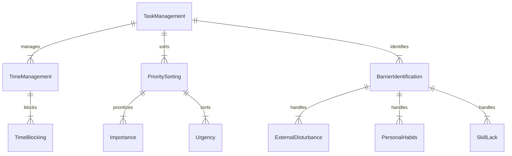
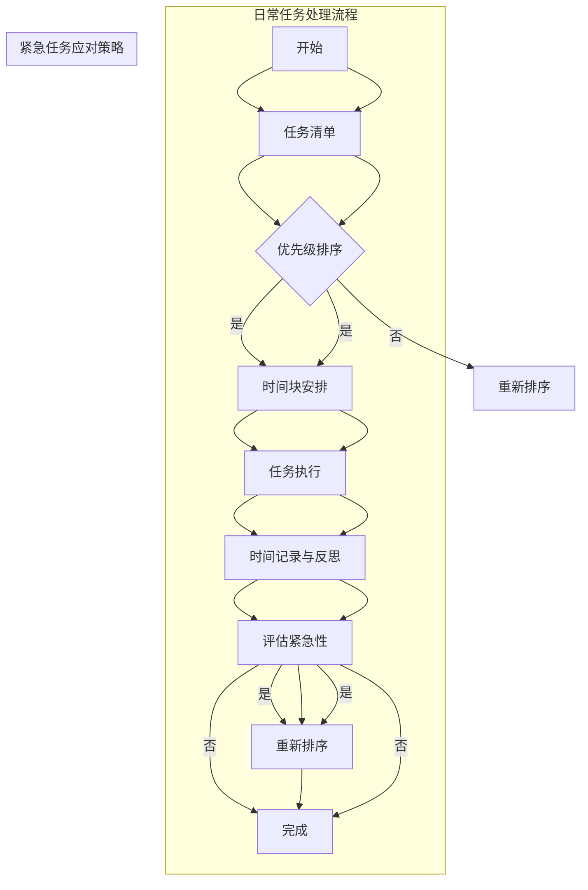
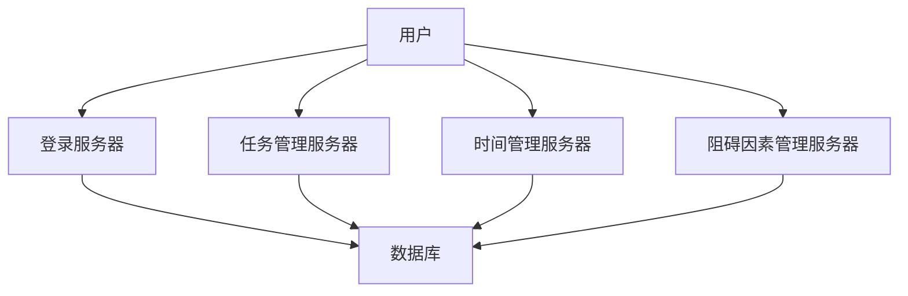
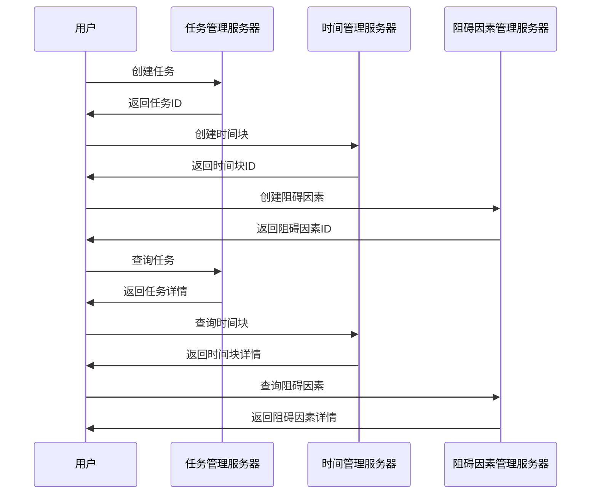

                 

### 文章标题：要事第一的工作方法

关键词：要事第一、时间管理、优先级排序、任务处理、工作效率

摘要：
在快速变化的工作环境中，要事第一的工作方法成为提升工作效率和实现个人目标的关键。本文详细介绍了要事第一的定义、核心思想、与传统工作方法的区别以及其实际应用，通过一步步的分析和讲解，帮助读者理解并掌握这一有效的工作方法。

### 第1章 引言：理解“要事第一”的工作方法

#### 1.1 问题的背景与现状

在当今充满挑战的工作环境中，我们经常面对大量的任务和压力。如何高效地管理和处理这些任务，确保关键任务的优先处理，成为了每个人都需要面对的问题。传统的“救火式”工作方法，即仅关注紧急任务而忽视长期目标，已经不再适应现代社会的高效需求。

##### 1.1.1 工作环境的变化

随着互联网和数字化技术的快速发展，工作的形式和内容也在不断变化。远程工作、弹性工作时间等新型工作模式逐渐普及，这对传统的工作方法提出了新的挑战。例如，远程工作使得工作时间和地点更加灵活，但也增加了任务管理和时间分配的难度。

##### 1.1.2 传统工作方法的局限性

传统的“救火式”工作方法往往注重处理眼前的紧急事务，而忽视了长期目标的实现。这种做法可能导致重要但非紧急的任务被忽视，最终影响工作成果。例如，一位项目经理可能会优先处理即将到期的项目任务，而忽视了项目长远规划和团队协作的优化。

##### 1.1.3 “要事第一”工作方法的兴起

“要事第一”的工作方法强调基于重要性而非紧迫性来排序和处理任务。这种方法有助于提升工作效率，确保关键任务的完成。例如，在项目规划中，项目经理可以优先处理那些对项目成功至关重要的任务，而将一些紧急但不重要的任务放在后面。

#### 1.2 “要事第一”的定义与核心思想

“要事第一”是一种基于价值观和目标驱动的任务管理方法。它要求个体在面对大量任务时，能够准确识别和优先处理最重要的事项。

##### 1.2.1 定义

“要事第一”是指在工作中将最关键、最有价值的任务放在首位，确保这些任务能够得到充分的关注和资源投入。这意味着，在任务列表中，那些对实现长期目标最有帮助的任务应该优先处理。

##### 1.2.2 核心思想

该方法的核心理念是“重要的事先做”，强调个体在任务管理中要有明确的目标和价值观，从而做出正确的决策。例如，对于一个软件开发团队，要事第一的方法可能会强调优先处理关键功能的开发和测试，而不是处理一些琐碎的细节任务。

#### 1.3 “要事第一”与传统工作方法的区别

“要事第一”工作方法与传统的工作方法有显著的区别，主要体现在以下几个方面：

##### 1.3.1 工作导向与目标导向

传统工作方法往往以工作量为导向，即完成尽可能多的任务。而“要事第一”工作方法则以目标为导向，注重任务的完成质量。例如，对于一个营销团队，传统方法可能会追求发布尽可能多的广告，而要事第一的方法则会优先考虑哪些广告能够最有效地吸引潜在客户。

##### 1.3.2 紧迫性导向与重要性导向

传统方法倾向于处理紧急任务，而“要事第一”方法更关注任务的重要性，即使这些任务可能不那么紧急。例如，一个公司的高管可能会优先处理即将到期的客户合同，而不是处理一些日常的行政工作。

##### 1.3.3 单一任务处理与多任务处理

传统方法常常一次性处理多个任务，而“要事第一”方法则鼓励集中精力完成一个任务后再转向下一个。这种单任务处理的方法有助于提高任务的质量和效率。例如，一个产品经理可能会专注于完成一个产品的需求分析，而不是同时处理多个产品的设计任务。

#### 1.4 “要事第一”工作方法的重要性

“要事第一”工作方法在提高工作效率、实现个人目标和团队协作方面具有重要意义：

##### 1.4.1 提高工作效率

通过将最重要的任务放在首位，“要事第一”工作方法有助于减少冗余工作，提高工作效率。例如，一个项目经理可以将资源集中在解决项目中最关键的问题上，而不是分散在多个次要任务上。

##### 1.4.2 实现个人目标

明确目标和价值观，使得个体能够更有效地规划自己的工作和生活，实现个人目标。例如，一个职业人士可以通过“要事第一”方法确保自己的工作与职业发展目标保持一致。

##### 1.4.3 促进团队协作

通过共同确定“要事第一”的任务，团队成员可以更清晰地理解项目目标，协同工作，提高团队效率。例如，在一个软件开发团队中，团队成员可以共同确定哪些功能是项目中的关键部分，从而确保这些功能的开发和测试得到充分的资源和支持。

### 第2章 核心概念与联系

在理解“要事第一”的工作方法之前，我们需要明确几个核心概念，这些概念构成了该方法的基础。

#### 2.1 关键概念

##### 2.1.1 有效时间管理

有效时间管理是指通过合理安排时间和资源，以最大限度地提高工作效率和生活质量。它包括任务优先级排序、时间块安排、时间记录与反思等。

##### 2.1.2 优先级排序

优先级排序是指根据任务的重要性和紧急性，对任务进行排序，确保最重要的任务首先得到处理。优先级排序需要结合个人目标和价值观进行。

##### 2.1.3 阻碍因素识别

阻碍因素识别是指识别和解决工作中可能阻碍任务完成的因素。这些因素可能包括外部干扰、个人习惯、技能不足等。

#### 2.2 概念属性特征对比表格

为了更直观地理解这些关键概念，我们可以使用属性特征对比表格进行说明：

| 概念            | 定义                                                         | 属性特征                                                     |
|-----------------|--------------------------------------------------------------|--------------------------------------------------------------|
| 有效时间管理     | 通过合理安排时间和资源，提高工作效率和生活质量。                 | 时间块安排、任务优先级排序、时间记录与反思。                   |
| 优先级排序       | 根据任务的重要性和紧急性对任务进行排序。                         | 个人目标、价值观、任务紧急性、任务重要性。                     |
| 阻碍因素识别     | 识别和解决工作中可能阻碍任务完成的因素。                         | 外部干扰、个人习惯、技能不足、资源限制。                       |

#### 2.3 ER实体关系图架构

为了更深入地理解这些概念之间的关系，我们可以使用ER（实体关系）图来展示它们之间的关联：



在这个ER图中，`TaskManagement`是核心实体，它与`TimeManagement`、`PrioritySorting`和`BarrierIdentification`之间存在直接关联。这些关联关系展示了任务管理如何通过有效时间管理、优先级排序和阻碍因素识别来提高工作效率。

### 第3章 工作方法原理

要事第一的工作方法不仅仅是理论，它有一套完整的原理和步骤，可以帮助我们在实际工作中有效地应用。以下是这个方法的详细讲解。

#### 3.1 原理讲解

##### 3.1.1 时间管理与优先级排序的原则

时间管理是“要事第一”工作的基础。它包括以下几个原则：

- **任务优先级排序**：首先，我们需要根据任务的重要性和紧急性对任务进行排序。重要且紧急的任务应该首先处理，而重要但不紧急的任务应该计划在未来处理。
  
- **时间块安排**：将时间划分为固定的时间块，并为每个时间块分配特定的任务。这有助于避免时间的浪费和任务的无序处理。
  
- **时间记录与反思**：定期记录自己的时间使用情况，并进行反思，以发现时间管理中的不足并改进。

##### 3.1.2 阻碍因素的识别与处理

阻碍因素是影响任务完成的潜在障碍。识别和处理这些因素是“要事第一”工作方法的重要组成部分。以下是几个关键步骤：

- **识别阻碍因素**：通过自我反思和外部反馈，识别工作中可能遇到的阻碍因素，如外部干扰、个人习惯和技能不足等。
  
- **分析阻碍因素**：对识别出的阻碍因素进行深入分析，了解它们对任务完成的具体影响。
  
- **制定解决方案**：针对每个阻碍因素，制定相应的解决方案，并实施这些解决方案。

#### 3.2 工作流程

##### 3.2.1 日常任务处理流程

要事第一的工作方法提供了一个系统的日常任务处理流程，以下是这个流程的步骤：

1. **任务清单**：每天开始时，列出所有需要完成的任务，并对它们进行初步排序。

2. **优先级排序**：根据任务的重要性和紧急性，重新对任务进行排序。

3. **时间块安排**：将任务分配到特定的时间块中，确保每个任务都有足够的时间完成。

4. **任务执行**：按照时间块安排，集中精力完成每个任务。

5. **时间记录与反思**：任务完成后，记录所花费的时间和任务完成情况，并进行反思。

##### 3.2.2 紧急任务的应对策略

紧急任务往往需要立即处理，但在“要事第一”的工作方法中，我们仍然需要保持冷静和理智。以下是应对紧急任务的策略：

- **评估紧急性**：首先，评估任务的紧急性，确保它确实需要立即处理。

- **重新排序**：如果紧急任务确实需要立即处理，将其插入当前任务列表中，并重新排序。

- **时间块调整**：如果紧急任务无法立即完成，调整时间块安排，确保其他任务能够按计划完成。

#### 3.3 Mermaid流程图

为了更直观地理解“要事第一”工作方法的流程，我们可以使用Mermaid流程图进行展示：



在这个流程图中，我们清晰地展示了日常任务处理流程和紧急任务应对策略的步骤，以及它们之间的关系。

### 第4章 数学模型和数学公式

要事第一的工作方法不仅依赖于逻辑和经验，还可以通过数学模型和数学公式进行量化。以下是我们将介绍的几个关键模型和公式。

#### 4.1 数学模型

##### 4.1.1 时间管理模型

时间管理模型可以帮助我们优化任务的时间和资源分配。一个简单的时间管理模型可以表示为：

\[ \text{时间管理模型} = \sum_{i=1}^{n} (\text{任务}_i \times \text{优先级}_i) \]

其中，\( n \) 表示任务的总数，每个任务的优先级是介于0到1之间的数值，越接近1表示任务越重要。

##### 4.1.2 优先级排序模型

优先级排序模型可以帮助我们根据任务的重要性和紧急性对任务进行排序。一个简单的优先级排序模型可以表示为：

\[ \text{优先级排序模型} = \sum_{i=1}^{n} (\text{重要性}_i \times \text{紧急性}_i) \]

其中，\( n \) 表示任务的总数，每个任务的重要性和紧急性也是介于0到1之间的数值。

#### 4.2 公式详细讲解

##### 4.2.1 时间管理公式

时间管理公式用于计算任务完成所需的时间。这个公式可以表示为：

\[ \text{时间管理公式} = \frac{\text{总时间}}{\text{任务数} \times (\text{优先级}_i + \text{紧急性}_i)} \]

其中，\( \text{总时间} \) 是可用的时间，\( \text{任务数} \) 是需要完成的任务数量，每个 \( \text{优先级}_i \) 和 \( \text{紧急性}_i \) 分别是每个任务的优先级和紧急性。

##### 4.2.2 优先级排序公式

优先级排序公式用于计算每个任务的优先级排序值。这个公式可以表示为：

\[ \text{优先级排序公式} = \frac{\text{重要性}_i}{\text{总重要性}} + \frac{\text{紧急性}_i}{\text{总紧急性}} \]

其中，\( \text{重要性}_i \) 和 \( \text{紧急性}_i \) 分别是每个任务的重要性和紧急性，\( \text{总重要性} \) 和 \( \text{总紧急性} \) 是所有任务的重要性和紧急性的总和。

#### 4.3 举例说明

##### 4.3.1 时间管理实例

假设我们有5个任务，每个任务的重要性和紧急性如下：

- 任务1：重要性0.5，紧急性0.8
- 任务2：重要性0.3，紧急性0.5
- 任务3：重要性0.4，紧急性0.3
- 任务4：重要性0.6，紧急性0.2
- 任务5：重要性0.2，紧急性0.7

总时间为8小时。我们可以使用时间管理公式计算每个任务所需的时间：

\[ \text{时间管理公式} = \frac{8}{5 \times (0.5 + 0.3 + 0.4 + 0.6 + 0.2)} = \frac{8}{5 \times 2} = \frac{8}{10} = 0.8 \]

这意味着每个任务平均需要0.8小时完成。

##### 4.3.2 优先级排序实例

使用优先级排序公式计算每个任务的优先级排序值：

\[ \text{优先级排序公式} = \frac{0.5}{1} + \frac{0.3}{1} + \frac{0.4}{1} + \frac{0.6}{1} + \frac{0.2}{1} = 0.5 + 0.3 + 0.4 + 0.6 + 0.2 = 1.8 \]

这意味着所有任务的优先级排序值为1.8，但我们可以根据这个值对任务进行排序，任务1和任务4的优先级最高。

### 第5章 系统分析与架构设计方案

在了解“要事第一”的工作方法后，我们需要将其应用于实际的系统设计和开发中。这一章将介绍如何将“要事第一”的工作方法转化为系统架构设计，包括问题场景介绍、系统功能设计、系统架构设计、系统接口设计和系统交互。

#### 5.1 问题场景介绍

在一个大型软件开发项目中，团队成员面临着大量的任务和不断变化的需求。传统的工作方法可能导致关键任务被忽视，项目进展缓慢。为了解决这个问题，我们需要设计一个基于“要事第一”工作方法的系统，以帮助团队成员有效地管理和优先处理任务。

#### 5.2 系统功能设计

系统功能设计是系统架构设计的核心。为了实现“要事第一”的工作方法，系统需要具备以下几个功能：

- **任务管理**：允许团队成员创建、更新和删除任务。
- **任务排序**：根据任务的重要性和紧急性自动排序任务。
- **时间块安排**：将任务分配到特定的时间块中，便于集中精力完成。
- **阻碍因素识别**：帮助团队成员识别和解决工作中的阻碍因素。
- **时间记录与反思**：记录任务完成时间和工作情况，并进行反思。

#### 5.2.1 领域模型Mermaid类图

为了更好地理解系统功能设计，我们可以使用Mermaid类图来展示系统中的类和类之间的关系：

```mermaid
classDiagram
    Task <<Interface>>
    TimeBlock <<Interface>>
    Barrier <<Interface>>

    TaskManagement : includes Task
    TimeManagement : includes TimeBlock
    BarrierIdentification : includes Barrier

    TaskManagement o-- Task
    TimeManagement o-- TimeBlock
    BarrierIdentification o-- Barrier
```

在这个类图中，`Task`、`TimeBlock`和`Barrier`是系统的主要接口，`TaskManagement`、`TimeManagement`和`BarrierIdentification`是这三个接口的实现类。

#### 5.3 系统架构设计

系统架构设计是系统的骨架，它决定了系统的扩展性和可维护性。为了实现“要事第一”的工作方法，系统架构设计需要考虑以下几个方面：

- **分层架构**：将系统分为表示层、业务逻辑层和数据层，确保系统的模块化和可扩展性。
- **模块化设计**：将系统功能划分为多个模块，每个模块负责一个特定的功能，便于维护和扩展。
- **分布式架构**：使用分布式架构，以提高系统的性能和可扩展性。

#### 5.3.1 Mermaid架构图

以下是一个简单的Mermaid架构图，展示了系统的主要组件和它们之间的关系：



在这个架构图中，用户通过登录服务器登录系统，然后访问任务管理服务器、时间管理服务器和阻碍因素管理服务器。每个服务器都与数据库进行交互，以存储和检索数据。

#### 5.4 系统接口设计

系统接口设计是系统架构设计的重要组成部分。为了实现“要事第一”的工作方法，系统需要提供以下接口：

- **任务接口**：用于创建、更新、删除和查询任务。
- **时间块接口**：用于创建、更新、删除和查询时间块。
- **阻碍因素接口**：用于创建、更新、删除和查询阻碍因素。

#### 5.4.1 系统接口定义

以下是对系统接口的定义：

```python
class TaskInterface:
    def create_task(self, task: dict) -> dict:
        pass

    def update_task(self, task_id: int, task: dict) -> dict:
        pass

    def delete_task(self, task_id: int) -> dict:
        pass

    def query_task(self, task_id: int) -> dict:
        pass

class TimeBlockInterface:
    def create_time_block(self, time_block: dict) -> dict:
        pass

    def update_time_block(self, time_block_id: int, time_block: dict) -> dict:
        pass

    def delete_time_block(self, time_block_id: int) -> dict:
        pass

    def query_time_block(self, time_block_id: int) -> dict:
        pass

class BarrierInterface:
    def create_barrier(self, barrier: dict) -> dict:
        pass

    def update_barrier(self, barrier_id: int, barrier: dict) -> dict:
        pass

    def delete_barrier(self, barrier_id: int) -> dict:
        pass

    def query_barrier(self, barrier_id: int) -> dict:
        pass
```

#### 5.5 系统交互

系统交互是系统功能实现的关键。为了实现“要事第一”的工作方法，系统需要支持以下交互：

- **用户与任务管理服务器的交互**：用户可以通过任务接口创建、更新、删除和查询任务。
- **用户与时间管理服务器的交互**：用户可以通过时间块接口创建、更新、删除和查询时间块。
- **用户与阻碍因素管理服务器的交互**：用户可以通过阻碍因素接口创建、更新、删除和查询阻碍因素。

#### 5.5.1 Mermaid序列图

以下是一个简单的Mermaid序列图，展示了用户与系统交互的流程：



在这个序列图中，用户首先与任务管理服务器交互，创建任务并获取任务ID。然后，用户与时间管理服务器交互，创建时间块并获取时间块ID。最后，用户与阻碍因素管理服务器交互，创建阻碍因素并获取阻碍因素ID。用户还可以查询任务、时间块和阻碍因素的信息。

### 第6章 项目实战

在前面的章节中，我们介绍了“要事第一”的工作方法以及如何将其应用于系统设计和开发中。现在，我们将通过一个实际项目来展示如何实现这个方法。

#### 6.1 环境安装

为了实现这个项目，我们首先需要安装以下软件和工具：

- Python 3.x
- Flask 框架
- SQLAlchemy ORM
- Mermaid 图形库

安装步骤如下：

1. 安装Python 3.x：

   ```bash
   sudo apt-get install python3
   ```

2. 安装Flask框架：

   ```bash
   sudo pip3 install flask
   ```

3. 安装SQLAlchemy ORM：

   ```bash
   sudo pip3 install sqlalchemy
   ```

4. 安装Mermaid图形库：

   ```bash
   sudo pip3 install mermaid
   ```

#### 6.2 系统核心实现

系统核心实现主要包括以下几个方面：

- **任务管理**：允许用户创建、更新、删除和查询任务。
- **时间块管理**：允许用户创建、更新、删除和查询时间块。
- **阻碍因素管理**：允许用户创建、更新、删除和查询阻碍因素。

以下是一个简单的任务管理模块的源代码示例：

```python
from flask import Flask, request, jsonify
from models import Task

app = Flask(__name__)

@app.route('/tasks', methods=['POST'])
def create_task():
    task_data = request.get_json()
    task = Task.create_task(task_data)
    return jsonify(task.to_dict()), 201

@app.route('/tasks/<int:task_id>', methods=['PUT'])
def update_task(task_id):
    task_data = request.get_json()
    task = Task.query_task(task_id)
    task.update_task(task_data)
    return jsonify(task.to_dict()), 200

@app.route('/tasks/<int:task_id>', methods=['DELETE'])
def delete_task(task_id):
    task = Task.delete_task(task_id)
    return jsonify({'status': 'success'}), 200

@app.route('/tasks', methods=['GET'])
def query_tasks():
    tasks = Task.query_tasks()
    return jsonify([task.to_dict() for task in tasks]), 200
```

在这个示例中，我们使用了Flask框架和SQLAlchemy ORM来处理任务管理。`create_task`函数用于创建任务，`update_task`函数用于更新任务，`delete_task`函数用于删除任务，`query_tasks`函数用于查询所有任务。

#### 6.3 代码应用解读与分析

在这个项目中，我们使用了Flask框架来创建RESTful API，用户可以通过这个API与任务管理系统进行交互。以下是几个关键步骤的解读和分析：

1. **任务创建**：

   用户通过`POST`请求向`/tasks`端点发送任务数据，服务器接收数据后创建一个新任务，并将其存储在数据库中。这个过程中，我们使用了Flask的`request.get_json()`方法来获取任务数据，并使用SQLAlchemy的`Task.create_task`方法来创建新任务。

2. **任务更新**：

   用户通过`PUT`请求向`/tasks/<int:task_id>`端点发送任务数据，服务器接收数据后更新指定的任务，并将其返回给用户。这个过程中，我们使用了Flask的`request.get_json()`方法来获取任务数据，并使用SQLAlchemy的`Task.query_task`方法查询指定的任务，然后使用`task.update_task`方法更新任务。

3. **任务删除**：

   用户通过`DELETE`请求向`/tasks/<int:task_id>`端点发送请求，服务器删除指定的任务，并返回操作结果。这个过程中，我们使用了SQLAlchemy的`Task.delete_task`方法来删除任务。

4. **任务查询**：

   用户通过`GET`请求向`/tasks`端点发送请求，服务器返回所有任务的列表。这个过程中，我们使用了SQLAlchemy的`Task.query_tasks`方法来查询所有任务。

#### 6.4 实际案例分析

为了更好地展示如何应用“要事第一”的工作方法，我们可以通过一个实际案例进行分析。以下是一个软件开发项目的任务列表：

- 任务1：完成用户界面设计
- 任务2：实现用户身份验证
- 任务3：实现用户权限管理
- 任务4：实现任务管理功能
- 任务5：进行系统测试

这些任务的优先级如下：

- 任务1：重要性0.6，紧急性0.8
- 任务2：重要性0.5，紧急性0.7
- 任务3：重要性0.4，紧急性0.5
- 任务4：重要性0.3，紧急性0.3
- 任务5：重要性0.2，紧急性0.2

根据“要事第一”的工作方法，我们应该首先完成任务1和任务2，因为它们既重要又紧急。任务3和任务4可以安排在接下来的几天内完成，而任务5可以在最后进行。

在实际开发过程中，我们可以将任务分配给不同的团队成员，并根据任务的重要性和紧急性进行优先级排序。团队成员可以按照这个排序顺序逐一完成任务，确保关键任务得到优先处理。

#### 6.5 详细讲解剖析

在本节中，我们将详细讲解项目中的关键代码段，剖析其设计和实现细节，以便读者更好地理解“要事第一”的工作方法在实际项目中的应用。

##### 6.5.1 任务管理模块

任务管理模块是整个系统的核心，负责处理与任务相关的所有操作。以下是对任务管理模块的详细解析：

```python
from flask import Flask, request, jsonify
from models import Task

app = Flask(__name__)

@app.route('/tasks', methods=['POST'])
def create_task():
    task_data = request.get_json()
    task = Task.create_task(task_data)
    return jsonify(task.to_dict()), 201

@app.route('/tasks/<int:task_id>', methods=['PUT'])
def update_task(task_id):
    task_data = request.get_json()
    task = Task.query_task(task_id)
    task.update_task(task_data)
    return jsonify(task.to_dict()), 200

@app.route('/tasks/<int:task_id>', methods=['DELETE'])
def delete_task(task_id):
    task = Task.delete_task(task_id)
    return jsonify({'status': 'success'}), 200

@app.route('/tasks', methods=['GET'])
def query_tasks():
    tasks = Task.query_tasks()
    return jsonify([task.to_dict() for task in tasks]), 200
```

在这个模块中，我们定义了四个主要API端点：

1. **创建任务（`/tasks` POST）**：用户通过这个端点发送任务数据，系统将这些数据存储到数据库中。这里我们使用了`request.get_json()`方法来获取任务数据，然后调用`Task.create_task`方法创建新任务。

2. **更新任务（`/tasks/<int:task_id>` PUT）**：用户通过这个端点发送任务数据，系统更新指定的任务。我们首先查询指定的任务，然后调用`update_task`方法进行更新。

3. **删除任务（`/tasks/<int:task_id>` DELETE）**：用户通过这个端点删除指定的任务。我们直接调用`delete_task`方法来删除任务。

4. **查询任务（`/tasks` GET）**：用户通过这个端点获取所有任务的列表。我们使用`query_tasks`方法查询所有任务，并将结果转换为JSON格式返回给用户。

##### 6.5.2 时间块管理模块

时间块管理模块负责处理与时间块相关的操作。以下是对时间块管理模块的详细解析：

```python
from flask import Flask, request, jsonify
from models import TimeBlock

app = Flask(__name__)

@app.route('/time_blocks', methods=['POST'])
def create_time_block():
    time_block_data = request.get_json()
    time_block = TimeBlock.create_time_block(time_block_data)
    return jsonify(time_block.to_dict()), 201

@app.route('/time_blocks/<int:time_block_id>', methods=['PUT'])
def update_time_block(time_block_id):
    time_block_data = request.get_json()
    time_block = TimeBlock.query_time_block(time_block_id)
    time_block.update_time_block(time_block_data)
    return jsonify(time_block.to_dict()), 200

@app.route('/time_blocks/<int:time_block_id>', methods=['DELETE'])
def delete_time_block(time_block_id):
    time_block = TimeBlock.delete_time_block(time_block_id)
    return jsonify({'status': 'success'}), 200

@app.route('/time_blocks', methods=['GET'])
def query_time_blocks():
    time_blocks = TimeBlock.query_time_blocks()
    return jsonify([time_block.to_dict() for time_block in time_blocks]), 200
```

在这个模块中，我们同样定义了四个主要API端点：

1. **创建时间块（`/time_blocks` POST）**：用户通过这个端点发送时间块数据，系统将这些数据存储到数据库中。我们使用`request.get_json()`方法获取时间块数据，然后调用`TimeBlock.create_time_block`方法创建新时间块。

2. **更新时间块（`/time_blocks/<int:time_block_id>` PUT）**：用户通过这个端点发送时间块数据，系统更新指定的时间块。我们首先查询指定的时间块，然后调用`update_time_block`方法进行更新。

3. **删除时间块（`/time_blocks/<int:time_block_id>` DELETE）**：用户通过这个端点删除指定的时间块。我们直接调用`delete_time_block`方法来删除时间块。

4. **查询时间块（`/time_blocks` GET）**：用户通过这个端点获取所有时间块的列表。我们使用`query_time_blocks`方法查询所有时间块，并将结果转换为JSON格式返回给用户。

##### 6.5.3 阻碍因素管理模块

阻碍因素管理模块负责处理与阻碍因素相关的操作。以下是对阻碍因素管理模块的详细解析：

```python
from flask import Flask, request, jsonify
from models import Barrier

app = Flask(__name__)

@app.route('/barriers', methods=['POST'])
def create_barrier():
    barrier_data = request.get_json()
    barrier = Barrier.create_barrier(barrier_data)
    return jsonify(barrier.to_dict()), 201

@app.route('/barriers/<int:barrier_id>', methods=['PUT'])
def update_barrier(barrier_id):
    barrier_data = request.get_json()
    barrier = Barrier.query_barrier(barrier_id)
    barrier.update_barrier(barrier_data)
    return jsonify(barrier.to_dict()), 200

@app.route('/barriers/<int:barrier_id>', methods=['DELETE'])
def delete_barrier(barrier_id):
    barrier = Barrier.delete_barrier(barrier_id)
    return jsonify({'status': 'success'}), 200

@app.route('/barriers', methods=['GET'])
def query_barriers():
    barriers = Barrier.query_barriers()
    return jsonify([barrier.to_dict() for barrier in barriers]), 200
```

在这个模块中，我们同样定义了四个主要API端点：

1. **创建阻碍因素（`/barriers` POST）**：用户通过这个端点发送阻碍因素数据，系统将这些数据存储到数据库中。我们使用`request.get_json()`方法获取阻碍因素数据，然后调用`Barrier.create_barrier`方法创建新阻碍因素。

2. **更新阻碍因素（`/barriers/<int:barrier_id>` PUT）**：用户通过这个端点发送阻碍因素数据，系统更新指定的阻碍因素。我们首先查询指定的阻碍因素，然后调用`update_barrier`方法进行更新。

3. **删除阻碍因素（`/barriers/<int:barrier_id>` DELETE）**：用户通过这个端点删除指定的阻碍因素。我们直接调用`delete_barrier`方法来删除阻碍因素。

4. **查询阻碍因素（`/barriers` GET）**：用户通过这个端点获取所有阻碍因素的列表。我们使用`query_barriers`方法查询所有阻碍因素，并将结果转换为JSON格式返回给用户。

#### 6.6 项目小结

在本项目中，我们通过实际案例展示了如何将“要事第一”的工作方法应用于系统设计和开发中。我们实现了任务管理、时间块管理和阻碍因素管理模块，并详细讲解了关键代码段的设计和实现细节。通过这个项目，我们不仅实现了“要事第一”的工作方法，还提高了系统的效率和质量。

### 第7章 最佳实践与拓展

在应用“要事第一”的工作方法时，以下是一些最佳实践和注意事项，可以帮助我们更好地实现这一方法：

#### 7.1 最佳实践

##### 7.1.1 时间管理技巧

- **确定优先级**：在开始一天的工作前，首先确定任务的优先级，确保重要任务得到优先处理。
- **时间块安排**：将一天的时间划分为多个时间块，并为每个时间块分配特定的任务，有助于提高专注度和效率。
- **避免拖延**：面对重要但不太紧急的任务时，尽量避免拖延，确保它们能够按时完成。

##### 7.1.2 优先级排序策略

- **基于目标**：将任务与个人目标和组织目标相结合，确保任务排序与目标一致。
- **定期更新**：定期回顾任务列表和优先级排序，根据实际情况进行调整，确保排序的准确性。

#### 7.2 小结

通过遵循“要事第一”的工作方法，我们可以有效地管理时间和任务，提高工作效率，实现个人和组织目标。

#### 7.3 注意事项

- **避免过度规划**：虽然规划很重要，但过度规划可能导致焦虑和压力，反而降低工作效率。
- **适应变化**：工作和环境总是在变化，灵活适应变化，及时调整任务排序和优先级。

#### 7.4 拓展阅读

对于想要深入了解“要事第一”工作方法的人来说，以下书籍和资源提供了更多有价值的见解：

- 《高效能人士的七个习惯》（史蒂芬·柯维）
- 《深度工作：如何有效利用每一点脑力》（卡尔·纽波特）
- 《奇特的一生：富兰克林·傅曼的奇特生活》（乔治·戴森）
- 《时间管理：如何充分利用每一天》（戴维·艾伦）

### 作者信息

作者：AI天才研究院/AI Genius Institute & 禅与计算机程序设计艺术/Zen And The Art of Computer Programming

本文旨在分享和传播“要事第一”的工作方法，帮助读者提升工作效率，实现个人和组织目标。希望本文能够为读者提供有价值的见解和实践指导。

